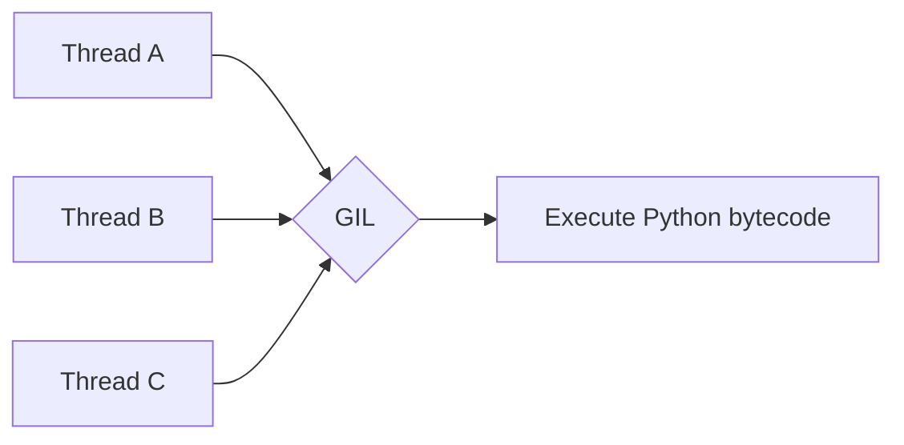
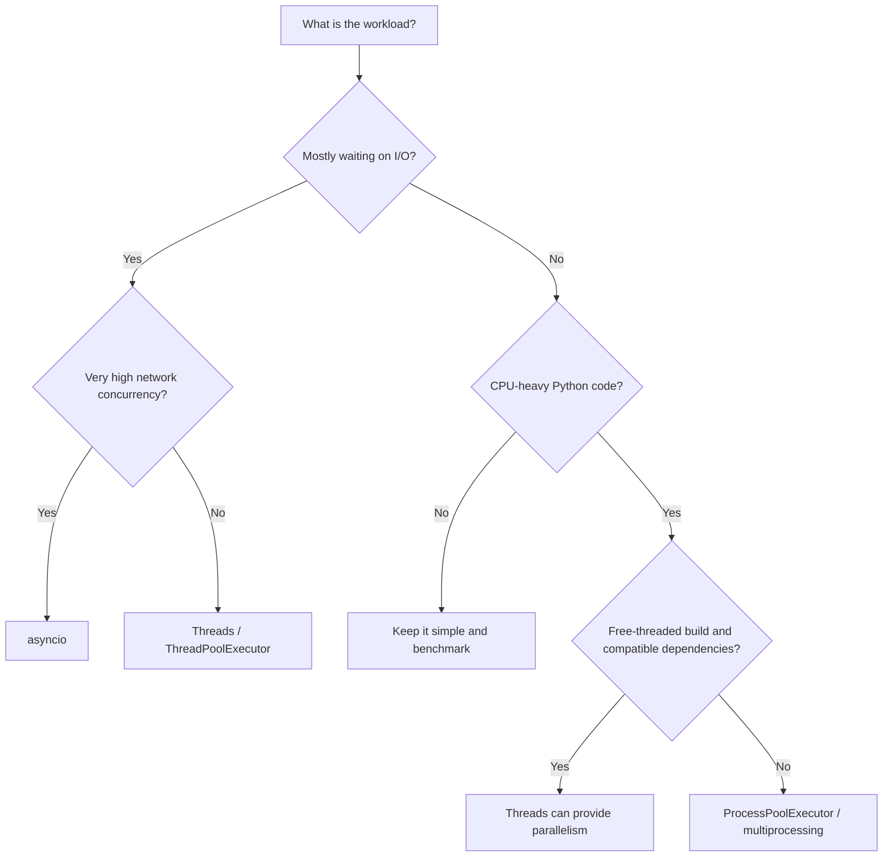

# GIL (Global Interpreter Lock)

> The **Global Interpreter Lock (GIL)** is a CPython mechanism that allows only one thread to execute Python bytecode at a time in the normal GIL-enabled build.

The GIL is an important concept when choosing between **threads, processes, and async programming**. It mainly affects **CPU-bound Python code running in threads**.

> **Current status (August 2026):** Python 3.14 is the current stable feature series. Free-threaded CPython is officially supported in Python 3.14, but it is still an **optional build**; the normal CPython build continues to use the GIL by default.

---

## Index

1. [Overview](#1-overview)
2. [How the GIL Works](#2-how-the-gil-works)
3. [Why CPython Uses the GIL](#3-why-cpython-uses-the-gil)
4. [GIL with I/O-Bound and CPU-Bound Work](#4-gil-with-io-bound-and-cpu-bound-work)
5. [GIL and Thread Safety](#5-gil-and-thread-safety)
6. [Free-Threaded Python](#6-free-threaded-python)
7. [Choosing the Right Concurrency Model](#7-choosing-the-right-concurrency-model)
8. [Practical Example](#8-practical-example)
9. [Key Takeaways](#9-key-takeaways)
10. [References](#10-references)

---

# 1. Overview

Python supports several concurrency models:

| Approach | Best suited for | GIL impact |
|---|---|---|
| `threading` / `ThreadPoolExecutor` | I/O-bound work | Affected in normal CPython |
| `asyncio` | Large numbers of I/O operations | Usually runs on one event-loop thread |
| `multiprocessing` / `ProcessPoolExecutor` | CPU-bound Python work | Separate processes avoid one shared GIL |
| `InterpreterPoolExecutor` | Isolated parallel tasks | Separate interpreters can run in parallel |
| Free-threaded CPython | Thread-based parallel execution | GIL can be disabled |

The practical rule for normal CPython is:

> **I/O-bound work → threads or asyncio**  
> **CPU-bound pure-Python work → processes**

---

# 2. How the GIL Works

Suppose one Python process contains three threads:



In a normal GIL-enabled CPython interpreter:

1. A thread acquires the GIL.
2. It executes Python bytecode.
3. CPython eventually allows another thread to run.
4. Blocking operations such as I/O release the GIL so another thread can make progress.

Conceptually:

```text
Time ---------------------------------------------------->

Thread A: [Python] [I/O wait........] [Python]
Thread B: [wait..] [Python] [I/O wait........]
```

The threads are **concurrent**, but Python bytecode is not normally executing in parallel across multiple cores.

### Important distinction

**Concurrency** means tasks make progress during overlapping periods.

**Parallelism** means tasks execute at the same instant, usually on different CPU cores.

The normal CPython GIL allows thread concurrency but limits parallel execution of Python bytecode.

---

# 3. Why CPython Uses the GIL

The GIL is mainly a **CPython implementation detail**, not a rule of the Python language.

Historically, it simplified important interpreter responsibilities such as:

- Protecting CPython's object model from unsafe concurrent access.
- Managing internal interpreter state.
- Supporting CPython's reference-counting memory-management model.
- Providing a simpler synchronization model for many C extensions.

The trade-off is straightforward:


This is why adding more threads does not automatically make CPU-heavy Python code faster.

---

# 4. GIL with I/O-Bound and CPU-Bound Work

## 4.1 I/O-Bound Work

I/O-bound applications spend much of their time waiting for external operations such as:

- HTTP APIs
- Database queries
- Files
- Sockets
- Cloud services

During blocking I/O, CPython releases the GIL. Other threads can therefore execute while one thread is waiting.

That is why threads remain useful for common backend workloads such as calling multiple APIs or processing independent database/network operations.

## 4.2 CPU-Bound Work

CPU-bound work spends most of its time executing calculations in Python.

Examples:

- Large pure-Python loops
- Data transformation implemented in Python
- Encryption or compression implemented directly in Python
- Mathematical calculations without optimized native libraries

In the normal GIL-enabled build, multiple Python threads compete for the same GIL, so they usually **do not provide multi-core speed-up** for this type of work.

For CPU-heavy pure-Python work, `ProcessPoolExecutor` or `multiprocessing` is usually a better choice.

## 4.3 Native Libraries Are Different

The GIL mainly limits **Python bytecode**.

Native extensions can release the GIL while performing work that does not require Python objects. Because of this, some operations in libraries such as NumPy, compression libraries, cryptography libraries, or database drivers can execute in parallel.

Do not assume that every library releases the GIL. **Benchmark the actual workload.**

---

# 5. GIL and Thread Safety

A very important point is:

> **The GIL does not make your application thread-safe.**

The GIL protects CPython internals, but a business operation can contain multiple steps.

For example:

```text
Read balance
     ↓
Check balance >= amount
     ↓
Subtract amount
     ↓
Save new balance
```

Another thread may run between these logical steps.

When multiple threads modify shared state, protect the complete operation with synchronization such as:

```python
with balance_lock:
    if balance >= amount:
        balance -= amount
```

Common synchronization tools include:

- `threading.Lock`
- `threading.RLock`
- `threading.Semaphore`
- `threading.Event`
- `threading.Condition`
- `queue.Queue`

Do not rely on an operation being atomic unless Python explicitly documents that guarantee.

---

# 6. Free-Threaded Python

## 6.1 Python 3.13 and 3.14

Python 3.13 introduced an **experimental free-threaded CPython build** where the GIL can be disabled.

Python 3.14 moved free-threaded CPython to **officially supported status**, but it remains optional rather than the default build.

With free threading:

```text
Thread A ─────────► CPU Core 1
Thread B ─────────► CPU Core 2
Thread C ─────────► CPU Core 3
```

Multiple threads can execute Python code in parallel.

## 6.2 Check Whether the GIL Is Enabled

On supported recent CPython versions:

```python
import sys

print(sys._is_gil_enabled())
```

A free-threaded build can also be identified using:

```python
sysconfig.get_config_var("Py_GIL_DISABLED")
```

## 6.3 Free Threading Does Not Remove Locks

Free threading does **not** mean shared mutable state is automatically safe.

Application-level synchronization is still required when multiple threads modify related data.

## 6.4 Dependency Compatibility

Some C-extension packages may not yet support free threading fully. Importing an incompatible extension can cause the GIL to be re-enabled at runtime.

Before adopting free-threaded Python in production, verify:

- Dependency support
- Thread safety
- CPU improvement
- Memory usage
- Single-thread performance
- Deployment/runtime compatibility

---

# 7. Choosing the Right Concurrency Model

Use the workload—not the number of tasks—to choose the model.



### Practical selection

| Situation | Preferred approach |
|---|---|
| Calling several APIs | `ThreadPoolExecutor` |
| Thousands of network connections | `asyncio` |
| CPU-heavy pure-Python calculation | `ProcessPoolExecutor` |
| CPU work inside a native library | Benchmark threads and processes |
| Free-threaded CPython with compatible dependencies | Threads may use multiple cores |
| Need isolated interpreters in Python 3.14+ | `InterpreterPoolExecutor` |

---

# 8. Practical Example

Assume a backend service needs to fetch three independent user profiles from external APIs.

```python
from concurrent.futures import ThreadPoolExecutor
from time import perf_counter, sleep


def fetch_user(user_id: int) -> str:
    # Simulates waiting for an HTTP API.
    sleep(2)
    return f"User {user_id}"


def main() -> None:
    user_ids = [1, 2, 3]
    started_at = perf_counter()

    with ThreadPoolExecutor(max_workers=3) as executor:
        users = list(executor.map(fetch_user, user_ids))

    print(users)
    print(f"Completed in {perf_counter() - started_at:.2f}s")


if __name__ == "__main__":
    main()
```

Sequential execution would take roughly:

```text
2s + 2s + 2s ≈ 6s
```

With three threads, the waits overlap:

```text
Thread 1: [API wait ----------------]
Thread 2: [API wait ----------------]
Thread 3: [API wait ----------------]

Total ≈ 2s
```

The GIL does not prevent this improvement because the workload spends most of its time waiting rather than executing Python bytecode.

If `fetch_user()` were replaced by a CPU-heavy pure-Python calculation, the same thread pool would normally not scale across CPU cores in a standard GIL-enabled CPython build. In that case, a process pool is usually the better choice.

---

# 9. Key Takeaways

- The GIL is a **CPython implementation mechanism**.
- In normal CPython, only one thread executes Python bytecode at a time.
- Threads are still effective for **I/O-bound workloads**.
- CPU-bound pure-Python threading normally does not scale across cores.
- Use **processes** for CPU-heavy Python work when using the normal GIL-enabled build.
- Native extensions may release the GIL and achieve parallel execution.
- The GIL does **not** make compound application operations thread-safe.
- Use explicit locks or thread-safe communication primitives for shared mutable state.
- Python 3.14 officially supports optional **free-threaded CPython**, but it is not yet the default.
- Choose concurrency based on the real bottleneck and benchmark production-like workloads.

---

# 10. References

- [Python Glossary — Global Interpreter Lock](https://docs.python.org/3/glossary.html#term-global-interpreter-lock)
- [Python `threading` Documentation](https://docs.python.org/3/library/threading.html)
- [Python Free-Threading Guide](https://docs.python.org/3/howto/free-threading-python.html)
- [Python `concurrent.futures` Documentation](https://docs.python.org/3/library/concurrent.futures.html)
- [PEP 703 — Making the Global Interpreter Lock Optional](https://peps.python.org/pep-0703/)
- [PEP 779 — Supported Status for Free-Threaded Python](https://peps.python.org/pep-0779/)
