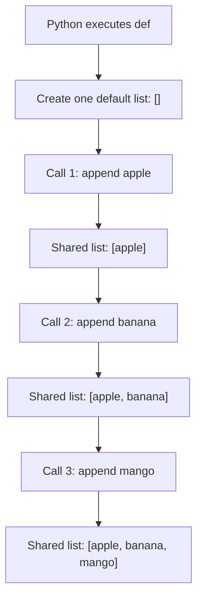
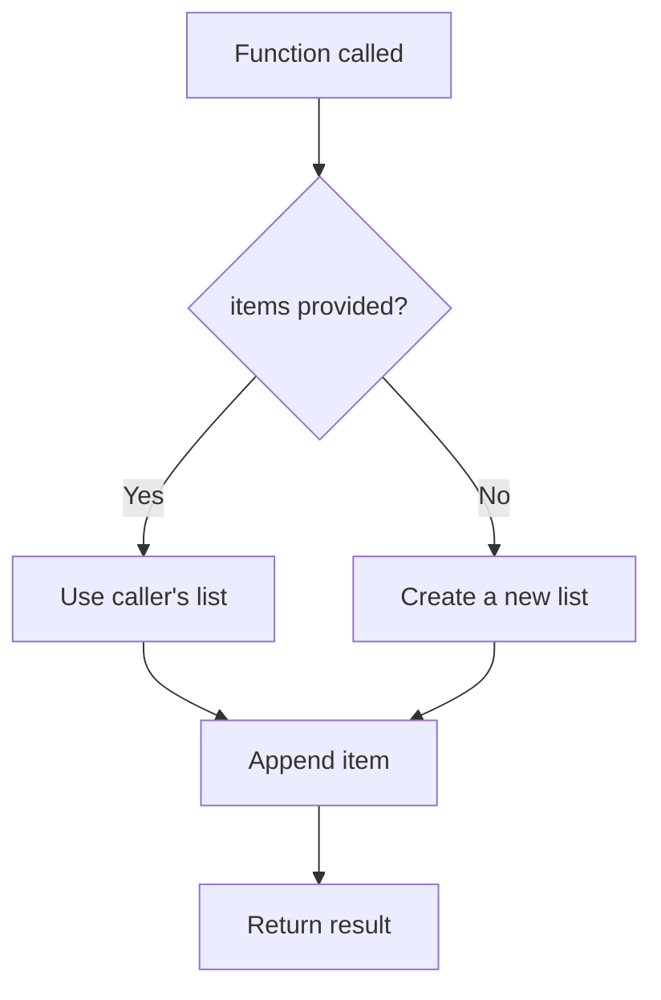
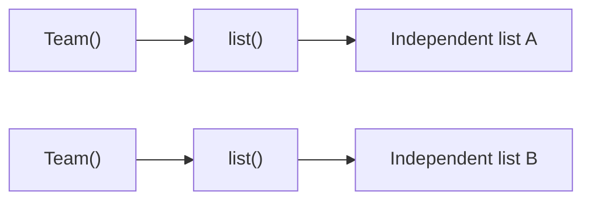

# Mutable Default Arguments in Python

Mutable default arguments are an important Python behavior to understand because they can create **shared state between function calls**.

The core rule is simple:

> Python evaluates a default argument **once when the function is defined**, not every time the function is called.

If the default value is mutable—such as a `list`, `dict`, `set`, or a mutable class instance—and the function modifies it, the modified object is reused by later calls that omit that argument.

---

## 1. How Default Arguments Work

Consider a normal immutable default:

```python
def greet(name: str = "Guest") -> str:
    return f"Hello, {name}!"
```

When Python executes this `def` statement, it evaluates the default value `"Guest"` and stores it with the function.

Later calls reuse that stored default:

```text
Function definition
        |
        v
Default value evaluated once
        |
        v
Stored with function object
        |
        v
Used whenever caller omits the argument
```

This behavior is usually harmless with immutable values such as strings, integers, booleans, and `None`.

The problem becomes visible when the stored object can be changed in place.

---

## 2. Why Mutable Defaults Cause Shared State

A list is mutable, so this function does **not** create a new empty list for every call:

```python
def add_item(item: str, items: list[str] = []) -> list[str]:
    items.append(item)
    return items
```

Calling it multiple times produces:

```python
print(add_item("apple"))
print(add_item("banana"))
print(add_item("mango"))
```

Output:

```text
['apple']
['apple', 'banana']
['apple', 'banana', 'mango']
```

All three calls use the same list because `[]` was created only once when Python executed the function definition.

### Execution Flow



This is commonly called the **mutable default argument bug**, although it is defined Python behavior rather than an interpreter error.

---

## 3. Correct Pattern: Use `None`

When a function needs a fresh mutable object for each call, use `None` as the default and create the object inside the function.

```python
def add_item(
    item: str,
    items: list[str] | None = None,
) -> list[str]:
    if items is None:
        items = []

    items.append(item)
    return items
```

Now:

```python
print(add_item("apple"))   # ['apple']
print(add_item("banana"))  # ['banana']
print(add_item("mango"))   # ['mango']
```

Each call that omits `items` receives a new list.

### Correct Flow



---

## 4. Why `is None` Is Important

Use:

```python
if items is None:
    items = []
```

rather than:

```python
if not items:
    items = []
```

`if not items` treats every falsy value as missing. An empty list passed intentionally by the caller is also falsy.

Using `is None` clearly means:

> Create a new list only when the caller did not provide one.

That keeps the function behavior predictable.

---

## 5. The Rule Applies Beyond Lists

The issue is not specific to `list`. It applies to any default expression whose resulting object can be changed.

| Type | Avoid as a shared default | Preferred pattern |
|---|---|---|
| List | `items=[]` | `items=None` |
| Dictionary | `options={}` | `options=None` |
| Set | `permissions=set()` | `permissions=None` |
| Mutable class instance | `context=RequestContext()` | `context=None` |

The same evaluation rule also affects expressions that are not mutable.

For example:

```python
from datetime import datetime

def create_event(created_at: datetime = datetime.now()) -> datetime:
    return created_at
```

`datetime.now()` runs when the function is defined, so calls that omit `created_at` reuse the same timestamp.

A fresh runtime value should instead be created inside the function:

```python
def create_event(created_at: datetime | None = None) -> datetime:
    if created_at is None:
        created_at = datetime.now()

    return created_at
```

So the deeper concept is **default-expression evaluation timing**, not only mutability.

---

## 6. Mutable Defaults in Dataclasses

Dataclass fields need the same idea: each object should normally receive its own mutable collection.

Use `field(default_factory=...)`:

```python
from dataclasses import dataclass, field

@dataclass
class Team:
    members: list[str] = field(default_factory=list)
```

Each `Team()` instance now receives a separately created list.



The same approach works with other mutable types:

```python
field(default_factory=dict)
field(default_factory=set)
```

Use a lambda when the initial value itself needs content:

```python
field(default_factory=lambda: [1, 2, 3])
```

---

## 7. Practical Development Impact

This behavior matters especially in long-running applications such as Django, FastAPI, workers, and background services.

A function may be called thousands of times inside the same process. If request-specific data is stored in a shared mutable default, later calls can unexpectedly receive data left behind by earlier calls.

For application code, a good default rule is:

```text
Need a fresh mutable value per call?
        |
       Yes
        |
        v
Use None as the function default
        |
        v
Create the list/dict/set/object inside the function
```

Also decide separately whether a function is allowed to mutate a collection supplied by its caller. Avoiding a shared default does **not** automatically prevent mutation of caller-owned data.

---

## 8. When Shared State Is Intentional

Technically, a mutable default can be used deliberately as persistent state, such as a cache.

However, explicit alternatives are usually clearer. For memoization, prefer tools such as:

```python
from functools import cache
```

Explicit caching is easier to understand, test, reset, and maintain than hidden state stored in a function's default argument.

---

## 9. Best-Practice Summary

- Default argument expressions are evaluated **once when the function is defined**.
- Avoid mutable defaults such as `[]`, `{}`, `set()`, or mutable class instances when each call should be independent.
- Use `None` and create the mutable object inside the function.
- Check with `is None`, not a general falsy check.
- Use `field(default_factory=...)` for mutable dataclass fields.
- Remember that expressions such as `datetime.now()` are also evaluated only once when used directly as defaults.
- Treat mutation of caller-provided objects as a separate API-design decision.
- Prefer explicit caching mechanisms when shared state is intentional.

### Mental Model

```text
Default value in function signature
            |
            v
Evaluated when def executes
            |
            v
Stored with the function
            |
            v
Reused on later calls
            |
      Mutable object?
        /       \
      No         Yes
      |           |
Usually safe   Mutation persists
                  |
                  v
          Use None + create inside
```
