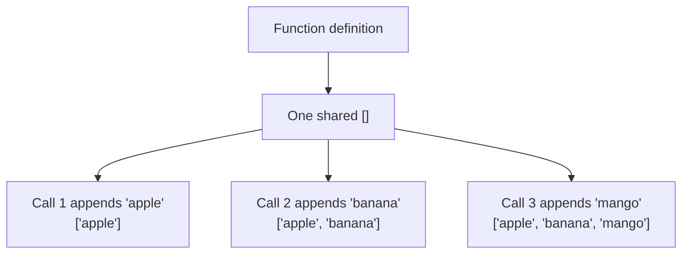
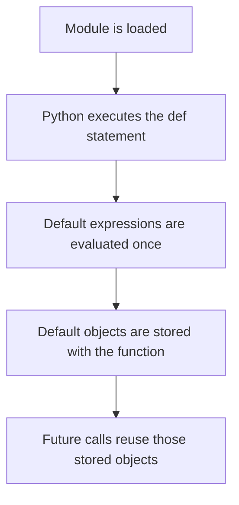
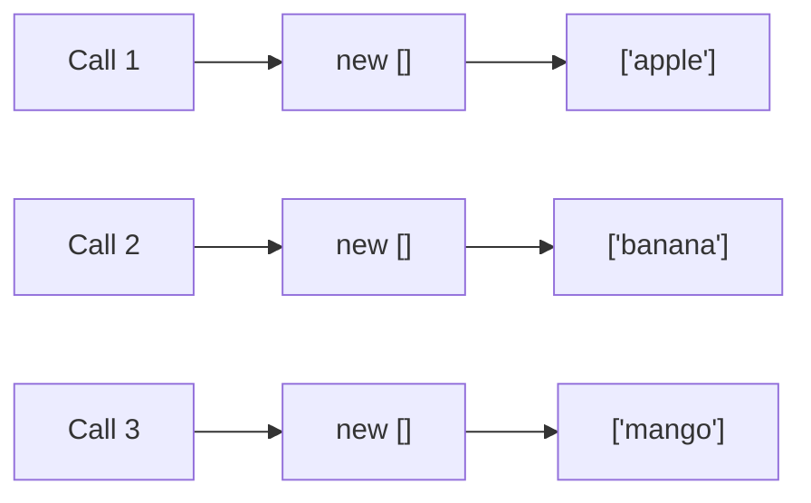
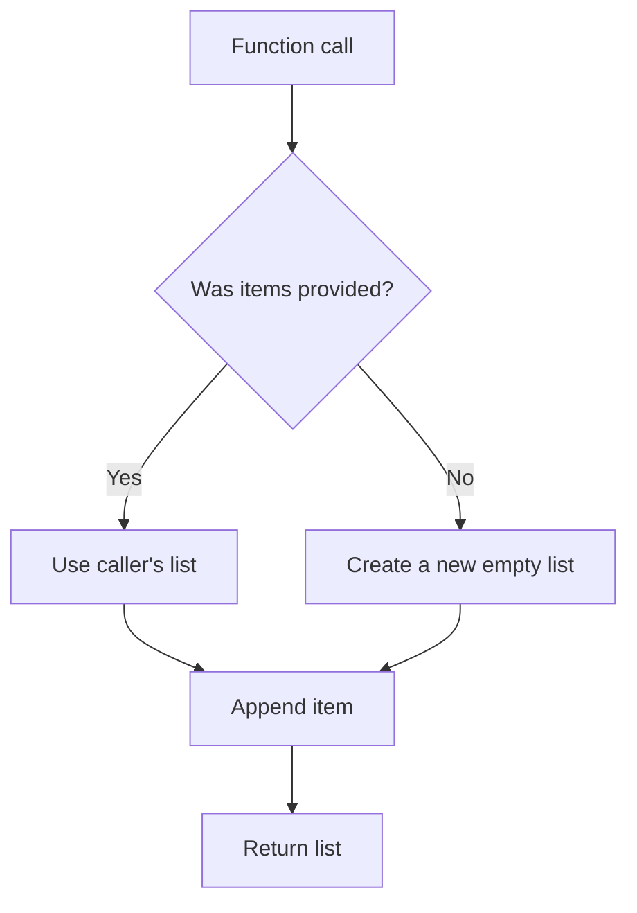
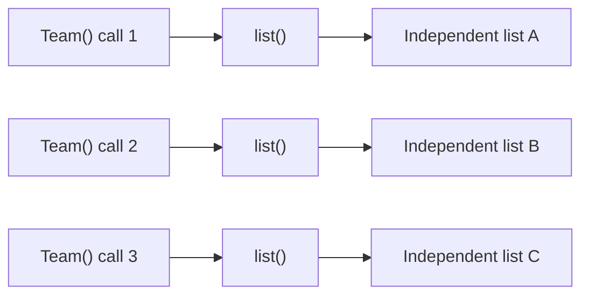

# The Mutable Default Argument Bug (`def f(x=[])`)

> In Python, a default argument is created **once when the function is defined**, not every time the function is called. If that default object is mutable and the function changes it, later calls reuse the already-modified object.

## In short

- Python evaluates a default expression once, while it executes the `def` statement, not on each call.
- The resulting object is stored with the function and is visible through `function.__defaults__`.
- Every call that omits the argument receives that same object, so an `append` or a key assignment persists into later calls.
- The fix is an immutable sentinel: declare `items: list[str] | None = None` and create the fresh list inside the function body.
- Branch on `if items is None`, not on `if not items`, so an empty list the caller genuinely passed is still used.
- For dataclass fields use `field(default_factory=list)`, which calls the factory separately for each instance.
- The rule is about evaluation timing rather than mutability alone: `datetime.now()` as a default freezes one timestamp at definition time.



**Interview answer:** `def f(x=[])` evaluates that `[]` exactly once, when Python executes the `def` statement, and stores the resulting list with the function object. Every later call that omits `x` is handed that same list, so whatever the body appended is still there on the next call — the calls are unintentionally sharing one object. It is not an interpreter defect but a consequence of Python's defined function semantics, and the fix is to default to `None` and create the list inside the body.

**Gotcha:** Replacing `if items is None` with `if not items`. It looks equivalent, but it also discards an empty list the caller deliberately supplied, so the caller's own object never receives the item.

---

## 1. What Is a Default Argument?

A default argument provides a value that Python uses when the caller does not pass that argument.

```python
def greet(name: str = "Guest") -> str:
    return f"Hello, {name}!"

print(greet("Avadh"))  # Hello, Avadh!
print(greet())          # Hello, Guest!
```

Here, the string `"Guest"` is the default value of `name`.

Default arguments make parameters optional, but their evaluation timing is important:



---

## 2. What Is the Mutable Default Argument Bug?

Consider this function:

```python
def add_item(item: str, items: list[str] = []) -> list[str]:
    items.append(item)
    return items
```

A developer may expect every call without `items` to start with a new empty list.

```python
print(add_item("apple"))
print(add_item("banana"))
print(add_item("mango"))
```

Actual output:

```text
['apple']
['apple', 'banana']
['apple', 'banana', 'mango']
```

The calls are unintentionally sharing the same list.

### Expected Mental Model



Actual Python behaviour is the diagram in **In short**: one list is created at the function definition and all three calls append to it.

This behaviour is commonly called the **mutable default argument bug**, although it is a consequence of Python's defined function semantics rather than an interpreter defect.

---

## 3. Why Does It Happen?

Python evaluates default argument expressions when it executes the function definition, so the `[]` in `def add_item(item: str, items: list[str] = [])` runs once, at that moment.

Conceptually, Python behaves approximately like this:

```python
shared_default = []

def add_item(item: str, items: list[str] = shared_default):
    items.append(item)
    return items
```

The function keeps a reference to that default object.

### Inspecting the Stored Default

Positional default values are available through `function.__defaults__`.

```python
def add_item(item: str, items: list[str] = []) -> list[str]:
    items.append(item)
    return items

print(add_item.__defaults__)
# ([],)

add_item("apple")
print(add_item.__defaults__)
# (['apple'],)
```

The list inside `__defaults__` changes because it is the same list used by calls that omit `items`.

### Object Identity Demonstration

```python
def collect(value: int, values: list[int] = []) -> tuple[list[int], int]:
    values.append(value)
    return values, id(values)

first_values, first_id = collect(10)
second_values, second_id = collect(20)

print(first_values)           # [10, 20]
print(second_values)          # [10, 20]
print(first_id == second_id)  # True
```

Both calls receive the same list object.

---

## 4. Correct Solution Using `None`

Use an immutable sentinel such as `None`, then create the mutable object inside the function.

```python
def add_item(
    item: str,
    items: list[str] | None = None,
) -> list[str]:
    if items is None:
        items = []

    items.append(item)
    return items
```

Now every omitted-argument call creates a separate list:

```python
print(add_item("apple"))   # ['apple']
print(add_item("banana"))  # ['banana']
print(add_item("mango"))   # ['mango']
```

### Correct Execution Flow



### Why Use `is None`?

Use identity comparison — `if items is None: items = []` — rather than the general falsy check `if not items: items = []`.

The second version treats all falsy values as missing, including a valid empty list supplied by the caller.

```python
def add_item(item: str, items: list[str] | None = None) -> list[str]:
    if items is None:
        items = []

    items.append(item)
    return items

existing: list[str] = []
result = add_item("apple", existing)

print(result is existing)  # True
```

The caller's list is respected because only `None` means “not provided.”

---

## 5. Mutable vs Immutable Defaults

### Mutable Objects

A mutable object can be changed after it is created.

Common mutable types include:

- `list`
- `dict`
- `set`
- Most custom class instances
- Some third-party container objects

For example, `numbers = [1, 2]` followed by `numbers.append(3)` leaves `numbers` as `[1, 2, 3]` — the same object, changed in place.

### Immutable Objects

An immutable object's value cannot be changed after creation.

Common immutable types include:

- `None`
- `bool`
- `int`
- `float`
- `str`
- `bytes`
- `frozenset`
- Tuples containing only immutable objects

Writing `name = "Python"` and then `name = name + " 3"` creates a new string and rebinds `name`; it does not modify the original string.

### Safe Default Examples

```python
def connect(timeout: int = 30) -> None:
    ...

def create_user(role: str = "viewer") -> None:
    ...

def is_enabled(active: bool = True) -> bool:
    return active

def process(limit: int | None = None) -> None:
    ...
```

### Important Tuple Detail

A tuple is immutable, but it can contain a mutable object.

```python
mutable_list: list[int] = []
container = (mutable_list,)

mutable_list.append(1)
print(container)  # ([1],)
```

The tuple cannot be structurally changed, but the list inside it can still be modified.

---

## 6. Common Mutable Default Cases

### 6.1 List Default

Incorrect:

```python
def register_user(
    username: str,
    users: list[str] = [],
) -> list[str]:
    users.append(username)
    return users
```

Correct:

```python
def register_user(
    username: str,
    users: list[str] | None = None,
) -> list[str]:
    if users is None:
        users = []

    users.append(username)
    return users
```

### 6.2 Every Other Mutable Type Follows the Same Rule

Nothing about the fix changes with the type. Only the value the sentinel branch creates is different:

| Parameter | Incorrect default | Correct default | Created when `None` |
| --- | --- | --- | --- |
| `users: list[str]` | `= []` | `= None` | `users = []` |
| `metadata: dict[str, str]` | `= {}` | `= None` | `metadata = {}` |
| `permissions: set[str]` | `= set()` | `= None` | `permissions = set()` |
| `context: RequestContext` | `= RequestContext()` | `= None` | `context = RequestContext()` |

The last row matters most, because the issue is not limited to built-in containers. A class constructor in a default runs once at definition time too, so every call that omits the argument shares one instance.

```python
class RequestContext:
    def __init__(self) -> None:
        self.logs: list[str] = []

# Incorrect: one RequestContext is shared by every call.
def handle_request(
    message: str,
    context: RequestContext = RequestContext(),
) -> list[str]:
    context.logs.append(message)
    return context.logs

# Correct: a new RequestContext per call that omits the argument.
def handle_request(
    message: str,
    context: RequestContext | None = None,
) -> list[str]:
    if context is None:
        context = RequestContext()

    context.logs.append(message)
    return context.logs
```

---

## 7. Type-Hinted Functions

For modern Python, express the optional sentinel explicitly in the type annotation.

```python
def normalize_tags(tags: list[str] | None = None) -> list[str]:
    if tags is None:
        tags = []

    return [tag.strip().lower() for tag in tags]
```

For codebases supporting Python versions before 3.10:

```python
from typing import Optional

def normalize_tags(
    tags: Optional[list[str]] = None,
) -> list[str]:
    if tags is None:
        tags = []

    return [tag.strip().lower() for tag in tags]
```

### Preserving Caller Data

Sometimes a function should not mutate a list supplied by its caller. Create a copy before modification.

```python
def add_default_role(
    roles: list[str] | None = None,
) -> list[str]:
    result = list(roles) if roles is not None else []
    result.append("viewer")
    return result

original = ["editor"]
updated = add_default_role(original)

print(original)  # ['editor']
print(updated)   # ['editor', 'viewer']
```

This handles two separate concerns:

1. Avoiding a shared default object.
2. Avoiding mutation of caller-owned data.

---

## 8. Dataclasses and `default_factory`

The same shared-state concept matters when defining mutable fields in dataclasses.

Incorrect idea:

```python
from dataclasses import dataclass

@dataclass
class Team:
    members: list[str] = []
```

Modern Python dataclasses reject common unhashable mutable defaults rather than silently allowing this pattern.

Use `field(default_factory=...)`:

```python
from dataclasses import dataclass, field

@dataclass
class Team:
    members: list[str] = field(default_factory=list)
```

The factory is called separately for each instance.

```python
backend = Team()
frontend = Team()

backend.members.append("Alice")

print(backend.members)   # ['Alice']
print(frontend.members)  # []
```

### How `default_factory` Works



For a dictionary or set:

```python
from dataclasses import dataclass, field

@dataclass
class UserSession:
    attributes: dict[str, str] = field(default_factory=dict)
    permissions: set[str] = field(default_factory=set)
```

Use a lambda when the initial value needs content:

```python
from dataclasses import dataclass, field

@dataclass
class Configuration:
    retries: list[int] = field(default_factory=lambda: [1, 2, 3])
```

Each instance receives a new `[1, 2, 3]` list.

---

## 9. When Shared Mutable Defaults Are Intentional

A mutable default can sometimes be used intentionally to preserve state between calls.

```python
def fibonacci(
    number: int,
    cache: dict[int, int] = {0: 0, 1: 1},
) -> int:
    if number not in cache:
        cache[number] = fibonacci(number - 1, cache) + fibonacci(
            number - 2,
            cache,
        )

    return cache[number]
```

Here, the dictionary acts as a persistent memoization cache.

However, this design is usually less explicit than alternatives such as `functools.cache`:

```python
from functools import cache

@cache
def fibonacci(number: int) -> int:
    if number < 2:
        return number

    return fibonacci(number - 1) + fibonacci(number - 2)
```

### Why Explicit Alternatives Are Usually Better

An intentional mutable default can still create problems:

- Hidden state is attached to the function.
- Tests may depend on earlier calls.
- Memory can grow unexpectedly.
- Resetting the state is not obvious.
- Concurrent code may access shared state.
- Readers may assume the code contains an accidental bug.

Use an intentional mutable default only when the shared behaviour is clearly documented and controlled.

---

## 10. Practical Development Examples

The bug is especially risky in server applications such as Django or FastAPI, because the function may run for many requests within the same long-lived process, and data from one request can remain in the list used by later requests.

### 10.1 Recursive Tree Traversal

Incorrect:

```python
def collect_names(
    node: dict[str, object],
    names: list[str] = [],
) -> list[str]:
    names.append(str(node["name"]))

    for child in node.get("children", []):
        collect_names(child, names)

    return names
```

Separate top-level traversals can share old results.

Correct:

```python
def collect_names(
    node: dict[str, object],
    names: list[str] | None = None,
) -> list[str]:
    if names is None:
        names = []

    names.append(str(node["name"]))

    children = node.get("children", [])
    for child in children:
        if isinstance(child, dict):
            collect_names(child, names)

    return names
```

The same list is intentionally passed through one recursive operation, while separate top-level calls start with new lists.

### 10.2 Batch Processing Options

Incorrect:

```python
def process_batch(
    records: list[dict[str, object]],
    options: dict[str, object] = {},
) -> None:
    options.setdefault("validate", True)
    ...
```

Correct:

```python
def process_batch(
    records: list[dict[str, object]],
    options: dict[str, object] | None = None,
) -> None:
    effective_options = {
        "validate": True,
        **(options or {}),
    }

    ...
```

This version builds a new configuration dictionary and avoids mutating the caller's dictionary.

---

## 11. How to Detect and Test the Problem

### 11.1 Call the Function More Than Once

A single test call may not expose the bug.

```python
def append_value(value: int, values: list[int] = []) -> list[int]:
    values.append(value)
    return values

def test_calls_are_independent() -> None:
    first = append_value(1)
    second = append_value(2)

    assert first == [1]
    assert second == [2]
```

This test fails because the second call reuses the first call's list.

Correct implementation:

```python
def append_value(
    value: int,
    values: list[int] | None = None,
) -> list[int]:
    if values is None:
        values = []

    values.append(value)
    return values
```

### 11.2 Check Object Identity

```python
def create_values(values: list[int] | None = None) -> list[int]:
    if values is None:
        values = []

    return values

first = create_values()
second = create_values()

assert first is not second
```

### 11.3 Use Static Analysis

Common Python linters can identify mutable defaults. For example:

- Ruff rule `B006`
- Flake8 Bugbear rule `B006`
- Pylint warning `dangerous-default-value`

Static analysis is valuable because the problematic function may look correct during code review and may fail only after repeated calls.

---

## 12. Best Practices

### 12.1 Use `None` for Optional Mutable Inputs

```python
def function(values: list[str] | None = None) -> list[str]:
    if values is None:
        values = []

    return values
```

### 12.2 Use `default_factory` for Dataclass Fields

```python
from dataclasses import dataclass, field

@dataclass
class Report:
    sections: list[str] = field(default_factory=list)
```

### 12.3 Decide Whether Caller Data May Be Mutated

Mutating the supplied collection:

```python
def add_role(role: str, roles: list[str]) -> None:
    roles.append(role)
```

Returning a new collection:

```python
def with_role(role: str, roles: list[str]) -> list[str]:
    return [*roles, role]
```

Both designs can be valid, but the function contract should make the behaviour clear.

### 12.4 Prefer Simple Function Interfaces

Do not add an accumulator parameter unless callers genuinely need it.

Instead of:

```python
def transform(
    records: list[str],
    output: list[str] | None = None,
) -> list[str]:
    if output is None:
        output = []

    output.extend(record.upper() for record in records)
    return output
```

Prefer:

```python
def transform(records: list[str]) -> list[str]:
    return [record.upper() for record in records]
```

### 12.5 Review All Default Expressions, Not Only `[]`

Potentially dangerous defaults include:

```python
def f1(values=[]): ...
def f2(mapping={}): ...
def f3(flags=set()): ...
def f4(context=CustomContext()): ...
```

Safer pattern:

```python
def f1(values=None): ...
def f2(mapping=None): ...
def f3(flags=None): ...
def f4(context=None): ...
```

### 12.6 Remember That Evaluation Timing Affects More Than Mutability

Any default expression is evaluated when the function is defined.

```python
from datetime import datetime

def create_event(created_at: datetime = datetime.now()) -> datetime:
    return created_at
```

This does not produce a fresh timestamp for every call. It reuses the timestamp created when the `def` statement ran.

Correct:

```python
from datetime import datetime

def create_event(created_at: datetime | None = None) -> datetime:
    if created_at is None:
        created_at = datetime.now()

    return created_at
```

This is related to the same evaluation rule, even though `datetime` objects are immutable.

### 12.7 Quick Reference

Avoid:

```python
def add_item(item: str, items: list[str] = []) -> list[str]:
    items.append(item)
    return items
```

Prefer:

```python
def add_item(
    item: str,
    items: list[str] | None = None,
) -> list[str]:
    if items is None:
        items = []

    items.append(item)
    return items
```

Dataclass:

```python
from dataclasses import dataclass, field

@dataclass
class Cart:
    items: list[str] = field(default_factory=list)
```

---

## Official References

- [Python Tutorial: Default Argument Values](https://docs.python.org/3/tutorial/controlflow.html#default-argument-values)
- [Python Programming FAQ: Shared Default Values](https://docs.python.org/3/faq/programming.html#why-are-default-values-shared-between-objects)
- [Python Language Reference: Function Definitions](https://docs.python.org/3/reference/compound_stmts.html#function-definitions)
- [Python `dataclasses` Documentation](https://docs.python.org/3/library/dataclasses.html)
