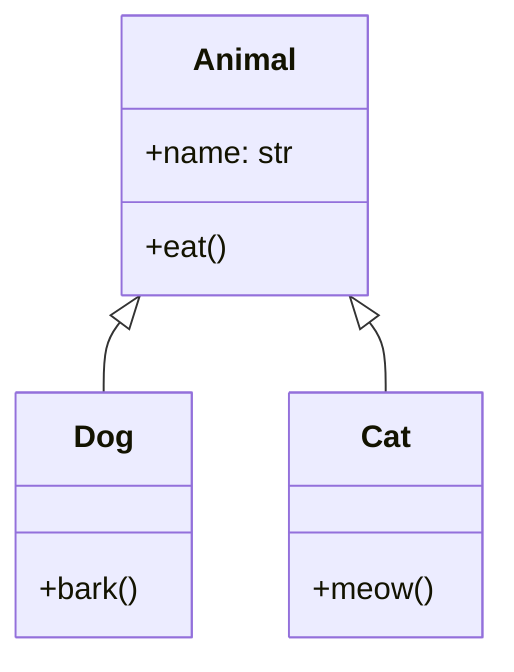
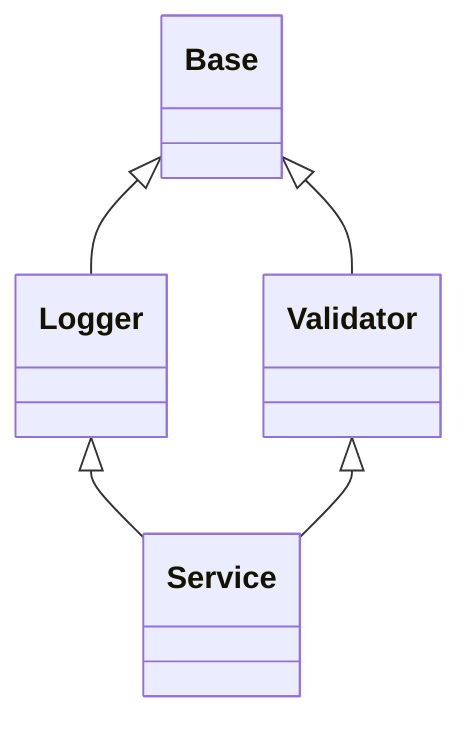
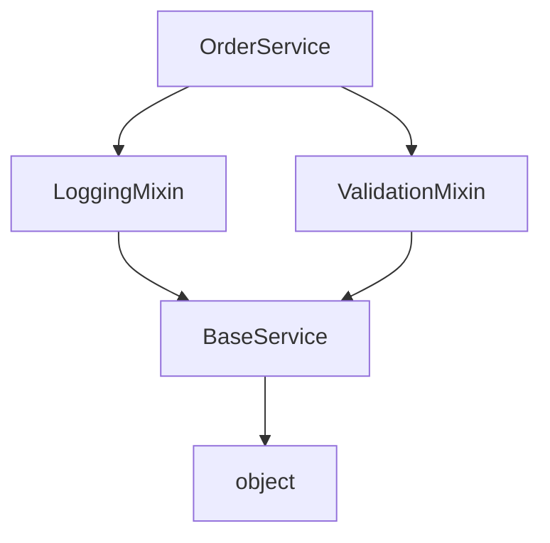

# OOP: Inheritance, MRO, `super()`

> **Core idea:** Inheritance lets a class reuse and extend another class.  
> The **MRO** defines the exact order Python follows while searching for attributes and methods.  
> `super()` continues that search from the **next class in the MRO**—not necessarily from the direct parent.

---

## Index

1. [Mental Model](#1-mental-model)
2. [Inheritance](#2-inheritance)
   - [Single Inheritance](#21-single-inheritance)
   - [Method Overriding](#22-method-overriding)
   - [Extending Parent Behaviour](#23-extending-parent-behaviour)
3. [`super()`](#3-super)
   - [What `super()` Really Means](#31-what-super-really-means)
   - [`super()` in `__init__`](#32-super-in-__init__)
   - [Why Direct Parent Calls Are Fragile](#33-why-direct-parent-calls-are-fragile)
4. [Method Resolution Order](#4-method-resolution-order)
   - [How Python Resolves a Method](#41-how-python-resolves-a-method)
   - [Inspecting the MRO](#42-inspecting-the-mro)
   - [C3 Linearization](#43-c3-linearization)
5. [Multiple Inheritance](#5-multiple-inheritance)
6. [Diamond Inheritance](#6-diamond-inheritance)
7. [Cooperative Multiple Inheritance](#7-cooperative-multiple-inheritance)
8. [Mixins](#8-mixins)
9. [Practical Design Guidance](#9-practical-design-guidance)
10. [Key Takeaways](#10-key-takeaways)

---

# 1. Mental Model

Consider the following class hierarchy:



- `Animal` is the **base class**, **parent class**, or **superclass**.
- `Dog` and `Cat` are **derived classes**, **child classes**, or **subclasses**.
- A subclass automatically receives accessible attributes and methods from its base class.
- A subclass can:
  - use inherited behaviour as-is,
  - override inherited behaviour,
  - extend inherited behaviour,
  - add new behaviour.

A useful relationship test is:

> **Inheritance models an “is-a” relationship.**

Examples:

- A `Dog` **is an** `Animal`.
- An `AdminUser` **is a** `User`.
- A `CreditCardPayment` **is a** `PaymentMethod`.

Inheritance is usually inappropriate for a “has-a” relationship:

- An `Order` **has a** `PaymentMethod`.
- A `Car` **has an** `Engine`.

A “has-a” relationship is normally modelled with **composition**.

---

# 2. Inheritance

## 2.1 Single Inheritance

Single inheritance means that one subclass directly inherits from one base class.

```python
class User:
    def __init__(self, username: str) -> None:
        self.username = username

    def get_permissions(self) -> list[str]:
        return ["read"]


class AdminUser(User):
    def delete_user(self, user_id: int) -> str:
        return f"User {user_id} deleted"


admin = AdminUser("avadh")

print(admin.username)
print(admin.get_permissions())
print(admin.delete_user(101))
```

Output:

```text
avadh
['read']
User 101 deleted
```

`AdminUser` does not define `username` or `get_permissions()`, but it inherits both from `User`.

### Attribute lookup

When Python evaluates:

```python
admin.get_permissions()
```

it searches approximately like this:

```text
AdminUser
    ↓ not found
User
    ↓ found
get_permissions()
```

In a real class hierarchy, Python uses the class's complete **MRO** for this search.

---

## 2.2 Method Overriding

A subclass can provide its own implementation of a method inherited from a base class.

```python
class Notification:
    def send(self, message: str) -> str:
        return f"Sending generic notification: {message}"


class EmailNotification(Notification):
    def send(self, message: str) -> str:
        return f"Sending email: {message}"


notification = EmailNotification()
print(notification.send("Deployment completed"))
```

Output:

```text
Sending email: Deployment completed
```

Python finds `EmailNotification.send()` before `Notification.send()`, so the subclass implementation is used.

### Runtime polymorphism

The calling code can work with the base type while the actual object decides which implementation runs:

```python
class SMSNotification(Notification):
    def send(self, message: str) -> str:
        return f"Sending SMS: {message}"


def notify(channel: Notification, message: str) -> None:
    print(channel.send(message))


notify(EmailNotification(), "Build passed")
notify(SMSNotification(), "Server restarted")
```

Output:

```text
Sending email: Build passed
Sending SMS: Server restarted
```

This is a common use of inheritance: expose one stable interface and provide different implementations.

---

## 2.3 Extending Parent Behaviour

Sometimes a subclass should keep the inherited behaviour and add something around it.

```python
class APIClient:
    def request(self, endpoint: str) -> str:
        return f"Request sent to {endpoint}"


class AuthenticatedAPIClient(APIClient):
    def request(self, endpoint: str) -> str:
        print("Adding authentication header")
        response = super().request(endpoint)
        return response


client = AuthenticatedAPIClient()
print(client.request("/users"))
```

Output:

```text
Adding authentication header
Request sent to /users
```

The subclass performs additional work and then delegates the remaining work through `super()`.

---

# 3. `super()`

## 3.1 What `super()` Really Means

A common simplified explanation is:

> `super()` calls the parent class.

That explanation is sufficient only for simple single inheritance.

The more accurate definition is:

> `super()` returns a proxy that continues attribute lookup from the class immediately after the current class in the object's MRO.

Therefore:

```python
super().method()
```

means:

```text
Find the current class in the MRO
            ↓
Move to the next class
            ↓
Search for method from there
```

It does **not** mean:

```text
Always call my direct parent
```

This difference becomes important in multiple inheritance, where the next class may be a sibling class.

### Simplified equivalence

Inside an ordinary instance method:

```python
super().process()
```

is conceptually similar to:

```python
super(CurrentClass, self).process()
```

The zero-argument form is preferred in modern Python because it is shorter and easier to maintain.

---

## 3.2 `super()` in `__init__`

A subclass commonly calls `super().__init__()` to initialize the inherited part of the object.

```python
class Employee:
    def __init__(self, employee_id: int, name: str) -> None:
        self.employee_id = employee_id
        self.name = name


class Developer(Employee):
    def __init__(
        self,
        employee_id: int,
        name: str,
        primary_language: str,
    ) -> None:
        super().__init__(employee_id, name)
        self.primary_language = primary_language


developer = Developer(
    employee_id=101,
    name="Aarav",
    primary_language="Python",
)

print(developer.__dict__)
```

Output:

```text
{
    'employee_id': 101,
    'name': 'Aarav',
    'primary_language': 'Python'
}
```

Object initialization happens in two logical stages:

```text
Developer.__init__()
        |
        +--> Employee.__init__()
        |       |
        |       +--> employee_id
        |       +--> name
        |
        +--> primary_language
```

Calling `super().__init__()` is not automatically required by Python. It is required when the next implementation in the MRO performs initialization that the object needs.

---

## 3.3 Why Direct Parent Calls Are Fragile

This code works in a simple hierarchy:

```python
class Developer(Employee):
    def __init__(
        self,
        employee_id: int,
        name: str,
        primary_language: str,
    ) -> None:
        Employee.__init__(self, employee_id, name)
        self.primary_language = primary_language
```

However, directly naming `Employee` creates tight coupling.

Problems include:

1. Renaming or replacing the base class requires changing method bodies.
2. The call does not cooperate with multiple inheritance.
3. A class may be called more than once in a diamond hierarchy.
4. The normal MRO chain can be skipped.

Prefer:

```python
super().__init__(employee_id, name)
```

Direct base-class calls are occasionally useful when deliberately bypassing cooperative dispatch, but that should be an explicit design decision.

---

# 4. Method Resolution Order

The **Method Resolution Order**, or **MRO**, is the ordered sequence of classes Python searches when resolving an attribute.

Despite its name, the MRO applies to both:

- methods,
- other class attributes.

## 4.1 How Python Resolves a Method

```python
class Base:
    role = "base"

    def execute(self) -> str:
        return "Base.execute"


class Child(Base):
    pass


child = Child()
print(child.execute())
print(child.role)
```

Python searches:

```text
Child → Base → object
```

Because `Child` does not define `execute` or `role`, Python finds them in `Base`.

The MRO includes the class itself and normally ends with `object`.

---

## 4.2 Inspecting the MRO

Python provides two common ways to inspect it:

```python
print(Child.mro())
print(Child.__mro__)
```

Example result:

```text
[<class '__main__.Child'>, <class '__main__.Base'>, <class 'object'>]
```

A cleaner display:

```python
print(" -> ".join(cls.__name__ for cls in Child.mro()))
```

Output:

```text
Child -> Base -> object
```

Use MRO inspection when:

- debugging an unexpected overridden method,
- working with framework base classes,
- using multiple inheritance,
- building or reviewing mixins,
- understanding where `super()` will continue.

---

## 4.3 C3 Linearization

Python computes the MRO using the **C3 linearization algorithm**.

For normal development, you rarely calculate C3 manually. What matters is understanding the guarantees it provides.

### C3 preserves these rules

#### 1. Child before parent

A subclass is searched before its base classes.

```text
Child → Parent
```

#### 2. Declared base-class order

For:

```python
class Service(Logger, Validator):
    ...
```

Python attempts to preserve:

```text
Logger before Validator
```

#### 3. Each class appears once

Even when several paths reach the same ancestor, that ancestor appears only once in the final MRO.

#### 4. Monotonicity

If one class precedes another in a parent class's MRO, subclassing it does not reverse that established order.

These rules make multiple inheritance predictable and prevent the same ancestor from being visited repeatedly.

Python raises `TypeError` when it cannot construct a consistent MRO.

---

# 5. Multiple Inheritance

Multiple inheritance means that a class directly inherits from more than one base class.

```python
class JSONSerializer:
    def serialize(self, data: dict) -> str:
        return f"JSON: {data}"


class AuditLogger:
    def log(self, action: str) -> None:
        print(f"AUDIT: {action}")


class UserService(JSONSerializer, AuditLogger):
    def create_user(self, user: dict) -> str:
        self.log("Creating user")
        return self.serialize(user)


service = UserService()
print(service.create_user({"id": 1, "name": "Aarav"}))
```

Output:

```text
AUDIT: Creating user
JSON: {'id': 1, 'name': 'Aarav'}
```

MRO:

```python
print(" -> ".join(cls.__name__ for cls in UserService.mro()))
```

```text
UserService -> JSONSerializer -> AuditLogger -> object
```

The order of base classes matters:

```python
class UserService(JSONSerializer, AuditLogger):
    ...
```

and:

```python
class UserService(AuditLogger, JSONSerializer):
    ...
```

produce different MROs.

### Method conflict example

```python
class JSONFormatter:
    def format(self) -> str:
        return "JSON"


class XMLFormatter:
    def format(self) -> str:
        return "XML"


class Report(JSONFormatter, XMLFormatter):
    pass


print(Report().format())
print(" -> ".join(cls.__name__ for cls in Report.mro()))
```

Output:

```text
JSON
Report -> JSONFormatter -> XMLFormatter -> object
```

`JSONFormatter.format()` wins because `JSONFormatter` appears before `XMLFormatter` in the MRO.

---

# 6. Diamond Inheritance

Diamond inheritance occurs when two classes inherit from the same base class and another class inherits from both.



Equivalent Python structure:

```python
class Base:
    pass


class Logger(Base):
    pass


class Validator(Base):
    pass


class Service(Logger, Validator):
    pass
```

The hierarchy creates two paths from `Service` to `Base`:

```text
Service → Logger → Base
Service → Validator → Base
```

Python's C3 MRO merges those paths into one predictable order:

```python
print(" -> ".join(cls.__name__ for cls in Service.mro()))
```

Output:

```text
Service -> Logger -> Validator -> Base -> object
```

Notice that `Base` appears only once.

---

# 7. Cooperative Multiple Inheritance

Cooperative multiple inheritance means that each class:

1. performs its own work,
2. calls `super()`,
3. allows the next class in the MRO to continue the operation.

Consider this hierarchy:



Implementation:

```python
class BaseService:
    def process(self, order_id: int) -> None:
        print(f"BaseService: processing order {order_id}")


class ValidationMixin(BaseService):
    def process(self, order_id: int) -> None:
        print("ValidationMixin: validating order")
        super().process(order_id)


class LoggingMixin(BaseService):
    def process(self, order_id: int) -> None:
        print("LoggingMixin: writing audit log")
        super().process(order_id)


class OrderService(LoggingMixin, ValidationMixin):
    def process(self, order_id: int) -> None:
        print("OrderService: starting")
        super().process(order_id)


service = OrderService()

print(" -> ".join(cls.__name__ for cls in OrderService.mro()))
service.process(501)
```

Output:

```text
OrderService -> LoggingMixin -> ValidationMixin -> BaseService -> object
OrderService: starting
LoggingMixin: writing audit log
ValidationMixin: validating order
BaseService: processing order 501
```

### What actually happens

```text
OrderService.process()
        ↓ super()
LoggingMixin.process()
        ↓ super()
ValidationMixin.process()
        ↓ super()
BaseService.process()
```

Inside `LoggingMixin`, this call:

```python
super().process(order_id)
```

does not jump directly to `BaseService`.

It goes to `ValidationMixin`, because `ValidationMixin` is next after `LoggingMixin` in `OrderService`'s MRO.

That is the most important idea behind Python's `super()`.

---

## Cooperative `__init__` Pattern

Constructors can also cooperate across a multiple-inheritance chain.

```python
class BaseComponent:
    def __init__(self, **kwargs: object) -> None:
        if kwargs:
            unexpected = ", ".join(kwargs)
            raise TypeError(f"Unexpected arguments: {unexpected}")


class NamedComponent(BaseComponent):
    def __init__(self, *, name: str, **kwargs: object) -> None:
        self.name = name
        super().__init__(**kwargs)


class CachedComponent(BaseComponent):
    def __init__(self, *, cache_enabled: bool = True, **kwargs: object) -> None:
        self.cache_enabled = cache_enabled
        super().__init__(**kwargs)


class Repository(NamedComponent, CachedComponent):
    def __init__(
        self,
        *,
        table_name: str,
        **kwargs: object,
    ) -> None:
        self.table_name = table_name
        super().__init__(**kwargs)


repository = Repository(
    table_name="users",
    name="user_repository",
    cache_enabled=True,
)

print(repository.__dict__)
```

Output:

```text
{
    'table_name': 'users',
    'name': 'user_repository',
    'cache_enabled': True
}
```

MRO:

```text
Repository
    → NamedComponent
    → CachedComponent
    → BaseComponent
    → object
```

Each class consumes only the arguments it owns and forwards the remaining keyword arguments.

### Requirements for a cooperative chain

All participating classes should follow a compatible contract:

- Every participating method calls `super()`.
- Methods use compatible parameter signatures.
- A class does not assume which class comes next.
- Each responsibility is handled once.
- The final class cleanly terminates the chain.

For application code, keep cooperative hierarchies small and well documented. Deep inheritance chains are difficult to reason about.

---

# 8. Mixins

A **mixin** is a small class that contributes a focused capability to another class.

A mixin generally:

- is not intended to be instantiated by itself,
- represents a capability rather than a domain identity,
- keeps its responsibility narrow,
- avoids owning the main object lifecycle,
- cooperates with `super()` when overriding shared methods.

Example:

```python
from datetime import datetime, timezone


class TimestampMixin:
    def set_created_at(self) -> None:
        self.created_at = datetime.now(timezone.utc)


class DictExportMixin:
    def to_dict(self) -> dict[str, object]:
        return self.__dict__.copy()


class Product(TimestampMixin, DictExportMixin):
    def __init__(self, product_id: int, name: str) -> None:
        self.product_id = product_id
        self.name = name
        self.set_created_at()


product = Product(101, "Keyboard")
print(product.to_dict())
```

Possible output:

```text
{
    'product_id': 101,
    'name': 'Keyboard',
    'created_at': datetime(...)
}
```

### Mixin naming

Using the `Mixin` suffix is a useful convention:

```text
TimestampMixin
PermissionMixin
AuditMixin
SerializationMixin
```

It communicates that the class provides reusable supporting behaviour rather than representing a complete domain entity.

### Where mixins are commonly seen

- web-framework views,
- authentication and permissions,
- serialization,
- caching,
- audit logging,
- validation,
- test utilities.

For example, Django and Django REST Framework use inheritance and mixin-style composition extensively. Reading the MRO is often necessary when customizing their class-based views.

---

# 9. Practical Design Guidance

## Prefer inheritance when

Inheritance is suitable when:

- the subclass is genuinely a specialized form of the base class,
- callers should be able to use the subclass through the base-class interface,
- the base class defines a stable behavioural contract,
- overriding is intentional and meaningful,
- shared behaviour belongs naturally in the hierarchy.

Example:

```text
PaymentMethod
├── CardPayment
├── BankTransferPayment
└── WalletPayment
```

## Prefer composition when

Composition is usually clearer when:

- one object only needs another object's service,
- behaviours must be changed dynamically,
- the relationship is “has-a” rather than “is-a”,
- inheritance exists only to reuse a few methods,
- the hierarchy would become deep or tightly coupled.

Example:

```python
class PaymentGateway:
    def charge(self, amount: float) -> None:
        print(f"Charging {amount}")


class CheckoutService:
    def __init__(self, gateway: PaymentGateway) -> None:
        self.gateway = gateway

    def checkout(self, amount: float) -> None:
        self.gateway.charge(amount)
```

`CheckoutService` has a `PaymentGateway`; it is not a type of payment gateway.

---

## Keep hierarchies shallow

Prefer:

```text
BaseView
└── AuthenticatedView
    └── UserListView
```

Be cautious with:

```text
A → B → C → D → E → F
```

Deep hierarchies make it harder to determine:

- which implementation executes,
- which state is initialized,
- where an attribute was introduced,
- whether a change affects distant subclasses.

---

## Use `isinstance()` and `issubclass()` when appropriate

```python
class Animal:
    pass


class Dog(Animal):
    pass


dog = Dog()

print(isinstance(dog, Dog))      # True
print(isinstance(dog, Animal))   # True
print(issubclass(Dog, Animal))   # True
```

Prefer:

```python
isinstance(value, ExpectedType)
```

over:

```python
type(value) is ExpectedType
```

when subclasses should also be accepted.

---

## Inspect framework MROs

When working with a framework class:

```python
print(MyView.mro())
```

or:

```python
for cls in MyView.mro():
    print(cls.__module__, cls.__name__)
```

This quickly answers:

- Which class handles this method?
- Which mixin takes precedence?
- Where will `super()` go next?
- Why is my override not being called?

---

## Maintain compatible method contracts

A cooperative method chain becomes unreliable when different classes expect incompatible arguments.

Good:

```python
class A:
    def process(self, request: object) -> None:
        super().process(request)


class B:
    def process(self, request: object) -> None:
        super().process(request)
```

Risky:

```python
class A:
    def process(self, request: object, user_id: int) -> None:
        ...


class B:
    def process(self, payload: dict) -> None:
        ...
```

Classes that participate in the same `super()` chain should agree on how the method is called.

---

# 10. Key Takeaways

```text
Inheritance
    = reuse and specialize a base-class contract

Overriding
    = replace an inherited implementation

super()
    = continue lookup from the next class in the MRO

MRO
    = the exact ordered list Python searches

C3 linearization
    = the algorithm that creates a consistent MRO

Multiple inheritance
    = inherit from more than one direct base class

Cooperative inheritance
    = each class does its work and calls super()

Mixin
    = a small reusable class that adds one focused capability
```

The single most important statement to remember is:

> **Read `super()` as “continue with the next implementation in the MRO,” not as “call my parent.”**

---

## Compact Reference

```python
# Define inheritance
class Child(Parent):
    pass


# Call the next implementation in the MRO
super().method()


# Inspect the MRO
Child.mro()
Child.__mro__


# Runtime relationship checks
isinstance(obj, Parent)
issubclass(Child, Parent)
```

---

## Official References

- [Python Tutorial — Inheritance and Multiple Inheritance](https://docs.python.org/3/tutorial/classes.html#inheritance)
- [Python Built-in Functions — `super()`](https://docs.python.org/3/library/functions.html#super)
- [Python Method Resolution Order — C3 MRO](https://docs.python.org/3/howto/mro.html)

> Reviewed against the Python 3.14 documentation. The core inheritance, C3 MRO, and zero-argument `super()` concepts apply to modern Python 3 versions.
