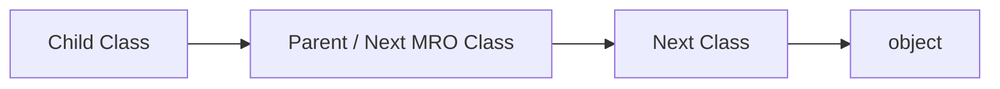
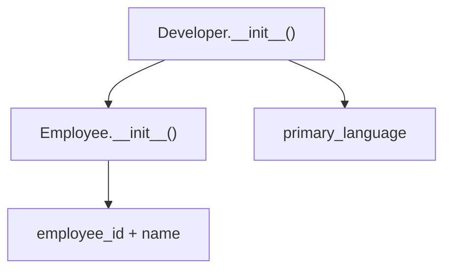
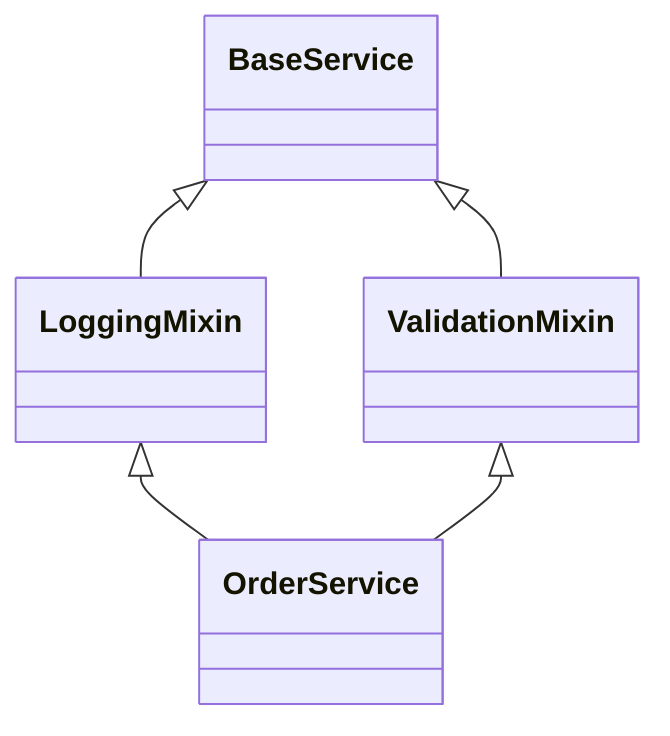
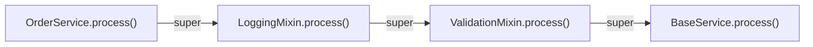

# OOP: Inheritance, MRO, `super()`

> **Inheritance** lets a class reuse and specialize behavior from another class.  
> **MRO (Method Resolution Order)** defines the order Python searches classes for inherited methods and class attributes.  
> **`super()`** continues that search from the next class in the MRO—it does not simply mean “call my direct parent”.

## Index

1. [Mental Model](#1-mental-model)
2. [Inheritance and Method Overriding](#2-inheritance-and-method-overriding)
   - Single inheritance
   - Overriding
   - Runtime polymorphism
3. [Method Resolution Order (MRO)](#3-method-resolution-order-mro)
   - How lookup works
   - Inspecting the MRO
   - C3 linearization
4. [`super()`](#4-super)
   - What it really does
   - `super()` in `__init__`
5. [Multiple and Diamond Inheritance](#5-multiple-and-diamond-inheritance)
6. [Cooperative Multiple Inheritance and Mixins](#6-cooperative-multiple-inheritance-and-mixins)
7. [Inheritance vs Composition](#7-inheritance-vs-composition)
8. [Practical Guidance](#8-practical-guidance)
9. [Key Takeaways](#9-key-takeaways)
10. [Compact Reference](#10-compact-reference)

---

# 1. Mental Model

Inheritance represents an **“is-a” relationship**.

```text
AdminUser is a User
Dog is an Animal
CardPayment is a PaymentMethod
```

A child class can:

- use inherited behavior as-is,
- override inherited behavior,
- extend inherited behavior,
- add new behavior.

When Python cannot find an inherited method or class attribute in the current class, it follows the class's **MRO** to decide where to search next.



The important idea is:

> **Inheritance defines the hierarchy; MRO defines the lookup order through that hierarchy.**

---

# 2. Inheritance and Method Overriding

## 2.1 Single Inheritance

A class can inherit from another class by placing the base class in parentheses.

```python
class Notification:
    def send(self, message: str) -> str:
        return f"Notification: {message}"


class EmailNotification(Notification):
    pass


notification = EmailNotification()

print(notification.send("Deployment completed"))
```

Output:

```text
Notification: Deployment completed
```

`EmailNotification` does not define `send()`, so Python finds the inherited method in `Notification`.

---

## 2.2 Method Overriding

A subclass can replace an inherited implementation by defining a method with the same name.

```python
class Notification:
    def send(self, message: str) -> str:
        return f"Notification: {message}"


class EmailNotification(Notification):
    def send(self, message: str) -> str:
        return f"Email: {message}"


print(EmailNotification().send("Deployment completed"))
```

Output:

```text
Email: Deployment completed
```

Python finds `EmailNotification.send()` before `Notification.send()`, so the child implementation is used.

---

## 2.3 Runtime Polymorphism

Different subclasses can implement the same base behavior differently.

```python
class SMSNotification(Notification):
    def send(self, message: str) -> str:
        return f"SMS: {message}"


def notify(channel: Notification, message: str) -> None:
    print(channel.send(message))


notify(EmailNotification(), "Build passed")
notify(SMSNotification(), "Server restarted")
```

Output:

```text
Email: Build passed
SMS: Server restarted
```

The calling code uses the same `send()` interface, while the actual object determines which implementation runs.

This is a common practical use of inheritance.

---

# 3. Method Resolution Order (MRO)

The **Method Resolution Order** is the ordered list of classes Python uses when resolving inherited methods and class attributes.

For a simple hierarchy:

```python
class Base:
    def execute(self) -> str:
        return "Base.execute"


class Child(Base):
    pass
```

The MRO is:

```text
Child -> Base -> object
```

Therefore:

```python
Child().execute()
```

finds `execute()` in `Base`.

> Instance attribute lookup also involves descriptors and the instance itself, but when Python needs to search the class hierarchy, the MRO determines the class order.

---

## 3.1 Inspecting the MRO

Use either:

```python
Child.mro()
```

or:

```python
Child.__mro__
```

A readable version is:

```python
print(" -> ".join(cls.__name__ for cls in Child.mro()))
```

Output:

```text
Child -> Base -> object
```

This is especially useful when working with:

- Django class-based views,
- Django REST Framework mixins,
- framework classes with several parents,
- custom multiple-inheritance hierarchies.

When a method override behaves unexpectedly, checking the MRO should be one of the first debugging steps.

---

## 3.2 C3 Linearization

Python calculates the MRO using **C3 linearization**.

You normally do not calculate C3 manually. For interviews and normal development, understand the guarantees it gives:

- a child appears before its parents,
- declared base-class order is preserved where possible,
- a class appears only once in the final MRO,
- existing parent precedence remains consistent when subclasses are created.

If Python cannot construct a consistent MRO, class creation fails with `TypeError`.

Example of an impossible hierarchy:

```python
class A:
    pass


class B(A):
    pass


class C(A, B):
    pass
```

This fails because `C` requests `A` before `B`, while `B` already requires `B` before `A`.

---

# 4. `super()`

## 4.1 What `super()` Really Does

A common simplified explanation is:

> "`super()` calls the parent class."

That is acceptable for very simple single inheritance, but it is not the full behavior.

A better definition is:

> **`super()` returns a proxy that continues attribute lookup after a specified/current class in the object's MRO.**

Inside a normal instance method:

```python
super().method()
```

is conceptually similar to:

```python
super(CurrentClass, self).method()
```

The lookup starts **after `CurrentClass`** in `type(self).__mro__`.


This is why the next class can be a **sibling in a multiple-inheritance hierarchy**, not necessarily the direct parent written beside the current class.

---

## 4.2 Extending Parent Behavior

`super()` is commonly used when a subclass wants to add behavior while keeping the existing implementation.

```python
class APIClient:
    def request(self, endpoint: str) -> str:
        return f"Request sent to {endpoint}"


class AuthenticatedAPIClient(APIClient):
    def request(self, endpoint: str) -> str:
        print("Adding authentication")
        return super().request(endpoint)


client = AuthenticatedAPIClient()
print(client.request("/users"))
```

Output:

```text
Adding authentication
Request sent to /users
```

---

## 4.3 `super()` in `__init__`

A subclass usually calls `super().__init__()` when the next class in the MRO performs initialization the object needs.

```python
class Employee:
    def __init__(self, employee_id: int, name: str) -> None:
        self.employee_id = employee_id
        self.name = name


class Developer(Employee):
    def __init__(
        self,
        employee_id: int,
        name: str,
        primary_language: str,
    ) -> None:
        super().__init__(employee_id, name)
        self.primary_language = primary_language
```

The logical initialization flow is:



Python does **not** automatically require every `__init__()` to call `super()`. You call it when initialization from the next MRO class is part of the design.

---

# 5. Multiple and Diamond Inheritance

Multiple inheritance means one class directly inherits from more than one base class.

```python
class JSONFormatter:
    def format(self) -> str:
        return "JSON"


class XMLFormatter:
    def format(self) -> str:
        return "XML"


class Report(JSONFormatter, XMLFormatter):
    pass


print(Report().format())
print(" -> ".join(cls.__name__ for cls in Report.mro()))
```

Output:

```text
JSON
Report -> JSONFormatter -> XMLFormatter -> object
```

`JSONFormatter.format()` wins because `JSONFormatter` appears before `XMLFormatter` in the MRO.

Base-class order therefore matters.

---

## 5.1 Diamond Inheritance

A diamond appears when two classes share a common base and another class inherits from both.



Example hierarchy:

```python
class BaseService:
    pass


class LoggingMixin(BaseService):
    pass


class ValidationMixin(BaseService):
    pass


class OrderService(LoggingMixin, ValidationMixin):
    pass
```

Its MRO is:

```text
OrderService
-> LoggingMixin
-> ValidationMixin
-> BaseService
-> object
```

`BaseService` appears only once, even though there are two inheritance paths to it.

This predictable ordering is one of the main reasons Python's cooperative multiple inheritance works.

---

# 6. Cooperative Multiple Inheritance and Mixins

**Cooperative inheritance** means that every participating class:

1. performs its own work,
2. calls `super()`,
3. allows the next class in the MRO to continue the operation.

Consider one practical service hierarchy:

```python
class BaseService:
    def process(self, order_id: int) -> None:
        print(f"BaseService: processing order {order_id}")


class ValidationMixin(BaseService):
    def process(self, order_id: int) -> None:
        print("ValidationMixin: validating order")
        super().process(order_id)


class LoggingMixin(BaseService):
    def process(self, order_id: int) -> None:
        print("LoggingMixin: writing audit log")
        super().process(order_id)


class OrderService(LoggingMixin, ValidationMixin):
    def process(self, order_id: int) -> None:
        print("OrderService: starting")
        super().process(order_id)
```

Inspect the MRO:

```python
print(" -> ".join(cls.__name__ for cls in OrderService.mro()))
```

Output:

```text
OrderService -> LoggingMixin -> ValidationMixin -> BaseService -> object
```

Now call:

```python
OrderService().process(501)
```

Output:

```text
OrderService: starting
LoggingMixin: writing audit log
ValidationMixin: validating order
BaseService: processing order 501
```

The call chain is:



The important part is inside `LoggingMixin`:

```python
super().process(order_id)
```

It calls `ValidationMixin.process()`, not `BaseService.process()`, because `ValidationMixin` is next after `LoggingMixin` in `OrderService`'s MRO.

> This is the key reason to read `super()` as **“continue through the MRO”** rather than **“call my parent.”**

---

## 6.1 Cooperative `__init__`

For cooperative constructors, each class should consume only the arguments it owns and forward the rest.

```python
class BaseComponent:
    def __init__(self, **kwargs: object) -> None:
        if kwargs:
            unexpected = ", ".join(kwargs)
            raise TypeError(f"Unexpected arguments: {unexpected}")

        super().__init__()


class NamedComponent(BaseComponent):
    def __init__(self, *, name: str, **kwargs: object) -> None:
        self.name = name
        super().__init__(**kwargs)


class CachedComponent(BaseComponent):
    def __init__(
        self,
        *,
        cache_enabled: bool = True,
        **kwargs: object,
    ) -> None:
        self.cache_enabled = cache_enabled
        super().__init__(**kwargs)


class Repository(NamedComponent, CachedComponent):
    def __init__(
        self,
        *,
        table_name: str,
        **kwargs: object,
    ) -> None:
        self.table_name = table_name
        super().__init__(**kwargs)
```

Usage:

```python
repository = Repository(
    table_name="users",
    name="user_repository",
    cache_enabled=True,
)
```

MRO:

```text
Repository
-> NamedComponent
-> CachedComponent
-> BaseComponent
-> object
```

For a reliable cooperative chain:

- participating methods should call `super()`,
- method signatures should be compatible,
- each class should handle only its responsibility,
- a class should not assume which class comes next,
- the chain should end cleanly.

---

## 6.2 Mixins

A **mixin** is a small reusable class that adds one focused capability.

Typical examples include:

```text
LoggingMixin
PermissionMixin
CacheMixin
SerializationMixin
AuditMixin
```

A mixin usually:

- is not a complete domain object by itself,
- adds one narrow capability,
- avoids owning the main object lifecycle,
- works well in combination with other classes,
- uses `super()` when it participates in an override chain.

Mixins are common in Django and Django REST Framework, where understanding the MRO helps explain which implementation runs first.

---

# 7. Inheritance vs Composition

Use inheritance when the relationship is genuinely **“is-a”**.

```text
EmailNotification is a Notification
AdminUser is a User
CardPayment is a PaymentMethod
```

Use composition when the relationship is **“has-a”**.

```text
CheckoutService has a PaymentGateway
OrderService has a Repository
Car has an Engine
```

Example:

```python
class PaymentGateway:
    def charge(self, amount: float) -> None:
        print(f"Charging {amount}")


class CheckoutService:
    def __init__(self, gateway: PaymentGateway) -> None:
        self.gateway = gateway

    def checkout(self, amount: float) -> None:
        self.gateway.charge(amount)
```

`CheckoutService` **has a** `PaymentGateway`; it is not a specialized kind of payment gateway.

Composition is usually preferable when:

- behavior needs to change dynamically,
- dependencies should be replaceable or testable,
- inheritance exists only for code reuse,
- a hierarchy is becoming deep or tightly coupled.

---

# 8. Practical Guidance

## 8.1 Keep Hierarchies Shallow

Simple hierarchies are easier to understand:


Very deep inheritance chains make it harder to know:

- which method implementation runs,
- where state was initialized,
- which class introduced an attribute,
- what a change will affect.

---

## 8.2 Prefer `super()` in Cooperative Hierarchies

Prefer:

```python
super().__init__(...)
```

over:

```python
Parent.__init__(self, ...)
```

when classes are designed to cooperate.

A direct base-class call bypasses normal cooperative MRO dispatch and tightly couples the implementation to one named parent.

Direct calls can still be intentional in specialized designs, but they should not be the default pattern.

---

## 8.3 Keep Method Contracts Compatible

Classes participating in the same `super()` chain should agree on how the method is called.

Good:

```python
class A:
    def process(self, request: object) -> None:
        super().process(request)


class B:
    def process(self, request: object) -> None:
        super().process(request)
```

Different incompatible signatures make cooperative dispatch difficult to maintain.

---

## 8.4 Inspect Framework MROs

When working with framework classes:

```python
for cls in MyView.mro():
    print(cls.__module__, cls.__name__)
```

This helps answer:

- Which class defines this method?
- Which mixin has precedence?
- Where will `super()` go next?
- Why is my override not running?

---

## 8.5 Use Relationship Checks When Needed

```python
isinstance(obj, Parent)
issubclass(Child, Parent)
```

Use `isinstance()` instead of:

```python
type(obj) is Parent
```

when subclasses should also be accepted.

---

# 9. Key Takeaways

```text
Inheritance
    = reuse and specialize behavior through an "is-a" relationship

Overriding
    = provide a subclass implementation of an inherited method

MRO
    = ordered class-search path used for inheritance lookup

C3 linearization
    = algorithm Python uses to construct a consistent MRO

super()
    = continue lookup after the current/specified class in the MRO

Multiple inheritance
    = inherit directly from more than one base class

Diamond inheritance
    = multiple inheritance paths reach the same ancestor

Cooperative inheritance
    = each participating class does its work and calls super()

Mixin
    = focused reusable capability combined with another class

Composition
    = build objects from collaborators using a "has-a" relationship
```

The single most important statement to remember is:

> **Read `super()` as “continue with the next implementation in the MRO,” not as “call my direct parent.”**

---

# 10. Compact Reference

```python
# Inheritance
class Child(Parent):
    pass


# Override a method
class Child(Parent):
    def process(self) -> None:
        ...


# Continue with the next implementation in the MRO
super().process()


# Initialize through the cooperative MRO chain
super().__init__(...)


# Inspect MRO
Child.mro()
Child.__mro__


# Readable MRO
print(" -> ".join(cls.__name__ for cls in Child.mro()))


# Relationship checks
isinstance(obj, Parent)
issubclass(Child, Parent)
```
