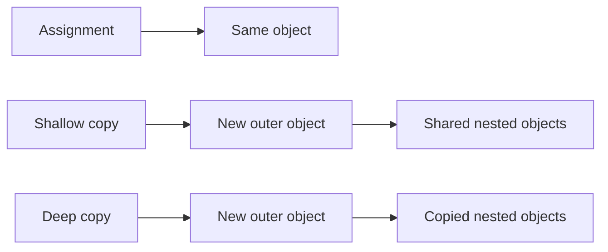
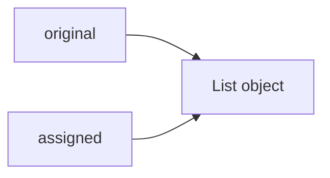
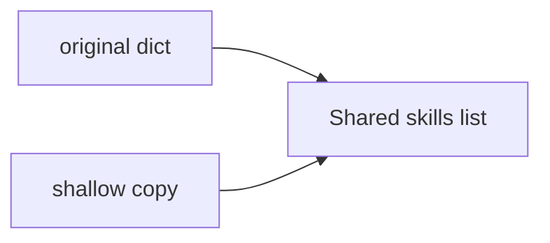
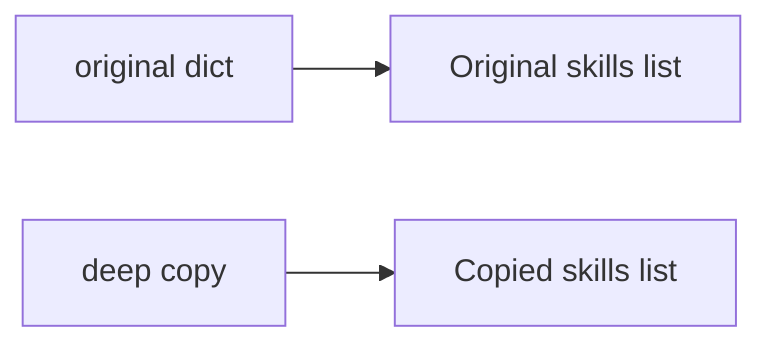
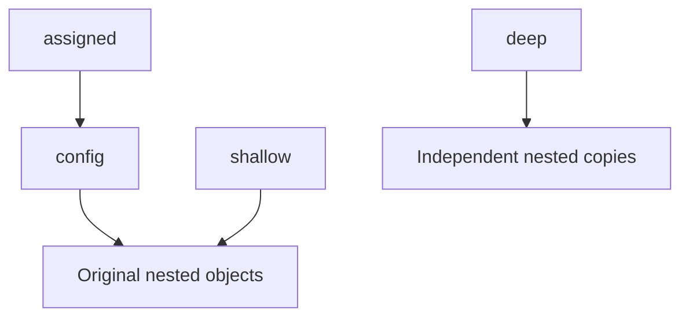
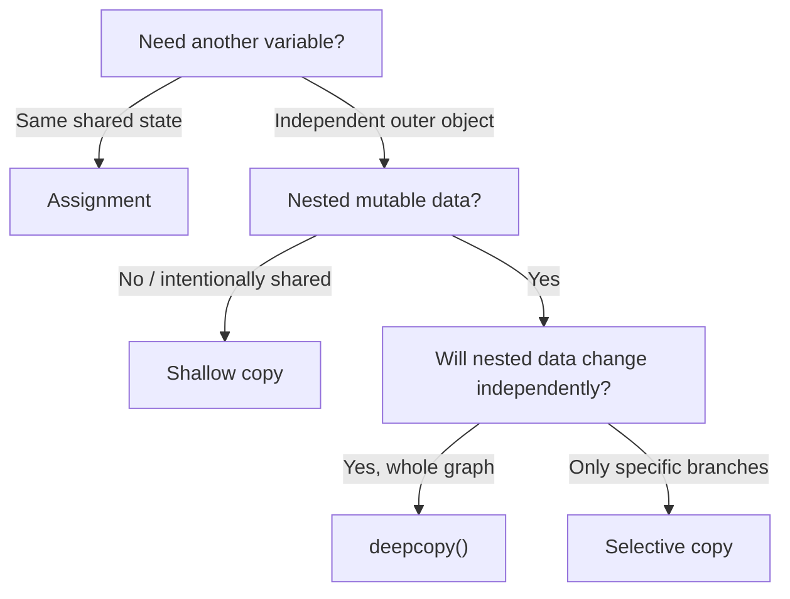

# Shallow vs Deep Copy in Python

Python variables do not store independent copies of objects automatically. A variable is a **name bound to an object**, so understanding object references is the key to understanding copying.

- **Assignment** creates another reference to the same object.
- **Shallow copy** creates a new outer object but reuses references to nested objects.
- **Deep copy** recursively copies the object graph so nested mutable objects can be modified independently.



> [!KEY]
> The difference matters mainly when an object contains **nested mutable objects** such as lists, dictionaries, sets, or mutable class instances.

---

# 1. Assignment Is Not Copying

Using `=` does not create a copy.

```python
original = ["Python", "Django"]
assigned = original

assigned.append("FastAPI")

print(original)              # ['Python', 'Django', 'FastAPI']
print(original is assigned)  # True
```

Both names point to the same list.



The `is` operator checks **object identity**, while `==` checks **value equality**.

```python
a = [1, 2]
b = [1, 2]

print(a == b)  # True
print(a is b)  # False
```

Use `is` mainly for identity checks such as `value is None`, not for normal value comparison.

---

# 2. Shallow Copy

A **shallow copy** creates a new outer container, but the objects stored inside it are still shared.

```python
import copy

original = {
    "name": "Asha",
    "skills": ["Python", "Django"],
}

shallow = copy.copy(original)

print(original is shallow)                      # False
print(original["skills"] is shallow["skills"])  # True
```

## 2.1 What Changes Independently?

A top-level replacement affects only the copied dictionary:

```python
shallow["name"] = "Ravi"

print(original["name"])  # Asha
print(shallow["name"])   # Ravi
```

But mutating the shared nested list affects both:

```python
shallow["skills"].append("FastAPI")

print(original["skills"])  # ['Python', 'Django', 'FastAPI']
print(shallow["skills"])   # ['Python', 'Django', 'FastAPI']
```



> A shallow copy gives independence at the **outer level only**.

## 2.2 Common Shallow-Copy Syntax

For built-in collections, these are shallow copies:

```python
new_list = old_list.copy()
new_list = old_list[:]
new_list = list(old_list)

new_dict = old_dict.copy()
new_dict = dict(old_dict)

new_set = old_set.copy()
new_set = set(old_set)
```

`copy.copy(obj)` is useful when you need a generic shallow-copy operation across different object types.

---

# 3. Deep Copy

A **deep copy** creates a new outer object and recursively copies nested objects.

```python
import copy

original = {
    "name": "Asha",
    "skills": ["Python", "Django"],
}

deep = copy.deepcopy(original)

print(original is deep)                      # False
print(original["skills"] is deep["skills"])  # False
```

Now nested mutations are isolated:

```python
deep["skills"].append("FastAPI")

print(original["skills"])  # ['Python', 'Django']
print(deep["skills"])      # ['Python', 'Django', 'FastAPI']
```



> A deep copy is useful when nested mutable state must be changed without affecting the original structure.

---

# 4. One Practical Example

Consider a backend service that receives configuration data and needs to create a modified version for one request.

```python
import copy

config = {
    "service": "payment-api",
    "database": {
        "host": "db.internal",
        "options": {
            "pool_size": 10,
        },
    },
    "features": ["payments", "refunds"],
}

assigned = config
shallow = copy.copy(config)
deep = copy.deepcopy(config)

shallow["database"]["options"]["pool_size"] = 20
deep["features"].append("webhooks")

print(config["database"]["options"]["pool_size"])
# 20 -> shallow copy shared the nested dictionaries

print(config["features"])
# ['payments', 'refunds']

print(deep["features"])
# ['payments', 'refunds', 'webhooks']
```

The important ownership relationships are:



This is the core behavior interviewers usually expect you to understand.

---

# 5. Assignment vs Shallow vs Deep Copy

| Behavior | Assignment | Shallow Copy | Deep Copy |
|---|---|---|---|
| New outer object | No | Yes | Yes |
| Nested objects copied | No | No | Recursively, where applicable |
| Nested mutable state shared | Yes | Yes | Usually no |
| Typical cost | Lowest | Low | Higher |
| Common syntax | `b = a` | `copy.copy(a)` | `copy.deepcopy(a)` |
| Best use | Intentional shared state | Flat or safely shared structures | Full nested isolation |

The phrase **"usually no"** is important for deep copy because classes can customize copying behavior, and some objects are intentionally returned unchanged.

---

# 6. Mutable and Immutable Objects

Copying behavior becomes important because Python objects can be mutable or immutable.

## 6.1 Common Mutable Types

- `list`
- `dict`
- `set`
- `bytearray`
- Most normal class instances

These objects can change in place.

## 6.2 Common Immutable Types

- `int`
- `float`
- `bool`
- `str`
- `bytes`
- `frozenset`
- `tuple`

A tuple itself is always immutable, but it can still contain a reference to a mutable object:

```python
data = ("Python", ["Django", "FastAPI"])

data[1].append("Flask")

print(data)
# ('Python', ['Django', 'FastAPI', 'Flask'])
```

So an immutable outer container does **not** mean every object reachable from it is immutable.

---

# 7. How `deepcopy()` Handles Object Graphs

`deepcopy()` does more than blindly recurse through every reference.

## 7.1 Memo Dictionary

During a deep copy, Python keeps a `memo` dictionary containing objects that have already been copied.

This solves two important problems:

- Prevents infinite recursion for circular references.
- Preserves shared-reference relationships inside the copied graph.

### Circular Reference

```python
import copy

data = []
data.append(data)

cloned = copy.deepcopy(data)

print(cloned is cloned[0])  # True
```

The copied list still correctly refers to itself.

### Shared References

```python
import copy

permissions = ["read"]

user = {
    "direct": permissions,
    "role": permissions,
}

copied = copy.deepcopy(user)

print(copied["direct"] is copied["role"])  # True
print(copied["direct"] is permissions)      # False
```

Python creates one new permissions list and preserves the fact that both keys refer to that same list inside the copied object graph.

---

# 8. Copying Custom Classes

The `copy` module also works with user-defined classes.

A class can customize its behavior with:

- `__copy__()` for shallow copying.
- `__deepcopy__(memo)` for deep copying.

```python
import copy

class Project:
    def __init__(self, name: str, members: list[str]) -> None:
        self.name = name
        self.members = members

project = Project("Payment API", ["Asha", "Ravi"])

shallow = copy.copy(project)
deep = copy.deepcopy(project)

print(project.members is shallow.members)  # True
print(project.members is deep.members)     # False
```

Custom copy methods are mainly useful when an object has special ownership rules or contains state that should not be duplicated normally.

> [!IMPORTANT]
> Files, sockets, stack frames, modules, and similar runtime or external-resource objects are not meaningfully deep-copied by the `copy` module. Prefer creating a new domain object containing only the plain data you actually need.

---

# 9. `copy.replace()` in Modern Python

Python 3.13 introduced `copy.replace()`.

It creates a new object of the same type while replacing selected fields:

```python
from copy import replace
from dataclasses import dataclass

@dataclass(frozen=True)
class User:
    name: str
    role: str

user = User("Asha", "developer")
updated = replace(user, role="tech-lead")

print(user)     # User(name='Asha', role='developer')
print(updated)  # User(name='Asha', role='tech-lead')
```

`copy.replace()` is **not a replacement for `copy()` or `deepcopy()`**. It is a more limited API intended for supported structured objects such as:

- Dataclass instances
- Named tuples created with `namedtuple()`
- Classes implementing `__replace__()`

This is especially useful when working with immutable-style data models.

---

# 10. Performance and Choosing the Right Strategy

Deep copying is usually more expensive because Python may need to traverse and recreate a large object graph.

| Situation | Prefer |
|---|---|
| Same object should be shared | Assignment |
| Only top-level changes are needed | Shallow copy |
| Nested values are immutable or intentionally shared | Shallow copy |
| Nested mutable values must be independent | Deep copy |
| Only one nested branch will change | Selective copying |
| Immutable structured object needs a few field changes | `copy.replace()` when supported |

## 10.1 Selective Copying

Do not deep-copy an entire large object when only one branch needs independence.

```python
original = {
    "name": "Project Alpha",
    "tags": ["python", "backend"],
    "owner": {"id": 10, "name": "Asha"},
}

updated = {
    **original,
    "tags": original["tags"].copy(),
}

updated["tags"].append("api")
```

Here:

- The outer dictionary is new.
- `tags` is copied because it will be modified.
- `owner` remains shared because it is not being changed.

This approach is often clearer and cheaper than `deepcopy()`.

---

# 11. Best Practices

- Understand which parts of the object graph are **mutable** before choosing a copy strategy.
- Use shallow copies for flat structures or when nested sharing is intentional.
- Use `deepcopy()` only when recursive isolation is genuinely required.
- Prefer selective copying when only a known branch will change.
- Do not rely on `is` for normal value comparison; use `==`.
- Avoid deep-copying objects that represent database connections, files, sockets, locks, or framework/runtime contexts.
- When ownership matters, verify it explicitly in tests:

```python
assert original is not copied
assert original["items"] is not copied["items"]
```

---

# 12. Quick Mental Model



Remember:

> **Assignment shares the whole object. Shallow copy separates the outer container. Deep copy separates the nested object graph.**

---

# References

- Python 3.14.7 documentation — `copy` module
- Python 3.14.7 documentation — Data model
