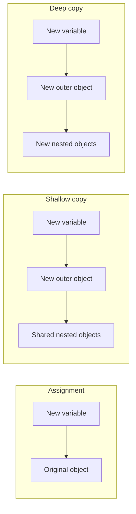
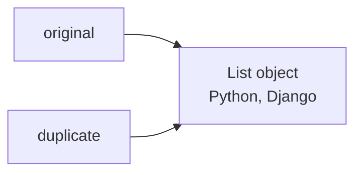
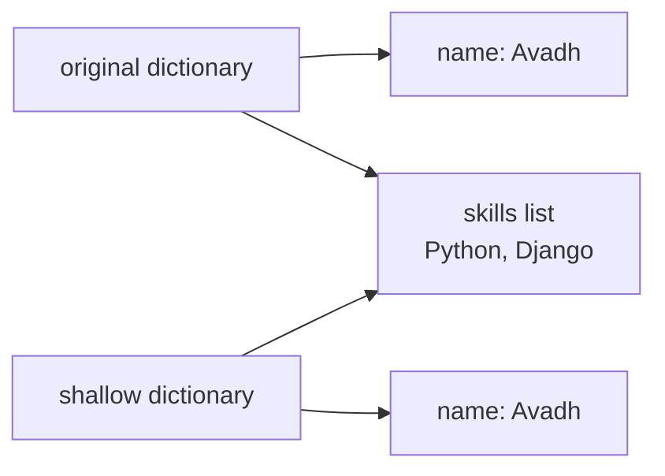
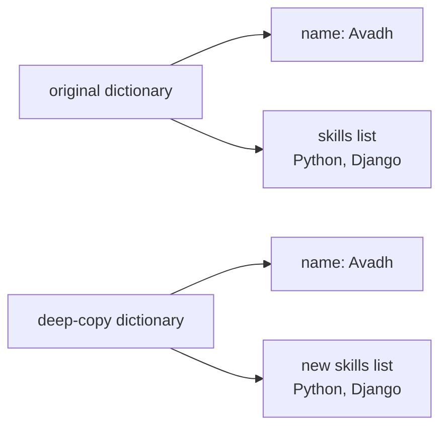
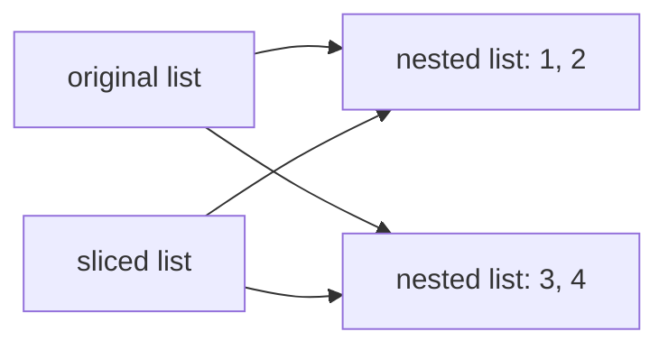
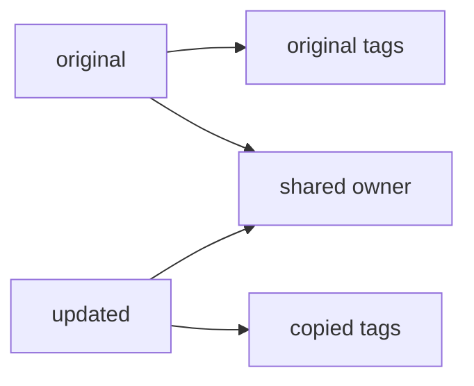
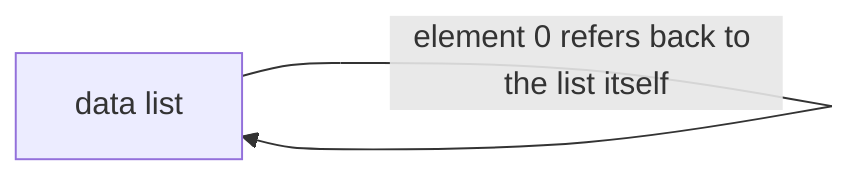
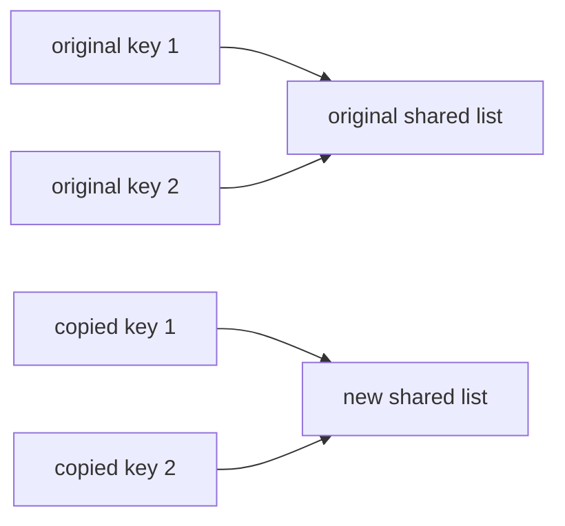
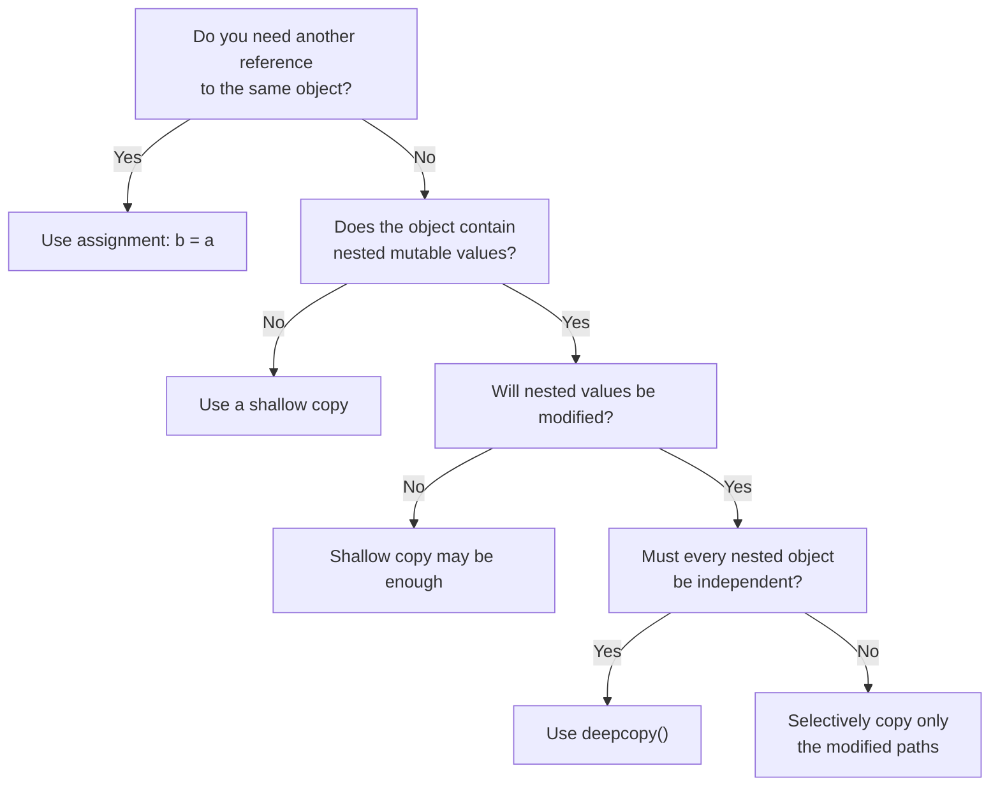

# Shallow Copy vs Deep Copy in Python

> Python variables store references to objects.
>
> A **shallow copy** creates a new outer object but reuses nested objects.
> A **deep copy** recursively creates independent copies of nested objects.

## In short

- Assignment (`b = a`) copies nothing: it binds a second name to the same object, so `a is b` is `True` and every change is shared.
- A shallow copy (`copy.copy()`) creates a new outer container but keeps references to the same nested objects, so independence stops at the first level.
- A deep copy (`copy.deepcopy()`) recurses, building new copies of the nested mutable objects as well.
- Immutable values such as `int`, `str` and `frozenset` cannot be changed in place, so sharing them between copies is safe and the distinction stops mattering.
- A tuple is immutable but a list inside it is not, so an immutable container does not guarantee an immutable structure.
- `deepcopy()` carries a memo dictionary, so circular references terminate and objects shared inside the original stay shared inside the copy.
- Deep copying costs time and memory proportional to the whole object graph, and some objects — connections, file handles, locks, generators — should not be deep-copied at all.



**Interview answer:** A shallow copy creates a new outer object, but its entries are still references to the same nested objects, so mutating anything nested is visible through both. A deep copy walks the structure recursively and creates new nested objects, so the two graphs are independent. Assignment does neither — it only creates a second name for the same object.

**Gotcha:** `list(original)`, `original[:]` and `dict(original)` look like real copies, but all of them are shallow — mutating a nested list or dictionary still leaks back into the original.

---

# 1. Why Copying Matters

Copying becomes important when you need to modify data without changing the original object.

This commonly happens with:

- API request or response payloads
- Application configuration
- Nested dictionaries and lists
- Cached data
- Test fixtures
- Domain models
- Background job payloads
- Template objects used to create new records

Consider this nested dictionary:

```python
user = {
    "name": "Avadh",
    "skills": ["Python", "Django"],
}
```

It contains:

- An outer dictionary
- A string value
- A nested list

The outer dictionary and nested list are separate objects. This is why copying only the outer dictionary may not be enough.

---

# 2. Assignment Is Not Copying

The assignment operator `=` does not create a new object. It creates another reference to the same object.

```python
original = ["Python", "Django"]
duplicate = original

duplicate.append("FastAPI")

print(original)               # ['Python', 'Django', 'FastAPI']
print(duplicate)              # ['Python', 'Django', 'FastAPI']
print(original is duplicate)  # True
```

Both variables refer to the same list.



The `is` operator checks object identity, not value equality.

```python
a = [1, 2]
b = [1, 2]

print(a == b)  # True  - same values
print(a is b)  # False - different objects
```

> [!IMPORTANT]
> Use `==` to compare values.  
> Use `is` to check whether two references point to the exact same object.

---

# 3. Shallow Copy

A shallow copy creates:

- A new outer container
- References to the same nested objects

Use `copy.copy()`:

```python
import copy

original = {
    "name": "Avadh",
    "skills": ["Python", "Django"],
}

shallow = copy.copy(original)

print(original is shallow)                      # False - the outer dictionaries differ
print(original["skills"] is shallow["skills"])  # True  - the nested lists are shared
```

## 3.1 Memory Structure



The outer dictionary was copied, but both dictionaries still reference the same `skills` list.

## 3.2 Changing the Outer Object

Replacing a top-level value affects only the copied dictionary:

```python
shallow["name"] = "Rahul"

print(original["name"])  # Avadh
print(shallow["name"])   # Rahul
```

This works independently because the outer dictionaries are separate.

## 3.3 Changing a Nested Mutable Object

Modifying the shared nested list affects both objects:

```python
shallow["skills"].append("FastAPI")

print(original["skills"])  # ['Python', 'Django', 'FastAPI']
print(shallow["skills"])   # ['Python', 'Django', 'FastAPI']
```

The nested list was not copied.

## 3.4 Important Rule

> A shallow copy provides independence only at the first level.

This is safe when:

- The object is flat
- Nested values are immutable
- Sharing nested objects is intentional
- Nested objects will not be modified

---

# 4. Deep Copy

A deep copy creates:

- A new outer object
- New copies of nested mutable objects
- Recursively independent object structures

Use `copy.deepcopy()`:

```python
import copy

original = {
    "name": "Avadh",
    "skills": ["Python", "Django"],
}

deep = copy.deepcopy(original)

print(original is deep)                      # False - the outer dictionaries differ
print(original["skills"] is deep["skills"])  # False - the nested lists differ too
```

## 4.1 Memory Structure



## 4.2 Modifying Nested Data

```python
deep["skills"].append("FastAPI")

print(original["skills"])  # ['Python', 'Django']
print(deep["skills"])      # ['Python', 'Django', 'FastAPI']
```

The original object remains unchanged.

## 4.3 Important Rule

> A deep copy provides recursive independence for copied mutable objects.

Use it when:

- Nested data must be modified independently
- The original object must remain unchanged
- The structure contains several mutable levels
- You are creating isolated test data or configuration

---

# 5. Shallow Copy vs Deep Copy

| Behavior | Assignment | Shallow Copy | Deep Copy |
|---|---:|---:|---:|
| Creates a new outer object | No | Yes | Yes |
| Copies nested objects | No | No | Yes, recursively |
| Shares nested mutable data | Yes | Yes | Usually no |
| Faster | Fastest | Usually fast | Usually slower |
| Lower memory usage | Yes | Usually | No |
| Original nested data is protected | No | No | Yes |
| Typical syntax | `b = a` | `copy.copy(a)` | `copy.deepcopy(a)` |

## 5.1 One Example Showing All Three

```python
import copy

original = {
    "project": "Backend API",
    "members": [
        {"name": "Asha", "role": "Developer"},
        {"name": "Ravi", "role": "Tester"},
    ],
}

assigned = original
shallow = copy.copy(original)
deep = copy.deepcopy(original)

print(assigned is original)  # True
print(shallow is original)   # False
print(deep is original)      # False

print(shallow["members"] is original["members"])  # True
print(deep["members"] is original["members"])     # False
```

Now modify a nested value through each copy:

```python
shallow["members"][0]["role"] = "Tech Lead"
print(original["members"][0]["role"])  # Tech Lead - the nested structure is shared

deep["members"][0]["role"] = "Architect"
print(original["members"][0]["role"])  # Tech Lead
print(deep["members"][0]["role"])      # Architect
```

---

# 6. Common Ways to Copy Built-in Collections

Python provides several shallow-copy techniques.

## 6.1 Lists

```python
import copy

original = [1, 2, 3]

copied = original.copy()      # list.copy()
copied = original[:]          # slicing
copied = list(original)       # the constructor
copied = copy.copy(original)  # the generic copy module

# All four produce shallow copies.
```

## 6.2 Dictionaries and Sets

```python
original = {"name": "Avadh", "skills": ["Python"]}
copy_1 = original.copy()
copy_2 = dict(original)

tags = {"Python", "Django"}
copy_3 = tags.copy()
copy_4 = set(tags)
```

These create a new outer container and are shallow as well.

## 6.3 Nested Collections Still Share Objects

```python
original = [[1, 2], [3, 4]]
copied = original[:]

copied[0].append(99)

print(original)  # [[1, 2, 99], [3, 4]]
```

Slicing copied the outer list only.



---

# 7. How Immutable Objects Affect Copying

Common immutable types include:

- `int`
- `float`
- `bool`
- `str`
- `bytes`
- `frozenset`
- Most tuples, depending on their contents

Immutable objects cannot be changed in place. Therefore, sharing them is normally safe.

```python
import copy

original = {
    "name": "Avadh",
    "experience": 3,
}

shallow = copy.copy(original)

print(original["name"] is shallow["name"])
print(original["experience"] is shallow["experience"])
```

The references may be shared, but this is not normally a problem because strings and integers cannot be mutated.

## 7.1 Tuple Edge Case

A tuple is immutable, but it can contain a mutable object. You cannot replace an element — `data[0] = "Java"` raises `TypeError` — but you can still modify its nested list:

```python
data = ("Python", ["Django", "FastAPI"])

data[1].append("Flask")

print(data)  # ('Python', ['Django', 'FastAPI', 'Flask'])
```

A container being immutable does not guarantee that everything inside it is immutable.

---

# 8. Practical Development Examples

## 8.1 API Payload Modification

A service receives a nested payload and needs to add internal processing data without changing the original request. A shallow copy is not enough:

```python
import copy

request_payload = {
    "customer": {
        "name": "Asha",
        "contact": {
            "email": "asha@example.com",
        },
    },
    "items": [
        {"product_id": 101, "quantity": 2},
    ],
}

processing_payload = copy.copy(request_payload)
processing_payload["customer"]["contact"]["verified"] = True

print(request_payload["customer"]["contact"])
# {'email': 'asha@example.com', 'verified': True}
```

Use `copy.deepcopy(request_payload)` instead when full isolation is required. The original `request_payload` then remains unchanged.

## 8.2 Selective Copying Instead of Full Deep Copy

A full deep copy is not always required. Suppose only one nested list needs to be modified — you can selectively copy the changed path:

```python
original = {
    "name": "Project Alpha",
    "tags": ["backend", "python"],
    "owner": {
        "id": 10,
        "name": "Asha",
    },
}

updated = {
    **original,
    "tags": original["tags"].copy(),
}

updated["tags"].append("api")
```

Now:

- The outer dictionary is new
- The `tags` list is new
- The unchanged `owner` dictionary is shared

This is often more efficient than copying the entire object graph.



This technique is common in state-management and data-transformation code.

---

# 9. Copying Custom Classes

The `copy` module can copy instances of custom classes.

```python
import copy

class Project:
    def __init__(self, name: str, members: list[str]) -> None:
        self.name = name
        self.members = members

original = Project("Payment API", ["Asha", "Ravi"])

shallow = copy.copy(original)
deep = copy.deepcopy(original)

print(original is shallow)  # False
print(original is deep)     # False

print(original.members is shallow.members)  # True  - the nested list is shared
print(original.members is deep.members)     # False - the nested list was copied
```

## 9.1 Customizing Shallow Copy with `__copy__()`

A class can define its own shallow-copy behavior. The method should return the desired shallow copy:

```python
import copy

class Project:
    def __init__(self, name: str, members: list[str]) -> None:
        self.name = name
        self.members = members

    def __copy__(self) -> "Project":
        new_project = type(self)(
            name=self.name,
            members=self.members,
        )
        return new_project

project = Project("Payment API", ["Asha", "Ravi"])
copied_project = copy.copy(project)
```

## 9.2 Customizing Deep Copy with `__deepcopy__()`

```python
import copy

class Project:
    def __init__(self, name: str, members: list[str]) -> None:
        self.name = name
        self.members = members

    def __deepcopy__(self, memo: dict[int, object]) -> "Project":
        existing = memo.get(id(self))

        if existing is not None:
            return existing  # type: ignore[return-value]

        new_project = type(self).__new__(type(self))
        memo[id(self)] = new_project

        new_project.name = copy.deepcopy(self.name, memo)
        new_project.members = copy.deepcopy(self.members, memo)

        return new_project
```

The `memo` dictionary is important because it:

- Prevents infinite recursion
- Preserves shared-reference relationships
- Avoids repeatedly copying the same object

> [!NOTE]
> Custom copy methods are useful when a class contains resources that should not be duplicated, such as database connections, locks, open files, sockets, or framework-managed objects.

---

# 10. How `deepcopy()` Handles Cycles and Shared References

Deep copying is more complex than recursively calling `copy()` on every value.

## 10.1 Circular References

An object may indirectly refer back to itself, as `data = []` followed by `data.append(data)` does:



A naive recursive copy would run forever. Python's `deepcopy()` uses an internal memo dictionary to remember objects that have already been copied:

```python
import copy

cloned = copy.deepcopy(data)

print(cloned is cloned[0])  # True
```

The circular structure is preserved safely.

## 10.2 Shared References Are Preserved

Consider two keys referencing the same list:

```python
import copy

shared_permissions = ["read"]

user = {
    "direct_permissions": shared_permissions,
    "role_permissions": shared_permissions,
}

copied_user = copy.deepcopy(user)

# The two keys still share one list inside the copy
print(copied_user["direct_permissions"] is copied_user["role_permissions"])  # True

# But that list is independent from the original
print(copied_user["direct_permissions"] is shared_permissions)  # False
```

`deepcopy()` creates one copied permissions list and reuses it within the new object graph.



---

# 11. Performance Considerations

A deep copy usually requires more CPU time and memory because it traverses the object graph recursively.

## 11.1 General Cost

| Operation | Time Cost | Memory Cost |
|---|---:|---:|
| Assignment | Very low | Very low |
| Shallow copy | Proportional to outer container | New outer container |
| Deep copy | Proportional to copied object graph | New copied graph |

These are conceptual costs. Actual performance depends on:

- Number of objects
- Nesting depth
- Object types
- Custom copy methods
- Circular and shared references
- Expensive user-defined objects

## 11.2 Deep Copy Can Copy More Than Needed

```python
large_state = {
    "users": [...],
    "settings": {...},
    "cache": {...},
    "current_page": 1,
}

# If only current_page changes, deep copying the whole state is unnecessary
updated_state = {
    **large_state,
    "current_page": 2,
}
```

Use the smallest amount of copying required for safe isolation.

## 11.3 Some Objects Should Not Be Deep-Copied

Objects representing external resources may not support meaningful copying:

- Database connections
- File handles
- Network sockets
- Thread locks
- Generators
- Modules
- Runtime or framework contexts

Instead of copying such objects, create a new domain object with only the required plain data.

---

# 12. Choosing the Correct Approach

Use the following decision flow:



| Choose | Syntax | When |
|---|---|---|
| Assignment | `alias = original` | Shared state is intentional and both names should observe the same changes |
| Shallow copy | `copied = original.copy()` | The structure is flat, nested values are immutable, or only top-level items will change |
| Deep copy | `copied = copy.deepcopy(original)` | Nested mutable objects will change, full isolation is required, and the extra cost is acceptable |
| Selective copy | `{**original, "items": original["items"].copy()}` | Only a known part of a large structure changes and you want explicit ownership of the copied paths |

---

# 13. Best Practices

## 13.1 Understand the Object Structure First

Before choosing a copy strategy, identify:

- Which objects are mutable
- Which nested objects are shared
- Which parts will be changed
- Whether shared state is intentional

> [!KEY]
> Do not choose a copy type based only on whether the outer object is a list or dictionary.  
> Choose it based on the complete nested structure and which parts your code will mutate.

## 13.2 Prefer Explicit Copying

For built-in collections, explicit methods such as `users.copy()`, `config.copy()` and `tags.copy()` are often more readable. Use `copy.copy()` when you need a generic shallow-copy operation across object types.

## 13.3 Do Not Use `deepcopy()` Automatically

`deepcopy()` is useful, but it can:

- Consume significant memory
- Hide unclear ownership
- Copy unnecessary data
- Interact unexpectedly with custom classes
- Fail for objects tied to external resources

Use it because full recursive isolation is required, not merely as a defensive habit.

## 13.4 Prefer Immutable Data Where Practical

Immutable values reduce copying concerns. For example, prefer a tuple such as `SUPPORTED_ROLES = ("admin", "developer", "tester")` when a collection should never change.

## 13.5 Copy at Clear Boundaries

Useful copying boundaries include:

- Before modifying cached data
- When constructing test fixtures
- When converting external input into internal state
- When creating an independent configuration
- When passing mutable data to code that may modify it

## 13.6 Verify Important Assumptions

Use identity checks during debugging:

```python
assert original is not copied
assert original["items"] is not copied["items"]
```

This makes ownership expectations explicit in tests.

---

# References

- Python `copy` module: <https://docs.python.org/3/library/copy.html>
- Python data model: <https://docs.python.org/3/reference/datamodel.html>
