# Multithreading vs Multiprocessing vs Asyncio

> **Core idea:** Choose the concurrency model based on what makes the program wait.
>
> - Use **multithreading** when tasks mostly wait for blocking I/O.
> - Use **multiprocessing** when pure-Python work consumes CPU time.
> - Use **asyncio** when you need a large number of cooperative I/O operations and the libraries support async APIs.

---

# 1. The Problem These Models Solve

A normal Python program executes instructions sequentially:

```text
Task A starts -> Task A finishes -> Task B starts -> Task B finishes
```

This becomes inefficient when a task spends significant time waiting for:

- A remote API
- A database
- A file or disk
- A network socket
- A subprocess
- A timer

Concurrency allows the program to make progress on other work during that waiting time.

For CPU-heavy work, the objective is different: divide the calculation across multiple CPU cores so that computations can run in parallel.

These are two different problems:

```text
I/O problem                              CPU problem
-----------                              -----------
The task is mostly waiting.              The task is mostly calculating.

Goal: do other work while waiting.       Goal: use more CPU cores.

Typical choices:                         Typical choice:
- Threads                               - Processes
- Asyncio
```

---

# 2. Concurrency vs Parallelism

The terms are related, but they do not mean the same thing.

## Concurrency

Concurrency means multiple tasks make progress during the same period.

They may take turns on one CPU core:

```text
Time ------------------------------------------------------>

Task A:  RUN ---- WAIT -------- RUN -------- WAIT --- RUN
Task B:       RUN ------ WAIT -------- RUN -------- RUN
Task C:            RUN ----------- WAIT -------- RUN
```

The tasks overlap in time, even if only one is actively executing at a particular instant.

## Parallelism

Parallelism means multiple tasks execute at the same instant, normally on different CPU cores.

```text
Time ------------------------------------------------------>

CPU Core 1:  Task A ===============================>
CPU Core 2:  Task B ===============================>
CPU Core 3:  Task C ===============================>
```

## Relationship to the Three Models

| Model | Concurrency | CPU parallelism | Typical mechanism |
|---|---:|---:|---|
| Multithreading | Yes | Usually limited for pure-Python code in default CPython | OS threads |
| Multiprocessing | Yes | Yes | Separate OS processes |
| Asyncio | Yes | No, not by itself | Event loop and cooperative tasks |

> **Important:** Asyncio is not automatically faster than threads or processes. It is a different way to organize concurrent I/O.

---

# 3. CPU-Bound vs I/O-Bound Work

Correctly classifying the workload is the most important selection step.

## CPU-Bound Work

A task is CPU-bound when most of its runtime is spent executing calculations.

Examples:

- Image transformations written in Python
- Video or audio encoding
- Large mathematical calculations
- Parsing and transforming large datasets
- Compression or encryption implemented in Python
- Prime-number calculations
- Machine-learning preprocessing

```text
CPU usage:       High
Waiting time:    Low
Main bottleneck: Processor
Preferred model: Multiprocessing
```

## I/O-Bound Work

A task is I/O-bound when it spends most of its runtime waiting for an external resource.

Examples:

- Calling REST APIs
- Querying databases
- Reading many files
- Uploading objects to cloud storage
- Web scraping
- Waiting for sockets or queues
- Sending emails

```text
CPU usage:       Usually low or moderate
Waiting time:    High
Main bottleneck: Network, disk, database, or another service
Preferred model: Threads or asyncio
```

## Practical Identification

Ask this question:

> If the external service, disk, or network became instant, would most of the runtime disappear?

- **Yes:** the workload is probably I/O-bound.
- **No, calculations would still take a long time:** the workload is probably CPU-bound.

Many real systems are mixed workloads. Profile the application instead of selecting a model only from intuition.

---

# 4. Quick Comparison

| Area | Multithreading | Multiprocessing | Asyncio |
|---|---|---|---|
| Execution unit | Thread | Process | Coroutine/task |
| Memory | Shared within one process | Separate by default | Shared within one thread/process |
| Best for | Blocking I/O | CPU-bound work | High-concurrency async I/O |
| Pure-Python CPU parallelism | Usually no in default CPython | Yes | No |
| Startup cost | Moderate | High | Very low per task |
| Memory cost | Lower than processes | Highest | Lowest per task |
| Communication | Direct shared objects | IPC, queues, pipes, shared memory | Direct objects through controlled task flow |
| Synchronization | Locks, events, queues | Process locks, queues, pipes | Locks, queues, semaphores designed for asyncio |
| Common complexity | Race conditions and deadlocks | Serialization and process management | Blocking the event loop and async propagation |
| Typical API | `ThreadPoolExecutor` | `ProcessPoolExecutor` | `asyncio`, `TaskGroup` |
| Suitable task count | Tens to hundreds, depending on work | Usually near CPU-core count | Hundreds to many thousands, depending on resources |

## One-Line Selection Rule

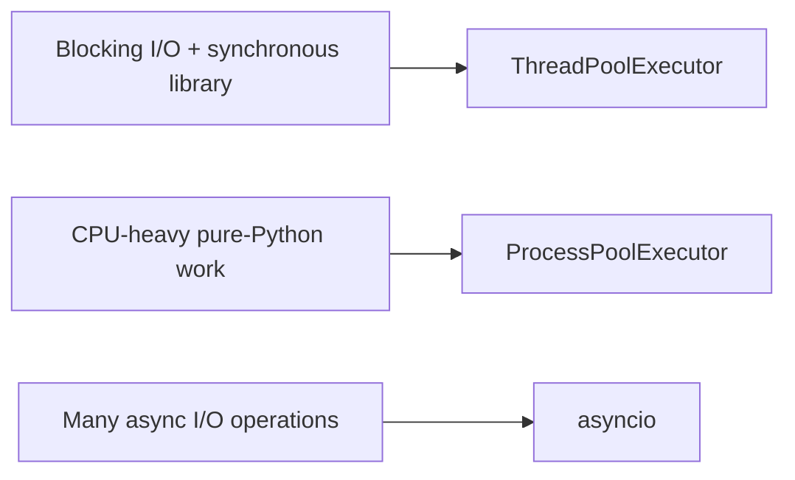

---

# 5. Multithreading

A thread is an execution path inside a process. Multiple threads share the process's memory, open files, module state, and other resources.

## 5.1 How Threads Work

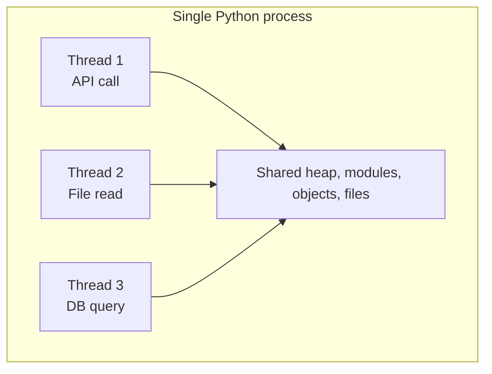

Because memory is shared, passing data between threads is easy. That convenience also creates the risk of race conditions.

## 5.2 The GIL and Threads

In the default CPython build, the **Global Interpreter Lock (GIL)** generally allows only one thread at a time to execute Python bytecode.

Consider two pure-Python CPU calculations:

```text
Thread 1: execute Python bytecode ---- pause ---- execute
Thread 2: -------------------------- execute ----- pause
```

The threads take turns holding the GIL. Therefore, adding threads normally does not produce proportional speed-up for pure-Python CPU-bound code.

Threads still work very well for I/O because the thread waiting for I/O does not need to keep executing Python bytecode:

```text
Thread 1: send request -> WAITING ................ -> process response
Thread 2:                 send request -> WAITING ..............
Thread 3:                    read file -> WAITING ...............
```

While one thread waits, another can run.

> Some native extensions release the GIL during heavy work. Libraries implemented in C, C++, Rust, or other native code may therefore obtain parallel speed-up with threads. Measure the actual library instead of assuming.

### Free-Threaded CPython

Python offers optional free-threaded builds that can disable the GIL. However, this is not the default CPython configuration, and library compatibility and performance characteristics must be checked before relying on it.

For general production and interview reasoning, use this default assumption unless the environment explicitly uses free-threaded Python:

```text
Default CPython + pure-Python CPU work -> processes, not threads
```

## 5.3 When to Use Threads

Use threads when:

- The work is I/O-bound.
- The library provides only a blocking/synchronous API.
- You need to integrate older synchronous code.
- Tasks must share in-process state carefully.
- The concurrency level is moderate.
- Rewriting the full call chain as async code is not justified.

Typical examples:

- Calling a blocking HTTP client concurrently
- Processing many independent file reads
- Uploading files through a synchronous SDK
- Executing blocking database calls from a batch script
- Running background monitoring in a desktop application

Avoid threads as the first choice when:

- The task is heavy pure-Python calculation.
- A very large number of mostly idle connections must be maintained.
- The code cannot safely coordinate shared mutable state.

## 5.4 ThreadPoolExecutor Example

For application code, `ThreadPoolExecutor` is usually cleaner than manually creating and joining many `Thread` objects.

```python
from concurrent.futures import ThreadPoolExecutor
from time import perf_counter, sleep


def fetch_user(user_id: int) -> dict[str, object]:
    """Simulate a blocking network or database operation."""
    sleep(1)
    return {"id": user_id, "name": f"user-{user_id}"}


def main() -> None:
    user_ids = [101, 102, 103, 104, 105]
    started_at = perf_counter()

    # map() returns results in the same order as the input iterable.
    with ThreadPoolExecutor(max_workers=5) as executor:
        users = list(executor.map(fetch_user, user_ids))

    elapsed = perf_counter() - started_at
    print(users)
    print(f"Completed in {elapsed:.2f} seconds")


if __name__ == "__main__":
    main()
```

Without concurrency, five one-second calls would take roughly five seconds. With enough worker threads, their waiting periods overlap, so the total is closer to the slowest individual call plus overhead.

### Using `submit()` When Tasks Need Individual Handling

```python
from concurrent.futures import Future, ThreadPoolExecutor, as_completed
from time import sleep


def call_service(service_name: str) -> str:
    sleep(0.5)
    if service_name == "billing":
        raise RuntimeError("Billing service unavailable")
    return f"{service_name}: success"


services = ["users", "orders", "billing", "notifications"]

with ThreadPoolExecutor(max_workers=4) as executor:
    future_to_service: dict[Future[str], str] = {
        executor.submit(call_service, service): service
        for service in services
    }

    for future in as_completed(future_to_service):
        service = future_to_service[future]
        try:
            print(future.result())
        except Exception as exc:
            print(f"{service}: failed: {exc}")
```

Use `submit()` plus `as_completed()` when you need:

- Per-task error handling
- Results in completion order
- Individual cancellation attempts
- Metadata associated with each future

## 5.5 Shared State and Locks

This code contains a race condition:

```python
import threading

counter = 0


def increment() -> None:
    global counter
    for _ in range(100_000):
        counter += 1


threads = [threading.Thread(target=increment) for _ in range(4)]

for thread in threads:
    thread.start()

for thread in threads:
    thread.join()

print(counter)
```

The logical operation `counter += 1` is a read-modify-write sequence. Multiple threads can interfere with one another.

Protect the critical section with a lock:

```python
import threading

counter = 0
counter_lock = threading.Lock()


def increment() -> None:
    global counter
    for _ in range(100_000):
        with counter_lock:
            counter += 1
```

A lock protects correctness, but excessive locking can reduce concurrency.

### Prefer Message Passing

Instead of letting many threads modify the same object, send work or results through a thread-safe queue:

```text
Producer threads -> queue.Queue -> Consumer thread
```

This usually produces easier-to-reason-about ownership.

### Threading Risks

- **Race condition:** result depends on timing.
- **Deadlock:** threads wait forever for locks held by one another.
- **Starvation:** one thread repeatedly fails to access a required resource.
- **Lock contention:** many threads spend time waiting for the same lock.
- **Unbounded thread creation:** too many threads consume memory and scheduling time.

---

# 6. Multiprocessing

Multiprocessing runs work in separate operating-system processes. Each process has its own Python interpreter and memory space.

## 6.1 How Processes Work

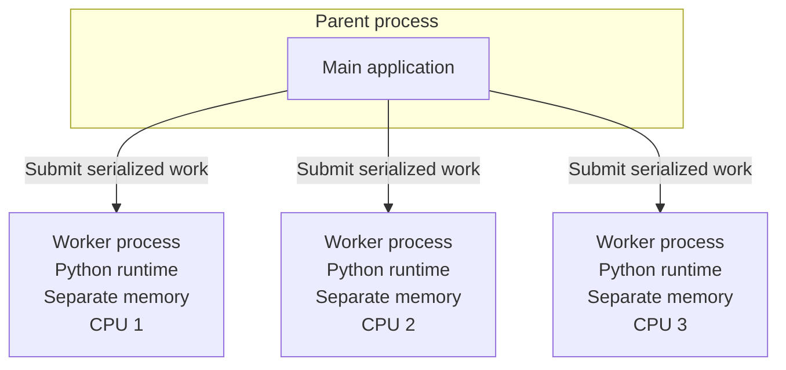

Because workers use separate interpreters, pure-Python work can execute simultaneously across multiple CPU cores.

The isolation provides CPU parallelism but introduces costs:

- Creating processes is more expensive than creating async tasks.
- Each process consumes additional memory.
- Arguments and results usually need serialization.
- State is not shared automatically.

## 6.2 When to Use Processes

Use multiprocessing when:

- Work is CPU-bound.
- Tasks are independent or can be divided into independent chunks.
- The machine has multiple CPU cores.
- Inputs and outputs are reasonably serializable.
- The computation is large enough to justify process overhead.

Typical examples:

- Image resizing or filtering
- CPU-heavy document conversion
- Data transformation over independent partitions
- Scientific calculations
- Parsing many independent large files
- Running pure-Python algorithms

Avoid multiprocessing as the first choice when:

- Tasks are tiny and process overhead is larger than the work.
- Very large objects must be repeatedly transferred between processes.
- Workers need constant access to complex shared mutable state.
- The workload is mainly network waiting.

## 6.3 ProcessPoolExecutor Example

The following example counts prime numbers using multiple processes.

```python
from concurrent.futures import ProcessPoolExecutor
from math import isqrt
from time import perf_counter


def is_prime(number: int) -> bool:
    if number < 2:
        return False
    if number == 2:
        return True
    if number % 2 == 0:
        return False

    limit = isqrt(number)
    for divisor in range(3, limit + 1, 2):
        if number % divisor == 0:
            return False
    return True


def count_primes(start: int, end: int) -> int:
    return sum(is_prime(number) for number in range(start, end))


def main() -> None:
    ranges = [
        (1, 300_000),
        (300_000, 600_000),
        (600_000, 900_000),
        (900_000, 1_200_000),
    ]

    started_at = perf_counter()

    with ProcessPoolExecutor(max_workers=4) as executor:
        counts = executor.map(
            count_primes,
            (start for start, _ in ranges),
            (end for _, end in ranges),
        )

    total = sum(counts)
    elapsed = perf_counter() - started_at

    print(f"Prime count: {total}")
    print(f"Completed in {elapsed:.2f} seconds")


if __name__ == "__main__":
    main()
```

### Why the `__main__` Guard Matters

Worker processes need to import the main module. Without this guard, process creation can recursively execute top-level code, especially with spawn-based process startup.

```python
if __name__ == "__main__":
    main()
```

Treat this as a standard requirement for portable multiprocessing code.

### Functions and Arguments Must Be Transferable

For `ProcessPoolExecutor`, worker functions and transferred values normally need to be picklable.

Prefer module-level functions:

```python
# Good: module-level function

def transform(value: int) -> int:
    return value * value
```

Avoid depending on local lambdas, nested functions, open database connections, locks, generators, or other objects that cannot be safely serialized.

## 6.4 Process Communication Cost

Processes do not share normal Python objects directly.

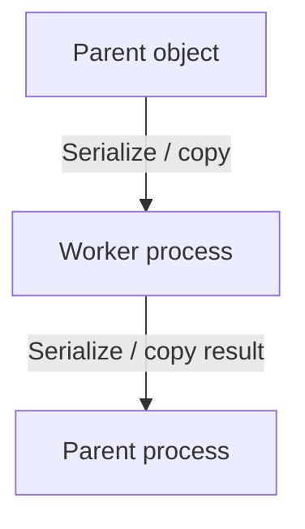

For small tasks, serialization and scheduling can cost more than the computation.

### Poor Task Granularity

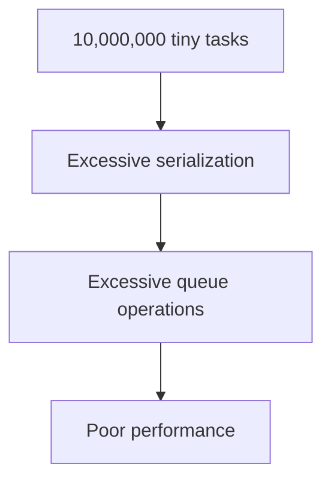

### Better Task Granularity

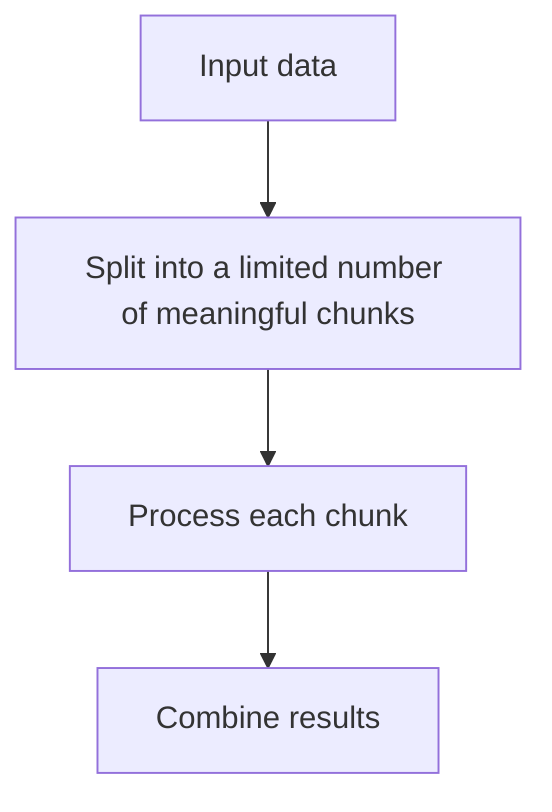

Use larger batches when each item is very cheap.

### Sharing Data Between Processes

Available mechanisms include:

- `multiprocessing.Queue`
- `multiprocessing.Pipe`
- Managers
- Shared memory
- Memory-mapped files
- External systems such as Redis, a database, or object storage

Use shared memory only when measurement shows serialization is a real bottleneck. It introduces additional lifecycle and synchronization complexity.

---

# 7. Asyncio

`asyncio` provides cooperative concurrency using an event loop and `async`/`await` syntax.

It normally runs many tasks in one thread:

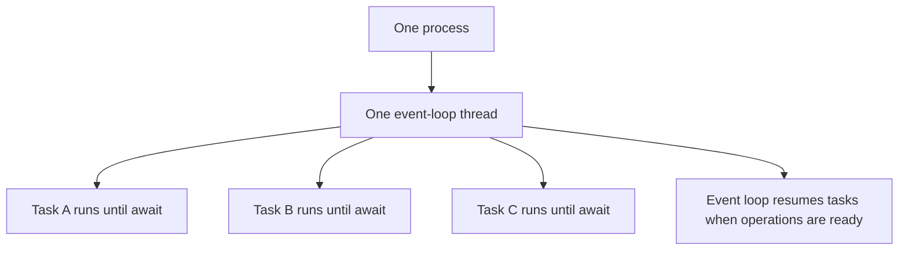

## 7.1 How the Event Loop Works

An async task must voluntarily give control back to the event loop, normally by using `await`.

```text
Task A: RUN -> await network ----------------------> RUN
                    |
                    v
Event loop selects another ready task
                    |
Task B:             RUN -> await database --------> RUN
                              |
Task C:                       RUN -> await timer --> RUN
```

This is called **cooperative scheduling**.

The event loop does not interrupt a coroutine in the middle of normal Python code. Therefore, long CPU work or blocking calls freeze all other tasks using that event-loop thread.

## 7.2 Coroutine vs Task vs Future

### Coroutine Function

A function declared with `async def`:

```python
async def load_user(user_id: int) -> dict[str, int]:
    return {"id": user_id}
```

### Coroutine Object

Calling the function does not immediately execute it to completion. It creates a coroutine object:

```python
coroutine = load_user(101)
```

It must be awaited or scheduled.

### Task

A task schedules a coroutine to run concurrently on the event loop:

```python
task = asyncio.create_task(load_user(101))
result = await task
```

### Future

A future represents a result that may become available later. Tasks are a higher-level form of future used to run coroutines.

For normal application code, work mainly with:

- Coroutines
- `asyncio.create_task()`
- `asyncio.TaskGroup`
- `asyncio.gather()`

Avoid manually creating low-level futures unless implementing a library or integrating callback-based APIs.

## 7.3 When to Use Asyncio

Use asyncio when:

- Work is I/O-bound.
- The libraries provide async APIs.
- The application manages many concurrent sockets or requests.
- Low per-task memory overhead matters.
- You need structured cancellation and timeouts.
- The application is already based on an async framework.

Typical examples:

- Async API servers
- WebSocket services
- Chat or notification systems
- Network crawlers
- Concurrent calls to microservices
- Message consumers using async clients
- High-concurrency database access with async drivers

Avoid asyncio as the first choice when:

- The workload is CPU-heavy.
- Required libraries are entirely blocking.
- The application only needs a few simple background I/O operations.
- The team would need to rewrite a large stable synchronous codebase without a clear scalability benefit.

## 7.4 Asyncio Example

```python
import asyncio
from time import perf_counter


async def fetch_user(user_id: int) -> dict[str, object]:
    """Simulate a non-blocking network or database operation."""
    await asyncio.sleep(1)
    return {"id": user_id, "name": f"user-{user_id}"}


async def main() -> None:
    user_ids = [101, 102, 103, 104, 105]
    started_at = perf_counter()

    tasks = [fetch_user(user_id) for user_id in user_ids]
    users = await asyncio.gather(*tasks)

    elapsed = perf_counter() - started_at
    print(users)
    print(f"Completed in {elapsed:.2f} seconds")


if __name__ == "__main__":
    asyncio.run(main())
```

The five waits overlap because every coroutine yields control at `await asyncio.sleep(1)`.

### Sequential Await vs Concurrent Scheduling

This code is async but sequential:

```python
for user_id in user_ids:
    user = await fetch_user(user_id)
    print(user)
```

Each operation starts after the previous operation completes.

This code is concurrent:

```python
users = await asyncio.gather(
    *(fetch_user(user_id) for user_id in user_ids)
)
```

`async` syntax alone does not create concurrency. The coroutines must be scheduled together.

### Limiting Concurrency with a Semaphore

Launching too many requests can overload your application or a downstream service.

```python
import asyncio

MAX_CONCURRENT_REQUESTS = 20
semaphore = asyncio.Semaphore(MAX_CONCURRENT_REQUESTS)


async def call_service(item_id: int) -> str:
    async with semaphore:
        await asyncio.sleep(0.2)
        return f"item-{item_id}"


async def main() -> None:
    results = await asyncio.gather(
        *(call_service(item_id) for item_id in range(1_000))
    )
    print(len(results))
```

A semaphore provides backpressure by limiting the number of operations inside the protected section.

## 7.5 Timeouts and Structured Concurrency

### Timeout

```python
import asyncio


async def slow_operation() -> str:
    await asyncio.sleep(10)
    return "done"


async def main() -> None:
    try:
        async with asyncio.timeout(2):
            result = await slow_operation()
            print(result)
    except TimeoutError:
        print("Operation timed out")
```

Timeouts prevent a stalled dependency from holding resources forever.

### TaskGroup

`TaskGroup` groups related tasks so their lifecycle is managed together.

```python
import asyncio


async def fetch(resource: str) -> str:
    await asyncio.sleep(0.2)
    return f"loaded: {resource}"


async def main() -> None:
    resources = ["users", "orders", "payments"]
    tasks: list[asyncio.Task[str]] = []

    async with asyncio.TaskGroup() as task_group:
        for resource in resources:
            tasks.append(task_group.create_task(fetch(resource)))

    results = [task.result() for task in tasks]
    print(results)
```

If one task fails with an unhandled exception, `TaskGroup` cancels the remaining related tasks and waits for their cleanup. This makes task lifetimes clearer than detached background tasks.

---

# 8. Running Blocking Code from Asyncio

A blocking call inside an async function blocks the event loop:

```python
import time


async def bad_example() -> None:
    time.sleep(5)  # Blocks every task on this event-loop thread.
```

Use an async-native library when available.

When a blocking I/O function must be used, move it to a worker thread with `asyncio.to_thread()`:

```python
import asyncio
from pathlib import Path


def read_large_file(path: Path) -> str:
    return path.read_text(encoding="utf-8")


async def load_file(path: Path) -> str:
    return await asyncio.to_thread(read_large_file, path)
```

Conceptually:

```text
Event-loop thread                     Worker thread
-----------------                     -------------
await asyncio.to_thread(...) -------> blocking function runs
        event loop remains free       file/API call waits
<----------------------------------- result returned
resume coroutine
```

> `asyncio.to_thread()` is mainly suitable for blocking I/O. It does not normally turn pure-Python CPU work into multi-core parallelism in default CPython.

For CPU-heavy work, use a process pool:

```python
import asyncio
from concurrent.futures import ProcessPoolExecutor
from functools import partial


def calculate_score(start: int, end: int) -> int:
    return sum(number * number for number in range(start, end))


async def main() -> None:
    loop = asyncio.get_running_loop()

    with ProcessPoolExecutor() as pool:
        jobs = [
            loop.run_in_executor(pool, partial(calculate_score, 0, 5_000_000)),
            loop.run_in_executor(pool, partial(calculate_score, 5_000_000, 10_000_000)),
        ]
        results = await asyncio.gather(*jobs)

    print(sum(results))


if __name__ == "__main__":
    asyncio.run(main())
```

This creates a hybrid architecture:


---

# 9. Decision Flow

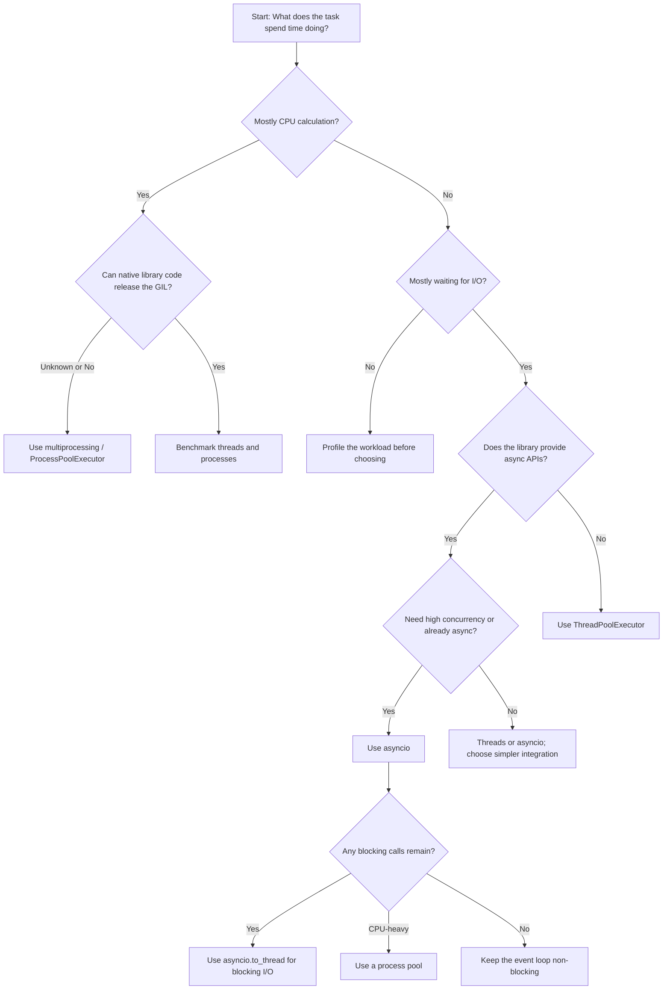

## Fast Mental Model

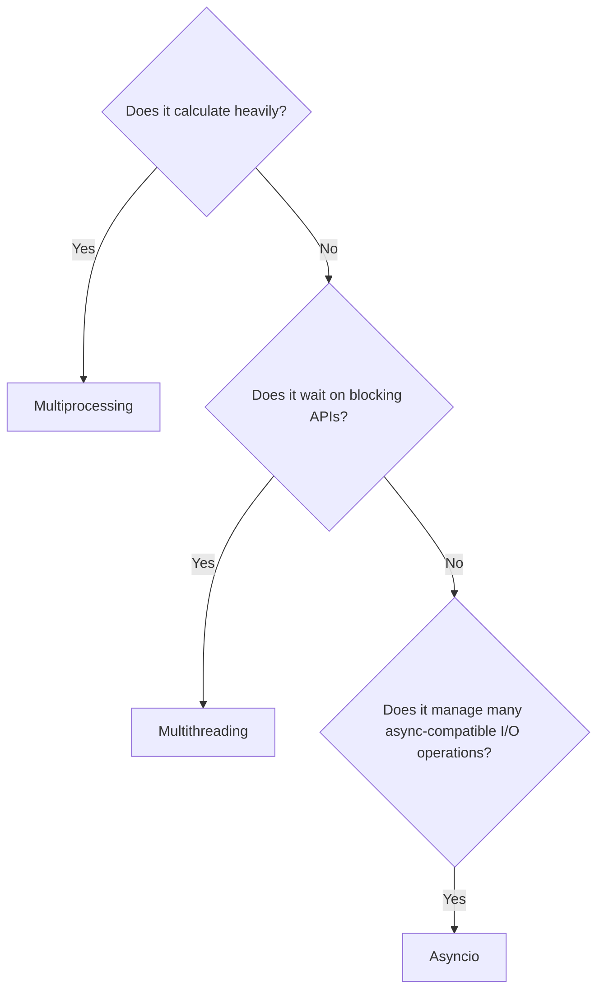

---

# 10. Real-World Use Cases

## Case 1: Call 30 External APIs from a Synchronous Script

The HTTP client is blocking and the script already uses synchronous functions.

```text
Workload:       I/O-bound
Library style:  Synchronous
Concurrency:    Moderate
Choice:         ThreadPoolExecutor
```

Why not multiprocessing?

- Processes add memory and serialization overhead.
- CPU is not the bottleneck.

Why not asyncio?

- It may require replacing the HTTP client and propagating `async` through the call chain.
- Asyncio is reasonable only if the wider application benefits from that architecture.

## Case 2: Generate Thumbnails for 50,000 Images

Each image requires CPU-heavy transformations.

```text
Workload:       CPU-bound
Independence:   Each image can be processed separately
Choice:         ProcessPoolExecutor
```

Practical design:

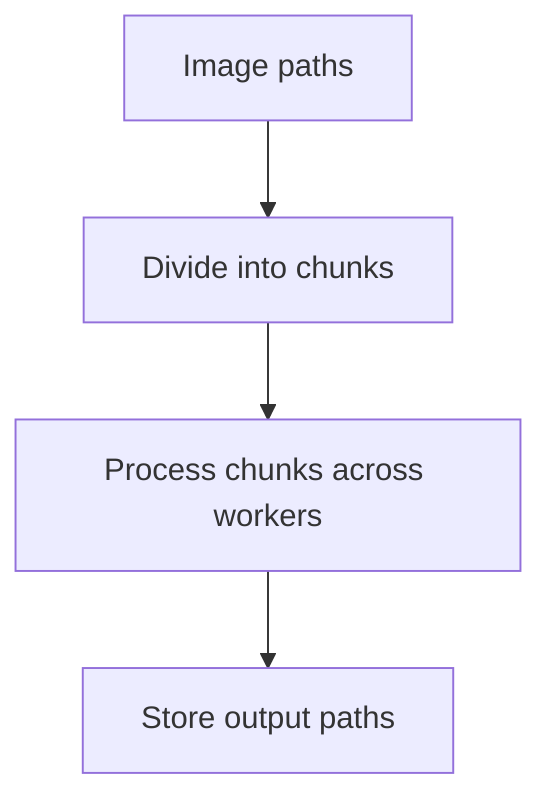

Before deciding, verify whether the imaging library releases the GIL. A native imaging library may perform well with threads, but benchmarking is required.

## Case 3: WebSocket Server with Thousands of Connections

Connections spend most of their time waiting for messages.

```text
Workload:       Network I/O
Concurrency:    Very high
Library style:  Async
Choice:         Asyncio
```

One task can represent each connection without allocating one OS thread per connection.

## Case 4: Async API Endpoint Calls a Blocking SDK

The API server is async, but a cloud SDK exposes only blocking methods.

```text
Choice: Keep the endpoint async and call the SDK through asyncio.to_thread()
```

```python
result = await asyncio.to_thread(blocking_sdk.upload, file_data)
```

Also limit concurrency so that the default thread pool and downstream service are not overloaded.

## Case 5: Async API Endpoint Generates a Large Report

The endpoint coordinates network calls but report calculation is CPU-heavy.

```text
Network orchestration -> asyncio
CPU-heavy generation  -> process pool or external job worker
```

For long-running jobs, a dedicated background job system is often better than keeping an HTTP request open.

## Case 6: Django Management Command Processes Many Records

Possible choices depend on the work performed per record:

| Per-record operation | Better starting point |
|---|---|
| Blocking API call | Thread pool |
| CPU-heavy transformation | Process pool |
| Async client calls and async-compatible workflow | Asyncio |
| Small database update | Often batching is more important than concurrency |

Concurrency does not fix inefficient database access. First consider:

- Bulk queries
- `bulk_create()` or `bulk_update()`
- Fewer network round trips
- Appropriate indexes
- Bounded batches

---

# 11. Combining the Models

The three models are not mutually exclusive.

A production system may use all of them at different layers:

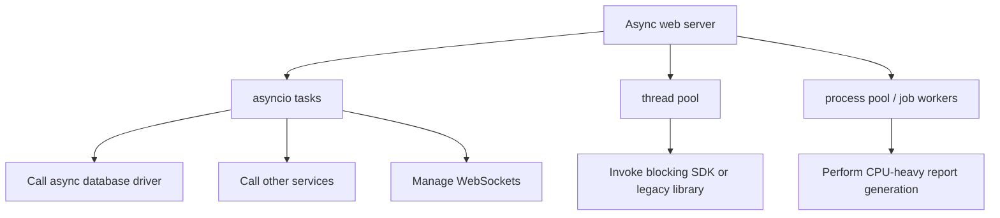

## Common Hybrid Pattern

```python
import asyncio
from concurrent.futures import ProcessPoolExecutor


def cpu_heavy_transform(data: list[int]) -> int:
    return sum(value * value for value in data)


async def fetch_data() -> list[int]:
    await asyncio.sleep(0.2)  # Represents async I/O.
    return list(range(2_000_000))


async def main() -> None:
    data = await fetch_data()
    loop = asyncio.get_running_loop()

    with ProcessPoolExecutor() as pool:
        result = await loop.run_in_executor(
            pool,
            cpu_heavy_transform,
            data,
        )

    print(result)


if __name__ == "__main__":
    asyncio.run(main())
```

Be careful with large `data` values because sending them to another process may require an expensive copy and serialization step. Sometimes it is better for the worker to load its own input using a path or identifier.

---

# 12. Error Handling and Cancellation

## Threads

A `Future` stores the exception raised by its worker function. The exception is re-raised when `future.result()` is called.

```python
future = executor.submit(call_service)

try:
    result = future.result(timeout=5)
except TimeoutError:
    print("Result was not ready in time")
except Exception as exc:
    print(f"Worker failed: {exc}")
```

Important behavior:

- `future.cancel()` succeeds only if the task has not started.
- Python cannot safely force-stop an arbitrary running thread.
- A timeout on `result()` stops waiting; it does not necessarily stop the worker function.
- Cooperative stopping requires an event or another shared signal.

```python
import threading

stop_event = threading.Event()


def worker() -> None:
    while not stop_event.is_set():
        perform_small_unit_of_work()
```

## Processes

Process-pool futures also re-raise worker exceptions through `result()`.

Important behavior:

- Running work should still be designed for graceful cancellation.
- Abruptly terminating a process can leave external operations incomplete.
- Database transactions, files, locks, and temporary output need cleanup strategies.
- A failed worker can make the process pool unusable, depending on the failure.

## Asyncio

Asyncio cancellation is cooperative. Cancellation is delivered at an await point through `asyncio.CancelledError`.

```python
import asyncio


async def worker() -> None:
    try:
        while True:
            await asyncio.sleep(1)
    except asyncio.CancelledError:
        await release_resources()
        raise  # Preserve cancellation semantics.
```

Do not silently swallow `CancelledError` unless the code intentionally replaces the cancellation behavior.

### Resource Cleanup

Use context managers and `finally` blocks:

```python
async def use_connection() -> None:
    connection = await open_connection()
    try:
        await connection.send("data")
    finally:
        await connection.close()
```

---

# 13. Performance and Scalability

## Threads: Main Costs

- OS thread scheduling
- Per-thread stack memory
- Lock contention
- Context switching
- Downstream resource limits

Adding more threads helps only until another bottleneck becomes dominant.

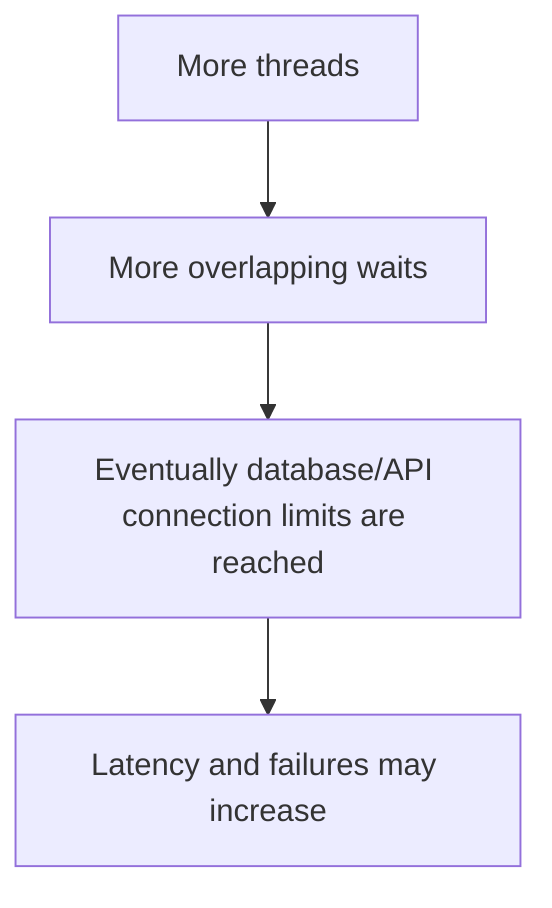

## Processes: Main Costs

- Process startup
- Separate interpreter memory
- Serialization
- Copying data
- Inter-process communication
- Result aggregation

The worker count is often close to the number of CPU cores, but the correct number depends on:

- Available cores
- Memory
- Task duration
- Native-library behavior
- Other workloads on the machine

## Asyncio: Main Costs

Async tasks are lightweight, but the system still has real limits:

- File descriptors
- Socket limits
- Database connection pool size
- API rate limits
- Memory used by task state and payloads
- Downstream service capacity

Asyncio makes high concurrency possible; it does not make unlimited concurrency safe.

## Concurrency Must Be Bounded

Bad pattern:

```python
await asyncio.gather(*(call_api(item) for item in one_million_items))
```

This can create excessive tasks and memory pressure.

Better patterns include:

- Semaphores
- Worker queues
- Batches
- Rate limiters
- Connection pools
- Producer-consumer pipelines

## Measure End-to-End Performance

Do not benchmark only the worker function. Measure:

- Total throughput
- p50, p95, and p99 latency
- CPU utilization
- Memory usage
- Queue time
- Error and timeout rate
- Downstream saturation
- Serialization time
- Event-loop lag for async services

---

# 14. Best Practices

## General

1. **Classify the workload first.** Determine whether it is CPU-bound, I/O-bound, or mixed.
2. **Prefer high-level APIs.** Start with executors, `TaskGroup`, queues, and semaphores.
3. **Bound concurrency.** Unlimited workers or tasks can overload the system.
4. **Add timeouts.** Every network or external-resource wait should have a sensible timeout.
5. **Design for failure.** Individual tasks can fail, hang, or be cancelled.
6. **Keep tasks independent.** Reduced shared state makes all three models easier to scale.
7. **Profile before optimizing.** The assumed bottleneck may not be the real bottleneck.
8. **Make cleanup explicit.** Close executors, sessions, connections, files, and processes.

## Threading

- Prefer `ThreadPoolExecutor` for independent tasks.
- Protect shared mutable state with locks.
- Keep critical sections small.
- Prefer `queue.Queue` for producer-consumer workflows.
- Do not create one unbounded thread per incoming request.
- Do not assume the GIL makes compound operations thread-safe.

## Multiprocessing

- Always use the `if __name__ == "__main__":` guard in portable scripts.
- Keep worker functions at module level.
- Pass small, serializable inputs.
- Batch tiny tasks.
- Avoid repeatedly sending huge objects between processes.
- Initialize reusable worker resources once where appropriate.
- Consider external job workers for durable, long-running jobs.

## Asyncio

- Never call blocking functions directly on the event-loop thread.
- Use async-native clients where practical.
- Use `asyncio.to_thread()` for unavoidable blocking I/O.
- Use a process pool or external worker for CPU-heavy work.
- Prefer structured task lifetimes with `TaskGroup`.
- Use semaphores or queues to limit concurrency.
- Propagate cancellation correctly.
- Do not expose async internals unnecessarily across a library's public API.

---

# 15. Modern Python Note: Free-Threaded Builds and Interpreter Pools

Python concurrency is evolving, so two newer capabilities are worth recognizing.

## Free-Threaded CPython Builds

Optional free-threaded CPython builds can run with the GIL disabled, allowing threads to execute Python code in parallel.

However:

- Free-threaded mode is not the default build.
- Some extension modules may not yet fully support it.
- Removing the GIL does not remove race conditions.
- Shared mutable state still requires synchronization.
- Single-thread and multi-thread performance must be measured for the deployed environment.

Therefore, the classic selection model remains the safest general rule for normal CPython environments:

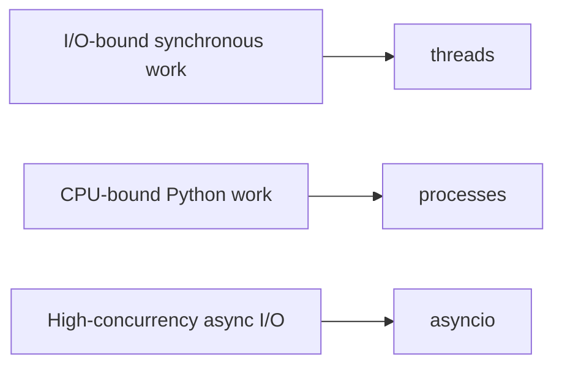

## InterpreterPoolExecutor

Modern Python also provides `InterpreterPoolExecutor`, which runs workers in isolated interpreters within one process. It can provide multi-core execution because each interpreter has its own runtime lock.

It offers an additional option between threads and processes, but introduces isolation and data-sharing constraints. For most teams, `ThreadPoolExecutor`, `ProcessPoolExecutor`, and asyncio remain the clearest starting points. Consider interpreter pools only after understanding compatibility, isolation, and communication requirements.

---

# 16. Final Selection Guide

## Summary Table

| Situation | Recommended starting point | Reason |
|---|---|---|
| Call many blocking APIs | `ThreadPoolExecutor` | Overlaps blocking waits with minimal code change |
| Read or upload many files using blocking libraries | `ThreadPoolExecutor` | File operations spend time waiting |
| Execute heavy pure-Python calculations | `ProcessPoolExecutor` | Uses multiple CPU cores |
| Transform independent CPU-heavy data chunks | `ProcessPoolExecutor` | Natural parallel partitioning |
| Handle many sockets or WebSockets | `asyncio` | Lightweight cooperative tasks |
| Build an async API service | `asyncio` | Fits async servers and clients |
| Call a blocking SDK from async code | `asyncio.to_thread()` | Keeps the event loop responsive |
| Run CPU-heavy work from async code | Process pool or job worker | Keeps CPU work outside the event loop |
| Share complex mutable state | Reconsider design | Message passing or ownership is safer |
| Unsure which model is faster | Benchmark realistic workloads | Overhead and library behavior vary |

## Memory Shortcut

```text
THREADS
- One process
- Shared memory
- Best for blocking I/O
- Synchronization is required

PROCESSES
- Separate interpreters and memory
- Best for CPU-heavy Python work
- Higher startup and communication cost

ASYNCIO
- Usually one event-loop thread
- Best for many async I/O operations
- Every blocking call must be controlled
```

## Final Rule

> Do not choose based on which model sounds more advanced. Choose based on the bottleneck, library ecosystem, required concurrency, failure model, and operational complexity.

---

# 17. References

Official Python documentation:

- Thread-based parallelism: <https://docs.python.org/3/library/threading.html>
- Process-based parallelism: <https://docs.python.org/3/library/multiprocessing.html>
- Asynchronous I/O: <https://docs.python.org/3/library/asyncio.html>
- Coroutines and tasks: <https://docs.python.org/3/library/asyncio-task.html>
- Concurrent futures: <https://docs.python.org/3/library/concurrent.futures.html>
- Shared memory: <https://docs.python.org/3/library/multiprocessing.shared_memory.html>
- Free-threaded Python: <https://docs.python.org/3/howto/free-threading-python.html>

