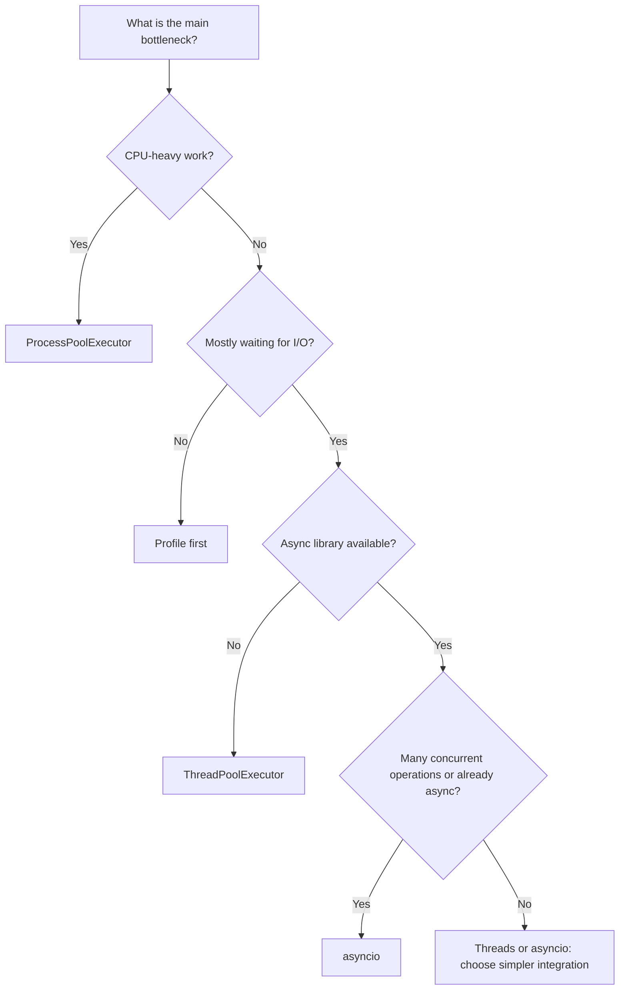
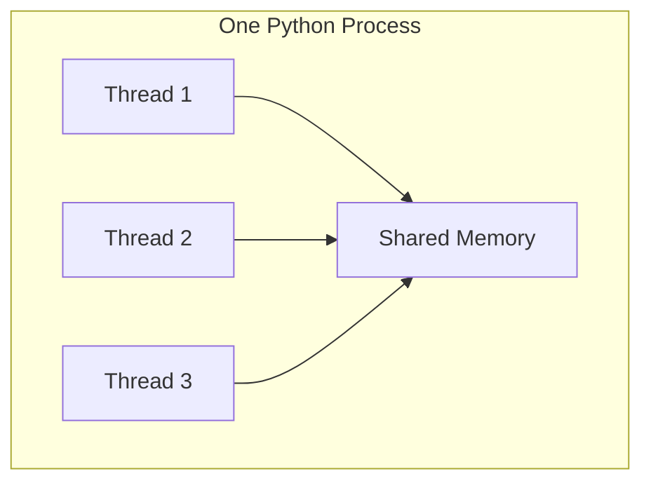
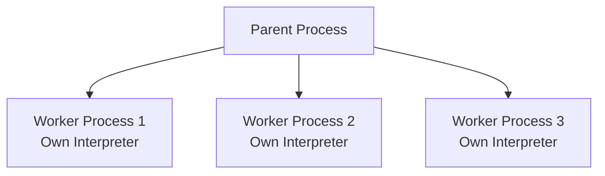
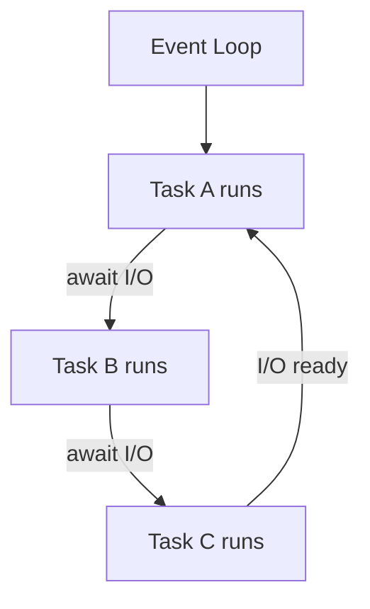
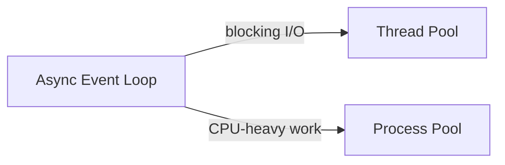
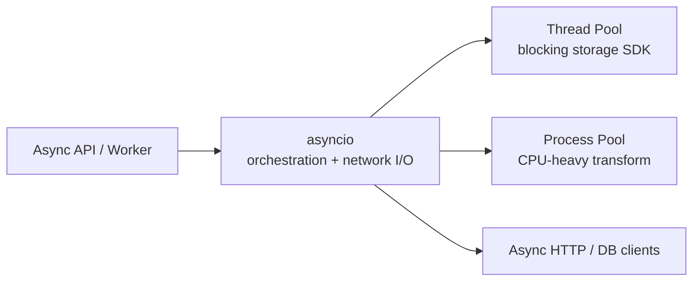
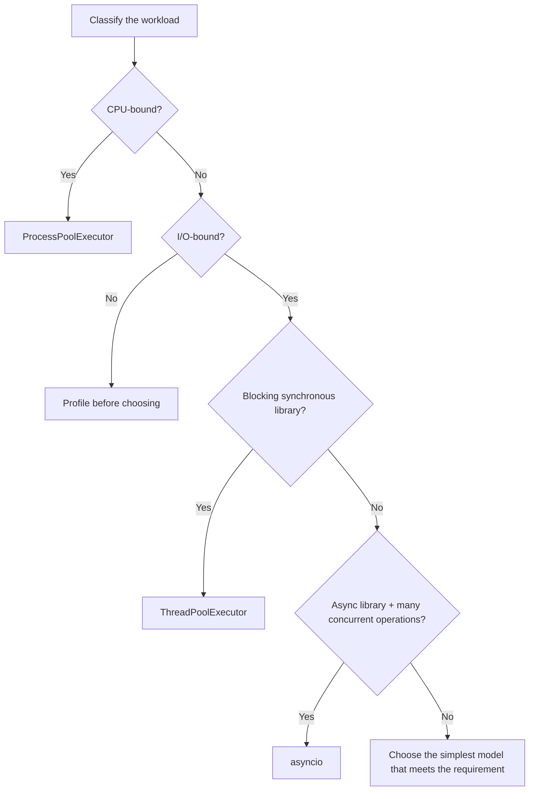

# Multithreading vs Multiprocessing vs Asyncio

> Choose the concurrency model based on **what the program spends most of its time doing**.
>
> - **Threads** → blocking I/O with synchronous libraries.
> - **Processes** → CPU-heavy Python work that should use multiple CPU cores.
> - **Asyncio** → many concurrent I/O operations when async libraries are available.

## In Short

- **Concurrency** means multiple tasks make progress during the same period.
- **Parallelism** means multiple tasks actually execute at the same instant, usually on different CPU cores.
- In normal **GIL-enabled CPython**, threads are excellent for I/O but usually do not speed up CPU-heavy pure-Python code.
- `ProcessPoolExecutor` is the usual high-level choice for CPU-bound Python work.
- `asyncio` uses cooperative scheduling: a task gives control back to the event loop when it reaches `await`.
- `async def` alone does **not** make code concurrent; tasks must be scheduled together with `TaskGroup`, `gather()`, or `create_task()`.
- Never block the event loop with synchronous I/O or long CPU work.
- Always **bound concurrency** using worker limits, semaphores, queues, batches, or connection pools.



---

# 1. Concurrency vs Parallelism

## 1.1 Concurrency

Concurrency means tasks overlap in time. They may take turns rather than run at exactly the same instant.

```text
Time ---------------------------------------------------->
Task A: RUN ---- WAIT -------- RUN -------- WAIT --- RUN
Task B:      RUN ------ WAIT -------- RUN -------- RUN
Task C:           RUN ----------- WAIT -------- RUN
```

This is useful when tasks spend time waiting for APIs, databases, files, sockets, or other external resources.

## 1.2 Parallelism

Parallelism means work is executed simultaneously, normally on different CPU cores.

```text
CPU Core 1:  Task A ==============================>
CPU Core 2:  Task B ==============================>
CPU Core 3:  Task C ==============================>
```

For CPU-heavy pure-Python work, processes remain the safest general-purpose choice in normal GIL-enabled CPython.

---

# 2. Multithreading

A thread is an execution path inside a process. Threads share the same process memory, modules, open files, and Python objects.



## 2.1 Best Use Case

Use threads when the work is **I/O-bound** and the library exposes a blocking/synchronous API.

Common examples:

- Calling REST APIs with a synchronous HTTP client
- Uploading files through a blocking SDK
- Reading many independent files
- Running blocking database calls from a batch script
- Integrating older synchronous libraries into a concurrent workflow

## 2.2 Threads and the GIL

In the standard GIL-enabled CPython build, only one thread normally executes Python bytecode at a time.

```text
Thread 1: Python work ---- pause ---- Python work
Thread 2: ------------ Python work ---- pause -----
```

That is why threads usually do not make CPU-heavy pure-Python code faster.

For I/O, the situation is different:

```text
Thread 1: request -> WAIT ----------------> response
Thread 2:           request -> WAIT ---------------->
Thread 3:              file read -> WAIT ----------->
```

While one thread waits, another thread can make progress.

> Native libraries can release the GIL, so some C/C++/Rust-backed workloads may still run effectively in parallel with threads. Benchmark the real library instead of assuming.

## 2.3 High-Level API

For normal application code, prefer `ThreadPoolExecutor` over manually creating many `Thread` objects.

```python
from concurrent.futures import ThreadPoolExecutor

with ThreadPoolExecutor(max_workers=10) as executor:
    results = list(executor.map(blocking_call, items))
```

### Shared-State Risk

Because threads share memory, mutable state can create race conditions.

```text
Thread A ----\
             > Shared object -> race condition risk
Thread B ----/
```

Use locks only around small critical sections, and prefer queues or clear ownership when possible.

---

# 3. Multiprocessing

Multiprocessing runs work in separate operating-system processes. Each process has its own Python interpreter and memory space.



## 3.1 Best Use Case

Use processes for **CPU-bound** work that can be split into independent tasks.

Common examples:

- CPU-heavy image processing
- Large pure-Python calculations
- Parsing or transforming large independent files
- Compression/encryption implemented mostly in Python
- Data-processing jobs that can be divided into chunks

## 3.2 Why Processes Help

Separate processes can execute Python work on different CPU cores at the same time.

The trade-off is additional overhead:

- More memory
- Process startup cost
- Serialization with `pickle`
- Data copying / IPC
- More expensive worker communication

## 3.3 High-Level API

```python
from concurrent.futures import ProcessPoolExecutor

if __name__ == "__main__":
    with ProcessPoolExecutor() as executor:
        results = list(executor.map(cpu_heavy_function, items))
```

The `if __name__ == "__main__":` guard is important for portable multiprocessing code because worker processes need to safely import the main module.

### Task Granularity Matters

Avoid sending millions of tiny tasks individually.

```text
Bad:
10,000,000 tiny jobs
      -> serialization + scheduling overhead

Better:
Input -> meaningful chunks -> worker processes -> combine results
```

---

# 4. Asyncio

`asyncio` provides cooperative concurrency using an event loop, coroutines, tasks, and `async`/`await`.



## 4.1 Best Use Case

Use `asyncio` when:

- Work is mainly I/O-bound.
- The libraries provide async APIs.
- The application handles many concurrent network operations.
- You are building an async API server, WebSocket service, crawler, chat system, or high-concurrency integration service.

Typical examples include FastAPI async endpoints, async database drivers, async HTTP clients, WebSockets, and message consumers.

## 4.2 Cooperative Scheduling

A coroutine gives control back to the event loop at `await` points.

```text
Task A: RUN -> await network -----------------> RUN
                  |
                  v
Task B:            RUN -> await database -----> RUN
```

A long CPU loop or a blocking synchronous call does not automatically yield control, so it can freeze the entire event-loop thread.

## 4.3 Concurrent Async Tasks

This is async but sequential:

```python
for user_id in user_ids:
    user = await fetch_user(user_id)
```

This schedules work concurrently:

```python
async with asyncio.TaskGroup() as group:
    for user_id in user_ids:
        group.create_task(fetch_user(user_id))
```

`TaskGroup` is a strong default when related tasks should succeed or fail as a group. `asyncio.gather()` is still useful when you specifically want its result-collection behavior.

## 4.4 Blocking Code Inside Asyncio

For unavoidable **blocking I/O**, move the call to a worker thread:

```python
result = await asyncio.to_thread(blocking_sdk_call, payload)
```

For heavy CPU work, use a process pool or an external background worker instead.



---

# 5. Quick Comparison

| Area | Threads | Processes | Asyncio |
|---|---|---|---|
| Execution unit | OS thread | OS process | Coroutine/task |
| Memory | Shared | Separate by default | Shared in event-loop process |
| Best for | Blocking I/O | CPU-bound Python work | High-concurrency async I/O |
| Pure-Python CPU parallelism in normal GIL build | Usually no | Yes | No, not by itself |
| Communication | Shared objects | IPC / serialization | Direct objects between tasks |
| Overhead | Moderate | Highest | Very low per task |
| Main risk | Races / deadlocks | Serialization / process cost | Blocking the event loop |
| Common API | `ThreadPoolExecutor` | `ProcessPoolExecutor` | `asyncio`, `TaskGroup` |

## 5.1 Fast Mental Rule

```text
Blocking synchronous I/O  -> ThreadPoolExecutor
CPU-heavy Python work      -> ProcessPoolExecutor
Many async I/O operations  -> asyncio
```

---

# 6. One Practical Example: Document Processing Service

Assume a backend receives many documents and must:

1. Download each file from cloud storage.
2. Extract/transform CPU-heavy content.
3. Send results to several async downstream services.

The best design can combine all three models:



```python
import asyncio
from concurrent.futures import ProcessPoolExecutor


def transform_document(data: bytes) -> dict:
    # Represents CPU-heavy pure-Python work.
    return {"size": len(data), "score": sum(data) % 100}


def blocking_download(document_id: str) -> bytes:
    # Represents a synchronous cloud/storage SDK.
    return b"sample-document-data"


async def send_result(result: dict) -> None:
    # Represents async HTTP or database I/O.
    await asyncio.sleep(0.1)


async def process_document(
    document_id: str,
    process_pool: ProcessPoolExecutor,
) -> None:
    # Blocking I/O -> thread.
    data = await asyncio.to_thread(blocking_download, document_id)

    # CPU-heavy work -> process.
    loop = asyncio.get_running_loop()
    result = await loop.run_in_executor(
        process_pool,
        transform_document,
        data,
    )

    # Async I/O -> event loop.
    await send_result(result)


async def main() -> None:
    document_ids = ["doc-1", "doc-2", "doc-3"]

    with ProcessPoolExecutor() as process_pool:
        async with asyncio.TaskGroup() as group:
            for document_id in document_ids:
                group.create_task(
                    process_document(document_id, process_pool)
                )


if __name__ == "__main__":
    asyncio.run(main())
```

### Why This Design Works

- The event loop stays free for network orchestration.
- Blocking synchronous SDK work does not freeze the event loop.
- CPU-heavy Python work can use multiple CPU cores.
- Each model is used only where it provides a real benefit.

This is the most important interview-level lesson: **real systems often combine concurrency models instead of forcing every task into one model.**

---

# 7. Production Best Practices

## 7.1 Bound Concurrency

More workers are not always better. Systems are limited by:

- Database connection pools
- File descriptors
- API rate limits
- CPU cores
- Memory
- Downstream-service capacity

Use semaphores, worker pools, bounded queues, batches, or rate limiters.

## 7.2 Add Timeouts and Cancellation

External operations can hang. Use sensible network/database timeouts and propagate cancellation cleanly.

For asyncio, cleanup normally belongs in `try/finally`, and `CancelledError` should usually be re-raised after cleanup.

## 7.3 Keep Work Independent

Concurrency becomes easier when tasks do not constantly modify shared mutable state.

Prefer:

```text
Producer -> Queue -> Workers -> Results
```

instead of many workers directly mutating the same object.

## 7.4 Measure the Real Bottleneck

Profile before changing the architecture. Measure:

- Throughput
- p95/p99 latency
- CPU usage
- Memory
- Queue wait time
- Error/timeout rate
- Event-loop lag for async services

---

# 8. Modern Python Note

## 8.1 Free-Threaded CPython

CPython has supported optional **free-threaded builds** since Python 3.13. In those builds, the GIL can be disabled and Python threads can execute on multiple CPU cores in parallel.

However:

- The normal GIL-enabled build is still an important deployment assumption unless the environment explicitly uses free-threading.
- Some third-party extension modules may not fully support free-threaded execution and can cause the GIL to be enabled.
- Removing the GIL does not remove race conditions or the need for synchronization.
- Performance and library compatibility should be measured for the real deployment.

For interviews, state the assumption clearly:

> **In normal GIL-enabled CPython, use threads mainly for blocking I/O and processes for CPU-heavy pure-Python work. Free-threaded CPython changes that constraint, but it must be an explicit deployment choice.**

## 8.2 InterpreterPoolExecutor

Python 3.14 added `InterpreterPoolExecutor`. Each worker runs in its own interpreter and can provide true multi-core parallelism while staying inside one process.

It is useful to know for modern Python interviews, but it is not yet the first tool most teams should reach for because interpreters are isolated and mutable data cannot be freely shared between them.

Start with the common tools first:

```text
ThreadPoolExecutor  -> blocking I/O
ProcessPoolExecutor -> CPU-heavy Python
asyncio             -> high-concurrency async I/O
```

---

# 9. Final Interview Mental Model



> The key is not to memorize “threads vs processes vs async.” The key is to identify **where time is being spent**, then choose the model that removes that bottleneck with the least complexity.

---

# 10. References

Official Python documentation:

- Concurrent execution: https://docs.python.org/3/library/concurrency.html
- `concurrent.futures`: https://docs.python.org/3/library/concurrent.futures.html
- `threading`: https://docs.python.org/3/library/threading.html
- `multiprocessing`: https://docs.python.org/3/library/multiprocessing.html
- `asyncio`: https://docs.python.org/3/library/asyncio.html
- Coroutines and tasks: https://docs.python.org/3/library/asyncio-task.html
- Free-threaded Python: https://docs.python.org/3/howto/free-threading-python.html
