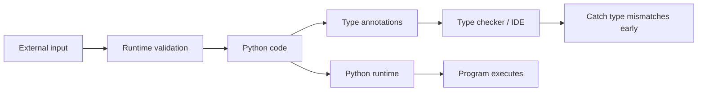
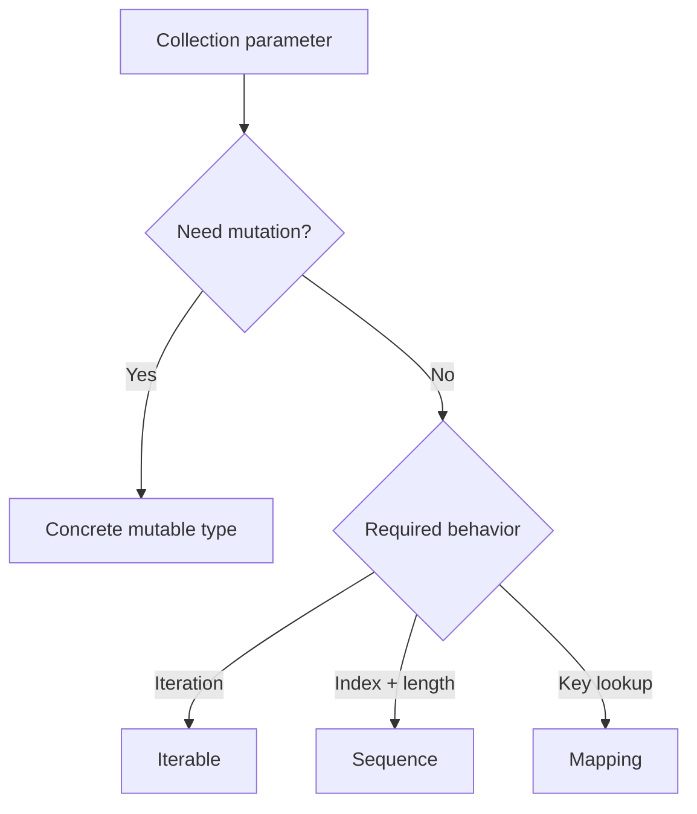
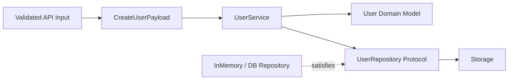
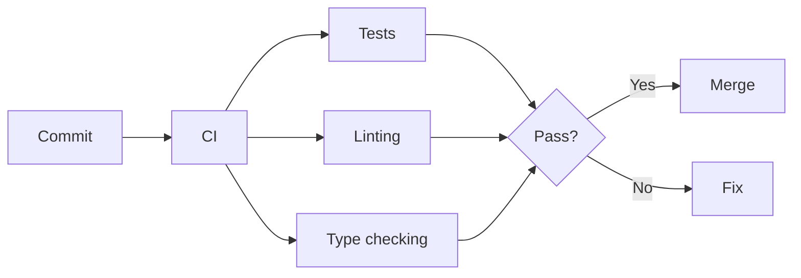

# Type Hints and the `typing` Module

> Type hints describe the expected types of values in Python. They improve readability, IDE support, refactoring, and static analysis, but Python does **not** enforce them automatically at runtime.

> **Version note:** This guide uses modern Python syntax and is aligned with the Python 3.14 typing model. Features introduced in newer Python versions are marked where useful.

## In Short

- Use type hints to define clear contracts for function parameters, return values, variables, and object attributes.
- Python remains dynamically typed; annotations do not automatically validate runtime values.
- Prefer modern syntax such as `list[str]`, `dict[str, int]`, and `str | None`.
- Prefer abstract input types such as `Sequence`, `Iterable`, and `Mapping` when mutation is not required.
- Use `TypedDict` for structured dictionaries and `Protocol` for behavior-based dependencies.
- Use generics when the output type should stay related to the input type.
- Use type narrowing with `isinstance()`, `is None`, equality checks, `TypeIs`, or `TypeGuard`.
- Keep runtime validation separate from static typing, especially for API requests, JSON, user input, and external data.



---

# 1. Core Mental Model

Python is a **dynamically typed** language. A variable can reference values of different types during execution:

```python
value = 10
value = "ten"
```

Type hints describe what a value is **expected** to be:

```python
value: int = 10


def calculate_total(price: float, quantity: int) -> float:
    return price * quantity
```

Here:

- `price: float` describes the expected parameter type.
- `quantity: int` describes the expected parameter type.
- `-> float` describes the expected return type.

## Runtime Behavior

Annotations do not automatically reject incorrect values:

```python
def double(value: int) -> int:
    return value * 2


double("hello")  # Python still runs this call.
```

A static type checker can report this call before execution, but Python itself does not reject it because of the annotation.

**Important interview concept:** type hints provide **static guarantees for developers and tools**, not automatic runtime validation.

---

# 2. Essential Type Hint Syntax

The same annotation syntax is used for variables, parameters, return values, and attributes.

```python
name: str = "Aarav"
age: int = 30
price: float = 99.5
is_active: bool = True


def add(left: int, right: int) -> int:
    return left + right


def log_message(message: str) -> None:
    print(message)
```

For class attributes:

```python
class User:
    def __init__(self, user_id: int, name: str) -> None:
        self.user_id = user_id
        self.name = name
```

A checker can usually infer `self.user_id` and `self.name` from the constructor parameters, so explicit attribute annotations are not always necessary.

---

# 3. Collections and Abstract Input Types

Use built-in generic collections for concrete containers:

```python
user_ids: list[int] = [101, 102, 103]
names: list[str] = ["Aarav", "Diya"]
scores: dict[str, int] = {"Aarav": 95, "Diya": 91}
permissions: set[str] = {"read", "write"}
coordinate: tuple[float, float] = (23.02, 72.57)
values: tuple[int, ...] = (1, 2, 3)
```

## Prefer Behavior-Based Inputs

If a function only reads a collection, prefer an abstraction from `collections.abc`:

```python
from collections.abc import Mapping, Sequence


def first_name(names: Sequence[str]) -> str:
    return names[0]


def get_timeout(config: Mapping[str, int]) -> int:
    return config.get("timeout", 30)
```

### Practical Selection

| Need | Prefer |
|---|---|
| Concrete mutable list | `list[T]` |
| Iterate over values | `Iterable[T]` |
| Read by index and length | `Sequence[T]` |
| Key-value lookup | `Mapping[K, V]` |
| Concrete mutable dictionary | `dict[K, V]` |



Using the narrowest required behavior makes APIs more flexible and often improves type compatibility.

---

# 4. Unions, Optional Values, `Literal`, and Narrowing

## Union Types

Use `|` when a value may have more than one type:

```python
def normalize_id(value: int | str) -> str:
    return str(value)
```

## Optional Values

A value that may be absent is written as a union with `None`:

```python
def find_email(user_id: int) -> str | None:
    ...
```

A default value of `None` must also be represented in the annotation:

```python
# Incorrect
# def find_user(user_id: int = None): ...

# Correct
def find_user(user_id: int | None = None) -> str:
    ...
```

## `Literal`

Use `Literal` when only specific values are valid:

```python
from typing import Literal

Status = Literal["pending", "approved", "rejected"]
```

Use an `Enum` instead when the values need stronger runtime identity or domain behavior.

## Type Narrowing

A checker can make a broad type more specific after a runtime condition:

```python
def format_value(value: int | str) -> str:
    if isinstance(value, int):
        return f"{value:,}"

    return value.upper()
```

Common narrowing checks include:

- `isinstance(value, Type)`
- `value is None`
- equality checks for `Literal` values
- `match` statements
- custom predicates using `TypeIs` or `TypeGuard`

---

# 5. `Any`, `object`, and Precise Types

These types communicate very different contracts.

| Type | Accepts any value | Checker restricts operations | Typical use |
|---|---:|---:|---|
| Precise type such as `str` | No | Yes | Normal application code |
| `object` | Yes | Yes | Unknown value that must be inspected |
| `Any` | Yes | Mostly no | Dynamic or untyped boundary |

## `object`

Use `object` when any value may arrive but the code must prove its type before using type-specific methods:

```python
def describe(value: object) -> str:
    if isinstance(value, str):
        return value.upper()

    return repr(value)
```

## `Any`

`Any` disables much of the checker's protection:

```python
from typing import Any


def process(value: Any) -> Any:
    return value.some_unknown_method()
```

Use `Any` only where dynamic behavior is genuinely unavoidable, then convert it to precise types as early as possible.

---

# 6. Structured Data with `TypedDict`

A normal dictionary type describes key and value categories but not an exact shape:

```python
user: dict[str, object]
```

`TypedDict` describes expected keys and the type of each value:

```python
from typing import NotRequired, TypedDict


class UserPayload(TypedDict):
    id: int
    name: str
    email: str
    phone: NotRequired[str]
```

A checker can detect missing keys, invalid keys, and incorrect value types.

## Read-Only Keys

Python 3.13+ supports `ReadOnly` for `TypedDict` items:

```python
from typing import ReadOnly, TypedDict


class UserRecord(TypedDict):
    id: ReadOnly[int]
    name: str
```

This is a **static restriction**. It is not automatic runtime protection.

## `TypedDict` vs Runtime Models

Use `TypedDict` when you need a typed dictionary shape. Use a dataclass, Pydantic model, or normal class when you need runtime validation, behavior, methods, or richer domain modeling.

---

# 7. Type Aliases and `NewType`

## Type Aliases

Use an alias to make a complex annotation easier to understand:

```python
# Python 3.12+
type UserId = int
type Headers = dict[str, str]
type Record = tuple[int, str | None]
```

A type alias does **not** create a new logical type. `UserId` and `int` remain interchangeable to a checker.

## `NewType`

Use `NewType` when logically different values share the same runtime type but should not be mixed accidentally:

```python
from typing import NewType

UserId = NewType("UserId", int)
OrderId = NewType("OrderId", int)


def load_user(user_id: UserId) -> None:
    ...
```

A checker can reject `OrderId` where `UserId` is required.

### Selection Rule

| Requirement | Use |
|---|---|
| Improve readability | Type alias |
| Keep types interchangeable | Type alias |
| Prevent mixing logical IDs | `NewType` |

---

# 8. Generics

Generics preserve relationships between input and output types.

Without a generic:

```python
def first(values: list[int] | list[str]) -> int | str:
    return values[0]
```

The return type remains broad even when the caller passes only strings.

With Python 3.12+ type parameter syntax:

```python
def first[T](values: list[T]) -> T:
    return values[0]
```

Now:

```python
number = first([10, 20])        # int
name = first(["Aarav", "Diya"])  # str
```

The relationship is:

```text
list[T] -> first() -> T
```

For Python 3.11 and earlier, the same pattern is commonly written with `TypeVar`.

## Generic Classes

```python
class Box[T]:
    def __init__(self, value: T) -> None:
        self._value = value

    def get(self) -> T:
        return self._value
```

Generics are especially useful for repositories, result wrappers, caches, collections, parsers, and reusable infrastructure.

---

# 9. `Protocol` and Structural Typing

`Protocol` defines an interface by required **behavior**, not inheritance.

```python
from typing import Protocol


class PaymentGateway(Protocol):
    def charge(self, customer_id: str, amount: float) -> str:
        ...
```

Any class with a compatible `charge()` method satisfies the protocol:

```python
class StripeGateway:
    def charge(self, customer_id: str, amount: float) -> str:
        return "txn_123"
```

The class does not need to inherit from `PaymentGateway`.

## Why It Matters

Protocols are useful at dependency boundaries such as:

- repositories
- payment gateways
- queues
- storage clients
- notification services
- external API clients

They improve testability and reduce coupling between application logic and concrete implementations.

### `Protocol` vs Abstract Base Class

| Requirement | `Protocol` | ABC |
|---|---:|---:|
| Match by behavior | Yes | No |
| Explicit inheritance required | No | Usually yes |
| Share implementation | Limited | Yes |
| Good dependency boundary | Excellent | Good |

> `@runtime_checkable` can make selected protocols usable with `isinstance()`, but that runtime check verifies attribute presence rather than full type signatures.

---

# 10. Callable Types, Decorators, Overloads, and `Self`

## `Callable`

Use `Callable` when a function is passed as a value:

```python
from collections.abc import Callable


def apply_operation(
    left: int,
    right: int,
    operation: Callable[[int, int], int],
) -> int:
    return operation(left, right)
```

## `ParamSpec`

Use `ParamSpec` when a decorator must preserve the wrapped function's complete parameter signature:

```python
from collections.abc import Callable
from functools import wraps


def log_calls[R, **P](func: Callable[P, R]) -> Callable[P, R]:
    @wraps(func)
    def wrapper(*args: P.args, **kwargs: P.kwargs) -> R:
        print(f"Calling {func.__name__}")
        return func(*args, **kwargs)

    return wrapper
```

This is important for logging, retry, authorization, caching, transaction, and middleware-style decorators.

## `@overload`

Use overloads when the return type depends on the input signature:

```python
from typing import overload


@overload
def parse(value: str) -> str: ...


@overload
def parse(value: bytes) -> bytes: ...


def parse(value: str | bytes) -> str | bytes:
    return value.strip()
```

Prefer a generic when it expresses the same relationship more simply.

## `Self`

Use `Self` when a method returns the current instance type, including subclasses:

```python
from typing import Self


class QueryBuilder:
    def where(self, condition: str) -> Self:
        return self
```

This is useful for fluent APIs, builders, alternative constructors, and clone-style methods.

---

# 11. Useful Typing Utilities

These tools are important to recognize, but most application code uses them selectively.

| Utility | Purpose |
|---|---|
| `Final` | Name should not be reassigned |
| `ClassVar` | Attribute belongs to the class, not instances |
| `@override` | Method is intended to override a base method |
| `cast()` | Tell the checker to trust a more specific type |
| `assert_never()` | Verify exhaustive handling |
| `TypeIs` | Custom type predicate with narrowing in true and false branches |
| `TypeGuard` | Custom predicate useful for some invariant generic narrowing |
| `Annotated` | Attach library/tool-specific metadata to a type |
| `TYPE_CHECKING` | Code executed by type checkers but not normal runtime |

## `cast()` Does Not Validate

```python
from typing import cast

value: object = 123
text = cast(str, value)
```

`text` is treated as `str` by the checker, but the runtime value is still the integer `123`.

## `@override`

```python
from typing import override


class BaseService:
    def execute(self) -> None:
        ...


class UserService(BaseService):
    @override
    def execute(self) -> None:
        print("Executing")
```

A checker can report an error if the base method is renamed or the subclass method no longer overrides anything.

## `TypeIs` and `TypeGuard`

`TypeIs` was added in Python 3.13 and is usually the natural choice when the narrowed type is compatible with the input type.

```python
from typing import TypeIs


def is_string(value: object) -> TypeIs[str]:
    return isinstance(value, str)
```

`TypeGuard` remains useful for cases such as narrowing `list[object]` to `list[str]`, where invariance makes the types incompatible as normal subtypes.

---

# 12. Async, Iterator, and Generator Types

Annotate an `async def` function with the value produced **after awaiting it**:

```python
async def fetch_user(user_id: int) -> dict[str, object]:
    ...
```

The call returns a coroutine object, but:

```python
user = await fetch_user(101)
```

`user` is typed as `dict[str, object]`.

## Iterators

```python
from collections.abc import Iterator


def count_up_to(limit: int) -> Iterator[int]:
    for number in range(1, limit + 1):
        yield number
```

For most simple generators, `Iterator[T]` is enough.

Use `Generator[YieldType, SendType, ReturnType]` only when the generator also receives values through `send()` or has a meaningful generator return value.

For asynchronous generators, use `AsyncIterator[T]`.

---

# 13. Python 3.14 Annotation Behavior

Python 3.14 changed the default annotation model: annotations are now **lazily evaluated** instead of being evaluated eagerly when a function, class, or module is defined.

This improves forward-reference handling and changes how frameworks should inspect annotations.

## Introspection

For normal type-hint resolution, `typing.get_type_hints()` remains useful:

```python
from typing import get_type_hints


def greet(name: str) -> str:
    return f"Hello, {name}"


hints = get_type_hints(greet)
```

Python 3.14 also introduced `annotationlib` for lower-level, reliable annotation introspection:

```python
from annotationlib import get_annotations

annotations = get_annotations(greet)
```

### Practical Rule

Most application developers do not need to manipulate annotation internals directly. This matters mainly when building frameworks, dependency-injection systems, schema libraries, serializers, ORMs, or developer tooling.

Annotation evaluation can execute code, so libraries should treat annotation introspection carefully when data or namespaces are untrusted.

---

# 14. Practical Application Example

The following example combines the typing features that are frequently useful in real backend development.

## Domain Model and Typed Input

```python
from dataclasses import dataclass
from typing import NewType, NotRequired, Protocol, TypedDict

UserId = NewType("UserId", int)


@dataclass(frozen=True)
class User:
    id: UserId
    name: str
    email: str


class CreateUserPayload(TypedDict):
    name: str
    email: str
    phone: NotRequired[str]
```

## Repository Contract

```python
class UserRepository(Protocol):
    def save(self, user: User) -> None:
        ...

    def get(self, user_id: UserId) -> User | None:
        ...
```

## Repository Implementation

```python
class InMemoryUserRepository:
    def __init__(self) -> None:
        self._users: dict[UserId, User] = {}

    def save(self, user: User) -> None:
        self._users[user.id] = user

    def get(self, user_id: UserId) -> User | None:
        return self._users.get(user_id)
```

## Service Layer

```python
class UserService:
    def __init__(self, repository: UserRepository) -> None:
        self._repository = repository
        self._next_id = 1

    def create(self, payload: CreateUserPayload) -> User:
        user = User(
            id=UserId(self._next_id),
            name=payload["name"],
            email=payload["email"],
        )
        self._repository.save(user)
        self._next_id += 1
        return user

    def find(self, user_id: UserId) -> User | None:
        return self._repository.get(user_id)
```

## Architecture



## What the Types Give Us

- `CreateUserPayload` documents the dictionary structure.
- `UserId` prevents accidental mixing with unrelated integer identifiers.
- `UserRepository` decouples business logic from storage implementation.
- `User | None` forces callers to consider a missing user.
- The dataclass gives the domain object an explicit shape.
- Runtime validation should happen **before** untrusted API input is treated as trusted application data.

---

# 15. Development Workflow and Best Practices

## Type Important Boundaries First

Prioritize:

1. Public functions and methods
2. Service interfaces
3. Repository contracts
4. API/application boundaries
5. Data transformation functions
6. Shared utilities

## Run a Static Type Checker

Common choices include Mypy and Pyright.

Example with Mypy:

```bash
python -m pip install mypy
mypy app/
```

A gradual configuration is usually easier to adopt than enabling maximum strictness immediately.

```toml
[tool.mypy]
python_version = "3.14"
warn_unused_ignores = true
check_untyped_defs = true
```

## Add Type Checking to CI



## Practical Best Practices

- Prefer `list[str]` over legacy `typing.List[str]` in modern Python.
- Prefer `X | None` over `Optional[X]` in modern code.
- Prefer `collections.abc` interfaces such as `Sequence`, `Mapping`, `Iterable`, and `Callable` for behavior-based APIs.
- Avoid spreading `Any` through the application.
- Use `Protocol` at dependency boundaries when inheritance is unnecessary.
- Use generics to preserve input-output type relationships.
- Use `@override` on important subclass methods.
- Keep annotations readable; introduce type aliases for complex repeated types.
- Do not use `cast()` simply to silence checker errors without understanding the mismatch.
- Validate untrusted runtime data separately from type checking.
- Match your syntax and checker configuration to the project's minimum supported Python version.

---

# 16. Quick Reference

## Frequently Used Types

| Requirement | Annotation |
|---|---|
| Integer | `int` |
| Decimal number | `float` |
| Text | `str` |
| Boolean | `bool` |
| No meaningful return | `None` |
| List of strings | `list[str]` |
| Dictionary | `dict[str, int]` |
| Read-only sequence | `Sequence[T]` |
| Read-only mapping | `Mapping[K, V]` |
| Multiple possible types | `int | str` |
| Optional value | `str | None` |
| Exact allowed values | `Literal[...]` |
| Structured dictionary | `TypedDict` |
| Behavior-based interface | `Protocol` |
| Reusable type relationship | Generic type parameter |
| Function parameter | `Callable[[A, B], R]` |
| Current instance/subclass | `Self` |
| Unknown but safely restricted value | `object` |
| Unrestricted dynamic value | `Any` |

## Version-Aware Features

| Feature | Availability |
|---|---|
| `list[str]` built-in generics | Python 3.9+ |
| `X | Y` union syntax | Python 3.10+ |
| `Self` | Python 3.11+ |
| `Required` / `NotRequired` | Python 3.11+ |
| `def func[T](...)` type parameters | Python 3.12+ |
| `type Alias = ...` | Python 3.12+ |
| `@override` | Python 3.12+ |
| `ReadOnly` for `TypedDict` | Python 3.13+ |
| `TypeIs` | Python 3.13+ |
| Deferred annotation evaluation by default | Python 3.14+ |
| `annotationlib` | Python 3.14+ |

When supporting older Python versions, use compatible syntax and `typing_extensions` for selected newer typing features.

---

# Final Takeaway

Type hints are most valuable when they make application contracts explicit without making code harder to read. In day-to-day backend development, the highest-value tools are usually:

- precise function signatures
- modern collection types
- unions and `None`
- `TypedDict`
- `Protocol`
- generics
- type narrowing
- `Callable` / `ParamSpec` for wrappers
- `@override`
- clear separation between static typing and runtime validation

Use advanced typing only when it solves a real design problem. The goal is not to annotate every possible detail; the goal is to make code safer, easier to understand, and easier to change.
