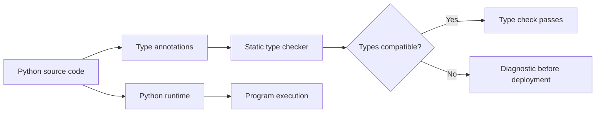
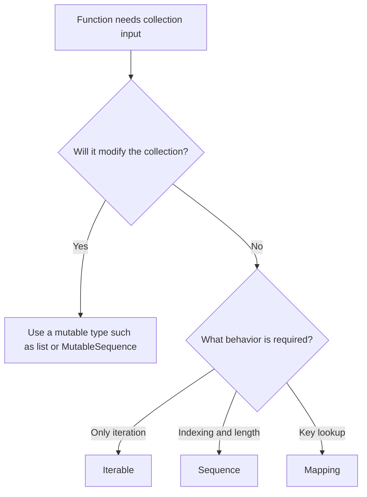
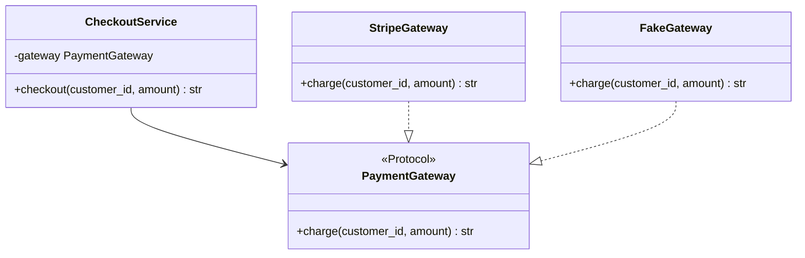
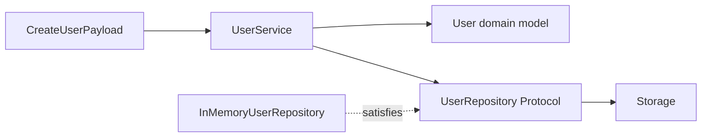
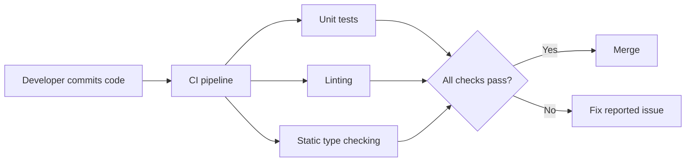
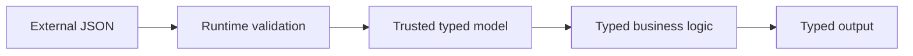

# Type Hints and the `typing` Module

> Type hints describe the expected types of variables, function parameters, return values, and objects. They help developers and static type checkers find mistakes before the code runs, but Python does not enforce them automatically at runtime.

---

# 1. What Type Hints Are

Python is a **dynamically typed language**. A variable can refer to values of different types during execution.

```python
value = 10
value = "ten"
```

Type hints let us describe what type a value is **expected** to have.

```python
value: int = 10
```

A function can describe the types of its parameters and return value:

```python
def calculate_total(price: float, quantity: int) -> float:
    return price * quantity
```

Here:

- `price: float` means `price` should be a floating-point number.
- `quantity: int` means `quantity` should be an integer.
- `-> float` means the function should return a floating-point number.

## Important Rule

Type hints are not automatic runtime validation.

```python
def double(value: int) -> int:
    return value * 2


double("hello")  # Python still executes this at runtime.
```

A static type checker reports that call as incorrect, but normal Python execution does not reject it only because of the annotation.

---

# 2. Why Type Hints Matter

Type hints improve normal development in several ways.

## 2.1 Earlier Error Detection

```python
def get_user_name(user_id: int) -> str:
    return user_id
```

A type checker can detect that the function declares `str` but returns `int`.

## 2.2 Better IDE Support

Editors can provide:

- More accurate autocomplete
- Safer refactoring
- Parameter information
- Return-type information
- Navigation between related definitions

## 2.3 Clearer Function Contracts

Without type hints:

```python
def find_order(order_id):
    ...
```

With type hints:

```python
def find_order(order_id: int) -> "Order | None":
    ...
```

The second version communicates that:

- The input is an integer.
- The result is either an `Order` or `None`.

## 2.4 Safer Refactoring

When a return type or data structure changes, a type checker can identify affected callers across the project.

## 2.5 Better Team Communication

Type hints act as executable documentation. They explain what data flows through the application without requiring developers to inspect every implementation.

---

# 3. How Static Type Checking Works

Type hints are mainly consumed by tools such as:

- Mypy
- Pyright
- IDE language servers
- Linters and code-quality tools



The runtime and type-checking paths are related but separate.

```python
def send_email(address: str) -> None:
    print(f"Sending to {address}")
```

A type checker can reject:

```python
send_email(123)
```

Python itself may still call the function unless the application performs explicit runtime validation.

## Gradual Typing

Python uses **gradual typing**. You can add type hints gradually instead of typing the entire codebase at once.

```python
def legacy_function(data):
    return data


def typed_function(name: str) -> str:
    return name.upper()
```

Typed and untyped code can coexist.

---

# 4. Basic Type Hint Syntax

## 4.1 Variables

```python
name: str = "Aarav"
age: int = 30
price: float = 99.50
is_active: bool = True
payload: bytes = b"data"
```

## 4.2 Function Parameters

```python
def greet(name: str) -> str:
    return f"Hello, {name}"
```

## 4.3 Return Type

```python
def add(left: int, right: int) -> int:
    return left + right
```

## 4.4 Functions Returning Nothing

Use `None` when a function does not return a meaningful value.

```python
def log_message(message: str) -> None:
    print(message)
```

## 4.5 Default Values

The annotation describes the type; the assignment provides the default value.

```python
def connect(host: str, port: int = 5432) -> None:
    print(host, port)
```

## 4.6 Instance Attributes

```python
class User:
    def __init__(self, user_id: int, name: str) -> None:
        self.user_id: int = user_id
        self.name: str = name
        self.is_active: bool = True
```

In many cases, type checkers can infer the attribute type from the assigned constructor parameter:

```python
class User:
    def __init__(self, user_id: int, name: str) -> None:
        self.user_id = user_id
        self.name = name
```

Explicit attribute annotations are useful when inference is unclear or when attributes are declared outside `__init__`.

---

# 5. Typing Collections

Modern Python allows built-in collection classes to be parameterized directly.

## 5.1 Lists

```python
user_ids: list[int] = [101, 102, 103]
names: list[str] = ["Aarav", "Diya"]
```

## 5.2 Dictionaries

```python
scores: dict[str, int] = {
    "Aarav": 95,
    "Diya": 91,
}
```

## 5.3 Sets

```python
permissions: set[str] = {"read", "write"}
```

## 5.4 Tuples

A fixed-length tuple describes the type at each position:

```python
coordinate: tuple[float, float] = (23.02, 72.57)
```

A variable-length tuple uses `...`:

```python
values: tuple[int, ...] = (1, 2, 3, 4)
```

## 5.5 Prefer Abstract Input Types

A function that only reads values usually does not need a concrete `list`.

```python
from collections.abc import Sequence


def first_name(names: Sequence[str]) -> str:
    return names[0]
```

This accepts lists, tuples, and other sequence implementations.

For key-value input:

```python
from collections.abc import Mapping


def get_timeout(config: Mapping[str, int]) -> int:
    return config.get("timeout", 30)
```

## Practical Guideline

Use:

- `list[T]`, `dict[K, V]`, and `set[T]` when the concrete container matters.
- `Sequence[T]`, `Iterable[T]`, and `Mapping[K, V]` when the function only needs behavior.



---

# 6. Union Types and Optional Values

A union means a value can be one of multiple types.

## 6.1 Union with `|`

```python
def normalize_id(value: int | str) -> str:
    return str(value)
```

`int | str` means the parameter may be either an `int` or a `str`.

## 6.2 Optional Values

A value that may be absent is usually represented by a union with `None`.

```python
def find_email(user_id: int) -> str | None:
    ...
```

The older equivalent is:

```python
from typing import Optional


def find_email(user_id: int) -> Optional[str]:
    ...
```

For modern Python, `str | None` is normally clearer.

## 6.3 A Default of `None` Does Not Replace the Annotation

Incorrect:

```python
def find_user(user_id: int = None) -> "User":
    ...
```

Better:

```python
def find_user(user_id: int | None = None) -> "User":
    ...
```

The annotation should describe every value that is valid for the parameter.

---

# 7. `Any`, `object`, and Precise Types

These three choices communicate very different contracts.

## 7.1 Precise Type

```python
def uppercase(value: str) -> str:
    return value.upper()
```

This is the safest and most informative option.

## 7.2 `object`

Every Python value is an `object`, but operations are restricted until the type is narrowed.

```python
def describe(value: object) -> str:
    if isinstance(value, str):
        return value.upper()

    return repr(value)
```

`object` means:

> Any value may enter, but the code must prove what it is before using type-specific operations.

## 7.3 `Any`

`Any` effectively tells the type checker to trust the code.

```python
from typing import Any


def process(value: Any) -> Any:
    return value.some_unknown_method()
```

The checker usually allows operations on `Any`, even when they may fail at runtime.

## Comparison

| Type | Accepts any value | Type checker restricts operations | Safety |
|---|---:|---:|---|
| Precise type such as `str` | No | Yes | Highest |
| `object` | Yes | Yes | Good at boundaries |
| `Any` | Yes | Mostly no | Lowest |

## Recommended Use

Use `Any` mainly at unavoidable dynamic boundaries, such as:

- Untyped third-party libraries
- Legacy code
- Highly dynamic plugin systems
- Raw JSON before validation

Convert `Any` into a precise application type as early as possible.

---

# 8. Type Narrowing

Type narrowing is the process of converting a broad type into a more specific type after a runtime check.

```python
def format_value(value: int | str) -> str:
    if isinstance(value, int):
        return f"{value:,}"

    return value.upper()
```

Inside the `if` block, a type checker understands that `value` is an `int`. In the remaining branch, it understands that `value` is a `str`.

## 8.1 Narrowing `None`

```python
def display_name(name: str | None) -> str:
    if name is None:
        return "Anonymous"

    return name.upper()
```

## 8.2 Narrowing with Membership or Equality

```python
from typing import Literal


Status = Literal["pending", "approved", "rejected"]


def status_message(status: Status) -> str:
    if status == "approved":
        return "Request approved"

    if status == "rejected":
        return "Request rejected"

    return "Request is pending"
```

## 8.3 Exhaustiveness with `assert_never`

```python
from typing import assert_never


def status_message(status: Status) -> str:
    match status:
        case "pending":
            return "Request is pending"
        case "approved":
            return "Request approved"
        case "rejected":
            return "Request rejected"
        case _:
            assert_never(status)
```

If a new status is later added but not handled, a type checker can report the missing case.

---

# 9. Callable Types

Use `Callable` to describe a function passed as a value.

```python
from collections.abc import Callable


def apply_operation(
    left: int,
    right: int,
    operation: Callable[[int, int], int],
) -> int:
    return operation(left, right)
```

Usage:

```python
def add(left: int, right: int) -> int:
    return left + right


result = apply_operation(10, 20, add)
```

`Callable[[int, int], int]` means:

```text
Two integer parameters -> integer result
```

## Callback with No Parameters

```python
from collections.abc import Callable


def execute(callback: Callable[[], None]) -> None:
    callback()
```

## Callable with Unspecified Parameters

```python
from collections.abc import Callable
from typing import Any


handler: Callable[..., Any]
```

Use `Callable[..., ReturnType]` only when the parameter signature is genuinely unknown or intentionally unrestricted.

---

# 10. Type Aliases and `NewType`

## 10.1 Type Aliases

A type alias gives a readable name to a complex type.

### Python 3.12+

```python
type UserId = int
type Headers = dict[str, str]
type JsonValue = (
    None
    | bool
    | int
    | float
    | str
    | list["JsonValue"]
    | dict[str, "JsonValue"]
)
```

Usage:

```python
def get_user(user_id: UserId) -> dict[str, JsonValue]:
    ...
```

### Python 3.11 and Earlier

```python
from typing import TypeAlias


UserId: TypeAlias = int
Headers: TypeAlias = dict[str, str]
```

## 10.2 Type Alias Does Not Create a New Runtime Type

```python
type UserId = int

user_id: UserId = 10
order_id: int = user_id  # Valid
```

`UserId` and `int` are treated as equivalent by a type checker.

## 10.3 `NewType` Creates a Distinct Static Type

```python
from typing import NewType


UserId = NewType("UserId", int)
OrderId = NewType("OrderId", int)


def load_user(user_id: UserId) -> None:
    ...


load_user(UserId(10))   # Valid
load_user(OrderId(10))  # Type-checking error
load_user(10)           # Type-checking error
```

At runtime, `NewType` has almost no overhead. Its main value is preventing accidental mixing of logically different identifiers.

## Alias vs `NewType`

| Requirement | Use |
|---|---|
| Make a complex annotation easier to read | Type alias |
| Treat two values as statically interchangeable | Type alias |
| Prevent mixing IDs with the same underlying type | `NewType` |

---

# 11. `TypedDict` for Dictionary Structures

A normal dictionary annotation describes key and value types but does not describe specific keys.

```python
user: dict[str, object] = {
    "id": 101,
    "name": "Aarav",
}
```

`TypedDict` describes the expected dictionary shape.

```python
from typing import TypedDict


class UserPayload(TypedDict):
    id: int
    name: str
    email: str
```

Usage:

```python
def create_user(payload: UserPayload) -> int:
    return payload["id"]


user: UserPayload = {
    "id": 101,
    "name": "Aarav",
    "email": "aarav@example.com",
}
```

A type checker can identify:

- Missing required keys
- Unknown keys
- Incorrect value types
- Invalid dictionary access

## 11.1 Optional Keys

```python
from typing import NotRequired, TypedDict


class UserPayload(TypedDict):
    id: int
    name: str
    phone: NotRequired[str]
```

`phone` may be absent, but when present it must be a string.

## 11.2 Read-Only Keys

On supported Python versions, `ReadOnly` can communicate that a key should not be mutated through the typed interface.

```python
from typing import ReadOnly, TypedDict


class UserRecord(TypedDict):
    id: ReadOnly[int]
    name: str
```

## 11.3 `TypedDict` Is Not Runtime Validation

```python
class UserPayload(TypedDict):
    id: int
    name: str
```

This does not create a normal runtime model and does not automatically validate incoming API data. Use a runtime validation library or explicit validation when processing untrusted input.

## Common Use Cases

- JSON-like API payloads
- Configuration dictionaries
- Data returned by legacy functions
- Structured dictionaries passed between internal layers

Use a dataclass, Pydantic model, or normal class when runtime behavior, validation, methods, or object identity are needed.

---

# 12. `Literal`, `Final`, and `ClassVar`

## 12.1 `Literal`

`Literal` restricts a value to exact choices.

```python
from typing import Literal


LogLevel = Literal["debug", "info", "warning", "error"]


def configure_logging(level: LogLevel) -> None:
    ...
```

The following call is valid:

```python
configure_logging("info")
```

A checker rejects unsupported values:

```python
configure_logging("verbose")
```

Use an `Enum` instead when the values need behavior, stronger runtime identity, or broader domain modeling.

## 12.2 `Final`

`Final` tells a type checker that a name should not be reassigned.

```python
from typing import Final


MAX_RETRIES: Final[int] = 3
API_VERSION: Final = "v1"
```

A type checker reports:

```python
MAX_RETRIES = 5
```

`Final` is not the same as a runtime constant. Python can still mutate or reassign the value unless additional runtime controls exist.

## 12.3 `ClassVar`

`ClassVar` marks a value as a class-level attribute rather than an instance field.

```python
from typing import ClassVar


class User:
    table_name: ClassVar[str] = "users"

    def __init__(self, name: str) -> None:
        self.name = name
```

This distinction is especially useful for dataclasses and object models.

---

# 13. Generic Functions and Classes

Generics preserve relationships between input and output types.

## 13.1 Why a Union Is Sometimes Too Broad

```python
def first(values: list[int] | list[str]) -> int | str:
    return values[0]
```

When a caller passes `list[str]`, the checker still sees the result as `int | str`.

A generic function preserves the exact element type.

## 13.2 Generic Function: Python 3.12+

```python
def first[T](values: list[T]) -> T:
    return values[0]
```

Usage:

```python
number = first([10, 20, 30])       # Inferred as int
name = first(["Aarav", "Diya"])    # Inferred as str
```

The relationship is:


## 13.3 Generic Function: Compatible Syntax

```python
from typing import TypeVar


T = TypeVar("T")


def first(values: list[T]) -> T:
    return values[0]
```

## 13.4 Generic Class: Python 3.12+

```python
class Box[T]:
    def __init__(self, value: T) -> None:
        self._value = value

    def get(self) -> T:
        return self._value
```

Usage:

```python
int_box = Box(10)
value = int_box.get()  # int

str_box = Box("hello")
text = str_box.get()   # str
```

## 13.5 Generic Repository Example

```python
from collections.abc import Iterable


class Repository[T]:
    def __init__(self) -> None:
        self._items: dict[int, T] = {}

    def save(self, item_id: int, item: T) -> None:
        self._items[item_id] = item

    def get(self, item_id: int) -> T | None:
        return self._items.get(item_id)

    def all(self) -> Iterable[T]:
        return self._items.values()
```

The repository can be reused while preserving the model type:

```python
user_repository: Repository[User]
order_repository: Repository[Order]
```

---

# 14. Bounds, Constraints, and Variance

## 14.1 Bounded Type Parameters

A bound means the type parameter must be a subtype of a specific type.

### Python 3.12+

```python
from collections.abc import Sized


def longest[T: Sized](left: T, right: T) -> T:
    return left if len(left) >= len(right) else right
```

The function accepts values that support `len()` and returns the same input type.

### Compatible Syntax

```python
from collections.abc import Sized
from typing import TypeVar


T = TypeVar("T", bound=Sized)


def longest(left: T, right: T) -> T:
    return left if len(left) >= len(right) else right
```

## 14.2 Constrained Type Parameters

Constraints restrict a type variable to exact permitted families.

```python
def concat[T: (str, bytes)](left: T, right: T) -> T:
    return left + right
```

This accepts:

- `str` with `str`
- `bytes` with `bytes`

It rejects mixing them.

## 14.3 Variance: Practical Understanding

Variance describes how relationships between element types affect relationships between container types.

Assume:

```python
class Animal:
    pass


class Dog(Animal):
    pass
```

A `Dog` is an `Animal`, but `list[Dog]` is not safely usable as `list[Animal]`.

Why?

```python
def add_animal(animals: list[Animal]) -> None:
    animals.append(Animal())
```

If a `list[Dog]` were passed, the function could insert a non-dog `Animal` into it.

Mutable generic containers such as `list` are generally **invariant**.

Read-only abstractions such as `Sequence` can safely be more flexible:

```python
from collections.abc import Sequence


def print_animals(animals: Sequence[Animal]) -> None:
    for animal in animals:
        print(animal)
```

A `Sequence[Dog]` can usually be passed because the function cannot insert another animal.

## Practical Rule

Prefer read-only abstractions in function inputs when mutation is not required. This improves both design and type compatibility.

---

# 15. `Protocol` and Structural Typing

Normal class typing is usually **nominal**: compatibility is based on inheritance.

`Protocol` supports **structural typing**: compatibility is based on available methods and attributes.

This is similar to:

> If an object provides the required behavior, it can be used.

## 15.1 Basic Protocol

```python
from typing import Protocol


class Closable(Protocol):
    def close(self) -> None:
        ...
```

Any object with a compatible `close()` method satisfies the protocol.

```python
class FileResource:
    def close(self) -> None:
        print("File closed")


class DatabaseConnection:
    def close(self) -> None:
        print("Connection closed")
```

The function depends on behavior rather than concrete classes:

```python
def safely_close(resource: Closable) -> None:
    resource.close()
```

Both classes are valid:

```python
safely_close(FileResource())
safely_close(DatabaseConnection())
```

Neither class needs to inherit from `Closable`.

## 15.2 Dependency Injection Example

```python
from typing import Protocol


class PaymentGateway(Protocol):
    def charge(self, customer_id: str, amount: float) -> str:
        ...


class CheckoutService:
    def __init__(self, gateway: PaymentGateway) -> None:
        self._gateway = gateway

    def checkout(self, customer_id: str, amount: float) -> str:
        return self._gateway.charge(customer_id, amount)
```

Implementations:

```python
class StripeGateway:
    def charge(self, customer_id: str, amount: float) -> str:
        return "stripe-transaction-id"


class FakeGateway:
    def charge(self, customer_id: str, amount: float) -> str:
        return "test-transaction-id"
```

Both satisfy `PaymentGateway` structurally.



## Protocol vs Abstract Base Class

| Requirement | `Protocol` | Abstract Base Class |
|---|---:|---:|
| Existing class can match without inheritance | Yes | Usually no |
| Structural typing | Yes | No |
| Runtime implementation sharing | Limited | Yes |
| Strong explicit inheritance relationship | Optional | Yes |
| Good for dependency boundaries | Excellent | Good |

Use a protocol when consumers care about behavior, not the implementation hierarchy.

---

# 16. `Self` and Fluent APIs

`Self` represents the current class, including subclasses.

```python
from typing import Self


class QueryBuilder:
    def where(self, condition: str) -> Self:
        print(condition)
        return self

    def limit(self, count: int) -> Self:
        print(count)
        return self
```

Usage:

```python
query = QueryBuilder().where("active = true").limit(10)
```

`Self` is especially useful for:

- Fluent APIs
- Alternative constructors
- Clone methods
- Builder patterns
- Methods that return the current instance type

## Subclass Preservation

```python
class UserQueryBuilder(QueryBuilder):
    def active_only(self) -> Self:
        return self.where("active = true")
```

Calling `UserQueryBuilder().where(...)` is typed as `UserQueryBuilder`, not only `QueryBuilder`.

## Alternative Constructor

```python
from typing import Self


class User:
    def __init__(self, name: str) -> None:
        self.name = name

    @classmethod
    def from_dict(cls, data: dict[str, str]) -> Self:
        return cls(name=data["name"])
```

---

# 17. Function Overloading

`@overload` describes multiple valid call signatures when the return type depends on the input type.

```python
from typing import overload


@overload
def parse(value: str) -> str:
    ...


@overload
def parse(value: bytes) -> bytes:
    ...


def parse(value: str | bytes) -> str | bytes:
    return value.strip()
```

The overload declarations are for the type checker. The final implementation is the function that runs.

## Why a Union Alone Is Less Precise

```python
def parse(value: str | bytes) -> str | bytes:
    return value.strip()
```

With only this signature, passing `str` produces a result typed as `str | bytes`.

Overloads preserve the relationship:

```text
str input   -> str output
bytes input -> bytes output
```

## Use Overloads When

- Return type changes according to input type.
- Different parameter combinations are supported.
- A union cannot express the input-output relationship precisely.

Avoid overloads when a generic type parameter expresses the relationship more simply.

---

# 18. Typing Decorators with `ParamSpec`

A normal `TypeVar` can preserve a return type, but it cannot fully preserve a callable's parameter signature.

`ParamSpec` represents a callable's parameters.

## Python 3.12+ Syntax

```python
from collections.abc import Callable
from functools import wraps


def log_calls[**P, R](func: Callable[P, R]) -> Callable[P, R]:
    @wraps(func)
    def wrapper(*args: P.args, **kwargs: P.kwargs) -> R:
        print(f"Calling {func.__name__}")
        return func(*args, **kwargs)

    return wrapper
```

Usage:

```python
@log_calls
def calculate_total(price: float, quantity: int) -> float:
    return price * quantity
```

The decorated function keeps the original signature:

```python
calculate_total(10.5, 2)
```

A type checker still knows that the parameters are `float` and `int`, and the return type is `float`.

## Compatible Syntax

```python
from collections.abc import Callable
from functools import wraps
from typing import ParamSpec, TypeVar


P = ParamSpec("P")
R = TypeVar("R")


def log_calls(func: Callable[P, R]) -> Callable[P, R]:
    @wraps(func)
    def wrapper(*args: P.args, **kwargs: P.kwargs) -> R:
        print(f"Calling {func.__name__}")
        return func(*args, **kwargs)

    return wrapper
```

Use `ParamSpec` when building:

- Logging decorators
- Retry decorators
- Authorization decorators
- Transaction decorators
- Caching wrappers
- Middleware-style callable wrappers

---

# 19. `TypeIs` and `TypeGuard`

Custom predicate functions can help a type checker narrow types.

## 19.1 `TypeIs` — Python 3.13+

Use `TypeIs` when the narrowed type is compatible with the input type.

```python
from typing import TypeIs


def is_string(value: object) -> TypeIs[str]:
    return isinstance(value, str)


def normalize(value: object) -> str:
    if is_string(value):
        return value.upper()

    return str(value)
```

When `is_string(value)` is true, the checker narrows `value` to `str`. When false, it can exclude `str`.

## 19.2 `TypeGuard`

`TypeGuard` is useful when narrowing between invariant generic types.

```python
from typing import TypeGuard


def is_string_list(values: list[object]) -> TypeGuard[list[str]]:
    return all(isinstance(value, str) for value in values)


def join_values(values: list[object]) -> str:
    if is_string_list(values):
        return ", ".join(values)

    return "Unsupported values"
```

## Difference

| Feature | `TypeIs` | `TypeGuard` |
|---|---|---|
| Added | Python 3.13 | Python 3.10 |
| Narrowed type must be compatible with input | Yes | No |
| Narrows true branch | Yes | Yes |
| Can narrow false branch | Yes | Usually no |
| Preferred for normal predicates | Usually | Special cases |

A narrowing function must be implemented correctly. An incorrect predicate can mislead the type checker and create unsafe assumptions.

---

# 20. Async, Generator, and Context Manager Types

## 20.1 Async Functions

Annotate an `async def` function with the type produced when it is awaited.

```python
async def fetch_user(user_id: int) -> dict[str, object]:
    ...
```

Calling it returns a coroutine object, but:

```python
user = await fetch_user(101)
```

`user` is typed as `dict[str, object]`.

## 20.2 Awaitable Inputs

```python
from collections.abc import Awaitable


async def resolve(value: Awaitable[str]) -> str:
    return await value
```

## 20.3 Iterators

```python
from collections.abc import Iterator


def count_up_to(limit: int) -> Iterator[int]:
    for number in range(1, limit + 1):
        yield number
```

## 20.4 Generators with Send and Return Types

```python
from collections.abc import Generator


def accumulator() -> Generator[int, int, str]:
    total = 0

    while True:
        received = yield total
        total += received
```

The generic arguments represent:

```text
Generator[YieldType, SendType, ReturnType]
```

For most simple generators, `Iterator[T]` is easier to read.

## 20.5 Async Iterators

```python
from collections.abc import AsyncIterator


async def stream_events() -> AsyncIterator[str]:
    for event in ["created", "updated", "deleted"]:
        yield event
```

## 20.6 Context Managers

```python
from contextlib import AbstractContextManager


def open_transaction() -> AbstractContextManager["Transaction"]:
    ...
```

Usually, a concrete context manager class can type its own methods directly:

```python
from types import TracebackType
from typing import Self


class Transaction:
    def __enter__(self) -> Self:
        print("BEGIN")
        return self

    def __exit__(
        self,
        exc_type: type[BaseException] | None,
        exc_value: BaseException | None,
        traceback: TracebackType | None,
    ) -> bool:
        if exc_type is None:
            print("COMMIT")
        else:
            print("ROLLBACK")

        return False
```

---

# 21. Useful Typing Utilities

## 21.1 `cast`

`cast()` tells the checker to treat a value as a more specific type.

```python
from typing import cast


raw_value: object = "hello"
text = cast(str, raw_value)
```

Important:

```text
cast() does not validate or convert the value at runtime.
```

This is unsafe:

```python
value: object = 123
text = cast(str, value)
print(text.upper())  # Runtime error
```

Use `cast()` only when the programmer has information the checker cannot infer.

## 21.2 `TYPE_CHECKING`

`TYPE_CHECKING` is `True` for static analysis and `False` during normal runtime.

```python
from typing import TYPE_CHECKING


if TYPE_CHECKING:
    from app.services.billing import BillingService


def process(service: "BillingService") -> None:
    ...
```

Common uses:

- Avoid expensive imports at runtime
- Reduce circular-import problems
- Import types used only for annotations

Do not use it to hide runtime dependencies that the function actually needs.

## 21.3 `assert_type`

`assert_type()` asks a checker to confirm its inferred type.

```python
from typing import assert_type


user_id = 101
assert_type(user_id, int)
```

It is mainly useful in tests for typed libraries and complex inference.

## 21.4 `reveal_type`

```python
from typing import reveal_type


value = {"id": 101}
reveal_type(value)
```

A type checker reports the inferred type. Remove or isolate debugging calls when they are no longer needed.

## 21.5 `assert_never`

Use `assert_never()` to check exhaustive handling of unions or literals.

```python
from typing import Literal, assert_never


Event = Literal["created", "updated"]


def handle_event(event: Event) -> None:
    match event:
        case "created":
            print("Created")
        case "updated":
            print("Updated")
        case _:
            assert_never(event)
```

## 21.6 `override`

`@override` tells a checker that a method is intended to override a base-class method.

```python
from typing import override


class BaseService:
    def execute(self) -> None:
        ...


class UserService(BaseService):
    @override
    def execute(self) -> None:
        print("Executing user service")
```

If the base method is renamed or removed, the checker can report that `execute()` no longer overrides anything.

For older supported Python versions, import newer typing features from `typing_extensions` when appropriate.

---

# 22. Runtime Behavior and Annotation Inspection

Type annotations may be available through runtime metadata, but evaluation rules vary by Python version and annotation style.

## 22.1 `__annotations__`

```python
def greet(name: str) -> str:
    return f"Hello, {name}"


print(greet.__annotations__)
```

Conceptual output:

```python
{
    "name": str,
    "return": str,
}
```

## 22.2 Prefer Official Annotation Helpers

When a framework needs to inspect annotations, prefer supported helpers rather than manually reading and evaluating arbitrary strings.

Depending on the Python version and use case, relevant APIs include:

- `typing.get_type_hints()`
- `inspect.get_annotations()`
- `annotationlib.get_annotations()` in newer Python versions

Example:

```python
from typing import get_type_hints


hints = get_type_hints(greet)
print(hints["name"])
```

## 22.3 Annotation Evaluation Can Execute Code

Annotations are Python expressions. Resolving them may involve imports, forward references, or evaluation. Framework and library authors should avoid evaluating annotations from untrusted sources.

## 22.4 Runtime Validation Is a Separate Concern

Type hints support static analysis. Runtime validation requires another mechanism:

```python
def create_user(age: int) -> None:
    if not isinstance(age, int):
        raise TypeError("age must be an integer")
```

In API applications, schema and validation libraries commonly use annotations as input, but the validation is performed by the library—not by Python's annotation syntax itself.

---

# 23. Practical Application Example

The following example combines common typing features in a small service architecture.

## 23.1 Domain Model

```python
from dataclasses import dataclass
from typing import NewType


UserId = NewType("UserId", int)


@dataclass(frozen=True)
class User:
    id: UserId
    name: str
    email: str
```

## 23.2 Input Payload

```python
from typing import NotRequired, TypedDict


class CreateUserPayload(TypedDict):
    name: str
    email: str
    phone: NotRequired[str]
```

## 23.3 Repository Contract

```python
from typing import Protocol


class UserRepository(Protocol):
    def save(self, user: User) -> None:
        ...

    def get(self, user_id: UserId) -> User | None:
        ...
```

## 23.4 In-Memory Repository

```python
class InMemoryUserRepository:
    def __init__(self) -> None:
        self._users: dict[UserId, User] = {}

    def save(self, user: User) -> None:
        self._users[user.id] = user

    def get(self, user_id: UserId) -> User | None:
        return self._users.get(user_id)
```

## 23.5 Service Layer

```python
class UserService:
    def __init__(self, repository: UserRepository) -> None:
        self._repository = repository
        self._next_id = 1

    def create(self, payload: CreateUserPayload) -> User:
        user = User(
            id=UserId(self._next_id),
            name=payload["name"],
            email=payload["email"],
        )

        self._repository.save(user)
        self._next_id += 1
        return user

    def find(self, user_id: UserId) -> User | None:
        return self._repository.get(user_id)
```

## 23.6 Application Flow

```python
repository = InMemoryUserRepository()
service = UserService(repository)

user = service.create(
    {
        "name": "Aarav",
        "email": "aarav@example.com",
    }
)

stored_user = service.find(user.id)
```

## Architecture Diagram



## What the Types Protect

- `UserId` prevents accidental mixing with unrelated integer IDs.
- `CreateUserPayload` documents required and optional keys.
- `UserRepository` keeps the service independent of storage implementation.
- `User | None` forces callers to consider a missing user.
- The dataclass gives the domain object a clear shape.

---

# 24. Recommended Development Workflow

## 24.1 Add Types at Important Boundaries First

Start with:

- Public functions
- Service methods
- Repository interfaces
- API boundaries
- Data transformation functions
- Shared utility functions

## 24.2 Run a Type Checker Locally

Example using Mypy:

```bash
python -m pip install mypy
mypy app/
```

A small configuration can gradually increase strictness.

```toml
# pyproject.toml

[tool.mypy]
python_version = "3.12"
warn_return_any = true
warn_unused_ignores = true
no_implicit_optional = true
check_untyped_defs = true
```

The exact options should match the codebase's maturity and supported Python version.

## 24.3 Add Type Checking to CI



## 24.4 Tighten Rules Gradually

A practical migration strategy:

1. Type new code.
2. Type frequently changed modules.
3. Type public interfaces.
4. Enable checking inside untyped functions.
5. Reduce `Any`.
6. Enable stricter rules module by module.

This approach is usually more sustainable than attempting to make a large legacy application fully strict in one change.

---

# 25. Best Practices

## 25.1 Use Modern Built-In Generics

Prefer:

```python
names: list[str]
headers: dict[str, str]
```

Instead of older aliases:

```python
from typing import Dict, List


names: List[str]
headers: Dict[str, str]
```

For interfaces such as `Iterable`, `Sequence`, `Mapping`, and `Callable`, prefer `collections.abc`.

## 25.2 Use `X | None` for Optional Values

```python
def find_user(user_id: int) -> User | None:
    ...
```

This is clearer than hiding absence behind an empty object or magic value.

## 25.3 Avoid Unnecessary `Any`

Weak:

```python
def process(data: Any) -> Any:
    ...
```

Better:

```python
def process(data: Mapping[str, object]) -> ProcessedResult:
    ...
```

## 25.4 Use Abstract Collection Types for Read-Only Inputs

```python
from collections.abc import Sequence


def calculate_average(values: Sequence[float]) -> float:
    return sum(values) / len(values)
```

The function accepts more valid inputs and communicates that it does not need to mutate them.

## 25.5 Keep Annotations Readable

Hard to read:

```python
def process(
    data: dict[str, list[tuple[int, str | None]]],
) -> dict[str, list[tuple[int, str | None]]]:
    ...
```

Better:

```python
type Record = tuple[int, str | None]
type RecordGroups = dict[str, list[Record]]


def process(data: RecordGroups) -> RecordGroups:
    ...
```

## 25.6 Type Public APIs More Strictly Than Local Details

A public function's types are part of its contract. A small local variable often does not need an explicit annotation when inference is clear.

```python
def calculate_total(values: list[float]) -> float:
    total = sum(values)  # Inference is clear.
    return total
```

## 25.7 Do Not Use `cast()` as a General Fix

Before casting, ask:

- Can the code use `isinstance()`?
- Is the original type too broad?
- Is a `Protocol` more appropriate?
- Should input be validated?
- Is the third-party library missing type information?

## 25.8 Use `Protocol` at Dependency Boundaries

Protocols are valuable for services that depend on repositories, gateways, queues, file stores, or external clients.

## 25.9 Use `@override` on Important Subclass Methods

It protects against base-class refactoring and accidental method-name mismatches.

## 25.10 Keep Runtime Validation Separate and Explicit

Static types protect developers before execution. Validate untrusted inputs at runtime.



---

# 26. Version-Aware Syntax Guide

| Feature | Modern syntax | Availability |
|---|---|---|
| Built-in generics | `list[str]` | Python 3.9+ |
| Union operator | `int | str` | Python 3.10+ |
| `Self` | `from typing import Self` | Python 3.11+ |
| `Required` / `NotRequired` | `NotRequired[str]` | Python 3.11+ |
| Type parameter syntax | `def first[T](...)` | Python 3.12+ |
| `type` alias statement | `type UserId = int` | Python 3.12+ |
| `@override` | `from typing import override` | Python 3.12+ |
| `TypeIs` | `-> TypeIs[str]` | Python 3.13+ |

For an application supporting older Python versions, use:

- Compatible syntax such as `TypeVar`
- `typing_extensions` for selected newer features
- A type-checker configuration matching the minimum supported Python version

Example:

```python
try:
    from typing import override
except ImportError:
    from typing_extensions import override
```

In most projects, dependency and Python-version constraints should be managed centrally instead of using repeated compatibility imports in every module.

---

# 27. Quick Reference

## Common Types

| Requirement | Annotation |
|---|---|
| Integer | `int` |
| Floating-point number | `float` |
| Text | `str` |
| Boolean | `bool` |
| No meaningful return value | `None` |
| List of strings | `list[str]` |
| Dictionary from string to integer | `dict[str, int]` |
| Fixed pair | `tuple[str, int]` |
| Variable-length integer tuple | `tuple[int, ...]` |
| One of multiple types | `int | str` |
| Optional string | `str | None` |
| Read-only sequence | `Sequence[T]` |
| Read-only mapping | `Mapping[K, V]` |
| Iterator | `Iterator[T]` |
| Async iterator | `AsyncIterator[T]` |
| Callable | `Callable[[A, B], R]` |
| Specific value choices | `Literal[...]` |
| Structured dictionary | `TypedDict` |
| Behavior-based interface | `Protocol` |
| Current class type | `Self` |
| Unrestricted dynamic type | `Any` |
| Unknown broad runtime value | `object` |

## Selection Guide

```mermaid
flowchart TD
    A[What are you describing?] --> B{A normal value?}
    B -->|Yes| C[Use a concrete type]
    B -->|No| D{A collection?}
    D -->|Concrete mutable container| E[list / dict / set]
    D -->|Read-only behavior| F[Sequence / Mapping / Iterable]
    A --> G{Several possible types?}
    G -->|Yes| H[Union with |]
    A --> I{Structured dictionary?}
    I -->|Yes| J[TypedDict]
    A --> K{Behavior-based dependency?}
    K -->|Yes| L[Protocol]
    A --> M{Input-output type relationship?}
    M -->|Yes| N[Generic type parameter]
    A --> O{Exact allowed values?}
    O -->|Yes| P[Literal or Enum]
```

---

# 28. Summary

Type hints add a static layer of information to Python without removing its dynamic runtime behavior.

The most important concepts are:

- Annotate function inputs and outputs.
- Use modern collection syntax such as `list[str]`.
- Represent absence explicitly with `X | None`.
- Prefer precise types over `Any`.
- Use type narrowing before calling type-specific methods.
- Use aliases to simplify complex annotations.
- Use `TypedDict` for structured dictionaries.
- Use generics to preserve relationships between types.
- Use `Protocol` to define behavior-based dependencies.
- Use `Self` for methods that return the current class type.
- Use `ParamSpec` for decorators that preserve callable signatures.
- Run a static type checker in local development and CI.
- Treat runtime validation as a separate responsibility.

A well-typed Python codebase is easier to understand, refactor, test, and maintain—especially as the project and development team grow.

---

## Official References

- [Python `typing` module documentation](https://docs.python.org/3/library/typing.html)
- [Python typing specification](https://typing.python.org/en/latest/spec/)
- [Python language reference: compound statements and type parameters](https://docs.python.org/3/reference/compound_stmts.html)
- [Python typing documentation: protocols](https://typing.python.org/en/latest/spec/protocol.html)
- [Python typing documentation: overloads](https://typing.python.org/en/latest/spec/overload.html)
- [Python typing documentation: type checker directives](https://typing.python.org/en/latest/spec/directives.html)
