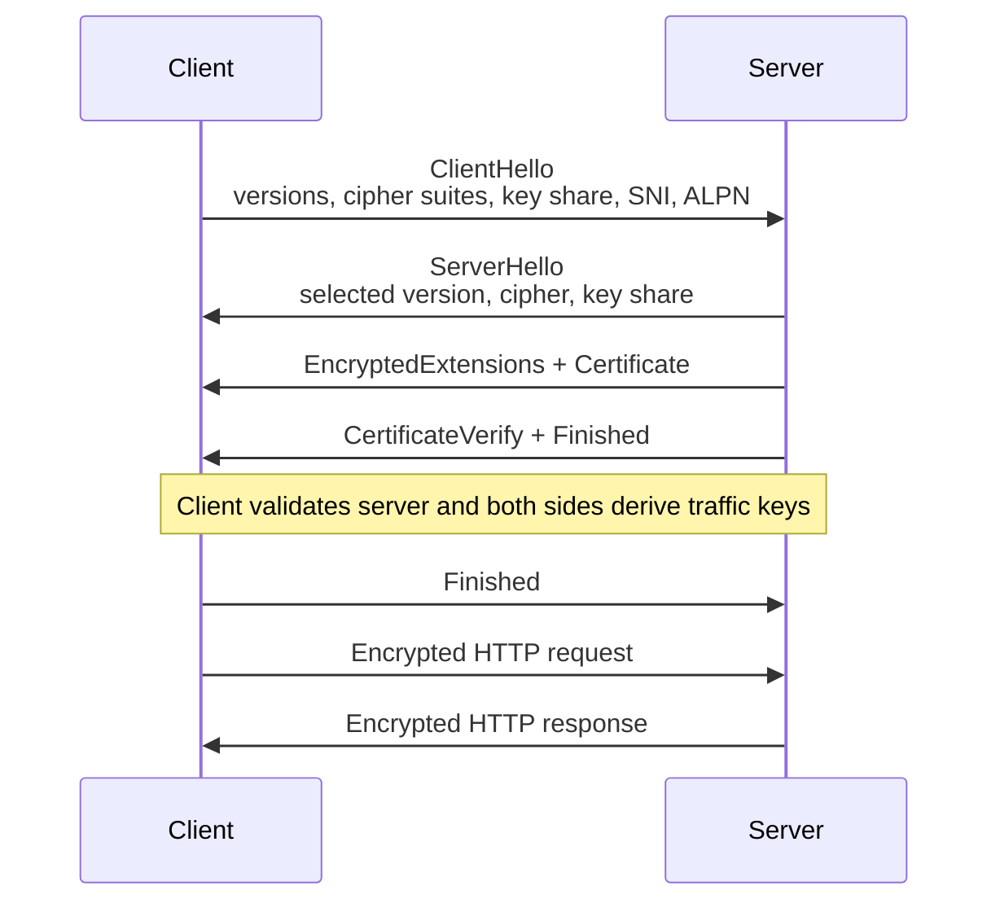
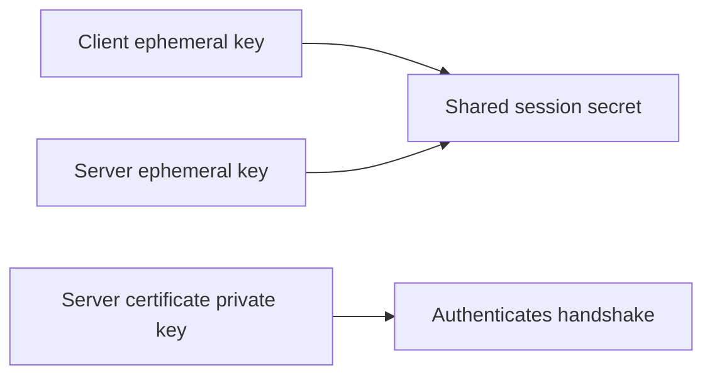
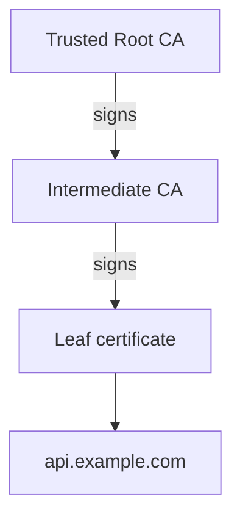
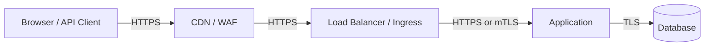
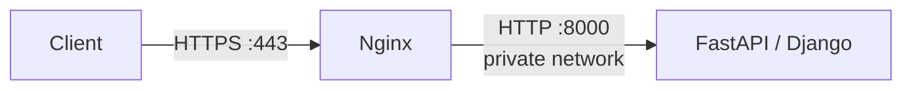

# HTTPS / TLS Basics

> HTTPS protects HTTP traffic while it moves across a network. For backend developers, the important parts are what TLS guarantees, how the handshake establishes trust and keys, how certificates are validated, where TLS terminates in production, and how to configure and debug it safely.

## In short

- **HTTPS = HTTP over TLS.** HTTP still defines methods, headers, cookies, and bodies; TLS protects those bytes while they travel between TLS endpoints.
- TLS mainly provides **confidentiality, integrity, and server authentication**.
- TLS 1.3 uses an ephemeral key exchange to derive fast symmetric traffic keys and normally provides **forward secrecy**.
- A certificate is trusted only when its **chain is trusted, hostname matches, validity period is correct, and usage/signature checks pass**.
- In production, TLS often terminates at a **CDN, load balancer, reverse proxy, ingress, or API gateway**, so every network hop must be considered separately.
- As of **August 2026**, TLS 1.3 is the modern protocol version. TLS 1.2 remains a compatibility option but is in feature freeze; TLS 1.0, TLS 1.1, SSL 2.0, and SSL 3.0 should not be used.



---

# 1. HTTPS and TLS

## 1.1 HTTP vs HTTPS

Plain HTTP does not provide transport encryption. Anyone able to observe or modify the network path may potentially read credentials or tokens, modify responses, inject content, or steal session data.

HTTPS sends the same HTTP request through a TLS-protected connection.

```text
HTTP request
    ↓
TLS encryption + integrity + authentication
    ↓
TCP for HTTP/1.1 or HTTP/2
or QUIC/UDP for HTTP/3
    ↓
Network
```

Common default ports:

| Protocol | Default port |
|---|---:|
| HTTP | 80 |
| HTTPS | 443 |

A port does not make a connection secure. TLS does.

## 1.2 What TLS provides

| Property | Meaning | Main mechanism |
|---|---|---|
| Confidentiality | Network observers cannot directly read protected traffic | Symmetric encryption |
| Integrity | Modified protected data is detected | AEAD authentication tag |
| Server authentication | Client verifies the intended server identity | Certificate + digital signature |
| Client authentication | Optional; not provided by normal browser HTTPS | Client certificate / mTLS |

Normal HTTPS authenticates the **server at the TLS layer**. User authentication still normally happens through sessions, OAuth, JWTs, API keys, passkeys, or another application mechanism.

## 1.3 What HTTPS does not protect

HTTPS does not automatically protect:

- Data stored in databases, logs, backups, or object storage.
- Data after it has been decrypted at a TLS endpoint.
- SQL injection, XSS, broken access control, SSRF, or other application vulnerabilities.
- A compromised client or server.
- All network metadata such as source/destination IP, timing, and traffic volume.

A valid HTTPS certificate proves the connection matches the domain identity. It does **not** prove that the website or application is trustworthy.

---

# 2. How the TLS 1.3 Handshake Works

The handshake establishes a protected connection before normal application traffic is exchanged.

## 2.1 ClientHello

The client sends capabilities such as:

- Supported TLS versions.
- TLS 1.3 cipher suites.
- Ephemeral key share.
- **SNI** — the hostname the client wants.
- **ALPN** — preferred application protocol such as `h2` or `http/1.1`.
- Optional session-resumption information.

## 2.2 ServerHello

The server selects compatible parameters and sends its own ephemeral key share.

Using the two ephemeral key shares, both sides independently derive shared secrets. The secret itself is never sent directly across the network.

## 2.3 Certificate and server authentication

The server sends its certificate chain and proves possession of the corresponding private key using `CertificateVerify`.

The client validates the certificate before trusting the server identity.

## 2.4 Symmetric traffic keys

Public-key cryptography is mainly used for authentication and secure key establishment. Actual HTTP traffic is protected with symmetric encryption because it is much faster.

Common TLS 1.3 AEAD algorithms include:

- `AES-128-GCM`
- `AES-256-GCM`
- `ChaCha20-Poly1305`

## 2.5 Forward secrecy

TLS 1.3 certificate-based handshakes normally use ephemeral Diffie-Hellman key exchange, commonly ECDHE.



Because the session secret comes from temporary key material, stealing the server's long-term certificate private key later should not by itself decrypt previously captured sessions.

> **0-RTT exception:** a resumed TLS 1.3 connection can optionally send early application data before the handshake fully completes. Because early data can be replayed, it should be limited to operations that are explicitly safe to replay.

---

# 3. Certificates and PKI

A TLS certificate binds a public key to one or more identities, usually DNS hostnames.

## 3.1 Certificate chain

A common public certificate chain looks like this:



The root CA is usually already stored in the client's trust store. The server normally sends the leaf certificate plus the required intermediate certificates.

## 3.2 Important certificate fields

A certificate commonly contains:

- Subject Alternative Names (**SANs**).
- Public key.
- Issuer.
- Valid-from and valid-until times.
- Key usage / extended key usage.
- Signature algorithm.
- Issuer signature.

Modern hostname validation uses SANs.

For example, a certificate containing `api.example.com` does not automatically cover `v2.api.example.com`.

A wildcard such as `*.example.com` normally covers one label level such as `api.example.com`, but not `v2.api.example.com` or the bare `example.com` unless they are separately included.

## 3.3 Certificate validation

A client should verify all relevant checks:

1. **Chain trust** — the chain reaches a trusted root.
2. **Hostname** — the requested hostname matches a SAN.
3. **Validity period** — current time is within `Not Before` and `Not After`.
4. **Signatures** — certificate signatures are valid.
5. **Usage** — the certificate is allowed for TLS server authentication.

A certificate can be cryptographically valid but still fail authentication because it belongs to the wrong hostname.

## 3.4 Private key

The certificate contains the public key. The private key must remain secret.

In production, protect private keys using restricted permissions, secret-management systems, managed certificate services, or HSMs where required. Private keys should never be committed to source control or written to logs.

---

# 4. TLS Versions and Cipher Suites

## 4.1 Version status — August 2026

| Version | Current practical status |
|---|---|
| SSL 2.0 | Insecure; never enable |
| SSL 3.0 | Insecure; never enable |
| TLS 1.0 | Deprecated; disable |
| TLS 1.1 | Deprecated; disable |
| TLS 1.2 | Compatibility option; feature-frozen and requires careful configuration |
| TLS 1.3 | Preferred modern version |

Important current standards changes:

- **RFC 9846 (July 2026)** is the current TLS 1.3 specification and obsoletes RFC 8446 as well as the old TLS 1.2 specification RFC 5246.
- **RFC 9851 (July 2026)** places TLS 1.2 in feature freeze except for narrow maintenance cases.
- **RFC 9852 (July 2026)** updates BCP 195 so new protocols that use TLS must require TLS 1.3.
- **RFC 10015 (July 2026)** further deprecates obsolete TLS 1.2 key-exchange methods, including RSA key exchange and finite-field DH key exchange, and discourages static ECDH.

For an existing public web application, a practical policy is normally:

```text
Prefer:  TLS 1.3
Allow:   TLS 1.2 only when required for supported clients
Disable: TLS 1.1, TLS 1.0, SSL 3.0, SSL 2.0
```

## 4.2 TLS 1.3 cipher suites

TLS 1.3 cipher-suite names cover the symmetric AEAD algorithm and hash. Examples include:

```text
TLS_AES_128_GCM_SHA256
TLS_AES_256_GCM_SHA384
TLS_CHACHA20_POLY1305_SHA256
```

Key exchange and signature algorithms are negotiated separately.

Avoid designing custom TLS cipher policies from old blog posts. Prefer maintained platform defaults, current organizational standards, or managed cloud TLS policies.

---

# 5. TLS in Production Architectures

TLS often terminates before the request reaches application code.



Each arrow can represent a separate TLS connection with its own certificate, trust policy, and keys.

## 5.1 TLS termination

Common termination points include:

- CDN or WAF.
- Cloud load balancer.
- API gateway.
- Kubernetes ingress.
- Nginx, Envoy, or Apache reverse proxy.
- The application process itself.

If TLS terminates at a proxy and the proxy forwards plain HTTP to the application, only the client-to-proxy hop is encrypted. Whether the backend hop also requires TLS depends on the threat model, network boundaries, and compliance requirements.

## 5.2 Forwarded scheme behind proxies

When TLS terminates before the application, the application may internally receive HTTP even though the original client used HTTPS.

A trusted proxy may send:

```http
X-Forwarded-Proto: https
Forwarded: proto=https;host=example.com
```

The application should trust these headers **only from known proxies**. Otherwise a client may spoof them and interfere with redirects, cookie security, or absolute URL generation.

## 5.3 Mutual TLS

mTLS authenticates both sides at the TLS layer.

```text
Normal HTTPS: Client verifies Server
mTLS:         Client verifies Server + Server verifies Client certificate
```

Common uses include service-to-service APIs, partner integrations, service meshes, and administrative interfaces.

mTLS authenticates a client identity, but application authorization is still required to decide what that identity may do.

## 5.4 HTTP/2 and HTTP/3

HTTPS is separate from the HTTP version:

- HTTP/1.1 and HTTP/2 commonly run as `HTTP → TLS → TCP`.
- HTTP/3 runs over QUIC, which integrates TLS 1.3, using UDP underneath.

ALPN is used during connection setup to negotiate protocols such as `h2` or `http/1.1`.

---

# 6. Browser and API Security Practices

## 6.1 HSTS

HSTS tells browsers to use HTTPS for future requests.

```http
Strict-Transport-Security: max-age=31536000; includeSubDomains
```

Enable it only after confirming HTTPS works correctly for the intended hosts. Be especially careful with `includeSubDomains` and `preload` because they affect future browser behavior.

## 6.2 Secure cookies

A production session cookie commonly uses attributes such as:

```http
Set-Cookie: session=...; Secure; HttpOnly; SameSite=Lax; Path=/
```

- `Secure` — send only over secure connections.
- `HttpOnly` — block direct JavaScript access.
- `SameSite` — reduce unwanted cross-site cookie behavior.

## 6.3 Redirect HTTP to HTTPS carefully

Websites commonly redirect port 80 to HTTPS. API clients carrying credentials or sensitive bodies should call HTTPS directly because the original HTTP request would already have crossed the network unencrypted before a redirect is received.

## 6.4 Do not disable certificate verification

Bad:

```python
requests.get("https://api.example.com", verify=False)
```

Good:

```python
response = requests.get(
    "https://api.example.com",
    timeout=10,
)
response.raise_for_status()
```

For a private CA, configure the correct trust bundle instead of disabling verification.

## 6.5 Keep secrets out of URLs

HTTPS protects URLs while they travel over the TLS connection, but URLs can still appear in browser history, application logs, proxy logs, traces, analytics systems, screenshots, and copied links.

Avoid long-lived API keys, passwords, and bearer tokens in URLs.

---

# 7. Practical Example — Backend API Behind Nginx

Consider a FastAPI or Django service listening internally on port `8000`, with Nginx handling the public TLS connection.



A minimal structure looks like this:

```nginx
server {
    listen 80;
    server_name api.example.com;

    return 301 https://$host$request_uri;
}

server {
    listen 443 ssl;
    server_name api.example.com;

    ssl_certificate     /etc/ssl/api/fullchain.pem;
    ssl_certificate_key /etc/ssl/api/privkey.pem;
    ssl_protocols TLSv1.2 TLSv1.3;

    location / {
        proxy_pass http://app:8000;
        proxy_set_header Host $host;
        proxy_set_header X-Forwarded-Proto https;
        proxy_set_header X-Forwarded-For $proxy_add_x_forwarded_for;
    }
}
```

Request flow:

1. Client connects to `api.example.com:443`.
2. Nginx performs the TLS handshake and presents the certificate.
3. Client validates the certificate and establishes traffic keys.
4. Nginx decrypts the HTTP request.
5. Nginx forwards it to the application.
6. The application uses trusted forwarded-header configuration to understand that the original request was HTTPS.

The Nginx-to-application hop is HTTP in this example. In a stricter environment, that hop can also use HTTPS or mTLS.

Production concerns include certificate automation, private-key protection, correct proxy trust, expiry monitoring, and testing after TLS-policy changes.

---

# 8. Testing and Debugging

## 8.1 curl

Inspect the connection and response:

```bash
curl -v https://example.com/
```

Check headers:

```bash
curl -I https://example.com/
```

Check HTTP-to-HTTPS redirect behavior:

```bash
curl -IL http://example.com/
```

Avoid using `curl -k` as a normal fix because it disables certificate verification.

## 8.2 OpenSSL

Connect with SNI:

```bash
openssl s_client \
  -connect example.com:443 \
  -servername example.com
```

Force TLS 1.3:

```bash
openssl s_client \
  -connect example.com:443 \
  -servername example.com \
  -tls1_3
```

Show the certificate chain:

```bash
openssl s_client \
  -connect example.com:443 \
  -servername example.com \
  -showcerts
```

## 8.3 Common failure patterns

| Symptom | Likely cause |
|---|---|
| Certificate expired | Renewal or deployment failed |
| Hostname mismatch | Wrong SAN, SNI, virtual host, or load-balancer certificate |
| Works in browser but not application | Different CA store, missing intermediate, container CA bundle, or SNI difference |
| Unknown CA | Private/self-signed CA is not trusted or chain is incomplete |
| Redirect loop behind proxy | Application does not correctly trust the original HTTPS scheme |
| Some clients fail, others work | Missing intermediate certificate or protocol compatibility issue |
| TLS version/cipher failure | No shared supported protocol or cryptographic parameters |

Debug from the **same runtime environment** where the failure occurs. A browser on your laptop and a container in production may have different trust stores and TLS capabilities.

---

# 9. Key Points to Remember

- HTTPS is HTTP protected by TLS; TLS does not replace HTTP.
- TLS gives confidentiality, integrity, and normally server authentication.
- TLS 1.3 uses ephemeral key exchange plus symmetric traffic encryption.
- Certificates establish identity only when chain, hostname, validity, and usage checks succeed.
- Never disable certificate or hostname verification to make a TLS error disappear.
- Prefer TLS 1.3; keep TLS 1.2 only for required compatibility.
- Treat every proxy, CDN, load balancer, ingress, and backend hop as a separate trust boundary.
- Use mTLS when both services need certificate-based identity, but still enforce application authorization.
- HTTPS protects data in transit, not data at rest or application logic.
- For real incidents, `curl`, `openssl s_client`, certificate-chain inspection, and proxy configuration are the most useful starting tools.

---

# References

Current references checked for this note in August 2026:

- **RFC 9846** — The Transport Layer Security (TLS) Protocol Version 1.3.
- **RFC 9851** — TLS 1.2 is in Feature Freeze.
- **RFC 9852 / BCP 195** — New Protocols Using TLS Must Require TLS 1.3.
- **RFC 9325 / BCP 195** — Recommendations for Secure Use of TLS and DTLS.
- **RFC 8996 / BCP 195** — Deprecating TLS 1.0 and TLS 1.1.
- **RFC 10015** — Deprecating Obsolete Key Exchange Methods in TLS 1.2 and DTLS 1.2.
- **RFC 9525** — Service Identity in TLS.
- **OWASP Transport Layer Security Cheat Sheet**.
- **OWASP HTTP Strict Transport Security Cheat Sheet**.
- **MDN Transport Layer Security Configuration**.
