# HTTPS / TLS Basics

> Understand how HTTPS and TLS protect web traffic, how the TLS handshake works, how certificates establish server identity, and how to configure and debug HTTPS safely.

## In short

- HTTPS is HTTP carried inside a TLS tunnel; TLS itself supplies three guarantees — confidentiality (symmetric encryption), integrity (AEAD authentication tags), and server authentication (certificate plus digital signature) — but not client authentication or protection of the data once it leaves the connection.
- The TLS 1.3 handshake negotiates the version and cipher, authenticates the server via its certificate, and derives shared traffic keys through an ephemeral (EC)DHE key exchange; that ephemeral exchange is what gives forward secrecy, so a later compromise of the server’s long-term private key cannot decrypt previously captured sessions.
- Certificate trust requires three independent checks to all pass: the chain resolves to a trusted root, the requested hostname matches a SAN on the leaf certificate, and the current time falls inside the validity window — a cryptographically valid certificate for the wrong hostname is still a failed authentication.
- TLS almost always terminates before it reaches application code — at a CDN, load balancer, or reverse proxy — so “HTTPS is enabled” does not mean the proxy-to-app hop is encrypted; every termination point needs to be documented and secured according to the threat model.
- TLS 1.2 is now in feature freeze and TLS 1.0, TLS 1.1, and SSL are formally deprecated (BCP 195); a modern service enables TLS 1.3, keeps TLS 1.2 only where client compatibility requires it, and disables everything older.
- HTTPS does not encrypt data at rest and does not stop application-layer flaws such as SQL injection, XSS, or broken access control — the padlock only proves the certificate matches the domain, not that the site or the code behind it is safe.

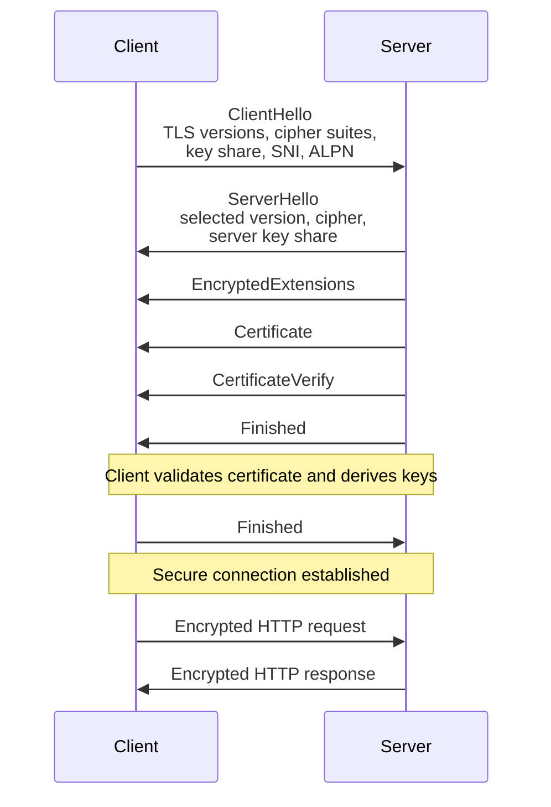

**Interview answer:** Connecting over HTTPS runs a TLS handshake before any HTTP bytes travel: client and server agree on a version and cipher, the server proves its identity with a certificate chained to a trusted CA, and both sides derive symmetric traffic keys through an ephemeral key exchange — only then does the actual HTTP request leave the machine, and it leaves as ciphertext. What TLS guarantees is confidentiality, integrity, and server authentication; it says nothing about the client’s identity, what happens to the data after it is decrypted, or whether the application itself is secure.

**Gotcha:** Assuming “encrypted” means “safe.” A client that accepts any certificate or any hostname — or one simply run with certificate verification disabled — still gets a perfectly encrypted TLS connection; it is just encrypted to whoever answered, including an attacker performing a machine-in-the-middle attack. Encryption without authentication protects nothing.

---

# 1. Why HTTPS Is Needed

Normal HTTP sends data over the network without transport encryption — a login request travels as plain text, for example `username=alice&password=secret`, readable by anyone who can observe the connection.

Anyone who can observe or modify the network path may be able to:

- Read credentials, tokens, personal data, or API responses.
- Modify JavaScript, HTML, API payloads, or downloads.
- Redirect users to a malicious server.
- Steal session cookies.
- Inject advertisements or malware.
- Impersonate the destination server.

HTTPS solves this by sending HTTP through a secure TLS connection — in short, `HTTPS = HTTP over TLS`. Where plain HTTP exposes the request on the wire, HTTPS wraps the same traffic in an encrypted tunnel so an observer sees only unreadable ciphertext.

The application still sends ordinary HTTP concepts such as methods, headers, cookies, and JSON. TLS protects those bytes while they travel between TLS endpoints.

---

# 2. HTTP, HTTPS, SSL, and TLS

## 2.1 HTTP

HTTP is an application protocol used to exchange requests and responses.

```http
GET /api/profile HTTP/1.1
Host: api.example.com
Authorization: Bearer eyJ...
```

HTTP defines:

- Methods such as `GET`, `POST`, `PUT`, and `DELETE`
- Headers
- Status codes
- Request and response bodies
- Caching and content negotiation rules

HTTP itself does not provide transport encryption.

## 2.2 HTTPS

HTTPS means that HTTP is carried through TLS.

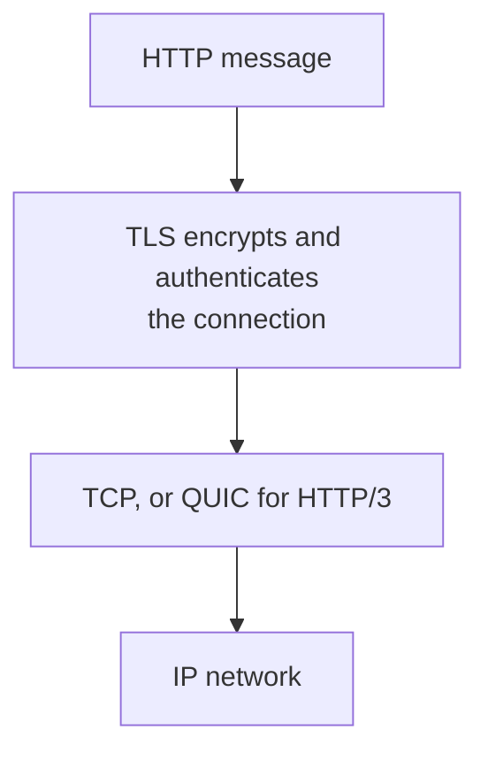

Common default ports:

| Protocol | Default port |
|---|---:|
| HTTP | 80 |
| HTTPS | 443 |

A custom port can also use HTTPS, for example `https://example.com:8443`.

The port does not create security. TLS does.

## 2.3 SSL vs TLS

SSL was the older protocol family. SSL 2.0 and SSL 3.0 are obsolete and insecure.

TLS replaced SSL: `SSL 2.0 → SSL 3.0 → TLS 1.0 → TLS 1.1 → TLS 1.2 → TLS 1.3`.

People still commonly say:

- SSL certificate
- SSL termination
- SSL configuration

In modern systems, they normally mean TLS.

> Use the term **TLS** in technical discussions. A so-called “SSL certificate” is normally an X.509 certificate used with TLS.

---

# 3. What Security TLS Provides

TLS mainly provides three security properties.

## 3.1 Confidentiality

Traffic is encrypted, so an observer cannot directly read it. A header that starts as plaintext, such as `Authorization: Bearer abc123`, appears on the network only as ciphertext bytes such as `17 03 03 00 f1 62 9a 31 ...`.

## 3.2 Integrity

TLS detects unauthorized modification of protected records.

If an attacker changes ciphertext in transit, authentication checks fail and the connection is rejected.

## 3.3 Authentication

The client validates that it is communicating with the intended server.

For a public website, the server normally proves its identity using a certificate issued by a trusted Certificate Authority — in effect, the browser asks:

> “Does this certificate belong to api.example.com, is it valid now, and does it chain to a trusted CA?”

Client identity is not automatically verified by ordinary HTTPS. Applications usually authenticate users with:

- Sessions
- Passwords
- OAuth
- API keys
- JWTs
- Passkeys

Client certificates can be used when both sides must authenticate. This is called mutual TLS.

## 3.4 Security-property summary

| Property | Protects against | Main TLS mechanism |
|---|---|---|
| Confidentiality | Eavesdropping | Symmetric encryption |
| Integrity | Undetected modification | AEAD authentication tag |
| Server authentication | Server impersonation | Certificate and digital signature |
| Client authentication | Unauthorized clients | Optional client certificate / mTLS |

---

# 4. Where TLS Fits in the Network Stack

A simplified HTTPS stack looks like this:

```text
┌──────────────────────────────────────────────┐
│ Application                                 │
│ HTTP/1.1, HTTP/2, REST, GraphQL, WebSocket   │
├──────────────────────────────────────────────┤
│ TLS                                          │
│ Encryption, integrity, authentication         │
├──────────────────────────────────────────────┤
│ Transport                                    │
│ TCP for HTTP/1.1 and HTTP/2                   │
│ QUIC/UDP for HTTP/3                           │
├──────────────────────────────────────────────┤
│ Network                                      │
│ IP                                            │
└──────────────────────────────────────────────┘
```

For HTTP/1.1 and HTTP/2, the stack is `HTTP → TLS → TCP → IP`. For HTTP/3, it is `HTTP/3 → QUIC, which integrates TLS 1.3 → UDP → IP`.

TLS does not replace HTTP. It protects the connection used to carry HTTP.

---

# 5. Cryptography Used by TLS

TLS combines different cryptographic techniques because each solves a different problem.

## 5.1 Asymmetric cryptography

Asymmetric cryptography uses a key pair: a public key that may be shared, and a private key that must remain secret.

It is used mainly for:

- Authenticating the server.
- Verifying digital signatures.
- Establishing or authenticating handshake secrets.

It is not normally used to encrypt the complete application data stream because public-key operations are comparatively expensive.

## 5.2 Symmetric cryptography

After the handshake, both sides derive shared symmetric keys.

Symmetric encryption is fast and protects the actual HTTP traffic.

Common TLS 1.3 authenticated-encryption algorithms include:

- AES-128-GCM
- AES-256-GCM
- ChaCha20-Poly1305

## 5.3 Hash functions

Hash functions create fixed-length digests.

TLS uses hashes as part of:

- Handshake transcript verification.
- Key derivation.
- Digital signatures.
- Certificate signatures.

Modern configurations commonly use SHA-256 or SHA-384.

## 5.4 Key exchange

Modern TLS commonly uses ephemeral Diffie-Hellman key exchange, usually ECDHE.

Both parties contribute temporary key material and independently calculate the same shared secret.

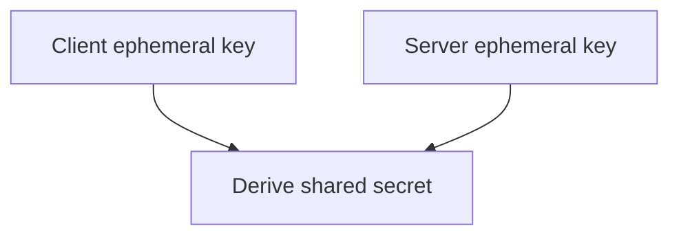

The shared secret is never directly sent over the network.

## 5.5 Perfect Forward Secrecy

Ephemeral key exchange provides forward secrecy.

If the server’s certificate private key is stolen later, previously captured TLS sessions should not become decryptable merely because that long-term key was compromised.

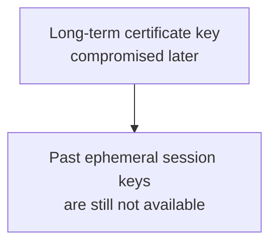

Forward secrecy depends on using ephemeral key exchange and protecting session-ticket keys appropriately.

## 5.6 AEAD

Modern TLS uses Authenticated Encryption with Associated Data.

AEAD provides encryption and integrity together.

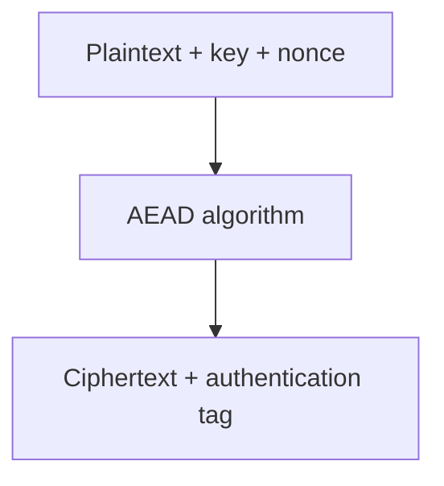

If the tag does not validate, the record is rejected.

---

# 6. TLS 1.3 Handshake

The handshake happens before protected application data is exchanged.

Its goals are to:

1. Agree on the TLS version and algorithms.
2. Authenticate the server.
3. Establish shared traffic keys.
4. Confirm that the handshake was not modified.

## 6.1 TLS 1.3 Handshake Flow

The handshake shown message by message:

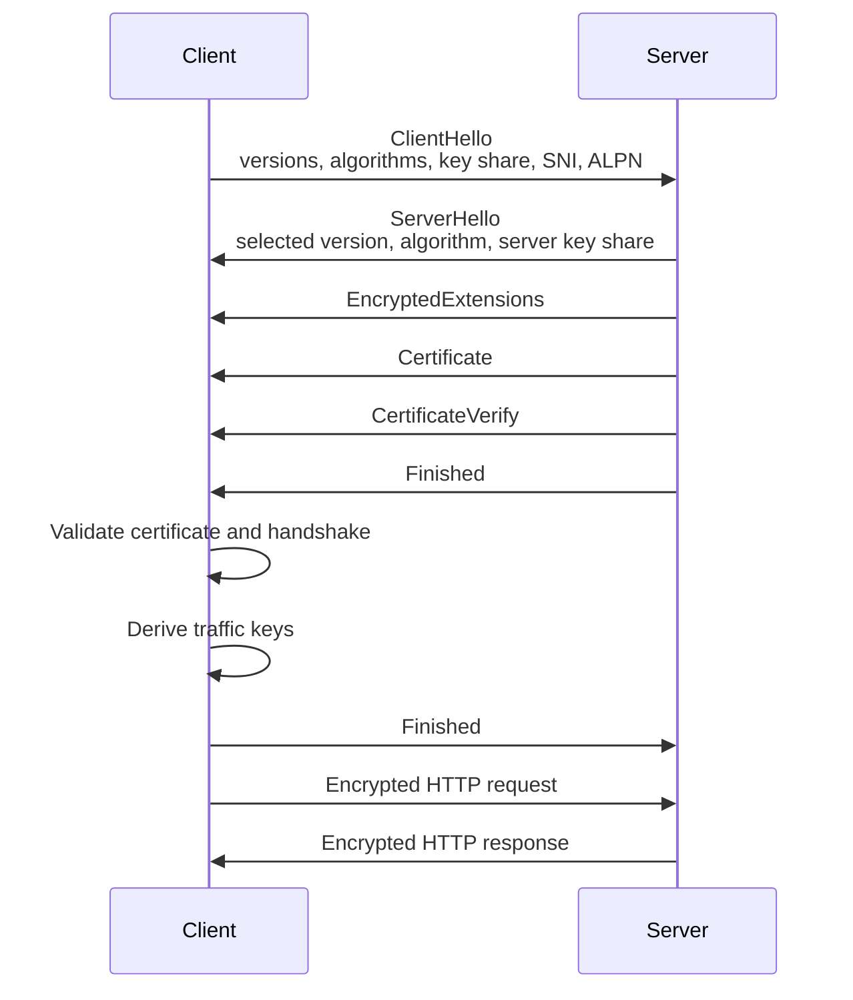

## 6.2 ClientHello

The client sends information such as:

- Supported TLS versions.
- Supported cipher suites.
- Supported groups or curves.
- A temporary key share.
- Server Name Indication.
- Application-Layer Protocol Negotiation choices.
- Optional session-resumption information.

Example conceptually:

```text
Supported versions: TLS 1.3, TLS 1.2
Cipher suites:
  TLS_AES_128_GCM_SHA256
  TLS_AES_256_GCM_SHA384
  TLS_CHACHA20_POLY1305_SHA256
SNI: api.example.com
ALPN: h2, http/1.1
```

## 6.3 ServerHello

The server selects compatible parameters, including:

- TLS version.
- Cipher suite.
- Server key share.

The client and server can now derive handshake keys.

## 6.4 Server certificate

The server sends its certificate chain so the client can validate its identity.

The chain commonly contains:

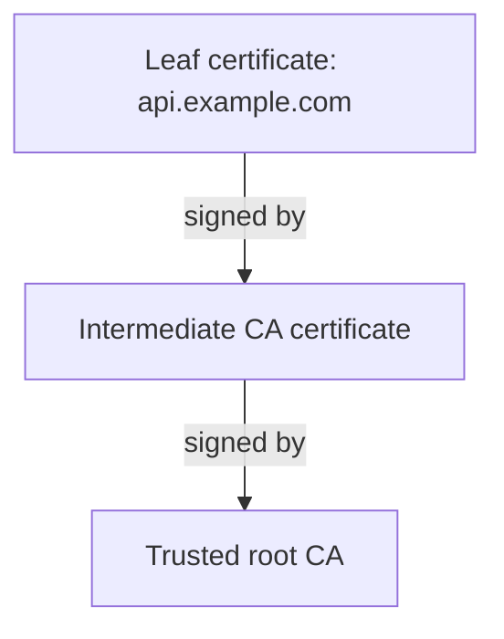

The root certificate is normally already present in the client’s trust store and is not required to be sent by the server.

## 6.5 CertificateVerify

The server signs the handshake transcript using the private key associated with its certificate.

This proves that:

- The server possesses the private key.
- The handshake messages are bound to that server identity.

## 6.6 Finished messages

Both parties calculate a value based on the handshake transcript and derived keys.

A valid `Finished` message proves that both sides derived compatible secrets and observed the same handshake.

## 6.7 Application data

After the handshake, HTTP messages are encrypted with symmetric traffic keys.

```text
POST /payments
Authorization: Bearer ...
Content-Type: application/json

{"amount": 5000}
```

The network only sees encrypted TLS records, although some connection metadata may remain observable.

---

# 7. Digital Certificates and PKI

## 7.1 What a certificate contains

A TLS certificate commonly contains:

- Subject or certificate identity.
- Subject Alternative Names.
- Public key.
- Issuer.
- Valid-from and valid-until timestamps.
- Serial number.
- Key usage and extended key usage.
- Signature algorithm.
- Issuer’s digital signature.

Simplified representation:

```text
Certificate
├── Domain names: api.example.com, www.example.com
├── Public key: ...
├── Issuer: Example Intermediate CA
├── Valid from: ...
├── Valid until: ...
└── Issuer signature: ...
```

## 7.2 Subject Alternative Name

Modern hostname validation uses the Subject Alternative Name extension, for example `DNS:example.com`, `DNS:www.example.com`, and `DNS:api.example.com`.

A certificate for `example.com` does not automatically cover `api.example.com`.

## 7.3 Wildcard certificates

A wildcard certificate such as `*.example.com` normally covers one label level:

| Hostname | Covered by `*.example.com` |
|---|---|
| `api.example.com` | Yes |
| `admin.example.com` | Yes |
| `v2.api.example.com` | No |
| `example.com` | No, unless separately included |

Wildcard certificates are convenient but expand the effect of a private-key compromise. Use them only when they fit the trust boundary.

## 7.4 Certificate Authority

A Certificate Authority verifies domain control or another identity claim and signs certificates.

Examples include:

- Public CAs trusted by browsers and operating systems.
- Private enterprise CAs trusted only inside an organization.
- Cloud-managed certificate services.

A certificate is not trusted simply because it is cryptographically valid. The client must trust its issuing chain.

## 7.5 Root, intermediate, and leaf certificates

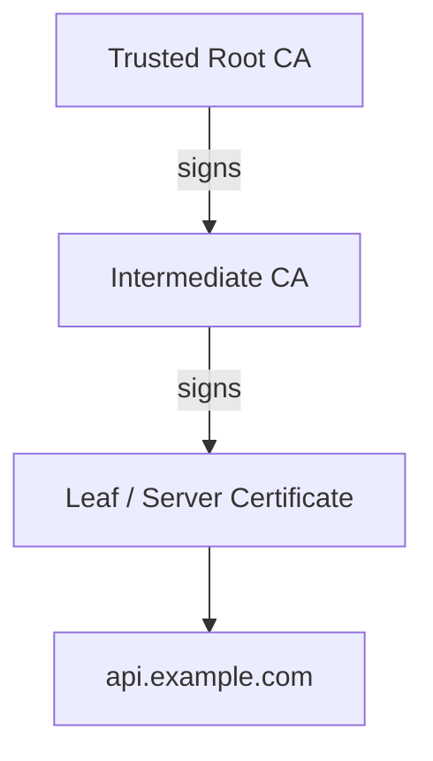

Why use intermediates?

- The root private key can remain highly protected and mostly offline.
- A compromised intermediate can be revoked without replacing every root trust store.
- Different intermediates can serve different policies or use cases.

## 7.6 Private key

The certificate contains the public key. The private key remains on the server or a secure key service — the certificate and public key can be shared with clients, but the private key must never be exposed.

Protect private keys with:

- Restricted file permissions.
- Secret managers.
- Hardware Security Modules when required.
- Managed load balancers or certificate services.
- Rotation and incident-response procedures.
- No inclusion in source control, images, logs, or chat messages.

---

# 8. How Certificate Validation Works

The client performs multiple checks.

## 8.1 Chain validation

The certificate chain must lead to a trusted root: `Leaf → Intermediate → Trusted root`.

A server should send its leaf certificate and necessary intermediate certificates.

A common deployment failure is sending only the leaf certificate. Some clients may still work because they cached the intermediate, while other clients fail.

## 8.2 Hostname validation

The requested hostname must match the certificate’s identity.

| Requested | Certificate SAN | Result |
|---|---|---|
| `api.example.com` | `api.example.com` | Valid |
| `api.example.com` | `www.example.com` | Hostname mismatch |

Trusting the CA chain without verifying the hostname is insecure. It proves that the certificate is valid, but not that it belongs to the destination the application intended to reach.

## 8.3 Validity period

The current time must be within the certificate’s window: `Not Before <= current time <= Not After`.

Clock errors can make valid certificates appear expired or not yet valid.

## 8.4 Signature validation

The client verifies that each certificate was signed by its issuer.

## 8.5 Key usage

The certificate must be permitted for the intended use, such as TLS server authentication.

## 8.6 Revocation status

A certificate may be revoked before expiry, for example after a private-key compromise.

Revocation mechanisms include:

- Certificate Revocation Lists.
- Online Certificate Status Protocol.
- OCSP stapling.

Revocation behavior varies by client and environment, so it should not be treated as the only control. Short certificate lifetimes, automated renewal, key protection, monitoring, and rapid replacement remain important.

## 8.7 Certificate Transparency

Publicly trusted certificates are logged in Certificate Transparency logs.

This helps domain owners discover certificates that were issued incorrectly or maliciously.

Certificate monitoring should alert on unexpected certificates for production domains.

---

# 9. TLS Versions

## 9.1 Version status

| Version | Status | Practical guidance |
|---|---|---|
| SSL 2.0 | Obsolete and insecure | Never enable |
| SSL 3.0 | Obsolete and insecure | Never enable |
| TLS 1.0 | Deprecated | Disable |
| TLS 1.1 | Deprecated | Disable |
| TLS 1.2 | Compatibility version | Support only when needed and configure carefully |
| TLS 1.3 | Preferred modern version | Enable and prefer |

TLS 1.0 and TLS 1.1 are formally deprecated by IETF BCP 195.

As of July 2026:

- TLS 1.3 is specified by **RFC 9846**, which replaced RFC 8446.
- TLS 1.2 is in feature freeze, apart from narrow maintenance cases.
- New protocols that use TLS are expected to require TLS 1.3.

## 9.2 Recommended practical policy

For a typical public web application, the minimum should be TLS 1.2 with TLS 1.3 preferred. For a controlled environment where every client supports TLS 1.3, the minimum can be raised to TLS 1.3.

Do not enable old protocol versions merely to make an obsolete client connect without understanding the risk.

## 9.3 Why TLS 1.3 is better

TLS 1.3:

- Removes many obsolete and unsafe algorithm choices.
- Simplifies cipher-suite negotiation.
- Encrypts more handshake information after `ServerHello`.
- Reduces full-handshake round trips.
- Requires forward-secret key exchange for ordinary certificate-based handshakes.
- Provides a cleaner protocol design than TLS 1.2.

TLS 1.3 does not make certificate management, hostname validation, application authorization, or secure coding unnecessary.

---

# 10. Cipher Suites

A cipher suite identifies cryptographic algorithms used by TLS.

## 10.1 TLS 1.2 naming

A TLS 1.2 cipher-suite name can encode several decisions.

```text
TLS_ECDHE_RSA_WITH_AES_128_GCM_SHA256
    │      │          │          │
    │      │          │          └─ Hash / PRF component
    │      │          └──────────── Encryption and integrity
    │      └─────────────────────── Authentication
    └────────────────────────────── Key exchange
```

Meaning:

- `ECDHE`: ephemeral elliptic-curve Diffie-Hellman key exchange.
- `RSA`: certificate authentication with an RSA key.
- `AES_128_GCM`: authenticated symmetric encryption.
- `SHA256`: hash-related component.

## 10.2 TLS 1.3 naming

TLS 1.3 cipher suites only identify the symmetric AEAD algorithm and hash, for example `TLS_AES_128_GCM_SHA256`, `TLS_AES_256_GCM_SHA384`, and `TLS_CHACHA20_POLY1305_SHA256`.

Key exchange and signature algorithms are negotiated separately.

## 10.3 Avoid manual cryptography design

Do not create a custom cipher list by copying an old blog post.

Prefer:

- Current server defaults from maintained platforms.
- A current Mozilla SSL Configuration Generator profile.
- Cloud-provider managed TLS policies.
- Organizational security standards.
- Automated configuration scanning.

TLS configuration changes over time as client compatibility and cryptographic guidance evolve.

---

# 11. SNI, ALPN, and HTTP Versions

## 11.1 Server Name Indication

Many HTTPS sites can share one IP address.

SNI lets the client tell the server which hostname it wants during the TLS handshake — the `ClientHello` carries `server_name = api.example.com`.

The server can then choose the correct certificate.

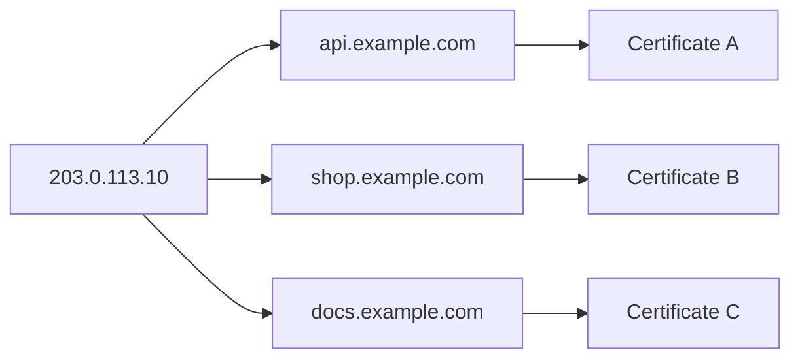

Without correct SNI, the server may return a default certificate and cause a hostname mismatch.

## 11.2 ALPN

Application-Layer Protocol Negotiation lets the client and server select the application protocol during the TLS handshake. For example, a client might offer `h2, http/1.1` and the server selects `h2`.

Common values:

| ALPN value | Protocol |
|---|---|
| `http/1.1` | HTTP/1.1 |
| `h2` | HTTP/2 |
| `h3` | HTTP/3 |

## 11.3 HTTP/2 and HTTP/3

HTTPS and the HTTP version are related but separate concerns — HTTPS can carry HTTP/1.1, HTTP/2, or HTTP/3.

HTTP/2 commonly runs over TLS on the public web.

HTTP/3 runs over QUIC, and QUIC integrates TLS 1.3 for its security handshake.

---

# 12. TLS Termination in Real Applications

The application process does not always manage the public certificate.

## 12.1 Termination at the application

The client connects directly over HTTPS to the application server. The application directly handles:

- Certificates.
- Private keys.
- TLS negotiation.
- HTTP processing.

This may be suitable for smaller services or direct service-to-service communication.

## 12.2 Termination at a reverse proxy

The client connects over HTTPS to a reverse proxy such as Nginx, Envoy, or Apache. The proxy handles public TLS and forwards the request to the application over HTTP or HTTPS.

Benefits:

- Central certificate management.
- Connection handling.
- Load balancing.
- HTTP/2 or HTTP/3 support.
- Security-header management.
- Rate limiting and routing.

The internal hop must still be evaluated. A private network is not automatically trusted.

## 12.3 Termination at a load balancer

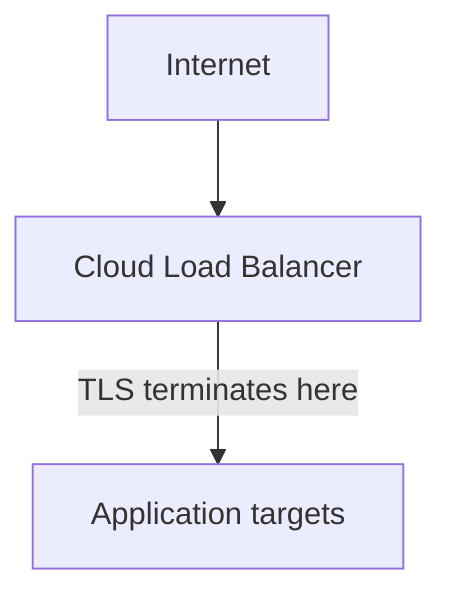

Examples include managed application load balancers, API gateways, CDNs, and ingress controllers.

Two backend patterns are common: the load balancer can forward to the app over plain HTTP once its own HTTPS listener has terminated TLS, or it can re-encrypt and carry HTTPS (or mTLS) all the way to the app.

Use TLS on the backend when required by:

- Threat model.
- Compliance requirements.
- Shared network infrastructure.
- Cross-region or cross-environment traffic.
- Zero-trust architecture.
- Service-mesh policy.

## 12.4 End-to-end encryption vs TLS termination

“HTTPS enabled” does not always mean the application server receives encrypted traffic: the public leg from client to proxy is encrypted, but the proxy-to-application hop can be plain HTTP.

Document every TLS boundary.

## 12.5 Forwarded scheme

When TLS terminates before the application, the application may see an internal HTTP request.

A trusted proxy can send information such as:

```http
X-Forwarded-Proto: https
Forwarded: proto=https;host=example.com
```

The application must trust these headers only from known proxies. Accepting spoofed forwarded headers from arbitrary clients can break redirect, cookie, and URL-generation logic.

---

# 13. Mutual TLS

Normal browser HTTPS usually authenticates only the server at the TLS layer.

Mutual TLS authenticates both sides using certificates.

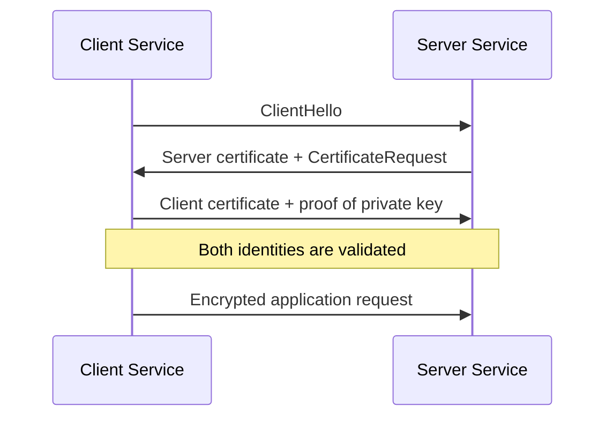

## 13.1 Typical use cases

- Service-to-service authentication.
- Internal APIs.
- Financial or partner integrations.
- Enterprise devices.
- Service meshes.
- Administrative interfaces.

## 13.2 What mTLS proves

mTLS can prove that the peer possesses a private key associated with an accepted certificate identity.

It does not automatically answer:

- Which API actions the client may perform.
- Whether the request is valid for the current tenant.
- Whether business authorization rules allow the operation.

Use mTLS for authentication and still apply application authorization.

## 13.3 mTLS lifecycle challenges

mTLS requires operational controls for:

- Certificate issuance.
- Identity naming.
- Rotation.
- Expiry monitoring.
- Revocation.
- Trust-bundle distribution.
- Private-key protection.
- Mapping certificate identity to application permissions.

Certificate automation is essential at scale.

---

# 14. Session Resumption and 0-RTT

## 14.1 Session resumption

A client that recently connected may resume a TLS session instead of performing a complete authentication flow.

Benefits:

- Lower latency.
- Fewer expensive cryptographic operations.
- Better performance for repeated connections.

TLS 1.3 commonly uses pre-shared keys derived from a previous session and session tickets.

## 14.2 Session tickets

A server can issue an opaque ticket that the client presents later.

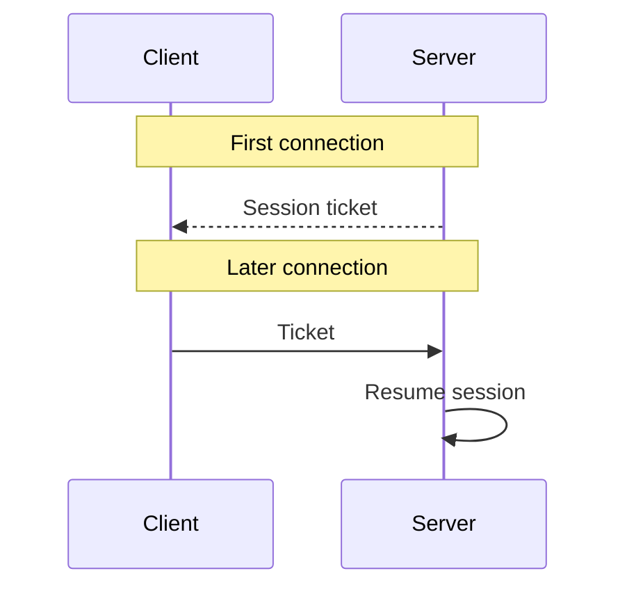

Ticket keys are security-sensitive. If multiple servers share them, they must be distributed and rotated securely.

## 14.3 0-RTT early data

TLS 1.3 can allow a resumed client to send application data before the handshake fully completes.

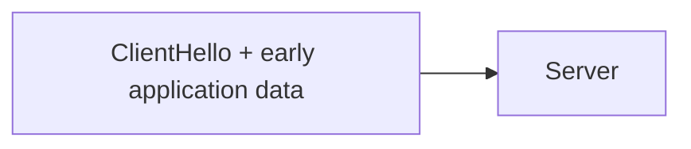

This reduces latency but creates replay risk.

An attacker may capture and replay early data under certain conditions.

Do not use 0-RTT for non-idempotent or sensitive operations such as:

- Money transfers.
- Purchases.
- Password changes.
- Account deletion.
- Creating unique resources.
- One-time token consumption.

Safer candidates are carefully designed read-only operations that tolerate replay — `GET /public/catalog` is potentially suitable, `POST /payments` is not.

0-RTT must be evaluated at the application layer. TLS cannot determine whether a business action is safe to replay.

---

# 15. HTTPS Security Headers and Browser Controls

TLS protects the connection, while browser-facing headers reduce related web risks.

## 15.1 HTTP Strict Transport Security

HSTS tells a browser to use HTTPS for future requests to a host.

```http
Strict-Transport-Security: max-age=31536000; includeSubDomains
```

Benefits:

- Automatically upgrades future HTTP navigation to HTTPS.
- Reduces SSL-stripping opportunities.
- Makes certificate errors harder to bypass for HSTS hosts.

Important behavior:

- Send HSTS only over HTTPS.
- Start with a lower `max-age` while validating the deployment.
- Use `includeSubDomains` only when every relevant subdomain supports HTTPS.
- Use `preload` only after understanding the long-lived operational effect.

A production policy may eventually be:

```http
Strict-Transport-Security: max-age=63072000; includeSubDomains; preload
```

Do not copy this blindly. A broken HTTPS configuration combined with HSTS can make a site unreachable until fixed.

## 15.2 HTTP-to-HTTPS redirect

For normal websites, redirect port 80 to HTTPS.

```http
HTTP/1.1 301 Moved Permanently
Location: https://example.com/path
```

For APIs carrying sensitive data, it is safer for clients to call HTTPS directly. A redirect occurs only after the initial HTTP request has already travelled unencrypted.

Never send credentials, tokens, or sensitive request bodies over HTTP expecting a redirect to protect them.

## 15.3 Secure cookies

Sensitive cookies should include: `Set-Cookie: session=...; Secure; HttpOnly; SameSite=Lax`

- `Secure`: browser sends the cookie only over secure connections.
- `HttpOnly`: JavaScript cannot directly read the cookie.
- `SameSite`: helps reduce cross-site request behavior.

HTTPS alone does not automatically add these attributes.

## 15.4 Mixed content

A page loaded over HTTPS should not load scripts, images, styles, fonts, or API calls over HTTP.

Bad: `<script src="http://cdn.example.com/app.js"></script>`

Good: `<script src="https://cdn.example.com/app.js"></script>`

Mixed active content may be blocked because an attacker could modify the HTTP resource and compromise the HTTPS page.

## 15.5 Upgrade insecure requests

A Content Security Policy can ask the browser to upgrade HTTP resource URLs.

```http
Content-Security-Policy: upgrade-insecure-requests
```

This can help during migration but should not replace fixing source URLs and dependencies.

---

# 16. Secure Server Configuration

## 16.1 Baseline principles

A modern HTTPS service should:

1. Enable TLS 1.3.
2. Keep TLS 1.2 only when needed for compatible clients.
3. Disable TLS 1.0, TLS 1.1, SSL 2.0, and SSL 3.0.
4. Use a certificate whose SANs match the service hostnames.
5. Send the complete intermediate chain.
6. Protect and rotate private keys.
7. Automate certificate issuance and renewal.
8. Redirect normal browser traffic from HTTP to HTTPS.
9. Enable HSTS after validating HTTPS coverage.
10. Use current maintained TLS libraries and server software.
11. Monitor expiry, handshake errors, and unexpected certificates.
12. Test configuration after every meaningful change.

## 16.2 Minimal Nginx example

This example shows the structure, not a universal production policy.

```nginx
server {
    listen 80;
    server_name example.com www.example.com;

    return 301 https://$host$request_uri;
}

server {
    listen 443 ssl;
    server_name example.com www.example.com;

    ssl_certificate     /etc/ssl/example/fullchain.pem;
    ssl_certificate_key /etc/ssl/example/privkey.pem;

    ssl_protocols TLSv1.2 TLSv1.3;

    add_header Strict-Transport-Security
        "max-age=31536000; includeSubDomains"
        always;

    location / {
        proxy_pass http://app:8000;

        proxy_set_header Host $host;
        proxy_set_header X-Forwarded-Proto https;
        proxy_set_header X-Forwarded-For $proxy_add_x_forwarded_for;
    }
}
```

Production notes:

- Use a current, tested TLS configuration generated for your Nginx version and compatibility requirements.
- Ensure `fullchain.pem` includes the necessary intermediate certificates.
- Protect `privkey.pem`.
- Do not enable HSTS for subdomains until every subdomain is ready.
- Configure trusted proxy handling in the application.
- Consider TLS from the proxy to the backend according to the threat model.

## 16.3 Kubernetes ingress example

```yaml
apiVersion: networking.k8s.io/v1
kind: Ingress
metadata:
  name: api
  annotations:
    nginx.ingress.kubernetes.io/ssl-redirect: "true"
spec:
  tls:
    - hosts:
        - api.example.com
      secretName: api-tls
  rules:
    - host: api.example.com
      http:
        paths:
          - path: /
            pathType: Prefix
            backend:
              service:
                name: api-service
                port:
                  number: 8000
```

Operational concerns:

- Automate certificate renewal, often through a certificate controller.
- Limit access to the TLS secret.
- Monitor certificate expiry.
- Decide whether ingress-to-service traffic also requires TLS or mTLS.
- Verify the ingress controller’s protocol and cipher policy.

## 16.4 Cloud load-balancer pattern

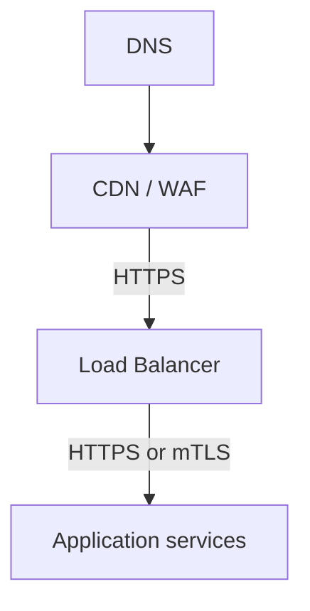

Managed services reduce certificate-handling work but do not remove responsibility for:

- TLS policy selection.
- Domain validation.
- backend encryption.
- security headers.
- logging.
- expiry and renewal monitoring.
- origin access controls.

## 16.5 Certificate automation

Manual certificate renewal is a reliability risk.

Use:

- ACME-compatible clients.
- Managed cloud certificates.
- Kubernetes certificate controllers.
- Central certificate-management services.

Automation should cover the full cycle: `issue → deploy → verify → renew → rotate → alert`.

Do not wait until the expiry date to discover that renewal is broken.

---

# 17. Application-Level HTTPS Practices

## 17.1 Never disable certificate verification

Bad Python example:

```python
import requests

response = requests.get(
    "https://api.example.com",
    verify=False,
)
```

`verify=False` disables meaningful server authentication and enables machine-in-the-middle attacks.

Good:

```python
import requests

response = requests.get(
    "https://api.example.com",
    timeout=10,
)
response.raise_for_status()
```

For a private CA, configure the correct trust bundle:

```python
response = requests.get(
    "https://internal.example.com",
    verify="/etc/company-ca/ca-bundle.pem",
    timeout=10,
)
```

## 17.2 Do not create permissive trust managers

A custom client that accepts every certificate or every hostname effectively removes TLS authentication — bad logic looks like “trust any certificate” combined with “accept any hostname.”

This still produces encrypted traffic, but it may be encrypted to the attacker.

## 17.3 Avoid secrets in URLs

HTTPS encrypts the URL while in transit, but URLs can still appear in:

- Browser history.
- Reverse-proxy logs.
- Application logs.
- Analytics systems.
- Monitoring traces.
- Referrer information, depending on policy.
- Screenshots and copied links.

Bad: a token placed directly in the URL, such as `https://example.com/reset?token=very-secret-token`.

Sometimes a one-time token in a URL is unavoidable, but it should be:

- Short-lived.
- Single-use.
- Redacted from logs.
- Replaced with a secure session after use.
- Protected by an appropriate referrer policy.

Do not put passwords, long-lived API keys, or bearer tokens in URLs.

## 17.4 Mark cookies correctly

For an HTTPS production service: `Set-Cookie: session=abc; Secure; HttpOnly; SameSite=Lax; Path=/`

For cross-site cookie use, browsers commonly require: `SameSite=None; Secure`

Cross-site cookies increase security complexity and should be used intentionally.

## 17.5 Generate correct absolute URLs behind proxies

Frameworks may generate HTTP links when they do not know the original request was HTTPS.

Possible symptoms:

- OAuth redirect URI mismatch.
- Insecure links in emails.
- Cookies not marked secure.
- Redirect loops.
- Mixed-content requests.

Configure:

- Trusted proxy addresses.
- Forwarded-header parsing.
- External hostname.
- External scheme as HTTPS.

Never trust proxy headers from arbitrary internet clients.

## 17.6 Use HTTPS for internal APIs where appropriate

“Internal” does not guarantee “trusted.”

Risks include:

- Compromised workloads.
- Misconfigured networks.
- Shared clusters.
- Packet capture.
- Lateral movement.
- Traffic crossing regions or providers.

Common choices are HTTPS at the public edge, HTTPS or mTLS for internal service traffic, and TLS for both database and message-broker traffic.

The exact design should follow the system’s threat model and operational capabilities.

---

# 18. Testing and Debugging HTTPS

## 18.1 curl

Show connection and TLS details: `curl -v https://example.com/`

Useful output may include the TLS version, selected cipher, certificate subject and issuer, ALPN result, HTTP version, and response headers.

Fetch only response headers: `curl -I https://example.com/`

Check HTTP redirect behavior: `curl -I http://example.com/`

Follow redirects: `curl -IL http://example.com/`

Do not use `curl -k` as a normal fix. It disables certificate verification.

## 18.2 OpenSSL client

Connect with SNI:

```bash
openssl s_client \
  -connect example.com:443 \
  -servername example.com
```

Force TLS 1.3:

```bash
openssl s_client \
  -connect example.com:443 \
  -servername example.com \
  -tls1_3
```

Force TLS 1.2:

```bash
openssl s_client \
  -connect example.com:443 \
  -servername example.com \
  -tls1_2
```

Show the supplied certificate chain:

```bash
openssl s_client \
  -connect example.com:443 \
  -servername example.com \
  -showcerts
```

Important: `-connect` chooses the IP/port to connect to, while `-servername` sends the SNI hostname.

Without `-servername`, a multi-domain server may return the wrong certificate.

## 18.3 Inspect a certificate file

```bash
openssl x509 \
  -in certificate.pem \
  -text \
  -noout
```

Inspect dates:

```bash
openssl x509 \
  -in certificate.pem \
  -noout \
  -dates
```

Inspect SANs:

```bash
openssl x509 \
  -in certificate.pem \
  -noout \
  -ext subjectAltName
```

## 18.4 Check expiry remotely

```bash
echo | openssl s_client \
  -connect example.com:443 \
  -servername example.com \
  2>/dev/null \
  | openssl x509 -noout -dates
```

## 18.5 Test protocol support

Expected to succeed:

```bash
openssl s_client \
  -connect example.com:443 \
  -servername example.com \
  -tls1_3
```

For a modern service, an attempt to use obsolete TLS should fail.

The exact command options depend on the installed OpenSSL version.

## 18.6 Browser developer tools

Use the browser’s Security and Network panels to inspect:

- Certificate details.
- Protocol such as HTTP/2 or HTTP/3.
- Mixed-content warnings.
- Redirect chains.
- HSTS behavior.
- Secure cookie attributes.
- Failed certificate requests.

## 18.7 External scanners

External scanners can evaluate:

- Protocol versions.
- Cipher suites.
- Certificate chain.
- Key exchange.
- HSTS.
- Known configuration weaknesses.

Do not scan systems without authorization.

Scanning should be part of deployment validation, not a one-time activity.

---

# 19. Common HTTPS and TLS Failures

## 19.1 Certificate expired

The failure condition: `current time > certificate Not After`.

Typical causes:

- Renewal job failed.
- New certificate was issued but not deployed.
- Service was not reloaded.
- Wrong certificate is attached to the load balancer.
- Monitoring was missing.

Fix the renewal and deployment pipeline, not only the current certificate.

## 19.2 Certificate not yet valid

Typical causes:

- Incorrect client or server clock.
- Deployment before the certificate’s validity start.
- Wrong certificate file.

Use reliable time synchronization.

## 19.3 Hostname mismatch

For example, a request to `api.example.com` is served a certificate issued for `www.example.com`.

Typical causes:

- Missing SAN.
- Wrong virtual host.
- Incorrect SNI.
- Default load-balancer certificate.
- DNS points to the wrong endpoint.

## 19.4 Incomplete certificate chain

Some clients work while others fail.

Cause: the server sends its leaf certificate but omits the required intermediate.

Fix: configure the full chain, not only the leaf certificate.

## 19.5 Unknown CA

Typical causes:

- Self-signed certificate.
- Private enterprise CA not installed in the client trust store.
- Wrong trust bundle.
- TLS inspection proxy replacing the certificate.
- Missing intermediate.

Do not solve this by disabling verification. Install the intended CA or fix the chain.

## 19.6 Protocol version mismatch

This can happen either way: a client that supports only up to TLS 1.2 meeting a server that allows only TLS 1.3, or the reverse — a legacy server that supports only TLS 1.0 being refused by a modern client.

Decide whether compatibility is required. Do not lower the security baseline without a documented reason.

## 19.7 No shared cipher or algorithm

The client and server do not share acceptable:

- Cipher suites.
- Signature algorithms.
- Key-exchange groups.
- Certificate key type support.

Use maintained defaults and test representative clients.

## 19.8 Redirect loop

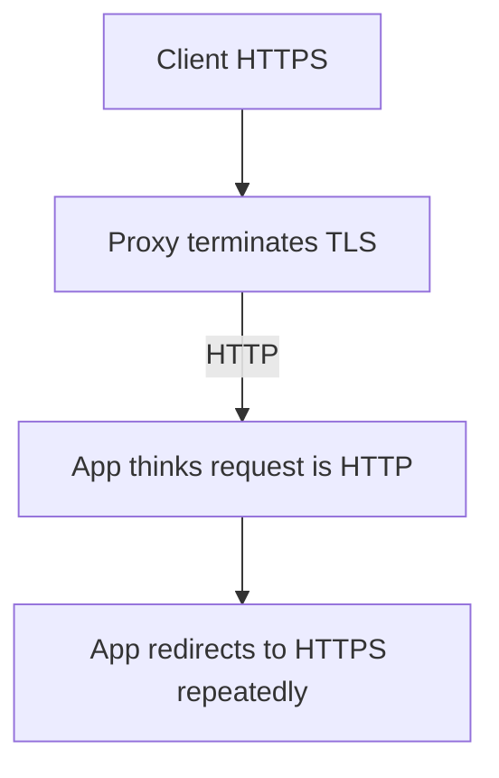

Fix trusted forwarded-protocol configuration.

## 19.9 Mixed content

The HTML page is HTTPS, but a resource uses HTTP — for example, a page served from `https://app.example.com` loads a resource from `http://api.example.com`.

Fix the resource URL and ensure the resource supports HTTPS.

## 19.10 HSTS lockout

HSTS was enabled for a host or all subdomains before HTTPS was ready.

The browser refuses insecure fallback.

Prevent this by staging HSTS carefully and auditing subdomains first.

## 19.11 Private-key mismatch

The configured certificate and private key do not belong together.

Check by comparing the public keys or fingerprints using supported OpenSSL commands.

Do not expose private-key material while debugging.

## 19.12 Certificate works in browser but fails in application

Possible reasons:

- Browser cached an intermediate certificate.
- Application uses a different CA trust store.
- Corporate proxy behavior differs.
- Application lacks SNI support.
- Container CA bundle is outdated.
- System clock differs.
- Application performs stricter hostname validation.

Test from the same runtime environment as the failing application.

---

# 20. What HTTPS Does Not Protect

HTTPS is essential, but its scope is specific.

## 20.1 Data at rest

TLS protects data in transit between TLS endpoints.

It does not automatically encrypt:

- Database rows.
- Object-storage files.
- Backups.
- Disk volumes.
- Logs.
- Browser local storage.

Use separate at-rest controls.

## 20.2 Compromised endpoints

If the client or server is compromised, the attacker may see plaintext before encryption or after decryption: plaintext exists on the client side before TLS encryption, and again on the server side right after TLS decryption.

## 20.3 Application vulnerabilities

HTTPS does not prevent:

- SQL injection.
- Cross-site scripting.
- Broken access control.
- CSRF.
- Server-side request forgery.
- Insecure deserialization.
- Business-logic abuse.
- Credential stuffing.

## 20.4 Traffic metadata

Depending on protocol and deployment, observers may still infer some metadata, such as:

- Source and destination IP addresses.
- Connection timing.
- Traffic volume.
- Packet sizes.
- Often the target domain through DNS or visible ClientHello information, unless additional privacy mechanisms are used.

The HTTP body and protected headers are encrypted, but network-level metadata is not completely hidden.

## 20.5 Data after TLS termination

If TLS terminates at a proxy, plaintext may exist on the next hop — an internet client connects over HTTPS to the proxy, which then forwards to the application over plain HTTP.

Secure each hop according to the threat model.

## 20.6 Malicious but valid domains

A phishing site can have a valid HTTPS certificate.

The padlock means:

> The connection to this domain is encrypted,  
> and the certificate matches this domain.

It does not mean the business is honest, that the content is safe, or that the site has been approved by the browser.

---

# 21. Production Architecture Example

Consider a web application with a CDN, load balancer, API service, database, and internal worker.

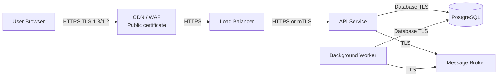

## 21.1 Trust boundaries

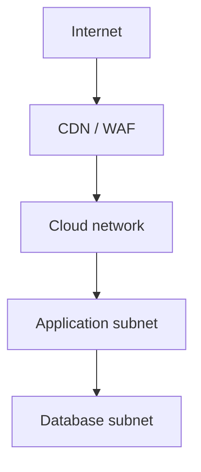

Each boundary should answer:

- Where does TLS terminate?
- Which certificates are used?
- Who trusts which CA?
- Are hostnames verified?
- Are client identities required?
- How are keys rotated?
- Which team owns renewal?
- What alerts exist?
- Where can plaintext appear?

## 21.2 Request flow

1. Browser resolves `app.example.com`.
2. Browser connects to the CDN on port 443.
3. TLS handshake authenticates `app.example.com`.
4. CDN decrypts and inspects the HTTP request.
5. CDN opens a separate TLS connection to the origin.
6. Load balancer forwards through HTTPS or mTLS to the API.
7. API uses TLS when connecting to the database and broker.
8. Each connection has its own TLS session and trust policy.

A single user request may cross several independent TLS connections: browser to CDN, CDN to load balancer, load balancer to API, and API to database.

---

# 22. Practical Checklist

## Protocol and algorithms

- [ ] TLS 1.3 is enabled.
- [ ] TLS 1.2 is enabled only when compatibility requires it.
- [ ] TLS 1.0 and TLS 1.1 are disabled.
- [ ] SSL 2.0 and SSL 3.0 are disabled.
- [ ] Current maintained server defaults or approved TLS policies are used.
- [ ] Obsolete key-exchange and cipher options are not enabled.

## Certificates

- [ ] Certificate SANs match every production hostname.
- [ ] The server sends the complete intermediate chain.
- [ ] Private keys are not stored in source control.
- [ ] Private-key access is restricted.
- [ ] Issuance and renewal are automated.
- [ ] Expiry alerts provide enough time to respond.
- [ ] Unexpected public certificates are monitored.
- [ ] Rotation and compromise procedures are documented.

## HTTP behavior

- [ ] HTTP traffic is redirected to HTTPS where appropriate.
- [ ] API clients use HTTPS directly.
- [ ] HSTS is enabled after deployment validation.
- [ ] `includeSubDomains` is used only after checking subdomains.
- [ ] `preload` is used only after understanding its consequences.
- [ ] No mixed HTTP content remains.
- [ ] Sensitive cookies include `Secure` and `HttpOnly`.
- [ ] Sensitive data is not placed in URLs.

## Proxies and load balancers

- [ ] Every TLS termination point is documented.
- [ ] Backend encryption is selected based on the threat model.
- [ ] Forwarded headers are accepted only from trusted proxies.
- [ ] The application correctly recognizes the original HTTPS scheme.
- [ ] Origin servers cannot be bypassed unintentionally.
- [ ] Load-balancer and CDN TLS policies are reviewed.

## Client applications

- [ ] Certificate verification is enabled.
- [ ] Hostname verification is enabled.
- [ ] No `verify=False`, `-k`, or trust-all code remains in production.
- [ ] Private CA trust bundles are distributed securely.
- [ ] Connection timeouts are configured.
- [ ] TLS errors are logged without exposing secrets.

## Operations

- [ ] TLS configuration is tested after changes.
- [ ] Representative browsers, mobile apps, services, and devices are tested.
- [ ] Handshake-failure metrics are monitored.
- [ ] Certificate-renewal jobs are monitored.
- [ ] Server and container CA bundles are updated.
- [ ] System clocks are synchronized.
- [ ] Incident response includes certificate and key replacement.

---

# 23. References

Standards and best-practice references used for this guide:

1. **RFC 9846 — The Transport Layer Security (TLS) Protocol Version 1.3**  
   https://www.rfc-editor.org/info/rfc9846/

2. **RFC 9851 — TLS 1.2 Is in Feature Freeze**  
   https://www.rfc-editor.org/info/rfc9851/

3. **RFC 9852 — New Protocols Using TLS Must Require TLS 1.3**  
   https://www.rfc-editor.org/info/rfc9852/

4. **RFC 9325 / BCP 195 — Recommendations for Secure Use of TLS and DTLS**  
   https://www.rfc-editor.org/info/rfc9325/

5. **RFC 8996 / BCP 195 — Deprecating TLS 1.0 and TLS 1.1**  
   https://www.rfc-editor.org/info/rfc8996/

6. **RFC 9525 — Service Identity in TLS**  
   https://www.rfc-editor.org/info/rfc9525/

7. **RFC 10015 — Deprecating Obsolete Key Exchange Methods in TLS 1.2 and DTLS 1.2**  
   https://www.rfc-editor.org/info/rfc10015/

8. **OWASP Transport Layer Security Cheat Sheet**  
   https://cheatsheetseries.owasp.org/cheatsheets/Transport_Layer_Security_Cheat_Sheet.html

9. **OWASP HTTP Strict Transport Security Cheat Sheet**  
   https://cheatsheetseries.owasp.org/cheatsheets/HTTP_Strict_Transport_Security_Cheat_Sheet.html

10. **MDN — Transport Layer Security Configuration**  
    https://developer.mozilla.org/en-US/docs/Web/Security/Practical_implementation_guides/TLS

11. **IANA — TLS Parameters**  
    https://www.iana.org/assignments/tls-parameters/

12. **NIST SP 800-52 Rev. 2 — Guidelines for TLS Implementations**  
    https://csrc.nist.gov/pubs/sp/800/52/r2/final

13. **Let’s Encrypt Documentation**  
    https://letsencrypt.org/docs/
