# JWT Pitfalls: Algorithms, Claims, Revocation, and Storage

> **Category:** Security  
> **Audience:** Developers with 3+ years of experience  
> **Updated:** August 2026  
> **Goal:** Understand how to use JSON Web Tokens safely in real applications—not merely how to generate and decode them.

---

# 1. JWT Security Mental Model

A **JSON Web Token (JWT)** is a compact format used to transfer claims between systems. A JWT can be signed as a **JWS** or encrypted as a **JWE**.

Most authentication systems use signed JWTs. The signature protects integrity: it proves that protected token data was not modified after signing.

A JWT does **not** automatically provide:

- confidentiality;
- logout or immediate revocation;
- secure browser storage;
- authorization correctness;
- protection from token theft;
- protection from replay attacks.

These controls must be designed separately.

## 1.1 JWT Structure

A commonly used signed JWT contains three Base64URL-encoded sections:

```text
HEADER.PAYLOAD.SIGNATURE
```

Example:

```text
eyJhbGciOiJSUzI1NiIsInR5cCI6ImF0K2p3dCJ9
.
eyJpc3MiOiJodHRwczovL2F1dGguZXhhbXBsZS5jb20iLCJzdWIiOiIxMjMifQ
.
SIGNATURE_BYTES
```

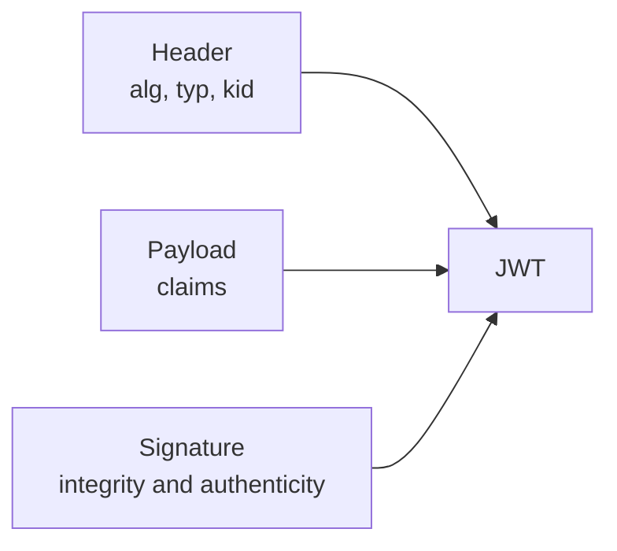

### Header example

```json
{
  "alg": "RS256",
  "typ": "at+jwt",
  "kid": "access-key-2026-08"
}
```

### Payload example

```json
{
  "iss": "https://auth.example.com",
  "sub": "user-123",
  "aud": "https://api.example.com",
  "exp": 1785738900,
  "iat": 1785738000,
  "jti": "e2197501-8801-4ce7-88aa-d42f627fbce3",
  "scope": "orders:read orders:write"
}
```

## 1.2 Signed Does Not Mean Encrypted

The header and payload of a normal signed JWT are **encoded, not encrypted**. Anyone who obtains the token can usually decode and read them.

```text
Signed JWT / JWS

Readable header + Readable payload + Protected signature
```

Therefore, do not place passwords, private keys, payment details, confidential internal data, or unnecessary personal information in the payload.

Use TLS for transport. Use JWE only when token-level encryption is genuinely required and the additional key-management complexity is justified.

## 1.3 JWT Is a Token Format

JWT is a representation format. It is not a complete authentication or authorization protocol.

For example:

- OAuth 2.0 defines authorization flows but does not require every access token to be a JWT.
- OpenID Connect defines ID tokens, commonly represented as JWTs.
- An OAuth access token may be a JWT or an opaque random value.

A system should choose JWT because its self-contained claims and distributed verification are useful—not simply because JWT is popular.

---

# 2. Secure JWT Lifecycle

A practical design usually separates short-lived access tokens from longer-lived refresh tokens.

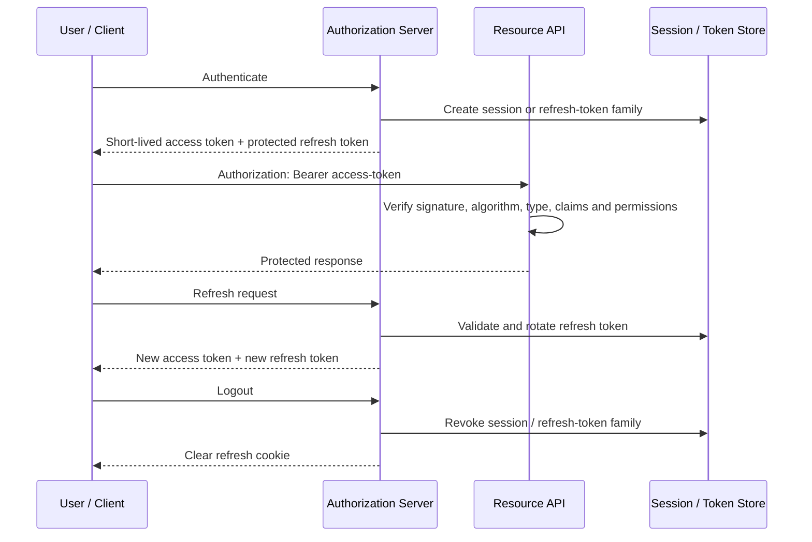

The access token should be accepted only when all of the following are true:

```text
trusted signature
AND allowed algorithm
AND expected token type
AND trusted issuer
AND intended audience
AND valid time window
AND not revoked when revocation is supported
AND required scope/role/permission is present
```

---

# 3. Algorithm Pitfalls

## 3.1 Trusting the `alg` Header

The JWT header is supplied by the token sender. It is untrusted input until cryptographic validation succeeds.

A vulnerable validator may read the token's `alg` value and dynamically choose whatever algorithm the attacker requested.

### Unsafe concept

```python
algorithm = unverified_header["alg"]
decode(token, key, algorithms=[algorithm])
```

### Safe concept

```python
ALLOWED_ALGORITHMS = ["RS256"]
decode(token, trusted_public_key, algorithms=ALLOWED_ALGORITHMS)
```

The server—not the token—must define the accepted algorithm set. RFC 8725 requires algorithm verification and recommends binding each key to exactly one algorithm.

## 3.2 `none` Algorithm

JOSE supports an unsecured form in which the header contains:

```json
{
  "alg": "none"
}
```

Historically, vulnerable libraries or applications accepted such tokens as valid even though they had no signature.

A protected API should reject unsecured JWTs unless a highly specialized protocol explicitly requires them and provides equivalent protection elsewhere.

```text
Attacker changes:

alg = RS256  --->  alg = none
signature    --->  empty

Vulnerable server: accepts token
Secure server: rejects algorithm before trusting claims
```

## 3.3 HS256 and RS256 Confusion

### HS256

HS256 uses HMAC with one shared secret:

```text
Issuer signs with secret K
Verifier validates with the same secret K
```

Every verifier that has the secret can also create valid tokens.

### RS256

RS256 uses an RSA key pair:

```text
Issuer signs with private key
Verifier validates with public key
```

A verifier can validate tokens without receiving signing authority.

### Confusion attack

Older or incorrectly designed validation logic sometimes accepted an RSA public key as an HMAC secret after an attacker changed `alg` from `RS256` to `HS256`.

```text
Expected:
RS256 + RSA public key

Attacker supplies:
HS256 + token signed using the known RSA public key as HMAC secret
```

Prevent this by:

- pinning the expected algorithm;
- not mixing symmetric and asymmetric algorithm families in one validation path;
- binding keys to their intended algorithm and purpose;
- using a maintained JWT library with secure defaults.

## 3.4 Weak HMAC Secrets

An HMAC-signed token can be captured and used for offline secret guessing. A password-like secret such as `mysecret123` is unsafe.

Use a cryptographically random, high-entropy key generated for signing. Do not derive a production signing key from a human-readable password, application name, repository secret, or predictable environment value.

Store signing secrets in an appropriate secret manager or key-management system and rotate them through a controlled process.

## 3.5 Choosing an Algorithm

| Algorithm family | Key model | Practical fit | Main consideration |
|---|---|---|---|
| HS256 / HS384 / HS512 | Shared secret | Small, tightly controlled system | Every verifier can also sign tokens |
| RS256 / PS256 | RSA private/public key | Distributed APIs and external verifiers | Larger keys and signatures |
| ES256 | EC private/public key | Compact asymmetric signatures | Correct library and key handling are essential |
| EdDSA | Ed25519/Ed448 key pair | Modern deployments with ecosystem support | Confirm support across every component |

### Practical selection rule

Use **asymmetric signing** when multiple APIs or external services must validate tokens but must not be able to create them.

Use **symmetric signing** only when sharing the signing secret with every verifier is acceptable and operationally manageable.

The exact choice also depends on protocol profiles, platform support, compliance requirements, hardware security modules, and the identity provider being used.

## 3.6 Key Rotation and `kid`

The `kid` header identifies the key used to sign a token. It helps a verifier choose the correct public key while old and new keys overlap during rotation.

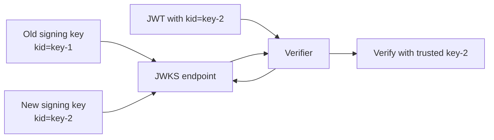

Treat `kid`, `jku`, and `x5u` as untrusted input:

- do not concatenate `kid` directly into SQL, LDAP, shell commands, or file paths;
- do not fetch arbitrary URLs supplied through `jku` or `x5u`;
- obtain keys only from preconfigured, trusted issuers and allowed JWKS locations;
- cache keys with a controlled refresh policy;
- on an unknown `kid`, refresh carefully rather than fetching attacker-controlled data;
- preserve old verification keys until all tokens signed by them have expired.

---

# 4. Claim Validation Pitfalls

A valid signature proves that a trusted key signed the token. It does **not** prove that the token is appropriate for this API, this user action, or the current time.

## 4.1 Important Registered Claims

| Claim | Meaning | Validation expectation |
|---|---|---|
| `iss` | Issuer | Exact match against a configured trusted issuer |
| `sub` | Subject | Valid identifier in the issuer's namespace |
| `aud` | Audience | Must include this API or intended recipient |
| `exp` | Expiration time | Current time must be before expiration |
| `nbf` | Not before | Reject before this time |
| `iat` | Issued at | Check reasonableness and use in policy where required |
| `jti` | JWT ID | Unique token identifier; useful for replay tracking or revocation |

Application-specific claims may include:

```json
{
  "scope": "orders:read orders:write",
  "roles": ["support-agent"],
  "tenant_id": "tenant-42"
}
```

These claims must still be checked against server-side authorization policy.

## 4.2 Presence Is Different from Validation

Some libraries validate a claim only when it exists. That does not guarantee the claim is present.

For security-critical claims, configure the library to **require** them as well as verify their values.

```python
options={
    "require": ["exp", "iat", "iss", "sub", "aud", "jti"]
}
```

The required set depends on the token profile. For example, an access token and an email-verification token may intentionally use different claims and validation rules.

## 4.3 Issuer and Audience Validation

### Issuer (`iss`)

The issuer identifies the authority that created the token.

```text
Expected issuer:
https://auth.production.example.com

Token issuer:
https://auth.staging.example.com

Result: reject
```

A signature may validate with a reused or misconfigured key, yet the token may come from the wrong environment or tenant. Validate the exact issuer and associate it with the correct key set.

### Audience (`aud`)

The audience restricts where the token may be used.

```text
Token intended for: payments-api
Presented to:       admin-api
Result:              reject
```

Without audience validation, a token issued for one service may be replayed against another service that trusts the same issuer.

## 4.4 Time-Based Claims

### `exp`

`exp` limits the token's validity period. Access tokens should be short-lived enough to reduce the impact of theft.

### `nbf`

`nbf` prevents a token from being accepted before a specific time.

### `iat`

`iat` indicates when the token was issued. It can help detect unreasonable timestamps, implement maximum token age, and support session policies.

### Clock skew

Distributed systems may have small time differences. A limited leeway can prevent valid tokens from failing at boundaries.

```python
leeway=30  # Example only; choose based on infrastructure accuracy
```

Do not use a large leeway to hide poor clock synchronization because it silently extends token validity. Synchronize server clocks using trusted infrastructure.

## 4.5 `jti` and Token Identity

`jti` is a unique identifier for a JWT.

Common uses:

- denylisting a revoked access token;
- correlating security events without logging the full token;
- preventing one-time token replay;
- tracking a token within a refresh-token family.

Generate `jti` values using a collision-resistant random identifier such as UUIDv4 or sufficient random bytes.

Do not place predictable sequence numbers in `jti` when predictability creates privacy or enumeration concerns.

## 4.6 Token-Type Confusion

A system may use multiple JWT types:

- access token;
- ID token;
- refresh token;
- password-reset token;
- email-verification token;
- service-to-service assertion.

A token valid in one context must not automatically be accepted in another.

Use explicit typing and mutually exclusive validation rules.

```json
{
  "typ": "at+jwt",
  "alg": "RS256"
}
```

Example validation profiles:

| Check | Access token | Password-reset token |
|---|---|---|
| `typ` | `at+jwt` | `password-reset+jwt` |
| `aud` | `orders-api` | `account-recovery` |
| Additional rules | Requires scope | One-time `jti`, very short expiration |

Never accept an OpenID Connect ID token as an API access token simply because its signature is valid.

## 4.7 Sensitive Data in Claims

JWT payloads frequently appear in:

- browser memory or storage;
- reverse-proxy logs;
- application logs;
- monitoring traces;
- support screenshots;
- copied request commands;
- analytics or error-reporting systems.

Follow data minimization:

```text
Include only what the recipient needs to authorize the request.
```

Prefer stable identifiers over duplicated profile information. Fetch sensitive or frequently changing data from an authoritative service when needed.

---

# 5. JWT Revocation

## 5.1 Why Revocation Is Difficult

A self-contained JWT can often be validated without contacting the issuer.

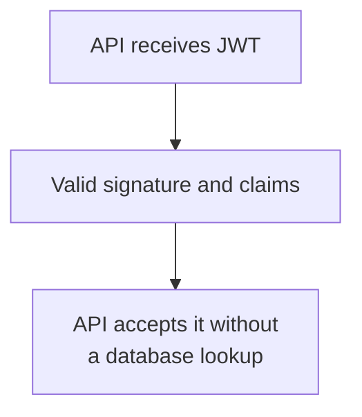

This improves availability and scalability, but it means the API may not know that the user logged out, the account was disabled, or the token was stolen after issuance.

A token normally remains usable until it expires unless the system introduces a revocation mechanism.

## 5.2 Short-Lived Access Tokens

The simplest control is a short access-token lifetime.

```text
Stolen token impact <= remaining access-token lifetime
```

A typical architecture may use access tokens lasting several minutes and refresh tokens lasting longer. Exact values are risk and product decisions—not universal standards.

Factors include:

- sensitivity of protected operations;
- ability to detect compromise;
- expected network reliability;
- user-experience requirements;
- whether sender-constrained tokens are used;
- whether APIs check a denylist or session status.

Short expiration reduces but does not eliminate replay risk.

## 5.3 Denylist Using `jti`

For immediate access-token revocation, store the revoked token's `jti` until the token would naturally expire.

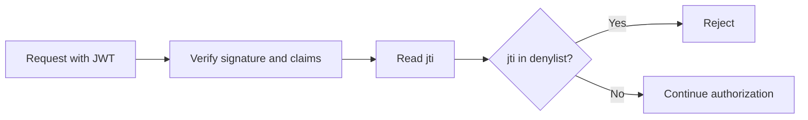

Example Redis record:

```text
Key:   jwt:denylist:e2197501-8801-4ce7-88aa-d42f627fbce3
Value: revoked
TTL:   token_expiration - current_time
```

Advantages:

- supports immediate logout for a particular token;
- bounded storage because entries expire;
- easy to distribute using Redis.

Trade-off:

- every request may require a state lookup;
- the system is no longer fully stateless;
- fail-open versus fail-closed behavior must be explicitly decided.

## 5.4 Refresh-Token Rotation

Refresh-token rotation returns a new refresh token every time a refresh succeeds and invalidates the token that was just used.

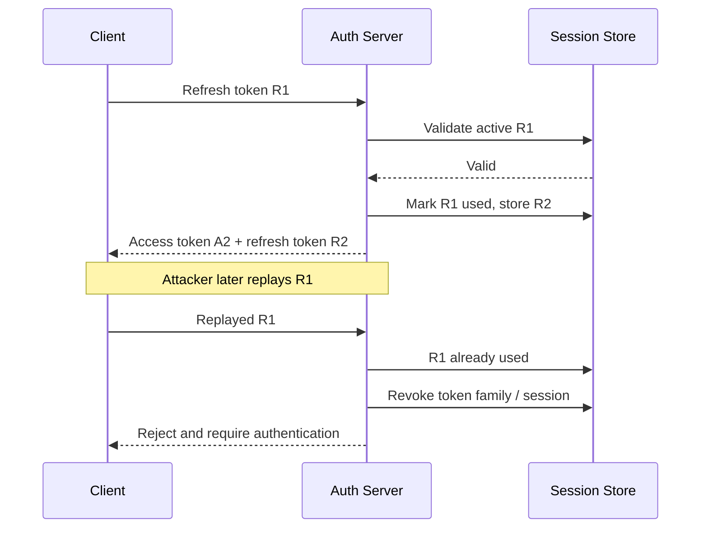

For public OAuth clients, RFC 9700 requires refresh tokens to be sender-constrained or use refresh-token rotation so replay can be detected.

A robust refresh-token family record can include:

```text
session_id
token_hash
previous_token_hash
user_id
client_id
issued_at
expires_at
last_used_at
revoked_at
replaced_by
reuse_detected_at
```

Store a cryptographic hash of the refresh token rather than the raw token when the server only needs equality verification.

## 5.5 Session-Version Strategy

Store a version or security timestamp on the user or session:

```text
User record:
token_version = 7
```

JWT claim:

```json
{
  "ver": 7
}
```

On global logout, password reset, or account compromise:

```text
token_version = 8
```

Tokens carrying version `7` are then rejected.

Alternative:

```text
valid_tokens_after = 2026-08-03T05:45:00Z
```

Reject tokens whose `iat` is earlier than that timestamp.

This strategy is useful for revoking all sessions but requires a lookup or cached account/session state.

## 5.6 Opaque Tokens and Introspection

An opaque access token contains no locally usable claims. The API asks the authorization server or an introspection service whether it is active and what permissions it represents.

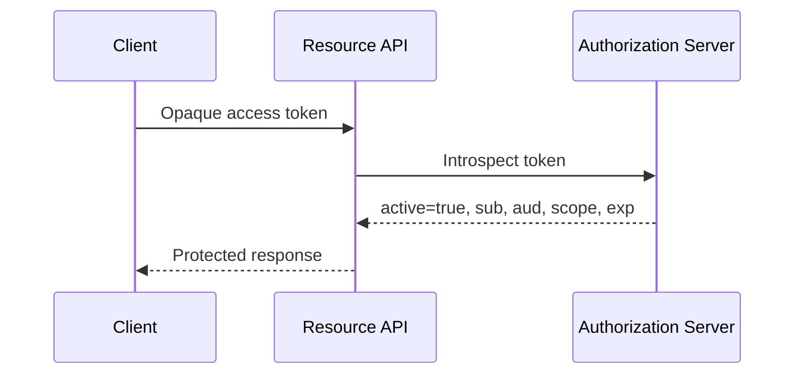

Opaque tokens are worth considering when:

- immediate central revocation is essential;
- authorization data changes frequently;
- token contents should not be exposed to clients;
- the organization prefers centralized policy enforcement;
- the additional network dependency is acceptable.

Introspection results may be cached only within a carefully controlled period because caching delays revocation visibility.

## 5.7 Key Rotation Is Not Normal Logout

Removing a verification key can invalidate every token signed with that key. This is appropriate during key compromise or emergency response.

It is usually unsuitable for normal logout because it affects many users and services at once.

| Situation | Correct response |
|---|---|
| Normal logout | Revoke the session or token family |
| Single token | Denylist its `jti` |
| All user sessions | Increase session version / revoke user sessions |
| Key compromise | Emergency key rotation and broad invalidation |

---

# 6. JWT Storage Pitfalls

The best signing algorithm cannot protect a token after it has been stolen. Token storage and transport are therefore part of the authentication design.

## 6.1 Browser Storage Comparison

| Storage option | JavaScript can read it? | Sent automatically? | Main risk | General guidance |
|---|---:|---:|---|---|
| `localStorage` | Yes | No | XSS can steal persistent tokens | Avoid for high-value long-lived credentials |
| `sessionStorage` | Yes | No | XSS can steal tokens; limited to tab/session | Better persistence boundary, not an XSS defense |
| JavaScript memory | Yes, within application context | No | XSS can use or capture it; lost on reload | Useful for short-lived access tokens |
| HttpOnly cookie | No | Yes | CSRF and XSS-driven actions | Strong option when combined with CSRF controls |
| Server-side session | No browser token beyond session cookie | Yes | Session theft and CSRF | Often the simplest secure browser architecture |

OWASP advises against storing session identifiers in `localStorage` because any JavaScript running in the origin can access them.

### Important nuance

An HttpOnly cookie prevents JavaScript from reading the cookie value. It does **not** make an XSS vulnerability harmless. Malicious script may still send authenticated requests from the victim's browser.

## 6.2 HttpOnly Cookie Design

A refresh token or session identifier stored in a cookie should generally use:

```http
Set-Cookie: __Host-refresh=<token>;
  Path=/;
  Secure;
  HttpOnly;
  SameSite=Lax;
  Max-Age=1209600
```

Recommended properties:

| Attribute | Purpose |
|---|---|
| `Secure` | Send cookie only over HTTPS |
| `HttpOnly` | Prevent normal JavaScript access |
| `SameSite` | Reduce cross-site request sending |
| `Path` | Limit where the cookie is sent |
| `Max-Age` / `Expires` | Bound persistence |
| `__Host-` prefix | Requires Secure, host-only scope, and `Path=/` in supporting browsers |

Avoid setting a broad `Domain` unless subdomain sharing is required and fully understood.

### Cookie authentication and CSRF

Browsers automatically attach cookies to matching requests. Therefore, cookie-based authentication needs CSRF protection for state-changing operations.

Use a layered design:

- `SameSite=Lax` or `SameSite=Strict` when compatible with the application;
- framework-supported synchronizer CSRF tokens or a properly implemented signed double-submit pattern;
- origin or referer validation as defense in depth;
- no state changes through `GET` requests;
- explicit re-authentication for highly sensitive actions.

`SameSite` is valuable but should not be treated as the only CSRF control for all applications.

## 6.3 Backend-for-Frontend Pattern

For browser applications, a Backend-for-Frontend (BFF) can keep OAuth tokens on the server.

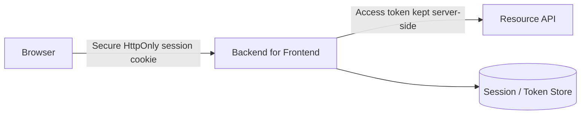

Benefits:

- OAuth access and refresh tokens are not exposed to browser JavaScript;
- centralized refresh and revocation logic;
- easier secret handling for confidential clients;
- reduced token leakage through frontend logging and extensions.

The browser still requires strong XSS and CSRF protections because an attacker may perform actions through the authenticated session.

## 6.4 Mobile and Desktop Applications

Use operating-system-provided secure credential storage:

- iOS Keychain;
- Android Keystore-backed encrypted storage;
- macOS Keychain;
- Windows Credential Manager or platform-protected equivalents.

Do not store refresh tokens in plaintext preferences, source code, logs, crash reports, or ordinary files.

Public clients cannot safely embed a permanent client secret. Use modern authorization flows such as Authorization Code with PKCE and follow the authorization server's native-app guidance.

For higher-risk systems, consider sender-constrained tokens such as DPoP or mutual-TLS-bound tokens where the platform and authorization infrastructure support them.

## 6.5 Server-Side Storage

Private signing keys and refresh-token state should be protected using:

- managed secret storage or KMS/HSM facilities;
- strict service identities and least-privilege access;
- audit logging for key use and administrative changes;
- encryption at rest where appropriate;
- documented key rotation and emergency-revocation procedures.

Never log full bearer tokens. A bearer token grants access to whoever possesses it.

For diagnostics, log limited metadata such as:

```text
issuer
audience
jti
subject pseudonym or internal identifier
token type
validation failure category
```

Apply privacy controls to these values as well.

---

# 7. Access Token vs Refresh Token

| Property | Access token | Refresh token |
|---|---|---|
| Purpose | Call protected APIs | Obtain new access tokens |
| Typical exposure | Sent to resource APIs | Sent only to authorization server |
| Lifetime | Short | Longer |
| Format | JWT or opaque | Often opaque; may be JWT if carefully designed |
| Validation | Local signature validation or introspection | Stateful lookup, binding and rotation are common |
| Revocation | Expiry, denylist, session check | Revoke token family/session |
| Storage | Memory, protected cookie through BFF, or secure client storage | Strongest available protected storage |
| Replay impact | API access until expiry/revocation | Can create repeated access tokens if not rotated/bound |

### Recommended separation

```text
Access token:
- narrow audience
- narrow scope
- short lifetime
- sent only to intended API

Refresh token:
- never sent to resource APIs
- rotated or sender-constrained
- bound to client/session
- stored with stronger protection
- revoked on logout or reuse detection
```

Do not treat a long-lived JWT access token as both access and refresh credential merely to simplify implementation.

---

# 8. Safe Validation Pipeline

Use a deterministic validation pipeline for every protected request.

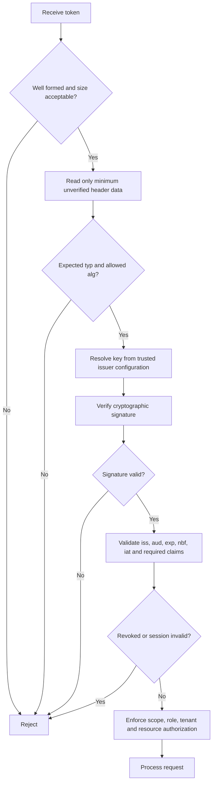

## Validation checklist per request

1. Reject malformed, unexpectedly large, or unsupported tokens.
2. Accept only the token type expected by this endpoint.
3. Accept only explicitly configured algorithms.
4. Resolve keys from a trusted issuer and key source.
5. Verify the signature before trusting claims.
6. Require and validate `iss`, `aud`, `exp`, and other profile-specific claims.
7. Apply only small, deliberate clock-skew leeway.
8. Check denylist or session state when required.
9. Enforce permissions against the requested action and resource.
10. Return a generic authentication failure without leaking key or claim details.

### Authentication is not authorization

A token may prove that the caller is `user-123`, but the application must still check whether `user-123` may update order `order-987`.

```text
Valid token + correct scope
            does not automatically mean
access to every resource with that scope
```

Object-level authorization, tenant boundaries, ownership, and business rules still apply.

---

# 9. Practical Python Example

The following example uses PyJWT-style APIs and asymmetric `RS256` verification. Adapt claim requirements to the token profile defined by your issuer.

```python
from __future__ import annotations

from typing import Any

import jwt
from jwt import InvalidTokenError

EXPECTED_ISSUER = "https://auth.example.com"
EXPECTED_AUDIENCE = "https://orders-api.example.com"
ALLOWED_ALGORITHMS = ["RS256"]  # Configuration, never token-controlled
EXPECTED_TYPE = "at+jwt"


class AuthenticationError(Exception):
    """Raised when an access token cannot be trusted."""


def validate_access_token(token: str, public_key: str) -> dict[str, Any]:
    if not token or len(token) > 16_384:
        raise AuthenticationError("Invalid access token")

    try:
        # Header data remains untrusted; inspect only to enforce token profile.
        header = jwt.get_unverified_header(token)

        if header.get("typ") != EXPECTED_TYPE:
            raise AuthenticationError("Invalid access token")

        if header.get("alg") not in ALLOWED_ALGORITHMS:
            raise AuthenticationError("Invalid access token")

        claims = jwt.decode(
            token,
            key=public_key,
            algorithms=ALLOWED_ALGORITHMS,
            issuer=EXPECTED_ISSUER,
            audience=EXPECTED_AUDIENCE,
            leeway=30,
            options={
                "require": ["iss", "sub", "aud", "exp", "iat", "jti"],
                "verify_signature": True,
                "verify_exp": True,
                "verify_iat": True,
                "verify_aud": True,
                "verify_iss": True,
            },
        )
    except AuthenticationError:
        raise
    except (InvalidTokenError, ValueError, TypeError) as exc:
        # Log only a safe failure category; do not log the token itself.
        raise AuthenticationError("Invalid access token") from exc

    subject = claims.get("sub")
    token_id = claims.get("jti")

    if not isinstance(subject, str) or not subject:
        raise AuthenticationError("Invalid access token")

    if not isinstance(token_id, str) or not token_id:
        raise AuthenticationError("Invalid access token")

    return claims
```

### Trusted JWKS lookup

When keys are published through JWKS, configure the issuer and JWKS URL rather than trusting a URL from the token header.

```python
TRUSTED_ISSUERS = {
    "https://auth.example.com": {
        "jwks_url": "https://auth.example.com/.well-known/jwks.json",
        "audience": "https://orders-api.example.com",
        "algorithms": ["RS256"],
    }
}
```

A production JWKS client should:

- use HTTPS and validate certificates;
- enforce an allowlisted issuer and host;
- cache keys;
- rate-limit refreshes caused by unknown `kid` values;
- handle rotation without accepting arbitrary key sources;
- fail securely when a trustworthy key cannot be obtained.

---

# 10. Redis Revocation Example

The denylist entry should live only until the JWT expires.

```python
from __future__ import annotations

import time
from typing import Any, Protocol


class RedisLike(Protocol):
    def set(self, name: str, value: str, *, ex: int) -> Any: ...
    def exists(self, name: str) -> int: ...


def revoke_access_token(redis: RedisLike, claims: dict[str, Any]) -> None:
    jti = claims.get("jti")
    exp = claims.get("exp")

    if not isinstance(jti, str) or not isinstance(exp, int):
        raise ValueError("Token requires valid jti and exp claims")

    ttl_seconds = max(0, exp - int(time.time()))
    if ttl_seconds == 0:
        return

    redis.set(
        f"jwt:denylist:{jti}",
        "revoked",
        ex=ttl_seconds,
    )


def is_access_token_revoked(redis: RedisLike, jti: str) -> bool:
    return bool(redis.exists(f"jwt:denylist:{jti}"))
```

### Request validation integration

```python
claims = validate_access_token(token, public_key)

if is_access_token_revoked(redis, claims["jti"]):
    raise AuthenticationError("Invalid access token")

# Continue with scope and resource-level authorization.
```

### Operational decision: Redis unavailable

Choose and document the failure mode:

```text
High-security operation:
Redis unavailable -> fail closed -> reject request

Low-risk read operation with short-lived token:
Possible design -> use tightly controlled fallback policy
```

Do not let an accidental cache outage silently disable revocation checks across the system.

---

# 11. Recommended Architectures

## 11.1 Server-Rendered Web Application

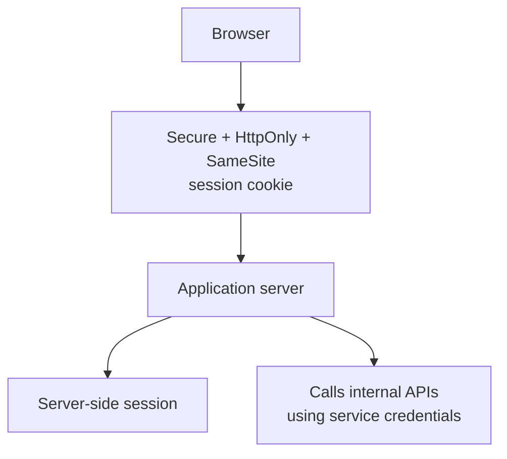

This is often simpler than exposing JWTs to browser code.

## 11.2 Single-Page Application with BFF

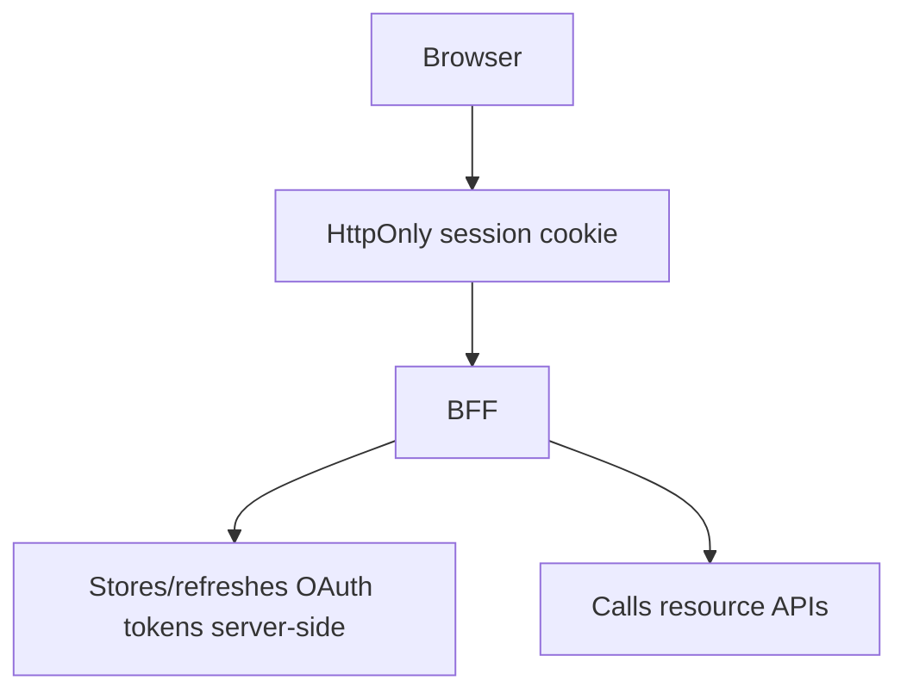

This strongly limits token exposure in the browser.

## 11.3 SPA Directly Calling APIs

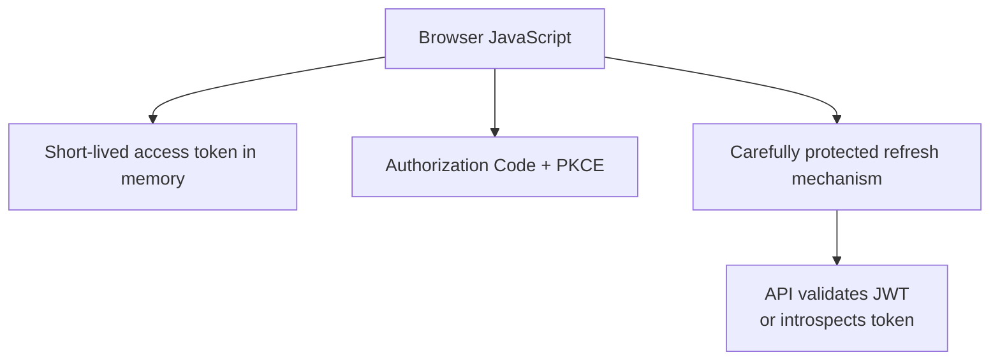

This design requires especially strong XSS controls. Prefer not to place long-lived refresh tokens in JavaScript-readable persistent storage.

## 11.4 Microservices

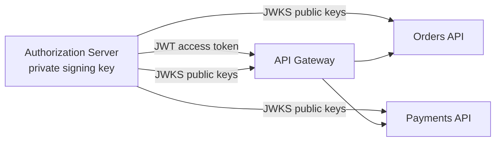

Use:

- asymmetric signing;
- audience-restricted tokens;
- service-specific scopes;
- separate token validation profiles;
- controlled token exchange for downstream calls when needed;
- short lifetimes;
- key rotation through trusted JWKS.

Do not forward the same broad user token through every internal service by default. That increases privilege and replay exposure.

---

# 12. Production Checklist

## Algorithms and keys

- [ ] The allowed algorithm list is configured by the server.
- [ ] `none` and unexpected algorithms are rejected.
- [ ] Symmetric and asymmetric validation paths are not mixed.
- [ ] Keys have sufficient cryptographic strength and entropy.
- [ ] Signing keys are stored in a secret manager, KMS, or HSM as appropriate.
- [ ] `kid` is treated as untrusted input.
- [ ] JWKS is loaded only from trusted, preconfigured locations.
- [ ] Key rotation is tested before production use.

## Claims

- [ ] Required claims are explicitly required, not merely verified when present.
- [ ] `iss` is matched exactly to a trusted issuer.
- [ ] `aud` identifies the current API.
- [ ] `exp`, `nbf`, and `iat` use a bounded clock-skew policy.
- [ ] Token type is validated.
- [ ] Access tokens, ID tokens, reset tokens, and other JWT types have separate rules.
- [ ] Claims contain no unnecessary secrets or sensitive information.
- [ ] Scope and role claims are followed by resource-level authorization checks.

## Revocation

- [ ] Access-token lifetime matches the application's risk.
- [ ] Logout revokes the refresh session or token family.
- [ ] Refresh tokens are rotated or sender-constrained where required.
- [ ] Refresh-token reuse triggers session-family revocation and investigation.
- [ ] Immediate access-token revocation uses a denylist or session-state check where needed.
- [ ] Revocation records expire when the associated token expires.
- [ ] Password reset, account disablement, and compromise have defined global-revocation behavior.

## Storage and transport

- [ ] Tokens are transmitted only over HTTPS.
- [ ] Full tokens are excluded from logs, traces, analytics, and error reports.
- [ ] Browser storage choice has been assessed for both XSS and CSRF.
- [ ] HttpOnly cookies use `Secure`, appropriate `SameSite`, restricted scope, and bounded lifetime.
- [ ] Cookie-authenticated state-changing requests have CSRF protection.
- [ ] Mobile and desktop refresh tokens use platform-secure storage.
- [ ] Long-lived credentials are not embedded in public client code.

## Operations

- [ ] Unknown `kid` refreshes are rate-limited.
- [ ] Validation failures are observable without exposing token contents.
- [ ] Servers have reliable clock synchronization.
- [ ] Emergency signing-key compromise procedures are documented and tested.
- [ ] Authorization-server, API, cache, and key-store outage behavior is explicit.

---

# 13. Key Takeaways

```text
1. Never trust the token's algorithm choice.
2. A valid signature is only the beginning of validation.
3. Validate issuer, audience, token type, time claims and required claims.
4. Signed JWT payloads are readable; do not put secrets inside them.
5. Short-lived access tokens reduce the damage caused by theft.
6. Refresh-token rotation provides replay detection and safer long sessions.
7. Immediate revocation requires state: denylist, session lookup or introspection.
8. localStorage is convenient but exposes tokens to JavaScript and XSS.
9. HttpOnly cookies reduce token theft but require CSRF protection.
10. Authentication claims never replace object-level authorization.
```

The central design principle is:

> **Treat a JWT as an untrusted bearer credential until its cryptography, context, lifecycle, and authorization are all validated.**

---

# 14. References

## IETF standards and best-current-practice documents

1. **RFC 7519 — JSON Web Token (JWT)**  
   https://www.rfc-editor.org/rfc/rfc7519.html

2. **RFC 8725 / BCP 225 — JSON Web Token Best Current Practices**  
   https://www.rfc-editor.org/rfc/rfc8725.html

3. **RFC 9068 — JWT Profile for OAuth 2.0 Access Tokens**  
   https://www.rfc-editor.org/rfc/rfc9068.html

4. **RFC 9700 / BCP 240 — Best Current Practice for OAuth 2.0 Security**  
   https://www.rfc-editor.org/rfc/rfc9700.html

5. **RFC 7009 — OAuth 2.0 Token Revocation**  
   https://www.rfc-editor.org/rfc/rfc7009.html

6. **RFC 7662 — OAuth 2.0 Token Introspection**  
   https://www.rfc-editor.org/rfc/rfc7662.html

7. **RFC 9449 — OAuth 2.0 Demonstrating Proof of Possession (DPoP)**  
   https://www.rfc-editor.org/rfc/rfc9449.html

## OWASP guidance

8. **OWASP REST Security Cheat Sheet**  
   https://cheatsheetseries.owasp.org/cheatsheets/REST_Security_Cheat_Sheet.html

9. **OWASP HTML5 Security Cheat Sheet**  
   https://cheatsheetseries.owasp.org/cheatsheets/HTML5_Security_Cheat_Sheet.html

10. **OWASP Session Management Cheat Sheet**  
    https://cheatsheetseries.owasp.org/cheatsheets/Session_Management_Cheat_Sheet.html

11. **OWASP Cross-Site Request Forgery Prevention Cheat Sheet**  
    https://cheatsheetseries.owasp.org/cheatsheets/Cross-Site_Request_Forgery_Prevention_Cheat_Sheet.html

## Library documentation

12. **PyJWT Documentation**  
    https://pyjwt.readthedocs.io/en/stable/

13. **Redis `SET` Command with Expiration**  
    https://redis.io/docs/latest/commands/set/

---

**End of document**
