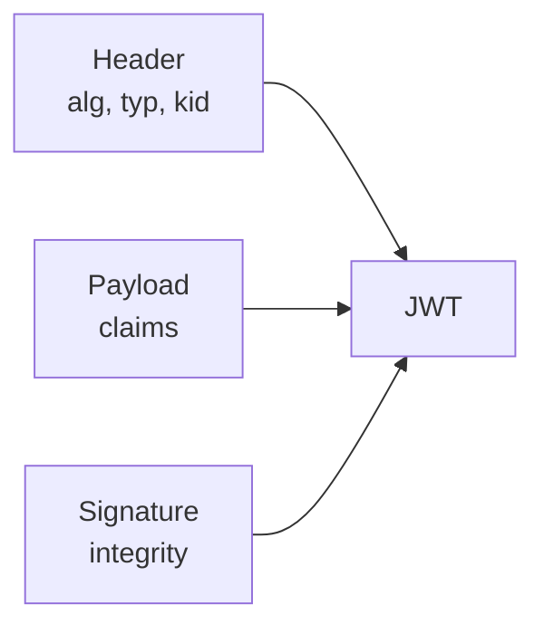
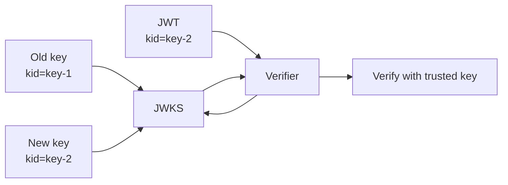
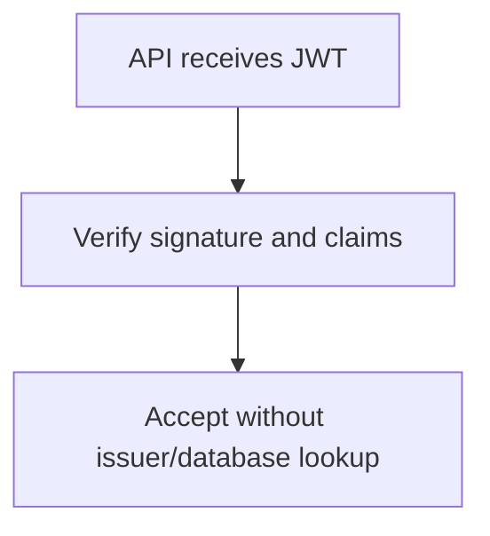
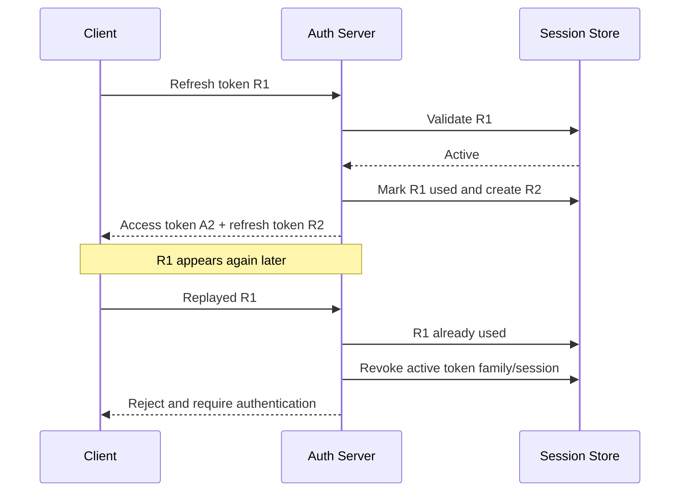
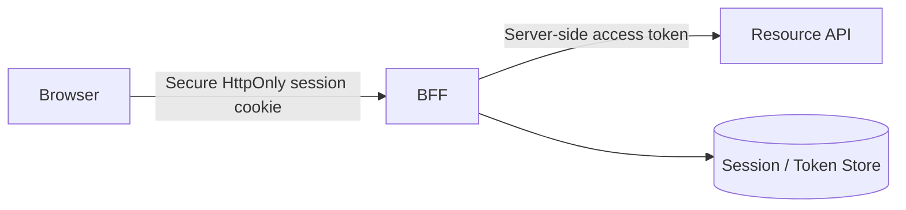
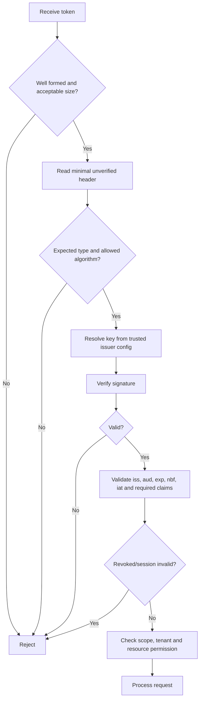

# JWT Pitfalls: Algorithms, Claims, Revocation, and Storage

> Understand how to validate and operate JWTs safely in real applications—not just how to generate and decode them.

## In short

- A normal signed JWT is **encoded, not encrypted**. Anyone holding it can read its header and payload.
- Never trust the token's `alg` value. The server must configure the allowed algorithm(s).
- A valid signature is only one validation step. Also validate `iss`, `aud`, token type, expiration, and other required claims.
- Different JWT types must have **different validation rules** so an ID token or reset token cannot be used as an API access token.
- JWT access tokens are usually stateless, so logout does not automatically invalidate an already-issued token.
- Use **short-lived access tokens** and protected refresh tokens. For public OAuth clients, use refresh-token rotation or sender-constrained refresh tokens.
- Avoid storing authentication tokens in `localStorage` or `sessionStorage` for security-sensitive browser applications. Prefer an `HttpOnly` cookie/session or a BFF architecture.
- Token scopes and roles do not replace resource-level authorization checks.



---

# Index

1. [JWT Fundamentals](#1-jwt-fundamentals)
2. [Algorithm and Key Pitfalls](#2-algorithm-and-key-pitfalls)
3. [Claim and Token-Type Validation](#3-claim-and-token-type-validation)
4. [Revocation and Refresh Tokens](#4-revocation-and-refresh-tokens)
5. [Storage and Browser Security](#5-storage-and-browser-security)
6. [Safe Validation Pipeline](#6-safe-validation-pipeline)
7. [Practical Python Example](#7-practical-python-example)
8. [Recommended Architecture](#8-recommended-architecture)
9. [Production Checklist](#9-production-checklist)
10. [References](#10-references)

---

# 1. JWT Fundamentals

A **JSON Web Token (JWT)** is a compact format for carrying claims between systems.

A JWT may be:

- **JWS** — signed, which provides integrity/authenticity;
- **JWE** — encrypted, which provides confidentiality.

Most application authentication uses **signed JWTs**.

## 1.1 Structure

A signed JWT commonly has three Base64URL-encoded parts:

```text
HEADER.PAYLOAD.SIGNATURE
```

Example header:

```json
{
  "alg": "RS256",
  "typ": "at+jwt",
  "kid": "access-key-2026-08"
}
```

Example payload:

```json
{
  "iss": "https://auth.example.com",
  "sub": "user-123",
  "aud": "https://orders-api.example.com",
  "exp": 1785738900,
  "iat": 1785738000,
  "jti": "e2197501-8801-4ce7-88aa-d42f627fbce3",
  "scope": "orders:read orders:write"
}
```

## 1.2 Signed does not mean encrypted

The header and payload of a normal signed JWT are readable by anyone who obtains the token.

```text
Signed JWT

Readable header + Readable payload + Protected signature
```

Therefore, do not place passwords, private keys, payment secrets, or unnecessary sensitive personal information inside JWT claims.

Use HTTPS for transport. Use JWE only when token-level encryption is actually required.

## 1.3 JWT is only a token format

JWT is not an authentication protocol by itself.

- OAuth 2.x may use JWT or opaque access tokens.
- OpenID Connect commonly uses JWT-formatted ID tokens.
- An access token, ID token, refresh token, or reset token may have completely different security rules even if all are JWTs.

---

# 2. Algorithm and Key Pitfalls

## 2.1 Never trust the token's `alg`

The JWT header is attacker-controlled input until validation succeeds.

### Unsafe idea

```python
algorithm = unverified_header["alg"]
decode(token, key, algorithms=[algorithm])
```

This lets the token influence how it will be verified.

### Safe idea

```python
ALLOWED_ALGORITHMS = ["RS256"]

decode(
    token,
    trusted_public_key,
    algorithms=ALLOWED_ALGORITHMS,
)
```

The application must configure the accepted algorithm set.

## 2.2 `none` algorithm

JWT/JWS supports an unsecured form using:

```json
{
  "alg": "none"
}
```

Protected APIs should reject unsecured JWTs unless a very specific protocol explicitly requires them.

## 2.3 HS256 vs RS256 confusion

### HS256

```text
Issuer signs with shared secret K
Verifier validates with shared secret K
```

Every verifier holding `K` can also create valid tokens.

### RS256

```text
Issuer signs with private key
Verifier validates with public key
```

Verifiers can validate tokens without receiving signing authority.

A classic implementation flaw occurs when a system expects RS256 but incorrectly accepts HS256 and treats the RSA public key as an HMAC secret.

Prevent this by:

- pinning the algorithm;
- not mixing symmetric and asymmetric algorithms in the same validation path;
- binding each key to its intended algorithm and purpose;
- using a maintained JWT library.

## 2.4 Weak HMAC secrets

If using HS256/HS384/HS512, use a cryptographically random, high-entropy secret.

Do not use values such as:

```text
mysecret123
company-name
project-name-2026
```

A captured HMAC-signed JWT can be used for offline secret guessing.

## 2.5 Algorithm choice

| Algorithm | Key model | Common fit | Main concern |
|---|---|---|---|
| HS256 | Shared secret | Small trusted systems | Every verifier can also sign |
| RS256 / PS256 | RSA private/public key | Distributed APIs | Larger keys/signatures |
| ES256 | EC private/public key | Compact asymmetric signing | Library/key handling must be correct |
| EdDSA | Ed25519/Ed448 | Modern ecosystems | Verify end-to-end support |

**Practical rule:** use asymmetric signing when many APIs need to verify tokens but should not be able to issue them.

## 2.6 `kid` and key rotation

`kid` identifies which signing key should verify a token.



Treat `kid`, `jku`, and `x5u` as untrusted input.

Do not:

- build SQL/file paths directly from `kid`;
- fetch arbitrary `jku` or `x5u` URLs from a token;
- accept keys from an untrusted issuer.

Use only preconfigured trusted issuers/JWKS locations and preserve old verification keys until previously issued tokens have expired.

---

# 3. Claim and Token-Type Validation

A correct signature proves that a trusted key signed the JWT. It does **not** prove that the JWT belongs to this API, this environment, this token type, or this operation.

## 3.1 Important claims

| Claim | Meaning | What to validate |
|---|---|---|
| `iss` | Issuer | Exact trusted issuer |
| `sub` | Subject | Valid subject for the issuer/application |
| `aud` | Audience | Must include the current API/resource |
| `exp` | Expiration | Current time must be before expiration |
| `nbf` | Not before | Reject before this time |
| `iat` | Issued at | Validate format/reasonableness according to policy |
| `jti` | JWT ID | Unique token identifier; useful for revocation/replay tracking |

For the OAuth 2.0 JWT access-token profile, `iss`, `exp`, `aud`, `sub`, `client_id`, `iat`, and `jti` are defined as required claims, and access tokens use `typ: at+jwt`.

## 3.2 Claim presence and claim validation are different

A library may validate a claim **only if it exists**.

If a claim is required by your token profile, require it explicitly.

```python
options={
    "require": ["iss", "sub", "aud", "exp", "iat", "jti"]
}
```

Then separately validate the claim's value.

## 3.3 Validate issuer

```text
Expected:
https://auth.production.example.com

Received:
https://auth.staging.example.com

Result: Reject
```

This prevents tokens from another environment, issuer, or tenant from being accepted just because a compatible key was used.

## 3.4 Validate audience

```text
Token audience: payments-api
Presented to:   admin-api

Result: Reject
```

Audience restriction reduces the impact of a leaked token by limiting which resource server may accept it.

## 3.5 Validate token type

Different JWT types should use mutually exclusive validation rules.

| Validation | Access token | Password-reset token |
|---|---|---|
| `typ` | `at+jwt` | application-specific reset type |
| `aud` | `orders-api` | `account-recovery` |
| Lifetime | Short | Very short |
| Extra rule | Scope/permission | One-time use |

Never accept an OpenID Connect ID token as an API access token simply because its signature is valid.

## 3.6 Time claims and clock skew

Use a small deliberate leeway for minor clock differences:

```python
leeway=30
```

The value is application-specific. Do not use large clock skew to hide unsynchronized infrastructure because it silently extends token validity.

## 3.7 Claims do not replace authorization

A valid token may prove:

```text
sub = user-123
scope = orders:write
```

The API must still check whether `user-123` is allowed to update `order-987`.

```text
Valid token
+ correct scope
+ correct tenant
+ object ownership / permission
= authorized request
```

---

# 4. Revocation and Refresh Tokens

## 4.1 Why JWT revocation is difficult

A self-contained access token can be validated locally without contacting the issuer.



That improves scalability, but an already-issued token normally remains usable until it expires unless the system adds revocation state.

Deleting the token from the browser does **not** revoke the token itself.

## 4.2 Short-lived access tokens

The first protection is a short access-token lifetime.

```text
Maximum stolen-token impact
≈ remaining access-token lifetime
```

The exact lifetime is a risk decision, not a universal standard.

## 4.3 Revocation using `jti`

For immediate access-token revocation, store the revoked token's `jti` until the token naturally expires.

```text
Redis key:
jwt:denylist:<jti>

TTL:
exp - current_time
```

Request flow:

```text
Verify JWT
   ↓
Read jti
   ↓
Check denylist
   ↓
Revoked? → Reject
Not revoked? → Continue authorization
```

Trade-off: the API now performs a state lookup, so validation is no longer fully stateless.

## 4.4 Refresh-token rotation

Refresh-token rotation issues a new refresh token after every successful refresh and invalidates the old one.



For **public OAuth clients**, current OAuth security BCP requires refresh tokens to be either:

- sender-constrained; or
- protected with refresh-token rotation so replay can be detected.

A server generally stores only a cryptographic hash of an opaque refresh token when it needs equality verification.

## 4.5 Session-version strategy

Another option is to store a server-side session/token version:

```text
Server:
token_version = 8
```

JWT:

```json
{
  "ver": 8
}
```

Increment the version after password reset, account compromise, or global logout. Older tokens are rejected.

This is simple for revoking all sessions, but requires a lookup or cached session state.

## 4.6 Opaque tokens and introspection

If immediate central control is more important than local stateless verification, use an opaque token and introspection.

```text
Client → API → Authorization Server / Introspection
                    ↓
          active, sub, aud, scope, exp
```

This centralizes revocation but adds a network dependency and possibly caching complexity.

## 4.7 DPoP and sender-constrained tokens

Bearer tokens can be used by whoever possesses them.

**DPoP** binds an OAuth token to a client's public key and requires proof of possession of the matching private key when the token is used.

This reduces the usefulness of a token that is copied or leaked by itself. It does not make XSS harmless because malicious code running inside the legitimate application context may still be able to perform authenticated actions.

---

# 5. Storage and Browser Security

The signing algorithm cannot protect a token after it has been stolen.

## 5.1 Browser storage comparison

| Storage | JavaScript can read it? | Automatically sent? | Main concern |
|---|---:|---:|---|
| `localStorage` | Yes | No | XSS can steal persistent credentials |
| `sessionStorage` | Yes | No | XSS can still steal credentials |
| JavaScript memory | Yes | No | XSS can use/capture token; token disappears on reload |
| `HttpOnly` cookie | No | Yes | Requires CSRF-aware design |
| Server-side session / BFF | Browser only holds session cookie | Yes | Session theft, CSRF, server-side state |

Current OWASP guidance warns against storing authentication tokens, JWTs, refresh tokens, and session identifiers in `localStorage` or `sessionStorage` because JavaScript running in the origin can access them.

## 5.2 HttpOnly cookie

A protected refresh/session cookie typically looks like:

```http
Set-Cookie: __Host-refresh=<token>;
  Path=/;
  Secure;
  HttpOnly;
  SameSite=Lax;
  Max-Age=1209600
```

Important attributes:

| Attribute | Purpose |
|---|---|
| `Secure` | Send only over HTTPS |
| `HttpOnly` | Prevent normal JavaScript access |
| `SameSite` | Reduce cross-site cookie sending |
| `Path` | Restrict where the cookie is sent |
| `Max-Age` / `Expires` | Bound persistence |
| `__Host-` | Strong host-only cookie constraints in supporting browsers |

Use `SameSite=Strict` where application flows allow it. `Lax` is commonly needed when legitimate top-level cross-site navigation must work.

## 5.3 Cookie authentication and CSRF

Because browsers automatically send matching cookies, cookie-authenticated state-changing requests need CSRF protection.

Use a layered approach:

- framework-supported synchronizer CSRF token; or
- a correctly implemented **signed, session-bound double-submit** token;
- appropriate `SameSite` cookie policy;
- `Origin`/`Referer` or Fetch Metadata validation as defense in depth;
- no state-changing `GET` endpoints.

`HttpOnly` protects the cookie value from direct JavaScript reads, but it does not make an XSS vulnerability harmless. An injected script may still perform actions from the authenticated browser.

## 5.4 Backend-for-Frontend (BFF)

A BFF keeps OAuth tokens on the server instead of exposing them to frontend JavaScript.



Benefits:

- access and refresh tokens stay out of browser JavaScript;
- centralized refresh/revocation logic;
- reduced token leakage from frontend logs/extensions;
- easier secure handling of confidential-client credentials.

## 5.5 Mobile and desktop

Use platform-secure storage such as:

- iOS Keychain;
- Android Keystore-backed encrypted storage;
- macOS Keychain;
- Windows Credential Manager or platform-protected equivalents.

Public clients must not embed a permanent client secret. Use Authorization Code + PKCE where applicable.

---

# 6. Safe Validation Pipeline

Use a deterministic validation pipeline for every protected request.



## Validation order

1. Reject malformed or unexpectedly large tokens.
2. Accept only the expected token type.
3. Accept only server-configured algorithms.
4. Resolve keys only from trusted issuer/JWKS configuration.
5. Verify the signature.
6. Require and validate the token profile's claims.
7. Apply only small intentional clock-skew leeway.
8. Check revocation/session state when the design requires it.
9. Enforce scopes/roles plus tenant and object-level authorization.
10. Return generic authentication errors without exposing key or token details.

---

# 7. Practical Python Example

The following example uses PyJWT-style APIs with RS256 verification.

```python
from __future__ import annotations

from typing import Any

import jwt
from jwt import InvalidTokenError

EXPECTED_ISSUER = "https://auth.example.com"
EXPECTED_AUDIENCE = "https://orders-api.example.com"
EXPECTED_TYPE = "at+jwt"
ALLOWED_ALGORITHMS = ["RS256"]


class AuthenticationError(Exception):
    pass


def validate_access_token(token: str, public_key: str) -> dict[str, Any]:
    if not token or len(token) > 16_384:
        raise AuthenticationError("Invalid access token")

    try:
        # Header remains untrusted. Read only what is needed
        # to enforce this endpoint's token profile.
        header = jwt.get_unverified_header(token)

        if header.get("typ") != EXPECTED_TYPE:
            raise AuthenticationError("Invalid access token")

        if header.get("alg") not in ALLOWED_ALGORITHMS:
            raise AuthenticationError("Invalid access token")

        claims = jwt.decode(
            token,
            key=public_key,
            algorithms=ALLOWED_ALGORITHMS,
            issuer=EXPECTED_ISSUER,
            audience=EXPECTED_AUDIENCE,
            leeway=30,
            options={
                "require": ["iss", "sub", "aud", "exp", "iat", "jti"],
                "verify_signature": True,
                "verify_exp": True,
                "verify_aud": True,
                "verify_iss": True,
                "verify_iat": True,
            },
        )

    except AuthenticationError:
        raise
    except (InvalidTokenError, ValueError, TypeError) as exc:
        # Never log the raw bearer token.
        raise AuthenticationError("Invalid access token") from exc

    if not isinstance(claims.get("sub"), str):
        raise AuthenticationError("Invalid access token")

    if not isinstance(claims.get("jti"), str):
        raise AuthenticationError("Invalid access token")

    return claims
```

## Why this example is safer

It does not allow the token to select arbitrary verification behavior.

```text
Server config
   ├── expected issuer
   ├── expected audience
   ├── expected token type
   ├── allowed algorithm
   └── trusted verification key

JWT
   └── must satisfy that profile
```

In production, combine this with:

- trusted JWKS key resolution;
- caching and rate-limited refresh for unknown `kid` values;
- access-token denylist/session checks when immediate revocation is required;
- scope and resource-level authorization.

---

# 8. Recommended Architecture

## 8.1 Traditional server-rendered web application

```text
Browser
  ↓ Secure HttpOnly session cookie
Application server
  ↓
Server-side session
```

This is often simpler than exposing JWTs directly to browser code.

## 8.2 SPA with BFF

```text
Browser
  ↓ HttpOnly session cookie
BFF
  ↓ server-held OAuth access token
Resource API
```

This is a strong default when you control both the frontend and backend.

## 8.3 SPA directly calling APIs

```text
Browser JavaScript
  ├── short-lived access token
  ├── Authorization Code + PKCE
  └── protected refresh/session mechanism
           ↓
          API
```

This architecture requires especially strong XSS protection. Avoid persistent JavaScript-readable storage for long-lived credentials.

## 8.4 Microservices

```text
Authorization Server
  ├── private signing key
  ├── short-lived audience-restricted tokens
  └── trusted JWKS
         ↓
API Gateway / Resource APIs
```

Prefer:

- asymmetric signing;
- service-specific audiences/scopes;
- separate validation profiles;
- short token lifetimes;
- controlled token exchange rather than forwarding one broad user token through every service.

---

# 9. Production Checklist

## Algorithms and keys

- [ ] Allowed algorithms are configured server-side.
- [ ] `none` and unexpected algorithms are rejected.
- [ ] Symmetric and asymmetric validation paths are not mixed accidentally.
- [ ] HMAC keys have high entropy when symmetric signing is used.
- [ ] `kid`, `jku`, and `x5u` are treated as untrusted input.
- [ ] JWKS comes only from trusted, preconfigured locations.
- [ ] Key rotation is tested before production use.

## Claims and authorization

- [ ] Required claims are explicitly required.
- [ ] `iss` is matched to the configured issuer.
- [ ] `aud` contains the current resource/API.
- [ ] `exp`, `nbf`, and `iat` follow a bounded clock policy.
- [ ] Token type is validated.
- [ ] Access, ID, reset, and other token types have separate validation rules.
- [ ] Token claims contain no unnecessary secrets/sensitive data.
- [ ] Scope/role checks are followed by tenant and object-level authorization.

## Revocation

- [ ] Access tokens are short-lived according to application risk.
- [ ] Logout revokes the refresh session/token family.
- [ ] Public-client refresh tokens are rotated or sender-constrained.
- [ ] Refresh-token reuse has defined compromise handling.
- [ ] Immediate access-token revocation uses denylist/session state when required.
- [ ] Revocation records expire when the related token expires.

## Storage and transport

- [ ] Tokens are sent only over HTTPS.
- [ ] Full bearer tokens are excluded from logs, traces, analytics, and error reports.
- [ ] Browser credentials are not stored in `localStorage`/`sessionStorage` for security-sensitive auth flows.
- [ ] Cookies use `Secure`, `HttpOnly`, appropriate `SameSite`, limited scope, and bounded lifetime.
- [ ] Cookie-authenticated state-changing operations use CSRF protection.
- [ ] Mobile/desktop credentials use platform-secure storage.

## Operations

- [ ] Unknown-`kid` key refreshes are rate-limited.
- [ ] Authentication failures are observable without exposing token contents.
- [ ] Servers maintain reliable clock synchronization.
- [ ] Signing-key compromise procedures are documented.
- [ ] Failure behavior for auth server, JWKS, Redis/session store, and introspection outages is explicit.

> **Core principle:** treat every JWT as an untrusted bearer credential until its cryptography, context, lifecycle, and authorization have all been validated.

---

# 10. References

## IETF

1. **RFC 7519 — JSON Web Token (JWT)**  
   https://www.rfc-editor.org/rfc/rfc7519.html

2. **RFC 8725 / BCP 225 — JSON Web Token Best Current Practices**  
   https://www.rfc-editor.org/rfc/rfc8725.html

3. **RFC 9068 — JWT Profile for OAuth 2.0 Access Tokens**  
   https://www.rfc-editor.org/rfc/rfc9068.html

4. **RFC 9700 / BCP 240 — Best Current Practice for OAuth 2.0 Security**  
   https://www.rfc-editor.org/rfc/rfc9700.html

5. **RFC 7009 — OAuth 2.0 Token Revocation**  
   https://www.rfc-editor.org/rfc/rfc7009.html

6. **RFC 7662 — OAuth 2.0 Token Introspection**  
   https://www.rfc-editor.org/rfc/rfc7662.html

7. **RFC 9449 — OAuth 2.0 Demonstrating Proof of Possession (DPoP)**  
   https://www.rfc-editor.org/rfc/rfc9449.html

## OWASP

8. **OWASP Session Management Cheat Sheet**  
   https://cheatsheetseries.owasp.org/cheatsheets/Session_Management_Cheat_Sheet.html

9. **OWASP Cross-Site Request Forgery Prevention Cheat Sheet**  
   https://cheatsheetseries.owasp.org/cheatsheets/Cross-Site_Request_Forgery_Prevention_Cheat_Sheet.html

10. **OWASP REST Security Cheat Sheet**  
    https://cheatsheetseries.owasp.org/cheatsheets/REST_Security_Cheat_Sheet.html

## Library documentation

11. **PyJWT Documentation**  
    https://pyjwt.readthedocs.io/en/stable/

---

**End of document**
