# OWASP API Security Top 10 — Developer Guide

> **Category:** Security  
> **Edition covered:** OWASP API Security Top 10 — 2023  
> **Audience:** Backend/API developers with 3+ years of experience  
> **Goal:** Understand the most important API-specific security risks and the practical controls used to prevent them.

---

# 1. What Is the OWASP API Security Top 10?

The **OWASP API Security Top 10** is an awareness document that describes the most critical security risks commonly found in APIs.

It is designed for people involved in API design, development, testing, deployment, and maintenance, including:

- Backend developers
- API architects
- DevOps and platform engineers
- Security engineers
- QA and automation engineers
- Engineering managers

The list focuses on risks that need special attention in APIs. It does **not** mean that general application risks such as SQL injection, vulnerable dependencies, insecure cryptography, or cross-site scripting are unimportant.

> The API Security Top 10 complements broader security standards; it does not replace them.

---

# 2. Why API Security Is Different

Traditional web applications expose both a user interface and backend behavior. APIs expose application data and operations directly through structured requests.

A normal API request may contain:

- An object identifier
- Authentication credentials or a token
- Properties that should be updated
- Filters, sorting, pagination, or search parameters
- URLs to external resources
- Commands that trigger expensive business operations

This makes APIs especially sensitive to authorization and business-logic problems.

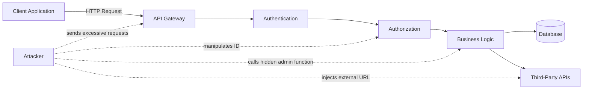

## 2.1 Authentication and Authorization Are Different

**Authentication** answers:

> Who is making this request?

**Authorization** answers:

> Is this authenticated identity allowed to perform this action on this specific resource?

A valid JWT proves identity only when it is correctly validated. It does not automatically prove that the user can access every requested object or operation.

```text
Valid token + unauthorized object = blocked request
Valid token + unauthorized function = blocked request
Valid token + forbidden property = ignored or blocked property
```

---

# 3. The Top 10 at a Glance

| Rank | Risk | Main Security Boundary |
|---:|---|---|
| API1 | Broken Object Level Authorization | Access to a specific object or record |
| API2 | Broken Authentication | Identity, credentials, sessions, and tokens |
| API3 | Broken Object Property Level Authorization | Access to individual fields or properties |
| API4 | Unrestricted Resource Consumption | CPU, memory, storage, network, and paid services |
| API5 | Broken Function Level Authorization | Access to operations and privileged endpoints |
| API6 | Unrestricted Access to Sensitive Business Flows | Automated abuse of valid business operations |
| API7 | Server-Side Request Forgery | Server-initiated outbound requests |
| API8 | Security Misconfiguration | Unsafe settings across the API stack |
| API9 | Improper Inventory Management | Unknown, outdated, or exposed API assets |
| API10 | Unsafe Consumption of APIs | Untrusted data from third-party services |

A useful mental model is:

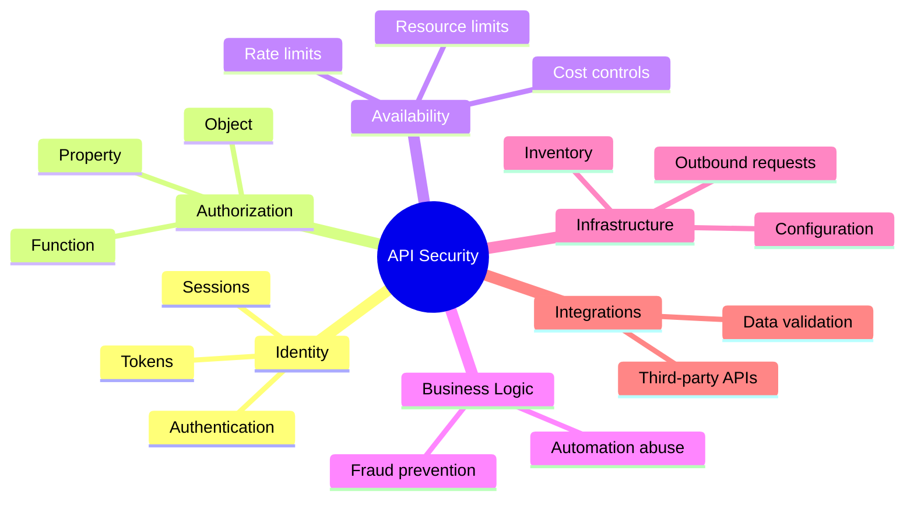

---

# 4. API1:2023 — Broken Object Level Authorization (BOLA)

## 4.1 Simple Meaning

BOLA happens when an API accepts an object identifier from the client but does not verify that the current user is authorized to access that object.

It is also commonly called **IDOR — Insecure Direct Object Reference**.

## 4.2 Vulnerable Example

A user requests their order:

```http
GET /api/orders/1042
Authorization: Bearer <user-token>
```

The attacker changes the identifier:

```http
GET /api/orders/1043
Authorization: Bearer <same-user-token>
```

If order `1043` belongs to another customer and the API returns it, object-level authorization is broken.

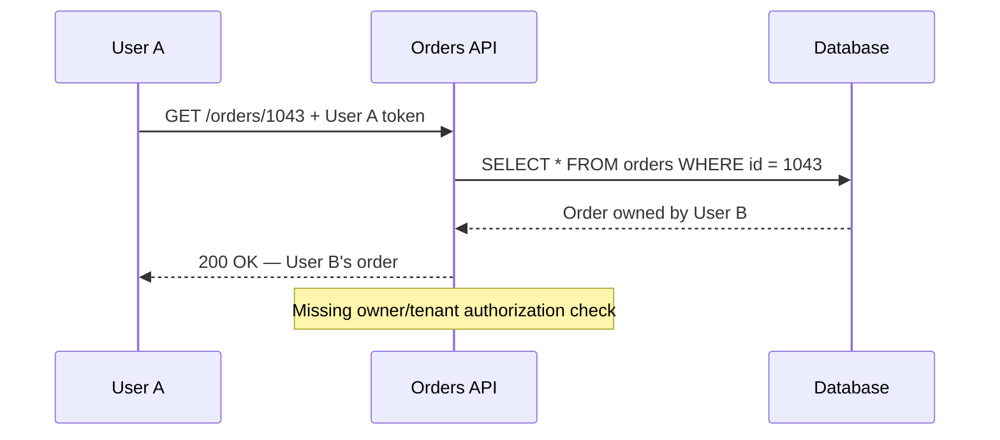

## 4.3 Why It Happens

The application checks that the user is logged in but does not check ownership or tenant access.

Vulnerable logic:

```python
order = Order.objects.get(id=order_id)
return order
```

The database query uses only the client-provided ID.

## 4.4 Secure Pattern

Filter by both the object identifier and the authorized security scope.

```python
order = Order.objects.get(
    id=order_id,
    customer_id=current_user.id,
)
```

For multi-tenant systems:

```python
order = Order.objects.get(
    id=order_id,
    tenant_id=current_user.tenant_id,
)
```

## 4.5 Prevention

- Apply object-level authorization on every endpoint that receives an object ID.
- Scope database queries to the authenticated user, tenant, organization, or permitted resource set.
- Use a centralized authorization service or reusable policy layer.
- Do not treat UUIDs as an authorization control.
- Deny access by default.
- Test by replacing IDs with IDs belonging to another user or tenant.
- Check nested resources as well as top-level resources.

Example nested endpoint:

```http
GET /organizations/20/projects/700
```

The API must validate that:

1. The user can access organization `20`.
2. Project `700` belongs to organization `20`.
3. The user can access project `700`.

## 4.6 Important Point

Changing sequential integers to UUIDs makes object IDs harder to guess, but leaked or collected UUIDs can still be used. Authorization must be enforced regardless of identifier format.

---

# 5. API2:2023 — Broken Authentication

## 5.1 Simple Meaning

Broken authentication occurs when an API incorrectly verifies identity, manages credentials, handles sessions, or validates tokens.

An attacker may then impersonate another user or take over an account.

## 5.2 Common Causes

- Weak password policies
- No protection against credential stuffing
- Missing login rate limits
- Predictable session identifiers
- Tokens placed in URLs
- JWT signatures not validated
- Expired tokens accepted
- Weak token-signing secrets
- Passwords stored using weak hashing
- Password-reset flows with weaker protection than login
- Sensitive account changes without re-authentication
- Internal microservices trusting requests without service authentication

## 5.3 Vulnerable JWT Validation

A server reads claims without verifying the signature:

```python
# Vulnerable conceptual example
payload = decode_without_signature_verification(token)
user_id = payload["sub"]
```

An attacker can create a modified token:

```json
{
  "sub": "admin-user-id",
  "role": "admin"
}
```

## 5.4 Secure Authentication Flow

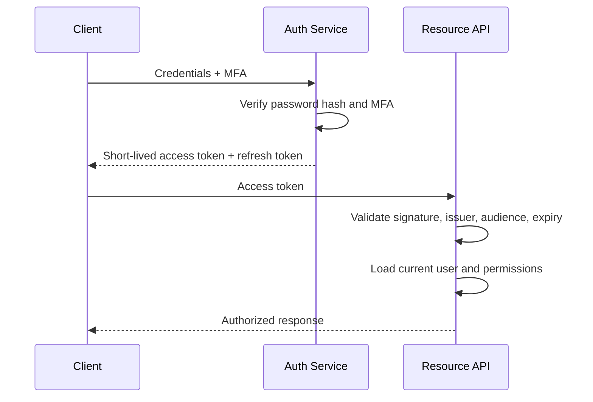

## 5.5 JWT Validation Checklist

A JWT-consuming API should validate at least:

- Cryptographic signature
- Allowed algorithm
- Expiration time: `exp`
- Not-before time: `nbf`, when used
- Issuer: `iss`
- Intended audience: `aud`
- Subject: `sub`
- Token type or purpose
- Revocation or session status when required

Do not accept the algorithm directly from the token without enforcing a server-side allowlist.

## 5.6 Password Security

Passwords should be stored using a password-hashing algorithm designed for password storage, such as:

- Argon2id
- bcrypt
- scrypt
- PBKDF2 with an appropriate work factor

Passwords should never be stored using plain SHA-256 or reversible encryption as the primary password-storage mechanism.

## 5.7 Prevention

- Use mature authentication libraries and identity providers.
- Protect login, OTP, and password-reset endpoints with stricter limits.
- Implement MFA for high-risk applications or actions.
- Use short-lived access tokens.
- Rotate refresh tokens and detect token reuse.
- Revoke active sessions after password changes or account compromise.
- Require recent authentication for sensitive changes.
- Store tokens securely and never include them in URLs.
- Authenticate service-to-service communication.
- Separate user authentication from API-client identification.

> An API key normally identifies an application or integration. It should not be treated as a complete replacement for user authentication.

---

# 6. API3:2023 — Broken Object Property Level Authorization (BOPLA)

## 6.1 Simple Meaning

BOPLA occurs when an API fails to control which object fields a user may read or modify.

It combines two closely related problems:

1. **Excessive data exposure** — returning fields the user should not see.
2. **Mass assignment** — accepting fields the user should not be allowed to change.

## 6.2 Excessive Data Exposure Example

The frontend needs only a public user profile:

```json
{
  "id": 42,
  "name": "Asha",
  "avatar_url": "/media/asha.png"
}
```

But the API serializes the entire database object:

```json
{
  "id": 42,
  "name": "Asha",
  "avatar_url": "/media/asha.png",
  "email": "asha@example.com",
  "password_hash": "...",
  "mfa_secret": "...",
  "internal_risk_score": 87
}
```

Hiding fields in the UI does not protect them. The API response itself must be safe.

## 6.3 Mass Assignment Example

Expected profile update:

```http
PATCH /api/users/me
Content-Type: application/json

{
  "display_name": "Asha Patel"
}
```

Attacker request:

```http
PATCH /api/users/me
Content-Type: application/json

{
  "display_name": "Asha Patel",
  "role": "admin",
  "is_verified": true,
  "credit_limit": 1000000
}
```

Vulnerable code:

```python
for key, value in request.json.items():
    setattr(user, key, value)
```

## 6.4 Secure Input and Output Models

Use explicit schemas for each operation.

```python
from pydantic import BaseModel, ConfigDict

class ProfileUpdate(BaseModel):
    model_config = ConfigDict(extra="forbid")

    display_name: str | None = None
    avatar_url: str | None = None


class PublicProfileResponse(BaseModel):
    id: int
    display_name: str
    avatar_url: str | None
```

This creates two allowlists:

- Fields that may enter the application
- Fields that may leave the application

## 6.5 Prevention

- Use dedicated request and response schemas.
- Avoid directly binding request JSON to persistence models.
- Allowlist writable fields per operation and role.
- Allowlist readable fields per endpoint and audience.
- Reject unexpected fields instead of silently trusting them.
- Avoid generic serializers for sensitive entities.
- Review nested objects and relationships.
- Treat GraphQL fields and mutations as property-level authorization boundaries.

## 6.6 Practical Rule

```text
Database model != API request model != API response model
```

They may look similar, but they serve different trust boundaries.

---

# 7. API4:2023 — Unrestricted Resource Consumption

## 7.1 Simple Meaning

Every API request consumes resources. If limits are missing, an attacker can cause service unavailability or unexpectedly high operational cost.

Resources include:

- CPU
- Memory
- Database connections
- Network bandwidth
- Storage
- Worker processes
- File descriptors
- Email, SMS, and phone-call credits
- Third-party AI or OCR requests
- Payment, identity, and biometric verification calls

## 7.2 Example: Unbounded Pagination

```http
GET /api/events?page_size=1000000
```

If the API attempts to load one million records, it may consume excessive memory, database time, and response bandwidth.

Secure behavior:

```text
Default page size: 20
Maximum page size: 100
Request above maximum: reject or clamp safely
```

## 7.3 Example: Expensive File Processing

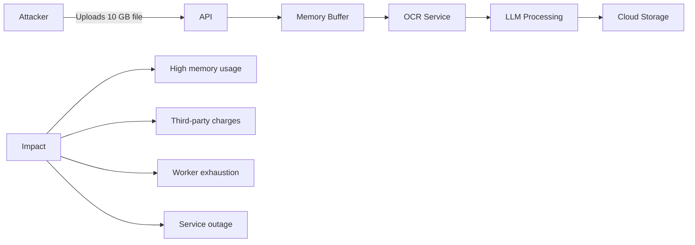

## 7.4 Controls

Apply limits at multiple levels:

| Layer | Example Limit |
|---|---|
| Reverse proxy | Maximum body size, connection limits, timeouts |
| API gateway | Requests per second, quotas, burst limits |
| Application | Page size, batch size, field count, query depth |
| Database | Query timeout, connection-pool size |
| Worker system | Task timeout, retry count, concurrency |
| File processing | File size, type, dimensions, decompressed size |
| Third-party services | Daily spending caps and per-user quotas |

## 7.5 Rate-Limiting Dimensions

A single IP-based limit is often insufficient. Consider limits by:

- IP address
- User ID
- Tenant ID
- API key or client ID
- Endpoint
- Operation type
- Device or session
- Global system capacity

## 7.6 Prevention

- Set request-body and upload-size limits.
- Restrict pagination, batch size, query depth, and filters.
- Apply per-user, per-tenant, per-IP, and global quotas.
- Add execution timeouts and cancellation.
- Limit concurrent expensive operations.
- Validate compressed files against decompression bombs.
- Limit retries and use exponential backoff with jitter.
- Monitor cost-generating operations.
- Use queues for long-running work.
- Return `429 Too Many Requests` when appropriate.

Example response:

```http
HTTP/1.1 429 Too Many Requests
Retry-After: 60
Content-Type: application/json

{
  "detail": "Request limit exceeded. Retry after 60 seconds."
}
```

---

# 8. API5:2023 — Broken Function Level Authorization (BFLA)

## 8.1 Simple Meaning

BFLA occurs when a user can access an API operation or function that their role should not be allowed to use.

BOLA protects **which object** a user can access. BFLA protects **which action or endpoint** a user can execute.

## 8.2 Vulnerable Example

A standard user discovers an admin endpoint:

```http
DELETE /api/admin/users/42
Authorization: Bearer <standard-user-token>
```

The UI never displays this option, but the endpoint lacks a role check and performs the deletion.

## 8.3 Horizontal and Vertical Privilege Escalation

**Horizontal escalation:** A user accesses another user's data at the same privilege level.

```text
Customer A reads Customer B's invoice.
```

This is commonly BOLA.

**Vertical escalation:** A lower-privileged user executes an admin or manager function.

```text
Normal user disables another user's account.
```

This is commonly BFLA.

## 8.4 Secure Policy Example

```python
from enum import StrEnum

class Permission(StrEnum):
    USER_DELETE = "user:delete"
    USER_READ = "user:read"


def require_permission(user, permission: Permission) -> None:
    if permission not in user.permissions:
        raise ForbiddenError("Insufficient permission")
```

Route-level use:

```python
@router.delete("/admin/users/{user_id}")
def delete_user(user_id: int, current_user=Depends(get_current_user)):
    require_permission(current_user, Permission.USER_DELETE)
    user_service.delete(user_id)
```

Object-level rules may still be needed after the function-level check.

## 8.5 Prevention

- Deny access by default.
- Define a clear authorization matrix.
- Centralize authorization checks.
- Enforce permissions on the server, not only in the UI.
- Separate administrative routes and permissions clearly.
- Do not authorize based only on HTTP method or URL naming.
- Test lower-privileged tokens against privileged operations.
- Apply authorization consistently across REST, GraphQL, gRPC, WebSockets, and background actions.

Example authorization matrix:

| Function | Customer | Support Agent | Admin |
|---|:---:|:---:|:---:|
| Read own profile | Yes | No | Yes |
| Read customer profile | No | Limited | Yes |
| Update account status | No | Limited | Yes |
| Delete user | No | No | Yes |

---

# 9. API6:2023 — Unrestricted Access to Sensitive Business Flows

## 9.1 Simple Meaning

Some API operations are valid and correctly implemented, but become harmful when automated or used at scale.

This risk is about **business abuse**, not necessarily a technical coding bug.

Examples include:

- Buying all available tickets using bots
- Creating thousands of fake accounts
- Reserving inventory without completing payment
- Posting spam comments
- Generating unlimited referral rewards
- Requesting repeated OTP messages
- Scraping price or availability data
- Automating coupon redemption
- Submitting large numbers of insurance claims or loan applications

## 9.2 Example: Ticket Purchasing Bot

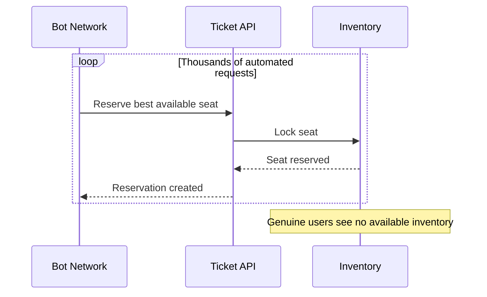

The endpoint may have valid authentication, correct authorization, and valid input. The problem is unrestricted automation of a sensitive business operation.

## 9.3 Difference from Resource Consumption

| API4: Resource Consumption | API6: Sensitive Business Flow |
|---|---|
| Main impact is system resource exhaustion or cost | Main impact is business abuse or unfair use |
| Example: huge file causes CPU exhaustion | Example: bot buys all limited-stock items |
| Control focuses on technical limits | Control includes business rules and anti-automation |

One attack may involve both risks.

## 9.4 Prevention

- Identify business flows that create value, scarcity, money movement, reputation, or legal commitments.
- Define acceptable human and automated usage.
- Add per-account, per-device, per-payment-method, and per-tenant limits.
- Use risk scoring and anomaly detection.
- Add step-up verification for suspicious behavior.
- Use proof-of-work, CAPTCHA, or challenge mechanisms where appropriate.
- Apply idempotency keys to prevent duplicate actions.
- Use reservation expiration and fair-queue mechanisms.
- Detect account farms and distributed bot behavior.
- Monitor business metrics, not only infrastructure metrics.

## 9.5 Business-Level Signals

Useful signals may include:

- Number of accounts per device
- Number of payment cards per account
- Time between actions
- Identical behavior across many accounts
- Unusual geographic changes
- Repeated failures followed by success
- High-value actions immediately after registration
- Reservation-to-purchase conversion rate

---

# 10. API7:2023 — Server-Side Request Forgery (SSRF)

## 10.1 Simple Meaning

SSRF occurs when an API fetches a URL supplied by a user without safely validating and restricting the destination.

The attacker makes the **server** send a request to an unintended target.

## 10.2 Vulnerable Example

An API imports an image from a URL:

```http
POST /api/profile/import-avatar
Content-Type: application/json

{
  "url": "https://images.example.com/avatar.png"
}
```

Attacker-controlled URL:

```json
{
  "url": "http://127.0.0.1:8000/internal/admin"
}
```

Cloud metadata target example:

```json
{
  "url": "http://169.254.169.254/latest/meta-data/"
}
```

## 10.3 Attack Flow

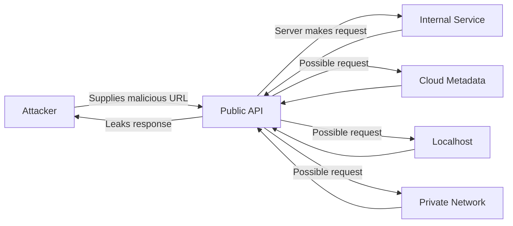

## 10.4 Why Basic URL Checks Fail

A simple string check can often be bypassed through:

- Redirects
- Alternative IP formats
- DNS rebinding
- IPv6 addresses
- User-information sections in URLs
- Encoded characters
- Hostname resolution changes
- Private networks reached through public-looking domains

## 10.5 Secure Design

The safest design is not to fetch arbitrary user-provided URLs.

Prefer one of these patterns:

1. Accept uploaded content directly.
2. Allow only known providers and paths.
3. Map a client-selected identifier to a server-controlled URL.
4. Use a dedicated outbound-fetch service with strict network isolation.

## 10.6 Prevention

- Use an allowlist of protocols, hosts, ports, and paths.
- Permit only `https` when possible.
- Resolve the hostname and block private, loopback, link-local, multicast, and reserved ranges.
- Re-check the destination after redirects or disable redirects.
- Apply outbound firewall or egress proxy rules.
- Block access to cloud metadata services.
- Use strict timeouts and response-size limits.
- Do not return raw upstream responses to users.
- Log outbound destinations and suspicious failures.
- Isolate URL-fetching workloads from sensitive networks.

Conceptual destination validation:

```python
ALLOWED_HOSTS = {"cdn.example.com", "images.partner.com"}

parsed = urlparse(user_url)

if parsed.scheme != "https":
    raise ValidationError("Only HTTPS URLs are allowed")

if parsed.hostname not in ALLOWED_HOSTS:
    raise ValidationError("Host is not allowed")
```

An allowlist is stronger than attempting to block every dangerous host.

---

# 11. API8:2023 — Security Misconfiguration

## 11.1 Simple Meaning

Security misconfiguration occurs when unsafe, incomplete, inconsistent, or default settings expose the API or its supporting infrastructure.

It can exist at any layer:

```text
Cloud -> Network -> Load Balancer -> API Gateway -> Web Server
-> Framework -> Application -> Database -> Storage -> Monitoring
```

## 11.2 Common Examples

- Debug mode enabled in production
- Detailed stack traces returned to clients
- Incorrect CORS configuration
- Missing TLS
- Insecure cloud-storage permissions
- Default credentials
- Unnecessary HTTP methods
- Public management or metrics endpoints
- Unpatched frameworks or servers
- Missing security headers
- Sensitive responses cached by browsers or proxies
- Directory listing enabled
- Verbose GraphQL introspection exposed without a deliberate policy
- Inconsistent parsing between proxies and application servers

## 11.3 Dangerous CORS Example

```http
Access-Control-Allow-Origin: *
Access-Control-Allow-Credentials: true
```

CORS configuration must be designed carefully. Do not dynamically reflect arbitrary origins while allowing credentials.

## 11.4 Error Handling

Unsafe response:

```json
{
  "error": "psycopg.errors.UndefinedTable",
  "query": "SELECT * FROM payment_cards",
  "stack_trace": "...",
  "database_host": "prod-db.internal"
}
```

Safer client response:

```json
{
  "detail": "An unexpected error occurred.",
  "request_id": "req_8c917a"
}
```

Detailed diagnostics should remain in protected server-side logs.

## 11.5 Prevention

- Create repeatable hardened configurations.
- Use infrastructure as code and configuration review.
- Disable debug features in production.
- Remove unnecessary services, routes, and HTTP methods.
- Patch operating systems, runtimes, frameworks, and libraries.
- Apply least privilege to cloud resources and service accounts.
- Configure TLS correctly.
- Return generic errors with correlation IDs.
- Set appropriate cache-control headers.
- Configure CORS using an explicit origin allowlist.
- Continuously scan environments for drift and unsafe settings.
- Keep development, test, staging, and production isolated.

Example response headers for sensitive API data:

```http
Cache-Control: no-store
Pragma: no-cache
X-Content-Type-Options: nosniff
Content-Type: application/json
```

---

# 12. API9:2023 — Improper Inventory Management

## 12.1 Simple Meaning

An organization cannot secure APIs that it does not know exist.

Improper inventory management includes unknown, undocumented, outdated, abandoned, or unnecessarily exposed API assets.

## 12.2 Typical Problems

- Old API versions remain online.
- Staging or test environments are public.
- Debug endpoints are deployed accidentally.
- Documentation does not match production.
- Multiple teams publish APIs without a central inventory.
- Shadow APIs bypass the gateway.
- Deprecated fields still expose sensitive data.
- Forgotten subdomains point to active services.
- Different API versions have inconsistent security controls.

## 12.3 Example

The current mobile application uses:

```http
https://api.example.com/v3/users/me
```

An older API remains active:

```http
https://api.example.com/v1/users/42
```

Version 3 enforces tenant-aware authorization. Version 1 does not.

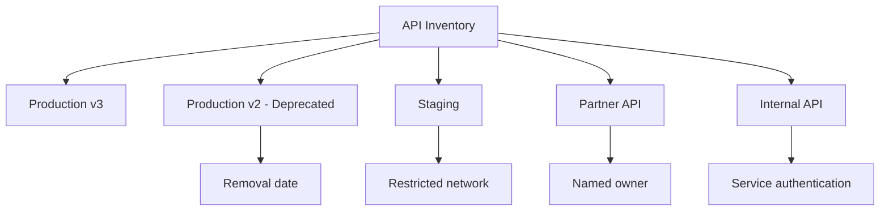

## 12.4 What an API Inventory Should Record

| Field | Example |
|---|---|
| Service name | Billing API |
| Owner | Payments Team |
| Environment | Production |
| Base URL | `https://api.example.com/billing/v2` |
| Version | v2 |
| Data classification | Confidential financial data |
| Authentication | OAuth 2.0 access token |
| External exposure | Public through API gateway |
| Dependencies | Payment provider, customer DB |
| Lifecycle status | Active |
| Deprecation date | Not scheduled |
| Documentation | OpenAPI specification |

## 12.5 Prevention

- Maintain a central inventory of hosts, services, versions, and environments.
- Assign an owner to every API.
- Maintain accurate OpenAPI, AsyncAPI, protobuf, or GraphQL schemas.
- Route external APIs through controlled gateways.
- Discover shadow and zombie APIs continuously.
- Define versioning and deprecation policies.
- Remove old versions after an announced migration period.
- Restrict non-production environments.
- Classify the data handled by each endpoint.
- Include APIs, webhooks, WebSockets, gRPC services, and internal endpoints.

---

# 13. API10:2023 — Unsafe Consumption of APIs

## 13.1 Simple Meaning

Developers often trust third-party or internal API responses more than direct user input. That trust is unsafe.

Data from another API should be treated as untrusted input.

The upstream service may be:

- Compromised
- Misconfigured
- Malicious
- Returning unexpected data
- Redirecting requests
- Temporarily unavailable
- Sending oversized responses
- Violating the expected schema

## 13.2 Vulnerable Flow

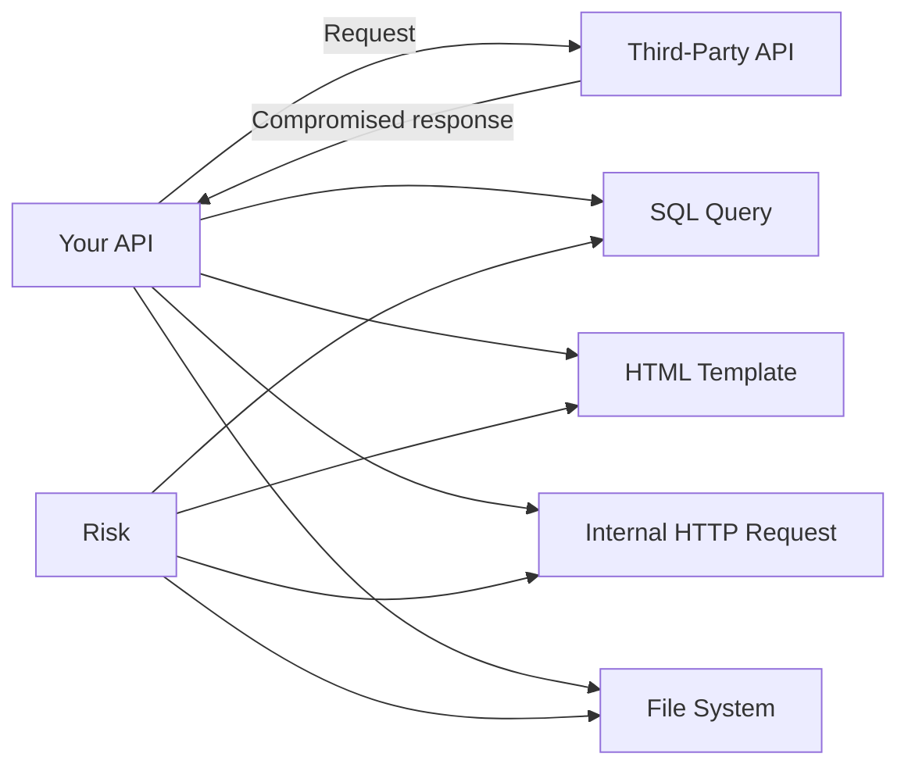

## 13.3 Example

A shipping provider returns:

```json
{
  "tracking_status": "Delivered",
  "callback_url": "http://internal-admin:8080/reconcile"
}
```

Your API blindly follows `callback_url`, creating an SSRF path through a trusted integration.

Another example:

```python
# Unsafe conceptual example
customer_name = partner_response["customer_name"]
html = f"<h1>Welcome {customer_name}</h1>"
```

A compromised upstream response could inject unsafe HTML unless output encoding is applied.

## 13.4 Secure Integration Controls

- Validate upstream response schemas.
- Apply length, range, format, and enum constraints.
- Use TLS and validate certificates.
- Configure connection, read, and total timeouts.
- Restrict redirects.
- Limit response size.
- Use retry limits and circuit breakers.
- Validate and encode data before using it in another context.
- Do not construct SQL, shell commands, paths, or URLs from untrusted upstream data.
- Apply least-privilege credentials to integrations.
- Rotate and securely store third-party credentials.
- Monitor upstream behavior and contract changes.
- Verify webhook signatures and prevent replay attacks.

## 13.5 Webhook Verification Flow

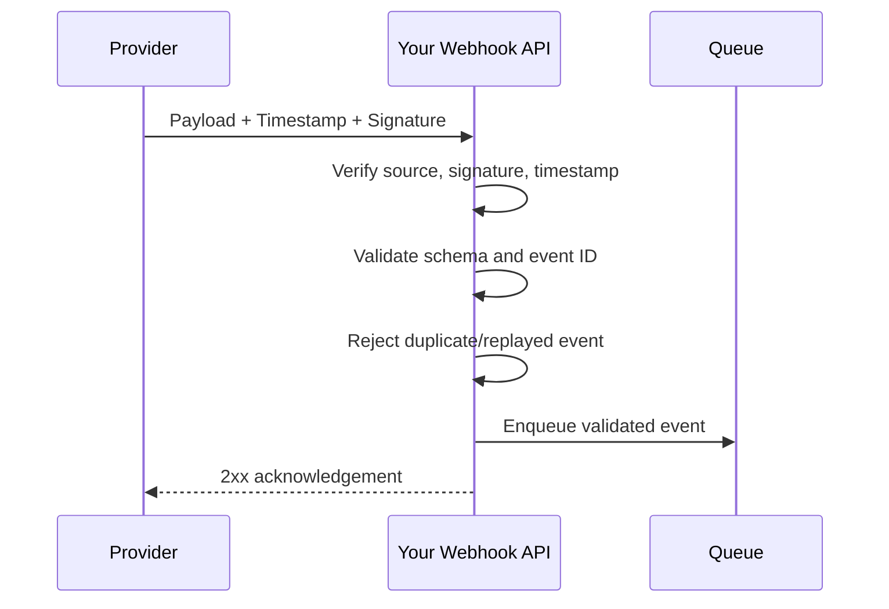

---

# 14. Authorization Risks Compared

The three authorization categories are closely related but protect different boundaries.

| Risk | Question the API Must Answer | Example Failure |
|---|---|---|
| BOLA | Can this user access **this object**? | User reads another user's invoice |
| BOPLA | Can this user read or change **this property**? | User sets `is_admin=true` |
| BFLA | Can this user execute **this function**? | Normal user calls admin delete endpoint |

## 14.1 Combined Example

Consider:

```http
PATCH /api/admin/users/42
Authorization: Bearer <token>

{
  "credit_limit": 500000,
  "is_admin": true
}
```

Required checks:

1. **Authentication:** Is the token valid?
2. **Function authorization:** Can the caller use the admin user-update function?
3. **Object authorization:** Can the caller manage user `42` within this tenant?
4. **Property authorization:** Can the caller modify `credit_limit` and `is_admin`?
5. **Business validation:** Is the requested credit limit allowed?
6. **Audit:** Is the privileged change recorded?

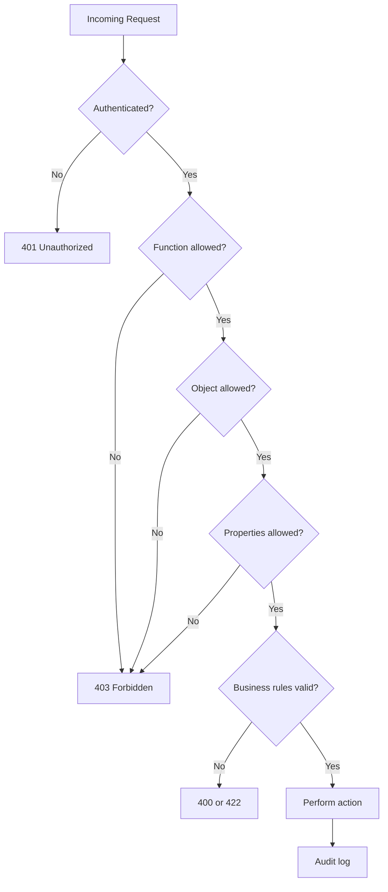

---

# 15. Secure API Architecture

A secure API uses multiple layers. No single gateway, WAF, library, or token solves every security problem.

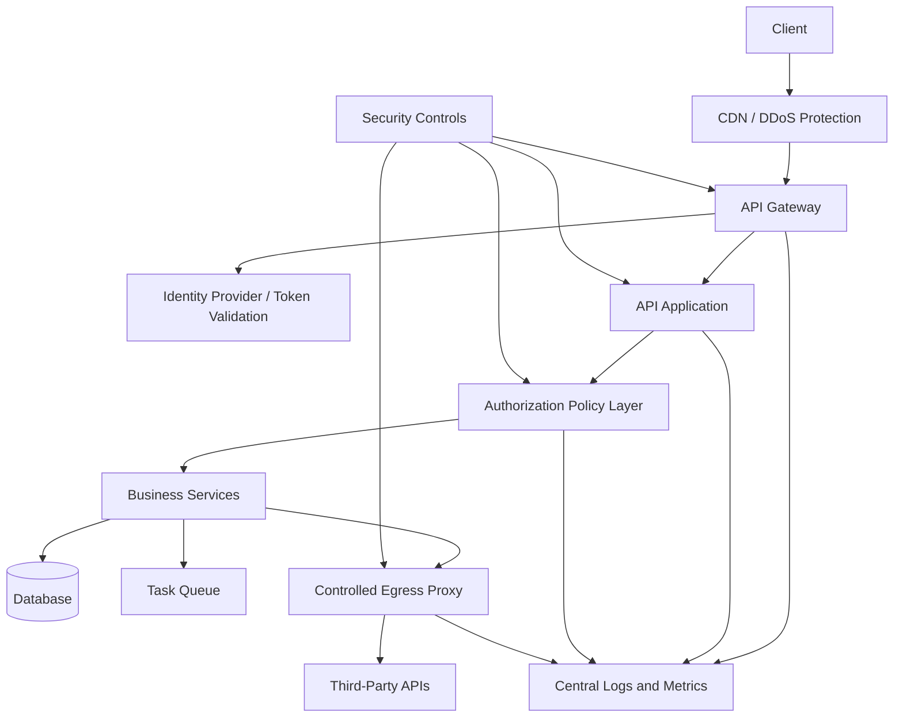

## 15.1 Responsibility by Layer

| Layer | Main Responsibilities |
|---|---|
| CDN / edge | DDoS protection, basic request filtering |
| API gateway | Routing, TLS termination, quotas, client identification |
| Identity provider | Authentication, token issuance, MFA, session controls |
| Application | Schema validation, business rules, secure error handling |
| Authorization layer | Object, property, and function policies |
| Database | Constraints, tenant scoping, least-privilege accounts |
| Queue/workers | Concurrency, timeout, retry, and idempotency controls |
| Egress proxy | Outbound destination restrictions and observability |
| Monitoring | Detection, alerting, auditing, incident investigation |

## 15.2 Gateway Limits Are Not Enough

A gateway may apply 100 requests per minute, but one request could still:

- Request one million database rows
- Trigger thousands of GraphQL resolver calls
- Upload a compressed bomb
- Start an expensive AI-processing workflow
- Reserve all remaining inventory

The application must enforce domain-specific limits.

---

# 16. Practical FastAPI Patterns

The following examples show implementation patterns, not a complete production security framework.

## 16.1 Authenticate and Load the Current User

```python
from typing import Annotated

from fastapi import Depends, HTTPException, status
from fastapi.security import HTTPAuthorizationCredentials, HTTPBearer

bearer = HTTPBearer(auto_error=False)


async def get_current_user(
    credentials: Annotated[HTTPAuthorizationCredentials | None, Depends(bearer)],
):
    if credentials is None:
        raise HTTPException(
            status_code=status.HTTP_401_UNAUTHORIZED,
            detail="Authentication required",
        )

    try:
        claims = token_service.validate_access_token(credentials.credentials)
        user = await user_repository.get_active_by_id(claims.subject)
    except TokenValidationError as exc:
        raise HTTPException(
            status_code=status.HTTP_401_UNAUTHORIZED,
            detail="Invalid or expired access token",
        ) from exc

    if user is None:
        raise HTTPException(
            status_code=status.HTTP_401_UNAUTHORIZED,
            detail="User is not active",
        )

    return user
```

The token service should validate signature, algorithm, issuer, audience, expiration, and token purpose.

## 16.2 Enforce Object-Level Authorization in the Query

```python
@router.get("/orders/{order_id}", response_model=OrderResponse)
async def get_order(
    order_id: int,
    current_user: Annotated[User, Depends(get_current_user)],
):
    order = await order_repository.get_for_customer(
        order_id=order_id,
        customer_id=current_user.id,
        tenant_id=current_user.tenant_id,
    )

    if order is None:
        # Returning 404 can avoid revealing whether another user's object exists.
        raise HTTPException(status_code=404, detail="Order not found")

    return order
```

## 16.3 Use Explicit Update Schemas

```python
from pydantic import BaseModel, ConfigDict, Field


class OrderUpdateRequest(BaseModel):
    model_config = ConfigDict(extra="forbid")

    delivery_note: str | None = Field(default=None, max_length=500)


class AdminOrderUpdateRequest(OrderUpdateRequest):
    status: str | None = None
    assigned_agent_id: int | None = None
```

Separate schemas make property-level permissions visible and reviewable.

## 16.4 Function-Level Permission Dependency

```python
from collections.abc import Callable


def require_permission(permission: str) -> Callable:
    async def dependency(
        current_user: Annotated[User, Depends(get_current_user)],
    ) -> User:
        if permission not in current_user.permissions:
            raise HTTPException(status_code=403, detail="Forbidden")
        return current_user

    return dependency


@router.delete("/admin/users/{user_id}")
async def delete_user(
    user_id: int,
    current_admin: Annotated[
        User,
        Depends(require_permission("user:delete")),
    ],
):
    await user_service.delete_user(
        actor=current_admin,
        target_user_id=user_id,
    )
    return {"status": "deleted"}
```

The service layer should still enforce domain and tenant rules.

## 16.5 Restrict Pagination

```python
from fastapi import Query


@router.get("/events")
async def list_events(
    limit: int = Query(default=20, ge=1, le=100),
    cursor: str | None = None,
):
    return await event_service.list(limit=limit, cursor=cursor)
```

## 16.6 Safe Error Boundary

```python
import uuid

from fastapi import Request
from fastapi.responses import JSONResponse


@app.exception_handler(Exception)
async def unhandled_exception_handler(request: Request, exc: Exception):
    request_id = getattr(request.state, "request_id", str(uuid.uuid4()))

    logger.exception(
        "Unhandled API error",
        extra={"request_id": request_id, "path": request.url.path},
    )

    return JSONResponse(
        status_code=500,
        content={
            "detail": "An unexpected error occurred.",
            "request_id": request_id,
        },
        headers={"Cache-Control": "no-store"},
    )
```

Do not log passwords, tokens, payment data, secrets, or complete sensitive request bodies.

---

# 17. API Security Testing Strategy

Security testing should be part of normal API development rather than a final one-time activity.

## 17.1 Test Layers

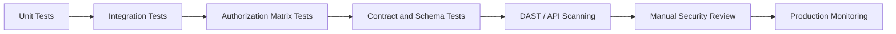

## 17.2 Authorization Test Pattern

For each protected operation, create test identities such as:

- Anonymous client
- Resource owner
- Different user in the same tenant
- User in another tenant
- Read-only role
- Manager role
- Administrator
- Disabled or deleted user

Test the combination of:

```text
Identity x Function x Object x Property
```

Example test table:

| Identity | Function | Object | Expected Result |
|---|---|---|---|
| Anonymous | Read order | Any order | 401 |
| Customer A | Read order | Customer A order | 200 |
| Customer A | Read order | Customer B order | 404 or 403 |
| Support read-only | Delete order | Any order | 403 |
| Admin | Delete order | Allowed tenant order | Success |

## 17.3 Negative Testing

Test more than valid requests. Include:

- Missing tokens
- Expired tokens
- Tokens for the wrong audience
- Changed object IDs
- Extra JSON properties
- Oversized payloads
- Very large pagination values
- Duplicate requests
- Invalid content types
- Unexpected HTTP methods
- Private IP URLs
- Redirect chains
- Slow upstream responses
- Malformed third-party responses
- Deprecated endpoints

## 17.4 CI/CD Security Gates

A practical pipeline may include:

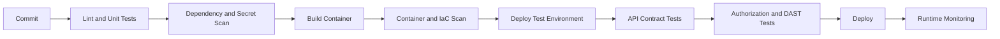

Security gates should be risk-based. A critical authorization regression should block deployment.

---

# 18. Production Security Checklist

## 18.1 Authentication

- [ ] All protected endpoints require valid authentication.
- [ ] JWT signatures, algorithms, issuer, audience, and expiration are validated.
- [ ] Login and password-reset flows have strict anti-brute-force controls.
- [ ] Sensitive changes require recent authentication or step-up verification.
- [ ] Service-to-service calls are authenticated.
- [ ] Secrets and signing keys are stored in a secure secret-management system.

## 18.2 Authorization

- [ ] Every object lookup is scoped to an authorized user or tenant.
- [ ] Every privileged function has a server-side permission check.
- [ ] Writable and readable fields are explicitly allowlisted.
- [ ] Authorization logic is centralized or consistently reusable.
- [ ] Cross-tenant access is tested automatically.

## 18.3 Input and Output

- [ ] Request bodies use strict schemas.
- [ ] Unexpected fields are rejected where appropriate.
- [ ] Response models expose only required fields.
- [ ] File type, size, content, and decompressed size are validated.
- [ ] Third-party API responses are schema-validated.

## 18.4 Availability and Abuse Protection

- [ ] Request rates and bursts are limited.
- [ ] Page size, batch size, and query complexity are bounded.
- [ ] Expensive operations have per-user and global concurrency limits.
- [ ] Timeouts and retry limits are configured.
- [ ] Third-party cost-generating calls have budgets and quotas.
- [ ] Sensitive business flows have anti-automation controls.

## 18.5 Configuration and Infrastructure

- [ ] Debug mode is disabled in production.
- [ ] CORS uses an explicit, reviewed policy.
- [ ] TLS is required.
- [ ] Cloud resources use least-privilege permissions.
- [ ] Management, health, and metrics endpoints have appropriate exposure.
- [ ] Error responses do not expose stack traces or internal details.
- [ ] Sensitive responses use appropriate cache-control headers.
- [ ] Outbound network access is restricted.

## 18.6 Inventory and Operations

- [ ] Every API has a named owner.
- [ ] All versions and environments are inventoried.
- [ ] OpenAPI or equivalent contracts match deployed behavior.
- [ ] Deprecated endpoints have removal dates.
- [ ] Shadow and zombie APIs are discovered and removed.
- [ ] Security events include request IDs and actor details.
- [ ] Logs avoid credentials and sensitive personal data.
- [ ] Alerts cover unusual authentication, authorization, cost, and business activity.

---

# 19. Key Takeaways

1. A valid token does not guarantee authorization.
2. Check access at the object, property, and function levels.
3. Use explicit input and output schemas rather than exposing database models directly.
4. Rate limits must cover technical resources, third-party costs, and business abuse.
5. Never allow unrestricted server-side fetching of user-provided URLs.
6. Treat third-party API data as untrusted input.
7. Maintain an accurate inventory of all API versions, hosts, and environments.
8. Build security controls into shared application patterns and CI/CD.
9. Test negative cases and cross-user or cross-tenant access continuously.
10. Use defense in depth; no single control protects the entire API.

A concise secure-request model is:

```text
Authenticate identity
        ↓
Authorize function
        ↓
Authorize object
        ↓
Authorize properties
        ↓
Validate business rules
        ↓
Control resource usage
        ↓
Perform and audit the action
```

---

# 20. Official References

- OWASP API Security Project: https://owasp.org/www-project-api-security/
- OWASP API Security Top 10: https://owasp.org/API-Security/
- OWASP API Security Top 10 — 2023: https://owasp.org/API-Security/editions/2023/en/0x11-t10/
- API1 — Broken Object Level Authorization: https://owasp.org/API-Security/editions/2023/en/0xa1-broken-object-level-authorization/
- API2 — Broken Authentication: https://owasp.org/API-Security/editions/2023/en/0xa2-broken-authentication/
- API3 — Broken Object Property Level Authorization: https://owasp.org/API-Security/editions/2023/en/0xa3-broken-object-property-level-authorization/
- API4 — Unrestricted Resource Consumption: https://owasp.org/API-Security/editions/2023/en/0xa4-unrestricted-resource-consumption/
- API5 — Broken Function Level Authorization: https://owasp.org/API-Security/editions/2023/en/0xa5-broken-function-level-authorization/
- API6 — Unrestricted Access to Sensitive Business Flows: https://owasp.org/API-Security/editions/2023/en/0xa6-unrestricted-access-to-sensitive-business-flows/
- API7 — Server-Side Request Forgery: https://owasp.org/API-Security/editions/2023/en/0xa7-server-side-request-forgery/
- API8 — Security Misconfiguration: https://owasp.org/API-Security/editions/2023/en/0xa8-security-misconfiguration/
- API9 — Improper Inventory Management: https://owasp.org/API-Security/editions/2023/en/0xa9-improper-inventory-management/
- API10 — Unsafe Consumption of APIs: https://owasp.org/API-Security/editions/2023/en/0xaa-unsafe-consumption-of-apis/
- OWASP Cheat Sheet Series: https://cheatsheetseries.owasp.org/

---

> This guide is an educational summary for development and interview preparation. Apply controls according to your application's architecture, threat model, regulatory requirements, and data sensitivity.
