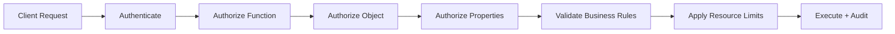
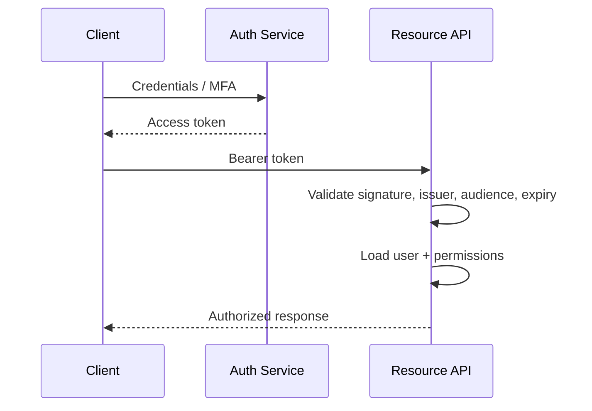
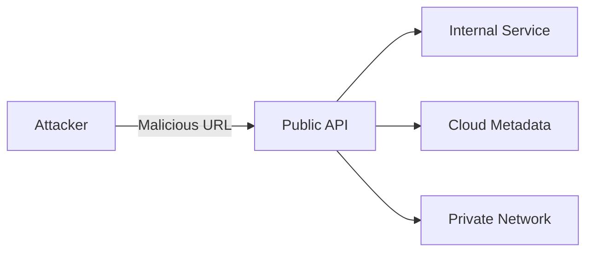
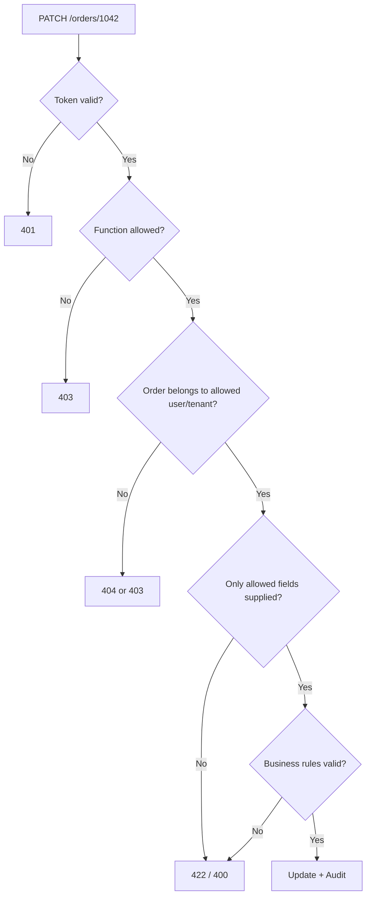

# OWASP API Security Top 10 — Developer Guide

> Understand the API security risks that matter most in real backend development and interviews.
>
> **Current API edition:** OWASP API Security Top 10 — 2023  
> **Important:** This is different from the broader OWASP Top 10:2025 for web applications.

## In Short

- API security is heavily about **authorization**, because clients directly send object IDs, fields, filters, and endpoint paths.
- Three of the top five risks are authorization problems:
  - **API1 — BOLA:** Can this user access this object?
  - **API3 — BOPLA:** Can this user read or change this property?
  - **API5 — BFLA:** Can this user execute this function?
- Authentication proves **who the caller is**; authorization decides **what that caller may do**.
- Rate limiting alone is not enough. APIs also need limits on payload size, pagination, expensive operations, business actions, and third-party cost.
- Treat URLs and third-party API responses as **untrusted input**.
- API gateways help, but application-level authorization and business rules still belong in the backend.



---

# 1. What Is the OWASP API Security Top 10?

The **OWASP API Security Top 10** is an awareness guide describing major security risks that commonly affect APIs.

It focuses on problems that are especially important for REST, GraphQL, gRPC, webhooks, mobile backends, microservices, and public or partner APIs.

The current list contains:

| Rank | Risk | Main Question |
|---:|---|---|
| API1 | Broken Object Level Authorization | Can this user access this specific record? |
| API2 | Broken Authentication | Is the caller's identity verified correctly? |
| API3 | Broken Object Property Level Authorization | Can this user read/change these fields? |
| API4 | Unrestricted Resource Consumption | Can one request/user consume excessive resources or cost? |
| API5 | Broken Function Level Authorization | Can this user call this operation? |
| API6 | Unrestricted Access to Sensitive Business Flows | Can valid business actions be abused through automation? |
| API7 | Server-Side Request Forgery | Can user input make the server call an unsafe destination? |
| API8 | Security Misconfiguration | Are insecure settings exposing the API? |
| API9 | Improper Inventory Management | Do unknown, old, or forgotten APIs remain exposed? |
| API10 | Unsafe Consumption of APIs | Are upstream API responses trusted too much? |

---

# 2. Authentication vs Authorization

This distinction is fundamental.

**Authentication** answers:

> Who are you?

**Authorization** answers:

> Are you allowed to perform this action on this resource?

A valid JWT does **not** automatically authorize access to every object.

```text
Valid token + own order       -> allowed
Valid token + another order   -> blocked
Valid token + admin endpoint  -> blocked unless permitted
```

For token-based APIs, validation normally includes the signature, allowed algorithm, issuer, audience, expiry, and token purpose.

---

# 3. Authorization Risks: API1, API3, and API5

These three categories are closely related and are very important for interviews.

## 3.1 API1 — Broken Object Level Authorization (BOLA)

BOLA happens when the API receives an object ID and fails to verify that the current user may access that object.

### Vulnerable request

```http
GET /api/orders/1043
Authorization: Bearer <user-a-token>
```

If order `1043` belongs to User B but User A receives it, object-level authorization is broken.

### Vulnerable code

```python
order = await repository.get_by_id(order_id)
```

### Better pattern

```python
order = await repository.get_for_customer(
    order_id=order_id,
    customer_id=current_user.id,
    tenant_id=current_user.tenant_id,
)
```

The authorization scope becomes part of the query itself.

> UUIDs make enumeration harder, but they do not replace authorization.

## 3.2 API3 — Broken Object Property Level Authorization (BOPLA)

BOPLA is about **fields** inside an object.

It commonly appears in two directions:

- **Excessive data exposure:** returning fields the caller should not see.
- **Mass assignment:** accepting fields the caller should not be allowed to change.

Example attacker payload:

```json
{
  "display_name": "Asha",
  "role": "admin",
  "credit_limit": 1000000
}
```

Use explicit request and response schemas instead of exposing database models directly.

```python
from pydantic import BaseModel, ConfigDict

class ProfileUpdate(BaseModel):
    model_config = ConfigDict(extra="forbid")
    display_name: str | None = None
```

A useful rule is:

```text
Database model != Request model != Response model
```

## 3.3 API5 — Broken Function Level Authorization (BFLA)

BFLA occurs when a lower-privileged user can call a function intended for a higher-privileged role.

```http
DELETE /api/admin/users/42
Authorization: Bearer <normal-user-token>
```

Hiding the button in the frontend is not security. The server must enforce permission checks.

```python
if "user:delete" not in current_user.permissions:
    raise HTTPException(status_code=403, detail="Forbidden")
```

### Easy way to remember

| Risk | Security Boundary |
|---|---|
| BOLA | Object |
| BOPLA | Property |
| BFLA | Function |

---

# 4. API2 — Broken Authentication

Broken Authentication means the API incorrectly verifies or maintains identity.

Common areas include:

- Login and password reset
- Access and refresh tokens
- JWT validation
- Session handling
- MFA and OTP flows
- Service-to-service authentication
- Brute-force and credential-stuffing protection

For JWT-based APIs, do not simply decode claims. The server must validate the token cryptographically and enforce expected claims.



Practical controls include short-lived access tokens, protected refresh-token flows, strong password hashing such as Argon2id/bcrypt/scrypt/PBKDF2, login throttling, and re-authentication for sensitive actions.

---

# 5. API4 and API6 — Limits vs Business Abuse

These two risks look similar but protect different things.

## 5.1 API4 — Unrestricted Resource Consumption

The attacker consumes too much **technical capacity or paid infrastructure**.

Examples:

- `page_size=1000000`
- Huge file uploads
- Expensive GraphQL queries
- Too many concurrent OCR/LLM jobs
- Unlimited SMS or email calls
- Large retry storms

Controls should exist at multiple layers:

| Layer | Typical Control |
|---|---|
| Gateway / proxy | Rate limits, body-size limits, timeouts |
| Application | Pagination and batch limits |
| Database | Query timeout, connection limits |
| Workers | Concurrency, retry, execution timeout |
| External APIs | Per-user quota, spending limit |

Example:

```python
@router.get("/events")
async def list_events(
    limit: int = Query(default=20, ge=1, le=100),
):
    ...
```

## 5.2 API6 — Unrestricted Access to Sensitive Business Flows

The requests may be technically valid, but automation abuses the business process.

Examples:

- Bots buying all limited tickets
- Mass account creation
- Repeated coupon redemption
- Inventory reservation without payment
- Automated claim or loan submissions
- Referral reward farming

The difference is simple:

```text
API4 -> protect system resources and cost
API6 -> protect valuable business processes
```

API6 usually needs business-aware controls such as account/device limits, anomaly detection, risk scoring, step-up verification, reservation expiry, idempotency, or anti-bot challenges.

---

# 6. API7 — Server-Side Request Forgery (SSRF)

SSRF occurs when the API accepts a URL and the **server fetches it** without strong destination restrictions.

```json
{
  "url": "http://127.0.0.1:8000/internal/admin"
}
```

An attacker may try to reach:

- Localhost
- Internal services
- Private network addresses
- Cloud metadata services
- Other protected infrastructure



Prefer not to fetch arbitrary user URLs. If fetching is required:

- Allowlist expected hosts/protocols.
- Block private, loopback, link-local, and reserved addresses.
- Disable or strictly validate redirects.
- Apply outbound firewall/egress rules.
- Use timeouts and response-size limits.

A blocklist alone is fragile because redirects, DNS changes, IPv6, and alternate address formats can bypass naive checks.

---

# 7. API8 and API9 — Secure Operations

## 7.1 API8 — Security Misconfiguration

This covers unsafe configuration across the complete API stack.

Common examples:

- Debug mode in production
- Detailed stack traces returned to clients
- Incorrect CORS policy
- Public admin/metrics endpoints
- Weak TLS or missing TLS
- Default credentials
- Excessive cloud permissions
- Sensitive responses cached unintentionally

Safer error response:

```json
{
  "detail": "An unexpected error occurred.",
  "request_id": "req_8c917a"
}
```

Keep detailed diagnostics in protected server logs.

## 7.2 API9 — Improper Inventory Management

You cannot secure an API that nobody knows still exists.

Typical problems:

- Old `/v1` endpoints remain public
- Staging APIs are internet-accessible
- Forgotten subdomains or services
- Shadow APIs bypass the gateway
- Documentation no longer matches production

Maintain an inventory containing at least:

- Service and owner
- Environment
- Base URL and version
- Authentication method
- Data classification
- Exposure level
- Lifecycle/deprecation status

Version removal is part of security, not only API maintenance.

---

# 8. API10 — Unsafe Consumption of APIs

Data coming from another API is still **untrusted input**.

A third-party or internal service may be compromised, misconfigured, or simply return unexpected data.

Validate upstream responses before using them in:

- SQL queries
- HTML/templates
- File paths
- Internal URLs
- Shell commands
- Business decisions

Practical controls include:

- Response schema validation
- Size and type limits
- TLS certificate validation
- Connection/read/total timeouts
- Restricted redirects
- Retry limits and circuit breakers
- Least-privilege integration credentials
- Webhook signature and replay verification

For webhooks, verify the signature and timestamp **before** processing the event, and make event handling idempotent.

---

# 9. One Practical Example — Secure Order Update API

Suppose the endpoint is:

```http
PATCH /api/orders/1042
Authorization: Bearer <token>

{
  "delivery_note": "Leave at reception"
}
```

A secure implementation must enforce several boundaries:



FastAPI-style implementation:

```python
from typing import Annotated
from fastapi import Depends, HTTPException
from pydantic import BaseModel, ConfigDict, Field

class OrderUpdateRequest(BaseModel):
    model_config = ConfigDict(extra="forbid")
    delivery_note: str | None = Field(default=None, max_length=500)

@router.patch("/orders/{order_id}")
async def update_order(
    order_id: int,
    payload: OrderUpdateRequest,
    current_user: Annotated[User, Depends(get_current_user)],
):
    order = await order_repository.get_for_customer(
        order_id=order_id,
        customer_id=current_user.id,
        tenant_id=current_user.tenant_id,
    )

    if order is None:
        raise HTTPException(status_code=404, detail="Order not found")

    return await order_service.update_delivery_note(
        order=order,
        delivery_note=payload.delivery_note,
        actor=current_user,
    )
```

This single endpoint demonstrates:

- **API2:** validate identity correctly.
- **API1:** scope the order query to the user/tenant.
- **API3:** accept only explicitly writable fields.
- **API5:** add permission checks if the operation is privileged.
- **API4:** enforce request/field/resource limits.
- **Audit:** record important state changes.

---

# 10. Practical Development Strategy

A strong API security flow is:

```text
Authenticate
   ↓
Authorize function
   ↓
Authorize object
   ↓
Authorize properties
   ↓
Validate input + business rules
   ↓
Apply rate/resource limits
   ↓
Execute safely
   ↓
Audit + monitor
```

During testing, use multiple identities rather than only a happy-path user:

- Anonymous client
- Resource owner
- Different user
- Different tenant
- Read-only role
- Admin role

Cross-user and cross-tenant tests are especially important because many authorization bugs depend on business ownership rules that automated scanners cannot fully infer.

---

# 11. Interview-Focused Takeaway

The most useful mental model is to think in **security boundaries** rather than memorizing ten names.

```text
Identity   -> API2
Object     -> API1
Property   -> API3
Function   -> API5
Resources  -> API4
Business   -> API6
Outbound   -> API7
Config     -> API8
Inventory  -> API9
Upstream   -> API10
```

For backend interviews, be especially comfortable explaining:

- Why a valid JWT does not solve authorization.
- Why UUIDs do not solve BOLA.
- The difference between BOLA, BOPLA, and BFLA.
- Why resource limits must exist inside the application, not only at the gateway.
- The difference between rate limiting and business-flow abuse prevention.
- Why arbitrary URL fetching creates SSRF risk.
- Why third-party API responses must be validated like user input.

The core principle is simple:

> Never trust a client-controlled identifier, field, URL, function call, or upstream response without validating it against the caller's permissions and the application's business rules.

---

## References

- OWASP API Security Top 10 — 2023: https://owasp.org/API-Security/editions/2023/en/0x00-toc/
- OWASP Developer Guide — API Top 10: https://devguide.owasp.org/en/07-training-education/07-api-top-ten/
- OWASP API Security Top 10 2023 release announcement: https://owasp.org/blog/2023/07/03/owasp-api-top10-2023
