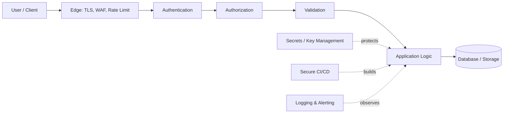
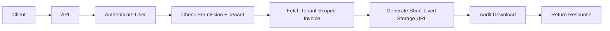
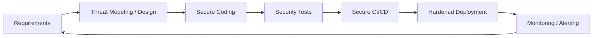

# OWASP Top 10:2025 — Practical Guide for Developers

> A concise, interview-focused guide to the most important web application security risks and the controls developers use in real projects.

> **Version:** OWASP Top 10:2025 — current released OWASP Top Ten version as of August 2026.

## In Short

The **OWASP Top 10** is an awareness document that groups common and serious web application security risks into ten categories.

It is useful during:

- application design
- API development
- code review
- security testing
- CI/CD
- cloud deployment
- production monitoring

It is **not a certification checklist**. A real application still needs threat modeling and controls specific to its business logic.



---

# 1. OWASP Top 10:2025 at a Glance

| Rank | Category | Main Problem |
|---:|---|---|
| **A01** | Broken Access Control | A user can access data or actions outside their permission |
| **A02** | Security Misconfiguration | Unsafe application, cloud, server, framework, or container settings |
| **A03** | Software Supply Chain Failures | Vulnerable or compromised dependencies, build systems, CI/CD, or artifacts |
| **A04** | Cryptographic Failures | Sensitive data is protected incorrectly |
| **A05** | Injection | User-controlled data is interpreted as a query, command, or executable content |
| **A06** | Insecure Design | Required security controls were missing from the design itself |
| **A07** | Authentication Failures | Identity, credentials, sessions, or tokens are handled incorrectly |
| **A08** | Software or Data Integrity Failures | Software or data is trusted without verifying integrity or origin |
| **A09** | Security Logging and Alerting Failures | Attacks happen without useful logging, detection, or alerts |
| **A10** | Mishandling of Exceptional Conditions | Errors and abnormal states cause insecure or inconsistent behavior |

## Important 2025 Changes

Compared with OWASP Top 10:2021:

- **A01 Broken Access Control** remains #1, and **SSRF** is now included in this category.
- **A02 Security Misconfiguration** moved from #5 to #2.
- **A03 Software Supply Chain Failures** expands the older "Vulnerable and Outdated Components" idea to include dependencies, build systems, repositories, CI/CD, and distribution infrastructure.
- **A07** is now named **Authentication Failures**.
- **A09** is now **Security Logging and Alerting Failures**, emphasizing that logs must lead to useful detection and action.
- **A10 Mishandling of Exceptional Conditions** is a new category.

---

# 2. A01 — Broken Access Control

## Simple Meaning

The application knows who the user is, but does not correctly enforce **what that user is allowed to do**.

> **Authentication:** Who are you?  
> **Authorization:** What are you allowed to do?

Common examples:

- User A reads User B's invoice by changing `/invoices/101` to `/invoices/102`.
- A normal user directly calls an admin API.
- A tenant can access another tenant's records.
- The backend trusts a role or ownership value sent by the frontend.
- Server-side URL fetching allows access to internal resources through SSRF.

## Secure Approach

Authorization must be checked **server-side for every protected operation**.

```python
invoice = (
    Invoice.objects
    .filter(
        id=invoice_id,
        tenant_id=request.user.tenant_id,
    )
    .first()
)

if not invoice:
    raise Http404()
```

The query itself is tenant-scoped instead of fetching first and checking later.

### Remember

- deny by default
- never rely on hidden buttons or frontend checks
- check object ownership
- check tenant boundaries
- apply least privilege
- test horizontal and vertical privilege escalation

---

# 3. A02 — Security Misconfiguration

## Simple Meaning

The code may be secure, but the application is deployed with unsafe settings.

Common examples:

- `DEBUG=True` in production
- default passwords
- wildcard CORS
- public storage buckets
- overly broad IAM permissions
- unnecessary ports or services
- stack traces returned to users
- exposed admin interfaces
- missing security headers

## Example

```python
# Better production configuration
DEBUG = False

ALLOWED_HOSTS = [
    "api.example.com",
]
```

For CORS, prefer explicit trusted origins instead of `*`.

### Best Practices

- maintain secure environment-specific configuration
- use Infrastructure as Code
- review Terraform/Kubernetes/cloud permissions
- disable unused services
- use least-privilege IAM
- keep production error messages generic
- detect configuration drift
- fail deployment when dangerous settings are found

---

# 4. A03 — Software Supply Chain Failures

## Simple Meaning

Your production application includes much more than code written by your team.

The software supply chain includes:

```text
Source Code
   ↓
Dependencies
   ↓
Build Tools / CI Actions
   ↓
Container Images
   ↓
Artifact Repository
   ↓
Deployment
   ↓
Production
```

A compromise anywhere in this chain can reach production.

## Common Risks

- vulnerable direct or transitive dependency
- malicious package
- compromised package registry
- outdated container base image
- over-privileged CI token
- untrusted pull request accessing secrets
- mutable or unverified build artifact

## Best Practices

- use lock files and controlled dependency updates
- scan dependencies and container images
- track transitive dependencies
- maintain an SBOM where appropriate
- restrict CI/CD permissions
- isolate untrusted builds
- protect release branches and tags
- pin critical CI actions to reviewed immutable versions/commits
- sign and verify important release artifacts

> Pinning gives reproducibility. It does **not** automatically make a dependency secure.

---

# 5. A04 — Cryptographic Failures

## Simple Meaning

Sensitive information is exposed because encryption, hashing, randomness, certificates, or key management is incorrect.

Sensitive data may include:

- passwords
- tokens
- personal information
- payment information
- private documents
- API keys
- business secrets

## Encryption vs Hashing

| Technique | Reversible? | Typical Use |
|---|---:|---|
| **Encryption** | Yes, with a key | Protect recoverable sensitive data |
| **Hashing** | No practical reversal | Password verification, integrity |
| **Digital Signature / MAC** | Verification | Authenticity and integrity |
| **Encoding** | Yes, no secret | Data representation |

> Base64 is encoding, not encryption.

## Password Storage

Never store plaintext passwords or directly use a fast hash such as SHA-256.

Use a framework-supported password hasher such as:

- Argon2id
- bcrypt
- scrypt
- PBKDF2

```python
from argon2 import PasswordHasher

ph = PasswordHasher()

stored_hash = ph.hash(password)
ph.verify(stored_hash, supplied_password)
```

## Best Practices

- use TLS for data in transit
- use approved cryptographic libraries
- never create custom crypto
- keep keys outside source code and container images
- use a secrets manager or KMS
- rotate and revoke credentials
- use cryptographically secure randomness

```python
import secrets

reset_token = secrets.token_urlsafe(32)
```

---

# 6. A05 — Injection

## Simple Meaning

Injection happens when **data and instructions are mixed together**, causing an interpreter to execute attacker-controlled input.

Common examples:

- SQL injection
- NoSQL injection
- command injection
- LDAP injection
- template injection
- cross-site scripting

## SQL Example

### Unsafe

```python
query = f"SELECT * FROM users WHERE email = '{email}'"
```

### Safe

```python
cursor.execute(
    "SELECT * FROM users WHERE email = %s",
    [email],
)
```

Use parameterized queries or safe ORM APIs.

## Command Injection Example

### Unsafe

```python
os.system(f"convert {filename} output.png")
```

### Safer

```python
subprocess.run(
    ["convert", safe_input_path, safe_output_path],
    shell=False,
    check=True,
    timeout=30,
)
```

## Important Difference

| Control | Purpose |
|---|---|
| **Validation** | Ensure input has allowed type, size, range, and format |
| **Parameterized Query** | Keep input separate from SQL instructions |
| **Output Encoding** | Safely render untrusted data in HTML/JS/etc. |
| **Sanitization** | Remove or transform dangerous content when necessary |

Validation alone does not replace parameterization or output encoding.

---

# 7. A06 — Insecure Design

## Simple Meaning

The application was designed without a required security control.

This is different from a coding bug.

| Insecure Design | Implementation Bug |
|---|---|
| Security rule never existed | Security rule exists but code implements it incorrectly |
| No transfer limit defined | Limit exists but wrong field is checked |
| No tenant-isolation design | One endpoint forgets tenant filtering |
| Requires design change | Usually requires code correction |

## Example

Consider a money-transfer feature:

```text
Select beneficiary
      ↓
Enter amount
      ↓
Confirm
      ↓
Transfer
```

Before coding, the design should answer:

- Does the source account belong to the user?
- Is the beneficiary allowed?
- Is the amount recalculated and validated server-side?
- Are balance updates atomic?
- Is replay prevented?
- Are transfer limits enforced?
- Is step-up authentication required for high-value payments?
- What happens if a payment provider times out?

## Best Practices

- threat-model important features
- define trust boundaries
- write security acceptance criteria
- treat business logic as security logic
- calculate sensitive values server-side
- design tenant isolation into the data model
- define rate, transaction, upload, and resource limits
- use atomic and idempotent workflows where required

---

# 8. A07 — Authentication Failures

## Simple Meaning

The application incorrectly verifies identity or poorly handles passwords, MFA, sessions, recovery, or tokens.

Common examples:

- weak password-reset flow
- no login throttling
- session fixation
- tokens in URLs
- JWT signature or claims not validated
- long-lived sessions that cannot be revoked
- missing MFA for privileged users

## JWT Validation

A backend should validate at least:

```text
Signature
Issuer (iss)
Audience (aud)
Expiry (exp)
Not-before (nbf), when used
Token type / purpose
Scopes / permissions
```

> Decoding a JWT is not the same as validating it.

## Secure Cookie Example

```http
Set-Cookie: session=<opaque-id>; Secure; HttpOnly; SameSite=Lax; Path=/
```

## Password Reset

A safe reset flow should use:

- generic account-existence response
- random, single-use, short-lived token
- secure token storage
- expiry
- invalidation after use
- user notification after password change
- session revocation or review when appropriate

---

# 9. A08 — Software or Data Integrity Failures

## Simple Meaning

The application trusts software or data without verifying that it came from the expected source and was not modified.

Examples:

- unsigned software updates
- deployment without artifact verification
- unsafe deserialization
- unverified webhook payload
- client-controlled fields updating server-managed attributes

## Webhook Example

```python
import hashlib
import hmac

def verify_webhook(
    raw_body: bytes,
    supplied_signature: str,
    secret: bytes,
) -> bool:
    expected = hmac.new(
        secret,
        raw_body,
        hashlib.sha256,
    ).hexdigest()

    return hmac.compare_digest(
        expected,
        supplied_signature,
    )
```

A complete webhook design should also consider:

- timestamp freshness
- replay protection
- unique event IDs
- expected tenant/account
- expected event type

## Avoid Mass Assignment

Do not automatically copy arbitrary client fields to sensitive models.

```python
class UserProfileUpdate(BaseModel):
    name: str
    email: EmailStr
```

Fields such as `role`, `is_admin`, `tenant_id`, `price`, and `account_status` should normally remain server-controlled.

---

# 10. A09 — Security Logging and Alerting Failures

## Simple Meaning

An attack may succeed because nobody can detect, correlate, alert on, or investigate what happened.

A useful security flow is:

```text
Record
  ↓
Centralize
  ↓
Correlate
  ↓
Detect
  ↓
Alert
  ↓
Respond
```

## Security Events Commonly Logged

- successful and failed authentication
- MFA changes
- password/email changes
- permission changes
- access denied events
- admin actions
- sensitive exports/downloads
- rate-limit violations
- signature verification failures
- important exceptions
- production configuration changes

## Structured Logging

```python
logger.info(
    "invoice_downloaded",
    user_id=str(user.id),
    tenant_id=str(user.tenant_id),
    invoice_id=str(invoice.id),
    request_id=request_id,
    outcome="success",
)
```

## Do Not Log

- passwords
- full access/refresh tokens
- session IDs
- private keys
- complete payment-card data
- raw authorization headers
- reset links or one-time codes

> Logs without alerting are useful for investigation, but weak for timely attack detection.

---

# 11. A10 — Mishandling of Exceptional Conditions

## Simple Meaning

Unexpected states are handled insecurely.

Examples:

- authorization dependency fails and access is allowed
- partial database transaction is committed
- stack trace is exposed
- retry loop never stops
- timeout leaves inconsistent state
- malformed input crashes the service
- resources are not released

## Fail Closed

```text
Authorization Service Unavailable
              ↓
Permission Cannot Be Verified
              ↓
     Deny or Safely Defer
```

For security-sensitive decisions, failure to verify should normally **not** result in permission being granted.

## Transaction Example

```python
from django.db import transaction

@transaction.atomic
def transfer_funds(sender, receiver, amount):
    debit(sender, amount)
    credit(receiver, amount)
    create_ledger_entries(sender, receiver, amount)
```

Distributed workflows may additionally need:

- idempotency keys
- outbox pattern
- bounded retries
- reconciliation
- compensation logic

## External Calls

Always define reasonable:

- connection timeout
- read timeout
- retry count
- exponential backoff
- response-size limit
- concurrency limit

Nothing should be unlimited.

---

# 12. One Practical Example — Secure Invoice Download API

Suppose we build:

```http
GET /api/invoices/{invoice_id}/download
```

A secure design combines several OWASP controls.



## Controls Applied

### A01 — Broken Access Control
The invoice query includes the user's tenant/ownership boundary.

### A02 — Security Misconfiguration
The storage bucket is private; production debug output is disabled.

### A03 — Supply Chain
Frameworks, libraries, container image, and CI actions are scanned and controlled.

### A04 — Cryptographic Failures
The download uses HTTPS and a short-lived signed URL.

### A05 — Injection
The application uses ORM/parameterized database operations.

### A06 — Insecure Design
The requirement explicitly states that users may download only invoices belonging to their tenant.

### A07 — Authentication Failures
The API validates the session/token before authorization.

### A08 — Integrity Failures
Signed storage URLs and trusted deployment artifacts are verified.

### A09 — Logging and Alerting
The application logs actor, tenant, invoice, result, and request ID.

### A10 — Exceptional Conditions
If authorization or storage fails, the application fails safely without exposing internal details.

This is the main idea behind application security:

> **Security is not one middleware or one scanner. It is a set of controls working together.**

---

# 13. Security Testing in Normal Development

Different techniques detect different problems.

| Technique | Best For |
|---|---|
| **Threat Modeling** | Design and business-logic risks |
| **Code Review** | Authorization, unsafe APIs, logic |
| **SAST** | Suspicious code/data-flow patterns |
| **SCA** | Vulnerable dependencies |
| **Secret Scanning** | Hard-coded keys and credentials |
| **IaC Scanning** | Cloud/Kubernetes/Terraform misconfiguration |
| **Container Scanning** | Vulnerable OS/image packages |
| **DAST / API Testing** | Runtime endpoint vulnerabilities |
| **Penetration Testing** | Authorization and complex attack chains |

High-value automated tests include:

- another tenant's resource returns no usable data
- normal user cannot call admin endpoints
- wrong/expired JWT is rejected
- invalid webhook signature is rejected
- duplicate idempotency request does not duplicate work
- production cannot start with dangerous settings
- downstream failure does not leave partial state

---

# 14. Secure Development Lifecycle



## Requirements

Define:

- sensitive data
- roles and permissions
- tenant boundaries
- authentication requirements
- audit needs
- abuse cases
- security acceptance criteria

## Development

Apply:

- centralized authentication and authorization
- safe ORM/query APIs
- secure crypto libraries
- strict schemas
- secret scanning
- code review
- safe exception handling

## CI/CD and Deployment

Protect:

- repository permissions
- CI secrets
- build runners
- dependencies
- container images
- release artifacts
- cloud IAM
- environment configuration

## Production

Continuously:

- monitor security alerts
- patch dependencies
- review permissions
- rotate credentials
- detect configuration drift
- test backup/recovery
- learn from incidents

---

# 15. What to Remember for Interviews

The most useful mental model is:

```text
Identity      → Authentication
Permission    → Authorization
Input         → Validation + Safe APIs
Sensitive Data→ Encryption / Hashing / Key Management
Dependencies  → Supply-Chain Controls
Business Logic→ Secure Design
Artifacts/Data→ Integrity Verification
Events        → Logging + Alerting
Failures      → Fail Closed + Safe Recovery
```

Key points:

1. **Authentication is not authorization.**
2. **Never trust the client for ownership, role, price, tenant, or permission decisions.**
3. **Use parameterized APIs instead of building commands or queries with strings.**
4. **Use proven cryptographic libraries and secure password hashing.**
5. **Treat CI/CD, dependencies, images, and artifacts as part of the application's attack surface.**
6. **Threat modeling finds design problems that scanners cannot.**
7. **Logs must support detection and response, not only debugging.**
8. **Security-sensitive failures should normally fail closed.**
9. **Use least privilege everywhere.**
10. **Security works through defense in depth, not one control.**

---

## Official Reference

- OWASP Top 10:2025: https://owasp.org/Top10/
- OWASP Top 10:2025 Introduction: https://owasp.org/Top10/2025/0x00_2025-Introduction/
