# OWASP Top 10:2025 — Practical Security Guide for Developers

> **Topic:** Security  
> **Audience:** Developers with 3+ years of experience  
> **Purpose:** Understand the most important web application security risks and apply practical safeguards during design, development, testing, deployment, and operations.  
> **Version covered:** OWASP Top 10:2025 — the current released OWASP Top Ten version as of August 2026.

---

## Table of Contents

1. [What Is the OWASP Top 10?](#1-what-is-the-owasp-top-10)
2. [OWASP Top 10:2025 at a Glance](#2-owasp-top-102025-at-a-glance)
3. [How Security Fits into Application Development](#3-how-security-fits-into-application-development)
4. [A01: Broken Access Control](#4-a012025-broken-access-control)
5. [A02: Security Misconfiguration](#5-a022025-security-misconfiguration)
6. [A03: Software Supply Chain Failures](#6-a032025-software-supply-chain-failures)
7. [A04: Cryptographic Failures](#7-a042025-cryptographic-failures)
8. [A05: Injection](#8-a052025-injection)
9. [A06: Insecure Design](#9-a062025-insecure-design)
10. [A07: Authentication Failures](#10-a072025-authentication-failures)
11. [A08: Software or Data Integrity Failures](#11-a082025-software-or-data-integrity-failures)
12. [A09: Security Logging and Alerting Failures](#12-a092025-security-logging-and-alerting-failures)
13. [A10: Mishandling of Exceptional Conditions](#13-a102025-mishandling-of-exceptional-conditions)
14. [How the Risks Work Together](#14-how-the-risks-work-together)
15. [Security Testing Strategy](#15-security-testing-strategy)
16. [Secure Development Lifecycle](#16-secure-development-lifecycle)
17. [Practical Pull Request Checklist](#17-practical-pull-request-checklist)
18. [Key Concepts to Remember](#18-key-concepts-to-remember)
19. [Official References](#19-official-references)

---

# 1. What Is the OWASP Top 10?

**OWASP** stands for the **Open Worldwide Application Security Project**. It is a nonprofit community that publishes open resources for building and testing secure software.

The **OWASP Top 10** is an awareness document describing ten major categories of web application security risk. It helps development teams understand which weaknesses commonly lead to data exposure, unauthorized access, application compromise, fraud, or service disruption.

The Top 10 is useful for:

- Security requirements and architecture reviews
- Developer security training
- Pull-request and code-review checklists
- Penetration-testing scope
- CI/CD security controls
- Cloud and application hardening
- Risk communication between engineering and business teams

> The OWASP Top 10 is a starting point, not a complete security standard. A production application must also consider business-specific threats, privacy requirements, infrastructure security, API security, mobile security, and operational controls.

## 1.1 Security Objectives: The CIA Triad

Most application-security controls protect one or more of these objectives:

| Objective | Meaning | Example Failure |
|---|---|---|
| **Confidentiality** | Data is visible only to authorized users | One customer reads another customer's invoice |
| **Integrity** | Data and software cannot be changed without authorization | An attacker changes payment details |
| **Availability** | Systems remain accessible and usable | Resource exhaustion crashes an API |

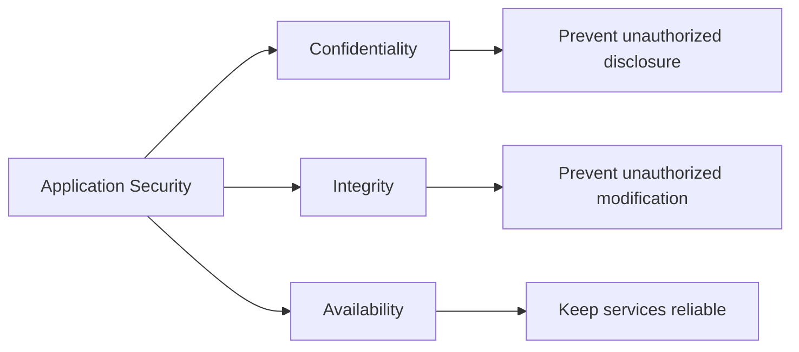

## 1.2 Threat, Vulnerability, Exploit, and Risk

These terms are related but different:

| Term | Meaning | Example |
|---|---|---|
| **Asset** | Something valuable | User data, payment records, source code |
| **Threat** | Something capable of causing harm | Attacker, malicious dependency, insider |
| **Vulnerability** | A weakness in the system | Missing authorization check |
| **Exploit** | A technique that abuses a vulnerability | Changing `/orders/101` to `/orders/102` |
| **Impact** | Damage caused by exploitation | Data leak or fraudulent transaction |
| **Risk** | Likelihood combined with impact | High probability of account data exposure |

A simple way to reason about risk is:

```text
Risk ≈ Likelihood of exploitation × Business impact
```

---

# 2. OWASP Top 10:2025 at a Glance

| Rank | Category | Core Concern |
|---:|---|---|
| **A01** | Broken Access Control | Users can perform actions or access data outside their permissions |
| **A02** | Security Misconfiguration | Insecure settings, defaults, permissions, services, or cloud configuration |
| **A03** | Software Supply Chain Failures | Compromised, vulnerable, untrusted, or poorly governed dependencies and build systems |
| **A04** | Cryptographic Failures | Sensitive data is inadequately protected in transit, at rest, or during credential storage |
| **A05** | Injection | Untrusted input is interpreted as a command, query, expression, or executable content |
| **A06** | Insecure Design | Security controls are missing or ineffective at the architecture or business-logic level |
| **A07** | Authentication Failures | The system incorrectly validates identity or manages credentials and sessions poorly |
| **A08** | Software or Data Integrity Failures | Code, updates, serialized data, or artifacts are trusted without integrity verification |
| **A09** | Security Logging and Alerting Failures | Attacks are not properly recorded, detected, escalated, or investigated |
| **A10** | Mishandling of Exceptional Conditions | Unexpected states are handled insecurely, causing fail-open behavior, leaks, corruption, or outages |

## 2.1 Major Changes from OWASP Top 10:2021

The 2025 edition places more focus on modern software delivery and resilience.

| 2025 Category | Important Change |
|---|---|
| **A01 Broken Access Control** | Remains number one; Server-Side Request Forgery is now included in this broader category |
| **A02 Security Misconfiguration** | Moves higher because configuration increasingly controls application and cloud behavior |
| **A03 Software Supply Chain Failures** | Expands beyond vulnerable components to dependencies, repositories, CI/CD, build tools, artifacts, and distribution systems |
| **A10 Mishandling of Exceptional Conditions** | New category covering fail-open behavior, improper error handling, abnormal states, rollback failures, and resource issues |

---

# 3. How Security Fits into Application Development

Security should not be added only after development. It must be included across the complete software lifecycle.

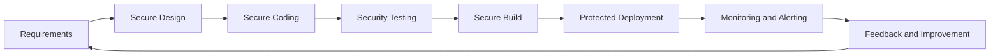

## 3.1 Defense in Depth

No single control is enough. A secure application uses multiple layers so that one failure does not immediately become a full compromise.

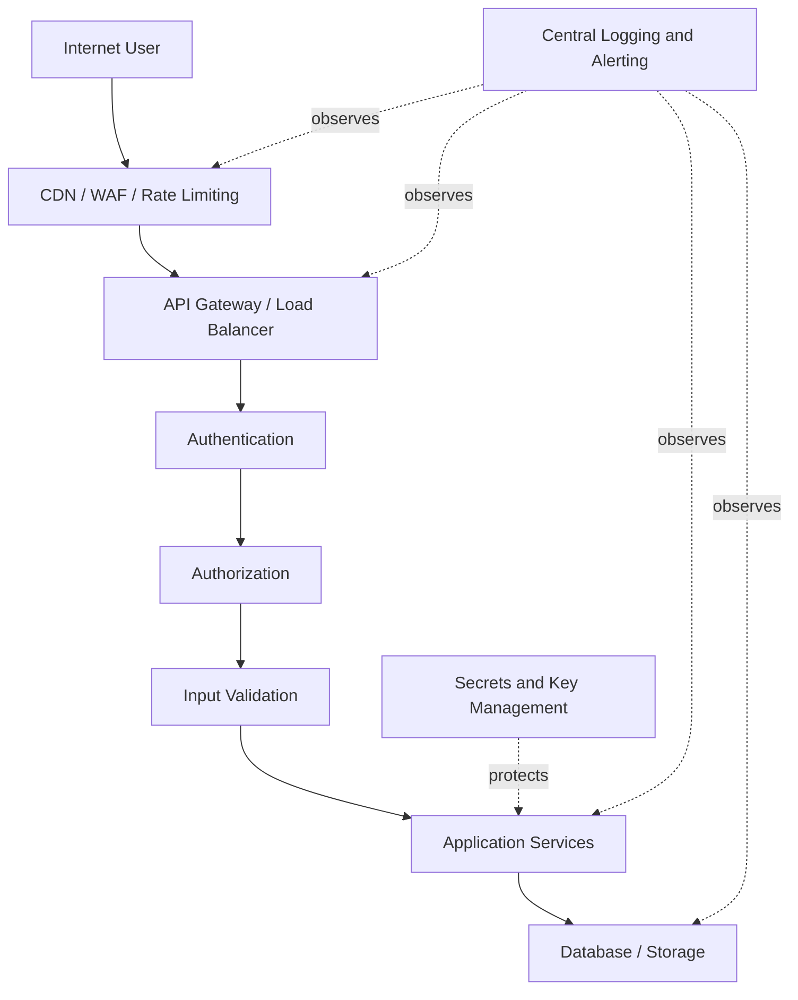

Important principle:

> **Authentication answers “Who are you?” Authorization answers “What are you allowed to do?”**

---

# 4. A01:2025 Broken Access Control

## 4.1 Simple Meaning

Broken access control occurs when the application does not correctly enforce what an authenticated or unauthenticated user is allowed to read, create, update, delete, or execute.

It commonly results in:

- Reading another user's records
- Updating resources owned by another tenant
- Calling admin-only APIs as a normal user
- Bypassing restrictions by changing a URL or request body
- Accessing internal URLs through Server-Side Request Forgery
- Performing state-changing requests without suitable CSRF protection

## 4.2 Authentication vs Authorization

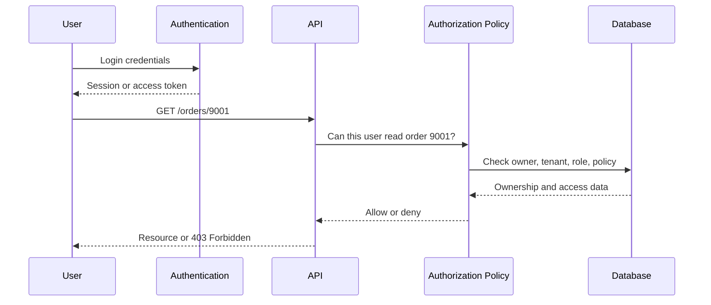

## 4.3 Common Forms

### Insecure Direct Object Reference

An endpoint loads a resource by ID but does not verify ownership.

```http
GET /api/invoices/4711
Authorization: Bearer <user-token>
```

An attacker changes `4711` to another predictable ID and receives another customer's invoice.

### Missing Function-Level Authorization

The frontend hides an admin button, but the backend endpoint remains callable:

```http
DELETE /api/admin/users/42
```

Frontend visibility is not a security control. Every request must be authorized on the server.

### Tenant Isolation Failure

In a multi-tenant application, the query filters by object ID but not tenant ID.

```python
# Insecure: object may belong to another tenant
invoice = Invoice.objects.get(id=invoice_id)
```

```python
# Better: scope every query to the authenticated tenant
invoice = Invoice.objects.get(
    id=invoice_id,
    tenant_id=request.user.tenant_id,
)
```

## 4.4 Secure API Example

```python
from fastapi import Depends, HTTPException, status


def get_invoice(
    invoice_id: str,
    current_user: User = Depends(get_current_user),
    repository: InvoiceRepository = Depends(get_invoice_repository),
) -> InvoiceResponse:
    invoice = repository.get_by_id(invoice_id)

    if invoice is None:
        raise HTTPException(status_code=404, detail="Invoice not found")

    # Server-side object-level authorization
    if invoice.tenant_id != current_user.tenant_id:
        # Returning 404 can reduce resource-enumeration information.
        raise HTTPException(status_code=404, detail="Invoice not found")

    if not current_user.can("invoice:read"):
        raise HTTPException(
            status_code=status.HTTP_403_FORBIDDEN,
            detail="Insufficient permission",
        )

    return InvoiceResponse.model_validate(invoice)
```

## 4.5 Prevention

- Deny access by default.
- Enforce authorization in backend code, not only in the UI.
- Centralize authorization policies where practical.
- Scope database queries by owner, organization, or tenant.
- Validate permissions for every HTTP method, not only `GET`.
- Use least privilege for users, services, databases, storage, and cloud roles.
- Protect state-changing browser requests against CSRF when using cookie-based authentication.
- Restrict CORS to trusted origins rather than using unrestricted settings.
- For server-side URL fetching, use destination allowlists, network segmentation, URL validation, redirect controls, and metadata-service protections.
- Add rate limits where automated enumeration or abuse is possible.
- Test horizontal access, vertical access, and tenant boundaries.

## 4.6 Practical Verification

For each protected endpoint, test at least:

```text
Unauthenticated user
        ↓
Authenticated user without permission
        ↓
Authenticated user with permission
        ↓
User from another tenant
        ↓
Administrator or service account
```

A useful authorization test matrix is:

| Resource | Action | Anonymous | Standard User | Owner | Admin | Other Tenant |
|---|---|---:|---:|---:|---:|---:|
| Invoice | Read | Deny | Deny | Allow | Allow | Deny |
| Invoice | Update | Deny | Deny | Allow | Allow | Deny |
| User | Delete | Deny | Deny | Deny | Allow | Deny |

## 4.7 What to Remember

- Authentication does not automatically provide authorization.
- Object ownership must be checked on every request.
- Hiding UI controls does not protect backend endpoints.
- Multi-tenant isolation should be enforced close to the data-access layer.
- A valid JWT proves token claims; it does not prove the requested action is permitted.

---

# 5. A02:2025 Security Misconfiguration

## 5.1 Simple Meaning

Security misconfiguration occurs when an application, framework, server, container, database, cloud service, or network is deployed with insecure settings.

Typical examples include:

- Default usernames or passwords
- Debug mode enabled in production
- Public cloud storage buckets
- Overly broad IAM permissions
- Unnecessary ports or services
- Directory listing enabled
- Detailed stack traces returned to users
- Missing security headers
- Permissive CORS rules
- Unprotected administrative interfaces
- Unused sample applications or test endpoints

## 5.2 Configuration Is Part of the Attack Surface

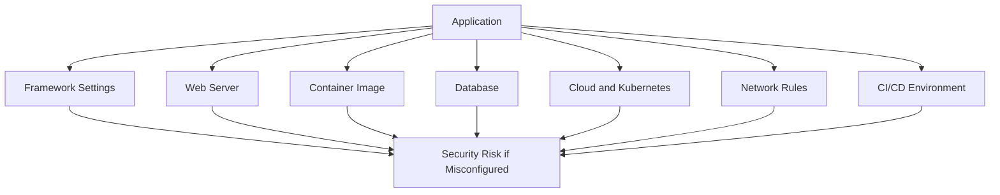

## 5.3 Example: Production Debug Information

```python
# Insecure production configuration
DEBUG = True
ALLOWED_HOSTS = ["*"]
```

A production error may expose:

- Source paths
- Environment variables
- Database details
- Internal service names
- Framework versions
- Parts of source code

A safer environment-specific setup:

```python
import os

DEBUG = os.getenv("APP_DEBUG", "false").lower() == "true"
ALLOWED_HOSTS = os.environ["ALLOWED_HOSTS"].split(",")

if DEBUG and os.getenv("APP_ENV") == "production":
    raise RuntimeError("Debug mode must not be enabled in production")
```

## 5.4 Example: Overly Permissive CORS

```python
# Dangerous for credentialed or sensitive APIs
allow_origins = ["*"]
```

```python
# Better: explicit trusted origins
allow_origins = [
    "https://app.example.com",
    "https://admin.example.com",
]
```

CORS is a browser policy. It is not a replacement for authentication or authorization.

## 5.5 Prevention

- Maintain hardened, repeatable configurations for each environment.
- Remove unused services, packages, endpoints, accounts, and features.
- Change or disable default credentials.
- Keep production error responses generic.
- Use secure defaults in reusable templates.
- Store environment-specific configuration outside application code.
- Apply infrastructure as code and review it like application code.
- Scan Docker images, Kubernetes manifests, Terraform, and cloud resources.
- Use least-privilege cloud IAM policies.
- Configure security headers such as HSTS, CSP, `X-Content-Type-Options`, and suitable frame protections.
- Ensure admin tools are authenticated, authorized, network-restricted, and audited.
- Regularly compare deployed configuration against an approved baseline.

## 5.6 Configuration Pipeline

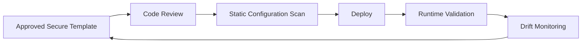

## 5.7 What to Remember

- Secure code can still be exposed by insecure deployment settings.
- Configuration should be versioned, reviewed, tested, and monitored.
- Cloud permissions and network rules are application-security controls.
- Production should fail deployment when dangerous settings are detected.

---

# 6. A03:2025 Software Supply Chain Failures

## 6.1 Simple Meaning

Modern applications depend on external code and delivery systems. A software supply chain failure occurs when a vulnerable, malicious, compromised, outdated, or untrusted component enters the software or when the build and release process is compromised.

The supply chain includes more than libraries:

- Direct and transitive dependencies
- Package registries
- Container base images
- Operating systems and runtimes
- IDEs and extensions
- Source-code repositories
- CI/CD runners and actions
- Build tools
- Artifact repositories
- Signing systems
- Deployment tooling
- Update mechanisms

## 6.2 Supply Chain Flow

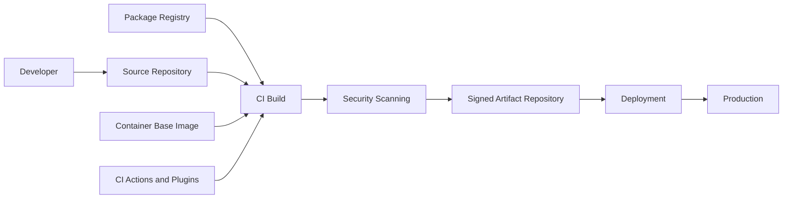

A compromise at any stage may affect the final production artifact.

## 6.3 Direct vs Transitive Dependencies

```text
Your application
├── framework-a                 ← direct dependency
│   ├── parser-b                ← transitive dependency
│   └── utility-c               ← transitive dependency
└── database-driver-d           ← direct dependency
    └── network-library-e       ← transitive dependency
```

A project may have twenty direct dependencies but hundreds of transitive dependencies.

## 6.4 Lock Files and Reproducible Builds

Pinning versions improves repeatability:

```text
# requirements.txt
fastapi==0.x.y
sqlalchemy==2.x.y
```

However, pinning alone is not enough. A pinned vulnerable package stays vulnerable until the team detects and updates it.

Use both:

```text
Version control + vulnerability monitoring + controlled updates
```

## 6.5 Software Bill of Materials

An **SBOM** records the components included in a software product. It improves visibility during vulnerability response.

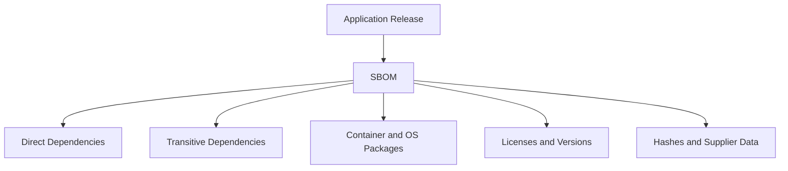

When a new vulnerability is announced, the team can check whether the affected component exists in deployed releases.

## 6.6 CI/CD Hardening Example

Avoid unpinned third-party CI actions:

```yaml
# Riskier: tag can potentially move
- uses: vendor/security-action@v2
```

Prefer a reviewed immutable commit reference where supported:

```yaml
# Better: fixed reviewed commit
- uses: vendor/security-action@4f2d9d6c0a...
```

Also:

- Restrict CI token permissions.
- Separate build and production-deployment privileges.
- Protect release branches and tags.
- Require review before production promotion.
- Isolate untrusted pull-request builds from secrets.
- Sign and verify release artifacts.

## 6.7 Prevention

- Maintain an inventory or SBOM for application, container, and operating-system components.
- Track direct and transitive dependencies.
- Use trusted registries and secure transport.
- Remove unused dependencies and tools.
- Scan dependencies and images continuously.
- Subscribe to vulnerability advisories.
- Apply risk-based patching with clear ownership and deadlines.
- Review package ownership, maintenance activity, release history, and provenance.
- Pin important build dependencies and CI actions.
- Protect source repositories with MFA, branch protection, and least privilege.
- Isolate CI runners and protect secrets from untrusted builds.
- Separate development, build, approval, and production-release responsibilities.
- Generate reproducible builds where practical.
- Sign artifacts and verify signatures before deployment.

## 6.8 A03 vs A08

These categories overlap but emphasize different levels:

| A03: Supply Chain Failures | A08: Integrity Failures |
|---|---|
| Governance and compromise across the software delivery ecosystem | Treating specific software or data artifacts as trusted without verification |
| Dependencies, registries, CI/CD, build infrastructure, distribution | Signatures, hashes, unsafe deserialization, update integrity |
| Broad process and ecosystem risk | Lower-level trust and integrity checks |

## 6.9 What to Remember

- Your production code includes more than the code your team writes.
- Dependency security includes transitive packages and build tooling.
- CI/CD is a production-critical system and must be hardened accordingly.
- SBOMs improve visibility but do not replace patching and governance.

---

# 7. A04:2025 Cryptographic Failures

## 7.1 Simple Meaning

Cryptographic failures occur when sensitive information is not protected correctly because encryption is missing, algorithms are weak, keys are exposed, randomness is predictable, certificates are not validated, or passwords are stored incorrectly.

Sensitive data may include:

- Passwords
- Access and refresh tokens
- Payment information
- Personal data
- Health records
- Private documents
- API keys and secrets
- Business-confidential information

## 7.2 Data States

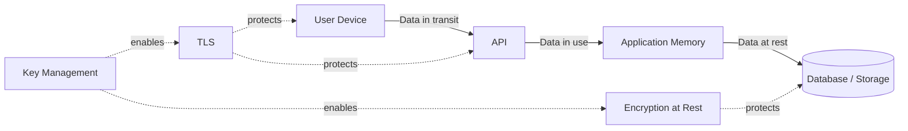

## 7.3 Encryption, Hashing, and Encoding

| Technique | Reversible? | Purpose | Example |
|---|---:|---|---|
| **Encryption** | Yes, with a key | Protect data confidentiality | Encrypting a document |
| **Hashing** | No practical reversal | Integrity or password verification | Password hash |
| **Digital signature** | Verified with public key | Prove authenticity and integrity | Signed release artifact |
| **Encoding** | Yes, no secret required | Data representation | Base64 |

> Base64 is encoding, not encryption.

## 7.4 Password Storage

Never store plaintext passwords:

```python
# Never do this
user.password = request.password
```

Do not use a fast general-purpose hash directly:

```python
# Not suitable for password storage by itself
sha256(password)
```

Use a framework-supported adaptive password hashing function such as Argon2id, bcrypt, scrypt, or PBKDF2 with suitable parameters.

```python
from argon2 import PasswordHasher

password_hasher = PasswordHasher()

stored_hash = password_hasher.hash(password)
password_hasher.verify(stored_hash, supplied_password)
```

Adaptive password hashes are deliberately expensive, making large-scale password guessing more costly.

## 7.5 Key Management

Encryption is only as strong as key management.

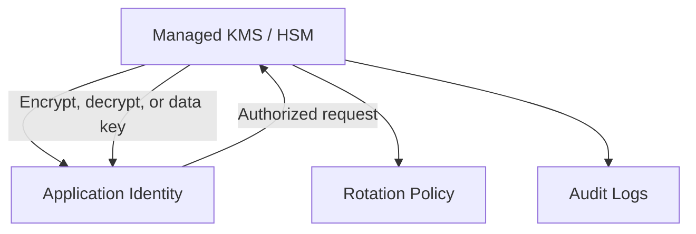

Recommended controls:

- Do not hard-code keys in source code.
- Do not place secrets in Docker images.
- Use a secrets manager or managed key-management service.
- Restrict access using workload identity and least privilege.
- Rotate keys and credentials according to risk.
- Maintain a revocation and emergency-rotation process.
- Audit key usage.
- Separate keys by environment and purpose.

## 7.6 Secure Randomness

Security tokens must use cryptographically secure randomness.

```python
import secrets

reset_token = secrets.token_urlsafe(32)
```

Avoid predictable random generators for passwords, tokens, session IDs, or cryptographic keys.

## 7.7 Prevention

- Classify sensitive data and minimize collection and retention.
- Encrypt network traffic using correctly configured TLS.
- Validate server certificates and hostnames.
- Encrypt sensitive data at rest when required by risk or regulation.
- Use modern, reviewed cryptographic libraries and protocols.
- Avoid custom cryptographic algorithms.
- Use adaptive password hashing with unique salts.
- Keep secrets out of code, logs, URLs, and client-side bundles.
- Use cryptographically secure random number generators.
- Rotate, revoke, and audit keys.
- Disable obsolete protocols and weak cipher configurations.
- Use authenticated encryption modes where applicable.

## 7.8 What to Remember

- Hash passwords; encrypt data that must later be recovered.
- Key management is part of cryptography, not a separate afterthought.
- Never design your own cryptographic algorithm.
- TLS protects data in transit, not automatically at rest or in application logs.

---

# 8. A05:2025 Injection

## 8.1 Simple Meaning

Injection occurs when untrusted data is mixed with a command or query and an interpreter treats part of that data as executable instructions.

Common injection types include:

- SQL injection
- NoSQL injection
- Operating-system command injection
- LDAP injection
- Expression-language injection
- Server-side template injection
- Cross-site scripting

## 8.2 Injection Flow

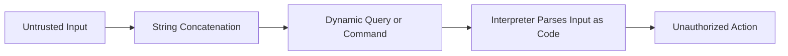

The key problem is mixing **data** with **instructions**.

## 8.3 SQL Injection

### Insecure

```python
query = f"SELECT * FROM users WHERE email = '{email}'"
cursor.execute(query)
```

An attacker may submit input that changes the query structure.

### Secure

```python
query = "SELECT * FROM users WHERE email = %s"
cursor.execute(query, [email])
```

The database receives the SQL structure and input data separately.

### ORM Example

```python
# Normal ORM filtering is parameterized
user = User.objects.filter(email=email).first()
```

An ORM reduces risk but does not make every query safe. Raw SQL, dynamic field names, unsafe expressions, and string-built filters still require careful handling.

## 8.4 Command Injection

### Insecure

```python
import os

os.system(f"convert {uploaded_filename} output.png")
```

### Better

```python
import subprocess

subprocess.run(
    ["convert", safe_input_path, safe_output_path],
    check=True,
    shell=False,
    timeout=30,
)
```

Additional safeguards:

- Generate server-side file names.
- Keep uploads outside executable directories.
- Validate file type and size.
- Run converters with restricted permissions.
- Apply resource and time limits.

## 8.5 Cross-Site Scripting

Cross-site scripting happens when attacker-controlled content is rendered as executable browser code.

```html
<!-- Risky when user_bio is inserted as raw HTML -->
<div>{{ user_bio | safe }}</div>
```

Preferred controls:

- Use template auto-escaping.
- Apply context-aware output encoding.
- Sanitize HTML only when rich HTML input is a real requirement.
- Avoid unsafe DOM APIs such as direct `innerHTML` assignment.
- Use Content Security Policy as defense in depth.

## 8.6 Validation vs Sanitization vs Encoding

| Control | Purpose | Example |
|---|---|---|
| **Validation** | Accept only structurally valid input | Integer must be between 1 and 100 |
| **Normalization** | Convert input into a consistent representation | Normalize Unicode or phone format |
| **Sanitization** | Remove or transform dangerous content | Allow selected HTML tags only |
| **Parameterized query** | Separate data from query instructions | SQL placeholder parameters |
| **Output encoding** | Render content safely in its destination context | HTML escaping |

Validation alone does not replace parameterized queries or output encoding.

## 8.7 Prevention

- Use parameterized queries and safe ORM APIs.
- Avoid dynamic query construction from user input.
- Use allowlists for dynamic identifiers such as sort fields.
- Avoid shell commands when a library API exists.
- When commands are necessary, pass arguments as a list and disable shell parsing.
- Use template auto-escaping and context-aware output encoding.
- Validate input structure, size, type, range, and allowed values.
- Use least-privilege database and operating-system accounts.
- Add SAST, DAST, IAST, dependency scanning, and fuzz testing where appropriate.
- Write tests using malicious payloads across query, body, header, cookie, and file inputs.

## 8.8 Safe Dynamic Sorting Example

```python
ALLOWED_SORT_FIELDS = {
    "created_at": Invoice.created_at,
    "amount": Invoice.amount,
    "status": Invoice.status,
}

sort_column = ALLOWED_SORT_FIELDS.get(requested_sort)
if sort_column is None:
    raise ValueError("Unsupported sort field")

query = query.order_by(sort_column)
```

Do not pass user-provided column names directly into raw SQL.

## 8.9 What to Remember

- Injection is fundamentally a separation problem between data and instructions.
- Parameterization is the primary SQL-injection control.
- Escaping must match the output context.
- Input validation is important but not a universal injection fix.
- ORMs and frameworks help only when their safe APIs are used correctly.

---

# 9. A06:2025 Insecure Design

## 9.1 Simple Meaning

Insecure design means the application architecture or business workflow lacks necessary security controls. The problem exists before coding begins.

Examples:

- Password reset does not require sufficient proof of identity.
- A payment workflow allows the client to provide the final payable amount.
- A coupon can be reused indefinitely because no usage rule exists.
- A file-upload feature has no design for type, size, malware, or isolation controls.
- A high-value transaction has no rate limit, approval, or risk check.
- Tenant isolation is not part of the data model.

## 9.2 Design Defect vs Implementation Defect

| Insecure Design | Insecure Implementation |
|---|---|
| Required control does not exist in the architecture | Control exists but code implements it incorrectly |
| No transaction limit was defined | Limit exists but comparison uses the wrong field |
| No ownership rule exists | Ownership rule exists but one endpoint forgets to call it |
| Fixed through requirements and architecture changes | Fixed through code correction and testing |

A perfectly coded insecure design is still insecure because the required protection was never designed.

## 9.3 Threat Modeling

Threat modeling identifies assets, trust boundaries, attackers, abuse cases, and required controls before implementation.

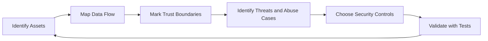

### Example: Money Transfer Feature

Normal flow:

```text
User selects beneficiary → enters amount → confirms → transfer executes
```

Security questions during design:

- Can the client change the source account ID?
- Is the beneficiary owned or approved by the user?
- Is the transfer amount recalculated on the server?
- Are balance checks and updates atomic?
- Is replay prevented?
- Is step-up authentication needed for high-value transfers?
- Are daily and per-transaction limits enforced?
- Is suspicious behavior logged and alerted?
- What happens if the payment provider times out after processing?

## 9.4 Trust Boundaries

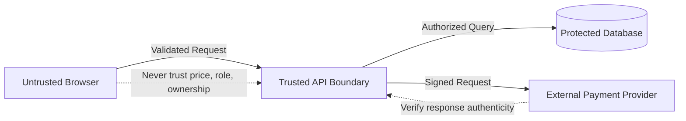

All client-provided values must be treated as untrusted, including hidden fields and disabled form inputs.

## 9.5 Prevention

- Include security requirements in user stories and acceptance criteria.
- Perform threat modeling for important features and architectural changes.
- Identify assets, entry points, trust boundaries, and abuse cases.
- Use secure design patterns and reviewed reference architectures.
- Enforce tenant isolation in identity, data model, queries, cache keys, storage paths, and background jobs.
- Define limits for transactions, uploads, requests, retries, and resource use.
- Design workflows to be atomic and idempotent where needed.
- Recalculate sensitive values on the server.
- Use layered controls for high-risk operations.
- Separate privileged administration from standard user workflows.
- Add security-focused architecture review before implementation.

## 9.6 Example Security Acceptance Criteria

```text
Feature: Customer downloads an invoice

Security acceptance criteria:
1. The request requires authentication.
2. The invoice must belong to the user's tenant.
3. The user must have invoice:read permission.
4. The storage URL must be short-lived and scoped to one object.
5. The download event must be logged without storing invoice content.
6. Repeated enumeration attempts must trigger an alert.
```

## 9.7 What to Remember

- Insecure design cannot be solved only with a code scanner.
- Business logic is part of application security.
- Threat modeling should happen before coding, not only before release.
- Security requirements should be testable acceptance criteria.

---

# 10. A07:2025 Authentication Failures

## 10.1 Simple Meaning

Authentication failures occur when the application incorrectly verifies identity or poorly manages credentials, recovery flows, sessions, and tokens.

Common examples:

- Weak or default passwords
- Credential stuffing and password spraying
- No rate limiting for login attempts
- Missing multi-factor authentication
- Weak password-reset process
- Session fixation
- Session ID exposed in a URL
- Tokens not invalidated after logout or account compromise
- Incorrect JWT issuer, audience, expiry, or signature validation
- Hard-coded credentials

## 10.2 Authentication Flow

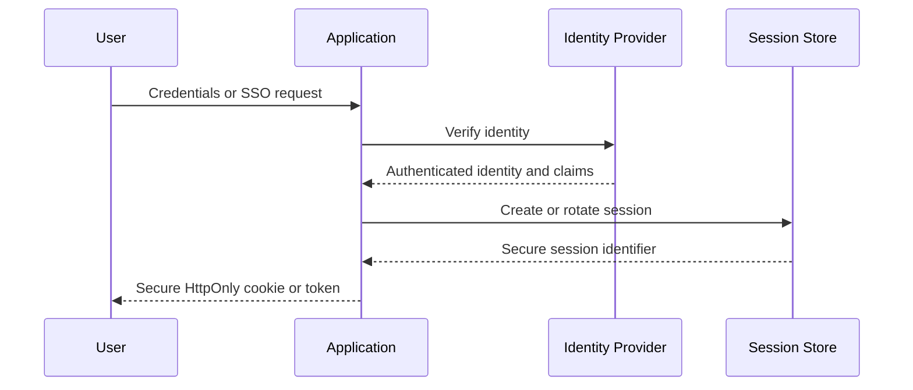

## 10.3 Secure Password Handling

Recommended approach:

```text
Password received over TLS
        ↓
Adaptive password hash verification
        ↓
Rate limit and attack detection
        ↓
MFA or step-up authentication where required
        ↓
New session identifier after successful login
```

Password rules should support secure user behavior rather than forcing predictable patterns. Use blocklists for known compromised passwords and allow password managers.

## 10.4 Sessions and Tokens

For browser applications using cookies, security attributes commonly include:

```http
Set-Cookie: session=<opaque-id>; Secure; HttpOnly; SameSite=Lax; Path=/
```

Meaning:

- `Secure`: send only over HTTPS.
- `HttpOnly`: reduce access from client-side JavaScript.
- `SameSite`: help reduce cross-site request abuse.
- Suitable expiry and rotation: limit session lifetime.

For JWT validation, verify at least:

- Signature using an allowed algorithm
- Issuer (`iss`)
- Audience (`aud`)
- Expiry (`exp`)
- Not-before time (`nbf`) where used
- Token type and purpose
- Required scopes or claims
- Key rotation and revocation strategy

> Decoding a JWT is not the same as validating it.

## 10.5 Login Rate Limiting

Rate limiting should consider multiple dimensions:

```text
Source IP + Account + Device/Session + Time Window + Risk Signals
```

Only limiting by IP may affect users behind shared networks and may be bypassed through distributed attacks. Only limiting by account may allow denial-of-service through account lockouts. Use balanced throttling, progressive delays, risk detection, and alerts.

## 10.6 Password Reset Design

A safe reset flow should:

- Return a consistent response whether or not the account exists.
- Generate a cryptographically random, single-use, short-lived token.
- Store the reset token securely, preferably as a hash.
- Bind it to the correct user and purpose.
- Invalidate it after use.
- Avoid automatic login unless the risk is carefully handled.
- Notify the user after a password change.
- Revoke or review active sessions after credential reset.

## 10.7 Prevention

- Use established authentication frameworks or identity providers.
- Require MFA for privileged and high-risk accounts.
- Protect against brute force, credential stuffing, and password spraying.
- Block known compromised passwords.
- Store passwords using adaptive password hashing.
- Use secure, random, rotated session identifiers.
- Invalidate sessions on logout, password reset, account disablement, and security-sensitive changes.
- Do not place session IDs or tokens in URLs.
- Validate JWT claims and permitted algorithms.
- Keep access tokens short-lived and protect refresh tokens carefully.
- Use generic authentication error responses.
- Log authentication events and alert on suspicious patterns.

## 10.8 What to Remember

- Authentication includes login, recovery, MFA, session management, and token validation.
- JWTs do not remove the need for server-side security decisions.
- MFA significantly improves account protection but must have secure recovery and fallback flows.
- Login protection must balance attack prevention and user availability.

---

# 11. A08:2025 Software or Data Integrity Failures

## 11.1 Simple Meaning

Integrity failures occur when an application trusts software, updates, plugins, artifacts, serialized objects, or important data without verifying that they came from an expected source and were not modified.

Examples:

- Auto-updates installed without signature verification
- CI/CD deploys an artifact without checking its provenance or hash
- JavaScript loaded from an untrusted third-party source
- Unsafe deserialization of attacker-controlled data
- Client-controlled fields change object properties that should be server-managed
- Webhook payloads accepted without signature verification

## 11.2 Integrity Verification Flow

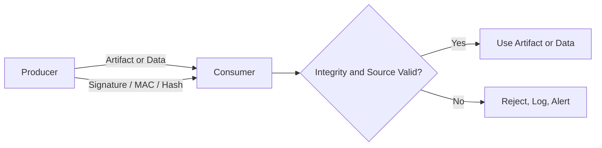

## 11.3 Webhook Verification Example

A webhook endpoint should not trust a request merely because it reaches the correct URL.

```python
import hashlib
import hmac


def verify_webhook(raw_body: bytes, supplied_signature: str, secret: bytes) -> bool:
    expected = hmac.new(secret, raw_body, hashlib.sha256).hexdigest()
    return hmac.compare_digest(expected, supplied_signature)
```

A complete design should also validate:

- Timestamp freshness
- Replay protection
- Event ID uniqueness
- Expected event type
- Correct account or tenant
- Safe parsing after signature validation

## 11.4 Unsafe Deserialization

Deserialization converts serialized data back into application objects. Some formats can trigger dangerous behavior or create unexpected object states.

Safer approach:

- Prefer simple data formats such as JSON for untrusted input.
- Validate against strict schemas.
- Reject unknown fields when appropriate.
- Avoid deserializing attacker-controlled native objects.
- Do not dynamically import or instantiate classes based on input.
- Sign sensitive serialized state if it must travel through an untrusted client.

## 11.5 Mass Assignment

Suppose the API accepts the full user payload directly:

```json
{
  "name": "Alex",
  "email": "alex@example.com",
  "is_admin": true
}
```

A secure schema should explicitly allow user-editable fields:

```python
from pydantic import BaseModel, EmailStr, ConfigDict


class UserProfileUpdate(BaseModel):
    model_config = ConfigDict(extra="forbid")

    name: str
    email: EmailStr
```

Server-managed fields such as roles, permissions, tenant IDs, prices, and account status must not be copied from arbitrary client input.

## 11.6 Artifact Integrity

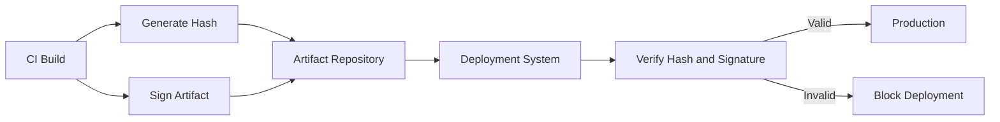

## 11.7 Prevention

- Use digital signatures, MACs, or trusted hashes for critical artifacts and data.
- Verify package and artifact provenance.
- Consume dependencies from trusted repositories.
- Protect CI/CD pipelines and artifact stores from unauthorized changes.
- Verify update signatures before installation.
- Avoid unsafe deserialization of untrusted input.
- Use strict schemas and allowlists for object fields.
- Sign and verify webhooks and asynchronous messages.
- Protect release approval and production promotion processes.
- Use Subresource Integrity when loading appropriate third-party browser resources.
- Log and alert on integrity-verification failures.

## 11.8 What to Remember

- Encryption protects confidentiality; signatures and MACs protect integrity and authenticity.
- Data from a known-looking source must still be verified.
- Client-controlled state should never be trusted for sensitive decisions.
- Unsafe deserialization may turn data processing into code execution or privilege changes.

---

# 12. A09:2025 Security Logging and Alerting Failures

## 12.1 Simple Meaning

Logging and alerting failures occur when attacks cannot be detected or investigated because important events are missing, unclear, unprotected, unmonitored, or never escalated.

Logging is not valuable merely because log files exist. The system must support:

```text
Record → Centralize → Protect → Correlate → Detect → Alert → Respond
```

## 12.2 Security Observability Flow

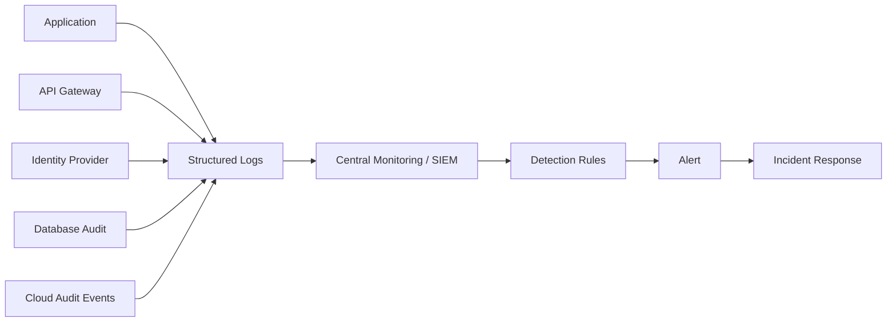

## 12.3 What Should Be Logged?

Security-relevant events often include:

- Successful and failed authentication
- MFA enrollment, reset, and failure
- Password and email changes
- Permission and role changes
- Access denied events
- High-value business transactions
- Admin actions
- Sensitive exports and downloads
- Rate-limit violations
- Input-validation failures that indicate attack patterns
- Integrity or signature-verification failures
- Unexpected exceptions
- Security configuration changes
- CI/CD release and deployment events

## 12.4 Structured Logging Example

```python
logger.info(
    "invoice_downloaded",
    user_id=str(current_user.id),
    tenant_id=str(current_user.tenant_id),
    invoice_id=str(invoice.id),
    request_id=request_id,
    source_ip=client_ip,
    outcome="success",
)
```

Structured fields make searching and correlation easier than unstructured text.

## 12.5 What Should Not Be Logged?

Avoid logging:

- Passwords
- Full access or refresh tokens
- Session IDs
- Private cryptographic keys
- Complete payment-card data
- Sensitive health information unless strictly required and protected
- Raw authorization headers
- Full reset links or one-time codes
- Entire request bodies by default

Use masking, tokenization, allowlisted fields, and retention controls.

## 12.6 Log Injection

Attacker-controlled text can manipulate log structure if not encoded or safely structured.

```python
# Risky unstructured composition
logger.warning(f"Login failed for username: {username}")
```

Prefer structured logging and prevent user input from creating false fields or lines.

## 12.7 Correlation IDs

A request ID helps connect events across services:

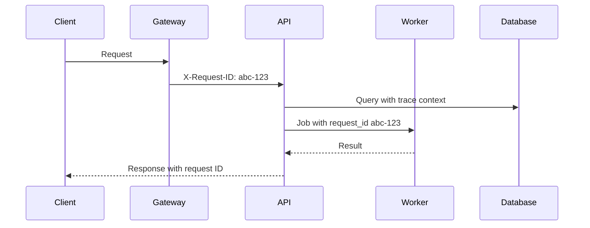

## 12.8 Prevention

- Define a security-event logging standard.
- Use structured, centralized logs.
- Include timestamps, actor, tenant, action, target, source, result, and correlation ID.
- Synchronize system clocks.
- Protect logs from unauthorized reading, modification, and deletion.
- Avoid logging secrets and unnecessary personal data.
- Define retention according to security, legal, and operational needs.
- Create actionable alert rules with ownership and escalation paths.
- Test that simulated attacks trigger expected alerts.
- Monitor privileged actions, authentication anomalies, data exports, and repeated access failures.
- Maintain incident-response procedures and regularly exercise them.

## 12.9 Logging vs Monitoring vs Alerting

| Concept | Purpose |
|---|---|
| **Logging** | Record an event |
| **Monitoring** | Analyze system activity and health |
| **Detection** | Recognize suspicious or harmful behavior |
| **Alerting** | Notify the correct responder |
| **Incident response** | Contain, investigate, recover, and learn |

## 12.10 What to Remember

- Logs without monitoring do not provide timely detection.
- Alerts without ownership or response procedures are ineffective.
- Logs are sensitive data and need access control and integrity protection.
- Security events should include enough context for investigation without exposing secrets.

---

# 13. A10:2025 Mishandling of Exceptional Conditions

## 13.1 Simple Meaning

This category covers insecure behavior when the application encounters unexpected input, missing values, downstream failures, timeouts, resource exhaustion, partial transactions, race conditions, or other abnormal states.

An application may:

- Fail open instead of failing closed
- Reveal sensitive stack traces
- Continue after a partial operation
- Commit only part of a transaction
- Leave files, locks, or connections unreleased
- Retry indefinitely
- Accept an invalid state after an exception
- Return success when a critical verification service is unavailable
- Crash due to malformed or oversized input

## 13.2 Fail Closed vs Fail Open

### Fail Open

```text
Authorization service unavailable
        ↓
Application assumes access is allowed
        ↓
Protected action continues
```

### Fail Closed

```text
Authorization service unavailable
        ↓
Application cannot verify permission
        ↓
Protected action is denied or safely deferred
```

For security-sensitive decisions, inability to verify should normally result in denial, not approval.

## 13.3 Transaction Example

Suppose a transfer performs these steps:

1. Debit sender
2. Credit receiver
3. Write ledger entry
4. Publish notification

Without transaction handling, step two may fail after step one succeeds.

```python
from django.db import transaction


@transaction.atomic
def transfer_funds(sender, receiver, amount):
    debit(sender, amount)
    credit(receiver, amount)
    create_ledger_entries(sender, receiver, amount)
```

External side effects require additional patterns such as an outbox, idempotency keys, reconciliation, or compensation logic.

## 13.4 Reliable Transaction and Event Flow

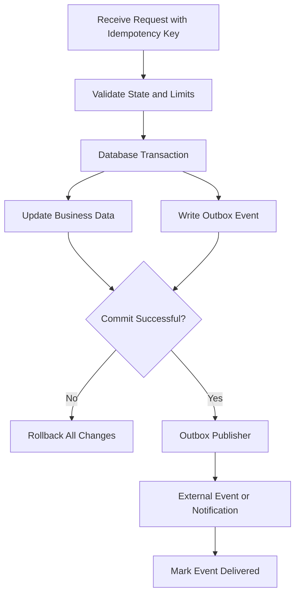

## 13.5 Safe Exception Handling

```python
from fastapi import FastAPI, Request
from fastapi.responses import JSONResponse

app = FastAPI()


@app.exception_handler(Exception)
async def unexpected_error_handler(request: Request, exc: Exception):
    request_id = getattr(request.state, "request_id", "unknown")

    logger.exception(
        "unexpected_server_error",
        request_id=request_id,
        path=request.url.path,
    )

    return JSONResponse(
        status_code=500,
        content={
            "error": "Internal server error",
            "request_id": request_id,
        },
    )
```

The user receives a safe message, while internal logs retain diagnostic context.

## 13.6 Resource Management

Use bounded resource handling:

```python
with open(file_path, "rb") as file_handle:
    process(file_handle)
```

For external calls, define:

- Connection timeout
- Read timeout
- Maximum response size
- Retry limit
- Exponential backoff with jitter
- Circuit breaker where appropriate
- Concurrency limit
- Cancellation handling
- Fallback behavior

Avoid unlimited retries. Retries can multiply load during an outage.

## 13.7 Input and Resource Limits

```text
Request body size
File upload size
Image dimensions
Archive expansion size
Page size
Query complexity
Execution time
Concurrent jobs
Retry count
Memory and CPU use
```

Nothing should be unlimited.

## 13.8 Prevention

- Validate required fields, ranges, formats, states, and relationships.
- Handle errors close to where they occur and provide meaningful recovery behavior.
- Add a global exception handler as a final safety boundary.
- Fail closed for security-sensitive decisions.
- Use transactions for atomic operations.
- Use idempotency for retried state-changing operations.
- Roll back incomplete work.
- Release resources using context managers or `finally` blocks.
- Add timeouts, rate limits, quotas, and bounded retries.
- Avoid leaking internal details in error responses.
- Log exceptions with correlation context and alert on suspicious patterns.
- Test network failures, missing dependencies, malformed input, concurrency, and partial completion.
- Design reconciliation for distributed operations that cannot be one atomic transaction.

## 13.9 What to Remember

- Error handling is a security and resilience control.
- A failure state must not grant more permission than a healthy state.
- Distributed systems require explicit handling for retries, duplicate events, and partial success.
- Generic user errors and detailed internal logs serve different purposes.

---

# 14. How the Risks Work Together

Security incidents often involve several categories rather than one isolated weakness.

## 14.1 Example Attack Chain

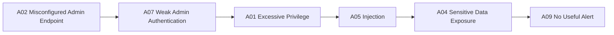

Another example:

```mermaid
flowchart LR
    A3[A03 Compromised Build Dependency] --> A8[A08 Unsigned Artifact Trusted]
    A8 --> PROD[Malicious Code Deployed]
    PROD --> A1[A01 Unauthorized Access]
    A1 --> A9[A09 Poor Detection Delays Response]
```

## 14.2 Control Mapping

| Security Control | Risks Reduced |
|---|---|
| Central authorization policy | A01, A06 |
| Secure configuration baseline | A02, A03, A09 |
| Dependency inventory and scanning | A03, A08 |
| Secrets and key management | A02, A04, A07 |
| Parameterized queries | A05 |
| Threat modeling | A01, A06, A07, A10 |
| MFA and secure sessions | A07 |
| Artifact signing | A03, A08 |
| Central logging and alerting | A01, A07, A08, A09, A10 |
| Transactions and idempotency | A06, A10 |
| Rate limits and quotas | A01, A07, A10 |

---

# 15. Security Testing Strategy

Different testing methods find different types of weakness.

## 15.1 Testing Layers

```mermaid
flowchart TD
    A[Architecture and Threat Modeling] --> B[Code Review]
    B --> C[SAST and Secret Scanning]
    C --> D[Dependency and Image Scanning]
    D --> E[Unit and Integration Security Tests]
    E --> F[DAST and API Testing]
    F --> G[Manual Penetration Testing]
    G --> H[Runtime Monitoring and Incident Exercises]
```

## 15.2 Tool Categories

| Testing Type | What It Examines | Useful For | Limitations |
|---|---|---|---|
| **SAST** | Source or compiled code | Injection patterns, insecure APIs, data flow | May produce false positives; limited business context |
| **DAST** | Running application | Runtime behavior and exposed endpoints | Limited source visibility; depends on coverage |
| **IAST** | Running application with instrumentation | Runtime data flow with code context | Requires supported runtime and test traffic |
| **SCA** | Dependencies and components | Known vulnerable libraries and licenses | Does not prove exploitability; needs accurate inventory |
| **Secret scanning** | Code and repository history | Hard-coded credentials and keys | Cannot detect all credential misuse |
| **IaC scanning** | Terraform, Kubernetes, cloud templates | Misconfiguration and insecure permissions | Requires environment and policy context |
| **Container scanning** | Image packages and configuration | Vulnerable OS packages and risky image settings | Runtime controls still need separate validation |
| **Fuzz testing** | Unexpected and malformed inputs | Parsers, validation, error handling, crashes | Requires good harnesses and triage |
| **Penetration testing** | Complete application behavior | Authorization and business-logic attack chains | Point-in-time and dependent on scope |

## 15.3 Tests That Should Be Automated

Examples of high-value automated security tests:

- User cannot access another tenant's records.
- Normal user cannot call administrator endpoints.
- Invalid or expired token is rejected.
- JWT with wrong issuer or audience is rejected.
- Password reset token is single-use and expires.
- SQL-like input remains data, not query structure.
- Unsupported file types and oversized files are rejected.
- Sensitive fields are absent from API responses.
- Production configuration disables debug mode.
- Known dangerous configuration blocks deployment.
- Webhook with invalid signature is rejected.
- Duplicate idempotency key does not create a second transaction.
- Downstream timeout does not leave partial state.
- Repeated failed login attempts generate an alert.

## 15.4 Security Test Pyramid

```text
                   Manual penetration tests
                 /                         \
          Integration and API security tests
        /                                     \
  Unit tests for policies, validation, and business rules
 /                                                   \
Static analysis, dependency scans, configuration checks
```

Use frequent low-cost automated checks and targeted expert testing for complex logic.

---

# 16. Secure Development Lifecycle

## 16.1 Requirements

Define:

- Sensitive assets and data classification
- Roles and permissions
- Tenant boundaries
- Authentication requirements
- Audit requirements
- Availability and recovery needs
- Legal and privacy constraints
- Abuse cases and security acceptance criteria

## 16.2 Design

Perform:

- Data-flow diagrams
- Trust-boundary identification
- Threat modeling
- Architecture security review
- Dependency and platform selection review
- Failure-mode analysis
- Logging and incident-response design

## 16.3 Development

Apply:

- Secure coding standards
- Code review
- Secret scanning
- Input and output controls
- Central authentication and authorization
- Safe cryptographic libraries
- Secure error handling
- Dependency governance

## 16.4 Build and CI/CD

Protect:

- Repository access
- Branch and tag rules
- CI runner isolation
- Build secrets
- Third-party actions
- Artifact integrity
- Approval and promotion rules
- Environment separation

## 16.5 Deployment

Verify:

- Secure configuration baseline
- Least-privilege identities
- Network restrictions
- TLS and certificate setup
- Secrets injection
- Logging and monitoring
- Backup and recovery
- Rollback readiness

## 16.6 Operations

Continuously:

- Monitor security alerts
- Patch dependencies and platforms
- Review permissions
- Rotate keys and credentials
- Test backup recovery
- Review configuration drift
- Conduct incident exercises
- Feed production learning back into design

---

# 17. Practical Pull Request Checklist

Use this compact checklist during normal development.

## Access and Identity

- [ ] Backend authorization is enforced for every protected action.
- [ ] Object ownership and tenant boundaries are checked.
- [ ] New endpoints follow least privilege.
- [ ] Authentication and session behavior use established framework features.
- [ ] Sensitive actions have appropriate re-authentication or MFA requirements.

## Input, Output, and Data

- [ ] Input type, length, range, format, and allowed values are validated.
- [ ] Database operations use parameterized queries or safe ORM APIs.
- [ ] Dynamic identifiers use allowlists.
- [ ] Browser output is contextually encoded.
- [ ] File uploads have type, size, storage, and processing controls.
- [ ] Sensitive response fields are explicitly selected rather than exposing full models.

## Secrets and Cryptography

- [ ] No passwords, tokens, private keys, or production secrets are committed.
- [ ] Sensitive transport uses TLS.
- [ ] Passwords use framework-supported adaptive hashing.
- [ ] Security tokens use cryptographically secure randomness.
- [ ] New encryption uses approved libraries and managed keys.

## Dependencies and Delivery

- [ ] New dependencies are necessary, maintained, and from trusted sources.
- [ ] Lock files are updated and reviewed.
- [ ] Dependency and image scans pass or have documented risk acceptance.
- [ ] CI changes use restricted permissions and reviewed immutable references where possible.
- [ ] Release artifacts are traceable and integrity-protected.

## Errors and Reliability

- [ ] Error responses do not expose stack traces or sensitive details.
- [ ] Operations are atomic or have reconciliation/compensation logic.
- [ ] Retried state changes are idempotent where necessary.
- [ ] External calls have timeouts and bounded retries.
- [ ] Files, connections, locks, and other resources are always released.

## Logging and Monitoring

- [ ] Security-relevant events are logged with actor, action, target, outcome, and request ID.
- [ ] Secrets and unnecessary personal data are not logged.
- [ ] Suspicious behavior can trigger an actionable alert.
- [ ] Logging failures do not expose information to the client.

## Testing

- [ ] Positive and negative authorization tests exist.
- [ ] Cross-tenant access is tested.
- [ ] Malformed, missing, oversized, and unexpected inputs are tested.
- [ ] Dependency, secret, static-analysis, and configuration checks pass.
- [ ] Failure paths and downstream outages are tested.

---

# 18. Key Concepts to Remember

## 18.1 Core Principles

1. **Deny by default.** Grant only explicitly required access.
2. **Use least privilege.** Apply it to users, services, databases, CI/CD, and cloud roles.
3. **Never trust client input.** The browser and mobile client are outside the trust boundary.
4. **Separate data from instructions.** Use parameterized APIs and safe output handling.
5. **Prefer secure defaults.** Make insecure states difficult to deploy.
6. **Use proven security libraries.** Avoid custom authentication or cryptography.
7. **Design for failure.** Timeouts, retries, rollback, idempotency, quotas, and reconciliation are security controls.
8. **Verify integrity.** Do not trust artifacts, updates, webhooks, or serialized state without verification.
9. **Log for response, not only debugging.** Record important events and connect them to actionable alerts.
10. **Use defense in depth.** Assume individual controls may fail.

## 18.2 Compact Mental Model

```text
Identity       → Who is making the request?
Authorization  → Are they allowed to do this action on this resource?
Validation     → Is the input structurally and semantically acceptable?
Integrity      → Can this code or data be trusted?
Confidentiality→ Is sensitive data protected?
Resilience     → Does the system fail safely?
Visibility     → Can attacks be detected and investigated?
```

## 18.3 Final Architecture View

```mermaid
flowchart TD
    USER[User or External System] --> EDGE[WAF, Rate Limit, TLS]
    EDGE --> AUTHN[Authentication]
    AUTHN --> AUTHZ[Authorization and Tenant Isolation]
    AUTHZ --> VALID[Validation and Safe Parsing]
    VALID --> LOGIC[Secure Business Logic]
    LOGIC --> DATA[(Protected Data Stores)]
    LOGIC --> EXT[Verified External Integrations]

    SECRETS[Secrets and Key Management] -.-> AUTHN
    SECRETS -.-> LOGIC

    SUPPLY[Trusted Dependencies and Secure CI/CD] -. builds .-> LOGIC
    INTEGRITY[Artifact and Message Integrity] -. verifies .-> SUPPLY
    INTEGRITY -. verifies .-> EXT

    OBS[Central Logs, Monitoring, Alerts] -. observes .-> EDGE
    OBS -. observes .-> AUTHN
    OBS -. observes .-> AUTHZ
    OBS -. observes .-> LOGIC
    OBS -. observes .-> DATA

    FAIL[Timeouts, Transactions, Idempotency, Fail-Closed Behavior] -. protects .-> LOGIC
```

---

# 19. Official References

This guide is based primarily on the official OWASP Top 10:2025 documentation.

- OWASP Top Ten project: https://owasp.org/www-project-top-ten/
- OWASP Top 10:2025: https://owasp.org/Top10/2025/
- Introduction and changes in 2025: https://owasp.org/Top10/2025/0x00_2025-Introduction/
- A01 Broken Access Control: https://owasp.org/Top10/2025/A01_2025-Broken_Access_Control/
- A02 Security Misconfiguration: https://owasp.org/Top10/2025/A02_2025-Security_Misconfiguration/
- A03 Software Supply Chain Failures: https://owasp.org/Top10/2025/A03_2025-Software_Supply_Chain_Failures/
- A04 Cryptographic Failures: https://owasp.org/Top10/2025/A04_2025-Cryptographic_Failures/
- A05 Injection: https://owasp.org/Top10/2025/A05_2025-Injection/
- A06 Insecure Design: https://owasp.org/Top10/2025/A06_2025-Insecure_Design/
- A07 Authentication Failures: https://owasp.org/Top10/2025/A07_2025-Authentication_Failures/
- A08 Software or Data Integrity Failures: https://owasp.org/Top10/2025/A08_2025-Software_or_Data_Integrity_Failures/
- A09 Security Logging and Alerting Failures: https://owasp.org/Top10/2025/A09_2025-Security_Logging_and_Alerting_Failures/
- A10 Mishandling of Exceptional Conditions: https://owasp.org/Top10/2025/A10_2025-Mishandling_of_Exceptional_Conditions/
- OWASP Cheat Sheet Series: https://cheatsheetseries.owasp.org/
- OWASP Web Security Testing Guide: https://owasp.org/www-project-web-security-testing-guide/

---

> **Study approach:** Understand the security objective behind each category, recognize how it appears in normal backend and API development, and learn which controls belong in design, code, configuration, CI/CD, testing, and operations.
