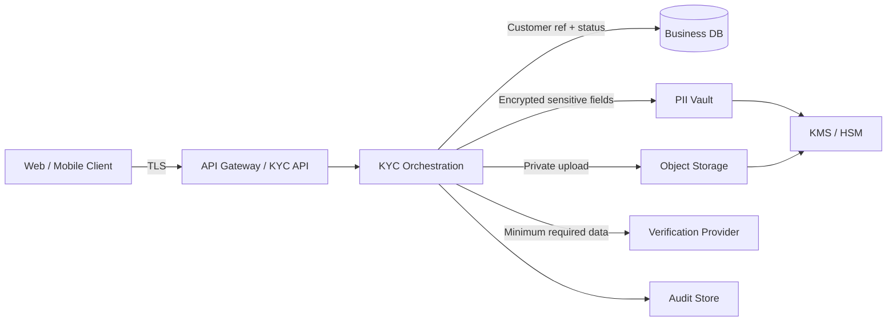
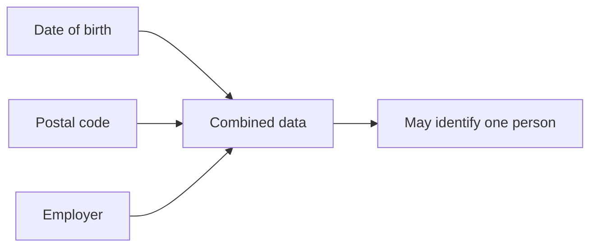
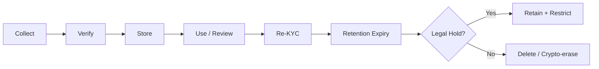
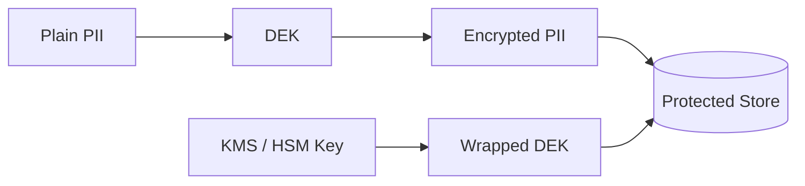
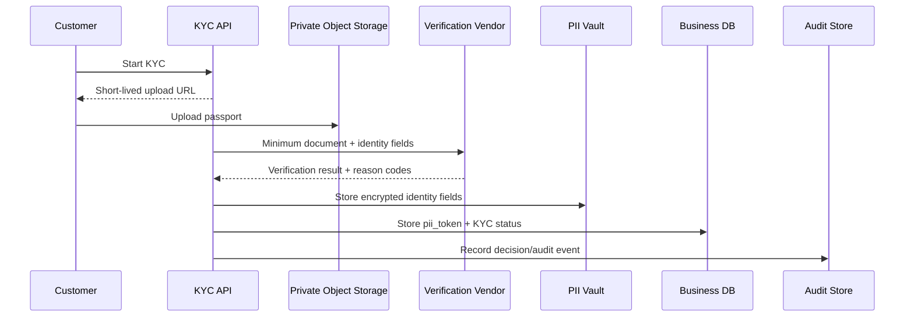
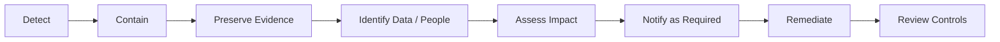

# Handling PII and KYC Data

> How to securely collect, verify, store, access, share, retain, and delete identity data in a production KYC system.

## In short

- **PII (Personally Identifiable Information)** is data that can identify a person directly or when combined with other data.
- **KYC (Know Your Customer) data** normally includes PII plus identity documents, verification evidence, screening results, and risk decisions.
- Keep raw PII away from normal business data. Store only references or tokens in business tables where possible.
- Protect sensitive values with **TLS, field/application-level encryption, envelope encryption, tokenization, masking, and strict key management**.
- Use **RBAC + contextual/ABAC checks** so access depends on role, assigned case, purpose, device/session assurance, and approval state.
- Never place raw PII in URLs, JWT payloads, logs, analytics events, error messages, or unnecessary vendor payloads.
- Retention and deletion must be automated and policy-driven, including vendors, caches, replicas, exports, and backup-expiry processes.
- KYC decisions should remain explainable and auditable; a vendor score should be an input, not the complete decision.



---

# 1. PII and KYC Basics

## 1.1 What is PII?

PII is information that identifies or can reasonably be linked to a person.

### Direct identifiers

- Full name
- Passport, PAN, Aadhaar, or driving-licence number
- Email address
- Phone number
- Customer identifier
- Biometric template

### Indirect or linkable identifiers

- Date of birth
- Postal code
- IP address
- Device identifier
- Employer
- Location or transaction pattern

A single indirect value may not identify someone, but several values together may.



## 1.2 What is KYC data?

KYC data is the information and evidence used to establish identity and assess regulatory/customer risk.

| Category | Typical examples |
|---|---|
| Identity | Name, DOB, nationality |
| Government identifiers | Passport, PAN, Aadhaar, licence |
| Documents | ID image, proof of address |
| Biometrics | Selfie, face-match, liveness result |
| Screening | Sanctions, PEP, adverse-media result |
| Financial profile | Occupation, income band, source of funds |
| Risk data | Risk level, reason codes, reviewer decision |
| Audit evidence | Who reviewed, when, and why |

> KYC data normally **contains PII**, but KYC also includes verification, compliance, and derived risk information.

---

# 2. Core Protection Principles

A secure design follows a few repeatable rules.

## 2.1 Purpose limitation

Use data only for the approved reason it was collected. A passport collected for identity verification should not automatically become analytics or marketing data.

## 2.2 Data minimization

Collect and expose only what is required.

Examples:

- Store an **age-verification result** instead of full DOB when exact DOB is unnecessary.
- Store a **verification outcome** instead of every temporary processing artifact.
- Share only required fields with a verification provider.

## 2.3 Least privilege

Users and services should receive the minimum data and permissions needed for the current task.

## 2.4 Storage limitation

Data should have an explicit retention rule. Do not keep identity documents forever because deletion was never implemented.

## 2.5 Accountability

The system should answer:

- What sensitive data do we hold?
- Why do we hold it?
- Who accessed it?
- Which policy allowed the access?
- When should it be deleted?

---

# 3. PII and KYC Data Lifecycle



| Stage | Important controls |
|---|---|
| Collection | TLS, minimization, clear notice, secure upload |
| Verification | Provider authentication, liveness/document checks, manual review where required |
| Storage | Encryption, tokenization, key management |
| Access | RBAC/ABAC, MFA, masking, auditing |
| Sharing | Minimum fields, contract controls, authenticated API |
| Retention | Policy engine, legal holds |
| Deletion | Primary/secondary-store cleanup, vendor deletion, backup expiry |

---

# 4. Secure KYC Architecture

The most useful design pattern is **separation of concerns**.

## 4.1 Business database

Keep operational fields such as:

- `customer_id`
- `kyc_status`
- `risk_level`
- `pii_token`
- `document_set_token`
- verification timestamps
- policy/rule version

Avoid placing raw documents, full government identifiers, or large vendor responses in normal business tables.

## 4.2 PII vault

Use a dedicated protected service/store for highly sensitive structured data.

It should support:

- field/application-level encryption
- strong service identity
- masked responses by default
- purpose-aware authorization
- audit events for sensitive reads
- key rotation

## 4.3 Document storage

Documents should live in private object storage with:

- public access disabled
- encryption enabled
- short-lived, scoped presigned URLs or a controlled download service
- generated object names
- malware scanning
- MIME type + file-signature validation
- size/page limits
- lifecycle rules

Do not use the original filename as the storage key because filenames themselves may contain PII.

---

# 5. Encryption, Tokenization, and Hashing

## 5.1 Encryption in transit

Use modern TLS for client APIs, service-to-service traffic, databases, object storage, queues, and vendor integrations.

PII should not be placed in query strings because URLs commonly reach browser history, reverse proxies, monitoring systems, and access logs.

## 5.2 Encryption at rest

Disk/database encryption is useful, but it is not enough. An application with broad database access can still read plaintext after the database decrypts it.

For high-value identifiers, use application/field-level encryption.

## 5.3 Envelope encryption

A common model is:

1. Generate or obtain a **Data Encryption Key (DEK)**.
2. Encrypt the sensitive data using the DEK.
3. Encrypt/wrap the DEK using a KMS/HSM-managed key.
4. Store the ciphertext and wrapped DEK together.



The important interview concept is **key separation**: application data is encrypted with data keys, while master/key-encryption keys remain protected by KMS or HSM controls.

## 5.4 Tokenization

Replace a sensitive identifier with a reference:

```text
PAN: ABCDE1234F
        ↓
tok_pan_8d4a77
```

Business services operate on the token. Only an authorized identity service can resolve it.

## 5.5 Hashing searchable identifiers

A plain SHA-256 hash is weak for predictable identifiers such as phone numbers or national IDs because attackers can guess the input space.

For equality checks, a keyed fingerprint is safer:

```python
import hashlib
import hmac


def identifier_fingerprint(value: str, key: bytes) -> str:
    normalized = "".join(value.upper().split())
    return hmac.new(key, normalized.encode(), hashlib.sha256).hexdigest()
```

Use encryption when the original value must be recovered; use a keyed hash/HMAC when only deterministic comparison is required.

---

# 6. Access Control and Masking

KYC access should combine **RBAC** with context-aware **ABAC** rules.

```text
ALLOW full_document_view when:
    role = KYC_ANALYST
AND case_assigned_to = actor
AND purpose = MANUAL_REVIEW
AND session_mfa = VERIFIED
AND device_trust = MANAGED
```

Important controls:

- SSO + MFA for reviewers and privileged users
- separate service identities
- masked data by default
- just-in-time privileged access
- maker-checker approval for sensitive overrides
- no bulk export by default
- audit every full-PII/document view
- alert on unusual access volume

### Masking example

| Value | Display |
|---|---|
| `ABCDE1234F` | `ABCD*****F` |
| `123412341234` | `XXXX-XXXX-1234` |
| `9876543210` | `******3210` |

Masking reduces display exposure; it does **not** replace encryption or authorization.

---

# 7. API, Logging, and Vendor Security

## 7.1 Keep PII out of APIs where it is not needed

Prefer token/reference-based APIs:

```http
POST /internal/identity-search
Content-Type: application/json

{
  "identifier_token": "tok_id_7a91"
}
```

Avoid placing raw PII in:

- URLs
- JWT payloads
- application logs
- tracing attributes
- error messages
- analytics events
- queue/event payloads unless strictly necessary

## 7.2 Use response allowlists

Do not serialize ORM/database models directly.

```python
from pydantic import BaseModel


class KYCStatusResponse(BaseModel):
    customer_id: str
    status: str
    next_action: str | None = None
```

This makes accidental exposure of document paths, IDs, vendor payloads, or reviewer notes less likely.

## 7.3 Safe logging

Prefer an allowlist logger:

```python
ALLOWED_FIELDS = {
    "event",
    "actor_id",
    "customer_ref",
    "case_id",
    "reason_code",
    "result",
    "timestamp",
}
```

Audit events should capture **who, what, when, why, and result** without copying raw PII into the log system.

## 7.4 Third-party KYC providers

Treat the provider as part of your security boundary.

Check:

- data location and subprocessors
- retention/deletion defaults
- encryption and tenant isolation
- model-training/data-reuse terms
- breach obligations
- audit/security reports
- exit and deletion process

Send only the fields required for the specific verification step.

For webhooks, validate signature, timestamp/replay window, event type, schema, and idempotency key. Prefer fetching large sensitive results through an authenticated API rather than embedding them in webhook payloads.

---

# 8. Retention, Re-KYC, and Deletion

Retention should be implemented as policy, not manual cleanup.

```text
Data category → retention rule → legal-hold check → deletion action → evidence
```

Deletion should account for:

- primary database
- read replicas
- object storage
- caches
- search indexes
- temporary files
- analytics copies
- vendor systems
- exports
- backups through their approved expiry/rotation process

For immutable backups, individual records are often not rewritten. Instead, access is tightly restricted and the backup expires under a defined lifecycle; crypto-erasure may help when encryption keys are sufficiently isolated.

## 8.1 RBI periodic KYC update

For RBI-covered regulated entities, the current KYC Master Direction states minimum periodic updation of:

- **High risk:** at least every **2 years**
- **Medium risk:** at least every **8 years**
- **Low risk:** at least every **10 years**

Internal policy may require more frequent checks depending on risk.

The current RBI direction also says onboarding or periodic-KYC applications should not be rejected **without application of mind**, and the officer concerned should record the reason for rejection.

---

# 9. Risk-Based KYC

A common model is:

```text
Customer risk
+ Geographic risk
+ Product risk
+ Channel risk
+ Ownership risk
+ Transaction behaviour
= Overall risk classification
```

Typical due-diligence levels:

- **Simplified Due Diligence (SDD):** only where law/policy permits lower-risk treatment.
- **Customer Due Diligence (CDD):** normal identity verification and screening.
- **Enhanced Due Diligence (EDD):** additional verification/review for higher-risk cases.

Store enough evidence to explain a decision:

- rule/model version
- input categories
- reason codes
- reviewer decision
- override reason
- approval evidence
- timestamp

A vendor confidence score should be one signal, not the complete KYC decision.

---

# 10. Practical End-to-End Example

Consider a customer uploading a passport during onboarding.



### What the business database might contain

```python
from dataclasses import dataclass
from datetime import datetime


@dataclass(frozen=True)
class CustomerKYC:
    customer_id: str
    pii_token: str
    document_set_token: str | None
    status: str
    risk_level: str
    policy_version: str
    verified_at: datetime | None
```

It contains workflow state and references—not the passport number or document bytes.

When a reviewer needs the full document:

1. The application checks role, case assignment, purpose, MFA, and device/session context.
2. The document service returns a short-lived authorized view.
3. The access itself creates an audit event.
4. The UI masks unrelated fields.

This is the practical meaning of **least privilege + separation + auditable access**.

---

# 11. Privacy and Incident Response

## 11.1 Privacy requests

A mature system should be able to locate and act on a person's data across approved systems while respecting regulatory retention or legal holds.

Typical flow:

1. Verify the requester.
2. Create a privacy-request case.
3. Find data across systems/vendors.
4. Apply legal/compliance restrictions.
5. Correct, export, or erase eligible data.
6. Propagate changes downstream.
7. Record completion evidence.

Do not send a full KYC export as an ordinary email attachment; use a protected portal or similarly controlled delivery method.

## 11.2 Personal-data breach response



Under India's DPDP Rules, 2025, affected Data Principals must be informed **without delay** in clear language when the applicable breach-intimation rule is in force. The Rules also provide for notification to the Data Protection Board without delay, followed by detailed information within **72 hours**, subject to the Rule's commencement schedule and any permitted extension.

Containment should not be delayed while waiting for a perfect final impact count.

---

# 12. Current Compliance Context

> Engineering summary only; exact legal obligations depend on jurisdiction, organization type, and product.

## 12.1 India — DPDP Act and Rules

As of **20 August 2026**:

- The **Digital Personal Data Protection Act, 2023** is India's core digital personal-data law.
- The **DPDP Rules, 2025** were notified in November 2025.
- The Rules have **phased commencement**: some provisions applied on publication, Rule 4 after one year, and many core operational rules after 18 months.
- Engineering themes include clear notice, purpose limitation, data minimization, reasonable security safeguards, processor/vendor controls, breach handling, rights workflows, and retention/erasure rules.

A useful 2026 detail: the notified security-safeguard rule explicitly mentions controls such as **encryption, obfuscation, masking, virtual tokens, access control, logging/monitoring, backups, processor contracts, and technical/organizational measures**.

## 12.2 India — RBI KYC Direction

The RBI **Master Direction - Know Your Customer (KYC) Direction, 2016**, currently shown by RBI as updated on **14 August 2025**, covers regulated entities such as banks, NBFCs, payment-system providers, and others within its scope.

Developer-relevant areas include:

- CDD and customer identification
- V-CIP controls
- CKYCR workflows
- risk categorization
- periodic KYC updates
- auditability and reviewer responsibility
- secure storage of V-CIP records

## 12.3 NIST

**NIST SP 800-63A-4**, finalized in July 2025, is the current NIST identity-proofing and enrollment guidance and defines three Identity Assurance Levels (IALs).

Its useful design idea is to separate identity proofing into evidence collection, validation against authoritative/credible sources, verification that the applicant owns the identity, and risk-appropriate assurance.

## 12.4 OWASP

For implementation details, commonly useful references are:

- OWASP File Upload Cheat Sheet
- OWASP Logging Cheat Sheet
- OWASP API Security guidance

They complement legal/regulatory requirements with practical application-security controls.

---

# 13. Key Takeaways

1. **Separate sensitive identity data from normal business data.**
2. **Encrypt sensitive fields and protect keys separately with KMS/HSM controls.**
3. **Tokenize identifiers whenever most services do not need the raw value.**
4. **Use RBAC + contextual authorization, not role checks alone.**
5. **Mask by default and audit every sensitive view/export.**
6. **Keep PII out of URLs, JWTs, logs, traces, and unnecessary events.**
7. **Treat external KYC providers as part of the security boundary.**
8. **Automate retention, legal holds, deletion, and deletion evidence.**
9. **Keep KYC decisions explainable with versions and reason codes.**
10. **Design privacy and breach workflows before production incidents happen.**
