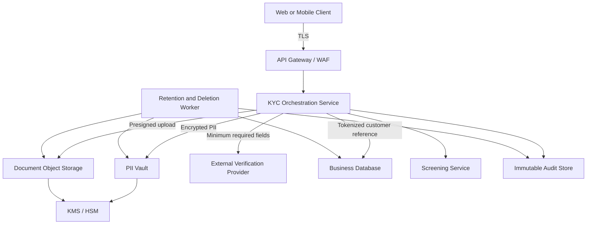
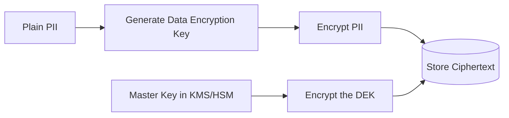
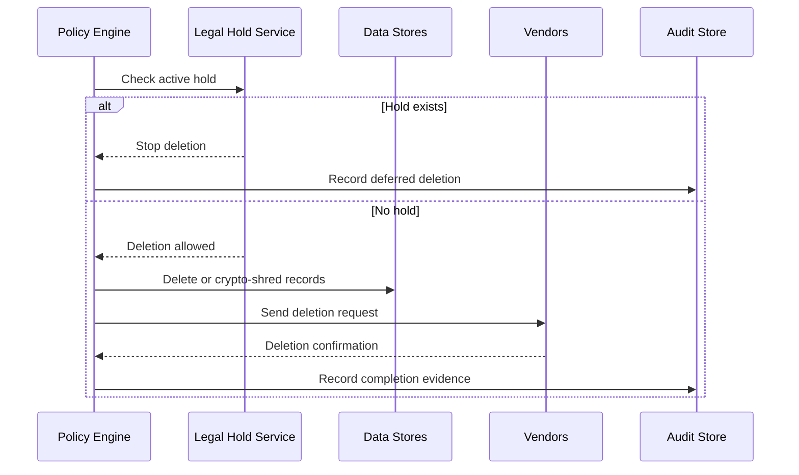
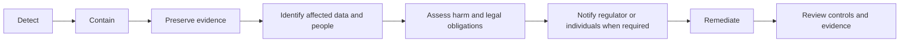

# Handling PII and KYC Data

> **Category:** Security  
> **Audience:** Developers with 3+ years of experience  
> **Last reviewed:** 3 August 2026  
> **Scope:** Secure collection, verification, storage, access, sharing, retention, and deletion of Personally Identifiable Information (PII) and Know Your Customer (KYC) data.

---

# 1. Overview

PII and KYC systems handle information that can identify a person, verify their identity, and assess their financial or regulatory risk.

Typical KYC workflows include:

- Collecting identity and address details
- Uploading documents such as a passport, driving licence, or proof of address
- Performing document authenticity checks
- Matching a selfie or live video with an identity document
- Screening against sanctions, politically exposed person, and adverse-media sources
- Assigning a customer risk level
- Performing periodic KYC updates
- Keeping evidence for regulatory audits

A secure KYC system must protect both:

1. **Privacy:** The customer should retain appropriate control over personal data.
2. **Security:** Attackers and unauthorized employees must not access or misuse the data.

Security should cover the complete data lifecycle—not only the database.

---

# 2. PII and KYC Data

## 2.1 What Is PII?

**Personally Identifiable Information (PII)** is information that identifies a person directly or can identify them when combined with other information.

### Direct identifiers

- Full name
- Passport number
- Aadhaar number
- PAN
- Driving-licence number
- Email address
- Phone number
- Customer identity number
- Biometric template

### Indirect or linkable identifiers

- Date of birth
- Gender
- Postal code
- Device identifier
- IP address
- Employment details
- Transaction pattern
- Location history

A single indirect field may not identify a person. Several fields combined may do so.

```text
Date of birth + postal code + employer
                    │
                    ▼
        May identify one specific person
```

## 2.2 What Is KYC Data?

KYC data is information collected to establish and verify a customer's identity and assess regulatory risk.

It commonly includes:

| Category | Examples |
|---|---|
| Identity data | Name, date of birth, nationality |
| Government identifiers | Passport, PAN, Aadhaar, driving licence |
| Address data | Residential address, proof-of-address document |
| Contact data | Phone number, email |
| Document images | Passport scan, ID card image, utility bill |
| Biometric data | Selfie, face template, liveness result |
| Financial profile | Occupation, income range, source of funds |
| Screening results | Sanctions, PEP, adverse-media match |
| Risk information | Customer risk rating and reasons |
| Verification evidence | Vendor response, verification score, reviewer decision |
| Audit information | Who reviewed the case, when, and why |

KYC data is usually a combination of PII, sensitive evidence, regulatory records, and derived risk information.

## 2.3 PII vs KYC Data

| Aspect | PII | KYC Data |
|---|---|---|
| Main purpose | Identifies or relates to a person | Verifies identity and assesses risk |
| Examples | Name, email, phone | ID document, selfie, sanctions result |
| Can exist outside finance? | Yes | Usually in regulated onboarding |
| Regulatory retention | Depends on purpose and law | Often subject to AML/KYC recordkeeping |
| Risk if leaked | Identity theft and privacy harm | Identity theft, account takeover, fraud, regulatory exposure |
| May include derived decisions? | Sometimes | Commonly includes risk scores and reviewer decisions |

> **Important:** Every KYC record normally contains PII, but not every PII record is a KYC record.

---

# 3. Why KYC Data Needs Strong Protection

KYC records are highly valuable because they may contain enough information to impersonate a real person.

A single compromised KYC case can expose:

- A government identity document
- A photograph or biometric
- A signature
- A residential address
- A phone number and email
- Financial information
- Verification and risk-assessment results

This creates several threats:

| Threat | Possible impact |
|---|---|
| Identity theft | Fraudulent accounts, loans, SIM cards, or transactions |
| Account takeover | Criminal gains control of the customer's account |
| Insider misuse | Employee accesses celebrity or high-value customer data |
| Document resale | Stolen IDs are sold or reused |
| Extortion | Sensitive financial or identity information is exposed |
| Discrimination | Risk or screening decisions are misused |
| Regulatory action | Penalties, remediation orders, and audit findings |
| Loss of trust | Customers stop using the service |

KYC security is therefore not simply “encrypt the database.” It requires controlled collection, isolated storage, limited access, full auditing, retention rules, and incident response.

---

# 4. Core Data-Protection Principles

## 4.1 Purpose Limitation

Collect and use data only for a defined, communicated purpose.

```text
Valid:
Collect passport number to verify identity.

Invalid:
Reuse the passport image for product analytics without an appropriate basis.
```

## 4.2 Data Minimization

Collect the minimum data needed to meet business and regulatory requirements.

Examples:

- Store the customer's age or age-verification result when the exact date of birth is unnecessary.
- Store a verification result instead of retaining every intermediate image indefinitely.
- Retrieve KYC data from an authorized registry when permitted instead of repeatedly collecting documents.

## 4.3 Accuracy

KYC data must remain correct and current because inaccurate data can cause:

- Incorrect sanctions matches
- Wrong risk classifications
- Failed payments or account restrictions
- Regulatory non-compliance
- Unfair customer decisions

## 4.4 Storage Limitation

Do not keep data forever by default.

Retention should be based on:

- Legal and regulatory requirements
- Active customer relationship
- Fraud-investigation needs
- Dispute or legal-hold requirements
- Explicitly approved business needs

## 4.5 Security Safeguards

Use technical and organizational controls appropriate to the sensitivity of the data.

Typical safeguards include:

- Encryption
- Tokenization
- Least-privilege access
- Multi-factor authentication
- Data masking
- Audit logging
- Network isolation
- Secure deletion
- Vendor governance

## 4.6 Transparency and Consent

The user should understand:

- What data is collected
- Why it is required
- Who receives it
- How long it is retained
- How to exercise privacy rights
- Whether automated processing is involved

Consent must not be bundled unnecessarily. However, KYC processing may also rely on legal obligations rather than consent alone. The correct basis depends on jurisdiction and use case.

## 4.7 Accountability

The organization should be able to demonstrate:

- Which data it holds
- Why it holds the data
- Who accessed it
- Which controls protect it
- When it will be deleted
- How incidents are handled

---

# 5. PII and KYC Data Lifecycle


Security requirements change during each stage.

| Lifecycle stage | Main controls |
|---|---|
| Collection | TLS, safe UI, consent/notice, minimization |
| Processing | Isolated services, vendor authentication, input validation |
| Verification | Document checks, liveness, reviewer controls |
| Storage | Encryption, tokenization, key management |
| Access | RBAC/ABAC, MFA, masking, approvals |
| Sharing | Data-processing agreement, field minimization |
| Retention | Automated policy engine, legal holds |
| Deletion | Cryptographic erasure, backup expiry, evidence |

---

# 6. Secure KYC Architecture

A good design separates raw PII from normal business data.



## Recommended separation

### Business database

Store:

- Customer ID
- KYC status
- Risk level
- Verification timestamps
- Tokenized references
- Non-sensitive workflow state

Avoid storing:

- Raw document images
- Full government identifier
- Unmasked biometric data
- Vendor payloads containing unnecessary PII

### PII vault

Store highly sensitive structured fields:

- Full legal name
- Government identifier
- Date of birth
- Address
- Contact details

The vault should provide:

- Field-level encryption
- Strict service-to-service authorization
- Access auditing
- Masked responses by default
- Key rotation support

### Document storage

Store uploaded files in private object storage with:

- Server-side encryption using managed keys
- Public access disabled
- Short-lived presigned URLs
- Malware scanning
- Content-type validation
- Randomized object names
- Versioning and lifecycle rules
- Separate buckets or prefixes by environment and sensitivity

### Audit store

Store security-relevant events without storing raw PII.

Example:

```json
{
  "event": "KYC_DOCUMENT_VIEWED",
  "actor_id": "employee_7281",
  "customer_ref": "cus_91c82",
  "case_id": "kyc_8f201",
  "reason": "MANUAL_REVIEW",
  "timestamp": "2026-08-03T05:40:15Z",
  "source_ip": "tokenized-or-approved-security-value",
  "result": "ALLOWED"
}
```

---

# 7. Secure Data Collection

## 7.1 Collect Only Required Data

Build a field inventory before creating the form.

| Field | Purpose | Required? | Retention | Sensitivity |
|---|---|---:|---|---|
| Full legal name | Identity verification | Yes | KYC policy | High |
| Date of birth | Identity and age check | Yes | KYC policy | High |
| Marketing preference | Marketing | No | Until withdrawal | Medium |
| Passport image | Document verification | Conditional | KYC policy | Very high |
| Device fingerprint | Fraud prevention | Conditional | Short, risk-based | High |

Each collected field should have an owner and a documented purpose.

## 7.2 Consent, Notice, and Purpose

Before collection, display a clear notice describing:

- The organization collecting the data
- Exact purpose of KYC processing
- Required and optional fields
- Third-party verification providers
- Retention approach
- User rights and grievance contact
- Consequences of not supplying mandatory KYC data

Keep evidence of the notice version shown to the customer.

```text
customer_id
notice_version
purpose_code
consent_or_legal_basis
captured_at
channel
```

Do not treat a checked box as the only compliance control. The backend must enforce the permitted processing purpose.

## 7.3 Secure Document Upload

KYC upload endpoints are attractive attack targets.

Apply the following controls:

1. Authenticate and authorize the uploader.
2. Allow only required file types.
3. Validate extension, MIME type, and file signature.
4. Rename files using generated identifiers.
5. Apply file-size and page-count limits.
6. Scan files for malware.
7. Reject encrypted archives unless explicitly supported.
8. Remove unnecessary metadata when legally and operationally acceptable.
9. Store files outside the public web root.
10. Return short-lived access URLs rather than public object URLs.
11. Use content-disposition headers for downloads.
12. Prevent active content from executing in reviewer browsers.

Example storage path:

```text
Bad:
kyc-documents/rahul_passport_1234.pdf

Better:
kyc-documents/2026/08/tenant_7/case_83/document_4f0c2.bin
```

The original filename may contain PII and should not become the storage key or log value.

## 7.4 Identity Proofing

Identity proofing answers two different questions:

```text
Resolution: Does this claimed identity exist?
Validation: Is the evidence genuine and accurate?
Verification: Does the person presenting it own that identity?
```

A risk-based flow may use:

- Trusted digital identity or registry lookup
- Document authenticity checks
- Face comparison
- Presentation-attack or liveness detection
- Phone or email ownership verification
- Address verification
- Manual review
- Enhanced due diligence for high-risk cases

The latest NIST SP 800-63A-4 defines three Identity Assurance Levels. The suitable level should be chosen based on harm if identity proofing fails—not simply on implementation convenience.

### Avoid treating a vendor score as an absolute truth

A verification score is one input.

```text
Vendor confidence
      +
Document validity
      +
Liveness result
      +
Customer risk
      +
Manual-review policy
      =
Final KYC decision
```

Keep threshold configuration versioned and auditable.

---

# 8. Secure Storage and Cryptography

## 8.1 Encryption in Transit

Use modern TLS for:

- Client-to-API communication
- Service-to-service calls
- Database connections
- Object-storage access
- Vendor integrations
- Event streams
- Backup transfers

For internal sensitive services, consider mutual TLS or workload identity.

Never send PII through:

- Query strings
- URL paths
- Unencrypted email
- Public chat tools
- Client-side analytics events
- Error-monitoring breadcrumbs without redaction

## 8.2 Encryption at Rest

Encrypt:

- Database volumes
- Sensitive database columns
- Object-storage documents
- Search indexes
- Message queues
- Cache values containing PII
- Backups and snapshots
- Analytics exports

Disk encryption alone is insufficient because an application or compromised database account may still read plaintext data.

Use field-level or application-level encryption for highly sensitive values.

## 8.3 Envelope Encryption

Envelope encryption separates data encryption from master-key protection.



Stored record:

```json
{
  "ciphertext": "base64-value",
  "encrypted_dek": "base64-value",
  "key_id": "kms-key-kyc-prod-v3",
  "algorithm": "approved-aead-algorithm",
  "encryption_context": {
    "tenant_id": "tenant_7",
    "record_type": "kyc_identity"
  }
}
```

Recommended practices:

- Keep master keys in KMS or HSM.
- Separate production and non-production keys.
- Restrict decrypt permission more heavily than encrypt permission.
- Use authenticated encryption.
- Rotate key-encryption keys.
- Record key use in audit logs.
- Test recovery before relying on encrypted backups.

## 8.4 Tokenization and Pseudonymization

Tokenization replaces a sensitive value with a non-sensitive reference.

```text
PAN: ABCDE1234F
        │
        ▼
Token: tok_pan_8d4a77
```

The business database uses the token. Only the PII vault can resolve it.

Benefits:

- Smaller breach scope
- Reduced exposure in application services
- Safer event payloads
- Easier access control
- Better separation between analytics and identity data

Pseudonymized data can still be personal data when it can be linked back to a person.

## 8.5 Hashing Limitations

Hashing is useful for comparison when the original value does not need to be recovered.

Examples:

- Detect whether a normalized identifier was seen previously
- Identify duplicate documents
- Compare a known value without exposing it directly

However, identifiers often have a small and predictable value space. A plain hash of a phone number, PAN, or national ID can be guessed.

Use:

- A keyed hash such as HMAC
- A secret key stored separately
- Normalized input
- Key-version tracking

```python
import hashlib
import hmac

def identifier_fingerprint(value: str, key: bytes) -> str:
    normalized = "".join(value.upper().split())
    return hmac.new(
        key,
        normalized.encode("utf-8"),
        hashlib.sha256,
    ).hexdigest()
```

Do not use reversible encryption and call it hashing. Do not use a password-hashing algorithm merely to make searchable identifiers without understanding operational and privacy requirements.

---

# 9. Access Control

KYC access should follow **least privilege** and **need to know**.

## 9.1 RBAC and ABAC together

### Role-Based Access Control

Examples:

- KYC analyst
- KYC supervisor
- Compliance officer
- Support agent
- Security investigator
- Platform administrator

### Attribute-Based Access Control

Evaluate context such as:

- Employee's region
- Customer's jurisdiction
- Assigned case
- Data sensitivity
- Access purpose
- Device trust
- Time of day
- Approval state

Example decision:

```text
ALLOW document_view when:
    role = KYC_ANALYST
AND case_assigned_to = actor
AND purpose = MANUAL_REVIEW
AND device_trust = MANAGED
AND session_mfa = VERIFIED
```

## 9.2 Important controls

- Require MFA for all privileged and reviewer accounts.
- Use SSO and centralized identity management.
- Disable shared accounts.
- Use just-in-time privileged access.
- Apply maker-checker approval for sensitive changes.
- Mask fields unless full access is necessary.
- Prevent bulk export by default.
- Alert on unusual viewing or download patterns.
- Immediately revoke access after role change or termination.
- Review permissions periodically.
- Use break-glass access only with justification and enhanced audit.

### Masking example

```text
PAN:     ABCDE1234F  →  ABCD*****F
Aadhaar: 123412341234 → XXXX-XXXX-1234
Phone:   9876543210   →  ******3210
Email:   user@example.com → u***@example.com
```

Masking is a presentation control, not a replacement for encryption.

---

# 10. API and Application Security

## 10.1 Keep PII out of URLs

Bad:

```http
GET /customers?aadhaar=123412341234
```

Better:

```http
POST /internal/identity-search
Content-Type: application/json

{
  "identifier_token": "tok_id_7a91"
}
```

URLs can be recorded in:

- Browser history
- Reverse-proxy logs
- CDN logs
- Monitoring tools
- Referer headers

## 10.2 Avoid PII in tokens

Do not put raw PII or KYC status details in a JWT merely because it is signed.

A signed JWT is generally readable unless separately encrypted.

Bad payload:

```json
{
  "sub": "customer-81",
  "passport_number": "P1234567",
  "risk_reason": "PEP_MATCH"
}
```

Better:

```json
{
  "sub": "customer-81",
  "scope": ["kyc:submit"],
  "session_id": "ses_721",
  "exp": 1785738000
}
```

## 10.3 Use response allowlists

Do not serialize database models directly.

```python
from pydantic import BaseModel

class KYCStatusResponse(BaseModel):
    customer_id: str
    status: str
    submitted_at: str | None
    next_action: str | None
```

The response deliberately excludes document paths, government IDs, vendor payloads, and reviewer notes.

## 10.4 Prevent enumeration

An attacker should not be able to discover whether a government identifier or email already exists.

Instead of:

```json
{
  "error": "PAN ABCDE1234F already belongs to customer 9248"
}
```

Return:

```json
{
  "error": "Unable to complete verification with the submitted details"
}
```

Internally record the detailed reason using a non-PII case reference.

## 10.5 Service-to-service protection

- Use workload identity rather than static API keys where possible.
- Give each service a separate identity.
- Restrict outbound network destinations.
- Sign or authenticate webhooks.
- Enforce replay protection.
- Use idempotency keys for submission operations.
- Apply schema validation.
- Set strict timeouts and retry limits.
- Do not automatically retry non-idempotent identity actions.

---

# 11. Logging, Monitoring, and Audit Trails

Logs are necessary for security and compliance, but they can become a second unprotected PII database.

## 11.1 Do not log

- Full identity document numbers
- Raw request or response bodies
- Document images or URLs
- Access tokens
- Biometric data
- Full addresses
- Passwords or OTPs
- Vendor payloads
- Unredacted screening results
- Encryption keys or decrypted values

## 11.2 Log security events

- KYC submission created
- Verification started and completed
- Manual review assigned
- Sensitive document viewed
- Data exported
- Risk level changed
- Override approved
- Privacy request received
- Record placed on legal hold
- Record deleted
- Access denied
- Suspicious bulk access detected

## 11.3 Use an allowlist logger

```python
from typing import Any

ALLOWED_FIELDS = {
    "event",
    "actor_id",
    "customer_ref",
    "case_id",
    "result",
    "reason_code",
    "timestamp",
}

def safe_log_payload(payload: dict[str, Any]) -> dict[str, Any]:
    return {
        key: payload[key]
        for key in ALLOWED_FIELDS
        if key in payload
    }
```

An allowlist is safer than trying to blacklist every possible sensitive field.

## 11.4 Protect audit logs

Audit logs should be:

- Append-only or tamper-evident
- Time-synchronized
- Access-controlled
- Centrally monitored
- Retained under an approved policy
- Protected during transmission
- Separate from application administrators where practical

The audit trail should capture **who, what, when, why, and result**.

---

# 12. Third-Party KYC Providers

External providers may perform:

- Document verification
- Face matching
- Liveness detection
- Sanctions screening
- Address verification
- Bank-account verification
- Digital identity or registry access

The organization remains responsible for how customer data is shared and protected.

## 12.1 Vendor evaluation

Review:

- Data locations and subprocessors
- Security certifications and independent reports
- Encryption and key-management model
- Tenant isolation
- Data-retention defaults
- Use of customer data for model training
- Breach-notification commitments
- Deletion and return-of-data process
- Access-control model
- Availability and disaster recovery
- Regulatory support
- Audit rights
- Exit strategy

## 12.2 Share minimum required fields

Bad:

```json
{
  "complete_customer_record": "...",
  "all_documents": "...",
  "internal_notes": "...",
  "transaction_history": "..."
}
```

Better:

```json
{
  "case_reference": "kyc_8f201",
  "document_type": "PASSPORT",
  "document_image": "short-lived-upload-reference",
  "declared_name": "encrypted-or-required-value",
  "declared_date_of_birth": "required-value"
}
```

## 12.3 Webhook security

- Verify signatures.
- Validate timestamp and replay window.
- Use a unique secret or asymmetric key per environment.
- Store the raw event only when required and protected.
- Use an idempotency key.
- Fetch sensitive results through an authenticated API instead of placing them in the webhook.
- Reject unexpected event types and fields.

---

# 13. Retention, Re-KYC, and Secure Deletion

Retention is a policy decision implemented as code.

## 13.1 Retention matrix

| Data type | Example retention trigger | Typical action |
|---|---|---|
| Abandoned onboarding | Short period after abandonment | Delete documents and sensitive fields |
| Active KYC record | Relationship active | Retain under KYC/AML policy |
| Closed account | Regulatory retention period | Restrict access, then delete |
| Failed upload | Very short operational period | Automatically delete |
| Debug data | Hours or days | Delete rapidly |
| Audit record | Compliance policy | Retain minimal event metadata |
| Legal hold | Until hold is released | Suspend deletion |
| Vendor copy | Contractual/regulatory period | Verify deletion through vendor |

Do not copy legal retention periods from another company or jurisdiction. Obtain an approved policy from legal and compliance teams.

## 13.2 Re-KYC

Periodic KYC updating should be risk-based.

Under RBI's KYC direction updated on 14 August 2025, minimum periodic-updation frequencies include:

- At least once every **2 years** for high-risk customers
- At least once every **8 years** for medium-risk customers
- At least once every **10 years** for low-risk customers

These are regulatory minimums for covered regulated entities. Internal policy may require additional measures where justified.

Re-KYC should not require unnecessary document recollection when an approved self-declaration, trusted registry record, or authorized digital method is sufficient.

## 13.3 Secure deletion

Deletion must cover:

- Primary databases
- Read replicas
- Object storage
- Search indexes
- Caches
- Queues
- Analytics copies
- Data lakes
- Temporary files
- Vendor systems
- Backups after their lifecycle expires

A deletion workflow may look like this:



For encrypted data, destroying the dedicated encryption key can support cryptographic erasure, but this must be designed carefully. Shared keys may prevent deletion of only one customer's data.

---

# 14. KYC Risk Classification

KYC commonly follows a risk-based approach.

## 14.1 Customer Due Diligence levels

### Simplified Due Diligence

Used only where regulations and documented low risk allow it.

### Standard Customer Due Diligence

Normal identity verification, screening, and risk assessment.

### Enhanced Due Diligence

Additional checks for higher-risk situations, such as:

- High-risk geography
- Politically exposed person relationship
- Complex ownership structure
- Non-face-to-face risk
- Unusual source of funds
- Sanctions or adverse-media indicators
- High-risk product or transaction pattern

## 14.2 Risk model

```text
Customer risk
+ Geographic risk
+ Product risk
+ Channel risk
+ Ownership risk
+ Transaction behaviour
= Overall risk classification
```

Risk scores should not be opaque magic numbers.

Store:

- Model or rule version
- Input categories
- Reason codes
- Reviewer decision
- Override justification
- Approval evidence
- Effective timestamp

Do not expose internal fraud or AML rules directly to customers when doing so would weaken controls. At the same time, customer-impacting decisions should have appropriate human review and governance.

RBI guidance states that rejection of KYC or periodic-updation applications should not be fully automated and should be reviewed by an authorized official for covered regulated entities.

---

# 15. Data Subject Rights and Privacy Requests

A privacy-rights workflow may support:

- Access or summary request
- Correction
- Update
- Erasure where applicable
- Consent withdrawal
- Grievance handling
- Nomination or authorized representative
- Processing information

## Secure request flow

1. Verify the requester without recollecting excessive data.
2. Create a privacy-request case.
3. Locate data across approved systems.
4. Apply regulatory exemptions and retention obligations.
5. Redact information belonging to other people.
6. Deliver the response securely.
7. Record completion evidence.
8. Update or delete data where required.
9. Propagate the change to vendors and replicas.

Do not send a full KYC export as a normal email attachment.

Use a protected portal, strong authentication, limited download time, and additional verification for high-risk exports.

---

# 16. Incident Response for PII Breaches

A PII incident may involve:

- Unauthorized access
- Accidental email or export
- Public object-storage exposure
- Stolen credentials
- Malicious insider access
- Vendor breach
- Lost device
- Exposed logs
- Incorrect customer-data mapping
- Ransomware or data exfiltration

## Response flow



## Information to establish quickly

- Which systems were affected?
- What data fields were exposed?
- Was the data encrypted?
- Were encryption keys compromised?
- How many people were affected?
- Which jurisdictions apply?
- Is the exposure continuing?
- Was data merely accessed or also exfiltrated?
- Which vendors or regulators must be contacted?
- What action can reduce customer harm?

India's DPDP framework requires prompt, plain-language communication to affected individuals for personal-data breaches, following applicable rules and timelines. The incident process should already have approved templates, owners, and escalation paths.

Never delay containment while trying to produce a perfect impact count.

---

# 17. Practical Implementation Examples

## 17.1 Separate business and identity models

```python
from dataclasses import dataclass
from datetime import datetime
from enum import StrEnum


class KYCStatus(StrEnum):
    PENDING = "pending"
    IN_REVIEW = "in_review"
    VERIFIED = "verified"
    REJECTED = "rejected"


@dataclass(frozen=True)
class CustomerKYC:
    customer_id: str
    pii_token: str
    document_set_token: str | None
    status: KYCStatus
    risk_level: str
    policy_version: str
    verified_at: datetime | None
```

The business object holds references, not raw government identifiers or images.

## 17.2 Example database structure

```sql
CREATE TABLE customer_kyc (
    id UUID PRIMARY KEY,
    customer_id UUID NOT NULL UNIQUE,
    pii_token TEXT NOT NULL,
    document_set_token TEXT,
    status TEXT NOT NULL,
    risk_level TEXT NOT NULL,
    policy_version TEXT NOT NULL,
    verified_at TIMESTAMPTZ,
    created_at TIMESTAMPTZ NOT NULL DEFAULT now(),
    updated_at TIMESTAMPTZ NOT NULL DEFAULT now()
);

CREATE TABLE kyc_access_audit (
    id UUID PRIMARY KEY,
    actor_id UUID NOT NULL,
    customer_ref UUID NOT NULL,
    action TEXT NOT NULL,
    purpose_code TEXT NOT NULL,
    result TEXT NOT NULL,
    occurred_at TIMESTAMPTZ NOT NULL DEFAULT now()
);
```

A separate protected store maps `pii_token` to encrypted PII.

## 17.3 Safe display model

```python
from pydantic import BaseModel


class MaskedIdentityResponse(BaseModel):
    full_name: str
    document_type: str
    masked_document_number: str
    verification_status: str
```

Only a dedicated privileged endpoint should return full values, and that access should require a reason and produce an audit event.

## 17.4 Redaction utility

```python
def mask_identifier(value: str, visible_suffix: int = 4) -> str:
    if not value:
        return ""

    normalized = value.strip()

    if len(normalized) <= visible_suffix:
        return "*" * len(normalized)

    hidden_length = len(normalized) - visible_suffix
    return ("*" * hidden_length) + normalized[-visible_suffix:]


assert mask_identifier("123412341234") == "********1234"
```

## 17.5 Purpose-aware access request

```json
{
  "customer_ref": "cus_91c82",
  "fields": ["legal_name", "document_number"],
  "purpose": "KYC_MANUAL_REVIEW",
  "case_id": "kyc_8f201",
  "approval_id": "apr_7182"
}
```

The PII service should verify:

- Calling service identity
- Employee identity
- Purpose
- Case assignment
- Approval requirement
- Requested fields
- Rate limits
- Session assurance

## 17.6 Environment-safe test data

Never copy production KYC data into development or staging.

Use synthetic identities:

```json
{
  "full_name": "Test Customer 0042",
  "document_number": "TEST-PASS-0042",
  "date_of_birth": "1990-01-01",
  "address": "42 Example Street, Test City"
}
```

Where realistic document images are required, generate clearly fictional documents with non-real identifiers and visible test markings.

---

# 18. Testing and Operational Controls

## 18.1 Security testing

Test:

- Broken object-level authorization
- Broken function-level authorization
- ID enumeration
- Mass assignment
- Excessive data exposure
- Unsafe file upload
- Malware scanning bypass
- Presigned URL lifetime and scope
- SSRF through document URLs
- Webhook signature bypass
- Replay attacks
- PII in logs and monitoring tools
- Cache leakage
- Cross-tenant access
- CSV or spreadsheet injection in exports
- Backup restoration permissions
- Deletion propagation
- Privileged-user monitoring

## 18.2 Privacy testing

Verify:

- Optional fields are actually optional.
- Withdrawn consent stops the related optional processing.
- Access requests return only the correct customer's data.
- Correction updates downstream systems.
- Deletion respects legal holds.
- Retention jobs delete expired data.
- Vendor deletion is tracked.
- Analytics datasets cannot easily re-identify users.
- Non-production systems contain no real customer PII.

## 18.3 Operational metrics

Useful metrics include:

- KYC completion rate
- Verification failure by reason code
- Manual-review rate
- False-positive screening rate
- Cases waiting beyond SLA
- Privileged PII access count
- Bulk-export attempts
- Records past retention date
- Vendor deletion failures
- Privacy requests approaching SLA
- Data-access anomalies
- Incident detection and containment time

Avoid dashboards that expose raw PII.

---

# 19. Compliance Context

> This section provides engineering context, not legal advice. Applicability depends on organization type, jurisdiction, product, and customer relationship.

## 19.1 India: DPDP Act and Rules

As of 3 August 2026:

- The Digital Personal Data Protection Act was enacted in 2023.
- The DPDP Rules, 2025 were notified in November 2025.
- The notified framework includes an 18-month phased compliance timeline.
- Core themes include clear notice, purpose limitation, data minimization, accuracy, storage limitation, security safeguards, accountability, user rights, and breach communication.

Engineering implications:

- Maintain data inventories and purposes.
- Implement privacy-request workflows.
- Use clear notices.
- Apply reasonable security safeguards.
- Build breach-notification readiness.
- Support correction and erasure subject to legal obligations.
- Track processors and vendors.

## 19.2 India: RBI KYC Direction

RBI's Master Direction on KYC, updated on 14 August 2025, provides requirements for covered regulated entities.

Relevant engineering topics include:

- Customer identification and due diligence
- V-CIP and non-face-to-face onboarding controls
- CKYCR use
- Explicit consent before downloading CKYCR records
- Risk-based periodic KYC updates
- Enhanced due diligence
- Audit trails for notices and updates
- Human review for rejection decisions

## 19.3 FATF

FATF promotes a risk-based approach to customer due diligence and digital identity.

For digital identity, regulated entities should understand:

- Technology and architecture
- Governance
- Assurance level
- Independence and reliability
- Risk that the identity system could facilitate financial crime

## 19.4 GDPR

For EU-related processing, GDPR principles commonly relevant to KYC systems include:

- Lawfulness, fairness, and transparency
- Purpose limitation
- Data minimization
- Accuracy
- Storage limitation
- Integrity and confidentiality
- Accountability
- Data-subject rights
- Privacy by design and by default

AML/KYC retention obligations may limit immediate deletion, so privacy and compliance teams must define the correct response.

## 19.5 NIST and OWASP

Useful engineering references include:

- NIST SP 800-63A-4 for identity proofing and enrollment
- NIST SP 800-122 for protecting PII confidentiality
- OWASP File Upload Cheat Sheet
- OWASP Logging Cheat Sheet
- OWASP API Security guidance

These are not substitutes for applicable laws, but they provide practical control guidance.

---

# 20. Production Checklist

## Collection

- [ ] Every field has an approved purpose.
- [ ] Required and optional fields are clearly separated.
- [ ] Notice version and processing basis are recorded.
- [ ] PII is never sent in URLs or analytics events.
- [ ] Document upload validates type, signature, size, and malware status.

## Storage

- [ ] Highly sensitive PII is isolated from the business database.
- [ ] Encryption is enabled in transit and at rest.
- [ ] Field-level protection is used where needed.
- [ ] Keys are held in KMS or HSM.
- [ ] Production and non-production keys are separate.
- [ ] Backups are encrypted and access-controlled.

## Access

- [ ] Reviewer access uses SSO and MFA.
- [ ] RBAC and contextual authorization are enforced.
- [ ] Full PII is hidden by default.
- [ ] Document viewing and exports are audited.
- [ ] Bulk access is restricted and monitored.
- [ ] Privileged access is temporary and reviewable.

## Application

- [ ] APIs return allowlisted fields.
- [ ] JWTs contain no raw PII.
- [ ] Error responses do not reveal identities.
- [ ] Webhooks use signature and replay validation.
- [ ] Vendor payloads are minimized.
- [ ] Logs use allowlisted fields and redaction.

## Retention and privacy

- [ ] Each data category has an approved retention rule.
- [ ] Abandoned and failed onboarding data expires quickly.
- [ ] Legal holds prevent required records from being deleted.
- [ ] Deletion propagates to vendors and secondary stores.
- [ ] Privacy-request workflows are tested.
- [ ] No production PII is used in lower environments.

## Incident readiness

- [ ] PII incidents have defined owners and escalation paths.
- [ ] Data inventory supports fast impact analysis.
- [ ] Breach communication templates exist.
- [ ] Vendor incidents are included in response plans.
- [ ] Audit evidence is protected and searchable.

---

# 21. Key Takeaways

1. Treat KYC data as one of the highest-sensitivity data categories in the system.
2. Store raw PII separately from normal business records.
3. Collect only fields required for a documented purpose.
4. Use encryption, tokenization, strict key management, and private document storage.
5. Apply RBAC together with contextual authorization and full audit trails.
6. Keep PII out of URLs, JWTs, logs, error messages, analytics, and lower environments.
7. Treat third-party KYC vendors as part of the security boundary.
8. Implement retention and deletion as automated, testable workflows.
9. Use risk-based identity proofing and enhanced due diligence where required.
10. Build privacy rights and breach response into the platform rather than handling them manually after launch.

---

# 22. Official References

1. **Digital Personal Data Protection Act, 2023 — MeitY**  
   https://www.meity.gov.in/content/digital-personal-data-protection-act-2023

2. **Digital Personal Data Protection Rules, 2025 — MeitY**  
   https://www.meity.gov.in/documents/act-and-policies/digital-personal-data-protection-rules-2025-gDOxUjMtQWa

3. **Government notifies DPDP Rules, 2025 — Press Information Bureau**  
   https://www.pib.gov.in/PressReleasePage.aspx?PRID=2190014

4. **RBI Master Direction — Know Your Customer Direction, 2016, updated 14 August 2025**  
   https://www.rbi.org.in/commonman/english/scripts/notification.aspx?id=2607

5. **RBI FAQs on Master Direction on KYC**  
   https://www.rbi.org.in/commonman/english/Scripts/FAQs.aspx?Id=3782

6. **FATF Guidance on Digital Identity**  
   https://www.fatf-gafi.org/en/publications/Financialinclusionandnpoissues/Digital-identity-guidance.html

7. **NIST SP 800-63A-4 — Identity Proofing and Enrollment**  
   https://csrc.nist.gov/pubs/sp/800/63/A/4/final

8. **NIST SP 800-122 — Protecting the Confidentiality of PII**  
   https://csrc.nist.gov/pubs/sp/800/122/final

9. **GDPR official text — EUR-Lex**  
   https://eur-lex.europa.eu/eli/reg/2016/679/oj/eng

10. **OWASP File Upload Cheat Sheet**  
    https://cheatsheetseries.owasp.org/cheatsheets/File_Upload_Cheat_Sheet.html

11. **OWASP Logging Cheat Sheet**  
    https://cheatsheetseries.owasp.org/cheatsheets/Logging_Cheat_Sheet.html
