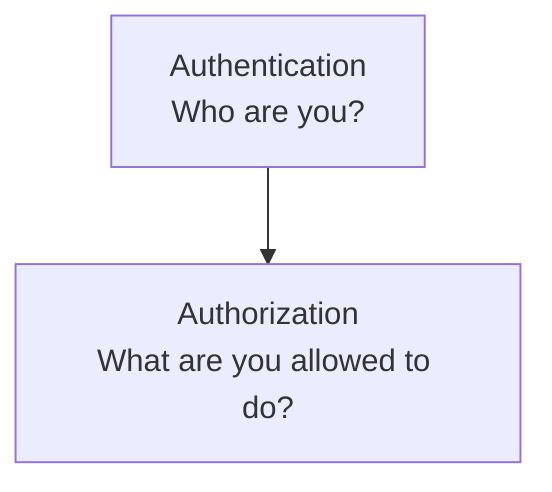
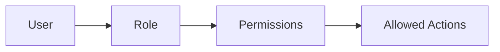
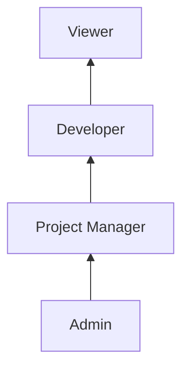
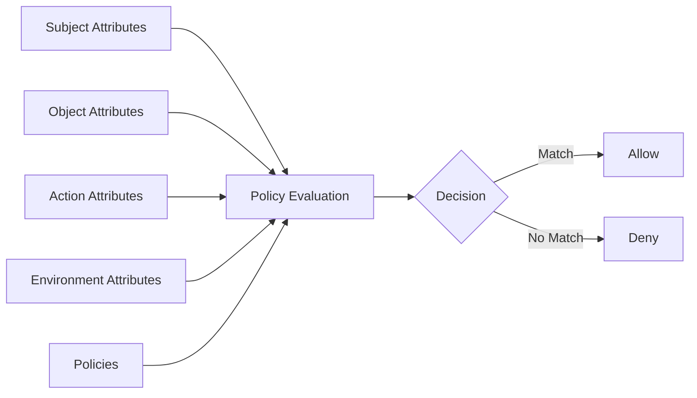
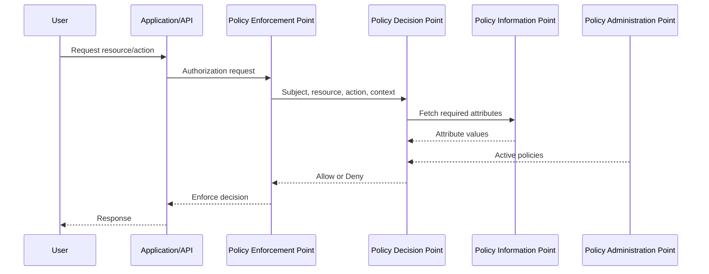
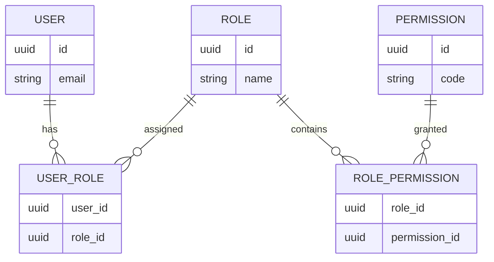
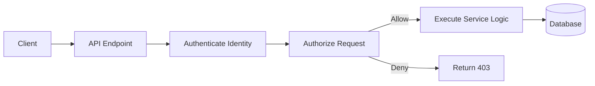

# RBAC vs ABAC

> **Category:** Security  
> **Audience:** Developers with 3+ years of experience  
> **Last reviewed:** 3 August 2026

---

# 1. Access Control in Simple Terms

**Access control** decides:

> **Who can perform which action on which resource, under what conditions?**

For example:

- Can this user view an invoice?
- Can this manager approve a payment?
- Can this developer deploy to production?
- Can this doctor access this patient's medical record?
- Can this employee download confidential data from an unmanaged device?

Access control is part of **authorization**, not authentication.



Two commonly used authorization models are:

- **RBAC — Role-Based Access Control**
- **ABAC — Attribute-Based Access Control**

The main difference is straightforward:

```text
RBAC checks the user's role.

ABAC evaluates attributes and policies.
```

---

# 2. Role-Based Access Control (RBAC)

## 2.1 How RBAC Works

In RBAC, permissions are assigned to **roles**, and roles are assigned to users.

A user receives permissions through their assigned roles.



Example:

```text
User: Avadh
Role: Project Manager
Permissions:
- View project
- Edit project
- Assign tasks
- View reports
```

The application does not normally assign every permission directly to Avadh. It assigns the **Project Manager** role, which already contains those permissions.

NIST describes RBAC as controlling access through roles that represent organizational functions. Permissions may also be inherited through a role hierarchy.

---

## 2.2 Core RBAC Components

### User

The person, service account, or system identity requesting access.

```text
User: developer@example.com
```

### Role

A named collection of responsibilities or job functions.

```text
Admin
Manager
Developer
Support Agent
Viewer
```

### Permission

A specific allowed action.

```text
project.read
project.update
user.create
invoice.approve
production.deploy
```

### Resource

The object being accessed.

```text
Project
Invoice
Customer
Server
Document
```

### User–Role Assignment

The relationship between a user and one or more roles.

| User | Assigned role |
|---|---|
| Alice | Admin |
| Bob | Developer |
| Carol | Viewer |

### Role–Permission Assignment

The relationship between a role and its permissions.

```text
Developer:
- repository.read
- repository.write
- deployment.create

Viewer:
- repository.read
```

---

## 2.3 RBAC Example

Consider a project-management application.

### Roles and permissions

| Role | Permissions |
|---|---|
| Admin | Manage users, projects, billing, and settings |
| Project Manager | Create projects, assign tasks, view reports |
| Developer | View projects, update assigned tasks |
| Viewer | View projects and reports |

### Authorization decision

```text
Request:
User = Bob
Action = update_task
Resource = Task #501

Bob's roles:
- Developer

Developer permissions:
- task.read
- task.update

Decision:
ALLOW
```

A simplified code check might look like this:

```python
if user.has_permission("task.update"):
    update_task()
else:
    raise PermissionError("Access denied")
```

A less maintainable implementation directly checks the role:

```python
if user.role in {"admin", "project_manager", "developer"}:
    update_task()
```

The permission-based approach is usually better because business capabilities can change without rewriting every role check.

---

## 2.4 Role Hierarchy and Constraints

### Role hierarchy

A senior role may inherit permissions from a junior role.



Example:

| Role | Inherits | Effective permissions |
|---|---|---|
| Viewer | — | project.read |
| Developer | Viewer | project.read, task.update |
| Project Manager | Developer | project.read, task.update, project.create, task.assign |

Role hierarchy reduces duplicate permission assignments, but deep hierarchies can become difficult to understand.

### Separation of duties

Some responsibilities should not be assigned to the same person.

Example:

```text
Payment Creator != Payment Approver
```

This reduces fraud and accidental misuse.

Two common forms are:

- **Static separation of duties:** A user cannot be assigned conflicting roles.
- **Dynamic separation of duties:** A user may hold both roles but cannot activate or use both within the same transaction or session.

### Cardinality constraints

A role may have a limited number of users.

```text
Maximum users with Super Admin role = 3
```

### Prerequisite roles

A user may need one role before receiving another.

```text
Required before Production Deployer:
- Developer
- Security Training Completed
```

The first condition fits RBAC. The training condition is dynamic and is usually more naturally represented with ABAC.

---

## 2.5 Advantages and Limitations

### Advantages of RBAC

#### Easy to understand

Roles map naturally to organizational responsibilities.

```text
Finance Manager
Support Agent
System Administrator
```

#### Simple administration

Administrators assign a role instead of managing many individual permissions.

#### Good for stable organizations

RBAC works well when job functions and access requirements do not change frequently.

#### Supports auditing

Auditors can inspect:

```text
Which users have the Admin role?
Which permissions belong to Finance Manager?
```

#### Widely supported

RBAC is built into many frameworks and platforms, including:

- Django groups and permissions
- Kubernetes RBAC
- Database roles
- Cloud IAM systems
- Enterprise identity providers

### Limitations of RBAC

#### Role explosion

As rules become more specific, teams create many narrowly defined roles.

```text
Project-A-Developer
Project-B-Developer
Project-A-Developer-ReadOnly
Project-A-Developer-Temporary
India-Project-A-Developer
```

This is called **role explosion**.

#### Weak support for contextual rules

A role alone cannot naturally express rules such as:

```text
Allow access only:
- during business hours
- from a managed device
- when user.department matches document.department
- when user.tenant_id matches resource.tenant_id
- when the resource belongs to the user's assigned region
```

#### Object-level authorization becomes awkward

A user may be allowed to update a project, but only projects they own or projects in their tenant.

A basic role check answers:

```text
Is this user a Project Manager?
```

It does not answer:

```text
Is this user allowed to update this particular project?
```

#### Permissions can become too broad

To avoid creating more roles, teams sometimes give an existing role additional permissions. This can violate the principle of least privilege.

---

# 3. Attribute-Based Access Control (ABAC)

## 3.1 How ABAC Works

ABAC makes authorization decisions by evaluating attributes against policies.

NIST defines ABAC as an access-control method in which authorization is determined by evaluating attributes associated with:

- The subject
- The object
- The requested operation
- Sometimes the environment



Example policy:

```text
Allow a user to edit a document when:

user.department == document.department
AND user.clearance >= document.classification
AND request.time is within business hours
AND device.trusted == true
```

ABAC evaluates the complete context rather than only a role name.

---

## 3.2 Types of Attributes

### Subject attributes

Properties of the identity requesting access.

```text
user.id
user.role
user.department
user.location
user.clearance_level
user.tenant_id
user.employment_status
user.training_completed
```

Example:

```json
{
  "id": "user-101",
  "role": "manager",
  "department": "finance",
  "clearance_level": 3,
  "tenant_id": "tenant-a"
}
```

### Object or resource attributes

Properties of the resource being accessed.

```text
document.owner_id
document.department
document.classification
project.tenant_id
invoice.amount
record.region
```

Example:

```json
{
  "id": "invoice-901",
  "department": "finance",
  "classification": 2,
  "tenant_id": "tenant-a",
  "amount": 40000
}
```

### Action attributes

Properties of the requested operation.

```text
read
create
update
delete
approve
download
deploy
```

Actions may also contain additional context:

```text
payment.approve
payment.amount
deployment.environment
export.format
```

### Environment attributes

Properties of the request environment.

```text
current_time
request_ip
country
device_trust
network_zone
authentication_strength
risk_score
```

Example:

```json
{
  "current_time": "14:30",
  "country": "IN",
  "device_trusted": true,
  "mfa_verified": true
}
```

---

## 3.3 ABAC Example

Consider a financial application.

### Requirement

A finance manager may approve an invoice only when:

1. The user and invoice belong to the same tenant.
2. The user belongs to the finance department.
3. The invoice amount is at most the user's approval limit.
4. The user has completed required compliance training.
5. The request comes from a trusted device.
6. MFA has been completed.

### Policy

```text
ALLOW invoice.approve IF:

subject.department == "finance"
AND subject.tenant_id == resource.tenant_id
AND resource.amount <= subject.approval_limit
AND subject.compliance_training == "completed"
AND environment.device_trusted == true
AND environment.mfa_verified == true
```

### Evaluation

```text
Subject:
- department = finance
- tenant_id = tenant-a
- approval_limit = 50,000
- compliance_training = completed

Resource:
- tenant_id = tenant-a
- amount = 40,000

Environment:
- device_trusted = true
- mfa_verified = true

Decision:
ALLOW
```

If the invoice amount changes to `75,000`, the decision becomes:

```text
DENY
Reason: resource.amount exceeds subject.approval_limit
```

No new role is needed.

---

## 3.4 Policy Evaluation Flow

A mature ABAC system is often described through these logical components:



### Policy Enforcement Point (PEP)

Intercepts the request and enforces the decision.

Examples:

- API middleware
- API gateway
- Reverse proxy
- Service method
- Database access layer

### Policy Decision Point (PDP)

Evaluates the policy and returns:

```text
ALLOW
DENY
```

It may also return:

```text
Reason
Required obligations
Allowed fields
Data filters
```

### Policy Information Point (PIP)

Provides required attributes from sources such as:

- Identity provider
- User directory
- Database
- Device-management service
- Risk engine
- Geo-IP service

### Policy Administration Point (PAP)

Allows administrators or security teams to create and manage policies.

---

## 3.5 Advantages and Limitations

### Advantages of ABAC

#### Fine-grained control

ABAC can include user, resource, action, and request context in one decision.

#### Dynamic authorization

Access can change automatically when an attribute changes.

Example:

```text
employment_status = terminated
```

Policies can deny access immediately without manually editing every role.

#### Better support for multi-tenant applications

A tenant-matching policy can apply across the whole application.

```text
subject.tenant_id == resource.tenant_id
```

#### Reduces role explosion

Instead of creating a role for every project, region, department, and environment combination, policies use attributes.

#### Stronger least-privilege enforcement

Policies can grant only the exact access required for the current request.

#### Scales well for tagged cloud resources

AWS IAM, for example, supports ABAC through tags on principals and resources. A policy can allow access when a principal tag matches a resource tag.

### Limitations of ABAC

#### More complex policy design

Authorization rules can become difficult to understand when policies contain many conditions.

#### Attribute quality is critical

Incorrect, outdated, or untrusted attributes can produce incorrect authorization decisions.

```text
Wrong tenant_id -> possible cross-tenant access
Wrong clearance -> possible sensitive-data exposure
```

#### Harder debugging

A denied request may depend on several attributes and policies rather than one missing role.

#### Higher runtime cost

The application may need to retrieve attributes from multiple sources before making a decision.

#### Policy conflicts

Multiple policies may produce conflicting results.

Example:

```text
Policy A: Allow finance managers
Policy B: Deny access outside business hours
```

The system needs a clear conflict strategy, such as:

```text
Explicit deny overrides allow
```

---

# 4. RBAC vs ABAC

| Area | RBAC | ABAC |
|---|---|---|
| Main decision factor | User role | Subject, resource, action, and environment attributes |
| Basic rule | Role has permission | Attributes satisfy policy |
| Granularity | Usually coarse to medium | Fine-grained |
| Context awareness | Limited | Strong |
| Object-level control | Requires additional checks | Naturally supported |
| Initial setup | Simpler | More complex |
| Ongoing scalability | Can suffer from role explosion | Policies can scale across many resources |
| Auditing | Easy role-to-permission review | Requires policy and attribute evaluation |
| Dynamic conditions | Awkward | Natural |
| Typical use | Stable internal business roles | Cloud, multi-tenant, zero-trust, data-sensitive systems |
| Example | Admin can delete users | Manager can edit records from the same tenant on a trusted device |
| Main risk | Overly broad roles | Overly complex or incorrect policies |

## Decision formula

### RBAC

```text
ALLOW if:
user.roles contains a role with required_permission
```

Mathematically:

```text
User -> Role -> Permission
```

### ABAC

```text
ALLOW if:
policy(subject, resource, action, environment) == true
```

Mathematically:

```text
Decision = Policy(S, R, A, E)
```

Where:

```text
S = Subject attributes
R = Resource attributes
A = Action
E = Environment attributes
```

---

# 5. Practical Application Example

Consider a SaaS project-management application used by multiple companies.

## Business rules

1. Users must not access another tenant's data.
2. Admins can manage users in their own tenant.
3. Project managers can update projects they manage.
4. Developers can update only tasks assigned to them.
5. Sensitive reports require MFA.
6. Production deployment requires a trusted device.
7. Temporary contractors lose access after their contract expiry date.

## Using only RBAC

Possible roles:

```text
Tenant Admin
Project Manager
Developer
Viewer
Contractor
Production Deployer
```

RBAC can handle the broad functional permissions:

| Role | Functional permission |
|---|---|
| Tenant Admin | user.manage |
| Project Manager | project.update |
| Developer | task.update |
| Production Deployer | deployment.create |

But additional checks are still required:

```text
user.tenant_id == resource.tenant_id
task.assignee_id == user.id
mfa_verified == true
device_trusted == true
current_date <= contract_expiry
```

These are attribute-based decisions.

## Using ABAC

Example policies:

```text
Policy 1: Tenant isolation

ALLOW any action IF:
subject.tenant_id == resource.tenant_id
```

```text
Policy 2: Assigned task update

ALLOW task.update IF:
subject.id == resource.assignee_id
AND subject.tenant_id == resource.tenant_id
```

```text
Policy 3: Sensitive report

ALLOW report.read IF:
subject.tenant_id == resource.tenant_id
AND environment.mfa_verified == true
AND subject.clearance >= resource.classification
```

```text
Policy 4: Contractor validity

DENY protected_action IF:
subject.worker_type == "contractor"
AND environment.current_date > subject.contract_expiry
```

## Recommended hybrid model

Use RBAC for broad capabilities:

| Role | Broad capability |
|---|---|
| Developer | task.update |
| Project Manager | project.update |
| Tenant Admin | user.manage |

Then use ABAC for contextual restrictions:

```text
same tenant
assigned resource
trusted device
MFA completed
contract still active
classification permitted
```

Combined rule:

```text
ALLOW task.update IF:

RBAC:
subject has "task.update" permission

AND ABAC:
subject.tenant_id == resource.tenant_id
AND (
    subject.id == resource.assignee_id
    OR subject.id == resource.project_manager_id
)
```

This hybrid approach is common because it keeps basic permission management understandable while supporting fine-grained security.

---

# 6. Implementation Patterns

## 6.1 RBAC Data Model

A normalized relational RBAC model usually contains:



Example SQL structure:

```sql
CREATE TABLE roles (
    id UUID PRIMARY KEY,
    name VARCHAR(100) UNIQUE NOT NULL
);

CREATE TABLE permissions (
    id UUID PRIMARY KEY,
    code VARCHAR(150) UNIQUE NOT NULL
);

CREATE TABLE user_roles (
    user_id UUID NOT NULL,
    role_id UUID NOT NULL,
    PRIMARY KEY (user_id, role_id)
);

CREATE TABLE role_permissions (
    role_id UUID NOT NULL,
    permission_id UUID NOT NULL,
    PRIMARY KEY (role_id, permission_id)
);
```

For a multi-tenant system, role assignment may also need a scope:

```text
user_id
role_id
tenant_id
project_id
```

Example:

```text
Bob is a Project Manager in Project A,
but only a Viewer in Project B.
```

This is sometimes called **scoped RBAC**.

---

## 6.2 ABAC Policy Model

An ABAC policy can be represented in code, JSON, a policy language, or a dedicated authorization service.

Example JSON-like policy:

```json
{
  "id": "invoice-approval-policy",
  "effect": "allow",
  "actions": ["invoice.approve"],
  "conditions": [
    {
      "left": "subject.department",
      "operator": "equals",
      "right": "finance"
    },
    {
      "left": "subject.tenant_id",
      "operator": "equals",
      "right": "resource.tenant_id"
    },
    {
      "left": "resource.amount",
      "operator": "less_than_or_equal",
      "right": "subject.approval_limit"
    },
    {
      "left": "environment.mfa_verified",
      "operator": "equals",
      "right": true
    }
  ]
}
```

Important policy requirements include:

```text
Effect: allow or deny
Actions: operations covered by the policy
Subjects: identities covered by the policy
Resources: resources covered by the policy
Conditions: attribute comparisons
Priority: evaluation order
Conflict rule: how multiple decisions are combined
```

---

## 6.3 Python Authorization Example

### RBAC check

```python
from dataclasses import dataclass, field


@dataclass(frozen=True)
class User:
    id: str
    permissions: set[str] = field(default_factory=set)


def has_permission(user: User, permission: str) -> bool:
    return permission in user.permissions


def delete_project(user: User, project_id: str) -> None:
    if not has_permission(user, "project.delete"):
        raise PermissionError("User cannot delete projects")

    print(f"Deleting project {project_id}")
```

### ABAC check

```python
from dataclasses import dataclass
from datetime import date


@dataclass(frozen=True)
class Subject:
    id: str
    tenant_id: str
    department: str
    approval_limit: float
    compliance_training_completed: bool


@dataclass(frozen=True)
class Invoice:
    id: str
    tenant_id: str
    amount: float


@dataclass(frozen=True)
class RequestContext:
    mfa_verified: bool
    device_trusted: bool
    request_date: date


def can_approve_invoice(
    subject: Subject,
    invoice: Invoice,
    context: RequestContext,
) -> bool:
    return (
        subject.department == "finance"
        and subject.tenant_id == invoice.tenant_id
        and invoice.amount <= subject.approval_limit
        and subject.compliance_training_completed
        and context.mfa_verified
        and context.device_trusted
    )
```

### Hybrid check

```python
@dataclass(frozen=True)
class HybridUser:
    id: str
    tenant_id: str
    permissions: set[str]
    approval_limit: float
    compliance_training_completed: bool


def can_approve_invoice_hybrid(
    user: HybridUser,
    invoice: Invoice,
    context: RequestContext,
) -> bool:
    # RBAC: Does the user's role grant the broad capability?
    has_rbac_permission = "invoice.approve" in user.permissions

    # ABAC: Is this specific request allowed in the current context?
    satisfies_attributes = (
        user.tenant_id == invoice.tenant_id
        and invoice.amount <= user.approval_limit
        and user.compliance_training_completed
        and context.mfa_verified
        and context.device_trusted
    )

    return has_rbac_permission and satisfies_attributes
```

The important design principle is:

```text
Do not scatter authorization logic across controllers and views.
Centralize it in reusable policies or authorization services.
```

---

## 6.4 API Integration Pattern

Authorization should be enforced on the server.



Example FastAPI-style dependency:

```python
from fastapi import Depends, HTTPException, status


def require_permission(permission: str):
    def dependency(current_user=Depends(get_current_user)):
        if permission not in current_user.permissions:
            raise HTTPException(
                status_code=status.HTTP_403_FORBIDDEN,
                detail="Access denied",
            )
        return current_user

    return dependency
```

Usage:

```python
@router.delete("/projects/{project_id}")
def delete_project(
    project_id: str,
    current_user=Depends(require_permission("project.delete")),
):
    return project_service.delete(project_id, current_user)
```

Object-level checks must still occur after the resource is loaded:

```python
def delete(project_id: str, user: User):
    project = repository.get(project_id)

    if project.tenant_id != user.tenant_id:
        raise PermissionError("Access denied")

    repository.delete(project)
```

A secure sequence is:

```text
1. Authenticate the user.
2. Check broad permission.
3. Load the target resource safely.
4. Evaluate resource-level and contextual rules.
5. Perform the action.
6. Record an audit event.
```

Do not rely only on hiding buttons in the frontend. Client-side checks improve user experience but are not security controls.

---

# 7. Hybrid Access Control

RBAC and ABAC are not mutually exclusive.

A practical design often uses:

```text
RBAC = What type of action may the user perform?

ABAC = May the user perform that action on this resource
       in this context?
```

Example:

```text
RBAC:
User has permission "document.update"

ABAC:
User tenant matches document tenant
User department matches document department
User clearance is sufficient
Device is trusted
```

Final policy:

```text
ALLOW =
has_permission("document.update")
AND same_tenant
AND same_department
AND sufficient_clearance
AND trusted_device
```

## Why hybrid authorization works well

- Roles remain understandable to administrators.
- Attributes handle tenant, ownership, region, time, device, and risk.
- Fewer specialized roles are needed.
- Permission reviews remain manageable.
- Object-level security is stronger.

## Common hybrid examples

### SaaS application

```text
RBAC: Tenant Admin can manage users.
ABAC: Admin can manage only users in the same tenant.
```

### Healthcare system

```text
RBAC: Doctor can view patient records.
ABAC: Doctor must be assigned to the patient and be on duty.
```

### Banking system

```text
RBAC: Manager can approve payments.
ABAC: Amount must be within approval limit and MFA must be verified.
```

### Cloud environment

```text
RBAC: Developer can operate compute resources.
ABAC: Principal project tag must match the resource project tag.
```

### Deployment platform

```text
RBAC: Release Engineer can deploy.
ABAC: Production deployment requires an approved change,
      trusted device, and allowed maintenance window.
```

---

# 8. Choosing the Right Model

## Choose RBAC when

- Roles map clearly to stable job functions.
- Permissions are mostly the same for everyone in a role.
- Contextual conditions are limited.
- The organization needs simple administration.
- Audit teams need straightforward role reviews.
- The application is relatively small or internally focused.

Example:

```text
Admin
Editor
Viewer
```

## Choose ABAC when

- Authorization depends on resource ownership or classification.
- The system is multi-tenant.
- Rules use department, project, region, device, time, risk, or location.
- Access must change dynamically.
- The organization manages many resources with metadata or tags.
- Fine-grained least privilege is required.

Example:

```text
Allow access when:
user.project == resource.project
AND user.clearance >= resource.classification
AND device.trusted == true
```

## Choose a hybrid model when

- Roles are useful for business administration.
- Object-level and contextual restrictions are also required.
- A pure RBAC design is producing too many roles.
- A pure ABAC design would be too difficult for administrators to manage.
- The application has both stable capabilities and dynamic conditions.

For many production applications, hybrid authorization is the most practical choice.

---

# 9. Security Best Practices

## 9.1 Deny by default

When no policy explicitly allows an operation, deny it.

```text
No matching permission or policy -> DENY
```

Do not assume access is allowed because no deny rule exists.

---

## 9.2 Enforce least privilege

Grant only the permissions needed for the user's current responsibilities.

Avoid:

```text
Developer -> *
```

Prefer:

```text
Developer:
- project.read
- task.read
- task.update_assigned
```

---

## 9.3 Validate authorization on every request

Never rely on:

- Hidden frontend buttons
- Disabled form controls
- Client-supplied role values
- A previous authorization result from another request
- Predictable resource IDs

The server must evaluate authorization for every protected operation.

---

## 9.4 Check object-level access

Endpoint-level permission is not enough.

```text
User can read invoices
```

must be combined with:

```text
User can read this invoice
```

This is essential for preventing horizontal privilege escalation and insecure direct object reference issues.

---

## 9.5 Protect attribute integrity

ABAC is only as secure as its attributes.

Sensitive attributes must come from trusted sources.

Examples:

| Attribute | Trusted source |
|---|---|
| tenant_id | Server-controlled identity record |
| role | Identity provider or authorization database |
| device_trusted | Device-management service |
| clearance | Approved HR/security source |

Never trust values such as these directly from request JSON:

```json
{
  "role": "admin",
  "tenant_id": "another-tenant",
  "device_trusted": true
}
```

---

## 9.6 Centralize policy enforcement

Avoid duplicating authorization rules across:

- Controllers
- Views
- Background jobs
- WebSocket handlers
- CLI commands
- Message consumers

Use a shared authorization layer, policy service, middleware, or library.

Every execution path that accesses protected data must apply equivalent authorization.

---

## 9.7 Keep roles business-oriented

Good role names:

```text
Billing Administrator
Claims Reviewer
Support Agent
Project Manager
```

Weak role names:

```text
CanEditButton
Page7Access
APIUser2
TemporaryRoleFinal
```

Roles should represent business responsibilities, not implementation details.

---

## 9.8 Keep permissions action-oriented

Use consistent permission names:

```text
resource.action
```

Examples:

```text
invoice.read
invoice.approve
project.update
user.invite
deployment.create
```

Avoid vague permissions such as:

```text
full_access
special_access
advanced_user
```

---

## 9.9 Define policy conflict behavior

For ABAC, specify what happens when policies conflict.

A safe common approach is:

```text
Explicit deny overrides allow.
No matching allow results in deny.
```

Example:

```text
Allow: User is a finance manager.
Deny: Device is not trusted.

Final result: DENY
```

---

## 9.10 Log authorization decisions

Useful audit fields include:

```text
timestamp
request_id
subject_id
tenant_id
resource_type
resource_id
action
decision
policy_id
reason_code
authentication_method
```

Avoid logging secrets or excessive sensitive data.

Authorization logs support:

- Security monitoring
- Incident response
- Compliance audits
- Policy debugging

---

## 9.11 Test authorization as a matrix

Create tests across:

```text
Users × Roles × Resources × Actions × Contexts
```

Example:

| User | Role | Resource ownership | Action | Expected |
|---|---|---|---|---|
| Alice | Admin | Same tenant | Delete user | Allow |
| Alice | Admin | Other tenant | Delete user | Deny |
| Bob | Developer | Assigned task | Update task | Allow |
| Bob | Developer | Unassigned task | Update task | Deny |
| Carol | Manager | Same tenant, trusted device | Approve invoice | Allow |
| Carol | Manager | Same tenant, untrusted device | Approve invoice | Deny |

Include both positive and negative tests.

---

## 9.12 Review access regularly

Review:

```text
Users with privileged roles
Unused roles
Overlapping roles
Expired temporary access
Stale attributes
Policies that never match
Policies that allow too much
```

Access should be removed promptly when users change teams, leave the company, or complete temporary work.

---

## 9.13 Separate policy from application logic

Instead of embedding complex conditions throughout business code:

```python
if (
    user.role == "manager"
    and user.department == invoice.department
    and invoice.amount <= user.limit
    and request.mfa_verified
):
    ...
```

Prefer:

```python
decision = authorization_service.authorize(
    subject=user,
    action="invoice.approve",
    resource=invoice,
    context=request_context,
)

if not decision.allowed:
    raise PermissionError(decision.reason)
```

This makes policy changes, testing, auditing, and reuse easier.

---

# 10. Key Takeaways

```text
RBAC:
Access is based mainly on roles.

ABAC:
Access is based on attributes evaluated against policies.
```

### Remember RBAC as

```text
User -> Role -> Permission
```

### Remember ABAC as

```text
Subject + Resource + Action + Environment -> Policy -> Decision
```

### Practical rule

```text
Use RBAC for broad business capabilities.

Use ABAC for resource-level, tenant-level,
and contextual restrictions.
```

### Most production-friendly approach

```text
Hybrid = RBAC permission + ABAC conditions
```

Example:

```text
User has "invoice.approve"
AND user.tenant_id == invoice.tenant_id
AND invoice.amount <= user.approval_limit
AND MFA is verified
```

RBAC is usually easier to start with. ABAC provides stronger flexibility and fine-grained control. A hybrid model often gives the best balance between understandable administration and secure, context-aware authorization.

---

# 11. References

1. [NIST — Role-Based Access Control (RBAC) Glossary](https://csrc.nist.gov/glossary/term/role_based_access_control)
2. [NIST SP 800-162 — Guide to Attribute Based Access Control](https://csrc.nist.gov/pubs/sp/800/162/upd2/final)
3. [OWASP Authorization Cheat Sheet](https://cheatsheetseries.owasp.org/cheatsheets/Authorization_Cheat_Sheet.html)
4. [AWS IAM — Define Permissions with ABAC Authorization](https://docs.aws.amazon.com/IAM/latest/UserGuide/introduction_attribute-based-access-control.html)
