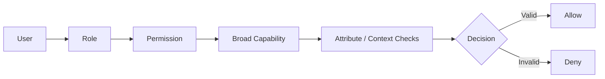
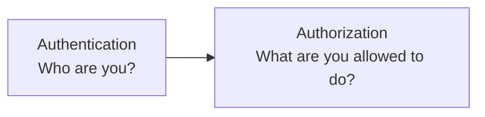
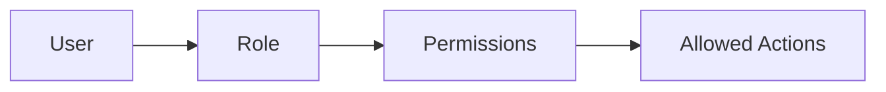
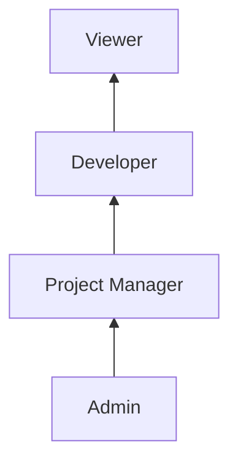
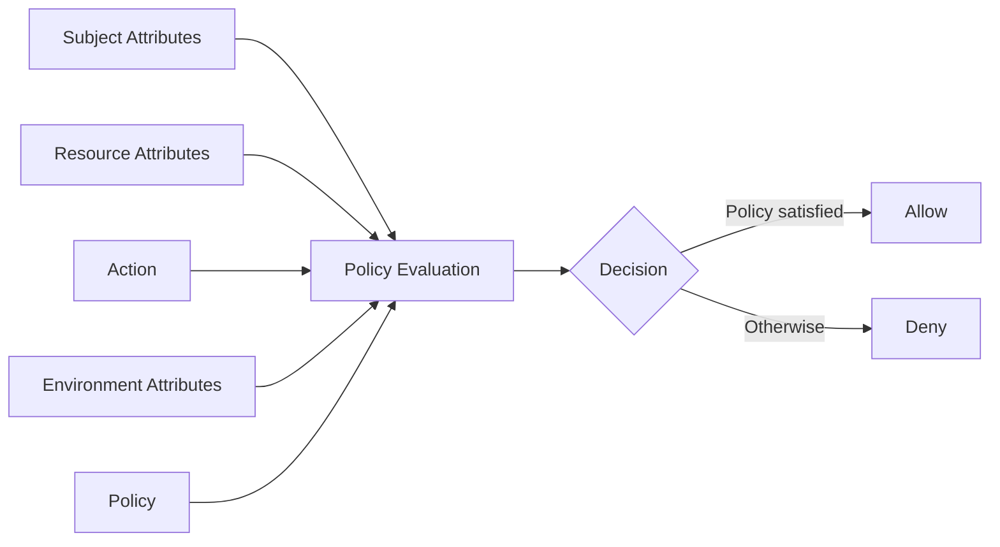
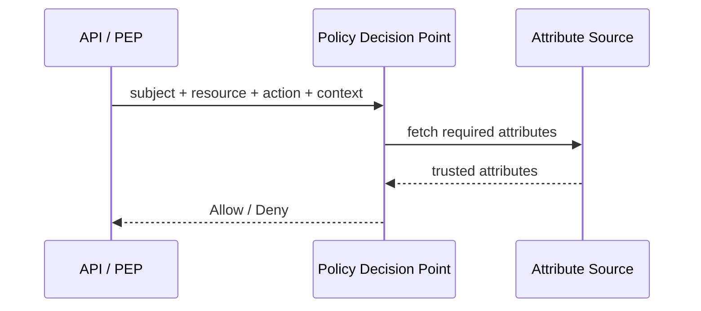
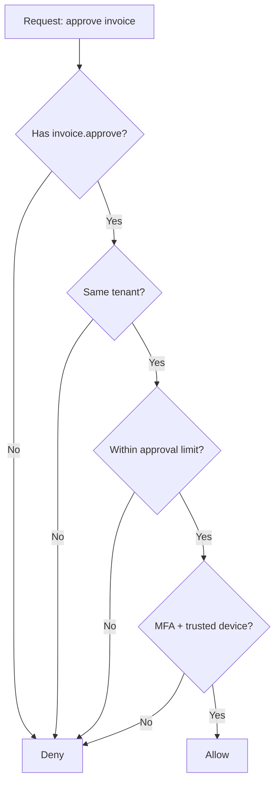
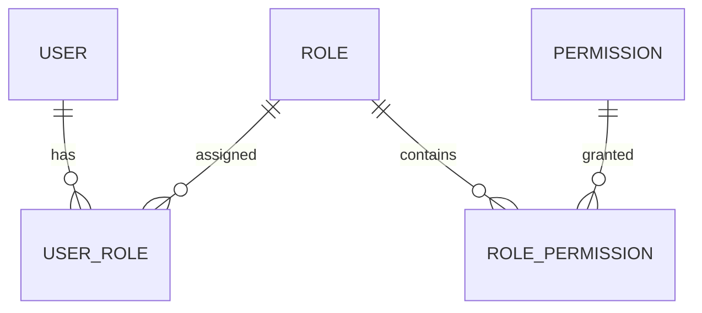
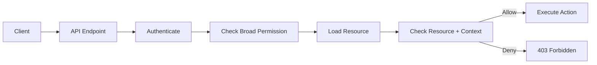

# RBAC vs ABAC

> **RBAC** grants broad capabilities through roles. **ABAC** evaluates attributes and context to decide whether a specific request should be allowed.

## In Short

- **RBAC (Role-Based Access Control):** `User → Role → Permission`
- **ABAC (Attribute-Based Access Control):** `Policy(Subject, Resource, Action, Environment) → Allow / Deny`
- RBAC is easier to understand, administer, and audit when permissions map cleanly to job functions.
- ABAC is better for fine-grained rules such as tenant isolation, ownership, approval limits, device trust, time, or resource classification.
- A practical application often combines them: **RBAC grants the capability, ABAC narrows it to the current resource and context.**
- Authorization must be enforced **server-side**, **on every protected request**, and should **deny by default**.
- Checking that a user can access *invoices* is not enough; the application must also check whether the user can access *this specific invoice*.



---

# 1. Access Control Basics

Access control answers:

> **Who can perform which action on which resource, under what conditions?**

Examples:

- Can this user view an invoice?
- Can this manager approve this payment?
- Can this developer deploy to production?
- Can this user access another tenant's data?

Access control belongs to **authorization**, not authentication.



Two important authorization models are:

- **RBAC — Role-Based Access Control**
- **ABAC — Attribute-Based Access Control**

---

# 2. Role-Based Access Control (RBAC)

## 2.1 How RBAC Works

RBAC assigns permissions to roles, then assigns roles to users.



Example:

```text
User: Bob
Role: Developer
Permissions:
- project.read
- task.read
- task.update
```

When Bob tries to update a task, the application checks whether his effective permissions contain:

```text
task.update
```

NIST describes RBAC as access control based on roles that represent organizational functions. Roles may also inherit permissions through a role hierarchy.

---

## 2.2 Core RBAC Components

### User

The person, service account, or system identity requesting access.

### Role

A business responsibility such as:

- `Admin`
- `Project Manager`
- `Developer`
- `Support Agent`
- `Viewer`

### Permission

A specific capability, usually named as:

```text
resource.action
```

Examples:

```text
invoice.read
invoice.approve
project.update
user.invite
deployment.create
```

### Resource

The object being protected, such as:

- Invoice
- Project
- User
- Document
- Server

### Assignment

A typical RBAC relationship is:

```text
User → Role → Permission
```

For example:

| User | Role |
|---|---|
| Alice | Admin |
| Bob | Developer |
| Carol | Viewer |

| Role | Permissions |
|---|---|
| Developer | `project.read`, `task.read`, `task.update` |
| Viewer | `project.read` |

---

## 2.3 Permission Checks Are Better Than Hard-Coded Role Checks

Prefer checking the capability:

```python
if user.has_permission("task.update"):
    update_task()
```

Instead of spreading role names throughout the application:

```python
if user.role in {"admin", "project_manager", "developer"}:
    update_task()
```

Why?

Because business roles can change while the capability remains the same.

For example, a new `Team Lead` role may also receive `task.update`. With permission-based checks, the application code does not need to change.

---

## 2.4 Role Hierarchy

A senior role can inherit permissions from another role.



Example:

| Role | Effective permissions |
|---|---|
| Viewer | `project.read` |
| Developer | `project.read`, `task.update` |
| Project Manager | `project.read`, `task.update`, `task.assign` |

Role hierarchies reduce duplication, but deep hierarchies can become difficult to reason about.

---

## 2.5 Separation of Duties

Some permissions should not be controlled by the same person.

Example:

```text
Payment Creator ≠ Payment Approver
```

Two common forms are:

- **Static separation of duties:** conflicting roles cannot be assigned to the same user.
- **Dynamic separation of duties:** a user may hold multiple roles, but conflicting responsibilities cannot be used within the same transaction or session.

This is useful in banking, finance, compliance, and administrative workflows.

---

## 2.6 Where RBAC Works Well

RBAC is a strong fit when:

- Job functions are stable.
- Permissions map clearly to roles.
- Administrators need simple access reviews.
- Contextual rules are limited.
- The system has broad permission groups such as `Admin`, `Editor`, and `Viewer`.

Common examples include:

- Django groups and permissions
- Kubernetes RBAC
- Database roles
- Enterprise identity systems
- Internal admin applications

---

## 2.7 RBAC Limitation: Role Explosion

RBAC becomes awkward when teams create roles for every combination of context.

For example:

```text
Project-A-Developer
Project-B-Developer
Project-A-ReadOnly-Developer
India-Project-A-Developer
Temporary-Project-A-Developer
```

This is called **role explosion**.

The real business rules may simply be:

```text
user.project_id == resource.project_id
user.region == resource.region
current_date <= user.contract_expiry
```

Those rules are better represented as attributes than as dozens of new roles.

---

# 3. Attribute-Based Access Control (ABAC)

## 3.1 How ABAC Works

ABAC evaluates attributes against a policy at request time.

NIST defines ABAC around attributes associated with:

- **Subject**
- **Object / resource**
- **Requested operation**
- **Environment**, when relevant

The decision can be represented as:

```text
Decision = Policy(Subject, Resource, Action, Environment)
```

Example policy:

```text
ALLOW invoice.approve IF:

subject.department == "finance"
AND subject.tenant_id == resource.tenant_id
AND resource.amount <= subject.approval_limit
AND environment.mfa_verified == true
```

Unlike RBAC, the decision is not based only on a role name.

---

## 3.2 Types of Attributes

### Subject Attributes

Properties of the requesting identity.

Examples:

```text
user.id
user.department
user.tenant_id
user.clearance_level
user.approval_limit
user.employment_status
```

### Resource Attributes

Properties of the protected object.

Examples:

```text
invoice.tenant_id
invoice.amount
document.owner_id
document.classification
project.region
```

### Action Attributes

The operation being requested.

Examples:

```text
read
create
update
delete
approve
download
deploy
```

### Environment Attributes

Context surrounding the request.

Examples:

```text
current_time
device_trusted
mfa_verified
network_zone
country
risk_score
```

---

## 3.3 ABAC Decision Flow



A mature authorization system may describe these responsibilities as:

- **PEP — Policy Enforcement Point:** intercepts and enforces the decision.
- **PDP — Policy Decision Point:** evaluates the policy.
- **PIP — Policy Information Point:** provides required attributes.
- **PAP — Policy Administration Point:** manages policies.



You do not need separate services for every component. In a smaller application, these may simply be logical responsibilities inside one authorization layer.

---

## 3.4 Where ABAC Works Well

ABAC is useful when authorization depends on:

- Tenant
- Resource ownership
- Department
- Region
- Approval limit
- Classification
- Device trust
- MFA state
- Time
- Risk level
- Project or resource tags

Typical use cases include:

- Multi-tenant SaaS
- Cloud IAM
- Sensitive data platforms
- Zero-trust architectures
- Large systems with many tagged resources

AWS IAM uses ABAC through attributes such as tags, including policies where a principal tag must match a resource tag.

---

## 3.5 ABAC Trade-Offs

ABAC gives stronger flexibility, but it introduces more policy complexity.

Important considerations:

- Attributes must come from trusted sources.
- Policies need clear naming and ownership.
- Decisions should be explainable for debugging.
- Policy conflicts need a defined strategy.
- Fetching many attributes can add runtime cost.
- A wrong attribute such as `tenant_id` can create a serious authorization vulnerability.

A common safe policy rule is:

```text
Explicit deny overrides allow.
No matching allow → deny.
```

---

# 4. RBAC vs ABAC

| Area | RBAC | ABAC |
|---|---|---|
| Main decision factor | Role / permission | Subject, resource, action, environment |
| Typical granularity | Coarse to medium | Fine-grained |
| Easy to administer | Yes | More complex |
| Context-aware | Limited | Strong |
| Object-level rules | Needs extra checks | Natural fit |
| Dynamic conditions | Awkward | Natural |
| Main scaling issue | Role explosion | Policy / attribute complexity |
| Audit style | Review roles and permissions | Review policies + evaluated attributes |
| Best fit | Stable business roles | Contextual and resource-specific rules |

### Simple Mental Model

```text
RBAC:
Can this type of user perform this type of action?

ABAC:
Can this user perform this action on this resource right now?
```

---

# 5. Practical Hybrid Example

Consider a multi-tenant SaaS application where finance managers approve invoices.

## Business Rules

A user may approve an invoice only when:

1. The user has permission to approve invoices.
2. The user and invoice belong to the same tenant.
3. The invoice amount is within the user's approval limit.
4. MFA is verified.
5. The request comes from a trusted device.

RBAC handles the broad capability:

```text
Finance Manager → invoice.approve
```

ABAC handles the request-specific restrictions:

```text
subject.tenant_id == resource.tenant_id

resource.amount <= subject.approval_limit

environment.mfa_verified == true

environment.device_trusted == true
```

Combined decision:

```text
ALLOW invoice.approve IF:

has_permission("invoice.approve")

AND subject.tenant_id == resource.tenant_id
AND resource.amount <= subject.approval_limit
AND environment.mfa_verified == true
AND environment.device_trusted == true
```



This keeps business permissions understandable while still enforcing fine-grained security.

---

# 6. Implementation Pattern

## 6.1 RBAC Data Model

A typical relational model is:



Typical tables:

```text
users
roles
permissions
user_roles
role_permissions
```

For multi-tenant or project-scoped applications, role assignments may also include a scope:

```text
user_id
role_id
tenant_id
project_id
```

For example:

```text
Bob = Project Manager in Project A
Bob = Viewer in Project B
```

This is often called **scoped RBAC**.

---

## 6.2 Python Hybrid Example

```python
from dataclasses import dataclass


@dataclass(frozen=True)
class User:
    id: str
    tenant_id: str
    permissions: set[str]
    approval_limit: float


@dataclass(frozen=True)
class Invoice:
    id: str
    tenant_id: str
    amount: float


@dataclass(frozen=True)
class RequestContext:
    mfa_verified: bool
    device_trusted: bool


def can_approve_invoice(
    user: User,
    invoice: Invoice,
    context: RequestContext,
) -> bool:
    # RBAC: broad capability
    if "invoice.approve" not in user.permissions:
        return False

    # ABAC: resource and request-specific restrictions
    return (
        user.tenant_id == invoice.tenant_id
        and invoice.amount <= user.approval_limit
        and context.mfa_verified
        and context.device_trusted
    )
```

The important design principle is:

> Keep authorization rules in reusable policies or authorization services instead of scattering them through controllers, views, jobs, and consumers.

---

# 7. API Authorization Flow

A secure request usually follows this order:



Example:

```python
def delete_project(project_id: str, user: User):
    if "project.delete" not in user.permissions:
        raise PermissionError("Access denied")

    project = repository.get(project_id)

    if project.tenant_id != user.tenant_id:
        raise PermissionError("Access denied")

    repository.delete(project)
```

The first check answers:

```text
Can this user delete projects?
```

The second answers:

```text
Can this user delete this project?
```

Both matter.

---

# 8. Choosing Between RBAC and ABAC

## Choose RBAC When

- Roles map cleanly to stable job functions.
- Permissions are mostly the same for everyone in a role.
- Contextual rules are limited.
- Straightforward auditing is important.
- The application is relatively small or internally focused.

Example:

```text
Admin
Editor
Viewer
```

## Choose ABAC When

- Authorization depends on ownership or resource metadata.
- The system is multi-tenant.
- Rules depend on department, project, region, device, time, risk, or classification.
- Access changes dynamically.
- Fine-grained least privilege is required.

Example:

```text
ALLOW document.read IF:

subject.tenant_id == resource.tenant_id
AND subject.clearance >= resource.classification
AND environment.device_trusted == true
```

## Use a Hybrid Model When

- Roles are useful for business administration.
- Resource-level restrictions are also required.
- Pure RBAC is creating too many roles.
- Pure ABAC would be unnecessarily difficult to administer.

For normal business applications, this is often a practical balance:

```text
RBAC permission
+
resource / context conditions
=
final authorization decision
```

---

# 9. Security Best Practices

## 9.1 Deny by Default

If no rule explicitly allows the action:

```text
DENY
```

Do not treat the absence of a deny rule as permission.

---

## 9.2 Validate Authorization on Every Protected Request

Do not rely on:

- Hidden frontend buttons
- Disabled controls
- Client-supplied role values
- Predictable resource IDs
- A permission check performed only on a previous request

Frontend authorization is useful for user experience, but the server must enforce security.

---

## 9.3 Enforce Object-Level Authorization

A broad endpoint permission is not enough.

Bad:

```text
User has invoice.read → return any requested invoice
```

Better:

```text
User has invoice.read
AND user.tenant_id == invoice.tenant_id
```

This protects against horizontal privilege escalation such as changing an object ID to access another user's or tenant's data.

---

## 9.4 Protect Attribute Integrity

ABAC decisions are only as trustworthy as their attributes.

Use server-controlled or authoritative sources.

| Attribute | Trusted source |
|---|---|
| `tenant_id` | Server-side identity / membership record |
| `role` | Authorization database or identity provider |
| `approval_limit` | Business / finance configuration |
| `device_trusted` | Device-management or security service |
| `clearance` | Approved security or HR source |

Never trust authorization-sensitive values directly from request JSON.

---

## 9.5 Apply Least Privilege

Avoid vague or overly broad permissions such as:

```text
full_access
developer.*
special_access
```

Prefer explicit capabilities:

```text
invoice.read
invoice.approve
project.update
user.invite
```

---

## 9.6 Centralize Authorization Logic

Authorization must apply consistently across:

- API endpoints
- Background jobs
- WebSocket handlers
- CLI commands
- Message consumers
- Scheduled tasks

Use a shared authorization layer so one execution path cannot bypass the rule.

---

## 9.7 Log Important Authorization Decisions

Useful audit fields include:

```text
timestamp
request_id
subject_id
tenant_id
resource_type
resource_id
action
decision
policy_id
reason_code
```

Avoid logging secrets or unnecessary sensitive data.

---

## 9.8 Test Authorization as a Matrix

Test both allowed and denied combinations.

| Role | Resource | Context | Action | Expected |
|---|---|---|---|---|
| Finance Manager | Same tenant, ₹40k | MFA + trusted device | Approve | Allow |
| Finance Manager | Other tenant | MFA + trusted device | Approve | Deny |
| Finance Manager | Same tenant, ₹80k over limit | MFA + trusted device | Approve | Deny |
| Finance Manager | Same tenant, ₹40k | MFA missing | Approve | Deny |

Authorization tests should include negative cases because a missing deny path can expose data.

---

# 10. Key Takeaways

- **RBAC** organizes permissions around business roles.
- **ABAC** evaluates attributes and context for each request.
- RBAC is simpler; ABAC is more expressive.
- RBAC alone becomes awkward for tenant, ownership, device, time, or resource-specific rules.
- A practical design often uses **RBAC for broad capability + ABAC for fine-grained restrictions**.
- Enforce authorization **server-side**, **on every request**, and **deny by default**.
- Always distinguish between **endpoint-level permission** and **object-level authorization**.
- Keep authorization logic centralized, auditable, and well tested.

---

# 11. References

1. [NIST — Role-Based Access Control (RBAC) Glossary](https://csrc.nist.gov/glossary/term/role_based_access_control)
2. [NIST SP 800-162 — Guide to Attribute Based Access Control](https://csrc.nist.gov/pubs/sp/800/162/upd2/final)
3. [OWASP Authorization Cheat Sheet](https://cheatsheetseries.owasp.org/cheatsheets/Authorization_Cheat_Sheet.html)
4. [AWS IAM — Define Permissions with ABAC Authorization](https://docs.aws.amazon.com/IAM/latest/UserGuide/introduction_attribute-based-access-control.html)
