# SQL Injection, XSS, and CSRF

> Covers what each vulnerability is, how an attack works, its impact, and how to prevent it in real applications.
>
> **Reference baseline:** OWASP Top 10:2025 and OWASP Cheat Sheet Series

## In short

- All three are the same failure at different trust boundaries: data reaching somewhere that treats it as instructions. Validation on the way in is defence in depth, never the fix.
- **SQL injection** — bind every value as a parameter so input can never become SQL syntax. Identifiers (table, column, sort direction) cannot be bound, so map them through a fixed allow-list.
- **XSS** — encoding is context-dependent: HTML text, HTML attribute, JavaScript, URL, and CSS each need different treatment. Framework auto-escaping covers the common case; the bypass APIs (`|safe`, `dangerouslySetInnerHTML`, `innerHTML`) undo it.
- Reflected and stored XSS travel through the server, but **DOM-based XSS never does** — the sink is in your JavaScript, so server-side escaping cannot help. Use `textContent` over `innerHTML`.
- **CSRF** — a session cookie proves who the browser is logged in as, not that the user intended the action. Defend with a framework CSRF token, `SameSite` cookies, and `Origin`/Fetch Metadata checks.
- CSRF only bites where the browser attaches credentials automatically. A token that JavaScript puts in an `Authorization` header is not auto-attached — but it then lives somewhere XSS can read it.
- XSS undermines CSRF protection entirely: script running on your origin can simply read the token. Fixing XSS is a prerequisite, not a parallel task.

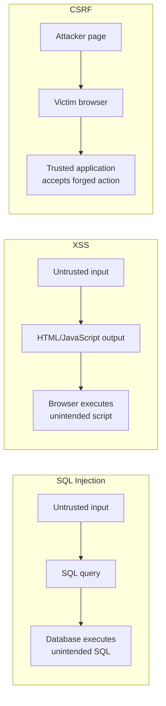

**Interview answer:** SQL injection and XSS share a root cause — untrusted data reaching an interpreter that parses it as instructions — and differ only in which interpreter: the database for SQL injection, fixed by parameter binding, and the browser for XSS, fixed by context-aware output encoding with sanitization only where real HTML is required. CSRF is different in kind: nothing is injected, the attacker simply causes the victim's browser to send a request that the server will authenticate automatically from its cookies, so the defence is proving intent with a CSRF token, `SameSite` cookies, and origin checks.

**Gotcha:** Believing a value can be made "safe" once, on the way in. Safety is a property of the destination, not the string: parameterized SQL does not make a value safe to put in `innerHTML`, and HTML-escaping does not make it safe inside a `<script>` block or a `javascript:` URL.

---

# 1. Security Overview

SQL Injection, Cross-Site Scripting, and Cross-Site Request Forgery attack different trust boundaries in a web application.

| Vulnerability | Main Target | Root Problem | Main Defense |
|---|---|---|---|
| **SQL Injection** | Database interpreter | User input becomes part of a SQL command | Parameterized queries |
| **XSS** | Browser and application users | Untrusted data becomes executable browser content | Context-aware output encoding and sanitization |
| **CSRF** | Authenticated user session | Browser sends authentication cookies with an attacker-triggered request | CSRF tokens, origin checks, and secure cookie settings |

The common security principle is:

> **Treat user-controlled data as data, never as executable instructions.**

User-controlled data can come from more places than form fields:

- URL path and query parameters
- Request bodies
- HTTP headers
- Cookies
- Uploaded files
- Database records originally created by users
- Third-party APIs
- Message queues and events
- WebSocket messages
- Data imported from CSV or spreadsheets

---

# 2. SQL Injection

## 2.1 What SQL Injection Is

SQL Injection occurs when an application combines untrusted input with a SQL statement in a way that allows the input to change the structure or meaning of the query.

Consider a login query built using string concatenation:

```python
username = request.POST["username"]

query = (
    "SELECT id, username "
    "FROM users "
    f"WHERE username = '{username}'"
)
```

The developer expects `username` to contain normal text. However, the database receives one final SQL string. It cannot reliably know which part was intended as code and which part was intended as data.

### Core problem

```text
Expected:

SQL code                         User data
┌─────────────────────────────┐  ┌─────────┐
│ SELECT ... WHERE username = │  │ avadh   │
└─────────────────────────────┘  └─────────┘

Vulnerable implementation:

┌────────────────────────────────────────────────┐
│ SELECT ... WHERE username = '<user-controlled>'│
└────────────────────────────────────────────────┘
                 One combined SQL string
```

When data and commands are mixed, malicious input may modify query logic.

---

## 2.2 How SQL Injection Works

A normal request might contain: `username=alice`

The generated query becomes:

```sql
SELECT id, username
FROM users
WHERE username = 'alice';
```

A malicious input might contain SQL syntax that changes the condition. A classic demonstration string is: `' OR '1'='1`

The resulting query could become:

```sql
SELECT id, username
FROM users
WHERE username = '' OR '1'='1';
```

Because `'1'='1'` is always true, the database may return more rows than intended.

### Attack flow

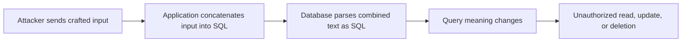

### Possible impact

Depending on the database account permissions and the vulnerable query, SQL Injection can cause:

- Authentication bypass
- Exposure of customer or business data
- Modification of records
- Deletion of records
- Unauthorized administrative operations
- Access to data belonging to other tenants
- Application outage
- In some environments, escalation beyond the database

The impact becomes worse when the application connects to the database using an overprivileged account.

---

## 2.3 Common SQL Injection Types

### 2.3.1 In-band SQL Injection

The attacker sends the payload and receives the result through the same application response.

Example:

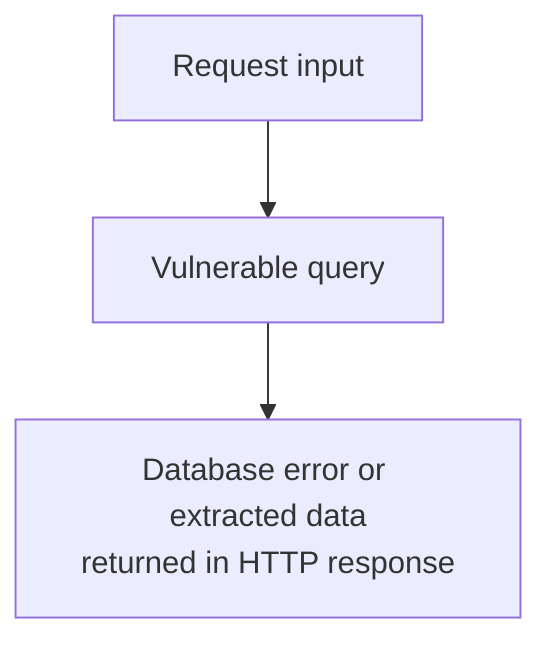

Common forms include:

- **Error-based:** database errors reveal query or schema information.
- **Union-based:** an injected `UNION` attempts to combine unauthorized data with the normal result.

### 2.3.2 Blind SQL Injection

The application does not directly display database data or detailed errors, but its behavior still reveals information.

The attacker observes differences such as:

- Page content changes
- HTTP status changes
- A true/false response
- Response-time differences

### 2.3.3 Second-order SQL Injection

Malicious-looking input is stored safely at first but later becomes dangerous when another part of the application uses that stored value to construct dynamic SQL.

```text
Step 1: Untrusted value is stored in database
Step 2: Background job reads the value
Step 3: Job concatenates it into a SQL statement
Step 4: Injection occurs later
```

This is why data read from your own database should not automatically be considered trusted.

### 2.3.4 ORM Injection

An ORM significantly reduces SQL Injection risk when used correctly, but it is not automatic protection against every unsafe pattern.

Unsafe ORM patterns include:

- Raw SQL with string formatting
- Dynamically constructed filter expressions
- Unsafe table or column names
- Concatenated fragments in `extra()`, raw queries, or text-based query APIs
- Passing client-provided operators directly into query construction

---

## 2.4 How to Prevent SQL Injection

### 2.4.1 Use parameterized queries

Parameterized queries separate the SQL structure from parameter values.

```python
cursor.execute(
    "SELECT id, username FROM users WHERE username = %s",
    [username],
)
```

The database treats `username` as one value. SQL characters inside it do not become part of the SQL structure.

```text
Prepared SQL:
SELECT id, username FROM users WHERE username = ?

Bound value:
"' OR '1'='1"

Database interpretation:
Find a username whose literal value is: ' OR '1'='1
```

This is the most important SQL Injection defense.

#### Never build queries like this

```python
query = f"SELECT * FROM users WHERE email = '{email}'"
cursor.execute(query)
```

```python
query = "SELECT * FROM users WHERE email = '" + email + "'"
cursor.execute(query)
```

```python
cursor.execute("SELECT * FROM users WHERE email = '%s'" % email)
```

Python string formatting happens before the database driver receives the query, so these examples are not parameterized.

---

### 2.4.2 Prefer safe ORM APIs

Normal ORM filters bind parameters safely.

```python
user = User.objects.filter(email=email).first()
```

With SQLAlchemy:

```python
stmt = select(User).where(User.email == email)
user = session.execute(stmt).scalar_one_or_none()
```

An ORM still requires careful handling of dynamic identifiers and raw SQL.

---

### 2.4.3 Allow-list dynamic identifiers

SQL parameters normally represent **values**, not table names, column names, or sort directions.

This does not work as intended:

```python
cursor.execute(
    "SELECT id, name FROM products ORDER BY %s",
    [sort_field],
)
```

For structural query elements, map user-facing choices to developer-controlled values.

```python
ALLOWED_SORT_FIELDS = {
    "name": "name",
    "price": "price",
    "created": "created_at",
}

sort_column = ALLOWED_SORT_FIELDS.get(request.GET.get("sort"), "created_at")

query = f"""
    SELECT id, name, price
    FROM products
    ORDER BY {sort_column}
"""

cursor.execute(query)
```

This use of formatting is safe only because `sort_column` comes from a fixed server-side map, not directly from user input.

The same approach applies to:

- Sort direction
- Report column selection
- Table selection
- Aggregation choices
- Search operators

---

### 2.4.4 Apply least privilege

The application database user should have only the permissions required by that service.

Examples:

- A reporting service may need `SELECT` but not `DELETE`.
- A customer API should not connect as a database administrator.
- A read-only endpoint can use a read-only connection.
- Separate applications should not share one highly privileged database account.
- Restrict access to sensitive tables through roles, views, or stored procedures when appropriate.

Least privilege does not remove SQL Injection, but it reduces the damage if another control fails.

---

### 2.4.5 Validate input on the server

Validation is useful for enforcing business rules:

```python
from uuid import UUID

def parse_user_id(raw_user_id: str) -> UUID:
    return UUID(raw_user_id)
```

Other examples:

- Parse numbers as numbers.
- Enforce maximum string lengths.
- Validate UUIDs and dates.
- Use enums for known choices.
- Reject unexpected operators.
- Validate structured JSON with a schema.

However:

> **Input validation is a supporting control, not a replacement for parameterized queries.**

A valid name such as `O'Connor` contains a quote. Blocking every special character would damage legitimate application behavior while still not providing complete protection.

---

### 2.4.6 Avoid relying on escaping

Manually escaping quotes is database-specific, error-prone, and easy to break when:

- Character encodings differ
- Database modes change
- Query contexts change
- A new field is added without escaping
- The value is used as an identifier rather than a string
- Multi-byte character behavior is involved

Use your database driver's parameter binding instead.

---

### 2.4.7 Handle errors safely

Do not expose raw database exceptions to clients.

Unsafe response:

```text
psycopg.errors.UndefinedColumn:
column users.card_number does not exist at character 74
```

Safer response:

```json
{
  "error": "Unable to process the request",
  "request_id": "8c344017-7f41-4ab8-a3c0-f0d81d934eaf"
}
```

Log the technical details internally with a request ID, but avoid logging passwords, tokens, full payment data, or other secrets.

---

## 2.5 Secure Python Examples

### 2.5.1 Django ORM

```python
from django.http import JsonResponse
from django.views.decorators.http import require_GET

from .models import Product

@require_GET
def search_products(request):
    search = request.GET.get("search", "").strip()[:100]

    products = (
        Product.objects
        .filter(name__icontains=search, is_active=True)
        .values("id", "name", "price")[:50]
    )

    return JsonResponse({"items": list(products)})
```

Django ORM binds the search value instead of concatenating it into SQL.

### 2.5.2 Django raw SQL

```python
from django.db import connection

def find_customer_by_email(email: str):
    with connection.cursor() as cursor:
        cursor.execute(
            """
            SELECT id, full_name, email
            FROM customers
            WHERE email = %s
            """,
            [email],
        )
        return cursor.fetchone()
```

Do not add quotation marks around `%s`; the database adapter handles values correctly.

### 2.5.3 SQLAlchemy

```python
from sqlalchemy import select
from sqlalchemy.orm import Session

from app.models import Customer

def get_customer_by_email(session: Session, email: str) -> Customer | None:
    statement = select(Customer).where(Customer.email == email)
    return session.execute(statement).scalar_one_or_none()
```

### 2.5.4 SQLAlchemy text query

```python
from sqlalchemy import text
from sqlalchemy.orm import Session

def get_customer_summary(session: Session, customer_id: str):
    statement = text(
        """
        SELECT id, full_name, status
        FROM customers
        WHERE id = :customer_id
        """
    )

    return session.execute(
        statement,
        {"customer_id": customer_id},
    ).mappings().one_or_none()
```

### 2.5.5 Dynamic sorting with an allow-list

```python
from sqlalchemy import asc, desc, select

SORT_COLUMNS = {
    "name": Product.name,
    "price": Product.price,
    "created": Product.created_at,
}

SORT_DIRECTIONS = {
    "asc": asc,
    "desc": desc,
}

def list_products(session, sort: str, direction: str):
    column = SORT_COLUMNS.get(sort, Product.created_at)
    order_function = SORT_DIRECTIONS.get(direction, desc)

    statement = (
        select(Product)
        .where(Product.is_active.is_(True))
        .order_by(order_function(column))
        .limit(100)
    )

    return session.execute(statement).scalars().all()
```

---

# 3. Cross-Site Scripting — XSS

## 3.1 What XSS Is

Cross-Site Scripting occurs when untrusted content is inserted into a web page in a context where the browser interprets it as executable code rather than plain data.

The browser is the interpreter being attacked.

A vulnerable page might render a search value directly: `<p>Search results for: {{ untrusted_search }}</p>`

If the template engine does not escape output, an attacker may inject markup or script-capable content.

### Core problem

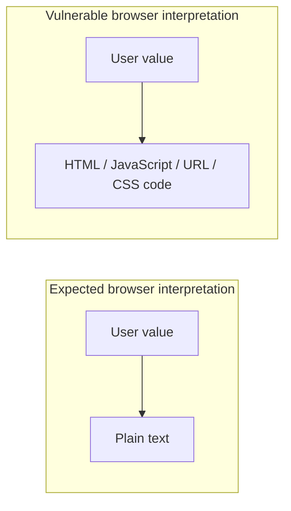

### Possible impact

XSS can allow malicious code to run with the permissions of the vulnerable application's origin. Depending on the application, this can lead to:

- Acting as the authenticated user
- Reading sensitive page content
- Modifying forms or page content
- Sending application requests
- Capturing user-entered data
- Redirecting users to malicious pages
- Accessing browser storage available to JavaScript
- Spreading stored malicious content to other users

`HttpOnly` cookies can stop JavaScript from directly reading those cookies, but they do not stop injected JavaScript from sending authenticated requests through the browser.

---

## 3.2 How XSS Works

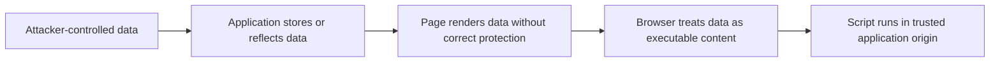

A simple vulnerable DOM pattern is:

```javascript
const message = new URLSearchParams(location.search).get("message");
document.getElementById("output").innerHTML = message;
```

`innerHTML` tells the browser to parse the value as HTML.

A safe alternative for plain text is:

```javascript
const message = new URLSearchParams(location.search).get("message");
document.getElementById("output").textContent = message;
```

`textContent` treats the value as text.

---

## 3.3 Types of XSS

### 3.3.1 Reflected XSS

The malicious value is sent in a request and immediately reflected in the response.

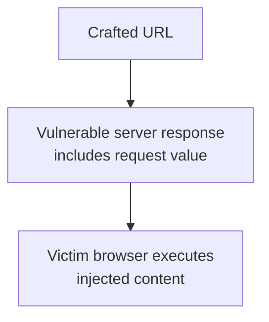

Common locations:

- Search pages
- Error pages
- Redirect messages
- Filter summaries
- Preview pages

### 3.3.2 Stored XSS

The malicious content is saved and later displayed to one or more users.

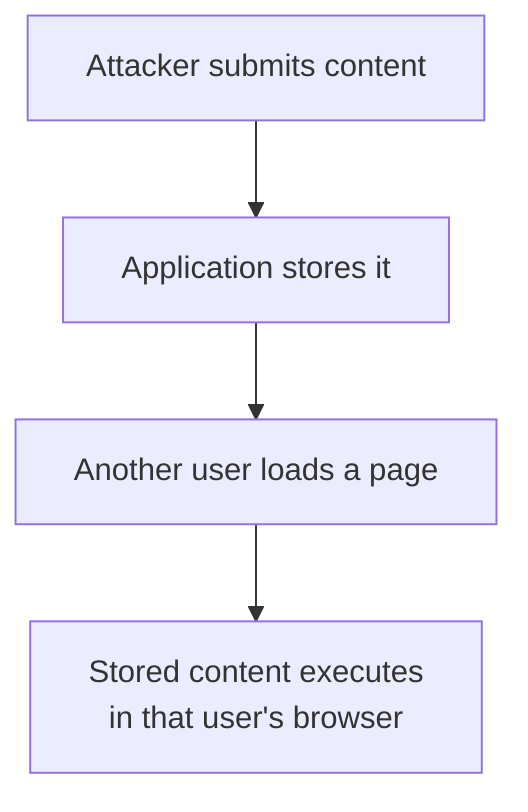

Common locations:

- Comments
- User profiles
- Support tickets
- Product reviews
- Admin dashboards
- Chat messages
- CMS content

Stored XSS can have a larger impact because many users may load the affected content.

### 3.3.3 DOM-based XSS

The vulnerability exists in client-side JavaScript. The server response may be safe, but frontend code reads attacker-controlled data and sends it to an unsafe DOM API.

Potential sources include:

- `location.search`
- `location.hash`
- `document.referrer`
- `window.name`
- `postMessage` data
- Browser storage
- API responses

Potentially dangerous sinks include:

- `innerHTML`
- `outerHTML`
- `insertAdjacentHTML`
- `document.write`
- String-based `setTimeout`
- String-based `setInterval`
- `eval`
- Dynamic script creation

---

## 3.4 Output Contexts

XSS prevention must match the location where data is inserted. Browsers parse different contexts using different rules.

### 3.4.1 HTML text context

```html
<div>{{ user_value }}</div>
```

Use HTML output encoding or the template framework's automatic escaping.

Characters such as `<`, `>`, `&`, `"`, and `'` are represented as text rather than markup where required.

### 3.4.2 HTML attribute context

```html
<input value="{{ user_value }}">
```

Use attribute encoding and quote attribute values.

Safer: `<input value="{{ user_value }}">`

Riskier: `<input value={{ user_value }}>`

Quoting prevents the value from easily breaking into a new attribute.

### 3.4.3 JavaScript context

```html
<script>
  const value = "{{ user_value }}";
</script>
```

Embedding untrusted values directly inside executable JavaScript is difficult to secure and should be avoided when possible.

A safer data transfer pattern is: `<div id="profile" data-user-id="{{ user_id }}"></div>`

```javascript
const profile = document.getElementById("profile");
const userId = profile.dataset.userId;
```

For larger objects, return JSON with the correct `application/json` content type and parse it as data.

### 3.4.4 URL context

```html
<a href="{{ user_url }}">Open</a>
```

Encoding alone is not enough. Validate the URL scheme and destination policy.

For example, allow only:

- Relative application URLs
- `https:` URLs
- Approved domains when business requirements need external links

Reject dangerous or unexpected schemes.

### 3.4.5 CSS context

Avoid inserting untrusted data into CSS. When unavoidable, restrict values to a small allow-list such as known theme names or numeric ranges.

---

## 3.5 How to Prevent XSS

### 3.5.1 Use framework auto-escaping

Modern frameworks usually escape text interpolation by default.

Django: `<p>{{ display_name }}</p>`

React:

```jsx
function Profile({ displayName }) {
  return <p>{displayName}</p>;
}
```

Both are normally safe for rendering text because the frameworks encode values.

Security risk returns when developers bypass these protections.

Django escape bypass: `{{ user_content|safe }}`

React escape bypass: `<div dangerouslySetInnerHTML={{ __html: userContent }} />`

Use bypass features only when the content has been sanitized with a proven HTML sanitizer and the feature genuinely requires HTML.

---

### 3.5.2 Use context-aware output encoding

Output encoding should happen when the value is inserted into its final output context.

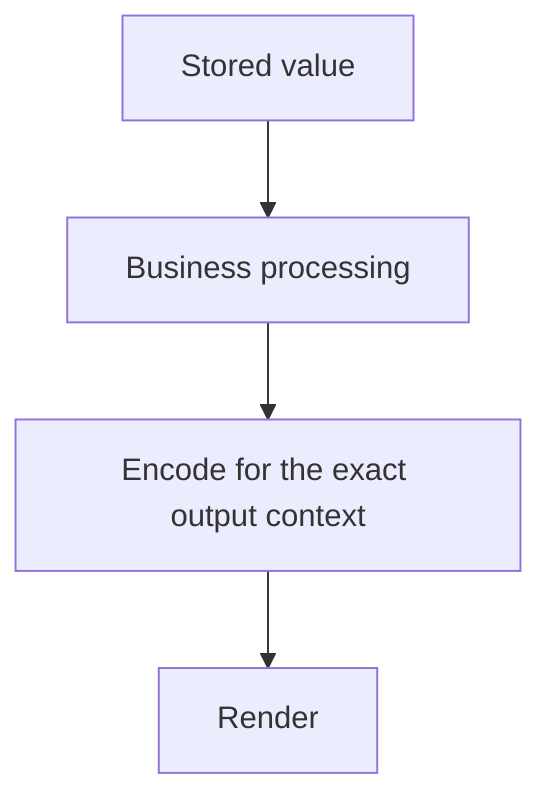

Do not encode all data at input time because:

- The same value may later be used in HTML, JSON, email, logs, or a database.
- Each destination has different encoding rules.
- Early encoding may cause double encoding.
- Encoded data can become decoded during later processing.

Validation at input and encoding at output solve different problems.

---

### 3.5.3 Use safe DOM APIs

For plain text: `element.textContent = untrustedValue;`

For attributes with fixed attribute names: `element.setAttribute("title", untrustedValue);`

For URLs, validate first:

```javascript
function toSafeHttpsUrl(rawValue) {
  const url = new URL(rawValue, window.location.origin);

  if (url.protocol !== "https:") {
    throw new Error("Only HTTPS URLs are allowed");
  }

  return url.href;
}

link.href = toSafeHttpsUrl(untrustedValue);
```

Prefer creating elements explicitly:

```javascript
const item = document.createElement("li");
item.textContent = untrustedValue;
list.appendChild(item);
```

Instead of:

```javascript
list.innerHTML += `<li>${untrustedValue}</li>`;
```

---

### 3.5.4 Sanitize HTML when HTML is required

Some features genuinely require user-generated rich text:

- CMS pages
- Rich text comments
- Email templates
- Knowledge-base content

In such cases, use a maintained, well-reviewed HTML sanitizer configured with an allow-list.

Conceptually:

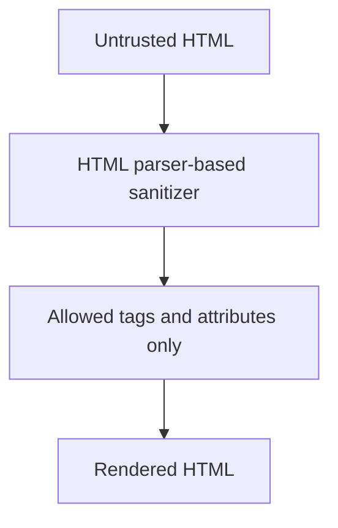

A sanitizer should remove or neutralize:

- Script-capable tags
- Event-handler attributes such as `onclick`
- Dangerous URL schemes
- Unsafe embedded content
- Unexpected SVG or MathML behaviors, depending on the library and policy

Do not attempt to sanitize HTML using regular expressions.

Sanitization and encoding serve different use cases:

| Requirement | Correct Control |
|---|---|
| Display input exactly as text | Output encoding |
| Allow a controlled subset of HTML | HTML sanitization |
| Allow only a fixed business value | Input allow-list |

---

### 3.5.5 Deploy Content Security Policy as defense in depth

A Content Security Policy can restrict which scripts and other resources the browser may execute or load.

Example direction:

```http
Content-Security-Policy:
  default-src 'self';
  script-src 'self' 'nonce-<random-per-response>';
  object-src 'none';
  base-uri 'self';
  frame-ancestors 'none'
```

A strong policy typically avoids:

- Broad wildcard sources
- `unsafe-inline`
- `unsafe-eval`
- Static or reusable nonces

CSP is valuable, but it should support—not replace—safe rendering, encoding, and sanitization.

---

### 3.5.6 Use secure cookie attributes

For session cookies: `Set-Cookie: session=<value>; Secure; HttpOnly; SameSite=Lax; Path=/`

- `Secure`: send the cookie only over HTTPS.
- `HttpOnly`: JavaScript cannot directly read the cookie.
- `SameSite`: restrict some cross-site cookie behavior.

These attributes reduce impact and support CSRF protection, but they do not fix the underlying XSS vulnerability.

---

### 3.5.7 Validate `postMessage` communication

Do not trust every cross-window message.

Unsafe:

```javascript
window.addEventListener("message", (event) => {
  output.innerHTML = event.data;
});
```

Safer:

```javascript
const TRUSTED_ORIGIN = "https://app.example.com";

window.addEventListener("message", (event) => {
  if (event.origin !== TRUSTED_ORIGIN) {
    return;
  }

  if (typeof event.data !== "string") {
    return;
  }

  output.textContent = event.data;
});
```

Validate:

- Sender origin
- Message shape
- Expected data types
- Allowed actions

---

## 3.6 Secure Frontend Examples

### 3.6.1 React text rendering

Safe:

```jsx
export function Comment({ comment }) {
  return <p>{comment.body}</p>;
}
```

Potentially dangerous:

```jsx
export function Comment({ comment }) {
  return (
    <div
      dangerouslySetInnerHTML={{ __html: comment.body }}
    />
  );
}
```

When rich HTML is required, sanitize it before passing it to the bypass API:

```jsx
import DOMPurify from "dompurify";

export function RichComment({ comment }) {
  const sanitizedHtml = DOMPurify.sanitize(comment.body);

  return (
    <div
      dangerouslySetInnerHTML={{ __html: sanitizedHtml }}
    />
  );
}
```

The sanitizer must be kept updated and configured according to the application's allowed content policy.

### 3.6.2 Safe link component

```jsx
function SafeExternalLink({ rawUrl, children }) {
  const parsed = new URL(rawUrl);

  if (parsed.protocol !== "https:") {
    return <span>{children}</span>;
  }

  return (
    <a
      href={parsed.href}
      target="_blank"
      rel="noopener noreferrer"
    >
      {children}
    </a>
  );
}
```

A production application may also restrict destinations to approved domains.

### 3.6.3 Django template

Safe by default:

```html
<h2>{{ article.title }}</h2>
<p>{{ article.summary }}</p>
```

Rich text should be sanitized before storage or before rendering. Do not mark arbitrary user content as safe.

### 3.6.4 JSON response

```python
from django.http import JsonResponse

def profile_api(request):
    return JsonResponse(
        {
            "display_name": request.user.get_full_name(),
            "bio": request.user.profile.bio,
        }
    )
```

Let the framework serialize JSON and set the correct content type rather than manually assembling JSON strings.

---

# 4. Cross-Site Request Forgery — CSRF

## 4.1 What CSRF Is

Cross-Site Request Forgery tricks an authenticated user's browser into sending an unwanted request to a trusted application.

The vulnerability exists because browsers automatically attach credentials such as session cookies to matching requests.

The attacker does not necessarily need to know the session cookie. The browser supplies it.

### Core problem

```text
Victim is logged in to bank.example
            +
Victim visits attacker.example
            +
Attacker causes a request to bank.example
            +
Browser automatically attaches bank session cookie
            =
Bank may accept an action the victim never intended
```

### Possible impact

CSRF can trigger any state-changing operation available to the victim, such as:

- Change an email address
- Change account settings
- Submit a payment
- Create or delete data
- Add an administrator
- Connect an external account
- Change security preferences
- Perform an administrative action

CSRF does not give the attacker more permissions than the victim already has, but an administrator victim can make the impact severe.

---

## 4.2 How CSRF Works

Assume a vulnerable application accepts a state-changing request:

```http
POST /account/change-email
Cookie: session=<victim-session>

email=attacker@example.net
```

An attacker hosts a page that causes the victim's browser to send a similar request.

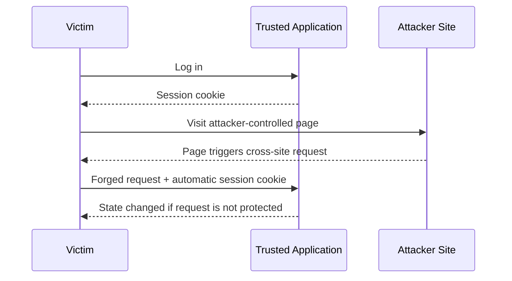

The trusted application sees a valid session cookie but has no additional proof that the user intentionally initiated the action.

---

## 4.3 When an Application Is Vulnerable

CSRF is primarily relevant when:

1. The application uses browser-managed credentials, especially cookies.
2. The browser automatically includes those credentials.
3. A state-changing endpoint accepts a request that another site can cause.
4. The server does not validate a CSRF token, request origin, or equivalent proof.
5. The action does not require additional user interaction or re-authentication.

### Cookie authentication

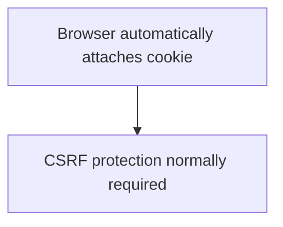

### Authorization header controlled by JavaScript

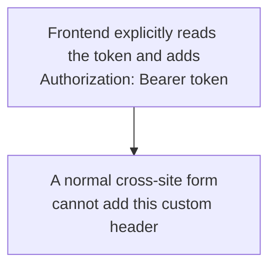

A bearer-token API that never authenticates through cookies is generally less exposed to traditional CSRF. However, token storage introduces other concerns, especially XSS. Do not move session tokens from secure cookies to JavaScript-accessible storage only to avoid CSRF.

### Important relationship with XSS

An XSS vulnerability in the trusted application can often bypass CSRF protections because malicious script running inside the trusted origin may read page tokens or make same-origin requests.

Therefore:

> **CSRF protection does not replace XSS protection. Both are required.**

---

## 4.4 How to Prevent CSRF

### 4.4.1 Use framework-provided CSRF protection

Framework implementations are usually safer than custom token systems.

Examples include:

- Django CSRF middleware
- Spring Security CSRF protection
- ASP.NET antiforgery protection
- Rails authenticity tokens
- Laravel CSRF middleware

Use the standard framework mechanism unless you have a carefully reviewed reason not to.

---

### 4.4.2 Use the synchronizer token pattern

The server generates an unpredictable token associated with the user's session.

```text
Server session:
session_id = abc123
csrf_token = random-secret-value
```

The application includes the token in the page:

```html
<form method="post" action="/account/change-email">
  <input
    type="hidden"
    name="csrfmiddlewaretoken"
    value="<random-secret-value>"
  >
  <input type="email" name="email">
  <button type="submit">Update</button>
</form>
```

The browser submits both the session cookie and the token. The server validates that the token matches the user's session.

An attacker site can cause a browser request, but it should not be able to read the token from the trusted origin because of the same-origin policy.

#### Token properties

A CSRF token should be:

- Generated using a cryptographically secure random source
- Unpredictable
- Bound to the relevant session or user context
- Validated on the server
- Kept out of URLs
- Excluded from logs where possible

Do not place CSRF tokens in query strings because URLs may leak through:

- Browser history
- Server logs
- Analytics
- Referrer headers
- Monitoring systems

---

### 4.4.3 Use the signed double-submit cookie pattern for stateless systems

A stateless application can send a CSRF token in a cookie and require the frontend to copy a related value into a request field or custom header.

A stronger implementation cryptographically binds the token to session-specific data rather than merely comparing two attacker-influenceable values.

Conceptually:

```text
Cookie:
csrf=<signed-token>

Request header:
X-CSRF-Token: <signed-token>

Server:
1. Verify signature
2. Verify session binding
3. Compare expected values safely
```

Avoid a naive double-submit design if cookie injection from subdomains or other application behavior could let an attacker choose the cookie value.

---

### 4.4.4 Use `SameSite` cookies

Example: `Set-Cookie: session=<value>; Secure; HttpOnly; SameSite=Lax; Path=/`

Common modes:

| Mode | Behavior |
|---|---|
| `Strict` | Strongly restricts cross-site cookie sending; may affect legitimate navigation flows |
| `Lax` | Blocks many cross-site subrequests while allowing common top-level navigation behavior |
| `None` | Allows cross-site use; requires `Secure` and needs other CSRF defenses |

`SameSite` is defense in depth. Compatibility requirements, browser behavior, sibling subdomains, and cross-site business flows must be evaluated.

Avoid setting an unnecessarily broad cookie domain: `Domain=.example.com`

A broad domain shares the cookie with subdomains and increases risk if any subdomain is less trusted or points to third-party infrastructure.

Prefer host-only cookies when possible.

---

### 4.4.5 Verify `Origin` or `Referer`

For state-changing requests, the server can verify that the request originated from the expected origin.

Example expected origin: `https://app.example.com`

Reject unexpected origins:

```text
https://attacker.example
https://example.com.attacker.example
http://app.example.com
```

Compare parsed origins, not string prefixes.

Origin verification is useful defense in depth and can be especially helpful for API-style endpoints.

---

### 4.4.6 Use Fetch Metadata headers

Modern browsers may send headers such as:

```http
Sec-Fetch-Site: same-origin
Sec-Fetch-Mode: cors
Sec-Fetch-Dest: empty
```

A server can reject suspicious cross-site state-changing requests based on `Sec-Fetch-Site`.

Conceptual policy:

```text
If request changes state
and Sec-Fetch-Site is cross-site
then reject
unless the endpoint explicitly supports that cross-site flow
```

Use a fallback strategy for clients that do not send these headers.

---

### 4.4.7 Require custom headers for API requests

A cross-origin HTML form cannot set arbitrary custom headers. An API can require a header such as: `X-CSRF-Token: <token>`

A permitted frontend origin can send it through `fetch` or Axios, subject to CORS rules and preflight checks.

The server must still:

- Validate the token
- Configure CORS narrowly
- Avoid reflecting arbitrary origins
- Avoid combining wildcard origins with credentialed requests

---

### 4.4.8 Do not use GET for state changes

GET should retrieve data, not modify it.

Unsafe: `GET /admin/users/42/delete`

Safer: `DELETE /api/admin/users/42`

or: `POST /admin/users/42/delete`

Using POST or DELETE does not automatically prevent CSRF, but it prevents simple navigation and resource loading from changing state and allows standard CSRF defenses to be applied consistently.

---

### 4.4.9 Re-authenticate or confirm sensitive actions

For high-risk operations, require additional user interaction:

- Re-enter password
- Use MFA
- Confirm transaction details
- Enter a one-time code
- Use transaction-specific authorization

Examples:

- Changing a password
- Disabling MFA
- Updating payout information
- Adding an administrator
- Transferring funds

This limits damage from both CSRF and unattended authenticated sessions.

---

## 4.5 Secure Django and API Examples

### 4.5.1 Django form

Django template:

```html
<form method="post" action="">
  

  <label for="email">New email</label>
  <input id="email" name="email" type="email" required>

  <button type="submit">Update email</button>
</form>
```

View:

```python
from django.contrib.auth.decorators import login_required
from django.shortcuts import redirect
from django.views.decorators.http import require_POST

@login_required
@require_POST
def change_email(request):
    new_email = request.POST["email"].strip().lower()

    request.user.email = new_email
    request.user.save(update_fields=["email"])

    return redirect("profile")
```

Django's CSRF middleware validates the form token when correctly enabled.

Do not use `@csrf_exempt` merely to make a failing request work. Identify the correct authentication and CSRF design first.

### 4.5.2 JavaScript request with Django CSRF token

```javascript
function getCookie(name) {
  const item = document.cookie
    .split("; ")
    .find((cookie) => cookie.startsWith(`${name}=`));

  return item ? decodeURIComponent(item.split("=")[1]) : null;
}

async function updateProfile(payload) {
  const csrfToken = getCookie("csrftoken");

  const response = await fetch("/api/profile", {
    method: "PATCH",
    credentials: "same-origin",
    headers: {
      "Content-Type": "application/json",
      "X-CSRFToken": csrfToken,
    },
    body: JSON.stringify(payload),
  });

  if (!response.ok) {
    throw new Error("Profile update failed");
  }

  return response.json();
}
```

The exact cookie and header names depend on framework configuration.

### 4.5.3 Cookie-authenticated API

For a same-origin SPA using session cookies:

```text
Browser session cookie
        +
CSRF token header
        +
Origin / Fetch Metadata validation
        +
SameSite cookie
```

Use several compatible controls rather than relying on one layer.

### 4.5.4 Token-authenticated API

For an API where the client explicitly sends: `Authorization: Bearer <access-token>`

Traditional CSRF risk is lower if:

- Authentication is never accepted from cookies.
- The browser does not automatically attach the token.
- CORS allows only approved origins.
- Sensitive tokens are handled securely.

However, storing long-lived access tokens in `localStorage` exposes them to JavaScript and therefore to XSS. Choose the authentication architecture based on the complete threat model, not only CSRF.

---

# 5. SQL Injection vs XSS vs CSRF

| Area | SQL Injection | XSS | CSRF |
|---|---|---|---|
| **Interpreter involved** | Database | Browser | Trusted server receiving a browser request |
| **Attacker input becomes** | SQL structure | Executable web content | An authenticated action |
| **Primary victim** | Application database and organization | Application users | Authenticated user |
| **Typical entry point** | Search, login, filters, IDs, raw SQL | Comments, profiles, query strings, DOM data | State-changing endpoints using cookie authentication |
| **Main root cause** | SQL built using string concatenation | Untrusted output reaches an executable browser context | Server trusts cookie-authenticated request without intent proof |
| **Best primary defense** | Parameterized queries | Context-aware output encoding or sanitization | Framework CSRF tokens |
| **Defense in depth** | Least privilege, validation, safe errors | CSP, safe DOM APIs, secure cookies | SameSite, Origin checks, Fetch Metadata, re-authentication |
| **Does input validation alone solve it?** | No | No | No |
| **Can a WAF fully solve it?** | No | No | No |
| **Can XSS weaken this defense?** | Not normally the direct relationship | It is the vulnerability itself | Yes, XSS can often bypass CSRF defenses |

### One request, three different risks

Consider a profile update feature:

```http
POST /profile
Content-Type: application/json

{
  "display_name": "...",
  "bio": "..."
}
```

The server may have three separate responsibilities:

1. **SQL Injection prevention**  
   Store the values using ORM methods or parameterized SQL.

2. **XSS prevention**  
   Encode the values when displayed, or sanitize them if rich HTML is allowed.

3. **CSRF prevention**  
   If authentication uses cookies, verify a CSRF token and other request-origin signals.

A value can be safe for SQL storage but unsafe for HTML output. Parameterized SQL does not make a string safe to insert into `innerHTML`.

---

# 6. How the Defenses Work Together

A secure data flow looks like this:

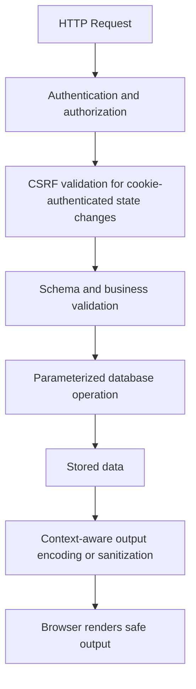

Each control has a different job:

| Control | Job |
|---|---|
| Authentication | Identify the user or service |
| Authorization | Verify permission for this exact action and resource |
| CSRF protection | Verify that a cookie-authenticated action was intentionally initiated through an allowed context |
| Validation | Enforce expected types, ranges, formats, and business rules |
| Parameterization | Keep database data separate from SQL commands |
| Output encoding | Keep data from being interpreted as browser code |
| Sanitization | Allow only a controlled subset of rich content |
| CSP | Restrict script execution and resource loading if primary defenses fail |
| Least privilege | Reduce damage after a compromise |
| Logging and alerting | Detect suspicious activity and support incident response |

No single security control replaces all the others.

---

# 7. Security Testing in Development and CI/CD

OWASP recommends combining code review and automated testing because different techniques find different problems.

## 7.1 Code review focus

### SQL Injection review

Search for:

```text
execute(
raw(
text(
extra(
SELECT
INSERT
UPDATE
DELETE
ORDER BY
```

Then verify whether user-controlled data is concatenated or safely bound.

Review dynamic:

- Column names
- Table names
- Sort fields
- Search operators
- Report builders
- Admin filters
- Bulk import logic

### XSS review

Search frontend and templates for:

```text
innerHTML
outerHTML
insertAdjacentHTML
document.write
eval
dangerouslySetInnerHTML
|safe
mark_safe
bypassSecurityTrust
unsafeHTML
```

For each occurrence, trace where the data originates and which sanitizer or validation policy protects it.

### CSRF review

Review:

- Cookie-authenticated POST, PUT, PATCH, and DELETE endpoints
- CSRF middleware configuration
- Exempted routes
- CORS policy
- Cookie `SameSite`, `Secure`, `HttpOnly`, `Domain`, and `Path`
- Origin and Fetch Metadata validation
- Sensitive actions that need re-authentication
- State-changing GET endpoints

---

## 7.2 Automated testing layers

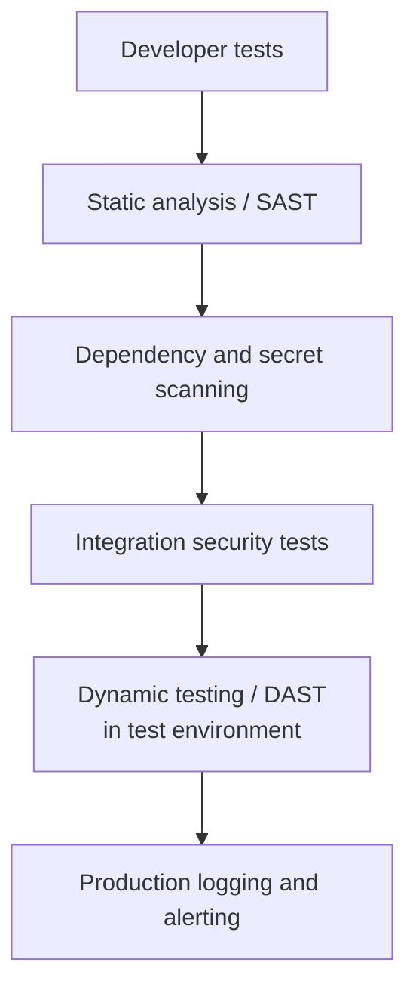

### Unit and integration tests

Write tests that verify controls, not only normal functionality.

Examples:

- A SQL-like string remains a literal search value.
- User text containing HTML is rendered as text.
- Sanitized rich text removes disallowed attributes.
- A state-changing request without a CSRF token is rejected.
- An unexpected `Origin` is rejected.
- A user cannot access another tenant's records.
- Database errors are not returned to clients.

### SAST

Static analysis can identify:

- String-built SQL
- Dangerous DOM APIs
- Template escape bypasses
- Disabled CSRF middleware
- Unsafe deserialization and command execution patterns

### DAST

Dynamic scanners can probe a running test application for:

- Injection behavior
- Reflected XSS
- Missing security headers
- CSRF weaknesses
- Error disclosure

Automated tools are useful, but code review remains important for:

- Stored XSS
- Second-order injection
- Business-specific CSRF
- Authorization logic
- Multi-step workflows

---

## 7.3 Logging and alerting

Log security-relevant events such as:

- Rejected CSRF requests
- Repeated validation failures
- Suspicious query patterns
- Unexpected origins
- Repeated 403 responses
- Authentication anomalies
- Attempts to access unauthorized tenant data

Logs should include:

- Timestamp
- Request ID
- User or service identity where available
- Route or action
- Result
- Safe contextual metadata

Avoid logging:

- Passwords
- Session cookies
- Authorization tokens
- CSRF tokens
- Full payment-card data
- Secret keys
- Sensitive personal data unless strictly required and protected

---

# 8. Production Security Checklist

## SQL Injection

- [ ] All SQL values use parameter binding.
- [ ] ORM raw-query usage has been reviewed.
- [ ] Dynamic identifiers use fixed allow-list mappings.
- [ ] Database accounts follow least privilege.
- [ ] Database errors are not returned to clients.
- [ ] Input schemas enforce type, length, and range.
- [ ] Multi-tenant queries always include authorization and tenant scope.
- [ ] Security tests cover search, sorting, reporting, and import features.

## XSS

- [ ] Framework auto-escaping remains enabled.
- [ ] Escape-bypass APIs are limited and reviewed.
- [ ] Plain text uses safe DOM APIs such as `textContent`.
- [ ] User-generated HTML is sanitized with a maintained library.
- [ ] URL schemes and destinations are validated.
- [ ] JSON responses use the correct content type.
- [ ] A restrictive CSP is deployed as defense in depth.
- [ ] Session cookies use `Secure` and `HttpOnly`.
- [ ] Third-party scripts are minimized and governed.
- [ ] `postMessage` handlers validate origin and message shape.

## CSRF

- [ ] Cookie-authenticated state-changing routes use framework CSRF protection.
- [ ] GET endpoints do not change application state.
- [ ] Session cookies use an appropriate `SameSite` setting.
- [ ] Cookies use `Secure`, and host-only scope is preferred.
- [ ] CORS allows only required origins, methods, and headers.
- [ ] Origin or Fetch Metadata validation is used where appropriate.
- [ ] CSRF exemptions have explicit, reviewed justification.
- [ ] Sensitive operations require re-authentication or confirmation.
- [ ] CSRF tokens do not appear in URLs or logs.
- [ ] XSS defenses are treated as necessary for reliable CSRF protection.

## Cross-cutting

- [ ] Authentication and authorization are checked separately.
- [ ] Every object-level operation enforces ownership or tenant scope.
- [ ] Security tests run in CI/CD.
- [ ] Dependencies and framework security patches are maintained.
- [ ] Secrets are stored outside source code.
- [ ] HTTPS is enforced.
- [ ] Security logs generate actionable alerts.
- [ ] Incident response procedures are documented and tested.

The whole checklist reduces to three sentences:

> Data must not become SQL. Data must not become browser code. A cross-site request must not become an authorized action.

---

# 9. References

1. [OWASP Top 10:2025 — A05 Injection](https://owasp.org/Top10/2025/A05_2025-Injection/)
2. [OWASP SQL Injection Prevention Cheat Sheet](https://cheatsheetseries.owasp.org/cheatsheets/SQL_Injection_Prevention_Cheat_Sheet.html)
3. [OWASP Query Parameterization Cheat Sheet](https://cheatsheetseries.owasp.org/cheatsheets/Query_Parameterization_Cheat_Sheet.html)
4. [OWASP Cross Site Scripting Prevention Cheat Sheet](https://cheatsheetseries.owasp.org/cheatsheets/Cross_Site_Scripting_Prevention_Cheat_Sheet.html)
5. [OWASP DOM-based XSS Prevention Cheat Sheet](https://cheatsheetseries.owasp.org/cheatsheets/DOM_based_XSS_Prevention_Cheat_Sheet.html)
6. [OWASP Cross-Site Request Forgery Prevention Cheat Sheet](https://cheatsheetseries.owasp.org/cheatsheets/Cross-Site_Request_Forgery_Prevention_Cheat_Sheet.html)
7. [OWASP CSRF Attack Overview](https://owasp.org/www-community/attacks/csrf)
8. [OWASP REST Security Cheat Sheet](https://cheatsheetseries.owasp.org/cheatsheets/REST_Security_Cheat_Sheet.html)

---

> Use this document as a development guide and review checklist. Security controls must still be adapted to the application's framework, authentication architecture, business workflows, deployment environment, and threat model.
