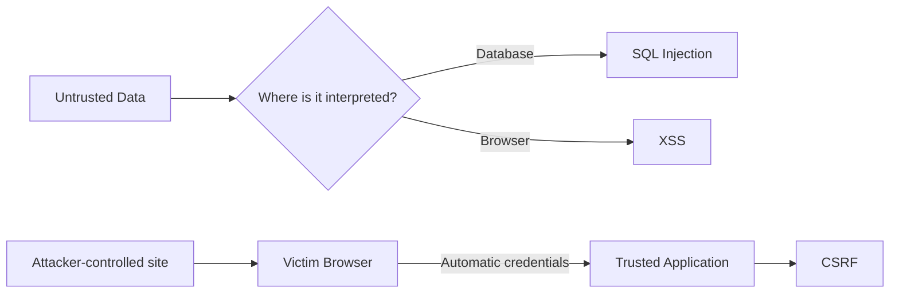
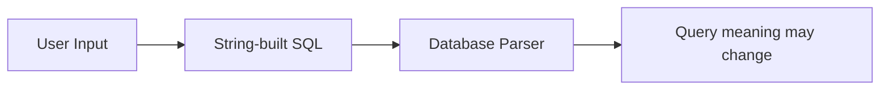
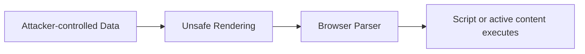
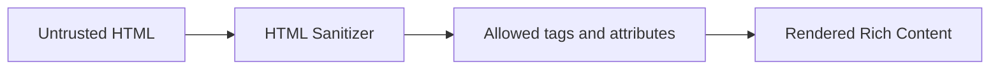
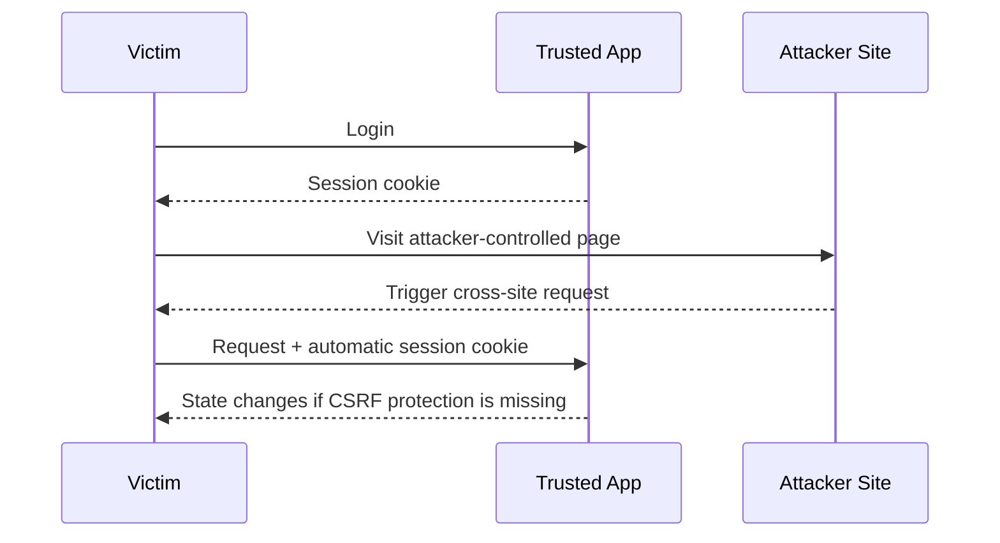
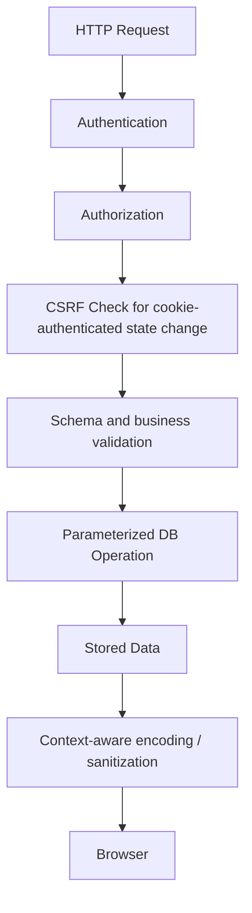

# SQL Injection, XSS, and CSRF

> Three common web vulnerabilities that attack different trust boundaries: the database, the browser, and the authenticated user session.

**Reference baseline:** OWASP Top 10:2025 and OWASP Cheat Sheet Series.

## In Short

- **SQL Injection (SQLi):** untrusted input changes a SQL query.  
  **Primary defense:** parameterized queries / prepared statements.
- **Cross-Site Scripting (XSS):** untrusted data becomes executable browser content.  
  **Primary defense:** framework auto-escaping, context-aware output encoding, safe DOM APIs, and sanitization when real HTML is required.
- **Cross-Site Request Forgery (CSRF):** a browser sends an attacker-triggered request with credentials that it attaches automatically, usually session cookies.  
  **Primary defense:** framework CSRF protection, supported by `SameSite`, `Origin`/`Referer`, and Fetch Metadata checks.



The key idea is simple:

> **Keep data as data. Do not let it become SQL, browser code, or an unintended authenticated action.**

---

# 1. Security Overview

| Vulnerability | Main Target | Root Problem | Primary Defense |
|---|---|---|---|
| **SQL Injection** | Database | Input becomes part of SQL structure | Parameterized queries |
| **XSS** | Browser / users | Untrusted data reaches an executable browser context | Context-aware output handling |
| **CSRF** | Authenticated session | Server trusts a cookie-authenticated request without enough proof of intent | CSRF protection |

User-controlled data is not limited to form fields. It may come from:

- Query/path parameters
- JSON request bodies
- HTTP headers and cookies
- Uploaded/imported files
- Database values originally created by users
- Third-party APIs
- Queues, events, and WebSocket messages

---

# 2. SQL Injection

## 2.1 What It Is

SQL Injection occurs when untrusted input is combined with SQL in a way that allows the input to change the query structure.

### Vulnerable pattern

```python
query = f"SELECT id, email FROM users WHERE email = '{email}'"
cursor.execute(query)
```

Here, application code and user data become one SQL string.



Possible impact includes:

- Authentication bypass
- Unauthorized data access
- Data modification or deletion
- Cross-tenant data exposure
- Service disruption

## 2.2 Primary Defense: Parameterized Queries

Use placeholders provided by the database driver:

```python
cursor.execute(
    "SELECT id, email FROM users WHERE email = %s",
    [email],
)
```

The SQL structure and the value are sent separately, so SQL-looking characters inside `email` remain data.

### ORM example

```python
user = User.objects.filter(email=email).first()
```

Normal Django ORM filters and equivalent ORM APIs use bound parameters.

## 2.3 Dynamic Columns and Sort Fields

Bind parameters represent **values**, not SQL identifiers such as table names, column names, or `ASC` / `DESC`.

For dynamic structure, map user choices to developer-controlled values:

```python
SORT_FIELDS = {
    "name": "name",
    "created": "created_at",
}

sort_column = SORT_FIELDS.get(request.GET.get("sort"), "created_at")
query = f"SELECT id, name FROM products ORDER BY {sort_column}"
cursor.execute(query)
```

This is safe because the interpolated value comes from a fixed server-side allow-list.

## 2.4 Supporting Controls

- Prefer ORM/query-builder APIs over raw SQL.
- Validate types, length, ranges, UUIDs, dates, and enums.
- Give the application database account only required permissions.
- Do not expose raw database errors to clients.
- Review raw SQL, report builders, dynamic filters, and imports carefully.

> **Validation is defense in depth. It does not replace parameterized queries.**

---

# 3. Cross-Site Scripting — XSS

## 3.1 What It Is

XSS occurs when untrusted data reaches a browser context where it can be interpreted as executable content instead of plain data.



Possible impact includes:

- Acting as the logged-in user
- Reading sensitive page content
- Changing forms or page content
- Sending authenticated requests
- Capturing user-entered data
- Reading JavaScript-accessible storage

`HttpOnly` protects a cookie from direct JavaScript reads, but injected JavaScript may still perform authenticated requests from the page.

## 3.2 Main Types

### Reflected XSS

The malicious value comes from a request and is immediately included in the response.

### Stored XSS

The malicious value is stored first and later rendered to other users.

Common examples: comments, profiles, support tickets, CMS content, and admin dashboards.

### DOM-based XSS

The vulnerable source-to-sink flow is in client-side JavaScript. It **can happen entirely in the browser**, so the server response does not need to contain the final malicious markup.

Unsafe:

```javascript
output.innerHTML = new URLSearchParams(location.search).get("message");
```

Safer for plain text:

```javascript
output.textContent = new URLSearchParams(location.search).get("message");
```

## 3.3 Output Context Matters

Different browser contexts have different parsing rules.

| Context | Recommended Approach |
|---|---|
| HTML text | Framework auto-escaping / HTML encoding |
| HTML attribute | Quote the attribute and use attribute-safe encoding |
| JavaScript | Avoid inserting untrusted data directly into executable JS |
| URL | Validate allowed schemes/destinations and encode URL components |
| CSS | Avoid dynamic untrusted CSS; use narrow allow-lists |

A string is not universally "safe". A value safely encoded for HTML text may still be unsafe inside JavaScript or a URL.

## 3.4 Safe Framework and DOM Usage

### React

Safe for normal text:

```jsx
<p>{comment.body}</p>
```

High-risk escape hatch:

```jsx
<div dangerouslySetInnerHTML={{ __html: comment.body }} />
```

### Django

Safe by default for normal template output:

```html
<p>{{ article.summary }}</p>
```

Avoid marking arbitrary user content with `|safe` or `mark_safe`.

### Browser DOM

Prefer:

- `textContent`
- `createElement`
- Fixed attribute names with validated values

Treat these as high-risk sinks:

- `innerHTML`
- `outerHTML`
- `insertAdjacentHTML`
- `document.write`
- `eval`
- String-based `setTimeout` / `setInterval`

## 3.5 When HTML Is Actually Required

For rich text, use a maintained HTML sanitizer with an explicit allow-list.



Do not sanitize HTML with regular expressions.

## 3.6 Defense in Depth

- Deploy a restrictive Content Security Policy (CSP).
- Avoid `unsafe-inline` and `unsafe-eval` where practical.
- Keep third-party scripts controlled.
- Validate `postMessage` origin and message shape.
- Use `Secure` and `HttpOnly` for session cookies.
- Consider **Trusted Types** for DOM-XSS hardening where supported.

> CSP and Trusted Types strengthen XSS defenses, but they do not replace safe rendering and sanitization.

---

# 4. Cross-Site Request Forgery — CSRF

## 4.1 What It Is

CSRF tricks a logged-in user's browser into sending an unwanted request to a trusted application.

The browser may automatically attach credentials such as a session cookie.



CSRF is mainly relevant when authentication is attached automatically by the browser.

## 4.2 Cookie Auth vs Authorization Header

### Cookie-authenticated application

The browser automatically attaches the session cookie, so state-changing endpoints normally need CSRF protection.

### Bearer token explicitly added by JavaScript

A normal cross-site HTML form cannot automatically add:

```http
Authorization: Bearer <token>
```

Traditional CSRF exposure is therefore lower **when authentication is never accepted from cookies**.

However, moving long-lived tokens into JavaScript-accessible storage only to avoid CSRF creates more XSS exposure. Authentication design should consider both threats.

## 4.3 Primary Defense: Framework CSRF Protection

Use the framework implementation before building a custom mechanism.

Django template example:

```html
<form method="post">
  
  <input type="email" name="email" required>
  <button type="submit">Update</button>
</form>
```

Django's CSRF middleware validates the request when correctly configured.

Avoid `@csrf_exempt` as a shortcut for fixing a failing request.

## 4.4 Supporting Controls

### `SameSite` cookies

Typical session cookie:

```http
Set-Cookie: session=<value>; Secure; HttpOnly; SameSite=Lax; Path=/
```

- `Strict` provides stronger cross-site restrictions but can affect legitimate flows.
- `Lax` is a common balance for browser sessions.
- `None` permits cross-site use and requires `Secure`.

Prefer host-only cookies instead of unnecessarily broad `Domain=.example.com` cookies.

### Origin verification

For state-changing requests, verify the parsed `Origin` or, when necessary, `Referer` against trusted origins.

### Fetch Metadata

Modern browsers send signals such as:

```http
Sec-Fetch-Site: same-origin
```

For state-changing requests, `Sec-Fetch-Site: cross-site` is a strong signal to reject unless the endpoint intentionally supports that flow.

Use an origin-based fallback for clients or intermediaries where Fetch Metadata headers are unavailable.

### Additional protections

- Do not use `GET` for state changes.
- For APIs, a validated custom CSRF header can be useful.
- Configure CORS narrowly.
- Re-authenticate or require MFA/confirmation for highly sensitive actions.

## 4.5 XSS and CSRF Relationship

XSS can bypass many CSRF defenses because malicious JavaScript running inside the trusted origin can often make same-origin requests and access CSRF tokens available to application JavaScript.

> **Reliable CSRF protection depends on strong XSS protection too.**

---

# 5. SQL Injection vs XSS vs CSRF

| Area | SQL Injection | XSS | CSRF |
|---|---|---|---|
| Target | Database | Browser | Authenticated session |
| What goes wrong | Data becomes SQL structure | Data becomes executable browser content | Cross-site request becomes an accepted action |
| Typical source | Search/filter/login/raw SQL input | Comments, profile text, query strings, DOM/API data | Attacker-controlled page |
| Primary defense | Parameterized queries | Context-aware output handling | Framework CSRF protection |
| Key supporting controls | Allow-lists, least privilege | Sanitization, CSP, safe DOM APIs | SameSite, Origin, Fetch Metadata |
| Validation alone enough? | No | No | No |
| WAF alone enough? | No | No | No |

---

# 6. One Practical Example: Customer Profile Application

Assume the application has:

- `GET /users?sort=...`
- `POST /profile`
- A profile page that displays `bio`

The same user-controlled data can cross several security boundaries.

## 6.1 Database Boundary

Store and query values through the ORM or parameter binding.

```python
profile.bio = submitted_bio
profile.save(update_fields=["bio"])
```

For dynamic sorting, map the requested sort option through an allow-list.

## 6.2 Browser Boundary

Render `bio` as normal escaped text:

```html
<p>{{ profile.bio }}</p>
```

If the business feature intentionally allows rich HTML, sanitize it before using an HTML-rendering escape hatch.

## 6.3 Session Boundary

For cookie-authenticated profile changes:

```text
Session cookie
    +
CSRF token
    +
SameSite cookie
    +
Origin / Fetch Metadata checks
```

Each protection solves a different problem.



---

# 7. Development Checklist

## SQL Injection

- [ ] SQL values are parameterized.
- [ ] Raw SQL is reviewed.
- [ ] Dynamic identifiers use fixed allow-lists.
- [ ] Database permissions follow least privilege.
- [ ] Database errors are not returned directly to clients.

## XSS

- [ ] Framework auto-escaping stays enabled.
- [ ] `innerHTML`, `dangerouslySetInnerHTML`, `|safe`, and similar bypasses are reviewed.
- [ ] Plain text uses safe DOM APIs such as `textContent`.
- [ ] Rich HTML uses a maintained sanitizer.
- [ ] URLs are validated before use.
- [ ] CSP is used as defense in depth.

## CSRF

- [ ] Cookie-authenticated state changes use framework CSRF protection.
- [ ] `GET` does not change state.
- [ ] Session cookies use appropriate `SameSite`, `Secure`, and `HttpOnly` settings.
- [ ] CORS is narrowly configured.
- [ ] Origin and/or Fetch Metadata checks are applied where appropriate.
- [ ] CSRF exemptions have explicit justification.
- [ ] Sensitive operations require additional confirmation when needed.

---

# 8. Interview-Ready Takeaway

Remember the boundary each vulnerability attacks:

```text
SQL Injection -> Database interprets data as SQL.
XSS           -> Browser interprets data as active content.
CSRF          -> Server accepts an attacker-triggered authenticated request.
```

And remember the primary defenses:

```text
SQLi -> Parameterized queries
XSS  -> Context-aware output handling
CSRF -> Framework CSRF protection
```

---

# 9. References

1. OWASP Top 10:2025 — A05 Injection  
   https://owasp.org/Top10/2025/A05_2025-Injection/

2. OWASP SQL Injection Prevention Cheat Sheet  
   https://cheatsheetseries.owasp.org/cheatsheets/SQL_Injection_Prevention_Cheat_Sheet.html

3. OWASP Cross Site Scripting Prevention Cheat Sheet  
   https://cheatsheetseries.owasp.org/cheatsheets/Cross_Site_Scripting_Prevention_Cheat_Sheet.html

4. OWASP DOM-based XSS Prevention Cheat Sheet  
   https://cheatsheetseries.owasp.org/cheatsheets/DOM_based_XSS_Prevention_Cheat_Sheet.html

5. OWASP Cross-Site Request Forgery Prevention Cheat Sheet  
   https://cheatsheetseries.owasp.org/cheatsheets/Cross-Site_Request_Forgery_Prevention_Cheat_Sheet.html

6. OWASP REST Security Cheat Sheet  
   https://cheatsheetseries.owasp.org/cheatsheets/REST_Security_Cheat_Sheet.html
