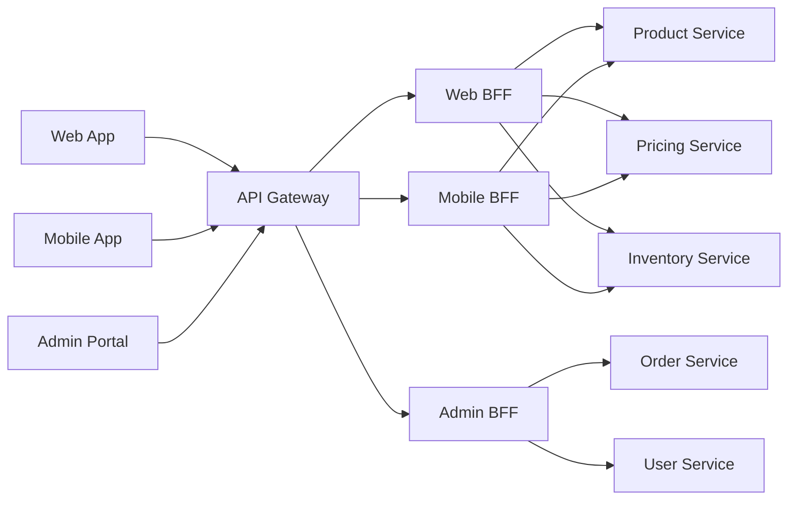
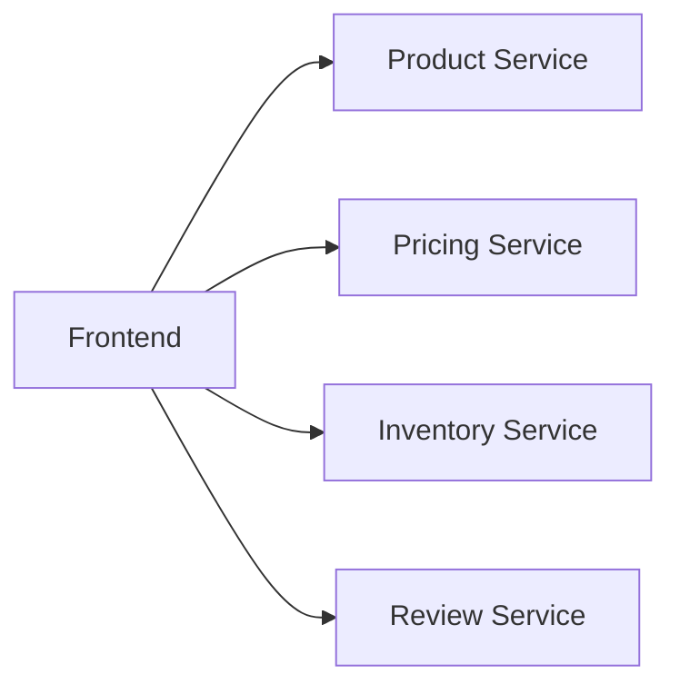
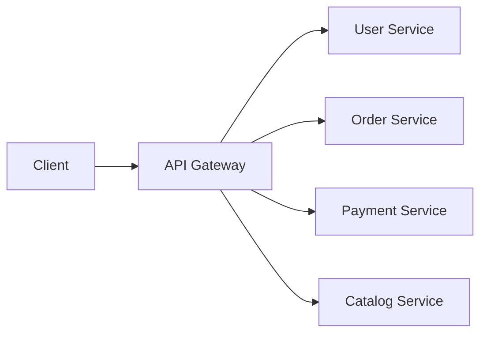
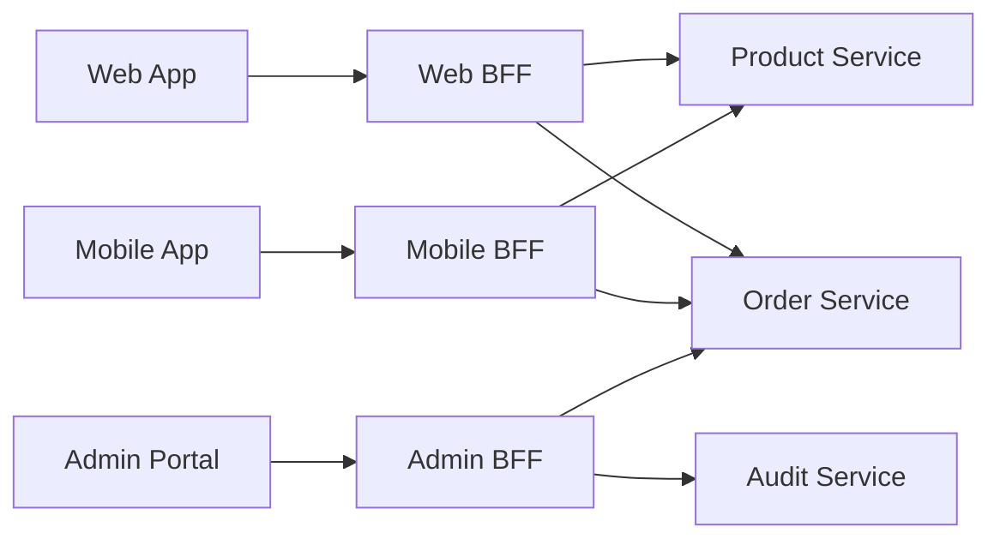
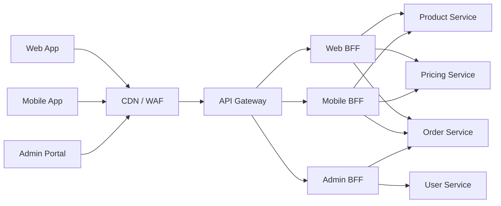
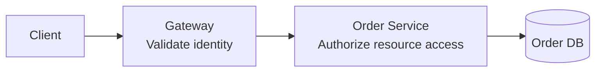
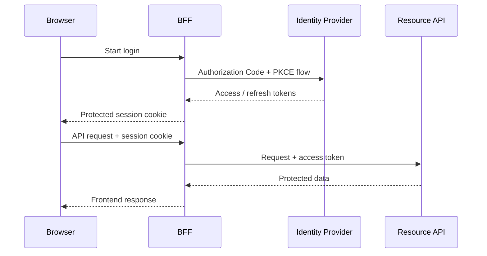
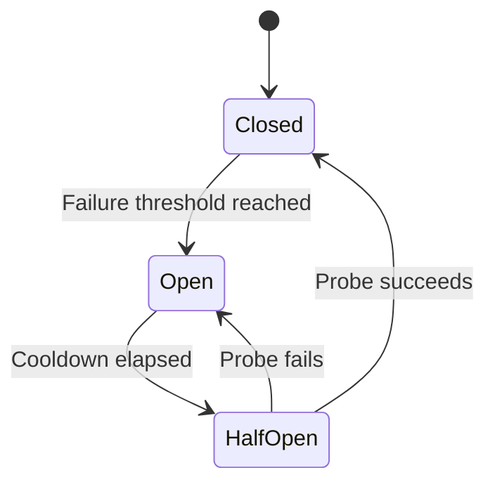
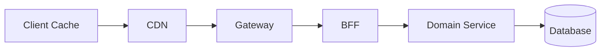
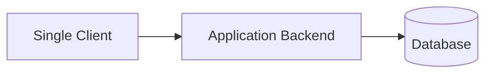

# API Gateway and the Backend for Frontend (BFF) Pattern

> Understand where an API Gateway and a Backend for Frontend fit in a modern system, how they differ, and how to use them together.

## In short

- An **API Gateway** is the shared entry point for API traffic. It mainly handles routing, TLS, authentication checks, rate limiting, edge security, traffic policies, and centralized observability.
- A **Backend for Frontend (BFF)** is a backend tailored to one frontend experience, such as web, mobile, or admin. It aggregates services and returns data in the shape that client needs.
- The **gateway manages traffic**; the **BFF manages client-specific composition**; **domain services own business rules and data**.
- Gateway authentication does **not** replace service-level authorization. A valid token proves who the caller is, but the domain service must still decide whether that caller can access a particular resource.
- Independent BFF calls should normally run **in parallel**, with explicit timeouts and deliberate handling for required versus optional dependencies.
- For browser applications using OAuth, a BFF can keep access and refresh tokens away from browser JavaScript and use a protected cookie-based session.



---

# Index

1. [Why These Patterns Exist](#1-why-these-patterns-exist)
2. [API Gateway](#2-api-gateway)
   - Core responsibilities
   - What should not live in the gateway
3. [Backend for Frontend](#3-backend-for-frontend-bff)
   - Why separate BFFs
   - Core responsibilities
   - What should not live in a BFF
4. [API Gateway vs BFF](#4-api-gateway-vs-bff)
5. [Using Them Together](#5-using-api-gateway-and-bff-together)
6. [Security and Authentication](#6-security-and-authentication)
7. [Aggregation, Resilience, and Performance](#7-aggregation-resilience-and-performance)
8. [Caching and Observability](#8-caching-and-observability)
9. [Practical E-Commerce Example](#9-practical-e-commerce-example)
10. [When to Use Each Pattern](#10-when-to-use-each-pattern)

---

# 1. Why These Patterns Exist

In a microservice system, one frontend screen may need data from several services.

For example, a product page may need:

```text
Product Service
Pricing Service
Inventory Service
Review Service
Recommendation Service
```

Without an intermediate layer, the frontend may need to know every service address and contract, make several network calls, combine responses, and change whenever internal services change.



Two common patterns reduce this coupling:

- **API Gateway** — provides one controlled entry point.
- **BFF** — provides a client-specific backend API.

They solve related problems, but they have different responsibilities.

---

# 2. API Gateway

An **API Gateway** sits between external clients and backend APIs.

Instead of exposing every microservice publicly:



The client may call one public domain:

```text
https://api.example.com
```

The gateway then routes requests internally:

```text
GET  /users/42        -> User Service
GET  /orders/ORD-101  -> Order Service
POST /payments        -> Payment Service
GET  /products        -> Catalog Service
```

## 2.1 Core Responsibilities

### Request Routing

Route requests using path, HTTP method, hostname, headers, version, tenant, or region.

Example:

```text
/api/v1/orders/* -> Order Service v1
/api/v2/orders/* -> Order Service v2
```

### Authentication at the Edge

A gateway commonly validates:

- OAuth/OIDC access tokens
- JWT signature and standard claims
- API credentials where appropriate
- mTLS client identity
- required scopes or route-level policy

This rejects invalid traffic before it reaches backend services.

> Authentication at the gateway is not a replacement for domain authorization.

### Rate Limiting and Quotas

Rate limiting protects services from traffic spikes, abuse, brute-force attempts, and expensive API usage.

Typical keys include:

```text
IP address
User ID
API key
Tenant ID
Route
Subscription plan
```

### TLS and Edge Protection

Common responsibilities include:

- TLS termination
- WAF integration
- request size limits
- CORS policy
- allowed HTTP methods
- IP allow/block rules
- security headers

### Traffic Management

A gateway may support:

- load balancing
- health-aware routing
- canary releases
- blue-green deployments
- weighted routing
- regional failover

Example:

```text
95% -> Checkout v1
 5% -> Checkout v2
```

### Logging and Metrics

Useful gateway metrics include:

- request count
- `4xx` / `5xx` rate
- authentication failures
- rate-limit rejections
- gateway latency
- upstream latency

## 2.2 What Should Not Live in the Gateway

Avoid putting domain logic in the gateway, such as:

- pricing calculations
- order state transitions
- commission rules
- inventory reservation
- database-backed business workflows
- complex client-specific aggregation

A simple boundary is:

> **Gateway = traffic and cross-cutting policy. Domain services = business truth.**

---

# 3. Backend for Frontend (BFF)

A **Backend for Frontend** is a backend designed around the needs of a particular frontend experience.

Typical examples:

```text
Web BFF
Mobile BFF
Admin BFF
Partner BFF
```



## 3.1 Why Separate BFFs

Different clients may need meaningfully different contracts.

| Client | Typical Need |
|---|---|
| Web | Rich page data, larger payloads, several widgets |
| Mobile | Smaller payloads, fewer round trips, version compatibility |
| Admin | Internal fields, audit data, search, bulk actions |

A BFF is useful when the clients genuinely differ in behavior or data needs. Different frontend technologies alone are not a good reason to create separate BFFs.

## 3.2 Core Responsibilities

### Response Aggregation

A BFF may call several services and return one frontend-ready response.

```text
GET /web/products/P100/page

Product Service   -> product
Pricing Service   -> price
Inventory Service -> availability
Review Service    -> rating
```

Response:

```json
{
  "id": "P100",
  "name": "Mechanical Keyboard",
  "price": 7499,
  "currency": "INR",
  "availability": "in_stock",
  "rating": 4.6
}
```

### Client-Specific Data Shaping

The BFF may:

- remove unused fields
- rename fields
- combine service responses
- flatten or reshape nested data
- return mobile-friendly payloads
- map internal APIs to a stable frontend contract

### Reducing Network Round Trips

Instead of the browser or mobile app making four calls, it can make one BFF request.

The BFF then performs independent backend calls concurrently.

### Frontend-Oriented Orchestration

A BFF may coordinate a small frontend workflow, for example:

```text
Validate checkout input
        |
Create draft order
        |
Request payment session
        |
Return checkout page model
```

The BFF coordinates the flow, but the actual order and payment rules remain in the domain services.

### Client Compatibility

A mobile BFF can support older application versions while backend services evolve.

Example:

```text
X-App-Version: 8.2.0
```

The BFF can translate newer internal responses into the contract expected by that app version.

## 3.3 What Should Not Live in a BFF

Keep reusable domain rules out of the BFF:

- final price calculation
- payment settlement
- ledger posting
- stock reservation
- eligibility rules
- order-state rules
- customer master data

A useful distinction is:

> **BFF asks: "What does this client need?"**  
> **Domain service asks: "What is valid in the business?"**

---

# 4. API Gateway vs BFF

| Area | API Gateway | BFF |
|---|---|---|
| Main purpose | Control and route API traffic | Serve one frontend experience |
| Scope | Shared | Client-specific |
| Typical owner | Platform / infrastructure team | Frontend-aligned product team |
| Main logic | Routing, auth checks, limits, TLS, traffic policy | Aggregation, shaping, frontend orchestration |
| Business logic | Minimal | Minimal |
| Upstream calls | Commonly routes to one target | Often calls several services |
| Response shape | API/service oriented | Screen/use-case oriented |
| Scaling | Based on overall API traffic | Based on one client experience |
| Failure impact | Can affect many APIs | Usually affects one frontend |
| Release cadence | More controlled and stable | Often evolves with the frontend |

The easiest way to remember the difference:

```text
API Gateway = Traffic Control
BFF         = Frontend Adaptation
Service     = Business Logic + Data
```

---

# 5. Using API Gateway and BFF Together

A mature system can use both:



Responsibilities stay separated:

| Layer | Owns |
|---|---|
| API Gateway | Public entry point, TLS, authentication checks, rate limits, route selection, traffic policy, access logs |
| BFF | Client endpoints, aggregation, response shaping, session handling, frontend compatibility |
| Domain Service | Business validation, authorization, transactions, domain data, events |

---

# 6. Security and Authentication

## 6.1 Gateway Authentication vs Service Authorization

Suppose the client requests:

```text
GET /orders/ORD-101
```

The gateway may verify:

```text
Is the token valid?
Is the issuer correct?
Is the audience correct?
Is the token expired?
Does it contain the required scope?
```

The Order Service must still verify:

```text
Can user U123 access ORD-101?
```



This matters because **Broken Object Level Authorization (BOLA)** remains one of the most important API security risks. Resource-level access checks belong close to the service that owns the data.

## 6.2 Browser BFF and OAuth

For a browser application, a BFF can act as the OAuth confidential client.



The important idea is:

```text
Browser JavaScript -> does not need direct access to OAuth tokens
BFF                -> manages tokens and API forwarding
```

### Session Cookie Protection

For this BFF model, current IETF guidance requires or recommends protections such as:

```text
Secure
HttpOnly
SameSite=Strict where compatible
Path=/
Avoid Domain where possible
```

Because the browser automatically sends cookies, the BFF must also implement an appropriate **CSRF defense**.

## 6.3 Current Standards Note — August 2026

The OAuth guidance for browser-based applications has moved beyond the older draft referenced in the original note.

As of August 2026:

- the current document is **OAuth 2.0 for Browser-Based Applications**
- the latest working draft is `draft-ietf-oauth-browser-based-apps-27` dated July 6, 2026
- the document is in the RFC Editor publication process as **RFC-to-be 10017**
- it is intended as an IETF **Best Current Practice**
- the BFF pattern is strongly recommended in that guidance for business applications, sensitive applications, and applications handling personal data

The guidance also emphasizes that a BFF acting as a proxy should strictly control which downstream hosts and paths it can call, so an attacker cannot trick it into forwarding access tokens to an unintended destination.

---

# 7. Aggregation, Resilience, and Performance

## 7.1 Run Independent Calls in Parallel

Sequential calls increase latency.

```text
Product:   100 ms
Pricing:    80 ms
Inventory: 120 ms
Reviews:    90 ms
------------------
Sequential ≈ 390 ms
```

If they are independent and run concurrently:

```text
Parallel ≈ slowest call + composition overhead
         ≈ 120 ms + overhead
```

### FastAPI Example

```python
import asyncio
import httpx
from fastapi import FastAPI, HTTPException

app = FastAPI()


async def fetch(client: httpx.AsyncClient, url: str):
    response = await client.get(url)
    response.raise_for_status()
    return response.json()


@app.get("/web/products/{product_id}/page")
async def product_page(product_id: str):
    timeout = httpx.Timeout(connect=0.3, read=1.0, write=0.5, pool=0.5)

    async with httpx.AsyncClient(timeout=timeout) as client:
        try:
            product, price, inventory = await asyncio.gather(
                fetch(client, f"http://product-service/products/{product_id}"),
                fetch(client, f"http://pricing-service/prices/{product_id}"),
                fetch(client, f"http://inventory-service/inventory/{product_id}"),
            )
        except httpx.HTTPError as exc:
            raise HTTPException(
                status_code=502,
                detail="Required upstream service failed",
            ) from exc

    return {
        "id": product["id"],
        "name": product["name"],
        "price": price["amount"],
        "currency": price["currency"],
        "availability": inventory["status"],
    }
```

## 7.2 Required vs Optional Dependencies

Not every failure should fail the entire page.

| Dependency | Type | Example Handling |
|---|---|---|
| Product Service | Required | Fail request |
| Pricing Service | Required | Fail or controlled unavailable state |
| Inventory Service | Important | Return `unknown` |
| Review Service | Optional | Hide review section |
| Recommendation Service | Optional | Return empty list |

This is called **graceful degradation**.

## 7.3 Timeout Budget

Timeouts should be nested:

```text
Client timeout
    >
Gateway timeout
    >
BFF total timeout
    >
Individual service timeout
```

Example:

```text
Client:            5.0 s
Gateway:           4.0 s
BFF total:         3.5 s
Required service:  1.0 s
Optional service:  0.5 s
```

This leaves time for the outer layer to return a controlled response instead of being terminated unexpectedly.

## 7.4 Retries

Retry only when the operation and failure are safe to retry.

Common candidates:

```text
temporary network error
502 Bad Gateway
503 Service Unavailable
429 Too Many Requests
```

Use:

- small retry count
- exponential backoff
- jitter
- overall deadline
- `Retry-After` when provided

Do not blindly retry payment creation or another non-idempotent write.

For retriable writes, use an idempotency key where supported:

```http
Idempotency-Key: 32ae3958-85ab-4e32-8404-28ef8a73b3c4
```

## 7.5 Circuit Breaker and Bulkheads

A **circuit breaker** temporarily stops calls to an unhealthy dependency.



A **bulkhead** separates resource limits so one slow dependency does not consume every connection or worker.

Example:

```text
Recommendation calls -> dedicated concurrency limit
Checkout calls       -> separate concurrency limit
```

---

# 8. Caching and Observability

## 8.1 Caching

Caching can exist at several layers:



Typical use:

| Layer | Good Fit |
|---|---|
| CDN / Gateway | Public or anonymous cacheable content |
| BFF | Short-lived client-composed read models |
| Domain Service | Reusable business data with domain-aware invalidation |

Be careful with personalized data. A shared cache must never return one user's data to another user.

Example public response:

```http
Cache-Control: public, max-age=60, stale-while-revalidate=30
```

Sensitive response:

```http
Cache-Control: private, no-store
```

## 8.2 Observability

Propagate a trace or request ID across the full request path:

```text
Client -> Gateway -> BFF -> Service -> Database
```

Example headers:

```http
X-Request-ID: 8fbeb8ef-9b38-4dc9-a1af-8e9d1f6ce82d
traceparent: 00-4bf92f3577b34da6a3ce929d0e0e4736-00f067aa0ba902b7-01
```

Useful BFF metrics include:

- endpoint latency
- upstream latency by service
- timeout count
- partial-response rate
- retry count
- cache hit ratio
- circuit-breaker state
- active requests
- connection-pool saturation

Track percentiles such as `p50`, `p95`, and `p99`, not only average latency.

Never log:

```text
access tokens
refresh tokens
session cookies
passwords
payment secrets
sensitive personal data
```

---

# 9. Practical E-Commerce Example

Consider:

```text
React Web App
Mobile App
Admin Portal

        |
    API Gateway
        |
   Client BFFs
        |
Catalog / Pricing / Inventory / Order / Payment
```

## 9.1 Web Product Page

Request:

```http
GET /web/products/P100/page
```

The Web BFF fetches:

```text
Product details
Price
Inventory
Review summary
Recommendations
```

It returns a rich page model.

## 9.2 Mobile Product Page

Request:

```http
GET /mobile/products/P100/page
```

The Mobile BFF may return a smaller payload:

```json
{
  "id": "P100",
  "name": "Mechanical Keyboard",
  "thumbnail": "/images/p100-480.webp",
  "price": 7499,
  "available": true
}
```

The internal domain services are the same. Only the client-facing composition is different.

## 9.3 Admin Order View

Request:

```http
GET /admin/orders/ORD-101/details
```

The Admin BFF may combine:

```text
Order data
Payment attempts
Fraud review
Shipment events
Support notes
Audit history
```

This also creates a clearer boundary between internal operational data and customer-facing APIs.

---

# 10. When to Use Each Pattern

## Use an API Gateway When

- several backend services need one controlled public entry point
- authentication checks and rate limiting should be centralized
- backend services should remain private
- traffic splitting or canary routing is required
- shared API logging and governance are important

## Use a BFF When

- clients need meaningfully different contracts
- one screen needs aggregation from several services
- mobile round trips and payload size matter
- frontend teams need independent API evolution
- browser OAuth tokens should remain server-side
- client compatibility logic is growing

## Use Both When

Use both when the system has:

```text
Multiple external clients
        +
Multiple internal services
        +
Shared edge policies
        +
Client-specific aggregation
```

## Prefer a Simpler Design When

A BFF or gateway can be unnecessary when:

- there is only one frontend
- the backend is a small modular monolith
- most endpoints map directly to one backend operation
- clients need almost the same data
- the extra operational complexity provides little benefit



The goal is not to add architecture layers.

> Use an API Gateway or BFF only when it removes more complexity than it creates.

---

# Quick Revision Map

```text
                    API Gateway
                         |
        +----------------+----------------+
        |                                 |
   Shared concerns                  Route traffic
   TLS / Auth checks                Rate limits
   WAF / Logging                    Canary routing
                         |
                         v
                       BFF
                         |
        +----------------+----------------+
        |                                 |
   Client-specific                  Aggregate calls
   response shape                   Parallel requests
   session handling                 Version mapping
                         |
                         v
                 Domain Services
                         |
        Business rules + authorization
        transactions + source-of-truth data
```

**Core interview takeaway:**

> The **API Gateway controls traffic**, the **BFF adapts APIs to a frontend**, and the **domain service owns business rules, authorization, transactions, and data**.

---

# References

- IETF OAuth 2.0 for Browser-Based Applications, current publication work / RFC-to-be 10017.
- Microsoft Azure Architecture Center — Backends for Frontends pattern.
- OWASP API Security Top 10 2023 — Broken Object Level Authorization.
- AWS API Gateway documentation — authentication, throttling, quotas, and security practices.
