# API Gateway and the Backend for Frontend (BFF) Pattern

> **Category:** System Design  
> **Audience:** Backend and full-stack developers with 3+ years of experience  
> **Goal:** Understand where an API Gateway and a Backend for Frontend fit in a modern system, how they differ, and how to use them together.

---

# 1. The Problem They Solve

A frontend in a microservice-based system rarely talks to only one backend service.

A product screen may require data from:

- Product Service
- Pricing Service
- Inventory Service
- Review Service
- Recommendation Service
- User Service

Without an intermediate layer, the frontend may need to:

- Know the address and contract of every service.
- Make many network calls.
- Combine different response formats.
- Handle authentication for every service.
- Implement retries and failure handling.
- Change whenever internal services change.

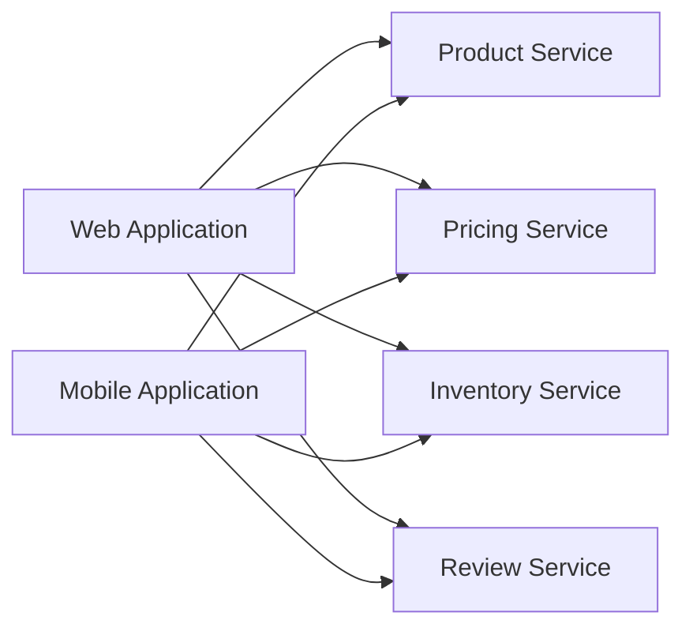

This creates strong coupling between frontend applications and internal microservices.

Two common patterns help solve this:

1. **API Gateway**: a shared entry point that controls and routes API traffic.
2. **Backend for Frontend (BFF)**: a client-specific backend that prepares data for one frontend experience.

They solve related problems, but they are not the same component.

---

# 2. API Gateway

An **API Gateway** is the entry point through which external clients access backend APIs.

Instead of exposing every microservice publicly, the system exposes the gateway.

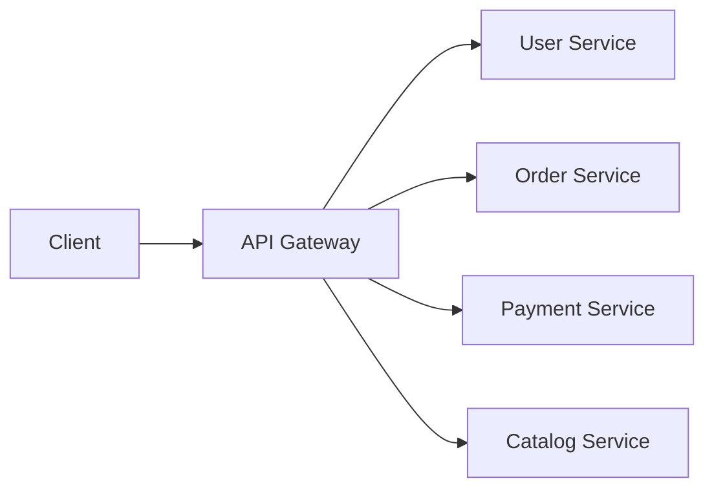

The client sees one public API domain:

```text
https://api.example.com
```

The gateway maps public routes to internal services:

```text
GET  /users/42          -> User Service
GET  /orders/ORD-101    -> Order Service
POST /payments          -> Payment Service
GET  /products          -> Catalog Service
```

## 2.1 Core Responsibilities

### Request Routing

The gateway selects the correct backend based on:

- URL path
- HTTP method
- Hostname
- Header
- API version
- Tenant
- Geographic region

Example:

```text
/api/v1/orders/*  -> Order Service v1
/api/v2/orders/*  -> Order Service v2
```

### Authentication at the Edge

The gateway can validate:

- API keys
- OAuth access tokens
- JWT signatures and standard claims
- mTLS client certificates
- Signed requests

This rejects obviously invalid requests before they reach internal services.

> Authentication at the gateway does not remove the need for authorization inside backend services.

A service must still verify whether the authenticated user is allowed to access a specific resource.

### Rate Limiting and Quotas

Rate limiting protects the backend from:

- Accidental request bursts
- Abusive clients
- Brute-force attempts
- Denial-of-service pressure
- Expensive API usage

Example policy:

```text
Anonymous client:       20 requests/minute
Authenticated customer: 300 requests/minute
Internal partner:       5,000 requests/minute
```

Useful limit dimensions include:

- IP address
- User ID
- API key
- Tenant ID
- Route
- Subscription plan

### TLS Termination

The gateway commonly terminates external HTTPS connections and may create a new encrypted connection to internal services.

```text
Client -- HTTPS --> Gateway -- HTTPS/mTLS --> Backend
```

### Request and Response Transformation

A gateway may perform small protocol-level transformations:

- Add a correlation ID.
- Normalize headers.
- Remove internal headers.
- Rewrite paths.
- Convert a public hostname to an internal route.
- Apply basic schema validation.

Transformation should stay lightweight. Complex business-specific transformation normally belongs in a BFF or application service.

### Load Balancing and Traffic Management

A gateway may distribute requests across healthy service instances and support:

- Weighted routing
- Canary releases
- Blue-green deployments
- Region-based routing
- Header-based routing
- Failover

Example canary rule:

```text
95% traffic -> Checkout v1
5% traffic  -> Checkout v2
```

### API Protection

A gateway can enforce edge controls such as:

- Maximum request body size
- Allowed HTTP methods
- CORS policy
- WAF rules
- Request schema validation
- IP allowlists or blocklists
- Bot and abuse protection

### Logging and Metrics

The gateway provides a central place to measure:

- Request count
- Status codes
- Request latency
- Rejected requests
- Rate-limit events
- Backend response time
- Route-level error rate

## 2.2 API Gateway Request Flow

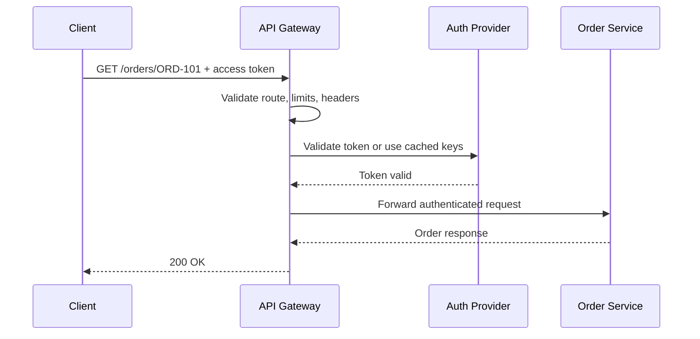

In many deployments, JWT validation uses locally cached public keys, so the gateway does not call the identity provider for every request.

## 2.3 What Should Not Live in the Gateway

The gateway should not become a central business application.

Avoid placing the following in it:

- Pricing calculations
- Order state transitions
- Commission rules
- Inventory reservation logic
- Complex data aggregation
- Long-running workflows
- Database-backed domain logic
- Client-specific screen composition

A good rule is:

> The gateway manages traffic and cross-cutting policies; domain services manage business truth.

---

# 3. Backend for Frontend Pattern

A **Backend for Frontend** is a backend built for the needs of one frontend type or user experience.

Typical BFFs include:

- Web BFF
- Mobile BFF
- Admin Portal BFF
- Partner BFF
- Smart TV BFF

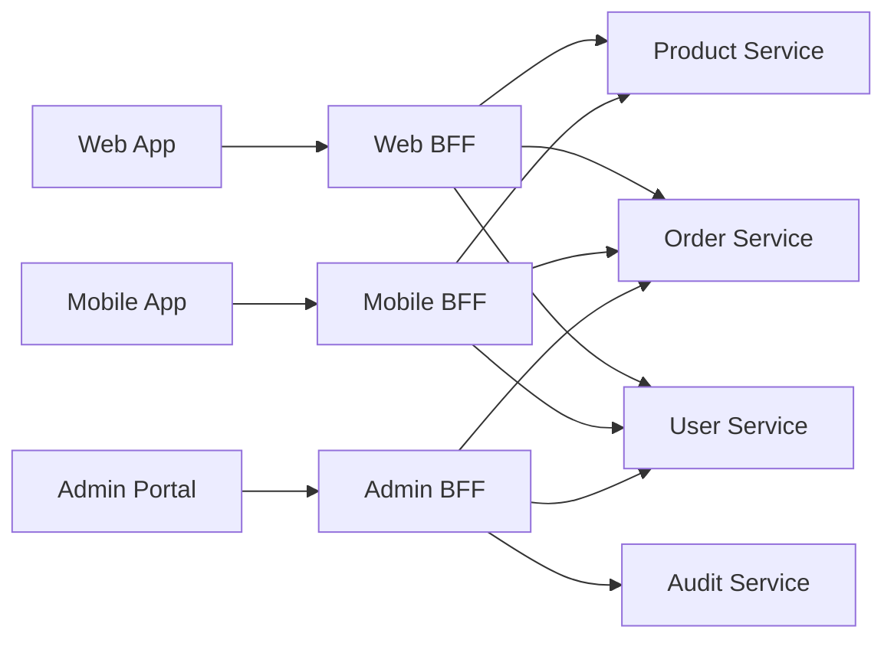

## 3.1 Why Separate BFFs

Different clients often have different requirements.

### Web Application

A desktop web page may need:

- Detailed product information
- Large images
- Reviews
- Recommendations
- Multiple dashboard widgets

### Mobile Application

A mobile client may prefer:

- Smaller payloads
- Fewer round trips
- Compressed images
- Offline-friendly responses
- Backward compatibility for older app versions

### Admin Portal

An admin portal may require:

- Internal operational fields
- Audit data
- Search and filtering
- Bulk actions
- Elevated permissions

Trying to serve every client through one general-purpose endpoint often produces:

- Large responses with unused fields
- Too many client-side API calls
- Conditional logic based on client type
- Slow frontend development
- Coupling between unrelated frontend teams

A BFF lets each frontend evolve around its own use cases.

## 3.2 BFF Responsibilities

### Response Aggregation

The BFF can combine data from several services into one screen-oriented response.

```text
GET /bff/product-page/P100
```

Internally:

```text
Product Service        -> product details
Pricing Service        -> current price
Inventory Service      -> availability
Review Service         -> rating summary
Recommendation Service -> related products
```

Client-facing response:

```json
{
  "product": {
    "id": "P100",
    "name": "Mechanical Keyboard",
    "price": 7499,
    "currency": "INR",
    "inStock": true,
    "rating": 4.6
  },
  "recommendations": [
    {
      "id": "P212",
      "name": "Wireless Mouse",
      "price": 2499
    }
  ]
}
```

The frontend receives exactly what the screen needs.

### Client-Specific Data Shaping

The BFF can:

- Rename fields.
- Remove unnecessary fields.
- Combine nested structures.
- Format dates and currencies.
- Convert service-oriented responses into view-oriented responses.
- Return mobile-friendly payloads.

### Reducing Network Round Trips

Without a BFF:

```text
Frontend -> Product Service
Frontend -> Price Service
Frontend -> Inventory Service
Frontend -> Review Service
```

With a BFF:

```text
Frontend -> BFF
BFF -> services in parallel
BFF -> combined response
```

This is especially useful on high-latency mobile networks.

### Authentication Session Handling

For browser applications, a BFF can act as a confidential OAuth client:

- It performs OAuth/OIDC exchanges.
- It stores access and refresh tokens on the server side.
- The browser receives a secure session cookie instead of raw access tokens.
- The BFF attaches access tokens when calling downstream APIs.

The current IETF browser-based OAuth draft describes the BFF architecture as a strong browser security option. Because it is still an Internet-Draft, teams should track its final standardization and their identity provider's guidance.

### Frontend-Oriented Workflows

A BFF may coordinate a small client-facing workflow, such as:

1. Validate checkout input.
2. Create a draft order.
3. Request a payment session.
4. Return a frontend-ready checkout response.

The core rules still remain in domain services. The BFF coordinates calls but does not become the source of truth.

### Client Compatibility

A mobile BFF can support older app versions while backend services continue evolving.

Example:

```text
X-App-Version: 4.2.0
```

The BFF may map a newer internal response to the older mobile contract.

## 3.3 What Should Not Live in a BFF

A BFF should not own reusable domain behavior such as:

- Final price calculation
- Ledger posting
- Payment settlement
- Stock reservation
- Eligibility decisions
- Order status rules
- Customer master data

These rules belong in the relevant domain service.

A useful boundary is:

```text
BFF: "What data does this screen need?"
Domain service: "What is valid in the business?"
```

---

# 4. API Gateway vs BFF

| Area | API Gateway | Backend for Frontend |
|---|---|---|
| Primary purpose | Control and route API traffic | Serve one frontend experience |
| Scope | Shared across clients and services | Client-specific |
| Main owner | Platform or infrastructure team | Frontend-aligned product team |
| Typical logic | Routing, authentication, limits, TLS, policies | Aggregation, orchestration, data shaping |
| Business logic | Minimal | Minimal; orchestration only |
| Response design | Service/API oriented | Screen or use-case oriented |
| Deployment frequency | Usually controlled and stable | Can evolve with the frontend |
| Data source calls | Usually routes to one upstream | Often calls several upstream services |
| Authentication role | Validates credentials at the edge | May manage browser sessions and tokens |
| Scaling | Based on total API traffic | Based on traffic for one frontend |
| Failure impact | Can affect many APIs | Usually limited to one client experience |

The gateway is a **traffic control layer**.

The BFF is a **frontend adaptation layer**.

---

# 5. Using API Gateway and BFF Together

A mature system often uses both.

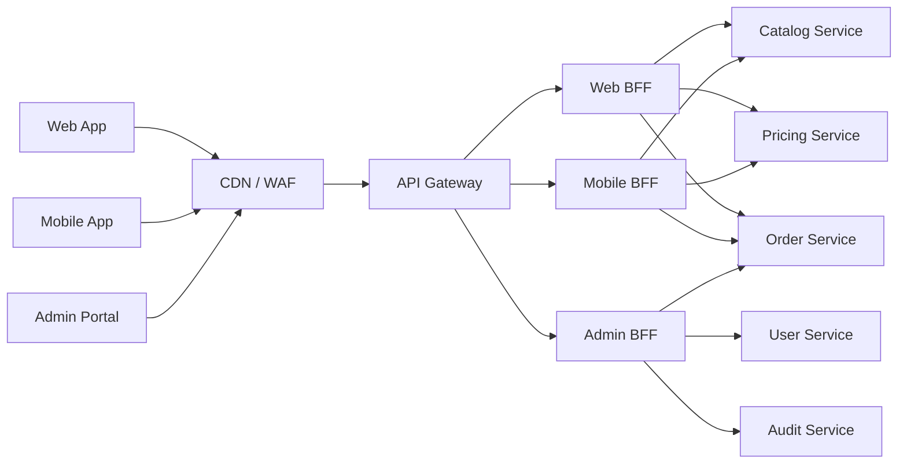

### API Gateway Responsibilities

```text
- Public endpoint
- TLS termination
- Authentication checks
- Rate limiting
- WAF integration
- Route selection
- Request size limits
- Access logging
- Canary routing
```

### BFF Responsibilities

```text
- Client-specific endpoints
- API aggregation
- Response shaping
- Session handling
- Frontend compatibility
- Client-oriented orchestration
```

### Domain Service Responsibilities

```text
- Business validation
- Domain rules
- Data ownership
- Transactions
- Authorization for protected resources
- Event publication
```

## End-to-End Flow

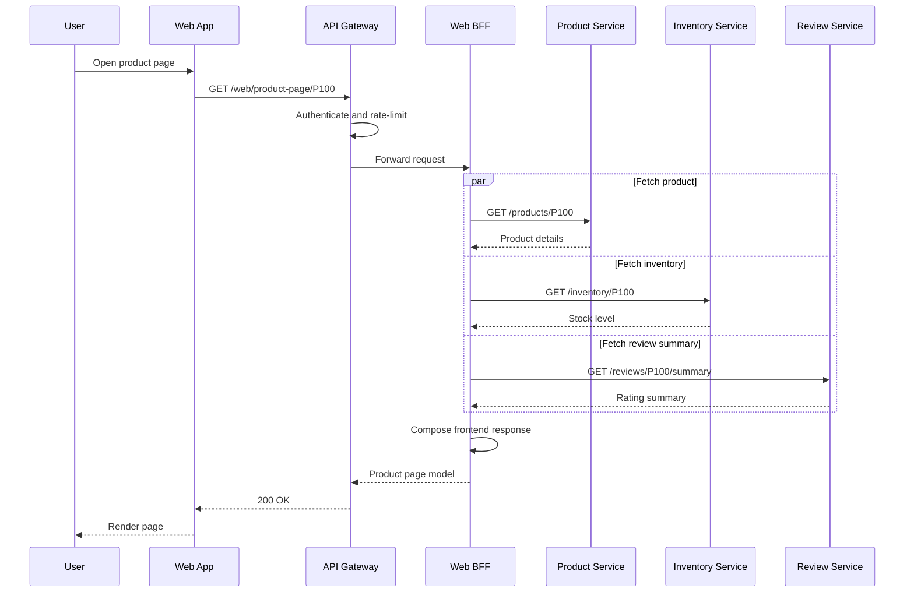

---

# 6. Practical E-Commerce Example

Consider an e-commerce platform with:

- React web application
- Android and iOS applications
- Internal operations portal
- Catalog Service
- Pricing Service
- Inventory Service
- Order Service
- Payment Service
- Customer Service

## Web Product Page

The web page displays:

- Product description
- Full image gallery
- Price and discount
- Delivery estimate
- Inventory
- Review summary
- Recommendations

```text
GET /web-bff/products/P100/page
```

## Mobile Product Page

The mobile application needs:

- Compact product details
- One optimized image
- Price
- Basic stock status
- A small recommendation list

```text
GET /mobile-bff/products/P100/page
```

Possible mobile response:

```json
{
  "id": "P100",
  "name": "Mechanical Keyboard",
  "thumbnail": "https://cdn.example.com/p100-480.webp",
  "price": 7499,
  "available": true,
  "recommended": [
    {
      "id": "P212",
      "name": "Wireless Mouse"
    }
  ]
}
```

The internal services remain the same. Only the client-facing composition changes.

## Admin Order View

The admin portal needs operational data not suitable for customers:

```text
GET /admin-bff/orders/ORD-101/details
```

Response may include:

- Payment attempt history
- Fraud review state
- Inventory reservation
- Shipment events
- Customer support notes
- Audit trail

These fields should not accidentally appear in customer-facing APIs. A separate admin BFF creates a clearer security and contract boundary.

---

# 7. Authentication and Security

## 7.1 Gateway Authentication

The gateway should commonly handle:

- TLS
- Token signature validation
- Standard claim checks
- API key validation
- Rate limiting
- IP policies
- Request size limits
- Basic schema validation

Example JWT checks:

```text
signature is valid
issuer == expected identity provider
audience == expected API
expiration time is valid
token is not used before its valid time
required scope is present
```

## 7.2 Service-Level Authorization

The Order Service must still enforce:

```text
Can user U123 read order ORD-101?
```

The gateway cannot safely make every object-level authorization decision because it may not own the required domain data.

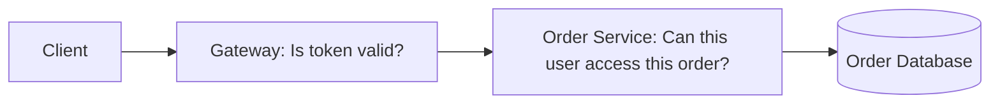

This separation helps address API risks such as broken authentication and broken object-level authorization.

## 7.3 Browser BFF Session Model

A browser-focused BFF can keep OAuth tokens away from browser JavaScript.

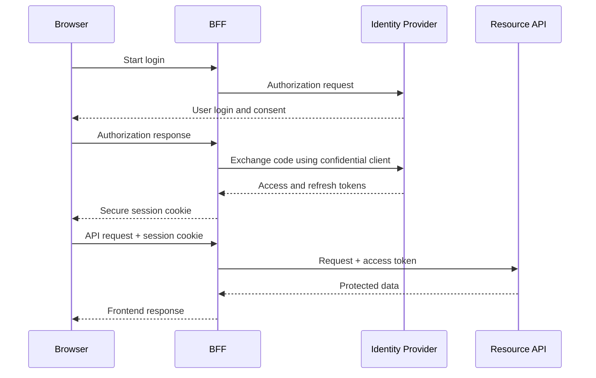

Recommended cookie properties normally include:

```text
HttpOnly
Secure
SameSite=Lax or SameSite=Strict where compatible
Narrow Path and Domain
Appropriate expiration
```

Because cookies are automatically sent by the browser, the BFF must include CSRF protection where required.

## 7.4 Trust Between Internal Components

Common options include:

- mTLS
- Workload identity
- Short-lived service tokens
- Private networks
- Signed internal requests
- Service mesh identity

Do not assume traffic is trusted only because it is inside a private network.

## 7.5 Propagating Identity

A BFF should pass only the identity context required by downstream services.

Example:

```http
Authorization: Bearer <downstream-access-token>
X-Correlation-ID: 8fbeb8ef-9b38-4dc9-a1af-8e9d1f6ce82d
```

Avoid trusting user-supplied identity headers such as:

```http
X-User-ID: admin
```

The gateway should remove or overwrite protected internal headers.

---

# 8. Aggregation, Parallel Calls, and Partial Failure

A BFF often calls multiple services. Sequential calls increase latency.

## Sequential Calls

```text
Product Service:   100 ms
Pricing Service:    80 ms
Inventory Service: 120 ms
Review Service:     90 ms
--------------------------------
Approximate total: 390 ms + network overhead
```

## Parallel Calls

```text
Product Service:   100 ms
Pricing Service:    80 ms
Inventory Service: 120 ms
Review Service:     90 ms
--------------------------------
Approximate total: 120 ms + composition overhead
```

Independent requests should usually run concurrently.

## Example with Python and FastAPI

```python
import asyncio
from typing import Any

import httpx
from fastapi import FastAPI, HTTPException

app = FastAPI()

PRODUCT_URL = "http://product-service"
PRICE_URL = "http://pricing-service"
INVENTORY_URL = "http://inventory-service"


async def fetch_json(
    client: httpx.AsyncClient,
    url: str,
    *,
    required: bool = True,
) -> dict[str, Any] | None:
    try:
        response = await client.get(url)
        response.raise_for_status()
        return response.json()
    except (httpx.TimeoutException, httpx.HTTPError):
        if required:
            raise
        return None


@app.get("/web/products/{product_id}/page")
async def product_page(product_id: str) -> dict[str, Any]:
    timeout = httpx.Timeout(connect=0.3, read=1.0, write=0.5, pool=0.5)

    async with httpx.AsyncClient(timeout=timeout) as client:
        product_task = fetch_json(
            client,
            f"{PRODUCT_URL}/products/{product_id}",
            required=True,
        )
        price_task = fetch_json(
            client,
            f"{PRICE_URL}/prices/{product_id}",
            required=True,
        )
        inventory_task = fetch_json(
            client,
            f"{INVENTORY_URL}/inventory/{product_id}",
            required=False,
        )

        try:
            product, price, inventory = await asyncio.gather(
                product_task,
                price_task,
                inventory_task,
            )
        except httpx.HTTPError as exc:
            raise HTTPException(
                status_code=502,
                detail="Required upstream service failed",
            ) from exc

    return {
        "id": product["id"],
        "name": product["name"],
        "description": product["description"],
        "price": price["amount"],
        "currency": price["currency"],
        "availability": (
            inventory.get("status", "unknown")
            if inventory
            else "unknown"
        ),
    }
```

## Required vs Optional Dependencies

For a product page:

| Dependency | Importance | Failure handling |
|---|---|---|
| Product Service | Required | Fail the request |
| Pricing Service | Required | Fail or return controlled unavailable state |
| Inventory Service | Important | Return `unknown` if temporarily unavailable |
| Review Service | Optional | Hide the review section |
| Recommendation Service | Optional | Return an empty list |

This creates deliberate partial-failure behavior.

## Response Metadata for Partial Results

```json
{
  "product": {
    "id": "P100",
    "name": "Mechanical Keyboard"
  },
  "availability": "unknown",
  "recommendations": [],
  "warnings": [
    {
      "component": "inventory",
      "code": "TEMPORARILY_UNAVAILABLE"
    }
  ]
}
```

Do not expose internal stack traces, hostnames, or exception details.

---

# 9. Caching Strategy

Caching may exist at several layers.

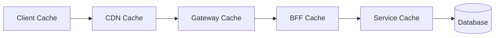

## Gateway or CDN Cache

Useful for:

- Public product catalog responses
- Static reference data
- Public configuration
- Anonymous content

Cache key may include:

```text
HTTP method
path
query parameters
selected headers
tenant
locale
```

Be careful with personalized responses. A shared cache must not serve one user's data to another user.

## BFF Cache

Useful for client-composed data such as:

- Home-page sections
- Navigation configuration
- Feature flags
- Short-lived product summaries
- Aggregated read models

## Service Cache

The domain service is usually the best place to cache reusable business data because it understands:

- Data freshness requirements
- Invalidation rules
- Authorization boundaries
- Domain events

## Cache-Control Example

```http
Cache-Control: public, max-age=60, stale-while-revalidate=30
```

For sensitive or user-specific responses:

```http
Cache-Control: private, no-store
```

---

# 10. Resilience and Performance

## 10.1 Timeouts

Every outbound call needs a timeout.

```text
Client timeout > Gateway timeout > BFF total timeout > Individual service timeout
```

Example budget:

```text
Client timeout:            5.0 seconds
Gateway timeout:           4.0 seconds
BFF request budget:        3.5 seconds
Required service timeout:  1.0 second
Optional service timeout:  0.5 second
```

Timeouts should leave enough time to return a controlled error.

## 10.2 Retries

Retry only when the operation is safe.

Suitable cases:

- Temporary connection failure
- `502 Bad Gateway`
- `503 Service Unavailable`
- `429 Too Many Requests`, when `Retry-After` is respected

Use:

- Small retry count
- Exponential backoff
- Jitter
- Overall deadline

Do not blindly retry non-idempotent operations such as payment or order creation.

For retriable writes, use an idempotency key:

```http
Idempotency-Key: 32ae3958-85ab-4e32-8404-28ef8a73b3c4
```

## 10.3 Circuit Breaker

A circuit breaker temporarily stops calls to an unhealthy dependency.

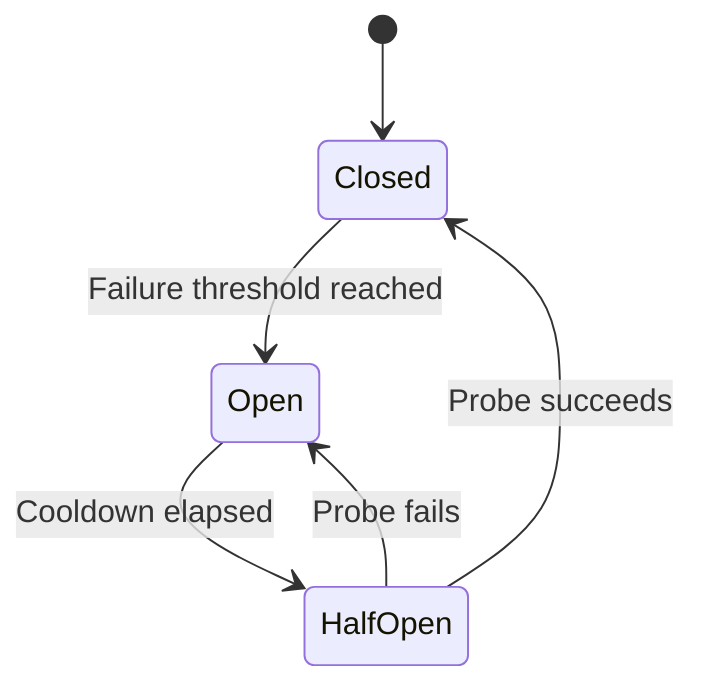

This prevents repeated slow failures from consuming all BFF resources.

## 10.4 Bulkheads

Separate resource pools for unrelated dependencies.

Example:

```text
Recommendation calls -> dedicated concurrency limit
Payment calls        -> separate concurrency limit
```

A slow recommendation service should not exhaust all connections needed for checkout.

## 10.5 Load Shedding

Under heavy traffic, protect core functionality by rejecting or reducing lower-priority work.

Examples:

- Disable recommendations.
- Return cached reviews.
- Reject expensive report generation.
- Preserve login, checkout, and payment capacity.

## 10.6 Payload Optimization

A BFF can reduce:

- Unused fields
- Image size
- Nested response depth
- Duplicate data
- Number of requests

Compression such as Brotli or gzip is useful for text responses, but smaller response contracts are still important.

---

# 11. Scaling and Deployment

## 11.1 Stateless Components

Gateways and BFFs should normally be stateless so any instance can handle any request.

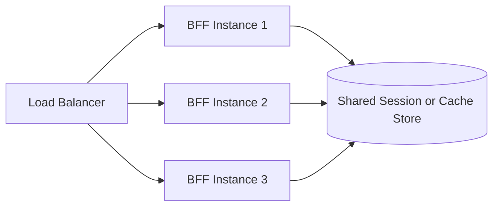

If the BFF uses server-side sessions, store them in a shared system such as Redis or a managed session store rather than process memory.

## 11.2 Independent Scaling

Different clients may have different traffic patterns:

```text
Mobile BFF: 8,000 requests/second
Web BFF:    3,000 requests/second
Admin BFF:     50 requests/second
```

Separate BFFs can scale independently.

## 11.3 Deployment Ownership

A practical ownership model:

| Component | Typical owner |
|---|---|
| CDN, WAF, shared gateway | Platform team |
| Web BFF | Web product team |
| Mobile BFF | Mobile product team |
| Admin BFF | Internal tools team |
| Domain services | Domain-aligned backend teams |

The BFF should usually be deployed with or closely coordinated with its frontend contract.

## 11.4 Multi-Region Design

A global system may deploy:

- CDN and WAF globally
- Regional API gateways
- Regional BFF instances
- Regional service clusters
- Replicated data stores where the domain permits

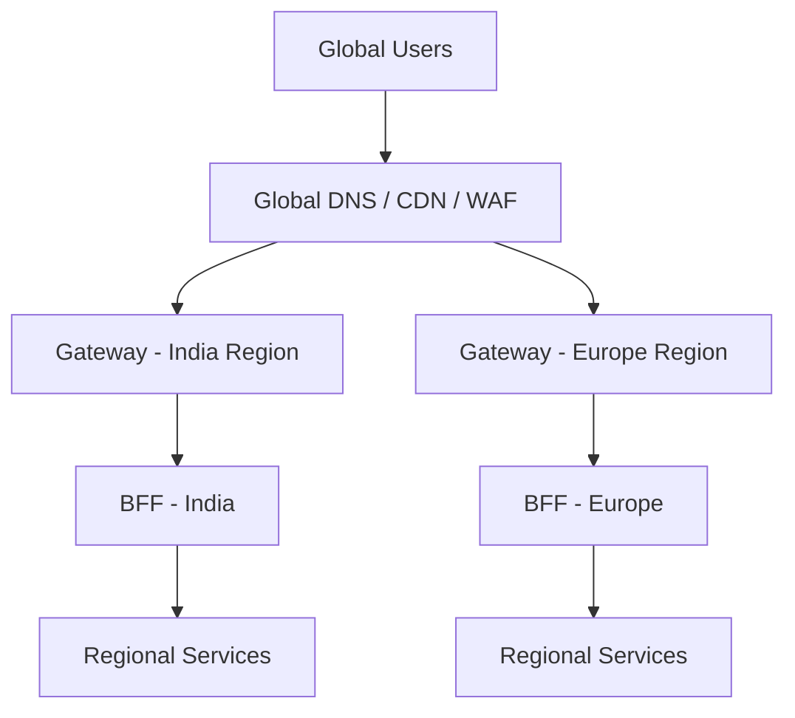

Routing must consider data residency, session affinity, replication delay, and failover behavior.

---

# 12. Observability

Because the gateway and BFF sit in the request path, weak observability makes failures difficult to diagnose.

## 12.1 Correlation and Trace Context

Create or propagate a request identifier:

```http
X-Request-ID: 8fbeb8ef-9b38-4dc9-a1af-8e9d1f6ce82d
traceparent: 00-4bf92f3577b34da6a3ce929d0e0e4736-00f067aa0ba902b7-01
```

Use the same trace across:

```text
Client -> Gateway -> BFF -> Product Service -> Database
```

## 12.2 Important Metrics

### Gateway Metrics

- Requests per route
- Authentication failures
- Rate-limit rejections
- `4xx` and `5xx` rate
- Upstream connection failures
- Gateway latency
- Backend latency

### BFF Metrics

- Endpoint latency
- Upstream latency by service
- Aggregation failure rate
- Partial-response rate
- Timeout count
- Retry count
- Circuit-breaker state
- Cache hit ratio
- Active requests
- Connection-pool saturation

## 12.3 Latency Percentiles

Do not rely only on average latency.

Track:

```text
p50: typical request
p95: slower user experience
p99: tail latency and dependency issues
```

For aggregated endpoints, one slow downstream dependency can dominate tail latency.

## 12.4 Structured Logs

Example:

```json
{
  "timestamp": "2026-08-03T06:25:00Z",
  "level": "INFO",
  "request_id": "8fbeb8ef-9b38-4dc9-a1af-8e9d1f6ce82d",
  "trace_id": "4bf92f3577b34da6a3ce929d0e0e4736",
  "route": "/web/products/{id}/page",
  "method": "GET",
  "status": 200,
  "duration_ms": 184,
  "upstreams": {
    "product_ms": 80,
    "pricing_ms": 66,
    "inventory_ms": 112
  }
}
```

Avoid logging:

- Access tokens
- Session cookies
- Passwords
- Payment details
- Sensitive personal data
- Full request bodies by default

---

# 13. API Versioning and Contract Ownership

## Public Gateway Contract

The API Gateway exposes stable public routes.

Examples:

```text
/api/v1/orders
/api/v2/orders
```

## BFF Contract

The BFF contract is owned by a specific frontend experience.

Examples:

```text
/web/v2/home
/mobile/v5/home
/admin/v1/order-search
```

A BFF contract can be screen-oriented, but avoid coupling it to minor UI component names that change frequently.

Prefer:

```text
GET /mobile/v2/product-details/P100
```

Over:

```text
GET /mobile/v2/right-side-card/P100
```

## Backward Compatibility

Mobile clients cannot always be upgraded immediately.

A mobile BFF may need to support several active app versions:

```text
Mobile 8.x -> BFF contract v3
Mobile 7.x -> BFF contract v2
Mobile 6.x -> limited support
```

Track usage before removing older contracts.

## Contract Validation

Use:

- OpenAPI specifications
- JSON Schema
- Consumer-driven contract tests
- Compatibility checks in CI/CD
- Deprecation headers and documentation

---

# 14. Testing Strategy

## Unit Tests

Test BFF composition logic:

- Field mapping
- Optional service fallback
- Error translation
- Version-specific response shaping

## Integration Tests

Run the BFF against:

- Real test services
- Service emulators
- Containers
- Test identity provider
- Test gateway policies

Verify timeouts, headers, authentication context, and response contracts.

## Contract Tests

A BFF is a consumer of several services.

Contract tests help detect changes such as:

```text
Pricing Service renamed "amount" to "value"
Inventory Service removed "availableQuantity"
```

## End-to-End Tests

Test important flows through the real entry path:

```text
Client -> Gateway -> BFF -> Services
```

Important examples:

- Login
- Product page
- Checkout
- Order history
- Admin order search

## Resilience Tests

Test:

- Slow downstream service
- `503` response
- Timeout
- Malformed response
- Partial dependency failure
- Circuit-breaker transition
- Cache failure
- Gateway rate limiting

---

# 15. When to Use Each Pattern

## Use an API Gateway When

- Several services need one controlled public entry point.
- Authentication and rate limiting should be centralized.
- Services should not be directly exposed.
- Traffic splitting or canary routing is required.
- Central API monitoring and governance are important.
- Multiple protocols or upstream systems must be routed consistently.

## Use a BFF When

- Web, mobile, and admin clients need substantially different data.
- A screen requires aggregation from multiple services.
- Mobile latency and payload size matter.
- Frontend teams need independent API evolution.
- Browser tokens should be kept server-side.
- Client compatibility logic is becoming complex.

## Use Both When

- A system has multiple external clients and multiple internal services.
- Shared edge controls are required.
- Each client also needs tailored aggregation and contracts.

## A Simpler Design May Be Better When

- The application has one frontend.
- The backend is a small modular monolith.
- Most endpoints map directly to one backend operation.
- There is little client-specific transformation.
- Operational capacity for extra services is limited.

Possible simple architecture:

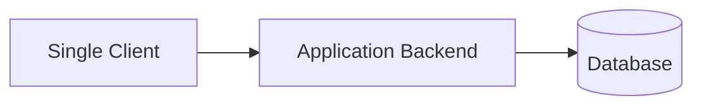

Patterns should reduce complexity, not add components without a clear need.

---

# 16. Design Checklist

## API Gateway

- [ ] Are public routes clearly defined?
- [ ] Are TLS and security headers configured?
- [ ] Are authentication tokens validated?
- [ ] Are protected internal headers overwritten?
- [ ] Are rate limits defined by user, client, tenant, or route?
- [ ] Are request size and timeout limits configured?
- [ ] Are access logs and metrics enabled?
- [ ] Is canary or rollback routing available?
- [ ] Are backend services private where possible?
- [ ] Is service-level authorization still enforced?

## BFF

- [ ] Is the BFF aligned with one frontend or experience?
- [ ] Does it return only client-relevant data?
- [ ] Are independent service calls parallelized?
- [ ] Are required and optional dependencies identified?
- [ ] Are timeouts and deadlines explicit?
- [ ] Are retries limited to safe operations?
- [ ] Are partial failures handled deliberately?
- [ ] Is core business logic kept in domain services?
- [ ] Are tokens and session cookies handled securely?
- [ ] Are contracts versioned and tested?
- [ ] Are trace IDs propagated?
- [ ] Can the BFF scale horizontally?

---

# 17. Key Takeaways

1. **An API Gateway is a shared traffic-management and policy-enforcement layer.**

2. **A BFF is a client-specific adaptation and aggregation layer.**

3. **The gateway should manage routing, authentication checks, rate limits, TLS, and edge policies.**

4. **The BFF should manage client-specific response composition, orchestration, compatibility, and optionally browser session handling.**

5. **Core domain rules must remain inside domain services.**

6. **A service must still perform resource-level authorization even when the gateway validates the caller's token.**

7. **BFF aggregation needs strict timeouts, parallel calls, partial-failure decisions, and distributed tracing.**

8. **Separate BFFs are valuable when client requirements differ meaningfully, not merely because several frontend technologies exist.**

9. **Using an API Gateway and BFF together creates a clean separation between edge concerns, client experience, and domain logic.**

10. **For small systems, a single backend may remain the clearest and most maintainable design.**

---

# 18. References

The following primary and official references were reviewed for current terminology and guidance:

1. [Amazon API Gateway Documentation](https://docs.aws.amazon.com/apigateway/latest/developerguide/welcome.html)
2. [Microsoft Azure Architecture Center — Backends for Frontends Pattern](https://learn.microsoft.com/en-us/azure/architecture/patterns/backends-for-frontends)
3. [Google Cloud — API Gateway Architecture](https://docs.cloud.google.com/api-gateway/docs/architecture-overview)
4. [IETF Draft — OAuth 2.0 for Browser-Based Applications](https://datatracker.ietf.org/doc/html/draft-ietf-oauth-browser-based-apps)
5. [OWASP API Security Top 10 — 2023](https://owasp.org/API-Security/editions/2023/en/0x11-t10/)
6. [Kubernetes Documentation — Gateway API](https://kubernetes.io/docs/concepts/services-networking/gateway/)

> **Version note:** The IETF browser-based applications document referenced above was still an Internet-Draft when this guide was prepared on 3 August 2026. Confirm its current status before treating it as a finalized standard.
