# Caching Layers and the Stampede Problem

> Where caching actually lives — browser, CDN, application, database — and how a cache stampede takes a system down the moment a hot key expires.

## In short

- Caching is layered: browser → CDN/edge → gateway → in-process L1 → distributed L2 such as Redis → database buffer and OS page cache, and each layer exists to absorb the misses of the one in front of it.
- Cache-aside is the default application pattern — check the cache, on a miss read the database and store the result; on a write, update the database and delete the key rather than rewriting it.
- A TTL is a correctness decision, not a performance knob: it bounds how stale the system may become when explicit invalidation does not happen, and eviction can remove an entry earlier, so every read must handle a miss.
- A cache stampede is many requests missing the *same hot key* at the same instant and all repeating the same expensive load — 10,000 requests/second against a 200 ms rebuild is roughly 2,000 concurrent recomputations.
- The three mitigations that matter: single-flight plus a leased distributed lock so one caller rebuilds while the rest wait or take stale data; stale-while-revalidate so a soft-expired value is served during a background refresh; TTL jitter so groups of keys stop expiring together.
- Jitter fixes the avalanche (many keys expiring at once), not the single hot key — coalescing, locking, or stale serving is what protects one key.
- Design for the cache being gone: an outage sends full traffic to the database, so concurrency limits, deadlines, backoff, and circuit breakers belong on the fallback path.

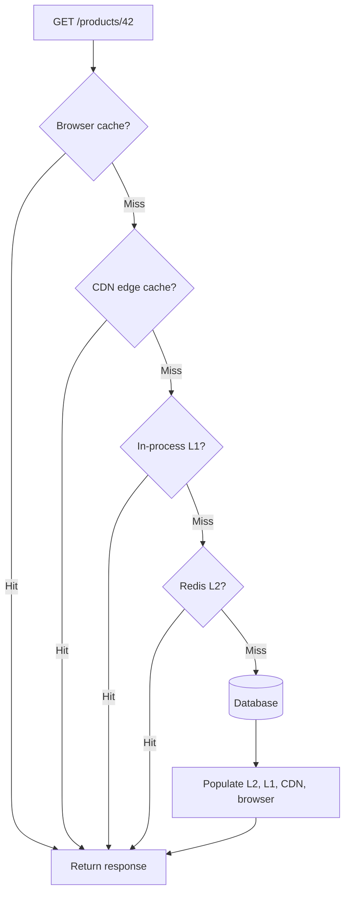

**Interview answer:** A request falls through browser, CDN, in-process L1, and Redis L2 before it reaches the database, and each layer protects the layer behind it. A stampede happens when one hot key expires and every concurrent request misses at the same moment, so they all run the same expensive query — the fix is to let exactly one caller rebuild the value, using in-process single-flight plus a leased Redis lock, while the others either wait within a bounded budget or receive the stale value under stale-while-revalidate. Add TTL jitter so unrelated keys stop expiring in lockstep, and cap concurrent database loads so a cache outage cannot turn into a database outage.

**Gotcha:** Treating TTL jitter as stampede protection. Jitter only spreads out a *group* of keys that would expire together; one extremely hot key still collapses onto the database at its single expiry moment unless coalescing, a lock, or stale serving is in place.

---

# 1. Why Caching Is Used

A cache stores a copy of data in a location that is faster or closer to the consumer than the original source.

For example, retrieving a product from Redis may take a few milliseconds, while retrieving the same product by running joins against a relational database may take much longer.

Caching commonly improves:

- **Latency:** Responses are returned faster.
- **Throughput:** The system handles more requests with the same backend resources.
- **Database protection:** Repeated reads do not continuously reach the primary database.
- **Availability:** Some layers can continue serving previously cached content during a temporary origin failure.
- **Cost:** Fewer database queries, API calls, computations, and network transfers may be required.

However, caching introduces important trade-offs:

- Cached data can become stale.
- Invalidation becomes part of the correctness model.
- A cache failure can suddenly expose the backend to full traffic.
- Popular expired keys can create a cache stampede.
- Different cache layers can disagree about which value is current.

Caching should therefore be treated as a **distributed data-management problem**, not only as a performance optimization.

---

# 2. The Main Caching Layers

A typical web application may contain several cache layers.

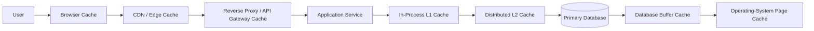

The layers do not always appear in this exact order. For example, an application checks its in-process cache before calling Redis, while a database checks its own buffer cache internally while executing a query.

## 2.1 Layer 1: Client and Browser Cache

The browser can cache static resources and HTTP responses:

- JavaScript bundles
- CSS files
- Fonts
- Images
- Public API responses
- Previously validated resources

The server controls HTTP caching through headers such as:

```http
Cache-Control: public, max-age=3600
ETag: "product-v42"
```

Important directives include:

| Directive | Meaning |
|---|---|
| `public` | The response may be stored by shared caches such as a CDN. |
| `private` | The response is intended for a private client cache, usually one browser. |
| `max-age=300` | The response is considered fresh for 300 seconds. |
| `s-maxage=300` | Freshness lifetime for shared caches. |
| `no-cache` | The response may be stored, but it must be revalidated before reuse. |
| `no-store` | The response should not be stored. |
| `immutable` | The resource is not expected to change during its freshness lifetime. |
| `stale-while-revalidate=30` | A stale response may be served while it is refreshed. |
| `stale-if-error=300` | A stale response may be served when the origin fails. |

### Best use cases

Browser caching works especially well for versioned static assets such as `/app.94f3a8.js` and `/styles.18ac21.css`.

Because the filename changes when the content changes, the asset can safely use a long TTL: `Cache-Control: public, max-age=31536000, immutable`

### Security consideration

Do not place user-specific or sensitive data in a shared cache unless the cache key and response directives correctly isolate users. A personalized response accidentally marked `public` can leak information across users.

---

## 2.2 Layer 2: CDN and Edge Cache

A Content Delivery Network stores content at geographically distributed edge locations close to users.

Typical cached content includes:

- Images, videos, CSS, and JavaScript
- Public HTML pages
- Product catalog responses
- Public API responses
- Generated reports that are safe to share
- Downloadable files

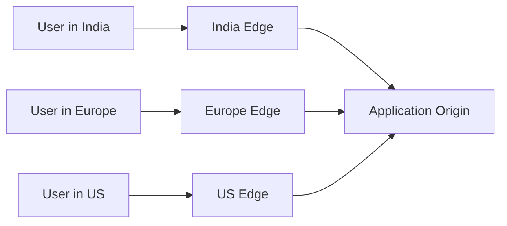

### Benefits

- Lower user-perceived latency
- Reduced traffic to the application origin
- Better handling of traffic spikes
- Less cross-region network traffic
- Additional resilience when stale content can be served

### Mid-tier and origin-shield caching

A CDN may add another cache layer between edge locations and the origin:

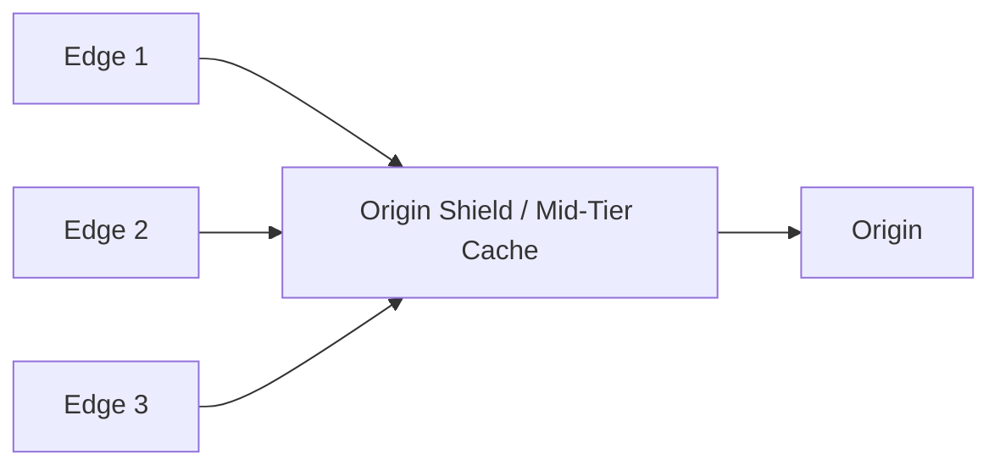

Without the shield, several edge locations missing the same object may independently request it from the origin. The shield aggregates those misses and reduces redundant origin requests.

### Cache-key design at the CDN

The CDN cache key may include:

- Path
- Query parameters
- Selected headers
- Cookies
- Language
- Device type
- Authentication state

Including too many dimensions reduces the hit ratio because logically equivalent requests create different entries. Including too few dimensions risks returning the wrong representation.

---

## 2.3 Layer 3: Reverse Proxy and API Gateway Cache

A reverse proxy or API gateway can cache responses before requests reach application services.

Examples include:

- NGINX proxy cache
- Varnish
- API gateway response cache
- Service-mesh sidecar cache
- GraphQL gateway cache

This layer is useful when several application instances produce the same public response.

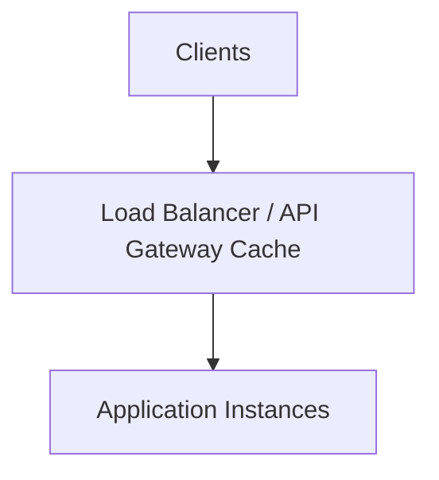

### Suitable data

- Public reference data
- Configuration returned to all users
- Country, currency, and language lists
- Public product catalog pages
- Expensive but shareable API responses

### Less suitable data

- Highly personalized data
- Rapidly changing balances
- Authorization-sensitive responses
- Responses whose cache keys would become extremely high-cardinality

---

## 2.4 Layer 4: In-Process Application Cache

An in-process cache stores data inside the memory of one application instance.

Common implementations include:

- Python dictionaries with an LRU wrapper
- Java Caffeine
- Guava Cache
- Node.js LRU libraries
- Go local maps guarded by synchronization
- Framework-specific memory caches

This is often called an **L1 cache**.

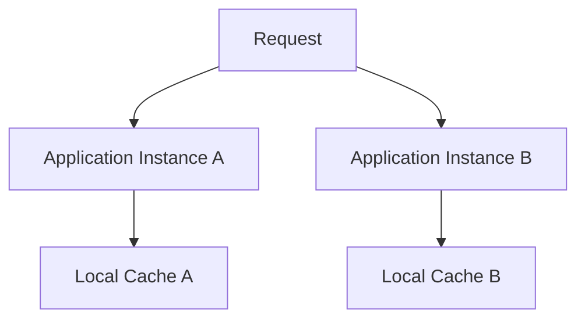

### Advantages

- Very low latency
- No network call
- Useful for small and frequently reused data
- Reduces load on the distributed cache

### Limitations

- Every process contains a separate copy.
- Entries are lost when the process restarts.
- Invalidation must reach all instances.
- Memory usage is multiplied by the number of instances.
- One instance may serve an older value than another.

### Suitable data

- Parsed configuration
- Public feature metadata
- Static lookup tables
- Serialization results
- Short-lived copies of very hot Redis entries
- Expensive pure-function results

### Important rule

An in-process cache should normally be **small, bounded, and time-limited**. An unbounded local cache can become a memory leak.

---

## 2.5 Layer 5: Distributed Cache

A distributed cache is shared by multiple application instances.

Common systems include:

- Redis
- Valkey
- Memcached
- Managed cloud cache services

This layer is often called an **L2 cache**.

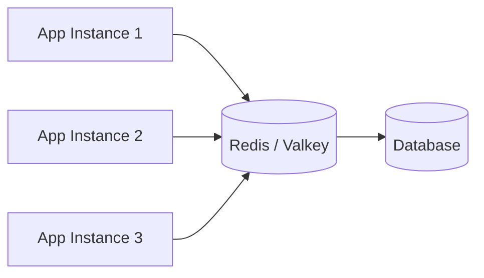

### Advantages

- Shared view across application instances
- Centralized TTL and eviction
- Supports atomic operations
- Can store counters, sessions, rate-limit state, and cached objects
- Easier to invalidate than many independent local caches

### Limitations

- Adds a network dependency.
- The cache can become a bottleneck.
- Hot keys can overload one shard.
- Serialization and deserialization consume CPU.
- A cache outage may send full traffic to the database.
- Distributed locking requires careful ownership and expiry handling.

### Common cached values

- User sessions
- Product details
- Permissions
- Search results
- Feature flags
- Exchange-rate snapshots
- Aggregated dashboard data
- Third-party API responses
- Computed pricing or eligibility results

---

## 2.6 Layer 6: Database and Operating-System Cache

Even without Redis, databases already use caching.

A database may cache:

- Data pages
- Index pages
- Query plans
- Metadata
- Prepared statements

PostgreSQL, for example, uses shared buffers, while the operating system also keeps recently used file pages in memory.

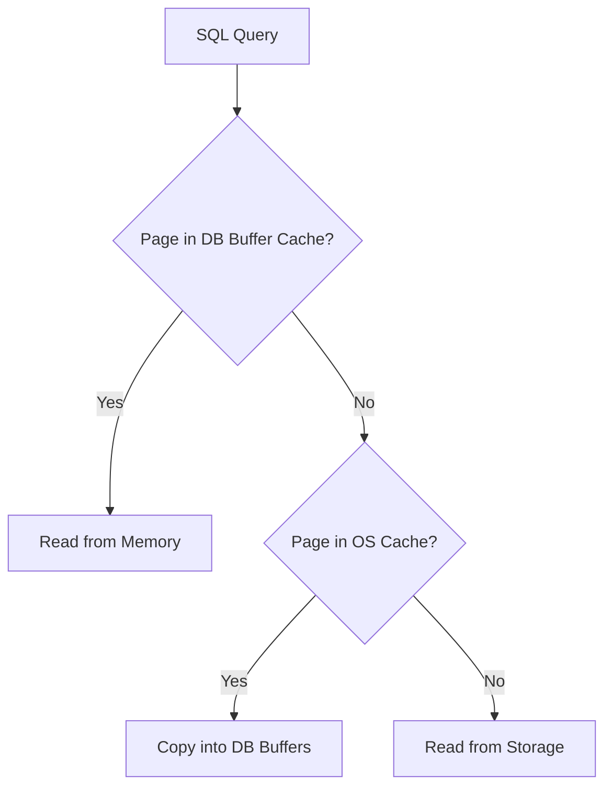

This is why the same SQL query can be much faster on its second execution even when the application has no explicit cache.

### Important distinction

A database buffer cache stores low-level pages used by many queries. An application cache usually stores a complete business-level result, such as:

```json
{
  "product_id": 42,
  "name": "Mechanical Keyboard",
  "price": 7999,
  "availability": "in_stock"
}
```

Application caching can avoid query parsing, joins, row processing, network transfer, and object construction—not only disk reads.

---

# 3. How Requests Move Through Multiple Cache Layers

Consider a public product-detail request `GET /products/42`.

The browser checks its own cache first. On a miss it asks the CDN, which checks its edge cache. On a CDN miss the request is forwarded to the application, which checks its in-process L1 cache, then Redis as the shared L2, and only then queries the database. On the way back, every layer stores what it is permitted to store: the application writes the value into Redis and keeps a short-lived local copy, the CDN stores the public response, and the browser keeps it if the response directives allow. The condensed form of that path is the flow diagram in **In short** above.

Each layer protects the layer behind it.

A useful mental model is:

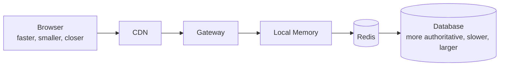

The closer a cache is to the user, the faster it can respond. The closer data is to the primary database, the more authoritative it generally is.

---

# 4. Common Cache Access Patterns

Caching layers describe **where** data is stored. Cache access patterns describe **how** reads and writes interact with the cache and database.

## 4.1 Cache-Aside

Cache-aside is the most common application-level pattern.

The application explicitly checks the cache. On a miss, it reads from the database and stores the result.

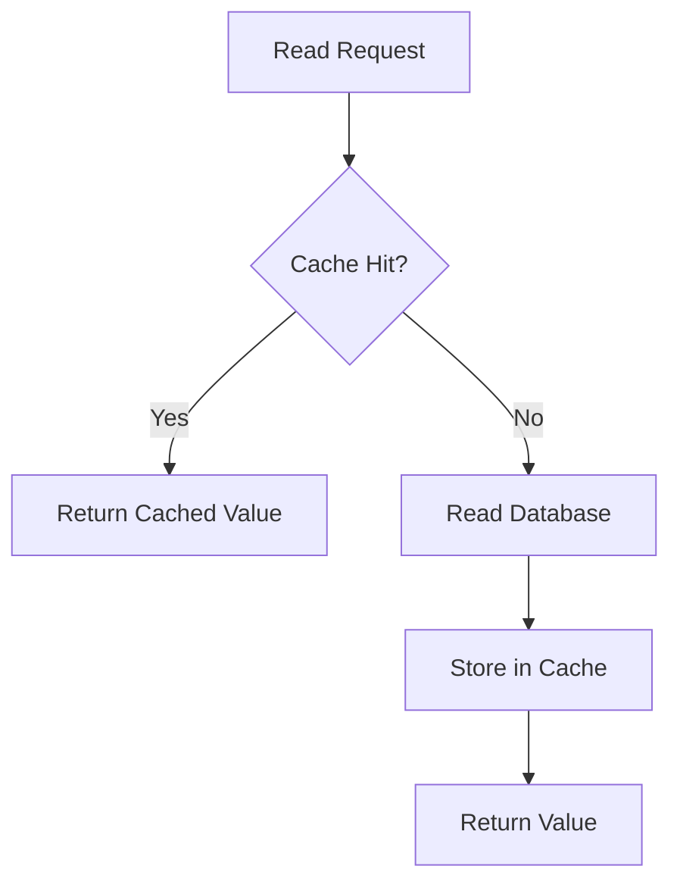

### Read pseudocode

```python
def get_product(product_id):
    key = f"product:{product_id}"

    cached = cache.get(key)
    if cached is not None:
        return deserialize(cached)

    product = database.get_product(product_id)

    if product is not None:
        cache.set(key, serialize(product), ttl=300)

    return product
```

### Write flow

A common write flow is:

1. Update the database.
2. Delete the cache entry.
3. Allow the next read to repopulate the cache.

```python
def update_product(product_id, changes):
    database.update_product(product_id, changes)
    cache.delete(f"product:{product_id}")
```

Deleting is often safer than directly rewriting because the database remains the source of truth, and the next reader reconstructs the correct cache representation.

### Strengths

- Simple
- Only requested data is cached
- Cache failure can be handled as a miss
- Works well for read-heavy systems

### Weaknesses

- The first request is slow.
- A popular missing or expired key can cause a stampede.
- Invalidation and database updates are not automatically atomic.

---

## 4.2 Read-Through

With read-through caching, the application asks the cache for data, and the cache abstraction loads the value from the data source when required: `Application → Cache Provider → Database`.

The application does not directly implement the miss-loading logic.

### Use case

Read-through works well when a framework or caching library provides a standard loader:

```python
product = cache.get_or_load(
    key=f"product:{product_id}",
    loader=lambda: database.get_product(product_id),
)
```

Request coalescing is easier to centralize in this abstraction.

---

## 4.3 Write-Through

In write-through caching, a write is synchronously applied through the cache layer to the database.

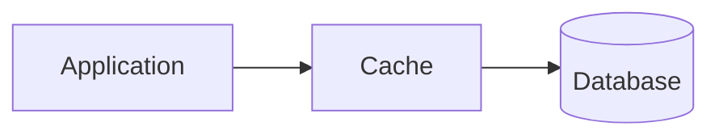

The write completes only after the required stores are updated.

### Advantages

- Cache and database are more likely to remain aligned.
- Recently written data is immediately warm.
- Read paths become predictable.

### Trade-offs

- Higher write latency
- More cache writes, including data that may never be read
- Failure handling becomes more complex

---

## 4.4 Write-Behind

In write-behind, also called write-back, the application writes to the cache first. The database is updated asynchronously later.

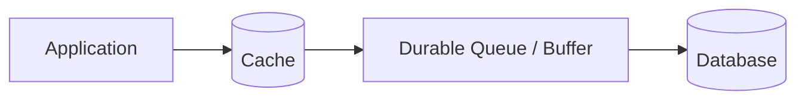

### Advantages

- Very low write latency
- Writes can be batched
- Useful for high-volume counters or event-like workloads

### Risks

- Data may be lost if the cache or asynchronous pipeline fails.
- Reads from the database can temporarily be stale.
- Ordering, retries, deduplication, and durability become critical.
- It should not be used casually for financial or strongly consistent state.

A production write-behind design normally needs a durable queue or log rather than relying only on volatile cache memory.

---

## 4.5 Refresh-Ahead

Refresh-ahead updates a cached value before it expires.

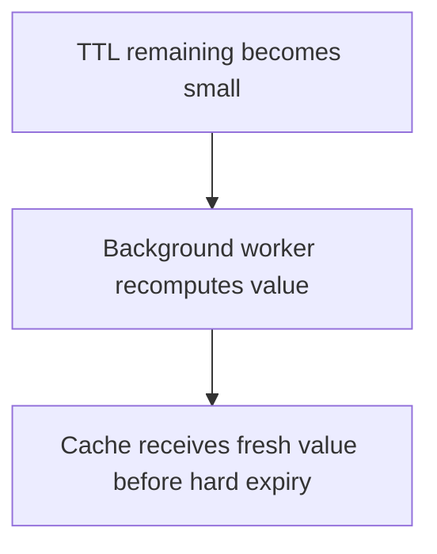

This pattern is useful for:

- Predictably popular keys
- Expensive reports
- Homepage content
- Exchange-rate snapshots
- Frequently accessed configuration
- Data with known refresh intervals

Refresh-ahead reduces user-facing misses, but it may waste work refreshing values that are no longer requested.

---

# 5. Cache Keys, TTLs, Invalidation, and Eviction

## 5.1 Cache-key design

A cache key should represent every input that changes the returned value, for example `product:v3:{product_id}:{currency}:{language}` — which for product 42 in INR and English becomes `product:v3:42:INR:en`.

The version component is useful when the serialized schema or business logic changes.

### Good key properties

- Deterministic
- Namespaced
- Easy to inspect
- Contains required dimensions
- Avoids sensitive raw information
- Has controlled cardinality
- Supports versioning

### Avoid accidental collisions

These two requests should not use the same cache entry: `GET /prices/42?currency=INR` and `GET /prices/42?currency=USD`.

If currency is not part of the key, one user may receive the wrong price.

---

## 5.2 TTL selection

A TTL is not only a performance setting. It defines how stale the system is allowed to become when explicit invalidation does not occur.

A reasonable TTL depends on:

- Business freshness requirement
- Update frequency
- Cost of recomputation
- Request frequency
- Impact of stale data
- Invalidation reliability
- Database capacity during misses

Example starting points:

| Data | Possible TTL |
|---|---:|
| Versioned static asset | Months or one year |
| Country/currency list | Hours or days |
| Public product details | Minutes |
| Product inventory | Seconds, event-driven invalidation, or no shared cache |
| User permissions | Seconds to minutes with explicit invalidation |
| Bank balance | Usually not served from an ordinary stale cache |
| Expensive daily report | Until the next scheduled generation |

These values are examples, not universal rules.

---

## 5.3 Invalidation

The classic statement “cache invalidation is hard” is true because the application must decide when every derived cached representation is no longer valid.

Common invalidation approaches include:

### TTL-only invalidation

The entry expires automatically: `SET product:42 <value> EX 300`.

Simple, but stale data can remain until expiry.

### Explicit invalidation

Delete related keys after a successful write.

```text
UPDATE database
DELETE product:42
DELETE category:7:products
DELETE homepage:featured
```

This improves freshness but requires dependency tracking.

### Event-driven invalidation

A service publishes a domain event:

```json
{
  "event": "product.price.changed",
  "product_id": 42
}
```

Consumers invalidate or refresh related entries.

This scales better across services, but delivery must be reliable and idempotent.

### Versioned keys

Instead of deleting old entries, change the key version, for example `catalog:v17:category:7`.

Old entries naturally expire later. This is useful for deployments and bulk data refreshes.

---

## 5.4 Eviction

Expiration and eviction are different:

- **Expiration:** The entry becomes invalid because its TTL ends.
- **Eviction:** The cache removes an entry to free memory.

Common eviction policies include:

- LRU-like policies: remove less recently used data
- LFU-like policies: remove less frequently used data
- TTL-based selection
- Random eviction
- No eviction, causing writes to fail when memory is full

An application should not assume a key will exist until its TTL. Memory pressure may evict it earlier.

Therefore, every cache read must safely handle a miss.

---

# 6. The Cache Stampede Problem

A cache stampede occurs when many requests simultaneously discover that the same popular cache entry is absent or expired. Each request then performs the same expensive backend work.

Assume:

- `product:42` receives 5,000 requests per second.
- Its TTL ends at exactly 12:00:00.
- Loading it requires a complex database query.
- Every application instance follows basic cache-aside logic.

At expiry:

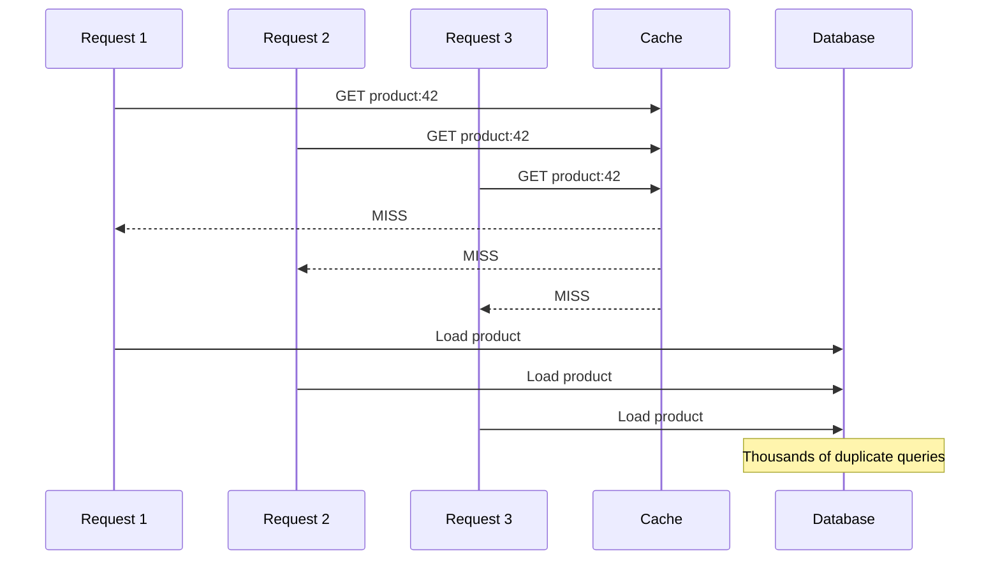

The cache was intended to reduce database load, but its synchronized miss creates a sudden burst against the database.

## 6.1 Why a stampede becomes dangerous

The failure can amplify:

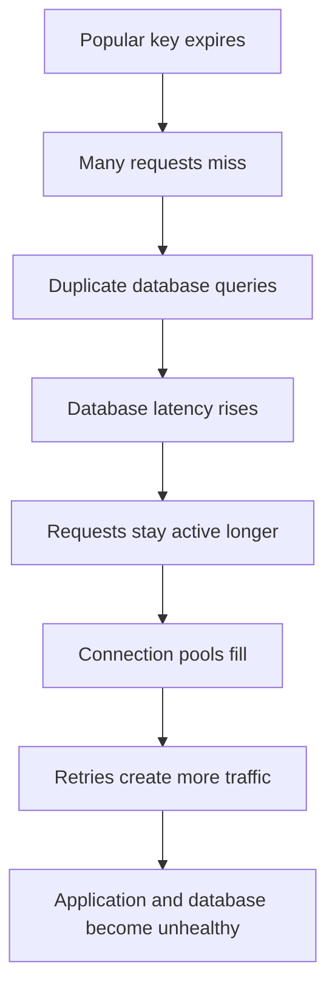

This is a positive feedback loop.

## 6.2 Common triggers

- A highly popular key reaches its TTL.
- A deployment clears local caches.
- Redis restarts or fails over with a cold cache.
- A bulk invalidation deletes many keys.
- Many keys were created with the same TTL and expire together.
- A new region or application cluster starts with an empty cache.
- A previously unpopular key suddenly becomes viral.
- A cache shard fails and traffic moves elsewhere.

## 6.3 A simple load calculation

Suppose:

- Request rate for one hot key: `10,000 requests/second`
- Database recomputation time: `200 ms`
- No stampede protection

The number of overlapping recomputations can approach: `10,000 × 0.2 = 2,000 concurrent recomputations`

With request coalescing, the system may perform approximately one recomputation per cache scope while the other callers wait or receive stale data.

This difference can determine whether the database remains healthy.

---

# 7. Related Cache Failure Patterns

The terms below are related but describe different problems.

## 7.1 Cache stampede

Many requests miss the **same hot key** and recompute it concurrently: `one hot key → many duplicate loads`.

## 7.2 Cache avalanche

Many keys expire or become unavailable around the same time: `many keys → broad backend traffic spike`.

TTL jitter and staged warming are especially helpful here.

## 7.3 Cache penetration

Requests repeatedly ask for data that does not exist, so every request reaches the database: `missing key → cache miss → database miss → repeat`.

Negative caching, input validation, Bloom filters, and abuse controls may help.

## 7.4 Hot-key problem

One key receives a disproportionately large amount of traffic and overloads one cache node, CPU core, network path, or lock.

A hot key can exist even when it does not expire.

Possible mitigations include:

- Local L1 caching
- Replicated read paths
- CDN caching
- Read-only key duplication or sharding where semantics allow
- Request coalescing
- Short stale-serving windows
- Avoiding excessively large cached values

## 7.5 Cache inconsistency

The cache and source of truth contain different values because invalidation, write ordering, or event delivery failed.

Stampede prevention protects availability. It does not automatically solve consistency.

---

# 8. Techniques for Preventing a Cache Stampede

No single technique fits every system. Production designs often combine several approaches.

## 8.1 Request Coalescing (Single-Flight)

Request coalescing allows only one request to load a missing value while other requests wait for the same result.

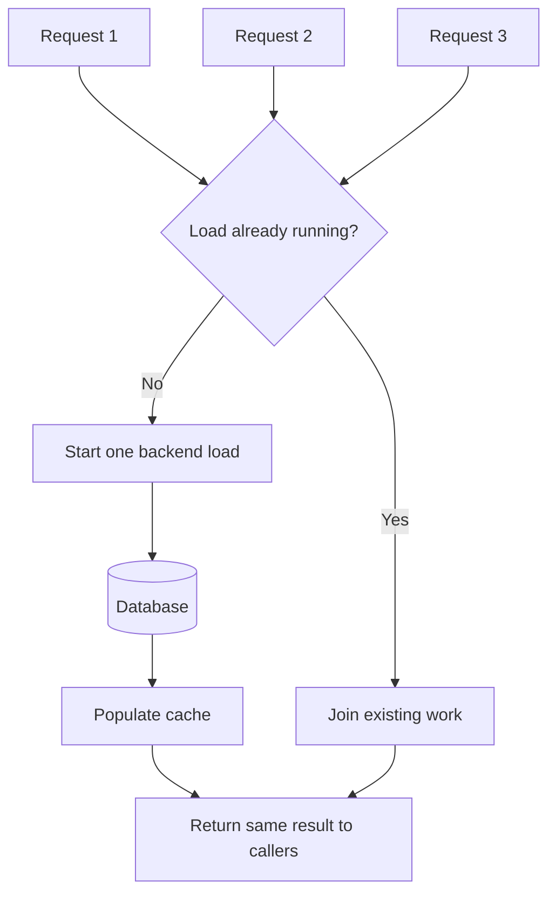

### In-process example

```python
import asyncio
from collections.abc import Awaitable, Callable
from typing import TypeVar

T = TypeVar("T")

class SingleFlight:
    def __init__(self) -> None:
        self._inflight: dict[str, asyncio.Task[object]] = {}
        self._lock = asyncio.Lock()

    async def run(self, key: str, loader: Callable[[], Awaitable[T]]) -> T:
        async with self._lock:
            existing = self._inflight.get(key)

            if existing is None:
                task: asyncio.Task[T] = asyncio.create_task(loader())
                self._inflight[key] = task
                existing = task

        try:
            return await existing  # type: ignore[return-value]
        finally:
            async with self._lock:
                if self._inflight.get(key) is existing:
                    self._inflight.pop(key, None)
```

### Limitation

An in-process single-flight mechanism coordinates requests only inside one process.

If 50 application instances receive the same miss, each instance may still perform one backend load. To coordinate globally, use a distributed lock or a cache service that provides atomic loading.

---

## 8.2 Distributed Locking

A distributed lock allows one process to rebuild a missing entry.

Other processes can:

- Wait briefly and retry the cache
- Serve stale data
- Return a controlled fallback
- Fail fast when freshness is mandatory

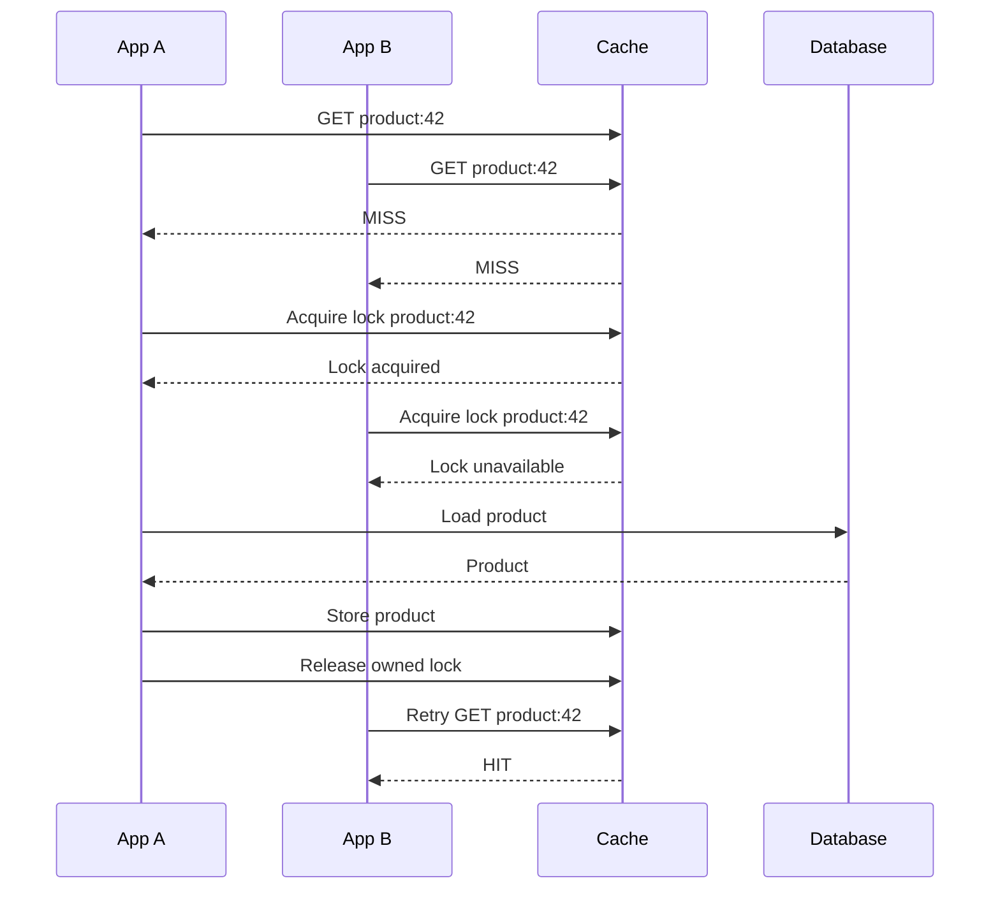

### Lock requirements

A safe lock should have:

1. **Unique ownership token**  
   Only the process that owns the lock should release it.

2. **Expiry or lease time**  
   The lock must eventually disappear if the owner crashes.

3. **Atomic acquisition**  
   Redis commonly uses a conditional set such as `SET key token NX PX lease_ms`.

4. **Ownership-checked release**  
   Releasing should atomically compare the stored token and delete only when it matches.

5. **Bounded waiting**  
   Requests should not wait forever.

6. **Lease sizing**  
   The lease must cover normal recomputation time, or it must be safely extended.

### Important race condition

This release is unsafe:

```python
if redis.get(lock_key) == token:
    redis.delete(lock_key)
```

The `GET` and `DELETE` are separate commands. Between them, the lock could expire and be acquired by another process.

Use an atomic Lua script:

```lua
if redis.call("GET", KEYS[1]) == ARGV[1] then
    return redis.call("DEL", KEYS[1])
end

return 0
```

### Lock trade-off

A lock changes the failure mode from duplicate backend work to waiting and queueing. For very hot keys, serving a slightly stale response is often better than making thousands of callers wait.

---

## 8.3 Stale-While-Revalidate

Stale-while-revalidate separates **freshness** from **availability**.

Store two expiry concepts:

- **Soft expiry:** The value is old enough to refresh.
- **Hard expiry:** The value is too old to serve.

```text
Fresh period          Stale-but-servable period       Unusable
|--------------------|-------------------------------|
created            soft expiry                    hard expiry
```

Behavior:

1. Before soft expiry: serve normally.
2. After soft expiry: serve the stale value immediately.
3. One worker refreshes the entry in the background.
4. After hard expiry: wait for a synchronous refresh or return a fallback.

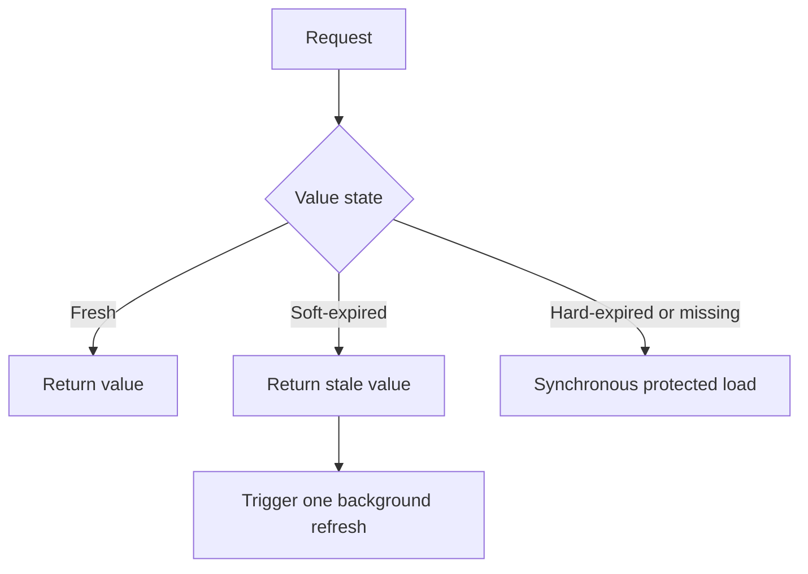

### Advantages

- Low user-facing latency
- Reduced backend spikes
- Better behavior during temporary origin failures

### Trade-off

The system intentionally serves stale data. This is appropriate only when the business accepts bounded staleness.

Suitable examples:

- Public product descriptions
- News feeds
- Recommendation blocks
- Dashboard aggregates
- Public configuration
- Exchange-rate displays with a clear timestamp

Less suitable examples:

- Current bank balance
- One-time authorization decisions
- Inventory reservation
- Security-sensitive permission changes
- Values that control irreversible financial actions

---

## 8.4 Early Refresh

Instead of waiting for the entry to expire, refresh it when its remaining TTL becomes small.

```python
if cached_value.exists:
    if cached_value.remaining_ttl < refresh_threshold:
        trigger_background_refresh(key)

    return cached_value.data
```

Use a per-key lock so that only one worker performs the refresh.

### Benefit

The hot key remains warm, and normal requests continue receiving the current cached value.

### Cost

A deterministic threshold can still cause several workers to attempt refresh around the same time unless refresh execution is coordinated.

---

## 8.5 Probabilistic Early Expiration

Probabilistic early expiration makes each request independently decide whether to refresh before the hard TTL. The probability increases as the entry approaches expiry and may account for the time required to recompute it.

Conceptually:

```text
Far from expiry       → very small refresh probability
Near expiry           → larger refresh probability
Expensive recompute   → refresh earlier
```

This spreads refresh attempts over time instead of concentrating them at one exact expiry moment.

A simplified conceptual rule is: `should_refresh = random_probability_increases_as_ttl_decreases()`

A production implementation should follow a tested algorithm rather than inventing an arbitrary probability function.

### Strengths

- Reduces synchronized expiration
- Avoids a permanent central scheduler
- Works well for highly requested values
- Can reduce dependence on long lock wait queues

### Trade-offs

- More difficult to reason about than a fixed refresh threshold
- May perform occasional early recomputations
- Still needs protection against multiple successful refreshers
- Requires careful tuning and observability

The XFetch family of approaches is based on research into optimal probabilistic early recomputation.

---

## 8.6 TTL Jitter

TTL jitter adds randomness to expiry times.

Instead of assigning every key exactly 300 seconds: `ttl = 300`

Use:

```python
import random

ttl = 300 + random.randint(-30, 30)
```

Now entries expire between 270 and 330 seconds.

```text
Without jitter:
Key A ───────── expires at 12:05:00
Key B ───────── expires at 12:05:00
Key C ───────── expires at 12:05:00

With jitter:
Key A ─────── expires at 12:04:42
Key B ────────── expires at 12:05:18
Key C ──────── expires at 12:04:55
```

### What jitter solves

TTL jitter helps prevent a cache avalanche caused by many synchronized keys.

### What jitter does not solve

It does not fully protect a single extremely hot key. Thousands of requests may still arrive when that one key expires.

Use jitter together with request coalescing, stale serving, locking, or early refresh.

---

## 8.7 Cache Prewarming

Prewarming loads important values before normal traffic requires them.

Useful moments include:

- Before a major product launch
- Before a scheduled sale
- During deployment
- When starting a new region
- After planned cache maintenance
- Before daily reporting traffic
- After bulk invalidation

Example:

```python
POPULAR_PRODUCT_IDS = [42, 51, 77, 103]

for product_id in POPULAR_PRODUCT_IDS:
    product = database.get_product(product_id)
    cache.set(
        f"product:{product_id}",
        serialize(product),
        ttl=300 + random.randint(0, 60),
    )
```

### Important consideration

Prewarming everything can overload the database and fill the cache with unused data. Warm only data that is likely to be requested or critical for an upcoming event.

Use controlled concurrency and rate limits during warming.

---

## 8.8 Negative Caching

Negative caching stores the fact that a value does not exist.

Without negative caching:

```text
GET unknown-user
Cache miss
Database miss
Repeat for every request
```

With negative caching, the absence itself is stored: `user:999999 → NOT_FOUND, TTL 30 seconds`.

Example:

```python
NOT_FOUND = b"__NOT_FOUND__"

cached = redis.get(key)

if cached == NOT_FOUND:
    return None

if cached is not None:
    return deserialize(cached)

value = database.find(key)

if value is None:
    redis.set(key, NOT_FOUND, ex=30)
    return None
```

### Use a short TTL

A missing object may be created shortly afterward. A long negative TTL can hide newly created data.

Negative caching also helps protect against repeated invalid identifiers and some abusive request patterns.

---

## 8.9 Backpressure and Rate Limiting

Stampede protection should not assume the cache will always work.

When the cache is unavailable, the system may suddenly direct all reads to the database. Backpressure protects the backend.

Possible controls include:

- Limit concurrent database recomputations.
- Use separate connection pools for critical and non-critical traffic.
- Apply request deadlines.
- Shed low-priority work.
- Rate-limit expensive endpoints.
- Use circuit breakers for failing dependencies.
- Avoid unlimited retries.
- Add exponential backoff and jitter to retries.
- Serve stale or partial responses when permitted.

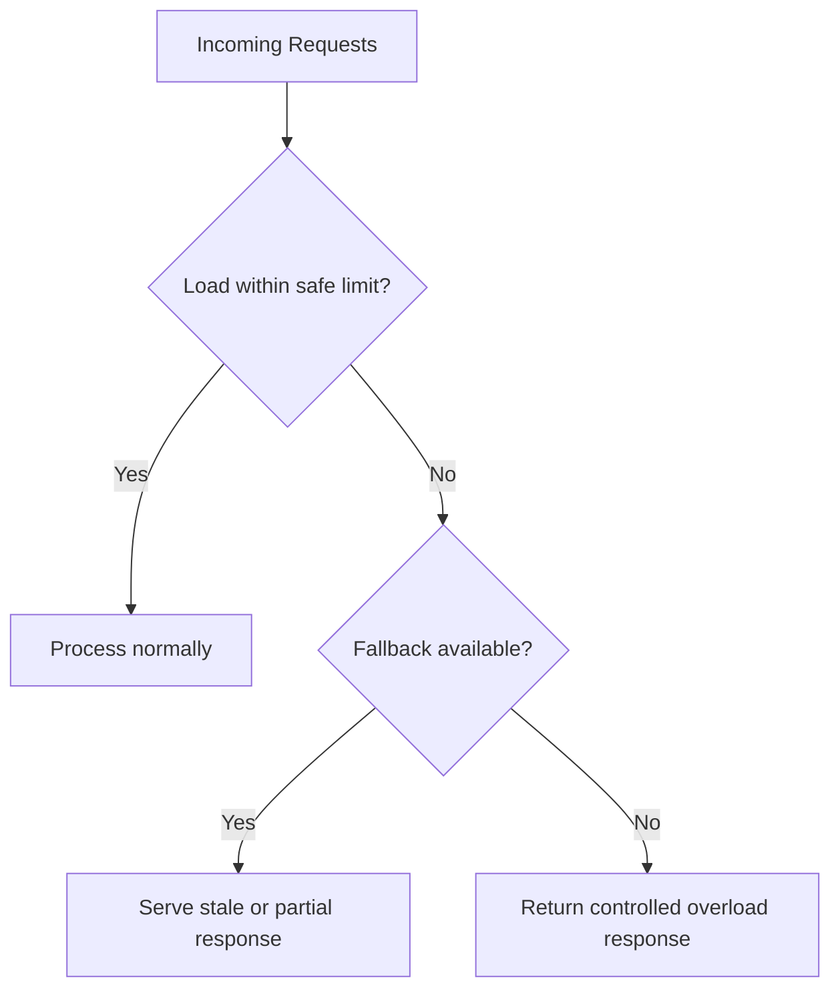

A controlled error is usually safer than allowing every request to enter an already overloaded database.

---

# 9. Practical Redis Implementation

The following example demonstrates cache-aside with:

- Distributed lock ownership
- Lock expiry
- Bounded retry
- TTL jitter
- Negative caching
- Safe lock release
- Double-checking the cache after acquiring the lock

The code is intentionally framework-neutral.

```python
from __future__ import annotations

import json
import random
import time
import uuid
from collections.abc import Callable
from typing import Any, TypeVar

from redis import Redis

T = TypeVar("T")

NOT_FOUND = "__NOT_FOUND__"

RELEASE_LOCK_SCRIPT = """
if redis.call("GET", KEYS[1]) == ARGV[1] then
    return redis.call("DEL", KEYS[1])
end

return 0
"""

class CacheLoadTimeout(RuntimeError):
    pass

def get_or_load(
    redis: Redis,
    *,
    key: str,
    loader: Callable[[], T | None],
    base_ttl_seconds: int = 300,
    negative_ttl_seconds: int = 30,
    lock_lease_ms: int = 10_000,
    wait_timeout_seconds: float = 1.0,
) -> T | None:
    cached = redis.get(key)

    if cached is not None:
        decoded = cached.decode("utf-8")

        if decoded == NOT_FOUND:
            return None

        return json.loads(decoded)

    lock_key = f"lock:{key}"
    lock_token = str(uuid.uuid4())

    acquired = redis.set(
        lock_key,
        lock_token,
        nx=True,
        px=lock_lease_ms,
    )

    if acquired:
        try:
            # Double-check because another process may have populated the
            # cache between our first GET and lock acquisition.
            cached = redis.get(key)

            if cached is not None:
                decoded = cached.decode("utf-8")

                if decoded == NOT_FOUND:
                    return None

                return json.loads(decoded)

            value = loader()

            if value is None:
                redis.set(key, NOT_FOUND, ex=negative_ttl_seconds)
                return None

            jitter = random.randint(0, max(1, base_ttl_seconds // 10))
            ttl = base_ttl_seconds + jitter

            redis.set(
                key,
                json.dumps(value),
                ex=ttl,
            )

            return value
        finally:
            redis.eval(
                RELEASE_LOCK_SCRIPT,
                1,
                lock_key,
                lock_token,
            )

    deadline = time.monotonic() + wait_timeout_seconds
    sleep_seconds = 0.02

    while time.monotonic() < deadline:
        time.sleep(sleep_seconds + random.uniform(0, sleep_seconds))

        cached = redis.get(key)

        if cached is not None:
            decoded = cached.decode("utf-8")

            if decoded == NOT_FOUND:
                return None

            return json.loads(decoded)

        sleep_seconds = min(sleep_seconds * 2, 0.2)

    raise CacheLoadTimeout(f"Timed out waiting for cache key: {key}")
```

## 9.1 Why the second cache check matters

Consider:

1. Request A checks the cache and sees a miss.
2. Request B loads the value and populates the cache.
3. Request A acquires the lock after B has finished.
4. Without a second cache check, A unnecessarily queries the database again.

This is why the lock owner should check the cache again after acquiring the lock.

## 9.2 Why the lock has a lease

If the lock owner crashes, a lock without expiry may remain forever.

The lease ensures eventual recovery: `SET lock:product:42 <token> NX PX 10000`.

However, the lease creates another challenge. If recomputation takes longer than the lease, another process may acquire the lock and begin a duplicate load.

Possible responses:

- Set the lease above the expected high-percentile load time.
- Extend the lease only while ownership is still valid.
- Make the backend computation idempotent.
- Allow occasional duplicate work where acceptable.
- Use stale-while-revalidate to reduce lock pressure.

## 9.3 Failure behavior should be explicit

The example raises a timeout when it cannot receive the value within the wait budget.

A real endpoint may choose one of these policies:

```python
try:
    return get_or_load(...)
except CacheLoadTimeout:
    if stale_value_is_available:
        return stale_value

    if endpoint_is_non_critical:
        return partial_response

    raise ServiceUnavailable()
```

The choice depends on business correctness, not only infrastructure convenience.

---

# 10. Choosing the Right Protection Strategy

| Situation | Recommended starting strategy |
|---|---|
| One process, moderate traffic | In-process single-flight |
| Many instances, strict freshness | Distributed lock with bounded waiting |
| Many instances, stale data acceptable | Stale-while-revalidate plus one refresher |
| Predictably hot values | Refresh-ahead or probabilistic early refresh |
| Many keys created together | TTL jitter |
| Planned traffic event | Prewarming plus controlled concurrency |
| Repeated missing identifiers | Negative caching |
| Cache outage could overload database | Backpressure, concurrency limits, stale fallback |
| CDN edges cause duplicate origin misses | Mid-tier cache or origin shield |
| Very hot Redis key | L1 cache, replication strategy, request coalescing, stale serving |

A common robust combination is:

```text
L1 local cache
    +
L2 distributed cache
    +
TTL jitter
    +
single-flight per process
    +
distributed lock for global coordination
    +
stale fallback
    +
database concurrency limit
```

Not every service needs every mechanism. Add complexity according to measured risk.

---

# 11. Observability and Capacity Planning

A cache should be observable as part of the request path.

## 11.1 Core metrics

### Cache effectiveness

- Cache hit ratio
- Cache miss ratio
- Hit ratio by cache layer
- Hit ratio by key namespace
- Cache lookup latency
- Value serialization and deserialization time

Basic formula: `Hit Ratio = Cache Hits / (Cache Hits + Cache Misses)`.

A high global hit ratio can hide a serious problem. For example, the system may have a 98% hit ratio while one business-critical hot key repeatedly stampedes.

Measure per namespace and, when safe, identify the hottest keys.

### Cache health

- Memory usage
- Eviction rate
- Expired key rate
- Connection count
- Network throughput
- Command latency
- CPU usage
- Replication lag
- Failover count
- Rejected writes
- Cache-node errors

### Stampede indicators

- Concurrent loaders per key or namespace
- Lock acquisition success and failure
- Lock wait duration
- Lock lease expiry before completion
- Duplicate backend loads
- Background refresh success and failure
- Stale responses served
- Cache rebuild duration
- Database traffic immediately after expirations

### Backend protection

- Database query latency
- Connection-pool utilization
- Active queries
- Timeout rate
- Retry rate
- Circuit-breaker state
- Requests rejected by concurrency limits
- Queue depth

---

## 11.2 Useful alerts

Examples:

```text
Cache hit ratio drops below expected baseline
Evictions rise rapidly
Database QPS rises while cache QPS falls
Lock wait p95 exceeds request latency budget
Background refresh failures exceed threshold
Database pool remains above 85% utilization
Cache node memory reaches unsafe level
```

Alerts should consider normal traffic patterns. A lower hit ratio after deployment may be expected for a short warm-up period, but it should recover predictably.

---

## 11.3 Load testing

Test more than steady-state cache hits.

Important scenarios include:

1. Cold cache at normal traffic
2. Cold cache at peak traffic
3. One hot key expiring
4. Thousands of keys expiring together
5. Distributed cache unavailable
6. Database slowed down
7. Lock owner crashing during recomputation
8. Lock lease expiring too early
9. New application region starting
10. Bulk invalidation during peak traffic

A cache-heavy system that is tested only with a warm cache is not fully tested.

---

# 12. Production Design Example

Consider an e-commerce product-detail service.

## 12.1 Requirements

- Product descriptions can be stale for up to five minutes.
- Price can be stale for a few seconds on the display page.
- Inventory reservation must use authoritative inventory state.
- A product may become viral during a sale.
- The service runs on many application instances.
- Redis is shared across instances.
- A CDN serves public product responses.

## 12.2 Cache separation by data semantics

Do not place every product field into one entry with one TTL.

```text
product:details:42       TTL 5 minutes
product:display-price:42 TTL 10 seconds
product:inventory:42     not trusted for reservation
```

This avoids forcing rapidly changing inventory requirements onto stable product descriptions.

## 12.3 Architecture

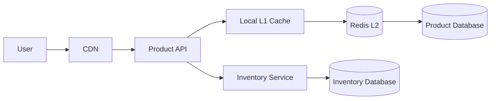

## 12.4 Product-detail read

1. CDN checks the public response.
2. Application checks a short-lived L1 entry.
3. Application checks Redis.
4. On a Redis miss, per-process single-flight reduces local duplication.
5. A Redis lock selects one global loader.
6. Other requests receive a stale value or briefly wait.
7. The lock owner queries the product database.
8. It stores the value with TTL jitter.
9. The CDN receives a response with a bounded public freshness time.

## 12.5 Inventory reservation

The cached display value is not used as the final reservation decision: displayed inventory is a cached approximation, while the checkout reservation issues an authoritative inventory command.

This separation gives a fast browsing experience without weakening correctness for the irreversible operation.

## 12.6 Sale preparation

Before a planned sale:

- Prewarm the most likely product keys.
- Add jitter to their TTLs.
- Increase cache and database capacity if required.
- Verify distributed-lock and stale-serving metrics.
- Limit concurrent fallback database loads.
- Avoid clearing all product caches during deployment.
- Run a cold-cache peak-load test.

---

# 13. Best-Practice Checklist

## Cache placement

- Cache as close to the consumer as correctness allows.
- Remember that the fastest layer is not automatically the correct layer: sensitivity, authorization, consistency, and invalidation decide where an item may safely live.
- Use browser and CDN caching for public, reusable HTTP responses.
- Use a bounded local L1 cache for extremely hot, safe-to-stale values.
- Use a distributed L2 cache for shared application state and computed results.
- Remember that the database already has internal caching.

## Data design

- Design cache keys from all inputs that affect the result.
- Version keys when schemas or algorithms change.
- Separate data with different freshness requirements.
- Avoid storing sensitive personalized data in shared caches.
- Keep values reasonably small.
- Define maximum acceptable staleness with the business.

## Expiry and invalidation

- Treat TTL as a correctness decision.
- Add TTL jitter when many keys may expire together, but do not treat it as protection for one extremely hot key.
- Use explicit or event-driven invalidation for important updates.
- Expect entries to disappear before TTL because of eviction.
- Use short negative caching for repeated not-found results.

## Stampede protection

- Coalesce concurrent work.
- Use distributed coordination when many instances share the miss.
- Double-check the cache after acquiring a lock.
- Give locks unique ownership tokens and leases.
- Release locks atomically and only by the owner.
- Bound lock waiting by the request latency budget.
- Prefer stale serving over mass waiting when bounded staleness is acceptable.
- Prewarm known hot data before planned traffic.
- Protect the database when the cache is unavailable.

## Reliability

- Cache failure should degrade in a controlled way.
- Do not create unlimited retries.
- Add backoff and jitter to retry loops.
- Limit concurrent backend recomputations.
- Use request deadlines and circuit breakers.
- Load-test cold-cache and cache-outage scenarios.
- Monitor hit ratio together with database load, not in isolation.
- Design correctness, invalidation, failure handling, and observability together; caching improves performance only when all four are in place.

---

# 14. References

The following sources were used to verify terminology and current implementation guidance:

1. [Redis documentation: Cache-aside and stampede protection](https://redis.io/docs/latest/develop/use-cases/cache-aside/)
2. [Redis documentation: Cache-aside with redis-py](https://redis.io/docs/latest/develop/use-cases/cache-aside/redis-py/)
3. [AWS: Database caching patterns](https://docs.aws.amazon.com/whitepapers/latest/database-caching-strategies-using-redis/caching-patterns.html)
4. [AWS: Caching best practices](https://aws.amazon.com/caching/best-practices/)
5. [AWS CloudFront: Origin Shield](https://docs.aws.amazon.com/AmazonCloudFront/latest/DeveloperGuide/origin-shield.html)
6. [AWS CloudFront: Caching and availability](https://docs.aws.amazon.com/AmazonCloudFront/latest/DeveloperGuide/ConfiguringCaching.html)
7. [MDN Web Docs: HTTP caching](https://developer.mozilla.org/en-US/docs/Web/HTTP/Guides/Caching)
8. [MDN Web Docs: Cache-Control](https://developer.mozilla.org/en-US/docs/Web/HTTP/Reference/Headers/Cache-Control)
9. [PostgreSQL documentation: pg_buffercache](https://www.postgresql.org/docs/current/pgbuffercache.html)
10. [PostgreSQL documentation: pg_prewarm](https://www.postgresql.org/docs/current/pgprewarm.html)
11. [Vattani, Chierichetti, and Lowenstein: Optimal Probabilistic Cache Stampede Prevention](https://www.vldb.org/pvldb/vol8/p886-vattani.pdf)
