# Caching Layers and the Stampede Problem

> Caching is not just “put Redis in front of the database.” A real system usually has several cache layers, and each layer protects the layer behind it. The hard part is deciding **what may be stale, how it is invalidated, and what happens when the cache misses or disappears**.

## In short

- A common request path is: **Browser → CDN → Gateway → L1 local cache → L2 distributed cache → Database**.
- **Cache-aside** is the most common application pattern: read cache → on miss read database → populate cache; on write, update the database and invalidate the key.
- A **TTL is a correctness choice** because it defines how long stale data may remain when explicit invalidation does not happen.
- **Expiration and eviction are different**: a cache may evict a value before its TTL, so every read path must safely handle a miss.
- A **cache stampede** happens when many requests miss the **same hot key** and all repeat the same expensive backend work.
- For one hot key, use **single-flight/request coalescing**, a **leased distributed lock**, or **stale-while-revalidate**.
- **TTL jitter** mainly prevents a **cache avalanche** where many keys expire together; it does not fully solve one extremely hot key.
- Always design for **cache outage**: limit fallback database concurrency, use deadlines, avoid retry storms, and serve stale/fallback data when business rules allow.

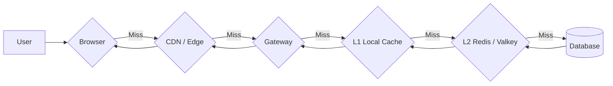

---

# Index

1. Why caching exists
2. Main caching layers
3. Common cache access patterns
4. Cache keys, TTL, invalidation, and eviction
5. Cache stampede and related failures
6. Stampede-prevention techniques
7. Practical product-service example
8. Observability and load testing
9. Best practices
10. References

---

# 1. Why Caching Exists

A cache stores a copy of data closer to the consumer or in a faster system than the original source.

For example, returning a product from process memory or Redis is usually cheaper than repeatedly executing joins, transferring rows, and rebuilding the same application object.

Caching mainly improves:

- **Latency** — repeated reads complete faster.
- **Throughput** — the same backend can serve more traffic.
- **Database protection** — fewer repeated reads reach the primary store.
- **Resilience** — some layers can serve previously cached data during a temporary origin problem.
- **Cost** — fewer database queries, computations, API calls, and cross-region requests.

But caching creates trade-offs:

- Data can become stale.
- Invalidation becomes part of the correctness model.
- Different layers can temporarily disagree.
- A cold or failed cache can suddenly expose the database to full traffic.
- A popular expired key can create a stampede.

The important mental model is:

> **Caching is a distributed data-management decision, not only a performance optimization.**

---

# 2. Main Caching Layers

A production system may contain several cache layers at the same time.


## 2.1 Browser and Client Cache

Browsers can reuse static assets and HTTP responses.

Typical examples:

- JavaScript bundles
- CSS
- Images and fonts
- Public API responses
- Previously validated resources

Common response headers:

```http
Cache-Control: public, max-age=3600
ETag: "product-v42"
```

Useful directives:

| Directive | Meaning |
|---|---|
| `public` | Shared caches such as a CDN may store the response. |
| `private` | Intended for a private client cache. |
| `max-age=300` | Response is fresh for 300 seconds. |
| `s-maxage=300` | Freshness lifetime for shared caches. |
| `no-cache` | May be stored, but must be revalidated before normal reuse. |
| `no-store` | Do not store the response. |
| `immutable` | Content is not expected to change while fresh. |
| `stale-while-revalidate=30` | A stale response may be served while it is refreshed. |
| `stale-if-error=300` | A stale response may be reused when the upstream fails. |

### Practical use

Versioned assets such as:

```text
/app.94f3a8.js
/styles.18ac21.css
```

can safely use a long lifetime:

```http
Cache-Control: public, max-age=31536000, immutable
```

### Important security point

Do not mark personalized or sensitive responses as `public` unless the cache key and response design guarantee correct user isolation.

---

## 2.2 CDN and Edge Cache

A CDN stores cacheable content close to users.

Common examples:

- Static files
- Product catalog pages
- Public HTML
- Public API responses
- Downloadable files
- Shareable generated reports

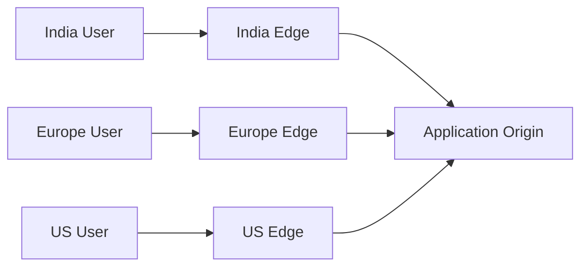

Benefits:

- Lower network latency
- Reduced origin traffic
- Better traffic-spike handling
- Less cross-region transfer
- Ability to serve stale content where permitted

### Origin shield / mid-tier cache

Large CDNs may add another cache layer between edge locations and the origin.

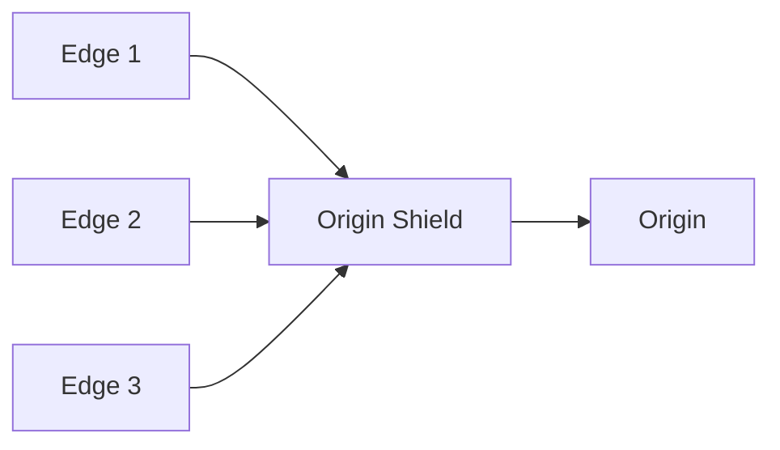

This is useful when several edge locations miss the same object. The shield can absorb those misses instead of allowing every edge to independently hit the origin.

### Cache-key design matters

A CDN key may vary by:

- Path
- Query parameters
- Selected headers
- Cookies
- Language
- Authentication state

Too many dimensions reduce the hit ratio. Too few dimensions can return the wrong representation.

---

## 2.3 Gateway or Reverse-Proxy Cache

A reverse proxy or API gateway can cache a response before it reaches application instances.

Examples:

- NGINX proxy cache
- Varnish
- API gateway response cache
- GraphQL gateway cache

Useful for:

- Public reference data
- Country/currency lists
- Public configuration
- Expensive responses shared by many users

Usually avoid it for:

- Highly personalized responses
- Authorization-sensitive data
- Rapidly changing balances
- Responses with very high-cardinality cache keys

---

## 2.4 L1 In-Process Cache

An L1 cache lives inside one application process.

Examples:

- Python LRU cache
- Java Caffeine
- Node.js LRU cache
- Go in-memory map with synchronization

Advantages:

- Extremely low latency
- No network call
- Reduces pressure on Redis/Valkey

Limitations:

- Each process has its own copy.
- Data disappears on restart.
- Invalidation must reach every process.
- Memory usage is duplicated across instances.
- Different instances may temporarily serve different values.

Use L1 for small, frequently reused, safe-to-stale data such as configuration, lookup tables, parsed metadata, or very hot L2 values.

> Keep local caches **bounded and time-limited**. An unbounded local cache can become a memory problem.

---

## 2.5 L2 Distributed Cache

A distributed cache is shared across application instances.

Common choices:

- Redis
- Valkey
- Memcached
- Managed cloud cache services

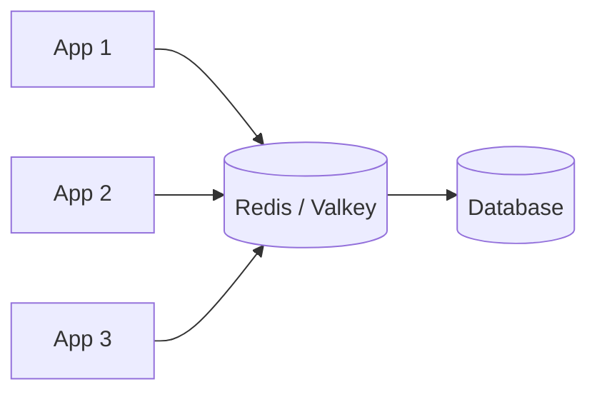

Common cached values:

- Sessions
- Product details
- Permissions
- Search results
- Feature/configuration data
- Dashboard aggregates
- Third-party API results

Advantages:

- Shared cache across stateless instances
- Central TTL and eviction
- Atomic operations
- Easier shared invalidation than many independent local caches

Limitations:

- Network dependency
- Hot keys can overload one node or shard
- Serialization/deserialization has cost
- A cache outage may push full traffic to the database
- Distributed locking needs careful lease and ownership handling

---

## 2.6 Database and OS Cache

Databases already cache data internally.

For example, PostgreSQL uses `shared_buffers`, while the operating system also caches recently accessed file pages.

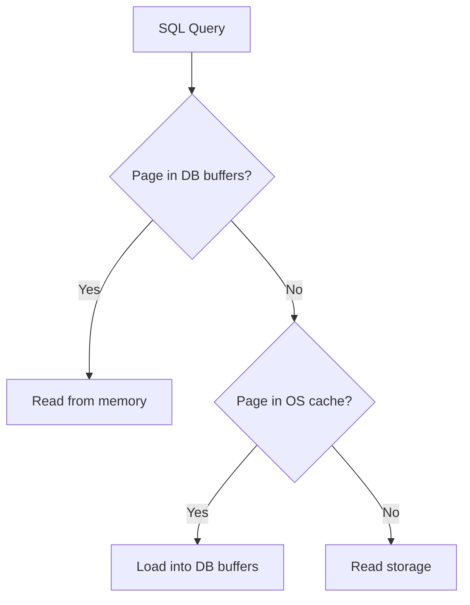

This is different from application caching.

A database cache stores low-level pages and plans. An application cache may store the complete business result:

```json
{
  "product_id": 42,
  "name": "Mechanical Keyboard",
  "price": 7999,
  "availability": "in_stock"
}
```

Application caching can avoid SQL execution, joins, row processing, network transfer, and object construction — not only disk I/O.

---

# 3. Common Cache Access Patterns

Cache layers describe **where** data is stored. Cache access patterns describe **how** the application reads and writes it.

## 3.1 Cache-Aside

This is the most common application pattern.

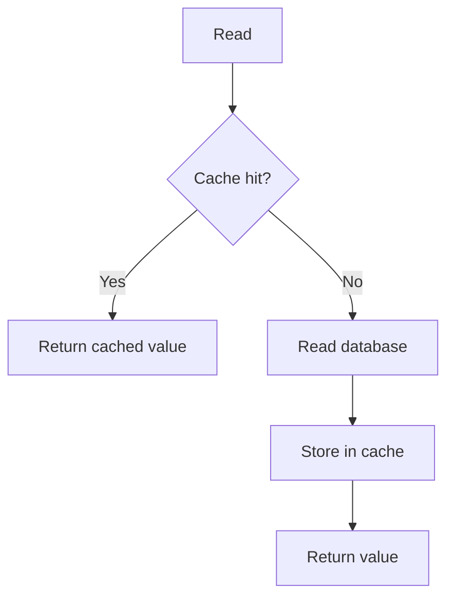

Basic read:

```python
def get_product(product_id):
    key = f"product:{product_id}"

    value = cache.get(key)
    if value is not None:
        return deserialize(value)

    product = database.get_product(product_id)

    if product is not None:
        cache.set(key, serialize(product), ttl=300)

    return product
```

Typical write:

```python
def update_product(product_id, changes):
    database.update_product(product_id, changes)
    cache.delete(f"product:{product_id}")
```

Updating the source of truth first and then invalidating the key is a simple and common strategy.

**Strength:** simple and caches only requested data.  
**Main risk:** the first request after a miss is slower, and concurrent misses can stampede the backend.

---

## 3.2 Read-Through

The application asks a cache abstraction for a value, and that abstraction loads the source when required.

```text
Application → Cache Provider → Database
```

This is useful when a framework provides a standard `get_or_load()` mechanism and centralizes loading, expiry, and request coalescing.

---

## 3.3 Write-Through

Writes go synchronously through the cache layer to the database.

```text
Application → Cache → Database
```

Useful when newly written data should already be warm, but it increases write latency and failure-handling complexity.

---

## 3.4 Write-Behind

The application writes first to a cache/buffer and persists to the database asynchronously.

```text
Application → Cache/Buffer → Durable Queue → Database
```

This can improve write throughput, but durability, ordering, retries, and idempotency become critical.

Do not use casual write-behind for financial or strongly consistent state.

---

## 3.5 Refresh-Ahead

Refresh a popular value before hard expiry.

```text
TTL becomes low → one background refresh → new value replaces old value
```

Useful for predictably hot keys, reports, configuration snapshots, or regularly refreshed public data.

---

# 4. Cache Keys, TTL, Invalidation, and Eviction

## 4.1 Cache-Key Design

A cache key must include every input that changes the result.

Example:

```text
product:v3:42:INR:en
```

Possible dimensions:

- Entity ID
- Currency
- Language
- Tenant
- Authorization scope
- Algorithm/schema version

Good keys are:

- Deterministic
- Namespaced
- Versioned when needed
- Easy to inspect
- Free from unnecessary sensitive raw data
- Controlled in cardinality

If currency affects the result, these must not use the same key:

```text
GET /prices/42?currency=INR
GET /prices/42?currency=USD
```

---

## 4.2 TTL Is a Correctness Decision

A TTL defines the maximum staleness window when explicit invalidation does not happen.

Possible starting points:

| Data | Typical direction |
|---|---|
| Versioned static asset | Months / 1 year |
| Country/currency reference list | Hours or days |
| Public product details | Minutes |
| Display price | Seconds to minutes, depending on business rules |
| User permissions | Short TTL plus explicit invalidation |
| Bank balance | Usually not served from an ordinary stale application cache |
| Daily generated report | Until next regeneration |

There is no universal “best TTL.” Choose it from:

- Allowed staleness
- Update frequency
- Recompute cost
- Request rate
- Invalidation reliability
- Backend capacity during misses

---

## 4.3 Invalidation

Common strategies:

### TTL-only

The entry naturally expires.

```text
SET product:42 <value> EX 300
```

Simple, but stale data may remain until expiry.

### Explicit invalidation

After a successful write:

```text
UPDATE database
DELETE product:42
DELETE category:7:products
```

This improves freshness but requires dependency tracking.

### Event-driven invalidation

A service publishes a domain event:

```json
{
  "event": "product.price.changed",
  "product_id": 42
}
```

Other services invalidate or refresh derived entries.

### Versioned keys

Instead of deleting a large cache namespace:

```text
catalog:v17:category:7
```

Change the version and let old entries expire naturally.

---

## 4.4 Expiration vs Eviction

These are different:

- **Expiration** — TTL says the value is no longer fresh/valid.
- **Eviction** — the cache removes the value early to free memory.

Therefore:

> Never assume a key exists until its TTL. Every cache read must correctly handle a miss.

---

# 5. Cache Stampede and Related Failures

## 5.1 Cache Stampede

A stampede happens when many concurrent requests miss the **same popular key** and all execute the same expensive fallback.

Example:

- `product:42` receives `10,000 req/s`
- Rebuild takes `200 ms`
- The key expires
- No protection exists

Approximate overlapping recomputations:

```text
10,000 × 0.2 = 2,000 concurrent recomputations
```

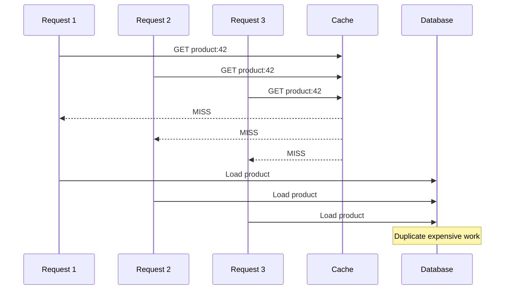

The failure can amplify:

```text
hot key expires
→ many misses
→ duplicate DB queries
→ DB latency increases
→ requests remain active longer
→ pools fill
→ retries increase traffic
→ system becomes unhealthy
```

---

## 5.2 Stampede vs Avalanche vs Penetration vs Hot Key

| Problem | Meaning | Main protection |
|---|---|---|
| **Stampede** | Many requests miss the same hot key | Single-flight, lock, stale serving |
| **Avalanche** | Many keys expire/unavailable together | TTL jitter, staged warming |
| **Penetration** | Repeated requests for data that does not exist | Negative cache, validation, abuse control |
| **Hot key** | One key receives disproportionate traffic even when cached | L1, replication, request coalescing, CDN where possible |

A key point for interviews:

> **TTL jitter helps spread expiration across many keys. It does not fully solve the single-hot-key stampede.**

---

# 6. Stampede-Prevention Techniques

Production systems commonly combine several techniques.

## 6.1 Single-Flight / Request Coalescing

Only one caller performs the backend load for a key. Other local callers join the existing work.

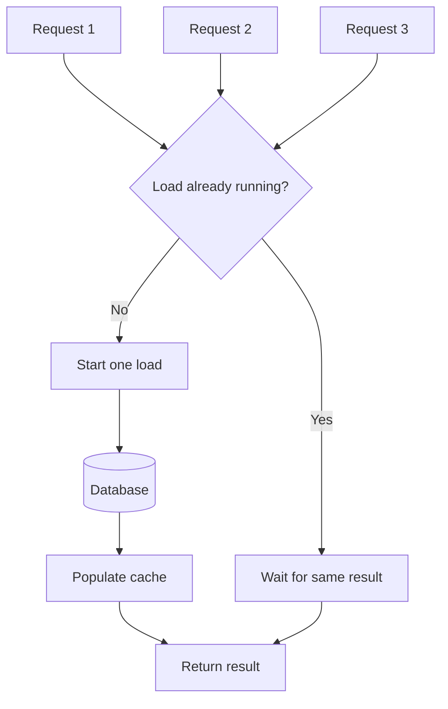

This is very effective inside one process.

**Limitation:** with 50 application instances, each process can still start one backend load. Global coordination needs a distributed mechanism.

---

## 6.2 Distributed Lock with a Lease

Use a per-key distributed lock so only one application instance rebuilds the missing value.

Typical Redis acquisition:

```text
SET lock:product:42 <unique-token> NX PX 10000
```

Important requirements:

1. **Unique owner token** — only the owner may release the lock.
2. **Lease/expiry** — the lock must disappear if the owner crashes.
3. **Atomic acquisition** — use `NX` with an expiry.
4. **Ownership-checked release** — compare token and delete atomically.
5. **Bounded wait** — callers should never wait forever.
6. **Double-check after lock acquisition** — another process may already have populated the cache.

Safe release idea:

```lua
if redis.call("GET", KEYS[1]) == ARGV[1] then
    return redis.call("DEL", KEYS[1])
end
return 0
```

Avoid this non-atomic pattern:

```python
if redis.get(lock_key) == token:
    redis.delete(lock_key)
```

The lock may expire and be acquired by another process between the `GET` and `DELETE`.

### Important trade-off

A lock changes the failure mode from **duplicate backend work** to **waiting**.

For very hot read paths, serving a slightly stale value is often better than queueing thousands of requests.

---

## 6.3 Stale-While-Revalidate

Separate **freshness** from **availability**.

```text
Fresh                 Stale but allowed                Too old
|---------------------|--------------------------------|
created            soft expiry                     hard expiry
```

Behavior:

- Before soft expiry → return fresh data.
- After soft expiry → immediately return stale data and let one worker refresh.
- After hard expiry → perform a protected synchronous load or return a controlled fallback.

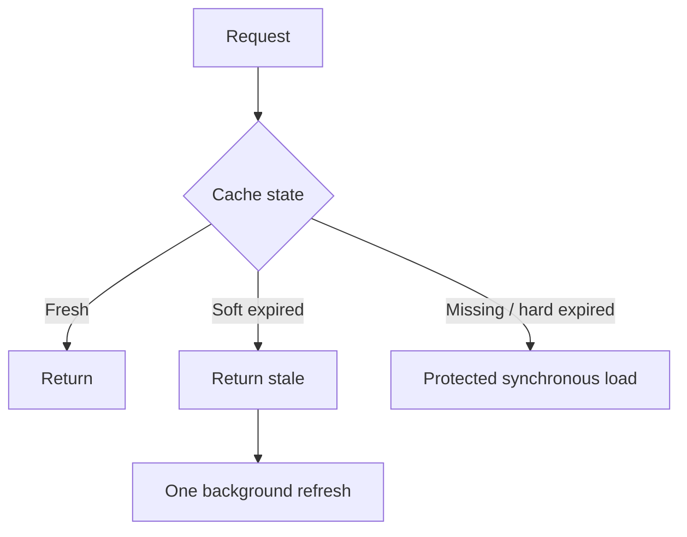

Good for:

- Product descriptions
- News/feed data
- Recommendations
- Dashboard aggregates
- Public configuration

Usually not appropriate for:

- Authorization decisions
- Inventory reservation
- Current bank balance
- Irreversible financial decisions

---

## 6.4 TTL Jitter

Instead of every key using exactly 300 seconds:

```python
ttl = 300
```

use a small randomized range:

```python
import random

ttl = 300 + random.randint(-30, 30)
```

This reduces synchronized expiration across a group of keys.

Use jitter with single-flight, stale serving, or locking when individual keys can also become very hot.

---

## 6.5 Negative Caching

Cache a short-lived “not found” result.

Without it:

```text
cache miss → DB miss → repeat forever
```

With negative caching:

```text
user:999999 → NOT_FOUND, TTL 30 seconds
```

Use a short TTL because the object may be created shortly afterward.

---

## 6.6 Prewarming

Load known hot keys before traffic needs them.

Useful before:

- Sales or launches
- A new region starts
- Planned cache maintenance
- Predictable reporting traffic

Warm only likely hot data and use controlled concurrency so prewarming itself does not overload the database.

---

## 6.7 Backpressure on the Fallback Path

The cache can fail completely. When that happens, do not allow unlimited fallback traffic to the database.

Protect the backend with:

- Concurrency limits
- Request deadlines
- Circuit breakers
- Bounded retries
- Exponential backoff with jitter
- Load shedding
- Stale or partial fallback responses when allowed
- Separate capacity for critical operations

> A controlled degraded response is safer than turning a cache outage into a database outage.

---

# 7. Practical Product-Service Example

Consider an e-commerce product endpoint.

Requirements:

- Product description may be stale for up to 5 minutes.
- Display price may be stale for a few seconds.
- Inventory reservation must use authoritative state.
- The service runs on many instances.
- Redis/Valkey is shared.
- Public product responses may also be cached at the CDN.

## 7.1 Separate Data by Freshness Requirement

Do not place every field under one TTL.

```text
product:details:42          TTL ≈ 5 minutes
product:display-price:42    TTL ≈ 10 seconds
inventory reservation      authoritative service/database
```

This lets browsing stay fast without weakening correctness for checkout.

## 7.2 Architecture

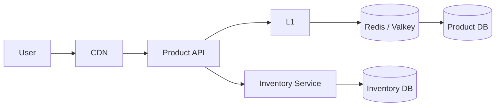

## 7.3 Protected Cache-Aside Flow

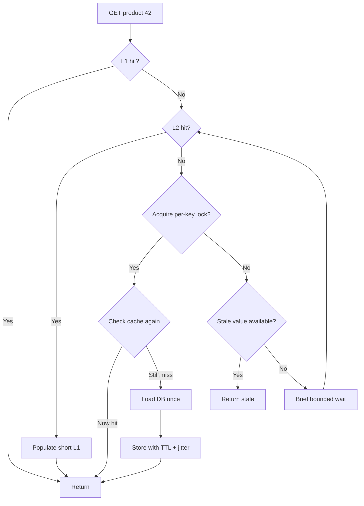

The important details are:

1. Check cache.
2. On miss, use local single-flight if possible.
3. Acquire a distributed per-key lock.
4. **Check the cache again after acquiring the lock.**
5. Only the lock owner loads the database.
6. Store the value with an appropriate TTL and jitter.
7. Other callers use stale data or wait for a short bounded time.
8. Limit concurrent database fallbacks during Redis failure.

### Why the second cache check matters

Possible race:

```text
A checks cache → MISS
B rebuilds and fills cache
A later acquires lock
```

If A does not check again, it performs an unnecessary duplicate database load.

---

# 8. Observability and Load Testing

A cache is part of the request path, so it needs normal production observability.

## 8.1 Important Metrics

### Cache effectiveness

- Hit ratio
- Miss ratio
- Hit ratio per layer
- Hit ratio per key namespace
- Cache lookup latency
- Serialization/deserialization latency

Formula:

```text
Hit Ratio = Hits / (Hits + Misses)
```

A high global hit ratio can still hide one badly behaving hot key.

### Cache health

- Memory usage
- Evictions
- Expired-key rate
- Command latency
- CPU/network usage
- Connection count
- Replication/failover health
- Cache errors

### Stampede indicators

- Concurrent loaders per key/namespace
- Lock acquisition success/failure
- Lock wait duration
- Duplicate backend loads
- Refresh duration
- Stale responses served
- Lock lease expiry before load completion

### Backend protection

- Database QPS and latency
- Connection-pool utilization
- Active queries
- Timeout/retry rate
- Circuit-breaker state
- Requests rejected by concurrency limits

---

## 8.2 Load-Test Scenarios

Do not test only a warm cache.

Test:

1. Cold cache at normal traffic
2. Cold cache at peak traffic
3. One hot key expiring
4. Thousands of keys expiring together
5. Distributed cache unavailable
6. Database slowed down
7. Lock owner crashes during refresh
8. Lock lease expires too early
9. New application region starts cold
10. Bulk invalidation during peak traffic

---

# 9. Best Practices

## Cache placement

- Cache as close to the consumer as correctness allows.
- Use browser/CDN caching for reusable public HTTP responses.
- Keep L1 small, bounded, and short-lived.
- Use L2 for data shared across application instances.
- Remember that databases already have internal memory caches.

## Data design

- Put every value-changing dimension in the cache key.
- Version keys when schemas or business logic change.
- Separate data that has different freshness requirements.
- Avoid sensitive user-specific data in shared caches unless isolation is guaranteed.
- Keep cached values reasonably small.

## Expiry and invalidation

- Treat TTL as a business/correctness decision.
- Use explicit invalidation when important data changes.
- Expect eviction before TTL.
- Use short negative caching for repeated misses.
- Use TTL jitter for groups of keys that might expire together.

## Stampede protection

- Use single-flight for concurrent local requests.
- Use distributed coordination across application instances.
- Double-check the cache after lock acquisition.
- Give locks unique owner tokens and leases.
- Release locks atomically and only by the owner.
- Bound waiting by the request latency budget.
- Prefer stale serving when bounded staleness is acceptable.
- Prewarm known hot data before planned spikes.
- Limit fallback database concurrency.

## Reliability

- Design for Redis/Valkey being unavailable.
- Avoid unlimited retries.
- Use deadlines, backoff, jitter, and circuit breakers.
- Load-test cold-cache and outage scenarios.
- Monitor cache metrics together with database load.

---

# 10. Interview Takeaway

A strong mental model is:

> A request normally falls through several cache layers before reaching the authoritative database. Cache-aside is the common application pattern, but the dangerous moment is a synchronized miss. If one hot key expires under high traffic, thousands of requests can repeat the same backend work. Use local single-flight plus a leased distributed lock for global coordination, or serve stale data while one caller refreshes. Add TTL jitter to prevent many unrelated keys from expiring together, and always protect the database for the case where the cache is cold or unavailable.

---

# 11. References

Current terminology and implementation guidance were checked against:

1. Redis — Cache-aside  
   https://redis.io/docs/latest/develop/use-cases/cache-aside/

2. Redis — Cache-aside with redis-py  
   https://redis.io/docs/latest/develop/use-cases/cache-aside/redis-py/

3. MDN — HTTP caching  
   https://developer.mozilla.org/en-US/docs/Web/HTTP/Guides/Caching

4. MDN — `Cache-Control`  
   https://developer.mozilla.org/en-US/docs/Web/HTTP/Reference/Headers/Cache-Control

5. AWS CloudFront — Origin Shield  
   https://docs.aws.amazon.com/AmazonCloudFront/latest/DeveloperGuide/origin-shield.html

6. PostgreSQL — Resource consumption / `shared_buffers`  
   https://www.postgresql.org/docs/current/runtime-config-resource.html
