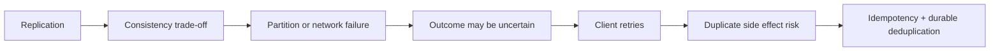
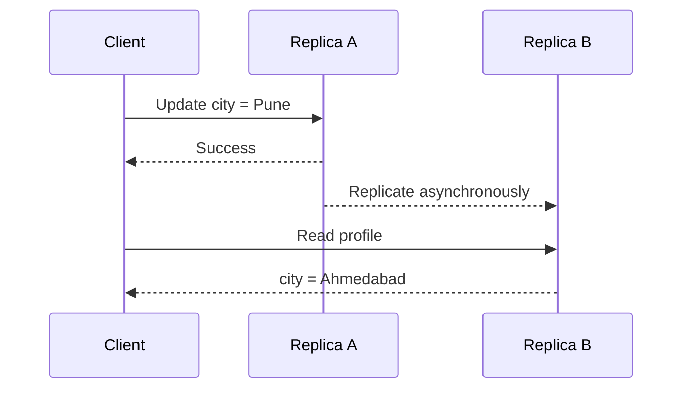
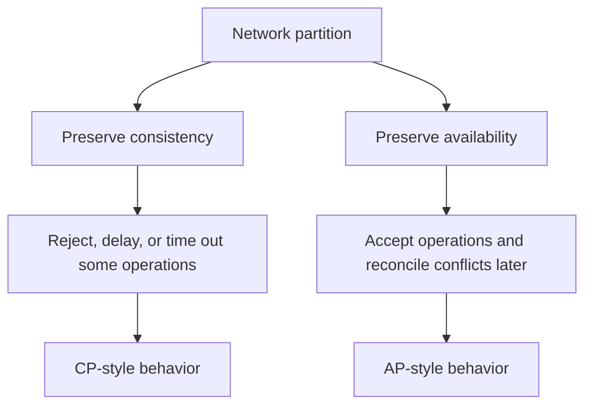
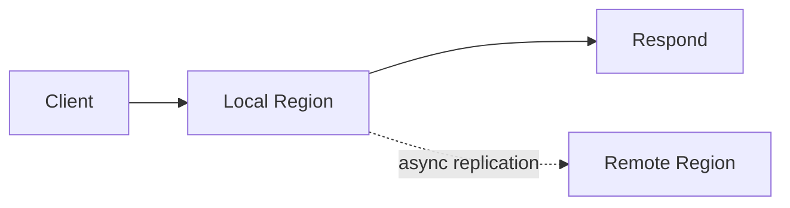
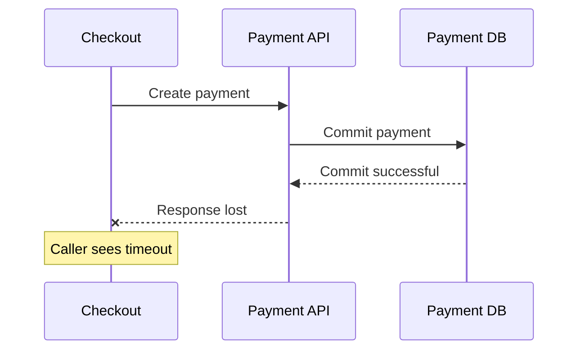
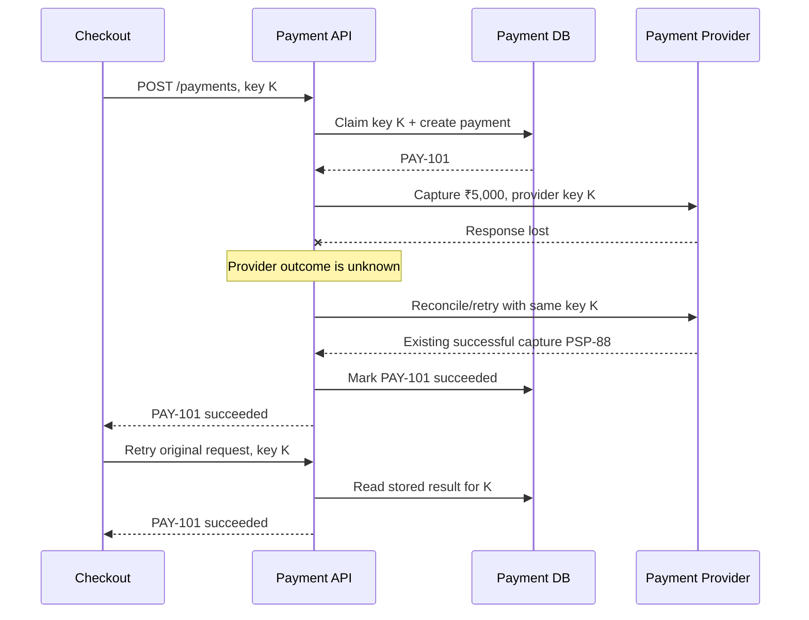
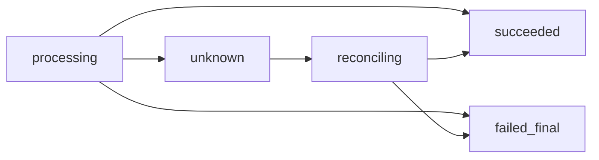

# Consistency, CAP, and Why Retries Need Idempotency

> How replication creates stale reads, what CAP and PACELC actually mean, and why safe retries require idempotency.

## In short

- **Consistency** defines what clients are allowed to observe when data is replicated or updated concurrently.
- **Linearizable consistency** is useful when stale or conflicting data could break a business invariant such as a balance, stock reservation, or unique allocation.
- **Eventual consistency** is useful when temporary staleness is acceptable and replicas can converge later.
- **CAP matters during a network partition**: for a given operation, the system must either preserve consistency by rejecting/delaying some requests or preserve availability by accepting requests and reconciling later.
- **PACELC covers normal operation too**: when there is no partition, replicated systems still trade lower latency against stronger consistency.
- A **timeout does not prove failure**. The server may already have committed the operation while the response was lost.
- Because callers retry uncertain requests, **side-effecting operations must be idempotent**.
- A safe retry design normally combines **stable operation identity + bounded retries + exponential backoff + jitter + reconciliation**.



---

# 1. The Core Idea

Distributed systems have two different correctness problems:

1. **What value is safe to return?**  
   This is a consistency problem.

2. **What happens if the same operation is attempted more than once?**  
   This is an idempotency problem.

These problems are connected because network calls are uncertain.

A client can send a request, the server can commit it, and the response can be lost. The client only sees a timeout, so retrying is reasonable. Without idempotency, that retry can repeat the business effect.

A reliable design therefore assumes:

- replicas may temporarily disagree;
- networks may delay or drop messages;
- timeouts may leave the outcome unknown;
- messages and requests may be delivered more than once.

---

# 2. Consistency in Distributed Systems

## 2.1 What consistency means

Suppose a profile is stored in two replicas.



Replica A accepted the write, but Replica B had not received it yet. The next read returned an older value.

So, in distributed-system design, consistency asks:

> **After operations complete, what values and ordering may clients observe?**

This is different from ACID consistency, which is about preserving database rules and invariants.

---

## 2.2 Common consistency models

### Linearizable consistency

A successful operation appears to happen at one instant between its start and completion. If a write finishes before a later read begins, that later read must observe that write or a newer one.

```text
Write balance = ₹10,000 completes
            |
            +--> Any later linearizable read cannot return the old balance
```

Use it when stale or conflicting data can violate a hard invariant.

Common examples:

- account or ledger state;
- final inventory reservation;
- distributed lock ownership;
- unique allocation;
- correctness-critical state transitions.

**Trade-off:** stronger coordination usually increases latency and can reduce availability during failures.

---

### Sequential consistency

All clients observe operations in one valid global order, but that order does not have to match real-time completion order.

It is weaker than linearizability because an operation that already completed in real time does not necessarily have to appear immediately before later operations.

---

### Causal consistency

Operations that depend on one another are observed in causal order.

Example:

```text
Create post
    |
    +--> Reply to that post
```

A user should not observe the reply without being able to observe the post it depends on.

This model is useful for collaboration, comments, messaging, and globally distributed user activity.

---

### Eventual consistency

If updates stop, replicas eventually converge to the same state.

A read can temporarily return stale data.

```text
T0  Price updated in Region A
T1  Region B still returns old price
T2  Replication catches up
T3  Both regions return the new price
```

Common examples:

- search indexes;
- analytics;
- feeds;
- counters;
- cached profile data;
- derived dashboards.

Eventual consistency does **not** mean conflicts solve themselves. The application may still need version checks, timestamps, deterministic merge rules, or CRDTs.

---

## 2.3 Session guarantees

Many applications do not need global linearizability for every request. They only need a predictable experience for one user or session.

| Guarantee | Meaning |
|---|---|
| Read-your-writes | After a user updates something, that user sees the new value |
| Monotonic reads | A user does not move backward to an older version |
| Monotonic writes | A user's writes are applied in order |
| Writes-follow-reads | A write is based on data the user has already observed |

This is useful when global strong consistency would be too expensive but a stale UI would be confusing.

---

## 2.4 Consistency vs transaction isolation

These concepts are related but solve different problems.

| Concept | Main question |
|---|---|
| Replication consistency | What can different clients or replicas observe? |
| Transaction isolation | How do concurrent transactions interact? |
| Linearizability | Does operation order respect real-time completion? |
| Serializability | Do concurrent transactions behave like some serial execution? |
| Strict serializability | Serializability + real-time ordering |

A database can provide serializable transactions in one Region while remote replicas are still eventually consistent.

---

# 3. CAP Theorem

## 3.1 CAP properties

CAP refers to three properties.

### Consistency

In CAP, consistency means behavior close to a **single up-to-date copy of the data**, usually discussed in terms of linearizability.

### Availability

Every request to a non-failing node eventually receives a successful response rather than being refused because another partition is unreachable.

This is a formal property, not the same as an SLA such as `99.99% uptime`.

### Partition tolerance

The distributed system continues operating according to its defined rules even when nodes cannot reliably communicate.


Partitions can come from packet loss, routing problems, unreachable Regions, broken links, or severe delays.

---

## 3.2 What CAP actually says

During a network partition, a replicated system cannot guarantee both:

- linearizable consistency; and
- availability for every request.



The useful system-design question is therefore not:

> "Which two letters did we choose?"

It is:

> **For this operation, what should happen if replicas cannot communicate?**

---

## 3.3 CP and AP behavior

### CP-style behavior

The system protects consistency even if some operations become unavailable.

Typical for:

- payment state transitions;
- ledger posting;
- final stock reservation;
- unique allocation;
- coordination metadata.

Example behavior during a partition:

```text
Only the side that still has quorum/leadership may commit.
Other requests wait or fail.
```

### AP-style behavior

The system continues accepting operations on both sides and resolves differences later.

Typical for:

- shopping-cart updates;
- likes;
- telemetry;
- feeds;
- some offline-first data.

AP does not mean "no consistency." An AP design can still provide causal ordering, read-your-writes, version checks, or deterministic merge rules.

---

## 3.4 Choose consistency per operation

A complete product is rarely purely CP or purely AP.

| Operation | Reasonable behavior |
|---|---|
| Browse product information | Eventual / AP-friendly |
| Show approximate stock | Eventual or bounded staleness |
| Reserve the final stock unit | Strong / CP-style |
| Add item to cart | AP-friendly with merge |
| Capture payment | Strong invariant protection + idempotency |
| Analytics ingestion | Asynchronous / eventual |
| Ledger posting | Strong transactional protection |

The business invariant should drive the choice, not the database marketing label.

---

# 4. PACELC: The Normal-Operation Trade-off

CAP mainly explains behavior **when a partition exists**.

PACELC adds the normal case:

```text
If Partition:
    choose Availability or Consistency
Else:
    choose Latency or Consistency
```

Why?

Strong consistency often requires coordination with another replica, leader, or quorum. That coordination takes time.


A lower-latency design may respond locally and replicate asynchronously:



The first design gives stronger coordination but adds latency. The second is faster but can expose temporary staleness.

### Current DynamoDB example

Amazon DynamoDB global tables currently support two consistency modes:

- **MREC — Multi-Region Eventual Consistency:** asynchronous cross-Region replication and lower write latency.
- **MRSC — Multi-Region Strong Consistency:** writes synchronously replicate to another Region before success is returned; strongly consistent reads on an MRSC replica return the latest item version.

MRSC gives stronger cross-Region guarantees, but the extra coordination increases write latency. This is a practical PACELC-style trade-off.

---

# 5. Enforcing a Business Invariant

Strong consistency is useful, but application code should also make invariants atomic.

Suppose only one inventory unit remains.

Avoid a separate read followed by an unconditional update:

```sql
SELECT available_quantity
FROM inventory
WHERE sku = 'SKU-10';

-- application sees 1

UPDATE inventory
SET available_quantity = 0
WHERE sku = 'SKU-10';
```

Two concurrent requests can both read `1`.

Prefer one atomic conditional update:

```sql
UPDATE inventory
SET available_quantity = available_quantity - 1
WHERE sku = 'SKU-10'
  AND available_quantity > 0
RETURNING available_quantity;
```

If no row is returned, the reservation failed.

**Interview-relevant principle:** use database constraints, conditional writes, compare-and-set operations, or transactions to enforce invariants at the data boundary.

---

# 6. Why Retries Are Necessary

Remote calls fail for temporary reasons:

- connection reset;
- packet loss;
- dependency restart;
- load-balancer timeout;
- temporary overload;
- rate limiting;
- leader election;
- DNS or routing problems.

Retries improve reliability, but the difficult case is an **ambiguous outcome**.

## 6.1 Timeout does not mean rollback



From the caller's point of view, the same timeout can mean:

```text
1. Request never reached the server
2. Request failed before changing state
3. Request committed but response was lost
4. Request is still processing
```

The caller cannot safely convert "timeout" into "failed."

---

# 7. Idempotency for Safe Retries

An operation is idempotent when repeating the **same logical intent** does not create an additional business effect.

Examples:

```text
Set profile city = Pune       -> naturally idempotent
Cancel order ORD-100          -> can be naturally idempotent
Create one payment            -> not naturally idempotent
Increment balance by ₹100     -> not naturally idempotent
Send an email                 -> not naturally idempotent
```

For non-idempotent side effects, the client sends a stable operation key.

```text
POST /payments
Idempotency-Key: 7ec1...

amount = 500000
currency = INR
order_id = ORD-901
```

Every retry of the same logical payment reuses the **same key**.

A genuinely new payment uses a new key.

---

## 7.1 Durable idempotency contract

A production design normally needs:

| Requirement | Purpose |
|---|---|
| Client-generated key per logical intent | Distinguishes retry from a new operation |
| Key scoped by tenant + operation | Prevents collisions across tenants/endpoints |
| Request fingerprint | Detects same key reused with a different payload |
| Durable unique constraint | Prevents concurrent duplicate execution |
| Stored result/status | Lets a retry return the original outcome |
| Stable downstream key | Prevents duplicate effects at an external provider |
| Retention beyond retry window | Keeps deduplication state long enough |
| `unknown` state | Represents a timed-out external call safely |

Do not identify a retry only by comparing request bodies. Two legitimate payments can have identical amounts and payloads.

---

## 7.2 Effectively-once, not magic exactly-once

Across an HTTP API, queue, database, and external payment provider, execution may happen more than once.

What we normally build is:

```text
at-least-once attempts
        +
stable operation IDs
        +
durable deduplication
        +
transactions / unique constraints
        +
idempotent side effects
        =
effectively-once business outcome
```

The system should be designed so repeated attempts converge on one business result.

---

# 8. Safe Retry Policy

Idempotency makes retries safer, but retries must still be bounded.

## Retry only transient failures

Often retryable:

- network timeout or reset;
- `408 Request Timeout`;
- `429 Too Many Requests`;
- `502 Bad Gateway`;
- `503 Service Unavailable`;
- `504 Gateway Timeout`;
- documented transient database errors.

Usually not retryable without changing something:

- malformed requests;
- validation failures;
- authentication/authorization failures;
- insufficient funds;
- business-rule rejection;
- idempotency key reused with a different payload.

Follow the dependency's documented retry contract rather than relying only on HTTP status codes.

---

## Use exponential backoff with jitter

```python
import random

def retry_delay(attempt: int, base: float = 0.2, cap: float = 10.0) -> float:
    maximum = min(cap, base * (2 ** attempt))
    return random.uniform(0, maximum)
```

Jitter prevents many clients from retrying at the same instant and creating a retry storm.

---

## Use a total deadline

```text
Total deadline: 8 seconds

Attempt 1
   |
Backoff
   |
Attempt 2
   |
Backoff
   |
Final attempt within remaining budget
```

Do not allow retries to continue indefinitely.

Also:

- cap the number of attempts;
- respect `Retry-After`;
- avoid retrying at many application layers;
- monitor retry volume;
- use dead-letter/reconciliation paths for asynchronous work.

---

# 9. One End-to-End Example: Payment Capture

A checkout service needs to collect **₹5,000** for `ORD-901`.

The client creates one idempotency key `K` for that payment intent.



Many technical attempts may occur, but the customer should see one effective payment.

### Where consistency is strong

```text
Payment state
Ledger entries
Provider reference uniqueness
Final order/payment transition
```

These states protect money and should use transactions, conditional writes, or strong coordination where required.

### Where eventual consistency is usually acceptable

```text
Email confirmation
Analytics
Dashboard counters
Search/reporting views
```

These are derived states and can normally update asynchronously.

### Unknown outcome state

Do not convert an external timeout directly to `failed`.



If the provider can be queried by the stable key or provider request ID, reconciliation can determine whether the side effect already happened.

---

# 10. Practical Design Summary

When designing a distributed feature, work in this order:

1. **Define the business invariant.**  
   Example: an order must not be captured twice.

2. **Choose the required consistency per operation.**  
   Use strong coordination only where stale/conflicting data would break correctness.

3. **Define partition behavior.**  
   Decide which operations reject/wait and which may continue with later reconciliation.

4. **Choose the normal latency/consistency trade-off.**  
   This is the PACELC part of the design.

5. **Enforce invariants atomically.**  
   Use transactions, unique constraints, conditional writes, or compare-and-set.

6. **Assume remote outcomes can be unknown.**  
   A timeout is not proof of failure.

7. **Make side effects idempotent before retrying them.**  
   Reuse the same operation key for the same logical intent.

8. **Bound retries.**  
   Use backoff, jitter, deadlines, attempt limits, and server guidance.

9. **Reconcile uncertain outcomes.**  
   Especially for payments and external providers.

The main engineering goal is not to remove all uncertainty. It is to make uncertainty safe and recoverable.

---

# 11. References

1. Eric Brewer, **CAP Twelve Years Later: How the "Rules" Have Changed**  
   https://www.infoq.com/articles/cap-twelve-years-later-how-the-rules-have-changed/

2. Daniel J. Abadi, **Consistency Tradeoffs in Modern Distributed Database System Design (PACELC)**  
   https://www.cs.umd.edu/~abadi/papers/abadi-pacelc.pdf

3. IETF, **RFC 9110: HTTP Semantics — Idempotent Methods**  
   https://datatracker.ietf.org/doc/rfc9110/

4. AWS Builders' Library, **Making retries safe with idempotent APIs**  
   https://aws.amazon.com/builders-library/making-retries-safe-with-idempotent-APIs/

5. AWS Builders' Library, **Timeouts, retries, and backoff with jitter**  
   https://aws.amazon.com/builders-library/timeouts-retries-and-backoff-with-jitter/

6. Amazon DynamoDB Developer Guide, **DynamoDB read consistency**  
   https://docs.aws.amazon.com/amazondynamodb/latest/developerguide/HowItWorks.ReadConsistency.html

7. Amazon DynamoDB Developer Guide, **Global tables — multi-active, multi-Region replication**  
   https://docs.aws.amazon.com/amazondynamodb/latest/developerguide/GlobalTables.html

8. Stripe API Reference, **Idempotent requests**  
   https://docs.stripe.com/api/idempotent_requests

---

> **Key takeaway:** Choose consistency according to the business invariant, define what happens during partitions, accept that remote calls can have unknown outcomes, and make every retryable side effect idempotent.
