# Consistency, CAP, and Why Retries Need Idempotency

> **Category:** System Design  
> **Audience:** Backend developers with 3+ years of experience  
> **Last reviewed:** 3 August 2026

---

# 1. The Core Idea

These three topics are connected:

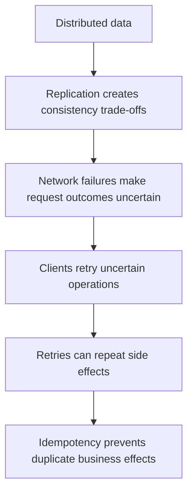

A distributed system cannot assume that:

- every replica has the latest value;
- every network request reaches its destination;
- every response reaches the caller;
- a timeout means the operation failed;
- a message is delivered only once.

A reliable design therefore needs two separate decisions:

1. **What consistency guarantee does each business operation require?**
2. **How can the operation be retried without creating duplicate effects?**

Consistency protects the correctness of shared state.  
Idempotency protects the correctness of repeated requests.

---

# 2. What Consistency Means

## 2.1 Consistency in a replicated system

Suppose a user changes an address and the system stores the data in two replicas.

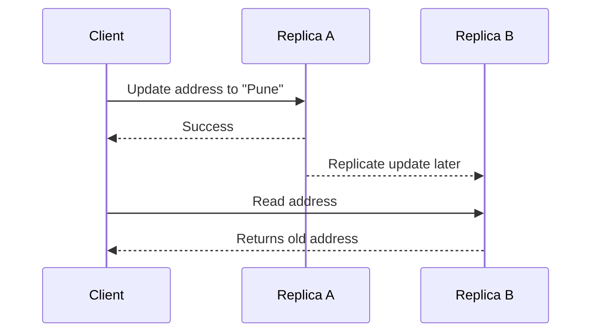

The write succeeded on Replica A, but Replica B had not received it yet. The next read returned stale data.

Consistency defines **what values clients are allowed to observe when multiple copies of data or concurrent operations exist**.

It does not simply mean that the database has no corrupt rows. In system design, the important question is:

> After a successful write, what may another client or replica return?

---

## 2.2 Common consistency models

### Strong or linearizable consistency

A completed write appears to take effect at one instant, and later operations observe it.

```text
Write X = 20 completes
          │
          └── Any later read must not return the previous value
```

Linearizability respects real-time ordering. It is useful when stale data could violate a business invariant.

Typical use cases:

- account balance checks;
- inventory reservation;
- uniqueness decisions;
- lock ownership;
- leader election metadata;
- payment or ledger state.

The cost is usually greater coordination, latency, or reduced availability during failures.

---

### Sequential consistency

All clients observe operations in one valid global order, but that order does not have to match real-time order.

It is weaker than linearizability because a client may not immediately observe an operation that already completed in real time.

---

### Causal consistency

Operations that are causally related are observed in the correct order.

Example:

```text
1. User creates a post
2. Another user replies to that post
```

A system should not show the reply before the original post. Independent operations may be observed in different orders.

This model is useful in collaboration, social feeds, comments, and globally distributed applications.

---

### Eventual consistency

If no new writes occur, all replicas eventually converge to the same value.

An immediate read may be stale:

```text
T0: Write product price = ₹1,999 in Region A
T1: Read in Region B returns ₹2,099
T2: Replication completes
T3: Read in Region B returns ₹1,999
```

Eventual consistency provides convergence, not immediate freshness.

Typical use cases:

- product catalog;
- analytics;
- activity feeds;
- view counters;
- search indexes;
- cached profile information.

The application may still need conflict resolution, versioning, timestamps, CRDTs, or domain-specific merge rules.

---

### Session guarantees

Many applications do not need global linearizability but need a predictable user experience.

Common session guarantees include:

| Guarantee | Meaning |
|---|---|
| Read-your-writes | A user sees their own completed changes |
| Monotonic reads | A user does not move backward to an older version |
| Monotonic writes | A user's writes are applied in order |
| Writes-follow-reads | A write is based on a version the user has already observed |

For example, a globally replicated profile service may be eventually consistent across users while guaranteeing that the user who edited the profile immediately sees the new value.

---

## 2.3 Consistency vs transaction isolation

These terms are related but not interchangeable.

### Replication consistency

Asks:

> What can different clients or replicas observe?

Examples: linearizable, causal, eventual.

### Transaction isolation

Asks:

> How do concurrent transactions interact?

Examples: read committed, repeatable read, snapshot isolation, serializable.

### Important distinction

- **Linearizability** commonly describes real-time behavior of individual operations.
- **Serializability** ensures concurrent transactions behave like some serial execution.
- **Strict serializability** combines serializable transactions with real-time ordering.

A system can have serializable transactions inside one database region while replicas in another region remain eventually consistent.

---

# 3. The CAP Theorem

## 3.1 The three CAP properties

CAP refers to:

### Consistency

In the CAP model, consistency is close to **single-copy atomic or linearizable behavior**.

Every read behaves as though the system contains one up-to-date copy of the data.

This is not the `C` in ACID. ACID consistency refers to preserving database rules and invariants.

---

### Availability

Every request sent to a non-failing node eventually receives a valid response.

Availability in CAP is stronger and more formal than saying:

- the monthly uptime is 99.99%;
- the service returned an HTTP response;
- the load balancer is healthy.

Returning an error such as “cannot process because the other region is unavailable” does not preserve CAP availability for that operation.

---

### Partition tolerance

The system continues to follow its defined behavior even when nodes cannot communicate reliably.

A partition can involve:

- dropped messages;
- extreme delay;
- broken network links;
- a region becoming unreachable;
- firewall or routing problems;
- partial connectivity between nodes.

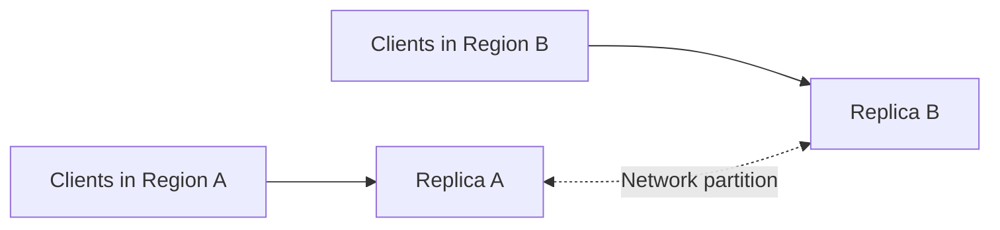

---

## 3.2 What CAP actually says

During a network partition, a replicated system cannot guarantee both:

- linearizable consistency; and
- availability for every request.

The system must choose what a particular operation does while communication is unavailable.

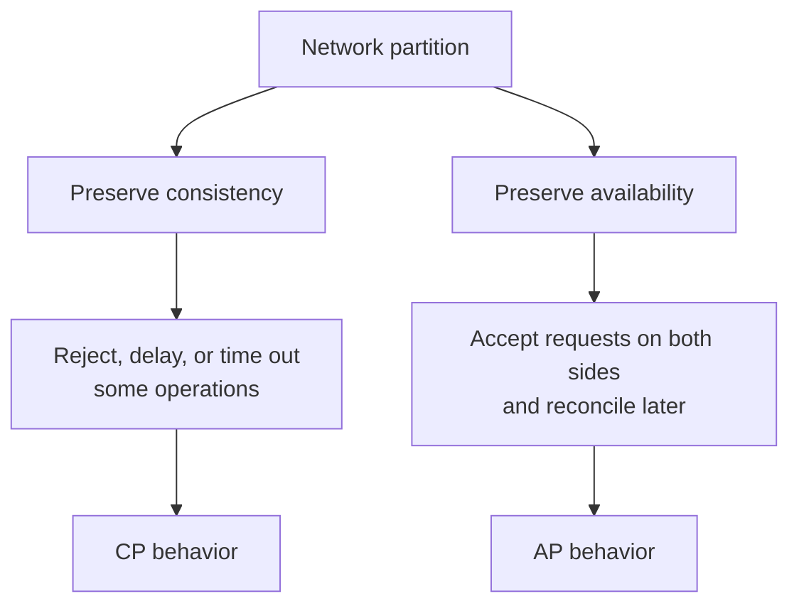

### The most important interpretation

CAP does **not** mean:

> “Choose any two of consistency, availability, and partition tolerance.”

In a real distributed system, partitions are possible. Partition tolerance is therefore part of the operating environment, not a feature that can always be disabled.

The practical choice during a partition is normally:

> **For this operation, should the system reject or delay work to preserve consistency, or accept work and risk temporary inconsistency?**

---

## 3.3 CP, AP, and CA

### CP: Consistency + partition tolerance

During a partition, the system may reject, delay, or make some operations unavailable rather than return stale or conflicting data.

Example:

```text
Two regions cannot communicate.

Request: Reserve the last available hotel room.

CP behavior:
- Only the quorum/leader side accepts the reservation.
- The other side rejects or waits.
- Double booking is prevented.
```

Suitable for operations where conflicting success is unacceptable:

- ledger posting;
- unique username allocation;
- inventory reservation for scarce stock;
- distributed locks;
- configuration control;
- payment state transitions.

CP does not mean the entire product is always unavailable. Only the operations that cannot safely proceed may be affected.

---

### AP: Availability + partition tolerance

Both sides continue serving requests during the partition and reconcile after communication returns.

Example:

```text
Two regions cannot communicate.

Request: Add an item to a shopping cart.

AP behavior:
- Both regions accept updates.
- Cart versions are merged later.
```

Suitable when temporary inconsistency is acceptable and conflicts can be merged or corrected:

- shopping carts;
- likes and counters;
- feeds;
- telemetry;
- some catalog data;
- offline-first applications.

AP does not mean “no consistency.” An AP design may still provide causal consistency, read-your-writes, version checks, conflict-free data types, or deterministic merge rules.

---

### CA: Consistency + availability without partition handling

A single-node database can provide consistent and available behavior while it is healthy because there is no inter-node partition to handle.

A distributed system can also behave like CA when the network is healthy. CAP becomes relevant when communication is partitioned.

Therefore, labeling a real multi-node system as permanently “CA” is usually incomplete.

---

## 3.4 CAP is an operation-level trade-off

A complete platform is rarely purely CP or purely AP.

An e-commerce system may choose:

| Operation | Preferred behavior |
|---|---|
| Browse product descriptions | AP / eventually consistent |
| Display approximate stock | Eventual or bounded-staleness |
| Reserve final stock unit | CP / strongly consistent |
| Add item to cart | AP with merge |
| Capture payment | Strongly controlled and idempotent |
| Analytics ingestion | AP / asynchronous |
| Ledger posting | CP-like invariant protection |

The choice may also differ between reads and writes.

A database can offer:

- eventual reads by default;
- strongly consistent reads on demand;
- conditional writes for critical updates;
- transactions for a small set of records.

For example, current DynamoDB documentation describes eventual and strongly consistent read options for tables and local secondary indexes. Its multi-Region global tables support eventual and strong consistency modes, with different replication behavior and operational trade-offs.

---

## 3.5 Beyond CAP: PACELC

CAP focuses on behavior **during a partition**.

PACELC adds the normal case:

```text
If Partition:
    choose Availability or Consistency
Else:
    choose Latency or Consistency
```

Even without a partition, strong consistency often requires coordination between replicas. Waiting for that coordination increases latency.

For a globally distributed service:

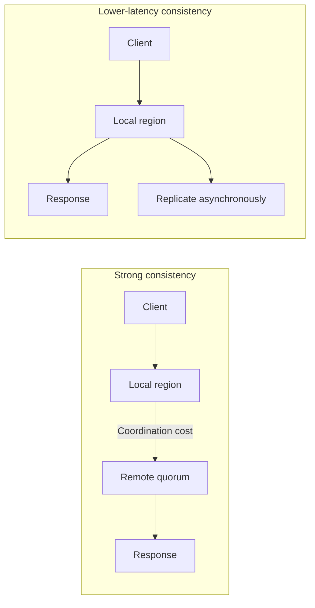

PACELC is useful because most system-design decisions happen while the network is slow but not fully partitioned.

---

# 4. Choosing Consistency for Real Features

Start with the business invariant, not the database label.

### Decision framework

Ask:

1. What incorrect outcome can stale or conflicting data produce?
2. Can that outcome be repaired later?
3. Is the conflict visible only in the UI, or does it move money or allocate a scarce resource?
4. Can the operation be expressed as a conditional write?
5. How much extra latency is acceptable?
6. What should happen when the coordinating nodes are unavailable?

### Practical selection guide

| Requirement | Reasonable approach |
|---|---|
| Must never overspend an account | Strong consistency, transaction, or conditional update |
| Must not sell the same unique seat twice | Leader/quorum plus atomic reservation |
| User must immediately see own profile edit | Read-your-writes session guarantee |
| Search may lag the source database | Eventual consistency |
| Like count may be approximate briefly | Eventual consistency or CRDT counter |
| Two offline users edit the same document | Causal/versioned merge or conflict resolution |
| Reporting can be several minutes behind | Asynchronous replicas or warehouse pipeline |

### Example: safe stock decrement

Avoid:

```sql
SELECT available_quantity FROM inventory WHERE sku = 'SKU-10';
-- Application sees 1.

UPDATE inventory
SET available_quantity = 0
WHERE sku = 'SKU-10';
```

Two concurrent requests can both read `1` and both succeed.

Prefer an atomic conditional update:

```sql
UPDATE inventory
SET available_quantity = available_quantity - 1
WHERE sku = 'SKU-10'
  AND available_quantity > 0
RETURNING available_quantity;
```

The affected-row count becomes part of the business decision. Database constraints and atomic conditions are more reliable than an application-level “check then update.”

---

# 5. Why Distributed Operations Need Retries

Remote calls fail for temporary reasons:

- connection reset;
- packet loss;
- service restart;
- load-balancer timeout;
- database leader election;
- rate limiting;
- temporary overload;
- DNS or routing issue;
- response lost after successful processing.

Retries improve availability by giving a transient failure another chance.

The difficult part is that a caller often cannot tell whether the first attempt changed state.

---

## 5.1 The ambiguous timeout problem

Consider a payment request:

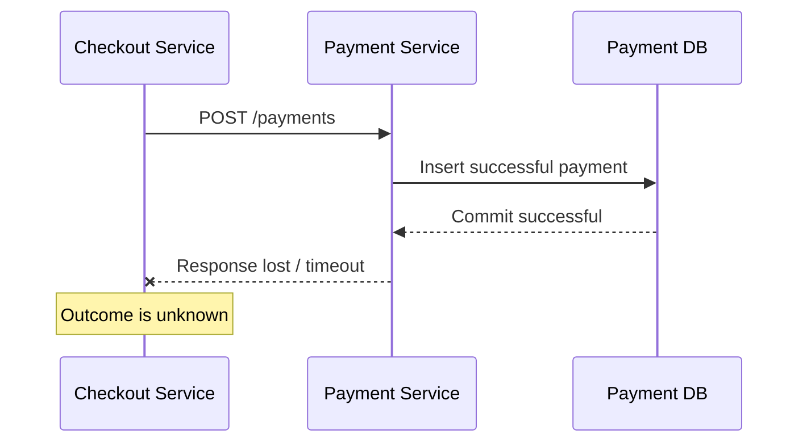

From the checkout service's perspective, several outcomes look identical:

```text
Observed by caller: timeout

Possible server reality:
A. Request never reached the server
B. Request reached the server but failed before mutation
C. Mutation committed, but response was lost
D. Server is still processing the operation
```

A timeout means **the caller stopped waiting**. It does not prove that the server rolled back or never processed the request.

---

## 5.2 How retries create duplicate effects

Without idempotency:

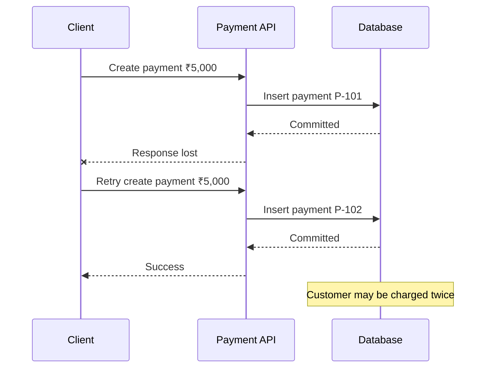

The retry is technically a second valid `POST`. The server cannot know whether it represents:

- a retry of the same intent; or
- a new intent with identical data.

Comparing request bodies is not enough. A customer may intentionally make two identical ₹5,000 payments.

The client must provide an identifier that expresses business intent.

---

# 6. Idempotency

## 6.1 Definition

An operation is idempotent when applying the same intended operation multiple times produces the same intended business effect as applying it once.

```text
f(f(x)) = f(x)
```

Examples:

```text
Set email_verified = true
Set shipping address = "Pune"
Cancel order ORD-100
Create one payment for checkout attempt CHK-9001
```

Non-idempotent examples:

```text
Increment balance by ₹100
Create a new order
Send an email
Capture a card payment
Append another ledger entry
```

These operations can be made idempotent by attaching a stable operation identity and remembering its result.

---

## 6.2 HTTP idempotency vs business idempotency

RFC 9110 defines `GET`, `HEAD`, `OPTIONS`, `TRACE`, `PUT`, and `DELETE` as idempotent by method semantics. `POST` is not idempotent by default.

However, HTTP method names do not automatically make application code safe.

### PUT example

```http
PUT /users/42/address

{
  "city": "Pune"
}
```

Repeating “set the address to Pune” has the same intended effect.

### Misleading PUT example

```http
PUT /accounts/42/increment-balance

{
  "amount": 100
}
```

This increments on every request. The endpoint is not business-idempotent even though it uses `PUT`.

### DELETE nuance

Deleting the same resource twice may return different responses:

```text
First DELETE  → 204 No Content
Second DELETE → 404 Not Found
```

The final intended server state is still “resource absent,” so the operation can remain idempotent.

### POST with an idempotency key

```http
POST /payments
Idempotency-Key: 5fdd80f8-6098-4ef8-a16e-9b132e7088e3

{
  "order_id": "ORD-901",
  "amount": 500000,
  "currency": "INR"
}
```

A server-side idempotency contract can make this state-changing `POST` safe to retry.

---

## 6.3 Idempotency is not exactly-once execution

The server may receive and execute request-handling code more than once.

Idempotency aims for:

```text
At-least-once attempts
          +
Duplicate detection
          +
Atomic state protection
          =
One effective business outcome
```

This is often called **effectively-once processing**.

“Exactly once” across arbitrary networks, databases, queues, and external providers is normally not a magic transport guarantee. It is built from:

- unique operation identifiers;
- durable deduplication records;
- transactions;
- uniqueness constraints;
- idempotent side effects;
- reconciliation.

---

# 7. Designing an Idempotent API

## 7.1 Request contract

A reliable idempotency contract normally includes the following.

### Client-generated key

The client generates a high-entropy key, commonly a UUID.

```text
Idempotency-Key: 5fdd80f8-6098-4ef8-a16e-9b132e7088e3
```

The same logical operation must reuse the same key across retries.

A new business intent must use a new key.

---

### Scope

Do not treat the key as globally unique unless that is intentional.

A practical uniqueness scope is:

```text
tenant_id + operation + idempotency_key
```

For example:

```text
tenant-12 + create-payment + key-abc
```

This prevents unrelated endpoints or tenants from conflicting.

---

### Request fingerprint

Store a canonical hash of the fields that define the request's intent.

```text
SHA-256(
    method
    + normalized path
    + tenant
    + canonical JSON body
)
```

When the same key arrives with different parameters, reject it:

```http
HTTP/1.1 409 Conflict

{
  "code": "IDEMPOTENCY_KEY_REUSED",
  "message": "The key was already used with different request data."
}
```

Do not silently return the previous result for a different payload.

---

### Stable response semantics

For the same key and same request intent, return:

- the stored original response; or
- a semantically equivalent response representing the same resource/outcome.

Returning a stable result makes retry handling simple for clients.

---

## 7.2 Server-side workflow

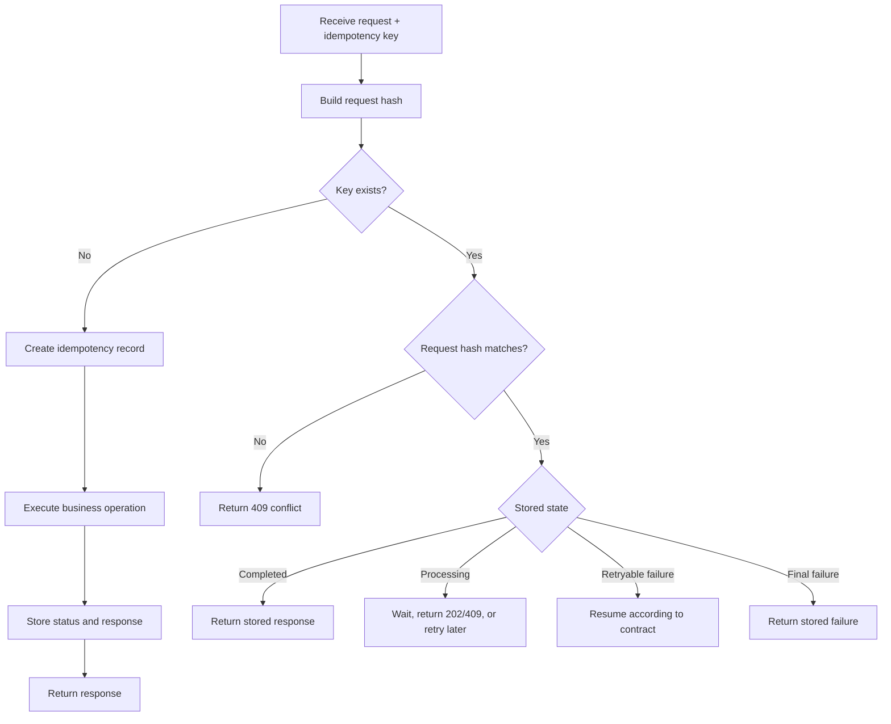

The central rule is:

> Recording the idempotency key and applying the protected mutation must not leave a gap where only one of them succeeds.

For a database-only operation, keep them in one transaction.

---

## 7.3 Database schema

Example PostgreSQL table:

```sql
CREATE TABLE idempotency_requests (
    tenant_id       UUID        NOT NULL,
    operation       VARCHAR(100) NOT NULL,
    idempotency_key VARCHAR(255) NOT NULL,
    request_hash    CHAR(64)     NOT NULL,

    status          VARCHAR(20)  NOT NULL
                    CHECK (status IN (
                        'processing',
                        'succeeded',
                        'failed'
                    )),

    resource_id     UUID,
    http_status     SMALLINT,
    response_body   JSONB,

    created_at      TIMESTAMPTZ NOT NULL DEFAULT NOW(),
    updated_at      TIMESTAMPTZ NOT NULL DEFAULT NOW(),
    expires_at      TIMESTAMPTZ NOT NULL,

    PRIMARY KEY (tenant_id, operation, idempotency_key)
);

CREATE INDEX idx_idempotency_expiry
    ON idempotency_requests (expires_at);
```

The primary key is the final concurrency guard. An in-memory cache alone is not enough because:

- application instances restart;
- requests can reach different instances;
- cache entries can be evicted;
- two instances can race;
- the cache and business database can diverge.

A cache may accelerate lookup, but durable storage or a database uniqueness constraint should protect correctness.

---

## 7.4 Handling concurrent duplicate requests

Two copies of the same request may arrive at nearly the same time:

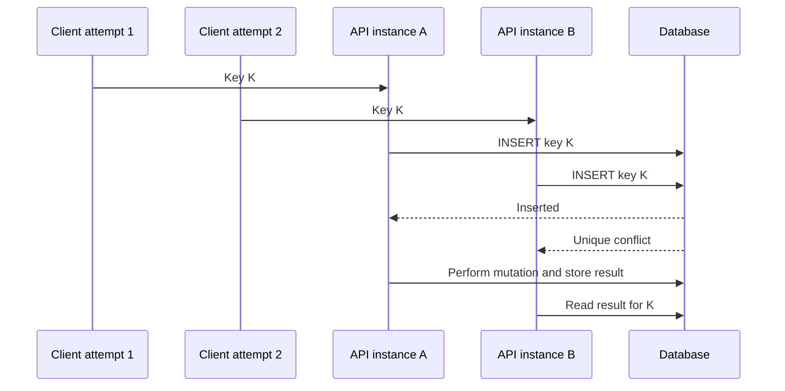

Possible behavior for the losing request:

- wait briefly for the first transaction;
- return `202 Accepted` with a status URL;
- return `409 Conflict` or `425 Too Early` with a retry hint;
- return the completed result if it becomes available.

Do not allow both requests to execute the side effect independently.

---

## 7.5 Choosing a retention period

The idempotency record must remain available longer than the maximum retry window.

Consider:

- client retry duration;
- queue redelivery delay;
- mobile devices reconnecting hours later;
- delayed network packets;
- business reconciliation period;
- storage cost;
- privacy and compliance rules.

Possible policies:

```text
Normal order creation: 24–72 hours
Payment operation:     several days or longer
Webhook event:         based on provider redelivery policy
Financial ledger key:  potentially permanent business uniqueness
```

After expiry, reusing the same key may be treated as a new request. The API contract must state this clearly.

Do not put email addresses, card data, access tokens, or other sensitive information inside the idempotency key.

---

# 8. Implementation Patterns

## 8.1 Database-only operation

For an operation fully contained in one database, use one transaction.

### Transaction outline

```sql
BEGIN;

-- Only one transaction can claim this key.
INSERT INTO idempotency_requests (
    tenant_id,
    operation,
    idempotency_key,
    request_hash,
    status,
    expires_at
)
VALUES (
    :tenant_id,
    'create-order',
    :key,
    :request_hash,
    'processing',
    NOW() + INTERVAL '48 hours'
)
ON CONFLICT DO NOTHING;
```

If the row was inserted, perform the business mutation:

```sql
INSERT INTO orders (
    id,
    tenant_id,
    customer_id,
    total_amount,
    status
)
VALUES (
    :order_id,
    :tenant_id,
    :customer_id,
    :total_amount,
    'created'
);
```

Then store the response:

```sql
UPDATE idempotency_requests
SET status = 'succeeded',
    resource_id = :order_id,
    http_status = 201,
    response_body = :response_json,
    updated_at = NOW()
WHERE tenant_id = :tenant_id
  AND operation = 'create-order'
  AND idempotency_key = :key;

COMMIT;
```

If the business insert fails, the idempotency claim rolls back with it.

When the initial insert reports a conflict:

1. read the existing record;
2. verify the request hash;
3. return the stored result or the defined in-progress response.

### Simplified Python-style service flow

```python
def create_order(command: CreateOrder, key: str, tenant_id: UUID) -> dict:
    request_hash = hash_canonical_request(command)

    with db.transaction() as tx:
        record = tx.claim_idempotency_key(
            tenant_id=tenant_id,
            operation="create-order",
            key=key,
            request_hash=request_hash,
        )

        if not record.claimed:
            existing = tx.get_idempotency_record_for_update(
                tenant_id=tenant_id,
                operation="create-order",
                key=key,
            )

            if existing.request_hash != request_hash:
                raise IdempotencyKeyReusedError()

            if existing.status == "succeeded":
                return existing.response_body

            raise RequestAlreadyProcessingError()

        order = tx.insert_order(command)

        response = {
            "id": str(order.id),
            "status": order.status,
        }

        tx.complete_idempotency_record(
            tenant_id=tenant_id,
            operation="create-order",
            key=key,
            resource_id=order.id,
            http_status=201,
            response_body=response,
        )

        return response
```

The transaction and unique constraint matter more than the framework-specific code.

---

## 8.2 External payment provider

A local database transaction cannot atomically commit with an external payment provider.

This is unsafe:

```text
BEGIN database transaction
Call external payment API
Commit database
```

The network call can take a long time, hold locks, and still leave an uncertain outcome if the process crashes.

Use a durable workflow.

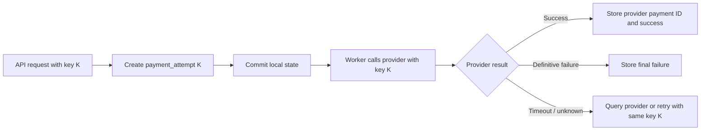

Recommended rules:

1. Persist a `payment_attempt` with a unique idempotency key.
2. Commit that intent before starting unreliable remote work.
3. Pass a stable idempotency key to the payment provider if supported.
4. On timeout, retry using the same provider key.
5. If status remains unknown, query the provider using the key or provider request ID.
6. Reconcile provider records with local records.
7. Never generate a new key merely because the previous attempt timed out.

Example state machine:

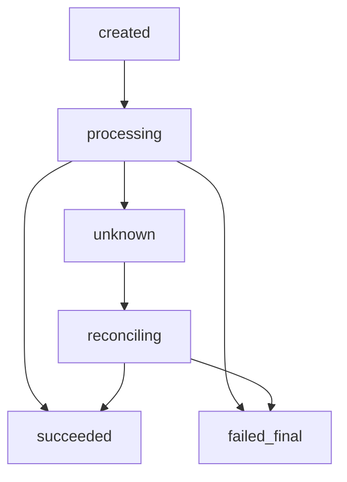

An `unknown` state is better than incorrectly marking a payment as failed and charging again.

---

## 8.3 Message consumer deduplication

Queues commonly provide at-least-once delivery. A message can therefore be delivered more than once.

```text
Event E-101 delivered
Consumer updates invoice
Acknowledgement is lost
Queue delivers E-101 again
```

Use an inbox or processed-events table.

```sql
CREATE TABLE processed_events (
    consumer_name VARCHAR(100) NOT NULL,
    event_id      UUID         NOT NULL,
    processed_at  TIMESTAMPTZ  NOT NULL DEFAULT NOW(),

    PRIMARY KEY (consumer_name, event_id)
);
```

Process the event and record its ID in the same transaction:

```sql
BEGIN;

INSERT INTO processed_events (consumer_name, event_id)
VALUES ('invoice-service', :event_id)
ON CONFLICT DO NOTHING;

-- Continue only if the insert succeeded.
UPDATE invoices
SET status = 'paid'
WHERE id = :invoice_id;

COMMIT;
```

If the event ID already exists, acknowledge the duplicate without reapplying the mutation.

The consumer name belongs in the key because different consumers may each need to process the same event once.

---

## 8.4 Transactional outbox

Another dual-write problem occurs when a service must:

1. update its database; and
2. publish an event.

This is unsafe:

```text
Update database succeeds
Publish event fails
```

The database now contains a change that downstream services never hear about.

The transactional outbox pattern writes both records in one transaction:

```sql
BEGIN;

UPDATE orders
SET status = 'confirmed'
WHERE id = :order_id;

INSERT INTO outbox_events (
    id,
    aggregate_type,
    aggregate_id,
    event_type,
    payload
)
VALUES (
    :event_id,
    'order',
    :order_id,
    'OrderConfirmed',
    :payload
);

COMMIT;
```

A publisher later sends outbox events. Because publishing may be retried, consumers still need idempotency using the event ID.

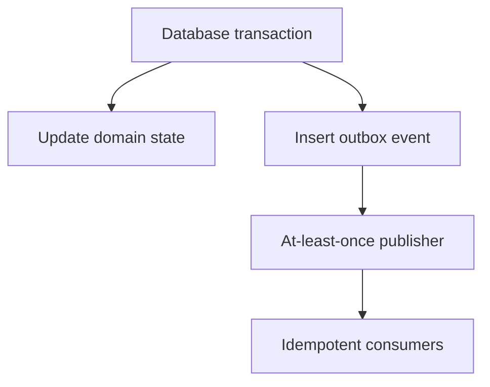

Outbox and inbox patterns work together to provide reliable, effectively-once business processing.

---

# 9. Safe Retry Policy

Idempotency prevents duplicate effects, but retry behavior must still be controlled.

## Retry only failures that may be transient

Often retryable:

- connection timeout;
- connection reset;
- temporary DNS failure;
- `408 Request Timeout`;
- `429 Too Many Requests`;
- `502 Bad Gateway`;
- `503 Service Unavailable`;
- `504 Gateway Timeout`;
- database deadlock or leader failover, when documented as retryable.

Usually not retryable without changing the request:

- validation errors;
- authentication or authorization errors;
- malformed payloads;
- insufficient balance;
- business-rule rejection;
- idempotency key reused with different parameters.

Status code alone is not always enough. Follow the downstream service's documented retry contract.

---

## Use exponential backoff with jitter

Without delay:

```text
Attempt 1 fails
Thousands of clients retry immediately
Dependency becomes more overloaded
More requests fail
```

This is a retry storm.

A common capped full-jitter calculation is:

```python
import random

def retry_delay(attempt: int, base: float = 0.2, cap: float = 10.0) -> float:
    maximum = min(cap, base * (2 ** attempt))
    return random.uniform(0, maximum)
```

Example delay ranges:

```text
Attempt 0: 0.0–0.2 s
Attempt 1: 0.0–0.4 s
Attempt 2: 0.0–0.8 s
Attempt 3: 0.0–1.6 s
...
Maximum:   10 s
```

Jitter spreads retry traffic instead of synchronizing every client.

---

## Apply a total deadline

A call should not retry forever.

```text
Request deadline: 8 seconds
Attempt 1: 1.0 second timeout
Backoff:   0.2 second
Attempt 2: 1.5 second timeout
Backoff:   0.6 second
Attempt 3: remaining budget
```

Propagate the remaining deadline across service boundaries where possible.

---

## Limit attempts

Set a maximum based on:

- end-user latency;
- operation importance;
- downstream recovery time;
- queue redelivery;
- overall request deadline.

For asynchronous jobs, retries can continue longer, but they still need:

- maximum attempts;
- dead-letter handling;
- alerting;
- reconciliation.

---

## Retry at one layer

Suppose a request passes through five services and every layer makes three attempts.

```text
3 × 3 × 3 × 3 × 3 = 243 possible calls
```

Retries can multiply dramatically.

Choose the layer with enough context to make the retry decision. Lower-level libraries may retry very short network failures, while the business workflow controls larger retries.

---

## Respect server signals

Use:

- `Retry-After`;
- rate-limit headers;
- provider-specific retry guidance;
- circuit-breaker state;
- concurrency limits.

---

## Side-effecting requests require idempotency

Before automatically retrying `POST`, payment capture, order creation, email sending, or resource provisioning, confirm that one of these is true:

1. the API has an idempotency-key contract;
2. the business operation uses a natural unique identifier;
3. the server can prove the first attempt was never applied;
4. a reconciliation step determines the actual outcome.

Without one of these, automatic retry can be unsafe.

---

# 10. End-to-End Payment Example

Assume a checkout service must collect ₹5,000 for order `ORD-901`.

## Request

```http
POST /v1/payments
Authorization: Bearer <token>
Idempotency-Key: 5fdd80f8-6098-4ef8-a16e-9b132e7088e3
Content-Type: application/json

{
  "order_id": "ORD-901",
  "amount": 500000,
  "currency": "INR",
  "payment_method_id": "pm_123"
}
```

Amounts should normally be represented in the smallest currency unit to avoid floating-point errors.

---

## Processing flow

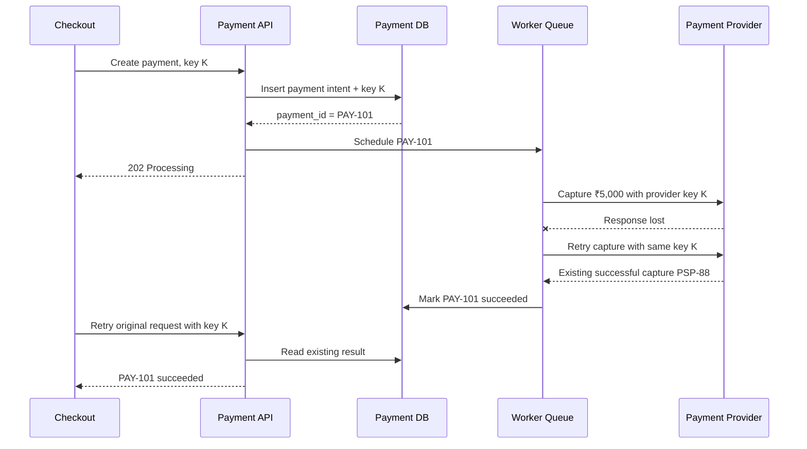

There may be multiple:

- HTTP attempts;
- queue deliveries;
- worker executions;
- provider calls.

But there is one effective payment.

---

## Important database constraints

```sql
CREATE UNIQUE INDEX uq_payment_idempotency
ON payments (tenant_id, idempotency_key);

CREATE UNIQUE INDEX uq_payment_provider_reference
ON payments (provider_name, provider_payment_id);

CREATE UNIQUE INDEX uq_single_capture_per_order
ON payments (order_id)
WHERE payment_type = 'capture'
  AND status IN ('processing', 'succeeded');
```

The exact constraints depend on whether the business supports:

- split payments;
- multiple attempts;
- partial captures;
- retries after a definitive failure;
- multiple payment methods.

Do not create a “one payment per order” constraint if the business legitimately permits more than one payment.

---

## Consistency decision

For the payment ledger:

- use strongly controlled state transitions;
- protect balance and ledger invariants with transactions or atomic writes;
- avoid accepting conflicting state changes in two disconnected partitions;
- allow non-critical views, notifications, and analytics to update asynchronously.

```text
Critical core:
Payment state + ledger entries
        │
        └── Strong invariants / CP-like behavior

Derived views:
Email, analytics, dashboard counters
        │
        └── Eventual consistency / AP-friendly behavior
```

This is a common system-design approach: keep the correctness-critical core small and strongly protected, then propagate derived data asynchronously.

---

# 11. Observability and Operational Controls

Idempotency failures are difficult to debug without traceable identifiers.

Log the following fields:

```text
request_id
trace_id
tenant_id
operation
idempotency_key_hash
request_hash
idempotency_status
resource_id
attempt_number
downstream_request_id
provider_reference
retry_reason
response_replayed
processing_duration
```

Avoid logging sensitive payloads or raw credentials.

### Useful metrics

- total idempotent requests;
- duplicate request rate;
- replayed response rate;
- key/payload mismatch count;
- records stuck in `processing`;
- retry count by dependency;
- final failure count;
- unknown payment outcomes;
- reconciliation backlog;
- idempotency-store latency;
- deduplication conflicts.

### Alerts

Alert when:

- `processing` records exceed their expected duration;
- provider success exists without matching local success;
- local success exists without a provider reference;
- duplicate side effects are detected;
- retry traffic rises sharply;
- idempotency storage becomes unavailable.

### Recovery job

A periodic reconciler can inspect stale records:

```text
payment_attempt.status = processing
AND updated_at < now() - 10 minutes
```

For each record:

1. query the external provider using the stable key or request ID;
2. update the local state if the provider knows the outcome;
3. retry safely if the provider confirms no operation exists;
4. move unrecoverable cases to manual review.

---

# 12. Design Checklist

## Consistency

- [ ] The business invariant is clearly defined.
- [ ] The required consistency model is chosen per operation.
- [ ] Stale-read behavior is documented.
- [ ] Conflict resolution is defined for AP operations.
- [ ] Strong coordination is limited to correctness-critical state.
- [ ] Database conditions and constraints enforce invariants.
- [ ] Replication lag is considered in read paths.
- [ ] Session guarantees are provided where user experience requires them.

## CAP and failure behavior

- [ ] Behavior during a partition is explicit.
- [ ] The system knows which operations reject, wait, or continue.
- [ ] The design does not describe CAP as simply “choose any two.”
- [ ] Latency vs consistency is considered during normal operation.
- [ ] Read and write behavior may be selected independently.

## Idempotency

- [ ] The client supplies a stable key for one logical intent.
- [ ] New intent uses a new key.
- [ ] The key is scoped by tenant and operation.
- [ ] The request fingerprint is stored and checked.
- [ ] Duplicate concurrent requests are serialized or deduplicated.
- [ ] Key registration and database mutation are atomic where possible.
- [ ] External providers receive a stable downstream key.
- [ ] In-progress, success, failure, and unknown states are defined.
- [ ] Retention exceeds the realistic retry/redelivery window.
- [ ] Stored responses do not expose sensitive data.

## Retries

- [ ] Only transient failures are retried.
- [ ] Side-effecting calls are idempotent before automatic retry.
- [ ] Exponential backoff and jitter are used.
- [ ] The total deadline and maximum attempts are bounded.
- [ ] `Retry-After` and provider guidance are respected.
- [ ] Retry multiplication across layers is controlled.
- [ ] Dead-letter and reconciliation paths exist.
- [ ] Retry and duplicate metrics are monitored.

---

# 13. Interview Summary

A strong system-design explanation should connect the concepts rather than define them independently.

### Consistency

Replication improves availability, latency, and fault tolerance, but replicas may temporarily disagree. Consistency models define what clients are allowed to observe. Strong consistency is needed for critical invariants; eventual or causal consistency is often better for scalable derived data and user-facing content where temporary staleness is acceptable.

### CAP

CAP applies when replicas cannot communicate. During that partition, an operation cannot guarantee both linearizable consistency and availability. CP behavior rejects or delays some work to avoid conflicts. AP behavior continues accepting work and reconciles later. The correct choice is made per business operation, not once for the whole product.

### Retries

Retries are necessary because distributed calls fail transiently. A timeout creates an ambiguous result: the operation may not have started, may still be running, or may have committed while the response was lost.

### Idempotency

Idempotency makes repeated attempts produce one intended business effect. A client-generated operation key identifies the intent. The server stores the key, request fingerprint, status, and result; uses transactions and uniqueness constraints to prevent races; and returns the previous or equivalent result for duplicate requests.

### Final mental model

```text
Consistency answers:
"What state may a client observe?"

CAP answers:
"What happens when replicas cannot communicate?"

Retries answer:
"How do we recover from temporary uncertainty?"

Idempotency answers:
"How do repeated attempts avoid repeating the business effect?"
```

---

# 14. References

1. Seth Gilbert and Nancy A. Lynch, **Perspectives on the CAP Theorem**, IEEE Computer, 2012.  
   https://groups.csail.mit.edu/tds/papers/Gilbert/Brewer2.pdf

2. IETF, **RFC 9110: HTTP Semantics**, Section 9.2.2, Idempotent Methods.  
   https://datatracker.ietf.org/doc/rfc9110/

3. AWS Builders' Library, **Making retries safe with idempotent APIs**.  
   https://aws.amazon.com/builders-library/making-retries-safe-with-idempotent-APIs/

4. AWS Builders' Library, **Timeouts, retries, and backoff with jitter**.  
   https://aws.amazon.com/builders-library/timeouts-retries-and-backoff-with-jitter/

5. AWS Architecture Blog, **Exponential Backoff and Jitter**.  
   https://aws.amazon.com/blogs/architecture/exponential-backoff-and-jitter/

6. Amazon DynamoDB Developer Guide, **DynamoDB read consistency**.  
   https://docs.aws.amazon.com/amazondynamodb/latest/developerguide/HowItWorks.ReadConsistency.html

7. Stripe API Reference, **Idempotent requests**.  
   https://docs.stripe.com/api/idempotent_requests

---

> **Key takeaway:** Distributed systems cannot remove uncertainty, but they can contain it. Choose the required consistency for each business invariant, expect requests to be retried, and make every retryable side effect idempotent.
