# Scaling the Database

> Understand how databases are scaled in real systems, which technique solves which bottleneck, and how to choose the next scaling step.

## In short

- Climb the ladder in order — measure, optimize queries and indexes, scale vertically, pool connections, cache repeated reads, add read replicas, partition, shard — and stop at the simplest step that meets the requirement.
- A slow database is usually not an undersized one: missing indexes, N+1 queries, long transactions, and oversized application connection pools account for most of it.
- Read replicas scale reads, never writes, and replication is asynchronous — decide per read path which must hit the primary and which may be a few seconds stale.
- Replication for failover and replication for read scaling are different goals, and neither one is a backup: a destructive statement replicates too.
- Partitioning splits one table inside one cluster and keeps transactions simple; sharding spreads data across independent nodes and moves routing into the application.
- The shard key decides everything — high cardinality, even distribution, present in common requests, and chosen so one business transaction stays inside one shard.
- Cross-shard joins, global aggregates, globally unique IDs, and distributed transactions are the real price of sharding; design them out rather than solving them per request.

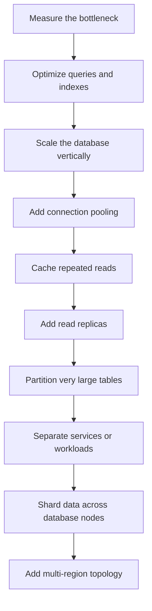

**Interview answer:** Measure first — execution plans, P95/P99 latency, lock waits, connection counts — because most "we need a bigger database" problems turn out to be a missing index, an N+1 query, or an application pool sized larger than the server can accept. Then climb only as far as the bottleneck requires: index and query tuning, a larger instance, connection pooling, caching, and read replicas cover most growth stages, and partitioning makes an oversized table manageable without distributing it. Shard only once a single writer has genuinely reached its limit, because sharding buys write capacity by giving up cheap joins, easy global aggregates, and single-node transactions.

**Gotcha:** Adding read replicas to a primary that is write-bound. Every write still executes on the primary and is then replayed on every replica, so replicas add read capacity and nothing else — and since a replica is also neither a backup nor automatic failover, treating it as either leaves the system exposed.

---

# 1. What Database Scaling Means

Database scaling means increasing a database system's ability to handle growth while keeping acceptable:

- Response time
- Throughput
- Availability
- Data correctness
- Operational cost

Growth may come from more users, more requests, larger datasets, heavier queries, or higher availability requirements.

## 1.1 Scaling is not only adding servers

A slow database is not automatically an undersized database. The real cause is more often missing or ineffective indexes, queries reading far more rows than required, too many application connections, lock contention, long-running transactions, repeated reads of the same data, one extremely hot table or tenant, analytical queries running on the transactional database, or unevenly distributed shard keys.

Adding infrastructure before identifying the cause can make the system more expensive without solving the problem.

## 1.2 The three dimensions of database growth

### Compute growth

The database needs more CPU or memory to execute queries.

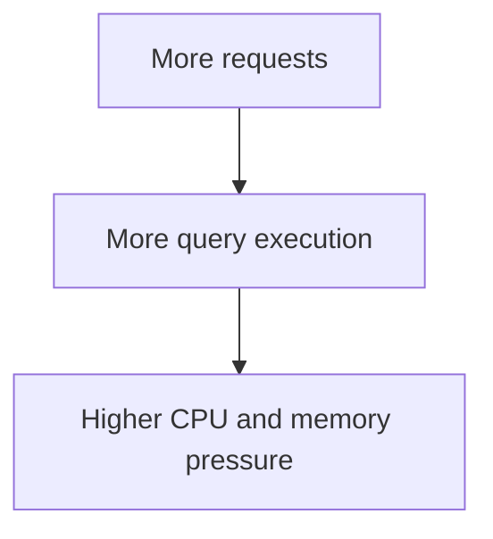

### Storage growth

Tables, indexes, WAL/binlogs, backups, and historical data keep increasing.

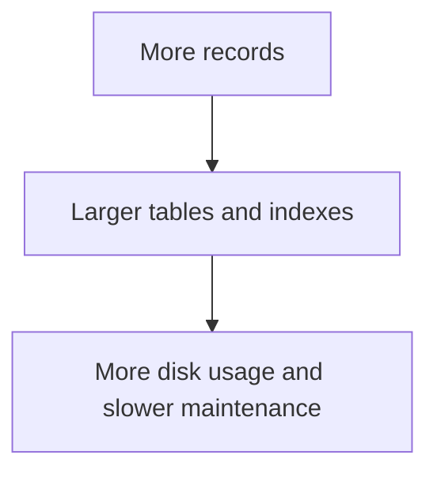

### Throughput growth

The system must process more reads and writes per second. Read traffic is absorbed by caching and replicas; write traffic by batching, partitioning, and sharding.

---

# 2. Start by Finding the Actual Bottleneck

Before selecting a scaling technique, measure the database under realistic production load.

## 2.1 Important metrics

| Area | Useful signals |
|---|---|
| Latency | Average, P95, and P99 query latency |
| Throughput | Queries or transactions per second |
| CPU | Sustained utilization and query CPU time |
| Memory | Buffer-cache hit ratio, sort/hash spills |
| Storage | Disk latency, IOPS, throughput, free space |
| Connections | Active, idle, waiting, rejected connections |
| Locks | Lock waits, deadlocks, blocked transactions |
| Replication | Replica lag, WAL/binlog generation rate |
| Queries | Slow-query count, rows scanned, rows returned |
| Cache | Hit ratio, miss ratio, eviction rate |
| Tables | Growth rate, dead tuples, fragmentation/bloat |

Averages alone are not enough. A system can have a good average latency while a small but important percentage of requests experience severe delays.

## 2.2 Typical symptoms and likely causes

| Symptom | Likely direction to investigate |
|---|---|
| High CPU | Expensive queries, missing indexes, excessive parsing |
| High disk I/O | Large scans, insufficient memory, poor access pattern |
| Too many connections | Missing pooling, oversized application pools |
| Read-heavy primary | Cache or read replicas |
| Write-heavy primary | Batch writes, redesign hot rows, shard writes |
| Large table slowing down | Better indexes, archival, partitioning |
| Long lock waits | Long transactions, hot rows, conflicting updates |
| Replica returns old data | Replication lag and read-routing policy |
| One shard overloaded | Poor shard-key distribution or hot tenant |
| Reporting affects APIs | Separate OLTP and OLAP workloads |

---

# 3. The Database Scaling Ladder

A safe database evolution usually follows the order shown at the top of this note: measure the bottleneck, optimize queries and indexes, scale the database vertically, add connection pooling, cache repeated reads, add read replicas, partition very large tables, separate services or workloads, shard data across database nodes, and only then add a multi-region topology.

This order is not a strict rule, but it reflects an important principle:

> Use the simplest architecture that reliably meets the current requirement.

Sharding should normally come after query optimization, caching, replicas, and data lifecycle improvements because sharding introduces application and operational complexity.

---

# 4. Step 1: Improve the Existing Database

The cheapest database scaling technique is often making each query do less work.

## 4.1 Indexes

An index lets the database locate matching rows without scanning the complete table.

### Example

```sql
SELECT id, status, total_amount
FROM orders
WHERE customer_id = 501
  AND created_at >= '2026-08-01'
ORDER BY created_at DESC;
```

A useful PostgreSQL index can be:

```sql
CREATE INDEX idx_orders_customer_created_at
ON orders (customer_id, created_at DESC);
```

The column order matters because a composite index is most useful when it matches the query's filtering and ordering pattern.

### Covering index

When a frequently executed query needs only a small number of columns, included columns may allow an index-only scan.

```sql
CREATE INDEX idx_orders_customer_created_cover
ON orders (customer_id, created_at DESC)
INCLUDE (status, total_amount);
```

### Index trade-off

Indexes improve reads but add cost to inserts, updates, deletes, storage, vacuum and maintenance, and cache memory.

Do not add an index for every column. Add indexes for real access patterns and verify their use through query plans and production statistics.

## 4.2 Query optimization

Use the database execution plan instead of guessing.

```sql
EXPLAIN (ANALYZE, BUFFERS)
SELECT *
FROM orders
WHERE customer_id = 501;
```

Look for sequential scans on large tables, very high estimated or actual row counts, large differences between estimated and actual rows, disk-based sorts or hashes, repeated nested-loop execution, unnecessary joins, rows removed by filters, and high buffer reads.

`EXPLAIN ANALYZE` executes the query. Be careful when using it with write statements or expensive production queries.

### Return only required data

Avoid:

```sql
SELECT *
FROM orders;
```

Prefer:

```sql
SELECT id, status, total_amount
FROM orders
WHERE customer_id = 501
ORDER BY created_at DESC
LIMIT 20;
```

### Avoid N+1 queries

Inefficient flow:

```text
1 query to load 100 orders
+
100 queries to load each customer
=
101 queries
```

Improved flow:

```sql
SELECT
    o.id,
    o.total_amount,
    c.id AS customer_id,
    c.name AS customer_name
FROM orders o
JOIN customers c ON c.id = o.customer_id
WHERE o.created_at >= CURRENT_DATE - INTERVAL '7 days';
```

Framework equivalents include `select_related` and `prefetch_related` in Django or eager-loading options in other ORMs.

## 4.3 Schema and data-access improvements

Use appropriate column types, keep frequently accessed rows reasonably small, and store large files in object storage rather than database rows. Archive rarely accessed records, avoid unbounded list APIs, and use cursor pagination for large, frequently changing datasets. On the write side, keep transactions short, update only changed columns, and avoid repeatedly calculating expensive aggregates on demand.

### Cursor pagination example

```sql
SELECT id, created_at, total_amount
FROM orders
WHERE (created_at, id) < (:last_created_at, :last_id)
ORDER BY created_at DESC, id DESC
LIMIT 50;
```

Unlike a very large `OFFSET`, cursor pagination does not require the database to repeatedly walk through all earlier rows.

## 4.4 Batching and asynchronous work

Instead of sending many tiny operations:

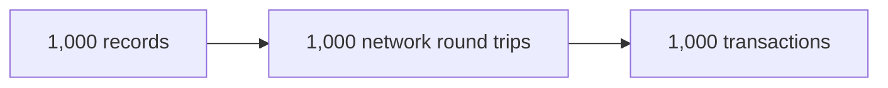

Batch them:

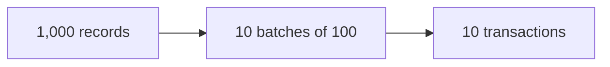

Batching reduces network overhead, transaction setup cost, commit overhead, and repeated statement parsing.

Large batches can hold locks for longer, so batch size should be tested instead of maximized blindly.

---

# 5. Step 2: Scale Vertically

Vertical scaling means increasing the capacity of a single database node.

```text
Before: 4 CPU, 16 GB RAM, standard disk
After:  16 CPU, 64 GB RAM, provisioned high-IOPS disk
```

It can improve query execution capacity, buffer-cache size, sorting and hashing, concurrent transactions, and storage throughput.

## Advantages

- Simple architecture
- Minimal application changes
- Strong consistency remains straightforward
- Existing transactions and joins continue to work

## Limitations

- Hardware has an upper limit
- Larger instances cost more
- Maintenance and restart impact may increase
- One writer still has finite capacity
- It does not remove a single-node failure risk by itself

Vertical scaling is usually a good early step, but it should not replace query optimization.

---

# 6. Step 3: Manage Connections

## 6.1 Why connections become a bottleneck

A database connection is not free. It consumes memory and database-process resources.

Suppose:

```text
30 application instances
× 50 connections per instance
= 1,500 possible database connections
```

Autoscaling the application can accidentally overload the database even when request traffic has not increased proportionally.

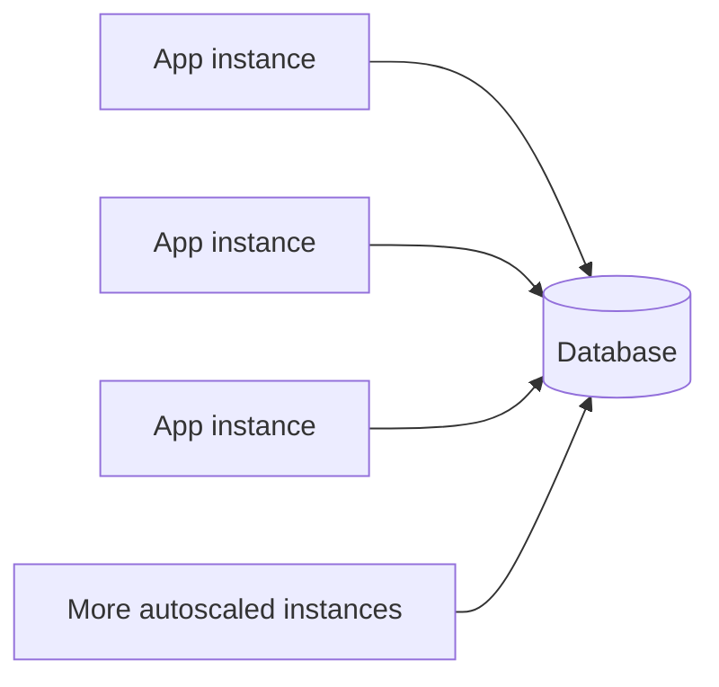

## 6.2 Connection pooling

A pool reuses a controlled number of database connections.

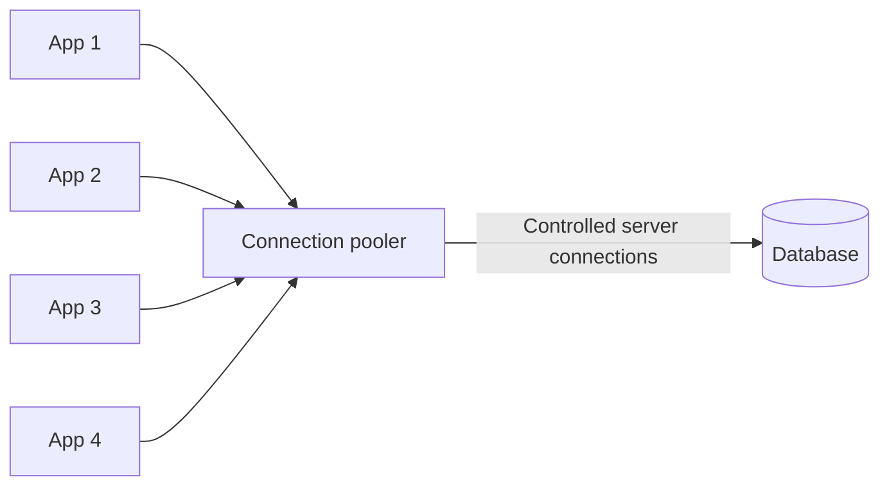

Pooling normally exists at three layers: the application-side pool, an external pooler or managed proxy, and the database server itself.

For PostgreSQL, PgBouncer supports session, transaction, and statement pooling. Transaction pooling releases the server connection after each transaction, but session-dependent features require special care.

### Pool-sizing principle

Do not set every application pool to the database's full connection limit.

A practical budget is:

```text
Database safe connection budget
− administration reserve
− migration and worker reserve
− reporting reserve
= application connection budget
```

Then divide the application budget across expected application instances.

A queue of short waits at the application pool is often safer than unlimited connections overwhelming the database.

---

# 7. Step 4: Add Caching

Caching reduces repeated database reads by serving frequently requested data from a faster store such as Redis.

Good candidates include product details, configuration, user profile summaries, permissions that change infrequently, computed dashboards, search suggestions, and public catalog pages.

Poor candidates include data that must always reflect the latest committed value unless a carefully designed consistency strategy exists.

## 7.1 Cache-aside flow

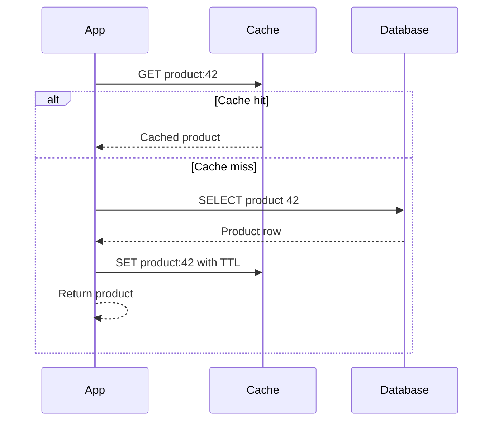

Pseudo-code:

```python
def get_product(product_id: int) -> dict:
    key = f"product:{product_id}"

    cached = redis.get(key)
    if cached is not None:
        return deserialize(cached)

    product = repository.get_product(product_id)
    redis.set(key, serialize(product), ex=300)
    return product
```

## 7.2 Cache invalidation

The common write flow is to update the database, commit successfully, and only then delete or update the cache entry.

```python
def update_product(product_id: int, payload: dict) -> dict:
    product = repository.update_product(product_id, payload)
    transaction.commit()

    redis.delete(f"product:{product_id}")
    return product
```

The TTL provides an additional upper bound on staleness but should not be the only invalidation mechanism for important mutable data.

## 7.3 Stampede protection

A cache stampede happens when a popular key expires and many requests query the database simultaneously.

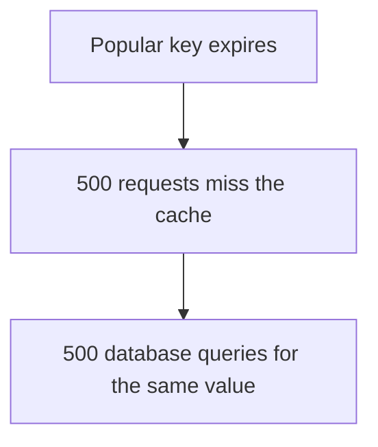

Protection options include a per-key distributed lock, request coalescing, stale-while-revalidate, TTL jitter, and refreshing hot keys before they expire.

Example TTL jitter: `ttl_seconds = 300 + random.randint(0, 60)`

This prevents many related cache entries from expiring at exactly the same moment.

---

# 8. Step 5: Scale Reads with Replicas

A read replica contains a copy of the primary database and serves read-only traffic.

## 8.1 Primary-replica architecture

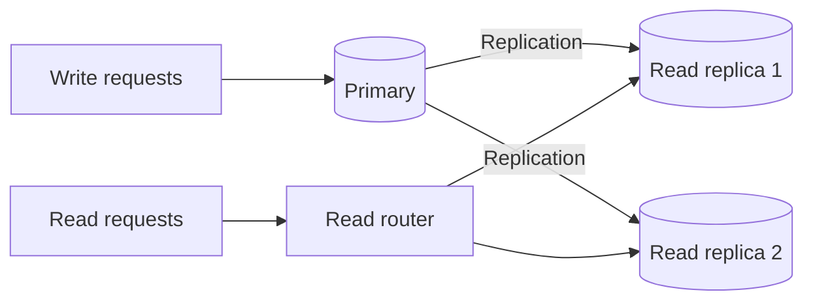

Typical routing:

```text
INSERT / UPDATE / DELETE → primary
Strongly consistent read → primary
Eventually consistent read → replica
Reports and exports → dedicated replica
```

Read replicas are effective when the workload is read-heavy. With a `90% read / 10% write` mix, the read workload can be spread across multiple replicas while the primary continues to handle every write.

## 8.2 Replication lag and consistency

Many replication systems copy changes asynchronously.

```text
T0: Order is created on the primary
T1: User is redirected to order details
T2: Replica has not received the order yet
T3: Read from replica returns "not found"
```

This is a read-after-write consistency problem.

### Practical solutions

#### Read from primary after a write

For a short period after a mutation, route that user's related reads to the primary: the write and the immediate read-back both go to the primary, while later catalog and history reads return to the replicas.

#### Session stickiness

Store a short-lived marker:

```text
user 501 wrote at 10:30:00
route reads to primary until 10:30:05
```

#### Replication-position tracking

Record the commit position and use a replica only after it has replayed that position. This is more accurate but more complex.

#### Accept eventual consistency

For feeds, analytics, recommendations, and non-critical counters, a small delay may be acceptable.

## 8.3 Read-routing strategies

### Application routing

The application explicitly selects a primary or replica connection.

```python
def get_order(order_id: str, require_fresh: bool = False):
    db = primary_db if require_fresh else replica_db
    return db.fetch_order(order_id)
```

### Proxy routing

A database-aware proxy routes queries based on endpoint or read/write role.

### Service routing

Each service uses a policy:

```text
Payment and ledger service → primary for financial state
Catalog service → replicas and cache
Reporting service → dedicated analytical replica
```

---

# 9. High Availability Is Different from Read Scaling

Replication can support both availability and read scaling, but they are different goals.

| Goal | Meaning |
|---|---|
| High availability | A standby can take over when the writer fails |
| Read scaling | Additional nodes actively serve read traffic |
| Disaster recovery | Data can be restored after a major incident |
| Backup | Historical recovery point for accidental loss or corruption |

A synchronous standby maintained for failover may not serve application reads. A read replica may be asynchronous and may not provide automatic writer failover.

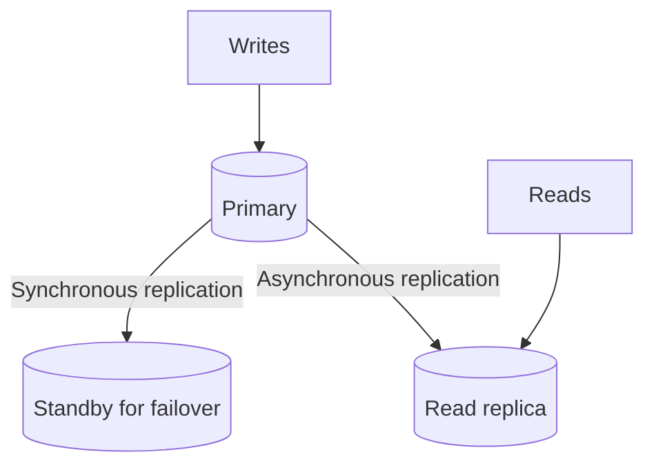

Do not treat replicas as backups. A destructive command can also be replicated. Independent backups and tested restore procedures are still required.

---

# 10. Step 6: Partition Large Tables

Partitioning splits one logical table into smaller physical partitions, normally inside the same database system.

Example: an `events` table partitioned by month.

```text
events
├── events_2026_06
├── events_2026_07
├── events_2026_08
└── events_default
```

PostgreSQL example:

```sql
CREATE TABLE events (
    id BIGINT GENERATED ALWAYS AS IDENTITY,
    tenant_id UUID NOT NULL,
    event_type TEXT NOT NULL,
    created_at TIMESTAMPTZ NOT NULL,
    payload JSONB NOT NULL
) PARTITION BY RANGE (created_at);

CREATE TABLE events_2026_08
PARTITION OF events
FOR VALUES FROM ('2026-08-01') TO ('2026-09-01');
```

## 10.1 Common partitioning strategies

### Range partitioning

Each range of the key lands in its own partition — January data in one, February in the next — which suits time-series and historical data such as audit logs, transactions, events, sensor readings, and billing records.

### List partitioning

Useful for a small known set of categories, such as one partition per country (`IN`, `US`, `UK`).

### Hash partitioning

Uses a hash of a key to distribute rows, for example `hash(customer_id) % 4`. This gives more even distribution but is less convenient for time-based archival.

## 10.2 Partition pruning

A query should include the partition key so the database can skip unrelated partitions.

Good:

```sql
SELECT *
FROM events
WHERE created_at >= '2026-08-01'
  AND created_at < '2026-09-01';
```

Conceptually, that query scans `1` of `36` partitions instead of all of them.

Without a useful partition-key condition, the database may need to examine many partitions.

## 10.3 Partitioning is not sharding

| Partitioning | Sharding |
|---|---|
| Usually one logical database cluster | Multiple independent database nodes |
| Database often handles routing | Application or middleware handles routing |
| Often improves manageability and pruning | Increases total distributed capacity |
| Transactions remain relatively simple | Cross-shard transactions are difficult |
| One node may still hold all partitions | Data is distributed across nodes |

Partitioning helps manage very large tables. It does not automatically remove the writer capacity limit of one database node.

---

# 11. Step 7: Shard the Database

Sharding distributes rows across multiple database nodes.

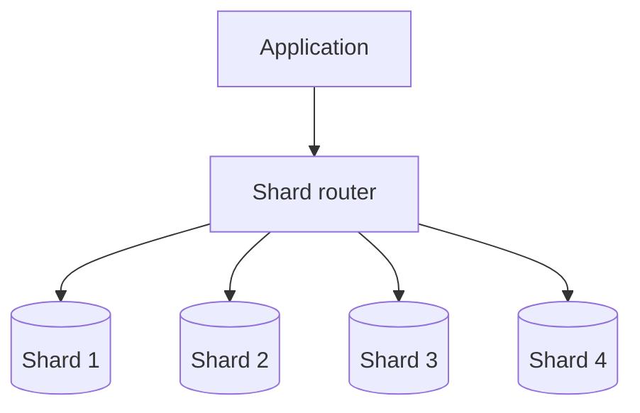

Routing by customer sends `customer 1001` to shard 1, `customer 1002` to shard 3, and `customer 1003` to shard 2. Each shard owns only part of the complete dataset.

## 11.1 How sharding works

A routing function determines the shard:

```python
def shard_for_customer(customer_id: int, shard_count: int) -> int:
    return hash(customer_id) % shard_count
```

Request flow:

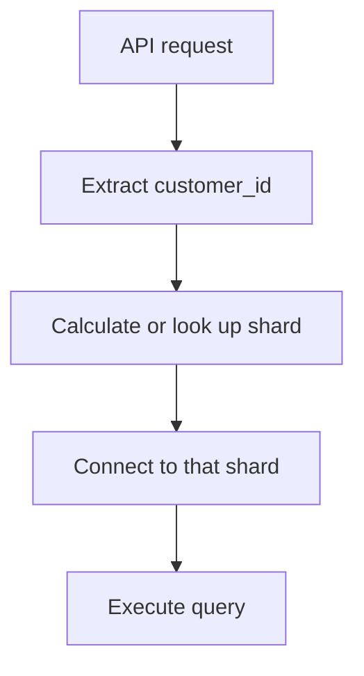

## 11.2 Choosing a shard key

The shard key is one of the most important database-scaling decisions.

A strong shard key has high cardinality, distributes load evenly, is present in common requests, keeps related records together, avoids a small number of hot values, supports future resharding, and minimizes cross-shard queries.

### Candidate comparison

| Shard key | Strength | Risk |
|---|---|---|
| `customer_id` | Keeps one customer's data together | One huge customer can become hot |
| `tenant_id` | Natural for multi-tenant SaaS | Large tenants create imbalance |
| `order_id` hash | Usually distributes evenly | Customer history becomes cross-shard |
| `region` | Useful for data locality | Some regions may be much larger |
| `created_at` range | Good for archival | Newest shard receives most writes |
| Random UUID hash | Good distribution | Related data may be scattered |

### Good multi-tenant approach

For a SaaS product, route normal tenants by `hash(tenant_id)` across shared shards and give a very large tenant its own dedicated shard. This hybrid model prevents one enterprise tenant from dominating a shared shard.

## 11.3 Shard-routing approaches

### Algorithmic routing

The shard is computed directly: `shard = hash(key) % number_of_shards`. It is fast, needs no directory lookup, and is easy to reason about, but changing the shard count can remap a large percentage of keys.

### Consistent hashing

Keys and shards are placed on a logical ring.

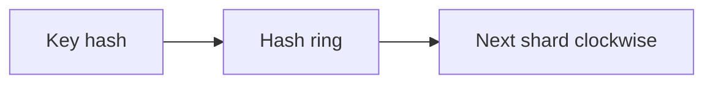

When a node is added, fewer keys need to move compared with simple modulo hashing.

### Directory-based routing

A lookup table stores the exact shard for each tenant or entity (`tenant_101 → shard_2`, `tenant_102 → shard_7`, `tenant_103 → dedicated_shard_12`). This allows flexible tenant movement, dedicated shards, and easy exception handling.

The trade-off is that the routing directory becomes critical infrastructure and must be highly available and cached safely.

## 11.4 Cross-shard operations

Sharding makes operations involving multiple shards harder.

### Cross-shard join

Before sharding:

```sql
SELECT *
FROM customers c
JOIN orders o ON o.customer_id = c.id;
```

After sharding, the rows may exist on different nodes. The application or a distributed query layer may need to:

1. Query multiple shards  
2. Merge results  
3. Sort or aggregate centrally  

### Global aggregate

```sql
SELECT SUM(total_amount)
FROM orders;
```

A sharded implementation may be:

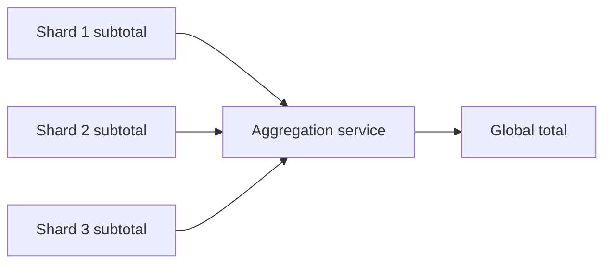

For frequently needed totals, stream changes into a materialized aggregate rather than scanning every shard for each request.

### Global uniqueness

A local auto-increment value is not globally unique across shards. Common alternatives are a UUID, a ULID, a Snowflake-style ID, an ID that embeds shard bits, or a central ID-generation service.

### Distributed transaction

A transaction across several shards may require two-phase commit, a saga workflow, the outbox pattern, idempotent operations, and compensating actions.

For most scalable service designs, keeping one business transaction within one shard is preferable.

## 11.5 Resharding

Resharding changes the distribution or number of shards — for example splitting 4 overloaded shards into 8 smaller ones.

A safe online migration commonly follows:

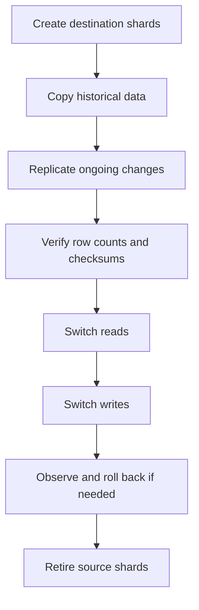

Resharding must account for data copied while live writes continue. Mature sharding systems support change capture, verification, traffic switching, and rollback.

---

# 12. Functional Partitioning and Service-Owned Databases

Not every system needs row-based sharding.

A monolithic database can sometimes be split by business capability.

```text
One shared database
├── users
├── orders
├── payments
├── inventory
└── notifications
```

Can evolve into:

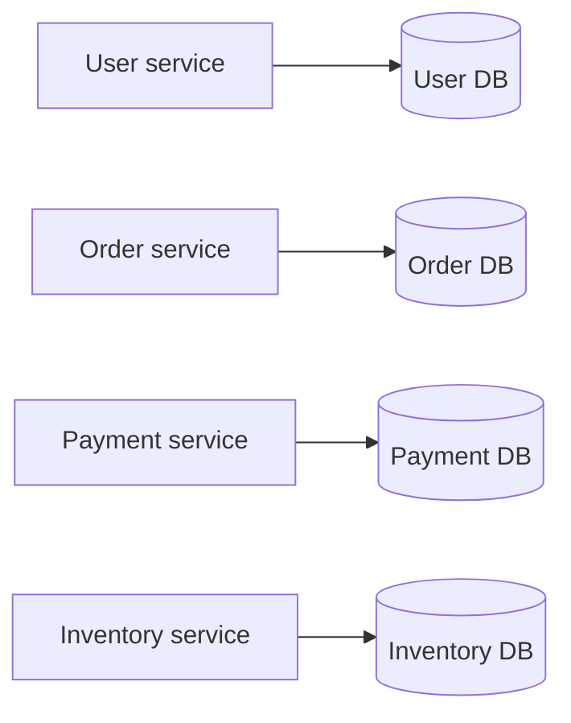

This is sometimes called vertical partitioning or functional partitioning.

## Benefits

Workloads scale independently, service teams own their data model, failures can be isolated, and a different database technology can be used where it is genuinely justified.

## Trade-offs

Cross-service joins disappear and workflows become distributed. Data duplication may be necessary, event delivery must be reliable, reporting needs a separate data pipeline, and consistency turns into an explicit business decision rather than a database guarantee.

Service boundaries should follow business ownership, not arbitrary table groups.

---

# 13. Scaling Writes

Reads are easier to distribute because multiple nodes can serve copies of the same data. Writes normally require coordination and conflict handling.

## 13.1 Reduce unnecessary writes

Do not update `updated_at` when no meaningful field changed, avoid writing counters on every page view, buffer telemetry before persistence, use append-only events when appropriate, avoid repeatedly updating one shared hot row, and store derived values only when their read benefit justifies the write complexity.

### Hot counter problem

Inefficient:

```sql
UPDATE videos
SET view_count = view_count + 1
WHERE id = 42;
```

At very high traffic, one row becomes a contention point. The alternative is to route view events through a message stream into a batch aggregator that updates the database periodically.

## 13.2 Queue and batch writes

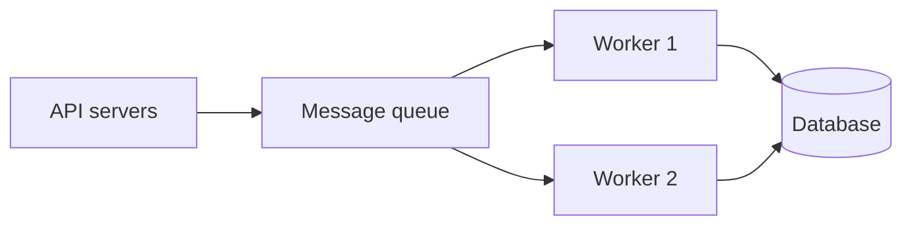

A queue absorbs traffic spikes, controls database write concurrency, enables batching, and isolates slow downstream work. In exchange it requires idempotent consumers, a retry policy, dead-letter handling, durable messages, monitoring of queue lag, and defined ordering guarantees.

A queue increases resilience, but it also introduces asynchronous visibility. The API must communicate whether the operation is completed or merely accepted.

## 13.3 Separate transactional and analytical workloads

Transactional databases are optimized for small, frequent reads and writes.

Analytical workloads may scan millions of rows, group large datasets, and perform complex joins.

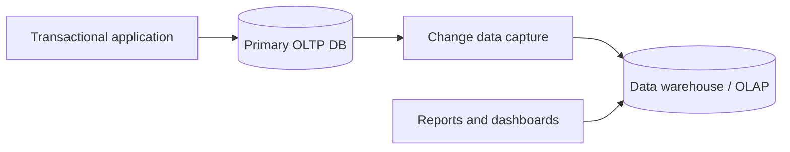

Keep large reporting queries away from the primary transactional path by using a read replica, a data warehouse, a columnar analytical database, a search index, or a materialized reporting store.

---

# 14. Denormalization, CQRS, and Materialized Views

Normalization reduces duplication and improves transactional consistency. At scale, some read paths benefit from precomputed or duplicated data.

## Denormalized read model

Instead of joining several tables for every order-card request:

```json
{
  "order_id": "ord_101",
  "customer_name": "Aarav",
  "item_count": 3,
  "total_amount": 2499,
  "payment_status": "paid"
}
```

Store or materialize a read-optimized representation.

## CQRS

Command Query Responsibility Segregation separates a command model, which owns writes and business rules, from a query model built for fast reads.

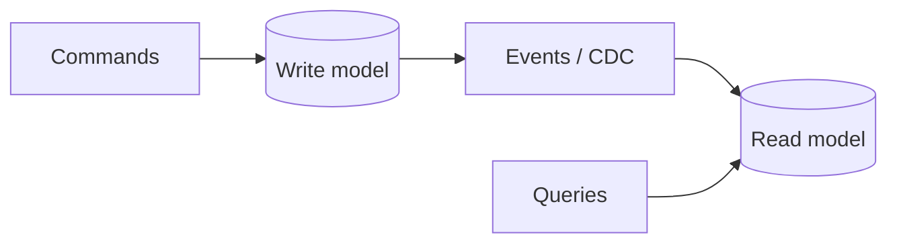

The read model may be temporarily behind the write model, so the acceptable consistency delay must be explicit.

## Materialized view

A materialized view stores a query result for faster access.

```sql
CREATE MATERIALIZED VIEW daily_order_summary AS
SELECT
    DATE(created_at) AS order_date,
    COUNT(*) AS order_count,
    SUM(total_amount) AS gross_amount
FROM orders
GROUP BY DATE(created_at);
```

It must be refreshed or incrementally maintained.

Use these techniques for specific expensive read paths, not as a default replacement for a well-designed transactional schema.

---

# 15. Multi-Region Database Scaling

Multi-region architecture is normally driven by lower latency for global users, regional disaster recovery, data residency, regional isolation, or global availability.

## Single-writer, multi-region reads

```mermaid
flowchart LR
    U1[Users: Asia] --> RA[(Asia read replica)]
    U2[Users: Europe] --> RE[(Europe read replica)]
    W[Global writes] --> P[(Primary writer)]
    P --> RA
    P --> RE
```

This keeps write consistency simple, avoids conflict handling entirely, and still gives every region local reads. The costs are distant write latency for users far from the writer, replication lag on the regional replicas, and cross-region failover coordination.

## Multi-writer topology

```mermaid
flowchart LR
    A[(Region A writer)] <--> B[(Region B writer)]
    UA[Region A users] --> A
    UB[Region B users] --> B
```

This buys local write latency and better regional independence, at the cost of write conflicts, global uniqueness, clock ordering, split-brain protection, cross-region transactions, and much more complex failure recovery.

Multi-writer architecture should be introduced only when the business requirement justifies conflict-resolution complexity.

## Region ownership

A practical alternative is assigning each tenant or user a home region — tenant A to Mumbai, tenant B to Frankfurt, tenant C to Virginia.

Most writes remain local to the owner's region, while replicated global metadata supports routing.

---

# 16. SQL vs NoSQL for Scaling

NoSQL is not automatically more scalable, and SQL is not limited to one machine.

Choose based on access patterns and consistency needs.

| Requirement | Relational database | Key-value/document database |
|---|---|---|
| Multi-row transactions | Strong fit | Varies by product |
| Complex joins | Strong fit | Usually application-managed |
| Flexible access patterns | Strong with indexes and SQL | Often requires planned indexes |
| Simple key lookups at huge scale | Possible | Often a strong fit |
| Strict relational constraints | Strong fit | Usually weaker |
| Horizontal partitioning | Available but adds complexity | Often built into the product |
| Rapid schema variation | Possible with JSON support | Natural fit for documents |
| Ad hoc analytics | Better SQL experience | Often moved to an analytical system |

### Access-pattern-first design

For a distributed key-value system, the partition key determines both location and load distribution. A key such as `status = "active"` is a bad choice because millions of records and requests target the same key range. A high-cardinality key such as `customer_id`, or a deliberately distributed composite key built from the known queries, spreads the load instead.

The correct database is the one that provides the required correctness, access pattern, and operational model at acceptable cost.

---

# 17. Consistency Decisions During Scaling

Scaling creates more copies, queues, caches, and services. Each one introduces a place where data may be temporarily different.

Think in terms of business invariants.

| Needs strong consistency | Tolerates eventual consistency |
|---|---|
| Deducting an account balance | Product recommendation |
| Reserving limited inventory | Search index |
| Preventing duplicate payment capture | Analytics dashboard |
| Enforcing uniqueness | Like count |
| Updating a ledger | Activity feed |
| Authorizing access | Email notification status |

## Example: placing an order

```mermaid
sequenceDiagram
    participant API
    participant DB as Order DB
    participant Outbox
    participant Broker
    participant Inventory

    API->>DB: Create order
    API->>Outbox: Store OrderCreated in same transaction
    DB-->>API: Commit
    Outbox->>Broker: Publish event
    Broker->>Inventory: Reserve inventory
```

The order and outbox record are committed together. Event publication can retry without losing the event.

Scaling is not only a throughput problem. It is also a decision about where the system requires immediate consistency and where controlled delay is acceptable.

---

# 18. Practical Architecture Evolution

## Stage 1: One application and one database

```mermaid
flowchart LR
    U[Users] --> A[Application]
    A --> DB[(Primary DB)]
```

Suitable when traffic is moderate, the dataset fits comfortably, simple operations are valuable, and the team is small. Focus on a correct schema, indexes, backups, monitoring, and connection pooling.

## Stage 2: Cache and read replica

```mermaid
flowchart LR
    U[Users] --> A[Application]
    A --> C[(Redis cache)]
    A --> P[(Primary)]
    P --> R[(Read replica)]
```

Suitable when repeated reads dominate, the primary is read-heavy, and some eventual consistency is acceptable.

## Stage 3: Separate workloads

```mermaid
flowchart LR
    A[Application] --> P[(Primary OLTP)]
    P --> R[(Read replicas)]
    P --> CDC[CDC]
    CDC --> W[(Warehouse)]
    BI[Reporting] --> W
```

Suitable when reports affect API performance, historical data is large, and different teams need independent workloads.

## Stage 4: Service-owned data

```mermaid
flowchart LR
    GW[API gateway] --> O[Order service]
    GW --> P[Payment service]
    GW --> C[Catalog service]
    O --> ODB[(Order DB)]
    P --> PDB[(Payment DB)]
    C --> CDB[(Catalog DB)]
```

Suitable when business domains scale differently, team ownership is clear, and distributed workflows are understood.

## Stage 5: Sharded high-scale architecture

```mermaid
flowchart TD
    U[Users] --> API[API layer]
    API --> Cache[(Distributed cache)]
    API --> Router[Shard router]
    Router --> S1[(Shard 1 primary)]
    Router --> S2[(Shard 2 primary)]
    Router --> S3[(Shard 3 primary)]
    S1 --> R1[(Shard 1 replica)]
    S2 --> R2[(Shard 2 replica)]
    S3 --> R3[(Shard 3 replica)]
    S1 --> CDC[CDC pipeline]
    S2 --> CDC
    S3 --> CDC
    CDC --> A[(Analytics store)]
```

Suitable when one writer cannot handle the write workload, the dataset exceeds one node's practical capacity, tenant or entity boundaries provide a good shard key, and the organization can operate distributed data safely.

---

# 19. Example: Scaling an E-Commerce Database

Assume an e-commerce platform initially has:

```text
1 application
1 PostgreSQL database
5 million products
50 million orders
80% read traffic
20% write traffic
```

## Phase 1: Optimize

Add indexes for the product, customer, status, and time-based queries; remove N+1 ORM queries; add cursor pagination; archive old audit events; shorten order transactions; and run `EXPLAIN ANALYZE` on every slow query.

Result:

```text
P95 order-list query: 900 ms → 110 ms
Database CPU: 85% → 55%
```

The numbers above are illustrative; actual results depend on workload and schema.

## Phase 2: Add caching

Cache product details, category navigation, shipping configuration, and public promotion rules. Do not rely on a stale cache for final inventory reservation, payment state, or order ownership.

```mermaid
flowchart TD
    READ[Product read] --> HIT{Redis hit?}
    HIT -->|Yes| RETURN[Return cached value]
    HIT -->|No| PG[Query PostgreSQL and populate cache]
```

## Phase 3: Add read replicas

Route:

```text
Product browsing → replicas
Customer order history → replica when freshness is not required
Order confirmation immediately after checkout → primary
Admin export → dedicated replica
```

## Phase 4: Partition orders

Partition by month (`orders_2026_06`, `orders_2026_07`, `orders_2026_08`) for faster date-bounded maintenance, easier archival, smaller indexes per partition, and better pruning on date-filtered queries.

## Phase 5: Separate analytics

Use CDC to move order events into an analytical store, so checkout queries stay on the transactional database while the revenue dashboard reads the analytical one.

## Phase 6: Shard when the writer becomes the limit

Shard orders by `customer_id` or `tenant_id`, depending on the business model.

Keep the customer, their orders, their addresses, and their payment references on the same shard.

Move global reports to the analytical store to avoid cross-shard scans.

---

# 20. Decision Guide

| Situation | Most likely next technique |
|---|---|
| One or two queries are slow | Execution-plan and index tuning |
| Database CPU is high from repeated identical reads | Caching |
| Application autoscaling exhausts DB connections | Pooling or managed proxy |
| Reads dominate writes | Read replicas |
| Immediate post-write reads are inconsistent | Primary routing or consistency token |
| Table is huge and queries are time-bounded | Table partitioning |
| Historical rows rarely used | Archive or cold storage |
| Reports slow down APIs | Separate OLAP workload |
| One shared row receives massive updates | Buffer, partition, or aggregate asynchronously |
| One writer has reached its practical limit | Sharding |
| One tenant dominates a shard | Dedicated tenant shard or rebalance |
| Global users need local reads | Cross-region replicas |
| Global users require local writes | Region ownership or carefully chosen multi-writer database |
| Services have independent ownership and load | Functional partitioning |
| Simple key access at massive scale | Distributed key-value or document database |

---

# 21. Operational Best Practices

## Make scaling measurable

Define service-level indicators such as:

```text
Order write P99 latency < 300 ms
Product read P95 latency < 100 ms
Replica lag < 2 seconds for catalog reads
Database CPU target < 70% sustained
Connection utilization < 80%
```

## Preserve headroom

Do not operate continuously at the database's maximum capacity. Leave room for traffic spikes, failover, batch jobs, vacuum and compaction, index creation, deployments, rebalancing, and replica catch-up.

## Test using realistic data volume

A query that is fast with 10,000 rows may behave differently with 500 million rows. Load tests should reproduce real row counts and data distribution, hot keys, concurrent writes, replica lag, cache misses, failover, and queue backlog.

## Plan migrations as online workflows

For large schema changes:

```mermaid
flowchart TD
    ADD[Add new nullable field] --> DEPLOY[Deploy code supporting old and new schema]
    DEPLOY --> BACKFILL[Backfill in controlled batches]
    BACKFILL --> VALIDATE[Validate]
    VALIDATE --> ENFORCE[Enforce constraint]
    ENFORCE --> REMOVE[Remove old path later]
```

Avoid a single massive transaction that locks a critical table.

## Protect against retry duplication

Timeouts do not tell the client whether a database write committed, so protect the path with idempotency keys, unique constraints, a transactional outbox, idempotent consumers, and a safe retry policy.

## Test recovery, not only backup creation

Periodically verify restore time, the recovery-point and recovery-time objectives, point-in-time recovery, failover behavior, application reconnection, and data integrity after recovery.

## Observe the complete request path

```mermaid
flowchart TD
    API[API latency] --> POOL[Connection-pool wait]
    POOL --> EXEC[Database execution]
    EXEC --> LOCK[Lock wait]
    LOCK --> LAG[Replica lag]
    LAG --> CACHE[Cache latency]
    CACHE --> QLAG[Queue lag]
```

Database execution time may be low while requests wait for connections or locks.

---

# 22. Official References

The following primary documentation was used to verify the current technical concepts:

- [PostgreSQL — Using EXPLAIN](https://www.postgresql.org/docs/current/using-explain.html)
- [PostgreSQL — Indexes](https://www.postgresql.org/docs/current/indexes.html)
- [PostgreSQL — Table Partitioning](https://www.postgresql.org/docs/current/ddl-partitioning.html)
- [PostgreSQL — High Availability, Load Balancing, and Replication](https://www.postgresql.org/docs/current/high-availability.html)
- [PgBouncer — Pooling Features](https://www.pgbouncer.org/features.html)
- [Amazon RDS — Working with Read Replicas](https://docs.aws.amazon.com/AmazonRDS/latest/UserGuide/USER_ReadRepl.html)
- [Amazon RDS — RDS Proxy Concepts](https://docs.aws.amazon.com/AmazonRDS/latest/UserGuide/rds-proxy.howitworks.html)
- [Redis — Cache-Aside Pattern](https://redis.io/docs/latest/develop/use-cases/cache-aside/)
- [Amazon DynamoDB — Partition-Key Design](https://docs.aws.amazon.com/amazondynamodb/latest/developerguide/bp-partition-key-design.html)
- [Vitess — Sharding Overview](https://vitess.io/docs/faq/sharding/overview/)
- [Vitess — What Is Vitess](https://vitess.io/docs/25.0/overview/whatisvitess/)

---

> **Last reviewed:** August 3, 2026
