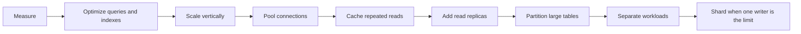
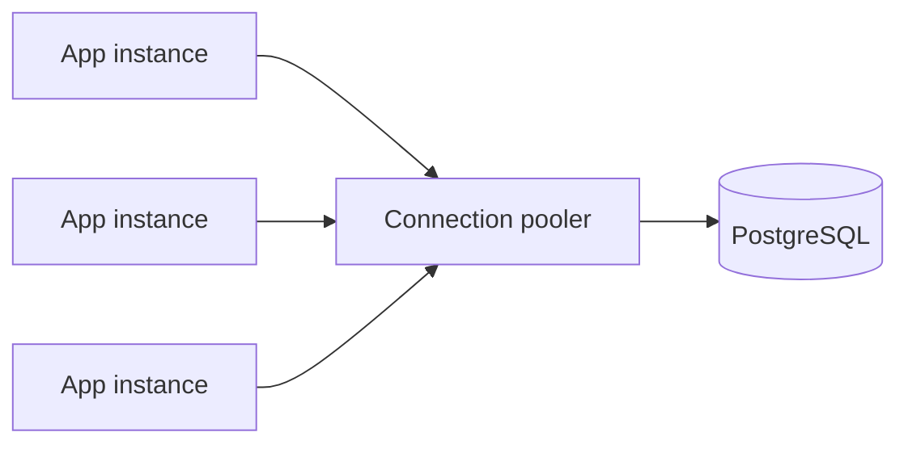
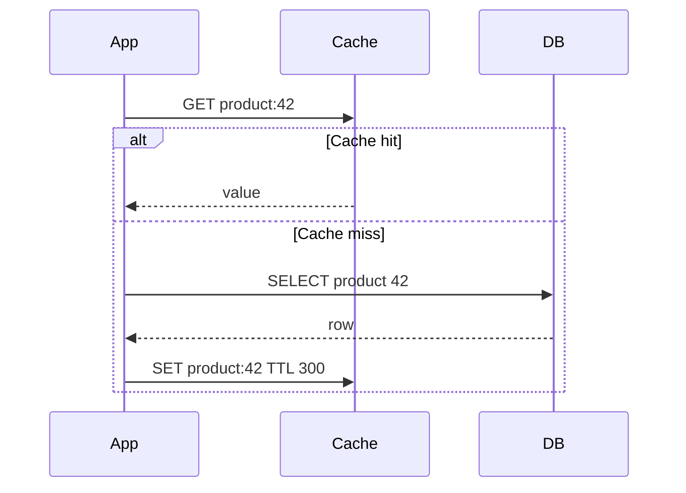
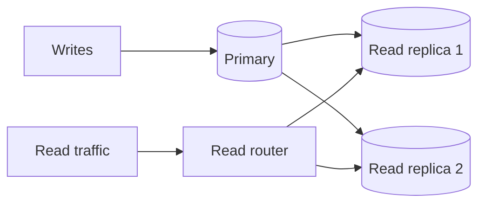
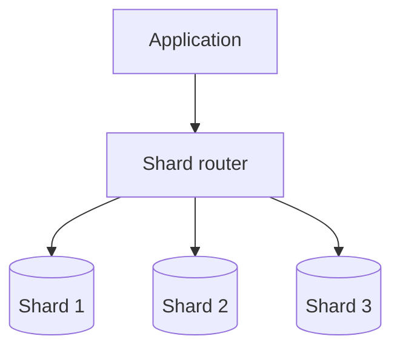
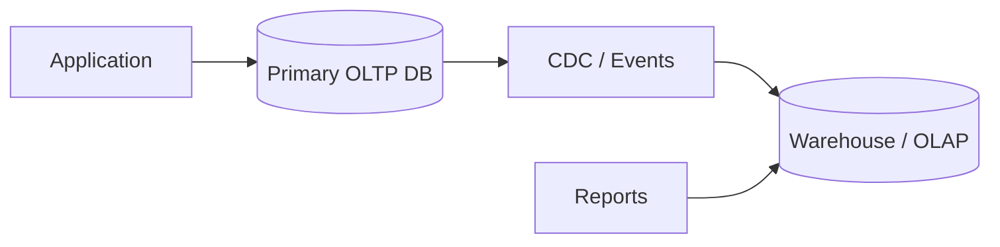
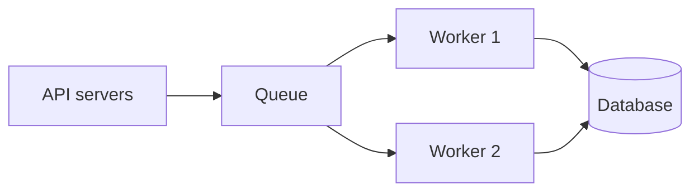
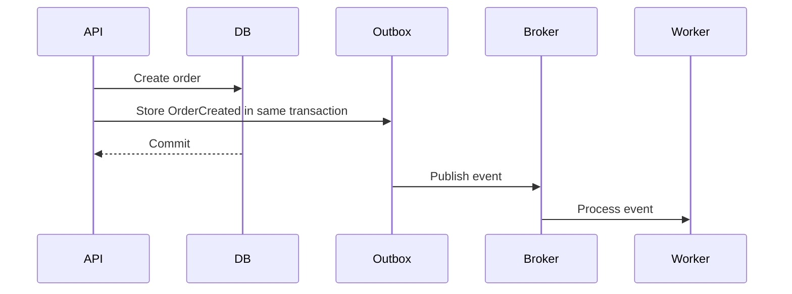

# Scaling the Database

> Understand how databases are scaled in real systems, which technique solves which bottleneck, and when to move to the next step.

## In short

Database scaling is not simply “add more servers.” Start by finding the actual bottleneck, then use the simplest technique that solves it.

A practical scaling order is:



The most important ideas to remember are:

- **Optimize before distributing.** Missing indexes, N+1 queries, long transactions, and oversized connection pools are common causes of database pressure.
- **Vertical scaling** increases the power of one database node and is usually the simplest early step.
- **Connection pooling** prevents application autoscaling from creating more database connections than the server can safely handle.
- **Caching** reduces repeated reads but introduces invalidation and stale-data concerns.
- **Read replicas** increase read capacity. They do not increase the write capacity of the primary.
- **Replication is asynchronous by default in PostgreSQL**, although synchronous replication can be configured when stronger durability is required.
- **Partitioning** divides one large logical table into smaller physical pieces inside the database.
- **Sharding** distributes data across independent database nodes and is mainly used when one database writer or one node can no longer handle the workload.
- The **shard key** is critical because it controls data distribution, hot spots, routing, and whether requests need multiple shards.
- Scaling introduces more copies of data, so **consistency requirements must be decided per business operation**.

---

# 1. What Database Scaling Means

Database scaling means increasing the system's ability to handle growth while keeping acceptable:

- Query latency
- Read and write throughput
- Availability
- Data correctness
- Storage capacity
- Operational cost

Growth can come from more users, more API requests, larger tables, heavier queries, more background jobs, or stricter availability requirements.

## 1.1 Three common scaling pressures

### Compute pressure

The database needs more CPU or memory to execute queries.

```text
More requests
    ↓
More query execution
    ↓
Higher CPU / memory usage
```

### Storage pressure

Tables, indexes, WAL/binlogs, backups, audit data, and historical records keep growing.

### Throughput pressure

The system must process more reads or writes per second.

Reads and writes usually need different solutions:

```text
Read pressure  → indexes → cache → read replicas
Write pressure → optimize → batch → reduce contention → shard
```

---

# 2. Measure Before Scaling

Do not select a scaling technique before understanding the bottleneck.

## 2.1 Metrics that matter

| Area | Useful signals |
|---|---|
| Latency | Average, P95, P99 query latency |
| Throughput | Queries/transactions per second |
| CPU | Sustained utilization, expensive queries |
| Memory | Cache hit ratio, sort/hash spills |
| Storage | IOPS, disk latency, free space |
| Connections | Active, idle, waiting, rejected |
| Locks | Lock waits, deadlocks, blocked transactions |
| Replication | Replica lag, WAL/binlog generation |
| Queries | Slow queries, rows scanned vs returned |
| Tables | Growth, bloat, dead tuples |

Averages are not enough. A database may have an acceptable average while important requests have very poor P95 or P99 latency.

## 2.2 Symptom → likely direction

| Symptom | Investigate first |
|---|---|
| High CPU | Expensive queries, missing indexes |
| High disk I/O | Large scans, low cache efficiency |
| Too many DB connections | Pool sizing, connection proxy |
| Read-heavy primary | Cache, read replicas |
| Write-heavy primary | Hot rows, batching, sharding |
| Very large table | Indexing, archival, partitioning |
| Long lock waits | Long transactions, conflicting updates |
| Stale replica reads | Replica lag, routing policy |
| Reports slowing APIs | Separate analytical workload |

**Interview takeaway:** scaling starts with evidence, not architecture.

---

# 3. Optimize the Existing Database First

The cheapest scaling improvement is often making each request do less database work.

## 3.1 Use the right indexes

Suppose the application frequently loads recent orders for one customer:

```sql
SELECT id, status, total_amount
FROM orders
WHERE customer_id = 501
  AND created_at >= '2026-08-01'
ORDER BY created_at DESC;
```

A useful PostgreSQL index is:

```sql
CREATE INDEX idx_orders_customer_created
ON orders (customer_id, created_at DESC);
```

The order of columns matters because the index should match the real filtering and ordering pattern.

A covering index may reduce table access when the query needs only a few extra columns:

```sql
CREATE INDEX idx_orders_customer_created_cover
ON orders (customer_id, created_at DESC)
INCLUDE (status, total_amount);
```

Indexes speed up reads but add cost to:

- `INSERT`
- `UPDATE`
- `DELETE`
- Storage
- Vacuum/maintenance
- Memory/cache usage

Create indexes for real access patterns, not for every column.

## 3.2 Inspect execution plans

Use the execution plan instead of guessing:

```sql
EXPLAIN (ANALYZE, BUFFERS)
SELECT id, status, total_amount
FROM orders
WHERE customer_id = 501;
```

Look for:

- Sequential scans on large tables
- Too many rows scanned
- Bad row-count estimates
- Disk-based sorts/hashes
- Expensive nested loops
- High buffer reads
- Repeated execution of the same subquery

`EXPLAIN ANALYZE` actually runs the statement, so use care with expensive or write queries in production.

## 3.3 Avoid N+1 queries

Bad ORM pattern:

```text
1 query  → load 100 orders
100 more → load customer for each order
----------------------------------------
101 queries
```

Better:

```sql
SELECT
    o.id,
    o.total_amount,
    c.id AS customer_id,
    c.name AS customer_name
FROM orders o
JOIN customers c ON c.id = o.customer_id
WHERE o.created_at >= CURRENT_DATE - INTERVAL '7 days';
```

In Django, common tools are `select_related()` and `prefetch_related()`.

## 3.4 Keep transactions short

Long transactions increase lock duration and can delay other requests.

Prefer:

```text
Validate input
    ↓
Start transaction
    ↓
Perform required DB changes
    ↓
Commit
    ↓
Send email / call external API afterward
```

Do not keep a database transaction open while waiting on slow external systems unless the design specifically requires it.

---

# 4. Vertical Scaling and Connection Pooling

## 4.1 Scale vertically

Vertical scaling means giving one database node more resources.

```text
Before: 4 CPU, 16 GB RAM
After:  16 CPU, 64 GB RAM + faster storage
```

### Advantages

- Simple architecture
- Minimal application changes
- Joins and transactions remain straightforward
- Strong consistency stays simple

### Limits

- Hardware has an upper bound
- Larger instances become expensive
- One writer still has finite capacity
- It does not by itself provide high availability

Vertical scaling is a good early step when the workload genuinely needs more CPU, memory, or I/O.

## 4.2 Control database connections

Application autoscaling can create a hidden database bottleneck.

```text
30 app instances
× 50 DB connections each
= 1,500 possible connections
```

A connection pooler keeps the number of server-side database connections controlled.



For PostgreSQL, PgBouncer commonly supports:

- **Session pooling** — one server connection for the client session.
- **Transaction pooling** — server connection is returned after each transaction.
- **Statement pooling** — connection is returned after each statement; multi-statement transactions are not supported.

Transaction pooling is efficient, but session-dependent features need care because different transactions may use different server connections.

A useful sizing principle is:

```text
Safe DB connection budget
- admin reserve
- worker/migration reserve
- reporting reserve
= application connection budget
```

Then divide that budget across expected application instances.

---

# 5. Scale Reads with Cache and Read Replicas

## 5.1 Cache repeated reads

A cache such as Redis reduces repeated database reads.

Good candidates:

- Product/catalog details
- Configuration
- Public pages
- Search suggestions
- Expensive computed summaries
- Slowly changing reference data

Avoid treating stale cache data as authoritative for operations such as payment state, final inventory reservation, or security-sensitive authorization unless the consistency model is carefully designed.

### Cache-aside pattern



On update, a common approach is:

```text
Update DB
   ↓
Commit successfully
   ↓
Invalidate or refresh cache
```

For high-traffic keys, use techniques such as TTL jitter, request coalescing, stale-while-revalidate, or a per-key lock to reduce cache stampedes.

## 5.2 Add read replicas

Read replicas copy data from a primary database and serve read traffic.



Typical routing:

```text
INSERT / UPDATE / DELETE       → Primary
Financial/strongly fresh read  → Primary
Catalog/history read           → Replica
Reporting/export               → Dedicated replica/analytics DB
```

### Important: replicas scale reads, not writes

Every write still goes through the primary writer and must be replicated. Adding replicas does not solve a write-bound primary.

### Replication lag

PostgreSQL streaming replication is **asynchronous by default**, so a replica can temporarily be behind the primary.

Example:

```text
T0: User creates order on primary
T1: UI opens order details
T2: Replica has not replayed the change yet
T3: Replica says "order not found"
```

This is a **read-after-write consistency** problem.

Common solutions:

- Read from primary immediately after a write
- Keep the user/session on primary for a short period
- Track replication position before routing to a replica
- Accept eventual consistency for non-critical reads

Also remember:

> A replica is not a backup. Accidental deletes or corrupting changes can replicate too.

Backups and tested restore procedures are separate requirements.

---

# 6. Partitioning Large Tables

Partitioning splits one logical table into smaller physical partitions, usually inside the same database cluster.

Example:

```text
orders
├── orders_2026_06
├── orders_2026_07
└── orders_2026_08
```

PostgreSQL supports declarative:

- Range partitioning
- List partitioning
- Hash partitioning

Example:

```sql
CREATE TABLE orders (
    id BIGINT GENERATED ALWAYS AS IDENTITY,
    customer_id BIGINT NOT NULL,
    total_amount NUMERIC(12,2) NOT NULL,
    created_at TIMESTAMPTZ NOT NULL
) PARTITION BY RANGE (created_at);
```

```sql
CREATE TABLE orders_2026_08
PARTITION OF orders
FOR VALUES FROM ('2026-08-01') TO ('2026-09-01');
```

## 6.1 Partition pruning

If a query filters by the partition key, PostgreSQL can skip unrelated partitions.

```sql
SELECT id, customer_id, total_amount
FROM orders
WHERE created_at >= '2026-08-01'
  AND created_at < '2026-09-01';
```

Instead of scanning years of order data, the database can focus on the relevant partition.

Partitioning is especially useful for:

- Time-series data
- Audit/event tables
- Billing history
- Large transaction tables
- Fast archival or deletion of old ranges

## 6.2 Partitioning vs sharding

| Partitioning | Sharding |
|---|---|
| Usually one logical DB cluster | Multiple independent DB nodes |
| DB handles row routing | App/middleware often routes |
| Helps pruning and maintenance | Increases distributed capacity |
| Transactions stay simpler | Cross-shard transactions are harder |
| One writer may still be the limit | Writes can be distributed |

Partitioning manages a large table. Sharding distributes the database workload.

---

# 7. Sharding for Write and Data Scale

Sharding distributes rows across multiple database nodes.



Example routing:

```text
customer 1001 → shard 1
customer 1002 → shard 3
customer 1003 → shard 2
```

## 7.1 Choose the shard key carefully

A good shard key should:

- Have high cardinality
- Distribute load evenly
- Be available in common requests
- Keep related data together
- Avoid hot values
- Minimize cross-shard operations

Typical choices:

| Shard key | Benefit | Risk |
|---|---|---|
| `customer_id` | Customer data stays together | Huge customer may become hot |
| `tenant_id` | Natural for SaaS | Large tenant can dominate a shard |
| Hash of `order_id` | Even distribution | Customer history spans shards |
| `region` | Good data locality | Region sizes may be uneven |
| Time range | Easy archival | Latest shard becomes hot |

For multi-tenant SaaS, a practical model is:

```text
Normal tenants → hash(tenant_id) across shared shards
Very large tenant → dedicated shard
```

## 7.2 Why sharding is expensive

Operations that were simple on one database become distributed.

### Cross-shard queries

A global total may require:

```text
Shard 1 subtotal ─┐
Shard 2 subtotal ─┼─→ Aggregation service → Global total
Shard 3 subtotal ─┘
```

### Global IDs

Local auto-increment IDs can collide across shards.

Common solutions:

- UUID
- ULID
- Snowflake-style ID
- Shard-aware IDs

### Distributed transactions

A business transaction touching multiple shards may need:

- Saga pattern
- Transactional outbox
- Idempotent consumers
- Compensating actions
- In some systems, distributed commit protocols

The better design is usually to choose a shard key that keeps one business transaction inside one shard.

**Interview takeaway:** sharding buys horizontal write/data capacity by giving up many single-database conveniences.

---

# 8. Separate Transactional and Analytical Workloads

OLTP databases are optimized for frequent small reads and writes.

Analytics may scan millions of rows, group large datasets, or join historical tables.

Do not let large reports compete with checkout, payment, or user-facing API traffic.



Common options:

- Read replica for lighter reporting
- Data warehouse
- Columnar analytical database
- Search engine
- Materialized reporting store

This separation is often more valuable than prematurely sharding the transactional database.

---

# 9. Scaling Writes

Writes are harder to scale than reads because updates require ownership, ordering, or coordination.

## 9.1 Reduce unnecessary writes

Avoid:

- Updating unchanged rows
- Writing one global counter on every request
- Keeping transactions open unnecessarily
- Persisting high-volume telemetry one row at a time

### Hot-row example

This can become a contention point at huge traffic:

```sql
UPDATE videos
SET view_count = view_count + 1
WHERE id = 42;
```

A scalable alternative:

```text
View events
    ↓
Message queue
    ↓
Batch aggregator
    ↓
Periodic database update
```

## 9.2 Queue and batch non-immediate work



A queue can:

- Absorb traffic spikes
- Control write concurrency
- Enable batching
- Move slow work away from request latency

But consumers should be idempotent and have retry, dead-letter, ordering, and monitoring strategies.

---

# 10. Consistency During Scaling

Caching, replicas, queues, sharding, and multiple services create places where data may temporarily differ.

Do not ask only, “Should the system be strongly consistent?”

Ask:

> Which business operations require immediate consistency, and which can tolerate a short delay?

| Strong consistency usually needed | Eventual consistency often acceptable |
|---|---|
| Account balance update | Recommendations |
| Inventory reservation | Search index |
| Duplicate-payment prevention | Analytics dashboard |
| Ledger entry | Activity feed |
| Authorization decision | Notification status |

For distributed workflows, the **transactional outbox** is a common pattern:



The business change and outbox event are committed together, so event publishing can safely retry.

---

# 11. One Practical Example: Scaling an E-Commerce Database

Assume:

```text
PostgreSQL
5 million products
50 million orders
80% reads
20% writes
```

## Phase 1 — Measure and optimize

The order-list endpoint has high P95 latency.

Actions:

- Inspect `EXPLAIN (ANALYZE, BUFFERS)`
- Add an index on `(customer_id, created_at)`
- Remove N+1 ORM queries
- Return only required columns
- Use cursor pagination
- Shorten transactions

No distributed architecture is needed yet.

## Phase 2 — Add cache

Cache:

- Product details
- Category navigation
- Shipping configuration

Keep final inventory reservation and payment state authoritative in PostgreSQL.

## Phase 3 — Add read replicas

Route:

```text
Product browsing                → Replica
Old order history               → Replica
Immediate checkout confirmation → Primary
Admin exports                   → Reporting replica / analytics store
```

## Phase 4 — Partition orders

Partition orders by month because most operational and archival queries are time-bounded.

Benefits:

- Partition pruning
- Easier archival
- Smaller per-partition indexes
- Faster removal of old ranges

## Phase 5 — Separate analytics

Use CDC/events to move order data into an analytical store.

Revenue dashboards no longer scan the primary database.

## Phase 6 — Shard only when the writer is the limit

If one primary can no longer handle the write workload, shard by `customer_id` or `tenant_id`.

Keep related records together where possible:

```text
Customer
├── Orders
├── Addresses
└── Payment references
```

Global reporting should remain in the analytical system instead of querying every shard per request.

---

# 12. Practical Decision Guide

| Situation | Most likely next step |
|---|---|
| One query is slow | Execution-plan and index tuning |
| ORM produces many queries | Fix N+1 / eager loading |
| App instances exhaust connections | Pooling / managed proxy |
| Same reads hit DB repeatedly | Cache |
| Primary is read-heavy | Read replicas |
| Immediate post-write read is stale | Read from primary / consistency routing |
| Huge time-based table | Partitioning |
| Historical data rarely used | Archive/cold storage |
| Reports affect API latency | Separate OLAP workload |
| One row gets massive update traffic | Buffer/batch/aggregate asynchronously |
| One writer reaches practical capacity | Sharding |
| One tenant creates a hot shard | Rebalance or dedicated shard |
| Global users need local reads | Cross-region replicas |
| Global users require local writes | Region ownership or justified multi-writer design |

---

# 13. Best Practices to Remember

- **Scale from measurements, not assumptions.**
- **Optimize queries before adding distributed complexity.**
- Keep enough CPU, memory, connection, and I/O headroom for spikes and failover.
- Size application connection pools as a total database budget, not independently per instance.
- Use replicas only for reads that can follow the chosen consistency policy.
- Use the partition key in common filters so partition pruning can work.
- Choose a shard key from real access patterns and transaction boundaries.
- Keep business-critical transactions inside one shard when possible.
- Separate OLTP and analytics when reporting becomes heavy.
- Use idempotency keys, unique constraints, outbox patterns, and idempotent consumers around retries.
- Treat backups, read scaling, and high availability as separate concerns.
- Test restore and failover procedures, not only backup creation.

---

## Final mental model

```text
Slow database?
    ↓
Measure
    ↓
Bad query/index? ───────→ Fix it
    ↓
Need more node capacity? → Scale vertically
    ↓
Too many connections? ──→ Pool
    ↓
Repeated reads? ─────────→ Cache
    ↓
Read-heavy? ─────────────→ Replicas
    ↓
Very large table? ───────→ Partition
    ↓
Analytics competing? ────→ Separate workload
    ↓
Single writer is limit? ─→ Shard
```

The key interview idea is simple:

> **Database scaling is a sequence of bottleneck-specific decisions. Use the simplest architecture that satisfies the current requirement, and accept distributed complexity only when the workload truly requires it.**
