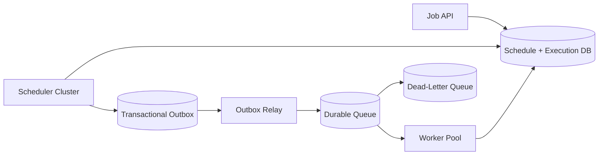
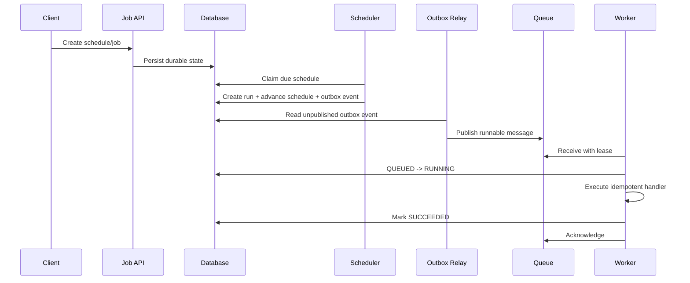
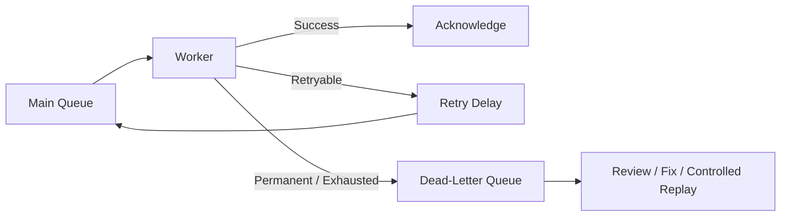
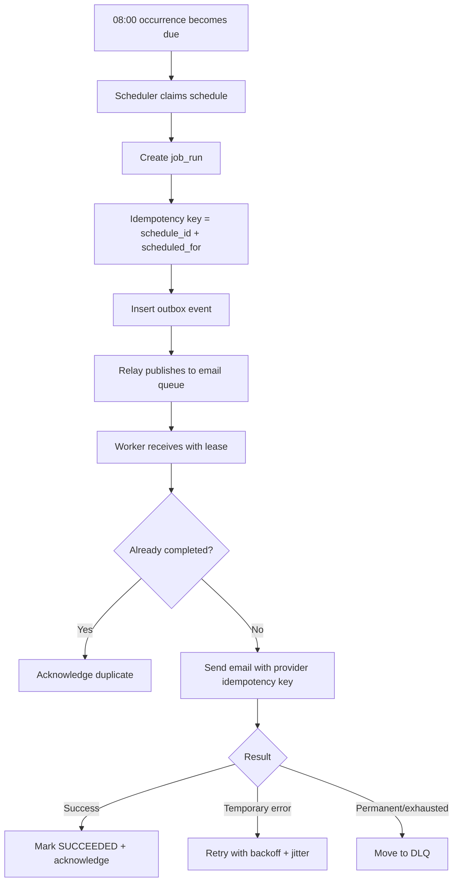

# Design a Job Scheduler and Queue

> Design a reliable distributed system that schedules jobs for future execution, places runnable work onto queues, and executes that work using scalable workers.

## In Short

A reliable job scheduler is easiest to understand as three separate responsibilities:

- **Scheduler** — decides **when** a job becomes runnable.
- **Queue** — stores runnable work durably until a worker can process it.
- **Worker** — performs the actual business operation.

The important reliability rules are:

- Store schedules and execution state durably.
- Use a **transactional outbox** instead of updating the database and publishing to the queue as two unrelated writes.
- Expect **at-least-once delivery**, so workers must be idempotent.
- Use a **lease / visibility timeout** so crashed worker jobs can be retried safely.
- Retry only transient failures with **exponential backoff + jitter**.
- Send exhausted or permanently failing jobs to a **dead-letter queue (DLQ)**.
- Store timestamps in UTC and keep the schedule's **IANA time-zone name** for recurring jobs.
- Scale workers using queue age, arrival rate, processing time, and resource usage—not queue depth alone.



---

## Index

1. **Problem Overview**
   - Scheduler vs Queue vs Worker
   - Common use cases
2. **Requirements**
   - Functional requirements
   - Non-functional requirements
3. **Core Concepts**
   - Schedule, Job Run, Attempt
   - Lease / Visibility Timeout
   - Idempotency
4. **High-Level Architecture**
   - Main execution flow
   - Transactional Outbox
5. **Data Model and API Shape**
   - Main tables
   - Minimal APIs
6. **Scheduler Design**
   - Claiming due schedules
   - Recurring jobs, misfires, overlaps, time zones
7. **Queue and Worker Design**
   - Message shape
   - Acknowledgement and leasing
   - Idempotent processing
8. **Retries and Failure Recovery**
   - Failure classification
   - Backoff and DLQ
   - Important crash scenarios
9. **Scaling and Observability**
   - Scheduler and worker scaling
   - Priority, fairness, ordering
   - Metrics and alerts
10. **Practical Example**
    - Daily invoice email
11. **Technology Choices and Evolution**
12. **Key Takeaways**

---

## 1. Problem Overview

A **job scheduler and queue** runs work immediately, at a future time, or repeatedly based on a fixed interval or cron expression.

Common examples include:

- sending emails and notifications;
- monthly invoice generation;
- uploaded-file processing;
- image/video resizing;
- nightly reports;
- webhook retries;
- external data synchronization;
- cleanup jobs;
- ML inference or batch pipelines.

The real system-design problem is not simply "run this function later." The design must continue working when schedulers restart, workers crash, messages are delivered twice, queues become overloaded, or downstream services temporarily fail.

### 1.1 Scheduler vs Queue vs Worker

| Component | Responsibility |
|---|---|
| **Scheduler** | Decides when a job becomes runnable |
| **Queue** | Stores runnable work until a worker is ready |
| **Worker** | Executes business logic |
| **Execution Store** | Records run status, attempts, results, and errors |

A scheduler should normally **not execute the business operation itself**. Its job is to convert a durable schedule into a runnable job.

---

## 2. Requirements

### 2.1 Functional Requirements

The system should support:

- immediate jobs;
- one-time future jobs using `run_at`;
- recurring jobs using cron or fixed intervals;
- pause, resume, update, and delete schedule operations;
- multiple named queues such as `email`, `billing`, and `media`;
- configurable priority, timeout, and retry policy;
- run status and attempt history;
- cancellation before execution starts;
- automatic retry of transient failures;
- DLQ handling after permanent failure or retry exhaustion.

### 2.2 Non-Functional Requirements

| Requirement | Meaning |
|---|---|
| **Durability** | Accepted jobs survive restarts and machine failures |
| **Availability** | One failed scheduler/worker does not stop the platform |
| **Scalability** | Add scheduler shards and workers as traffic grows |
| **Low scheduling delay** | Jobs start close to their intended time |
| **Fault tolerance** | Worker crashes and lost acknowledgements are recoverable |
| **Isolation** | One tenant/workload cannot consume all capacity |
| **Observability** | Operators can identify lag, retries, failures, and stuck jobs |
| **Security** | Payloads, credentials, and admin operations are protected |

### 2.3 Non-Goal

A basic scheduler is not a full workflow engine. Multi-step durable workflows, compensation logic, long-running approvals, signals, and complex orchestration are better handled by systems such as **Temporal** or **AWS Step Functions**.

---

## 3. Core Concepts

### 3.1 Schedule

A **schedule** describes when work should run.

Examples:

```text
One time:       2026-08-25T09:00:00Z
Fixed interval: every 15 minutes
Cron:           0 8 * * *
Time zone:      Asia/Kolkata
```

### 3.2 Job Run

A **job run** is one logical execution generated from a schedule.

```text
Daily schedule
   ├── 2026-08-20 -> run_001
   ├── 2026-08-21 -> run_002
   └── 2026-08-22 -> run_003
```

### 3.3 Attempt

An **attempt** is one worker try for a job run.

```text
run_003
   ├── attempt 1 -> timeout
   ├── attempt 2 -> HTTP 503
   └── attempt 3 -> success
```

Keeping **runs** and **attempts** separate makes retries, debugging, and audit history much easier.

### 3.4 Lease / Visibility Timeout

When a worker receives a message, it gets temporary ownership of that work.

```text
Queue -> Worker A receives job
      -> message becomes temporarily hidden
      -> Worker A succeeds -> acknowledge/delete
      -> Worker A crashes   -> lease expires -> message becomes visible again
```

For long-running work, the worker should periodically extend the lease with a heartbeat.

### 3.5 Idempotency

Queues can redeliver messages, so executing the same logical job twice must not produce duplicate business effects.

A recurring job can use a deterministic key such as:

```text
idempotency_key = schedule_id + scheduled_for_utc
```

Store that key under a unique database constraint. If the same logical occurrence is created or processed again, the system detects it safely.

---

## 4. High-Level Architecture

### 4.1 Main Flow



### 4.2 Why the Transactional Outbox Matters

This sequence is unsafe:

```text
1. Mark job QUEUED in database
2. Publish message to queue
```

If the process crashes between steps 1 and 2, the database says the job was queued but no message exists.

Instead, perform these operations in **one database transaction**:

```text
BEGIN
  create job_run
  advance schedule.next_run_at
  insert outbox_event
COMMIT
```

A separate relay publishes the outbox event to the queue.

The relay itself may publish twice if it crashes after queue publication but before marking the event as published. That is acceptable because workers are designed to be idempotent.

---

## 5. Data Model and API Shape

### 5.1 Main Tables

A practical relational design needs only a few core entities:

| Table | Important fields |
|---|---|
| `job_definitions` | `job_type`, `payload`, `queue_name`, `timeout`, `max_attempts` |
| `schedules` | `schedule_type`, `cron_expression`, `time_zone`, `next_run_at`, `state`, `overlap_policy`, `misfire_policy` |
| `job_runs` | `scheduled_for`, `status`, `idempotency_key`, `available_at`, `attempt_count`, `lease_expires_at` |
| `job_attempts` | `attempt_number`, `worker_id`, `outcome`, `error`, `duration_ms` |
| `outbox_events` | `event_type`, `payload`, `created_at`, `published_at` |

Important indexes:

```sql
CREATE INDEX idx_schedules_due
ON schedules (next_run_at, id)
WHERE state = 'ACTIVE';

CREATE UNIQUE INDEX uq_job_run_idempotency
ON job_runs (tenant_id, idempotency_key);
```

### 5.2 Minimal API

```http
POST /v1/jobs
POST /v1/schedules
GET  /v1/jobs/{job_run_id}
POST /v1/jobs/{job_run_id}/cancel
POST /v1/schedules/{schedule_id}/pause
POST /v1/schedules/{schedule_id}/resume
```

For immediate job submission, accept an `Idempotency-Key` so a client retry does not create duplicate logical work.

---

## 6. Scheduler Design

### 6.1 Claiming Due Schedules

A relational database is a strong default because it provides transactions, indexes, row locks, unique constraints, and auditability.

With PostgreSQL, multiple scheduler instances can claim different due rows using `FOR UPDATE SKIP LOCKED`:

```sql
BEGIN;

SELECT id
FROM schedules
WHERE state = 'ACTIVE'
  AND next_run_at <= now()
ORDER BY next_run_at, id
FOR UPDATE SKIP LOCKED
LIMIT 500;

-- For each claimed schedule:
-- 1. create job_run if absent
-- 2. insert outbox_event
-- 3. calculate next_run_at

COMMIT;
```

`SKIP LOCKED` is useful here because another scheduler can skip rows already claimed by a peer rather than waiting on them.

### 6.2 Recurring Jobs

Always calculate the next occurrence from the **intended scheduled time**, not from completion time.

```text
Scheduled: 09:00
Completed: 09:07
Next run:  tomorrow 09:00   ✅
           tomorrow 09:07   ❌ schedule drift
```

### 6.3 Time Zones

Store execution timestamps in UTC, but keep the schedule's IANA time-zone name:

```text
scheduled_for: 2026-08-21T02:30:00Z
time_zone:     Asia/Kolkata
```

Do not keep only a fixed UTC offset because daylight-saving rules can change local offsets.

### 6.4 Misfire Policy

A **misfire** happens when a scheduled time is missed because the scheduler was down or overloaded.

| Policy | Behavior |
|---|---|
| `SKIP` | Ignore missed occurrences |
| `RUN_ONCE` | Run one catch-up job now |
| `CATCH_UP_ALL` | Create missed runs, with a strict safety cap |
| `FAIL` | Require operator attention |

### 6.5 Overlap Policy

If the previous occurrence is still running:

| Policy | Behavior |
|---|---|
| `ALLOW` | Run concurrently |
| `FORBID` | Skip/delay the new occurrence |
| `REPLACE` | Cancel old run and start new run |
| `SERIALIZE` | Queue new run but allow one active execution |

These policies should be explicit instead of hidden inside worker code.

---

## 7. Queue and Worker Design

### 7.1 Queue Message

Keep queue messages small:

```json
{
  "message_id": "msg_789",
  "job_run_id": "run_123",
  "job_type": "generate_invoice",
  "payload_version": 2,
  "attempt": 1,
  "scheduled_for": "2026-08-21T02:30:00Z",
  "timeout_seconds": 120,
  "trace_id": "trace_abc"
}
```

Large or sensitive payloads should remain in durable storage; the queue message can contain only `job_run_id` and routing metadata.

### 7.2 Safe Worker Sequence

```text
receive
  -> acquire/confirm ownership
  -> process business operation
  -> commit business effect
  -> record success
  -> acknowledge message
```

Acknowledging **before** processing risks losing work after a crash.

Acknowledging **after** processing can cause redelivery if the worker succeeds but crashes before acknowledgement. That is why the business handler must be idempotent.

### 7.3 Conditional Ownership

Before execution, move the run to `RUNNING` only when its current state allows it:

```sql
UPDATE job_runs
SET status = 'RUNNING',
    worker_id = :worker_id,
    lease_expires_at = now() + interval '90 seconds',
    attempt_count = attempt_count + 1
WHERE id = :job_run_id
  AND status IN ('QUEUED', 'RETRY_WAIT')
  AND available_at <= now()
RETURNING id;
```

If no row is returned, the message may already be completed, cancelled, stale, or owned by another valid worker.

### 7.4 Exactly-Once Business Effect

Do not promise "exactly-once queue delivery." A practical design usually provides:

```text
at-least-once delivery
        +
idempotent handler
        +
unique business key
        +
transactional state changes
        =
exactly-once business effect in normal supported operations
```

If the worker calls an external provider that supports idempotency keys, pass the same stable key downstream.

---

## 8. Retries and Failure Recovery

### 8.1 Classify Failures

**Retryable** examples:

- network timeout;
- HTTP `429`;
- HTTP `502`, `503`, `504`;
- temporary database unavailability;
- short-lived downstream outage.

**Non-retryable** examples:

- malformed payload;
- unsupported payload version;
- invalid destination;
- permanent permission/configuration error;
- business-rule rejection.

### 8.2 Exponential Backoff + Jitter

```text
base_delay = min(max_delay, initial_delay * 2^(attempt - 1))
actual_delay = random(0, base_delay)
```

Example:

```text
Attempt 1 -> 0-5 sec
Attempt 2 -> 0-10 sec
Attempt 3 -> 0-20 sec
Attempt 4 -> 0-40 sec
```

Jitter prevents thousands of jobs from retrying at the same moment after a dependency recovers.

When an HTTP service returns a valid `Retry-After`, prefer that value within a configured maximum.

### 8.3 Dead-Letter Queue



DLQ replay should be controlled, rate-limited, auditable, and protected from repeatedly replaying the same poison message without fixing its cause.

### 8.4 Important Crash Scenarios

| Failure | Recovery |
|---|---|
| Scheduler crashes before DB commit | Nothing durable was created; another scheduler claims it later |
| Scheduler crashes after commit | Run and outbox event survive; relay publishes later |
| Relay publishes then crashes | Event may publish again; worker deduplication handles it |
| Worker crashes during execution | Lease expires; message becomes available again |
| Worker finishes but ack is lost | Redelivery occurs; completed/idempotent state prevents duplicate effect |
| Queue unavailable | Outbox remains pending and relay retries |
| Database unavailable | Do not acknowledge work that has not been durably recorded |

A reaper can also detect stale `RUNNING` rows whose `lease_expires_at < now()` and move them back into retry handling.

---

## 9. Scaling and Observability

### 9.1 Scheduler Scaling

Start simple:

```text
Multiple scheduler instances
        -> same PostgreSQL database
        -> claim different due rows with SKIP LOCKED
```

At much larger scale, partition schedules by a stable shard key:

```text
shard = hash(schedule_id) % N
```

Each scheduler owns one or more shards.

### 9.2 Worker Scaling

A useful approximation is:

```text
required_concurrency
    = arrival_rate * average_processing_time / target_utilization
```

Example:

```text
2,000 jobs/sec * 0.25 sec / 0.70
≈ 715 concurrent worker slots
```

Also consider memory, CPU, database connections, downstream API rate limits, and job duration.

### 9.3 Queue Isolation

Use a small number of queues by workload profile:

```text
email
billing
media-processing
webhook-delivery
```

This gives independent scaling and prevents long CPU-heavy jobs from blocking short I/O jobs.

### 9.4 Priority and Fairness

Avoid strict global priority because low-priority work can starve.

Prefer bounded classes such as:

```text
critical -> high -> normal -> bulk
```

Use weighted consumption or reserved capacity, plus per-tenant concurrency/rate limits when the platform is multi-tenant.

### 9.5 Ordering

Avoid global ordering unless absolutely required.

Most systems only need ordering per business key:

```text
account_123 -> same partition/message group
account_456 -> another partition/message group
```

Different keys can still run concurrently.

### 9.6 Metrics

Track separate latency stages:

```text
Scheduling delay = queued_at - scheduled_for
Queue delay      = started_at - queued_at
Execution time   = completed_at - started_at
End-to-end delay = completed_at - scheduled_for
```

Important operational metrics:

- oldest ready message age;
- queue depth and in-flight count;
- dispatch rate;
- outbox unpublished count and age;
- retry/redelivery rate;
- DLQ count;
- execution duration percentiles;
- lease-renewal failures;
- scheduler claim latency;
- worker concurrency utilization.

For autoscaling, **oldest message age + arrival/service rate** is usually more meaningful than queue depth alone.

---

## 10. Practical Example — Daily Invoice Email

Assume every customer invoice summary must be emailed at **08:00 Asia/Kolkata** every day.

### 10.1 Schedule

```json
{
  "job_type": "send_daily_invoice_email",
  "cron_expression": "0 8 * * *",
  "time_zone": "Asia/Kolkata",
  "queue": "email",
  "overlap_policy": "FORBID",
  "misfire_policy": "RUN_ONCE",
  "max_attempts": 5
}
```

### 10.2 Execution Flow



### 10.3 Why This Example Is Reliable

If the scheduler runs twice, the unique idempotency key prevents two logical runs for the same scheduled occurrence.

If the relay publishes twice, the worker sees the same `job_run_id` and avoids repeating a completed operation.

If the worker crashes before acknowledgement, the queue can redeliver the message after the lease expires.

If the email provider returns a temporary `503`, the job retries later with backoff instead of immediately creating a retry storm.

---

## 11. Technology Choices and Evolution

### 11.1 Common Choices

| Technology | Good Fit | Watch-Out |
|---|---|---|
| **PostgreSQL** | Schedule store, run state, small/medium job queues | High queue throughput can create DB contention |
| **Redis Streams / Sorted Sets** | Low-latency internal queue/timer acceleration | Durability and DB consistency require care |
| **RabbitMQ** | Task queues, routing, acknowledgements | More broker operations/topology management |
| **Amazon SQS** | Managed durable AWS queue | Standard queues are at-least-once; consumers must be idempotent |
| **Kafka** | Event streams, replay, partition ordering | Not a natural general-purpose delayed-job scheduler |
| **Kubernetes CronJob** | Scheduling Kubernetes Jobs/containers | Not a full multi-tenant business scheduler |
| **Workflow Engine** | Multi-step durable orchestration | More concepts and operational complexity |

### 11.2 Practical Evolution

**Stage 1 — PostgreSQL only**

```text
App
 ├── schedules table
 ├── job_runs table
 ├── scheduler thread
 └── workers using SKIP LOCKED
```

Good for a normal business application and the best place to start when scale is modest.

**Stage 2 — Separate scheduler and workers**

```text
API -> PostgreSQL -> Scheduler -> job_runs -> Workers
```

Useful when deployments and scaling need to be independent.

**Stage 3 — Add outbox + durable broker**

```text
API -> DB
Scheduler -> job_run + outbox
Relay -> Queue
Workers -> business services
```

Use when throughput, workload isolation, or multi-service consumption grows.

**Stage 4 — Partition scheduler and queues**

Add scheduler shards, workload-specific queues, regional routing, and autoscaled worker pools only after measurements show the simpler design is reaching its limits.

### 11.3 Current Platform Notes

- PostgreSQL's current `SELECT` documentation supports `FOR UPDATE ... SKIP LOCKED` and specifically notes queue-like multiple-consumer use as an appropriate case.
- Amazon SQS standard queues use at-least-once delivery, so duplicate-safe consumers are required.
- SQS visibility timeout hides a received message temporarily; if it is not deleted before expiry, it can become visible again. Visibility can be extended during long processing.
- SQS native delay/message timers are limited to 15 minutes; AWS recommends EventBridge Scheduler for more advanced/far-future scheduling scenarios.
- Kubernetes CronJob exposes explicit `concurrencyPolicy`, `startingDeadlineSeconds`, and `.spec.timeZone` behavior, reinforcing the need for overlap, misfire, and time-zone policies in a general scheduler.

---

## 12. Key Takeaways

A strong job scheduler design normally uses these defaults:

| Decision | Recommended Default |
|---|---|
| Source of truth | Relational database |
| Delivery | At least once |
| Duplicate handling | Idempotent worker + unique business key |
| DB-to-queue consistency | Transactional outbox |
| Scheduler concurrency | Active-active row claims with `SKIP LOCKED` |
| Worker ownership | Lease / visibility timeout + heartbeat |
| Retry policy | Exponential backoff + jitter |
| Permanent failure | Dead-letter queue with controlled replay |
| Recurring identity | `schedule_id + scheduled_for` |
| Time handling | UTC timestamps + IANA time-zone name |
| Queue isolation | Few queues grouped by workload profile |
| Ordering | Per business key, not global |
| Cancellation | Cooperative and state-aware |
| Scaling signal | Queue age + arrival/service rate + resource limits |

The central design principle is:

> **Assume every distributed boundary can fail after doing the work but before confirming it.**

That assumption naturally leads to durable state, idempotency keys, unique constraints, leases, retries, an outbox, DLQ handling, and strong observability.

---

## References

1. PostgreSQL 18 — `SELECT`, locking clauses and `SKIP LOCKED`: https://www.postgresql.org/docs/18/sql-select.html
2. Amazon SQS — At-least-once delivery: https://docs.aws.amazon.com/AWSSimpleQueueService/latest/SQSDeveloperGuide/standard-queues-at-least-once-delivery.html
3. Amazon SQS — Visibility timeout: https://docs.aws.amazon.com/AWSSimpleQueueService/latest/SQSDeveloperGuide/sqs-visibility-timeout.html
4. Amazon SQS — Message timers and EventBridge Scheduler guidance: https://docs.aws.amazon.com/AWSSimpleQueueService/latest/SQSDeveloperGuide/sqs-message-timers.html
5. Kubernetes — CronJob concepts: https://kubernetes.io/docs/concepts/workloads/controllers/cron-jobs/

---

**End of document**
