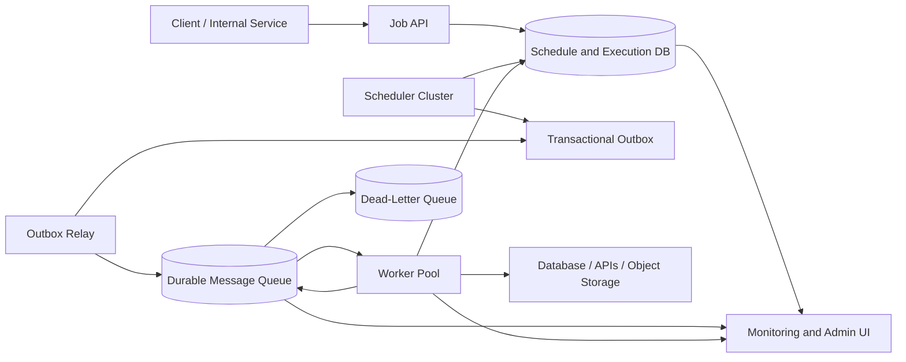
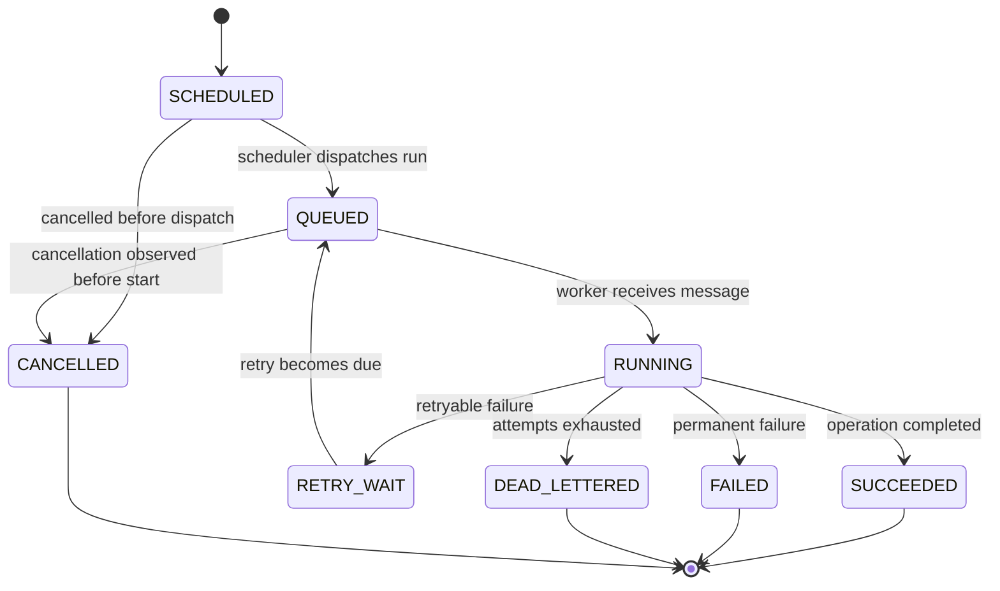
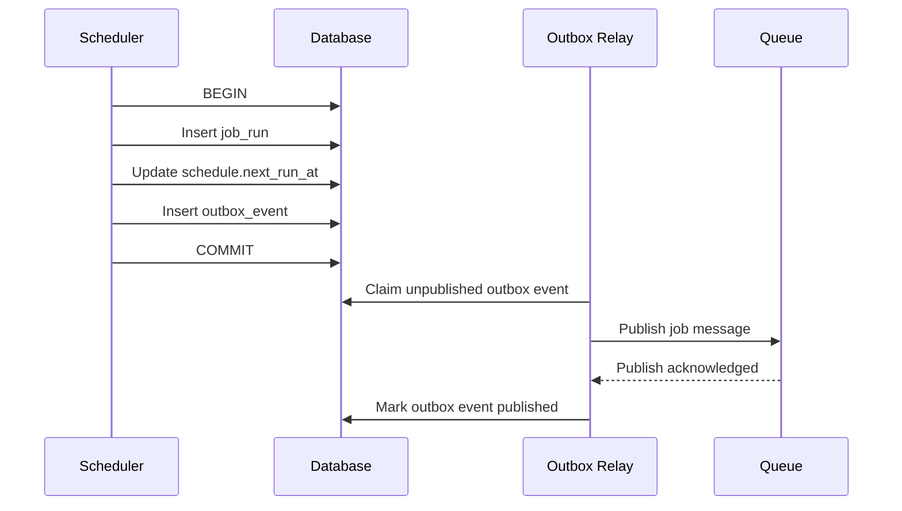
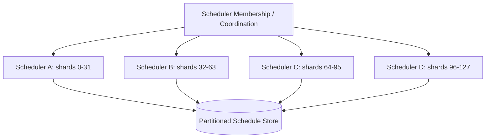
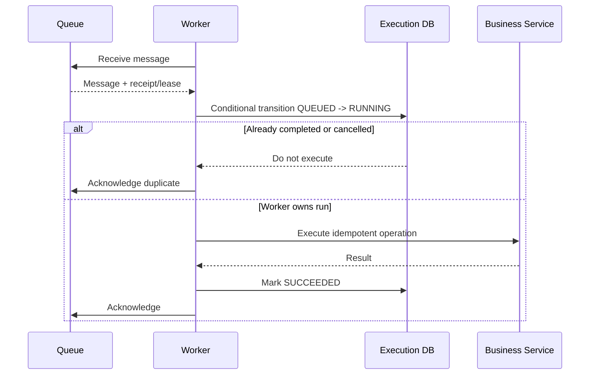
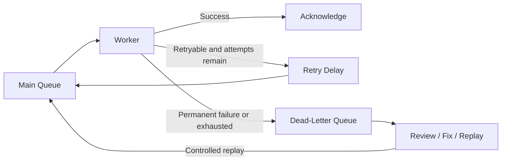
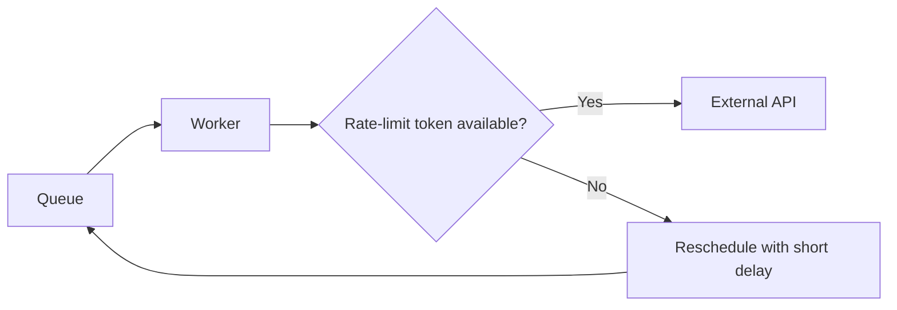

# Design a Job Scheduler and Queue

> **Category:** System Design  
> **Audience:** Backend developers with 3+ years of experience  
> **Goal:** Design a reliable distributed system that schedules jobs for future execution, places runnable work onto queues, and executes that work using scalable workers.

---

## 1. Problem Overview

A **job scheduler and queue** accepts work that should run:

- immediately;
- once at a future time;
- repeatedly using a fixed interval or cron expression;
- after another job completes;
- with a specific priority, retry policy, timeout, or concurrency rule.

Typical examples include:

- sending emails and notifications;
- generating invoices every month;
- processing uploaded files;
- resizing images or videos;
- running nightly reports;
- retrying failed webhook deliveries;
- synchronizing data with external services;
- cleaning expired sessions;
- executing machine-learning inference or batch pipelines.

The important system-design challenge is not merely “run a function later.” The system must continue working when schedulers restart, workers crash, messages are duplicated, clocks differ, queues become overloaded, or downstream services fail.

### 1.1 Scheduler versus Queue

These responsibilities are related but different:

| Component | Main responsibility |
|---|---|
| Scheduler | Decides **when** a job becomes runnable |
| Queue | Stores runnable work until a worker can process it |
| Worker | Performs the actual business operation |
| Execution store | Records attempts, status, results, and errors |

A scheduler should normally avoid performing the business work itself. It should convert a durable schedule into a runnable queue message.

---

## 2. Requirements and Scope

### 2.1 Functional Requirements

The system should support:

1. Create, update, pause, resume, and delete a schedule.
2. Schedule one-time jobs using `run_at`.
3. Schedule recurring jobs using cron or fixed intervals.
4. Enqueue immediate jobs.
5. Assign jobs to named queues such as `email`, `billing`, or `video`.
6. Configure priority, timeout, retries, and backoff.
7. Track each logical run and every processing attempt.
8. Cancel jobs that have not started.
9. Retry transient failures automatically.
10. Move permanently failing jobs to a dead-letter queue.
11. Prevent uncontrolled concurrent runs of the same schedule.
12. Expose job status and execution history.

### 2.2 Non-Functional Requirements

A production design should target:

- **Durability:** accepted jobs must survive process and machine restarts.
- **Availability:** scheduler and worker failures should not stop the complete system.
- **Scalability:** throughput should grow by adding scheduler partitions and workers.
- **Low scheduling delay:** jobs should be dispatched near their expected execution time.
- **Fault tolerance:** lost acknowledgements or worker crashes must be recoverable.
- **Isolation:** one tenant or queue must not consume all available capacity.
- **Observability:** operators must see queue lag, failures, retries, and stuck jobs.
- **Security:** job payloads, credentials, and administrative operations must be protected.

### 2.3 Explicit Non-Goals

A basic job scheduler does not automatically provide:

- arbitrary distributed transactions across external systems;
- true exactly-once execution of every possible side effect;
- a complete workflow orchestration language;
- long-running human approval workflows;
- event-stream analytics.

Those requirements may need a workflow engine such as Temporal, AWS Step Functions, or another orchestration platform.

---

## 3. Core Concepts

### 3.1 Job Definition

A **job definition** describes what should be executed.

```json
{
  "job_type": "send_invoice_email",
  "payload": {
    "invoice_id": "inv_123",
    "customer_id": "cus_456"
  },
  "queue": "email",
  "priority": 5,
  "timeout_seconds": 60,
  "max_attempts": 5
}
```

The queue should usually contain a small payload or a reference to durable data. Large files should be stored in object storage, while the message contains the object key.

### 3.2 Schedule

A **schedule** describes when a job definition should create a run.

Examples:

```text
One time:       2026-08-10T09:00:00Z
Fixed interval: every 15 minutes
Cron:           0 2 * * *
Event-based:    after report_generation completes
```

### 3.3 Job Run

A **job run** is one logical execution generated from a schedule.

A daily schedule creates a new job run each day:

```text
Schedule: daily_invoice_export

2026-08-01 -> run_001
2026-08-02 -> run_002
2026-08-03 -> run_003
```

### 3.4 Attempt

An **attempt** is one worker processing try for a job run.

```text
run_003
  attempt 1 -> timeout
  attempt 2 -> HTTP 503
  attempt 3 -> success
```

Keeping runs and attempts separate makes retries and debugging much clearer.

### 3.5 Lease or Visibility Timeout

When a worker receives a message, it obtains a temporary processing lease. During the lease, other workers should not normally receive the same message.

If the worker succeeds, it acknowledges the message. If it crashes and the lease expires, the message becomes available again.

### 3.6 Idempotency Key

An **idempotency key** identifies the logical operation so that processing it more than once does not create duplicate business effects.

Example:

```text
invoice-email:inv_123:billing-cycle-2026-08
```

---

## 4. High-Level Architecture



### 4.1 Main Flow

1. A client creates a schedule through the API.
2. The API validates and stores it in the schedule database.
3. A scheduler instance finds due schedules.
4. In one database transaction, it creates a job run, advances the schedule, and writes an outbox event.
5. An outbox relay publishes the runnable job to the queue.
6. A worker receives the message and obtains a lease.
7. The worker executes the operation.
8. On success, it records completion and acknowledges the message.
9. On transient failure, it schedules a retry.
10. On permanent or repeated failure, the message moves to a dead-letter queue.

---

## 5. End-to-End Job Lifecycle



A useful status model is:

| Status | Meaning |
|---|---|
| `SCHEDULED` | Known by the scheduler but not yet runnable |
| `QUEUED` | Published for worker consumption |
| `RUNNING` | A worker currently owns a lease |
| `RETRY_WAIT` | Waiting for the next retry time |
| `SUCCEEDED` | Completed successfully |
| `FAILED` | Finished with a non-retryable failure |
| `DEAD_LETTERED` | Failed too many times and requires investigation |
| `CANCELLED` | Should not start or continue |

State transitions should be validated with conditional updates. For example, a worker should not change a `CANCELLED` job to `RUNNING`.

---

## 6. Core Components

### 6.1 Job API

The API is responsible for:

- authentication and authorization;
- request validation;
- schedule creation and updates;
- idempotent job submission;
- status lookup;
- cancellation and manual retry;
- quota enforcement;
- audit logging.

The API must store accepted work durably before returning success.

### 6.2 Schedule Store

A relational database is a strong default because it provides:

- transactions;
- unique constraints;
- indexed time-based queries;
- row-level locking;
- execution history and auditability;
- easy updates for pause, cancellation, and policy changes.

PostgreSQL can support multiple schedulers claiming due rows with `FOR UPDATE SKIP LOCKED`. Its documentation explicitly notes that skipping locked rows can help multiple consumers access a queue-like table without waiting on one another.[1]

### 6.3 Scheduler Cluster

The scheduler continuously finds due schedules and converts them into job runs.

It must solve three problems:

1. Multiple scheduler instances must not create uncontrolled duplicate runs.
2. A crash after updating the database but before publishing to the queue must not lose the run.
3. Recurring schedules must advance correctly after every due occurrence.

### 6.4 Transactional Outbox

The scheduler should avoid this unsafe dual-write sequence:

```text
1. Mark job as queued in database
2. Publish message to queue
```

A crash between the two operations can produce inconsistent state.

Instead, write the job run and outbox event in the same database transaction:



The relay may publish the same outbox event more than once when acknowledgements are lost. Therefore, queue messages and workers must remain idempotent.

### 6.5 Durable Queue

The queue should provide:

- durable messages;
- multiple competing consumers;
- acknowledgement or deletion after success;
- visibility timeout or lease semantics;
- retry delay or delayed messages;
- dead-letter handling;
- metrics for depth and oldest message age.

Managed queues such as Amazon SQS use at-least-once delivery for standard queues, so consumers must tolerate duplicate messages.[2] A received message stays temporarily invisible during its visibility timeout and becomes available again if it is not deleted before the timeout expires.[3]

### 6.6 Workers

Workers:

- consume jobs from one or more queues;
- validate message schema and version;
- acquire or renew processing leases;
- enforce timeout and cancellation;
- execute business logic;
- record attempts and results;
- acknowledge only after successful completion;
- classify failures as retryable or permanent.

### 6.7 Dead-Letter Queue

A dead-letter queue stores messages that cannot be processed successfully after the configured number of attempts.

It is not just a “failed messages bucket.” It needs:

- alerting;
- searchable error details;
- payload redaction;
- replay controls;
- replay rate limits;
- a record of who replayed a message and why.

### 6.8 Monitoring and Admin UI

Operators should be able to:

- search jobs by run ID, schedule ID, tenant, or idempotency key;
- view job state and attempt history;
- inspect sanitized error details;
- pause a schedule or queue;
- retry or cancel jobs;
- replay DLQ messages;
- see queue lag and worker capacity;
- view scheduler ownership and partition health.

---

## 7. Data Model

A practical relational model separates definitions, schedules, logical runs, attempts, and outbox events.

### 7.1 `job_definitions`

```sql
CREATE TABLE job_definitions (
    id                  UUID PRIMARY KEY,
    tenant_id           UUID NOT NULL,
    job_type            VARCHAR(150) NOT NULL,
    payload             JSONB NOT NULL,
    payload_version     INTEGER NOT NULL DEFAULT 1,
    queue_name          VARCHAR(100) NOT NULL,
    priority            SMALLINT NOT NULL DEFAULT 5,
    timeout_seconds     INTEGER NOT NULL,
    max_attempts        INTEGER NOT NULL DEFAULT 5,
    retry_policy        JSONB NOT NULL,
    created_at          TIMESTAMPTZ NOT NULL DEFAULT now()
);
```

### 7.2 `schedules`

```sql
CREATE TABLE schedules (
    id                    UUID PRIMARY KEY,
    tenant_id             UUID NOT NULL,
    job_definition_id     UUID NOT NULL REFERENCES job_definitions(id),
    schedule_type         VARCHAR(30) NOT NULL,
    cron_expression       VARCHAR(100),
    interval_seconds      BIGINT,
    time_zone             VARCHAR(100) NOT NULL DEFAULT 'UTC',
    next_run_at            TIMESTAMPTZ,
    last_scheduled_at      TIMESTAMPTZ,
    state                  VARCHAR(30) NOT NULL,
    overlap_policy         VARCHAR(30) NOT NULL DEFAULT 'ALLOW',
    misfire_policy         VARCHAR(30) NOT NULL DEFAULT 'RUN_ONCE',
    version                BIGINT NOT NULL DEFAULT 0,
    created_at             TIMESTAMPTZ NOT NULL DEFAULT now(),
    updated_at             TIMESTAMPTZ NOT NULL DEFAULT now()
);

CREATE INDEX idx_schedules_due
ON schedules (next_run_at, id)
WHERE state = 'ACTIVE';
```

### 7.3 `job_runs`

```sql
CREATE TABLE job_runs (
    id                    UUID PRIMARY KEY,
    tenant_id             UUID NOT NULL,
    schedule_id           UUID,
    job_definition_id     UUID NOT NULL,
    scheduled_for         TIMESTAMPTZ NOT NULL,
    available_at          TIMESTAMPTZ NOT NULL,
    status                VARCHAR(30) NOT NULL,
    idempotency_key       VARCHAR(255) NOT NULL,
    attempt_count         INTEGER NOT NULL DEFAULT 0,
    worker_id             VARCHAR(255),
    lease_expires_at      TIMESTAMPTZ,
    started_at            TIMESTAMPTZ,
    completed_at          TIMESTAMPTZ,
    result                JSONB,
    error_code            VARCHAR(100),
    error_message         TEXT,
    created_at            TIMESTAMPTZ NOT NULL DEFAULT now(),
    updated_at            TIMESTAMPTZ NOT NULL DEFAULT now(),
    UNIQUE (tenant_id, idempotency_key)
);

CREATE INDEX idx_job_runs_status_available
ON job_runs (status, available_at);
```

A recurring run can use a deterministic key:

```text
schedule_id + scheduled_for_utc
```

The unique constraint prevents duplicate logical runs even if multiple scheduler instances try to create the same occurrence.

### 7.4 `job_attempts`

```sql
CREATE TABLE job_attempts (
    id                UUID PRIMARY KEY,
    job_run_id        UUID NOT NULL REFERENCES job_runs(id),
    attempt_number    INTEGER NOT NULL,
    worker_id         VARCHAR(255) NOT NULL,
    started_at        TIMESTAMPTZ NOT NULL,
    completed_at      TIMESTAMPTZ,
    outcome           VARCHAR(30),
    error_code        VARCHAR(100),
    error_message     TEXT,
    duration_ms       BIGINT,
    UNIQUE (job_run_id, attempt_number)
);
```

### 7.5 `outbox_events`

```sql
CREATE TABLE outbox_events (
    id                UUID PRIMARY KEY,
    aggregate_type    VARCHAR(100) NOT NULL,
    aggregate_id      UUID NOT NULL,
    event_type        VARCHAR(100) NOT NULL,
    payload           JSONB NOT NULL,
    created_at        TIMESTAMPTZ NOT NULL DEFAULT now(),
    published_at      TIMESTAMPTZ,
    publish_attempts  INTEGER NOT NULL DEFAULT 0
);

CREATE INDEX idx_outbox_unpublished
ON outbox_events (created_at, id)
WHERE published_at IS NULL;
```

---

## 8. Scheduler Design

### 8.1 Database Polling Scheduler

The simplest durable design polls an indexed `next_run_at` column.

```sql
BEGIN;

SELECT id
FROM schedules
WHERE state = 'ACTIVE'
  AND next_run_at <= now()
ORDER BY next_run_at, id
FOR UPDATE SKIP LOCKED
LIMIT 500;

-- For every claimed schedule:
-- 1. Insert job_run using a deterministic idempotency key.
-- 2. Insert an outbox event.
-- 3. Calculate and store the next occurrence.

COMMIT;
```

#### Advantages

- easy to understand;
- durable and transactional;
- works well for small and medium workloads;
- supports pause, update, and audit operations naturally;
- horizontal schedulers can claim different rows.

#### Limitations

- frequent polling creates database load;
- very large schedule tables require careful indexing and partitioning;
- scanning every second is inefficient when most jobs are far in the future;
- a single hot index can become a bottleneck.

### 8.2 Look-Ahead Window

Instead of moving only jobs due at the current millisecond, a scheduler may claim a short look-ahead window:

```text
now <= next_run_at < now + 30 seconds
```

It can publish those jobs to a queue that supports delayed delivery. This reduces database polling frequency but introduces dependence on queue delay accuracy.

### 8.3 Redis Sorted Set Scheduler

A Redis sorted set can store:

```text
member = schedule_id
score  = next_run_at epoch milliseconds
```

Redis sorted sets keep unique members ordered by score.[4]

A scheduler atomically claims members whose score is less than or equal to the current time, moves them to an in-flight set, and publishes them.

#### Advantages

- fast ordered access by execution time;
- low scheduling latency;
- useful when due-time operations are extremely frequent.

#### Risks

- the relational database may still be the source of truth;
- updating both Redis and the database creates consistency problems;
- recovery must rebuild Redis from durable state;
- atomic claim-and-publish still needs careful design.

A common hybrid keeps schedules durably in PostgreSQL and uses Redis only as an acceleration index.

### 8.4 Hierarchical Timing Wheel

A timing wheel places timers into time buckets, such as:

```text
Level 1: seconds
Level 2: minutes
Level 3: hours
Level 4: days
```

It is memory-efficient for millions of timers and avoids repeatedly scanning a database index. However, durability, failover, resharding, cancellation, and restart recovery become more complex.

Timing wheels are useful inside a scheduler shard after schedules have already been loaded from durable storage.

### 8.5 Scheduler Ownership Models

#### Single Active Leader

Only one scheduler dispatches work. Standby instances take over after leader failure.

```text
Simple, but one leader can become a throughput bottleneck.
```

#### Active-Active with Row Claims

All scheduler instances query due rows and use row locking or conditional updates to claim different records.

```text
Good default for database-backed systems.
```

#### Partitioned Scheduling

Schedules are assigned to stable shards:

```text
shard = hash(schedule_id) mod N
```

Each scheduler instance owns one or more shards. A coordinator redistributes shards when instances join or leave.



Partitioning improves throughput but makes resharding and ownership recovery more complicated.

---

## 9. Queue Design

### 9.1 Queue Message Shape

```json
{
  "message_id": "msg_789",
  "job_run_id": "run_123",
  "job_type": "generate_monthly_invoice",
  "payload_version": 2,
  "queue": "billing",
  "priority": 3,
  "attempt": 1,
  "scheduled_for": "2026-08-03T02:00:00Z",
  "available_at": "2026-08-03T02:00:00Z",
  "timeout_seconds": 300,
  "trace_id": "trace_abc"
}
```

Prefer carrying `job_run_id` and minimal routing data. The worker can load the complete payload from durable storage when payloads are large, sensitive, or frequently updated.

### 9.2 Acknowledgement Model

The safe sequence is:

```text
receive -> process -> commit business effect -> record success -> acknowledge
```

Acknowledging before the business operation risks losing work if the worker crashes.

Acknowledging after completion can cause duplicate delivery if the worker succeeds but crashes before the acknowledgement reaches the queue. Idempotency handles this case.

### 9.3 Visibility Timeout

Choose a visibility timeout longer than normal processing time, but not so long that crashed jobs remain unavailable for excessive time.

For variable-duration jobs, use a heartbeat:

```text
Every 30 seconds:
    renew lease for another 90 seconds
```

The worker should stop renewing when:

- processing completes;
- cancellation is requested;
- it loses ownership;
- the timeout is reached.

### 9.4 Queue-per-Workload versus Shared Queue

#### Separate Queues

```text
email
billing
media-processing
webhook-delivery
```

Benefits:

- workload isolation;
- independent scaling;
- different retry and timeout policies;
- easier operational ownership.

Costs:

- more queues and worker configurations;
- spare capacity may remain unused;
- routing and monitoring become more complex.

#### Shared Queue

Benefits:

- simple operations;
- workers can consume mixed jobs;
- capacity is shared automatically.

Costs:

- long tasks can delay short tasks;
- one noisy workload can affect others;
- per-type scaling is difficult.

A practical design uses a small number of queues grouped by runtime and resource profile.

---

## 10. Worker Design

### 10.1 Worker Processing Flow



### 10.2 Conditional Ownership

The worker should atomically transition a job to `RUNNING` only when allowed:

```sql
UPDATE job_runs
SET status = 'RUNNING',
    worker_id = :worker_id,
    lease_expires_at = now() + interval '90 seconds',
    started_at = COALESCE(started_at, now()),
    attempt_count = attempt_count + 1
WHERE id = :job_run_id
  AND status IN ('QUEUED', 'RETRY_WAIT')
  AND available_at <= now()
RETURNING *;
```

If no row is returned, the message may be stale, duplicated, cancelled, already completed, or owned by another valid worker.

### 10.3 Worker Concurrency

Concurrency should match the workload:

| Workload | Suitable model |
|---|---|
| HTTP and database I/O | Async workers or many lightweight threads |
| CPU-heavy image processing | Multiple processes or container replicas |
| GPU inference | GPU-aware worker pools with limited concurrency |
| Memory-heavy reports | Low concurrency and resource-based scheduling |

Do not set concurrency based only on CPU count. Consider downstream connection limits, rate limits, memory, and job duration.

### 10.4 Graceful Shutdown

When shutting down, a worker should:

1. stop receiving new messages;
2. finish or checkpoint current jobs within a grace period;
3. continue renewing leases while finishing;
4. release or allow leases to expire for unfinished jobs;
5. flush status updates and telemetry;
6. terminate.

### 10.5 Payload Versioning

Messages can remain in queues for minutes or days. Workers must handle schema evolution.

Use:

```json
{
  "job_type": "generate_report",
  "payload_version": 3
}
```

Support older versions during a deployment window or transform them before execution.

---

## 11. Delivery Guarantees and Idempotency

### 11.1 At-Most-Once

A message is processed zero or one time.

This usually means acknowledging before processing. It avoids duplicates but can lose work after a crash.

Suitable only when occasional loss is acceptable, such as some non-critical telemetry.

### 11.2 At-Least-Once

A message is processed one or more times.

This is the common practical guarantee because failures can be retried. Duplicate processing is possible, so handlers must be idempotent.

### 11.3 Exactly-Once Effect

True exactly-once execution across a queue, worker, database, email provider, payment system, and arbitrary external APIs is generally not available as a single system property.

The practical target is an **exactly-once business effect** using:

- at-least-once delivery;
- deterministic idempotency keys;
- unique database constraints;
- transactional state changes;
- downstream provider idempotency keys;
- reconciliation when external outcomes are uncertain.

### 11.4 Idempotent Handler Example

Suppose a job charges an invoice.

Unsafe logic:

```python
charge_card(invoice_id)
mark_invoice_paid(invoice_id)
```

A retry after a crash can charge twice.

Safer logic:

```text
idempotency_key = "charge:invoice_123"

1. Insert payment_operation(idempotency_key) with a unique constraint.
2. If it already succeeded, return the stored result.
3. Call the payment provider using the same idempotency key.
4. Store provider reference and final status.
5. Reconcile UNKNOWN operations before retrying blindly.
```

### 11.5 Inbox Pattern

A worker can keep an inbox table of processed message IDs:

```sql
INSERT INTO processed_messages (consumer_name, message_id)
VALUES (:consumer, :message_id)
ON CONFLICT DO NOTHING;
```

The insertion and business database update should happen in the same transaction when possible.

---

## 12. Retries, Backoff, and Dead-Letter Queues

### 12.1 Failure Classification

#### Retryable Failures

- network timeout;
- HTTP `429` rate limit;
- HTTP `502`, `503`, or `504`;
- temporary database unavailability;
- lock timeout;
- short-lived dependency outage.

#### Non-Retryable Failures

- invalid payload;
- unsupported payload version;
- missing required resource that will not appear later;
- permission failure caused by invalid configuration;
- business rule rejection;
- malformed destination address.

The handler should return a structured classification instead of treating every exception equally.

### 12.2 Exponential Backoff with Jitter

A common formula is:

```text
base_delay = min(max_delay, initial_delay × 2^(attempt - 1))
actual_delay = random(0, base_delay)
```

Example:

```text
Attempt 1 -> 0–5 seconds
Attempt 2 -> 0–10 seconds
Attempt 3 -> 0–20 seconds
Attempt 4 -> 0–40 seconds
Attempt 5 -> 0–80 seconds
```

Jitter prevents thousands of failed jobs from retrying at exactly the same time after a dependency recovers.

### 12.3 Respecting `Retry-After`

For a rate-limited HTTP response, prefer the service-provided `Retry-After` value when valid. Apply a maximum cap and add small jitter to avoid synchronized retries.

### 12.4 Retry Scheduling

Retries can be implemented using:

- delayed queue messages;
- a dedicated retry queue per delay tier;
- a `RETRY_WAIT` row with `available_at` processed by the scheduler;
- a Redis sorted set keyed by retry time.

For long delays, durable database scheduling is usually easier to inspect and modify.

### 12.5 Dead-Letter Flow



DLQ replay must preserve or create a clear replay identifier. Avoid repeatedly replaying a poison message into the main queue without changing the cause.

---

## 13. Recurring Jobs, Time Zones, and Missed Runs

### 13.1 Store Time in UTC

Store these values in UTC:

- `scheduled_for`;
- `next_run_at`;
- `started_at`;
- `completed_at`;
- lease expiration times.

Also store the schedule’s IANA time-zone name, such as:

```text
Asia/Kolkata
America/New_York
Europe/London
```

Do not store only a fixed UTC offset because daylight-saving rules can change the offset.

### 13.2 Calculate from the Intended Occurrence

For fixed schedules, calculate the next run from the previous **scheduled time**, not from the completion time.

Correct:

```text
09:00 scheduled
09:07 completed
next = tomorrow at 09:00
```

Incorrect:

```text
next = tomorrow at 09:07
```

The incorrect version creates schedule drift.

### 13.3 Daylight-Saving Time

A local time may be:

- skipped when clocks move forward;
- repeated when clocks move backward.

The product must define the behavior explicitly:

```text
Skipped local time: run at next valid instant or skip occurrence?
Repeated local time: run once or twice?
```

### 13.4 Misfire Policy

A misfire occurs when a scheduled time passes while the scheduler is unavailable or overloaded.

Common policies:

| Policy | Behavior |
|---|---|
| `SKIP` | Ignore missed occurrences and calculate the next future time |
| `RUN_ONCE` | Run one catch-up occurrence immediately |
| `CATCH_UP_ALL` | Create every missed run, usually with a safety limit |
| `FAIL` | Mark the schedule as requiring attention |

Never allow unlimited catch-up without a cap. A schedule that was offline for months could create millions of runs.

### 13.5 Overlap Policy

If the previous run is still active when the next occurrence becomes due:

| Policy | Behavior |
|---|---|
| `ALLOW` | Start another run |
| `FORBID` | Skip or delay the new run |
| `REPLACE` | Cancel the old run and start the new run |
| `SERIALIZE` | Queue the new run but allow only one active run |

Current Kubernetes CronJob concepts expose related controls through fields such as `concurrencyPolicy`, `startingDeadlineSeconds`, and `.spec.timeZone`.[5] These are useful examples of the policy decisions a general scheduler should make explicit.

---

## 14. High Availability and Failure Recovery

### 14.1 Scheduler Crashes Before Commit

No run or outbox event is committed. Another scheduler can claim the schedule later.

### 14.2 Scheduler Crashes After Commit

The job run and outbox event are durable. The outbox relay publishes the event later.

### 14.3 Relay Publishes but Crashes Before Marking Published

The relay republishes the event after restart. The queue or worker may see a duplicate. The deterministic message ID and job-run idempotency prevent duplicate effects.

### 14.4 Worker Crashes During Execution

The lease expires and the message becomes visible again. The next worker checks persistent state and continues or safely retries.

### 14.5 Worker Completes but Acknowledgement Is Lost

The message is redelivered. The worker sees that the logical run already succeeded and acknowledges it without repeating the business effect.

### 14.6 Database Is Temporarily Unavailable

Schedulers should stop dispatching rather than create memory-only work. Workers should avoid acknowledging messages until durable completion state is recorded.

### 14.7 Queue Is Temporarily Unavailable

Outbox events remain unpublished and are retried. Alert on outbox age and unpublished count.

### 14.8 Stale Running Jobs

A reaper process finds expired leases:

```sql
SELECT id
FROM job_runs
WHERE status = 'RUNNING'
  AND lease_expires_at < now();
```

It verifies that the lease is truly stale and moves the run to `RETRY_WAIT`, `FAILED`, or `DEAD_LETTERED` according to policy.

Use fencing tokens or monotonically increasing attempt numbers so an old worker cannot overwrite the result of a newer worker.

### 14.9 Clock Problems

Use database or server time for ownership comparisons rather than trusting arbitrary client timestamps.

For scheduler nodes:

- synchronize clocks using NTP;
- monitor clock offset;
- store UTC timestamps;
- allow a small tolerance around due-time boundaries;
- use monotonic clocks for measuring local durations.

---

## 15. Scaling and Partitioning

### 15.1 Capacity Example

Assume:

```text
Stored schedules:             10 million
Peak runnable jobs:           5,000 jobs/second
Average message size:         2 KB
Average execution time:       400 ms
Target worker utilization:    70%
```

Approximate message ingress:

```text
5,000 × 2 KB = 10 MB/second before protocol overhead and replication
```

Minimum parallel worker slots:

```text
5,000 jobs/s × 0.4 s = 2,000 concurrent slots
```

Adjusted for 70% utilization:

```text
2,000 / 0.70 ≈ 2,858 slots
```

Add headroom for retries, traffic spikes, slow dependencies, and deployments.

### 15.2 Scheduler Throughput

A scheduler batch of 500 runs every 100 ms can theoretically dispatch:

```text
500 × 10 batches/second = 5,000 runs/second
```

Actual capacity depends on transaction cost, index access, payload size, outbox writes, replication, and contention.

### 15.3 Database Indexing

The critical due-schedule query needs an index beginning with `next_run_at` and normally a partial condition for active schedules.

Avoid updating heavily indexed columns unnecessarily. `next_run_at` changes after every occurrence, so recurring schedules naturally create write pressure.

### 15.4 Table Partitioning

Large execution-history tables can be partitioned by time:

```text
job_runs_2026_08
job_runs_2026_09
job_runs_2026_10
```

Benefits:

- faster retention cleanup;
- smaller indexes;
- easier archival;
- improved maintenance operations.

Schedules may instead be hash-partitioned by `schedule_id` or `tenant_id` to spread active writes.

### 15.5 Queue Partitioning

Partition queues by workload, tenant group, region, or hash key.

```text
billing-0
billing-1
billing-2
billing-3
```

Use a stable routing function:

```text
partition = hash(order_id) mod partition_count
```

Stable routing can preserve ordering for a business key, but resharding must be planned carefully.

### 15.6 Autoscaling Workers

Useful scaling signals include:

- queue depth;
- age of oldest ready message;
- ready messages per active worker;
- consumer lag;
- processing duration percentiles;
- CPU and memory;
- downstream rate-limit headroom.

Queue depth alone is insufficient. A queue of 10,000 jobs lasting 5 ms is very different from 10,000 jobs lasting 10 minutes.

A useful approximation is:

```text
required_workers = arrival_rate × average_processing_time / target_utilization
```

---

## 16. Priority, Fairness, Ordering, and Rate Limits

### 16.1 Priority

Strict global priority can starve low-priority jobs. Prefer bounded priority classes:

```text
critical
high
normal
bulk
```

Workers can use weighted consumption:

```text
critical: 50%
high:     25%
normal:   20%
bulk:      5%
```

### 16.2 Tenant Fairness

A large tenant must not monopolize all worker slots.

Options include:

- per-tenant queues;
- weighted fair queuing;
- token buckets per tenant;
- maximum concurrent jobs per tenant;
- round-robin dispatch across tenant partitions.

### 16.3 Ordering

Global ordering severely limits parallelism. Most systems need ordering only for a business key:

```text
all events for account_123 must be ordered
```

Route the same key to the same partition or message group. Different keys can still execute concurrently.

### 16.4 Concurrency Limits

Examples:

```text
Maximum 1 active invoice-generation job per company.
Maximum 10 concurrent API calls per integration account.
Maximum 100 media jobs per tenant.
```

Concurrency permits must also be leased so they recover when workers crash.

### 16.5 External Rate Limits

Workers should enforce limits before calling dependencies.



Do not let thousands of workers repeatedly call a dependency that is already returning `429`.

---

## 17. API Design

### 17.1 Create an Immediate Job

```http
POST /v1/jobs
Idempotency-Key: upload-123-virus-scan
Content-Type: application/json
```

```json
{
  "job_type": "scan_uploaded_file",
  "queue": "file-processing",
  "payload": {
    "object_key": "uploads/2026/08/file-123.pdf"
  },
  "timeout_seconds": 120,
  "max_attempts": 4
}
```

Response:

```json
{
  "job_run_id": "run_123",
  "status": "QUEUED"
}
```

### 17.2 Create a Recurring Schedule

```http
POST /v1/schedules
Content-Type: application/json
```

```json
{
  "name": "daily-sales-summary",
  "job_type": "generate_sales_summary",
  "cron_expression": "0 8 * * *",
  "time_zone": "Asia/Kolkata",
  "queue": "reports",
  "overlap_policy": "FORBID",
  "misfire_policy": "RUN_ONCE",
  "payload": {
    "company_id": "cmp_123"
  }
}
```

### 17.3 Get Job Status

```http
GET /v1/jobs/run_123
```

```json
{
  "id": "run_123",
  "status": "RETRY_WAIT",
  "scheduled_for": "2026-08-03T02:00:00Z",
  "attempt_count": 2,
  "next_attempt_at": "2026-08-03T02:01:30Z",
  "last_error": {
    "code": "DEPENDENCY_UNAVAILABLE",
    "message": "Report service returned 503"
  }
}
```

### 17.4 Pause a Schedule

```http
POST /v1/schedules/sch_123/pause
```

The update should be conditional on a version or `updated_at` value to prevent lost updates.

### 17.5 Cancel a Job

```http
POST /v1/jobs/run_123/cancel
```

Cancellation is generally cooperative. The worker checks cancellation between safe processing steps. An external side effect already committed cannot always be undone.

---

## 18. Important Algorithms and Pseudocode

### 18.1 Scheduler Loop

```python
from __future__ import annotations

from datetime import datetime, timezone
from typing import Iterable

BATCH_SIZE = 500


def scheduler_tick(repository: "ScheduleRepository") -> int:
    """Create durable job runs for schedules that are currently due."""
    now = datetime.now(timezone.utc)

    with repository.transaction() as tx:
        schedules = tx.claim_due_schedules(
            due_before=now,
            limit=BATCH_SIZE,
            skip_locked=True,
        )

        dispatched = 0
        for schedule in schedules:
            occurrences = schedule.calculate_due_occurrences(now=now)

            for scheduled_for in occurrences:
                idempotency_key = f"{schedule.id}:{scheduled_for.isoformat()}"

                job_run = tx.insert_job_run_if_absent(
                    schedule=schedule,
                    scheduled_for=scheduled_for,
                    idempotency_key=idempotency_key,
                )

                if job_run.created:
                    tx.insert_outbox_event(
                        aggregate_id=job_run.id,
                        event_type="JOB_RUN_READY",
                        payload={"job_run_id": str(job_run.id)},
                    )
                    dispatched += 1

            schedule.advance_after(occurrences=occurrences, now=now)
            tx.save_schedule(schedule)

    return dispatched
```

Important properties:

- rows are claimed transactionally;
- duplicate occurrences are blocked by a unique idempotency key;
- publication is represented by an outbox event;
- the next schedule time advances in the same transaction.

### 18.2 Outbox Relay

```python
def publish_outbox_batch(repository, queue, batch_size: int = 500) -> int:
    published = 0

    events = repository.claim_unpublished_events(limit=batch_size)

    for event in events:
        try:
            queue.publish(
                message_id=str(event.id),
                body=event.payload,
            )
        except Exception as exc:
            repository.record_publish_failure(event.id, str(exc))
            continue

        repository.mark_published(event.id)
        published += 1

    return published
```

The event may be published more than once. This is acceptable when consumers deduplicate by `message_id` or `job_run_id`.

### 18.3 Worker Loop

```python
class RetryableJobError(Exception):
    pass


class PermanentJobError(Exception):
    pass


def process_message(message, repository, queue, handlers) -> None:
    run = repository.try_start_run(
        job_run_id=message.job_run_id,
        worker_id=current_worker_id(),
        lease_seconds=90,
    )

    if run is None:
        # Duplicate, cancelled, completed, not yet available, or already owned.
        queue.ack(message)
        return

    try:
        handler = handlers.get(run.job_type)
        result = handler.execute(
            payload=run.payload,
            idempotency_key=run.idempotency_key,
            cancellation_token=run.cancellation_token,
        )

        repository.mark_succeeded(run.id, result=result)
        queue.ack(message)

    except RetryableJobError as exc:
        retry_at = calculate_retry_time(run.attempt_count)
        repository.mark_retry_wait(run.id, retry_at=retry_at, error=str(exc))
        queue.ack(message)
        enqueue_retry(run.id, available_at=retry_at)

    except PermanentJobError as exc:
        repository.mark_failed(run.id, error=str(exc))
        queue.ack(message)

    except Exception as exc:
        # Unknown failures are normally retried conservatively.
        repository.record_unexpected_failure(run.id, error=str(exc))
        queue.nack_or_allow_lease_expiry(message)
```

In a real implementation, make the state update and retry publication atomic using an outbox event.

### 18.4 Heartbeat Loop

```python
async def heartbeat(run_id: str, lease_token: str, repository) -> None:
    while True:
        await sleep(30)
        renewed = repository.extend_lease(
            run_id=run_id,
            lease_token=lease_token,
            extension_seconds=90,
        )
        if not renewed:
            raise LeaseLostError(run_id)
```

The business handler should stop or avoid committing new effects after losing the lease unless it can prove idempotency independently.

---

## 19. Observability and Operations

### 19.1 Essential Metrics

#### Scheduler Metrics

- schedules scanned per second;
- schedules claimed per second;
- runs created per second;
- scheduler dispatch delay;
- database claim duration;
- lock contention;
- missed occurrence count;
- outbox unpublished count and age.

#### Queue Metrics

- ready message count;
- in-flight message count;
- age of oldest ready message;
- publish and receive rate;
- acknowledgement rate;
- redelivery rate;
- dead-letter count;
- consumer lag.

Redis consumer-group information, for example, exposes pending entries and lag, both of which are useful scaling signals.[6]

#### Worker Metrics

- active worker count;
- active jobs by type;
- job success rate;
- job failure rate;
- retry rate;
- processing duration percentiles;
- lease renewal failures;
- timeouts;
- concurrency utilization;
- downstream response codes.

### 19.2 Important Latencies

Distinguish:

```text
Scheduling delay = queued_at - scheduled_for
Queue delay      = started_at - queued_at
Execution time   = completed_at - started_at
End-to-end delay = completed_at - scheduled_for
```

This separation tells whether a slowdown is in the scheduler, queue, worker capacity, or business handler.

### 19.3 Logs

Use structured logs containing:

```json
{
  "job_run_id": "run_123",
  "schedule_id": "sch_456",
  "tenant_id": "tenant_789",
  "job_type": "generate_report",
  "attempt": 3,
  "worker_id": "worker-17",
  "trace_id": "trace_abc",
  "event": "job_attempt_failed",
  "error_code": "DEPENDENCY_TIMEOUT"
}
```

Do not log secrets, full personal data, payment details, or complete sensitive payloads.

### 19.4 Distributed Tracing

Propagate a trace context from:

```text
API request -> schedule creation -> scheduler -> queue -> worker -> external dependency
```

Because execution may happen hours later, link traces using job-run and schedule identifiers even when a single continuous trace is not retained.

### 19.5 Alerts

Useful alerts include:

- oldest queue message exceeds SLO;
- no scheduler dispatches for a defined period;
- outbox age continuously increases;
- DLQ rate exceeds threshold;
- retry ratio rises sharply;
- worker capacity falls below minimum;
- lease expirations spike;
- one tenant dominates queue usage;
- schedule drift exceeds tolerance.

### 19.6 Retention

Keep operational data according to value and compliance needs:

```text
Detailed attempts:       30–90 days
Aggregated metrics:      12–18 months
Job payloads:            shortest practical duration
Audit events:            according to policy
DLQ payloads:            bounded retention with alerts
```

---

## 20. Security and Multi-Tenancy

### 20.1 Authentication and Authorization

Separate permissions such as:

- create jobs;
- create recurring schedules;
- pause or delete schedules;
- view payloads;
- view errors;
- replay DLQ messages;
- administer queues.

A user who can create jobs must not automatically be allowed to execute arbitrary code.

### 20.2 Job-Type Allowlist

Use registered handlers:

```text
send_email -> SendEmailHandler
build_report -> BuildReportHandler
sync_customer -> SyncCustomerHandler
```

Do not accept module paths, shell commands, SQL strings, or arbitrary code from normal API clients.

### 20.3 Payload Protection

- encrypt data in transit and at rest;
- store secrets in a secret manager, not in job payloads;
- pass credential references rather than credentials;
- apply field-level redaction in logs and admin screens;
- define payload retention and deletion policies;
- use tenant-scoped authorization for all reads and updates.

### 20.4 Tenant Isolation

Every durable entity should carry `tenant_id` when the system is multi-tenant.

Apply:

- tenant-aware indexes;
- authorization filters;
- quotas;
- per-tenant concurrency controls;
- tenant-specific encryption keys when required;
- audit trails for administrative access.

### 20.5 Replay Security

DLQ replay is powerful and dangerous. Require:

- elevated permission;
- reason for replay;
- payload review or transformation;
- bounded batch size;
- rate limit;
- dry-run option where possible;
- audit record.

---

## 21. Technology Choices

### 21.1 Queue Comparison

| Technology | Strengths | Watch-outs | Good fit |
|---|---|---|---|
| PostgreSQL queue table | Simple, transactional with application data | Database contention at high throughput | Small or medium systems |
| Redis Streams | Fast, consumer groups, pending tracking | Memory and persistence operations need care | Low-latency internal queues |
| RabbitMQ | Rich routing, acknowledgements, priorities | Cluster operations and topology management | Task queues and complex routing |
| Amazon SQS | Managed, durable, elastic, DLQ and visibility controls | At-least-once duplicates, limited transactional coupling | AWS applications |
| Apache Kafka | High throughput, replay, partition ordering | Not naturally a delayed-job scheduler | Event streams and durable logs |
| Cloud task service | Managed retries, delays, HTTP delivery | Vendor-specific limits and semantics | HTTP task execution |

### 21.2 Scheduler Comparison

| Approach | Complexity | Scale | Best use |
|---|---:|---:|---|
| Application cron | Low | Low | Single-instance maintenance tasks |
| PostgreSQL polling | Low–Medium | Medium | Most business applications |
| PostgreSQL + outbox + queue | Medium | High | Reliable distributed job platform |
| Redis sorted set accelerator | Medium–High | High | Low-latency timer dispatch |
| Partitioned scheduler service | High | Very high | Millions of active timers |
| Workflow engine | Medium–High | High | Multi-step durable workflows |

### 21.3 PostgreSQL as a Complete First Version

A strong initial implementation can use only PostgreSQL:

```text
schedules table
job_runs table
workers claim rows using SKIP LOCKED
```

This minimizes components and provides transactional behavior.

Move to a dedicated message broker when:

- queue throughput stresses the database;
- worker and producer scaling become independent;
- delayed delivery or routing becomes complex;
- multiple languages and services need standard messaging;
- queue availability must be isolated from the application database.

### 21.4 Kubernetes CronJob

Kubernetes CronJob is useful when the scheduled unit is a Kubernetes Job or container workload. It is less suitable as a complete user-facing multi-tenant scheduling platform with detailed per-run APIs, custom retries, tenant fairness, and business-level idempotency.

### 21.5 Workflow Engine Boundary

Choose a workflow engine when jobs require:

- multiple durable steps;
- compensation logic;
- timers lasting days or months;
- child workflows;
- signals or human approval;
- continuation after process restarts;
- visibility into step-by-step state.

A task queue answers “who should execute this unit of work?” A workflow engine also answers “what durable step should happen next?”

---

## 22. Practical Design Evolution

### 22.1 Stage 1: Single Service

```text
Application
  ├── PostgreSQL schedules
  ├── polling scheduler thread
  └── worker processes using SKIP LOCKED
```

Use when:

- traffic is modest;
- one engineering team owns the system;
- operational simplicity matters most.

### 22.2 Stage 2: Separate Scheduler and Workers

```text
API -> PostgreSQL -> Scheduler -> PostgreSQL job table -> Workers
```

Benefits:

- independent deployments;
- separate scaling;
- clearer ownership;
- scheduler failure does not stop active workers.

### 22.3 Stage 3: Add Durable Broker and Outbox

```text
API -> DB
Scheduler -> job_run + outbox
Outbox relay -> Queue
Workers -> business services
```

Use when throughput, isolation, or multi-language consumers grow.

### 22.4 Stage 4: Partition Scheduling and Queues

```text
Partitioned schedules
Multiple scheduler owners
Workload-specific queues
Autoscaled worker pools
Regional routing
```

Use only after measurements show the simpler design is reaching its limits.

---

## 23. Key Design Decisions

A strong design should make these choices explicit:

| Decision | Recommended default |
|---|---|
| Source of truth | Relational database |
| Delivery guarantee | At least once |
| Duplicate handling | Idempotent worker and unique business key |
| DB-to-queue consistency | Transactional outbox |
| Scheduler concurrency | Active-active row claims initially |
| Worker ownership | Visibility lease with heartbeat |
| Retry policy | Exponential backoff with jitter |
| Permanent failures | Dead-letter queue with controlled replay |
| Timestamps | UTC storage plus IANA schedule time zone |
| Recurring run identity | `schedule_id + scheduled_for` |
| Queue isolation | A few queues by workload profile |
| Ordering | Per business key, not global |
| Cancellation | Cooperative and state-aware |
| Scaling signal | Queue age and arrival/service rate, not depth alone |

---

## 24. Final Mental Model

Think of the system as five durable boundaries:

```text
1. Schedule Store
   Knows when work should become ready.

2. Scheduler
   Converts due schedules into logical job runs.

3. Outbox and Queue
   Reliably transports runnable work.

4. Worker
   Executes with a lease, timeout, retries, and idempotency.

5. Execution Store
   Records the truth about runs, attempts, outcomes, and recovery.
```

The most important principle is:

> **Assume every boundary can fail after completing its action but before confirming it.**

That assumption naturally leads to:

- durable state;
- idempotency keys;
- unique constraints;
- leases;
- retries;
- transactional outbox;
- dead-letter handling;
- reconciliation;
- clear observability.

A reliable job platform does not try to eliminate every duplicate or failure. It makes failures visible, recoverable, and safe.

---

## 25. References

The core design is technology-neutral. The following current official documentation was used to verify implementation details:

1. [PostgreSQL `SELECT` documentation — `SKIP LOCKED`](https://www.postgresql.org/docs/current/sql-select.html)
2. [Amazon SQS — At-least-once delivery](https://docs.aws.amazon.com/AWSSimpleQueueService/latest/SQSDeveloperGuide/standard-queues-at-least-once-delivery.html)
3. [Amazon SQS — Visibility timeout](https://docs.aws.amazon.com/AWSSimpleQueueService/latest/SQSDeveloperGuide/sqs-visibility-timeout.html)
4. [Redis — Sorted sets](https://redis.io/docs/latest/develop/data-types/sorted-sets/)
5. [Kubernetes — CronJob concepts](https://kubernetes.io/docs/concepts/workloads/controllers/cron-jobs/)
6. [Redis — Consumer-group information and lag](https://redis.io/docs/latest/commands/xinfo-groups/)

---

**End of document**
