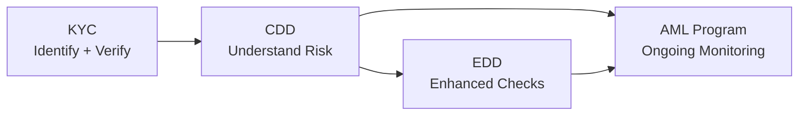
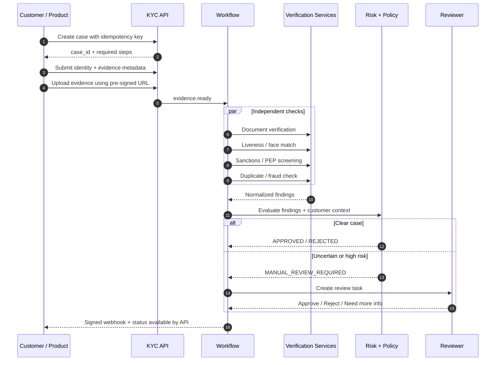
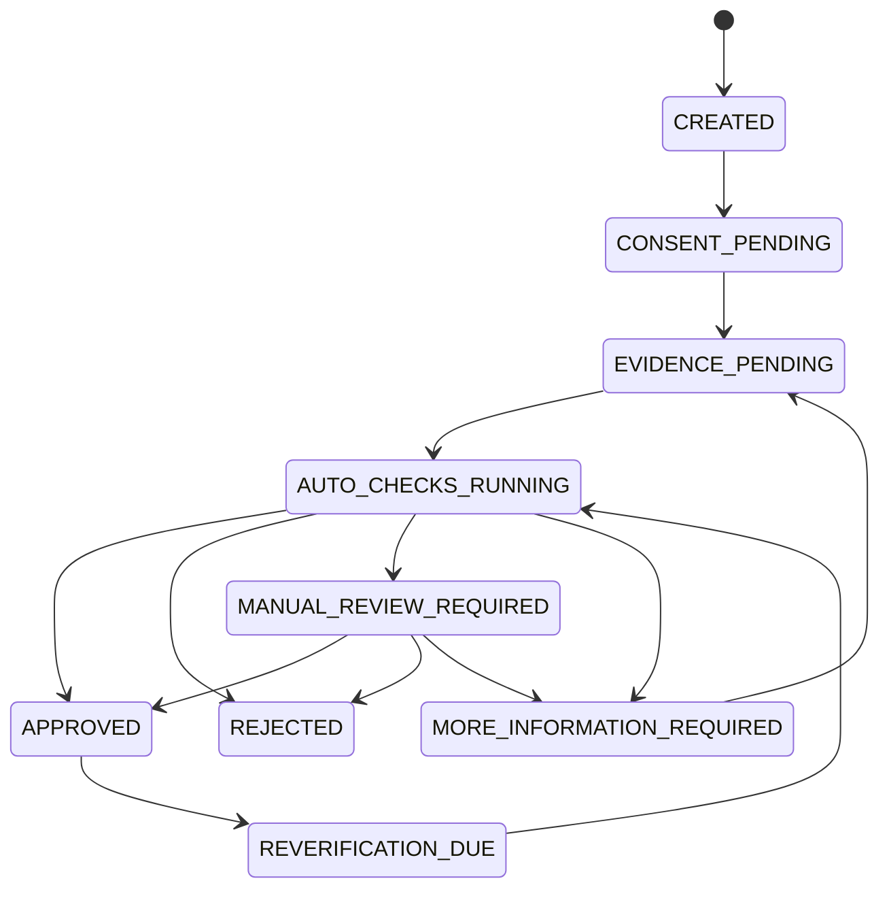
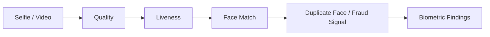
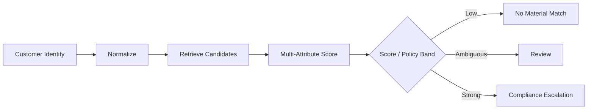
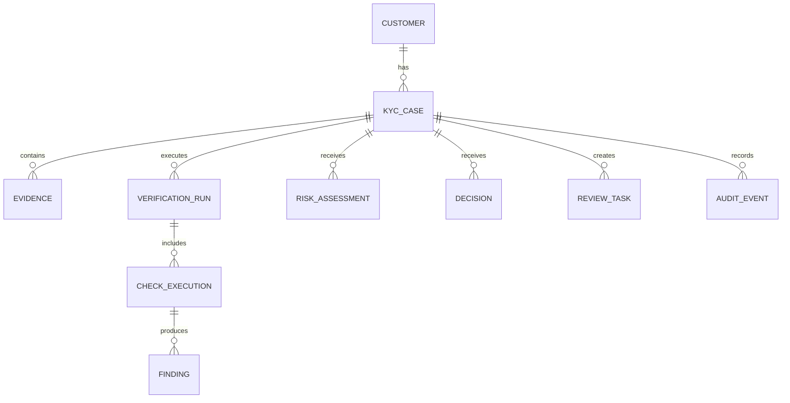
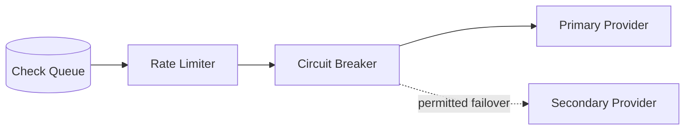

# Design a KYC Verification Pipeline

> Individual KYC onboarding, identity proofing, AML screening, risk-based decisioning, manual review, and re-KYC.

## In short

- Treat KYC as a **durable asynchronous workflow**, not one long HTTP request.
- Keep **evidence, findings, risk, and decisions separate** so every outcome is explainable and auditable.
- Run independent checks such as document verification, liveness, sanctions/PEP screening, and duplicate detection **in parallel**.
- Use **risk-based policy**: low-risk customers need fewer checks; high-risk or ambiguous cases require EDD or manual review.
- Put external providers behind **internal adapters** so policy is independent of vendor APIs.
- Make APIs, events, callbacks, and state transitions **idempotent** because retries and duplicate delivery are normal.
- Never turn a vendor outage into a customer rejection. Mandatory checks stay **pending and retryable**.
- Protect PII and biometric data with encryption, tokenization, least privilege, retention rules, and immutable audit logs.

```mermaid
flowchart LR
    C[Client / Product] --> API[API Gateway]
    C --> UP[Secure Upload]
    API --> CASE[Case Service]
    UP --> OBJ[(Encrypted Object Storage)]
    CASE --> WF[Workflow Orchestrator]
    OBJ -. evidence.ready .-> WF

    WF --> BUS[[Queue / Event Bus]]
    BUS --> DOC[Document Check]
    BUS --> BIO[Liveness / Face Match]
    BUS --> SCR[Sanctions / PEP]
    BUS --> FRAUD[Duplicate / Fraud]

    DOC --> AGG[Normalized Findings]
    BIO --> AGG
    SCR --> AGG
    FRAUD --> AGG

    AGG --> RISK[Risk + Policy Engine]
    RISK -->|Clear| AUTO[Automatic Decision]
    RISK -->|Uncertain / High Risk| REVIEW[Manual Review]
    REVIEW --> AUTO
    AUTO --> AUDIT[Audit + Signed Webhook]
```

---

# Index

1. Problem and Scope
2. KYC, CDD, EDD, and AML
3. Requirements
4. Core Design Principles
5. High-Level Architecture
6. End-to-End Flow
7. Workflow and State Model
8. Verification Pipelines
9. Risk and Decisioning
10. Data, APIs, and Events
11. Reliability, Security, and Scale
12. Re-KYC and Continuous Monitoring
13. Practical Implementation
14. Interview Summary

---

# 1. Problem and Scope

A KYC platform verifies that a customer is who they claim to be before a regulated product is activated. Typical products include banking, wallets, lending, brokerage, payments, remittance, insurance, crypto/virtual-asset services, and regulated marketplace payouts.

The platform should:

- collect customer identity data and consent/required notices;
- accept identity evidence such as document images or digital credentials;
- verify documents and trusted identity sources;
- perform selfie, face-match, and liveness checks when policy requires them;
- screen against sanctions, PEP, internal deny lists, and optionally adverse media;
- calculate customer risk;
- automatically decide clear cases and route uncertain cases to reviewers;
- preserve an audit trail; and
- support periodic or event-driven re-verification.

## 1.1 Core outcome

A case ends in a controlled business state such as:

```text
APPROVED
REJECTED
MANUAL_REVIEW_REQUIRED
MORE_INFORMATION_REQUIRED
EXPIRED
```

The decision should be explainable, for example:

```json
{
  "decision": "MANUAL_REVIEW_REQUIRED",
  "reason_codes": [
    "SANCTIONS_POSSIBLE_MATCH",
    "ADDRESS_MISMATCH"
  ],
  "policy_version": "kyc-individual-in-v12",
  "risk_tier": "HIGH"
}
```

The important point is that the system returns more than a boolean. It must be able to explain **what was checked, what was found, which policy ran, and why the final decision was produced**.

## 1.2 Scope

This design focuses on **individual KYC**.

The same architecture can extend to **KYB (Know Your Business)** by adding legal-entity registration checks, directors/signatories, beneficial ownership, ownership percentages, corporate structure, and business/source-of-funds verification.

---

# 2. KYC, CDD, EDD, and AML

These terms are related but have different scopes.

| Term | Main question | Typical responsibility |
|---|---|---|
| **KYC** | Who is this customer? | Identity collection and verification |
| **CDD** | What is the relationship and risk? | KYC + customer risk + expected relationship/activity |
| **EDD** | What extra checks does higher risk require? | Extra evidence, source of funds/wealth, stronger approval |
| **AML** | What controls continue during the relationship? | Screening, monitoring, investigation, re-KYC |



A useful interview distinction is:

> **KYC is identity proofing. CDD is broader customer-risk understanding. EDD increases the depth for higher-risk relationships. AML continues after onboarding.**

Current FATF guidance continues to emphasize a **risk-based and proportionate approach**, so the architecture should resolve required checks from policy instead of forcing every customer through the same workflow.

---

# 3. Requirements

## 3.1 Functional requirements

| Area | Requirement |
|---|---|
| Case intake | Create case, identify product/country/customer type |
| Consent | Record required notices/consent with version and timestamp |
| Evidence | Upload documents/selfies securely |
| Document verification | Quality, OCR/MRZ/barcode, authenticity, expiry, field matching |
| Biometrics | Selfie quality, liveness, face match when required |
| Screening | Sanctions, PEP, internal lists, optional adverse media |
| Fraud | Duplicate identity/device/velocity signals |
| Decision | Risk score + deterministic policy rules |
| Manual review | Queue uncertain/high-risk cases |
| Integration | Status API + signed webhooks/events |
| Lifecycle | Re-screening and periodic/event-driven re-KYC |

## 3.2 Non-functional requirements

- **Durability:** submitted evidence and final decisions must not be lost.
- **Security:** PII, identity documents, and biometrics require restricted handling.
- **Auditability:** every important automated or human action must be traceable.
- **Resilience:** external-provider failures must not corrupt the case.
- **Scalability:** uploads, OCR, screening, and reviewers scale differently.
- **Explainability:** store reason codes and versions, not only a score.
- **Configurability:** rules vary by jurisdiction, product, customer type, and risk tier.
- **Privacy:** collect only required data and enforce retention/deletion policy.

---

# 4. Core Design Principles

## 4.1 KYC is a workflow, not a request

A KYC case can wait for:

- a document upload;
- an external provider callback;
- a registry response;
- a reviewer;
- extra information from the customer; or
- a retry after an outage.

These waits may take seconds, hours, or days. Use a **durable workflow/state machine** instead of keeping a synchronous request open.

## 4.2 Separate evidence, findings, risk, and decision

```text
Evidence
  Passport image
  Selfie
  Customer-entered address

Findings
  Document valid
  Face-match score = 0.91
  Possible PEP match

Risk
  HIGH

Decision
  MANUAL_REVIEW_REQUIRED
```

This separation matters because the same evidence can produce a different decision when policy changes, while historical decisions still need to remain reproducible.

## 4.3 Use risk-based verification

Example:

```text
Low-risk domestic wallet
  ID + trusted-source check + sanctions/PEP

High-value international account
  ID + liveness + address proof + sanctions/PEP
  + source of funds + manual approval
```

Do not hardcode this into application branches. Keep it in versioned policy/configuration.

## 4.4 Automate certainty; review ambiguity

Machines are good at deterministic work such as expiry checks, quality checks, exact matches, and known rules.

Humans are still needed for ambiguous names, transliteration, conflicting evidence, damaged documents, complex EDD, and policy exceptions.

## 4.5 Isolate vendors

Business logic should depend on capabilities:

```python
verify_document(...)
perform_liveness(...)
screen_watchlists(...)
verify_identity_source(...)
```

Each provider adapter maps its own request/response format into one internal result model.

## 4.6 Every transition is idempotent

Retries are normal:

```text
At-least-once delivery
+ idempotent consumer
+ transactional state change
= one business effect
```

This is more realistic than claiming the infrastructure guarantees exactly-once delivery.

---

# 5. High-Level Architecture

## 5.1 Main components

| Component | Responsibility |
|---|---|
| API Gateway | Auth, WAF, rate limits, correlation IDs, request limits |
| Case Service | Case lifecycle and current status |
| Consent Service | Versioned proof of notice/consent |
| Secure Upload | Pre-signed upload flow and evidence metadata |
| Object Storage | Encrypted documents, selfies, video |
| Workflow Orchestrator | Long-running state, timers, retries, fan-out/fan-in |
| Verification Services | Document, biometric, screening, fraud checks |
| Provider Adapters | Normalize external-provider APIs |
| Risk/Policy Engine | Required checks, risk tier, decision rules |
| Review Service | Queue, assignment, reviewer decisions |
| Audit Service | Append-only action/state history |
| Webhook Service | Signed, retryable downstream notifications |

## 5.2 Control plane vs evidence-processing plane

A useful design split is:

```text
Control Plane
  Case state
  Workflow state
  Policy
  Decisions
  Manual review
  Audit

Evidence-Processing Plane
  Images / PDFs / video
  OCR
  Liveness / face match
  Watchlist matching
  External provider calls
```

This prevents large media processing from slowing down the case-management APIs and allows both planes to scale independently.

## 5.3 Storage choices

| Store | Holds |
|---|---|
| PostgreSQL | Cases, checks, findings, risk assessments, decisions |
| Object storage | Raw/processed identity evidence |
| Queue/event bus | Check requests and results |
| Search index | Reviewer search/read models |
| Redis/cache | Policy/watchlist metadata and non-authoritative cache |
| Immutable audit store | Tamper-resistant audit events |
| KMS/HSM + secrets manager | Data keys and provider credentials |

---

# 6. End-to-End Flow

## 6.1 Normal onboarding



## 6.2 Why parallel checks matter

If independent checks take:

```text
Document       2.0 s
Liveness       3.5 s
Screening      1.0 s
Duplicate      1.5 s
```

Sequential time is roughly `8.0 s`.

Parallel time is roughly `3.5 s + orchestration overhead`.

This is a common interview point: **fan out independent work and aggregate after all mandatory checks reach a terminal state**.

---

# 7. Workflow and State Model

## 7.1 Case states



## 7.2 Case status and check status are different

```text
Case: AUTO_CHECKS_RUNNING

Checks:
  document     SUCCEEDED
  liveness     RUNNING
  sanctions    RETRY_WAIT
  duplicate    SUCCEEDED
```

Do not represent this with one giant `status` field.

## 7.3 Optimistic concurrency

Manual review, callbacks, and workers may update the same case concurrently.

```sql
UPDATE kyc_case
SET status = 'APPROVED',
    version = version + 1
WHERE id = :case_id
  AND version = :expected_version;
```

If no row updates, reload the case and re-evaluate instead of overwriting another actor's change.

---

# 8. Verification Pipelines

## 8.1 Secure document pipeline


Important controls:

- use pre-signed direct-to-object-storage uploads;
- validate file signature/magic bytes, not only extension or MIME type;
- limit size, dimensions, pages, and decompression behavior;
- scan and safely decode/re-encode untrusted files;
- run document parsing in an isolated environment;
- prefer cryptographically verifiable MRZ/barcode/NFC/digital credentials over OCR when available;
- preserve evidence lineage for important extracted fields.

OWASP's file-upload guidance supports defense-in-depth here: allowlisted formats, signature/content validation, storage isolation, permission controls, and upload limits.

## 8.2 Biometric and liveness pipeline



Store enough metadata to reproduce the decision:

```json
{
  "similarity_score": 0.89,
  "threshold": 0.84,
  "result": "PASS",
  "model_version": "face-match-2026-03",
  "threshold_version": "india-standard-v5"
}
```

NIST SP 800-63 Revision 4 strengthened identity-proofing guidance around fraud resistance, forged media/deepfakes, and injection attacks. For system design, that means the capture channel itself is part of the trust boundary — not only the face-matching model.

## 8.3 Sanctions and PEP screening

A high-quality name screen should use more than full-name similarity.

Useful attributes include:

- aliases;
- date/year of birth;
- nationality/residence;
- document identifiers where legally usable;
- address;
- organization/relationships; and
- transliteration/script variants.



A PEP match is a **risk signal**, not proof of wrongdoing. The policy should decide which enhanced measures apply.

Always store the watchlist/source version used for the screening result.

---

# 9. Risk and Decisioning

## 9.1 Rules + scores, not scores alone

Use deterministic rules for hard requirements and a score/tier for combining softer signals.

```text
Hard rule
  Confirmed prohibited sanctions match -> compliance escalation

Recoverable rule
  Expired document -> request new evidence

Risk signals
  PEP + high-risk geography + high-value product -> HIGH

Policy
  HIGH -> EDD + senior/manual approval
```

## 9.2 Example risk factors

| Category | Example signals |
|---|---|
| Identity | Document confidence, trusted-source match, duplicate identity |
| Geography | Residence/nationality/product market |
| Screening | Sanctions, PEP, adverse media |
| Fraud | Device risk, velocity, replay/synthetic signals |
| Product | High-value payments, remittance, trading |
| Expected activity | Cross-border, volume, cash intensity |
| Source of funds | Salary, business income, investment, unknown |

## 9.3 Example policy

```yaml
policy_id: kyc-individual-in-standard
version: 12

required_checks:
  - identity_document
  - trusted_source_identity
  - sanctions
  - pep
  - duplicate_identity

conditional_checks:
  - when: "risk.preliminary >= 50"
    require:
      - proof_of_address
      - source_of_funds
      - liveness

decisions:
  - when: "findings.confirmed_prohibited_match == true"
    result: COMPLIANCE_ESCALATION

  - when: "checks.mandatory_all_passed && risk.final < 50"
    result: APPROVED

  - otherwise:
    result: MANUAL_REVIEW_REQUIRED
```

## 9.4 Version everything that influences a decision

A final decision should reference:

- policy version;
- risk-model version;
- thresholds;
- provider/model version;
- watchlist version;
- relevant evidence/profile version; and
- reviewer/checklist version for human decisions.

This is what makes the decision reproducible during audit.

---

# 10. Data, APIs, and Events

## 10.1 Core entities



The most important modeling choice is:

```text
Evidence != Finding != Risk != Decision
```

Final decisions should normally be append-only. A newer decision supersedes the previous one instead of rewriting history.

## 10.2 Minimal API surface

```http
POST /v1/kyc/cases
POST /v1/kyc/cases/{id}/consents
PUT  /v1/kyc/cases/{id}/identity
POST /v1/kyc/cases/{id}/evidence/upload-urls
POST /v1/kyc/cases/{id}/verification-runs
GET  /v1/kyc/cases/{id}
POST /v1/review-tasks/{id}/decisions
```

Mutation endpoints should support an `Idempotency-Key` when duplicate submission is possible.

## 10.3 Event shape

Common events:

```text
kyc.case.created
kyc.evidence.ready
kyc.check.requested
kyc.check.completed
kyc.check.failed
kyc.risk.calculated
kyc.review.requested
kyc.review.completed
kyc.case.approved
kyc.case.rejected
kyc.rescreen.requested
```

A useful envelope includes:

```json
{
  "event_id": "evt_01J4KT",
  "event_type": "kyc.check.completed",
  "event_version": 2,
  "correlation_id": "kyc_01J4KQX7X4B5",
  "causation_id": "cmd_7802",
  "occurred_at": "2026-08-20T08:14:12Z",
  "data": {
    "case_id": "kyc_01J4KQX7X4B5",
    "check_id": "chk_9102",
    "check_type": "IDENTITY_DOCUMENT",
    "status": "SUCCEEDED"
  }
}
```

Partition/order events by `case_id`, not globally.

---

# 11. Reliability, Security, and Scale

## 11.1 Outbox + inbox

For reliable event-driven processing:

```text
Database transaction
  1. Apply business state change
  2. Write outgoing event to outbox
COMMIT

Publisher
  3. Publish outbox event

Consumer transaction
  4. Insert event_id in inbox
  5. If duplicate -> stop
  6. Apply business change
COMMIT
```

This protects against the classic failure:

```text
DB committed, but event was never published
```

## 11.2 Retry classification

| Retryable | Usually non-retryable |
|---|---|
| Timeout | Unsupported document |
| Connection reset | Invalid schema/input |
| HTTP 429 | Expired document |
| Vendor 5xx | Missing mandatory consent |
| Temporary registry outage | Definite policy violation |

Use exponential backoff with jitter and vendor-specific concurrency/rate limits.

## 11.3 Vendor outage behavior



If a **mandatory** control is unavailable, keep the case pending. Do not silently skip it and do not reject the customer for an infrastructure problem.

## 11.4 Security controls

Key controls:

- TLS everywhere; mTLS for sensitive service/provider links when justified;
- envelope encryption using KMS/HSM;
- dedicated protection for biometric data;
- tokenized document numbers in operational systems;
- RBAC + attributes for reviewer jurisdiction/product/risk access;
- step-up authentication for evidence download/export and high-risk approval;
- PII-safe structured logs;
- append-only/tamper-resistant audit history;
- private object-storage access and short-lived pre-signed URLs;
- separate production and lower-environment identity data.

Never put raw documents, selfies, document numbers, biometric embeddings, tokens, or unrestricted provider payloads into normal logs/events.

## 11.5 Scale the real bottlenecks

KYC does not usually fail because the case API cannot handle traffic. The real bottlenecks are:

- image/video ingestion;
- provider quotas and latency;
- OCR/biometric compute;
- watchlist candidate matching;
- reviewer capacity;
- evidence-storage cost; and
- re-screening the existing customer base after list updates.

Scale worker pools by **queue depth and task type**, not only CPU.

Reviewer capacity cannot be autoscaled like compute, so **automatic decision rate** is an architectural metric.

---

# 12. Re-KYC and Continuous Monitoring

KYC does not stop after onboarding.

## 12.1 Re-KYC triggers

```text
Time based
  Periodic policy interval
  Document expiry

Event based
  Name/address change
  Product upgrade
  New sanctions/PEP candidate
  Significant risk change
  Suspicious-activity signal
  Ownership change for KYB
```

## 12.2 Refresh only what changed

Do not repeat the entire onboarding flow when only one control needs refreshing.

Examples:

- new watchlist version -> re-screen identity;
- expired ID -> request new document and re-run affected checks;
- address change -> verify address based on policy;
- risk escalation -> request source-of-funds evidence and EDD review.

This reduces customer friction and processing cost.

For India-specific implementations, keep permitted identity methods, periodic-update rules, and regulated-entity requirements in configuration. RBI's Master Direction on KYC has been amended repeatedly, so those rules should not be scattered through application code.

---

# 13. Practical Implementation

## 13.1 Recommended build order

| Phase | Scope |
|---|---|
| **1. Core** | Case API, consent, secure upload, document check, sanctions/PEP, basic policy, review queue, audit, webhook |
| **2. Reliability** | Durable workflow, inbox/outbox, retries, circuit breakers, DLQ replay, dashboards |
| **3. Fraud/coverage** | Liveness, face match, duplicate identity, device/velocity signals, secondary providers, EDD |
| **4. Lifecycle** | Continuous screening, re-KYC, policy simulation, model monitoring |

Start with clear module boundaries. You do **not** need many microservices on day one.

## 13.2 Practical technology choices

| Concern | Common choices |
|---|---|
| API | FastAPI, Django REST Framework, Spring Boot, NestJS |
| Workflow | Temporal, AWS Step Functions, Camunda, Durable Functions |
| Database | PostgreSQL |
| Queue/Event bus | Kafka, SQS/SNS, Pub/Sub, RabbitMQ |
| Object storage | S3, GCS, Azure Blob |
| Cache | Redis |
| Reviewer search | OpenSearch / Elasticsearch |
| Observability | OpenTelemetry + Prometheus/Grafana or cloud-native stack |
| Secrets/keys | Cloud Secrets Manager + KMS/HSM |

## 13.3 One practical example

Assume a customer opens a payment account in India.

```text
1. Product creates KYC case using an idempotency key.
2. Policy resolves required checks for country=IN, product=PAYMENTS_ACCOUNT.
3. Customer accepts the current identity-verification notice.
4. Client receives pre-signed URLs and uploads ID + selfie directly to object storage.
5. evidence.ready starts the workflow.
6. Document, liveness, sanctions/PEP, and duplicate checks run in parallel.
7. Each provider response is normalized into findings.
8. Risk engine combines findings with product/geography/customer context.
9. Policy decides:
     - clear + low/medium risk -> APPROVED
     - recoverable evidence issue -> MORE_INFORMATION_REQUIRED
     - ambiguous/high risk -> MANUAL_REVIEW_REQUIRED
     - confirmed prohibited condition -> compliance escalation/rejection per policy
10. Final decision, versions, actor, and reason codes are written to audit history.
11. Upstream product receives a signed webhook and can fetch current case status.
12. Future list or profile changes can trigger selective re-screening/re-KYC.
```

---

# 14. Interview Summary

A clean way to explain the design is:

> **“I model KYC as a durable workflow. The API creates a case synchronously, but verification runs asynchronously. Evidence goes directly to encrypted object storage, and the workflow fans out document, biometric, screening, and fraud checks in parallel. Provider responses are normalized into findings, then a versioned risk and policy engine either makes a clear automated decision or opens a manual-review task. Every API/event/callback is idempotent, mandatory-control outages keep the case pending, and every decision references the evidence, findings, policy, model, threshold, and watchlist versions used. I keep vendors behind adapters and protect PII/biometrics with strict access, encryption, retention, and audit controls.”**

The most important design invariants are:

1. **No approval without all mandatory checks required by the active policy.**
2. **Duplicate requests/events produce one business effect.**
3. **Evidence, findings, risk, and decision remain separate and traceable.**
4. **A mandatory provider outage means pending/retry, not customer rejection or silent bypass.**
5. **Human overrides are authorized, structured, and auditable.**
6. **Raw PII and biometric data do not leak into logs or general events.**
7. **Re-screening and re-KYC are part of the initial data model, not an afterthought.**

---

# Current Reference Points

Verified for this revision against authoritative guidance available by August 2026:

- **FATF Recommendations and 2025 risk-based updates:** reinforce proportionate, risk-based customer due diligence rather than identical controls for every customer.
- **NIST SP 800-63-4 / SP 800-63A-4:** final Revision 4 digital identity and identity-proofing guidance, including stronger attention to fraud, forged media/deepfakes, and injection attacks.
- **RBI Master Direction – Know Your Customer (KYC) Direction, 2016:** amended over time, including 2025 updates; India-specific identity methods, periodic KYC, and regulated-entity obligations should therefore remain policy/configuration driven.
- **OWASP File Upload Cheat Sheet:** supports layered validation, signature/content checks, upload limits, safe storage, and permission controls for attacker-controlled files.

> Regulatory requirements vary by jurisdiction, regulated-entity type, product, and date. Architecture should make those differences configurable rather than embedding legal rules directly in service code.
