# Design a KYC Verification Pipeline

> **Category:** System Design  
> **Level:** Intermediate backend developer (3+ years)  
> **Document type:** Interview-preparation guide  
> **Last standards check:** 3 August 2026  
> **Scope:** Individual KYC onboarding, AML screening, manual review, periodic refresh, and extensibility for business KYC

---

## Index

1. [Problem Statement](#1-problem-statement)
2. [KYC, CDD, EDD, and AML](#2-kyc-cdd-edd-and-aml)
3. [Requirements](#3-requirements)
4. [Design Principles](#4-design-principles)
5. [High-Level Architecture](#5-high-level-architecture)
6. [End-to-End Verification Flow](#6-end-to-end-verification-flow)
7. [Workflow State Machine](#7-workflow-state-machine)
8. [Core Components](#8-core-components)
9. [Document Verification Pipeline](#9-document-verification-pipeline)
10. [Biometric and Liveness Verification](#10-biometric-and-liveness-verification)
11. [Sanctions, PEP, and Adverse-Media Screening](#11-sanctions-pep-and-adverse-media-screening)
12. [Risk Scoring and Decisioning](#12-risk-scoring-and-decisioning)
13. [Manual Review](#13-manual-review)
14. [API Design](#14-api-design)
15. [Events and Message Contracts](#15-events-and-message-contracts)
16. [Data Model](#16-data-model)
17. [Idempotency, Retries, and Exactly-Once Business Effects](#17-idempotency-retries-and-exactly-once-business-effects)
18. [Security, Privacy, and Compliance](#18-security-privacy-and-compliance)
19. [Scalability and Capacity Planning](#19-scalability-and-capacity-planning)
20. [Reliability and Failure Handling](#20-reliability-and-failure-handling)
21. [Observability and Auditability](#21-observability-and-auditability)
22. [Re-KYC and Continuous Monitoring](#22-re-kyc-and-continuous-monitoring)
23. [Vendor Integration Strategy](#23-vendor-integration-strategy)
24. [Deployment Model](#24-deployment-model)
25. [Important Trade-offs](#25-important-trade-offs)
26. [Practical Implementation Plan](#26-practical-implementation-plan)
27. [How to Explain This Design in an Interview](#27-how-to-explain-this-design-in-an-interview)
28. [Key Takeaways](#28-key-takeaways)
29. [Official References](#29-official-references)

---

# 1. Problem Statement

Design a system that verifies whether a customer is who they claim to be before allowing access to a regulated product such as:

- A bank or wallet account
- A brokerage account
- A lending product
- An insurance policy
- A payment or remittance platform
- A cryptocurrency or virtual-asset service
- A marketplace with regulated payouts

The platform must collect identity evidence, verify documents and biometrics, screen the customer against risk lists, calculate risk, route uncertain cases to human reviewers, and preserve a defensible audit trail.

A KYC system is not only an upload form. It is a long-running, security-sensitive workflow with external dependencies, policy decisions, manual operations, and periodic re-verification.

---

## 1.1 Core outcome

For every verification case, the system should produce a decision such as:

```text
APPROVED
REJECTED
MANUAL_REVIEW_REQUIRED
MORE_INFORMATION_REQUIRED
EXPIRED
```

The decision must be explainable:

```json
{
  "decision": "MANUAL_REVIEW_REQUIRED",
  "reason_codes": [
    "SANCTIONS_POSSIBLE_MATCH",
    "DOCUMENT_ADDRESS_MISMATCH"
  ],
  "policy_version": "kyc-individual-in-v12",
  "decided_at": "2026-08-03T06:20:00Z"
}
```

---

## 1.2 Design scope

This document focuses primarily on **individual KYC**.

The architecture can later support **KYB**, where the system must additionally verify:

- Legal entity registration
- Directors and authorized signatories
- Ultimate beneficial owners
- Ownership percentages
- Corporate structure
- Business activity and source of funds

---

# 2. KYC, CDD, EDD, and AML

These terms are related but not identical.

## 2.1 KYC

**Know Your Customer** is the process of identifying and verifying a customer.

Typical checks:

- Name, date of birth, and address
- Identity-document validation
- Selfie and liveness verification
- Government or trusted-source verification
- Duplicate identity detection

## 2.2 CDD

**Customer Due Diligence** is broader than document verification.

It generally includes:

- Identifying the customer
- Verifying the customer's identity
- Understanding the relationship's purpose
- Identifying beneficial owners when applicable
- Assessing customer risk
- Monitoring the relationship over time

## 2.3 EDD

**Enhanced Due Diligence** applies when risk is higher.

Possible EDD actions:

- Additional identity evidence
- Proof of address
- Source-of-funds evidence
- Source-of-wealth evidence
- Senior compliance approval
- More frequent review
- Tighter transaction limits

## 2.4 AML

**Anti-Money Laundering** controls extend beyond onboarding.

They commonly include:

- Sanctions screening
- PEP screening
- Adverse-media screening
- Transaction monitoring
- Suspicious-activity investigation and reporting
- Ongoing customer-risk review

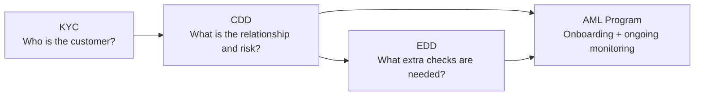

---

# 3. Requirements

## 3.1 Functional requirements

The system should:

1. Create a KYC verification case.
2. Capture consent and required disclosures.
3. Collect customer identity information.
4. Accept document images or trusted digital credentials.
5. Extract document fields using OCR or barcode/QR parsing.
6. Validate document authenticity and expiry.
7. Verify identity details using trusted data sources.
8. perform selfie, face-match, and liveness checks when required.
9. Screen against sanctions, PEP, internal blocklists, and optionally adverse media.
10. Detect duplicate or synthetic identities.
11. Calculate customer risk.
12. Make an automatic decision where policy permits.
13. Route uncertain or high-risk cases to manual review.
14. Request additional evidence from the customer.
15. Notify upstream applications of status changes.
16. Maintain immutable audit history.
17. Re-screen customers when watchlists change.
18. Trigger periodic or event-driven re-KYC.
19. Support multiple countries, products, and policy versions.
20. Support multiple verification vendors.

## 3.2 Non-functional requirements

| Area | Requirement |
|---|---|
| Availability | Core orchestration should target at least 99.9%; degraded vendor dependencies must not corrupt cases |
| Durability | Submitted evidence and decisions must not be lost |
| Security | Strong protection for PII, identity documents, biometrics, secrets, and reviewer actions |
| Auditability | Every important input, automated action, override, and decision must be traceable |
| Scalability | Handle onboarding bursts without overloading external vendors |
| Latency | Fast path in seconds; slow checks and review may be asynchronous |
| Explainability | Store reason codes and policy versions, not only a numeric score |
| Configurability | Rules vary by country, customer type, product, and risk tier |
| Privacy | Collect the minimum data needed and enforce retention/deletion policies |
| Resilience | Retry transient failures safely and isolate vendor outages |
| Extensibility | Add new checks or providers without rewriting the full workflow |

---

# 4. Design Principles

## 4.1 Treat KYC as a workflow

A KYC case can remain active for minutes, hours, or days. It may wait for:

- A vendor response
- A customer upload
- A reviewer decision
- A compliance approval
- A retry after an outage

Therefore, use a durable workflow or state machine instead of keeping a synchronous HTTP request open.

## 4.2 Separate evidence, findings, risk, and decision

These concepts should not be stored as one large status field.

```text
Evidence:
  Passport image, selfie, customer-entered address

Finding:
  Passport signature valid
  Selfie face-match score = 0.91
  Possible PEP match

Risk:
  HIGH because of possible PEP match and high-risk geography

Decision:
  MANUAL_REVIEW_REQUIRED
```

This separation improves explainability and lets policies change without rewriting historical evidence.

## 4.3 Use risk-based verification

Not every user requires the same checks.

Example:

```text
Low-risk domestic wallet:
  Government ID + database check

High-value international account:
  Government ID + liveness + address proof + sanctions/PEP +
  source of funds + manual approval
```

## 4.4 Automate clear cases, review uncertain cases

Automatic systems are effective at:

- Exact or strong identity matches
- Expired-document detection
- Image-quality checks
- Clear sanctions non-matches
- Deterministic policy rules

Humans are still useful for:

- Ambiguous name matches
- Transliteration differences
- Damaged documents
- Complex ownership structures
- Inconsistent evidence
- EDD judgment

## 4.5 Keep vendors behind internal interfaces

Business logic should call an internal capability such as:

```text
verify_document()
screen_watchlists()
perform_liveness()
```

It should not directly depend on one vendor's response model.

## 4.6 Make every transition idempotent

Messages may be delivered more than once. Vendor callbacks may be retried. Users may resubmit requests.

The same event must not create duplicate cases, duplicate charges, or conflicting decisions.

---

# 5. High-Level Architecture

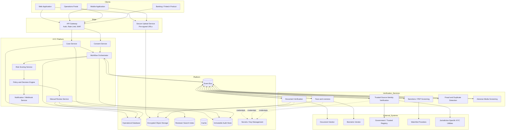

---

## 5.1 Important architectural split

Use two paths:

### Control plane

Responsible for:

- Case state
- Workflow progression
- Policy evaluation
- Human decisions
- Audit records

### Evidence-processing plane

Responsible for:

- Images
- PDFs
- Video
- OCR
- Face embeddings
- Vendor calls
- Screening datasets

This split prevents heavy media processing from slowing down case-management APIs.

---

## 5.2 Trust boundaries

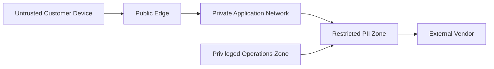

Key controls:

- Never trust uploaded file type or client-side validation.
- Scan and decode documents in an isolated processing environment.
- Restrict reviewer access using least privilege.
- Send only required fields to each vendor.
- Record data sent to and received from vendors.
- Do not expose storage object paths directly.

---

# 6. End-to-End Verification Flow

## 6.1 Normal onboarding flow

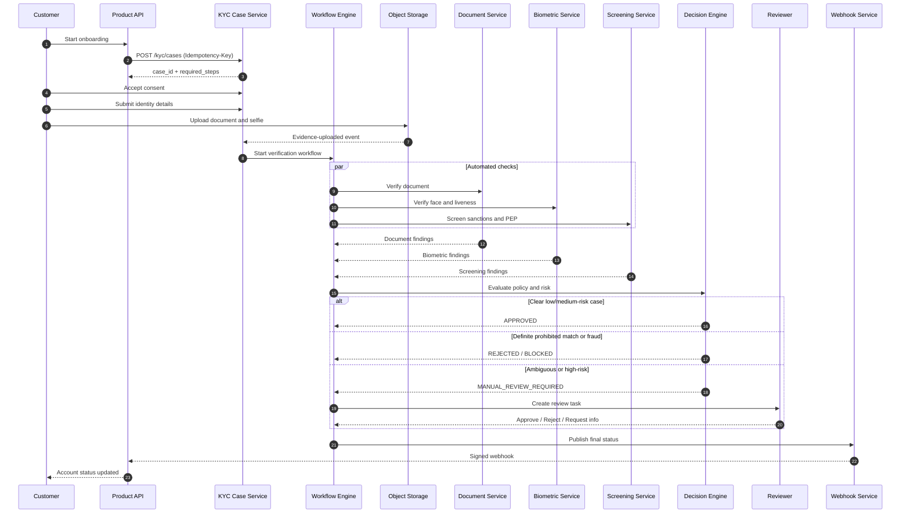

---

## 6.2 Why parallel checks matter

After required evidence is available, independent checks can run in parallel:

```text
Document verification ─┐
Liveness and face match ├─> Aggregate findings -> Risk -> Decision
Watchlist screening ────┤
Duplicate detection ────┘
```

If these checks take 2.0 s, 3.5 s, 1.0 s, and 1.5 s:

- Sequential latency: approximately 8.0 s
- Parallel latency: approximately 3.5 s plus orchestration overhead

---

## 6.3 Fast path and slow path

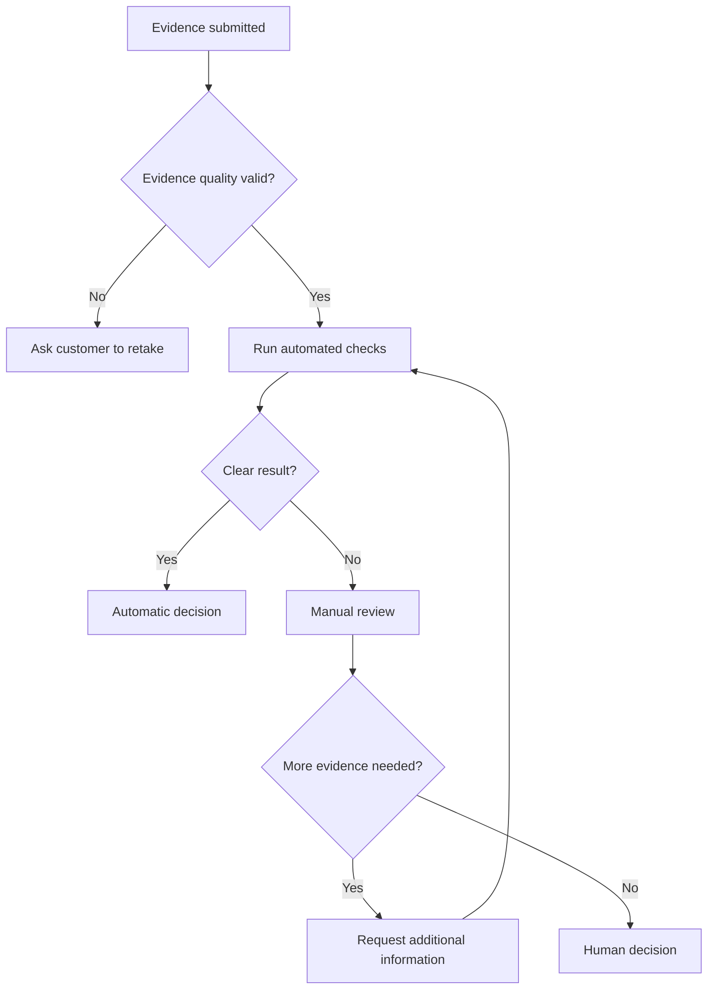

The fast path should cover the majority of normal customers. The slow path should be safe, explainable, and operationally manageable.

---

# 7. Workflow State Machine

## 7.1 Recommended states

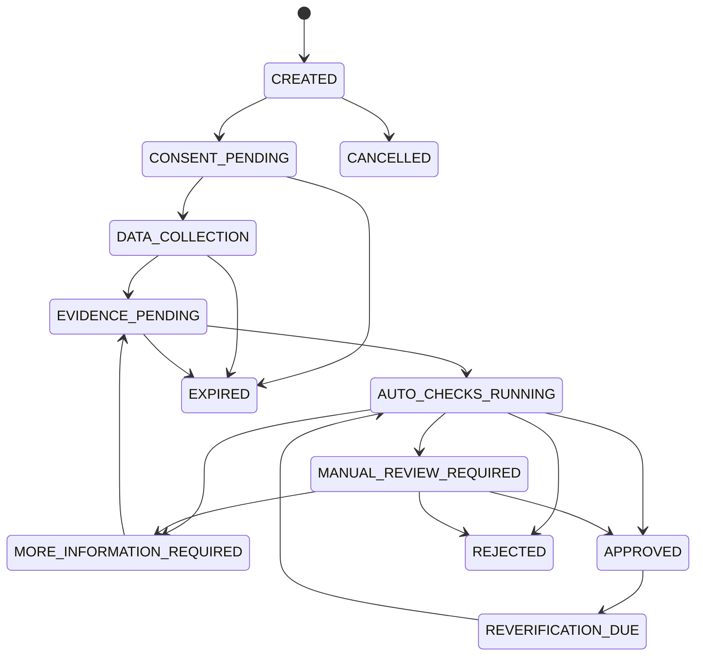

## 7.2 Separate case status from check status

A case can have many check executions.

```text
Case status:
  AUTO_CHECKS_RUNNING

Check statuses:
  document_check = SUCCEEDED
  liveness_check = RUNNING
  sanctions_screening = RETRY_WAIT
  duplicate_detection = SUCCEEDED
```

## 7.3 Transition rules

Each transition should validate:

- Current state
- Expected workflow version
- Actor authorization
- Required findings
- Policy version
- Idempotency key
- Transition reason

Example:

```text
MANUAL_REVIEW_REQUIRED -> APPROVED

Allowed only when:
- Reviewer has KYC_APPROVER permission
- Required review checklist is complete
- No unresolved hard-block finding exists
- Four-eyes approval is complete when policy requires it
```

## 7.4 Optimistic concurrency

Store a version on the case:

```sql
UPDATE kyc_case
SET status = 'APPROVED',
    version = version + 1
WHERE id = :case_id
  AND version = :expected_version;
```

If no row is updated, another process changed the case. Reload and re-evaluate instead of overwriting it.

---

# 8. Core Components

## 8.1 API Gateway

Responsibilities:

- Authentication and authorization
- Tenant isolation
- WAF rules
- Rate limiting
- Request-size limits
- Idempotency-header enforcement
- Request correlation IDs
- PII-safe access logging

Avoid logging full request bodies because KYC payloads contain highly sensitive information.

## 8.2 Case Service

The Case Service owns:

- Case creation
- Customer and product references
- Current status
- Required steps
- Case expiration
- Public status API
- Links between evidence, checks, findings, and decisions

It should not contain every verification algorithm.

## 8.3 Consent Service

Store:

- Consent type
- Version of legal text
- Language
- Timestamp
- Collection channel
- User agent/device context where permitted
- Withdrawal status
- Evidence of affirmative action

Do not use one generic boolean such as `consent = true`.

## 8.4 Secure Upload Service

Recommended upload pattern:

1. Client asks for a short-lived pre-signed upload URL.
2. Server validates allowed evidence type and expected size.
3. Client uploads directly to object storage.
4. Storage event triggers malware scanning and format validation.
5. Clean evidence receives an immutable evidence ID.
6. Workflow receives an `evidence.ready` event.

Benefits:

- Application servers do not proxy large files.
- Uploads can scale independently.
- Object storage provides durability.
- Processing starts asynchronously.

## 8.5 Workflow Orchestrator

The orchestrator should:

- Start required checks
- Wait for asynchronous results
- Apply timeouts
- Retry transient failures
- Handle compensating actions
- Pause for manual review
- Resume after additional evidence
- Persist workflow progress

Suitable approaches:

- A workflow engine such as Temporal, AWS Step Functions, Azure Durable Functions, or Camunda
- A carefully implemented database-backed state machine
- Event-driven orchestration using Kafka/SQS plus a durable workflow store

For complex KYC, a durable workflow engine usually reduces custom retry and timer logic.

## 8.6 Verification adapters

Each vendor adapter should map an internal request to a provider-specific request.

```python
class DocumentVerifier:
    async def verify(
        self,
        evidence_id: str,
        document_type: str,
        country: str,
    ) -> "DocumentVerificationResult":
        ...
```

Internal output:

```json
{
  "provider": "provider_a",
  "provider_reference": "vr_83bd",
  "status": "COMPLETED",
  "document": {
    "type": "PASSPORT",
    "country": "IN",
    "number_token": "tok_doc_8f21",
    "expiry_date": "2031-04-18"
  },
  "checks": [
    {
      "code": "DOCUMENT_NOT_EXPIRED",
      "result": "PASS"
    },
    {
      "code": "TEMPLATE_AUTHENTICITY",
      "result": "PASS",
      "confidence": 0.97
    }
  ],
  "raw_response_location": "restricted://vendor-responses/..."
}
```

The decision engine should consume normalized findings, not raw vendor JSON.

## 8.7 Policy and decision engine

The policy engine decides:

- Which checks are required
- Whether a failed check is a hard block
- Whether EDD is needed
- Whether manual review is required
- Whether automatic approval is allowed
- When re-KYC is due

Policies must be versioned and testable.

## 8.8 Notification and webhook service

It should:

- Send signed status callbacks
- Retry safely
- Preserve delivery history
- Avoid including unnecessary PII
- Support event ordering
- Allow consumers to fetch full case status after receiving a lightweight event

---

# 9. Document Verification Pipeline

## 9.1 Processing stages


## 9.2 File safety

Before OCR:

- Validate magic bytes, not only extension.
- Limit image dimensions, file size, and page count.
- Reject decompression bombs.
- Re-encode images into a safe canonical format.
- Strip unsafe metadata where appropriate.
- Scan for malware.
- Process untrusted files in a sandbox with restricted network access.

## 9.3 Quality checks

Typical checks:

- Blur
- Glare
- Cropping
- Low resolution
- Document too small
- Unsupported orientation
- Covered fields
- Screenshot or photocopy detection
- Front/back mismatch

Fail quality checks early so the customer can retake the image before expensive verification calls.

## 9.4 Classification

The system identifies:

- Document type
- Issuing country
- Document side
- Template/version

Example:

```json
{
  "document_type": "DRIVING_LICENCE",
  "issuing_country": "IN",
  "side": "FRONT",
  "confidence": 0.96
}
```

Low-confidence classification should request a customer selection or route to review.

## 9.5 Field extraction

Possible extraction sources:

- OCR
- Machine-readable zone
- PDF417 barcode
- Secure QR code
- NFC chip
- Digitally signed XML
- Trusted digital credential

Prefer cryptographically verifiable data over OCR where supported.

## 9.6 Authenticity checks

Possible signals:

- Template consistency
- Hologram or security-feature analysis
- Font and layout consistency
- MRZ checksum
- Barcode-to-visible-field consistency
- Digital-signature verification
- NFC chip authenticity
- Image manipulation detection
- Document-number format
- Issuer database verification

No single signal should be treated as perfect.

## 9.7 Data matching

Compare extracted data with customer-entered data.

```text
Entered name:    RAHULKUMAR PATEL
Document name:  RAHUL KUMAR PATEL
```

Use normalization:

- Unicode normalization
- Case folding
- Whitespace normalization
- Punctuation removal
- Transliteration where permitted
- Token order handling
- Common-name aliases
- Locale-aware date formats

Do not rely only on edit distance. Combine multiple attributes:

```text
Name match        0.91
Date of birth     exact
Document number   exact
Nationality       exact
Address           partial
```

## 9.8 Trusted-source verification

Where legally and technically available, verify selected attributes against:

- Government identity service
- Tax-identity service
- Trusted digital-document provider
- Credit bureau
- Central KYC registry
- Mobile-network identity service
- Bank-account ownership verification

For India, integrations may include permitted flows around Aadhaar offline verification, PAN verification, DigiLocker, CKYCR, or video-based customer identification. The exact allowed process depends on the regulated entity, product, purpose, consent, and current law.

## 9.9 Evidence lineage

For each extracted field, preserve where it came from:

```json
{
  "field": "date_of_birth",
  "value": "1992-11-04",
  "source": {
    "evidence_id": "ev_123",
    "page": 1,
    "region": [410, 220, 890, 290],
    "method": "MRZ",
    "confidence": 1.0
  }
}
```

This is valuable during review and audit.

---

# 10. Biometric and Liveness Verification

## 10.1 Typical flow

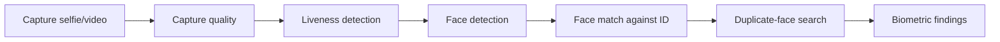

## 10.2 Liveness

Liveness tries to determine whether the capture comes from a live person rather than:

- A printed photo
- A screen replay
- A recorded video
- A mask
- A synthetic or manipulated face

Approaches:

### Passive liveness

The user simply takes a selfie or short video.

Advantages:

- Better user experience
- Faster completion
- Lower abandonment

### Active liveness

The user performs an action such as turning their head or following an on-screen challenge.

Advantages:

- More signals against simple replay attacks

Trade-off:

- More friction
- Accessibility concerns
- Harder completion on poor devices or networks

## 10.3 Face matching

The system compares the live capture with the face on identity evidence.

Store:

- Vendor/model version
- Similarity score
- Threshold version
- Image-quality score
- Decision
- Reason codes

Example:

```json
{
  "similarity_score": 0.89,
  "threshold": 0.84,
  "result": "PASS",
  "model_version": "face-match-2026-03"
}
```

Thresholds must be calibrated using representative data. A global threshold may behave differently across document quality, device type, age, or population.

## 10.4 Biometric privacy

Biometric data is highly sensitive.

Recommended controls:

- Avoid retaining raw biometric data longer than required.
- Separate biometric storage from ordinary application data.
- Encrypt with dedicated keys.
- Restrict access to a very small set of services.
- Do not expose embeddings to reviewers.
- Prevent embeddings from being used for unrelated purposes.
- Record model version and evaluation outcome.
- Support jurisdiction-specific deletion and consent rules.

---

# 11. Sanctions, PEP, and Adverse-Media Screening

## 11.1 Screening types

### Sanctions

Checks whether a person or entity may be subject to legal restrictions.

### PEP

Checks whether a person is or is associated with a politically exposed person. A PEP match usually requires risk-based due diligence; it should not automatically be treated as proof of wrongdoing.

### Adverse media

Searches credible sources for risk-relevant information such as fraud, corruption, organized crime, terrorist financing, or serious financial misconduct.

### Internal lists

Examples:

- Previously confirmed fraudsters
- Closed accounts
- Device or identity deny lists
- Law-enforcement requests
- Previous rejected cases

## 11.2 Name-screening flow

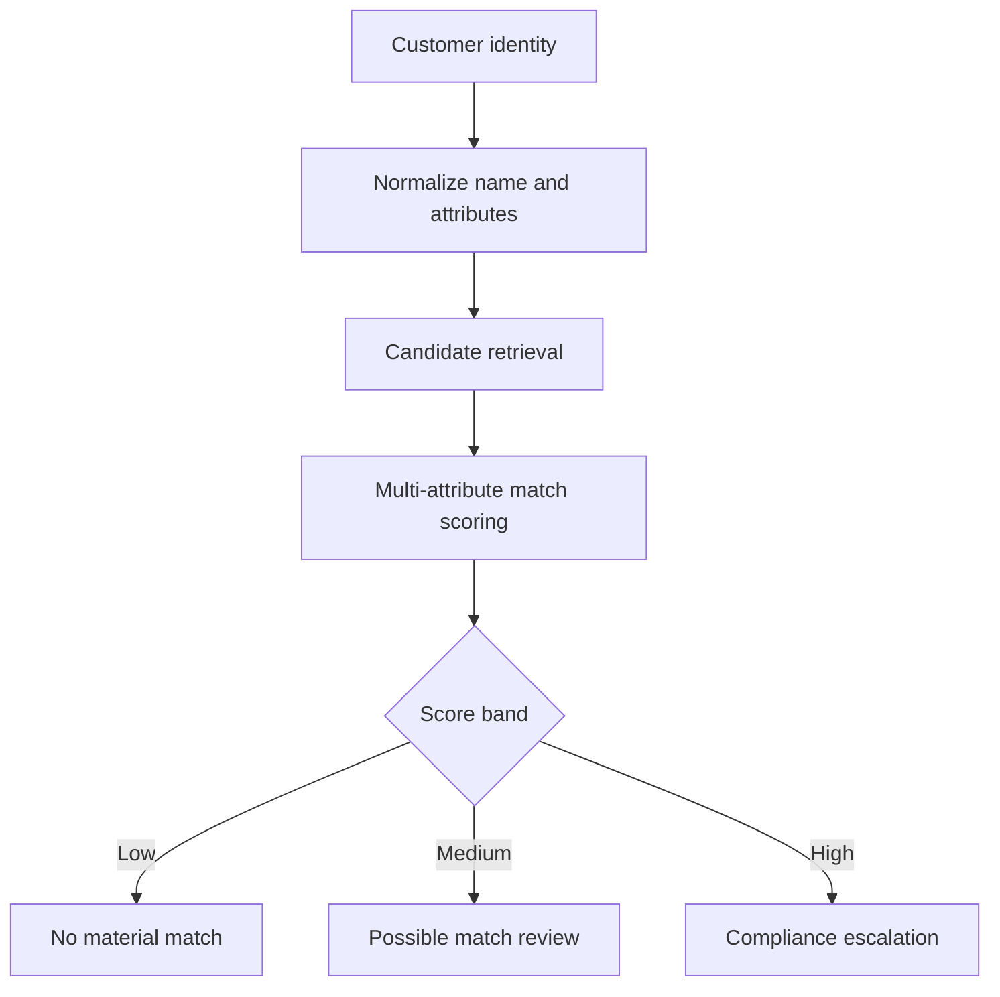

## 11.3 Candidate matching

Do not compare only the full name.

Use available attributes:

- Full name and aliases
- Date or year of birth
- Nationality
- Country of residence
- Gender where lawfully used
- Passport or national ID number
- Address
- Organization
- Associates and relationships

Example:

```text
Customer:
  Name:    Ahmed Hassan
  DOB:     1991-03-10
  Country: AE

Watchlist record:
  Name:    Ahmad Hasan
  DOB:     1964
  Country: SY

Name similarity is high, but DOB and country strongly disagree.
Result: likely false positive.
```

## 11.4 Screening result model

```json
{
  "screening_id": "scr_8201",
  "list_version": "un-consolidated-2026-05-21",
  "screened_at": "2026-08-03T06:15:00Z",
  "result": "POSSIBLE_MATCH",
  "candidates": [
    {
      "source_record_id": "QDi.123",
      "name_score": 0.93,
      "dob_match": "MISMATCH",
      "nationality_match": "UNKNOWN",
      "overall_score": 0.58
    }
  ]
}
```

## 11.5 List freshness

Store:

- Dataset source
- Dataset version
- Download time
- Effective time
- Hash/checksum
- Parser version

A screening result is incomplete without identifying which list version was used.

## 11.6 Re-screening on list updates

When a list changes:

1. Ingest the new list.
2. Calculate changed or new records.
3. Identify customers potentially affected.
4. Re-screen them.
5. Create alerts for material new matches.
6. Preserve previous and new results.
7. Apply product restrictions according to policy.

Avoid re-screening every customer against every record if incremental matching is possible.

---

# 12. Risk Scoring and Decisioning

## 12.1 Risk factors

Possible customer-risk inputs:

| Category | Examples |
|---|---|
| Identity | Document confidence, identity-source match, duplicate identity |
| Geography | Residence, nationality, product market, restricted jurisdictions |
| Customer type | Individual, sole proprietor, legal entity, nonprofit |
| Product | Wallet, remittance, lending, trading, high-value payments |
| Channel | Remote, assisted, branch, partner |
| Screening | Sanctions, PEP, adverse media |
| Fraud | Device risk, velocity, synthetic identity, replay indicators |
| Expected activity | Transaction volume, cross-border use, cash intensity |
| Source of funds | Salary, business income, investment, unknown |
| Historical behavior | Previous cases, suspicious activity, linked identities |

## 12.2 Use rules and scores together

A score alone is insufficient.

```text
Hard rule:
  Confirmed sanctions match -> block/escalate regardless of total score

Rule:
  Expired document -> ask for new document

Score:
  PEP + high-risk geography + high-value product -> high risk

Policy:
  High risk -> EDD + senior approval
```

## 12.3 Example scoring model

```text
Base score                                  0

Possible PEP match                        +35
High-risk jurisdiction                    +25
Document confidence below 0.80            +20
Address mismatch                          +10
New device with high fraud signal         +15
Trusted bank-account ownership match      -10
Strong digital credential                 -10
```

Risk bands:

```text
0–19    LOW
20–49   MEDIUM
50–79   HIGH
80+     VERY_HIGH
```

This is an illustration, not a regulatory formula.

## 12.4 Decision matrix

| Conditions | Decision |
|---|---|
| All mandatory checks pass; low/medium risk; no alerts | Approve |
| Recoverable evidence issue | Request more information |
| Ambiguous screening or inconsistent evidence | Manual review |
| High risk but serviceable under policy | EDD |
| Confirmed prohibited match | Block or reject according to legal policy |
| Strong evidence of identity fraud | Reject and create fraud alert |
| Vendor unavailable | Pending/retry; do not convert an outage into a customer rejection |

## 12.5 Policy example

```yaml
policy_id: kyc-individual-in-standard
version: 12

applicability:
  country: IN
  customer_type: INDIVIDUAL
  products:
    - WALLET
    - PAYMENTS_ACCOUNT

required_checks:
  - identity_document
  - trusted_source_identity
  - sanctions
  - pep
  - duplicate_identity

conditional_checks:
  - when: "risk.preliminary >= 50"
    require:
      - proof_of_address
      - source_of_funds
      - liveness

decisions:
  - when: "findings.confirmed_sanctions_match == true"
    result: COMPLIANCE_ESCALATION
    reason: CONFIRMED_SANCTIONS_MATCH

  - when: "checks.mandatory_all_passed && risk.final < 50"
    result: APPROVED

  - otherwise:
    result: MANUAL_REVIEW_REQUIRED
```

## 12.6 Version everything

Record:

- Policy version
- Ruleset version
- Risk-model version
- Thresholds
- Vendor/model versions
- Watchlist versions
- Reviewer checklist version

This lets the organization reproduce why a decision was made.

---

# 13. Manual Review

## 13.1 Review queue

Review tasks should include:

- Priority
- Risk tier
- Service-level deadline
- Required reviewer skill
- Jurisdiction
- Product
- Reason codes
- Evidence summary
- Conflict-of-interest restrictions

Example priority:

```text
P0: Confirmed or high-confidence sanctions alert
P1: High-value account with PEP match
P2: Document mismatch
P3: Low-confidence OCR
```

## 13.2 Reviewer workspace

The reviewer needs:

- Side-by-side entered and extracted data
- Document image with highlighted OCR regions
- Check results
- Name-screening candidates
- Risk factors
- Case timeline
- Related customers/devices
- Prior reviewer notes
- Policy guidance
- Controlled decision actions

Avoid showing unrelated PII.

## 13.3 Four-eyes control

Certain decisions may require two authorized people.

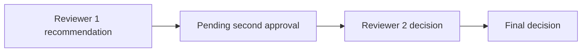

The second reviewer should not simply inherit unrestricted edit access to the first review. Preserve both judgments.

## 13.4 Override controls

If a reviewer overrides an automated recommendation, require:

- Structured reason code
- Free-text explanation where necessary
- Supporting evidence
- Reviewer identity
- Timestamp
- Optional supervisor approval

Do not allow silent status editing directly in the database.

## 13.5 Prevent reviewer leakage

Reviewer notes may contain sensitive intelligence or internal reasoning. Separate:

- Customer-visible reason
- Internal operational note
- Restricted compliance note

---

# 14. API Design

## 14.1 Create a case

```http
POST /v1/kyc/cases
Authorization: Bearer <token>
Idempotency-Key: 96655491-7211-4206-8e55-a41fab992015
Content-Type: application/json
```

```json
{
  "customer_reference": "cus_10428",
  "customer_type": "INDIVIDUAL",
  "country": "IN",
  "product": "PAYMENTS_ACCOUNT",
  "requested_tier": "STANDARD"
}
```

Response:

```json
{
  "case_id": "kyc_01J4KQX7X4B5",
  "status": "CONSENT_PENDING",
  "required_steps": [
    "CONSENT",
    "IDENTITY_DETAILS",
    "IDENTITY_DOCUMENT",
    "SELFIE"
  ],
  "expires_at": "2026-08-10T06:00:00Z"
}
```

## 14.2 Record consent

```http
POST /v1/kyc/cases/{case_id}/consents
```

```json
{
  "consent_type": "IDENTITY_VERIFICATION",
  "notice_version": "in-identity-verification-v7",
  "accepted": true,
  "language": "en-IN"
}
```

## 14.3 Request upload URL

```http
POST /v1/kyc/cases/{case_id}/evidence/upload-urls
```

```json
{
  "evidence_type": "IDENTITY_DOCUMENT_FRONT",
  "content_type": "image/jpeg",
  "content_length": 1839234,
  "sha256": "1d5f..."
}
```

Response:

```json
{
  "evidence_id": "ev_9017",
  "upload_url": "https://storage.example/...",
  "expires_in_seconds": 300
}
```

## 14.4 Complete evidence upload

```http
POST /v1/kyc/cases/{case_id}/evidence/{evidence_id}/complete
```

This call should validate the uploaded object's checksum, size, and expected type.

## 14.5 Submit identity details

```http
PUT /v1/kyc/cases/{case_id}/identity
```

```json
{
  "full_name": "Aarav Mehta",
  "date_of_birth": "1993-05-22",
  "nationality": "IN",
  "residential_address": {
    "line1": "12 Example Road",
    "city": "Ahmedabad",
    "postal_code": "380001",
    "country": "IN"
  }
}
```

## 14.6 Start verification

```http
POST /v1/kyc/cases/{case_id}/verification-runs
```

Response:

```json
{
  "run_id": "run_6201",
  "status": "QUEUED"
}
```

Starting verification should be idempotent for the same evidence set and policy version.

## 14.7 Get status

```http
GET /v1/kyc/cases/{case_id}
```

```json
{
  "case_id": "kyc_01J4KQX7X4B5",
  "status": "MANUAL_REVIEW_REQUIRED",
  "customer_action": null,
  "completed_checks": [
    "IDENTITY_DOCUMENT",
    "LIVENESS",
    "SANCTIONS"
  ],
  "updated_at": "2026-08-03T06:16:30Z"
}
```

Do not expose sensitive internal match details to the customer.

## 14.8 Reviewer decision

```http
POST /v1/review-tasks/{task_id}/decisions
```

```json
{
  "decision": "REQUEST_MORE_INFORMATION",
  "reason_codes": [
    "ADDRESS_EVIDENCE_REQUIRED"
  ],
  "requested_evidence": [
    "PROOF_OF_ADDRESS"
  ],
  "expected_task_version": 4
}
```

## 14.9 Webhook event

```json
{
  "event_id": "evt_8127",
  "event_type": "kyc.case.status_changed",
  "occurred_at": "2026-08-03T06:20:00Z",
  "data": {
    "case_id": "kyc_01J4KQX7X4B5",
    "customer_reference": "cus_10428",
    "old_status": "AUTO_CHECKS_RUNNING",
    "new_status": "APPROVED",
    "decision_reference": "dec_9011"
  }
}
```

Sign callbacks using HMAC or asymmetric signatures and include replay protection.

---

# 15. Events and Message Contracts

## 15.1 Common events

```text
kyc.case.created
kyc.consent.recorded
kyc.identity.submitted
kyc.evidence.uploaded
kyc.evidence.ready
kyc.check.requested
kyc.check.completed
kyc.check.failed
kyc.risk.calculated
kyc.review.requested
kyc.review.completed
kyc.more_information.requested
kyc.case.approved
kyc.case.rejected
kyc.case.expired
kyc.rescreen.requested
```

## 15.2 Event envelope

```json
{
  "event_id": "evt_01J4KT",
  "event_type": "kyc.check.completed",
  "event_version": 2,
  "occurred_at": "2026-08-03T06:14:12Z",
  "producer": "document-verification-service",
  "correlation_id": "kyc_01J4KQX7X4B5",
  "causation_id": "cmd_7802",
  "tenant_id": "tenant_001",
  "data": {
    "case_id": "kyc_01J4KQX7X4B5",
    "check_id": "chk_9102",
    "check_type": "IDENTITY_DOCUMENT",
    "status": "SUCCEEDED",
    "finding_ids": [
      "fnd_101",
      "fnd_102"
    ]
  }
}
```

## 15.3 Schema evolution

Use versioned schemas.

Safe changes:

- Add optional fields
- Add new enum values only when consumers handle unknown values
- Publish a new event version for breaking changes

Use a schema registry for Kafka/Avro/Protobuf or automated JSON Schema compatibility checks.

## 15.4 Ordering

Ordering should normally be guaranteed per case, not globally.

Partition key:

```text
partition_key = case_id
```

Still protect consumers with version checks because retries and multi-topic flows can create out-of-order processing.

---

# 16. Data Model

## 16.1 Main entities

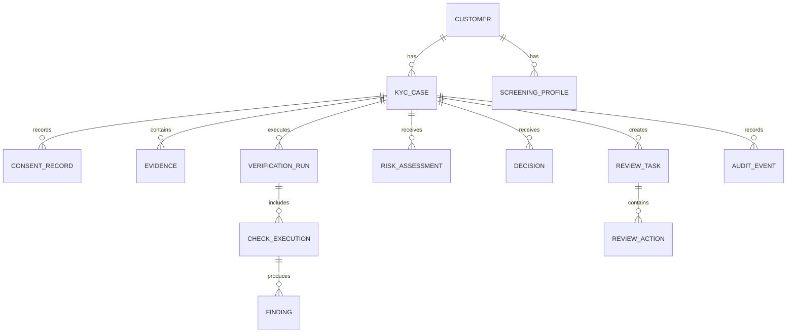

## 16.2 `kyc_case`

```sql
CREATE TABLE kyc_case (
    id                  UUID PRIMARY KEY,
    tenant_id           UUID NOT NULL,
    customer_id         UUID NOT NULL,
    customer_type       VARCHAR(30) NOT NULL,
    country_code        CHAR(2) NOT NULL,
    product_code        VARCHAR(50) NOT NULL,
    status              VARCHAR(40) NOT NULL,
    risk_tier           VARCHAR(20),
    policy_id           VARCHAR(100) NOT NULL,
    policy_version      INTEGER NOT NULL,
    workflow_id         VARCHAR(120),
    version             INTEGER NOT NULL DEFAULT 1,
    expires_at          TIMESTAMPTZ,
    created_at          TIMESTAMPTZ NOT NULL,
    updated_at          TIMESTAMPTZ NOT NULL
);

CREATE UNIQUE INDEX uq_active_case
ON kyc_case (tenant_id, customer_id, product_code)
WHERE status NOT IN ('REJECTED', 'CANCELLED', 'EXPIRED');
```

## 16.3 `evidence`

```sql
CREATE TABLE evidence (
    id                  UUID PRIMARY KEY,
    case_id             UUID NOT NULL REFERENCES kyc_case(id),
    evidence_type       VARCHAR(50) NOT NULL,
    storage_reference   TEXT NOT NULL,
    content_hash        VARCHAR(64) NOT NULL,
    content_type        VARCHAR(100) NOT NULL,
    size_bytes          BIGINT NOT NULL,
    status              VARCHAR(30) NOT NULL,
    encryption_key_ref  TEXT NOT NULL,
    retention_class     VARCHAR(40) NOT NULL,
    uploaded_at         TIMESTAMPTZ NOT NULL,
    deleted_at          TIMESTAMPTZ
);
```

Do not store raw document bytes in the relational database.

## 16.4 `check_execution`

```sql
CREATE TABLE check_execution (
    id                    UUID PRIMARY KEY,
    verification_run_id   UUID NOT NULL,
    check_type            VARCHAR(50) NOT NULL,
    status                VARCHAR(30) NOT NULL,
    provider              VARCHAR(50),
    provider_reference    VARCHAR(200),
    request_fingerprint   VARCHAR(64) NOT NULL,
    attempt_count         INTEGER NOT NULL DEFAULT 0,
    started_at            TIMESTAMPTZ,
    completed_at          TIMESTAMPTZ,
    error_class           VARCHAR(50),
    next_retry_at         TIMESTAMPTZ,
    result_version        INTEGER NOT NULL DEFAULT 1
);

CREATE UNIQUE INDEX uq_check_request
ON check_execution (verification_run_id, check_type, request_fingerprint);
```

## 16.5 `finding`

```sql
CREATE TABLE finding (
    id                  UUID PRIMARY KEY,
    check_execution_id  UUID NOT NULL,
    finding_code        VARCHAR(100) NOT NULL,
    outcome             VARCHAR(20) NOT NULL,
    severity            VARCHAR(20) NOT NULL,
    confidence          NUMERIC(5,4),
    attributes          JSONB NOT NULL,
    created_at          TIMESTAMPTZ NOT NULL
);
```

Example findings:

```text
DOCUMENT_EXPIRED
DOCUMENT_TAMPERING_SUSPECTED
NAME_MATCH
DOB_MISMATCH
LIVENESS_PASSED
FACE_MATCH_BELOW_THRESHOLD
SANCTIONS_POSSIBLE_MATCH
PEP_POSSIBLE_MATCH
DUPLICATE_IDENTITY_FOUND
```

## 16.6 `decision`

```sql
CREATE TABLE decision (
    id                  UUID PRIMARY KEY,
    case_id             UUID NOT NULL,
    decision_type       VARCHAR(40) NOT NULL,
    source              VARCHAR(20) NOT NULL,
    reason_codes        JSONB NOT NULL,
    policy_id           VARCHAR(100) NOT NULL,
    policy_version      INTEGER NOT NULL,
    risk_assessment_id  UUID,
    supersedes_id       UUID,
    decided_by          UUID,
    decided_at          TIMESTAMPTZ NOT NULL
);
```

Decisions should be append-only. A later decision supersedes an earlier one instead of rewriting history.

## 16.7 PII separation

Use a dedicated PII vault or restricted schema:

```text
customer_identity:
  customer_id
  full_name_encrypted
  dob_encrypted
  address_encrypted
  document_number_token
  pii_key_reference
```

Operational services can use customer IDs and tokens without accessing raw PII.

---

# 17. Idempotency, Retries, and Exactly-Once Business Effects

## 17.1 API idempotency

For mutation requests, store:

```text
tenant_id
idempotency_key
request_hash
response_status
response_body/reference
created_at
expires_at
```

Rules:

- Same key + same payload -> return original result.
- Same key + different payload -> return conflict.
- Scope keys by tenant and endpoint.
- Persist the result before returning success.

## 17.2 Message processing

Use an inbox table:

```sql
CREATE TABLE consumer_inbox (
    consumer_name VARCHAR(100) NOT NULL,
    event_id      UUID NOT NULL,
    processed_at  TIMESTAMPTZ NOT NULL,
    PRIMARY KEY (consumer_name, event_id)
);
```

Consumer flow:

```text
BEGIN
  Insert event_id into inbox
  If duplicate -> stop
  Apply business change
  Write outgoing event to outbox
COMMIT
```

## 17.3 Transactional outbox

```sql
CREATE TABLE event_outbox (
    id              UUID PRIMARY KEY,
    aggregate_type  VARCHAR(50) NOT NULL,
    aggregate_id    UUID NOT NULL,
    event_type      VARCHAR(100) NOT NULL,
    payload         JSONB NOT NULL,
    created_at      TIMESTAMPTZ NOT NULL,
    published_at    TIMESTAMPTZ
);
```

A publisher sends committed events to the broker and marks them as published.

This avoids:

```text
Database committed but event not published
```

or:

```text
Event published but database rolled back
```

## 17.4 Retry classification

### Retryable

- Timeout
- Connection reset
- HTTP 429
- Vendor 5xx
- Temporary registry unavailable
- Broker delivery failure

### Non-retryable

- Unsupported document type
- Invalid input schema
- Document expired
- Consent missing
- Customer under minimum age
- Definite policy violation

## 17.5 Backoff

```text
delay = min(base * 2^attempt + jitter, max_delay)
```

Example:

```text
5 s -> 12 s -> 24 s -> 51 s -> 2 min -> 5 min
```

Use vendor-specific retry budgets.

## 17.6 Vendor callbacks

A vendor can send the same callback many times.

Process by:

```text
unique(provider, provider_event_id)
```

Also verify:

- Signature
- Timestamp
- Allowed source where feasible
- Provider reference
- Expected current check state
- Payload hash

## 17.7 Avoid pretending infrastructure gives exactly-once delivery

Message brokers generally provide at-least-once delivery in practical failure scenarios.

The goal is:

```text
At-least-once message delivery
+
Idempotent consumer
+
Transactional state update
=
Exactly-once business effect
```

---

# 18. Security, Privacy, and Compliance

## 18.1 Data classification

Classify data clearly.

| Class | Examples |
|---|---|
| Restricted PII | Full identity data, document images, document numbers |
| Restricted biometric | Selfies, videos, face templates |
| Confidential compliance | Screening matches, investigations, reviewer notes |
| Internal operational | Case status, check timing, vendor health |
| Public | Generic product documentation |

## 18.2 Encryption

### In transit

- TLS for every service connection
- mTLS for sensitive internal and vendor integrations where supported
- Certificate rotation
- Strong webhook signatures

### At rest

- Envelope encryption using a KMS/HSM
- Separate keys by environment, tenant, or data domain where justified
- Key rotation
- Key-use audit logs
- Different key policy for biometrics

## 18.3 Tokenization

Replace values such as document number with tokens.

```text
Raw PAN/passport number -> PII vault
Application database    -> tok_doc_c8d41
Logs and events          -> masked or tokenized value
```

## 18.4 Access control

Use RBAC plus attributes.

```text
Role: KYC_REVIEWER
Attributes:
  jurisdiction = IN
  product = PAYMENTS
  risk_clearance = STANDARD
```

A reviewer should see only cases matching their authorization.

Require step-up authentication for:

- Downloading evidence
- Viewing full document numbers
- High-risk approvals
- Bulk exports
- Administrative configuration changes

## 18.5 Audit log

Audit events should include:

- Actor
- Action
- Resource
- Timestamp
- Request/correlation ID
- Old and new state
- Reason
- Policy version
- Source IP/device context where appropriate
- Evidence accessed
- Export/download actions

Protect the audit log from modification. Options include:

- Append-only database permissions
- Write-once object storage
- Hash chaining
- Signed log batches
- Independent security-account storage

## 18.6 Log hygiene

Never write these to ordinary logs:

- Full document images
- Full document numbers
- Selfies
- Full address
- Raw vendor payloads
- Access tokens
- Biometric embeddings

Use structured redaction:

```json
{
  "case_id": "kyc_...",
  "document_number": "***4821",
  "customer_id": "cus_...",
  "error_code": "VENDOR_TIMEOUT"
}
```

## 18.7 Data minimization

Collect only what is required for:

- Identity verification
- Risk assessment
- Legal retention
- Product eligibility

Do not collect extra identity evidence only because the vendor supports it.

## 18.8 Retention and deletion

Retention may differ for:

- Raw uploads
- Extracted fields
- Biometric captures
- Verification results
- Audit records
- Sanctions-screening history
- Rejected applications

Implement a policy engine:

```text
retention_class = KYC_EVIDENCE_IN_REGULATED
retain_until = relationship_end + legal_period
legal_hold = false
```

Deletion should include:

- Primary storage
- Search indexes
- Caches
- Derived thumbnails
- Vendor-side deletion where contractually supported
- Expired pre-signed URLs
- Backup lifecycle according to policy

## 18.9 Consent and purpose limitation

Consent is not a universal legal basis for every regulated processing activity, but where consent or notice is required, the system must prove:

- What the customer was told
- Which version they saw
- What action they took
- When it occurred
- Which purpose applied

Data collected for KYC should not silently become marketing or unrelated analytics data.

## 18.10 Model governance

For OCR, fraud, face match, liveness, or risk models:

- Track model version
- Evaluate false accept and false reject rates
- Monitor drift
- Test across representative conditions
- Maintain human escalation
- Protect against prompt or model-output injection if generative AI is used
- Never let a free-form LLM directly produce a final regulatory decision without controlled rules and review

## 18.11 Jurisdiction-specific policy

Regulatory details vary. Keep them in policy/configuration modules, not scattered throughout code.

Example:

```text
Country policy
  -> allowed identity methods
  -> required evidence
  -> age rules
  -> PEP treatment
  -> retention
  -> periodic refresh
  -> customer-notification wording
  -> reviewer approval level
```

---

# 19. Scalability and Capacity Planning

## 19.1 Example traffic assumptions

Assume:

```text
1,000,000 KYC cases/day
60% submitted during 8 peak hours
Average 4 automated checks/case
Average 3 evidence files/case
Average evidence size = 3 MB
```

Peak submitted cases per second:

```text
1,000,000 × 0.60 / (8 × 3600)
≈ 20.8 cases/second
```

Add a 5× burst factor:

```text
≈ 105 cases/second
```

Check jobs:

```text
105 × 4 = 420 check jobs/second
```

Evidence ingestion:

```text
105 × 3 × 3 MB
≈ 945 MB/second during an extreme synchronized burst
```

The storage upload path must scale independently from API servers.

## 19.2 Storage estimate

Daily raw evidence:

```text
1,000,000 cases × 3 files × 3 MB
= 9,000,000 MB
≈ 9 TB/day
```

Compression, retention, duplicate uploads, video, and derived assets can change this significantly.

This calculation shows why:

- Object storage is required.
- Retention matters financially.
- Videos should not be retained indefinitely by default.
- Lifecycle policies are part of architecture, not housekeeping.

## 19.3 Service scaling

### Stateless APIs

Scale horizontally behind a load balancer.

### Workflow workers

Scale by queue depth and task type.

```text
document-worker pool
biometric-worker pool
screening-worker pool
notification-worker pool
```

### Databases

Use:

- Read replicas for reviewer/search views
- Partitioning by tenant, creation date, or regional shard
- Indexed status and queue fields
- Connection pooling
- Archival of old operational records
- Separate analytics pipeline

### Object processing

Use event-triggered workers with concurrency limits.

## 19.4 Backpressure

When a vendor slows down:

- Stop increasing concurrency blindly.
- Queue requests.
- Apply per-vendor rate limits.
- Use circuit breakers.
- Expose pending status.
- Preserve deadlines.
- Shift to a secondary vendor when policy allows.

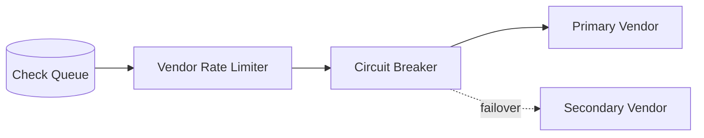

## 19.5 Screening indexes

For large watchlists:

- Normalize names during ingestion.
- Build phonetic and n-gram indexes.
- Use candidate retrieval before expensive scoring.
- Partition by entity type or script where useful.
- Cache list versions, not final customer decisions.
- Incrementally re-screen changed records.

## 19.6 Multi-region strategy

Possible model:

```text
Customer region
  -> regional ingestion and PII storage
  -> regional verification workers
  -> globally replicated non-PII case status
  -> centralized policy metadata
```

Consider:

- Data residency
- Vendor endpoint location
- Cross-border data transfer
- Key locality
- Failover legality
- Watchlist synchronization

A technically possible failover may still be legally unacceptable if it moves PII to another region.

---

# 20. Reliability and Failure Handling

## 20.1 Failure matrix

| Failure | System behavior |
|---|---|
| Customer upload interrupted | Support resumable/retryable upload |
| OCR worker crashes | Message becomes visible again; idempotent retry |
| Vendor times out | Retry with backoff; keep case pending |
| Vendor returns malformed response | Store diagnostic safely; mark integration error |
| Screening list refresh fails | Continue with last approved version; alert list freshness |
| Event delivered twice | Inbox deduplication |
| Decision service unavailable | Findings remain durable; retry decision task |
| Reviewer action conflicts | Optimistic lock and explicit conflict response |
| Webhook endpoint down | Retry and allow event replay |
| Object scan fails | Quarantine evidence; do not process |
| Database unavailable | Reject or queue writes safely; never acknowledge uncommitted work |

## 20.2 Circuit breaker

States:

```text
CLOSED
  Calls flow normally

OPEN
  Calls fail fast or queue; vendor is considered unhealthy

HALF_OPEN
  Limited probe calls test recovery
```

Use separate breakers by vendor capability and region.

## 20.3 Timeouts

Set layered timeouts:

```text
Client request timeout       10 s
Internal service timeout      3 s
Vendor API timeout            8 s
Workflow activity timeout    30 s
Overall check deadline       15 min
Case completion deadline      7 days
```

The exact values depend on the provider and user journey.

## 20.4 Dead-letter queues

A DLQ is for investigation, not permanent storage.

Each DLQ message should retain:

- Original event
- Error classification
- Attempts
- First and last failure time
- Consumer version
- Correlation ID

Provide controlled replay after fixing the root cause.

## 20.5 Graceful degradation

Examples:

- If adverse media is unavailable but not mandatory for low-risk onboarding, continue under a documented fallback policy.
- If sanctions screening is mandatory, keep the case pending rather than approve.
- If the primary liveness vendor is down, use a permitted secondary provider.
- If all providers are down, allow evidence submission and process later.

Do not silently skip a mandatory control.

## 20.6 Disaster recovery

Define:

- RPO: maximum acceptable data loss
- RTO: maximum acceptable recovery time

Example:

```text
Operational case database:
  RPO <= 5 minutes
  RTO <= 60 minutes

Evidence object storage:
  RPO near zero using durable replicated storage
  RTO <= 4 hours for regional disaster

Audit store:
  RPO near zero
  RTO <= 4 hours
```

Test recovery, including key access and workflow resumption.

---

# 21. Observability and Auditability

## 21.1 Business metrics

- Cases started
- Submission completion rate
- Automatic approval rate
- Manual review rate
- Rejection rate
- More-information rate
- Abandonment by step
- Median time to decision
- Review SLA breaches
- Re-KYC completion rate

## 21.2 Verification metrics

- Document pass/fail rate
- Liveness pass/fail rate
- Face-match score distribution
- Sanctions alert rate
- PEP alert rate
- False-positive rate after review
- OCR confidence distribution
- Duplicate-identity rate
- Vendor disagreement rate

## 21.3 Technical metrics

- API latency and error rate
- Queue depth and oldest-message age
- Worker utilization
- Vendor latency, timeout, and 429 rate
- Retry rate
- Circuit-breaker state
- DLQ size
- Object-processing latency
- Database lock/conflict rate
- Webhook delivery success
- Watchlist freshness

## 21.4 High-value SLOs

Example:

```text
99.9% of case-creation requests succeed monthly.
95% of eligible fast-path cases receive a decision within 30 seconds.
99% of mandatory screening tasks begin within 60 seconds.
99.9% of final decisions produce an audit event.
99% of signed webhooks are delivered within 5 minutes when receiver is healthy.
```

## 21.5 Trace model

Use one trace/correlation ID across:

```text
HTTP request
-> case
-> workflow
-> check task
-> vendor call
-> result event
-> decision
-> webhook
```

Do not attach raw PII to tracing spans.

## 21.6 Alerts

Examples:

```text
Mandatory screening queue oldest age > 5 min
Watchlist age exceeds approved threshold
Auto-approval rate changes by > 20%
One country has sudden face-match failure spike
Vendor timeout rate > 5%
Manual review SLA breach count rising
Audit-event write failure > 0
```

Business anomalies can reveal integration failures earlier than CPU metrics.

---

# 22. Re-KYC and Continuous Monitoring

KYC does not end after approval.

## 22.1 Triggers

### Time based

- Annual
- Every few years
- More frequently for high-risk customers
- Before document expiry

### Event based

- Name or address change
- Ownership change
- Product upgrade
- Transaction pattern change
- New PEP or sanctions match
- Returned mail or failed contact
- Suspicious-activity alert
- Identity document expiry
- Material regulatory change

## 22.2 Re-KYC flow

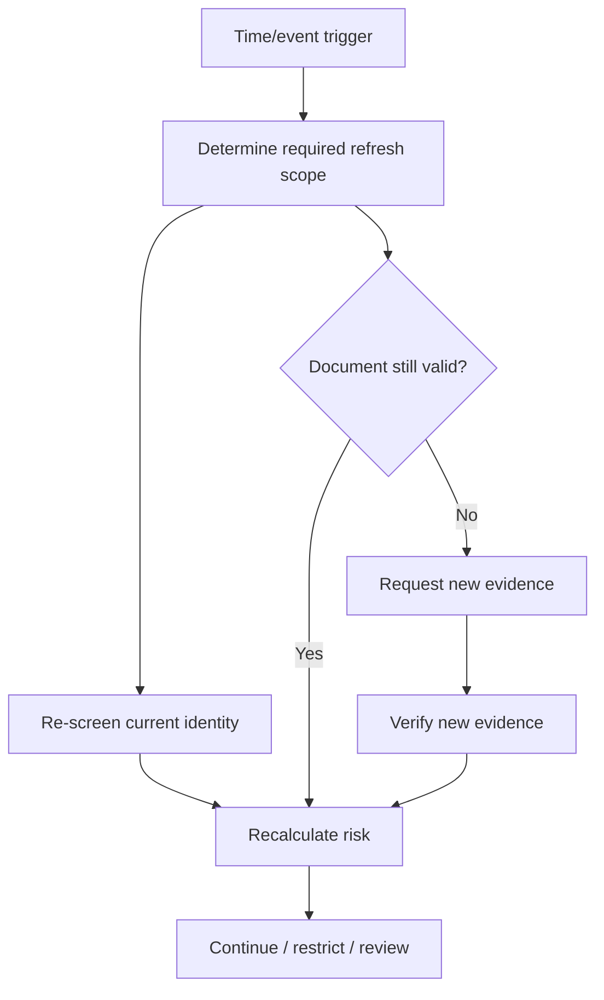

## 22.3 Avoid full re-verification when unnecessary

A policy may require only:

- Sanctions re-screening
- Address confirmation
- New source-of-funds evidence
- New document because the previous one expired

Use incremental refresh to reduce customer friction.

## 22.4 Customer profile snapshots

Preserve effective-dated identity profiles.

```text
Profile v1: 2024-01-01 to 2025-06-10
Profile v2: 2025-06-10 to present
```

Screening and decisions should reference the profile version used.

---

# 23. Vendor Integration Strategy

## 23.1 Capability interface

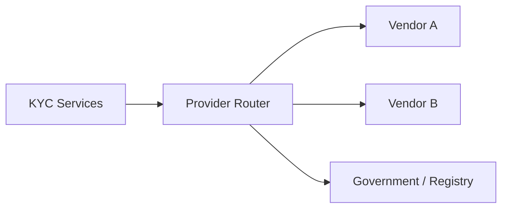

The router chooses based on:

- Country
- Document type
- Product
- Data residency
- Cost
- Vendor health
- Accuracy
- Contractual restrictions
- Customer channel
- Fallback policy

## 23.2 Normalize vendor responses

Internal result:

```json
{
  "check_type": "LIVENESS",
  "outcome": "PASS",
  "confidence": 0.94,
  "reason_codes": [],
  "provider": "vendor_b",
  "provider_model_version": "2026.04",
  "completed_at": "2026-08-03T06:12:43Z"
}
```

Keep the raw provider response in restricted storage for debugging and audit, subject to retention policy.

## 23.3 Provider routing

```python
def choose_document_provider(context):
    candidates = registry.supporting(
        country=context.country,
        document_type=context.document_type,
        residency_region=context.data_region,
    )

    healthy = [p for p in candidates if p.health.is_usable]

    return min(
        healthy,
        key=lambda p: (
            p.policy_priority,
            p.expected_latency_ms,
            p.unit_cost,
        ),
    )
```

Real routing should avoid changing vendors unpredictably in ways that make outcomes inconsistent.

## 23.4 Build versus buy

### Buy

Good for:

- Global document template coverage
- Liveness
- Sanctions datasets
- PEP datasets
- Government-source connectivity
- Rapid market launch

### Build

Good for:

- Workflow orchestration
- Policy engine
- Audit model
- Review tooling
- Vendor abstraction
- Internal blocklists
- Product-specific risk
- Data-retention enforcement

A common practical design is:

```text
Build the KYC platform and decision layer.
Buy specialized verification capabilities.
```

## 23.5 Vendor exit plan

Store enough normalized information to:

- Reproduce decisions
- Change providers
- Re-screen customers
- Audit historical checks
- Compare vendor quality

Avoid using a vendor's case ID as your primary identity.

---

# 24. Deployment Model

## 24.1 Logical services

A practical service split:

```text
kyc-api
kyc-case-service
kyc-workflow-workers
evidence-service
document-verification-service
biometric-verification-service
screening-service
risk-decision-service
review-service
webhook-service
watchlist-ingestion-service
audit-service
```

Start with fewer deployables if the team is small. Clear module boundaries matter more than creating many microservices.

## 24.2 Example cloud deployment

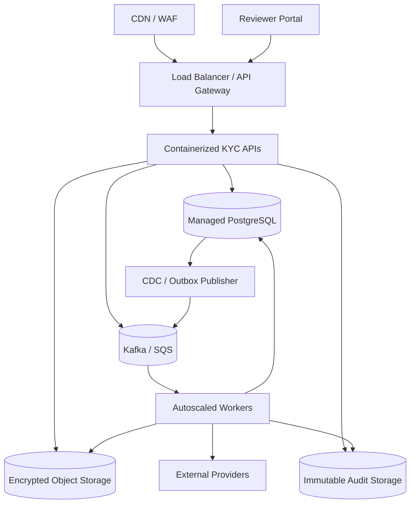

## 24.3 Network controls

- Private subnets for services and databases
- Egress proxy or NAT with destination controls
- Private storage endpoints
- Dedicated vendor allowlists where possible
- No public database endpoint
- Separate restricted subnet/account for evidence processing
- Service identities instead of shared credentials

## 24.4 Environment separation

Use separate:

- Accounts/projects
- KMS keys
- databases
- object buckets
- vendor credentials
- watchlist test data
- reviewer identities

Never copy production identity documents into lower environments.

Use synthetic or properly anonymized test data.

---

# 25. Important Trade-offs

## 25.1 Synchronous versus asynchronous verification

| Synchronous | Asynchronous |
|---|---|
| Simpler client flow for very fast checks | Handles slow vendors and review |
| Immediate response | Better retries and resilience |
| Hard timeout limits | Requires status API/webhooks |
| Poor fit for multi-step KYC | Better fit for long-running workflow |

Recommended: synchronous case creation, asynchronous verification.

## 25.2 Orchestration versus choreography

### Orchestration

A central workflow controls the sequence.

Advantages:

- Easier state visibility
- Clear timeout and retry ownership
- Better fit for manual pauses
- Easier policy-driven branching

Disadvantages:

- Orchestrator becomes important infrastructure
- Workflow evolution must be managed carefully

### Choreography

Services react to events without a central controller.

Advantages:

- Loose coupling
- Simple for independent reactions

Disadvantages:

- Harder to understand end-to-end state
- Risk of event loops and hidden dependencies
- Difficult long-running coordination

Recommended: orchestrate the KYC case while using events for integration and side effects.

## 25.3 One vendor versus multiple vendors

### One vendor

- Faster integration
- Simpler operations
- Less normalization work
- Higher concentration risk

### Multiple vendors

- Better coverage and resilience
- Enables quality comparison
- More contracts, cost, and inconsistent results
- More complex routing and audit

Recommended: design an abstraction from day one, but add providers only when justified.

## 25.4 Rules versus machine learning

### Rules

- Explainable
- Easy to audit
- Good for policy requirements
- Can become difficult to maintain at scale

### ML

- Good for fraud patterns and image analysis
- Can combine complex signals
- Requires monitoring and governance
- Harder to explain

Recommended:

```text
ML produces signals.
Rules and controlled policies produce regulatory decisions.
Humans resolve uncertainty.
```

## 25.5 Strong consistency versus eventual consistency

Use strong consistency for:

- Final decision
- Case transition
- Reviewer lock
- Consent record
- Active policy selection

Eventual consistency is acceptable for:

- Analytics dashboards
- Search indexes
- non-critical notifications
- Derived metrics
- reviewer read models, if freshness is visible

## 25.6 Centralized versus regional PII

Centralized storage is operationally simpler.

Regional storage may be needed for:

- Data residency
- Latency
- Contract restrictions
- Cross-border transfer control

A hybrid model often keeps raw PII regional while centralizing tokenized operational metadata.

---

# 26. Practical Implementation Plan

## 26.1 Phase 1: Core onboarding

Build:

- Case API
- Consent records
- Secure uploads
- One document provider
- One sanctions/PEP provider
- Basic risk rules
- Automatic approve/review/reject
- Reviewer queue
- Signed webhooks
- Audit trail

Keep the workflow modular even if deployed as one service.

## 26.2 Phase 2: Resilience and operations

Add:

- Durable workflow engine
- Outbox/inbox
- Retry policies
- Circuit breakers
- DLQ replay tooling
- Case search
- Reviewer SLA and assignment
- Provider health dashboard
- Evidence retention jobs

## 26.3 Phase 3: Fraud and coverage

Add:

- Liveness and face matching
- Duplicate identity
- Device and velocity signals
- Additional countries/documents
- Secondary providers
- EDD flows
- Four-eyes approvals

## 26.4 Phase 4: Continuous compliance

Add:

- Incremental list ingestion
- Continuous sanctions/PEP screening
- Scheduled re-KYC
- Event-driven refresh
- Model monitoring
- Policy simulation
- Compliance reporting

## 26.5 Suggested technology choices

These are examples, not requirements.

| Concern | Practical choices |
|---|---|
| API | FastAPI, Django REST Framework, Spring Boot, NestJS |
| Workflow | Temporal, Step Functions, Camunda, Durable Functions |
| Database | PostgreSQL |
| Event bus | Kafka, SQS/SNS, Pub/Sub, RabbitMQ |
| Object storage | S3, GCS, Azure Blob |
| Search | OpenSearch/Elasticsearch |
| Cache | Redis |
| Secrets | Cloud secret manager + KMS/HSM |
| Policy | Versioned code/config, OPA for authorization, dedicated rules engine where justified |
| Observability | OpenTelemetry, Prometheus, Grafana, cloud-native logging |
| Infrastructure | Kubernetes, ECS, managed containers, serverless workers |

## 26.6 Simplified service pseudocode

```python
async def start_verification(case_id: str, idempotency_key: str) -> str:
    case = await case_repository.get_for_update(case_id)

    assert case.status in {
        "EVIDENCE_PENDING",
        "MORE_INFORMATION_REQUIRED",
    }

    evidence = await evidence_repository.get_ready(case_id)
    policy = await policy_service.resolve(case)

    required = policy.required_checks(case=case, evidence=evidence)
    fingerprint = build_request_fingerprint(
        case_id=case.id,
        evidence_hashes=[item.content_hash for item in evidence],
        policy_version=policy.version,
        checks=required,
    )

    existing = await run_repository.find_by_fingerprint(fingerprint)
    if existing:
        return existing.id

    run = await run_repository.create(
        case_id=case.id,
        policy_id=policy.id,
        policy_version=policy.version,
        fingerprint=fingerprint,
    )

    case.transition_to("AUTO_CHECKS_RUNNING")

    for check_type in required:
        await outbox.add(
            event_type="kyc.check.requested",
            aggregate_id=case.id,
            payload={
                "case_id": str(case.id),
                "run_id": str(run.id),
                "check_type": check_type,
            },
        )

    await unit_of_work.commit()
    return run.id
```

## 26.7 Aggregating results

```python
async def on_check_completed(event: CheckCompleted) -> None:
    if await inbox.already_processed(event.event_id):
        return

    run = await run_repository.get_for_update(event.run_id)
    await findings_repository.attach(
        run_id=run.id,
        check_id=event.check_id,
        findings=event.findings,
    )

    if not await run_repository.all_mandatory_checks_terminal(run.id):
        await inbox.mark_processed(event.event_id)
        await unit_of_work.commit()
        return

    risk = await risk_service.calculate(run.id)
    decision = await decision_service.evaluate(
        case_id=run.case_id,
        risk=risk,
        findings=await findings_repository.for_run(run.id),
        policy_version=run.policy_version,
    )

    await apply_decision(decision)
    await inbox.mark_processed(event.event_id)
    await unit_of_work.commit()
```

## 26.8 Testing strategy

### Unit tests

- Risk rules
- State transitions
- Normalization
- Decision matrix
- Retry classification
- Policy selection

### Integration tests

- Database transactions
- Outbox publishing
- Object-upload completion
- Vendor adapter mapping
- Webhook signing
- Watchlist ingestion

### Contract tests

- Provider requests/responses
- Event schemas
- Upstream product API
- Reviewer portal API

### End-to-end tests

- Fast-path approval
- Evidence retake
- Possible sanctions match
- Vendor outage and recovery
- Manual review
- Re-KYC trigger

### Resilience tests

- Duplicate event
- Out-of-order event
- Worker crash after vendor success
- Database commit followed by broker outage
- Provider callback before polling response
- Watchlist parser failure
- Key rotation

---

# 27. How to Explain This Design in an Interview

A strong explanation can follow this order.

## 27.1 Start with the workflow

> “KYC is a long-running workflow, not one synchronous request. I would create a durable case, collect consent and evidence, run independent checks asynchronously, aggregate normalized findings, calculate risk, and then automatically decide clear cases or create a manual-review task.”

## 27.2 Draw the main architecture

Focus on:

```text
Client
-> API and secure upload
-> Case service
-> Workflow orchestrator
-> Verification services
-> Event bus
-> Risk and decision engine
-> Manual review
-> Audit and notifications
```

## 27.3 Explain why it is asynchronous

Mention:

- External vendors can be slow or unavailable.
- Multiple checks can run in parallel.
- Manual review can take hours.
- Retryable failures must not reject customers.
- Webhooks and status APIs provide completion updates.

## 27.4 Protect the critical invariants

State the invariants clearly:

1. One final business effect for each idempotent request.
2. No final approval without all mandatory checks.
3. Every decision references evidence, findings, policy, and list versions.
4. Mandatory control outages leave the case pending, not approved.
5. Human overrides are authorized and audited.
6. Raw PII does not leak into logs or general events.

## 27.5 Discuss scale with real bottlenecks

The API is usually not the hardest part.

Important bottlenecks:

- Image/video upload
- External provider limits
- OCR and biometric compute
- Watchlist candidate matching
- Reviewer capacity
- Evidence retention cost
- Re-screening existing customers

## 27.6 Finish with trade-offs

A balanced final statement:

> “I would build the orchestration, policy, evidence lineage, audit, and review platform internally, while integrating specialist providers for document coverage, liveness, and watchlist data. I would keep providers behind normalized adapters so the business can change vendors without rewriting policy.”

---

# 28. Key Takeaways

- KYC is a **durable, asynchronous workflow**.
- Store **evidence, findings, risk assessments, and decisions separately**.
- Use a **risk-based policy** instead of applying every check to every customer.
- Run independent checks in parallel through queues or a workflow engine.
- Keep external providers behind stable internal adapters.
- Treat event delivery as at least once and make every consumer idempotent.
- Use a transactional outbox for reliable state-plus-event updates.
- Keep mandatory-control failures pending; never treat infrastructure failure as customer failure.
- Version policies, models, thresholds, vendor responses, and watchlists.
- Route ambiguous matches to manual review with evidence lineage and reason codes.
- Protect PII and biometrics using encryption, tokenization, strict access controls, and retention rules.
- Build re-screening and re-KYC into the initial data model.
- Measure both technical health and business outcomes.
- Prefer strong consistency for decisions and state transitions; use eventual consistency for analytics and search.
- A practical design builds the platform and buys specialized verification capabilities.

---

# 29. Official References

The following sources are useful starting points. Final implementation must be reviewed by legal, compliance, privacy, and security teams for the applicable jurisdiction and product.

1. **FATF Recommendations**  
   https://www.fatf-gafi.org/en/publications/Fatfrecommendations/Fatf-recommendations.html

2. **FATF Guidance on Digital Identity**  
   https://www.fatf-gafi.org/en/publications/Financialinclusionandnpoissues/Digital-identity-guidance.html

3. **FATF update supporting a proportionate, risk-based approach and financial inclusion — February 2025**  
   https://www.fatf-gafi.org/en/publications/Fatfrecommendations/update-standards-promote-financial-conclusion-feb-2025.html

4. **NIST SP 800-63-4: Digital Identity Guidelines**  
   https://pages.nist.gov/800-63-4/

5. **NIST SP 800-63A-4: Identity Proofing and Enrollment**  
   https://csrc.nist.gov/pubs/sp/800/63/a/4/final

6. **Reserve Bank of India — Master Direction: Know Your Customer Direction, 2016, updated 14 August 2025**  
   https://www.rbi.org.in/commonman/english/scripts/notification.aspx?id=2607

7. **Reserve Bank of India — FAQs on Master Direction on KYC, 9 June 2025**  
   https://www.rbi.org.in/commonman/English/Scripts/FAQs.aspx?Id=3782

8. **UIDAI — Aadhaar Paperless Offline e-KYC**  
   https://uidai.gov.in/en/contact-support/have-any-question/307-english-uk/faqs/aadhaar-online-services/aadhaar-paperless-offline-e-kyc.html

9. **UIDAI — Secure QR and Offline Verification Information**  
   https://uidai.gov.in/en/ecosystem/authentication-devices-documents/about-aadhaar-paperless-offline-e-kyc.html

10. **United Nations Security Council Consolidated Sanctions List**  
    https://main.un.org/securitycouncil/en/content/un-sc-consolidated-list

---

> **Important:** This is a system-design learning document, not legal advice. KYC, AML, sanctions, biometric, retention, and reporting requirements vary by jurisdiction, entity type, customer type, and product.
