# Design a KYC Verification Pipeline

> Individual KYC onboarding, AML screening, manual review, periodic refresh, and extensibility for business KYC

## In short

- KYC is a long-running asynchronous workflow, not a request — a case waits on vendors, uploads, and reviewers for minutes or days, so it needs a durable state machine rather than an open HTTP connection.
- Store evidence, findings, risk, and decision as four separate records; a single status field cannot explain why a case was approved or let policy change without rewriting history.
- Verification is risk-based: a low-risk domestic wallet needs an ID plus a database check, a high-value international account also needs liveness, address proof, source of funds, and manual approval.
- Automate the clear cases and route the uncertain ones to humans — exact matches, expired documents, and image quality are machine work; ambiguous names, transliteration, and damaged documents are not.
- The independent checks (document, biometric, screening, duplicate detection) run in parallel, so total latency is the slowest check rather than their sum.
- Every transition is idempotent and versioned: callbacks repeat and messages redeliver, and a decision must name the policy, model, threshold, and watchlist versions that produced it.
- Vendors sit behind internal capability interfaces — `verify_document()`, `screen_watchlists()`, `perform_liveness()` — so swapping a provider never touches policy.

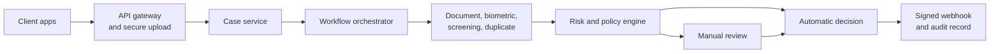

**Interview answer:** Model KYC as a durable workflow: create a case synchronously, then collect consent and evidence, fan the independent checks out asynchronously over a queue, aggregate them into normalized findings, score risk, and let a versioned policy either decide automatically or open a manual-review task. Keep every vendor behind an internal adapter and every state transition idempotent, so a retried callback or a redelivered message produces one business effect. Record evidence, findings, risk, decision, and the versions of everything that produced them, because the deliverable of a KYC system is a defensible audit trail, not a boolean.

**Gotcha:** Treating a vendor outage as a customer failure. If a mandatory check cannot run, the case stays pending and retries; rejecting the customer because your screening provider returned 503 is both a bad experience and an unexplainable compliance decision.

---

# 1. Problem Statement

Design a system that verifies whether a customer is who they claim to be before allowing access to a regulated product — a bank or wallet account, a brokerage account, a lending product, an insurance policy, a payment or remittance platform, a cryptocurrency or virtual-asset service, or a marketplace with regulated payouts.

The platform must collect identity evidence, verify documents and biometrics, screen the customer against risk lists, calculate risk, route uncertain cases to human reviewers, and preserve a defensible audit trail.

A KYC system is not only an upload form. It is a long-running, security-sensitive workflow with external dependencies, policy decisions, manual operations, and periodic re-verification.

---

## 1.1 Core outcome

For every verification case the system produces one decision: `APPROVED`, `REJECTED`, `MANUAL_REVIEW_REQUIRED`, `MORE_INFORMATION_REQUIRED`, or `EXPIRED`.

The decision must be explainable:

```json
{
  "decision": "MANUAL_REVIEW_REQUIRED",
  "reason_codes": [
    "SANCTIONS_POSSIBLE_MATCH",
    "DOCUMENT_ADDRESS_MISMATCH"
  ],
  "policy_version": "kyc-individual-in-v12",
  "decided_at": "2026-08-03T06:20:00Z"
}
```

---

## 1.2 Design scope

This document focuses primarily on **individual KYC**. The same architecture extends to **KYB**, which additionally verifies legal entity registration, directors and authorized signatories, ultimate beneficial owners and their ownership percentages, corporate structure, and business activity and source of funds.

---

# 2. KYC, CDD, EDD, and AML

These terms are related but not identical. Each answers a different question, and each widens the scope of the previous one.

| Term | Question it answers | Typical scope |
|---|---|---|
| **KYC** — Know Your Customer | Who is this customer? | Name, date of birth and address; identity-document validation; selfie and liveness verification; government or trusted-source verification; duplicate-identity detection |
| **CDD** — Customer Due Diligence | What is the relationship, and how risky is it? | Everything in KYC, plus understanding the relationship's purpose, identifying beneficial owners where applicable, assessing customer risk, and monitoring the relationship over time |
| **EDD** — Enhanced Due Diligence | What extra checks does higher risk demand? | Additional identity evidence, proof of address, source-of-funds and source-of-wealth evidence, senior compliance approval, more frequent review, tighter transaction limits |
| **AML** — Anti-Money Laundering | What controls run for the life of the account? | Sanctions, PEP and adverse-media screening, transaction monitoring, suspicious-activity investigation and reporting, ongoing customer-risk review |

CDD is broader than document verification, EDD is CDD applied at higher intensity, and AML extends well beyond onboarding into the life of the relationship.

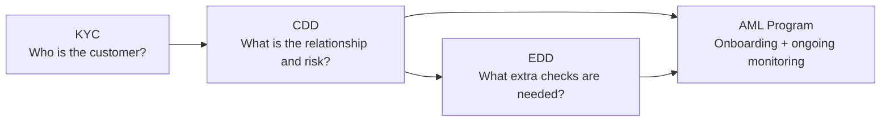

---

# 3. Requirements

## 3.1 Functional requirements

| Stage | The system must |
|---|---|
| Intake | Create a verification case; capture consent and the required disclosures; collect customer identity information; accept document images or trusted digital credentials |
| Evidence processing | Extract document fields by OCR or barcode/QR parsing; validate document authenticity and expiry |
| Verification | Verify identity details against trusted data sources; perform selfie, face-match and liveness checks when required; screen against sanctions, PEP, internal blocklists and optionally adverse media; detect duplicate or synthetic identities |
| Decision | Calculate customer risk; decide automatically where policy permits; route uncertain or high-risk cases to manual review; request additional evidence from the customer |
| Downstream | Notify upstream applications of status changes; maintain immutable audit history |
| Over time | Re-screen customers when watchlists change; trigger periodic or event-driven re-KYC |
| Across markets | Support multiple countries, products, policy versions, and verification vendors |

## 3.2 Non-functional requirements

| Area | Requirement |
|---|---|
| Availability | Core orchestration should target at least 99.9%; degraded vendor dependencies must not corrupt cases |
| Durability | Submitted evidence and decisions must not be lost |
| Security | Strong protection for PII, identity documents, biometrics, secrets, and reviewer actions |
| Auditability | Every important input, automated action, override, and decision must be traceable |
| Scalability | Handle onboarding bursts without overloading external vendors |
| Latency | Fast path in seconds; slow checks and review may be asynchronous |
| Explainability | Store reason codes and policy versions, not only a numeric score |
| Configurability | Rules vary by country, customer type, product, and risk tier |
| Privacy | Collect the minimum data needed and enforce retention/deletion policies |
| Resilience | Retry transient failures safely and isolate vendor outages |
| Extensibility | Add new checks or providers without rewriting the full workflow |

---

# 4. Design Principles

## 4.1 Treat KYC as a workflow

A KYC case can remain active for minutes, hours, or days, waiting on a vendor response, a customer upload, a reviewer decision, a compliance approval, or a retry after an outage.

Therefore, use a durable workflow or state machine instead of keeping a synchronous HTTP request open.

## 4.2 Separate evidence, findings, risk, and decision

These concepts should not be stored as one large status field.

```text
Evidence:
  Passport image, selfie, customer-entered address

Finding:
  Passport signature valid
  Selfie face-match score = 0.91
  Possible PEP match

Risk:
  HIGH because of possible PEP match and high-risk geography

Decision:
  MANUAL_REVIEW_REQUIRED
```

This separation improves explainability and lets policies change without rewriting historical evidence.

## 4.3 Use risk-based verification

Not every user requires the same checks.

Example:

```text
Low-risk domestic wallet:
  Government ID + database check

High-value international account:
  Government ID + liveness + address proof + sanctions/PEP +
  source of funds + manual approval
```

## 4.4 Automate clear cases, review uncertain cases

| Automation handles well | Humans are still needed for |
|---|---|
| Exact or strong identity matches | Ambiguous name matches |
| Expired-document detection | Transliteration differences |
| Image-quality checks | Damaged documents |
| Clear sanctions non-matches | Complex ownership structures |
| Deterministic policy rules | Inconsistent evidence and EDD judgment |

## 4.5 Keep vendors behind internal interfaces

Business logic should call an internal capability — `verify_document()`, `screen_watchlists()`, `perform_liveness()` — and never depend directly on one vendor's response model.

## 4.6 Make every transition idempotent

Messages may be delivered more than once. Vendor callbacks may be retried. Users may resubmit requests.

The same event must not create duplicate cases, duplicate charges, or conflicting decisions.

---

# 5. High-Level Architecture

The architecture is easier to hold in your head as three pictures than as one. The first is the intake path — how a case and its evidence enter the platform.

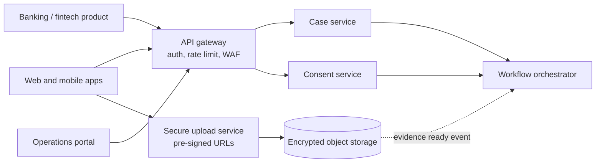

The second is the verification fan-out. The orchestrator never calls a vendor directly: it publishes check requests on the event bus, one verification service owns each capability, and each of those fronts an external provider behind a normalizing adapter.

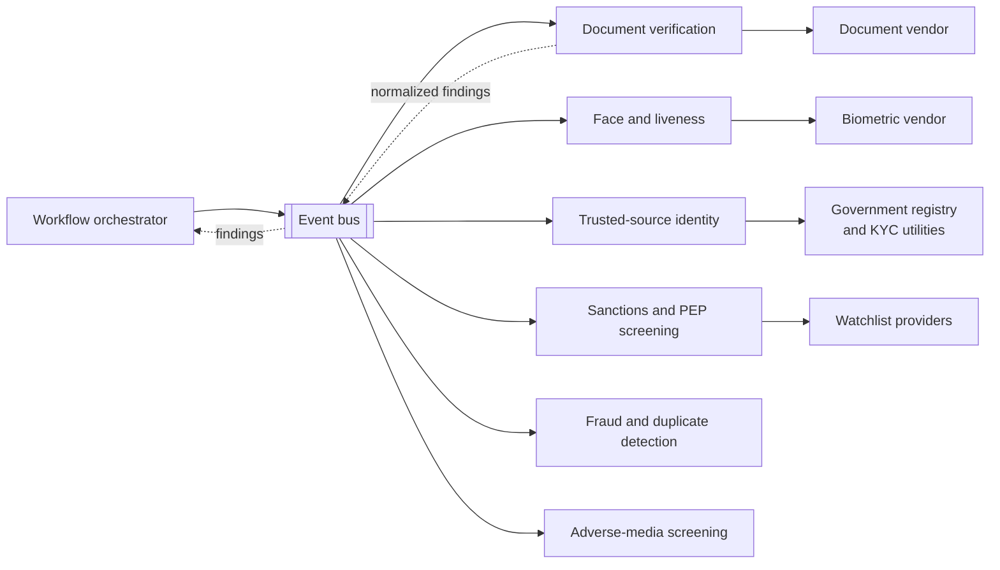

The third is the decision path, which is short: the orchestrator sends aggregated findings to risk scoring, risk scoring hands a tier to the policy engine, and the policy engine either produces a decision the notification service publishes as a signed webhook, or opens a task in the manual-review service. `FRAUD` and `MEDIA` return findings on the same path as the other checks; the diagram omits their return arrows only to stay readable.

## 5.1 Important architectural split

Cut the platform into two planes. The **control plane** owns case state, workflow progression, policy evaluation, human decisions, and audit records. The **evidence-processing plane** owns images, PDFs, video, OCR, face embeddings, vendor calls, and screening datasets.

This split prevents heavy media processing from slowing down case-management APIs, and it lets the two halves scale on completely different signals: request rate for one, queue depth and CPU for the other.

---

## 5.2 Shared platform substrate

Both planes sit on the same set of stores, and which store holds what is a design decision in its own right.

| Store | Holds | Why it is separate |
|---|---|---|
| Event bus | Check requests and results | Decouples orchestration from slow and unreliable vendors |
| Operational database | Cases, evidence metadata, check executions, findings, decisions | Transactional source of truth for state transitions |
| Encrypted object storage | Document images, selfies, video | Keeps large media off the case-management request path |
| Reviewer search index | Denormalized case and queue views | Reviewer queries must not compete with the write path |
| Cache | Policy documents, watchlist versions, vendor health | Read-heavy configuration that changes rarely |
| Immutable audit store | Append-only actor, action, and state records | Must survive tampering with the operational database |
| Secrets and key management | Vendor credentials, KMS data keys | No service holds a long-lived vendor secret in its own config |

---

## 5.3 Trust boundaries

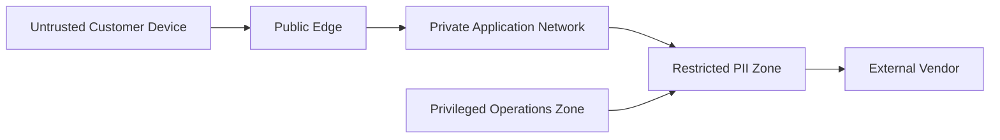

The controls that hold those boundaries: never trust the uploaded file type or client-side validation; scan and decode documents in an isolated processing environment; restrict reviewer access by least privilege; send only the required fields to each vendor and record what was sent and received; and never expose storage object paths directly.

---

# 6. End-to-End Verification Flow

## 6.1 Normal onboarding flow

The product API creates the case with an idempotency key; the customer accepts consent, submits identity details, and uploads document and selfie straight to object storage through a pre-signed URL, which emits the `evidence.ready` event that starts the workflow.

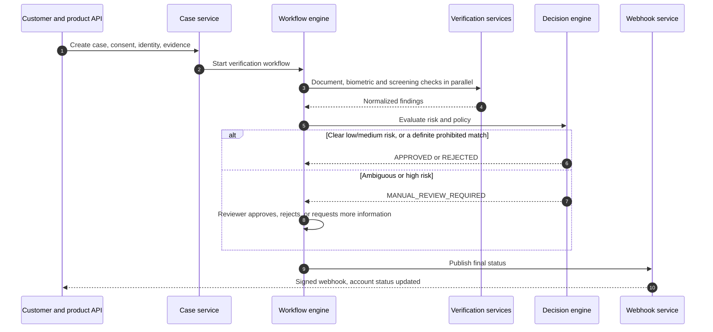

---

## 6.2 Why parallel checks matter

After required evidence is available, independent checks can run in parallel:

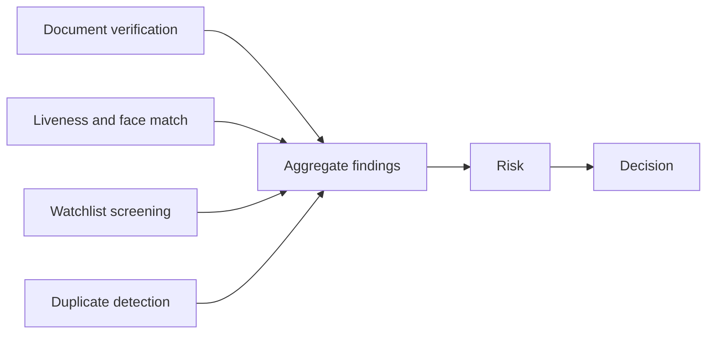

If these checks take 2.0 s, 3.5 s, 1.0 s, and 1.5 s, sequential execution costs about 8.0 s while parallel execution costs about 3.5 s plus orchestration overhead — the slowest check, not the sum.

---

## 6.3 Fast path and slow path

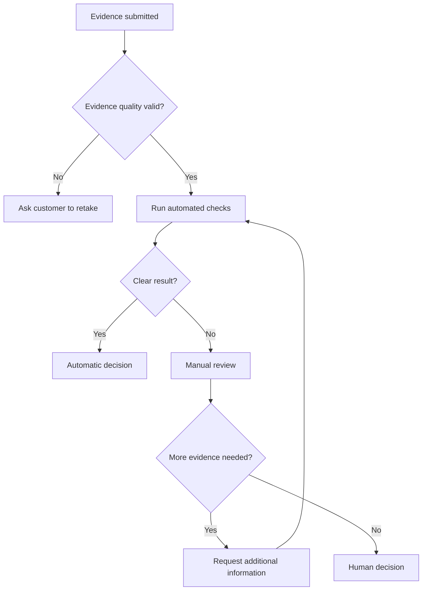

The fast path should cover the majority of normal customers. The slow path should be safe, explainable, and operationally manageable.

---

# 7. Workflow State Machine

## 7.1 Recommended states

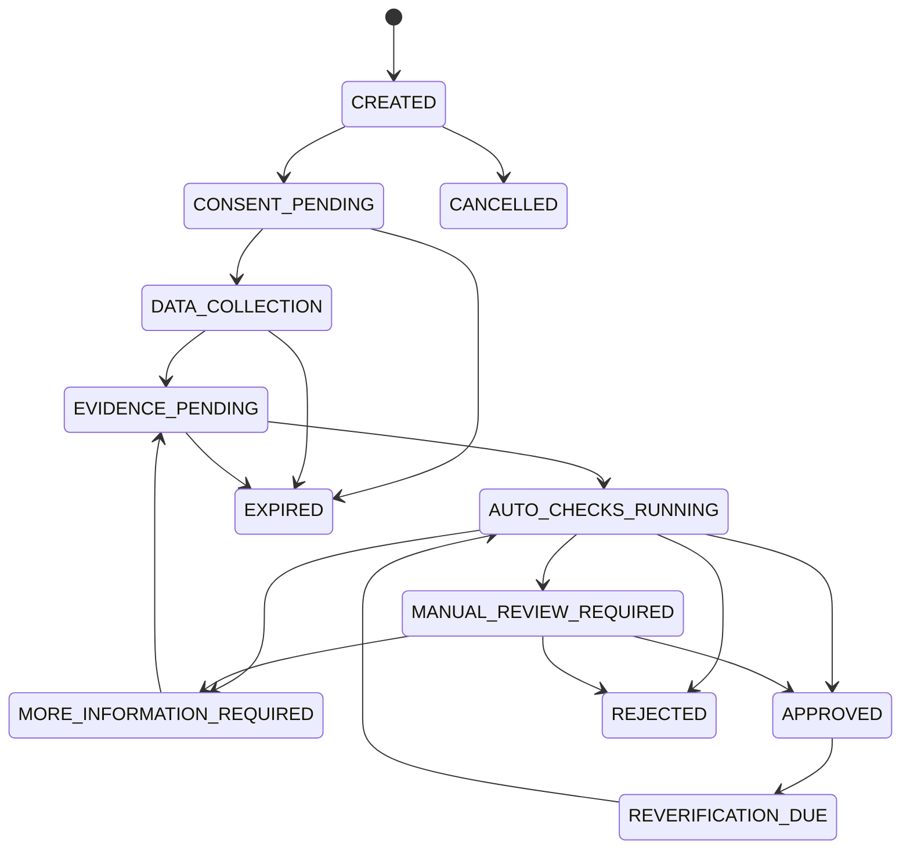

## 7.2 Separate case status from check status

A case can have many check executions.

```text
Case status:
  AUTO_CHECKS_RUNNING

Check statuses:
  document_check = SUCCEEDED
  liveness_check = RUNNING
  sanctions_screening = RETRY_WAIT
  duplicate_detection = SUCCEEDED
```

## 7.3 Transition rules

Each transition should validate the current state, the expected workflow version, actor authorization, required findings, the policy version, the idempotency key, and a transition reason.

Example:

```text
MANUAL_REVIEW_REQUIRED -> APPROVED

Allowed only when:
- Reviewer has KYC_APPROVER permission
- Required review checklist is complete
- No unresolved hard-block finding exists
- Four-eyes approval is complete when policy requires it
```

## 7.4 Optimistic concurrency

Store a version on the case:

```sql
UPDATE kyc_case
SET status = 'APPROVED',
    version = version + 1
WHERE id = :case_id
  AND version = :expected_version;
```

If no row is updated, another process changed the case. Reload and re-evaluate instead of overwriting it.

---

# 8. Core Components

## 8.1 API Gateway

The gateway handles authentication and authorization, tenant isolation, WAF rules, rate limiting, request-size limits, idempotency-header enforcement, request correlation IDs, and PII-safe access logging.

Avoid logging full request bodies because KYC payloads contain highly sensitive information.

## 8.2 Case Service

The Case Service owns case creation, customer and product references, current status, required steps, case expiration, the public status API, and the links between evidence, checks, findings, and decisions. It should not contain every verification algorithm — it is a state and reference owner, not a verification engine.

## 8.3 Consent Service

Consent is evidence, so store it as evidence: consent type, version of the legal text, language, timestamp, collection channel, user-agent or device context where permitted, withdrawal status, and proof of an affirmative action.

Do not use one generic boolean such as `consent = true` — it proves nothing about what the customer was actually shown.

## 8.4 Secure Upload Service

Recommended upload pattern:

1. Client asks for a short-lived pre-signed upload URL.
2. Server validates allowed evidence type and expected size.
3. Client uploads directly to object storage.
4. Storage event triggers malware scanning and format validation.
5. Clean evidence receives an immutable evidence ID.
6. Workflow receives an `evidence.ready` event.

This keeps application servers out of the large-file path, lets uploads scale independently of the API, inherits object storage's durability, and starts processing asynchronously the moment the object lands.

## 8.5 Workflow Orchestrator

The orchestrator starts the required checks, waits for asynchronous results, applies timeouts, retries transient failures, handles compensating actions, pauses for manual review, resumes after additional evidence arrives, and persists progress so a worker restart loses nothing.

Three implementations are viable: a workflow engine such as Temporal, AWS Step Functions, Azure Durable Functions, or Camunda; a carefully implemented database-backed state machine; or event-driven orchestration on Kafka/SQS plus a durable workflow store. For complex KYC, a durable workflow engine usually removes more custom retry and timer logic than it adds operational burden.

## 8.6 Verification adapters

Each vendor adapter should map an internal request to a provider-specific request.

```python
class DocumentVerifier:
    async def verify(
        self,
        evidence_id: str,
        document_type: str,
        country: str,
    ) -> "DocumentVerificationResult":
        ...
```

Internal output:

```json
{
  "provider": "provider_a",
  "provider_reference": "vr_83bd",
  "status": "COMPLETED",
  "document": {
    "type": "PASSPORT",
    "country": "IN",
    "number_token": "tok_doc_8f21",
    "expiry_date": "2031-04-18"
  },
  "checks": [
    {
      "code": "DOCUMENT_NOT_EXPIRED",
      "result": "PASS"
    },
    {
      "code": "TEMPLATE_AUTHENTICITY",
      "result": "PASS",
      "confidence": 0.97
    }
  ],
  "raw_response_location": "restricted://vendor-responses/..."
}
```

The decision engine should consume normalized findings, not raw vendor JSON.

## 8.7 Policy and decision engine

The policy engine decides which checks are required, whether a failed check is a hard block, whether EDD is needed, whether manual review is required, whether automatic approval is allowed at all, and when re-KYC becomes due. Policies must be versioned and testable; the Risk Scoring and Decisioning section below shows the shape of one.

## 8.8 Notification and webhook service

It sends signed status callbacks, retries safely, preserves delivery history, keeps unnecessary PII out of the payload, supports event ordering, and lets consumers fetch full case status after receiving a deliberately lightweight event.

---

# 9. Document Verification Pipeline

## 9.1 Processing stages


## 9.2 File safety

An uploaded identity document is attacker-controlled input. Before OCR, validate magic bytes rather than the extension, limit image dimensions, file size and page count, reject decompression bombs, re-encode images into a safe canonical format, strip unsafe metadata where appropriate, scan for malware, and do all of it in a sandbox with restricted network access.

## 9.3 Quality checks

Typical checks are blur, glare, cropping, low resolution, document too small in frame, unsupported orientation, covered fields, screenshot or photocopy detection, and front/back mismatch.

Fail quality checks early so the customer can retake the image before expensive verification calls.

## 9.4 Classification

The system identifies document type, issuing country, document side, and template version.

Example:

```json
{
  "document_type": "DRIVING_LICENCE",
  "issuing_country": "IN",
  "side": "FRONT",
  "confidence": 0.96
}
```

Low-confidence classification should request a customer selection or route to review.

## 9.5 Field extraction

Fields can come from OCR, the machine-readable zone, a PDF417 barcode, a secure QR code, an NFC chip, digitally signed XML, or a trusted digital credential. Prefer cryptographically verifiable data over OCR wherever the document supports it — a signed credential removes an entire class of extraction error and forgery.

## 9.6 Authenticity checks

Authenticity is a weight of evidence, not one test, and the signals are genuinely independent of each other:

- Template consistency, and font and layout consistency
- Hologram or security-feature analysis
- MRZ checksum, and barcode-to-visible-field consistency
- Digital-signature verification and NFC chip authenticity
- Image-manipulation detection
- Document-number format, and issuer database verification

No single signal should be treated as perfect.

## 9.7 Data matching

Compare extracted data with customer-entered data.

```text
Entered name:    RAHULKUMAR PATEL
Document name:  RAHUL KUMAR PATEL
```

Normalize first: Unicode normalization, case folding, whitespace normalization, punctuation removal, transliteration where permitted, token-order handling, common-name aliases, and locale-aware date formats.

Do not rely only on edit distance. Combine multiple attributes:

```text
Name match        0.91
Date of birth     exact
Document number   exact
Nationality       exact
Address           partial
```

## 9.8 Trusted-source verification

Where legally and technically available, verify selected attributes against a government identity service, a tax-identity service, a trusted digital-document provider, a credit bureau, a central KYC registry, a mobile-network identity service, or bank-account ownership verification.

For India, integrations may include permitted flows around Aadhaar offline verification, PAN verification, DigiLocker, CKYCR, or video-based customer identification. The exact allowed process depends on the regulated entity, product, purpose, consent, and current law.

## 9.9 Evidence lineage

For each extracted field, preserve where it came from:

```json
{
  "field": "date_of_birth",
  "value": "1992-11-04",
  "source": {
    "evidence_id": "ev_123",
    "page": 1,
    "region": [410, 220, 890, 290],
    "method": "MRZ",
    "confidence": 1.0
  }
}
```

This is valuable during review and audit.

---

# 10. Biometric and Liveness Verification

## 10.1 Typical flow

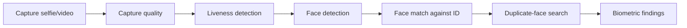

## 10.2 Liveness

Liveness tries to determine whether the capture comes from a live person rather than a printed photo, a screen replay, a recorded video, a mask, or a synthetic or manipulated face.

| | Passive liveness | Active liveness |
|---|---|---|
| What the user does | Takes a selfie or short video | Turns their head or follows an on-screen challenge |
| For | Better experience, faster completion, lower abandonment | More signals against simple replay attacks |
| Against | Fewer explicit anti-replay signals | More friction, accessibility concerns, harder to complete on poor devices or networks |

## 10.3 Face matching

The system compares the live capture with the face on identity evidence, and stores the vendor and model version, the similarity score, the threshold version, the image-quality score, the decision, and the reason codes. Storing the score without the threshold version makes the result unreproducible the moment the threshold moves.

Example:

```json
{
  "similarity_score": 0.89,
  "threshold": 0.84,
  "result": "PASS",
  "model_version": "face-match-2026-03"
}
```

Thresholds must be calibrated using representative data. A global threshold may behave differently across document quality, device type, age, or population.

## 10.4 Biometric privacy

Biometric data is the most sensitive class in the system, and unlike a password it cannot be reissued after a breach.

Keep raw biometric data no longer than required; store it separately from ordinary application data and encrypt it with dedicated keys; restrict access to a very small set of services; never expose embeddings to reviewers or allow them to be reused for unrelated purposes; record the model version and evaluation outcome alongside the result; and support jurisdiction-specific deletion and consent rules.

---

# 11. Sanctions, PEP, and Adverse-Media Screening

## 11.1 Screening types

### Sanctions

Checks whether a person or entity may be subject to legal restrictions.

### PEP

Checks whether a person is or is associated with a politically exposed person. A PEP match usually requires risk-based due diligence; it should not automatically be treated as proof of wrongdoing.

### Adverse media

Searches credible sources for risk-relevant information such as fraud, corruption, organized crime, terrorist financing, or serious financial misconduct.

### Internal lists

Your own history is a screening source: previously confirmed fraudsters, closed accounts, device or identity deny lists, law-enforcement requests, and previously rejected cases.

## 11.2 Name-screening flow

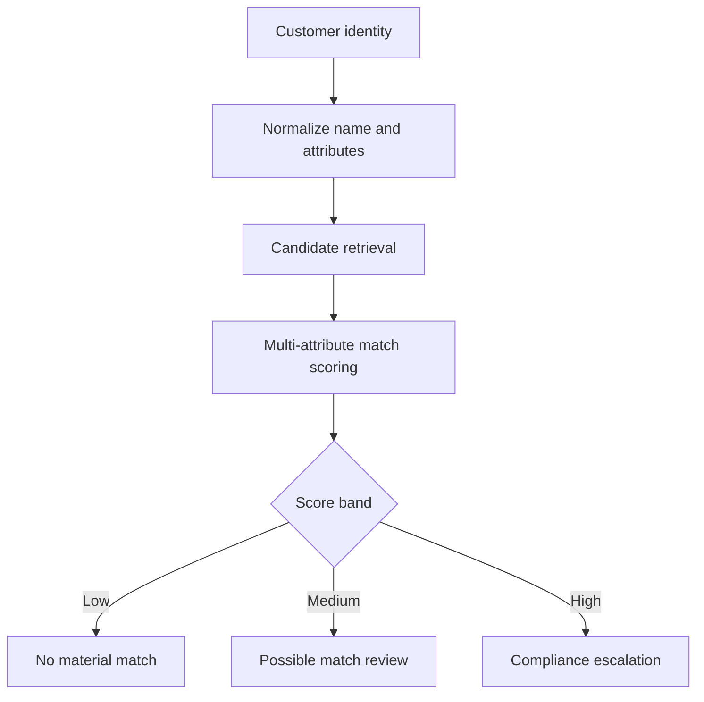

## 11.3 Candidate matching

Do not compare only the full name. Score across every attribute available:

- Full name and aliases
- Date or year of birth
- Nationality and country of residence
- Gender where lawfully used
- Passport or national ID number, and address
- Organization, and known associates or relationships

Example:

```text
Customer:
  Name:    Ahmed Hassan
  DOB:     1991-03-10
  Country: AE

Watchlist record:
  Name:    Ahmad Hasan
  DOB:     1964
  Country: SY

Name similarity is high, but DOB and country strongly disagree.
Result: likely false positive.
```

## 11.4 Screening result model

```json
{
  "screening_id": "scr_8201",
  "list_version": "un-consolidated-2026-05-21",
  "screened_at": "2026-08-03T06:15:00Z",
  "result": "POSSIBLE_MATCH",
  "candidates": [
    {
      "source_record_id": "QDi.123",
      "name_score": 0.93,
      "dob_match": "MISMATCH",
      "nationality_match": "UNKNOWN",
      "overall_score": 0.58
    }
  ]
}
```

## 11.5 List freshness

For every dataset, store the source, the dataset version, the download time, the effective time, a hash or checksum, and the parser version. A screening result is incomplete without identifying which list version produced it — "no match" against a three-week-old list is not the same claim as "no match" against today's.

## 11.6 Re-screening on list updates

When a list changes, ingest the new version, diff it to find changed and new records, identify the customers those records could affect, re-screen only those, raise alerts for material new matches, preserve both the previous and the new results, and apply product restrictions according to policy.

Avoid re-screening every customer against every record if incremental matching is possible.

---

# 12. Risk Scoring and Decisioning

## 12.1 Risk factors

Possible customer-risk inputs:

| Category | Examples |
|---|---|
| Identity | Document confidence, identity-source match, duplicate identity |
| Geography | Residence, nationality, product market, restricted jurisdictions |
| Customer type | Individual, sole proprietor, legal entity, nonprofit |
| Product | Wallet, remittance, lending, trading, high-value payments |
| Channel | Remote, assisted, branch, partner |
| Screening | Sanctions, PEP, adverse media |
| Fraud | Device risk, velocity, synthetic identity, replay indicators |
| Expected activity | Transaction volume, cross-border use, cash intensity |
| Source of funds | Salary, business income, investment, unknown |
| Historical behavior | Previous cases, suspicious activity, linked identities |

## 12.2 Use rules and scores together

A score alone is insufficient.

```text
Hard rule:
  Confirmed sanctions match -> block/escalate regardless of total score

Rule:
  Expired document -> ask for new document

Score:
  PEP + high-risk geography + high-value product -> high risk

Policy:
  High risk -> EDD + senior approval
```

## 12.3 Example scoring model

```text
Base score                                  0

Possible PEP match                        +35
High-risk jurisdiction                    +25
Document confidence below 0.80            +20
Address mismatch                          +10
New device with high fraud signal         +15
Trusted bank-account ownership match      -10
Strong digital credential                 -10
```

Risk bands:

```text
0–19    LOW
20–49   MEDIUM
50–79   HIGH
80+     VERY_HIGH
```

This is an illustration, not a regulatory formula.

## 12.4 Decision matrix

| Conditions | Decision |
|---|---|
| All mandatory checks pass; low/medium risk; no alerts | Approve |
| Recoverable evidence issue | Request more information |
| Ambiguous screening or inconsistent evidence | Manual review |
| High risk but serviceable under policy | EDD |
| Confirmed prohibited match | Block or reject according to legal policy |
| Strong evidence of identity fraud | Reject and create fraud alert |
| Vendor unavailable | Pending/retry; do not convert an outage into a customer rejection |

## 12.5 Policy example

```yaml
policy_id: kyc-individual-in-standard
version: 12

applicability:
  country: IN
  customer_type: INDIVIDUAL
  products:
    - WALLET
    - PAYMENTS_ACCOUNT

required_checks:
  - identity_document
  - trusted_source_identity
  - sanctions
  - pep
  - duplicate_identity

conditional_checks:
  - when: "risk.preliminary >= 50"
    require:
      - proof_of_address
      - source_of_funds
      - liveness

decisions:
  - when: "findings.confirmed_sanctions_match == true"
    result: COMPLIANCE_ESCALATION
    reason: CONFIRMED_SANCTIONS_MATCH

  - when: "checks.mandatory_all_passed && risk.final < 50"
    result: APPROVED

  - otherwise:
    result: MANUAL_REVIEW_REQUIRED
```

## 12.6 Version everything

Every decision must carry the versions that produced it:

- Policy version and ruleset version
- Risk-model version and the thresholds in force
- Vendor and model versions
- Watchlist versions
- Reviewer checklist version

This is what lets the organization reproduce, years later, why a decision was made — and it is the difference between an auditable decision and an opinion.

---

# 13. Manual Review

## 13.1 Review queue

A review task carries enough to route and prioritize it without opening the case: priority, risk tier, service-level deadline, required reviewer skill, jurisdiction, product, reason codes, an evidence summary, and any conflict-of-interest restrictions.

Example priority:

```text
P0: Confirmed or high-confidence sanctions alert
P1: High-value account with PEP match
P2: Document mismatch
P3: Low-confidence OCR
```

## 13.2 Reviewer workspace

A reviewer decides faster and more consistently when everything is on one screen:

- Entered and extracted data side by side
- The document image with OCR regions highlighted
- Check results, name-screening candidates, and risk factors
- The case timeline, and related customers and devices
- Prior reviewer notes and the applicable policy guidance
- A controlled set of decision actions

Avoid showing unrelated PII — a reviewer workspace is the largest standing PII exposure in the system.

## 13.3 Four-eyes control

Certain decisions may require two authorized people.

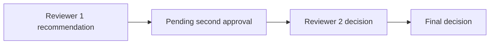

The second reviewer should not simply inherit unrestricted edit access to the first review. Preserve both judgments.

## 13.4 Override controls

If a reviewer overrides an automated recommendation, require a structured reason code, a free-text explanation where necessary, supporting evidence, the reviewer's identity, a timestamp, and — where policy demands it — supervisor approval.

Do not allow silent status editing directly in the database. An override that leaves no trace is indistinguishable from a compromise.

## 13.5 Prevent reviewer leakage

Reviewer notes may contain sensitive intelligence or internal reasoning, so keep three separate fields: the customer-visible reason, the internal operational note, and the restricted compliance note.

---

# 14. API Design

## 14.1 Create a case

```http
POST /v1/kyc/cases
Authorization: Bearer <token>
Idempotency-Key: 96655491-7211-4206-8e55-a41fab992015
Content-Type: application/json
```

```json
{
  "customer_reference": "cus_10428",
  "customer_type": "INDIVIDUAL",
  "country": "IN",
  "product": "PAYMENTS_ACCOUNT",
  "requested_tier": "STANDARD"
}
```

Response:

```json
{
  "case_id": "kyc_01J4KQX7X4B5",
  "status": "CONSENT_PENDING",
  "required_steps": [
    "CONSENT",
    "IDENTITY_DETAILS",
    "IDENTITY_DOCUMENT",
    "SELFIE"
  ],
  "expires_at": "2026-08-10T06:00:00Z"
}
```

## 14.2 Record consent

```http
POST /v1/kyc/cases/{case_id}/consents
```

```json
{
  "consent_type": "IDENTITY_VERIFICATION",
  "notice_version": "in-identity-verification-v7",
  "accepted": true,
  "language": "en-IN"
}
```

## 14.3 Request upload URL

```http
POST /v1/kyc/cases/{case_id}/evidence/upload-urls
```

```json
{
  "evidence_type": "IDENTITY_DOCUMENT_FRONT",
  "content_type": "image/jpeg",
  "content_length": 1839234,
  "sha256": "1d5f..."
}
```

Response:

```json
{
  "evidence_id": "ev_9017",
  "upload_url": "https://storage.example/...",
  "expires_in_seconds": 300
}
```

## 14.4 Complete evidence upload

```http
POST /v1/kyc/cases/{case_id}/evidence/{evidence_id}/complete
```

This call should validate the uploaded object's checksum, size, and expected type.

## 14.5 Submit identity details

```http
PUT /v1/kyc/cases/{case_id}/identity
```

```json
{
  "full_name": "Aarav Mehta",
  "date_of_birth": "1993-05-22",
  "nationality": "IN",
  "residential_address": {
    "line1": "12 Example Road",
    "city": "Ahmedabad",
    "postal_code": "380001",
    "country": "IN"
  }
}
```

## 14.6 Start verification

```http
POST /v1/kyc/cases/{case_id}/verification-runs
```

Response:

```json
{
  "run_id": "run_6201",
  "status": "QUEUED"
}
```

Starting verification should be idempotent for the same evidence set and policy version.

## 14.7 Get status

```http
GET /v1/kyc/cases/{case_id}
```

```json
{
  "case_id": "kyc_01J4KQX7X4B5",
  "status": "MANUAL_REVIEW_REQUIRED",
  "customer_action": null,
  "completed_checks": [
    "IDENTITY_DOCUMENT",
    "LIVENESS",
    "SANCTIONS"
  ],
  "updated_at": "2026-08-03T06:16:30Z"
}
```

Do not expose sensitive internal match details to the customer.

## 14.8 Reviewer decision

```http
POST /v1/review-tasks/{task_id}/decisions
```

```json
{
  "decision": "REQUEST_MORE_INFORMATION",
  "reason_codes": [
    "ADDRESS_EVIDENCE_REQUIRED"
  ],
  "requested_evidence": [
    "PROOF_OF_ADDRESS"
  ],
  "expected_task_version": 4
}
```

## 14.9 Webhook event

```json
{
  "event_id": "evt_8127",
  "event_type": "kyc.case.status_changed",
  "occurred_at": "2026-08-03T06:20:00Z",
  "data": {
    "case_id": "kyc_01J4KQX7X4B5",
    "customer_reference": "cus_10428",
    "old_status": "AUTO_CHECKS_RUNNING",
    "new_status": "APPROVED",
    "decision_reference": "dec_9011"
  }
}
```

Sign callbacks using HMAC or asymmetric signatures and include replay protection.

---

# 15. Events and Message Contracts

## 15.1 Common events

```text
kyc.case.created
kyc.consent.recorded
kyc.identity.submitted
kyc.evidence.uploaded
kyc.evidence.ready
kyc.check.requested
kyc.check.completed
kyc.check.failed
kyc.risk.calculated
kyc.review.requested
kyc.review.completed
kyc.more_information.requested
kyc.case.approved
kyc.case.rejected
kyc.case.expired
kyc.rescreen.requested
```

## 15.2 Event envelope

```json
{
  "event_id": "evt_01J4KT",
  "event_type": "kyc.check.completed",
  "event_version": 2,
  "occurred_at": "2026-08-03T06:14:12Z",
  "producer": "document-verification-service",
  "correlation_id": "kyc_01J4KQX7X4B5",
  "causation_id": "cmd_7802",
  "tenant_id": "tenant_001",
  "data": {
    "case_id": "kyc_01J4KQX7X4B5",
    "check_id": "chk_9102",
    "check_type": "IDENTITY_DOCUMENT",
    "status": "SUCCEEDED",
    "finding_ids": [
      "fnd_101",
      "fnd_102"
    ]
  }
}
```

## 15.3 Schema evolution

Use versioned schemas. Adding an optional field is safe; adding an enum value is safe only when consumers already handle unknown values; anything else needs a new event version. Enforce this with a schema registry for Kafka/Avro/Protobuf, or automated JSON Schema compatibility checks.

## 15.4 Ordering

Ordering should be guaranteed per case, not globally — so `partition_key = case_id`.

Still protect consumers with version checks because retries and multi-topic flows can create out-of-order processing.

---

# 16. Data Model

## 16.1 Main entities

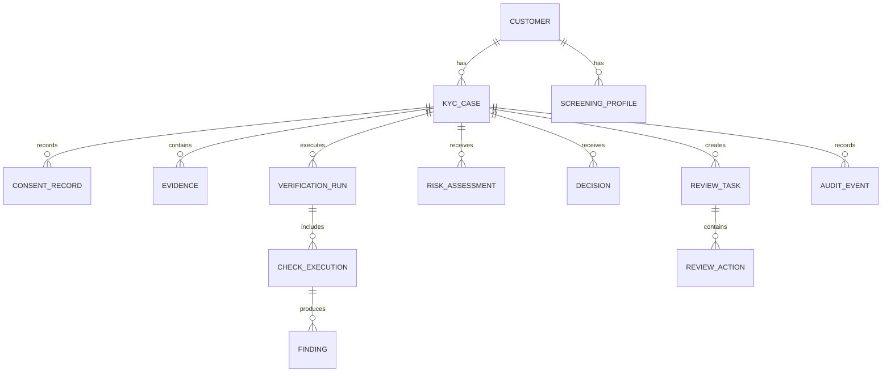

## 16.2 `kyc_case`

```sql
CREATE TABLE kyc_case (
    id                  UUID PRIMARY KEY,
    tenant_id           UUID NOT NULL,
    customer_id         UUID NOT NULL,
    customer_type       VARCHAR(30) NOT NULL,
    country_code        CHAR(2) NOT NULL,
    product_code        VARCHAR(50) NOT NULL,
    status              VARCHAR(40) NOT NULL,
    risk_tier           VARCHAR(20),
    policy_id           VARCHAR(100) NOT NULL,
    policy_version      INTEGER NOT NULL,
    workflow_id         VARCHAR(120),
    version             INTEGER NOT NULL DEFAULT 1,
    expires_at          TIMESTAMPTZ,
    created_at          TIMESTAMPTZ NOT NULL,
    updated_at          TIMESTAMPTZ NOT NULL
);

CREATE UNIQUE INDEX uq_active_case
ON kyc_case (tenant_id, customer_id, product_code)
WHERE status NOT IN ('REJECTED', 'CANCELLED', 'EXPIRED');
```

## 16.3 `evidence`

```sql
CREATE TABLE evidence (
    id                  UUID PRIMARY KEY,
    case_id             UUID NOT NULL REFERENCES kyc_case(id),
    evidence_type       VARCHAR(50) NOT NULL,
    storage_reference   TEXT NOT NULL,
    content_hash        VARCHAR(64) NOT NULL,
    content_type        VARCHAR(100) NOT NULL,
    size_bytes          BIGINT NOT NULL,
    status              VARCHAR(30) NOT NULL,
    encryption_key_ref  TEXT NOT NULL,
    retention_class     VARCHAR(40) NOT NULL,
    uploaded_at         TIMESTAMPTZ NOT NULL,
    deleted_at          TIMESTAMPTZ
);
```

Do not store raw document bytes in the relational database.

## 16.4 `check_execution`

```sql
CREATE TABLE check_execution (
    id                    UUID PRIMARY KEY,
    verification_run_id   UUID NOT NULL,
    check_type            VARCHAR(50) NOT NULL,
    status                VARCHAR(30) NOT NULL,
    provider              VARCHAR(50),
    provider_reference    VARCHAR(200),
    request_fingerprint   VARCHAR(64) NOT NULL,
    attempt_count         INTEGER NOT NULL DEFAULT 0,
    started_at            TIMESTAMPTZ,
    completed_at          TIMESTAMPTZ,
    error_class           VARCHAR(50),
    next_retry_at         TIMESTAMPTZ,
    result_version        INTEGER NOT NULL DEFAULT 1
);

CREATE UNIQUE INDEX uq_check_request
ON check_execution (verification_run_id, check_type, request_fingerprint);
```

## 16.5 `finding`

```sql
CREATE TABLE finding (
    id                  UUID PRIMARY KEY,
    check_execution_id  UUID NOT NULL,
    finding_code        VARCHAR(100) NOT NULL,
    outcome             VARCHAR(20) NOT NULL,
    severity            VARCHAR(20) NOT NULL,
    confidence          NUMERIC(5,4),
    attributes          JSONB NOT NULL,
    created_at          TIMESTAMPTZ NOT NULL
);
```

Example findings:

```text
DOCUMENT_EXPIRED
DOCUMENT_TAMPERING_SUSPECTED
NAME_MATCH
DOB_MISMATCH
LIVENESS_PASSED
FACE_MATCH_BELOW_THRESHOLD
SANCTIONS_POSSIBLE_MATCH
PEP_POSSIBLE_MATCH
DUPLICATE_IDENTITY_FOUND
```

## 16.6 `decision`

```sql
CREATE TABLE decision (
    id                  UUID PRIMARY KEY,
    case_id             UUID NOT NULL,
    decision_type       VARCHAR(40) NOT NULL,
    source              VARCHAR(20) NOT NULL,
    reason_codes        JSONB NOT NULL,
    policy_id           VARCHAR(100) NOT NULL,
    policy_version      INTEGER NOT NULL,
    risk_assessment_id  UUID,
    supersedes_id       UUID,
    decided_by          UUID,
    decided_at          TIMESTAMPTZ NOT NULL
);
```

Decisions should be append-only. A later decision supersedes an earlier one instead of rewriting history.

## 16.7 PII separation

Use a dedicated PII vault or restricted schema:

```text
customer_identity:
  customer_id
  full_name_encrypted
  dob_encrypted
  address_encrypted
  document_number_token
  pii_key_reference
```

Operational services can use customer IDs and tokens without accessing raw PII.

---

# 17. Idempotency, Retries, and Exactly-Once Business Effects

## 17.1 API idempotency

For mutation requests, store `tenant_id`, `idempotency_key`, `request_hash`, `response_status`, the `response_body` or a reference to it, `created_at`, and `expires_at`.

The rules that fall out of that record: the same key with the same payload returns the original result; the same key with a different payload returns a conflict; keys are scoped by tenant and endpoint; and the result is persisted *before* success is returned. See [Idempotency and HTTP Methods](../api-design/idempotency-http-methods.md) for the general pattern.

## 17.2 Message processing

Use an inbox table:

```sql
CREATE TABLE consumer_inbox (
    consumer_name VARCHAR(100) NOT NULL,
    event_id      UUID NOT NULL,
    processed_at  TIMESTAMPTZ NOT NULL,
    PRIMARY KEY (consumer_name, event_id)
);
```

Consumer flow:

```text
BEGIN
  Insert event_id into inbox
  If duplicate -> stop
  Apply business change
  Write outgoing event to outbox
COMMIT
```

## 17.3 Transactional outbox

```sql
CREATE TABLE event_outbox (
    id              UUID PRIMARY KEY,
    aggregate_type  VARCHAR(50) NOT NULL,
    aggregate_id    UUID NOT NULL,
    event_type      VARCHAR(100) NOT NULL,
    payload         JSONB NOT NULL,
    created_at      TIMESTAMPTZ NOT NULL,
    published_at    TIMESTAMPTZ
);
```

A publisher sends committed events to the broker and marks them as published.

This avoids: `Database committed but event not published`

or: `Event published but database rolled back`

## 17.4 Retry classification

Retrying a permanent failure burns vendor quota and delays the customer; not retrying a transient one rejects a legitimate customer for an infrastructure reason. Classify explicitly.

| Retryable | Non-retryable |
|---|---|
| Timeout | Unsupported document type |
| Connection reset | Invalid input schema |
| HTTP 429 | Document expired |
| Vendor 5xx | Consent missing |
| Temporary registry unavailable | Customer under minimum age |
| Broker delivery failure | Definite policy violation |

## 17.5 Backoff

```text
delay = min(base * 2^attempt + jitter, max_delay)
```

That yields roughly `5 s → 12 s → 24 s → 51 s → 2 min → 5 min`. Use vendor-specific retry budgets so one slow provider cannot consume the whole worker pool.

## 17.6 Vendor callbacks

A vendor can send the same callback many times, so deduplicate on `unique(provider, provider_event_id)`.

Also verify the signature, the timestamp, the source address where feasible, the provider reference, the expected current check state, and the payload hash before acting on it.

## 17.7 Avoid pretending infrastructure gives exactly-once delivery

Message brokers generally provide at-least-once delivery in practical failure scenarios.

The goal is:

```text
At-least-once message delivery
+
Idempotent consumer
+
Transactional state update
=
Exactly-once business effect
```

---

# 18. Security, Privacy, and Compliance

## 18.1 Data classification

Classify data clearly.

| Class | Examples |
|---|---|
| Restricted PII | Full identity data, document images, document numbers |
| Restricted biometric | Selfies, videos, face templates |
| Confidential compliance | Screening matches, investigations, reviewer notes |
| Internal operational | Case status, check timing, vendor health |
| Public | Generic product documentation |

## 18.2 Encryption

**In transit:** TLS for every service connection, mTLS for sensitive internal and vendor integrations where supported, automated certificate rotation, and strong webhook signatures.

**At rest:** envelope encryption backed by a KMS or HSM, keys separated by environment, tenant, or data domain where justified, key rotation, key-use audit logs, and a distinct key policy for biometrics.

## 18.3 Tokenization

Replace values such as a document number with tokens: the raw PAN or passport number lives only in the PII vault, the application database holds `tok_doc_c8d41`, and logs and events carry a masked or tokenized value.

## 18.4 Access control

Use RBAC plus attributes.

```text
Role: KYC_REVIEWER
Attributes:
  jurisdiction = IN
  product = PAYMENTS
  risk_clearance = STANDARD
```

A reviewer should see only cases matching their authorization, and step-up authentication should be required for downloading evidence, viewing full document numbers, high-risk approvals, bulk exports, and administrative configuration changes.

## 18.5 Audit log

Every audit event names:

- Actor, action, and resource
- Timestamp and request/correlation ID
- Old and new state, and the reason
- Policy version
- Source IP or device context where appropriate
- Evidence accessed, and any export or download

Protect the log from modification — append-only database permissions, write-once object storage, hash chaining, signed log batches, or storage in an independent security account. Any of these is fine; having none of them makes the audit trail worth exactly as much as the operational database's access controls.

## 18.6 Log hygiene

These must never reach an ordinary log, at any level, in any environment:

- Full document images and selfies
- Full document numbers and full addresses
- Raw vendor payloads
- Access tokens
- Biometric embeddings

Use structured redaction:

```json
{
  "case_id": "kyc_...",
  "document_number": "***4821",
  "customer_id": "cus_...",
  "error_code": "VENDOR_TIMEOUT"
}
```

## 18.7 Data minimization

Collect only what identity verification, risk assessment, legal retention, or product eligibility actually requires.

Do not collect extra identity evidence only because the vendor supports it.

## 18.8 Retention and deletion

Retention differs by data class — raw uploads, extracted fields, biometric captures, verification results, audit records, sanctions-screening history, and rejected applications can each have their own clock.

Implement a policy engine:

```text
retention_class = KYC_EVIDENCE_IN_REGULATED
retain_until = relationship_end + legal_period
legal_hold = false
```

Deletion is not one `DELETE` — it has to reach primary storage, search indexes, caches, derived thumbnails, vendor-side copies where the contract supports it, any still-valid pre-signed URLs, and the backup lifecycle according to policy.

## 18.9 Consent and purpose limitation

Consent is not a universal legal basis for every regulated processing activity, but where consent or notice is required, the system must be able to prove what the customer was told, which version of that text they saw, what action they took, when it happened, and which purpose it applied to.

Data collected for KYC should not silently become marketing or unrelated analytics data.

## 18.10 Model governance

For OCR, fraud, face-match, liveness, or risk models: track the model version, evaluate false-accept and false-reject rates, monitor drift, test across representative conditions, and always keep a human escalation path.

If generative AI is used anywhere in the pipeline, protect against prompt and model-output injection, and never let a free-form LLM directly produce a final regulatory decision without controlled rules and review.

## 18.11 Jurisdiction-specific policy

Regulatory details vary. Keep them in policy/configuration modules, not scattered throughout code.

Example:

```text
Country policy
  -> allowed identity methods
  -> required evidence
  -> age rules
  -> PEP treatment
  -> retention
  -> periodic refresh
  -> customer-notification wording
  -> reviewer approval level
```

---

# 19. Scalability and Capacity Planning

## 19.1 Example traffic assumptions

Assume:

```text
1,000,000 KYC cases/day
60% submitted during 8 peak hours
Average 4 automated checks/case
Average 3 evidence files/case
Average evidence size = 3 MB
```

Peak submitted cases per second:

```text
1,000,000 × 0.60 / (8 × 3600)
≈ 20.8 cases/second
```

Add a 5× burst factor: `≈ 105 cases/second`

Check jobs: `105 × 4 = 420 check jobs/second`

Evidence ingestion:

```text
105 × 3 × 3 MB
≈ 945 MB/second during an extreme synchronized burst
```

The storage upload path must scale independently from API servers.

## 19.2 Storage estimate

Daily raw evidence:

```text
1,000,000 cases × 3 files × 3 MB
= 9,000,000 MB
≈ 9 TB/day
```

Compression, retention, duplicate uploads, video, and derived assets can change this significantly.

At 9 TB/day, object storage stops being a convenience and becomes a requirement, retention becomes a line item rather than a compliance detail, video cannot be retained indefinitely by default, and lifecycle policies become part of the architecture rather than housekeeping.

## 19.3 Service scaling

### Stateless APIs

Scale horizontally behind a load balancer.

### Workflow workers

Scale by queue depth and task type.

```text
document-worker pool
biometric-worker pool
screening-worker pool
notification-worker pool
```

### Databases

Use read replicas for reviewer and search views, partition by tenant, creation date, or regional shard, index the status and queue fields, pool connections, archive old operational records, and keep analytics on a separate pipeline. See [Database Scaling](db-scaling.md) for the general playbook.

### Object processing

Use event-triggered workers with concurrency limits.

## 19.4 Backpressure

When a vendor slows down, the wrong move is to raise concurrency. Queue requests instead, apply per-vendor rate limits, put a circuit breaker in front, expose the pending status to the customer, preserve the case's deadlines, and shift to a secondary vendor where policy allows.

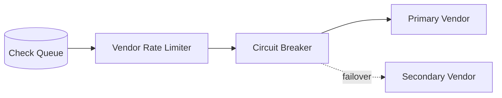

## 19.5 Screening indexes

For large watchlists, normalize names during ingestion, build phonetic and n-gram indexes, retrieve candidates before running expensive scoring, partition by entity type or script where useful, cache list versions rather than final customer decisions, and re-screen incrementally against changed records only.

## 19.6 Multi-region strategy

Possible model:

```text
Customer region
  -> regional ingestion and PII storage
  -> regional verification workers
  -> globally replicated non-PII case status
  -> centralized policy metadata
```

The constraints to weigh are data residency, vendor endpoint location, cross-border data transfer, key locality, the legality of failover itself, and watchlist synchronization.

A technically possible failover may still be legally unacceptable if it moves PII to another region.

---

# 20. Reliability and Failure Handling

## 20.1 Failure matrix

| Failure | System behavior |
|---|---|
| Customer upload interrupted | Support resumable/retryable upload |
| OCR worker crashes | Message becomes visible again; idempotent retry |
| Vendor times out | Retry with backoff; keep case pending |
| Vendor returns malformed response | Store diagnostic safely; mark integration error |
| Screening list refresh fails | Continue with last approved version; alert list freshness |
| Event delivered twice | Inbox deduplication |
| Decision service unavailable | Findings remain durable; retry decision task |
| Reviewer action conflicts | Optimistic lock and explicit conflict response |
| Webhook endpoint down | Retry and allow event replay |
| Object scan fails | Quarantine evidence; do not process |
| Database unavailable | Reject or queue writes safely; never acknowledge uncommitted work |

## 20.2 Circuit breaker

States:

```text
CLOSED
  Calls flow normally

OPEN
  Calls fail fast or queue; vendor is considered unhealthy

HALF_OPEN
  Limited probe calls test recovery
```

Use separate breakers by vendor capability and region.

## 20.3 Timeouts

Set layered timeouts:

```text
Client request timeout       10 s
Internal service timeout      3 s
Vendor API timeout            8 s
Workflow activity timeout    30 s
Overall check deadline       15 min
Case completion deadline      7 days
```

The exact values depend on the provider and user journey.

## 20.4 Dead-letter queues

A DLQ is for investigation, not permanent storage. Each message should retain the original event, an error classification, the attempt count, the first and last failure times, the consumer version, and the correlation ID.

Provide controlled replay after fixing the root cause.

## 20.5 Graceful degradation

Degradation is a policy decision, not an implementation detail. If adverse media is unavailable but not mandatory for low-risk onboarding, continue under a documented fallback policy. If sanctions screening is mandatory, keep the case pending rather than approve it. If the primary liveness vendor is down, use a permitted secondary provider; if all providers are down, still accept the customer's evidence and process it later.

Do not silently skip a mandatory control.

## 20.6 Disaster recovery

Define an RPO (maximum acceptable data loss) and an RTO (maximum acceptable recovery time) per store, because they are not the same for all three.

Example:

```text
Operational case database:
  RPO <= 5 minutes
  RTO <= 60 minutes

Evidence object storage:
  RPO near zero using durable replicated storage
  RTO <= 4 hours for regional disaster

Audit store:
  RPO near zero
  RTO <= 4 hours
```

Test recovery, including key access and workflow resumption.

---

# 21. Observability and Auditability

## 21.1 What to measure

Three layers, and the top one is the layer most teams forget to instrument.

| Layer | Metrics |
|---|---|
| Business | Cases started, submission completion rate, automatic approval rate, manual review rate, rejection rate, more-information rate, abandonment by step, median time to decision, review SLA breaches, re-KYC completion rate |
| Verification | Document pass/fail rate, liveness pass/fail rate, face-match score distribution, sanctions and PEP alert rates, false-positive rate after review, OCR confidence distribution, duplicate-identity rate, vendor disagreement rate |
| Technical | API latency and error rate, queue depth and oldest-message age, worker utilization, vendor latency, timeout and 429 rates, retry rate, circuit-breaker state, DLQ size, object-processing latency, database lock and conflict rate, webhook delivery success, watchlist freshness |

## 21.2 High-value SLOs

Example:

```text
99.9% of case-creation requests succeed monthly.
95% of eligible fast-path cases receive a decision within 30 seconds.
99% of mandatory screening tasks begin within 60 seconds.
99.9% of final decisions produce an audit event.
99% of signed webhooks are delivered within 5 minutes when receiver is healthy.
```

## 21.3 Trace model

Use one trace/correlation ID across:

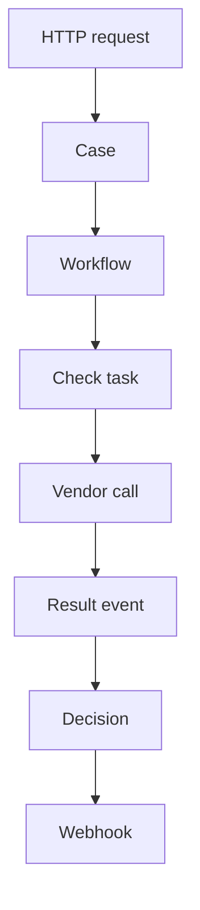

Do not attach raw PII to tracing spans.

## 21.4 Alerts

Examples:

```text
Mandatory screening queue oldest age > 5 min
Watchlist age exceeds approved threshold
Auto-approval rate changes by > 20%
One country has sudden face-match failure spike
Vendor timeout rate > 5%
Manual review SLA breach count rising
Audit-event write failure > 0
```

Business anomalies can reveal integration failures earlier than CPU metrics.

---

# 22. Re-KYC and Continuous Monitoring

KYC does not end after approval.

## 22.1 Triggers

| Trigger class | Examples |
|---|---|
| Time based | Annual or multi-year cycles, more frequent for high-risk customers, and always before document expiry |
| Event based | Name or address change, ownership change, product upgrade, transaction-pattern change, a new PEP or sanctions match, returned mail or failed contact, a suspicious-activity alert, identity-document expiry, material regulatory change |

## 22.2 Re-KYC flow

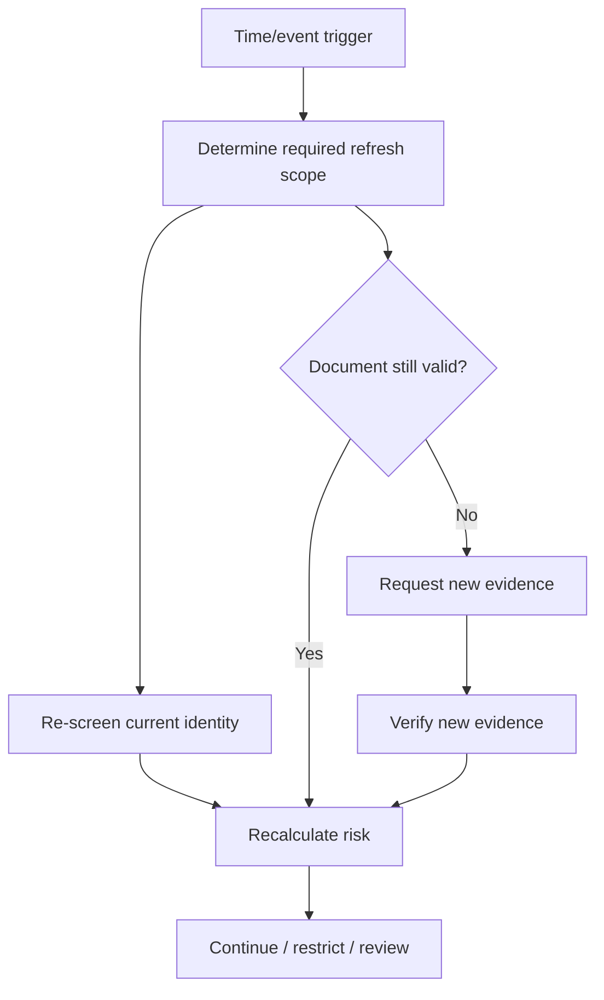

## 22.3 Avoid full re-verification when unnecessary

A policy may require only sanctions re-screening, an address confirmation, new source-of-funds evidence, or a replacement document because the previous one expired — not a full repeat of onboarding.

Use incremental refresh to reduce customer friction.

## 22.4 Customer profile snapshots

Preserve effective-dated identity profiles.

```text
Profile v1: 2024-01-01 to 2025-06-10
Profile v2: 2025-06-10 to present
```

Screening and decisions should reference the profile version used.

---

# 23. Vendor Integration Strategy

## 23.1 Capability interface

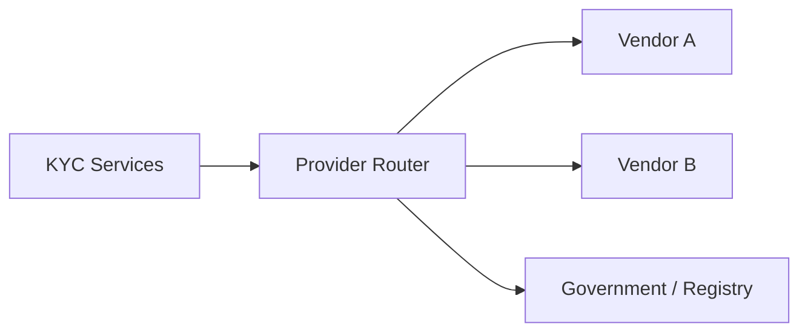

The router chooses on country, document type, product, data residency, cost, vendor health, accuracy, contractual restrictions, customer channel, and the configured fallback policy.

## 23.2 Normalize vendor responses

Internal result:

```json
{
  "check_type": "LIVENESS",
  "outcome": "PASS",
  "confidence": 0.94,
  "reason_codes": [],
  "provider": "vendor_b",
  "provider_model_version": "2026.04",
  "completed_at": "2026-08-03T06:12:43Z"
}
```

Keep the raw provider response in restricted storage for debugging and audit, subject to retention policy.

## 23.3 Provider routing

```python
def choose_document_provider(context):
    candidates = registry.supporting(
        country=context.country,
        document_type=context.document_type,
        residency_region=context.data_region,
    )

    healthy = [p for p in candidates if p.health.is_usable]

    return min(
        healthy,
        key=lambda p: (
            p.policy_priority,
            p.expected_latency_ms,
            p.unit_cost,
        ),
    )
```

Real routing should avoid changing vendors unpredictably in ways that make outcomes inconsistent.

## 23.4 Build versus buy

The line falls between *capabilities that need scale you do not have* and *decisions that encode your business*.

| Buy | Build |
|---|---|
| Global document template coverage | Workflow orchestration |
| Liveness | Policy engine |
| Sanctions datasets | Audit model |
| PEP datasets | Review tooling |
| Government-source connectivity | Vendor abstraction and internal blocklists |
| Rapid market launch | Product-specific risk and data-retention enforcement |

A common practical design is:

> Build the KYC platform and decision layer.  
> Buy specialized verification capabilities.

## 23.5 Vendor exit plan

Store enough normalized information to reproduce past decisions, change providers, re-screen customers, audit historical checks, and compare vendor quality without needing the vendor's cooperation.

Avoid using a vendor's case ID as your primary identity — that single shortcut is what turns a provider migration into a data-recovery project.

---

# 24. Deployment Model

## 24.1 Logical services

A practical service split:

```text
kyc-api
kyc-case-service
kyc-workflow-workers
evidence-service
document-verification-service
biometric-verification-service
screening-service
risk-decision-service
review-service
webhook-service
watchlist-ingestion-service
audit-service
```

Start with fewer deployables if the team is small. Clear module boundaries matter more than creating many microservices.

## 24.2 Example cloud deployment

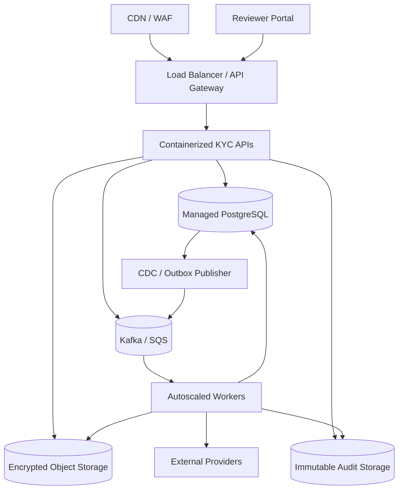

## 24.3 Network controls

Services and databases live in private subnets with no public database endpoint; egress goes through a proxy or NAT with destination controls and per-vendor allowlists; storage is reached over private endpoints; evidence processing gets its own restricted subnet or account; and every service authenticates with its own identity rather than a shared credential.

## 24.4 Environment separation

Separate accounts or projects, KMS keys, databases, object buckets, vendor credentials, watchlist test data, and reviewer identities.

Never copy production identity documents into lower environments. Use synthetic or properly anonymized test data.

---

# 25. Important Trade-offs

## 25.1 Synchronous versus asynchronous verification

| Synchronous | Asynchronous |
|---|---|
| Simpler client flow for very fast checks | Handles slow vendors and review |
| Immediate response | Better retries and resilience |
| Hard timeout limits | Requires status API/webhooks |
| Poor fit for multi-step KYC | Better fit for long-running workflow |

Recommended: synchronous case creation, asynchronous verification.

## 25.2 Orchestration versus choreography

| | Orchestration — a central workflow controls the sequence | Choreography — services react to events with no central controller |
|---|---|---|
| For | Easier state visibility; clear timeout and retry ownership; a natural place to pause for manual review; easier policy-driven branching | Loose coupling; simple for independent reactions |
| Against | The orchestrator becomes load-bearing infrastructure; workflow evolution must be managed carefully | Harder to understand end-to-end state; risk of event loops and hidden dependencies; difficult long-running coordination |

Recommended: orchestrate the KYC case while using events for integration and side effects.

## 25.3 One vendor versus multiple vendors

| | One vendor | Multiple vendors |
|---|---|---|
| For | Faster integration, simpler operations, less normalization work | Better coverage and resilience, and you can compare quality |
| Against | Higher concentration risk | More contracts and cost, inconsistent results between providers, more complex routing and audit |

Recommended: design an abstraction from day one, but add providers only when justified.

## 25.4 Rules versus machine learning

| | Rules | Machine learning |
|---|---|---|
| For | Explainable, easy to audit, a good fit for policy requirements | Strong on fraud patterns and image analysis, can combine complex signals |
| Against | Can become difficult to maintain at scale | Requires monitoring and governance, and is harder to explain to a regulator |

Recommended:

```text
ML produces signals.
Rules and controlled policies produce regulatory decisions.
Humans resolve uncertainty.
```

## 25.5 Strong consistency versus eventual consistency

Use strong consistency for the final decision, case transitions, the reviewer lock, the consent record, and active policy selection — everything a regulator would ask you to reproduce.

Eventual consistency is acceptable for analytics dashboards, search indexes, non-critical notifications, derived metrics, and reviewer read models provided the freshness is visible on screen. See [Consistency, CAP, and Retries](consistency-cap-retries.md) for the underlying model.

## 25.6 Centralized versus regional PII

Centralized storage is operationally simpler. Regional storage may be forced by data residency, latency, contract restrictions, or cross-border transfer controls.

A hybrid model often keeps raw PII regional while centralizing tokenized operational metadata.

---

# 26. Practical Implementation Plan

## 26.1 Phases

| Phase | What you build |
|---|---|
| 1 — Core onboarding | Case API, consent records, secure uploads, one document provider, one sanctions/PEP provider, basic risk rules, automatic approve/review/reject, a reviewer queue, signed webhooks, an audit trail |
| 2 — Resilience and operations | Durable workflow engine, outbox and inbox, retry policies, circuit breakers, DLQ replay tooling, case search, reviewer SLA and assignment, provider health dashboard, evidence retention jobs |
| 3 — Fraud and coverage | Liveness and face matching, duplicate identity, device and velocity signals, additional countries and documents, secondary providers, EDD flows, four-eyes approvals |
| 4 — Continuous compliance | Incremental list ingestion, continuous sanctions/PEP screening, scheduled re-KYC, event-driven refresh, model monitoring, policy simulation, compliance reporting |

Phase 1 is deliberately deployable as one service. Keep the workflow modular anyway — the phase-2 move to a durable engine is a refactor only if the boundaries already exist.

## 26.2 Suggested technology choices

These are examples, not requirements.

| Concern | Practical choices |
|---|---|
| API | FastAPI, Django REST Framework, Spring Boot, NestJS |
| Workflow | Temporal, Step Functions, Camunda, Durable Functions |
| Database | PostgreSQL |
| Event bus | Kafka, SQS/SNS, Pub/Sub, RabbitMQ |
| Object storage | S3, GCS, Azure Blob |
| Search | OpenSearch/Elasticsearch |
| Cache | Redis |
| Secrets | Cloud secret manager + KMS/HSM |
| Policy | Versioned code/config, OPA for authorization, dedicated rules engine where justified |
| Observability | OpenTelemetry, Prometheus, Grafana, cloud-native logging |
| Infrastructure | Kubernetes, ECS, managed containers, serverless workers |

## 26.3 Simplified service pseudocode

```python
async def start_verification(case_id: str, idempotency_key: str) -> str:
    case = await case_repository.get_for_update(case_id)

    assert case.status in {
        "EVIDENCE_PENDING",
        "MORE_INFORMATION_REQUIRED",
    }

    evidence = await evidence_repository.get_ready(case_id)
    policy = await policy_service.resolve(case)

    required = policy.required_checks(case=case, evidence=evidence)
    fingerprint = build_request_fingerprint(
        case_id=case.id,
        evidence_hashes=[item.content_hash for item in evidence],
        policy_version=policy.version,
        checks=required,
    )

    existing = await run_repository.find_by_fingerprint(fingerprint)
    if existing:
        return existing.id

    run = await run_repository.create(
        case_id=case.id,
        policy_id=policy.id,
        policy_version=policy.version,
        fingerprint=fingerprint,
    )

    case.transition_to("AUTO_CHECKS_RUNNING")

    for check_type in required:
        await outbox.add(
            event_type="kyc.check.requested",
            aggregate_id=case.id,
            payload={
                "case_id": str(case.id),
                "run_id": str(run.id),
                "check_type": check_type,
            },
        )

    await unit_of_work.commit()
    return run.id
```

## 26.4 Aggregating results

```python
async def on_check_completed(event: CheckCompleted) -> None:
    if await inbox.already_processed(event.event_id):
        return

    run = await run_repository.get_for_update(event.run_id)
    await findings_repository.attach(
        run_id=run.id,
        check_id=event.check_id,
        findings=event.findings,
    )

    if not await run_repository.all_mandatory_checks_terminal(run.id):
        await inbox.mark_processed(event.event_id)
        await unit_of_work.commit()
        return

    risk = await risk_service.calculate(run.id)
    decision = await decision_service.evaluate(
        case_id=run.case_id,
        risk=risk,
        findings=await findings_repository.for_run(run.id),
        policy_version=run.policy_version,
    )

    await apply_decision(decision)
    await inbox.mark_processed(event.event_id)
    await unit_of_work.commit()
```

## 26.5 Testing strategy

The resilience row is the one that catches the defects that matter here — everything above it is table stakes.

| Level | What it covers |
|---|---|
| Unit | Risk rules, state transitions, normalization, the decision matrix, retry classification, policy selection |
| Integration | Database transactions, outbox publishing, object-upload completion, vendor adapter mapping, webhook signing, watchlist ingestion |
| Contract | Provider requests and responses, event schemas, the upstream product API, the reviewer portal API |
| End-to-end | Fast-path approval, evidence retake, a possible sanctions match, vendor outage and recovery, manual review, a re-KYC trigger |
| Resilience | Duplicate event, out-of-order event, worker crash after vendor success, database commit followed by broker outage, a provider callback arriving before the polling response, watchlist parser failure, key rotation |

---

# 27. How to Explain This Design in an Interview

A strong explanation can follow this order.

## 27.1 Start with the workflow

> “KYC is a long-running workflow, not one synchronous request. I would create a durable case, collect consent and evidence, run independent checks asynchronously, aggregate normalized findings, calculate risk, and then automatically decide clear cases or create a manual-review task.”

## 27.2 Draw the main architecture

Draw the backbone from "In short" and nothing more: client → API and secure upload → case service → workflow orchestrator → verification services over the event bus → risk and decision engine → automatic decision or manual review → audit and notifications.

Resist adding the thirty boxes from the full architecture. The interviewer is checking whether you know which components are load-bearing, and adding the cache and the search index to the first drawing signals the opposite.

## 27.3 Explain why it is asynchronous

External vendors can be slow or unavailable, multiple checks can run in parallel, manual review can take hours, and a retryable failure must never reject a customer. Webhooks and a status API carry completion back to the product.

## 27.4 Protect the critical invariants

State the invariants clearly:

1. One final business effect for each idempotent request.
2. No final approval without all mandatory checks.
3. Every decision references evidence, findings, policy, and list versions.
4. Mandatory control outages leave the case pending, not approved.
5. Human overrides are authorized and audited.
6. Raw PII does not leak into logs or general events.

## 27.5 Discuss scale with real bottlenecks

The API is usually not the hardest part. The real bottlenecks are image and video upload, external provider rate limits, OCR and biometric compute, watchlist candidate matching, reviewer capacity, evidence retention cost, and re-screening the existing customer base when a list changes.

Reviewer capacity is worth naming explicitly: it is the one bottleneck you cannot autoscale, which is why the automatic approval rate is an architectural metric and not a business one.

## 27.6 Points people miss

Four things that separate a complete answer from a partial one: use a transactional outbox so a state change and its event commit together; build re-screening and re-KYC into the *initial* data model rather than bolting them on; protect PII and biometrics with encryption, tokenization, access controls and enforced retention rather than access controls alone; and measure business outcomes (auto-approval rate, false-positive rate after review) beside technical health, because a broken integration shows up in the approval rate long before it shows up in CPU.

## 27.7 Finish with trade-offs

A balanced final statement:

> “I would build the orchestration, policy, evidence lineage, audit, and review platform internally, while integrating specialist providers for document coverage, liveness, and watchlist data. I would keep providers behind normalized adapters so the business can change vendors without rewriting policy. For state, I would use strong consistency on decisions and transitions, and accept eventual consistency for analytics and search.”

---

# 28. Official References

The following sources are useful starting points. Final implementation must be reviewed by legal, compliance, privacy, and security teams for the applicable jurisdiction and product.

1. **FATF Recommendations**  
   https://www.fatf-gafi.org/en/publications/Fatfrecommendations/Fatf-recommendations.html

2. **FATF Guidance on Digital Identity**  
   https://www.fatf-gafi.org/en/publications/Financialinclusionandnpoissues/Digital-identity-guidance.html

3. **FATF update supporting a proportionate, risk-based approach and financial inclusion — February 2025**  
   https://www.fatf-gafi.org/en/publications/Fatfrecommendations/update-standards-promote-financial-conclusion-feb-2025.html

4. **NIST SP 800-63-4: Digital Identity Guidelines**  
   https://pages.nist.gov/800-63-4/

5. **NIST SP 800-63A-4: Identity Proofing and Enrollment**  
   https://csrc.nist.gov/pubs/sp/800/63/a/4/final

6. **Reserve Bank of India — Master Direction: Know Your Customer Direction, 2016, updated 14 August 2025**  
   https://www.rbi.org.in/commonman/english/scripts/notification.aspx?id=2607

7. **Reserve Bank of India — FAQs on Master Direction on KYC, 9 June 2025**  
   https://www.rbi.org.in/commonman/English/Scripts/FAQs.aspx?Id=3782

8. **UIDAI — Aadhaar Paperless Offline e-KYC**  
   https://uidai.gov.in/en/contact-support/have-any-question/307-english-uk/faqs/aadhaar-online-services/aadhaar-paperless-offline-e-kyc.html

9. **UIDAI — Secure QR and Offline Verification Information**  
   https://uidai.gov.in/en/ecosystem/authentication-devices-documents/about-aadhaar-paperless-offline-e-kyc.html

10. **United Nations Security Council Consolidated Sanctions List**  
    https://main.un.org/securitycouncil/en/content/un-sc-consolidated-list

---

> **Important:** This is a system-design learning document, not legal advice. KYC, AML, sanctions, biometric, retention, and reporting requirements vary by jurisdiction, entity type, customer type, and product.
