# Design a Multi-Channel Notification System

> **Category:** System Design  
> **Audience:** Backend developers with 3+ years of experience  
> **Last updated:** August 2026

---

# 1. Introduction

A **multi-channel notification system** sends messages to users through different communication channels, such as:

- Email
- SMS
- Mobile push notifications
- Web push notifications
- In-app notifications
- WhatsApp or other chat channels

Examples include:

- An OTP sent by SMS
- An order confirmation sent by email
- A payment-failure alert sent through push and email
- A promotional offer sent through email
- A social notification shown in the application's notification inbox

The main challenge is not simply calling an email or SMS provider. A production system must handle:

- High traffic
- Different provider APIs
- User preferences
- Templates and localization
- Retries and duplicate prevention
- Scheduling
- Delivery tracking
- Rate limits
- Failures and provider outages
- Security and regulatory requirements

The system should isolate product services from provider-specific logic.

```text
Order Service should say:

    "Notify user 123 that order 789 was shipped"

It should not need to know:

    - Which email provider is used
    - Which SMS provider is used
    - Whether the user disabled SMS
    - How the message is formatted
    - How retries are performed
```

---

# 2. Requirements

## 2.1 Functional Requirements

The system should support:

1. Sending notifications through multiple channels.
2. Receiving notification requests through APIs and domain events.
3. Sending to one user, a group of users, or a large audience.
4. Immediate and scheduled notifications.
5. Transactional and promotional notifications.
6. User-level channel preferences.
7. Quiet hours and timezone-aware delivery.
8. Reusable, versioned, localized templates.
9. Personalization using variables.
10. Priorities such as critical, high, normal, and bulk.
11. Retry policies for temporary failures.
12. Provider delivery-status callbacks.
13. An in-app notification inbox.
14. Deduplication and idempotency.
15. Auditing and delivery history.
16. Provider failover where appropriate.
17. Notification cancellation before dispatch.
18. Digest notifications that combine multiple events.

## 2.2 Non-Functional Requirements

### Availability

The ingestion API should remain available even when an external provider is unavailable.

### Scalability

The system should scale from a few notifications per second to hundreds of thousands or millions per minute.

### Durability

An accepted notification should not disappear because a worker crashes.

### Low Latency

Critical notifications such as OTPs and security alerts should be dispatched within seconds.

### Extensibility

Adding a new channel or provider should not require major changes to business services.

### Observability

The system should expose queue delays, provider errors, delivery rates, retry counts, and end-to-end latency.

### Security

Sensitive data, provider credentials, user contact details, and webhook endpoints must be protected.

### Cost Efficiency

Bulk and low-priority traffic should not consume the same expensive resources as critical traffic.

## 2.3 Out of Scope

Depending on the interview scope, the following can be excluded initially:

- Full marketing-campaign management
- Customer journey builders
- Content recommendation
- Advanced email layout editors
- Machine-learning-based send-time optimization
- Telecom carrier infrastructure
- Provider-internal delivery mechanisms

---

# 3. Core Concepts

## 3.1 Notification, Message, and Delivery Attempt

These terms should be modeled separately.

### Notification

A business-level intent.

```text
Notify user 42 that invoice INV-981 is overdue.
```

### Message

A rendered, channel-specific representation.

```text
Email message:
Subject: Invoice INV-981 is overdue
Body: Your invoice of ₹12,000 was due on 2 August 2026.
```

### Delivery Attempt

One attempt to send a message through a provider.

```text
Attempt 1 -> SendGrid -> timeout
Attempt 2 -> SendGrid -> accepted
Provider callback -> delivered
```

A single notification can create multiple messages, and each message can have multiple delivery attempts.

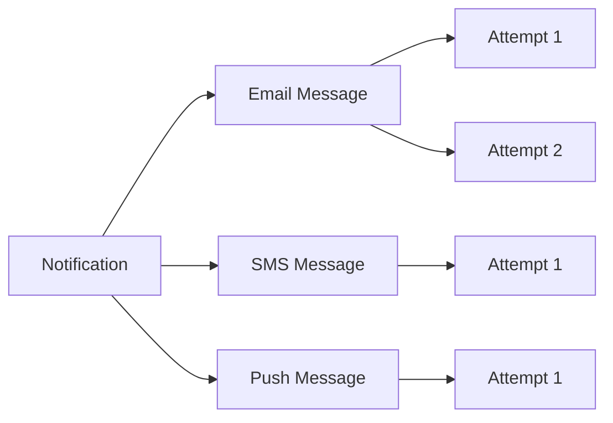

## 3.2 Transactional vs Promotional Notifications

### Transactional

Triggered by user or system activity.

Examples:

- OTP
- Password reset
- Payment receipt
- Order update
- Security alert

Characteristics:

- High importance
- Low latency
- Usually sent even if marketing notifications are disabled
- Strict audit and security requirements

### Promotional

Used for marketing or engagement.

Examples:

- Discount campaign
- Product recommendations
- Newsletter
- Re-engagement message

Characteristics:

- Requires consent
- Can be delayed
- Often sent in large batches
- Strong unsubscribe and frequency-control requirements

Keep transactional and promotional traffic separated through different:

- Queues
- Worker pools
- Provider accounts or sending domains
- Rate limits
- Monitoring dashboards

This prevents a large marketing campaign from delaying OTPs.

## 3.3 Push vs Pull Channels

### Push Channels

The system sends content to an external destination.

- Email
- SMS
- Mobile push
- Web push
- WhatsApp

### Pull or Stored Channels

The application stores the notification, and the user retrieves it.

- In-app inbox
- Notification center
- Activity feed

An in-app notification is usually stored in the application's database and exposed through an API.

---

# 4. High-Level Architecture

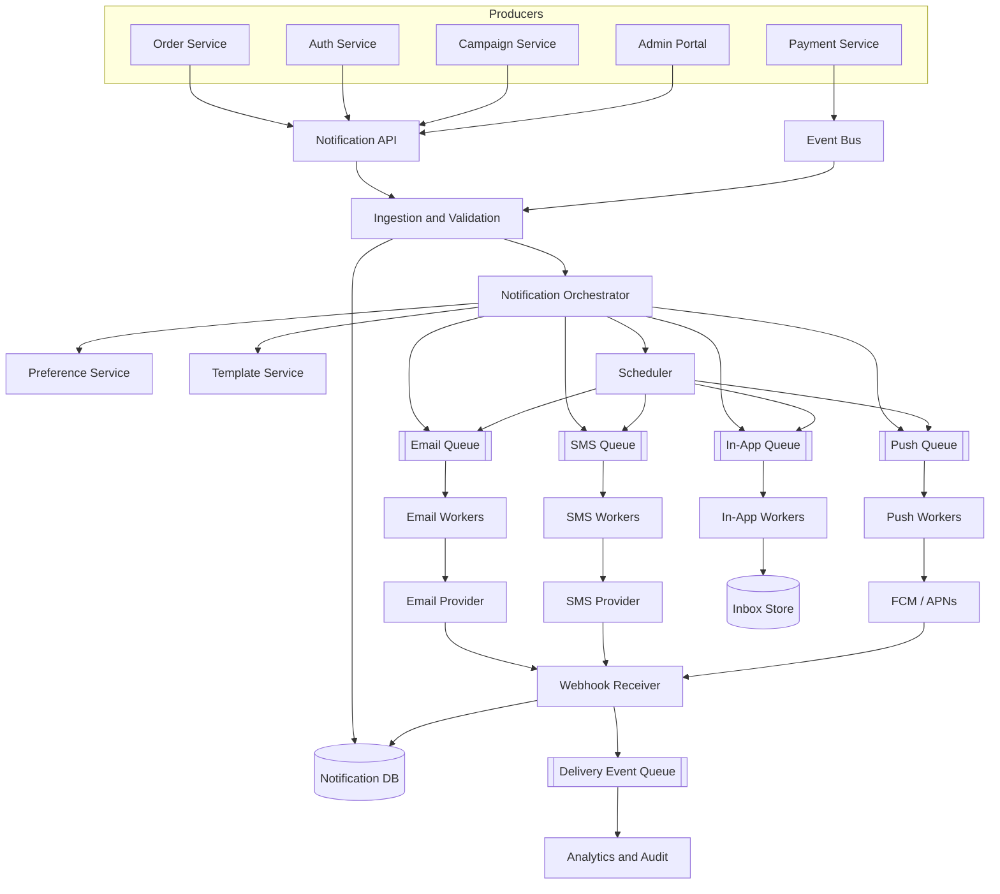

The architecture has two important boundaries:

1. **Product services communicate with the notification platform through a stable API or event schema.**
2. **Channel workers communicate with external providers through provider adapters.**

This avoids tight coupling in both directions.

---

# 5. End-to-End Notification Flow

Consider a payment-failure event.

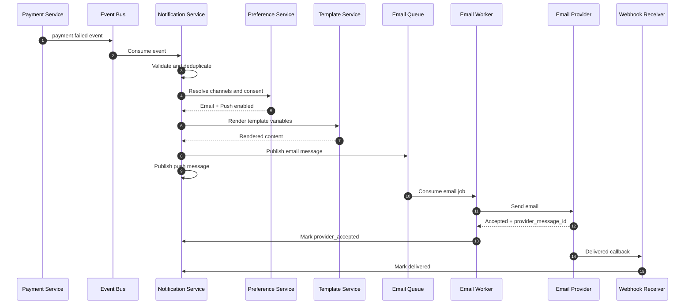

Detailed flow:

1. A producer sends a request or publishes a domain event.
2. The ingestion layer authenticates and validates it.
3. The system checks the idempotency key or event ID.
4. A notification record is created.
5. The orchestrator loads user preferences.
6. It selects eligible channels.
7. It resolves contact endpoints such as email address, phone number, and device tokens.
8. It loads and renders channel templates.
9. It applies quiet hours, scheduling, priority, and rate limits.
10. It writes one message per selected channel.
11. Each message is sent to its channel queue.
12. A channel worker calls the provider.
13. Provider acceptance is stored.
14. Asynchronous callbacks update delivered, bounced, failed, or read states.
15. Metrics and audit events are emitted.

---

# 6. Major Components

## 6.1 Notification API

The API accepts direct notification requests.

Typical callers:

- Authentication service
- Admin portal
- Internal applications
- Campaign service

Responsibilities:

- Authentication and authorization
- Schema validation
- Idempotency validation
- Request-size limits
- Tenant resolution
- Persistence
- Returning a notification ID quickly

The API should not wait for providers to send the message.

```text
Client request
      |
      v
Persist notification
      |
      v
Publish async job
      |
      v
Return 202 Accepted
```

Returning asynchronously improves availability and latency.

## 6.2 Event Ingestion

Business systems often publish domain events instead of calling the notification API directly.

Examples:

```json
{
  "event_id": "evt_01J...",
  "event_type": "order.shipped",
  "occurred_at": "2026-08-03T06:20:00Z",
  "tenant_id": "shop_123",
  "user_id": "user_456",
  "data": {
    "order_id": "ORD-9001",
    "tracking_number": "TRK-1189"
  }
}
```

The notification system maps an event type to a notification policy.

```yaml
event_type: order.shipped
template: order-shipped-v3
channels:
  - push
  - email
fallback:
  push_to_sms_after: 10m
```

Benefits of event-driven integration:

- Product services remain independent from notification logic.
- More consumers can use the same domain event.
- Temporary notification downtime does not block business transactions.
- Events can be replayed.

## 6.3 Orchestrator

The orchestrator converts notification intent into channel messages.

Responsibilities:

- Fetch preferences
- Resolve recipients
- Select channels
- Apply rules
- Resolve template version
- Schedule delivery
- Create per-channel messages
- Publish jobs

The orchestrator should not contain provider-specific code.

A useful abstraction is:

```python
class ChannelStrategy:
    def is_eligible(self, context) -> bool:
        ...

    def build_message(self, context) -> "ChannelMessage":
        ...

    def queue_name(self) -> str:
        ...
```

## 6.4 Preference Service

Stores user communication preferences.

Example:

```json
{
  "user_id": "user_456",
  "timezone": "Asia/Kolkata",
  "quiet_hours": {
    "start": "22:00",
    "end": "08:00"
  },
  "categories": {
    "security": {
      "email": true,
      "sms": true,
      "push": true
    },
    "order_updates": {
      "email": true,
      "sms": false,
      "push": true
    },
    "marketing": {
      "email": false,
      "sms": false,
      "push": false
    }
  }
}
```

Preference resolution should consider:

1. Legal or mandatory rules
2. Tenant policy
3. Notification-category policy
4. User preference
5. Endpoint availability
6. Quiet hours
7. Frequency caps

A security alert may override quiet hours, but a marketing notification should not.

## 6.5 Template Service

The template service manages channel-specific content.

Example template structure:

```yaml
template_key: payment_failed
version: 4
locale: en-IN

email:
  subject: "Payment failed for invoice {{ invoice_number }}"
  html: |
    <p>Hello {{ user_name }},</p>
    <p>We could not process ₹{{ amount }}.</p>
  text: |
    Hello {{ user_name }},
    We could not process ₹{{ amount }}.

sms:
  body: "Payment of ₹{{ amount }} failed. Update your payment method: {{ short_url }}"

push:
  title: "Payment failed"
  body: "Update your payment method to avoid interruption."
  data:
    screen: "billing"
    invoice_id: "{{ invoice_id }}"
```

Templates should support:

- Versioning
- Draft and published states
- Localization
- Preview and test sending
- Required-variable validation
- Channel-specific length limits
- Safe escaping
- Fallback locale
- Audit history

Do not allow unrestricted template code execution. Use a safe templating language with limited helpers.

## 6.6 Scheduling Service

The scheduler handles:

- Future delivery
- Quiet-hour deferral
- Recurring notifications
- Digest windows
- Campaign batches
- Retry scheduling

For moderate scale, store `scheduled_at` in a database and periodically claim due records.

For large scale, use:

- Delayed queues
- Time buckets
- A timing wheel
- Partitioned scheduler tables
- Managed schedulers for coarse-grained jobs

Avoid scanning the entire notification table.

Example bucket:

```text
schedule_bucket = floor(scheduled_at / 1 minute)
partition_key   = tenant_id + schedule_bucket
```

## 6.7 Channel Queues

Use a separate queue for each channel.

```text
notification.email.high
notification.email.normal
notification.email.bulk

notification.sms.critical
notification.sms.normal

notification.push.high
notification.push.normal
notification.in_app.normal
```

Benefits:

- Independent scaling
- Independent retry policies
- Provider rate-limit isolation
- Priority separation
- Failure isolation
- Better monitoring

A single shared queue makes it harder to prevent slow email jobs from blocking urgent SMS traffic.

## 6.8 Channel Workers

A channel worker:

1. Consumes a message.
2. Acquires an idempotency or processing lock.
3. Checks whether the message is still eligible.
4. Applies channel rate limits.
5. Calls a provider adapter.
6. Stores the provider message ID.
7. Classifies the response.
8. Acknowledges, retries, or sends to a dead-letter queue.

Pseudo-code:

```python
def process(job):
    if delivery_attempt_already_succeeded(job.message_id):
        acknowledge(job)
        return

    if notification_is_cancelled(job.notification_id):
        mark_cancelled(job.message_id)
        acknowledge(job)
        return

    if not rate_limiter.allow(job.provider, job.tenant_id):
        retry_later(job)
        return

    try:
        response = provider.send(job.payload)

        save_provider_acceptance(
            message_id=job.message_id,
            provider_message_id=response.id,
        )
        acknowledge(job)

    except TemporaryProviderError as exc:
        record_failure(job, exc, retryable=True)
        retry_with_backoff(job)

    except PermanentProviderError as exc:
        record_failure(job, exc, retryable=False)
        acknowledge(job)
```

## 6.9 Provider Adapters

Use a common interface so providers can be replaced.

```python
class EmailProvider:
    def send(self, request: EmailRequest) -> ProviderResult:
        ...

class SmsProvider:
    def send(self, request: SmsRequest) -> ProviderResult:
        ...
```

Provider result:

```python
@dataclass
class ProviderResult:
    provider_message_id: str
    status: str
    raw_status: str
    accepted_at: datetime
```

Adapters translate:

- Internal request format to provider format
- Provider status to canonical status
- Provider errors to retryable or permanent errors
- Provider callback payloads to internal delivery events

Example canonical errors:

```text
TEMPORARY_UNAVAILABLE
RATE_LIMITED
INVALID_DESTINATION
UNSUBSCRIBED
AUTHENTICATION_FAILED
CONTENT_REJECTED
PROVIDER_INTERNAL_ERROR
```

## 6.10 Webhook and Delivery-Receipt Service

Provider APIs usually report only that a message was accepted for processing. Final delivery often arrives asynchronously through callbacks.

The webhook service should:

1. Verify provider signatures.
2. Validate timestamps to reduce replay attacks.
3. Parse and normalize events.
4. Deduplicate callback events.
5. Respond quickly.
6. Process updates asynchronously.
7. Preserve the raw payload for debugging, subject to retention policy.

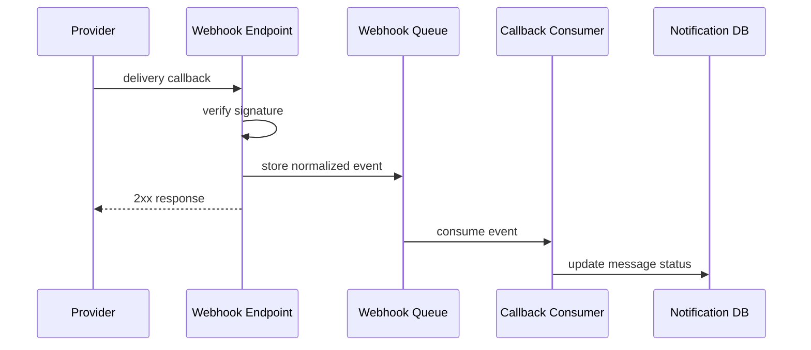

Callbacks can arrive:

- More than once
- Out of order
- After a long delay
- Without a known message due to race conditions
- After a message was already marked failed

Status updates must therefore be idempotent and state-transition aware.

## 6.11 Notification Inbox

For in-app notifications, store a user-visible record.

Typical features:

- List notifications
- Unread count
- Mark one as read
- Mark all as read
- Cursor pagination
- Deep-link metadata
- Expiration
- Deletion or archival

Example:

```json
{
  "id": "inapp_123",
  "user_id": "user_456",
  "title": "Your order has shipped",
  "body": "Order ORD-9001 is on the way.",
  "action": {
    "type": "OPEN_ORDER",
    "order_id": "ORD-9001"
  },
  "created_at": "2026-08-03T06:20:10Z",
  "read_at": null
}
```

For a high-volume inbox, partition by `user_id` and sort by a time-based key.

---

# 7. Data Model

A relational database is suitable for transactional metadata, preferences, templates, and auditing.

## Main Entities

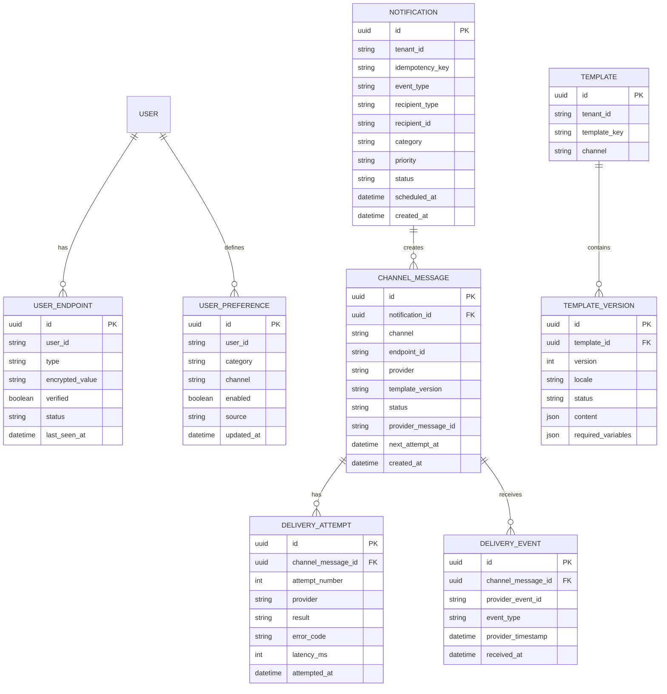

## Suggested Indexes

```sql
CREATE UNIQUE INDEX uq_notification_idempotency
ON notifications (tenant_id, idempotency_key);

CREATE INDEX idx_message_dispatch
ON channel_messages (status, next_attempt_at, priority);

CREATE UNIQUE INDEX uq_provider_event
ON delivery_events (provider, provider_event_id);

CREATE INDEX idx_user_inbox
ON in_app_notifications (user_id, created_at DESC, id DESC);

CREATE INDEX idx_scheduled_notification
ON notifications (scheduled_at)
WHERE status = 'SCHEDULED';
```

## Separate Content from Metadata

Notification content can contain sensitive or large data.

Options:

- Store rendered content in an encrypted database column.
- Store large content in object storage and keep a reference.
- Store only template ID and variables, then render near dispatch time.
- Apply short retention to raw provider responses.

A common design is:

```text
Metadata DB:
notification ID, status, channel, timestamps, provider ID

Encrypted content store:
subject, body, personalization variables, provider payload
```

---

# 8. API Design

## Create Notification

```http
POST /v1/notifications
Idempotency-Key: order-shipped-ORD-9001-v1
Content-Type: application/json
```

```json
{
  "tenant_id": "shop_123",
  "recipient": {
    "type": "user",
    "id": "user_456"
  },
  "template_key": "order_shipped",
  "category": "order_updates",
  "priority": "high",
  "channels": ["push", "email"],
  "data": {
    "order_id": "ORD-9001",
    "tracking_number": "TRK-1189"
  },
  "scheduled_at": null
}
```

Response:

```http
HTTP/1.1 202 Accepted
```

```json
{
  "notification_id": "ntf_01J...",
  "status": "accepted"
}
```

## Get Notification Status

```http
GET /v1/notifications/ntf_01J...
```

```json
{
  "id": "ntf_01J...",
  "status": "partially_delivered",
  "channels": [
    {
      "channel": "push",
      "status": "delivered"
    },
    {
      "channel": "email",
      "status": "provider_accepted"
    }
  ]
}
```

## Cancel Scheduled Notification

```http
POST /v1/notifications/ntf_01J.../cancel
```

Cancellation is best effort. A message that has already reached a provider may not be retractable.

## Read In-App Notifications

```http
GET /v1/users/user_456/notifications?cursor=...&limit=20
```

## Mark as Read

```http
POST /v1/users/user_456/notifications/inapp_123/read
```

## Register Device Token

```http
POST /v1/users/user_456/endpoints/push
```

```json
{
  "platform": "android",
  "token": "device-registration-token",
  "app_id": "customer-app"
}
```

## Update Preferences

```http
PUT /v1/users/user_456/preferences/order_updates
```

```json
{
  "email": true,
  "sms": false,
  "push": true
}
```

---

# 9. Notification State Machine

Use separate state machines for the business notification and channel messages.

## Channel Message States

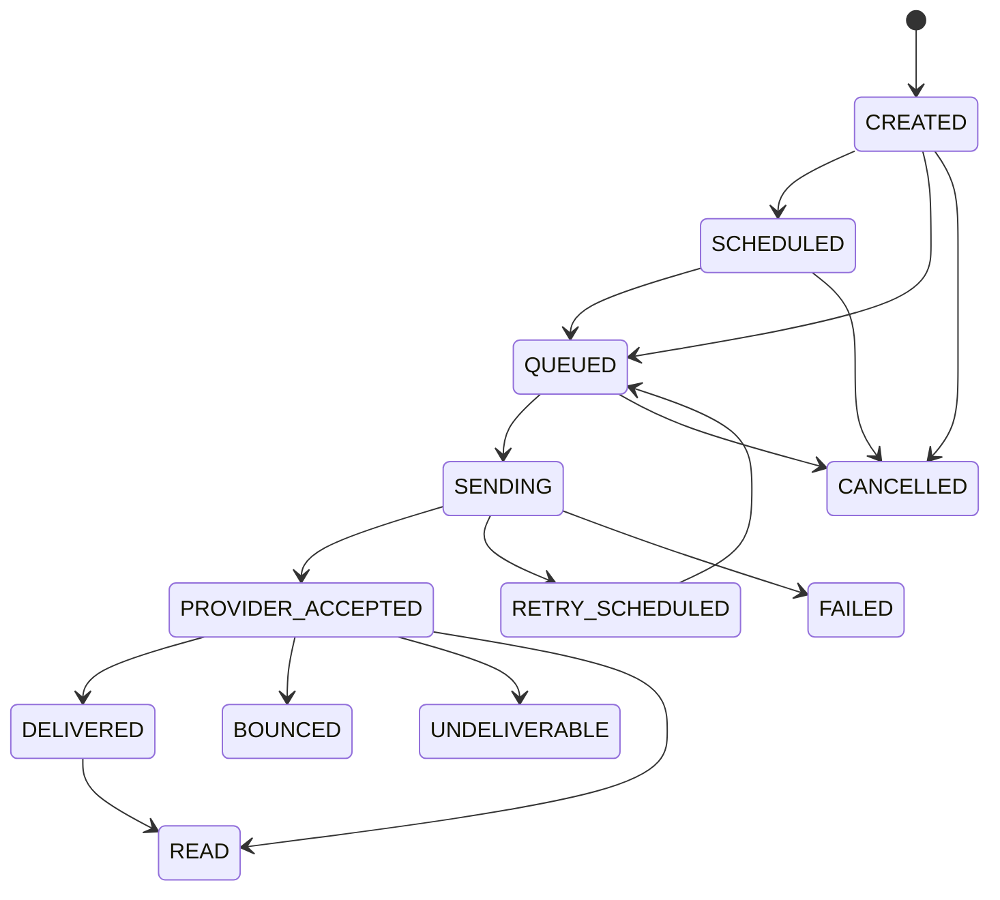

Do not treat `provider_accepted` as equal to `delivered`.

For example:

- Email provider accepted the email, but the recipient mailbox may reject it later.
- SMS provider accepted the request, but the carrier may fail delivery.
- Push provider accepted the request, but the device may be offline or the token may be invalid.

## Aggregate Notification Status

A multi-channel notification can be:

- `ACCEPTED`
- `PROCESSING`
- `DELIVERED`
- `PARTIALLY_DELIVERED`
- `FAILED`
- `CANCELLED`
- `EXPIRED`

Example:

```text
Email: delivered
SMS: failed
Push: delivered

Overall notification: partially_delivered
```

---

# 10. Reliability and Delivery Guarantees

## 10.1 At-Least-Once Delivery

Most practical queue-based notification systems provide **at-least-once processing**.

This means a message may be processed more than once.

Why?

- A worker sends an SMS successfully.
- The worker crashes before acknowledging the queue message.
- The queue redelivers the job.
- Another worker may send the same SMS again.

Exactly-once delivery across your database, message broker, and external provider is generally not achievable as a single atomic transaction.

The practical solution is:

```text
At-least-once delivery
        +
Idempotent processing
        +
Deduplication
```

## 10.2 Idempotency

Use idempotency at multiple levels.

### API-Level Idempotency

The caller supplies a key.

```text
tenant_id + idempotency_key -> one notification
```

Example:

```text
order-shipped-ORD-9001-v1
```

A repeated request returns the existing notification instead of creating a new one.

### Consumer-Level Idempotency

Before sending:

```sql
UPDATE channel_messages
SET status = 'SENDING',
    processing_owner = :worker_id,
    processing_started_at = NOW()
WHERE id = :message_id
  AND status IN ('QUEUED', 'RETRY_SCHEDULED');
```

Only the worker that successfully updates the row should continue.

### Provider-Level Idempotency

Use a provider idempotency key when the provider supports one.

If the provider does not support idempotency, store the provider response immediately and minimize the crash window.

### Webhook-Level Idempotency

Store a unique provider event ID.

```text
(provider, provider_event_id) must be unique
```

## 10.3 Transactional Outbox

A common failure happens when a business service updates its database but fails to publish the notification event.

```text
1. Mark order as shipped in database       -> success
2. Publish order.shipped event              -> failure

Result: order is shipped, but notification is never created.
```

Use the **transactional outbox pattern**.

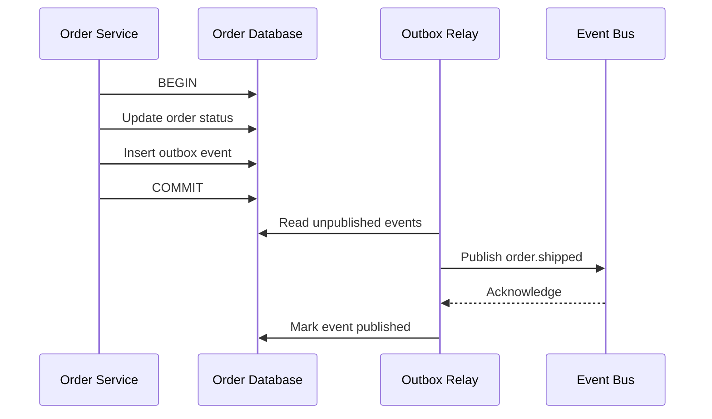

The business update and outbox insert happen in one local database transaction.

The relay can publish an event more than once, so downstream consumers still need deduplication.

## 10.4 Retries and Exponential Backoff

Retry only temporary errors.

### Retryable Errors

- Timeout
- Connection reset
- HTTP 429
- HTTP 500 or 503
- Temporary provider outage
- Temporary DNS failure

### Usually Non-Retryable Errors

- Invalid phone number
- Invalid email address
- Unregistered device token
- Unsubscribed recipient
- Invalid template
- Authentication failure caused by bad configuration
- Rejected or prohibited content

Example backoff:

```text
attempt 1 -> immediate
attempt 2 -> 5 seconds
attempt 3 -> 30 seconds
attempt 4 -> 2 minutes
attempt 5 -> 10 minutes
attempt 6 -> 1 hour
```

Use jitter to prevent many workers from retrying at exactly the same time.

```python
delay = min(max_delay, base_delay * (2 ** attempt))
delay = random.uniform(delay * 0.5, delay * 1.5)
```

Important notifications can have shorter retry intervals and a secondary provider.

## 10.5 Dead-Letter Queues

After retry exhaustion, move the job to a dead-letter queue.

Store:

- Notification ID
- Message ID
- Channel
- Provider
- Failure category
- Last error
- Attempt count
- Original payload reference
- First and last attempt time

The DLQ supports:

- Investigation
- Reprocessing
- Alerting
- Provider comparison
- Finding template or configuration defects

Do not blindly replay every DLQ message. A permanent failure will fail again.

## 10.6 Provider Failover

A provider abstraction allows fallback.

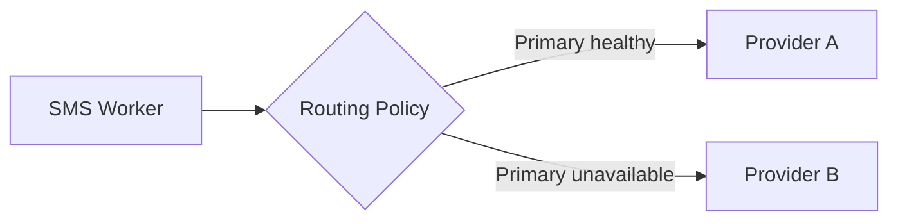

Routing signals may include:

- Provider health
- Success rate
- Latency
- Country support
- Tenant preference
- Cost
- Regulatory restrictions
- Remaining quota

Avoid immediate failover for ambiguous timeouts unless duplicate delivery is acceptable. The primary provider may have processed the request even though your worker did not receive a response.

A safer policy is:

```text
Definite provider rejection      -> fail over
Connection failure before send   -> fail over
Ambiguous timeout after send     -> reconcile or delay before failover
```

---

# 11. User Preferences and Consent

Preferences should be category-specific rather than one global switch.

```text
Security alerts:
    Email = enabled
    SMS   = enabled
    Push  = enabled

Order updates:
    Email = enabled
    SMS   = disabled
    Push  = enabled

Marketing:
    Email = disabled
    SMS   = disabled
    Push  = disabled
```

## Preference Hierarchy

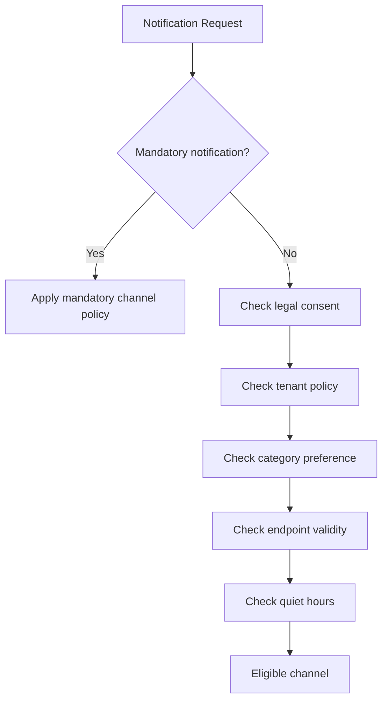

## Quiet Hours

Quiet hours must use the user's timezone.

Example:

```text
User timezone: Asia/Kolkata
Quiet hours:   10:00 PM to 8:00 AM
Event time:    11:15 PM

Marketing notification -> schedule for 8:00 AM
Security alert          -> send immediately
```

## Frequency Caps

Examples:

- Maximum three promotional pushes per day
- Maximum one abandoned-cart email per 24 hours
- Maximum one payment reminder per invoice per day

Use a fast counter store such as Redis for real-time enforcement, with durable history in a database or analytics store.

## Unsubscribe Handling

Unsubscribe should update a central suppression or preference system quickly.

Sources include:

- Email unsubscribe link
- Provider complaint event
- SMS opt-out keyword
- User settings page
- Admin action
- Legal deletion request

A suppression event should invalidate caches and prevent future sends.

---

# 12. Template Design

## Render Early vs Render Late

### Render at Ingestion Time

Advantages:

- Exact content is preserved.
- Faster worker execution.
- Easier audit.

Disadvantages:

- Scheduled content becomes stale.
- User locale or template fixes are not reflected.
- Large rendered content consumes storage.

### Render at Dispatch Time

Advantages:

- Uses latest template and user information.
- Supports dynamic send-time data.
- Less stored rendered content.

Disadvantages:

- Template service becomes part of the dispatch path.
- A template update can unexpectedly change scheduled messages.
- Harder to reproduce exact historical content unless template versions are pinned.

### Recommended Approach

Pin the template version at orchestration time and render near dispatch.

```text
Notification stores:
    template_key
    template_version
    locale
    variables

Worker renders:
    exact pinned version + stored variables
```

For compliance-sensitive messages, store a final immutable copy of rendered content.

## Template Validation

Validate before publishing:

- Required variables are declared.
- Variables used by the template exist.
- SMS length is within expected segment limits.
- Email has a text fallback.
- URLs use approved domains.
- HTML is sanitized.
- Locale fallback exists.
- Push payload stays under provider limits.
- No prohibited sensitive data appears in title or lock-screen text.

## Localization

Resolution order:

```text
en-IN
  -> en
     -> tenant default
        -> platform default
```

Locale should be decided using user preference, not only device language.

---

# 13. Scheduling, Batching, and Digests

## Scheduled Notifications

Store a UTC `scheduled_at` timestamp.

Convert user-local time to UTC when scheduling, while retaining timezone information for recurring schedules.

```json
{
  "schedule": {
    "local_time": "09:00",
    "timezone": "Asia/Kolkata",
    "scheduled_at_utc": "2026-08-04T03:30:00Z"
  }
}
```

## Digest Notifications

A digest groups many low-priority events.

Instead of:

```text
10 separate "new comment" emails
```

Send:

```text
"You received 10 new comments today"
```

Digest flow:

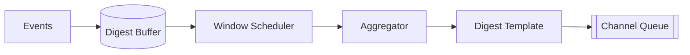

Group by:

```text
tenant_id + user_id + category + digest_window
```

## Batch Campaigns

Do not enqueue ten million messages in one database transaction.

Use chunking:

```text
Audience query
    -> produce recipient pages
    -> create notification chunks
    -> publish gradually
    -> apply global and provider rate limits
```

Campaign metadata should be separate from individual recipient delivery records.

---

# 14. Priority and Rate Limiting

## Priority Classes

| Priority | Examples | Expected Behavior |
|---|---|---|
| Critical | OTP, account takeover alert | Immediate, reserved capacity |
| High | Payment failure, shipment update | Low latency |
| Normal | Social notification, reminder | Standard queue |
| Bulk | Newsletter, promotion | Rate-controlled, delay acceptable |

Use physically separate queues or strong weighted scheduling.

```text
Reserved worker capacity:
Critical: 20%
High:     30%
Normal:   30%
Bulk:     20%
```

## Rate-Limit Dimensions

Rate limits may apply by:

- Provider account
- Channel
- Tenant
- Sender identity
- Destination country
- Phone number
- Email domain
- Campaign
- User
- Template category

A token-bucket algorithm works well.

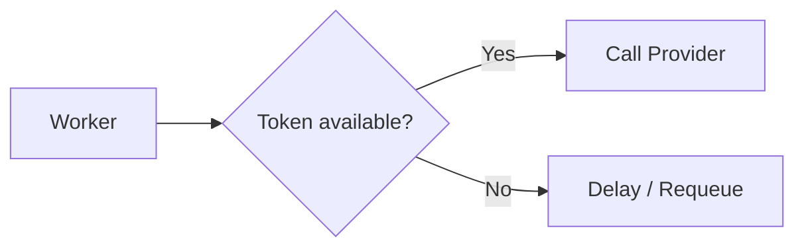

Distributed token buckets can be implemented using Redis scripts or a dedicated rate-limit service.

## Backpressure

When providers slow down:

1. Queue depth increases.
2. Workers receive rate-limit errors.
3. Circuit breakers reduce provider traffic.
4. Lower-priority traffic is paused.
5. Critical traffic uses reserved capacity.
6. Autoscaling increases workers only when provider limits allow it.

Adding workers cannot solve a provider-side quota limit.

---

# 15. Ordering and Deduplication

## Ordering

Most notifications do not require global ordering.

Some flows require ordering per entity:

```text
Order confirmed
Order shipped
Order delivered
```

Partition messages by a stable key such as `order_id`.

```text
partition_key = tenant_id + order_id
```

Strict ordering reduces parallelism. Use it only where the business requires it.

## Stale Event Protection

Events may arrive out of order.

```text
order.delivered arrives before order.shipped
```

Include event version or entity sequence.

```json
{
  "event_type": "order.shipped",
  "order_id": "ORD-9001",
  "order_version": 7
}
```

The notification policy can ignore an event if the current order version is already greater.

## Deduplication Windows

Not all duplicates share the exact same event ID.

A semantic deduplication key may be:

```text
tenant + user + category + entity + state + time_window
```

Example:

```text
shop_123:user_456:payment_failed:invoice_981:2026-08-03
```

Be careful not to suppress legitimate repeated notifications.

---

# 16. Scaling the System

## 16.1 Capacity Estimation

Assume:

- 20 million active users
- Average 4 notifications per user per day
- Average 1.5 channels per notification
- Peak traffic is 10 times average
- Average internal queue message is 2 KB

### Daily Channel Messages

```text
20,000,000 users
× 4 notifications
× 1.5 channels
= 120,000,000 channel messages/day
```

### Average Messages per Second

```text
120,000,000 / 86,400
≈ 1,389 messages/second
```

### Peak Messages per Second

```text
1,389 × 10
≈ 13,890 messages/second
```

Design for roughly **15,000–20,000 channel messages per second** initially, then include safety capacity.

### Queue Data Volume

```text
120,000,000 × 2 KB
≈ 240 GB/day of logical queue payload
```

Avoid putting large HTML bodies or attachments directly in queues. Store large content externally and pass references.

### Database Write Volume

Each message may create:

- One channel-message row
- One or more attempt rows
- Multiple delivery-event rows

At 120 million messages per day, this can become several hundred million writes per day. Use:

- Batched writes
- Partitioned tables
- Short retention for detailed attempt logs
- Separate operational and analytical storage
- Asynchronous event export

## 16.2 Partitioning Strategy

### Queue Partitioning

Useful keys:

- Channel
- Priority
- Tenant
- Geographic region
- Recipient ID for ordering

Avoid a single high-volume tenant creating a hot partition.

A possible key:

```text
hash(tenant_id + recipient_id) % partition_count
```

### Database Partitioning

Operational notification tables can be partitioned by:

- Creation date
- Tenant
- Region
- Hash of notification ID

Time partitioning simplifies retention.

```text
notifications_2026_08
delivery_events_2026_08
```

The inbox is commonly partitioned by user ID because reads are user-centric.

### Cache Partitioning

Cache:

- Template versions
- Preferences
- Provider routing policies
- Tenant configuration

Use short TTLs and event-driven invalidation for preference changes.

## 16.3 Handling Traffic Spikes

Common spike sources:

- Flash sales
- Breaking news
- System outages
- Bulk campaigns
- A large scheduled batch at the top of the hour

Techniques:

- Queue buffering
- Admission control
- Batch spreading
- Randomized schedule jitter
- Autoscaling workers
- Priority isolation
- Provider-aware rate limiting
- Per-tenant quotas
- Campaign throttling
- Load shedding for non-critical traffic

Schedule jitter example:

```text
Instead of scheduling 5 million messages at 09:00:00,
spread them from 09:00:00 to 09:10:00.
```

---

# 17. Failure Scenarios

## Scenario 1: Provider Is Down

```text
Worker calls provider
    -> timeout / 503
    -> circuit breaker opens
    -> message is retried with backoff
    -> optional provider failover
    -> lower-priority traffic is paused
```

The ingestion API should continue accepting requests while durable queues absorb the backlog.

## Scenario 2: Worker Crashes After Sending

The queue redelivers the message.

Protection:

- Consumer idempotency
- Provider idempotency key
- Persist provider response immediately
- Reconciliation for uncertain attempts

## Scenario 3: Callback Arrives Before Send Result Is Stored

This race can occur when a provider callback is extremely fast.

Solutions:

- Upsert using provider message ID.
- Store unmatched callbacks temporarily.
- Retry callback correlation.
- Use an internal client reference echoed by the provider when supported.

## Scenario 4: Callback Is Delivered Multiple Times

Use a unique provider event ID and idempotent transitions.

## Scenario 5: Events Arrive Out of Order

Compare provider timestamp, event sequence, and allowed state transitions.

Do not move:

```text
DELIVERED -> PROVIDER_ACCEPTED
```

because a delayed callback arrived.

## Scenario 6: Template Service Is Unavailable

Options:

- Use cached published templates.
- Keep pinned template versions in local cache.
- Delay non-critical notifications.
- Use an emergency static template for critical flows.

## Scenario 7: Preference Service Is Unavailable

Possible policy:

- Fail closed for promotional traffic.
- Use a recently cached preference for transactional traffic.
- Send legally mandatory messages according to explicit policy.
- Record that cached preferences were used.

## Scenario 8: Queue Backlog Becomes Very Large

- Alert on oldest-message age.
- Scale workers within provider limits.
- Pause bulk producers.
- Drop expired low-value messages.
- Increase batch size where safe.
- Route critical traffic through isolated queues.

## Scenario 9: Invalid Device Token

Mark the endpoint inactive after a definitive invalid-token response. Do not keep retrying it.

## Scenario 10: Database Is Unavailable

The API should not return acceptance unless the notification has been durably recorded.

Options:

- Fail the request.
- Write to a durable log first.
- Use a highly available database.
- Use a broker as the source of truth and materialize state later.

---

# 18. Observability

## Key Metrics

### Ingestion

- Requests per second
- Accepted and rejected requests
- Idempotency conflicts
- Validation failures
- API latency

### Queue

- Queue depth
- Oldest-message age
- Consumer lag
- Retry queue depth
- Dead-letter queue count

### Delivery

- Provider acceptance rate
- Delivery rate
- Bounce rate
- Failure rate
- Retry rate
- End-to-end latency
- Time from event to dispatch
- Time from dispatch to provider acceptance
- Time from provider acceptance to delivery

### Provider

- Latency by provider
- HTTP status distribution
- Rate-limit responses
- Cost per delivered message
- Failover count
- Circuit-breaker state

### Product

- Notifications per category
- Unsubscribe rate
- Push-token invalidation rate
- Open/read/click events where appropriate
- Digest compression ratio

## Service-Level Objectives

Examples:

```text
99.9% of critical notifications are submitted to a provider within 5 seconds.

99% of high-priority notifications are submitted within 30 seconds.

99.99% of accepted notifications are not lost.

Webhook endpoint availability is at least 99.95%.
```

Provider acceptance is measurable by your system. Final delivery may depend on carriers, mail servers, devices, and users, so define SLOs carefully.

## Tracing

Use a correlation chain:

```text
business_event_id
    -> notification_id
        -> channel_message_id
            -> attempt_id
                -> provider_message_id
                    -> provider_event_id
```

Include these identifiers in structured logs.

## Alerting

Alert on symptoms that affect users:

- Oldest critical queue message exceeds threshold
- OTP delivery success drops
- Provider 5xx rate rises
- Provider callbacks stop
- DLQ growth
- Template-rendering failures
- Suppression updates lag
- Push invalid-token rate suddenly increases

---

# 19. Security and Privacy

## Authentication and Authorization

- Authenticate producer services using service identity, OAuth, or mTLS.
- Authorize tenants to use only their templates, sender identities, and recipients.
- Restrict admin template publishing.
- Use separate roles for operations and content management.

## Provider Credentials

Store API keys and signing keys in a secret manager.

Do not:

- Put credentials in source code.
- Put credentials in queue payloads.
- Log authorization headers.
- Share one unrestricted key across environments.

Use:

- Key rotation
- Least-privilege credentials
- Separate production and non-production accounts
- Restricted network egress where practical

## Protect Contact Data

Email addresses, phone numbers, and device tokens are sensitive.

- Encrypt at rest.
- Use TLS in transit.
- Mask them in logs.
- Apply access controls.
- Keep only necessary data.
- Support deletion and retention policies.
- Avoid exposing full recipient details in operational dashboards.

## Webhook Security

- Verify provider signatures.
- Use HTTPS.
- Reject old timestamps where supported.
- Deduplicate events.
- Apply request-size limits.
- Allowlist provider IPs only as an additional layer, not the only control.
- Store secrets separately by environment.
- Return a success response only after durable capture.

## Template Security

- Escape variables according to context.
- Sanitize HTML.
- Prevent script execution.
- Restrict links and images when needed.
- Never place secrets, full payment details, or highly sensitive medical data in lock-screen push content.
- Protect against template injection.

## Abuse Prevention

Prevent the notification service from becoming a spam relay.

- Authenticate all callers.
- Enforce tenant quotas.
- Apply destination rate limits.
- Require verified sender identities.
- Audit administrative sends.
- Detect unusual volume.
- Restrict arbitrary raw-content sending.

---

# 20. Channel-Specific Considerations

## Email

Important concerns:

- Sender domain authentication
- Bounces and blocks
- Spam complaints
- Unsubscribe handling
- HTML and plain-text versions
- Attachments
- Provider event webhooks
- Domain reputation
- Dedicated vs shared IP considerations
- Promotional and transactional separation

Canonical email events may include:

```text
processed
provider_accepted
delivered
deferred
bounced
blocked
complained
opened
clicked
unsubscribed
```

Open and click signals should not be treated as perfectly reliable user behavior because privacy protections and client behavior can affect tracking.

## SMS

Important concerns:

- Country-specific sender rules
- Character encoding
- Message segmentation
- Delivery receipts
- Opt-out keywords
- Carrier filtering
- Phone-number normalization
- Per-country pricing
- Throughput limits

Normalize numbers to E.164 format.

```text
+919876543210
```

Do not retry an invalid number indefinitely.

## Mobile Push

Important concerns:

- FCM and APNs credentials
- Device-token lifecycle
- Multiple devices per user
- Token refresh
- Platform-specific payloads
- Time-to-live
- Collapse keys
- Notification vs data payloads
- Foreground vs background behavior
- Lock-screen privacy

A user may have:

```text
User 456
    Android phone token A
    Android tablet token B
    iPhone token C
```

A push notification may fan out to all active devices or only the most recently used device, depending on product requirements.

### Collapsible vs Non-Collapsible

Collapsible messages replace an older pending message of the same type.

Useful for:

- Latest score
- Latest sync state
- Updated unread count

Non-collapsible messages preserve each message.

Useful for:

- Chat messages
- Transaction alerts
- Security events

## Web Push

Important concerns:

- Browser subscriptions
- VAPID keys
- Subscription expiration
- Browser permission
- Service workers
- Payload encryption
- Per-browser behavior

## In-App Notifications

Important concerns:

- Read/unread state
- Cursor pagination
- Unread count
- Data retention
- Deep links
- Cross-device synchronization
- Fan-out-on-write vs fan-out-on-read

For normal user-specific notifications, fan-out-on-write is simple:

```text
Create one inbox record per user.
```

For a notification sent to millions of users, fan-out-on-read may reduce write amplification:

```text
Store one global announcement
+
store per-user read state only when needed
```

## WhatsApp and Chat Channels

Important concerns:

- Approved templates
- Conversation windows
- User consent
- Media support
- Provider-specific status callbacks
- Country and policy restrictions
- Rich interaction metadata

Keep these provider rules inside the provider adapter and policy layer, not inside product services.

---

# 21. Multi-Tenant Design

A shared notification platform may serve multiple products or customers.

Tenant-specific configuration can include:

- Sender email domain
- SMS sender ID
- Provider account
- Templates
- Branding
- Rate limits
- Allowed countries
- Data residency
- Retry policy
- Retention policy

## Tenant Isolation

Every core record should include `tenant_id`.

Enforce isolation at:

- API authorization
- Database queries
- Cache keys
- Queue metadata
- Template lookup
- Provider routing
- Logs and dashboards

For strict isolation, high-volume or regulated tenants may receive:

- Dedicated queues
- Dedicated provider accounts
- Dedicated encryption keys
- Dedicated database partitions
- Separate regional deployment

## Noisy-Neighbour Protection

Apply:

- Per-tenant quotas
- Weighted fair queuing
- Maximum concurrent sends
- Campaign throttling
- Separate priority capacity

---

# 22. Deployment Architecture

A regional deployment may look like this:

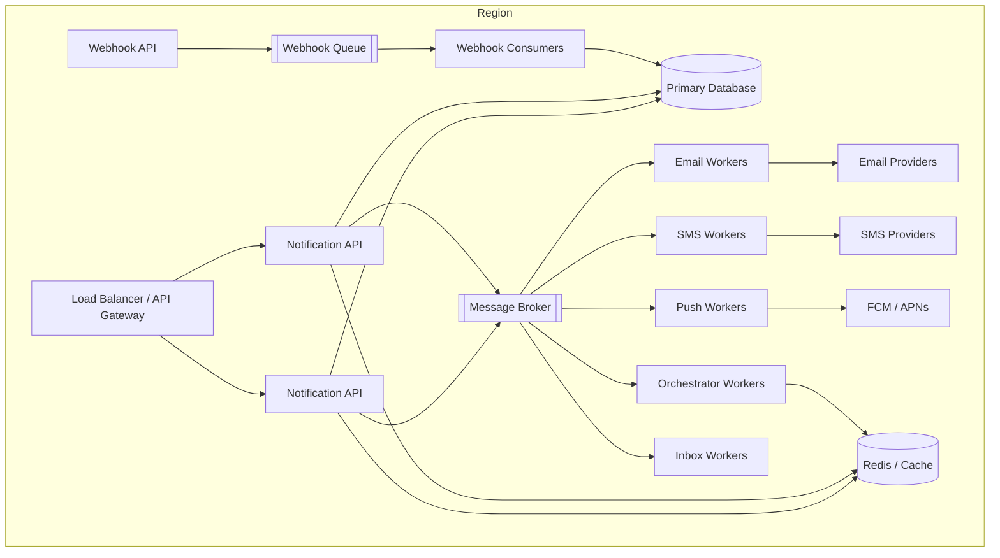

## Multi-Region Options

### Active-Passive

- One primary region handles writes.
- Another region is ready for failover.
- Simpler ordering and idempotency.
- Higher recovery time than active-active.

### Active-Active

- Multiple regions accept traffic.
- Lower regional latency.
- Better regional resilience.
- More complex global deduplication, routing, and data consistency.

A practical approach is to route users or tenants to a home region.

```text
home_region = hash(tenant_id) or regulatory region
```

Use a globally unique notification ID and region-aware idempotency storage.

---

# 23. Technology Choices

These are examples, not mandatory selections.

| Capability | Possible Choices |
|---|---|
| API | FastAPI, Django, Spring Boot, Go |
| Event bus | Kafka, Amazon MSK, EventBridge |
| Work queue | SQS, RabbitMQ, Kafka |
| Operational database | PostgreSQL, MySQL, DynamoDB |
| Cache/rate limits | Redis |
| Search and operational analytics | OpenSearch |
| Analytics | ClickHouse, BigQuery, Snowflake |
| Object storage | Amazon S3, Google Cloud Storage |
| Email providers | Amazon SES, SendGrid, Mailgun |
| SMS/chat providers | Twilio, regional aggregators |
| Push | FCM and APNs |
| Secrets | AWS Secrets Manager, Vault |
| Metrics | Prometheus, CloudWatch |
| Tracing | OpenTelemetry |
| Dashboards | Grafana |

## Kafka vs Traditional Queue

### Kafka Is Useful When

- Event replay matters.
- Many consumer groups need the same event.
- Throughput is very high.
- Partition ordering is useful.
- Events feed analytics and other systems.

### SQS or RabbitMQ Is Useful When

- The main model is background jobs.
- Per-message retry and DLQ behavior is important.
- Operational simplicity is valuable.
- Consumers should compete for each job.

A common hybrid:

```text
Domain events -> Kafka/EventBridge
Channel delivery jobs -> SQS/RabbitMQ
```

---

# 24. Design Trade-offs

## One Service vs Separate Channel Services

### Single Notification Service

Advantages:

- Easier initial development
- Shared data and configuration
- Simpler deployment

Disadvantages:

- Larger failure domain
- Harder independent scaling
- Provider code becomes crowded

### Separate Channel Services

Advantages:

- Independent deployment and scaling
- Better failure isolation
- Channel-specific ownership

Disadvantages:

- More operational overhead
- Distributed data consistency
- More service communication

A good evolution is a modular monolith or shared orchestration service with independently scalable channel workers.

## Store Full Content vs Template Reference

| Store Full Content | Store Template Reference |
|---|---|
| Exact audit copy | Lower storage |
| Fast dispatch | Latest dynamic data possible |
| More sensitive data stored | Rendering dependency at send time |
| Harder template correction | Historical reproduction requires version pinning |

Use version-pinned references and preserve final content only when audit requirements need it.

## Direct API vs Event-Driven Input

| Direct API | Event-Driven |
|---|---|
| Explicit caller control | Loose coupling |
| Immediate notification ID | Easy replay |
| Caller knows notification concern | Product service publishes business facts |
| Can block if API unavailable | Requires event schema governance |

Support both when the platform serves varied use cases.

## Fan-Out Early vs Fan-Out Late

### Early Fan-Out

Create all recipient messages immediately.

- Simple status tracking
- High write amplification
- Large campaigns create huge bursts

### Late Fan-Out

Store audience definition and expand gradually.

- Better pacing
- Lower initial burst
- More complex progress tracking
- Audience can change unless snapshot semantics are defined

Use late fan-out for large campaigns and early fan-out for small transactional groups.

## Strong Consistency vs Eventual Consistency

Strong consistency is useful for:

- Preference changes before promotional sends
- Idempotency
- Cancellation claims
- Mandatory suppression

Eventual consistency is acceptable for:

- Analytics
- Dashboards
- Non-critical aggregate counters
- Delivery-event export

---

# 25. Practical Example: Order Shipment Notification

## Business Requirement

When an order ships:

1. Send push immediately.
2. Send email immediately.
3. Send SMS only if push is not delivered within ten minutes and the user enabled SMS.
4. Add the event to the in-app inbox.
5. Do not send duplicates if the order service retries its event.

## Policy

```yaml
event_type: order.shipped
category: order_updates
priority: high
template_version: 3

channels:
  push:
    enabled: true
  email:
    enabled: true
  in_app:
    enabled: true
  sms:
    fallback_for: push
    wait: 10m
```

## Flow

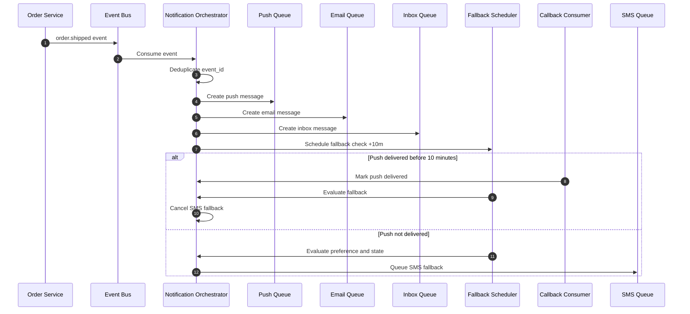

## Deduplication Key

```text
tenant_id + order_id + "shipped" + order_version
```

Example:

```text
shop_123:ORD-9001:shipped:v7
```

## Status Result

```json
{
  "notification_id": "ntf_01J...",
  "status": "delivered",
  "channels": {
    "push": "delivered",
    "email": "delivered",
    "in_app": "created",
    "sms": "cancelled_fallback"
  }
}
```

---

# 26. Evolution from MVP to Large Scale

## Stage 1: MVP

Use:

- One notification API
- PostgreSQL
- One queue
- Email and SMS workers
- Static templates
- Basic retry
- Provider callbacks

Suitable for a small product.

## Stage 2: Growing Product

Add:

- Separate channel queues
- User preferences
- Template versioning
- Push and in-app channels
- Redis-based rate limiting
- DLQs
- Structured metrics
- Transactional outbox

## Stage 3: Large Platform

Add:

- Priority queues
- Campaign fan-out service
- Distributed scheduler
- Provider routing and failover
- Multi-tenant controls
- Partitioned databases
- Analytics pipeline
- Regional deployment
- Automated suppression
- Dedicated critical-notification capacity

## Stage 4: Global Platform

Add:

- Multi-region active-active or home-region routing
- Data-residency controls
- Regional provider selection
- Cross-region disaster recovery
- Global idempotency strategy
- Tenant-specific encryption keys
- Capacity forecasting and automated traffic shaping

---

# 27. Interview Discussion Summary

A strong system-design explanation should move in this order:

## 1. Clarify Requirements

Ask about:

- Supported channels
- Transactional or promotional traffic
- Scale
- Latency expectations
- Scheduling
- Preferences
- Delivery guarantees
- Provider callbacks
- Multi-region needs

## 2. Establish the Core Model

Explain:

```text
Notification -> Channel Message -> Delivery Attempt -> Delivery Event
```

## 3. Draw the Main Architecture

Include:

- Producers
- Notification API or event bus
- Orchestrator
- Preference and template services
- Per-channel queues
- Workers
- Providers
- Callback service
- Database

## 4. Explain Reliability

Focus on:

- Durable asynchronous queues
- At-least-once delivery
- Idempotency
- Transactional outbox
- Retry classification
- Exponential backoff
- Dead-letter queues
- Callback deduplication

## 5. Explain Scaling

Discuss:

- Separate queues by channel and priority
- Horizontal worker scaling
- Provider rate limits
- Partitioning
- Queue buffering
- Campaign pacing
- Backpressure

## 6. Explain Product Rules

Discuss:

- Preferences
- Consent
- Quiet hours
- Frequency caps
- Templates
- Localization
- Fallback channels

## 7. Explain Operations

Include:

- Metrics
- SLOs
- Tracing IDs
- Alerts
- Security
- Provider health and failover

## Core Design Principle

```text
Accept notification intent quickly,
persist it durably,
process it asynchronously,
isolate channels,
make retries safe,
and track delivery through provider callbacks.
```

---

# 28. Official References

The following official documentation is useful when implementing provider integrations:

- [Amazon SNS message delivery retries](https://docs.aws.amazon.com/sns/latest/dg/sns-message-delivery-retries.html)
- [Amazon SNS dead-letter queues](https://docs.aws.amazon.com/sns/latest/dg/sns-dead-letter-queues.html)
- [Firebase Cloud Messaging architecture](https://firebase.google.com/docs/cloud-messaging/fcm-architecture)
- [Firebase Cloud Messaging message types](https://firebase.google.com/docs/cloud-messaging/customize-messages/set-message-type)
- [Firebase collapsible and non-collapsible messages](https://firebase.google.com/docs/cloud-messaging/customize-messages/collapsible-message-types)
- [Apple: Establishing a connection to APNs](https://developer.apple.com/documentation/usernotifications/establishing-a-connection-to-apns)
- [Twilio outbound message status callbacks](https://www.twilio.com/docs/messaging/guides/outbound-message-status-in-status-callbacks)
- [Twilio messaging webhooks](https://www.twilio.com/docs/usage/webhooks/messaging-webhooks)
- [Twilio SendGrid Event Webhook overview](https://sendgrid.com/en-us/blog/whats-webhook)

---

## Final Architecture at a Glance

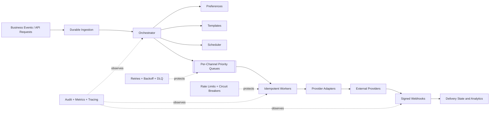
