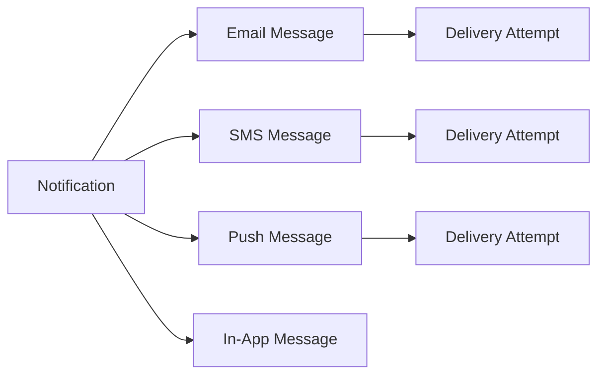
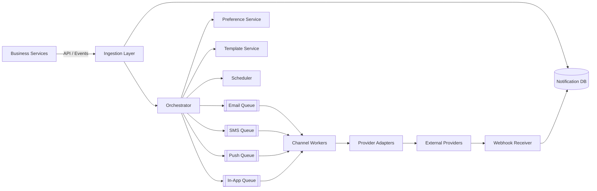
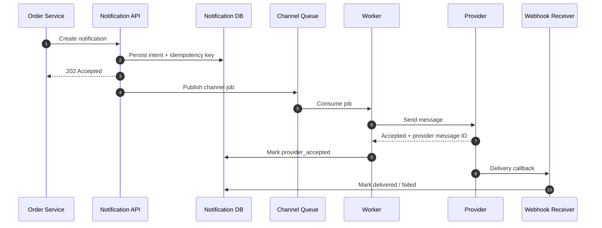
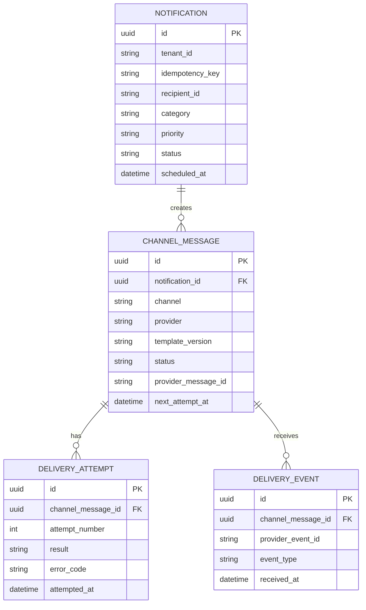
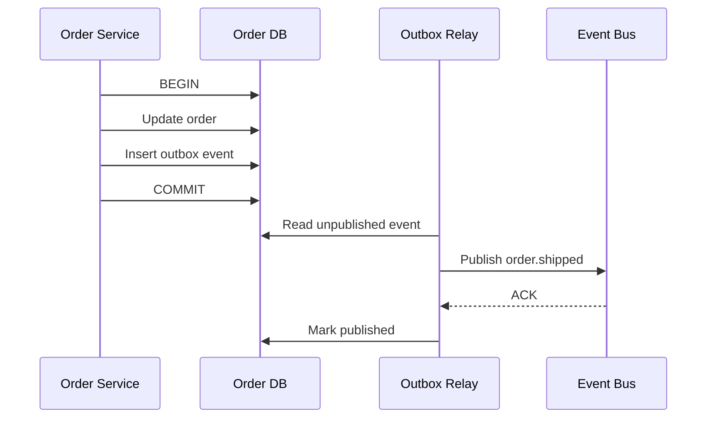
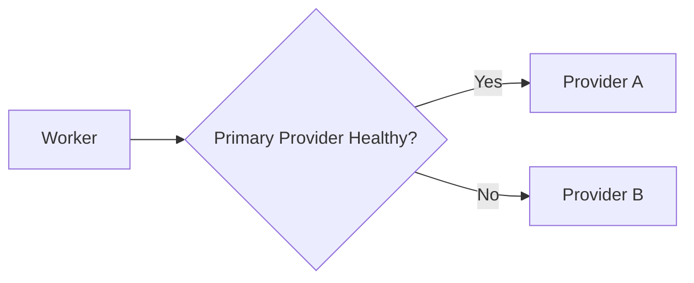
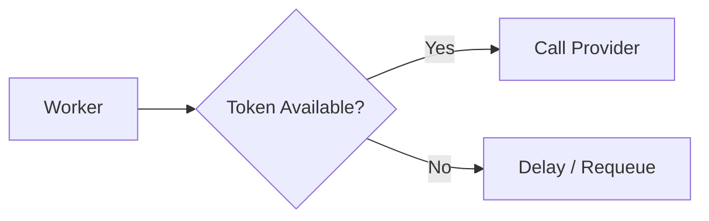
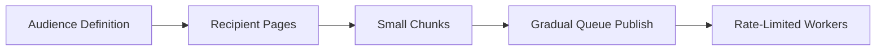
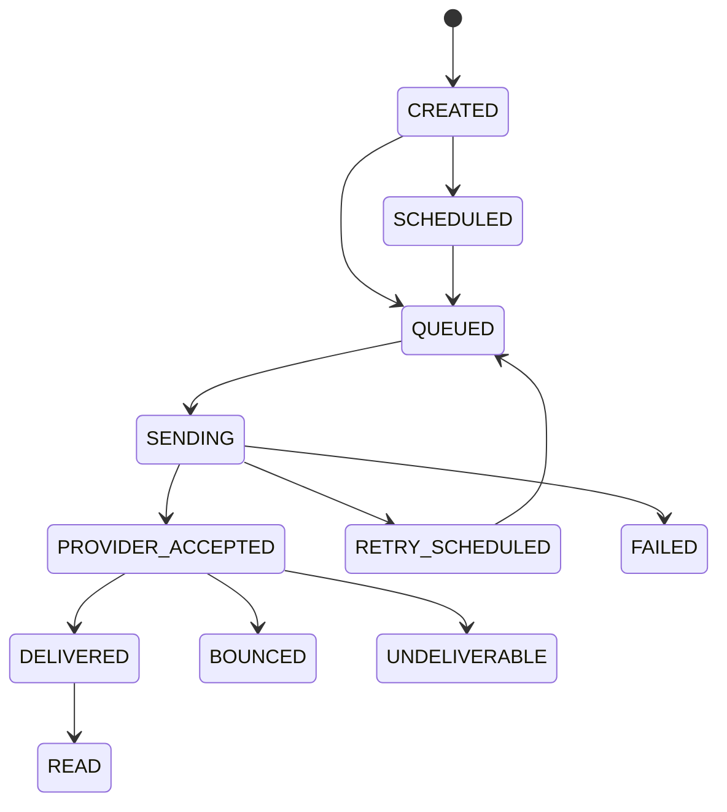
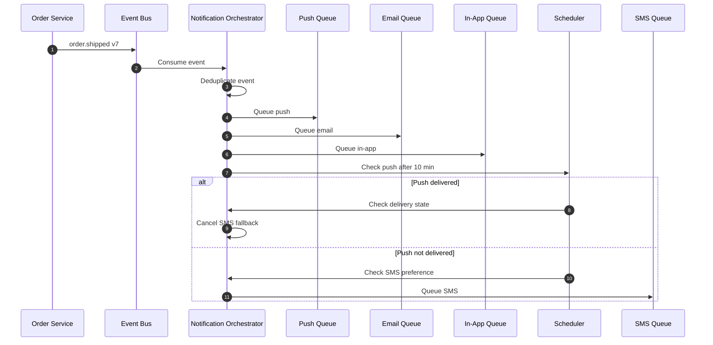

# Design a Multi-Channel Notification System

> Design a reliable system for sending **Email, SMS, Push, and In-App notifications** with preferences, retries, deduplication, scheduling, rate limits, and delivery tracking.

## Index

1. [Core Idea](#1-core-idea)
2. [Requirements](#2-requirements)
3. [High-Level Architecture](#3-high-level-architecture)
4. [End-to-End Flow](#4-end-to-end-flow)
5. [Core Components](#5-core-components)
6. [Data Model](#6-data-model)
7. [Reliability and Idempotency](#7-reliability-and-idempotency)
8. [Retries, DLQ, and Provider Failover](#8-retries-dlq-and-provider-failover)
9. [Preferences, Consent, and Scheduling](#9-preferences-consent-and-scheduling)
10. [Priority, Rate Limiting, and Backpressure](#10-priority-rate-limiting-and-backpressure)
11. [Scaling Strategy](#11-scaling-strategy)
12. [Delivery Tracking and State](#12-delivery-tracking-and-state)
13. [Security and Observability](#13-security-and-observability)
14. [Practical Example](#14-practical-example)
15. [Technology Choices and Trade-offs](#15-technology-choices-and-trade-offs)

---

# 1. Core Idea

A notification system should separate **business intent** from **channel delivery**.

### Notification

Business-level intent.

```text
Notify user_123 that order ORD-9001 has shipped.
```

### Channel Message

Rendered content for one channel.

```text
Email -> "Your order ORD-9001 has shipped"
Push  -> "Your order is on the way"
```

### Delivery Attempt

One call to an external provider.

```text
Attempt 1 -> Email provider -> timeout
Attempt 2 -> Email provider -> accepted
Webhook   -> delivered
```

One notification may create multiple channel messages, and every channel message may have multiple delivery attempts.



The most important design rule is:

> **Persist first, process asynchronously, and never depend on an external provider in the user-facing request path.**

---

# 2. Requirements

## 2.1 Functional Requirements

The system should support:

- Email, SMS, mobile push, web push, and in-app notifications.
- Direct API requests and domain-event-based notifications.
- Immediate and scheduled delivery.
- User channel preferences and quiet hours.
- Versioned and localized templates.
- Transactional and promotional traffic.
- Priority levels such as critical, high, normal, and bulk.
- Retries for temporary failures.
- Deduplication and idempotency.
- Provider delivery callbacks.
- In-app read/unread state.
- Cancellation before dispatch.
- Provider failover where safe.

## 2.2 Non-Functional Requirements

| Requirement | Goal |
|---|---|
| Availability | Accept notifications even when a provider is unavailable |
| Durability | Accepted notifications must not be lost |
| Low latency | OTP and security alerts should dispatch within seconds |
| Scalability | Handle traffic spikes and large campaigns |
| Extensibility | Add channels/providers without changing business services |
| Observability | Track queue delay, retries, provider errors, and delivery |
| Security | Protect contact data, templates, credentials, and webhooks |

---

# 3. High-Level Architecture



The architecture has two clean boundaries:

1. **Product services talk only to the notification platform.**
2. **Notification workers talk to external providers only through adapters.**

This keeps business services independent from SendGrid, SES, Twilio, FCM, APNs, or any future provider.

---

# 4. End-to-End Flow

For an immediate notification:



The API returns `202 Accepted` after durable persistence. Provider delivery happens later.

This improves:

- API latency
- fault isolation
- retryability
- traffic buffering
- provider outage tolerance

---

# 5. Core Components

## 5.1 Notification API / Event Ingestion

The ingestion layer:

- authenticates the caller,
- validates the request,
- checks the idempotency key,
- resolves the tenant,
- stores the notification,
- publishes asynchronous work.

Example:

```http
POST /v1/notifications
Idempotency-Key: order-shipped-ORD-9001-v7
```

```json
{
  "recipient_id": "user_456",
  "template_key": "order_shipped",
  "category": "order_updates",
  "priority": "high",
  "channels": ["push", "email"],
  "data": {
    "order_id": "ORD-9001"
  }
}
```

Response:

```json
{
  "notification_id": "ntf_01J...",
  "status": "accepted"
}
```

For event-driven systems, the producer may instead publish:

```json
{
  "event_id": "evt_123",
  "event_type": "order.shipped",
  "user_id": "user_456",
  "order_id": "ORD-9001",
  "order_version": 7
}
```

## 5.2 Orchestrator

The orchestrator converts business intent into channel-specific jobs.

It:

1. loads preferences,
2. resolves contact endpoints,
3. chooses eligible channels,
4. pins the template version,
5. applies quiet hours and priority,
6. creates channel messages,
7. schedules or queues them.

Provider-specific logic should not live here.

## 5.3 Preference Service

Preferences should be **category-specific**, not one global switch.

```json
{
  "security": {
    "email": true,
    "sms": true,
    "push": true
  },
  "order_updates": {
    "email": true,
    "sms": false,
    "push": true
  },
  "marketing": {
    "email": false,
    "sms": false,
    "push": false
  }
}
```

A reasonable resolution order is:

```text
Mandatory/legal rule
      ↓
Tenant policy
      ↓
Category policy
      ↓
User preference
      ↓
Endpoint validity
      ↓
Quiet hours / frequency cap
```

## 5.4 Template Service

Keep separate templates per channel and version.

```yaml
template_key: payment_failed
version: 4
locale: en-IN

email:
  subject: "Payment failed for {{ invoice_number }}"

sms:
  body: "Payment of ₹{{ amount }} failed."

push:
  title: "Payment failed"
  body: "Update your payment method."
```

Good template design includes:

- versioning,
- draft/published states,
- locale fallback,
- required-variable validation,
- HTML escaping,
- channel-size validation,
- audit history.

A practical approach is to **pin the template version during orchestration and render close to dispatch**.

## 5.5 Channel Queues and Workers

Use separate queues by channel and, when needed, priority.

```text
notification.email.high
notification.email.bulk

notification.sms.critical
notification.sms.normal

notification.push.high
notification.push.bulk
```

This prevents a large email campaign from delaying OTP SMS traffic.

Each worker should:

1. claim the message,
2. verify it has not already succeeded,
3. check cancellation,
4. apply rate limits,
5. call the provider adapter,
6. store the provider message ID,
7. classify the result,
8. acknowledge, retry, or dead-letter the job.

## 5.6 Provider Adapters

Workers should depend on an internal interface instead of provider SDK details.

```python
class NotificationProvider:
    def send(self, request):
        ...
```

The adapter converts:

```text
Internal request
      ↓
Provider request
      ↓
Provider response/error
      ↓
Canonical internal result
```

Example canonical failures:

```text
RATE_LIMITED
TEMPORARY_UNAVAILABLE
INVALID_DESTINATION
UNSUBSCRIBED
CONTENT_REJECTED
AUTHENTICATION_FAILED
```

## 5.7 Scheduler

The scheduler handles:

- future delivery,
- quiet-hour deferral,
- retries,
- fallback notifications,
- campaign pacing,
- digests.

At small scale, query indexed `scheduled_at` rows.

At larger scale, use delayed queues, time buckets, partitioned scheduler tables, or managed scheduling infrastructure instead of scanning the full notification table.

---

# 6. Data Model



Important indexes:

```sql
CREATE UNIQUE INDEX uq_notification_idempotency
ON notifications (tenant_id, idempotency_key);

CREATE INDEX idx_message_dispatch
ON channel_messages (status, next_attempt_at, priority);

CREATE UNIQUE INDEX uq_provider_event
ON delivery_events (provider, provider_event_id);
```

For in-app notifications:

```sql
CREATE INDEX idx_user_inbox
ON in_app_notifications (user_id, created_at DESC, id DESC);
```

---

# 7. Reliability and Idempotency

## 7.1 At-Least-Once Processing

Most queue-based systems provide **at-least-once processing**.

Example failure:

```text
Worker sends SMS successfully
        ↓
Worker crashes before queue ACK
        ↓
Queue redelivers job
        ↓
Another worker may send SMS again
```

Therefore, retries must be made safe.

## 7.2 Idempotency at Multiple Levels

### API Level

Use:

```text
tenant_id + idempotency_key
```

Repeated API requests return the same notification instead of creating another one.

### Worker Level

Claim the row before sending.

```sql
UPDATE channel_messages
SET status = 'SENDING'
WHERE id = :message_id
  AND status IN ('QUEUED', 'RETRY_SCHEDULED');
```

Only the worker that successfully changes the row should continue.

### Provider Level

Use the provider's idempotency mechanism where supported.

### Webhook Level

Deduplicate callback events using:

```text
provider + provider_event_id
```

## 7.3 Transactional Outbox

A business service must not update its database and publish the notification event as two unrelated operations.



The outbox guarantees that the business update and event creation are committed together.

The relay may still publish twice, so consumers must remain idempotent.

---

# 8. Retries, DLQ, and Provider Failover

## 8.1 Retry Only Temporary Failures

Retry:

- network timeout,
- connection reset,
- HTTP `429`,
- provider `5xx`,
- temporary provider outage.

Usually do not retry:

- invalid phone number,
- invalid email address,
- unsubscribed recipient,
- permanently invalid device token,
- invalid template,
- rejected content,
- bad provider credentials.

## 8.2 Exponential Backoff with Jitter

```text
5 sec
30 sec
2 min
10 min
1 hour
```

```python
delay = min(max_delay, base_delay * (2 ** attempt))
delay = random.uniform(delay * 0.5, delay * 1.5)
```

Jitter prevents thousands of workers from retrying simultaneously after a provider recovers.

## 8.3 Dead-Letter Queue

After retry exhaustion:

```text
Failed Job
   ↓
Dead-Letter Queue
   ↓
Investigation / selective replay
```

Store:

- notification ID,
- channel message ID,
- provider,
- attempt count,
- error category,
- last error,
- original payload reference.

Do not blindly replay permanent failures.

## 8.4 Provider Failover



Failover is safe for a definite rejection or a connection failure known to occur before the provider accepted the request.

Be careful with an **ambiguous timeout after sending**. The primary provider may have processed the request even though your worker never received the response; immediate failover can create a duplicate message.

---

# 9. Preferences, Consent, and Scheduling

## 9.1 Transactional vs Promotional Traffic

| Transactional | Promotional |
|---|---|
| OTP, receipt, security alert | Newsletter, discount, re-engagement |
| Low latency | Delay usually acceptable |
| Activity-driven | Campaign-driven |
| Separate critical capacity | Strong consent and unsubscribe controls |
| Usually not affected by marketing opt-out | Must respect marketing consent |

Keep them separated using different:

- queues,
- worker pools,
- provider accounts or sending identities,
- rate limits,
- dashboards.

## 9.2 Quiet Hours

Quiet hours must use the user's timezone.

Example:

```text
User timezone: Asia/Kolkata
Quiet hours: 22:00 - 08:00

23:15 marketing push -> defer
23:15 security alert -> send immediately
```

Store scheduled timestamps in UTC, but retain the source timezone for recurring schedules.

## 9.3 Frequency Caps

Examples:

```text
Max 3 marketing pushes/day
Max 1 abandoned-cart email/24h
Max 1 payment reminder/invoice/day
```

Redis is commonly used for fast counters, with durable history stored separately.

---

# 10. Priority, Rate Limiting, and Backpressure

## 10.1 Priority Classes

| Priority | Examples |
|---|---|
| Critical | OTP, account takeover |
| High | Payment failure, shipment update |
| Normal | Reminder, social notification |
| Bulk | Promotion, newsletter |

Prefer physical queue separation or weighted scheduling with reserved capacity for critical traffic.

## 10.2 Rate Limiting

Provider limits may apply by:

- provider account,
- tenant,
- sender identity,
- destination country,
- user,
- campaign,
- channel.

A token bucket works well.



## 10.3 Backpressure

If a provider slows down:

```text
Provider latency/errors rise
        ↓
Queue depth grows
        ↓
Circuit breaker reduces calls
        ↓
Bulk traffic is slowed or paused
        ↓
Critical traffic uses reserved capacity
```

Adding more workers does not solve a provider-side quota.

---

# 11. Scaling Strategy

Assume:

```text
20 million active users
4 notifications/user/day
1.5 channels/notification
```

Daily channel messages:

```text
20,000,000 × 4 × 1.5
= 120,000,000 messages/day
```

Average:

```text
120,000,000 / 86,400
≈ 1,389 messages/sec
```

At a 10× peak:

```text
≈ 13,890 messages/sec
```

A reasonable first capacity target is roughly **15K-20K channel messages/sec**, plus safety margin.

## 11.1 Scaling Techniques

Use:

- queue buffering,
- horizontal worker scaling,
- separate queues by channel and priority,
- provider-aware rate limiting,
- partitioned notification tables,
- Redis for hot preference/rate-limit data,
- batch inserts,
- short retention for detailed attempt logs,
- separate analytical storage.

## 11.2 Large Campaigns

Do not create millions of recipient messages in one transaction.



Use:

- **early fan-out** for small transactional recipient sets,
- **late/gradual fan-out** for large campaigns.

## 11.3 Partitioning

Useful queue keys:

```text
channel
priority
region
hash(tenant_id + recipient_id)
```

Use recipient or entity keys only when per-recipient or per-entity ordering is required.

Global ordering is expensive and usually unnecessary.

---

# 12. Delivery Tracking and State

Provider acceptance is not final delivery.



For example:

```text
Provider accepted email
        ≠
Mailbox delivered email
```

External callbacks may be:

- duplicated,
- delayed,
- out of order,
- received before your send result is fully stored.

Therefore callback processing must be idempotent and state-transition aware.

### Current Provider Notes — August 2026

- **FCM** still distinguishes notification messages from data messages. The standard FCM message payload limit is 4096 bytes, so large application data should not be placed directly in push payloads.
- **APNs** provider connections use HTTP/2 over TLS; token-based authentication uses JWT credentials and is generally easier to operate across multiple applications than certificate-only setups.
- **Twilio Programmable Messaging** exposes asynchronous status callbacks such as `queued`, `sent`, `delivered`, `undelivered`, and `failed`, reinforcing why provider acceptance and final delivery should be modeled separately.

These provider details belong in adapters; the core notification model should remain provider-neutral.

---

# 13. Security and Observability

## 13.1 Security

Protect:

- email addresses,
- phone numbers,
- push tokens,
- rendered message content,
- provider API keys,
- webhook signing secrets.

Use:

- TLS in transit,
- encryption at rest,
- secret managers,
- masked logs,
- tenant isolation,
- least privilege,
- webhook signature verification,
- timestamp/replay checks,
- request-size limits.

Never expose secrets or sensitive personal data in queue payloads or logs unless absolutely required.

## 13.2 Observability

Track:

| Area | Important Metrics |
|---|---|
| API | request rate, validation failures, latency |
| Queue | depth, consumer lag, oldest-message age |
| Delivery | accepted, delivered, failed, bounced |
| Retry | retry count, retry age, DLQ size |
| Provider | latency, `429`, `5xx`, failover count |
| Product | unsubscribe rate, invalid-token rate |

Use a correlation chain:

```text
business_event_id
      ↓
notification_id
      ↓
channel_message_id
      ↓
attempt_id
      ↓
provider_message_id
      ↓
provider_event_id
```

For critical notifications, **oldest queue age** is often more useful than queue size alone.

---

# 14. Practical Example

## Requirement

When an order ships:

1. Send push immediately.
2. Send email immediately.
3. Add an in-app notification.
4. If push is not delivered within 10 minutes, send SMS if the user allows SMS.
5. Never send duplicates when the order event is retried.

## Policy

```yaml
event_type: order.shipped
category: order_updates
priority: high
template_version: 3

channels:
  push:
    enabled: true
  email:
    enabled: true
  in_app:
    enabled: true
  sms:
    fallback_for: push
    wait: 10m
```

## Flow



Deduplication key:

```text
shop_123:ORD-9001:shipped:v7
```

This example combines the main design ideas:

- domain events,
- idempotency,
- channel fan-out,
- user preferences,
- scheduling,
- provider delivery state,
- fallback channels,
- asynchronous processing.

---

# 15. Technology Choices and Trade-offs

## 15.1 Common Technology Choices

| Capability | Typical Choices |
|---|---|
| API | FastAPI, Django, Spring Boot, Go |
| Event bus | Kafka, Amazon MSK, EventBridge |
| Delivery queue | SQS, RabbitMQ, Kafka |
| Database | PostgreSQL, MySQL, DynamoDB |
| Cache / rate limit | Redis |
| Email | Amazon SES, SendGrid, Mailgun |
| SMS / chat | Twilio, regional providers |
| Push | FCM, APNs |
| Secrets | AWS Secrets Manager, Vault |
| Metrics | Prometheus, CloudWatch |
| Tracing | OpenTelemetry |
| Dashboards | Grafana |

## 15.2 Kafka vs Work Queue

| Kafka | SQS / RabbitMQ |
|---|---|
| Strong fit for domain events and replay | Strong fit for background jobs |
| Multiple consumer groups | Competing workers |
| Partition ordering | Simple retry and DLQ workflows |
| High event throughput | Operationally simple delivery queues |

A common design is:

```text
Business Domain Events
        ↓
Kafka / EventBridge
        ↓
Notification Orchestrator
        ↓
SQS / RabbitMQ Channel Queues
        ↓
Workers
```

## 15.3 Main Trade-offs

### Single Service vs Channel Services

Start with one orchestration service and independently scalable workers. Split full services only when scale, team ownership, or failure isolation requires it.

### Render Early vs Render Late

A good middle ground:

```text
Pin template version early
        +
Render near dispatch
```

For compliance-sensitive messages, preserve an immutable final rendered copy.

### Strong vs Eventual Consistency

Use stronger consistency for:

- idempotency,
- suppressions,
- cancellation claims,
- promotional consent.

Eventual consistency is normally acceptable for:

- analytics,
- dashboards,
- aggregate metrics.

---

# Final Design Summary

A production notification system should:

```text
Accept intent quickly
      ↓
Persist durably
      ↓
Resolve preferences + template
      ↓
Fan out into channel queues
      ↓
Process with idempotent workers
      ↓
Apply rate limits + retries
      ↓
Send through provider adapters
      ↓
Track final status through callbacks
```

The key design principles are:

- **asynchronous delivery,**
- **at-least-once processing with idempotency,**
- **transactional outbox for reliable event publication,**
- **separate queues for channels and priorities,**
- **temporary-error retries with backoff and jitter,**
- **DLQ for exhausted failures,**
- **provider adapters for loose coupling,**
- **user consent and preference enforcement,**
- **provider callbacks for final delivery state,**
- **gradual fan-out and rate limiting for large scale.**
