# Design a Multi-Channel Notification System

> Designing a system that delivers email, SMS, push and in-app messages reliably, with user preferences, retries, deduplication and rate limits.

## In short

- Model three levels: a **notification** is business intent, a **message** is the rendered per-channel copy, a **delivery attempt** is one call to a provider — one notification fans out to many messages, each message to many attempts.
- Transactional traffic (OTP, receipts, security alerts) is triggered by activity and generally overrides marketing opt-outs; promotional traffic needs consent, frequency caps and unsubscribe, so the two get separate queues, worker pools and sending domains.
- Accept and persist the intent, return `202` immediately, then orchestrate asynchronously into per-channel priority queues whose workers reach providers only through adapters.
- Queue delivery is at-least-once, so idempotency keys, a claim-style status update before sending, and a unique `(provider, provider_event_id)` on callbacks are mandatory rather than optional.
- Producers must publish through a transactional outbox: the business write and the event publish are two systems, and a crash between them silently loses the notification.
- Retry only temporary errors with exponential backoff plus jitter, park exhausted jobs in a DLQ, and fail over to a second provider on definite rejection — never on an ambiguous timeout after send.
- Fan out early for small transactional groups and late for large campaigns, so a ten-million-recipient send does not burst the queues.

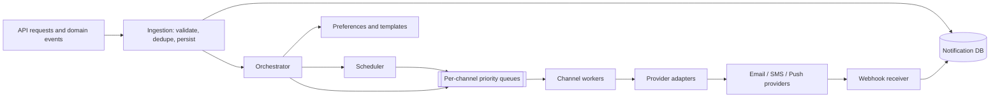

**Interview answer:** Accept the intent, persist it durably, and return `202` — never call a provider on the request path. An orchestrator then resolves preferences, renders a version-pinned template, and writes one message per eligible channel onto that channel's priority queue; workers consume those, call providers through adapters, and provider webhooks feed final delivery state back. Reliability comes from durable queues plus at-least-once processing made safe by idempotency at the API, worker, provider and callback levels, with classified retries, exponential backoff and a dead-letter queue.

**Gotcha:** Treating `provider_accepted` as `delivered`. The provider has only queued the message — the mailbox can still bounce it, the carrier can drop the SMS, the device token can be stale. Final state arrives later on an asynchronous callback, so status transitions must tolerate duplicate, late and out-of-order events.

---

# 1. Introduction

A **multi-channel notification system** sends messages to users through email, SMS, mobile push, web push, an in-app inbox, and chat channels such as WhatsApp. Typical examples are an OTP by SMS, an order confirmation by email, a payment-failure alert by push and email, a promotional offer by email, and a social notification in the application's inbox.

The main challenge is not calling an email or SMS provider. A production system has to absorb high traffic across different provider APIs while honouring user preferences, templates and localization, retries and duplicate prevention, scheduling, delivery tracking, rate limits, provider outages, and security and regulatory requirements.

The system should isolate product services from provider-specific logic. The Order Service should only need to say *notify user 123 that order 789 was shipped*. It should not need to know which email or SMS provider is used, whether the user disabled SMS, how the message is formatted, or how retries are performed.

---

# 2. Requirements

## 2.1 Functional Requirements

The system should support:

1. Sending notifications through multiple channels.
2. Receiving notification requests through APIs and domain events.
3. Sending to one user, a group of users, or a large audience.
4. Immediate and scheduled notifications.
5. Transactional and promotional notifications.
6. User-level channel preferences.
7. Quiet hours and timezone-aware delivery.
8. Reusable, versioned, localized templates.
9. Personalization using variables.
10. Priorities such as critical, high, normal, and bulk.
11. Retry policies for temporary failures.
12. Provider delivery-status callbacks.
13. An in-app notification inbox.
14. Deduplication and idempotency.
15. Auditing and delivery history.
16. Provider failover where appropriate.
17. Notification cancellation before dispatch.
18. Digest notifications that combine multiple events.

## 2.2 Non-Functional Requirements

| Property | Target |
|---|---|
| Availability | The ingestion API stays available even when an external provider is unavailable. |
| Scalability | Scale from a few notifications per second to hundreds of thousands or millions per minute. |
| Durability | An accepted notification must not disappear because a worker crashed. |
| Low latency | Critical notifications such as OTPs and security alerts dispatch within seconds. |
| Extensibility | Adding a channel or provider must not require major changes to business services. |
| Observability | Expose queue delays, provider errors, delivery rates, retry counts, and end-to-end latency. |
| Security | Protect sensitive data, provider credentials, user contact details, and webhook endpoints. |
| Cost efficiency | Bulk and low-priority traffic must not consume the same expensive resources as critical traffic. |

## 2.3 Out of Scope

Depending on the interview scope, exclude full marketing-campaign management, customer journey builders, content recommendation, advanced email layout editors, machine-learning-based send-time optimization, telecom carrier infrastructure, and provider-internal delivery mechanisms.

---

# 3. Core Concepts

## 3.1 Notification, Message, and Delivery Attempt

These terms should be modeled separately.

- **Notification** — the business-level intent: *notify user 42 that invoice INV-981 is overdue*.
- **Message** — a rendered, channel-specific representation: an email with subject `Invoice INV-981 is overdue` and a body giving the ₹12,000 amount and its 2 August due date.
- **Delivery attempt** — one attempt to send a message through a provider: `attempt 1 → SendGrid → timeout`, then `attempt 2 → SendGrid → accepted`, then a provider callback reporting `delivered`.

A single notification can create multiple messages, and each message can have multiple delivery attempts.

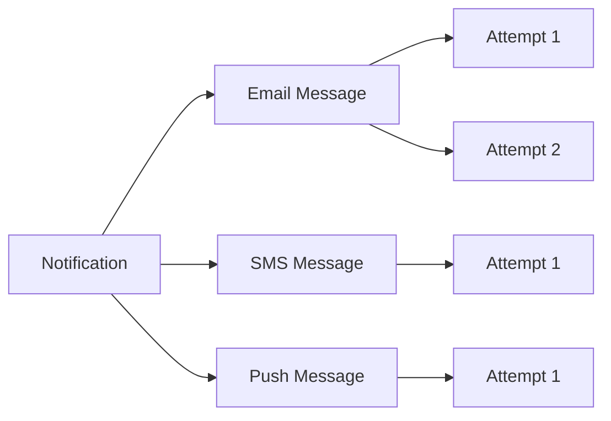

## 3.2 Transactional vs Promotional Notifications

| | Transactional | Promotional |
|---|---|---|
| Trigger | User or system activity | Marketing or engagement campaign |
| Examples | OTP, password reset, payment receipt, order update, security alert | Discount campaign, product recommendations, newsletter, re-engagement |
| Consent | Usually sent even if marketing notifications are disabled | Requires explicit consent |
| Timing | High importance, low latency | Can be delayed, often sent in large batches |
| Controls | Strict audit and security requirements | Strong unsubscribe and frequency-control requirements |

Keep the two apart through different queues, worker pools, provider accounts or sending domains, rate limits and monitoring dashboards. This is what prevents a large marketing campaign from delaying OTPs.

## 3.3 Push vs Pull Channels

**Push channels** — email, SMS, mobile push, web push, WhatsApp — send content to an external destination. **Pull or stored channels** — the in-app inbox, notification center and activity feed — store the notification for the user to retrieve, usually in the application's own database behind an API.

---

# 4. High-Level Architecture

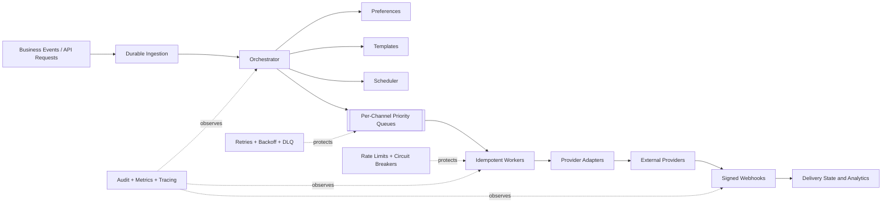

Producers are the order, payment, auth and campaign services plus the admin portal; some call the notification API directly, others publish domain events onto the bus. Ingestion persists to the notification database before anything asynchronous happens, the orchestrator writes one message per eligible channel onto that channel's queue, and each channel has its own worker pool and provider — in-app messages go to an inbox store rather than an external provider. Provider callbacks land on the webhook receiver, which updates the database and feeds a delivery-event queue for analytics and audit.

The architecture has two important boundaries:

1. **Product services communicate with the notification platform through a stable API or event schema.**
2. **Channel workers communicate with external providers through provider adapters.**

This avoids tight coupling in both directions.

---

# 5. End-to-End Notification Flow

Consider a payment-failure event.

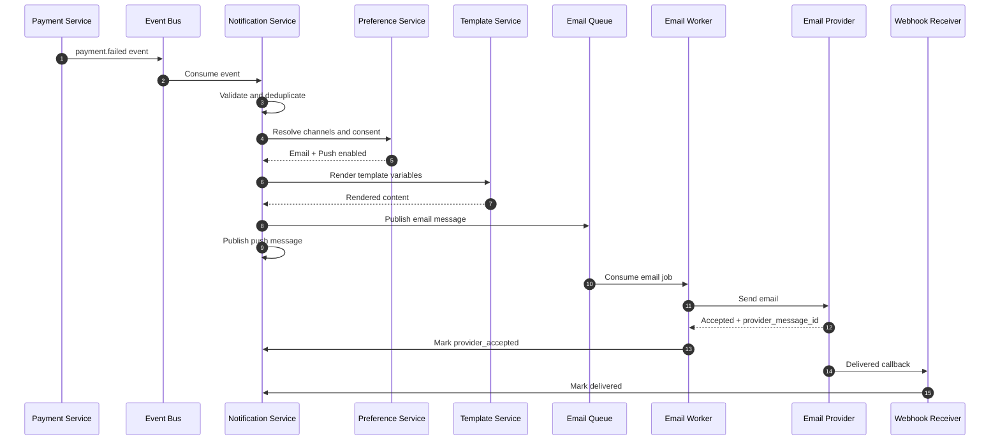

In detail: the ingestion layer authenticates and validates the request or event, checks the idempotency key or event ID, and creates a notification record. The orchestrator then loads user preferences, selects eligible channels, resolves contact endpoints (email address, phone number, device tokens), loads and renders channel templates, and applies quiet hours, scheduling, priority and rate limits before writing one message per selected channel onto that channel's queue. A worker calls the provider and stores provider acceptance; asynchronous callbacks later move the message to delivered, bounced, failed or read, and metrics and audit events are emitted throughout.

---

# 6. Major Components

## 6.1 Notification API

The API accepts direct notification requests from callers such as the authentication service, the admin portal, internal applications and the campaign service. It authenticates and authorizes the caller, validates the schema, checks the idempotency key, enforces request-size limits, resolves the tenant, persists the notification, and returns a notification ID quickly.

The API should not wait for providers to send the message.

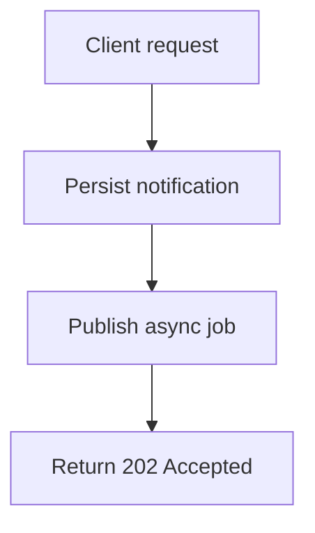

Returning asynchronously improves availability and latency.

## 6.2 Event Ingestion

Business systems often publish domain events instead of calling the notification API directly.

Examples:

```json
{
  "event_id": "evt_01J...",
  "event_type": "order.shipped",
  "occurred_at": "2026-08-03T06:20:00Z",
  "tenant_id": "shop_123",
  "user_id": "user_456",
  "data": {
    "order_id": "ORD-9001",
    "tracking_number": "TRK-1189"
  }
}
```

The notification system maps an event type to a notification policy.

```yaml
event_type: order.shipped
template: order-shipped-v3
channels:
  - push
  - email
fallback:
  push_to_sms_after: 10m
```

Event-driven integration keeps product services independent of notification logic, lets more than one consumer use the same domain event, stops temporary notification downtime from blocking business transactions, and allows events to be replayed.

## 6.3 Orchestrator

The orchestrator converts notification intent into channel messages: it fetches preferences, resolves recipients, selects channels, applies rules, resolves the template version, schedules delivery, creates one message per channel and publishes the jobs.

The orchestrator should not contain provider-specific code.

A useful abstraction is:

```python
class ChannelStrategy:
    def is_eligible(self, context) -> bool:
        ...

    def build_message(self, context) -> "ChannelMessage":
        ...

    def queue_name(self) -> str:
        ...
```

## 6.4 Preference Service

Stores user communication preferences.

Example:

```json
{
  "user_id": "user_456",
  "timezone": "Asia/Kolkata",
  "quiet_hours": {
    "start": "22:00",
    "end": "08:00"
  },
  "categories": {
    "security": {
      "email": true,
      "sms": true,
      "push": true
    },
    "order_updates": {
      "email": true,
      "sms": false,
      "push": true
    },
    "marketing": {
      "email": false,
      "sms": false,
      "push": false
    }
  }
}
```

Preference resolution should consider:

1. Legal or mandatory rules
2. Tenant policy
3. Notification-category policy
4. User preference
5. Endpoint availability
6. Quiet hours
7. Frequency caps

A security alert may override quiet hours, but a marketing notification should not.

## 6.5 Template Service

The template service manages channel-specific content.

Example template structure:

```yaml
template_key: payment_failed
version: 4
locale: en-IN

email:
  subject: "Payment failed for invoice {{ invoice_number }}"
  html: |
    <p>Hello {{ user_name }},</p>
    <p>We could not process ₹{{ amount }}.</p>
  text: |
    Hello {{ user_name }},
    We could not process ₹{{ amount }}.

sms:
  body: "Payment of ₹{{ amount }} failed. Update your payment method: {{ short_url }}"

push:
  title: "Payment failed"
  body: "Update your payment method to avoid interruption."
  data:
    screen: "billing"
    invoice_id: "{{ invoice_id }}"
```

Templates should support versioning with draft and published states, localization with a fallback locale, preview and test sending, required-variable validation, channel-specific length limits, safe escaping, and audit history.

Do not allow unrestricted template code execution. Use a safe templating language with limited helpers.

## 6.6 Scheduling Service

The scheduler handles future delivery, quiet-hour deferral, recurring notifications, digest windows, campaign batches and retry scheduling.

For moderate scale, store `scheduled_at` in a database and periodically claim due records. For large scale, use delayed queues, time buckets, a timing wheel, partitioned scheduler tables, or a managed scheduler for coarse-grained jobs — anything that avoids scanning the entire notification table. A typical bucket is `schedule_bucket = floor(scheduled_at / 1 minute)` with `partition_key = tenant_id + schedule_bucket`.

## 6.7 Channel Queues

Use a separate queue for each channel and priority, named like `notification.email.high`, `notification.email.bulk`, `notification.sms.critical` or `notification.push.normal`.

That split buys independent scaling, independent retry policies, provider rate-limit isolation, priority separation, failure isolation and clearer monitoring. A single shared queue makes it much harder to stop slow email jobs from blocking urgent SMS traffic.

## 6.8 Channel Workers

A channel worker:

1. Consumes a message.
2. Acquires an idempotency or processing lock.
3. Checks whether the message is still eligible.
4. Applies channel rate limits.
5. Calls a provider adapter.
6. Stores the provider message ID.
7. Classifies the response.
8. Acknowledges, retries, or sends to a dead-letter queue.

Pseudo-code:

```python
def process(job):
    if delivery_attempt_already_succeeded(job.message_id):
        acknowledge(job)
        return

    if notification_is_cancelled(job.notification_id):
        mark_cancelled(job.message_id)
        acknowledge(job)
        return

    if not rate_limiter.allow(job.provider, job.tenant_id):
        retry_later(job)
        return

    try:
        response = provider.send(job.payload)

        save_provider_acceptance(
            message_id=job.message_id,
            provider_message_id=response.id,
        )
        acknowledge(job)

    except TemporaryProviderError as exc:
        record_failure(job, exc, retryable=True)
        retry_with_backoff(job)

    except PermanentProviderError as exc:
        record_failure(job, exc, retryable=False)
        acknowledge(job)
```

## 6.9 Provider Adapters

Use a common interface so providers can be replaced.

```python
class EmailProvider:
    def send(self, request: EmailRequest) -> ProviderResult:
        ...

class SmsProvider:
    def send(self, request: SmsRequest) -> ProviderResult:
        ...
```

Provider result:

```python
@dataclass
class ProviderResult:
    provider_message_id: str
    status: str
    raw_status: str
    accepted_at: datetime
```

Adapters translate the internal request format into the provider's, provider statuses into canonical statuses, provider errors into retryable or permanent categories, and provider callback payloads into internal delivery events.

Example canonical errors:

```text
TEMPORARY_UNAVAILABLE
RATE_LIMITED
INVALID_DESTINATION
UNSUBSCRIBED
AUTHENTICATION_FAILED
CONTENT_REJECTED
PROVIDER_INTERNAL_ERROR
```

## 6.10 Webhook and Delivery-Receipt Service

Provider APIs usually report only that a message was accepted for processing. Final delivery often arrives asynchronously through callbacks.

The webhook service should:

1. Verify provider signatures.
2. Validate timestamps to reduce replay attacks.
3. Parse and normalize events.
4. Deduplicate callback events.
5. Respond quickly.
6. Process updates asynchronously.
7. Preserve the raw payload for debugging, subject to retention policy.

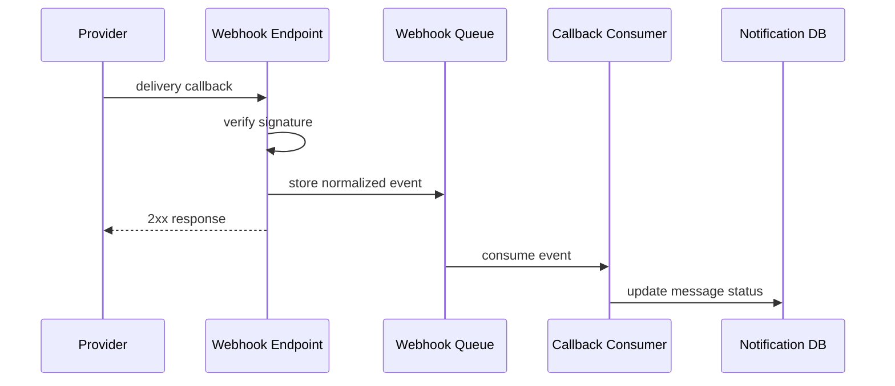

Callbacks can arrive more than once, out of order, after a long delay, without a known message because of a race, or after the message was already marked failed. Status updates must therefore be idempotent and state-transition aware.

## 6.11 Notification Inbox

For in-app notifications, store a user-visible record supporting listing with cursor pagination, an unread count, mark-one-read and mark-all-read, deep-link metadata, expiration, and deletion or archival.

Example:

```json
{
  "id": "inapp_123",
  "user_id": "user_456",
  "title": "Your order has shipped",
  "body": "Order ORD-9001 is on the way.",
  "action": {
    "type": "OPEN_ORDER",
    "order_id": "ORD-9001"
  },
  "created_at": "2026-08-03T06:20:10Z",
  "read_at": null
}
```

For a high-volume inbox, partition by `user_id` and sort by a time-based key.

---

# 7. Data Model

A relational database is suitable for transactional metadata, preferences, templates, and auditing.

## Main Entities

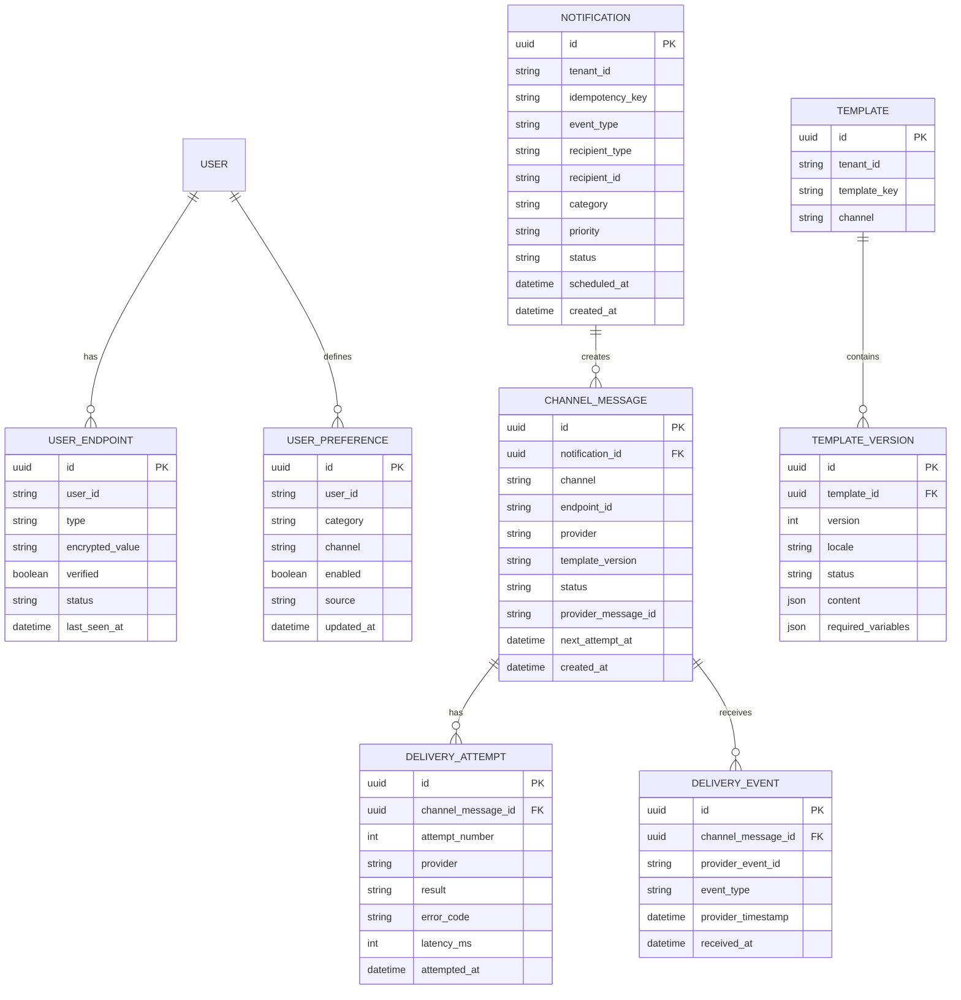

## Suggested Indexes

```sql
CREATE UNIQUE INDEX uq_notification_idempotency
ON notifications (tenant_id, idempotency_key);

CREATE INDEX idx_message_dispatch
ON channel_messages (status, next_attempt_at, priority);

CREATE UNIQUE INDEX uq_provider_event
ON delivery_events (provider, provider_event_id);

CREATE INDEX idx_user_inbox
ON in_app_notifications (user_id, created_at DESC, id DESC);

CREATE INDEX idx_scheduled_notification
ON notifications (scheduled_at)
WHERE status = 'SCHEDULED';
```

## Separate Content from Metadata

Notification content can contain sensitive or large data. Options are to store rendered content in an encrypted database column, put large content in object storage and keep a reference, store only the template ID and variables and render near dispatch time, or apply short retention to raw provider responses.

A common design keeps the metadata database holding notification ID, status, channel, timestamps and provider ID, with subject, body, personalization variables and provider payload in a separate encrypted content store.

---

# 8. API Design

## Create Notification

```http
POST /v1/notifications
Idempotency-Key: order-shipped-ORD-9001-v1
Content-Type: application/json
```

```json
{
  "tenant_id": "shop_123",
  "recipient": {
    "type": "user",
    "id": "user_456"
  },
  "template_key": "order_shipped",
  "category": "order_updates",
  "priority": "high",
  "channels": ["push", "email"],
  "data": {
    "order_id": "ORD-9001",
    "tracking_number": "TRK-1189"
  },
  "scheduled_at": null
}
```

Response: `HTTP/1.1 202 Accepted`

```json
{
  "notification_id": "ntf_01J...",
  "status": "accepted"
}
```

## Get Notification Status

```http
GET /v1/notifications/ntf_01J...
```

```json
{
  "id": "ntf_01J...",
  "status": "partially_delivered",
  "channels": [
    {
      "channel": "push",
      "status": "delivered"
    },
    {
      "channel": "email",
      "status": "provider_accepted"
    }
  ]
}
```

## Cancel Scheduled Notification

```http
POST /v1/notifications/ntf_01J.../cancel
```

Cancellation is best effort. A message that has already reached a provider may not be retractable.

## Read In-App Notifications

```http
GET /v1/users/user_456/notifications?cursor=...&limit=20
```

## Mark as Read

```http
POST /v1/users/user_456/notifications/inapp_123/read
```

## Register Device Token

```http
POST /v1/users/user_456/endpoints/push
```

```json
{
  "platform": "android",
  "token": "device-registration-token",
  "app_id": "customer-app"
}
```

## Update Preferences

```http
PUT /v1/users/user_456/preferences/order_updates
```

```json
{
  "email": true,
  "sms": false,
  "push": true
}
```

---

# 9. Notification State Machine

Use separate state machines for the business notification and channel messages.

## Channel Message States

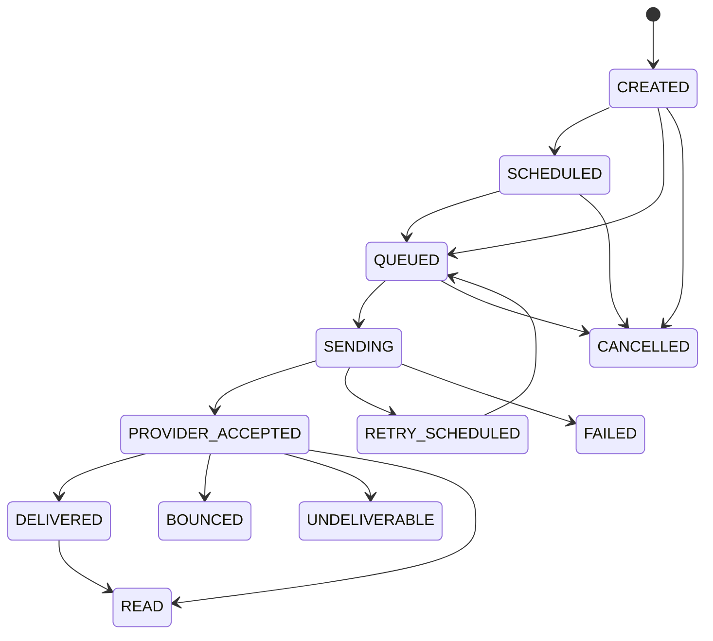

Do not treat `provider_accepted` as equal to `delivered`.

For example:

- Email provider accepted the email, but the recipient mailbox may reject it later.
- SMS provider accepted the request, but the carrier may fail delivery.
- Push provider accepted the request, but the device may be offline or the token may be invalid.

## Aggregate Notification Status

A multi-channel notification rolls up to `ACCEPTED`, `PROCESSING`, `DELIVERED`, `PARTIALLY_DELIVERED`, `FAILED`, `CANCELLED` or `EXPIRED`. Email delivered, SMS failed and push delivered gives an overall status of `partially_delivered`.

---

# 10. Reliability and Delivery Guarantees

## 10.1 At-Least-Once Delivery

Most practical queue-based notification systems provide **at-least-once processing**, which means a message may be processed more than once: a worker sends an SMS successfully, crashes before acknowledging the queue message, the queue redelivers the job, and another worker sends the same SMS again.

Exactly-once delivery across your database, message broker, and external provider is generally not achievable as a single atomic transaction. The practical substitute is at-least-once delivery plus idempotent processing plus deduplication.

## 10.2 Idempotency

Use idempotency at multiple levels.

### API-Level Idempotency

The caller supplies a key, and `tenant_id + idempotency_key` maps to exactly one notification — for example `order-shipped-ORD-9001-v1`. A repeated request returns the existing notification instead of creating a new one.

### Consumer-Level Idempotency

Before sending:

```sql
UPDATE channel_messages
SET status = 'SENDING',
    processing_owner = :worker_id,
    processing_started_at = NOW()
WHERE id = :message_id
  AND status IN ('QUEUED', 'RETRY_SCHEDULED');
```

Only the worker that successfully updates the row should continue.

### Provider-Level Idempotency

Use a provider idempotency key when the provider supports one.

If the provider does not support idempotency, store the provider response immediately and minimize the crash window.

### Webhook-Level Idempotency

Store a unique provider event ID: `(provider, provider_event_id)` must be unique.

## 10.3 Transactional Outbox

A common failure happens when a business service updates its database but fails to publish the notification event: marking the order shipped succeeds, publishing `order.shipped` fails, and the order is now shipped with no notification ever created.

Use the **transactional outbox pattern**.

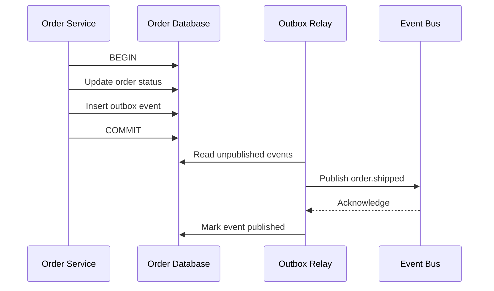

The business update and outbox insert happen in one local database transaction.

The relay can publish an event more than once, so downstream consumers still need deduplication.

## 10.4 Retries and Exponential Backoff

Retry only temporary errors.

### Retryable Errors

- Timeout
- Connection reset
- HTTP 429
- HTTP 500 or 503
- Temporary provider outage
- Temporary DNS failure

### Usually Non-Retryable Errors

- Invalid phone number
- Invalid email address
- Unregistered device token
- Unsubscribed recipient
- Invalid template
- Authentication failure caused by bad configuration
- Rejected or prohibited content

Example backoff:

```text
attempt 1 -> immediate
attempt 2 -> 5 seconds
attempt 3 -> 30 seconds
attempt 4 -> 2 minutes
attempt 5 -> 10 minutes
attempt 6 -> 1 hour
```

Use jitter to prevent many workers from retrying at exactly the same time.

```python
delay = min(max_delay, base_delay * (2 ** attempt))
delay = random.uniform(delay * 0.5, delay * 1.5)
```

Important notifications can have shorter retry intervals and a secondary provider.

## 10.5 Dead-Letter Queues

After retry exhaustion, move the job to a dead-letter queue, storing enough to diagnose it later: notification ID, message ID, channel, provider, failure category, last error, attempt count, a reference to the original payload, and the first and last attempt times.

The DLQ then supports investigation, selective reprocessing, alerting, provider comparison, and finding template or configuration defects. Do not blindly replay every DLQ message — a permanent failure will simply fail again.

## 10.6 Provider Failover

A provider abstraction allows fallback.

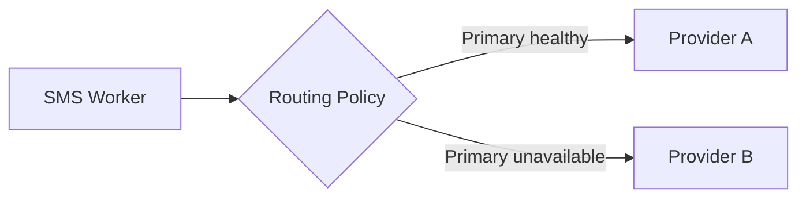

Routing signals may include provider health, success rate, latency, country support, tenant preference, cost, regulatory restrictions and remaining quota.

Avoid immediate failover for ambiguous timeouts unless duplicate delivery is acceptable. The primary provider may have processed the request even though your worker did not receive a response.

A safer policy is:

```text
Definite provider rejection      -> fail over
Connection failure before send   -> fail over
Ambiguous timeout after send     -> reconcile or delay before failover
```

---

# 11. User Preferences and Consent

Preferences should be category-specific rather than one global switch.

| Category | Email | SMS | Push |
|---|---|---|---|
| Security alerts | enabled | enabled | enabled |
| Order updates | enabled | disabled | enabled |
| Marketing | disabled | disabled | disabled |

## Preference Hierarchy

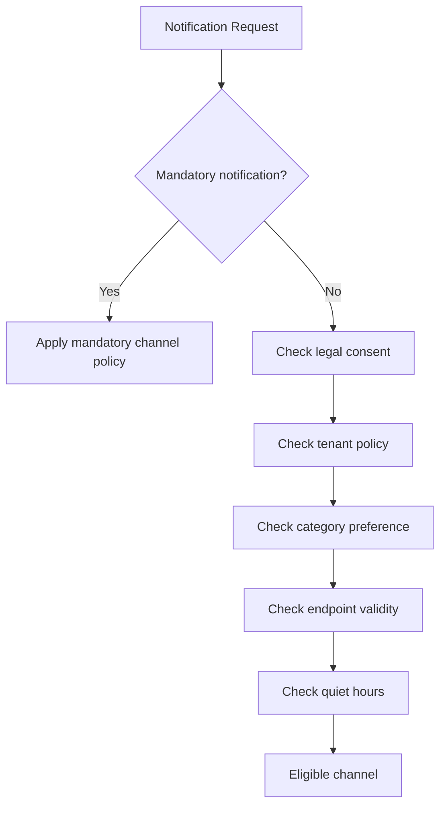

## Quiet Hours

Quiet hours must use the user's timezone. With a user in `Asia/Kolkata` whose quiet hours run 10:00 PM to 8:00 AM, an event at 11:15 PM defers a marketing notification to 8:00 AM but sends a security alert immediately.

## Frequency Caps

Examples:

- Maximum three promotional pushes per day
- Maximum one abandoned-cart email per 24 hours
- Maximum one payment reminder per invoice per day

Use a fast counter store such as Redis for real-time enforcement, with durable history in a database or analytics store.

## Unsubscribe Handling

Unsubscribe should update a central suppression or preference system quickly. Sources include the email unsubscribe link, a provider complaint event, an SMS opt-out keyword, the user settings page, an admin action, and a legal deletion request. A suppression event should invalidate caches and prevent future sends.

---

# 12. Template Design

## Render Early vs Render Late

| | Render at ingestion time | Render at dispatch time |
|---|---|---|
| Advantages | Exact content is preserved; faster worker execution; easier audit | Uses the latest template and user information; supports dynamic send-time data; less stored rendered content |
| Disadvantages | Scheduled content becomes stale; locale or template fixes are not reflected; large rendered content consumes storage | The template service joins the dispatch path; a template update can unexpectedly change scheduled messages; historical content is hard to reproduce unless versions are pinned |

### Recommended Approach

Pin the template version at orchestration time and render near dispatch. The notification stores `template_key`, `template_version`, `locale` and the variables; the worker renders that exact pinned version against the stored variables.

For compliance-sensitive messages, store a final immutable copy of rendered content.

## Template Validation

Before publishing, check that required variables are declared and that every variable the template uses exists, that SMS length is within expected segment limits and the push payload stays under provider limits, that email has a text fallback and a locale fallback exists, that URLs use approved domains and HTML is sanitized, and that no prohibited sensitive data appears in the title or lock-screen text.

## Localization

Resolution order:

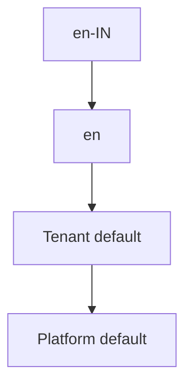

Locale should be decided using user preference, not only device language.

---

# 13. Scheduling, Batching, and Digests

## Scheduled Notifications

Store a UTC `scheduled_at` timestamp.

Convert user-local time to UTC when scheduling, while retaining timezone information for recurring schedules.

```json
{
  "schedule": {
    "local_time": "09:00",
    "timezone": "Asia/Kolkata",
    "scheduled_at_utc": "2026-08-04T03:30:00Z"
  }
}
```

## Digest Notifications

A digest groups many low-priority events: instead of 10 separate "new comment" emails, send one "You received 10 new comments today".

Digest flow:

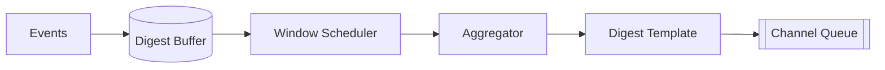

Group by `tenant_id + user_id + category + digest_window`.

## Batch Campaigns

Do not enqueue ten million messages in one database transaction.

Use chunking:

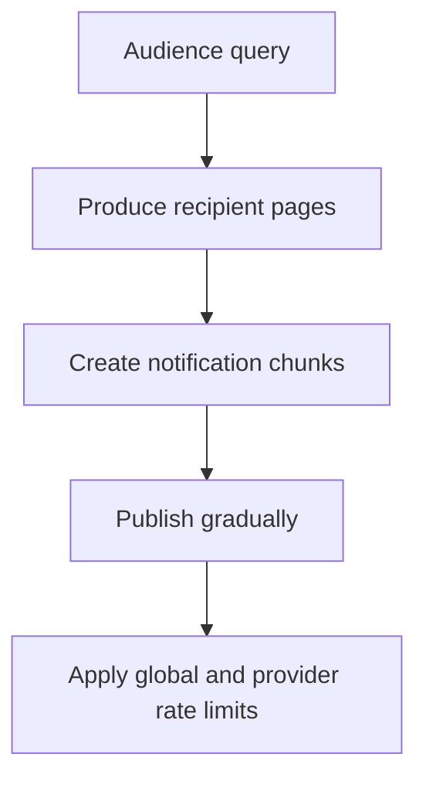

Campaign metadata should be separate from individual recipient delivery records.

---

# 14. Priority and Rate Limiting

## Priority Classes

| Priority | Examples | Expected Behavior |
|---|---|---|
| Critical | OTP, account takeover alert | Immediate, reserved capacity |
| High | Payment failure, shipment update | Low latency |
| Normal | Social notification, reminder | Standard queue |
| Bulk | Newsletter, promotion | Rate-controlled, delay acceptable |

Use physically separate queues or strong weighted scheduling, with worker capacity reserved per class — for example critical 20%, high 30%, normal 30%, bulk 20%.

## Rate-Limit Dimensions

Rate limits may apply by provider account, channel, tenant, sender identity, destination country, phone number, email domain, campaign, user or template category — usually several at once.

A token-bucket algorithm works well.

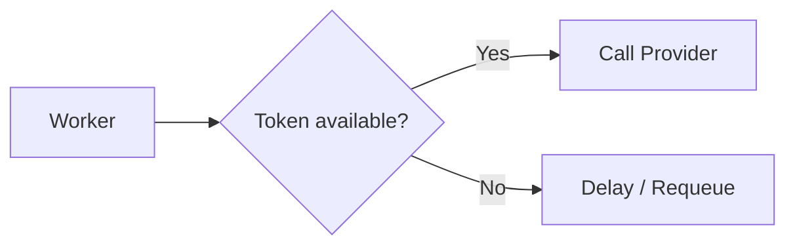

Distributed token buckets can be implemented using Redis scripts or a dedicated rate-limit service.

## Backpressure

When providers slow down:

1. Queue depth increases.
2. Workers receive rate-limit errors.
3. Circuit breakers reduce provider traffic.
4. Lower-priority traffic is paused.
5. Critical traffic uses reserved capacity.
6. Autoscaling increases workers only when provider limits allow it.

Adding workers cannot solve a provider-side quota limit.

---

# 15. Ordering and Deduplication

## Ordering

Most notifications do not require global ordering, but some flows require ordering per entity — order confirmed, then shipped, then delivered. Partition messages by a stable key such as `partition_key = tenant_id + order_id`.

Strict ordering reduces parallelism. Use it only where the business requires it.

## Stale Event Protection

Events may arrive out of order — `order.delivered` before `order.shipped`. Include an event version or entity sequence.

```json
{
  "event_type": "order.shipped",
  "order_id": "ORD-9001",
  "order_version": 7
}
```

The notification policy can ignore an event if the current order version is already greater.

## Deduplication Windows

Not all duplicates share the exact same event ID. A semantic deduplication key of `tenant + user + category + entity + state + time_window` catches the rest — for example `shop_123:user_456:payment_failed:invoice_981:2026-08-03`.

Be careful not to suppress legitimate repeated notifications.

---

# 16. Scaling the System

## 16.1 Capacity Estimation

Assume:

- 20 million active users
- Average 4 notifications per user per day
- Average 1.5 channels per notification
- Peak traffic is 10 times average
- Average internal queue message is 2 KB

### Daily Channel Messages

```text
20,000,000 users
× 4 notifications
× 1.5 channels
= 120,000,000 channel messages/day
```

### Average Messages per Second

```text
120,000,000 / 86,400
≈ 1,389 messages/second
```

### Peak Messages per Second

```text
1,389 × 10
≈ 13,890 messages/second
```

Design for roughly **15,000–20,000 channel messages per second** initially, then include safety capacity.

### Queue Data Volume

```text
120,000,000 × 2 KB
≈ 240 GB/day of logical queue payload
```

Avoid putting large HTML bodies or attachments directly in queues. Store large content externally and pass references.

### Database Write Volume

Each message may create one channel-message row, one or more attempt rows, and multiple delivery-event rows. At 120 million messages per day, this can become several hundred million writes per day, so use batched writes, partitioned tables, short retention for detailed attempt logs, separate operational and analytical storage, and asynchronous event export.

## 16.2 Partitioning Strategy

### Queue Partitioning

Useful keys are channel, priority, tenant, geographic region, and recipient ID where ordering matters. Avoid letting a single high-volume tenant create a hot partition; `hash(tenant_id + recipient_id) % partition_count` spreads it.

### Database Partitioning

Operational notification tables can be partitioned by creation date, tenant, region, or a hash of the notification ID. Time partitioning simplifies retention — `notifications_2026_08`, `delivery_events_2026_08` — and the inbox is commonly partitioned by user ID because reads are user-centric.

### Cache Partitioning

Cache template versions, preferences, provider routing policies and tenant configuration, with short TTLs and event-driven invalidation for preference changes.

## 16.3 Handling Traffic Spikes

Spikes come from flash sales, breaking news, system outages, bulk campaigns, and large scheduled batches landing at the top of the hour.

Defend with queue buffering, admission control, batch spreading, randomized schedule jitter, autoscaling workers, priority isolation, provider-aware rate limiting, per-tenant quotas, campaign throttling, and load shedding for non-critical traffic. Jitter is the cheapest of these: instead of scheduling 5 million messages at 09:00:00, spread them from 09:00:00 to 09:10:00.

---

# 17. Failure Scenarios

## Scenario 1: Provider Is Down

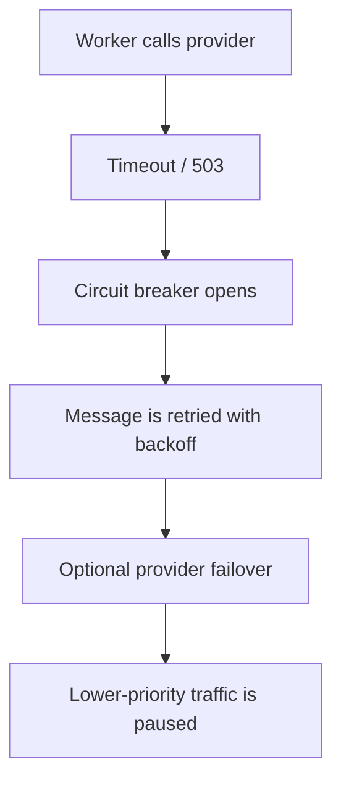

The ingestion API should continue accepting requests while durable queues absorb the backlog.

## Scenario 2: Worker Crashes After Sending

The queue redelivers the message. Protect with consumer idempotency, a provider idempotency key, persisting the provider response immediately, and reconciliation for uncertain attempts.

## Scenario 3: Callback Arrives Before Send Result Is Stored

This race can occur when a provider callback is extremely fast. Upsert using the provider message ID, store unmatched callbacks temporarily, retry callback correlation, and use an internal client reference echoed by the provider where supported.

## Scenario 4: Callback Is Delivered Multiple Times

Use a unique provider event ID and idempotent transitions.

## Scenario 5: Events Arrive Out of Order

Compare provider timestamp, event sequence, and allowed state transitions. Never move `DELIVERED → PROVIDER_ACCEPTED` just because a delayed callback arrived.

## Scenario 6: Template Service Is Unavailable

Use cached published templates, keep pinned template versions in a local cache, delay non-critical notifications, and fall back to an emergency static template for critical flows.

## Scenario 7: Preference Service Is Unavailable

A workable policy: fail closed for promotional traffic, use a recently cached preference for transactional traffic, send legally mandatory messages according to explicit policy, and record that cached preferences were used.

## Scenario 8: Queue Backlog Becomes Very Large

Alert on oldest-message age, scale workers within provider limits, pause bulk producers, drop expired low-value messages, increase batch size where safe, and route critical traffic through isolated queues.

## Scenario 9: Invalid Device Token

Mark the endpoint inactive after a definitive invalid-token response. Do not keep retrying it.

## Scenario 10: Database Is Unavailable

The API should not return acceptance unless the notification has been durably recorded. Either fail the request, write to a durable log first, run a highly available database, or make the broker the source of truth and materialize state later.

---

# 18. Observability

## Key Metrics

| Area | Metrics |
|---|---|
| Ingestion | Requests per second, accepted vs rejected, idempotency conflicts, validation failures, API latency |
| Queue | Queue depth, oldest-message age, consumer lag, retry queue depth, dead-letter queue count |
| Delivery | Provider acceptance rate, delivery rate, bounce rate, failure rate, retry rate, and latency split into event → dispatch, dispatch → provider acceptance, and acceptance → delivery |
| Provider | Latency by provider, HTTP status distribution, rate-limit responses, cost per delivered message, failover count, circuit-breaker state |
| Product | Notifications per category, unsubscribe rate, push-token invalidation rate, open/read/click events where appropriate, digest compression ratio |

## Service-Level Objectives

Examples:

```text
99.9% of critical notifications are submitted to a provider within 5 seconds.

99% of high-priority notifications are submitted within 30 seconds.

99.99% of accepted notifications are not lost.

Webhook endpoint availability is at least 99.95%.
```

Provider acceptance is measurable by your system. Final delivery may depend on carriers, mail servers, devices, and users, so define SLOs carefully.

## Tracing

Use a correlation chain:

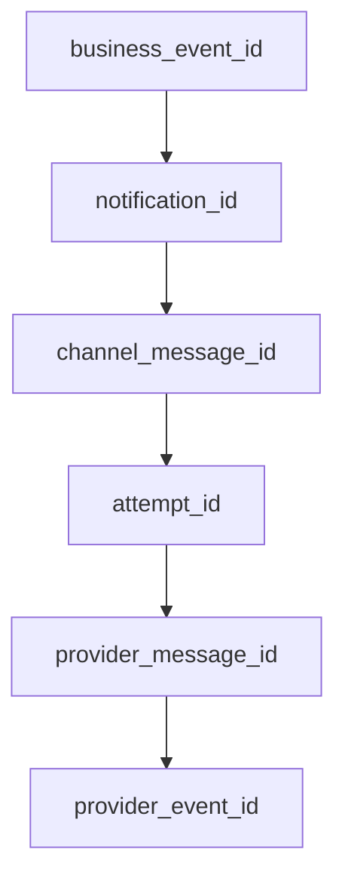

Include these identifiers in structured logs.

## Alerting

Alert on symptoms that affect users: the oldest critical queue message exceeding its threshold, OTP delivery success dropping, provider 5xx rates rising, provider callbacks stopping altogether, DLQ growth, template-rendering failures, lagging suppression updates, and a sudden rise in the push invalid-token rate.

---

# 19. Security and Privacy

## Authentication and Authorization

Authenticate producer services using service identity, OAuth or mTLS, and authorize each tenant to use only its own templates, sender identities and recipients. Restrict admin template publishing and keep separate roles for operations and content management. See [Authentication and Authorization](../api-design/authn-authz-oauth-jwt.md).

## Provider Credentials

Store API keys and signing keys in a secret manager. Never put credentials in source code or queue payloads, never log authorization headers, and never share one unrestricted key across environments. Use key rotation, least-privilege credentials, separate production and non-production accounts, and restricted network egress where practical.

## Protect Contact Data

Email addresses, phone numbers and device tokens are sensitive: encrypt them at rest, use TLS in transit, mask them in logs, apply access controls, keep only what is necessary, support deletion and retention policies, and avoid exposing full recipient details in operational dashboards.

## Webhook Security

Verify provider signatures over HTTPS, reject old timestamps where supported, deduplicate events, and apply request-size limits. Allowlist provider IPs only as an additional layer rather than the only control, store secrets separately per environment, and return a success response only after durable capture. See [Webhooks](../api-design/webhooks.md).

## Template Security

Escape variables according to context, sanitize HTML, prevent script execution, restrict links and images where needed, and protect against template injection. Never place secrets, full payment details, or highly sensitive medical data in lock-screen push content.

## Abuse Prevention

Prevent the notification service from becoming a spam relay: authenticate all callers, enforce tenant quotas, apply destination rate limits, require verified sender identities, audit administrative sends, detect unusual volume, and restrict arbitrary raw-content sending.

---

# 20. Channel-Specific Considerations

| Channel | What the adapter and policy layer must handle |
|---|---|
| Email | Sender domain authentication, bounces and blocks, spam complaints, unsubscribe handling, HTML plus plain-text versions, attachments, provider event webhooks, domain reputation, dedicated vs shared IPs, promotional/transactional separation |
| SMS | Country-specific sender rules, character encoding, message segmentation, delivery receipts, opt-out keywords, carrier filtering, phone-number normalization, per-country pricing, throughput limits |
| Mobile push | FCM and APNs credentials, device-token lifecycle and refresh, multiple devices per user, platform-specific payloads, time-to-live, collapse keys, notification vs data payloads, foreground vs background behavior, lock-screen privacy |
| Web push | Browser subscriptions, VAPID keys, subscription expiration, browser permission, service workers, payload encryption, per-browser behavior |
| In-app | Read/unread state, cursor pagination, unread count, data retention, deep links, cross-device synchronization, fan-out-on-write vs fan-out-on-read |
| WhatsApp and chat | Approved templates, conversation windows, user consent, media support, provider-specific status callbacks, country and policy restrictions, rich interaction metadata |

Keep these provider rules inside the provider adapter and policy layer, not inside product services. The subsections below cover the parts that change the design rather than just the adapter.

## Email

Canonical email events may include:

```text
processed
provider_accepted
delivered
deferred
bounced
blocked
complained
opened
clicked
unsubscribed
```

Open and click signals should not be treated as perfectly reliable user behavior because privacy protections and client behavior can affect tracking.

## SMS

Normalize numbers to E.164 format (`+919876543210`), and do not retry an invalid number indefinitely.

## Mobile Push

A single user routinely has several live tokens — an Android phone, an Android tablet, an iPhone. A push notification may fan out to all active devices or only the most recently used one, depending on product requirements.

### Collapsible vs Non-Collapsible

Collapsible messages replace an older pending message of the same type, which suits a latest score, latest sync state or updated unread count. Non-collapsible messages preserve every message, which is required for chat messages, transaction alerts and security events.

## In-App Notifications

For normal user-specific notifications, fan-out-on-write is simple: create one inbox record per user. For a notification sent to millions of users, fan-out-on-read reduces write amplification — store one global announcement and materialize per-user read state only when a user actually reads it.

---

# 21. Multi-Tenant Design

A shared notification platform may serve multiple products or customers. Tenant-specific configuration typically covers the sender email domain, SMS sender ID, provider account, templates, branding, rate limits, allowed countries, data residency, retry policy and retention policy.

## Tenant Isolation

Every core record should include `tenant_id`, and isolation has to be enforced at API authorization, database queries, cache keys, queue metadata, template lookup, provider routing, and logs and dashboards — missing any one of these is how tenant data leaks.

For strict isolation, high-volume or regulated tenants may get dedicated queues, provider accounts, encryption keys, database partitions, or a separate regional deployment.

## Noisy-Neighbour Protection

Apply per-tenant quotas, weighted fair queuing, a maximum number of concurrent sends, campaign throttling, and separate priority capacity.

---

# 22. Deployment Architecture

A regional deployment may look like this:

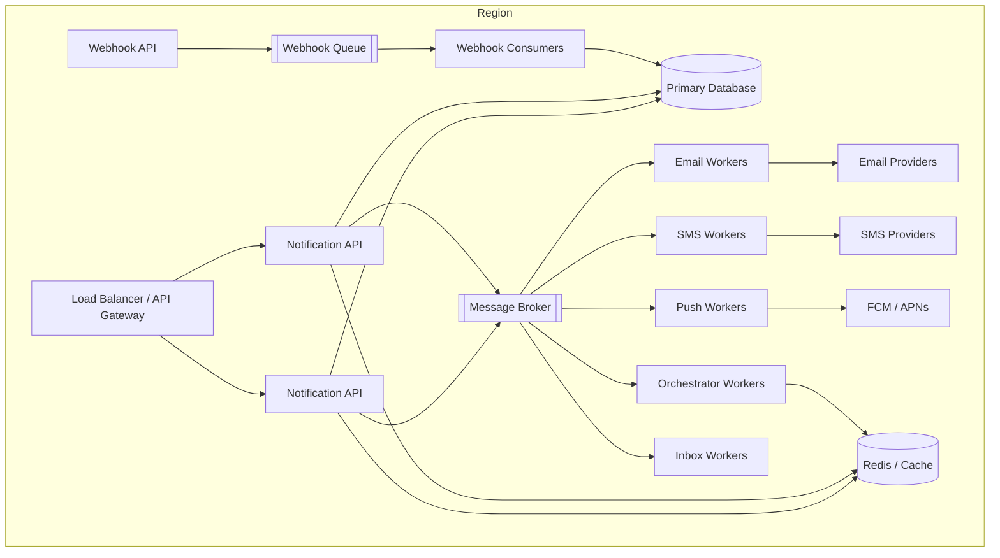

## Multi-Region Options

| | Active-passive | Active-active |
|---|---|---|
| Writes | One primary region handles writes; another stands ready for failover | Multiple regions accept traffic |
| Upside | Simpler ordering and idempotency | Lower regional latency, better regional resilience |
| Downside | Higher recovery time | Complex global deduplication, routing and data consistency |

A practical middle ground is to route users or tenants to a home region, with `home_region = hash(tenant_id)` or the regulatory region. Use a globally unique notification ID and region-aware idempotency storage.

---

# 23. Technology Choices

These are examples, not mandatory selections.

| Capability | Possible Choices |
|---|---|
| API | FastAPI, Django, Spring Boot, Go |
| Event bus | Kafka, Amazon MSK, EventBridge |
| Work queue | SQS, RabbitMQ, Kafka |
| Operational database | PostgreSQL, MySQL, DynamoDB |
| Cache/rate limits | Redis |
| Search and operational analytics | OpenSearch |
| Analytics | ClickHouse, BigQuery, Snowflake |
| Object storage | Amazon S3, Google Cloud Storage |
| Email providers | Amazon SES, SendGrid, Mailgun |
| SMS/chat providers | Twilio, regional aggregators |
| Push | FCM and APNs |
| Secrets | AWS Secrets Manager, Vault |
| Metrics | Prometheus, CloudWatch |
| Tracing | OpenTelemetry |
| Dashboards | Grafana |

## Kafka vs Traditional Queue

| Kafka fits when | SQS or RabbitMQ fits when |
|---|---|
| Event replay matters | The main model is background jobs |
| Many consumer groups need the same event | Per-message retry and DLQ behavior is important |
| Throughput is very high | Operational simplicity is valuable |
| Partition ordering is useful | Consumers should compete for each job |
| Events feed analytics and other systems | |

A common hybrid puts domain events on Kafka or EventBridge and channel delivery jobs on SQS or RabbitMQ.

---

# 24. Design Trade-offs

## One Service vs Separate Channel Services

| | Single notification service | Separate channel services |
|---|---|---|
| Advantages | Easier initial development, shared data and configuration, simpler deployment | Independent deployment and scaling, better failure isolation, channel-specific ownership |
| Disadvantages | Larger failure domain, harder independent scaling, provider code becomes crowded | More operational overhead, distributed data consistency, more service communication |

A good evolution is a modular monolith or shared orchestration service with independently scalable channel workers.

## Store Full Content vs Template Reference

| Store Full Content | Store Template Reference |
|---|---|
| Exact audit copy | Lower storage |
| Fast dispatch | Latest dynamic data possible |
| More sensitive data stored | Rendering dependency at send time |
| Harder template correction | Historical reproduction requires version pinning |

Use version-pinned references and preserve final content only when audit requirements need it.

## Direct API vs Event-Driven Input

| Direct API | Event-Driven |
|---|---|
| Explicit caller control | Loose coupling |
| Immediate notification ID | Easy replay |
| Caller knows notification concern | Product service publishes business facts |
| Can block if API unavailable | Requires event schema governance |

Support both when the platform serves varied use cases.

## Fan-Out Early vs Fan-Out Late

| Early fan-out — create all recipient messages immediately | Late fan-out — store the audience definition and expand gradually |
|---|---|
| Simple status tracking | Better pacing, lower initial burst |
| High write amplification | More complex progress tracking |
| Large campaigns create huge bursts | Audience can change unless snapshot semantics are defined |

Use late fan-out for large campaigns and early fan-out for small transactional groups.

## Strong Consistency vs Eventual Consistency

Strong consistency is needed for preference changes ahead of promotional sends, idempotency, cancellation claims and mandatory suppression — each one causes a user-visible violation if it reads stale. Eventual consistency is fine for analytics, dashboards, non-critical aggregate counters and delivery-event export.

---

# 25. Practical Example: Order Shipment Notification

## Business Requirement

When an order ships:

1. Send push immediately.
2. Send email immediately.
3. Send SMS only if push is not delivered within ten minutes and the user enabled SMS.
4. Add the event to the in-app inbox.
5. Do not send duplicates if the order service retries its event.

## Policy

```yaml
event_type: order.shipped
category: order_updates
priority: high
template_version: 3

channels:
  push:
    enabled: true
  email:
    enabled: true
  in_app:
    enabled: true
  sms:
    fallback_for: push
    wait: 10m
```

## Flow

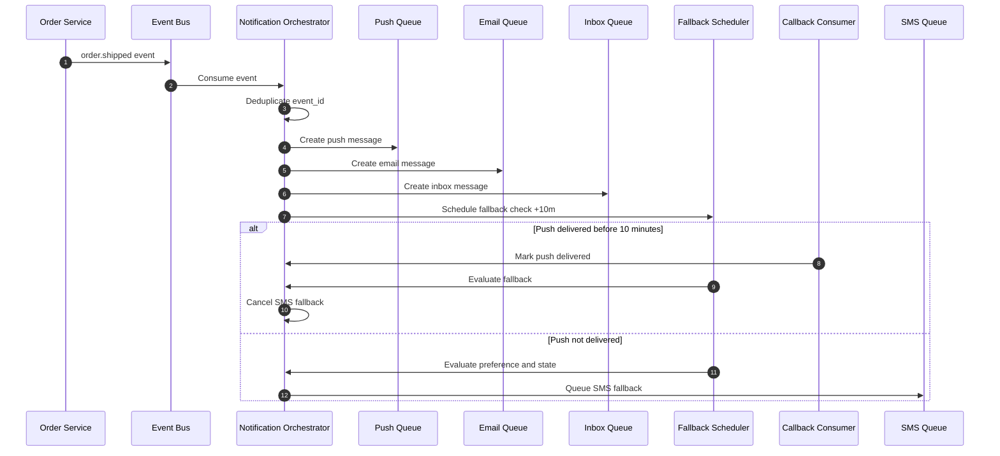

## Deduplication Key

`tenant_id + order_id + "shipped" + order_version`, for example `shop_123:ORD-9001:shipped:v7`.

## Status Result

```json
{
  "notification_id": "ntf_01J...",
  "status": "delivered",
  "channels": {
    "push": "delivered",
    "email": "delivered",
    "in_app": "created",
    "sms": "cancelled_fallback"
  }
}
```

---

# 26. Evolution from MVP to Large Scale

| Stage | What you run | What you add |
|---|---|---|
| 1. MVP | One notification API, PostgreSQL, one queue, email and SMS workers, static templates, basic retry, provider callbacks | — |
| 2. Growing product | The MVP, split by channel | Separate channel queues, user preferences, template versioning, push and in-app channels, Redis-based rate limiting, DLQs, structured metrics, transactional outbox |
| 3. Large platform | A multi-tenant platform | Priority queues, campaign fan-out service, distributed scheduler, provider routing and failover, multi-tenant controls, partitioned databases, analytics pipeline, regional deployment, automated suppression, dedicated critical-notification capacity |
| 4. Global platform | Several regions | Multi-region active-active or home-region routing, data-residency controls, regional provider selection, cross-region disaster recovery, global idempotency strategy, tenant-specific encryption keys, capacity forecasting and automated traffic shaping |

Stage 1 is suitable for a small product, and every later stage is driven by a specific pain: a slow campaign delaying OTPs pushes you to stage 2, a hot tenant or a provider outage to stage 3, and a data-residency or latency requirement to stage 4.

Whatever the stage, the design principle does not change: accept notification intent quickly, persist it durably, process it asynchronously, isolate channels from one another, make retries safe, and track final delivery through provider callbacks.

---
