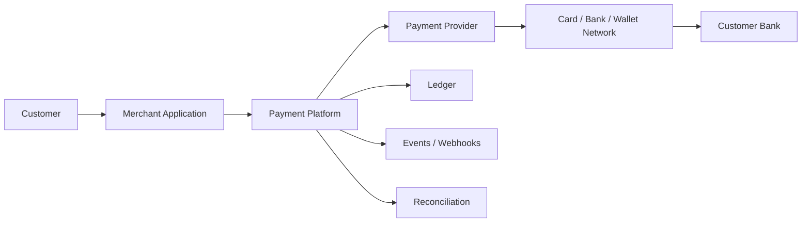
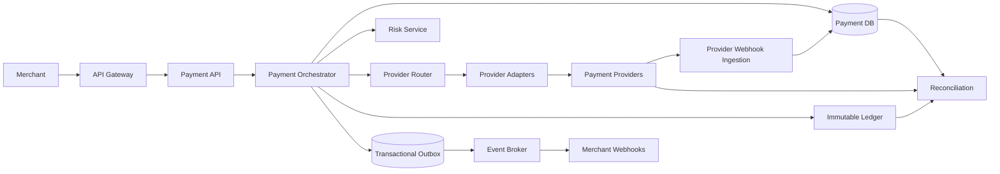
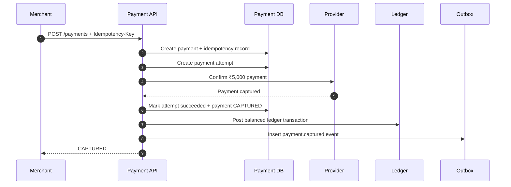
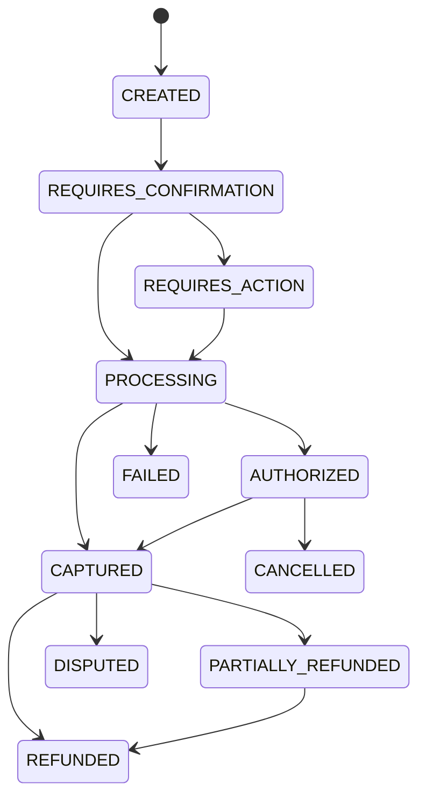
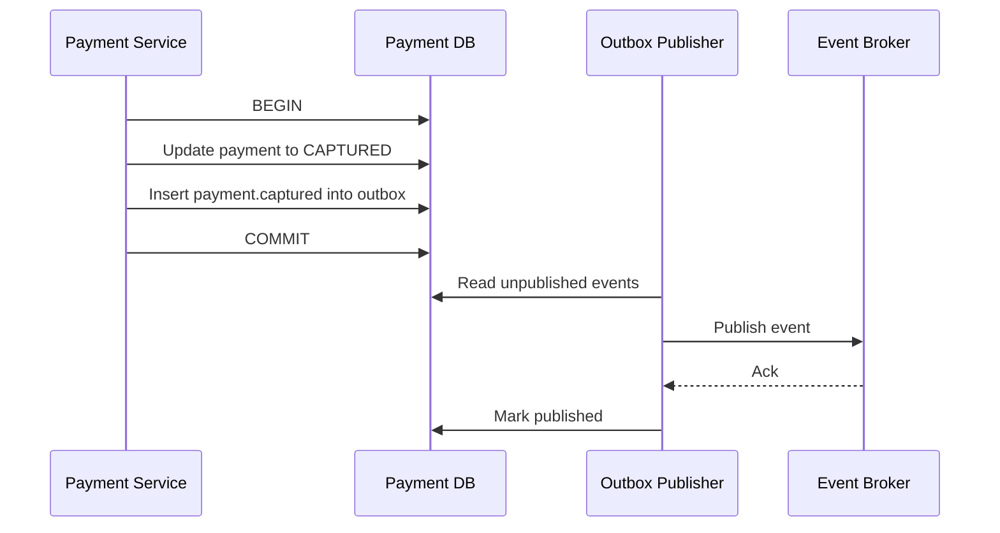
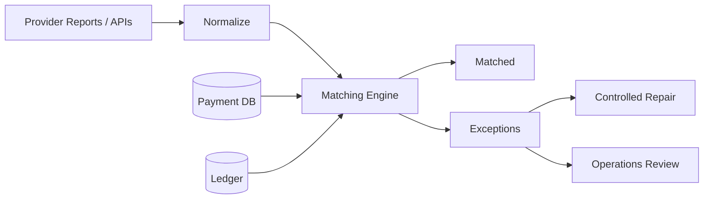

# Design a Payment System

> Design a reliable, secure, and scalable payment platform that can accept payments, track their lifecycle, prevent duplicate charges, maintain accurate financial records, process refunds, and recover safely from failures.

## Index

1. [What Are We Designing?](#1-what-are-we-designing)
2. [Requirements](#2-requirements)
3. [Core Payment Concepts](#3-core-payment-concepts)
4. [High-Level Architecture](#4-high-level-architecture)
5. [End-to-End Payment Flow](#5-end-to-end-payment-flow)
6. [Payment State Machine](#6-payment-state-machine)
7. [Idempotency and Safe Retries](#7-idempotency-and-safe-retries)
8. [Ledger and Money Movement](#8-ledger-and-money-movement)
9. [Consistency, Outbox, and Webhooks](#9-consistency-outbox-and-webhooks)
10. [Failure Recovery and Reconciliation](#10-failure-recovery-and-reconciliation)
11. [API and Data Model](#11-api-and-data-model)
12. [Scaling, Security, and Observability](#12-scaling-security-and-observability)
13. [Important Design Trade-offs](#13-important-design-trade-offs)
14. [Interview Revision Summary](#14-interview-revision-summary)

---

# 1. What Are We Designing?

A payment system sits between a merchant application and external payment providers such as card processors, banks, wallets, or UPI-like rails.

Its job is not only to call a gateway. It must safely coordinate a **distributed financial workflow** where requests can time out, webhooks can arrive late or more than once, and the same client request may be retried.

The system should ensure that one logical purchase does not accidentally become two charges.



### Example used in this note

A customer pays an **₹5,000 annual insurance premium**.

```text
Order: ORD-9001
Payment: PAY-1001
Amount: ₹5,000
Currency: INR
Capture method: automatic
```

---

# 2. Requirements

## 2.1 Functional requirements

| Capability | Expected behaviour |
|---|---|
| Create payment | Merchant creates a payment for an order. |
| Process payment | Validate, route to a provider, and track the result. |
| Payment status | Merchant can fetch the latest known state. |
| Authorization | Reserve or approve funds before capture when required. |
| Capture | Collect previously authorized funds. |
| Cancellation | Release an authorization before capture. |
| Refund | Support full and partial refunds. |
| Webhooks | Receive provider events and notify merchants asynchronously. |
| Ledger | Record confirmed money movement using balanced entries. |
| Reconciliation | Compare internal records with provider/bank records. |

## 2.2 Non-functional requirements

The most important qualities are:

- **Correctness** — financial correctness is more important than shaving a few milliseconds of latency.
- **Durability** — once success is confirmed, records must not be silently lost.
- **Idempotency** — retries must not create duplicate financial operations.
- **Auditability** — state changes and money movements must be traceable.
- **Security** — sensitive payment data and credentials must be protected.
- **Scalability** — stateless APIs and asynchronous processing should scale horizontally.
- **High availability** — partial dependency failure should not corrupt payment state.

---

# 3. Core Payment Concepts

## 3.1 Payment intent

A **payment intent** represents the merchant's business goal: collect a specific amount for a specific purchase.

It remains stable even when several provider calls are needed.

```text
Payment Intent: PAY-1001
Amount: ₹5,000

Attempt 1 -> Provider A -> Timeout / unknown
Attempt 2 -> Recovery check -> Existing payment found
Final result -> Captured
```

## 3.2 Payment attempt

A **payment attempt** represents one execution against a provider.

One payment can have several attempts, but the system must prevent multiple successful money-collecting operations for the same logical payment unless the product explicitly supports split payments.

## 3.3 Authorization, capture, settlement, refund

| Term | Meaning |
|---|---|
| Authorization | Provider/issuer approves or reserves funds. |
| Capture | Merchant confirms that authorized funds should be collected. |
| Settlement | Funds move through provider/banking systems to the merchant side. Usually later. |
| Reversal / cancellation | Releases an authorization before final collection. |
| Refund | Creates a new operation that returns captured funds to the customer. |
| Chargeback / dispute | Customer challenges a payment through the issuer/network. |

A payment can be **CAPTURED** in the application while settlement is still pending externally.

## 3.4 Money representation

Store money as an integer in the smallest supported currency unit, never as a floating-point value.

```text
₹5,000.00 -> 500000 paise
```

---

# 4. High-Level Architecture



## 4.1 Main components

| Component | Responsibility |
|---|---|
| API Gateway | Authentication, TLS termination, rate limiting, request IDs, routing. |
| Payment API | Stable merchant-facing API and validation. |
| Payment Orchestrator | Owns workflow, state transitions, attempts, retries, and recovery decisions. |
| Provider Router | Chooses a provider based on method, currency, health, cost, rules, and merchant configuration. |
| Provider Adapter | Converts the internal payment model to one provider's API. |
| Risk Service | Returns allow/deny/review/additional-authentication decisions. |
| Ledger | Stores immutable double-entry financial records. |
| Webhook Service | Verifies, deduplicates, persists, and asynchronously processes provider events. |
| Reconciliation | Compares internal state with provider and bank reality. |

The **orchestrator** should own the payment workflow, while provider-specific details remain isolated behind adapters.

---

# 5. End-to-End Payment Flow

For the ₹5,000 insurance premium:



Only critical work belongs on the synchronous path. Notifications, analytics, search indexing, reporting, and merchant webhook delivery should normally happen asynchronously.

## 5.1 When customer action is required

Some methods require OTP, 3-D Secure, bank approval, or another challenge.

The payment should move to a state such as `REQUIRES_ACTION`, return the required action data, and complete later through a provider response or signed webhook.

The browser redirect itself should not be treated as the financial source of truth.

---

# 6. Payment State Machine

Use explicit, validated transitions instead of allowing services to write arbitrary status strings.



## 6.1 Important states

| State | Meaning |
|---|---|
| `CREATED` | Payment object exists. |
| `REQUIRES_CONFIRMATION` | Ready to start processing. |
| `REQUIRES_ACTION` | Customer action is required. |
| `PROCESSING` | Result is asynchronous or uncertain. |
| `AUTHORIZED` | Funds approved/reserved but not fully captured. |
| `CAPTURED` | Funds captured successfully. |
| `PARTIALLY_REFUNDED` | Some captured amount was refunded. |
| `REFUNDED` | Full captured amount refunded. |
| `CANCELLED` | Payment stopped before completion. |
| `FAILED` | Current attempt cannot continue. |
| `DISPUTED` | Chargeback/dispute exists. |

Use **optimistic locking** with a version column so two workers cannot independently apply conflicting transitions.

---

# 7. Idempotency and Safe Retries

Idempotency is the core protection against duplicate charges.

## 7.1 Merchant-to-payment API

Every mutating operation should accept an idempotency key.

```http
POST /v1/payments
Idempotency-Key: checkout-ORD-9001-payment-v1
```

Store at least:

```text
merchant_id
idempotency_key
operation
request_hash
status
resource_id
stored_response
expires_at
```

Processing rule:

```text
New key
  -> reserve key
  -> execute once
  -> store result

Existing key + same request
  -> return/resume previous result

Existing key + different request
  -> reject as idempotency conflict
```

A unique database constraint should own the key. Redis may cache results, but it should not be the only source of truth for payment idempotency.

## 7.2 Payment service-to-provider

When the provider supports idempotency, send a stable provider operation key as well.

```text
payment:create:PAY-1001
payment:capture:PAY-1001:CAP-1
payment:refund:PAY-1001:REF-1
```

## 7.3 Unknown outcome rule

If the request reached the provider but the response timed out:

```text
DO NOT mark payment failed immediately.
DO NOT blindly send another charge.

Mark attempt PROCESSING / UNKNOWN
        |
        v
Query provider by stable reference/idempotency key
        |
        v
Apply confirmed final state
```

A timeout means **unknown outcome**, not automatically **failure**.

---

# 8. Ledger and Money Movement

The payment table tracks workflow state. It should not be the accounting source of truth.

Use an **immutable double-entry ledger** for confirmed financial movements.

## 8.1 Double-entry rule

For every ledger transaction:

```text
Total Debits = Total Credits
```

Example: customer pays ₹5,000 and platform fee is ₹100.

```text
Debit   Provider Receivable      ₹5,000
Credit  Merchant Payable         ₹4,900
Credit  Fee Revenue                ₹100
----------------------------------------
Total Debits                     ₹5,000
Total Credits                    ₹5,000
```

## 8.2 Ledger invariants

- Entries are append-only/immutable.
- Every transaction balances.
- Amounts are stored in integer minor units.
- Every external money operation has a unique ledger reference.
- Corrections create new compensating transactions.
- A refund creates new ledger entries; it never edits the original capture.

This separation makes audit, reconciliation, refunds, disputes, and settlement much safer.

---

# 9. Consistency, Outbox, and Webhooks

## 9.1 Local transaction boundary

Use one short relational transaction for closely related local writes such as:

```text
payment state update
+ payment attempt update
+ idempotency result update
+ outbox event insert
```

Do not hold a database transaction open while making a slow network call to a provider.

A safer pattern is:

```text
Persist intended operation -> commit
Call provider with stable idempotency key
Persist confirmed result -> commit
Recover uncertain outcomes asynchronously
```

## 9.2 Transactional outbox

Updating the payment row and publishing an event are two different systems. Doing them as independent writes creates a dual-write problem.



The publisher can still publish twice after a crash, so consumers must deduplicate by `event_id`.

## 9.3 Provider webhooks

Recommended webhook flow:

```text
Receive raw request
 -> verify signature/timestamp
 -> persist provider_event_id with unique constraint
 -> acknowledge quickly
 -> process asynchronously
 -> validate state transition
 -> write outbox event
```

Providers can deliver duplicate or out-of-order events. Deduplicate by provider event ID, not by payment ID.

---

# 10. Failure Recovery and Reconciliation

## 10.1 Failure categories

| Category | Example | Handling |
|---|---|---|
| Validation | Invalid amount/currency | Do not retry unchanged request. |
| Business decline | Insufficient funds | Treat as known final result for that attempt. |
| Technical transient | Network reset, provider 5xx | Retry only with bounded backoff and idempotency. |
| Unknown outcome | Request sent, response lost | Query provider; do not create a second charge blindly. |

Use exponential backoff with jitter for retryable technical failures.

## 10.2 Recovery workers

Background workers should recover:

- payments stuck in `PROCESSING`;
- unknown provider attempts;
- pending refunds;
- unpublished outbox rows;
- failed merchant webhook deliveries;
- reconciliation mismatches.

For database work queues, patterns such as `FOR UPDATE SKIP LOCKED` can safely distribute jobs across workers.

## 10.3 Reconciliation

Reconciliation is the final safety net because internal state and external financial reality can diverge even when APIs and webhooks are well designed.



Typical checks:

```text
Internal PROCESSING + Provider CAPTURED -> repair internal state
Internal CAPTURED + Provider FAILED     -> critical mismatch
Provider settlement != Expected amount -> financial exception
Bank credit != Provider settlement      -> bank reconciliation issue
```

Repairs should be auditable and should create explicit correction operations rather than silently rewriting history.

---

# 11. API and Data Model

## 11.1 Practical API surface

```http
POST /v1/payments
GET  /v1/payments/{payment_id}
POST /v1/payments/{payment_id}/confirm
POST /v1/payments/{payment_id}/captures
POST /v1/payments/{payment_id}/cancel
POST /v1/refunds
```

For asynchronous operations, return the latest known state. `202 Accepted` is appropriate when the operation is accepted but still processing.

## 11.2 Core entities

| Entity | Important fields |
|---|---|
| `payments` | id, merchant_id, order reference, amount, currency, status, captured/refunded amounts, version |
| `payment_attempts` | payment_id, attempt_number, provider, operation, provider reference, status, error category |
| `idempotency_records` | merchant_id, key, request_hash, status, response/resource reference |
| `refunds` | payment_id, amount, status, provider refund reference |
| `provider_events` | provider, event_id, event_type, signature status, processing status |
| `ledger_transactions` | reference, transaction type, currency, posted_at |
| `ledger_entries` | transaction_id, account_id, debit/credit, amount, currency |
| `outbox_events` | event_id, aggregate_id, type, payload, publish status |

Use relational constraints for business invariants wherever possible: unique idempotency keys, unique provider event IDs, positive amounts, and unique ledger references.

---

# 12. Scaling, Security, and Observability

## 12.1 Scaling

Start with a relational database such as PostgreSQL because payment systems benefit from transactions, unique constraints, row locking, and strong consistency.

Typical evolution:

```text
Stateless API instances behind load balancer
        |
        +-> PostgreSQL primary + replicas
        +-> Redis for cache/risk counters
        +-> Queue/event broker for async work
        +-> Object storage for reports/audit payloads
```

Scale further with:

- connection pooling;
- table partitioning for append-heavy event/audit data;
- broker partitioning by `payment_id` for per-payment ordering;
- read replicas for reporting and support views;
- sharding only when traffic or data size justifies the operational cost.

Never use a cache as the source of truth for ledger balances, refundable amounts, idempotency ownership, or payment state transitions.

## 12.2 Security and compliance

As of August 2026, the PCI SSC document library lists **PCI DSS v4.0.1** as the current PCI DSS publication.

Practical security rules:

- Prefer provider-hosted payment fields/SDKs so raw card data does not pass through the core payment service.
- Store provider tokens instead of card PAN/CVV where possible.
- Never store prohibited sensitive authentication data such as card verification values after authorization.
- Use TLS in transit and encryption at rest.
- Store provider credentials in a managed secret store.
- Apply least-privilege access to payment and ledger operations.
- Verify webhook signatures using the provider-prescribed raw-body process.
- Redact payment credentials, secrets, and authentication tokens from logs and traces.
- Keep append-only audit logs for refunds, ledger adjustments, routing changes, and privileged operations.

Exact PCI scope depends on how cardholder data enters and flows through the system.

## 12.3 Observability

Track identifiers such as:

```text
request_id
trace_id
merchant_id
payment_id
attempt_id
provider
provider_request_id
event_id
```

Important metrics:

- payment success rate by provider/method/currency;
- provider latency and timeout rate;
- payments stuck in `PROCESSING`;
- queue lag and outbox backlog;
- webhook retry count;
- ledger posting delay;
- reconciliation mismatch count;
- refund and dispute rates.

Alert on symptoms that can affect money or customer experience rather than only infrastructure utilization.

---

# 13. Important Design Trade-offs

## 13.1 Synchronous vs asynchronous completion

Return an immediate final result when safely known, but always support `PROCESSING` because many payment methods and network failures are asynchronous.

## 13.2 One database vs multiple services/databases

A modular service with PostgreSQL is often the best starting point because it keeps critical ACID operations simple.

Split components when there is a real need for separate scaling, security boundaries, data ownership, availability targets, or teams. The ledger is a strong candidate for a stricter boundary.

## 13.3 Strong vs eventual consistency

Use **strong consistency** for:

- idempotency ownership;
- refund limits;
- ledger posting;
- payment state transitions.

Use **eventual consistency** for:

- notifications;
- analytics;
- search indexing;
- non-critical dashboards.

## 13.4 Exactly-once vs effectively-once

Do not assume perfect end-to-end exactly-once delivery across clients, databases, queues, providers, and merchant systems.

Aim for **effectively-once business behaviour** using:

```text
Idempotency keys
+ Unique constraints
+ Validated state transitions
+ Transactional outbox
+ Idempotent consumers
+ Immutable ledger references
+ Reconciliation
```

---

# 14. Interview Revision Summary

A strong payment-system design can be remembered as this flow:

```text
Merchant request
   |
   v
Idempotency check
   |
   v
Payment Intent -> Payment Attempt
   |
   v
Risk + Provider Routing
   |
   v
Provider call with stable operation key
   |
   +--> Known result --------> Valid state transition
   |
   +--> Timeout/unknown -----> Recovery/status inquiry
                                  |
                                  v
                            Confirmed final state
                                  |
                                  v
                     Ledger + Outbox + Webhooks
                                  |
                                  v
                           Reconciliation
```

The core principles are:

1. **Payment intent is the stable business object; attempts represent provider executions.**
2. **Treat payment processing as a state machine.**
3. **Use idempotency at every retry boundary.**
4. **Treat timeouts as unknown outcomes until verified.**
5. **Store money movement in an immutable double-entry ledger.**
6. **Use a transactional outbox instead of database-plus-message dual writes.**
7. **Make webhook/event consumers idempotent.**
8. **Use reconciliation to prove internal state matches external financial reality.**
9. **Keep sensitive card data outside the core system whenever possible.**
10. **Prefer correctness and auditability over premature microservice complexity.**
