# Design a Payment System

> Design a reliable, secure, scalable payment platform that can accept payments, track their lifecycle, maintain accurate financial records, process refunds, and recover safely from failures.

## In short

- The **payment intent** is the stable business object; each provider call is a separate **attempt**, so one payment can have many attempts but only one successful money movement.
- Authorize, capture, settle, refund, and chargeback are distinct steps — a payment can be `CAPTURED` internally while provider settlement is still pending.
- Every status change goes through an explicit, validated state transition; `PROCESSING` and unknown outcomes are normal states, not edge cases.
- Idempotency keys sit at every boundary — merchant to API, orchestrator to provider, event to consumer — because retries and duplicate deliveries are unavoidable.
- Money lives in an immutable **double-entry ledger**, not in a mutable balance column; corrections are new compensating transactions, never edits.
- Events are published through a **transactional outbox**, never as a dual write of "update the row, then publish".
- Reconciliation against provider and bank reports is the final safety net, because a timeout is not a failure until the provider says so.

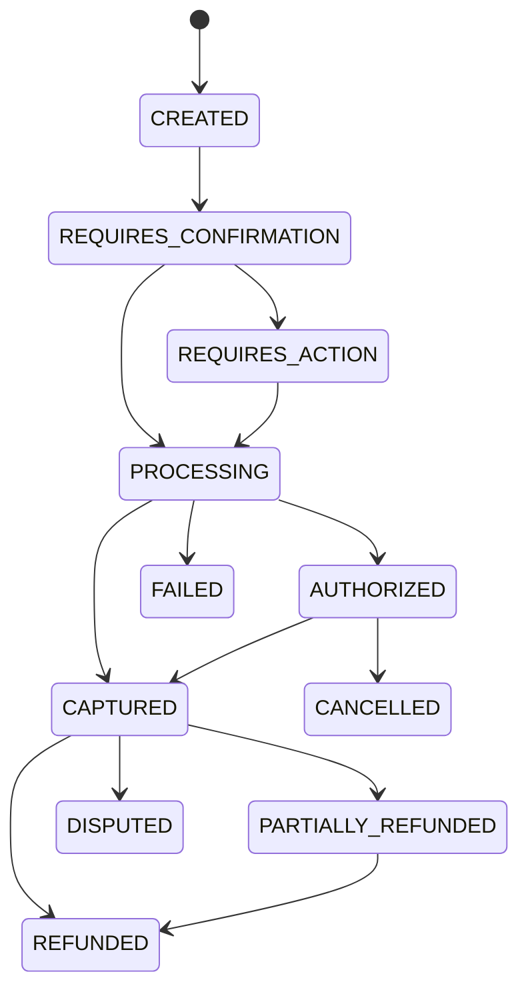

**Interview answer:** Model the merchant's goal as a payment intent whose status only moves through validated transitions, and record each provider call as a separate attempt so a retry never becomes a second charge. Require an idempotency key on every mutating request, pass a stable operation key on to the provider, and commit the state change, the idempotency result, and the outbox event in one database transaction. Keep the money itself in an immutable double-entry ledger and reconcile against the provider's settlement report — a payment system is a distributed financial workflow, not an API that calls a gateway.

**Gotcha:** Treating a provider timeout as a decline. The charge may well have succeeded; retrying it, or failing over to a second provider, before verifying the outcome of the first attempt is exactly how a customer gets charged twice.

---

# 1. What Are We Designing?

We are designing an online payment platform used by applications such as an e-commerce website, subscription platform, marketplace, insurance portal, or SaaS product.

The platform should let a merchant application create a payment for an order, collect the money through an external payment service provider, and handle both synchronous and asynchronous results without ever charging a retrying client twice. It tracks authorization, capture, failure, cancellation, and settlement, issues full or partial refunds, keeps an auditable record of every financial movement, reconciles internal records against provider and bank reports, and leaves room to add more providers later.

A payment system does **not** move money entirely by itself. It usually integrates with payment gateways, processors, card networks, banks, wallets, or real-time payment rails.

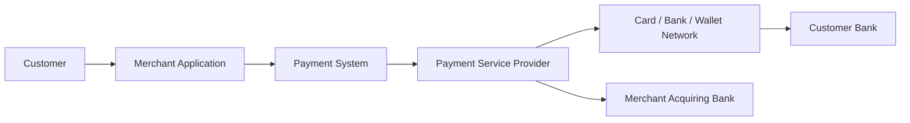

The payment system is responsible for coordinating this workflow and keeping its own records correct, even when external systems are slow, unavailable, or send duplicate messages.

---

# 2. Scope and Assumptions

## 2.1 Included in the design

This design covers one-time online payments in multiple currencies: authorization and capture, synchronous provider API calls, asynchronous provider webhooks, refunds and reversals, an internal double-entry ledger, and reconciliation. It also covers horizontal scaling, high availability and disaster recovery, and card, bank, wallet, or UPI-like integrations behind a common provider abstraction.

## 2.2 Outside the initial scope

The first version does not deeply implement recurring billing and subscription scheduling, merchant onboarding and KYC, cross-border foreign-exchange conversion, tax calculation, payouts to marketplace sellers, full dispute evidence management, or direct integration with card networks. These can be added later without changing the core payment model.

## 2.3 Example scale

Assume:

- 10 million registered customers.
- 1 million active merchants.
- 20 million payment attempts per day.
- Average: approximately 230 payment attempts per second.
- Peak traffic: 10 times average, approximately 2,300 attempts per second.
- A payment creates several database writes and events.
- Financial records must never be silently lost or duplicated.

The exact numbers are less important than showing how the design grows with traffic.

---

# 3. Requirements

## 3.1 Functional requirements

| Capability | Behaviour |
|---|---|
| Payment creation | A merchant creates a payment from a merchant identifier, order identifier, amount, currency, customer identifier, payment method token, and idempotency key. |
| Payment processing | Validate the request, select a provider, authorize or charge, store provider references, and return the latest known state. |
| Payment status | The merchant can retrieve the current payment state at any time. |
| Capture | In an authorization-first flow, the merchant can capture the amount later. |
| Cancellation | An uncaptured authorization can be cancelled or allowed to expire. |
| Refund | A captured payment can be partially or fully refunded. |
| Webhooks | The system receives provider events and sends merchant events. |
| Ledger | Every confirmed money movement creates balanced ledger entries. |
| Reconciliation | The system compares internal data with provider settlement reports. |

---

## 3.2 Non-functional requirements

| Requirement | What it means here |
|---|---|
| Correctness | More important than very low latency. A slow payment is inconvenient; an incorrect financial record is dangerous. |
| Availability | The payment API stays available during partial failures where possible: roughly 99.99% for payment creation, the same or better for read-only status, and lower immediate availability but strict completion targets for background reconciliation. |
| Durability | Once the system tells a merchant a payment succeeded, the associated records must be durably stored. |
| Idempotency | Retrying the same logical operation must not charge the customer twice. |
| Auditability | Record who initiated an operation, what request arrived, which state transitions occurred, which provider response came back, and which ledger entries were posted. |
| Security | Sensitive payment data is protected in transit and at rest; raw card data should ideally never enter the merchant backend or the core payment service. |
| Consistency | Strong inside critical financial transaction boundaries, eventual for notifications, dashboards, search, and analytics. |

---

# 4. Payment Domain Fundamentals

## 4.1 Payment intent

A payment intent represents the merchant's intention to collect a specific amount from a customer.

It is useful because a payment can require multiple steps: payment method collection, customer authentication, authorization, capture, a retry with another provider, and asynchronous confirmation.

The payment intent remains the stable business object while individual attempts may succeed or fail.

```text
Payment Intent: PAY-1001
Amount: ₹5,000
Order: ORD-9001

Attempt 1 -> Provider A -> Timed out
Attempt 2 -> Provider A -> Declined
Attempt 3 -> Provider B -> Succeeded
```

## 4.2 Payment attempt

A payment attempt represents one execution against a provider.

A single payment may have multiple attempts, but only one successful money-collecting result should be accepted unless the business explicitly supports split or installment payments.

## 4.3 Authorization

Authorization asks the issuer or payment rail to reserve or approve funds.

No final settlement may have occurred yet.

Example:

> Hotel blocks ₹10,000 on a card at check-in.

## 4.4 Capture

Capture confirms that the merchant wants to collect an authorized amount.

Example:

> Hotel captures ₹8,500 at check-out and releases the remaining hold.

## 4.5 Settlement

Settlement is the movement of funds through financial institutions to the merchant's acquiring account. It usually happens later than the customer-facing payment response.

A payment can be `CAPTURED` internally while provider settlement is still pending.

## 4.6 Refund

A refund is a new financial operation that sends some or all captured funds back to the customer.

It should not simply modify the original payment amount.

## 4.7 Reversal

A reversal releases an authorization or cancels a transaction before final settlement.

## 4.8 Chargeback or dispute

A chargeback occurs when the customer challenges a payment through the issuer or payment network. It is different from a merchant-initiated refund.

---

# 5. High-Level Architecture

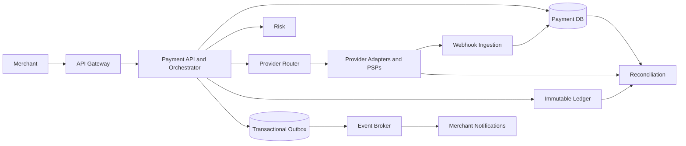

## 5.1 Main design principle

Keep the synchronous request path focused on the minimum work required to safely process the payment:

1. Authenticate and validate.
2. Check idempotency.
3. Persist the payment operation.
4. Call the selected provider.
5. Persist the result.
6. Commit required ledger and outbox records.
7. Return the latest known state.

Move non-critical work — email and push notifications, merchant webhooks, analytics, search indexing, reporting, and data warehouse updates — to asynchronous consumers.

---

# 6. Core Components

| Component | Responsibilities |
|---|---|
| API gateway | TLS termination, authentication, request size limits, rate limiting, routing, request identifiers, basic schema validation, DDoS protection. No payment business logic. |
| Payment API | Merchant-facing endpoints. Validates merchant ownership, amount, and currency; demands an idempotency key on mutating operations; returns stable payment representations and hides provider-specific detail. |
| Payment orchestrator | Owns the workflow: state-transition validation, risk coordination, provider routing, the authorization and capture flow, retry classification, recording attempts, updating payment state, and triggering ledger and event creation. |
| Provider router | Chooses the provider for one attempt from method, currency, country, provider health, cost, historical success rate, merchant preference, amount, and regulatory constraints. The decision is deterministic per attempt and stored. |
| Provider adapters | Translate the internal domain model into one provider's API, so nothing else depends on a provider SDK. |
| Risk service | Evaluates the transaction before money moves, returning `ALLOW`, `DENY`, `REVIEW`, or `REQUIRE_ADDITIONAL_AUTHENTICATION`. |
| Ledger service | Records balanced financial entries. Append-oriented, strongly consistent, auditable, protected from arbitrary updates, and able to reject an unbalanced transaction. |
| Webhook service | Receives provider callbacks, verifies signatures, stores the raw event, deduplicates, acknowledges quickly, and processes asynchronously. |
| Reconciliation service | Compares internal payments, internal ledger records, provider transaction data, provider settlement reports, and bank statements where available, then raises exceptions for investigation or automated correction. |

The orchestrator is the central domain component, but it should not become a single large class. Internally it divides into command handlers such as `CreatePaymentHandler`, `ConfirmPaymentHandler`, `CapturePaymentHandler`, `CancelPaymentHandler`, `RefundPaymentHandler`, and `ApplyProviderEventHandler`.

The payment system should also define what happens when risk evaluation is unavailable. For high-risk payments, fail closed. For low-risk, low-value use cases, a carefully controlled fail-open policy may be acceptable.

## 6.1 Provider adapter interface

Each adapter translates the internal domain model to a provider-specific API.

```python
from typing import Protocol

class PaymentProvider(Protocol):
    def authorize(self, request: "AuthorizeRequest") -> "ProviderResult": ...

    def capture(self, request: "CaptureRequest") -> "ProviderResult": ...

    def cancel(self, request: "CancelRequest") -> "ProviderResult": ...

    def refund(self, request: "RefundRequest") -> "ProviderResult": ...

    def fetch_payment(self, provider_payment_id: str) -> "ProviderResult": ...
```

The rest of the system should not directly depend on a provider SDK.

---

# 7. Payment Lifecycle and State Machine

A payment should follow explicit state transitions. Avoid allowing any service to write arbitrary status strings.

## 7.1 Suggested payment states

| State | Meaning |
|---|---|
| `CREATED` | Payment object exists but processing has not started. |
| `REQUIRES_PAYMENT_METHOD` | A valid payment method is still needed. |
| `REQUIRES_CONFIRMATION` | Payment is ready to be confirmed. |
| `REQUIRES_ACTION` | Customer authentication or another action is required. |
| `PROCESSING` | Provider result is pending or asynchronous. |
| `AUTHORIZED` | Funds are approved or reserved but not fully captured. |
| `PARTIALLY_CAPTURED` | Part of the authorization has been captured. |
| `CAPTURED` | Funds have been captured. |
| `PARTIALLY_REFUNDED` | Some captured funds have been refunded. |
| `REFUNDED` | Captured amount has been fully refunded. |
| `CANCELLED` | Payment was cancelled before completion. |
| `FAILED` | Payment cannot continue without a new attempt or method. |
| `DISPUTED` | A dispute or chargeback exists. |

## 7.2 Transition validation

The spine of the machine is drawn in the diagram at the top of this note. The complete matrix, including the branches that diagram leaves out, belongs in a transition table or domain method:

```python
ALLOWED_TRANSITIONS = {
    "CREATED": {"REQUIRES_PAYMENT_METHOD", "REQUIRES_CONFIRMATION", "CANCELLED"},
    "REQUIRES_PAYMENT_METHOD": {"REQUIRES_CONFIRMATION", "CANCELLED"},
    "REQUIRES_CONFIRMATION": {
        "REQUIRES_ACTION",
        "PROCESSING",
        "AUTHORIZED",
        "CAPTURED",
        "FAILED",
    },
    "REQUIRES_ACTION": {"PROCESSING", "AUTHORIZED", "CAPTURED", "FAILED"},
    "PROCESSING": {"AUTHORIZED", "CAPTURED", "FAILED"},
    "AUTHORIZED": {"PARTIALLY_CAPTURED", "CAPTURED", "CANCELLED"},
    "PARTIALLY_CAPTURED": {"CAPTURED", "CANCELLED"},
    "CAPTURED": {"PARTIALLY_REFUNDED", "REFUNDED", "DISPUTED"},
    "PARTIALLY_REFUNDED": {"PARTIALLY_REFUNDED", "REFUNDED", "DISPUTED"},
}

def validate_transition(current: str, target: str) -> None:
    if target not in ALLOWED_TRANSITIONS.get(current, set()):
        raise ValueError(f"Invalid payment transition: {current} -> {target}")
```

The database should also use optimistic locking so two workers cannot independently apply conflicting transitions.

---

# 8. End-to-End Payment Flow

## 8.1 Successful immediate-capture flow

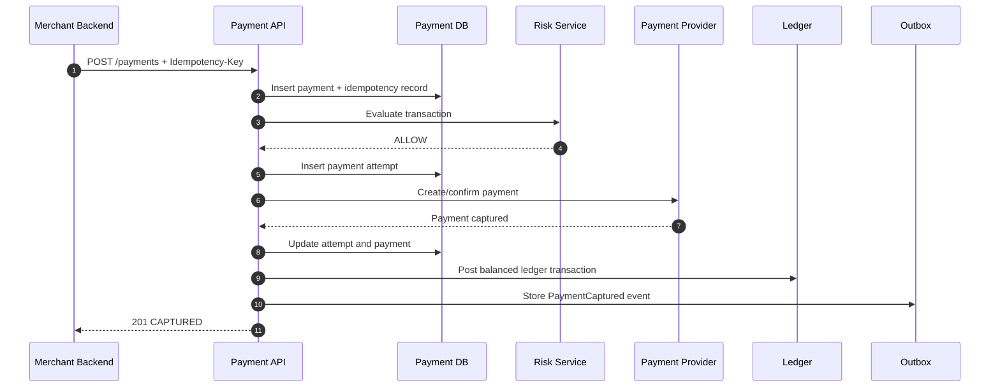

In implementation, updates to payment state, ledger instructions, and outbox records should be coordinated carefully. Depending on service boundaries, the payment service may write a durable ledger command rather than directly calling a separate ledger database in the same request.

## 8.2 Customer authentication flow

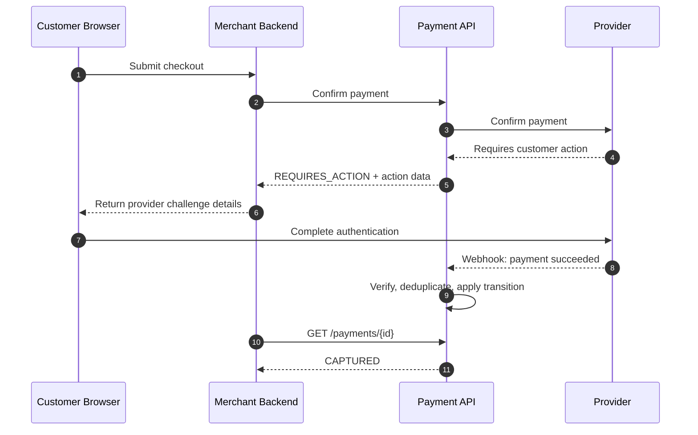

The browser redirect is not the source of truth. The provider API response or signed webhook should confirm the final state.

## 8.3 Timeout flow

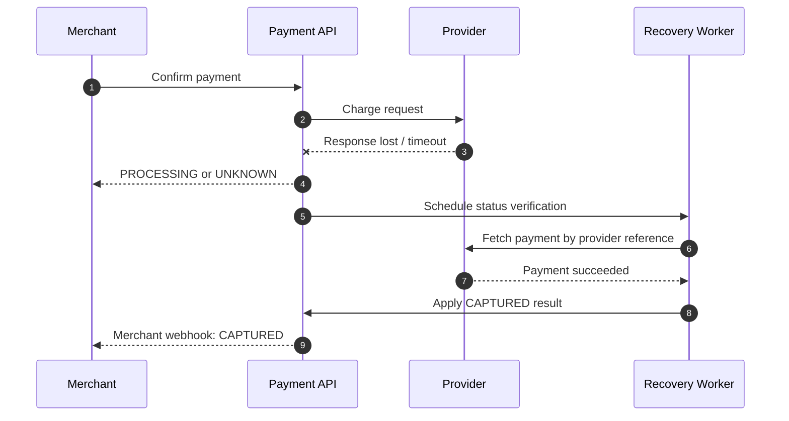

A timeout is not equal to failure. The provider may have processed the request even though the response was lost.

---

# 9. API Design

Use stable business APIs that are independent of any provider.

## 9.1 Create a payment

```http
POST /v1/payments
Authorization: Bearer <merchant-token>
Idempotency-Key: 7aa28514-9e32-4b1c-85e1-8e7e29e56487
Content-Type: application/json
```

```json
{
  "merchant_order_id": "ORD-9001",
  "amount": 500000,
  "currency": "INR",
  "capture_method": "automatic",
  "customer_id": "cus_123",
  "payment_method_token": "pm_tok_abc",
  "description": "Annual insurance premium",
  "metadata": {
    "policy_id": "POL-7001"
  }
}
```

Represent monetary values in the smallest supported currency unit: for INR, `₹5,000.00 -> 500000 paise`.

Response:

```json
{
  "id": "pay_01JZ8QK2P2",
  "merchant_order_id": "ORD-9001",
  "amount": 500000,
  "currency": "INR",
  "status": "PROCESSING",
  "capture_method": "automatic",
  "amount_authorized": 0,
  "amount_captured": 0,
  "amount_refunded": 0,
  "created_at": "2026-08-03T06:30:00Z"
}
```

## 9.2 Retrieve payment

```http
GET /v1/payments/pay_01JZ8QK2P2
```

## 9.3 Confirm payment

Useful when payment creation and confirmation are separate steps.

```http
POST /v1/payments/pay_01JZ8QK2P2/confirm
Idempotency-Key: 0eff083d-fc90-4186-9231-e9376ea7a7aa
```

## 9.4 Capture payment

```http
POST /v1/payments/pay_01JZ8QK2P2/captures
Idempotency-Key: 7850f683-aa23-4190-8c32-6fec0cf288a3
```

```json
{
  "amount": 400000
}
```

## 9.5 Cancel authorization

```http
POST /v1/payments/pay_01JZ8QK2P2/cancel
Idempotency-Key: b7e7edb7-d7cf-4c66-8f30-e0cb56cdf4d0
```

## 9.6 Create refund

```http
POST /v1/refunds
Idempotency-Key: 85683ac1-c30b-48f1-9799-ec29b601aa5d
```

```json
{
  "payment_id": "pay_01JZ8QK2P2",
  "amount": 100000,
  "reason": "customer_request"
}
```

## 9.7 API response principles

- Never expose internal database IDs when stable public IDs are available.
- Return machine-readable error codes.
- Include a request ID for support and tracing.
- Return the latest **known** state, not an invented final result.
- Use `202 Accepted` when the operation is accepted but still processing.
- Use `409 Conflict` for invalid state transitions or idempotency conflicts.
- Do not return sensitive provider payloads to merchants.

Example error:

```json
{
  "error": {
    "code": "PAYMENT_ALREADY_CAPTURED",
    "message": "The payment has already been fully captured.",
    "request_id": "req_01JZ8RM0VT"
  }
}
```

---

# 10. Data Model

## 10.1 Entity relationship diagram

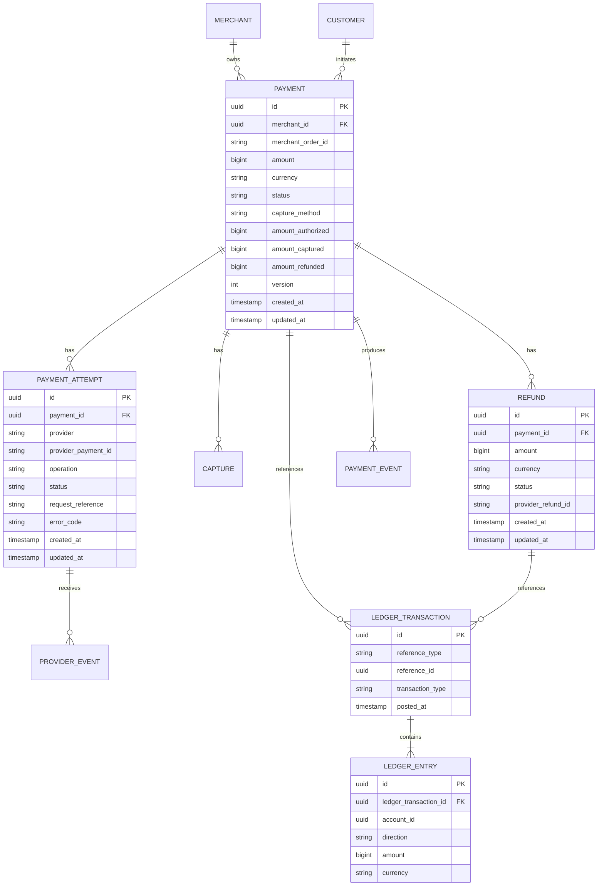

## 10.2 Payment table

```sql
CREATE TABLE payments (
    id UUID PRIMARY KEY,
    public_id VARCHAR(40) NOT NULL UNIQUE,
    merchant_id UUID NOT NULL,
    merchant_order_id VARCHAR(100) NOT NULL,
    customer_id UUID,
    amount BIGINT NOT NULL CHECK (amount > 0),
    currency CHAR(3) NOT NULL,
    status VARCHAR(40) NOT NULL,
    capture_method VARCHAR(20) NOT NULL,
    amount_authorized BIGINT NOT NULL DEFAULT 0,
    amount_captured BIGINT NOT NULL DEFAULT 0,
    amount_refunded BIGINT NOT NULL DEFAULT 0,
    version INTEGER NOT NULL DEFAULT 0,
    metadata JSONB NOT NULL DEFAULT '{}',
    created_at TIMESTAMPTZ NOT NULL DEFAULT NOW(),
    updated_at TIMESTAMPTZ NOT NULL DEFAULT NOW(),
    UNIQUE (merchant_id, merchant_order_id)
);
```

The uniqueness rule on `(merchant_id, merchant_order_id)` depends on business semantics. Some merchants may legitimately create multiple payments for one order. In that case use a separate merchant payment reference or allow attempts under one payment intent.

## 10.3 Payment attempts

```sql
CREATE TABLE payment_attempts (
    id UUID PRIMARY KEY,
    payment_id UUID NOT NULL REFERENCES payments(id),
    attempt_number INTEGER NOT NULL,
    operation VARCHAR(30) NOT NULL,
    provider VARCHAR(40) NOT NULL,
    provider_payment_id VARCHAR(150),
    provider_request_id VARCHAR(150),
    status VARCHAR(40) NOT NULL,
    error_category VARCHAR(40),
    error_code VARCHAR(100),
    response_summary JSONB,
    created_at TIMESTAMPTZ NOT NULL DEFAULT NOW(),
    updated_at TIMESTAMPTZ NOT NULL DEFAULT NOW(),
    UNIQUE (payment_id, attempt_number)
);
```

Avoid storing complete sensitive provider responses unless necessary. Store a redacted summary and archive encrypted raw payloads only when required.

## 10.4 Idempotency records

```sql
CREATE TABLE idempotency_records (
    merchant_id UUID NOT NULL,
    idempotency_key VARCHAR(255) NOT NULL,
    operation VARCHAR(100) NOT NULL,
    request_hash CHAR(64) NOT NULL,
    status VARCHAR(20) NOT NULL,
    resource_type VARCHAR(40),
    resource_id UUID,
    http_status INTEGER,
    response_body JSONB,
    locked_until TIMESTAMPTZ,
    expires_at TIMESTAMPTZ NOT NULL,
    created_at TIMESTAMPTZ NOT NULL DEFAULT NOW(),
    PRIMARY KEY (merchant_id, idempotency_key)
);
```

## 10.5 Provider events

```sql
CREATE TABLE provider_events (
    provider VARCHAR(40) NOT NULL,
    provider_event_id VARCHAR(200) NOT NULL,
    event_type VARCHAR(100) NOT NULL,
    signature_verified BOOLEAN NOT NULL,
    processing_status VARCHAR(30) NOT NULL,
    payment_id UUID,
    payload_location TEXT,
    received_at TIMESTAMPTZ NOT NULL DEFAULT NOW(),
    processed_at TIMESTAMPTZ,
    PRIMARY KEY (provider, provider_event_id)
);
```

## 10.6 Indexes

Common indexes:

```sql
CREATE INDEX idx_payments_merchant_created
    ON payments (merchant_id, created_at DESC);

CREATE INDEX idx_payments_status_updated
    ON payments (status, updated_at);

CREATE INDEX idx_attempts_provider_payment
    ON payment_attempts (provider, provider_payment_id);

CREATE INDEX idx_refunds_payment
    ON refunds (payment_id, created_at DESC);
```

Avoid indexing every field. Payment tables are write-heavy, and each index increases write cost.

---

# 11. Idempotency and Duplicate Prevention

Idempotency is one of the most important parts of payment design.

## 11.1 The problem

The merchant sends a payment request. The provider charges the customer, but the network connection fails before the merchant receives the response. The merchant retries, the customer is charged again, and one logical purchase has become two charges.

## 11.2 Idempotency key behavior

The merchant sends a unique key for each logical operation, such as `Idempotency-Key: checkout-ORD-9001-payment-v1`. Against that key the server stores the merchant ID, the operation, a hash of the normalized request parameters, the processing state, the created resource ID, and the final response.

## 11.3 Processing algorithm

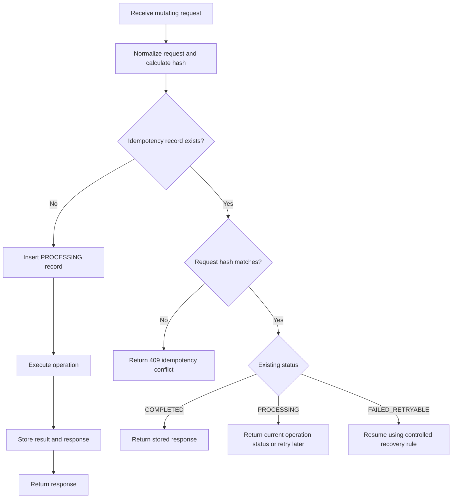

## 11.4 Database race handling

Use a unique constraint to ensure only one request owns the key.

```sql
INSERT INTO idempotency_records (...)
VALUES (...)
ON CONFLICT DO NOTHING;
```

If insert succeeds, the request is the owner.

If it conflicts, read the existing record and return or wait according to its status.

Do not rely on a cache alone. A cache can improve performance, but the authoritative idempotency record should be durable.

## 11.5 Provider idempotency

Also pass a stable operation key to the payment provider when supported, using a separate key per operation: `payment:create:pay_123`, `payment:capture:pay_123:capture_1`, `payment:refund:pay_123:refund_1`.

The internal idempotency layer protects your API. Provider idempotency protects retries between your system and the provider.

## 11.6 Idempotency is not only request deduplication

A correct design also needs unique provider event IDs, unique ledger transaction references, unique merchant webhook delivery IDs, state-transition validation, and consumers that tolerate duplicate events.

At-least-once delivery plus idempotent consumers is normally more practical than assuming perfect end-to-end exactly-once delivery.

---

# 12. Ledger and Money Movement

The payment table describes workflow state. It is not sufficient as the financial source of truth.

Use an immutable double-entry ledger for actual financial accounting.

## 12.1 Why a separate ledger?

A payment status can change for operational reasons: `PROCESSING -> CAPTURED -> REFUNDED -> DISPUTED`

Financial movements should remain as a permanent history:

```text
Capture posted: +₹5,000 merchant receivable
Refund posted:  -₹1,000 merchant receivable
Chargeback:      -₹4,000 merchant receivable
```

Never overwrite the original capture entry. Add compensating transactions.

## 12.2 Double-entry rule

For every ledger transaction, `Total debits = Total credits`.

The exact debit and credit naming depends on the accounting model, but the entries must balance per currency.

## 12.3 Simplified capture example

Customer pays ₹5,000. Provider fee is ₹100. Merchant is owed ₹4,900.

```text
Transaction: Payment captured

Debit   Provider Receivable       ₹5,000
Credit  Merchant Payable          ₹4,900
Credit  Fee Revenue                 ₹100
-----------------------------------------
Total debits                     ₹5,000
Total credits                    ₹5,000
```

This example uses platform books. Account direction depends on how the organization defines assets, liabilities, revenue, and contra accounts.

## 12.4 Settlement example

The provider transfers ₹5,000 into the platform bank account:

```text
Debit   Bank Cash                 ₹5,000
Credit  Provider Receivable       ₹5,000
```

## 12.5 Merchant payout example

The platform pays ₹4,900 to the merchant:

```text
Debit   Merchant Payable          ₹4,900
Credit  Bank Cash                 ₹4,900
```

## 12.6 Refund example

A ₹1,000 refund reduces the merchant amount and creates a customer refund liability or provider payable, depending on the settlement timing.

The important design rule is:

> Model a refund as a new ledger transaction linked to the original payment, not as an update to old ledger entries.

## 12.7 Ledger schema

```sql
CREATE TABLE ledger_transactions (
    id UUID PRIMARY KEY,
    reference_type VARCHAR(40) NOT NULL,
    reference_id UUID NOT NULL,
    transaction_type VARCHAR(40) NOT NULL,
    currency CHAR(3) NOT NULL,
    status VARCHAR(20) NOT NULL,
    posted_at TIMESTAMPTZ NOT NULL DEFAULT NOW(),
    created_at TIMESTAMPTZ NOT NULL DEFAULT NOW(),
    UNIQUE (reference_type, reference_id, transaction_type)
);

CREATE TABLE ledger_entries (
    id UUID PRIMARY KEY,
    ledger_transaction_id UUID NOT NULL REFERENCES ledger_transactions(id),
    account_id UUID NOT NULL,
    direction VARCHAR(6) NOT NULL CHECK (direction IN ('DEBIT', 'CREDIT')),
    amount BIGINT NOT NULL CHECK (amount > 0),
    currency CHAR(3) NOT NULL,
    created_at TIMESTAMPTZ NOT NULL DEFAULT NOW()
);
```

Before committing, the application or a database procedure must assert `SUM(DEBIT amount) = SUM(CREDIT amount)` for the transaction.

## 12.8 Ledger invariants

- Entries are immutable.
- Every transaction balances.
- One transaction contains one currency unless FX entries are explicitly modeled.
- Every external operation has a unique ledger reference.
- Balances are derived from entries or maintained as validated projections.
- Corrections use new compensating entries.
- Posting is authorized and audited.

---

# 13. Consistency and Transaction Boundaries

## 13.1 Strong consistency areas

Use a single relational transaction for closely related critical writes: the payment state update, the payment attempt update, the idempotency result update, and the outbox event insertion.

```sql
BEGIN;

UPDATE payment_attempts
SET status = 'SUCCEEDED'
WHERE id = :attempt_id;

UPDATE payments
SET status = 'CAPTURED',
    amount_captured = :amount,
    version = version + 1
WHERE id = :payment_id
  AND version = :expected_version;

INSERT INTO outbox_events (...);

UPDATE idempotency_records
SET status = 'COMPLETED',
    response_body = :response
WHERE merchant_id = :merchant_id
  AND idempotency_key = :key;

COMMIT;
```

## 13.2 Optimistic locking

Two workers may process the same payment because of duplicate webhooks or retries.

Use a version column:

```sql
UPDATE payments
SET status = 'CAPTURED', version = version + 1
WHERE id = :payment_id
  AND version = :current_version;
```

If zero rows are updated, another worker changed the payment. Reload and re-evaluate the transition.

## 13.3 Pessimistic locking

For very short, high-contention operations such as calculating the remaining refundable amount, use:

```sql
SELECT *
FROM payments
WHERE id = :payment_id
FOR UPDATE;
```

Keep the transaction short. Never hold a database lock while waiting for an external provider call.

## 13.4 External calls cannot join local transactions

This is unsafe:

```text
BEGIN DB TRANSACTION
  Update payment
  Call provider over network
  Wait several seconds
COMMIT
```

It holds locks too long and still cannot atomically commit the provider and database.

Instead:

1. Persist the intended operation.
2. Commit.
3. Call the provider with an idempotency key.
4. Persist the result in a new short transaction.
5. Recover uncertain outcomes through provider status checks.

---

# 14. Events, Queues, and the Transactional Outbox

## 14.1 The dual-write problem

Suppose the payment service updates the database to `CAPTURED` and then publishes a `PaymentCaptured` event as two independent steps. Two failure cases follow:

- Database succeeds, event publish fails: merchant never receives notification.
- Event publish succeeds, database fails: consumers see a capture that is not in the database.

## 14.2 Transactional outbox

Write the domain update and event record in the same database transaction.

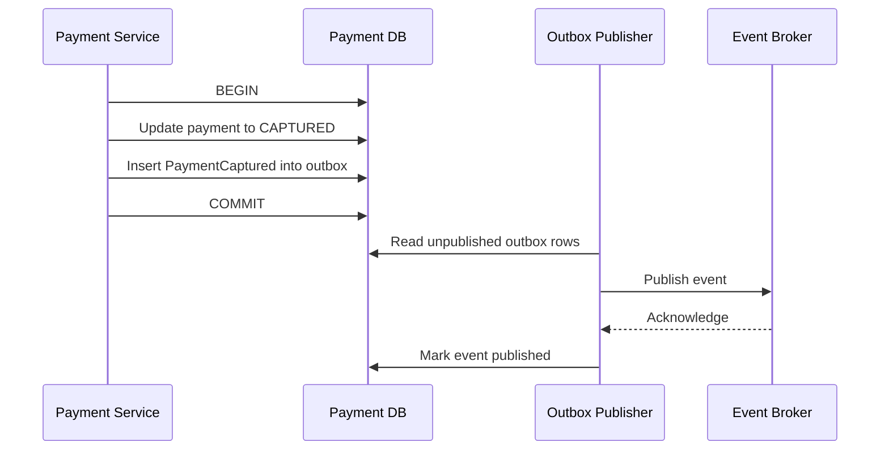

The publisher may send an event more than once if it crashes after publishing but before marking the row. Therefore, consumers must deduplicate using `event_id`.

## 14.3 Outbox table

```sql
CREATE TABLE outbox_events (
    id UUID PRIMARY KEY,
    aggregate_type VARCHAR(50) NOT NULL,
    aggregate_id UUID NOT NULL,
    event_type VARCHAR(100) NOT NULL,
    payload JSONB NOT NULL,
    created_at TIMESTAMPTZ NOT NULL DEFAULT NOW(),
    published_at TIMESTAMPTZ,
    attempt_count INTEGER NOT NULL DEFAULT 0,
    next_attempt_at TIMESTAMPTZ NOT NULL DEFAULT NOW()
);

CREATE INDEX idx_outbox_unpublished
    ON outbox_events (next_attempt_at)
    WHERE published_at IS NULL;
```

## 14.4 Event example

```json
{
  "event_id": "evt_01JZ8V60PA",
  "event_type": "payment.captured",
  "event_version": 1,
  "occurred_at": "2026-08-03T06:34:10Z",
  "payment": {
    "id": "pay_01JZ8QK2P2",
    "merchant_id": "mer_123",
    "amount": 500000,
    "currency": "INR",
    "status": "CAPTURED"
  }
}
```

Version events so consumers can evolve independently.

## 14.5 Queue partitioning

Partition events by `payment_id` so events for one payment preserve order within a partition.

Global ordering is unnecessary and expensive. Per-payment ordering is normally sufficient.

## 14.6 Dead-letter queue

After controlled retries, move repeatedly failing messages to a dead-letter queue, storing the original event, the consumer name, the failure reason, the attempt count, and the first and last failure time.

Provide a replay tool that keeps the original event ID.

---

# 15. Webhook Processing

Provider webhooks are asynchronous notifications such as `payment.authorized`, `payment.captured`, `payment.failed`, `refund.succeeded`, `refund.failed`, and `dispute.created`.

## 15.1 Webhook endpoint flow

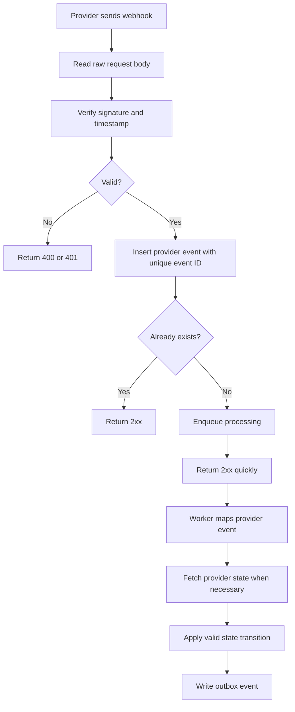

## 15.2 Signature verification

Verification should use the raw request bytes, the provider signature header, the endpoint secret, a timestamp tolerance, and constant-time comparison where applicable.

Do not parse and reserialize JSON before verifying a signature if the provider signs the raw body.

## 15.3 Acknowledge quickly

The webhook endpoint should normally verify, deduplicate and persist, enqueue, then return success.

Long business processing inside the HTTP request increases provider retries and duplicate deliveries.

## 15.4 Duplicate events

Providers may retry events. Deduplicate on `(provider, provider_event_id)`.

Do not deduplicate only by payment ID because different events can legitimately exist for one payment.

## 15.5 Out-of-order events

`payment.captured` can arrive before `payment.authorized`. Solutions:

- Validate state transitions.
- Store event creation time and provider sequence number when available.
- Fetch current provider state for ambiguous events.
- Make older events harmless after a terminal or later state is applied.

## 15.6 Merchant webhooks

Send merchant notifications asynchronously. Each delivery should include the event ID, event type, event creation time, payment ID, current payment state, a signature, and a delivery attempt ID.

Retry with exponential backoff and jitter — immediately, then after 30 seconds, 2 minutes, 10 minutes, 1 hour, and so on. The merchant must deduplicate by event ID.

---

# 16. Refunds, Reversals, and Chargebacks

## 16.1 Refund constraints

Before creating a refund, compute `remaining_refundable = amount_captured - amount_refunded - pending_refund_amount` and require `requested_refund <= remaining_refundable`.

Lock the payment or use an atomic conditional update to prevent two concurrent refunds exceeding the captured amount.

## 16.2 Partial refund example

```text
Captured amount:        ₹5,000
Completed refunds:      ₹1,000
Pending refunds:          ₹500
Remaining refundable:  ₹3,500
```

## 16.3 Refund state machine

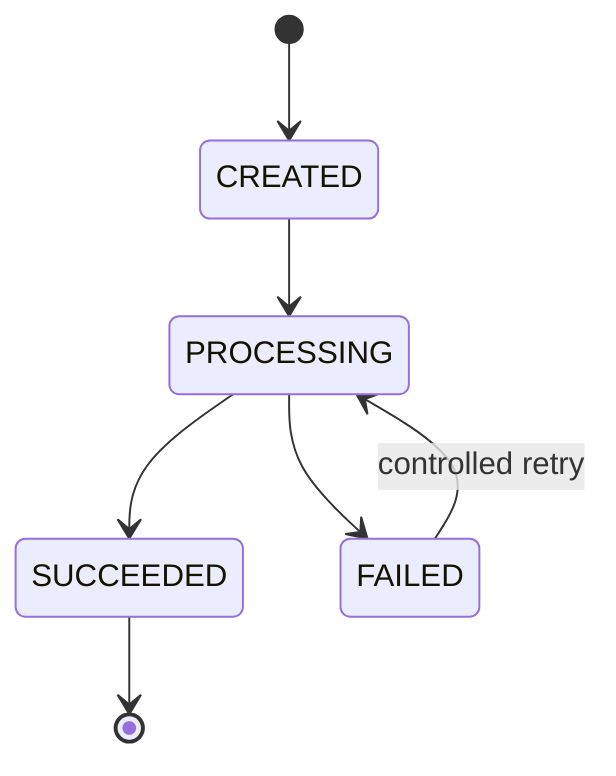

## 16.4 Refund API call timeout

A refund timeout is also an uncertain outcome.

Do not immediately create a second refund. Query the provider using the refund operation key or provider reference.

## 16.5 Reversal

If a payment is authorized but not captured, cancel the authorization (`AUTHORIZED -> CANCELLED`) rather than creating a refund.

## 16.6 Chargeback

A chargeback is provider- or network-initiated. On a dispute event:

- Create a dispute record.
- Freeze or reserve the disputed amount if required.
- Post ledger entries for the dispute movement.
- Notify the merchant.
- Track evidence and deadline outside the initial payment workflow.

---

# 17. Failure Handling and Recovery

Payment systems must be designed around ambiguous and partial failures.

## 17.1 Failure categories

| Category | Examples | Retry rule |
|---|---|---|
| Validation failure | Invalid amount, unsupported currency, missing payment method. | Do not retry without changing the request. |
| Business decline | Insufficient funds, authentication failed, payment method expired, risk rejected. | Retry only according to the provider's advice and business rules. |
| Technical transient failure | Connection reset, provider `5xx`, rate limit, temporary database issue. | Retry with backoff, jitter, and a bounded attempt count. |
| Unknown outcome | Provider request timed out after being sent; worker crashed after provider success but before local persistence. | Never classify as failure. Mark the operation `UNKNOWN` or `PROCESSING` and run a status inquiry. |

## 17.2 Retry policy

```text
retry_delay = min(base_delay * 2^attempt, maximum_delay) + random_jitter
```

Use different policies for safe read requests, idempotent provider writes, webhook delivery, event consumption, and reconciliation fetches.

Never blindly retry a payment write unless the provider supports idempotency or you can safely check the result first.

## 17.3 Circuit breaker

When a provider has high failure rates:

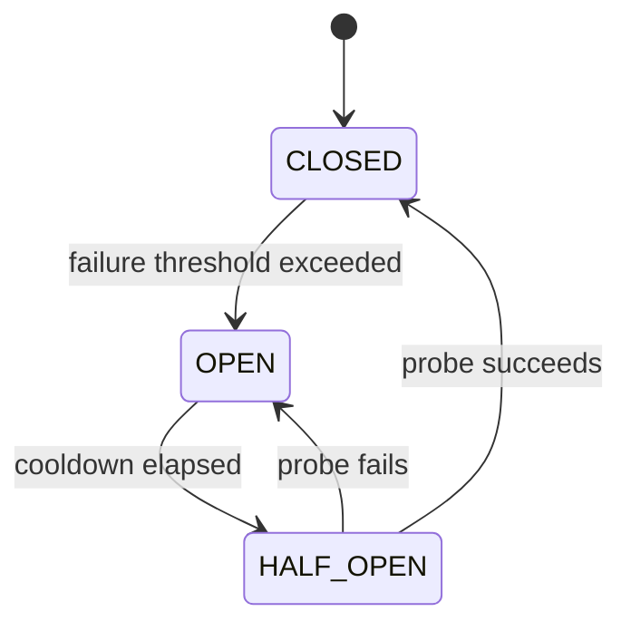

- `CLOSED`: requests flow normally.
- `OPEN`: fail fast or route to another provider.
- `HALF_OPEN`: allow limited test requests.

Do not automatically fail over after an ambiguous write unless duplicate charging is prevented across providers.

## 17.4 Provider failover risk

Unsafe sequence:

```text
Provider A request times out
System immediately sends charge to Provider B
Provider A actually succeeded
Provider B also succeeds
```

Safe approach:

1. Mark Provider A attempt as uncertain.
2. Query Provider A by idempotency key or provider reference.
3. Wait for webhook when appropriate.
4. Fail over only after proving the first attempt did not succeed or after a carefully defined business timeout and compensation strategy.

## 17.5 Recovery workers

Run background jobs for payments stuck in `PROCESSING`, attempts with an unknown outcome, unpublished outbox events, pending merchant webhooks, refunds awaiting confirmation, ledger commands awaiting posting, and reconciliation exceptions.

Use distributed leases or `FOR UPDATE SKIP LOCKED` to divide work safely.

```sql
SELECT id
FROM payment_attempts
WHERE status = 'UNKNOWN'
  AND updated_at < NOW() - INTERVAL '2 minutes'
FOR UPDATE SKIP LOCKED
LIMIT 100;
```

---

# 18. Reconciliation

Reconciliation proves that your internal view matches external reality.

It is not optional in a production payment system.

## 18.1 Why reconciliation is needed

Even with correct APIs and webhooks:

- A webhook can be permanently missed.
- A provider response can be lost.
- A software bug can post an incorrect state.
- Settlement can differ because of fees, taxes, reserves, or adjustments.
- A provider can correct a transaction later.

## 18.2 Reconciliation layers

### Operational reconciliation

Compare individual internal payments with provider transactions.

```text
Internal CAPTURED but provider FAILED -> critical mismatch
Internal PROCESSING but provider CAPTURED -> repair internal state
Internal CAPTURED but provider record missing -> investigate
```

### Financial reconciliation

Compare aggregated amounts:

```text
Captured gross amount
- Refunds
- Provider fees
- Chargebacks
- Reserves
= Expected settlement
```

### Bank reconciliation

Compare provider settlement records with actual bank credits and debits.

## 18.3 Reconciliation pipeline

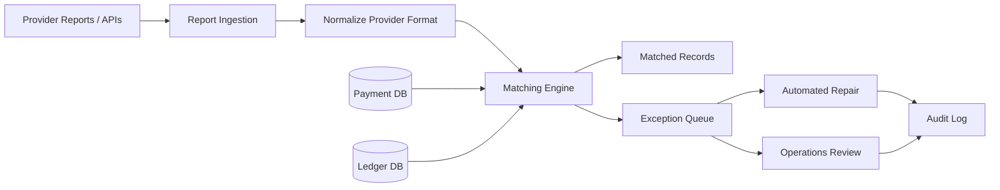

## 18.4 Matching keys

Use several levels:

1. Exact provider transaction ID.
2. Internal payment ID stored in provider metadata.
3. Merchant ID + order ID.
4. Amount + currency + date window.
5. Manual investigation for remaining records.

## 18.5 Reconciliation should not silently rewrite history

Every repair must create a correction command, an audit record, new ledger entries where a financial correction is required, and a reference back to the source report or provider API response.

---

# 19. Scaling the System

## 19.1 Stateless API layer

Payment API instances should be stateless and horizontally scalable behind a load balancer.

Store workflow state in durable systems, not process memory.

## 19.2 Database scaling

Start with a relational database, because payments need transactions, unique constraints, row locking, strong consistency, and flexible operational queries.

Typical evolution:

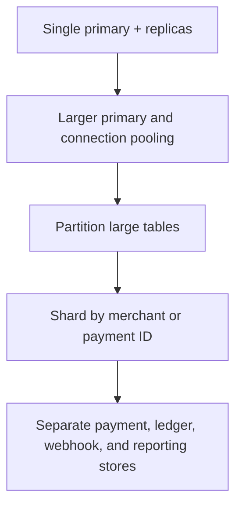

## 19.3 Read replicas

Use replicas for merchant payment history, support dashboards, reports, and analytics extraction.

Read the primary after writes when immediate consistency is required.

## 19.4 Partitioning

Time-based partitioning works well for append-heavy tables such as payment events, provider events, webhook deliveries, audit logs, and outbox archives.

Hash partitioning by merchant or payment ID helps distribute hot traffic.

## 19.5 Sharding

Possible shard key: `shard = hash(merchant_id) % number_of_shards`

Advantages:

- Merchant data is colocated.
- Most merchant queries hit one shard.

Challenges:

- Large merchants can create hot shards.
- Cross-merchant reporting becomes harder.
- Resharding requires careful tooling.

A virtual-shard mapping provides flexibility: `merchant -> virtual shard -> physical database`

## 19.6 Ledger scaling

Ledger writes should prioritize consistency over arbitrary horizontal distribution. Partition by legal entity, currency, merchant group, or account namespace.

Keep all entries for one ledger transaction on the same partition.

## 19.7 Event broker scaling

Partition topics by payment ID or merchant ID. Example topics: `payment-events`, `refund-events`, `provider-webhook-events`, `ledger-commands`, `merchant-webhook-deliveries`, `reconciliation-results`.

## 19.8 Caching

Cache only data that can tolerate staleness:

- Merchant configuration.
- Provider routing rules.
- Currency metadata.
- Public payment status for repeated polling, with a short TTL.

Do not use cache as the source of truth for:

- Current refundable amount.
- Ledger balance.
- Idempotency ownership.
- Payment state transitions.

## 19.9 Backpressure

When a downstream system is slow, bound the queues, limit concurrent provider calls, apply merchant quotas, reject excess load predictably, and delay non-critical processing — always preserving the critical payment and ledger paths.

---

# 20. Security and Compliance

As of 2026, PCI DSS v4.0.1 is the active PCI DSS version published by the PCI Security Standards Council. Exact compliance obligations depend on how cardholder data enters and flows through the system.

## 20.1 Minimize sensitive data scope

Best approach:

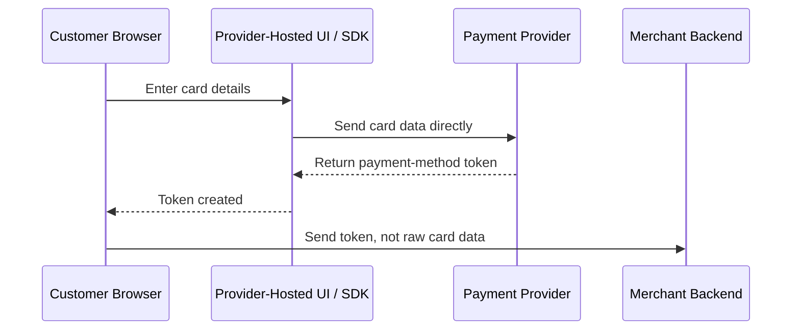

The core payment API receives a token such as `pm_tok_abc123`. It should never receive the card number or security code.

## 20.2 Never store prohibited authentication data

Do not store sensitive authentication data such as card verification values after authorization. Follow the applicable PCI requirements and provider guidance.

## 20.3 Encryption

Use TLS for all network communication and encryption at rest for databases, queues, object storage, and backups. Add field-level encryption for highly sensitive identifiers, managed or HSM-backed keys for critical cryptographic operations, and regular key rotation.

## 20.4 Tokenization

Replace sensitive payment credentials with tokens: `Card PAN -> Provider vault -> Payment method token`.

The token should be useless outside its intended merchant, account, or provider context where possible.

## 20.5 Access control

Use least privilege: the payment API can create payment records, the webhook processor can update only allowed payment fields, the ledger posting service can append entries, reporting jobs get read-only access, and human operators work through audited, role-based tools.

For sensitive operations, combine RBAC with contextual checks such as merchant ownership, environment, amount limit, and approval status.

## 20.6 Secrets

Store provider credentials in a managed secret store, not in source code or plain environment files committed to Git. Use rotation, versioning, short-lived credentials where supported, separate credentials per environment, and restricted access paths.

## 20.7 Logging rules

Never log full card numbers, card verification values, unredacted authentication tokens, full bank credentials, or secrets and signing keys.

Use structured redaction before logs leave the application process.

## 20.8 Webhook security

Verify cryptographic signatures, check timestamp tolerance, use HTTPS, rotate webhook secrets, and deduplicate event IDs. Allow-listing provider network ranges is an optional extra control, never a replacement for signatures.

## 20.9 Audit logs

Record security-sensitive actions: a manual refund approved, a merchant routing rule changed, a provider secret rotated, a ledger adjustment posted, a reconciliation exception overridden, user permissions changed.

Audit records should be append-only and protected from the application role that performs the original action.

---

# 21. Fraud and Risk Controls

Fraud controls run before or during payment authorization.

## 21.1 Common signals

Payment amount, merchant category, customer history, device fingerprint, IP reputation, billing and shipping mismatch, velocity (attempts over time), repeated failures across cards, country mismatch, suspicious account creation patterns, and the provider's own risk score.

## 21.2 Risk workflow

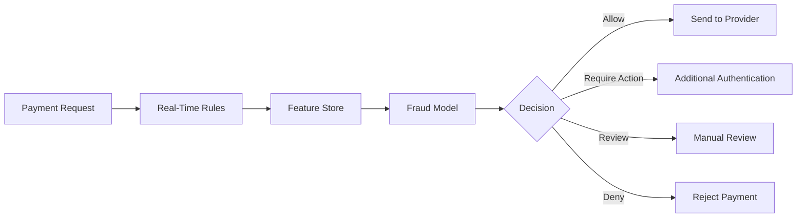

## 21.3 Velocity counters

Redis or another low-latency store can maintain counters such as attempts per card token per 10 minutes, attempts per customer per hour, failed attempts per IP per day, and total value per merchant per minute.

Risk decisions and the input summary should be stored for auditability.

## 21.4 Risk availability trade-off

Risk checks add latency and another dependency. Contain them with strict timeouts, circuit breakers, cached static rules, local fallback rules, and an explicit risk-based fail-open or fail-closed policy.

---

# 22. Observability and Operations

## 22.1 Structured logs

Include identifiers such as `request_id`, `trace_id`, `merchant_id`, `payment_id`, `attempt_id`, `provider`, `provider_request_id`, `idempotency_key_hash`, and `event_id`.

Do not log the raw idempotency key if merchants may place sensitive information inside it. Store or log a hash.

## 22.2 Metrics

**Business:** payment attempts per second, authorization success rate, capture success rate, payment success rate broken down by provider, currency, method, and merchant, refund rate, chargeback rate, average payment amount, settlement variance.

**Technical:** API and provider latency percentiles, provider error rate, database transaction latency, lock wait time, queue lag, unpublished outbox count, webhook retry count, stuck payments, reconciliation mismatch count, ledger posting delay.

## 22.3 Tracing

Trace the full path:

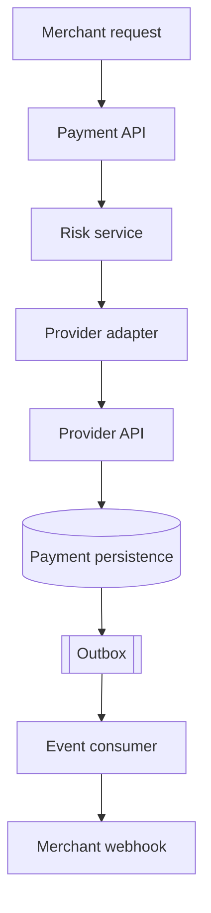

Do not place raw sensitive data in spans.

## 22.4 Alerts

Alert on symptoms that affect money or customer experience: a significant drop in success rate, provider timeouts above threshold, payments sitting in `PROCESSING` too long, unbalanced ledger transactions, a growing outbox backlog, reconciliation mismatches above threshold, a delayed merchant webhook queue, and unsafe database replication lag.

## 22.5 Operational dashboard

A useful payment operations dashboard shows the current success rate, payment volume and value, provider health, payments in an unknown state, webhook delivery health, refund backlog, settlement status, and open reconciliation exceptions.

---

# 23. Multi-Provider Routing

Supporting multiple providers improves reach, cost optimization, and resilience, but increases complexity.

## 23.1 Routing inputs

`payment_method`, `currency`, `country`, `merchant`, `amount`, provider availability, provider historical success rate, cost, fraud score, and any regulatory rule that forces or forbids a route.

## 23.2 Weighted routing

Split traffic by weight — for example 70% to provider A and 30% to provider B.

Use consistent hashing for controlled experiments so retries do not randomly move between providers.

## 23.3 Health-aware routing

Track provider health using recent latency, timeout rate, technical error rate, authorization rate compared with baseline, and the provider's status API.

A low authorization rate can be caused by customer quality rather than provider health, so compare like-for-like traffic.

## 23.4 Provider abstraction model

Normalize provider results:

```python
from dataclasses import dataclass
from enum import Enum

class ProviderOutcome(str, Enum):
    SUCCEEDED = "SUCCEEDED"
    REQUIRES_ACTION = "REQUIRES_ACTION"
    DECLINED = "DECLINED"
    PROCESSING = "PROCESSING"
    UNKNOWN = "UNKNOWN"
    TECHNICAL_FAILURE = "TECHNICAL_FAILURE"

@dataclass(frozen=True)
class ProviderResult:
    outcome: ProviderOutcome
    provider_payment_id: str | None
    provider_request_id: str | None
    retryable: bool
    error_code: str | None
    action_data: dict | None
```

Store both normalized values and a restricted provider-specific code for support.

## 23.5 Smart retry versus double-charge safety

Improving success rate is useful, but duplicate prevention has higher priority.

Safe routing rule:

```text
Declined with known final response -> another method/provider may be attempted
Technical failure before request was sent -> safe controlled retry
Timeout after request was sent -> verify outcome before failover
```

---

# 24. Deployment and Disaster Recovery

## 24.1 Multi-availability-zone deployment

Deploy API instances across multiple availability zones, a database with a synchronous standby or managed multi-zone failover, event brokers with replicated partitions, and redundant NAT or private connectivity paths to the providers.

## 24.2 Regional strategy

A practical first design uses one active region and one disaster-recovery region.

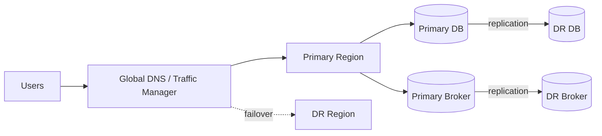

Active-active payment writes across regions are difficult because of idempotency ownership, global uniqueness, conflicting state transitions, ledger ordering, and provider region restrictions.

Use active-active only when business requirements justify the complexity.

## 24.3 RPO and RTO

Define separately for each capability:

| Capability | Example RPO | Example RTO |
|---|---:|---:|
| Payment and ledger records | Near zero | Minutes |
| Merchant webhook delivery | Minutes | Tens of minutes |
| Analytics | Hours | Hours |
| Historical reports | Hours | One day |

These are examples, not universal targets. Financial and regulatory requirements should determine the actual values.

## 24.4 Backups

Use automated database snapshots, point-in-time recovery, cross-region copies where required, encrypted backups, and regular restore testing.

A backup that has never been restored is an assumption, not a recovery plan.

## 24.5 Disaster recovery testing

Test database failover, a provider outage, a queue outage, lost webhook events, region evacuation, secret rotation failure, replay from the outbox or event log, and reconciliation after recovery.

---

# 25. Practical Technology Choices

The design is technology-independent, but a realistic implementation could use:

| Area | Practical choices |
|---|---|
| API | FastAPI, Django, Spring Boot, Go, Node.js |
| Primary database | PostgreSQL, Aurora PostgreSQL, Cloud SQL PostgreSQL |
| Connection pool | PgBouncer or managed proxy |
| Cache and counters | Redis |
| Event broker | Kafka, Amazon MSK, SQS/SNS, RabbitMQ, Google Pub/Sub |
| Workflow scheduling | Temporal, managed queues, durable job tables |
| Object storage | Amazon S3, Google Cloud Storage, Azure Blob Storage |
| Secrets | AWS Secrets Manager, GCP Secret Manager, Azure Key Vault, Vault |
| Encryption keys | Managed KMS, HSM-backed service |
| Observability | OpenTelemetry, Prometheus, Grafana, CloudWatch, Datadog |
| Data warehouse | BigQuery, Snowflake, Redshift |

## 25.1 Start simple

A strong first production version is a modular payment service on PostgreSQL and Redis, with a transactional outbox, a managed queue, one provider adapter, a webhook worker, a ledger module or service, and daily reconciliation.

Do not introduce dozens of microservices before the domain and traffic require them.

## 25.2 When to separate services

Separate a component when it needs an independent scaling profile, security boundary, availability target, data ownership, release lifecycle, or owning team.

The ledger is a strong candidate for separation because it has stricter invariants and access control than normal payment workflow data.

---

# 26. Important Trade-offs

## 26.1 Synchronous versus asynchronous response

| Response style | Advantages | Disadvantages |
|---|---|---|
| Synchronous | Simple merchant experience, immediate result. | Higher latency, more sensitive to provider outages, and it still cannot avoid asynchronous provider behavior. |
| Asynchronous | Better resilience, handles long-running payment methods. | The merchant must poll or consume webhooks, and state handling is more complex. |

Practical design: return immediate results when available, but always support `PROCESSING` and asynchronous completion.

## 26.2 One database versus database per service

| Layout | Advantages | Disadvantages |
|---|---|---|
| One database | Easy ACID transactions, simpler operations, faster development. | Strong coupling, harder independent scaling, larger failure domain. |
| Database per service | Clear ownership, independent scaling, stronger boundaries. | Distributed consistency, more reconciliation, more operational complexity. |

Start with clear schemas and ownership. Split only when justified.

## 26.3 Strong consistency versus availability

Use strong consistency for idempotency ownership, refund limits, ledger posting, and state transitions. Eventual consistency is fine for notifications, search, analytics, and merchant dashboards where a slight delay is acceptable.

## 26.4 Build versus use a provider

Most companies should integrate with established payment providers rather than connecting to payment networks directly.

Build internally the parts that encode your business: payment orchestration, provider abstraction, merchant APIs, the ledger, reconciliation, risk rules, and reporting. Use providers for payment credential vaulting, network connectivity, authentication flows, local payment method integration, and regulatory and acquiring capabilities.

## 26.5 Exactly-once versus effectively-once

Perfect end-to-end exactly-once processing across HTTP clients, databases, queues, providers, and merchant systems is not a realistic general assumption.

Design instead for effectively-once business behavior, built from idempotency keys, unique constraints, durable operation records, the transactional outbox, deduplicating consumers, state-machine validation, immutable ledger references, and reconciliation.

---
