# Design a Distributed Rate Limiter

> Design a low-latency, scalable, fault-tolerant rate limiter that applies limits consistently across many application instances and regions.

## In short

- The hard part is not the algorithm, it is **shared mutable counters**: three instances each allowing 100/min allow 300/min, so the check-and-consume must be one atomic operation, never a read followed by a write from application code.
- Enforce in **two layers** — an in-process bucket for microsecond-level self-protection, and a central Redis-backed limiter that holds the global truth.
- **Token bucket** is the default choice: constant state per key, an explicit burst capacity, weighted costs, and a clean mapping onto one Redis script.
- Redis must be the **time source** inside that script; using each caller's clock lets machine skew silently shift every window.
- Choose **fail-open or fail-closed per policy**, not once for the system: an abuse rule fails closed, a fairness quota fails open.
- **Hot keys** defeat sharding, because one large tenant lands on one slot — pre-limit locally, or lease a block of tokens instead of paying a round trip per request.
- A strictly global limit costs a cross-region round trip on every request; allocate regional quotas or lease from a global pool instead.

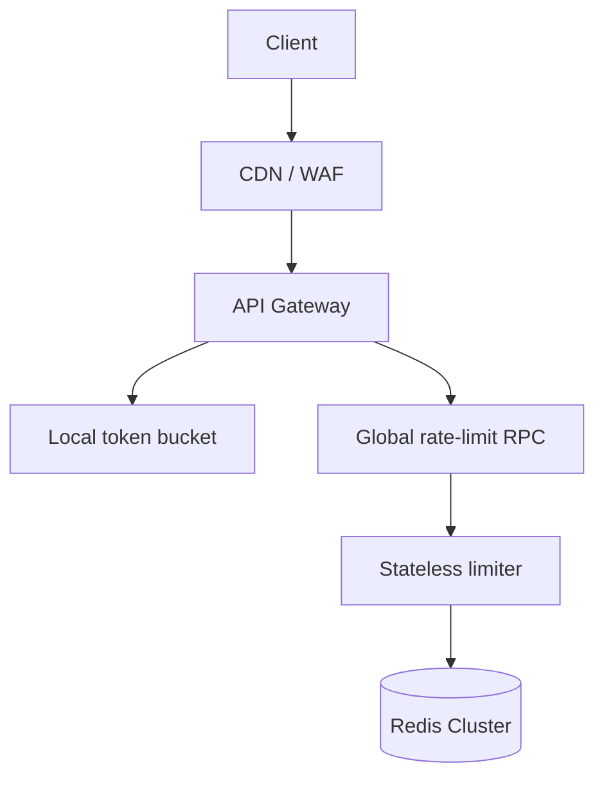

**Interview answer:** Put a stateless limiter service in front of a Redis cluster and run check-and-consume as a single Lua script per key, so no gateway can read a stale count and overspend it. Use a token bucket keyed by `policy + identity` with a TTL so idle keys evict themselves, and add a small in-process bucket in each gateway to absorb obvious abuse without a network hop. Then say explicitly what happens when Redis is unavailable and what happens across regions — those two answers, not the algorithm, are what separates a distributed design from a single-server one.

**Gotcha:** Reaching for one perfectly accurate global counter. Cross-region coordination on the request path costs more latency than the limit is worth and turns the limiter into a single point of failure; real systems layer local protection, strict regional enforcement, and approximate or leased global quotas, and accept a small overshoot at the seams.

---

# 1. Problem Statement

A rate limiter controls how frequently a client can perform an operation.

Examples:

- A user may call `GET /transactions` 100 times per minute.
- An API key may create 10 payments per second.
- An IP address may attempt login 5 times in 10 minutes.
- A tenant may consume 50,000 compute units per hour.
- The complete platform may accept no more than 200,000 requests per second.

A **distributed rate limiter** must enforce these limits across multiple API gateways, application instances, availability zones, and possibly regions.

Without a shared design, each application instance maintains its own counter:

```text
Limit: 100 requests/minute

Application instance A permits 100
Application instance B permits 100
Application instance C permits 100

Actual combined limit = 300 requests/minute
```

The system must instead make the instances behave as one logical limiter.

---

# 2. Why a Distributed Rate Limiter Is Difficult

A local in-memory counter is fast, but it only knows about traffic handled by one process.

A distributed limiter introduces several challenges:

## 2.1 Shared State

All instances need a consistent view of:

- Requests already consumed
- Remaining quota
- Reset or refill time
- Applicable policy
- Client identity

## 2.2 Atomic Updates

Two requests can arrive at exactly the same time.

The check and update must act as one operation:

```text
Incorrect:

1. Read remaining tokens = 1
2. Request A sees 1 token
3. Request B sees 1 token
4. Both requests decrement it
5. Two requests are allowed instead of one
```

The data store must perform the decision atomically.

## 2.3 Latency

The limiter is on the critical path of nearly every request.

A slow limiter makes the complete API slow.

## 2.4 Availability

When the rate-limit store is unavailable, the platform must choose between:

- **Fail open:** allow requests and protect availability.
- **Fail closed:** reject requests and protect the resource.
- **Fallback:** use a temporary local limiter.

## 2.5 Hot Keys

A global limit, popular tenant, or abusive API key can send a very high number of operations to one Redis key.

## 2.6 Multi-Region Coordination

A strict global limit across distant regions requires cross-region coordination, which increases latency and reduces availability.

## 2.7 Fairness

A system-wide limit alone can allow one tenant to consume the entire capacity. Rate limits frequently need several levels: `Platform → Tenant → User → API route`.

---

# 3. Requirements

## 3.1 Functional Requirements

The system should:

1. Accept a rate-limit decision request.
2. Identify the matching policy.
3. Allow or reject the request.
4. Support limits by:
   - User ID
   - Tenant ID
   - API key
   - IP address
   - Route
   - HTTP method
   - Region
   - Resource or operation
5. Support burst capacity.
6. Support different subscription plans.
7. Support weighted requests.
8. Return remaining quota and retry information.
9. Allow policy updates without restarting gateways.
10. Support shadow mode before enforcement.

## 3.2 Non-Functional Requirements

| Requirement | Target |
|---|---:|
| Decision availability | 99.99% or higher |
| Added p99 latency | Under 5 ms inside a region |
| Peak decision throughput | 1,000,000 checks/second |
| Horizontal scalability | Required |
| Policy propagation | Under 10 seconds |
| Counter accuracy | Strong within one region |
| Multi-region accuracy | Configurable strictness |
| Recovery | Automatic failover |
| Auditability | Policy changes recorded |

## 3.3 Out of Scope

A rate limiter is not a complete replacement for:

- Web Application Firewall
- DDoS protection
- Authentication
- Authorization
- Billing metering
- Concurrency control
- Queue-based load shedding

These controls work together but solve different problems.

---

# 4. Back-of-the-Envelope Estimation

Assume:

- Average API traffic: **300,000 requests/second**
- Peak API traffic: **1,000,000 requests/second**
- Each request evaluates 3 policies:
  - Platform limit
  - Tenant limit
  - User-route limit
- Average rate-limit operations: **3,000,000 policy checks/second**
- Decision payload: approximately **300 bytes**
- Redis operation and response: approximately **500 bytes combined**

Approximate internal network traffic is `3,000,000 × 500 bytes = 1.5 GB/second`.

Sending every policy as a separate network request is expensive.

Therefore, the design should:

- Evaluate multiple policies in one rate-limit service request.
- Use pipelining or one atomic script where possible.
- Apply coarse local limits before the global service.
- Cache configuration locally.
- Consider quota leasing at very high scale.

## 4.1 State Estimate

Suppose 20 million identities are active during the expiration window.

Token-bucket state per identity may contain:

```text
tokens             8 bytes
last_refill_time   8 bytes
Redis/object overhead
key bytes
TTL metadata
```

The raw fields are small, but datastore overhead dominates. At roughly 100-200 bytes per active key, `20,000,000 × 150 bytes ≈ 3 GB`.

Production capacity should include replicas, fragmentation, failover headroom, and traffic growth. A safer provision might be several times the raw estimate.

---

# 5. Rate-Limiting Dimensions

A **rate-limit key** identifies what is being limited.

## 5.1 Common Keys

```text
ip:203.0.113.10
user:user-728
tenant:tenant-42
api_key:key-abc
route:POST:/v1/payments
tenant:tenant-42:route:POST:/v1/payments
```

## 5.2 Choosing the Identity

Prefer the strongest authenticated identity available:

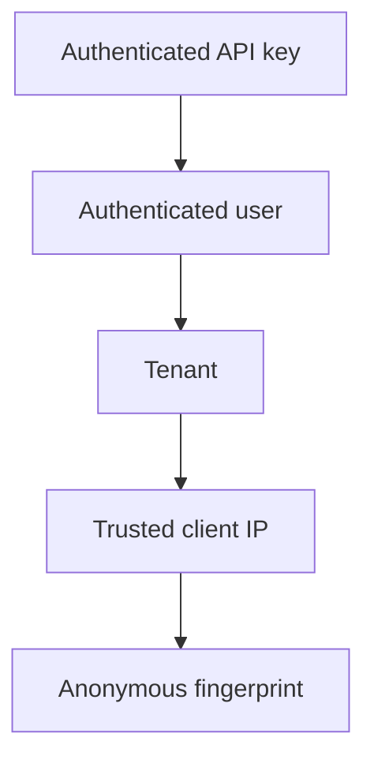

Do not blindly trust `X-Forwarded-For`. Only accept forwarding headers from known proxies or load balancers.

## 5.3 Multiple Simultaneous Limits

A payment request may need all of these:

```text
Platform:        200,000 requests/second
Tenant:          5,000 requests/second
API key:         500 requests/second
Create payment:  50 requests/second
User:            10 requests/second
```

The request is allowed only when every required policy has capacity.

---

# 6. Choosing the Algorithm

[Rate Limiting in API Design & REST](../api-design/rate-limiting.md) owns the algorithms in full: fixed window, sliding window log, sliding window counter, token bucket, and leaky bucket, each with its formula, the boundary-burst problem, and the comparison table. The summary that a distributed design needs:

| Algorithm | State per key | Burst | Where it earns its place |
|---|---|---|---|
| Fixed window | One counter | Accidental, at the boundary | Coarse quotas where a 2x boundary overshoot is harmless |
| Sliding window log | One entry per request | Configurable | Low-volume, security-sensitive rules such as login attempts |
| Sliding window counter | Two counters | Limited | A good general API default when bursts are unwanted |
| Token bucket | Tokens plus a timestamp | Explicit, via capacity | The primary distributed limiter |
| Leaky bucket | Queue plus drain rate | Smoothed away | Shaping asynchronous work, not synchronous APIs |

Use a **token bucket** for the primary distributed limiter. Capacity sets the burst a client may take immediately and the refill rate sets the sustained rate, so `capacity = 100, refill = 10/second` permits an instant burst of 100 and about 10 requests per second thereafter. It keeps constant state per key regardless of traffic, supports weighted requests, and reduces to a single arithmetic step that a Redis script can perform atomically:

```text
elapsed          = now - last_refill
refilled_tokens  = min(capacity, previous_tokens + elapsed x refill_rate)
allowed          = refilled_tokens >= request_cost
```

Reserve the sliding log for a handful of low-volume, security-sensitive rules where a per-request timestamp is worth its memory. The point for this design is that only the token bucket keeps state small enough to live in a shared store at millions of keys while still expressing burst and sustained rate as separate, tunable numbers.

---

# 7. Recommended Design

The recommended production design has two enforcement layers.

## 7.1 Layer 1: Local Rate Limiter

Each gateway maintains an in-memory token bucket for:

- Emergency protection
- Per-instance capacity
- Obvious abusive bursts
- Reducing calls to the global service

This layer is fast but not globally exact.

## 7.2 Layer 2: Distributed Global Rate Limiter

A stateless rate-limit service:

- Receives descriptors from gateways.
- Resolves matching policies from local cache.
- Atomically updates counters in Redis.
- Returns one combined decision.
- Emits metrics and decision reasons.

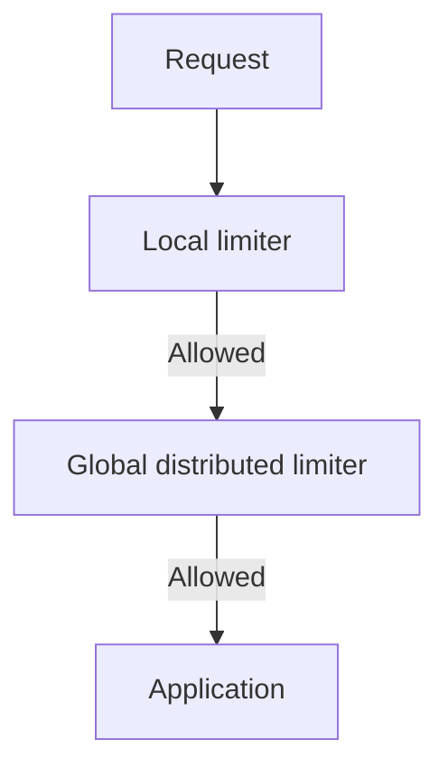

## 7.3 Why Use Both?

The local limiter protects the global limiter itself.

Suppose an attack sends 5 million requests/second. It is inefficient to send all 5 million requests to Redis merely to reject them.

A coarse local cap rejects obvious overload close to the edge, while the global limiter maintains tenant-wide fairness and quotas.

---

# 8. High-Level Architecture

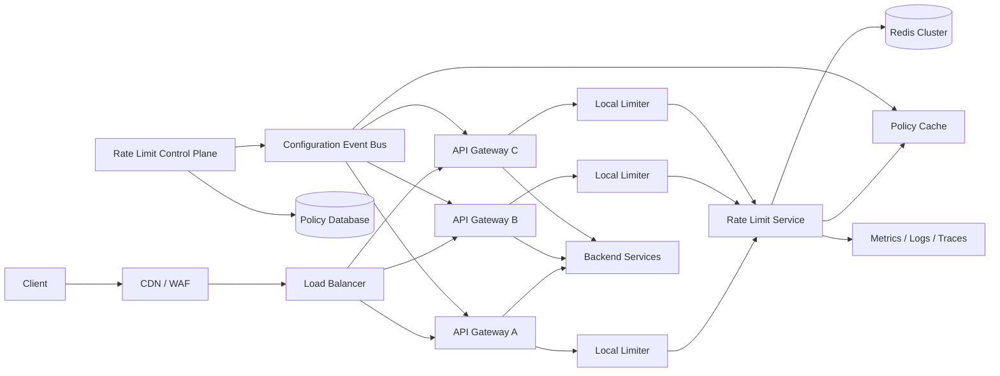

## 8.1 Components

### API Gateway or Sidecar

- Extracts trusted identity.
- Builds descriptors.
- Applies local limits.
- Calls the distributed rate-limit service.
- Returns HTTP `429` when rejected.

### Rate-Limit Service

- Stateless and horizontally scalable.
- Matches policies.
- Builds Redis keys.
- Executes atomic decisions.
- Returns metadata.
- Does not store durable policy definitions locally.

### Redis Cluster

- Stores short-lived bucket state.
- Executes atomic Lua or server-side functions.
- Uses TTL to remove inactive identities.
- Is sharded by rate-limit key.

### Control Plane

- Provides policy CRUD.
- Validates conflicting rules.
- Versions configurations.
- Publishes policy changes.
- Supports staged rollout and rollback.

### Policy Database

Stores durable configuration, not request counters.

Examples:

- PostgreSQL
- Consul
- etcd
- A configuration repository backed by Git

---

# 9. Request Flow

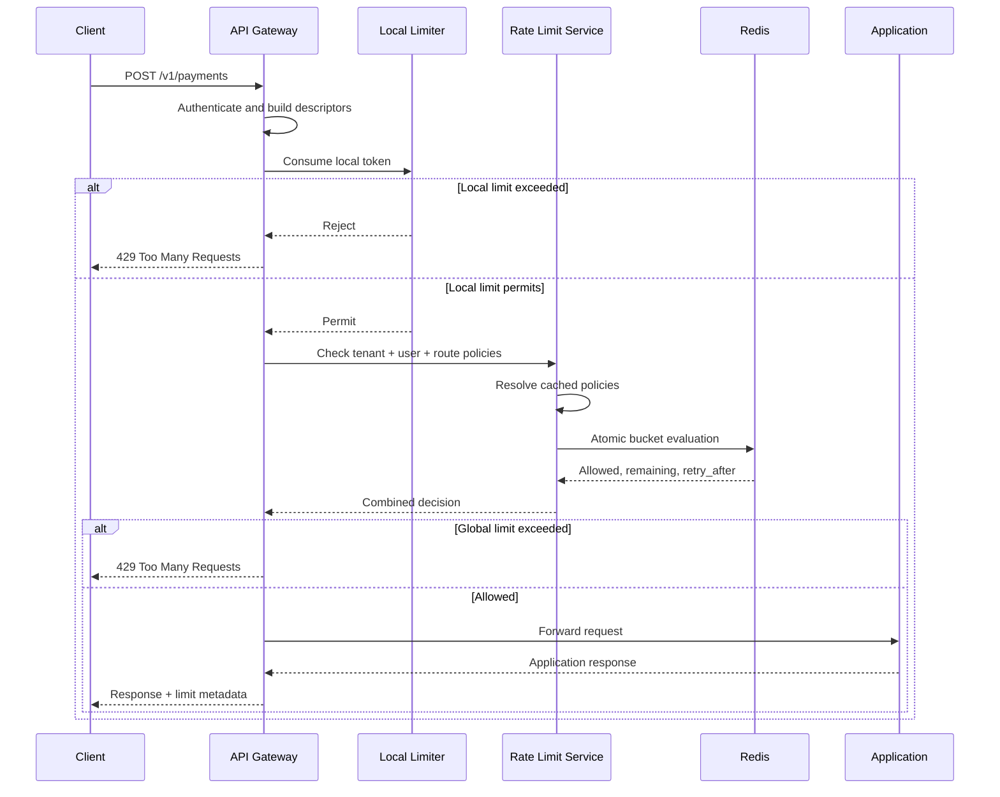

## 9.1 Detailed Steps

1. The request reaches the edge.
2. Authentication establishes a user, tenant, or API key.
3. The gateway normalizes the route:
   - Use `/v1/payments/{payment_id}` rather than the raw path.
4. The gateway creates descriptors.
5. A local bucket rejects extreme bursts.
6. The gateway calls the rate-limit service over gRPC or a local network protocol.
7. The service finds all matching policies from its local cache.
8. It builds one key per policy.
9. Redis atomically evaluates and updates the relevant buckets.
10. The rate-limit service returns:
    - Allowed or rejected
    - Limiting policy
    - Remaining tokens
    - Retry delay
11. The gateway either forwards the request or returns `429`.

---

# 10. API Contract

gRPC is suitable because the call is internal, frequent, and latency-sensitive.

## 10.1 Decision Request

```protobuf
message RateLimitRequest {
  string domain = 1;
  string request_id = 2;
  repeated Descriptor descriptors = 3;
  int64 default_cost = 4;
  bool shadow_only = 5;
}

message Descriptor {
  repeated Entry entries = 1;
  int64 cost = 2;
}

message Entry {
  string key = 1;
  string value = 2;
}
```

Example logical payload:

```json
{
  "domain": "payments-api",
  "request_id": "req-6da3",
  "descriptors": [
    {
      "entries": [
        {"key": "tenant_id", "value": "tenant-42"}
      ],
      "cost": 1
    },
    {
      "entries": [
        {"key": "tenant_id", "value": "tenant-42"},
        {"key": "route", "value": "POST:/v1/payments"}
      ],
      "cost": 5
    },
    {
      "entries": [
        {"key": "user_id", "value": "user-728"}
      ],
      "cost": 1
    }
  ]
}
```

## 10.2 Decision Response

```protobuf
message RateLimitResponse {
  Decision overall_decision = 1;
  repeated PolicyResult results = 2;
  int64 retry_after_ms = 3;
  string limiting_policy_id = 4;
}

enum Decision {
  ALLOW = 0;
  DENY = 1;
  SHADOW_DENY = 2;
  ERROR = 3;
}

message PolicyResult {
  string policy_id = 1;
  bool allowed = 2;
  int64 limit = 3;
  int64 remaining = 4;
  int64 reset_after_ms = 5;
}
```

## 10.3 Batch Evaluation

Do not make three independent calls for three policies.

Use one request:

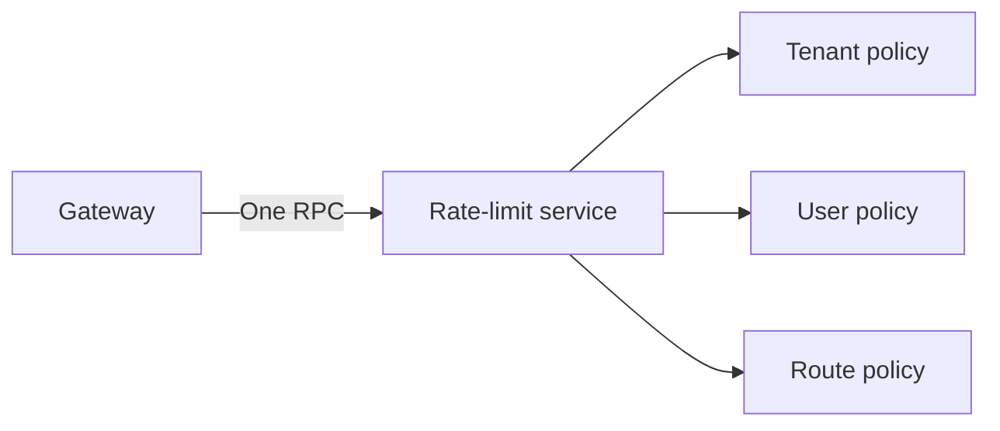

This reduces:

- Network round trips
- Serialization
- Connection pressure
- Tail latency

---

# 11. Redis Data Model

## 11.1 Token-Bucket Key

A bucket key is `rl:{shard-key}:v{policy-version}:{policy-id}:{identity-hash}`, for example `rl:{tenant-42}:v7:payment-create:user-728`.

The braces are a Redis Cluster hash tag. Keys with the same hash tag map to the same hash slot when a multi-key atomic operation requires colocated keys.

## 11.2 Bucket Fields

A compact Redis hash:

```text
tokens          73500
last_refill_ms  1785738305123
```

Use scaled integers to avoid inconsistent floating-point behavior.

Example: `1 logical token = 1,000 microtokens`

Then:

```text
capacity:     100 tokens  = 100,000 microtokens
refill rate:  10/sec      = 10 microtokens/ms
request cost: 1 token     = 1,000 microtokens
```

## 11.3 TTL

Set the TTL long enough for an empty bucket to become full: `ttl ≈ ceil(capacity / refill_rate) + safety_margin`.

Example:

```text
capacity = 100 tokens
refill = 10 tokens/second
full refill time = 10 seconds
TTL = 20–60 seconds
```

After inactivity, deleting the key is safe because an absent bucket represents a full bucket.

## 11.4 Avoid Unbounded Cardinality

Never create a key directly from arbitrary unvalidated input.

Use:

- Normalized route names
- Length limits
- Hashing for high-cardinality identifiers
- Approved descriptor dimensions
- TTL on all transient keys

---

# 12. Atomic Token-Bucket Operation

The complete read–refill–consume–write sequence must be atomic.

Redis Lua scripting or a Redis server-side function can perform this as one operation.

## 12.1 Pseudocode

```python
def consume(bucket, now_ms, capacity, refill_per_ms, cost):
    if bucket does not exist:
        tokens = capacity
        last_refill_ms = now_ms
    else:
        tokens = bucket.tokens
        last_refill_ms = bucket.last_refill_ms

    elapsed_ms = max(0, now_ms - last_refill_ms)

    tokens = min(
        capacity,
        tokens + elapsed_ms * refill_per_ms,
    )

    if tokens >= cost:
        tokens -= cost
        allowed = True
        retry_after_ms = 0
    else:
        allowed = False
        missing = cost - tokens
        retry_after_ms = ceil(missing / refill_per_ms)

    save(tokens, now_ms)
    set_ttl()

    return allowed, tokens, retry_after_ms
```

## 12.2 Example Lua Script

```lua
-- KEYS[1] = bucket key
--
-- ARGV[1] = capacity in microtokens
-- ARGV[2] = refill rate in microtokens per millisecond
-- ARGV[3] = current time in milliseconds
-- ARGV[4] = request cost in microtokens
-- ARGV[5] = TTL in milliseconds

local key = KEYS[1]

local capacity = tonumber(ARGV[1])
local refill_per_ms = tonumber(ARGV[2])
local now_ms = tonumber(ARGV[3])
local cost = tonumber(ARGV[4])
local ttl_ms = tonumber(ARGV[5])

local bucket = redis.call(
    "HMGET",
    key,
    "tokens",
    "last_refill_ms"
)

local tokens = tonumber(bucket[1])
local last_refill_ms = tonumber(bucket[2])

if tokens == nil then
    tokens = capacity
    last_refill_ms = now_ms
end

local elapsed_ms = math.max(0, now_ms - last_refill_ms)
local replenished = elapsed_ms * refill_per_ms
tokens = math.min(capacity, tokens + replenished)

local allowed = 0
local retry_after_ms = 0

if tokens >= cost then
    tokens = tokens - cost
    allowed = 1
else
    local missing = cost - tokens

    if refill_per_ms > 0 then
        retry_after_ms = math.ceil(missing / refill_per_ms)
    else
        retry_after_ms = ttl_ms
    end
end

redis.call(
    "HSET",
    key,
    "tokens", tokens,
    "last_refill_ms", now_ms
)
redis.call("PEXPIRE", key, ttl_ms)

return {
    allowed,
    tokens,
    retry_after_ms
}
```

## 12.3 Time Source

There are two options.

### Application-Supplied Time

Advantages:

- Avoids another server command.
- Easy to test.

Risks:

- Clock skew between rate-limit service instances.
- A clock moving backwards can affect refill logic.

Clamp the elapsed time with `elapsed = max(0, now - last_refill)`. Use synchronized clocks and monotonic time for local calculations.

### Redis Server Time

The script can use Redis `TIME`.

Advantages:

- One authoritative time source for a shard.
- Less client clock skew.

Trade-off:

- Time can differ between shards.
- Failover to another node can produce small jumps.

For most regional deployments, Redis time plus backwards-time protection is a sensible choice.

## 12.4 Denied Requests and State

Even when a request is denied, save the refilled token state and updated timestamp.

Otherwise, repeatedly denied requests can incorrectly recalculate refill from an old timestamp.

---

# 13. Hierarchical and Weighted Limits

## 13.1 Hierarchical Limits

A request may consume several buckets:

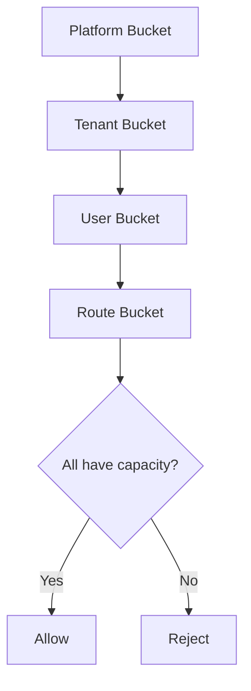

Example:

| Level | Limit |
|---|---:|
| Platform | 200,000 requests/second |
| Tenant | 5,000 requests/second |
| Tenant payment route | 500 requests/second |
| User | 100 requests/minute |

## 13.2 Weighted Requests

Not every operation has equal cost.

```text
GET /accounts                    cost = 1
GET /reports?format=summary      cost = 5
POST /reports/export             cost = 25
POST /ai/generate                cost = token-based
```

Weighted limits protect expensive resources more accurately than request count alone.

## 13.3 Atomicity Across Multiple Policies

Strict all-or-nothing consumption across several Redis shards is difficult.

Possible strategies:

### Strategy A: Check and Consume Sequentially

```text
Consume platform
Consume tenant
Consume user
```

Problem: if the user limit rejects, higher-level tokens were already consumed.

This conservative overcounting may be acceptable because it does not permit excess traffic, but it reduces available capacity.

### Strategy B: Co-Locate Related Keys

Use a shared hash tag:

```text
rl:{tenant-42}:tenant
rl:{tenant-42}:route:payments
rl:{tenant-42}:user:user-728
```

Then one Lua script can evaluate all tenant-related buckets atomically on one shard.

Trade-off: very large tenants can become shard hot spots.

### Strategy C: Two-Phase Reservation

Reserve tokens, evaluate all buckets, then commit or compensate.

This is complex and increases latency. Avoid it unless strict accounting is required.

### Practical Choice

Use atomic multi-policy evaluation for keys naturally colocated by tenant. Evaluate platform-wide emergency limits locally or through a separate coarse mechanism.

Rate limiting normally favors low latency and safe approximation over distributed transactions.

---

# 14. Configuration and Control Plane

Request counters are transient. Policies are durable business configuration.

## 14.1 Policy Model

```json
{
  "id": "payment-create-pro",
  "version": 7,
  "domain": "payments-api",
  "match": {
    "plan": "pro",
    "method": "POST",
    "route": "/v1/payments"
  },
  "algorithm": "token_bucket",
  "capacity": 100,
  "refill_tokens": 50,
  "refill_period_ms": 1000,
  "cost": 1,
  "enforcement": "enforce",
  "failure_mode": "fail_closed",
  "priority": 100
}
```

## 14.2 Policy States

A policy moves through `DRAFT → SHADOW → ENFORCED → DISABLED`.

### Draft

Policy exists but is not distributed.

### Shadow

The limiter calculates decisions and metrics but does not block traffic.

### Enforced

Requests are rejected when capacity is exhausted.

### Disabled

Policy remains auditable but is not evaluated.

## 14.3 Policy Versioning

Include the version in counter keys, as in `rl:{tenant-42}:v7:payment-create`.

This prevents a major policy change from incorrectly reusing incompatible state.

For a small limit adjustment, decide explicitly whether to:

- Preserve existing tokens.
- Reset the bucket.
- Clamp tokens to the new capacity.

## 14.4 Distribution

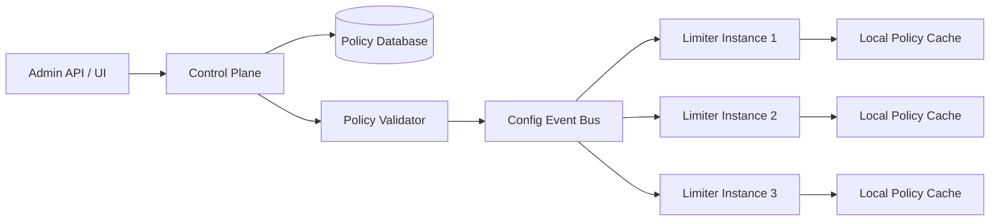

The data plane should not query PostgreSQL for every request.

Use:

- In-memory compiled policies
- Event-driven updates
- Periodic reconciliation
- Last-known-good configuration
- Version checks
- Safe rollback

---

# 15. Scaling the Rate-Limit Service

The service is stateless, so it can scale horizontally.

## 15.1 Deployment

Run multiple instances across availability zones:

```text
Availability Zone A: 4 instances
Availability Zone B: 4 instances
Availability Zone C: 4 instances
```

Gateways should use:

- Connection pooling
- gRPC keepalive
- Client-side load balancing
- Short deadlines
- Retry only when safe
- Circuit breakers

## 15.2 Avoid Retry Amplification

A gateway retry can cause the same request to consume tokens twice if the first response is lost after Redis committed the change.

Choices:

1. **Do not retry decision calls** on ambiguous timeouts.
2. Use a short-lived deduplication key based on `request_id`.
3. Accept rare overcounting because it is safer than undercounting.

A full exactly-once design adds cost and usually is not necessary for rate limiting.

## 15.3 Deduplication Option

```text
dedupe:{request-id} → previous decision
TTL: 5–30 seconds
```

The script can:

1. Check the dedupe key.
2. Return the existing result if found.
3. Otherwise consume tokens.
4. Save the result.

This is useful where gateway retries are unavoidable.

## 15.4 Backpressure

Protect the limiter with:

- Maximum concurrent RPCs
- Queue limits
- Request deadlines
- Load shedding
- Per-gateway connection quotas
- Local fallback limits

The limiter must not fail slowly.

---

# 16. Scaling Redis

## 16.1 Sharding

Redis Cluster partitions keys across hash slots.

Use a stable key with sufficient cardinality, such as `hash(policy_id + identity)`.

Avoid using only `policy_id`, because all clients for one policy would hit one shard.

## 16.2 Replication

Each primary should have at least one replica.

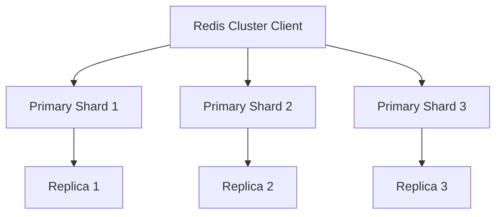

Writes go to the primary. Replicas provide failover, not strongly consistent counter reads.

## 16.3 Durability

Rate-limit counters are ephemeral. Full disk durability is often unnecessary.

Possible setup:

- Replication enabled
- Append-only persistence relaxed or disabled
- Fast failover
- Accept that some counters may reset after a severe failure

A bucket reset can briefly allow additional traffic. Compensate with local emergency limits.

## 16.4 Cluster Resizing

Use consistent operational procedures:

- Add shards before utilization becomes critical.
- Rebalance hash slots gradually.
- Monitor migration latency.
- Keep spare memory and CPU capacity.
- Load test during slot movement.

## 16.5 Redis Command Discipline

Avoid expensive commands such as `KEYS rl:*`.

Rely on:

- TTL for automatic cleanup
- `SCAN` for operational inspection
- Metrics rather than full key scans
- Namespaced keys

---

# 17. Hot-Key Handling

A hot key occurs when a disproportionate number of requests target one counter.

Examples:

- A global platform bucket
- One very large tenant
- An attack against one API key
- A shared anonymous-IP bucket behind a NAT

## 17.1 Local Pre-Limiting

Divide a global limit approximately across gateway instances:

```text
Global emergency limit = 1,000,000 requests/second
100 gateway instances
Local target ≈ 10,000 requests/second per instance
```

This is not exact, but it removes extreme load before Redis.

## 17.2 Token Leasing

Instead of consuming one global token for every request, a gateway leases a batch:

```text
Global bucket grants gateway A 1,000 tokens.
Gateway A consumes them locally.
It requests another lease when nearly empty.
```

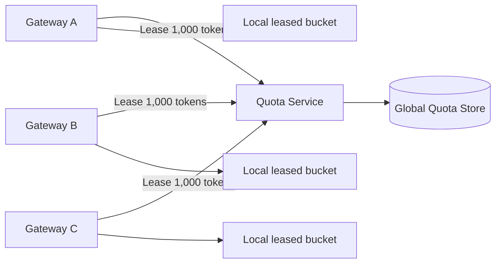

### Advantages

- Far fewer Redis operations
- Better latency
- Better resilience during short outages

### Trade-Off

Unused leased tokens create temporary underutilization. If a gateway crashes, its lease may be unavailable until expiry.

## 17.3 Adaptive Lease Size

Use smaller leases for:

- Low-volume identities
- Strict limits
- Untrusted clients

Use larger leases for:

- High-volume stable tenants
- Platform-level capacity
- Low-risk read operations

## 17.4 Key Salting

Split an approximate global counter into subkeys:

```text
global:0
global:1
...
global:63
```

Each request selects a subkey. Aggregate usage periodically.

This improves throughput but weakens strictness. Use it only for approximate global protection, not contractually exact tenant quotas.

---

# 18. Consistency and Accuracy

Rate limiting is a consistency-versus-availability problem.

## 18.1 Strict Regional Limit

All requests for one identity use one authoritative regional Redis shard.

Properties:

- Strong atomicity per bucket
- Low regional latency
- Simple reasoning

## 18.2 Eventually Consistent Global Limit

Each region enforces an allocated quota.

Example:

```text
Global tenant limit: 10,000 requests/second

India region:      4,000
Europe region:     3,000
US region:         3,000
```

A control loop can periodically rebalance allocations based on demand.

Properties:

- Low latency
- Regionally resilient
- Approximate global utilization

## 18.3 Strict Global Limit

Every request reaches one global authority.

Properties:

- Most accurate
- High cross-region latency
- Cross-region dependency
- Reduced availability during partitions

This is rarely justified for ordinary API throttling.

## 18.4 Practical Principle

Use different accuracy levels for different limits:

| Limit | Recommended Accuracy |
|---|---|
| Per-user abuse control | Strong regional |
| Tenant subscription rate | Strong regional or home-region |
| Platform overload protection | Approximate local + regional |
| Monthly billing quota | Durable metering, not only rate limiter |
| Login attempts | Strong regional, possibly sliding log |
| Cross-region contractual quota | Home-region authority or leased quota |

---

# 19. Failure Handling

## 19.1 Failure Matrix

| Failure | Recommended Behavior |
|---|---|
| Rate-limit instance unavailable | Try another instance within deadline |
| Redis timeout | Apply policy-specific fallback |
| Redis shard failover | Short local fallback |
| Config bus unavailable | Continue with last-known-good policies |
| Control plane unavailable | Data plane continues |
| Clock moves backwards | Clamp elapsed time to zero |
| Region partition | Enforce regional allocation |
| Metrics backend unavailable | Continue serving decisions |

## 19.2 Fail Open

Allow the request when the limiter is unavailable.

Suitable for:

- Public read-only endpoints
- Non-sensitive browsing
- Availability-first workloads

Risk:

- Downstream overload
- Abuse during limiter outages

## 19.3 Fail Closed

Reject the request when the limiter is unavailable.

Suitable for:

- Payment creation
- Login attempts
- Password reset
- Costly compute
- Strict tenant isolation

Risk:

- Limiter outage becomes an application outage

## 19.4 Local Fallback

Use a conservative in-memory limit temporarily.

```text
Normal global limit: 1,000 requests/second
Fallback local limit: 30 requests/second per gateway
Fallback duration: 10 seconds
```

This usually gives a better balance than always failing open or closed.

## 19.5 Policy-Specific Failure Mode

```json
{
  "policy_id": "create-payment",
  "failure_mode": "local_fallback",
  "fallback": {
    "capacity": 10,
    "refill_per_second": 5
  }
}
```

Avoid one system-wide failure mode for every endpoint.

## 19.6 Circuit Breaker

When Redis is unhealthy the breaker moves `CLOSED → OPEN → HALF-OPEN → CLOSED`.

While open:

- Stop flooding Redis with doomed requests.
- Use local fallback.
- Probe with limited traffic.
- Recover gradually.

---

# 20. Multi-Region Design

## 20.1 Recommended Regional Architecture

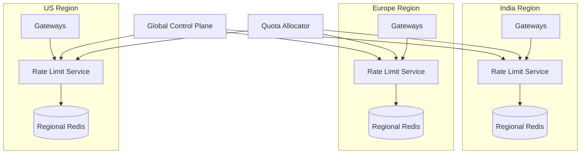

Each region:

- Makes decisions locally.
- Has its own Redis cluster.
- Receives a portion of global quotas.
- Continues during inter-region failure.

## 20.2 Quota Allocation

```text
Global quota = 10,000 requests/second

Allocated:
India  = 4,000
Europe = 3,000
US     = 3,000
```

The allocator observes demand:

```text
India demand rises to 6,000.
US uses only 1,000.

New allocation:
India  = 5,500
Europe = 3,000
US     = 1,500
```

Keep a safety reserve to avoid oscillation.

## 20.3 Home-Region Routing

For stricter tenant quotas, assign each tenant a home region.

```text
tenant-42 → India
tenant-91 → Europe
```

All quota decisions for that tenant go to its home region.

Trade-offs:

- Stronger consistency
- Higher latency for remote users
- Dependence on home-region availability

## 20.4 Multi-Region Token Leasing

A global allocator leases tokens to regions. Regions then lease smaller batches to gateways.

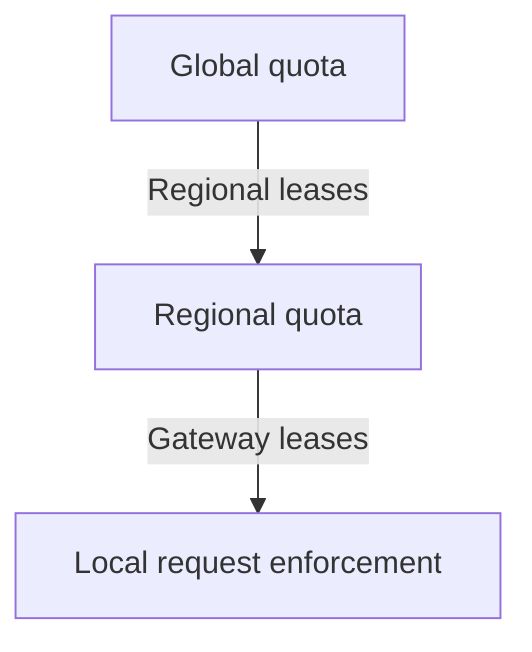

This hierarchical design minimizes global coordination.

---

# 21. Response Semantics

The rejection contract belongs to the API layer and is specified in full in [Rate Limiting in API Design & REST](../api-design/rate-limiting.md): `429 Too Many Requests` with an `application/problem+json` body, `Retry-After`, the draft IETF `RateLimit` and `RateLimit-Policy` fields, the legacy `X-RateLimit-*` compatibility strategy, and the client-side backoff rules.

Two details are specific to this design. The limiter service returns a decision, not an HTTP response — the gateway translates `DENY` into `429`. And because `Retry-After` is expressed in whole seconds, return the precise wait separately (`"retry_after_ms": 1840`) so SDKs can schedule the retry accurately instead of rounding a sub-second wait up to a full second.

---

# 22. Security and Abuse Resistance

## 22.1 Trusted Identity Extraction

Only gateways should construct rate-limit descriptors.

Backend clients must not be allowed to send:

```http
X-Tenant-Id: premium-tenant
X-Rate-Limit-Plan: unlimited
```

unless these values are verified against authenticated claims.

## 22.2 Protect Against IP Spoofing

- Trust forwarding headers only from controlled proxies.
- Normalize IPv6 addresses.
- Consider subnet-based limiting for anonymous IPv6 clients.
- Recognize that many users can share one NAT IP.
- Combine IP limits with authenticated identity limits.

## 22.3 Protect the Rate-Limit Service

- Use mutual TLS.
- Restrict network access.
- Authenticate gateways.
- Validate descriptor names and lengths.
- Limit descriptor count.
- Limit batch size.
- Reject unknown domains.
- Apply per-caller quotas.
- Avoid logging raw API keys or personal data.

## 22.4 High-Cardinality Attacks

An attacker can generate millions of random identities to create Redis keys.

Mitigations:

```text
Maximum identity length
Hash untrusted values
Short TTL for anonymous keys
Local pre-filtering
Approximate sketches for detection
WAF or bot protection
Per-source key-creation limits
```

## 22.5 Rate Limiting Is Not DDoS Protection

The limiter is usually behind some infrastructure. A volumetric attack may saturate the network before application-level rate limiting executes.

Use upstream controls: `CDN → DDoS protection → WAF → load balancer → API rate limiter`.

---

# 23. Observability

## 23.1 Core Metrics

### Decision Metrics

```text
rate_limit_requests_total
rate_limit_allowed_total
rate_limit_denied_total
rate_limit_shadow_denied_total
rate_limit_errors_total
```

Dimensions:

- Domain
- Policy ID
- Region
- Decision
- Failure mode
- Route group
- Subscription plan

Avoid high-cardinality labels such as raw user ID or API key.

### Latency

```text
rate_limit_decision_latency_ms
redis_operation_latency_ms
policy_lookup_latency_ms
```

Track p50, p95, p99, and p99.9.

### Redis

```text
operations_per_second
CPU utilization
memory utilization
evictions
expired_keys
replication_lag
failovers
connection_count
hot_key indicators
```

### Configuration

```text
active_policy_version
configuration_age_seconds
configuration_reload_failures
instances_with_stale_config
```

## 23.2 Useful Alerts

Alert when:

- Decision p99 exceeds the latency target.
- Error rate increases.
- Redis memory exceeds the safe threshold.
- A shard has disproportionate traffic.
- Denial rate changes sharply.
- Policy versions differ between instances.
- Fallback mode remains active too long.
- A single policy causes a large share of denials.

## 23.3 Decision Logs

Sample structured logs:

```json
{
  "request_id": "req-6da3",
  "domain": "payments-api",
  "policy_id": "payment-create-pro",
  "decision": "deny",
  "remaining": 0,
  "retry_after_ms": 1840,
  "region": "ap-south",
  "latency_ms": 1.8,
  "failure_mode": "normal"
}
```

Do not log every allowed request at very high traffic. Use:

- Metrics for aggregates
- Sampling for allow decisions
- Higher sampling for denies and errors
- Full audit logs for policy changes

## 23.4 Distributed Tracing

Add a child span:

```text
api.request
└── rate_limit.check
    ├── policy.match
    └── redis.consume
```

Tracing should be sampled because every request may invoke the limiter.

---

# 24. Capacity Planning

## 24.1 Service Instance Capacity

Suppose one rate-limit service instance handles 40,000 decision requests/second at the desired p99.

A peak of 1,000,000 decisions/second therefore needs `1,000,000 / 40,000 = 25 instances`, or `25 × 1.4 = 35` with 40% headroom, distributed across three availability zones as `12 + 12 + 11`.

Ensure the remaining two zones can handle traffic if one zone fails.

## 24.2 Redis Shard Capacity

Suppose a shard safely sustains 100,000 atomic scripts/second under production payload and latency targets.

For 1,000,000 operations/second that is `1,000,000 / 100,000 = 10 primary shards`; with failover and growth headroom, provision 14-16 primaries, each with a replica.

These numbers are examples. Benchmark the actual script, key sizes, network, Redis version, and hardware.

## 24.3 Autoscaling Signals

For the stateless service, scale using a combination of:

- CPU
- Requests/second
- Active RPCs
- Queue depth
- p95 or p99 latency

Do not autoscale solely on CPU if the bottleneck is network or Redis latency.

Redis usually requires planned scaling rather than aggressive reactive autoscaling.

---

# 25. Testing Strategy

## 25.1 Unit Tests

Test:

- Initial full bucket
- Refill calculation
- Capacity clamping
- Insufficient tokens
- Weighted cost
- Zero refill
- Clock moving backwards
- TTL calculation
- Policy precedence
- Header generation

## 25.2 Concurrency Tests

Run many simultaneous requests against one key.

Verify:

```text
Allowed count never exceeds available tokens.
Remaining tokens never become negative.
Decisions remain deterministic within tolerance.
```

## 25.3 Integration Tests

Use a real Redis instance or cluster.

Test:

- Lua script execution
- Redis Cluster hash slots
- Script cache misses
- Primary failover
- Connection recovery
- TTL expiration
- Policy version changes

## 25.4 Load Tests

Test at:

- Average traffic
- Peak traffic
- 2× expected peak
- Single hot key
- Millions of distinct keys
- Mixed allow/deny ratio
- Policy update during load
- Redis failover during load

Measure:

- Decision throughput
- p99 latency
- Redis CPU
- Network traffic
- Memory growth
- Error rate
- Recovery time

## 25.5 Failure Injection

Simulate:

```text
Redis latency +20 ms
Redis connection reset
One shard unavailable
One availability zone lost
Policy event bus unavailable
Rate-limit instance crash
Clock skew
Packet loss
Control-plane outage
```

## 25.6 Boundary Tests

Important token-bucket boundaries:

```text
tokens == cost
tokens == cost - 1 microtoken
elapsed == 0
elapsed is very large
now < last_refill
capacity changes
refill rate changes
```

---

# 26. Deployment and Rollout

## 26.1 Safe Rollout

1. Deploy the service with no enforcement.
2. Enable shadow evaluation.
3. Compare expected and observed denial rates.
4. Enable enforcement for internal tenants.
5. Roll out to a small traffic percentage.
6. Expand by region.
7. Enable high-risk policies last.
8. Keep a rapid disable switch.

## 26.2 Shadow Mode

```text
Calculated decision: DENY
Actual gateway action: ALLOW
Metric: shadow_denied_total += 1
```

Shadow mode reveals:

- Incorrect identity extraction
- Unexpected traffic bursts
- Overly strict limits
- Missing route normalization
- Policy precedence bugs

## 26.3 Configuration Rollback

Every policy update should include:

- Version
- Author
- Change reason
- Validation result
- Rollout percentage
- Created time
- Previous version

Rollback should be a control-plane operation, not an emergency code deployment.

## 26.4 Graceful Shutdown

A rate-limit instance should:

1. Stop receiving new traffic.
2. Complete in-flight decisions within a short deadline.
3. Close Redis connections.
4. Terminate.

Because the service is stateless, it does not need to transfer counter state.

---

# 27. Alternative Designs

The design above is one point in a space. The realistic alternatives differ mainly in where the limiting logic lives and how consistent the counters are.

| Design | Shape | Advantages | Disadvantages |
|---|---|---|---|
| Inside every application | `Application instance → Redis` | Fewer infrastructure components; service-specific control | Repeated implementation, inconsistent behaviour, a client per language, harder policy governance, more Redis connections |
| Gateway plugin | `Gateway plugin → Redis` | One less network hop; low latency | Complex logic inside gateway extensions; Redis credentials on every gateway; harder independent deployment; gateway-specific |
| Dedicated service | `Gateway → Rate-limit service → Redis` | Central policy model, language-independent, independently scalable, easier observability, reusable across gateways | One extra network hop; another service to operate |
| Database counter | Rows plus transactions | Strongly consistent | Too slow and too write-heavy for per-request limiting |
| CRDT / eventually consistent counters | Regional counters that merge | High availability, regional writes, partition tolerance | Temporary overshoot, more complex quota semantics, harder to compute an immediate retry time |
| Service mesh or proxy | Envoy local plus external global limiting | Reuses existing mesh; descriptors built from route and request metadata | Only sensible where the mesh already exists |

The dedicated service is the recommended general-purpose design: it centralizes policy, scales independently of the gateways, and is the only option that stays consistent across many languages and many gateway products.

The other rows still have a place. Application-local limiting suits a small system. A gateway plugin is a good choice when the gateway already ships a mature distributed rate-limit extension. A database counter is fine for very low traffic, daily or monthly quotas, and administrative operations — never for million-rps throttling. CRDT-style counters merge regional usage without a global primary and suit approximate global quotas rather than strict per-request protection.

---

# 28. Trade-Off Summary

| Decision | Selected Choice | Reason |
|---|---|---|
| Primary algorithm | Token bucket | Sustained rate plus explicit burst |
| Counter store | Redis Cluster | Fast atomic operations and TTL |
| Data-plane service | Stateless gRPC service | Centralized logic and horizontal scaling |
| Local protection | In-memory token bucket | Very low latency and overload protection |
| Policy storage | Durable database | Auditability and versioning |
| Policy distribution | Event bus + local cache | No database lookup per request |
| Regional model | Independent regional limiter | Low latency and high availability |
| Global quotas | Regional allocation or leasing | Avoid cross-region call per request |
| Failure behavior | Policy-specific fallback | Different risk levels need different behavior |
| Atomicity | Per-bucket or colocated multi-bucket | Avoid distributed transactions |
| HTTP rejection | 429 + Retry-After | Standard client behavior |
| Rollout | Shadow mode first | Safe policy validation |

Behind every row is one trade-off: stricter global accuracy against lower latency and higher availability. For most production APIs the answer is not a single perfectly global counter but a hierarchy — local emergency protection, strong regional enforcement, and approximate or leased global quotas. That keeps failure domains small enough to reason about while still bounding total traffic.

---

# 29. End-to-End Example

Consider a multi-tenant payment API.

## 29.1 Policies

```yaml
policies:
  - id: tenant-pro-base
    match:
      plan: pro
    algorithm: token_bucket
    capacity: 5000
    refill_per_second: 2500
    cost: 1
    failure_mode: local_fallback

  - id: create-payment
    match:
      method: POST
      route: /v1/payments
    algorithm: token_bucket
    capacity: 100
    refill_per_second: 50
    cost: 5
    failure_mode: fail_closed

  - id: user-default
    match:
      identity: user
    algorithm: token_bucket
    capacity: 120
    refill_per_second: 2
    cost: 1
    failure_mode: fail_open
```

## 29.2 Incoming Request

```http
POST /v1/payments
Authorization: Bearer <token>
Idempotency-Key: pay-req-938
```

Authenticated claims:

```json
{
  "tenant_id": "tenant-42",
  "user_id": "user-728",
  "plan": "pro"
}
```

The normalized route is `POST:/v1/payments`.

## 29.3 Descriptors

```text
plan=pro, tenant_id=tenant-42
tenant_id=tenant-42, route=POST:/v1/payments
user_id=user-728
```

## 29.4 Bucket Evaluation

```text
tenant-pro-base:
  available = 4,820
  cost = 1
  result = allow

create-payment:
  available = 3
  cost = 5
  result = deny
  retry_after = 40 ms

user-default:
  not consumed because the combined script already knows the request will fail,
  or evaluated atomically with the tenant's colocated keys
```

## 29.5 Response

```http
HTTP/1.1 429 Too Many Requests
Retry-After: 1
Cache-Control: no-store
Content-Type: application/problem+json

{
  "type": "https://api.example.com/problems/rate-limit-exceeded",
  "title": "Rate limit exceeded",
  "status": 429,
  "detail": "Create-payment capacity is temporarily exhausted.",
  "policy_id": "create-payment",
  "retry_after_ms": 40,
  "request_id": "req-6da3"
}
```

Use `Retry-After: 1` because the HTTP delta value is expressed in whole seconds, while the body can provide millisecond precision for SDKs.

## 29.6 Interaction with Idempotency

Rate limiting and idempotency solve different problems: rate limiting controls how often an operation is *attempted*, while idempotency prevents duplicate *execution* of the same logical operation. See [Idempotency: Which HTTP Methods Are Idempotent?](../api-design/idempotency-http-methods.md).

A retried payment request may still consume rate-limit capacity, but the idempotency layer prevents duplicate payment creation.

For expensive retries, the system may optionally assign a lower cost to a verified replay that returns an already stored idempotent response.

---

# 30. References

The following primary or official sources were reviewed for current implementation guidance:

1. **Redis — Rate limiter use case**  
   https://redis.io/docs/latest/develop/use-cases/rate-limiter/

2. **Redis — Rate-limiting algorithm tutorial**  
   https://redis.io/tutorials/howtos/ratelimiting/

3. **Redis — `INCR` rate-limiter pattern**  
   https://redis.io/docs/latest/commands/incr/

4. **Redis — Cluster scaling and hash slots**  
   https://redis.io/docs/latest/operate/oss_and_stack/management/scaling/

5. **Envoy — Global rate-limiting architecture**  
   https://www.envoyproxy.io/docs/envoy/latest/intro/arch_overview/other_features/global_rate_limiting

6. **Envoy — Local rate limiting**  
   https://www.envoyproxy.io/docs/envoy/latest/intro/arch_overview/other_features/local_rate_limiting

7. **Envoy Proxy — Reference rate-limit service**  
   https://github.com/envoyproxy/ratelimit

8. **RFC 6585 — HTTP 429 Too Many Requests**  
   https://www.rfc-editor.org/rfc/rfc6585.html

9. **RFC 9110 — HTTP Semantics and Retry-After**  
   https://www.rfc-editor.org/rfc/rfc9110.html

10. **IETF Internet-Draft — RateLimit header fields for HTTP, revision 11**  
    https://datatracker.ietf.org/doc/draft-ietf-httpapi-ratelimit-headers/

11. **AWS API Gateway — Token-bucket throttling**  
    https://docs.aws.amazon.com/apigateway/latest/developerguide/http-api-throttling.html

---

> **Final takeaway:** A distributed rate limiter is a low-latency coordination system. Redis and atomic token-bucket logic solve the regional counter problem, while local protection, quota leasing, policy versioning, regional isolation, and explicit failure modes make the design production-ready.
