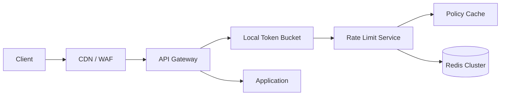
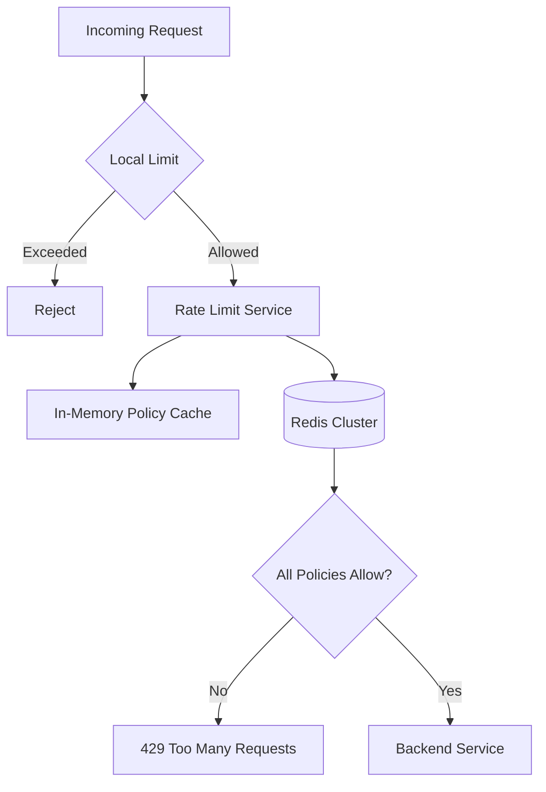
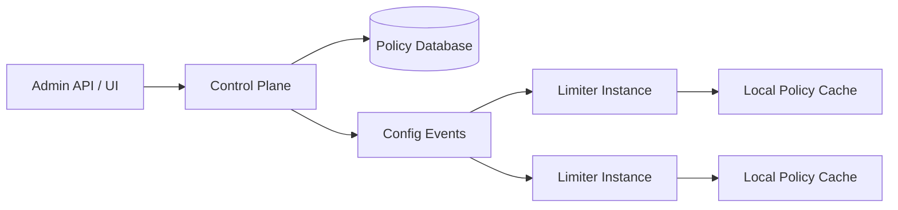
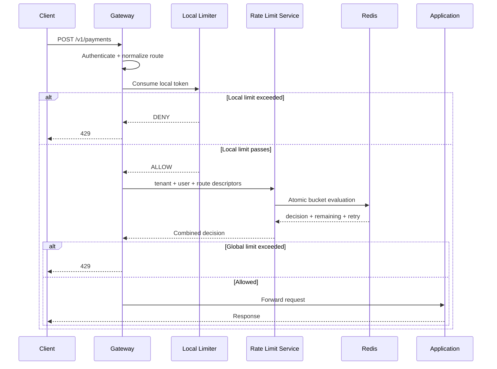
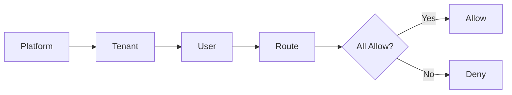
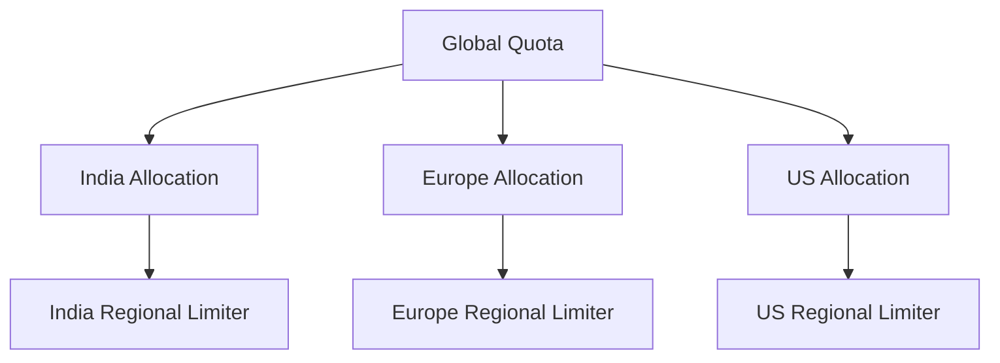

# Design a Distributed Rate Limiter

> Design a low-latency, scalable, and fault-tolerant rate limiter that enforces limits consistently across multiple application instances and regions.

## In Short

A distributed rate limiter is mainly a **shared-state coordination problem**.

If three application instances each keep their own `100 requests/minute` counter, the real system can allow `300 requests/minute`. The important operation is therefore:

```text
check available quota + consume quota
```

It must happen **atomically** against shared state.

A practical production design is:



Use:

- **Local token buckets** for very fast protection against bursts.
- A **stateless rate-limit service** for centralized policy evaluation.
- **Redis Cluster** for shared, short-lived bucket state.
- **Token bucket** as the main algorithm.
- **Atomic Redis execution** for refill + check + consume.
- **Regional enforcement** for low latency.
- **Quota allocation or token leasing** when a global limit spans regions.
- A **policy-specific failure mode** such as fail-open, fail-closed, or local fallback.

---

# 1. Problem Statement

A rate limiter controls how frequently a client can perform an operation.

Common examples:

```text
User                 100 requests/minute
API key              20 requests/second
Login IP             5 attempts/10 minutes
Tenant               5,000 requests/second
AI generation        100,000 token-units/hour
```

In a single process, an in-memory counter may be enough.

In a distributed system:

```text
Client
  |
Load Balancer
  |
  +------ App A
  +------ App B
  +------ App C
```

each application instance sees only part of the traffic.

The limiter must make these instances behave like **one logical system**.

## 1.1 Core Requirements

The system should support limits by:

- User
- Tenant
- API key
- IP address
- HTTP route and method
- Subscription plan
- Region
- Resource or operation

It should also support:

- Bursts
- Weighted requests
- Runtime policy updates
- `429 Too Many Requests`
- Retry information
- Horizontal scaling
- Multi-region deployments
- Shadow mode before enforcement

---

# 2. Why Distributed Rate Limiting Is Hard

## 2.1 Shared Mutable State

All instances need a shared view of consumed capacity.

```text
Limit = 100/minute

App A allows 100
App B allows 100
App C allows 100

Without shared state:
Actual allowed = 300/minute
```

## 2.2 Atomicity

This is unsafe:

```text
1. Read tokens = 1
2. Request A reads 1
3. Request B reads 1
4. Both consume
5. Two requests are allowed
```

The decision must execute as one atomic operation:

```text
read -> refill -> check -> consume -> save
```

## 2.3 Latency

Rate limiting is on the request path.

A slow limiter makes the complete API slow, so policy lookup should normally be in memory and counter operations should use a low-latency store such as Redis.

## 2.4 Availability

If the limiter cannot reach Redis, the system must already know what to do:

- **Fail open** — allow the request.
- **Fail closed** — reject the request.
- **Local fallback** — temporarily enforce a smaller in-memory limit.

The choice should be made **per policy**, not globally.

## 2.5 Hot Keys

A large tenant or global platform counter can concentrate huge traffic on one Redis key.

Sharding does not help much if nearly all requests hit the same key.

## 2.6 Multi-Region Coordination

A perfectly strict global counter requires cross-region coordination.

That gives stronger accuracy but adds latency and creates a larger failure domain.

---

# 3. Choosing the Algorithm

| Algorithm | State | Burst behavior | Typical use |
|---|---|---|---|
| Fixed window | One counter | Boundary bursts | Simple coarse quotas |
| Sliding window log | Timestamp per request | Accurate | Low-volume security rules |
| Sliding window counter | Small fixed state | Smoother | General API limits |
| **Token bucket** | Tokens + timestamp | **Explicit burst capacity** | **Primary distributed limiter** |
| Leaky bucket | Queue/drain state | Smooth output | Background work shaping |

## 3.1 Why Token Bucket Is the Default

A token bucket has:

- `capacity` — maximum burst size.
- `refill_rate` — sustained permitted rate.
- `tokens` — currently available capacity.
- `last_refill` — when refill was last calculated.

Example:

```text
capacity = 100 tokens
refill   = 10 tokens/second
cost     = 1 token/request
```

The client can immediately burst up to `100` requests, then sustainably send about `10 requests/second`.

Formula:

```text
elapsed  = now - last_refill
tokens   = min(capacity, tokens + elapsed * refill_rate)

if tokens >= cost:
    tokens = tokens - cost
    ALLOW
else:
    DENY
```

It is a strong default because it keeps **constant state per key**, supports bursts, and supports weighted operations.

---

# 4. Recommended Architecture

Use two enforcement layers.

## 4.1 Layer 1 — Local Limiter

Each gateway or proxy keeps a small in-memory token bucket.

Purpose:

- Reject extreme bursts immediately.
- Protect the distributed limiter itself.
- Reduce Redis/network traffic.
- Provide temporary fallback during downstream problems.

It is intentionally **not globally exact**.

## 4.2 Layer 2 — Distributed Limiter

A stateless rate-limit service handles globally meaningful policies.



The rate-limit service should:

1. Receive trusted request descriptors.
2. Match policies from local memory.
3. Build Redis bucket keys.
4. Atomically evaluate the required buckets.
5. Return `ALLOW` or `DENY`.
6. Return remaining quota and retry information.

## 4.3 Control Plane vs Data Plane

Keep policy management separate from request-time decisions.



**Control plane**

- Creates and updates policies.
- Versions configuration.
- Validates rules.
- Supports shadow mode and rollback.

**Data plane**

- Handles request-time decisions.
- Must not query PostgreSQL for every request.
- Uses local compiled policy configuration.

---

# 5. Request Flow



Important request-time steps:

1. Authenticate first.
2. Extract a trusted identity.
3. Normalize dynamic routes.

```text
Wrong key:
GET:/v1/payments/12345

Better key:
GET:/v1/payments/{payment_id}
```

4. Apply local protection.
5. Send all relevant descriptors in **one internal call**.
6. Atomically evaluate shared counters.
7. Forward or reject.

---

# 6. Rate-Limit Keys and Policy Dimensions

A key should represent:

```text
policy + identity
```

Examples:

```text
tenant:tenant-42
user:user-728
api_key:key-abc
tenant:tenant-42:route:POST:/v1/payments
```

A request may need several simultaneous limits:

```text
Platform     200,000 req/s
Tenant         5,000 req/s
API key          500 req/s
Payment route     50 req/s
User              10 req/s
```

The request is allowed only when the required policies have capacity.

## 6.1 Identity Selection

Prefer the strongest trustworthy identity:

```text
Authenticated API key
        ↓
Authenticated user
        ↓
Tenant
        ↓
Trusted client IP
        ↓
Anonymous identifier
```

Do not blindly trust `X-Forwarded-For`. Only accept forwarding information from known proxies/load balancers.

---

# 7. Redis Data Model and Atomic Consumption

## 7.1 Bucket Key

Example:

```text
rl:{tenant-42}:v7:create-payment:user-728
```

Parts:

- `rl` — namespace
- `{tenant-42}` — Redis Cluster hash tag
- `v7` — policy version
- `create-payment` — policy
- `user-728` — identity

Redis Cluster hash tags are useful when several related keys must be placed in the same hash slot for a multi-key atomic operation.

## 7.2 Bucket State

A compact hash can store:

```text
tokens
last_refill_ms
```

Use TTL so inactive buckets disappear automatically.

If a deleted/missing bucket represents a **full bucket**, idle-key cleanup is simple.

## 7.3 Scaled Integers

For predictable arithmetic, represent fractional token rates with scaled integers.

```text
1 logical token = 1,000 microtokens

capacity = 100 tokens
         = 100,000 microtokens

cost = 1 token
     = 1,000 microtokens
```

## 7.4 Atomic Redis Logic

The complete operation should execute inside Redis.

Simplified Lua-style logic:

```lua
local key = KEYS[1]
local capacity = tonumber(ARGV[1])
local refill_per_ms = tonumber(ARGV[2])
local cost = tonumber(ARGV[3])
local ttl_ms = tonumber(ARGV[4])

local t = redis.call("TIME")
local now_ms = tonumber(t[1]) * 1000 + math.floor(tonumber(t[2]) / 1000)

local bucket = redis.call("HMGET", key, "tokens", "last_refill_ms")
local tokens = tonumber(bucket[1])
local last_refill_ms = tonumber(bucket[2])

if tokens == nil then
    tokens = capacity
    last_refill_ms = now_ms
end

local elapsed = math.max(0, now_ms - last_refill_ms)
tokens = math.min(capacity, tokens + elapsed * refill_per_ms)

local allowed = 0
local retry_after_ms = 0

if tokens >= cost then
    tokens = tokens - cost
    allowed = 1
else
    retry_after_ms = math.ceil((cost - tokens) / refill_per_ms)
end

redis.call("HSET", key,
    "tokens", tokens,
    "last_refill_ms", now_ms)

redis.call("PEXPIRE", key, ttl_ms)

return {allowed, tokens, retry_after_ms}
```

Why this matters:

```text
Gateway A ----\
Gateway B ----- Redis atomic operation
Gateway C ----/
```

No gateway performs an application-side:

```text
GET -> decide -> SET
```

race.

### Redis scripting note

Lua `EVAL`/`EVALSHA` remains a valid atomic approach. Redis 7+ also provides **Redis Functions**, which are useful when the server-side logic should be managed and deployed independently from application instances.

---

# 8. Hierarchical and Weighted Limits

## 8.1 Hierarchical Limits



In practice, strict atomicity across keys on different Redis shards is difficult.

Useful approaches:

- Co-locate tenant-related keys using a shared Redis hash tag.
- Accept conservative sequential consumption where exact accounting is unnecessary.
- Avoid distributed transactions for normal API throttling.

## 8.2 Weighted Requests

Different operations can consume different token costs.

```text
GET /accounts                cost = 1
GET /reports                 cost = 5
POST /reports/export         cost = 25
POST /ai/generate            cost = model/token based
```

This is useful when request count alone does not represent resource usage.

---

# 9. Hot Keys and Very High Throughput

A hot key can appear for:

- A platform-wide bucket.
- One very large tenant.
- An abusive API key.
- A common anonymous IP behind NAT.

## 9.1 Local Pre-Limiting

Example:

```text
Platform emergency limit = 1,000,000 req/s
100 gateway instances

Approx local ceiling ≈ 10,000 req/s per gateway
```

This is not exact, but it rejects extreme load before Redis.

## 9.2 Token Leasing

Instead of one Redis operation per request:

```text
Global quota service
        |
        | lease 1,000 tokens
        v
Gateway local bucket
        |
        +--> request
        +--> request
        +--> request
```

The gateway requests another lease when its local allocation becomes low.

Advantages:

- Lower Redis traffic.
- Lower latency.
- Better tolerance of short outages.

Trade-off:

- Small temporary underutilization or overshoot around leases.

Use smaller leases for strict/low-volume policies and larger leases for high-throughput, lower-risk quotas.

---

# 10. Multi-Region Strategy

A strict global request-by-request counter is usually expensive.

Recommended model:



Example:

```text
Global tenant limit = 10,000 req/s

India  = 4,000
Europe = 3,000
US     = 3,000
```

A control loop can rebalance allocations as demand changes.

## 10.1 Consistency Choices

| Requirement | Preferred approach |
|---|---|
| Per-user abuse control | Strong regional limit |
| Tenant API quota | Regional or tenant home-region |
| Platform overload protection | Approximate local + regional |
| Cross-region quota | Regional allocations / leasing |
| Monthly billing quota | Durable metering, not only rate limiting |

### Important trade-off

```text
More global accuracy
        ↑
More coordination
        ↑
Higher latency + larger failure domain
```

For normal APIs, prefer **strong regional enforcement** plus **approximate or leased global quotas**.

---

# 11. Failure Handling

Use a policy-specific fallback.

| Failure | Typical behavior |
|---|---|
| Limiter instance unavailable | Try another healthy instance within deadline |
| Redis timeout | Apply configured fallback |
| Redis failover | Short local fallback |
| Config event bus unavailable | Continue with last-known-good config |
| Control plane unavailable | Data plane continues |
| Region partition | Enforce regional allocation |
| Metrics backend unavailable | Continue serving decisions |

## 11.1 Fail Open

Allow traffic if the distributed limiter fails.

Good for:

- Low-risk reads.
- Availability-first endpoints.

Risk: overload or abuse may continue.

## 11.2 Fail Closed

Reject traffic when rate-limit state cannot be checked.

Good for:

- Login attempts.
- Password reset.
- Expensive compute.
- Strict isolation controls.

Risk: limiter failure can become an application outage.

## 11.3 Local Fallback

Often the most practical option:

```text
Normal shared limit = 1,000 req/s

Redis unavailable:
Local gateway limit = 30 req/s
Fallback window     = short
```

Also use circuit breakers so gateways do not continuously flood an unhealthy Redis dependency.

---

# 12. HTTP Response Semantics

When an API limit is exceeded, the gateway normally returns:

```http
HTTP/1.1 429 Too Many Requests
Retry-After: 1
Cache-Control: no-store
Content-Type: application/problem+json
```

Example body:

```json
{
  "type": "https://api.example.com/problems/rate-limit-exceeded",
  "title": "Rate limit exceeded",
  "status": 429,
  "policy_id": "create-payment",
  "retry_after_ms": 40,
  "request_id": "req-6da3"
}
```

`Retry-After` can use an HTTP date or a non-negative integer number of seconds. If the internal limiter calculates a sub-second retry, return the exact value separately, such as `retry_after_ms`.

### RateLimit headers

As of **20 August 2026**, `RateLimit` and `RateLimit-Policy` are defined by the active IETF Internet-Draft `draft-ietf-httpapi-ratelimit-headers-11` published on **23 May 2026**.

Treat these fields as **emerging standardization work**, not as a finalized RFC yet.

---

# 13. Security and Abuse Resistance

Important protections:

- Construct descriptors only from trusted gateway/authentication data.
- Never let clients directly choose their plan or tenant rate-limit identity.
- Trust forwarded IP headers only from controlled proxies.
- Limit descriptor count and value length.
- Normalize IPv6 addresses.
- Hash sensitive/high-cardinality identifiers where appropriate.
- Apply TTL to transient keys.
- Avoid logging raw API keys.
- Use mTLS or equivalent service authentication between gateway and limiter.
- Combine application rate limiting with CDN/DDoS/WAF controls.

Rate limiting is not a complete DDoS solution.

A common protection chain is:

```text
CDN
  ↓
DDoS Protection
  ↓
WAF
  ↓
Load Balancer / Gateway
  ↓
Application Rate Limiter
  ↓
Backend
```

---

# 14. Observability and Capacity

## 14.1 Important Metrics

```text
rate_limit_requests_total
rate_limit_allowed_total
rate_limit_denied_total
rate_limit_errors_total
rate_limit_shadow_denied_total

rate_limit_decision_latency_ms
redis_operation_latency_ms

redis_cpu
redis_memory
redis_evictions
redis_failovers
redis_connection_count

active_policy_version
configuration_age_seconds
```

Track latency at least at:

- p50
- p95
- p99

Avoid raw user IDs or API keys as metric labels because they create very high cardinality.

## 14.2 Capacity Planning

Capacity planning should consider:

```text
incoming requests/second
× policies checked per request
× Redis operations per decision
```

Example:

```text
1,000,000 requests/s
× 3 policies
= up to 3,000,000 bucket evaluations/s
```

Reduce that load using:

- Batched policy evaluation.
- Atomic multi-key operations when colocated.
- Local pre-limits.
- Token leasing for extremely hot policies.
- Local policy caching.

Benchmark the actual Redis script/function, key sizes, network, hardware, and failover behavior rather than relying only on theoretical command throughput.

---

# 15. Testing and Safe Rollout

Test the algorithm and the distributed behavior.

## 15.1 Core Tests

- Initial full bucket.
- Refill calculation.
- Exact `tokens == cost` boundary.
- Weighted request cost.
- Clock moving backwards.
- TTL expiration.
- Concurrent requests against one key.
- Redis failover.
- One hot key.
- Millions of distinct identities.
- Policy update under load.
- Network timeout.
- Regional failure.

Concurrency test expectation:

```text
available tokens = 100
1,000 simultaneous requests

Allowed <= 100
Tokens never negative
```

## 15.2 Shadow Mode

Roll out new policies as:

```text
DRAFT -> SHADOW -> ENFORCED -> DISABLED
```

In shadow mode:

```text
Calculated decision = DENY
Actual gateway action = ALLOW
Metric = shadow_denied_total + 1
```

This helps detect overly strict rules before they affect real users.

---

# 16. End-to-End Example

Consider:

```http
POST /v1/payments
Authorization: Bearer <token>
Idempotency-Key: pay-req-938
```

Authenticated claims:

```json
{
  "tenant_id": "tenant-42",
  "user_id": "user-728",
  "plan": "pro"
}
```

Policies:

```yaml
- id: tenant-pro
  capacity: 5000
  refill_per_second: 2500
  cost: 1

- id: create-payment
  capacity: 100
  refill_per_second: 50
  cost: 5

- id: user-default
  capacity: 120
  refill_per_second: 2
  cost: 1
```

Evaluation:

```text
tenant-pro
available = 4820
cost      = 1
result    = ALLOW

create-payment
available = 3
cost      = 5
result    = DENY
retry     = 40 ms
```

Gateway response:

```http
HTTP/1.1 429 Too Many Requests
Retry-After: 1
Cache-Control: no-store
Content-Type: application/problem+json
```

```json
{
  "title": "Rate limit exceeded",
  "status": 429,
  "policy_id": "create-payment",
  "retry_after_ms": 40
}
```

Rate limiting and idempotency solve different problems:

```text
Rate limiting -> How often may the operation be attempted?
Idempotency   -> Can the same logical operation execute twice?
```

A retried payment can consume rate-limit capacity while the idempotency layer prevents duplicate payment creation.

---

# 17. Trade-Off Summary

| Design decision | Recommended choice | Why |
|---|---|---|
| Main algorithm | Token bucket | Burst + sustained rate |
| Shared store | Redis Cluster | Low latency + atomic server-side logic |
| Local protection | In-memory token bucket | Fast overload protection |
| Rate-limit service | Stateless | Easy horizontal scaling |
| Policy config | Durable DB + local cache | Fast data plane + auditable control plane |
| Atomicity | Redis script/function | Prevent double-spend races |
| Related multi-key limits | Redis hash tags when useful | Same cluster slot |
| Multi-region | Regional enforcement | Low latency and resilience |
| Global limits | Allocation or leasing | Avoid per-request cross-region calls |
| Failure mode | Per policy | Risk differs by endpoint |
| Rollout | Shadow first | Safer changes |
| HTTP rejection | `429` + `Retry-After` | Standard HTTP behavior |

---

# Final Takeaway

The important interview point is not simply **"use Redis"**.

A strong distributed rate-limiter design explains:

```text
1. Where the shared counters live.
2. How check-and-consume stays atomic.
3. Why token bucket is suitable.
4. How the system protects itself with local limits.
5. What happens when Redis fails.
6. How hot keys are handled.
7. How policies are updated without a database call per request.
8. How multi-region quotas avoid synchronous global coordination.
```

The practical architecture is:

```text
Local protection
      +
Strong regional enforcement
      +
Approximate / leased global quota
```

That combination gives the system low latency, scalable throughput, controlled bursts, and understandable failure behavior without turning the limiter into a global single point of failure.

---

# References

1. Redis — Rate Limiter Use Case  
   https://redis.io/docs/latest/develop/use-cases/rate-limiter/

2. Redis — Token Bucket with redis-py and Lua  
   https://redis.io/docs/latest/develop/use-cases/rate-limiter/redis-py/

3. Redis — Scripting with Lua  
   https://redis.io/docs/latest/develop/programmability/eval-intro/

4. Redis — Programmability and Redis Functions  
   https://redis.io/docs/latest/develop/interact/programmability/

5. Redis — TIME Command  
   https://redis.io/docs/latest/commands/time/

6. Redis — Cluster Specification and Hash Tags  
   https://redis.io/docs/latest/operate/oss_and_stack/reference/cluster-spec/

7. Envoy — Global Rate Limiting  
   https://www.envoyproxy.io/docs/envoy/latest/intro/arch_overview/other_features/global_rate_limiting

8. Envoy — Local Rate Limiting  
   https://www.envoyproxy.io/docs/envoy/latest/intro/arch_overview/other_features/local_rate_limiting

9. RFC 6585 — HTTP 429 Too Many Requests  
   https://www.rfc-editor.org/rfc/rfc6585.html

10. RFC 9110 — HTTP Semantics / Retry-After  
    https://www.rfc-editor.org/rfc/rfc9110.html

11. IETF Internet-Draft — RateLimit Header Fields for HTTP, revision 11  
    https://datatracker.ietf.org/doc/draft-ietf-httpapi-ratelimit-headers/
