# Scaling WebSockets

> **Category:** System Design  
> **Audience:** Backend developers with 3+ years of experience  
> **Goal:** Understand how to design, scale, deploy, and operate a production WebSocket system  
> **Last reviewed:** August 3, 2026

---

# 1. What WebSockets Solve

Traditional HTTP is mainly request-response based:

```text
Client ──request──> Server
Client <─response── Server
```

The server normally sends data only after the client requests it. This works well for normal APIs, but it is inefficient for applications that need continuous real-time updates.

Examples include:

- Chat and messaging
- Live notifications
- Trading price updates
- Multiplayer games
- Collaborative document editing
- Delivery or vehicle tracking
- Live dashboards
- Customer-support agent consoles

A WebSocket creates a long-lived, full-duplex connection:

```text
             Persistent connection
Client <==============================> Server
        Client and server can send data
              at any point in time
```

After the initial HTTP upgrade handshake, both sides exchange WebSocket frames over the same connection.

## 1.1 When WebSockets are appropriate

Use WebSockets when the application needs:

- Low-latency server-to-client updates
- Frequent bidirectional communication
- A long-lived interactive session
- Lower per-message overhead than repeated HTTP requests

## 1.2 When another approach may be simpler

| Requirement | Suitable option |
|---|---|
| Occasional server updates | Polling or long polling |
| One-way server stream | Server-Sent Events (SSE) |
| Bidirectional real-time communication | WebSockets |
| Unreliable low-latency media | WebRTC or UDP-based transport |
| Internal service streaming | gRPC streaming, Kafka, or another messaging system |

WebSockets are a transport. They do not automatically provide durable delivery, replay, authorization rules, rooms, presence, or exactly-once processing. The application must design these features.

---

# 2. How a WebSocket Connection Works

## 2.1 Opening handshake

The client first sends an HTTP request containing an upgrade request:

```http
GET /ws HTTP/1.1
Host: realtime.example.com
Upgrade: websocket
Connection: Upgrade
Sec-WebSocket-Key: <random-value>
Sec-WebSocket-Version: 13
```

A successful server response uses status code `101 Switching Protocols`:

```http
HTTP/1.1 101 Switching Protocols
Upgrade: websocket
Connection: Upgrade
Sec-WebSocket-Accept: <calculated-value>
```

The connection then becomes a WebSocket tunnel.

## 2.2 Connection lifecycle

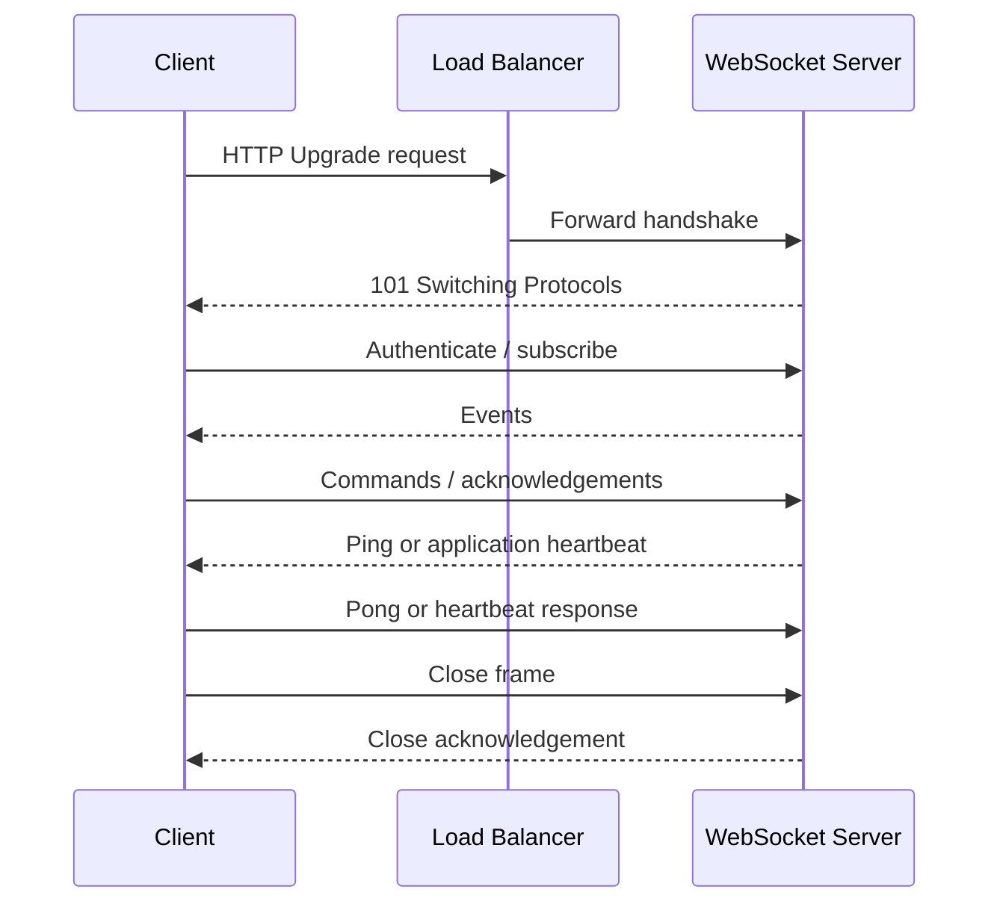

## 2.3 Important connection characteristics

A WebSocket connection is:

- **Long-lived:** It may remain open for minutes, hours, or days.
- **Stateful at the network level:** The accepted TCP connection belongs to one server process.
- **Bidirectional:** Either endpoint can send data.
- **Ordered per TCP connection:** Bytes are received in order on a healthy connection.
- **Not durable:** Messages are not automatically stored for disconnected clients.

---

# 3. Why WebSockets Are Harder to Scale

Normal HTTP servers can be almost completely stateless. Any request can usually be handled by any healthy server.

WebSocket servers hold active network connections in memory:

```text
Server A
├── Connection: user-101
├── Connection: user-205
└── Connection: user-311

Server B
├── Connection: user-410
└── Connection: user-512
```

If an event for `user-512` arrives at Server A, Server A cannot directly write to that user's socket because the connection exists on Server B.

This creates several scaling challenges:

1. Distributing long-lived connections across servers
2. Locating the node that owns a connection
3. Broadcasting events across nodes
4. Handling node failures and reconnect storms
5. Deploying without abruptly dropping every connection
6. Protecting servers from slow clients and unbounded buffers
7. Scaling based on connection pressure instead of CPU alone
8. Preserving delivery and ordering requirements

The key principle is:

> WebSocket nodes own live connections, but durable business state should live outside those nodes.

---

# 4. Requirements and Capacity Estimation

Before drawing the architecture, separate **functional requirements** from **scale and reliability requirements**.

## 4.1 Functional requirements

Example requirements for a chat or notification system:

- A client can establish an authenticated connection.
- A user can have multiple devices or browser tabs.
- A client can subscribe to rooms or topics.
- The server can send an event to one user, one room, or all users.
- A client can reconnect and recover missed important events.
- Presence can show whether a user is online.

## 4.2 Non-functional requirements

- Maximum concurrent connections
- Peak new connections per second
- Average messages per second
- Peak messages per second
- Average message size
- Broadcast fan-out size
- Delivery guarantee
- Ordering requirement
- Maximum acceptable end-to-end latency
- Availability target
- Regions and data-residency constraints

## 4.3 Core estimation formulas

### Concurrent connections

```text
concurrent_connections
    = active_users × average_connections_per_user
```

Example:

```text
500,000 active users × 1.4 connections per user
= 700,000 concurrent connections
```

A user may have multiple connections because of multiple devices, tabs, or application processes.

### Incoming message rate

```text
incoming_messages_per_second
    = concurrent_connections × average_messages_per_connection_per_second
```

Example:

```text
700,000 × 0.02 messages/second
= 14,000 incoming messages/second
```

### Outgoing delivery rate

Fan-out often dominates system cost:

```text
outgoing_deliveries_per_second
    = published_events_per_second × average_recipients_per_event
```

Example:

```text
5,000 events/second × 40 recipients
= 200,000 socket deliveries/second
```

### Network egress

```text
network_egress_per_second
    = outgoing_deliveries_per_second × average_encoded_message_size
```

For 200,000 deliveries/second and a 600-byte encoded message:

```text
200,000 × 600 bytes
= 120 MB/second before transport overhead
```

### Connection memory

```text
connection_memory
    = active_connections × estimated_memory_per_connection
```

Do not assume a universal memory value. Measure your runtime, framework, TLS termination model, subscriptions, authentication context, and send buffers with load tests.

## 4.4 Capacity dimensions that matter

A WebSocket server can hit a limit in any of these dimensions:

- File descriptors
- Memory per connection
- CPU for serialization, encryption, compression, and application logic
- Network bandwidth
- Event-loop delay or worker-thread saturation
- Outbound socket-buffer growth
- Broker subscription or fan-out throughput
- New handshakes per second

CPU utilization alone is therefore an incomplete scaling signal.

---

# 5. Single-Server Design

A basic design places all WebSocket connections in one server process.

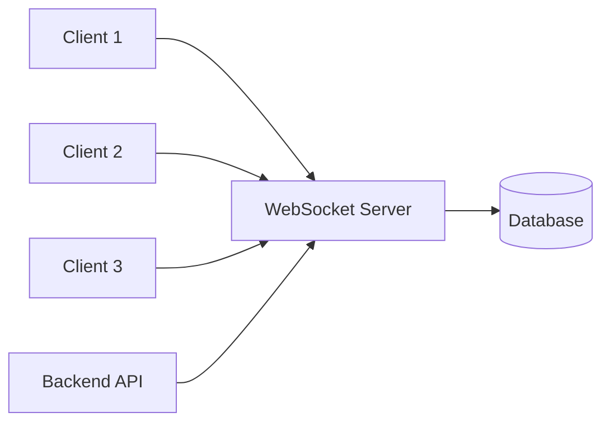

The server may maintain an in-memory map:

```text
user_id -> set of active sockets
```

Example:

```python
connections = {
    "user-42": {socket_a, socket_b},
    "user-81": {socket_c},
}
```

## 5.1 Advantages

- Simple routing
- Simple broadcasts
- No distributed connection lookup
- Low latency
- Easy local development

## 5.2 Limitations

- One machine limits capacity.
- A process restart disconnects every client.
- The server is a single point of failure.
- Vertical scaling eventually becomes expensive.
- Deployments create large connection drops.

This design is acceptable for a prototype or small internal application, but not for a high-availability system.

---

# 6. Horizontally Scaled Architecture

The normal production design uses multiple WebSocket nodes behind a load balancer.

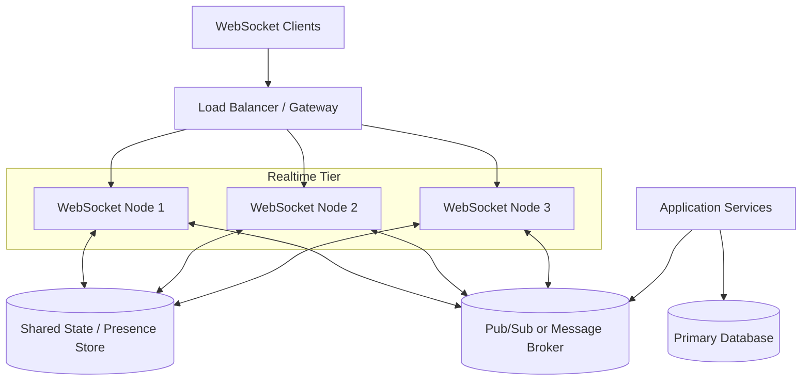

Each node owns only its local sockets:

```text
Node 1: user-10, user-11, user-20
Node 2: user-13, user-21
Node 3: user-15, user-30, user-35
```

A shared messaging layer allows events to reach the correct node.

## 6.1 Responsibilities of each component

### Load balancer

- Accepts public connections
- Terminates TLS, depending on the architecture
- Forwards the WebSocket upgrade
- Distributes new connections
- Stops routing new connections to draining or unhealthy nodes

### WebSocket node

- Authenticates a connection
- Maintains local socket objects
- Tracks local subscriptions
- Validates inbound messages
- Delivers outbound messages
- Sends heartbeats
- Applies per-connection backpressure

### Message broker

- Distributes events between application services and WebSocket nodes
- Enables cross-node broadcasts
- May provide durability, replay, and consumer groups depending on technology

### Shared state store

- Stores presence or routing metadata when required
- Stores short-lived connection leases
- Supports rate limiting or subscription metadata

### Durable database

- Stores business data
- Stores message history when the use case requires it
- Must not be replaced by the in-memory WebSocket connection map

---

# 7. Load Balancing and Connection Affinity

## 7.1 What happens after connection establishment

A raw WebSocket uses one persistent TCP connection. Once the load balancer routes and establishes that connection with a backend, all frames on that connection continue to use the same backend.

Therefore, an already-established raw WebSocket connection does not jump between servers.

## 7.2 Are sticky sessions required?

The correct answer depends on the protocol and framework.

### Raw WebSocket only

Sticky sessions are usually not required for frames on the existing connection because the connection is already attached to one backend.

However, after a disconnect, the reconnect may land on another node. Any state required after reconnect must therefore be reconstructable from shared storage or the client.

### Socket.IO with HTTP long-polling fallback

Socket.IO can begin or fall back to multiple HTTP long-polling requests. Those requests may need to reach the same server that owns the session. In that configuration, session affinity is generally required.

### Socket.IO using WebSocket-only transport

With only one persistent WebSocket transport, repeated polling requests do not exist, so the session-affinity requirement is reduced. Cross-node messaging is still necessary for room broadcasts and user routing.

## 7.3 Load-balancing algorithms

### Round robin

Each new connection goes to the next server.

```text
Connection 1 -> Node A
Connection 2 -> Node B
Connection 3 -> Node C
Connection 4 -> Node A
```

This is simple but may become unbalanced because WebSocket connections have different lifetimes and traffic levels.

### Least connections

New connections go to the server with the fewest active connections.

This is usually a better starting point for long-lived connections.

### Weighted least connections

Useful when nodes have different CPU or memory capacities.

### Hash-based routing

A key such as user ID, tenant ID, cookie, or source IP selects the backend.

Benefits:

- Can improve locality
- Can simplify some routing patterns

Limitations:

- Large tenants or active users can create hot nodes.
- IP-based hashing behaves poorly when many clients share a NAT gateway.
- Rebalancing can move many users when nodes change unless consistent hashing is used.

## 7.4 Load balancer requirements

The chosen load balancer must correctly support:

- HTTP upgrade headers
- Long-lived connections
- Configurable idle timeout
- Health checks
- Connection draining
- Sufficient concurrent connections
- TLS and certificate management
- Observability for upgrade failures and connection counts

The proxy timeout should be longer than the expected heartbeat interval. Otherwise, a healthy but temporarily quiet connection can be closed by infrastructure.

---

# 8. Connection Registry and Presence

A scaled system needs to answer questions such as:

- Is the user online?
- How many devices does the user have?
- Which node owns the user's active connections?
- Which rooms are currently represented on a node?

These are related but different concerns.

## 8.1 Local connection registry

Every node should maintain a fast in-memory structure for sockets it directly owns:

```text
user_id -> connection IDs
connection_id -> socket and metadata
room_id -> local connection IDs
```

Example:

```text
user-42 -> [conn-a, conn-b]
conn-a  -> {socket, device=mobile, rooms=[orders, support]}
room-orders -> [conn-a, conn-f, conn-g]
```

Local routing must not require a database lookup for every outgoing message.

## 8.2 Global connection registry

A shared store can maintain short-lived routing metadata:

```text
user:{user_id}:connections
    -> [{connection_id, node_id, expires_at}]
```

Example:

```text
user:42:connections
    -> conn-a on node-1
    -> conn-b on node-3
```

The records should use leases or TTLs because nodes can crash without executing cleanup code.

## 8.3 Presence is usually eventually consistent

A user can disappear because:

- The client closes cleanly.
- The mobile app loses network access.
- A laptop sleeps.
- A node crashes.
- A NAT mapping expires.
- A proxy closes an idle connection.

A robust presence design combines:

1. Local connection state
2. Heartbeat timestamps
3. Short-lived leases or TTLs
4. Cleanup on normal disconnect
5. Expiry after abnormal disconnect

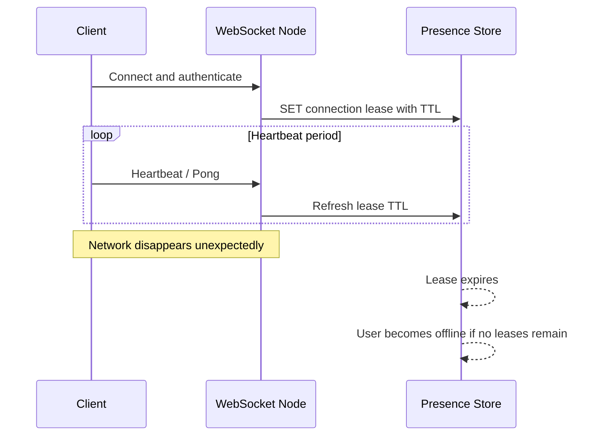

## 8.4 Avoid using presence as strong business truth

Presence is useful for user experience, but it should not usually decide irreversible business operations. A user shown as online may have disconnected milliseconds ago.

---

# 9. Cross-Node Message Delivery

Suppose `user-99` is connected to Node 3, but an order service publishes an update through Node 1 or an internal API.

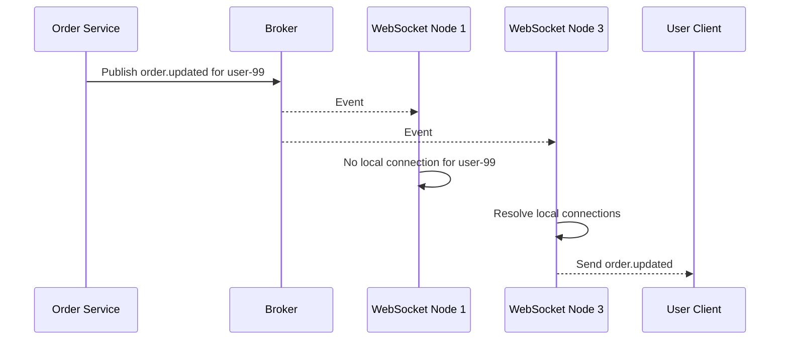

There are several routing models.

## 9.1 Broadcast-to-all-nodes model

Every WebSocket node subscribes to the same event channel. Each node receives the event and checks whether it has matching local sockets.

### Advantages

- Simple design
- Easy to implement with Redis Pub/Sub
- Good for a small or medium number of nodes

### Limitations

- Every event reaches every node.
- Broker and node work grows with cluster size.
- Inefficient when most events target one user.

Approximate internal work:

```text
published_events × number_of_websocket_nodes
```

## 9.2 Node-targeted routing model

The sender or router looks up which nodes own the target user's connections and publishes only to those node channels.

```text
1. Lookup user-99 -> node-3
2. Publish event to websocket-node:3
3. Node 3 sends to local connections
```

### Advantages

- Less unnecessary broker traffic
- Better for large clusters and mostly one-to-one messaging

### Limitations

- Requires an accurate global connection registry.
- Node crashes can leave stale routing records.
- User-to-node lookup adds complexity and latency.

## 9.3 Topic-partitioned routing model

Rooms, tenants, symbols, games, or geographic cells are assigned to partitions.

```text
tenant-1 events -> partition 4
room-abc events -> partition 12
stock-NSE-TCS events -> partition 21
```

WebSocket nodes subscribe only to partitions needed by their local clients.

This reduces unnecessary fan-out but requires subscription coordination.

## 9.4 Dedicated gateway-router model

A routing service consumes application events, resolves connection locations, and forwards targeted events to WebSocket nodes.

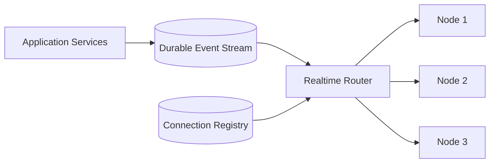

This model creates a clean separation:

- Application services publish business events.
- The router decides where real-time deliveries should go.
- WebSocket nodes focus on connections and transport.

It is useful at high scale but introduces another service to operate.

---

# 10. Rooms, Channels, and Topic Routing

A room is a logical group of connections.

Examples:

```text
user:42
order:9831
team:engineering
tenant:acme
match:football-202
stock:NSE:TCS
```

## 10.1 Local room membership

Each node maintains the subset of room members connected to that node:

```text
Node A
room:team-7 -> conn-1, conn-2

Node B
room:team-7 -> conn-8
```

A room broadcast must reach both nodes.

## 10.2 Room broadcast flow

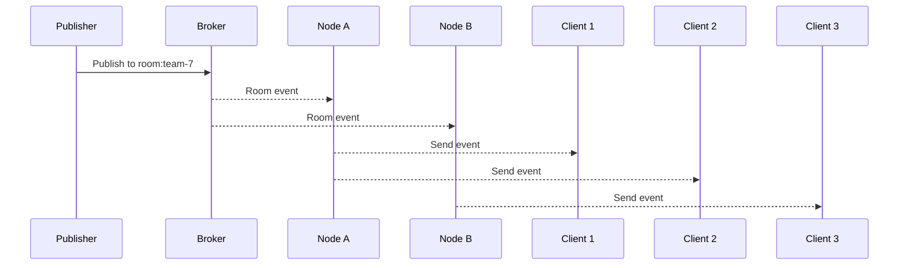

## 10.3 Subscription strategies

### One broker topic per room

Simple conceptually, but millions of dynamic rooms may create operational overhead depending on the broker.

### Shared topic plus room ID in payload

Every node receives more messages and filters locally.

### Partitioned topics

Map many rooms to a fixed number of partitions:

```text
partition = hash(room_id) mod partition_count
```

This is easier to operate at large scale, but hot rooms can create hot partitions.

### Node-specific topics

A router determines which nodes contain room members and publishes to those nodes.

This reduces waste but requires room-to-node membership tracking.

## 10.4 Large-room fan-out

A room with one million subscribers is not equivalent to one million independent one-to-one events.

For very large broadcasts:

- Encode the payload once and reuse the encoded bytes.
- Avoid repeatedly querying user data for each receiver.
- Batch socket writes where the runtime supports it.
- Partition recipients across many nodes.
- Use bounded queues.
- Consider dropping or coalescing replaceable updates.
- Protect the system from one hot topic consuming all capacity.

A stock-price update may replace the previous price update. A financial transaction confirmation must not be silently replaced.

---

# 11. Delivery Guarantees, Ordering, and Deduplication

WebSocket transport does not automatically guarantee application-level delivery after failures.

## 11.1 Common delivery levels

### Best effort

The server sends the event once. If the client is disconnected, the event is lost.

Suitable for:

- Typing indicators
- Cursor positions
- Live counters
- Frequently refreshed telemetry

### At-most-once

An event is delivered zero or one time. No retries are made after uncertain delivery.

Redis Pub/Sub is commonly used in this style: active subscribers receive messages, but disconnected subscribers do not replay missed messages.

### At-least-once

Events may be retried until acknowledged, so duplicates are possible.

The consumer must be idempotent.

Suitable for:

- Important notifications
- Workflow updates
- Message delivery systems

### Exactly-once effect

End-to-end exactly-once transport is difficult. A more practical design is:

```text
at-least-once delivery
+ stable event ID
+ idempotent processing
+ deduplication
= exactly-once business effect
```

## 11.2 Application acknowledgement

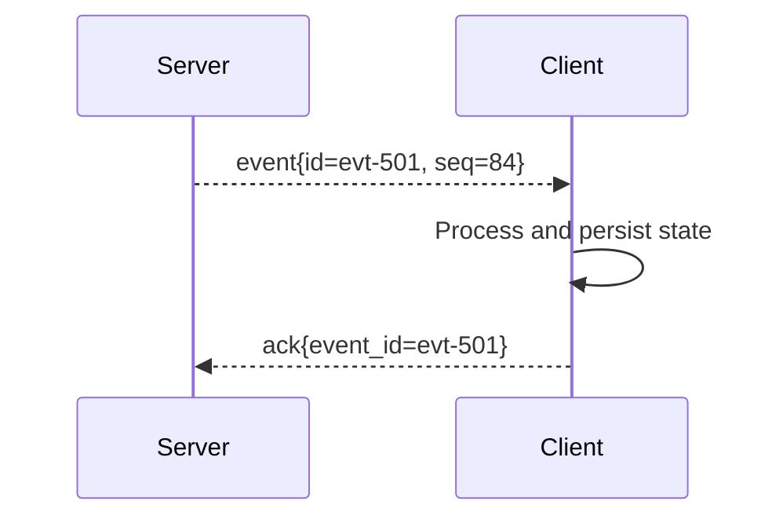

The server or durable message service can retry when an acknowledgement is not received within a defined period.

## 11.3 Reconnection and replay

The client can remember the last processed sequence number:

```text
last_processed_sequence = 8421
```

After reconnecting:

```json
{
  "type": "resume",
  "stream": "user:42",
  "after_sequence": 8421
}
```

The server reads durable events after sequence `8421` and sends them again.

This requires event storage such as:

- Database message table
- Redis Streams
- Kafka
- Cloud-managed durable queue or stream

## 11.4 Ordering

TCP preserves byte order on one connection. Distributed ordering is a different problem.

Events may be produced by different services, partitions, or regions:

```text
Event A produced at Service 1
Event B produced at Service 2
```

There may be no meaningful global order.

Use the narrowest ordering scope needed:

- Per connection
- Per user
- Per conversation
- Per order
- Per room
- Per aggregate ID

A partition key can preserve ordering for that scope:

```text
partition_key = conversation_id
```

## 11.5 Deduplication

Every important event should have a stable ID:

```json
{
  "event_id": "01JXYZ...",
  "type": "payment.updated",
  "aggregate_id": "payment-824",
  "sequence": 17,
  "occurred_at": "2026-08-03T06:20:00Z",
  "payload": {}
}
```

The client or server can store a bounded set of recently processed event IDs.

---

# 12. Backpressure and Slow Consumers

Backpressure occurs when messages are produced faster than a connection can send them.

```text
Producer rate: 1,000 messages/second
Client network capacity: 100 messages/second
Queue growth: 900 messages/second
```

Without protection, memory grows until the node becomes unstable.

## 12.1 Why clients become slow

- Poor mobile network
- Backgrounded browser tab
- Device under heavy CPU load
- Large payloads
- Server-side fan-out spike
- Network congestion
- Client code not reading quickly enough

## 12.2 Bounded outbound queues

Every connection should have a maximum queue size by count or bytes.

```text
max_pending_messages = 500
max_pending_bytes = 2 MB
```

When a limit is reached, select a policy based on event importance.

## 12.3 Backpressure policies

### Drop newest

Reject the latest event.

Useful only when older queued events remain valuable.

### Drop oldest

Remove older replaceable events and keep newer state.

Useful for live location, metrics, cursor position, or price snapshots.

### Coalesce

Keep only the latest event for a key:

```text
location:driver-42 -> latest location only
stock:TCS -> latest price only
```

### Disconnect slow client

Close the connection with an application-specific reason and allow the client to reconnect and resynchronize.

### Persist for later replay

Use this for important events that must not be lost.

## 12.4 Event priority

Separate critical and replaceable messages:

```text
Priority 1: security/session revocation
Priority 2: transaction state
Priority 3: normal notifications
Priority 4: typing/cursor/live telemetry
```

Do not allow a large stream of low-priority telemetry to block a security or transaction event.

## 12.5 Compression trade-off

WebSocket compression can reduce bandwidth, but it consumes CPU and memory and can increase tail latency. Enable it only after measuring realistic payloads and concurrency.

Small messages may not benefit enough to justify the cost.

---

# 13. Heartbeats, Timeouts, and Reconnection

Long-lived connections can become half-open: one side believes the connection exists while the network path has disappeared.

## 13.1 Heartbeat purpose

Heartbeats help:

- Detect dead clients
- Keep NAT and proxy mappings active
- Refresh presence leases
- Measure round-trip latency
- Trigger reconnection sooner

WebSocket defines Ping and Pong control frames, but some browser-level APIs expose only application messages. Many systems therefore implement an application heartbeat.

Example:

```json
{ "type": "heartbeat", "timestamp": 1785738000 }
```

## 13.2 Timeout relationship

A useful relationship is:

```text
load_balancer_idle_timeout
    > heartbeat_interval + heartbeat_timeout + safety_margin
```

Example:

```text
heartbeat interval: 25 seconds
heartbeat timeout: 15 seconds
proxy idle timeout: 60+ seconds
```

The exact values should reflect mobile networks, expected latency, infrastructure defaults, and acceptable detection time.

## 13.3 Client reconnection

Clients should reconnect with exponential backoff and jitter:

```text
1s, 2s, 4s, 8s, 16s, ... up to a maximum
```

With jitter:

```text
actual_delay = random(0, min(cap, base × 2^attempt))
```

Jitter prevents thousands of clients from reconnecting at the same moment.

## 13.4 Reconnection state machine

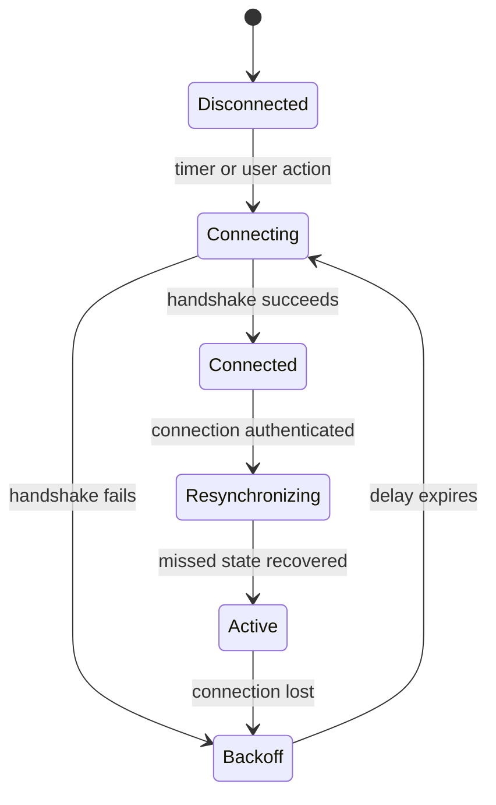

## 13.5 Resume protocol

After reconnecting, the client should not assume it received every event.

A reconnect flow may include:

1. Re-authenticate.
2. Rejoin rooms.
3. Send last processed sequence or version.
4. Replay missed important events.
5. Refresh the current snapshot.
6. Continue live delivery.

---

# 14. Autoscaling WebSocket Servers

HTTP services often scale on CPU or request rate. WebSocket services require additional signals.

## 14.1 Useful scaling metrics

- Active connections per node
- New connections per second
- Handshake failure rate
- Messages received per second
- Messages sent per second
- Network bytes sent per second
- Pending outbound bytes
- Event-loop lag
- CPU and memory
- Broker-consumer lag
- Serialization latency
- P95/P99 message-delivery latency

## 14.2 Connection-based scaling

A simple target:

```text
desired_nodes
    = ceil(total_connections / target_connections_per_node)
```

Example:

```text
700,000 connections / 40,000 target connections per node
= 17.5 -> 18 nodes
```

Add headroom for failures and traffic spikes:

```text
18 nodes × 1.3 headroom = 23.4 -> 24 nodes
```

The target must come from load testing, not from a generic benchmark.

## 14.3 Why scaling out is slow

Adding a new node does not automatically move existing connections. It receives only new connections unless clients reconnect or the system deliberately rebalances them.

```text
Before scale-out:
Node A: 50k
Node B: 50k

Add Node C:
Node A: 50k
Node B: 50k
Node C: 0
```

New connections gradually fill Node C. Therefore, WebSocket capacity must be provisioned earlier than short-lived HTTP capacity.

## 14.4 Predictive and scheduled scaling

Use scheduled scaling when traffic follows a known pattern:

- Market open
- Live sports event
- Product launch
- Daily business peak
- Online class start

## 14.5 Scale-in requires draining

Do not immediately terminate a node selected for scale-in.

Correct flow:

1. Mark node as draining.
2. Stop accepting new connections.
3. Keep existing connections temporarily.
4. Ask clients to reconnect when supported.
5. Wait for natural disconnects or a deadline.
6. Close remaining connections gracefully.
7. Terminate the node.

---

# 15. Graceful Deployment and Connection Draining

A normal rolling deployment can still disconnect WebSocket clients because old pods contain long-lived connections.

## 15.1 Deployment flow

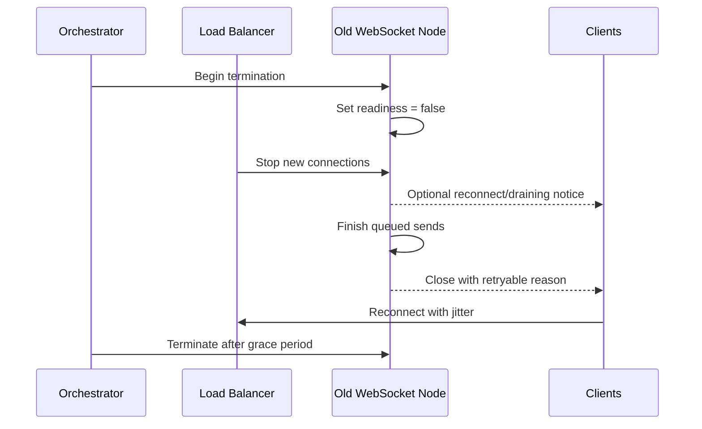

## 15.2 Graceful shutdown sequence

On `SIGTERM`:

1. Mark the process as not ready.
2. Stop accepting new WebSocket upgrades.
3. Unsubscribe from new work or stop claiming new durable events.
4. Continue servicing existing sockets.
5. Send a draining notification when the client protocol supports it.
6. Wait for a bounded drain period.
7. Close remaining sockets using an appropriate close code and reason.
8. Flush metrics and logs.
9. Exit before the orchestrator sends `SIGKILL`.

## 15.3 Kubernetes considerations

Use:

- A readiness probe that fails when draining begins
- A sufficient `terminationGracePeriodSeconds`
- A `preStop` hook only when it adds value
- A rolling-update strategy with enough surge capacity
- A PodDisruptionBudget for planned disruptions
- Load balancer deregistration delay aligned with application drain behavior

Kubernetes removes terminating endpoints from normal service traffic, but an application still needs to finish or deliberately close existing long-lived connections within the grace period.

## 15.4 Connection migration

TCP connections cannot be normally moved from one application process to another. “Migration” usually means:

1. Tell the client to reconnect.
2. Client reconnects to another node.
3. Client re-authenticates and resynchronizes.

Design the client reconnect path as a normal operating path, not as an exceptional one.

---

# 16. Failure Scenarios and Recovery

## 16.1 WebSocket node crash

Impact:

- All sockets on that node disconnect.
- Local connection state disappears.
- Shared routing entries may become stale.

Recovery:

- Clients reconnect with backoff and jitter.
- TTL-based connection leases expire.
- Reconnected clients rebuild subscriptions.
- Important messages are replayed from durable storage.

## 16.2 Load balancer failure or replacement

Use a managed or redundant load-balancing layer. Clients should resolve a stable hostname and implement reconnect logic.

## 16.3 Broker outage

Behavior depends on the broker type.

For ephemeral Pub/Sub:

- Cross-node events may be lost during the outage.
- Local connections may remain alive.
- Nodes should avoid unbounded retry queues.

For a durable stream:

- Consumers can catch up after recovery.
- Broker lag increases.
- The system must protect clients from a sudden replay burst.

## 16.4 Presence-store outage

Local socket delivery can continue, but global presence and targeted lookup may be degraded.

Possible fallback:

- Broadcast to all nodes for small clusters
- Mark presence as unknown
- Queue updates to the shared registry with limits

## 16.5 Reconnect storm

A node or load balancer failure may cause hundreds of thousands of clients to reconnect.

Protection measures:

- Exponential backoff with jitter
- Connection-rate limiting
- Admission control
- Pre-provisioned spare capacity
- Fast authentication cache
- Avoid expensive database work during every handshake
- Separate handshake capacity from message-processing capacity where needed

## 16.6 Poison event or oversized broadcast

Validate limits at multiple layers:

- Maximum incoming frame size
- Maximum decoded event size
- Maximum recipients per operation
- Maximum room subscription count
- Maximum per-user send rate
- Maximum broker payload size

---

# 17. Multi-Region WebSocket Architecture

Multi-region design reduces latency and improves regional fault tolerance, but complicates routing and ordering.

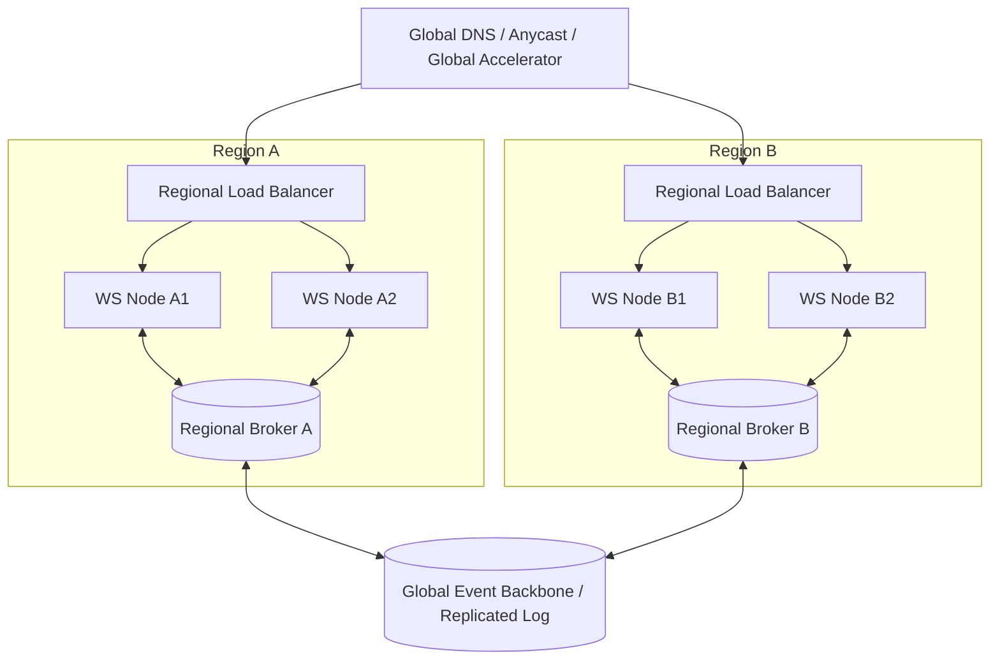

## 17.1 Regional affinity

Route clients to a nearby or home region based on:

- Network latency
- User account region
- Tenant data residency
- Current capacity
- Compliance requirements

Once connected, the client stays on that regional connection until disconnect.

## 17.2 Regional event routing

An event for a user must reach every region where that user has active connections.

Possible models:

- Global broker with regional consumers
- Regional brokers connected by a global event stream
- Home-region routing plus replication
- Global connection directory mapping user to active regions

## 17.3 Ordering in multi-region systems

Avoid promising global total ordering unless the business truly requires it. Prefer ordering per business entity and route all events for that entity through one logical partition or home region.

## 17.4 Regional failure

Clients should reconnect through global routing to a healthy region. The fallback region must be able to:

- Authenticate the client
- Rebuild subscriptions
- Access required durable state
- Replay important missed events

A multi-region diagram is incomplete without a clear data and event replication strategy.

---

# 18. Security and Abuse Protection

## 18.1 Use `wss://`

Production WebSockets should use TLS. Plain `ws://` exposes data and credentials to network observers.

## 18.2 Authentication during handshake

Possible approaches:

- Secure HTTP-only session cookie
- Short-lived access token
- One-time WebSocket ticket obtained from an authenticated HTTP API
- Token in a supported authorization mechanism or application handshake

Avoid long-lived secrets in URLs because URLs may appear in logs, browser history, monitoring, and proxy records.

## 18.3 Authorization is continuous

Authentication proves identity. Authorization decides whether the connection may:

- Join a room
- Publish to a topic
- Read an order
- Send a message to another user
- Perform an administrative action

Do not trust a client-provided room or tenant ID without server-side authorization.

## 18.4 Token expiry and revocation

A connection may remain open longer than the access token lifetime.

Choose a policy:

- Close and require re-authentication on expiry
- Allow in-band token refresh
- Use short-lived connection tickets but a separately managed session
- Subscribe nodes to session-revocation events

Security revocation events should have higher priority than replaceable live updates.

## 18.5 Origin validation

For browser clients, validate the `Origin` header to reduce cross-site WebSocket hijacking risk. CORS settings alone do not replace WebSocket origin validation.

## 18.6 Rate limits

Apply limits for:

- Connection attempts per IP and account
- Concurrent connections per user
- Messages per second
- Bytes per second
- Room joins per minute
- Subscription count
- Authentication failures
- Expensive commands

## 18.7 Payload safety

- Validate schemas.
- Limit frame and message size.
- Reject unsupported event types.
- Avoid dynamic code execution.
- Escape untrusted data before rendering in a browser.
- Protect the internal broker with authentication, network isolation, TLS, and least-privilege credentials.

---

# 19. Observability and SLOs

A WebSocket system can appear healthy at the HTTP layer while real-time delivery is failing. Observe the full path.

## 19.1 Core metrics

### Connection metrics

- Current active connections
- Connections by node, region, tenant, and client version
- Connection-open rate
- Clean and abnormal close rate
- Connection duration distribution
- Authentication failure rate
- Upgrade failure rate

### Message metrics

- Inbound and outbound messages per second
- Bytes per second
- Delivery latency
- Messages dropped by reason
- Queue depth per connection
- Acknowledgement latency
- Replay count
- Duplicate count

### Runtime metrics

- CPU and memory
- File-descriptor usage
- Event-loop lag
- Garbage-collection pause time
- Thread-pool saturation
- Socket write latency
- Network errors

### Broker metrics

- Publish rate
- Consumer lag
- Subscription count
- Redelivery count
- Partition skew
- Broker connection failures

## 19.2 Useful SLOs

Examples:

```text
99.9% of accepted important events are delivered or durably queued.
99% of online-client events are delivered within 500 ms.
99.95% of connection attempts succeed, excluding invalid authentication.
Abnormal disconnect rate remains below an agreed threshold.
```

The SLO must define what “delivered” means:

- Written to the server socket buffer
- Received by the client
- Acknowledged by the client
- Processed and persisted by the client

## 19.3 Distributed tracing

Carry a correlation ID through:

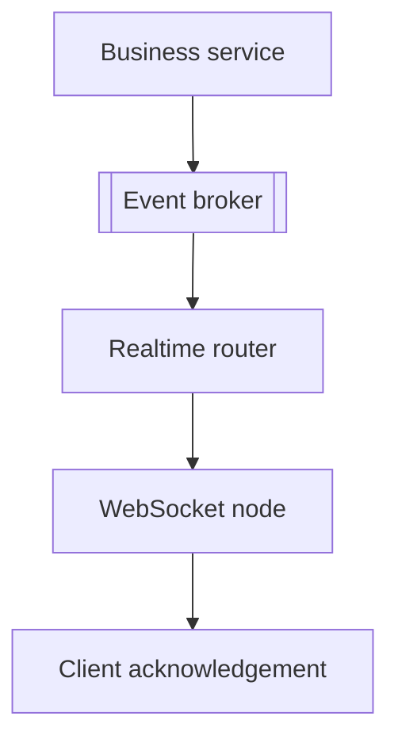

A useful event envelope includes:

```json
{
  "event_id": "evt-501",
  "trace_id": "trace-902",
  "type": "order.updated",
  "target": {"user_id": "user-42"},
  "occurred_at": "2026-08-03T06:20:00Z",
  "payload": {}
}
```

## 19.4 Load testing

Test more than concurrent idle connections.

Include:

- Gradual connection ramp
- Peak handshake rate
- Realistic heartbeat traffic
- One-to-one messages
- Medium-room broadcasts
- Very large hot-room broadcasts
- Slow clients
- Broker restart
- Node crash
- Rolling deployment
- Regional latency
- Reconnect storm

Measure at least:

- Maximum stable connections per node
- P95/P99 delivery latency
- Memory per connection
- CPU per message rate
- Maximum safe outbound queue
- Recovery time after failure

---

# 20. Practical Configuration Examples

These examples illustrate the design. Production values must be measured and adapted to the selected runtime and infrastructure.

## 20.1 NGINX WebSocket proxy

```nginx
map $http_upgrade $connection_upgrade {
    default upgrade;
    ''      close;
}

upstream websocket_backend {
    least_conn;

    server ws-node-1:8080;
    server ws-node-2:8080;
    server ws-node-3:8080;
}

server {
    listen 443 ssl;
    server_name realtime.example.com;

    location /ws {
        proxy_pass http://websocket_backend;
        proxy_http_version 1.1;

        proxy_set_header Upgrade $http_upgrade;
        proxy_set_header Connection $connection_upgrade;
        proxy_set_header Host $host;
        proxy_set_header X-Forwarded-For $proxy_add_x_forwarded_for;
        proxy_set_header X-Forwarded-Proto $scheme;

        proxy_read_timeout 75s;
        proxy_send_timeout 75s;
    }
}
```

The configured proxy timeout must exceed the application's quiet period or heartbeat timing.

## 20.2 Generic node-local connection hub

```python
from collections import defaultdict
from typing import Any


class ConnectionHub:
    def __init__(self) -> None:
        self._by_user: dict[str, set[Any]] = defaultdict(set)
        self._by_room: dict[str, set[Any]] = defaultdict(set)

    def add_connection(self, user_id: str, socket: Any) -> None:
        self._by_user[user_id].add(socket)

    def remove_connection(self, user_id: str, socket: Any) -> None:
        sockets = self._by_user.get(user_id)
        if not sockets:
            return

        sockets.discard(socket)
        if not sockets:
            self._by_user.pop(user_id, None)

    def join_room(self, room_id: str, socket: Any) -> None:
        self._by_room[room_id].add(socket)

    async def send_to_user(self, user_id: str, payload: bytes) -> None:
        # Each socket implementation should enforce a bounded send queue.
        for socket in list(self._by_user.get(user_id, set())):
            await socket.send_bytes(payload)
```

This map is local only. Cross-node events still require a broker or router.

## 20.3 Broker event handler

```python
async def handle_realtime_event(event: dict) -> None:
    target = event["target"]
    payload = encode_once(event)

    if "user_id" in target:
        await hub.send_to_user(target["user_id"], payload)
    elif "room_id" in target:
        await hub.send_to_room(target["room_id"], payload)
```

Encode once per node rather than once per socket when all recipients receive the same payload.

## 20.4 Client reconnection with jitter

```javascript
const MAX_DELAY_MS = 30_000;
let attempt = 0;

function nextReconnectDelay() {
  const exponential = Math.min(MAX_DELAY_MS, 1000 * 2 ** attempt);
  attempt += 1;
  return Math.floor(Math.random() * exponential);
}

function connect() {
  const socket = new WebSocket("wss://realtime.example.com/ws");

  socket.addEventListener("open", () => {
    attempt = 0;
    socket.send(JSON.stringify({
      type: "resume",
      after_sequence: loadLastProcessedSequence(),
    }));
  });

  socket.addEventListener("close", () => {
    setTimeout(connect, nextReconnectDelay());
  });
}
```

In production, stop retrying or change behavior for permanent authentication and authorization failures.

## 20.5 Graceful shutdown pseudocode

```python
async def graceful_shutdown() -> None:
    readiness.mark_not_ready()
    websocket_listener.stop_accepting_new_connections()
    broker_consumer.stop_claiming_new_work()

    await hub.notify_all({
        "type": "server_draining",
        "retry_after_ms": 1000,
    })

    await hub.wait_for_drain(timeout_seconds=25)
    await hub.close_remaining_connections(
        code=1012,
        reason="Service restart",
    )

    await metrics.flush()
```

Close code `1012` is commonly interpreted as service restart, but verify client and framework behavior before standardizing on it.

## 20.6 Kubernetes deployment fragment

```yaml
apiVersion: apps/v1
kind: Deployment
metadata:
  name: websocket-gateway
spec:
  replicas: 6
  strategy:
    type: RollingUpdate
    rollingUpdate:
      maxUnavailable: 0
      maxSurge: 2
  template:
    spec:
      terminationGracePeriodSeconds: 45
      containers:
        - name: gateway
          image: example/websocket-gateway:1.0.0
          ports:
            - containerPort: 8080
          readinessProbe:
            httpGet:
              path: /ready
              port: 8080
            periodSeconds: 5
          lifecycle:
            preStop:
              exec:
                command: ["sh", "-c", "curl -fsS -X POST http://127.0.0.1:8080/drain"]
```

The application must change `/ready` to a failing response before shutdown and finish draining within the configured termination window.

---

# 21. Design Trade-offs

## 21.1 Redis Pub/Sub vs durable stream

| Area | Redis Pub/Sub | Redis Streams / Kafka-like log |
|---|---|---|
| Latency | Very low | Low, with more persistence work |
| Storage | No message history | Messages retained |
| Offline replay | No | Yes |
| Delivery style | At-most-once | At-least-once patterns available |
| Operational complexity | Lower | Higher |
| Best fit | Ephemeral live events | Important replayable events |

A common practical design uses both:

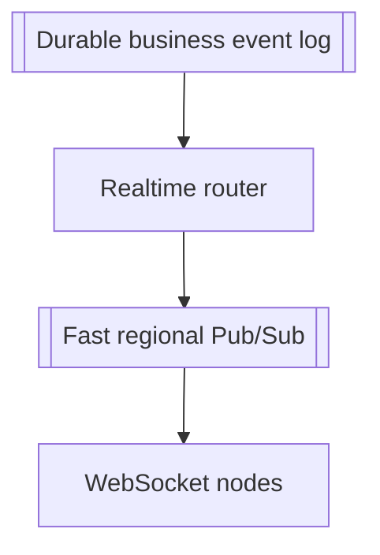

## 21.2 Shared registry vs broadcast filtering

| Model | Strength | Cost |
|---|---|---|
| Broadcast to all nodes | Simple and resilient to stale routing | Wasted broker and node work |
| Global user-to-node registry | Efficient targeted delivery | Registry consistency and cleanup complexity |
| Topic partitions | Scales subscriptions | Partition skew and routing complexity |
| Dedicated router | Clear separation and optimization | Extra service and operational responsibility |

Start with the simplest model that satisfies expected scale, then evolve after measuring the bottleneck.

## 21.3 Stateful vs stateless WebSocket nodes

A WebSocket node is inherently stateful regarding its live sockets. The goal is not to pretend that state does not exist.

The goal is to keep the state:

- Ephemeral
- Local
- Reconstructable
- Non-authoritative for durable business data

This makes node replacement and failure recovery manageable.

## 21.4 One service or separate realtime gateway

### WebSockets inside the main application

Good when:

- Scale is moderate
- Business logic and realtime transport are tightly coupled
- The team wants fewer deployable services

### Dedicated realtime gateway

Good when:

- Connection count is high
- Several services publish real-time events
- Independent scaling is needed
- Deployment frequency differs
- Different runtime choices are useful

A dedicated gateway should not become a second business-logic monolith. Keep business decisions in domain services and use the gateway for authentication, subscriptions, routing, and transport enforcement.

---

# 22. A Practical Reference Design

Consider a notification and chat platform with:

- 700,000 concurrent connections
- Multiple browser tabs and mobile devices per user
- One-to-one notifications
- Chat rooms
- Important messages requiring replay
- Typing indicators that may be dropped

## 22.1 Proposed components

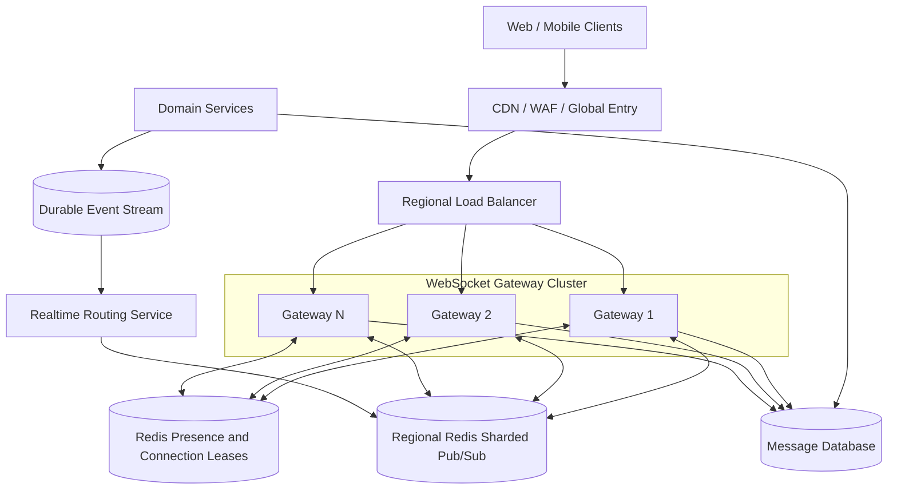

## 22.2 Event classes

### Durable events

- Chat message
- Payment status
- Order status
- Security notification

Flow:

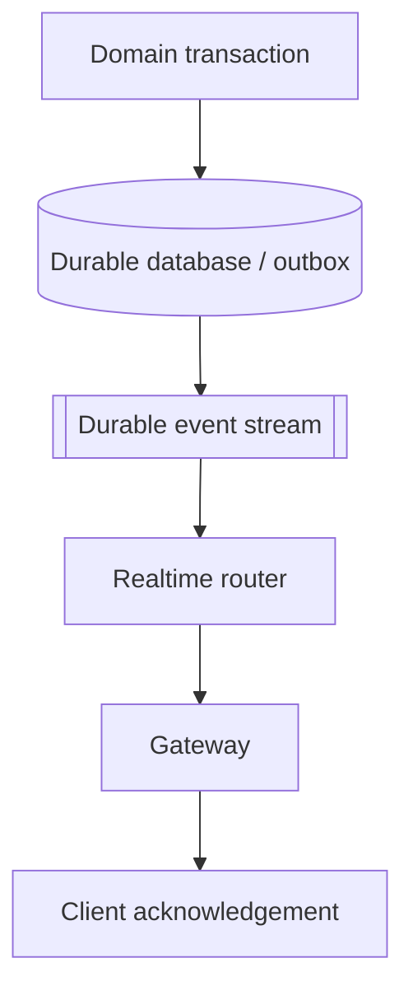

### Ephemeral events

- Typing started
- Cursor moved
- User is viewing a screen
- Rapid live telemetry

Flow:

```text
Publisher -> fast Pub/Sub -> gateway -> connected clients
```

These events can be dropped or coalesced under pressure.

## 22.3 Connection handling

1. Client obtains a short-lived WebSocket ticket through HTTPS.
2. Client connects through the load balancer.
3. Gateway validates the ticket.
4. Gateway creates a local socket record.
5. Gateway writes a TTL-based connection lease.
6. Client joins authorized rooms.
7. Heartbeats refresh connection health and presence.
8. On reconnect, client sends its last processed sequence.
9. Gateway or message service replays important missed messages.

## 22.4 Scaling policy

Scale out when any major pressure signal crosses its target:

```text
connections per pod > target
OR event-loop lag > target
OR outbound bytes > target
OR pending send bytes > target
OR CPU > target
```

Use spare capacity and scheduled scale-out before known traffic peaks.

## 22.5 Failure behavior

- Gateway crash: reconnect and replay
- Redis Pub/Sub interruption: ephemeral events may be lost; durable events remain in the stream
- Presence-store interruption: delivery continues locally; global presence becomes degraded
- Router backlog: durable stream lag increases and alerts trigger
- Slow client: coalesce, drop replaceable events, or disconnect
- Deployment: readiness off, drain, retryable close, jittered reconnect

---

# 23. Interview-Focused Summary

A strong system-design explanation should progress in this order:

## 23.1 Start with the core difficulty

A WebSocket connection is long-lived and belongs to one server process. When there are multiple servers, the system needs a way to route an event to the node that owns the target connection.

## 23.2 Present the main architecture

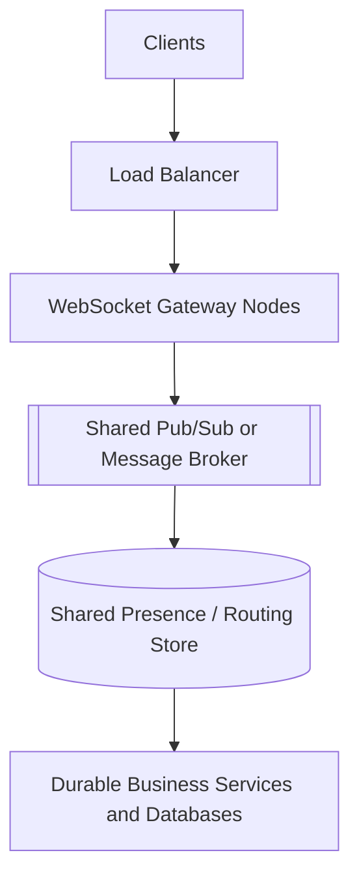

## 23.3 Explain node state correctly

- Live sockets and local room membership stay in node memory.
- Durable business data stays in databases.
- Presence and routing records use TTLs because nodes may crash.
- Clients must be able to reconnect and rebuild state.

## 23.4 Address cross-node delivery

Use one of:

- Broadcast to every node and filter locally
- User-to-node targeted routing
- Partitioned topics
- Dedicated realtime router

Explain why the selected choice matches the expected scale.

## 23.5 Discuss reliability explicitly

- Ephemeral updates can use fast at-most-once Pub/Sub.
- Important updates need durable storage, event IDs, acknowledgement, replay, and idempotency.
- TCP ordering does not create global distributed ordering.

## 23.6 Cover operational behavior

- Heartbeats detect dead connections.
- Proxy idle timeouts must exceed heartbeat timing.
- Clients reconnect with exponential backoff and jitter.
- Autoscaling uses connection count, event-loop lag, queue size, network, and CPU.
- Scale-in and deployments require connection draining.
- Backpressure requires bounded queues and event-specific drop policies.

## 23.7 Final mental model

```text
WebSocket node = temporary owner of live connections
Broker/router   = cross-node event movement
Presence store  = short-lived connection metadata
Database/log    = durable source of truth
Client          = reconnects, resumes, and deduplicates
```

That separation is the foundation of a scalable WebSocket system.

---

# 24. References

Official and primary references reviewed for this guide:

1. IETF, **RFC 6455 — The WebSocket Protocol**  
   https://datatracker.ietf.org/doc/html/rfc6455

2. IETF, **RFC 8441 — Bootstrapping WebSockets with HTTP/2**  
   https://datatracker.ietf.org/doc/html/rfc8441

3. NGINX, **WebSocket proxying**  
   https://nginx.org/en/docs/http/websocket.html

4. AWS, **Application Load Balancer attributes and idle timeout**  
   https://docs.aws.amazon.com/elasticloadbalancing/latest/application/edit-load-balancer-attributes.html

5. Redis, **Pub/Sub documentation and delivery semantics**  
   https://redis.io/docs/latest/develop/pubsub/

6. Redis, **Pub/Sub messaging use case**  
   https://redis.io/docs/latest/develop/use-cases/pub-sub/

7. Socket.IO, **Using multiple nodes**  
   https://socket.io/docs/v4/using-multiple-nodes/

8. Socket.IO, **Redis adapter**  
   https://socket.io/docs/v4/redis-adapter/

9. Kubernetes, **Pod lifecycle and graceful termination**  
   https://kubernetes.io/docs/concepts/workloads/pods/pod-lifecycle/

10. Kubernetes, **Services and session affinity**  
    https://kubernetes.io/docs/concepts/services-networking/service/

---

> **Key takeaway:** Scale WebSockets by separating live connection ownership from shared event routing and durable state. Treat disconnection, reconnection, and replay as normal parts of the system lifecycle.
