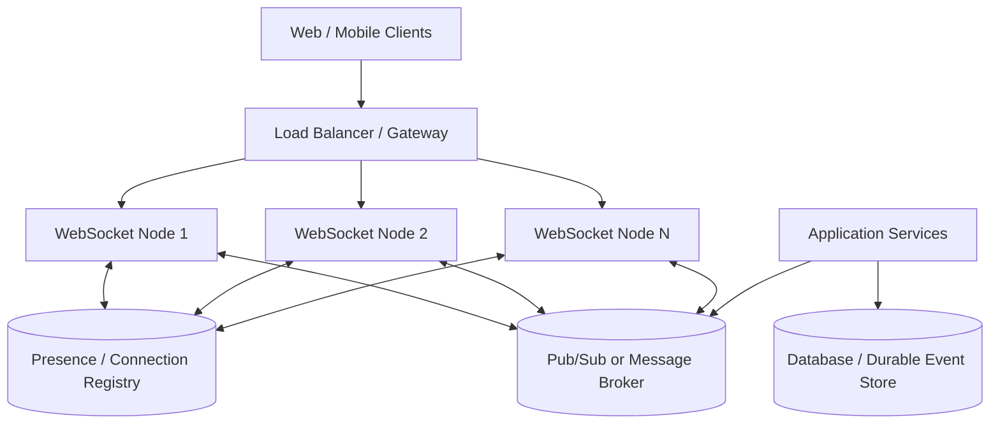
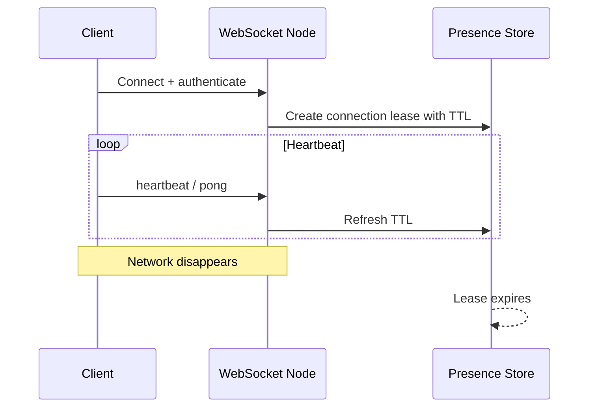
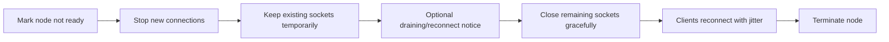
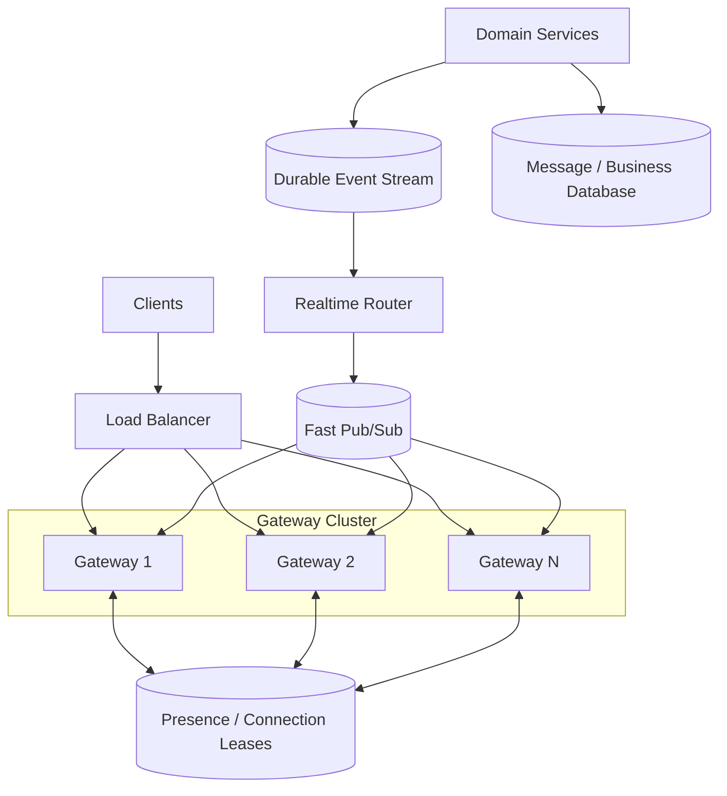

# Scaling WebSockets

> Understand how to design and scale a production WebSocket system without treating it like a normal stateless HTTP API.

## In short

- A WebSocket is a **long-lived connection owned by one server process**.
- Scale is limited by **connections, memory, file descriptors, network throughput, event-loop pressure, and outbound buffers** — not CPU alone.
- When multiple WebSocket nodes are used, application events need a **broker/router** to reach the node that owns the target socket.
- Keep only **ephemeral connection state** inside WebSocket nodes. Keep durable messages and business state outside them.
- Treat disconnects as normal: use **heartbeats, reconnect with exponential backoff + jitter, and replay/resume** when delivery matters.
- Every connection needs a **bounded outbound queue** so one slow client cannot consume unlimited memory.
- Existing connections do not automatically move to a newly added node, so scale out early and **drain connections during scale-in or deployment**.



---

# 1. WebSocket Basics

A WebSocket provides a **persistent, full-duplex connection** between client and server.

```text
Client  <============================>  Server
         long-lived bidirectional
              connection
```

With HTTP/1.1, the connection normally starts with an HTTP upgrade request and a successful `101 Switching Protocols` response.

```http
GET /ws HTTP/1.1
Host: realtime.example.com
Upgrade: websocket
Connection: Upgrade
Sec-WebSocket-Version: 13
```

After the handshake, both sides exchange WebSocket frames over the same connection.

Modern standards also define WebSocket bootstrapping over:

- **HTTP/2:** RFC 8441 using Extended CONNECT
- **HTTP/3:** RFC 9220

The important application-level properties stay the same: the connection is long-lived, bidirectional, ordered within that connection, and **not automatically durable**.

## 1.1 When to use WebSockets

| Requirement | Common choice |
|---|---|
| Normal request-response API | HTTP/REST |
| Occasional server updates | Polling |
| One-way server-to-browser stream | SSE |
| Frequent bidirectional realtime communication | WebSocket |
| Realtime audio/video/media | WebRTC |

Typical WebSocket use cases include chat, live notifications, collaborative editing, trading dashboards, delivery tracking, multiplayer state, and agent/customer-support consoles.

---

# 2. Why Scaling WebSockets Is Different

With stateless HTTP, almost any healthy server can process the next request.

With WebSockets, the accepted connection belongs to one node:

```text
Node A
  user-10 -> socket-a
  user-20 -> socket-b

Node B
  user-42 -> socket-c
```

If an event for `user-42` is produced by a service or arrives at Node A, Node A cannot write directly to `socket-c`. The event must reach **Node B**.

That creates the central scaling problem:

> **Live connection ownership is local, but events may be produced anywhere.**

## 2.1 Capacity dimensions

Do not size a WebSocket tier using CPU alone.

Important limits include:

- Active connections
- Memory per connection
- File descriptors
- New handshakes per second
- Messages per second
- Network bytes per second
- Event-loop or worker saturation
- Pending outbound bytes
- Broker throughput and lag

Useful estimates:

```text
concurrent_connections
  = active_users × average_connections_per_user
```

```text
outgoing_deliveries_per_second
  = published_events_per_second × average_recipients
```

```text
connection_memory
  = active_connections × measured_memory_per_connection
```

Memory per connection must be measured with realistic TLS, framework, authentication metadata, subscriptions, and send-buffer behaviour.

---

# 3. Production Architecture

A common production design separates four responsibilities.

| Component | Main responsibility |
|---|---|
| Load balancer | Accept connections, forward WebSocket traffic, health-check and drain nodes |
| WebSocket node | Own live sockets, authenticate, manage local subscriptions, send/receive frames |
| Broker / router | Move events between services and WebSocket nodes |
| Durable store | Keep business state, message history, replayable events |
| Presence / registry store | Keep short-lived connection and presence metadata |

The WebSocket node is intentionally **stateful for live sockets**, but that state should be:

- Ephemeral
- Local
- Reconstructable
- Non-authoritative for durable business data

This allows a node to crash or restart without losing the real source of truth.

---

# 4. Load Balancing and Cross-Node Routing

## 4.1 Load balancing

Once a raw WebSocket connection is established, all frames on that connection continue to the same backend.

For long-lived connections, **least-connections** is usually a better starting point than simple round robin because connection lifetimes can differ significantly.

### Sticky sessions

For a **raw WebSocket-only connection**, sticky sessions are normally unnecessary after the connection is established.

For **Socket.IO with HTTP long-polling enabled**, multiple HTTP requests may belong to the same logical session, so session affinity is commonly required.

If Socket.IO is configured with WebSocket-only transport, that repeated polling requirement disappears.

Regardless of affinity, multiple WebSocket nodes still need cross-node event routing.

## 4.2 Local connection registry

Each node should keep fast in-memory mappings such as:

```text
user_id       -> local connection IDs
connection_id -> socket + metadata
room_id       -> local connection IDs
```

Do not query a database for every socket delivery.

## 4.3 Cross-node routing models

### Broadcast and filter

Every node receives the event and delivers it only if it owns a matching connection.

```text
Publisher -> Broker -> Node A
                    -> Node B
                    -> Node C
```

**Best fit:** small or medium clusters, simple systems.

### User-to-node routing

Keep short-lived routing metadata:

```text
user-42 -> node-3
```

The router publishes only to the node that currently owns the connection.

**Best fit:** large clusters with mostly targeted one-to-one events.

### Partitioned topics

Hash rooms, tenants, games, symbols, or other logical groups across a fixed set of broker partitions.

```text
partition = hash(room_id) % partition_count
```

**Best fit:** large room/topic systems where broadcasting every event to every node becomes wasteful.

---

# 5. Presence and Connection Registry

Presence should usually be treated as **eventually consistent**.

A client may disappear because of:

- Mobile network loss
- Laptop sleep
- Proxy timeout
- Node crash
- NAT expiry
- Clean disconnect

A common design uses short-lived leases:



If a user has multiple devices or tabs, presence becomes offline only when all active leases expire.

Presence is useful for UI features such as "online" indicators, but should not be the source of truth for irreversible business operations.

---

# 6. Delivery, Replay, Ordering, and Deduplication

WebSocket transport alone does not guarantee delivery across disconnects.

## 6.1 Separate event classes

| Event type | Example | Typical handling |
|---|---|---|
| Ephemeral | typing indicator, cursor, latest stock price | Best effort; may drop/coalesce |
| Important | chat message, payment status, security notification | Persist, retry/replay, deduplicate |

Redis Pub/Sub is suitable for fast ephemeral distribution because it provides **at-most-once** delivery: a disconnected subscriber misses the message.

For important events, use a durable store or stream.

## 6.2 Replay model

Give important events a stable ID and sequence:

```json
{
  "event_id": "evt-501",
  "stream": "user-42",
  "sequence": 8422,
  "type": "order.updated",
  "payload": {}
}
```

The client stores the last successfully processed sequence.

After reconnect:

```json
{
  "type": "resume",
  "stream": "user-42",
  "after_sequence": 8421
}
```

The server then replays missed durable events.

A practical reliability model is:

```text
at-least-once delivery
+ stable event ID
+ idempotent processing
+ deduplication
= exactly-once business effect
```

## 6.3 Ordering

TCP preserves order on one connection, but distributed services may produce events concurrently.

Use the **smallest ordering scope the business needs**, for example:

- Per conversation
- Per order
- Per user
- Per game
- Per aggregate ID

A broker partition key such as `conversation_id` can preserve that scoped ordering.

---

# 7. Backpressure and Slow Clients

A client may consume data slower than the server produces it.

```text
Producer: 1000 msg/s
Client:    100 msg/s
Backlog:   +900 msg/s
```

Without a limit, the node's outbound memory keeps growing.

## 7.1 Bound every connection queue

Example:

```text
max_pending_messages = 500
max_pending_bytes    = 2 MB
```

When the limit is reached, use a policy based on event importance:

- **Drop oldest** for replaceable snapshots
- **Coalesce** repeated updates such as `stock:TCS`
- **Drop low-priority events**
- **Disconnect and resync** a severely slow client
- **Persist important events** for replay

Example:

```text
Latest location update  -> coalesce
Typing indicator        -> drop if needed
Payment confirmation    -> persist / never silently drop
```

This separation is one of the most important protections in a high-fan-out realtime system.

---

# 8. Heartbeats and Reconnection

Connections can become half-open, where one side thinks the socket still exists while the network path has disappeared.

Heartbeats help:

- Detect dead clients
- Keep proxy/NAT mappings alive
- Refresh presence leases
- Measure connection health

A useful timeout relationship is:

```text
proxy_idle_timeout
  > heartbeat_interval + heartbeat_timeout + safety_margin
```

Example:

```text
heartbeat interval = 25 s
heartbeat timeout  = 15 s
proxy idle timeout = 60+ s
```

## 8.1 Reconnect with backoff and jitter

Do not let thousands of clients reconnect simultaneously.

```text
1s -> 2s -> 4s -> 8s -> ... -> capped delay
```

Add jitter:

```text
delay = random(0, min(cap, base × 2^attempt))
```

After reconnect:

1. Re-authenticate.
2. Restore authorized subscriptions.
3. Send the last processed sequence/version.
4. Replay missed important events.
5. Refresh the latest snapshot.
6. Continue live delivery.

Reconnect and resume should be treated as a normal application path, not an exceptional case.

---

# 9. Autoscaling and Graceful Deployment

## 9.1 Scaling signals

Useful WebSocket scaling metrics include:

- Connections per node
- New connections per second
- Memory and file-descriptor usage
- Event-loop lag
- Network bytes sent
- Pending outbound bytes
- Broker consumer lag
- P95/P99 delivery latency
- CPU

A simple connection-based estimate is:

```text
desired_nodes
  = ceil(total_connections / target_connections_per_node)
```

The target must come from load tests.

### Why scale-out is slower than HTTP

Adding a new node does not move existing connections.

```text
Before:  Node A = 50k, Node B = 50k
Add C:   Node A = 50k, Node B = 50k, Node C = 0
```

Node C receives only new connections until clients reconnect.

Therefore, provision headroom and scale before known peaks.

## 9.2 Scale-in and deployment require draining



With Kubernetes, the application should fail readiness when draining begins and finish existing connections within `terminationGracePeriodSeconds`. A rolling deployment also needs enough spare/surge capacity for reconnect traffic.

---

# 10. Security

Production WebSockets should use `wss://`.

Important controls:

- Authenticate during or immediately after connection establishment.
- Prefer short-lived access tokens or one-time WebSocket tickets.
- Do not put long-lived secrets in URLs.
- Authorize every room join, subscription, command, and resource access.
- Validate the browser `Origin` header where applicable.
- Limit connection attempts per IP/account.
- Limit concurrent connections per user.
- Limit messages and bytes per second.
- Limit frame/message size.
- Validate payload schemas.
- Support session/token revocation for long-lived connections.

Authentication answers **who the client is**. Authorization still needs to be checked continuously for operations performed over that connection.

---

# 11. Observability

HTTP health alone is not enough for a realtime system.

Track the full delivery path.

| Area | Useful metrics |
|---|---|
| Connections | active connections, open/close rate, abnormal disconnects, connection duration |
| Delivery | messages/sec, bytes/sec, dropped events, queue depth, acknowledgement latency |
| Runtime | CPU, memory, file descriptors, event-loop lag, socket write latency |
| Broker | publish rate, consumer lag, redelivery, partition skew |
| Reliability | reconnect rate, replay count, duplicate count, delivery latency |

A useful SLO might be:

```text
99% of important events for online clients
are acknowledged within 500 ms.
```

Be precise about what "delivered" means:

```text
written to server socket
!= received by client
!= acknowledged by client
!= processed and persisted by client
```

Load tests should include more than idle sockets: test connection ramps, peak handshakes, heartbeats, large room broadcasts, slow clients, node crashes, rolling deployments, broker interruption, and reconnect storms.

---

# 12. Practical Example: Chat + Notifications

Assume:

- 100,000 concurrent connections
- Multiple devices per user
- One-to-one notifications
- Chat rooms
- Durable chat/payment events
- Ephemeral typing indicators

## 12.1 Reference design



## 12.2 Event flow

### Durable chat message

```text
Domain transaction
    -> database/outbox
    -> durable event stream
    -> realtime router
    -> gateway owning target connection
    -> client
    -> acknowledgement
```

If the client disconnects, it resumes from its last processed sequence.

### Typing indicator

```text
publisher
    -> fast Pub/Sub
    -> relevant gateway
    -> connected clients
```

If the client is slow or disconnected, the typing event may be dropped because the next update will replace it.

## 12.3 Capacity example

If load testing shows a safe target of `20,000` active connections per node:

```text
100,000 / 20,000 = 5 nodes
```

With roughly 30% spare capacity:

```text
5 × 1.3 = 6.5 -> 7 nodes
```

The final node count should also satisfy network, message-rate, memory, and failure-headroom requirements — not only connection count.

---

# 13. Mental Model

The design becomes easier to reason about when responsibilities stay separated:

```text
WebSocket node
    = temporary owner of live connections

Broker / router
    = moves realtime events between processes

Presence store
    = short-lived connection metadata

Database / durable stream
    = source of truth and replay

Client
    = reconnects, resumes and deduplicates
```

> **Key takeaway:** Scale WebSockets by separating live connection ownership from cross-node routing and durable state. Design backpressure, reconnect, replay, and draining from the beginning because connection loss and slow consumers are normal operating conditions.

---

# 14. References

Primary references reviewed for this guide:

1. IETF — **RFC 6455: The WebSocket Protocol**  
   https://datatracker.ietf.org/doc/html/rfc6455

2. IETF — **RFC 8441: Bootstrapping WebSockets with HTTP/2**  
   https://datatracker.ietf.org/doc/html/rfc8441

3. IETF — **RFC 9220: Bootstrapping WebSockets with HTTP/3**  
   https://datatracker.ietf.org/doc/html/rfc9220

4. NGINX — **WebSocket proxying / HTTP proxy module**  
   https://nginx.org/en/docs/http/websocket.html

5. Redis — **Pub/Sub delivery semantics**  
   https://redis.io/docs/latest/develop/interact/pubsub/

6. Socket.IO — **Using multiple nodes**  
   https://socket.io/docs/v4/using-multiple-nodes/

7. Kubernetes — **Pod lifecycle and graceful termination**  
   https://kubernetes.io/docs/concepts/workloads/pods/pod-lifecycle/
