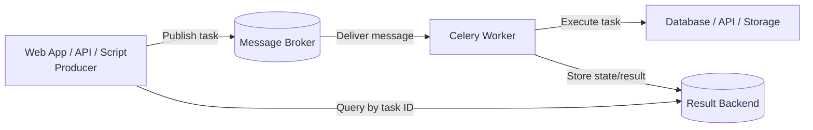
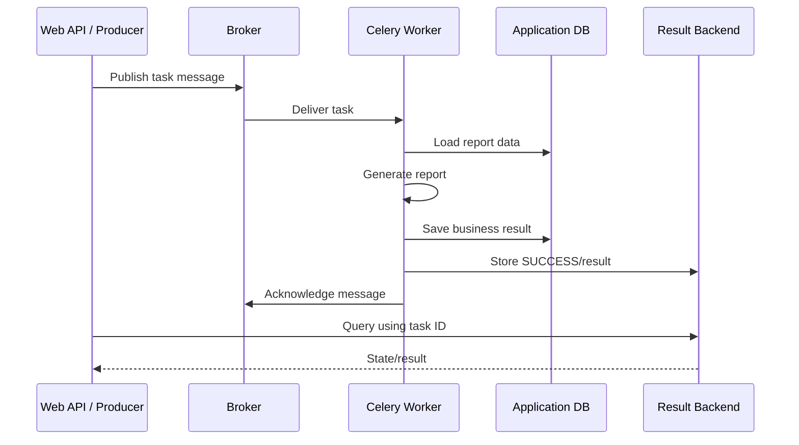
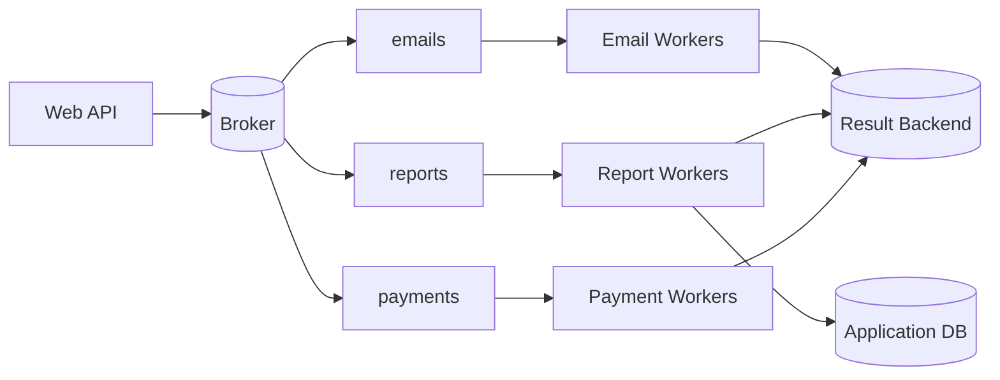
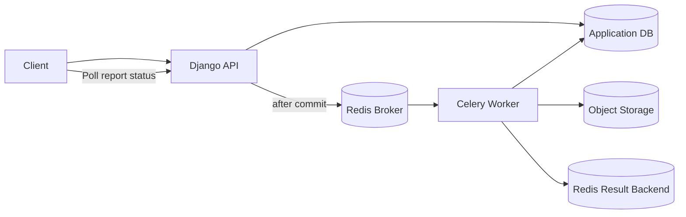

# Celery Architecture: Broker, Worker, and Result Backend

> Understand how Celery moves, executes, tracks, and scales background tasks in real applications.

## In Short

- **Celery** is a distributed task queue used to move slow or independent work out of the web request cycle.
- A **producer** publishes a task message to a **broker**.
- A **worker** consumes the message and executes the Python task.
- An optional **result backend** stores task state and return values.
- The broker and result backend are different roles, even when both use Redis.
- Pass **IDs or storage references**, not large files or full model objects, in task messages.
- Celery tasks should be designed for **retries and duplicate execution**, so idempotency matters.
- For most workloads, start with the **prefork** worker pool and separate queues by workload.



The easiest mental model is:

```text
Producer → Broker → Worker → Business Work
                     ↓
               Result Backend
```

The **application database remains the source of truth for business data**.

---

# 1. Why Celery Is Needed

A normal web request is synchronous:

```text
Request
   ↓
Do all work
   ↓
Return response
```

That is fine for fast work such as:

- Reading database records
- Validating input
- Returning cached data

It becomes a problem when the request must perform slow or resource-heavy work:

- Sending emails
- Generating PDF reports
- Processing images or videos
- Running OCR
- Calling slow third-party APIs
- Recalculating analytics
- Running scheduled jobs

Without background processing:

```text
HTTP Request
   ↓
Generate report: 20s
   ↓
Upload file: 4s
   ↓
Send email: 2s
   ↓
HTTP Response after ~26s
```

With Celery:

```text
HTTP Request
   ↓
Publish task
   ↓
Return 202 Accepted

Meanwhile:

Broker → Worker → Generate report → Save result
```

The web application stays responsive while workers handle the slow work separately.

---

# 2. Core Celery Architecture

Celery has four important participants:

1. **Producer / Client**
2. **Message Broker**
3. **Worker**
4. **Result Backend**

## 2.1 Producer

The producer is the code that submits a task.

Typical producers are:

- Django views
- FastAPI endpoints
- Management commands
- Python scripts
- Celery Beat
- Another Celery task

Example:

```python
result = generate_invoice.delay(invoice_id=125)
```

The producer does not execute `generate_invoice()` directly.

Celery creates a task message similar to:

```json
{
  "id": "task-uuid",
  "task": "billing.tasks.generate_invoice",
  "args": [],
  "kwargs": {
    "invoice_id": 125
  }
}
```

The real Celery protocol contains additional headers and metadata.

## 2.2 Message Broker

The broker transports task messages from producers to workers.

Its responsibilities include:

- Receiving task messages
- Holding messages in queues
- Routing messages
- Delivering messages to workers
- Handling acknowledgements
- Supporting redelivery according to broker and Celery configuration

Common brokers include:

| Broker | Typical Use |
|---|---|
| RabbitMQ | Dedicated message broker with mature routing and queue features |
| Redis | Simple infrastructure and common application workloads |
| Amazon SQS | AWS-managed queueing |
| Google Cloud Pub/Sub | GCP-managed messaging |

The broker contains the **task message**, not the permanent business result.

Good:

```python
process_document.delay(document_id=984)
```

Avoid:

```python
process_document.delay(file_bytes=large_80_mb_file)
```

Store large content in a database or object storage and send only its identifier or location.

## 2.3 Worker

A worker is a long-running Celery process that:

1. Connects to the broker.
2. Subscribes to one or more queues.
3. Receives task messages.
4. Looks up the registered task.
5. Executes the task in a worker pool.
6. Acknowledges the message according to acknowledgement settings.
7. Writes state/result information when a result backend is configured.

Start a worker:

```bash
celery -A project.celery_app:app worker --loglevel=INFO
```

With explicit concurrency:

```bash
celery -A project.celery_app:app worker \
  --pool=prefork \
  --concurrency=4 \
  --loglevel=INFO
```

## 2.4 Result Backend

The result backend is optional.

It can store or transmit:

- Task state
- Return value
- Exception information
- Traceback
- Progress metadata

Example:

```python
result = add.delay(10, 20)

print(result.id)
print(result.state)
print(result.get(timeout=5))
```

Typical result backends include:

- Redis
- RPC
- SQLAlchemy database backend
- Django ORM through `django-celery-results`
- Cache backends

Permanent business state should not exist only in the Celery result backend.

For example:

```text
Application database
    report.status = "completed"
    report.file_url = "..."

Celery backend
    task state = SUCCESS
    result = {"report_id": 721}
```

---

# 3. Broker vs Result Backend

This distinction is important in both interviews and production design.

| Area | Message Broker | Result Backend |
|---|---|---|
| Purpose | Deliver task messages | Store/transmit task states and results |
| Written by | Producer | Worker |
| Read by | Worker | Producer/API/monitoring code |
| Example data | Task name, args, task ID | `SUCCESS`, result, exception |
| Required | Yes | No |
| Common tools | RabbitMQ, Redis, SQS | Redis, RPC, database |
| Business source of truth | No | No |

Redis can perform both roles:

```python
broker_url = "redis://localhost:6379/0"
result_backend = "redis://localhost:6379/1"
```

The technology is the same, but the responsibilities are still different.

For larger systems, separate Redis instances or clusters can provide stronger isolation than separate logical databases.

---

# 4. Complete Task Lifecycle

Consider:

```python
generate_report.delay(report_id=721)
```

The flow is:



At a high level:

```text
1. Producer creates task request
2. Broker queues the message
3. Worker receives the message
4. Worker executes the task
5. Business data is saved
6. Celery stores state/result if enabled
7. Message is acknowledged
8. Caller may query the result later
```

The exact acknowledgement timing depends on task configuration.

---

# 5. Calling Tasks

## 5.1 `delay()`

Use `delay()` for a simple immediate task call:

```python
add.delay(10, 20)
```

It is a convenient shortcut for `apply_async()`.

## 5.2 `apply_async()`

Use `apply_async()` when execution options are required:

```python
generate_report.apply_async(
    kwargs={"report_id": 721},
    queue="reports",
    countdown=30,
    expires=300,
)
```

Common options include:

- `queue`
- `countdown`
- `eta`
- `expires`
- routing options

## 5.3 Pass Small, Stable Arguments

Prefer identifiers:

```python
send_invoice.delay(invoice_id=125)
```

Instead of passing:

- Django model instances
- Large JSON documents
- Image/video bytes
- Secrets
- Old snapshots of mutable business data

The worker should normally re-fetch the current data when execution begins.

---

# 6. Workers, Concurrency, and Queues

## 6.1 Worker Pools

Celery 5.6 uses **prefork** as the default concurrency model and recommends it as the starting point for most workloads.

| Pool | Model | Best Fit |
|---|---|---|
| `prefork` | Multiple OS processes | General and CPU-bound workloads |
| `threads` | Native threads | I/O-heavy work using thread-safe libraries |
| `gevent` | Greenlets | High-concurrency cooperative network I/O |
| `eventlet` | Greenlets | Cooperative I/O workloads |
| `solo` | Main thread | Debugging/local development |

`prefork` is the safest default because some Celery features, such as certain timeout and worker-child controls, are limited or behave differently with alternative pools.

## 6.2 Worker Count vs Concurrency

Suppose you run:

```text
3 worker containers
×
4 concurrency slots each
=
approximately 12 tasks executing concurrently
```

Actual throughput still depends on:

- CPU
- Memory
- Task duration
- Database connections
- API rate limits
- Broker performance
- Network latency

More concurrency is not automatically better.

## 6.3 Separate Queues by Workload

A common production design is:

```text
emails queue   → email workers
reports queue  → report workers
payments queue → payment workers
images queue   → image workers
```

Example:



This gives:

- Independent scaling
- Better fault isolation
- Different concurrency settings
- More predictable latency
- Better control of external API limits

## 6.4 Central Routing

Prefer central routing rules:

```python
app.conf.task_routes = {
    "project.tasks.send_email": {"queue": "emails"},
    "project.tasks.generate_report": {"queue": "reports"},
    "project.tasks.reconcile_payment": {"queue": "payments"},
}
```

Then start queue-specific workers:

```bash
celery -A project.celery_app:app worker -Q emails --concurrency=8
```

---

# 7. Reliability: Acknowledgements, Retries, and Idempotency

Celery runs in a distributed system, so failures can happen between execution, database commits, result storage, acknowledgements, and network responses.

A good task must be able to handle that reality.

## 7.1 Default Acknowledgement

By default, Celery normally acknowledges a task shortly before it starts executing.

This reduces duplicate execution if the child process later crashes, but it also means work may not automatically be returned to the queue after that failure.

## 7.2 Late Acknowledgement

For an idempotent task:

```python
@app.task(acks_late=True)
def process_order(order_id: int) -> None:
    ...
```

With `acks_late=True`, acknowledgement happens after task execution returns.

This makes redelivery possible in more failure scenarios, but it also increases the possibility that the same task runs more than once.

Important detail: `acks_late=True` does **not** guarantee redelivery for every worker-process termination. Celery may still acknowledge when the child process is terminated. If an application specifically requires rejection/redelivery after worker-process loss, evaluate `task_reject_on_worker_lost` carefully.

The practical rule is:

```text
Possible redelivery
       +
Idempotent task
       =
Reliable business outcome
```

## 7.3 Idempotency

Idempotency means repeating the same task does not create an incorrect second effect.

Risky:

```python
@app.task(acks_late=True)
def charge_card(payment_id: int) -> None:
    payment = Payment.objects.get(id=payment_id)
    gateway.charge(payment.amount)
```

Safer:

```python
@app.task(acks_late=True)
def charge_card(payment_id: int) -> None:
    payment = Payment.objects.get(id=payment_id)

    if payment.status == "completed":
        return

    gateway.charge(
        amount=payment.amount,
        idempotency_key=f"payment-{payment.id}",
    )

    payment.status = "completed"
    payment.save(update_fields=["status"])
```

Common idempotency techniques:

- Unique database constraints
- Idempotency keys
- Processed-event tables
- Transactional locking
- Compare-and-set updates
- External API idempotency support

## 7.4 Retries

Retry temporary failures, not permanent validation errors.

```python
@app.task(
    autoretry_for=(TimeoutError, ConnectionError),
    retry_backoff=True,
    retry_jitter=True,
    retry_kwargs={"max_retries": 5},
)
def sync_customer(customer_id: int) -> dict:
    return partner_client.fetch_customer(customer_id)
```

Backoff prevents retry storms:

```text
Attempt 1 → fail
wait
Attempt 2 → fail
wait longer
Attempt 3 → fail
...
```

Always put explicit timeouts around network calls.

## 7.5 Time Limits

Celery also supports soft and hard task time limits:

```python
app.conf.task_soft_time_limit = 270
app.conf.task_time_limit = 300
```

Use normal I/O timeouts first. Time limits are a safety mechanism for tasks that fail to return.

---

# 8. Django Transaction Boundary

A very common production issue is sending a Celery task before the surrounding database transaction commits.

Problem:

```python
with transaction.atomic():
    order = Order.objects.create(...)
    process_order.delay(order.id)
```

A fast worker may execute before `order` becomes visible outside the transaction.

## Modern Celery + Django Approach

Celery 5.4+ provides `delay_on_commit()` for Django tasks:

```python
with transaction.atomic():
    order = Order.objects.create(...)
    process_order.delay_on_commit(order.id)
```

The task is published only after the transaction commits successfully.

One important difference:

```text
delay()           → task is published now and returns a task ID
delay_on_commit() → publish is deferred and does not immediately return a task ID
```

If you need custom behavior, Django's standard hook still works:

```python
from django.db import transaction

with transaction.atomic():
    order = Order.objects.create(...)

    transaction.on_commit(
        lambda: process_order.delay(order.id)
    )
```

This pattern is especially important when a task immediately queries a row that the request just created or updated.

---

# 9. Task States and Result Handling

Common Celery states include:

```text
PENDING
STARTED
SUCCESS
FAILURE
RETRY
REVOKED
```

## 9.1 `PENDING` Is Ambiguous

`PENDING` can mean:

1. The task has not completed yet, or
2. The result backend does not know that task ID.

It does not prove that the task is currently waiting inside the broker.

## 9.2 `STARTED` Is Optional

Task-start tracking is disabled by default.

Enable it when useful:

```python
app.conf.task_track_started = True
```

This is helpful for long-running tasks but creates additional result-backend writes.

## 9.3 Reading Results

```python
result = generate_report.delay(report_id=721)

print(result.id)
print(result.state)

if result.ready():
    print(result.result)
```

Useful APIs include:

```python
result.ready()
result.successful()
result.failed()
result.state
result.result
result.traceback
result.get(timeout=10)
result.forget()
```

Avoid waiting for a long-running task inside a normal HTTP request:

```python
# Usually defeats the purpose of Celery
result = generate_report.delay(report_id)
report = result.get(timeout=60)
```

A better API pattern is:

```text
POST /reports
    → 202 Accepted
    → {"report_id": 721}

GET /reports/721
    → {"status": "processing"}

GET /reports/721
    → {"status": "completed", "download_url": "..."}
```

## 9.4 Ignore Results When You Do Not Need Them

For fire-and-forget work:

```python
@app.task(ignore_result=True)
def record_audit_event(event_id: int) -> None:
    ...
```

This reduces backend writes and storage.

## 9.5 Expire Results

Celery's default `result_expires` is one day for supported backends.

A shorter application-specific value can be configured:

```python
app.conf.result_expires = 3600
```

If you keep `AsyncResult` objects for tasks that store results, ensure results are eventually consumed with `get()` or released with `forget()` so backend resources are not kept unnecessarily.

---

# 10. Prefetch and Performance

Workers can reserve messages before execution slots are free.

The default prefetch count is approximately:

```text
worker_prefetch_multiplier × concurrency slots
```

Celery's default `worker_prefetch_multiplier` is commonly `4`.

For long-running tasks, a lower value can improve fairness:

```python
app.conf.worker_prefetch_multiplier = 1
```

A common long-task setup is:

```python
app.conf.update(
    task_acks_late=True,
    worker_prefetch_multiplier=1,
)
```

This is not a universal production setting. Benchmark it with the real workload.

For mixed workloads:

```text
short_tasks queue → short-task workers
long_tasks queue  → long-task workers
```

This is usually better than trying to make one worker configuration fit every task.

---

# 11. One Practical Example

Consider a report-generation feature.

The API should return quickly while Celery generates the report in the background.

## Celery Configuration

```python
from celery import Celery

app = Celery(
    "project",
    broker="redis://localhost:6379/0",
    backend="redis://localhost:6379/1",
)

app.conf.update(
    task_serializer="json",
    accept_content=["json"],
    result_serializer="json",
    task_track_started=True,
    result_expires=3600,
)
```

## Task

```python
from celery import shared_task

@shared_task(
    autoretry_for=(ConnectionError,),
    retry_backoff=True,
    retry_jitter=True,
    retry_kwargs={"max_retries": 5},
)
def generate_report(report_id: int) -> dict:
    report = Report.objects.get(id=report_id)

    file_url = build_and_upload_report(report)

    report.status = "completed"
    report.file_url = file_url
    report.save(update_fields=["status", "file_url"])

    return {"report_id": report.id}
```

## Request Flow

```python
from django.db import transaction

def create_report(request):
    with transaction.atomic():
        report = Report.objects.create(
            status="queued",
            user=request.user,
        )

        generate_report.delay_on_commit(report.id)

    return {
        "report_id": report.id,
        "status": "queued",
    }
```

## Architecture



The important design choices are:

- The HTTP request returns before report generation finishes.
- The task receives only `report_id`.
- The task is published after the database commit.
- The report's permanent status is stored in the application database.
- Retries are limited to temporary failures.
- The result backend contains operational task metadata, not the only copy of business state.

---

# 12. Scaling and Operations

Scale workers horizontally when queue delay grows:

```text
Broker
 ├── Worker 1
 ├── Worker 2
 ├── Worker 3
 └── Worker 4
```

Useful signals to monitor:

- Queue depth
- Oldest queued message age
- Task duration
- Success/failure rate
- Retry rate
- Worker availability
- Worker heartbeats
- CPU and memory
- Broker connections
- Result-backend storage
- Unacknowledged messages

Useful commands:

```bash
celery -A project.celery_app:app status

celery -A project.celery_app:app inspect active
celery -A project.celery_app:app inspect reserved
celery -A project.celery_app:app inspect scheduled
celery -A project.celery_app:app inspect registered
```

For a web dashboard, **Flower** is commonly used for Celery monitoring.

Do not expose monitoring dashboards publicly without authentication and network controls.

---

# 13. Security

Protect the broker and result backend because they are part of application infrastructure.

Use:

- Authentication
- Private networking
- TLS where appropriate
- Firewall rules
- Least-privilege credentials
- Secret rotation

Prefer JSON serialization:

```python
app.conf.update(
    task_serializer="json",
    result_serializer="json",
    accept_content=["json"],
)
```

Avoid passing secrets directly as task arguments because task messages can appear in:

- Broker storage
- Logs
- Monitoring tools
- Error traces
- Retry flows

Pass a secure reference and load sensitive data inside the task instead.

---

# 14. Practical Best Practices

## Architecture

- Keep **broker**, **worker**, **result backend**, and **business database** responsibilities separate.
- Use dedicated queues for workloads with different latency or resource requirements.
- Scale queue-specific workers independently.

## Task Design

- Pass IDs or storage references.
- Keep tasks focused.
- Make side-effecting tasks idempotent.
- Retry only recoverable failures.
- Use exponential backoff and jitter.
- Put timeouts around network I/O.
- Publish database-dependent tasks after commit.
- Avoid blocking web requests on `result.get()`.

## Worker Design

- Start with `prefork`.
- Measure before increasing concurrency.
- Separate short and long tasks.
- Plan graceful worker shutdown.
- Watch memory, database connections, and downstream limits.

## Broker and Result Backend

- Keep task messages small.
- Configure result expiration.
- Ignore results when they are unnecessary.
- Protect both systems with normal production security controls.
- Do not use the result backend as the application's permanent business database.

---

# Final Mental Model

```text
                     ┌───────────────┐
                     │   Producer    │
                     │ Django / API  │
                     └───────┬───────┘
                             │ task.delay(...)
                             ▼
                     ┌───────────────┐
                     │    Broker     │
                     │ Redis/RabbitMQ│
                     └───────┬───────┘
                             │ deliver
                             ▼
                     ┌───────────────┐
                     │    Worker     │
                     │ execute task  │
                     └───────┬───────┘
                             │
                ┌────────────┼────────────┐
                ▼            ▼            ▼
         Application DB   External API  Storage
                │
                │ permanent business state
                ▼

                     Worker
                       │
                       │ optional task state/result
                       ▼
                ┌───────────────┐
                │Result Backend │
                └───────────────┘
```

The key idea is simple:

> **The broker moves the task, the worker performs the task, the result backend reports the task outcome, and the application database owns the business state.**
