# Celery Architecture: Broker, Worker, and Result Backend

> Understand how Celery moves, executes, tracks, and scales background tasks in real applications.

## In short

- Celery is a distributed task queue: a producer publishes a task message to a **broker**, a **worker** process consumes and executes it, and an optional **result backend** stores the state and return value.
- The broker carries the work, the worker performs the work, the result backend only describes what happened — permanent business state belongs in the application database.
- `delay()` is a shortcut around `apply_async()`; the latter adds execution options such as `queue`, `countdown`, and `expires`.
- Put IDs or storage references in the message, never large payloads — the broker holds a task message, not the data.
- `prefork` is the default and recommended pool; capacity is roughly workers × `--concurrency`, and `threads`/`gevent`/`eventlet` only suit I/O-bound work with compatible libraries.
- Delivery is at-least-once, not exactly-once: `task_acks_late=True` buys redelivery when a worker dies mid-task, so tasks must be idempotent.
- Split queues by workload (emails, reports, payments) so a 40-minute video job cannot sit ahead of a password-reset email.

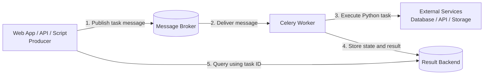

**Interview answer:** Celery has three moving parts. The producer calls `task.delay(...)`, which generates a task ID, serializes the task name and arguments into a message, and publishes it to a broker such as RabbitMQ, Redis, or SQS; a long-running worker subscribed to that queue deserializes the message, finds the task in its registry, runs it in an execution pool, and acknowledges the broker; the optional result backend stores state and return value so the caller can query them later by task ID. The broker and the result backend are separate roles even when both are Redis — the broker is written by the producer and read by the worker, the backend is written by the worker and read by the producer or monitoring code. Neither is the source of truth for business data.

**Gotcha:** Publishing a task inside `transaction.atomic()` before the transaction commits. A fast worker can pick up the message and query the row before it exists, so the task fails on a missing record; wrap the publish in `transaction.on_commit(lambda: process_order.delay(order.id))` instead.

---

# 1. Why Asynchronous Task Processing Is Needed

A normal web request is synchronous:

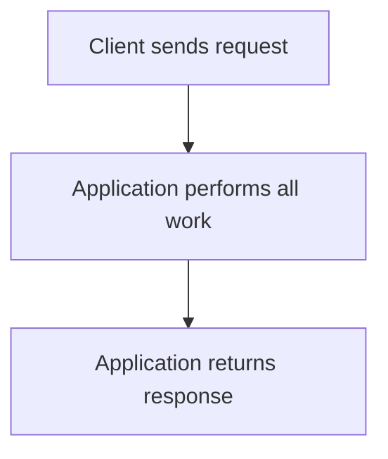

This is acceptable for fast operations such as:

- Reading a database record
- Validating a small payload
- Returning cached data

It becomes a problem when the request performs slow or resource-heavy work:

- Sending thousands of emails
- Generating a PDF report
- Processing an uploaded video
- Running OCR on documents
- Calling a slow third-party API
- Training or invoking an ML pipeline
- Recalculating analytics
- Creating scheduled reports

Without a background task system, the user waits while the work completes.

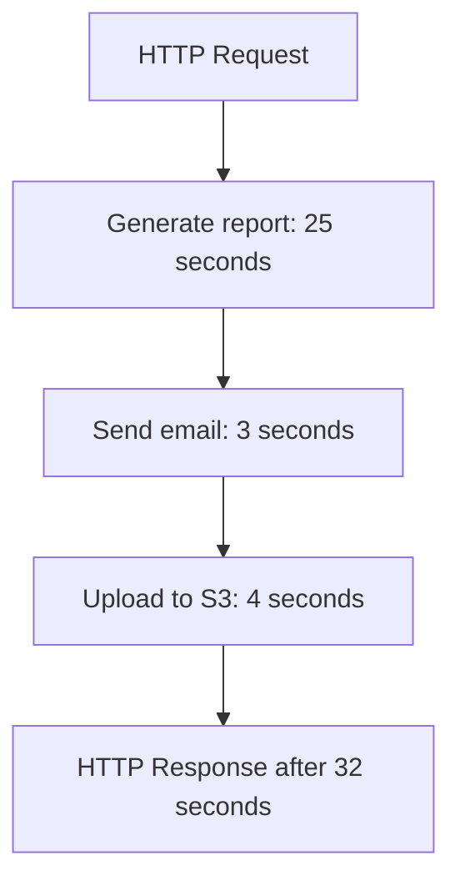

With Celery, the application submits the slow work as a task and returns quickly.

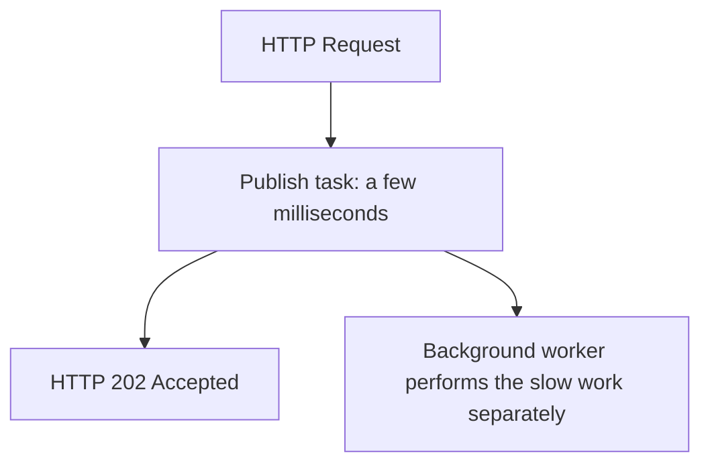

The web application and the background processing system are therefore **decoupled**.

---

# 2. Celery in One Sentence

**Celery is a distributed task queue that sends task messages through a broker to worker processes, with an optional result backend for storing task states and return values.**

Celery mainly focuses on:

- Background processing
- Distributed execution
- Task retries
- Scheduling
- Queue-based routing
- Parallel execution
- Task status and result tracking
- Horizontal scaling

Celery does not execute a task merely because a function has the `@app.task` decorator. The function runs asynchronously only when it is submitted using methods such as: `send_email.delay(user_id=42)`

or:

```python
send_email.apply_async(
    kwargs={"user_id": 42},
    queue="emails",
    countdown=10,
)
```

---

# 3. High-Level Architecture

The four important participants are:

1. **Producer or client** — submits the task
2. **Broker** — holds and delivers the task message
3. **Worker** — executes the task
4. **Result backend** — optionally stores task state and result

A common deployment might use:

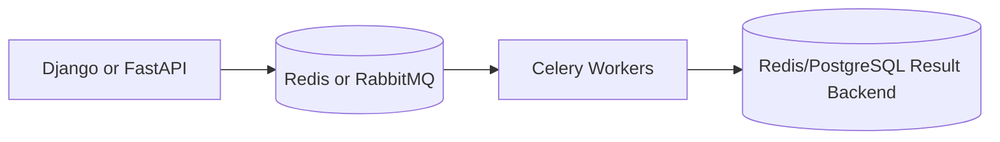

The broker and result backend have different jobs, even when both use Redis.

---

# 4. Core Components

## 4.1 Producer or Client

The producer is the code that creates and submits a task message.

Common producers include:

- Django views
- FastAPI endpoints
- Flask routes
- Management commands
- Python scripts
- Another Celery task
- Celery Beat for scheduled tasks

Example: `result = generate_invoice.delay(invoice_id=125)`

The producer does **not** execute `generate_invoice()` directly. Instead, Celery:

1. Creates a unique task ID.
2. Serializes the task name and arguments.
3. Publishes a message to the broker.
4. Returns an `AsyncResult` object.

A simplified message looks like this:

```json
{
  "id": "4a429ad6-6ca8-4d2f-9617-746fa62457fd",
  "task": "billing.tasks.generate_invoice",
  "args": [],
  "kwargs": {
    "invoice_id": 125
  },
  "retries": 0
}
```

The actual Celery protocol includes additional headers and metadata.

### `delay()` vs `apply_async()`

Use `delay()` for a simple immediate call: `add.delay(10, 20)`

Use `apply_async()` when you need execution options:

```python
add.apply_async(
    args=(10, 20),
    queue="calculations",
    countdown=30,
    expires=120,
)
```

`delay()` is effectively a convenient shortcut around `apply_async()`.

---

## 4.2 Message Broker

The broker is the communication layer between producers and workers.

Its primary responsibility is to:

- Receive task messages
- Place messages in queues
- Preserve them according to broker configuration
- Deliver messages to available workers
- Handle acknowledgements and redelivery

Common broker choices:

| Broker | Good Fit | Important Characteristics |
|---|---|---|
| RabbitMQ | General production workloads | Mature messaging features, routing, acknowledgements, durable queues |
| Redis | Simple setup and fast small-message transport | Easy to operate, can also act as a result backend |
| Amazon SQS | AWS-managed workloads | Highly scalable and managed, but some Celery remote-control features are unavailable |
| Google Cloud Pub/Sub | GCP-managed workloads | Managed and scalable messaging |
| SQLite transport | Local experiments only | Not a production broker |

The broker stores a **task message**, not the final business result.

For example, it may contain:

```text
Run task: reports.tasks.generate_report
Arguments: report_id=721
Queue: reports
Task ID: abc-123
```

It should generally not contain:

- Large uploaded files
- Huge JSON documents
- Raw video or image bytes
- Entire database models
- Sensitive objects that cannot be serialized safely

Store large data in a database or object storage and pass only a reference:

```python
# Better
process_document.delay(document_id=984)

# Avoid
process_document.delay(file_bytes=large_80_mb_file)
```

---

## 4.3 Worker

A worker is a long-running Celery process that consumes task messages and executes the corresponding Python functions.

Start a worker: `celery -A project.celery_app:app worker --loglevel=INFO`

A worker performs the following flow:

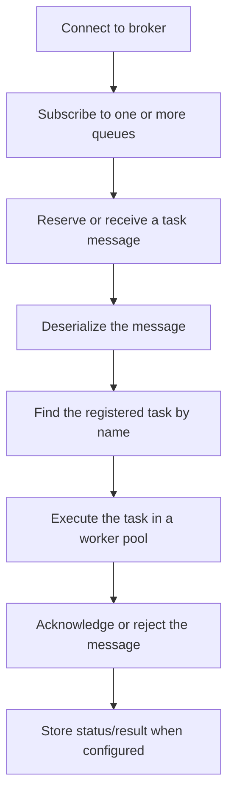

A worker may run multiple task execution units concurrently.

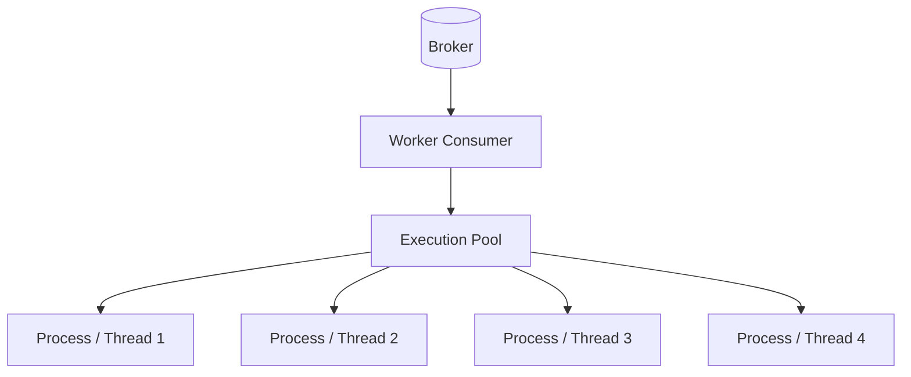

Example:

```bash
celery -A project.celery_app:app worker \
  --loglevel=INFO \
  --concurrency=4
```

This worker can execute up to four tasks concurrently, depending on the selected pool.

---

## 4.4 Result Backend

The result backend is an optional storage mechanism for:

- Task state
- Return value
- Exception information
- Traceback
- Custom progress metadata

Example:

```python
result = add.delay(10, 20)

print(result.id)
print(result.state)
print(result.get(timeout=5))
```

Possible output: `4a429ad6-6ca8-4d2f-9617-746fa62457fd`, then `SUCCESS`, then `30`.

Celery does not enable result storage automatically. A result backend must be configured when the application needs to retrieve states or return values.

Common choices:

| Result Backend | Good Fit | Trade-Off |
|---|---|---|
| Redis | Fast status/result lookup | Memory and persistence must be managed |
| RPC | Real-time result delivery to the initiating client | Results are not a normal shared persistent store |
| PostgreSQL/MySQL through SQLAlchemy | Persistent results and existing relational infrastructure | Polling can add database load |
| Django ORM | Django projects already using a relational database | Requires cleanup and careful query volume |
| Memcached | Fast temporary results | Not suitable for durable result history |
| Custom backend | Special storage or compliance requirements | Additional implementation and maintenance |

The result backend should not become the permanent source of truth for business data.

For example, an invoice task should save the final invoice record in the application database. The result backend may only report:

```json
{
  "state": "SUCCESS",
  "result": {
    "invoice_id": 125
  }
}
```

---

# 5. Complete Task Lifecycle

Consider this API operation: `generate_report.delay(report_id=721)`

The full lifecycle is:

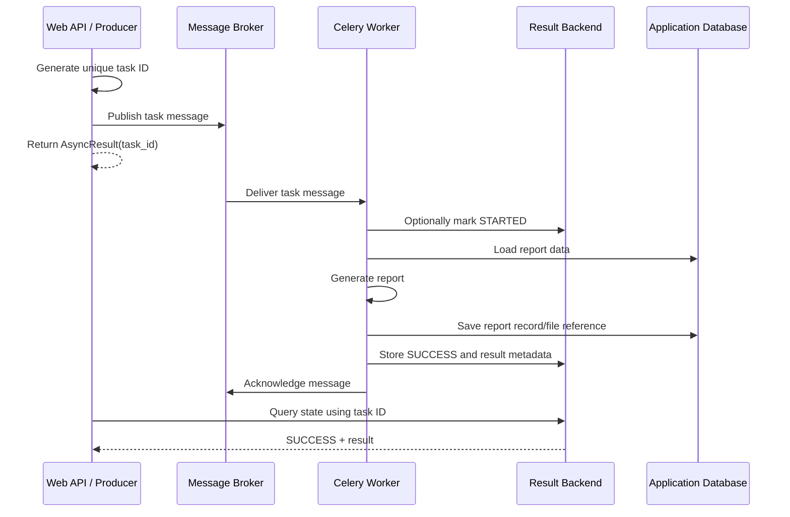

## Step 1: Producer creates a task request

```python
result = generate_report.delay(report_id=721)
```

The producer immediately receives an object containing the task ID: `task_id = result.id`

## Step 2: Message is published to the broker

The message waits in the `reports` queue until a suitable worker is ready.

## Step 3: Worker consumes the message

A worker subscribed to the `reports` queue receives the task.

```bash
celery -A project.celery_app:app worker -Q reports
```

## Step 4: Worker executes the task

```python
@app.task
def generate_report(report_id: int) -> dict:
    report = build_report(report_id)
    return {"report_id": report.id, "status": "generated"}
```

## Step 5: Worker acknowledges the broker message

The exact acknowledgement timing depends on configuration.

- **Early acknowledgement:** usually acknowledged before execution
- **Late acknowledgement:** acknowledged after execution

This affects redelivery behavior if a worker crashes.

## Step 6: Worker writes to the result backend

When result storage is enabled, Celery stores state and result metadata under the task ID: `state: SUCCESS`, `result: {"report_id": 721, "status": "generated"}`.

## Step 7: Application checks the result

```python
from celery.result import AsyncResult

result = AsyncResult(task_id, app=app)

if result.successful():
    print(result.result)
```

---

# 6. Message Broker in Detail

## 6.1 Broker Responsibilities

The broker is responsible for message delivery, not task execution.

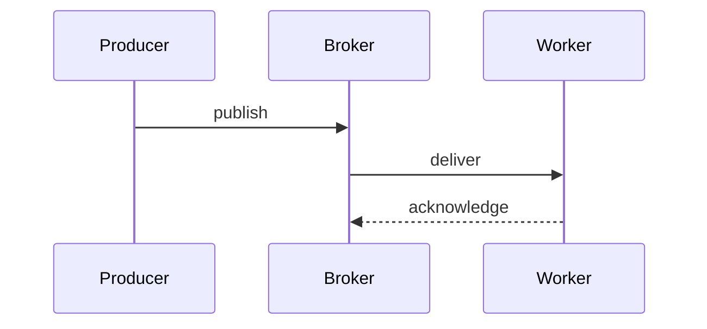

The broker manages concepts such as:

- Connections
- Channels
- Exchanges, depending on the transport
- Queues
- Routing keys
- Message durability
- Acknowledgements
- Visibility timeouts for some transports
- Redelivery

## 6.2 Queue

A queue is a named buffer that holds messages until workers consume them.

```text
Queue: emails
  - send_welcome_email(user_id=15)
  - send_invoice_email(invoice_id=91)
  - send_password_reset(user_id=18)
```

Workers can subscribe to specific queues: `celery -A project.celery_app:app worker -Q emails`

## 6.3 Why a Broker Is Required

The broker provides decoupling.

The producer does not need to know:

- Which worker will execute the task
- Where that worker is running
- Whether the worker is currently busy
- How many workers exist
- Whether execution begins immediately

The producer only publishes a message.

## 6.4 RabbitMQ vs Redis as Broker

### RabbitMQ

RabbitMQ is a dedicated message broker.

Use it when the system needs:

- Mature routing behavior
- Durable messaging
- Strong queue-management features
- Clear separation between messaging and caching
- A traditional production message broker

### Redis

Redis can act as both broker and result backend.

Use it when the system needs:

- Simple infrastructure
- Fast transport for relatively small messages
- Easy local development
- A familiar Redis-based stack

Be careful with:

- Redis memory usage
- Eviction policies
- Persistence configuration
- Large messages
- Using the same Redis instance for unrelated critical workloads

### Practical Selection

| Scenario | Common broker and backend choice |
| --- | --- |
| Simple project or POC | Redis broker + Redis backend |
| General production system | RabbitMQ broker + Redis backend |
| AWS-managed architecture | SQS broker + Redis/RDS/custom result storage |

These are common patterns, not strict rules.

---

# 7. Worker in Detail

## 7.1 Worker Process Structure

A Celery worker is more than one Python function runner.

At a high level, it contains:

- A broker consumer
- Task registration
- An execution pool
- Internal timers
- Event and heartbeat support
- Result-backend integration
- Logging and lifecycle hooks

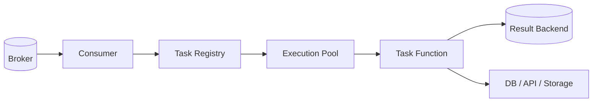

## 7.2 Task Registration

The worker must know the task name.

```python
@app.task(name="billing.generate_invoice")
def generate_invoice(invoice_id: int) -> dict:
    ...
```

When a message contains:

```json
{
  "task": "billing.generate_invoice"
}
```

the worker searches its task registry for that name.

An unregistered-task error commonly means:

- The task module was not imported
- Autodiscovery was not configured
- The worker is using old code
- Producer and worker task names differ
- The worker was not restarted after code changes

## 7.3 Concurrency Pools

Celery 5.6 uses **prefork** as the default worker pool and recommends it as the starting point for most workloads.

| Pool | Execution Model | Suitable For | Notes |
|---|---|---|---|
| `prefork` | Multiple OS processes | CPU-bound and general workloads | Default and most feature-complete |
| `threads` | Native threads | I/O-heavy work with thread-safe libraries | Python GIL limits CPU-bound parallelism |
| `gevent` | Greenlets | High-concurrency network I/O | Requires compatible cooperative libraries |
| `eventlet` | Greenlets | High-concurrency network I/O | CPU-bound work can block the event loop |
| `solo` | Main thread only | Debugging and simple local runs | Executes one task at a time |
| `custom` | User-provided pool | Advanced specialized cases | Additional maintenance |

Start with prefork:

```bash
celery -A project.celery_app:app worker \
  --pool=prefork \
  --concurrency=4
```

Use alternative pools only after testing library compatibility and Celery feature support. Some worker features are unavailable or behave differently outside prefork.

## 7.4 Concurrency Is Not the Same as Worker Count

Suppose there are:

- 3 worker containers
- `--concurrency=4` for each worker

Approximate task execution capacity is `3 workers × 4 execution slots = 12 concurrent tasks`.

Actual throughput still depends on:

- CPU
- Memory
- Task duration
- External API limits
- Database connections
- Broker performance
- Network latency
- Task type

## 7.5 Separate Workers for Different Workloads

Avoid mixing every task type in one worker pool.

```text
emails queue    → I/O-focused workers
reports queue   → CPU/memory-focused workers
payments queue  → small controlled worker pool
default queue   → general workers
```

This prevents a large report task from delaying a password-reset email.

---

# 8. Result Backend in Detail

## 8.1 Task States

Common built-in states are:

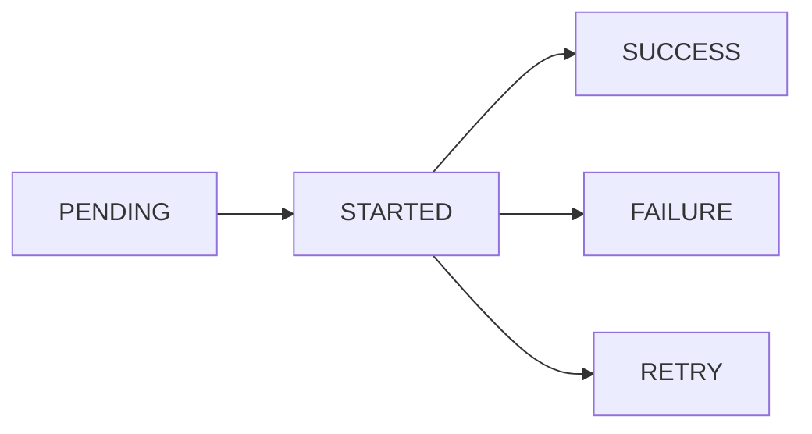

Other states include:

- `RECEIVED`
- `REVOKED`
- `REJECTED`
- Custom application-defined states

Important detail:

`PENDING` can mean either:

1. The task is waiting, or
2. The backend does not know the task ID.

It is not proof that the message is currently present in the broker.

## 8.2 `STARTED` Is Not Enabled by Default

Enable task-start tracking when needed: `app.conf.task_track_started = True`

This introduces additional backend writes, so enable it for an actual monitoring requirement rather than automatically.

## 8.3 Reading Results

```python
result = add.delay(20, 22)

print(result.id)
print(result.state)

value = result.get(timeout=10)
print(value)
```

Useful `AsyncResult` methods and properties:

```python
result.ready()
result.successful()
result.failed()
result.state
result.result
result.traceback
result.get(timeout=10)
result.forget()
```

Avoid calling `get()` inside a normal web request unless the wait is intentional. Waiting for a Celery task during the request removes much of the benefit of asynchronous execution.

```python
# Usually poor API design
result = generate_report.delay(report_id)
report = result.get(timeout=60)
return report
```

A better API flow is:

```text
POST /reports
    → 202 Accepted
    → {"task_id": "...", "report_id": 721}

GET /reports/721
    → {"status": "processing"}

GET /reports/721
    → {"status": "completed", "download_url": "..."}
```

## 8.4 Ignore Results When They Are Not Needed

For fire-and-forget tasks:

```python
@app.task(ignore_result=True)
def record_audit_event(event: dict) -> None:
    ...
```

Or globally: `app.conf.task_ignore_result = True`

Disabling unnecessary results reduces:

- Backend writes
- Storage usage
- Network traffic
- Cleanup work

## 8.5 Expire Old Results

Results should normally have a retention policy.

```python
app.conf.result_expires = 3600  # 1 hour
```

The exact cleanup behavior depends on the selected backend.

Do not allow temporary task metadata to grow forever.

## 8.6 Result Backend Is Not a Business Database

Incorrect design:

> Invoice status exists only in Celery result backend.

Better design:

```text
Application database:
    invoice.status = "GENERATED"
    invoice.file_url = "..."

Celery backend:
    task state = SUCCESS
    result = {"invoice_id": 125}
```

Celery results are operational metadata. Business state belongs in the business database.

---

# 9. Broker vs Result Backend

This distinction is one of the most important parts of Celery architecture.

| Area | Message Broker | Result Backend |
|---|---|---|
| Primary purpose | Deliver task messages | Store or transmit task states/results |
| Written by | Producer | Worker |
| Read by | Worker | Producer, API, monitoring code |
| Data example | Task name, arguments, task ID | `SUCCESS`, return value, exception |
| Required | Yes | No |
| Typical technologies | RabbitMQ, Redis, SQS | Redis, RPC, PostgreSQL, Django ORM |
| Data lifetime | Until consumed, expired, or removed | Until result expiration or cleanup |
| Business source of truth | No | No |

## Same Technology, Different Logical Role

Redis may be used for both:

```python
broker_url = "redis://localhost:6379/0"
result_backend = "redis://localhost:6379/1"
```

Here:

- Redis database `0` carries task messages.
- Redis database `1` stores results.

The infrastructure is the same product, but the responsibilities remain separate.

For larger production systems, separate instances or clusters may provide better isolation than separate logical databases alone.

---

# 10. Runnable Redis Example

This example uses:

- Celery 5.6.3
- Redis as broker
- Redis as result backend
- A local Python worker

## 10.1 Project Structure

```text
celery-demo/
├── celery_app.py
├── tasks.py
├── run_task.py
├── docker-compose.yml
└── requirements.txt
```

## 10.2 Install Dependencies

`requirements.txt`

```text
celery[redis]==5.6.3
```

Install:

```bash
python -m venv .venv
source .venv/bin/activate
pip install -r requirements.txt
```

## 10.3 Start Redis

`docker-compose.yml`

```yaml
services:
  redis:
    image: redis:7-alpine
    ports:
      - "6379:6379"
    command: redis-server --appendonly yes
    volumes:
      - redis_data:/data

volumes:
  redis_data:
```

Run: `docker compose up -d`

## 10.4 Configure Celery

`celery_app.py`

```python
import os

from celery import Celery

app = Celery(
    "celery_demo",
    broker=os.getenv("CELERY_BROKER_URL", "redis://localhost:6379/0"),
    backend=os.getenv("CELERY_RESULT_BACKEND", "redis://localhost:6379/1"),
    include=["tasks"],
)

app.conf.update(
    task_serializer="json",
    accept_content=["json"],
    result_serializer="json",
    timezone="UTC",
    enable_utc=True,
    task_track_started=True,
    result_expires=3600,
    broker_connection_retry_on_startup=True,
)
```

## 10.5 Define Tasks

`tasks.py`

```python
import time

from celery_app import app

@app.task
def add(x: int, y: int) -> int:
    return x + y

@app.task(
    bind=True,
    autoretry_for=(ConnectionError,),
    retry_backoff=True,
    retry_jitter=True,
    retry_kwargs={"max_retries": 5},
)
def generate_report(self, report_id: int) -> dict:
    # Simulate slow work.
    time.sleep(5)

    return {
        "report_id": report_id,
        "status": "generated",
    }
```

## 10.6 Start the Worker

```bash
celery -A celery_app:app worker --loglevel=INFO
```

For explicit concurrency:

```bash
celery -A celery_app:app worker \
  --pool=prefork \
  --concurrency=4 \
  --loglevel=INFO
```

## 10.7 Submit a Task

`run_task.py`

```python
from tasks import add, generate_report

add_result = add.delay(10, 20)

print("Add task ID:", add_result.id)
print("Add result:", add_result.get(timeout=10))

report_result = generate_report.delay(report_id=721)

print("Report task ID:", report_result.id)
print("Initial state:", report_result.state)
print("Report result:", report_result.get(timeout=20))
```

Run: `python run_task.py`

Expected output:

```text
Add task ID: <uuid>
Add result: 30
Report task ID: <uuid>
Initial state: PENDING or STARTED
Report result: {'report_id': 721, 'status': 'generated'}
```

## 10.8 What Happened Internally

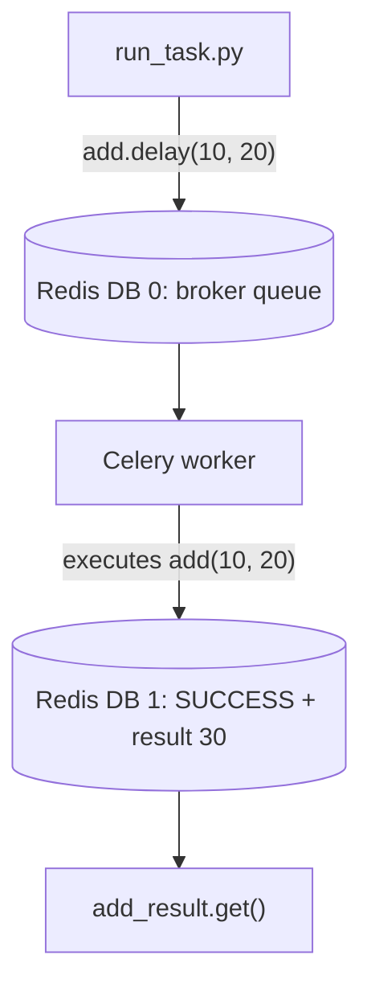

---

# 11. Production Architecture Example

Consider an application that supports:

- User emails
- PDF report generation
- Payment reconciliation
- Image processing

A single queue is technically possible (`default queue → all workers → every task type`). It is usually difficult to operate because different tasks have different characteristics.

A better architecture:

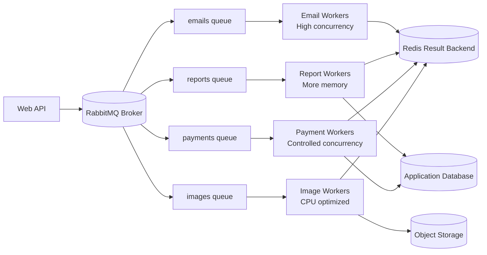

Benefits:

- Independent scaling
- Better fault isolation
- Different concurrency settings
- Easier priority handling
- Safer external API rate control
- More predictable latency
- Clear operational ownership

Example worker commands:

```bash
celery -A project.celery_app:app worker \
  -Q emails \
  --concurrency=20 \
  --hostname=emails@%h

celery -A project.celery_app:app worker \
  -Q reports \
  --concurrency=4 \
  --hostname=reports@%h

celery -A project.celery_app:app worker \
  -Q payments \
  --concurrency=2 \
  --hostname=payments@%h
```

The exact concurrency values must come from load testing and resource measurements.

---

# 12. Reliability and Delivery Semantics

## 12.1 Acknowledgements

An acknowledgement tells the broker that a worker has accepted responsibility for a message.

### Early Acknowledgement

With the common default behavior, the task is acknowledged before execution completes.

Advantage:

- Reduces accidental duplicate execution after some worker failures

Risk:

- If the worker process terminates during execution, the task may be lost from the queue

### Late Acknowledgement

Enable per task:

```python
@app.task(acks_late=True)
def charge_customer(payment_id: int) -> None:
    ...
```

or globally: `app.conf.task_acks_late = True`

The message is acknowledged after task execution.

Advantage:

- A broker may redeliver the task when a worker dies before acknowledgement

Risk:

- The same task may execute more than once

Therefore, late acknowledgement should be paired with **idempotent task design**.

## 12.2 Idempotency

An idempotent operation can be repeated without creating an incorrect additional effect.

Unsafe task:

```python
@app.task(acks_late=True)
def charge_card(payment_id: int) -> None:
    payment = Payment.objects.get(id=payment_id)
    gateway.charge(payment.amount)
```

If the task executes twice, the customer may be charged twice.

Safer approach:

```python
@app.task(acks_late=True)
def charge_card(payment_id: int) -> None:
    payment = Payment.objects.get(id=payment_id)

    if payment.status == "completed":
        return

    gateway.charge(
        amount=payment.amount,
        idempotency_key=f"payment-{payment.id}",
    )

    payment.status = "completed"
    payment.save(update_fields=["status"])
```

Idempotency may use:

- A unique database constraint
- An idempotency key
- A processed-event table
- Compare-and-set updates
- Transactional locking
- External API idempotency support

## 12.3 Retries

Retry temporary failures, not permanent validation errors.

```python
@app.task(
    bind=True,
    autoretry_for=(TimeoutError, ConnectionError),
    retry_backoff=True,
    retry_jitter=True,
    retry_kwargs={"max_retries": 5},
)
def call_partner_api(self, customer_id: int) -> dict:
    return partner_client.fetch_customer(customer_id)
```

Exponential backoff prevents immediate retry storms.

```text
Attempt 1 → fail
Wait ~1 second
Attempt 2 → fail
Wait ~2 seconds
Attempt 3 → fail
Wait ~4 seconds
...
```

Do not retry indefinitely without an operational reason.

## 12.4 Time Limits

Protect workers from tasks that never finish.

```python
app.conf.task_soft_time_limit = 270
app.conf.task_time_limit = 300
```

- Soft limit gives the task a chance to handle an exception and clean up.
- Hard limit terminates execution when the maximum is crossed.

Time-limit support can differ by worker pool and platform. Test it with the actual production pool.

## 12.5 Transaction Boundary

A common Django issue is publishing a task before the surrounding database transaction commits.

Problem:

```python
with transaction.atomic():
    order = Order.objects.create(...)
    process_order.delay(order.id)
```

A fast worker may read the database before `order` is committed.

Safer pattern:

```python
from django.db import transaction

with transaction.atomic():
    order = Order.objects.create(...)

    transaction.on_commit(
        lambda: process_order.delay(order.id)
    )
```

This publishes the task only after a successful commit.

## 12.6 Delivery Is Not Exactly Once

In distributed systems, failures can happen between:

- Task execution
- Database commit
- Result storage
- Broker acknowledgement
- Network confirmation

Design Celery tasks assuming they may be:

- Retried
- Redelivered
- Executed more than once
- Interrupted during execution

The practical target is normally:

```text
At-least-once capable delivery
            +
Idempotent business operation
            =
Reliable observable outcome
```

---

# 13. Scaling and Performance

## 13.1 Horizontal Scaling

Add more workers when queue depth or task latency increases.

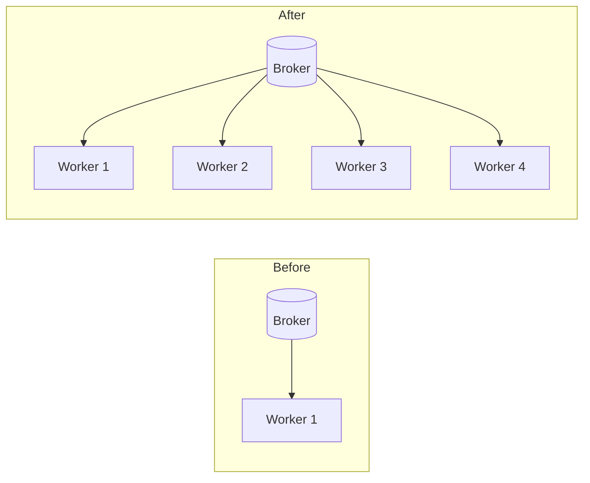

Workers coordinate through the broker. The producer normally requires no change.

## 13.2 Vertical Scaling

Increase resources for existing workers:

- More CPU
- More memory
- Higher concurrency
- Faster network
- Faster disks, when relevant

Horizontal scaling is often safer because it improves isolation and replacement behavior.

## 13.3 Concurrency Selection

General starting point:

```text
CPU-bound task
    → prefork
    → concurrency near available CPU cores

I/O-bound task
    → prefork or threads first
    → benchmark higher concurrency carefully

Very high cooperative network I/O
    → consider gevent/eventlet
    → verify every library is compatible
```

More concurrency is not automatically faster.

High concurrency can overload:

- PostgreSQL connection limits
- Redis
- Third-party APIs
- Memory
- File descriptors
- Network sockets
- Downstream microservices

## 13.4 Prefetch

Workers can reserve tasks before execution slots become available.

Celery's default `worker_prefetch_multiplier` is commonly `4`.

The approximate reserved-message count is `concurrency × prefetch multiplier`, so a worker with `concurrency = 4` and `prefetch multiplier = 4` may reserve multiple tasks per execution slot.

For long-running tasks, a lower value can improve fairness: `app.conf.worker_prefetch_multiplier = 1`

A common long-task configuration is:

```python
app.conf.update(
    task_acks_late=True,
    worker_prefetch_multiplier=1,
)
```

This is not a universal setting. Benchmark it with the real workload.

## 13.5 Separate Short and Long Tasks

Bad arrangement:

```text
One queue:
- 20 ms notification
- 40-minute video processing
- 100 ms audit task
```

A long task can sit ahead of many latency-sensitive tasks.

Better:

```text
short_tasks queue → short-task workers
long_tasks queue  → long-task workers
```

## 13.6 Keep Task Messages Small

Prefer: `generate_thumbnail.delay(image_id=101)`

Instead of: `generate_thumbnail.delay(image_bytes=large_binary_payload)`

Small messages reduce:

- Serialization cost
- Broker memory pressure
- Network transfer
- Queue congestion
- Failure-recovery cost

## 13.7 Avoid Blocking on Results

This defeats async processing:

```python
result = heavy_task.delay()
value = result.get()
```

Use callbacks, chains, groups, chords, polling endpoints, WebSockets, or application status records when the workflow requires later continuation.

---

# 14. Routing Tasks to Different Queues

## 14.1 Configuration-Based Routing

```python
app.conf.task_routes = {
    "project.tasks.send_email": {
        "queue": "emails",
    },
    "project.tasks.generate_report": {
        "queue": "reports",
    },
    "project.tasks.reconcile_payment": {
        "queue": "payments",
    },
}
```

This is preferable to scattering queue names throughout business code.

## 14.2 Start Queue-Specific Workers

```bash
celery -A project.celery_app:app worker \
  -Q emails \
  --hostname=emails@%h

celery -A project.celery_app:app worker \
  -Q reports \
  --hostname=reports@%h
```

## 14.3 Dynamic Routing

A producer can override the queue:

```python
generate_report.apply_async(
    kwargs={"report_id": 721},
    queue="priority-reports",
)
```

Use dynamic routing sparingly. Central configuration is easier to review and operate.

## 14.4 Routing Decision Model

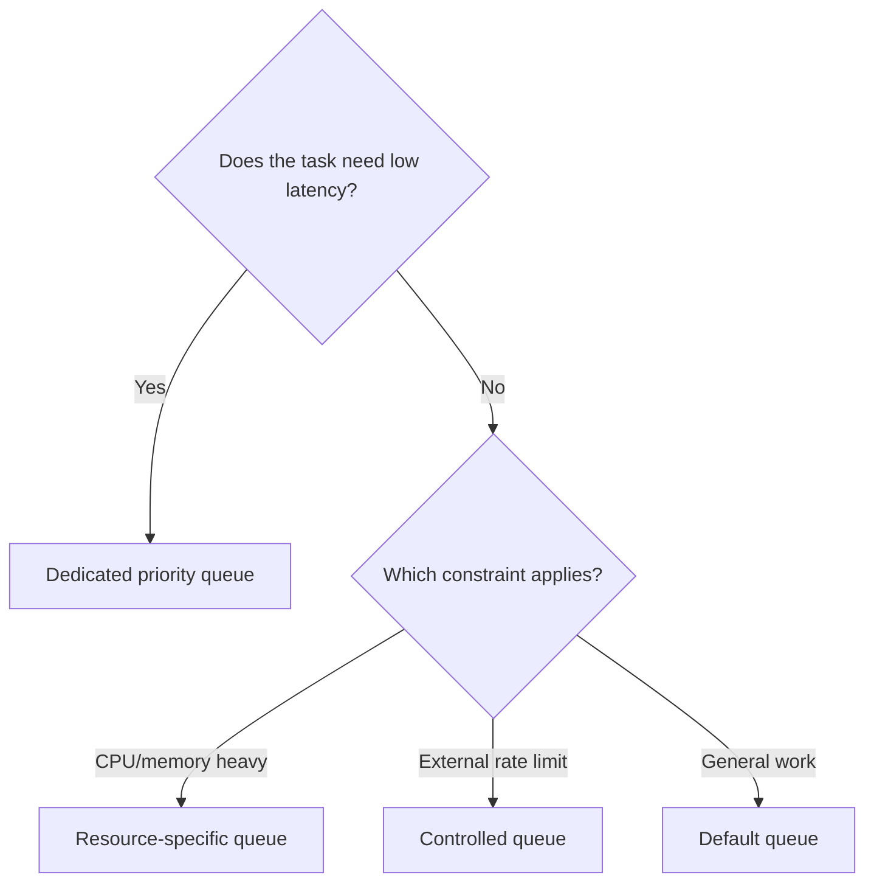

---

# 15. Monitoring and Operations

A production Celery system needs visibility into:

- Queue depth
- Oldest queued message
- Task runtime
- Success and failure rate
- Retry rate
- Worker availability
- Worker heartbeats
- Broker connections
- Result-backend usage
- Memory and CPU
- Task timeouts
- Unacknowledged messages

## 15.1 Useful Commands

Check workers: `celery -A project.celery_app:app status`

Inspect active, reserved, scheduled, and registered tasks:

```bash
celery -A project.celery_app:app inspect active
celery -A project.celery_app:app inspect reserved
celery -A project.celery_app:app inspect scheduled
celery -A project.celery_app:app inspect registered
```

## 15.2 Flower

Flower is a web-based Celery monitoring tool.

Typical usage:

```bash
pip install flower
celery -A project.celery_app:app flower
```

It can help visualize:

- Workers
- Tasks
- Runtime
- Failures
- Retries
- Events

Do not expose Flower publicly without authentication and network controls.

## 15.3 Graceful Shutdown

Use graceful termination so workers can finish active tasks.

Container platforms should provide enough termination grace time for normal task completion.

A forced kill can interrupt active work, leading to:

- Lost work with early acknowledgements
- Redelivery with late acknowledgements
- Partially completed business operations

Tasks should be designed to recover from both situations.

## 15.4 Logging Context

Include useful identifiers:

```text
task_id
task_name
queue
retry_number
business_entity_id
duration
worker_hostname
```

Example:

```python
import logging

logger = logging.getLogger(__name__)

@app.task(bind=True)
def generate_report(self, report_id: int) -> dict:
    logger.info(
        "Generating report",
        extra={
            "task_id": self.request.id,
            "report_id": report_id,
        },
    )
    ...
```

Avoid logging secrets or full sensitive payloads.

---

# 16. Security Considerations

## 16.1 Protect the Broker

Anyone who can publish trusted Celery messages may be able to trigger registered tasks.

Use:

- Authentication
- Private networking
- TLS
- Firewall rules
- Least-privilege broker users
- Separate virtual hosts or namespaces
- Secret rotation

## 16.2 Prefer JSON Serialization

```python
app.conf.update(
    task_serializer="json",
    result_serializer="json",
    accept_content=["json"],
)
```

Avoid unsafe serializers such as pickle when untrusted users or services may access the broker. Pickle can deserialize executable Python objects.

## 16.3 Do Not Pass Secrets as Task Arguments

Task messages may appear in:

- Broker storage
- Logs
- Monitoring tools
- Error traces
- Dead-letter or retry flows

Prefer passing a database identifier and loading the secret securely inside the task.

## 16.4 Validate Task Inputs

A task should not assume that every message is valid merely because it came through the broker.

```python
@app.task
def process_invoice(invoice_id: int) -> None:
    if invoice_id <= 0:
        raise ValueError("invoice_id must be positive")
```

Also enforce authorization and tenant boundaries when processing multi-tenant data.

---

# 17. Practical Use Cases

## 17.1 Email Delivery

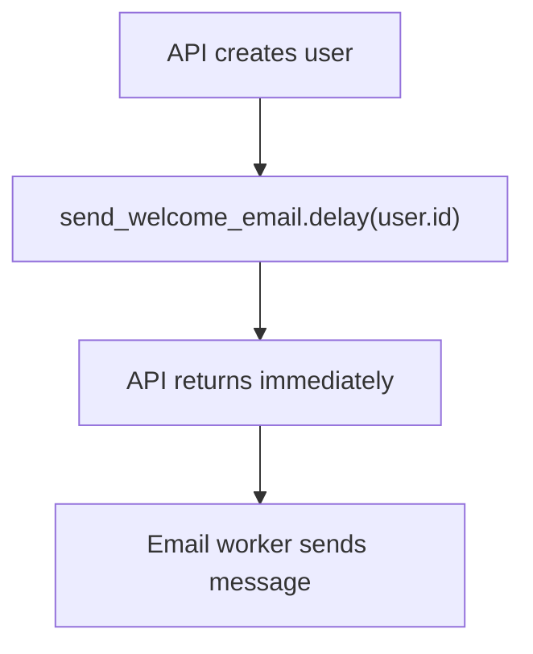

The task should be idempotent or record whether the email was already sent.

## 17.2 Report Generation

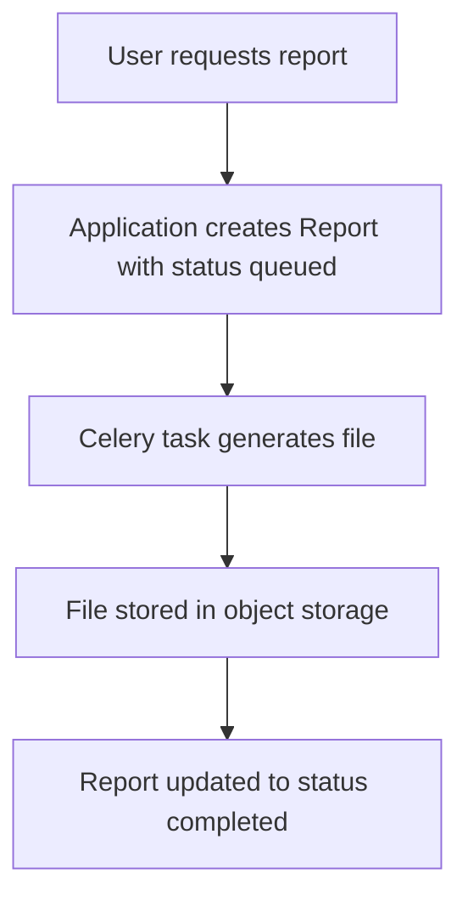

The application database is the business source of truth.

## 17.3 OCR Pipeline

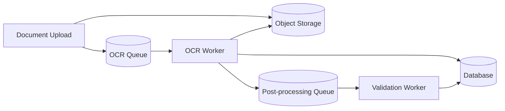

Pass a file reference, not raw document bytes.

## 17.4 Third-Party API Synchronization

Use:

- Timeouts
- Retries with backoff
- Rate limits
- Idempotency keys
- Circuit-breaking at the application layer when needed
- Dedicated queues for each integration

## 17.5 Scheduled Tasks

Celery Beat publishes scheduled task messages to the broker: `Celery Beat → Broker → Worker`.

Beat does not normally execute the business task itself. It schedules and publishes it.

Only one active scheduler should own a given schedule unless the scheduler implementation provides safe coordination.

---

# 18. Best-Practice Checklist

## Architecture

- Use the broker only for task-message delivery.
- Use the result backend only when states or results are needed.
- Store permanent business state in the application database.
- Separate task queues by workload, latency, or risk.
- Scale workers independently for each queue.

## Task Design

- Keep tasks small and focused.
- Pass IDs or storage references instead of large payloads.
- Make tasks idempotent.
- Add explicit network timeouts.
- Retry only recoverable failures.
- Use exponential backoff and jitter.
- Set practical time limits.
- Avoid waiting for task results inside web requests.
- Publish tasks after database commit.

## Worker Design

- Start with the prefork pool.
- Size concurrency using measurements, not guesswork.
- Avoid mixing very long and very short tasks.
- Use queue-specific workers.
- Plan graceful shutdown behavior.
- Monitor worker memory and restart policies.

## Broker and Backend

- Protect both using authentication and private networking.
- Use TLS where traffic crosses untrusted networks.
- Configure persistence based on business requirements.
- Define result expiration and cleanup.
- Monitor queue depth and backend storage.
- Avoid large task messages.
- Avoid sharing one Redis instance with unrelated high-risk workloads unless capacity and isolation are understood.

## Observability

- Log task ID and business entity ID.
- Track success, failure, retry, and duration.
- Alert on growing queue depth.
- Alert on missing workers or heartbeats.
- Measure oldest-message age, not only queue length.
- Protect monitoring dashboards.

---

## Official References

- [Celery Documentation](https://docs.celeryq.dev/)
- [Introduction to Celery](https://docs.celeryq.dev/en/stable/getting-started/introduction.html)
- [First Steps with Celery](https://docs.celeryq.dev/en/stable/getting-started/first-steps-with-celery.html)
- [Backends and Brokers](https://docs.celeryq.dev/en/stable/getting-started/backends-and-brokers/)
- [Tasks](https://docs.celeryq.dev/en/stable/userguide/tasks.html)
- [Workers Guide](https://docs.celeryq.dev/en/stable/userguide/workers.html)
- [Concurrency](https://docs.celeryq.dev/en/stable/userguide/concurrency/)
- [Configuration and Defaults](https://docs.celeryq.dev/en/stable/userguide/configuration.html)
- [Optimizing Celery](https://docs.celeryq.dev/en/stable/userguide/optimizing.html)
- [Monitoring and Management](https://docs.celeryq.dev/en/stable/userguide/monitoring.html)
