# Periodic / Scheduled Tasks with Celery Beat

> How Celery Beat schedules recurring work, why exactly one scheduler may be active, and how to keep periodic tasks idempotent and non-overlapping.
>
> **Reference baseline:** Celery 5.6 stable documentation, reviewed on July 30, 2026

## In short

- Celery Beat is a scheduler process: it evaluates the schedule, publishes due task messages to the broker, and does not normally execute the task itself — workers do.
- Only one active Beat scheduler may own a schedule; a second instance publishes duplicate task messages, so scale workers horizontally and keep Beat a singleton.
- Pick the schedule by the question it answers: float or `timedelta` for "after how much time", `crontab` for "at which clock or calendar time", `solar` for sun events, `django-celery-beat` for runtime-editable database schedules.
- A schedule entry is `task`, `schedule`, `args`, `kwargs`, and `options` (queue, routing, `expires`) — and `task` must be the registered Celery task name, not the Python import path.
- Beat stores last-run state in the local `celerybeat-schedule` file, or in the database with `django-celery-beat`; set `timezone` and `enable_utc` explicitly and use named IANA zones so daylight-saving changes are defined.
- Beat does not wait for the previous run to finish, so a task that can outlive its interval needs a distributed lock, a database uniqueness constraint, or workload partitioning.
- Assume duplicate delivery: make periodic tasks idempotent on a business key such as `invoice:{customer_id}:{billing_month}`, never on the Celery task ID, and add `expires` to freshness-sensitive work.

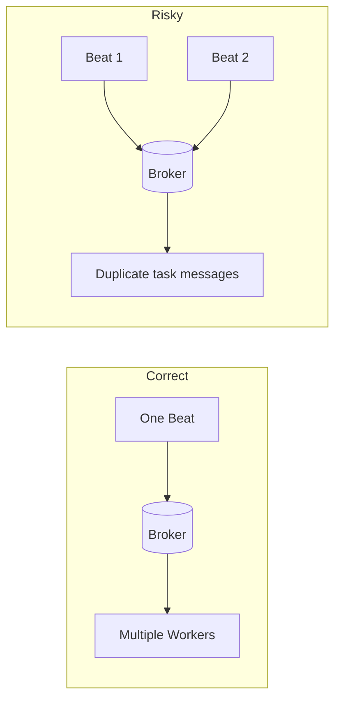

**Interview answer:** Celery Beat is a centralized scheduler that evaluates interval, crontab, solar, or database-backed schedules and publishes each due task message to the broker; Celery workers then consume the message and execute the code, so scheduling and execution stay separate responsibilities. Exactly one Beat scheduler may be active per schedule, because a second one publishes the same due task again, while workers scale horizontally. Beat guarantees that a schedule is published, not exactly-once business execution, so the task must be idempotent on a business key and protected by database constraints.

**Gotcha:** Running Beat embedded in the worker with `celery -A project worker -B` and then scaling that Deployment to five replicas — every pod now starts a scheduler and the same due task is published five times. Keep Beat as its own single-replica process, and use leader election rather than extra Beat replicas if you need high availability.

---

# 1. What Are Periodic Tasks?

A **periodic task** is a background operation that runs repeatedly according to a schedule.

Common examples include:

- Sending a daily report at 9:00 AM
- Removing expired sessions every hour
- Synchronizing data with an external API every 15 minutes
- Generating monthly invoices
- Checking unpaid orders every five minutes
- Refreshing cached analytics every night

Periodic tasks are different from normal asynchronous tasks because they are not triggered directly by a user request or application event.

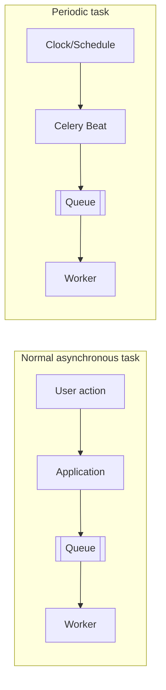

The important point is that scheduling and task execution are separate responsibilities.

---

# 2. What Is Celery Beat?

**Celery Beat** is Celery's scheduler service.

It checks the configured schedule, determines which tasks are due, and publishes those task messages to the broker.

Celery Beat does **not** normally execute the task itself. Celery workers execute the task.

For example, suppose a cleanup task must run every hour:

1. Beat notices that the cleanup task is due.
2. Beat sends a task message to Redis, RabbitMQ, or another broker.
3. A Celery worker consumes the message.
4. The worker executes the cleanup code.

## Important rule

Only **one active Beat scheduler should manage a particular schedule**.

Running multiple Beat instances against the same schedule without leader election or another coordination mechanism can publish duplicate tasks.

---

# 3. Celery Beat Architecture

## Main components

| Component | Responsibility |
|---|---|
| Application | Defines Celery tasks and configuration |
| Celery Beat | Evaluates schedules and publishes due tasks |
| Broker | Stores task messages until workers consume them |
| Celery Worker | Executes task code |
| Result Backend | Optionally stores task results and states |
| Schedule Store | Stores schedule definitions and last-run metadata |

## Architecture diagram

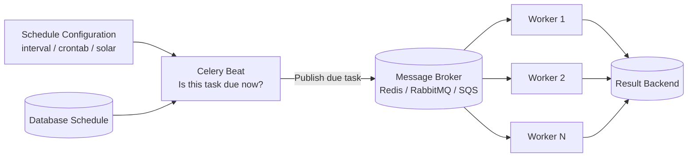

---

# 4. How a Scheduled Task Executes

Consider this schedule:

```python
from celery.schedules import crontab

app.conf.beat_schedule = {
    "send-daily-report": {
        "task": "reports.tasks.send_daily_report",
        "schedule": crontab(hour=9, minute=0),
    },
}
```

At 9:00 AM, the lifecycle is:

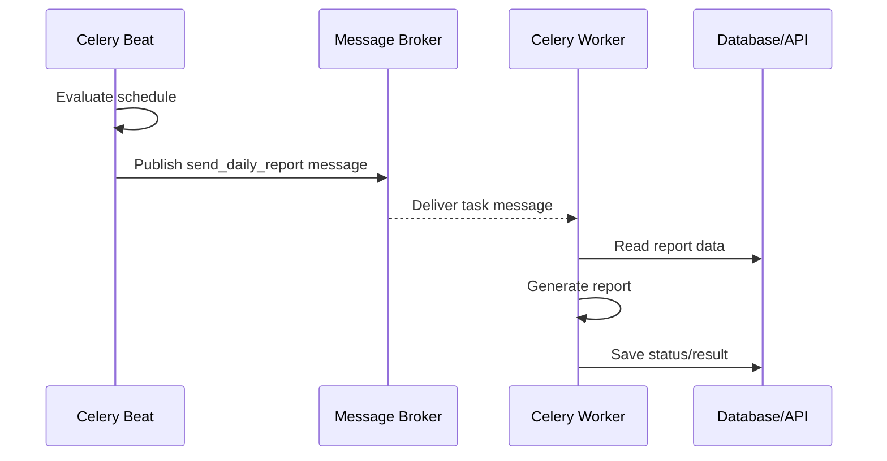

## What Beat stores

The default scheduler uses a local persistent schedule file, commonly named `celerybeat-schedule`.

It uses this file to remember information such as the last execution time of schedule entries.

When using `django-celery-beat`, schedule metadata is stored in the database instead.

---

# 5. Basic Project Setup

A small non-Django Celery project may look like this:

```text
project/
├── celery_app.py
├── tasks.py
└── requirements.txt
```

## Install Celery and a broker client

For Redis: `pip install "celery[redis]"`

For RabbitMQ, Celery's AMQP dependencies are normally installed with Celery: `pip install celery`

## `celery_app.py`

```python
from celery import Celery
from celery.schedules import crontab

app = Celery(
    "project",
    broker="redis://localhost:6379/0",
    backend="redis://localhost:6379/1",
    include=["tasks"],
)

app.conf.update(
    timezone="Asia/Kolkata",
    enable_utc=True,
    beat_schedule={
        "send-health-summary-every-minute": {
            "task": "tasks.send_health_summary",
            "schedule": crontab(minute="*"),
        },
    },
)
```

## `tasks.py`

```python
from datetime import datetime, timezone

from celery_app import app

@app.task
def send_health_summary() -> dict[str, str]:
    """Generate a simple system summary."""
    executed_at = datetime.now(timezone.utc).isoformat()
    print(f"Health summary generated at {executed_at}")
    return {"status": "completed", "executed_at": executed_at}
```

## Start the worker

```bash
celery -A celery_app worker --loglevel=INFO
```

## Start Beat in another terminal

```bash
celery -A celery_app beat --loglevel=INFO
```

Both processes must be running, alongside the broker (Redis or RabbitMQ) in a third terminal.

---

# 6. Defining Periodic Schedules

Celery supports several schedule styles:

| Schedule type | Best for | Example |
|---|---|---|
| Seconds or float | Simple fixed interval | Every 30 seconds |
| `timedelta` | Readable fixed interval | Every 10 minutes |
| `crontab` | Calendar-based schedule | Every day at 9:00 AM |
| `solar` | Sun-related events | At sunset |
| Database schedule | Runtime-editable schedules | Managed from Django Admin |
| Custom schedule class | Specialized scheduling logic | Domain-specific calculation |

The most commonly used options in normal development are:

1. Fixed interval
2. Crontab
3. Database-backed schedule for Django

---

# 7. Interval Schedules

An interval schedule runs a task repeatedly after a fixed duration.

## Every 30 seconds

```python
app.conf.beat_schedule = {
    "poll-provider-every-30-seconds": {
        "task": "tasks.poll_provider",
        "schedule": 30.0,
    },
}
```

## Using `timedelta`

```python
from datetime import timedelta

app.conf.beat_schedule = {
    "clear-expired-cache-every-10-minutes": {
        "task": "tasks.clear_expired_cache",
        "schedule": timedelta(minutes=10),
    },
}
```

## When to use interval schedules

Use them when the requirement is duration-based: run every 30 seconds, every 5 minutes, every 2 hours.

Do not use them when the requirement is calendar-based: run at 9:00 AM every day, every Monday, or on the first day of each month.

For calendar-based requirements, use `crontab`.

## Interval behavior

A duration-based schedule is generally related to the scheduler's timing and last-run state.

For example:

```text
Beat starts:   10:03:20
Interval:      10 minutes
First due:     approximately 10:13:20
Next due:      approximately 10:23:20
```

A crontab schedule would instead align with clock times such as 10:10, 10:20, and 10:30.

---

# 8. Crontab Schedules

Celery provides `celery.schedules.crontab` for calendar-based scheduling.

```python
from celery.schedules import crontab
```

## Common examples

### Every minute

```python
crontab()
```

### Every 15 minutes

```python
crontab(minute="*/15")
```

### Every hour

```python
crontab(minute=0)
```

### Every day at midnight

```python
crontab(hour=0, minute=0)
```

### Every day at 9:30 AM

```python
crontab(hour=9, minute=30)
```

### Every Monday at 8:00 AM

```python
crontab(hour=8, minute=0, day_of_week="monday")
```

### Weekdays at 6:00 PM

```python
crontab(
    hour=18,
    minute=0,
    day_of_week="mon-fri",
)
```

### First day of every month at 1:00 AM

```python
crontab(
    hour=1,
    minute=0,
    day_of_month="1",
)
```

### Every three hours

```python
crontab(minute=0, hour="*/3")
```

## Complete example

```python
from celery.schedules import crontab

app.conf.beat_schedule = {
    "generate-daily-sales-report": {
        "task": "reports.tasks.generate_daily_sales_report",
        "schedule": crontab(hour=6, minute=30),
        "kwargs": {"format": "pdf"},
        "options": {
            "queue": "reports",
            "expires": 60 * 30,
        },
    },
}
```

## Crontab field meaning

| Field | Typical values |
|---|---|
| `minute` | `0-59`, `*`, `*/15` |
| `hour` | `0-23`, `*`, `*/3` |
| `day_of_week` | `monday`, `mon-fri`, `0-6` |
| `day_of_month` | `1-31`, `1`, `*/2` |
| `month_of_year` | `1-12`, `january`, `*/3` |

## Easy mental model

```text
Interval schedule: "after how much time?"
Crontab schedule:  "at which clock/calendar time?"
```

---

# 9. Dynamic Schedule Registration

Instead of directly assigning `beat_schedule`, schedules can be added using `add_periodic_task()`.

```python
from celery import Celery
from celery.schedules import crontab

app = Celery("project")

@app.on_after_configure.connect
def register_periodic_tasks(sender: Celery, **kwargs: object) -> None:
    sender.add_periodic_task(
        30.0,
        check_pending_orders.s(),
        name="check-pending-orders-every-30-seconds",
    )

    sender.add_periodic_task(
        crontab(hour=1, minute=0),
        create_database_backup.s(),
        name="create-database-backup-nightly",
    )

@app.task
def check_pending_orders() -> None:
    print("Checking pending orders")

@app.task
def create_database_backup() -> None:
    print("Creating database backup")
```

## Why use a signal?

Registering task signatures at module import time can cause application-finalization and task-registration issues.

Celery provides lifecycle signals such as:

- `on_after_configure`
- `on_after_finalize`

Use `on_after_finalize` when the scheduled task is defined in another module discovered through task autodiscovery.

```python
@app.on_after_finalize.connect
def register_external_tasks(sender: Celery, **kwargs: object) -> None:
    from reports.tasks import generate_summary

    sender.add_periodic_task(
        3600.0,
        generate_summary.s(),
        name="generate-summary-hourly",
    )
```

## Give every entry a unique name

If two periodic entries use the same generated key or explicit name, one may replace the other.

```python
sender.add_periodic_task(
    10.0,
    notify.s("first"),
    name="notify-first-every-10-seconds",
)

sender.add_periodic_task(
    30.0,
    notify.s("second"),
    name="notify-second-every-30-seconds",
)
```

---

# 10. Schedule Entry Fields

A Beat schedule entry commonly contains these fields:

```python
app.conf.beat_schedule = {
    "entry-name": {
        "task": "package.module.task_name",
        "schedule": 60.0,
        "args": ("value",),
        "kwargs": {"force": True},
        "options": {
            "queue": "maintenance",
            "expires": 50,
        },
    }
}
```

## Field explanation

| Field | Purpose |
|---|---|
| `task` | Registered Celery task name |
| `schedule` | When or how often the task runs |
| `args` | Positional task arguments |
| `kwargs` | Keyword task arguments |
| `options` | `apply_async()` options such as queue, priority, routing, or expiration |
| `relative` | Controls clock rounding for `timedelta` schedules |

## Important tuple detail

A one-item tuple requires a trailing comma:

```python
# Correct
"args": (customer_id,)

# Incorrect: this is only a value inside parentheses
"args": (customer_id)
```

## Task name vs Python import path

Celery sends the registered task name in the message.

```python
@app.task(name="billing.generate_invoice")
def generate_invoice(invoice_id: int) -> None:
    ...
```

The schedule should use: `"task": "billing.generate_invoice"`

Workers must import and register that task before they can execute it.

---

# 11. Timezone Handling

Celery schedules use UTC by default unless configured otherwise.

## Non-Django configuration

```python
app.conf.timezone = "Asia/Kolkata"
app.conf.enable_utc = True
```

## Django configuration

```python
# settings.py
TIME_ZONE = "Asia/Kolkata"
USE_TZ = True

CELERY_TIMEZONE = "Asia/Kolkata"
CELERY_ENABLE_UTC = True
```

When Celery is loaded with: `app.config_from_object("django.conf:settings", namespace="CELERY")`

Celery settings in Django use the `CELERY_` prefix.

| Celery setting | Django setting |
| --- | --- |
| timezone | CELERY_TIMEZONE |
| beat_schedule | CELERY_BEAT_SCHEDULE |
| task_routes | CELERY_TASK_ROUTES |
| result_backend | CELERY_RESULT_BACKEND |

## Example

```python
CELERY_BEAT_SCHEDULE = {
    "send-daily-report-at-9-am": {
        "task": "reports.tasks.send_daily_report",
        "schedule": crontab(hour=9, minute=0),
    }
}
```

With `CELERY_TIMEZONE = "Asia/Kolkata"`, the task is scheduled for 9:00 AM India time.

## Daylight-saving considerations

`Asia/Kolkata` does not currently use daylight-saving time, but many timezones do.

For locations with daylight-saving changes:

- Prefer named IANA timezones such as `Europe/London` instead of fixed offsets.
- Confirm expected behavior around skipped or repeated local clock times.
- Keep business rules explicit when one exact daily execution is required.

## Changing the timezone with django-celery-beat

The database scheduler may retain old `last_run_at` values after timezone settings change.

Reset the state carefully:

```python
from django_celery_beat.models import PeriodicTask, PeriodicTasks

PeriodicTask.objects.all().update(last_run_at=None)
PeriodicTasks.update_changed()
```

This makes schedule entries behave as though they have not run before, so perform this operation with operational awareness.

---

# 12. Running Celery Beat

## Development commands

Start a worker: `celery -A project worker --loglevel=INFO`

Start Beat: `celery -A project beat --loglevel=INFO`

## Custom schedule file location

```bash
celery -A project beat \
  --schedule=/var/run/celery/celerybeat-schedule \
  --loglevel=INFO
```

The Beat process needs permission to write to the schedule-file location.

## Embedded Beat mode

Beat can be embedded in a worker: `celery -A project worker -B --loglevel=INFO`

This can be convenient for local development, but separate worker and Beat processes are generally preferred in production.

Reasons:

- Beat should be a singleton.
- Workers are often horizontally scaled.
- Worker restarts should not unnecessarily restart the scheduler.
- Separate logs and health checks are easier to manage.

## Recommended process model

```text
Development
- 1 broker
- 1 worker
- 1 Beat

Production
- Highly available broker
- Multiple workers
- Exactly 1 active Beat scheduler per schedule
- Optional result backend
```

---

# 13. Celery Beat with Django

A common Django structure is:

```text
myproject/
├── manage.py
├── myproject/
│   ├── __init__.py
│   ├── celery.py
│   ├── settings.py
│   └── urls.py
└── reports/
    ├── tasks.py
    └── models.py
```

## Install packages

```bash
pip install "celery[redis]" django
```

## `myproject/celery.py`

```python
import os

from celery import Celery

os.environ.setdefault("DJANGO_SETTINGS_MODULE", "myproject.settings")

app = Celery("myproject")
app.config_from_object("django.conf:settings", namespace="CELERY")
app.autodiscover_tasks()
```

## `myproject/__init__.py`

```python
from .celery import app as celery_app

__all__ = ("celery_app",)
```

## `reports/tasks.py`

```python
from celery import shared_task
from django.utils import timezone

@shared_task(
    bind=True,
    autoretry_for=(ConnectionError,),
    retry_backoff=True,
    retry_kwargs={"max_retries": 5},
)
def generate_daily_report(self) -> dict[str, str]:
    generated_at = timezone.now().isoformat()

    # Query data, generate the report, and store/send it.

    return {
        "status": "generated",
        "generated_at": generated_at,
    }
```

## `settings.py`

```python
from celery.schedules import crontab

CELERY_BROKER_URL = "redis://localhost:6379/0"
CELERY_RESULT_BACKEND = "redis://localhost:6379/1"

CELERY_TIMEZONE = "Asia/Kolkata"
CELERY_ENABLE_UTC = True

CELERY_BEAT_SCHEDULE = {
    "generate-daily-report": {
        "task": "reports.tasks.generate_daily_report",
        "schedule": crontab(hour=7, minute=0),
        "options": {
            "queue": "reports",
            "expires": 60 * 60,
        },
    },
}
```

## Commands

```bash
celery -A myproject worker --loglevel=INFO
```

```bash
celery -A myproject beat --loglevel=INFO
```

---

# 14. Database-Backed Schedules with django-celery-beat

Static configuration is appropriate when schedules change only through code deployments.

Use **django-celery-beat** when schedules must be stored in the database and managed at runtime.

Typical cases:

- An administrator changes schedules from Django Admin.
- Each tenant has a different report schedule.
- Users configure reminder times.
- A schedule can be enabled or disabled without deployment.
- Operations staff need visibility into last-run metadata.

## Installation

```bash
pip install django-celery-beat
```

## Add the Django app

```python
INSTALLED_APPS = [
    # ...
    "django_celery_beat",
]
```

## Apply migrations

```bash
python manage.py migrate
```

## Configure the database scheduler

```python
CELERY_BEAT_SCHEDULER = (
    "django_celery_beat.schedulers:DatabaseScheduler"
)
```

Then start Beat normally: `celery -A myproject beat --loglevel=INFO`

Or specify the scheduler on the command line:

```bash
celery -A myproject beat \
  --scheduler django_celery_beat.schedulers:DatabaseScheduler \
  --loglevel=INFO
```

## Django Admin models

The extension provides database models for schedule types such as:

- Interval schedules
- Crontab schedules
- Solar schedules
- Clocked schedules
- Periodic task entries

## Programmatically creating a periodic task

Arguments and keyword arguments are stored as JSON strings.

```python
import json

from django_celery_beat.models import (
    CrontabSchedule,
    PeriodicTask,
)

schedule, _ = CrontabSchedule.objects.get_or_create(
    minute="0",
    hour="9",
    day_of_week="mon-fri",
    day_of_month="*",
    month_of_year="*",
    timezone="Asia/Kolkata",
)

PeriodicTask.objects.update_or_create(
    name="send-weekday-operations-report",
    defaults={
        "task": "reports.tasks.send_operations_report",
        "crontab": schedule,
        "args": json.dumps([]),
        "kwargs": json.dumps({"format": "xlsx"}),
        "queue": "reports",
        "enabled": True,
    },
)
```

## Static vs database-backed schedules

| Requirement | Static `CELERY_BEAT_SCHEDULE` | `django-celery-beat` |
|---|---:|---:|
| Version-controlled schedule | Excellent | Possible but indirect |
| Requires deployment to change | Yes | No |
| Admin UI | No | Yes |
| Per-tenant schedules | Difficult | Suitable |
| Simple operational model | Excellent | More database dependencies |
| Runtime enable/disable | Not naturally | Yes |

## Practical recommendation

Use static schedules when the schedule is part of application behavior.

Use database schedules when the schedule is user-controlled or operations-controlled data.

---

# 15. One-Off Future Tasks vs Periodic Tasks

Celery supports `countdown` and `eta` for delayed execution: `send_reminder.apply_async(countdown=300)`

```python
from datetime import datetime, timezone

send_reminder.apply_async(
    eta=datetime(2026, 8, 1, 10, 0, tzinfo=timezone.utc)
)
```

However, `eta` and `countdown` are not the same as Celery Beat.

| Requirement | Recommended mechanism |
|---|---|
| Run once in 30 seconds | `countdown` |
| Run once in a few minutes | `countdown` or `eta` |
| Run daily at 9:00 AM | Celery Beat |
| Run every 15 minutes | Celery Beat |
| Store user-defined long-term reminders | Database-backed scheduler or durable application model |

## Why avoid very distant ETA tasks?

Workers may reserve ETA/countdown tasks before their execution time and keep them in memory. Very large numbers of distant-future tasks can consume memory and interact poorly with broker visibility or acknowledgement timeouts.

For long-term schedules, prefer a durable scheduler design instead of queuing thousands of far-future messages.

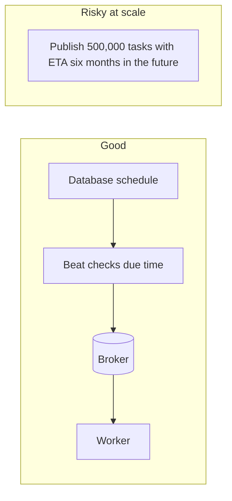

---

# 16. Task Overlap and Concurrency Control

Celery Beat sends a task whenever its schedule becomes due. It does not automatically wait for the previous execution to finish.

Suppose a task runs every five minutes but sometimes takes eight minutes:

```text
10:00 Task A starts
10:05 Task B starts while A is still running
10:08 Task A finishes
10:13 Task B finishes
```

This is called **task overlap**.

Overlap can cause:

- Duplicate external API calls
- Double invoice generation
- Conflicting database updates
- High CPU or memory usage
- Race conditions
- Incorrect reports

## Solution 1: Make overlap acceptable

Some tasks are naturally safe to run concurrently: refreshing independent cache partitions, processing different customer batches, or collecting non-conflicting metrics.

## Solution 2: Use a distributed lock

A simple Django cache lock pattern:

```python
from celery import shared_task
from django.core.cache import cache

LOCK_KEY = "locks:sync-external-catalog"
LOCK_TIMEOUT_SECONDS = 20 * 60

@shared_task
def sync_external_catalog() -> str:
    acquired = cache.add(
        LOCK_KEY,
        "locked",
        timeout=LOCK_TIMEOUT_SECONDS,
    )

    if not acquired:
        return "skipped: another execution is active"

    try:
        # Perform synchronization.
        return "completed"
    finally:
        cache.delete(LOCK_KEY)
```

### Locking cautions

A production lock should account for:

- Worker crashes
- Lock expiry
- A slow task outliving its lock TTL
- Safe ownership-based unlock
- Network partitions
- Atomic lock operations

For critical workflows, use a well-tested distributed-lock implementation or a database locking strategy rather than a fragile custom lock.

## Solution 3: Database uniqueness

For business operations, a database constraint is often stronger than a cache lock.

Example: one invoice per customer and billing month.

```python
class Invoice(models.Model):
    customer = models.ForeignKey("Customer", on_delete=models.PROTECT)
    billing_month = models.DateField()

    class Meta:
        constraints = [
            models.UniqueConstraint(
                fields=["customer", "billing_month"],
                name="unique_customer_billing_month",
            )
        ]
```

Even if the task runs twice, the database protects the business invariant.

## Solution 4: Partition the workload

Instead of one long task such as `Beat -> process_all_customers`, use a dispatcher and smaller tasks:

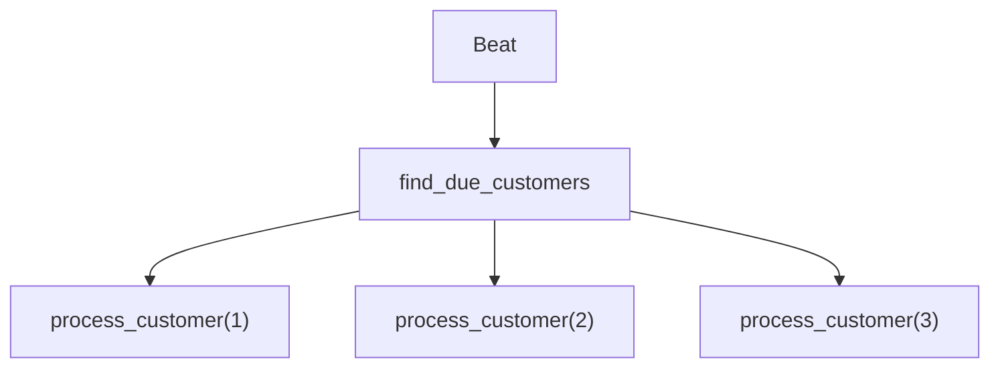

This improves parallelism, retries, monitoring, and failure isolation.

---

# 17. Idempotency for Scheduled Tasks

An idempotent task produces the same valid business outcome even when it is executed more than once for the same logical operation.

Celery systems should not assume exactly-once execution.

Duplicate execution can occur because of:

- Multiple Beat instances
- Worker retries
- Broker redelivery
- Worker crashes after completing work but before acknowledgement
- Manual task re-execution
- Operational recovery

## Non-idempotent example

```python
@shared_task
def add_monthly_credit(account_id: int) -> None:
    account = Account.objects.get(id=account_id)
    account.balance += 100
    account.save()
```

If it runs twice, the account receives double credit.

## Idempotent approach

Create a unique business operation record:

```python
from datetime import date
from decimal import Decimal

from celery import shared_task
from django.db import transaction

@shared_task
def add_monthly_credit(account_id: int, month: str) -> str:
    with transaction.atomic():
        operation, created = CreditOperation.objects.get_or_create(
            account_id=account_id,
            month=month,
            defaults={"amount": Decimal("100.00")},
        )

        if not created:
            return "already-applied"

        account = Account.objects.select_for_update().get(id=account_id)
        account.balance += operation.amount
        account.save(update_fields=["balance"])

    return "applied"
```

## Useful idempotency keys

```text
invoice:{customer_id}:{billing_month}
report:{tenant_id}:{report_date}
payout:{merchant_id}:{settlement_period}
sync:{provider}:{resource_id}:{source_version}
notification:{user_id}:{template}:{event_id}
```

## Strong design principle

Do not use the Celery task ID as the only business idempotency key.

A retry may keep the same task ID, but a separately republished duplicate may receive another task ID. The idempotency key should represent the business operation.

---

# 18. Retries, Expiration, and Failure Handling

Scheduled tasks require the same resilience practices as other asynchronous tasks.

## Automatic retry example

```python
from celery import shared_task
import requests

@shared_task(
    bind=True,
    autoretry_for=(requests.RequestException,),
    retry_backoff=True,
    retry_backoff_max=600,
    retry_jitter=True,
    retry_kwargs={"max_retries": 5},
)
def sync_partner_data(self) -> None:
    response = requests.get(
        "https://partner.example.com/api/data",
        timeout=20,
    )
    response.raise_for_status()
```

## Use expiration for stale scheduled work

Suppose a dashboard refresh runs every five minutes. A refresh message delayed by 30 minutes may no longer be useful.

```python
CELERY_BEAT_SCHEDULE = {
    "refresh-dashboard": {
        "task": "analytics.tasks.refresh_dashboard",
        "schedule": 300.0,
        "options": {
            "expires": 240,
        },
    },
}
```

This prevents very old task messages from being executed after a long broker or worker backlog.

## Retry decision guide

| Failure type | Retry? |
|---|---|
| Network timeout | Usually yes |
| HTTP 503 | Usually yes |
| Database connection interruption | Usually yes |
| Invalid input | No |
| Missing permanent resource | Usually no |
| Authentication configuration error | Not repeatedly without intervention |
| Rate limiting | Yes, with delay/backoff |

## Avoid retry storms

Use:

- Exponential backoff
- Jitter
- Maximum retry count
- Provider-specific rate limits
- Circuit breakers where appropriate
- Dedicated queues for unstable integrations

## Failure tracking

For business-critical scheduled tasks, store execution records:

```text
ScheduledJobExecution
- job_name
- logical_period
- started_at
- completed_at
- status
- task_id
- attempt_number
- error_code
- error_message
```

This creates an auditable history independent of transient worker logs.

---

# 19. Task Routing and Dedicated Queues

Periodic tasks can be routed using schedule `options`:

```python
CELERY_BEAT_SCHEDULE = {
    "generate-nightly-report": {
        "task": "reports.tasks.generate_nightly_report",
        "schedule": crontab(hour=2, minute=0),
        "options": {
            "queue": "reports",
            "routing_key": "reports.nightly",
            "expires": 60 * 60,
        },
    },
}
```

Start a worker for that queue:

```bash
celery -A myproject worker \
  --queues=reports \
  --concurrency=2 \
  --loglevel=INFO
```

## Why separate queues?

A heavy nightly report should not block urgent user-facing tasks.

| Queue | Typical work |
|---|---|
| Default | Password reset email, order confirmation, user-triggered jobs |
| Reports | Large exports, analytics aggregation, nightly PDFs |
| Maintenance | Cleanup, reconciliation, data synchronization |

## Queue isolation diagram

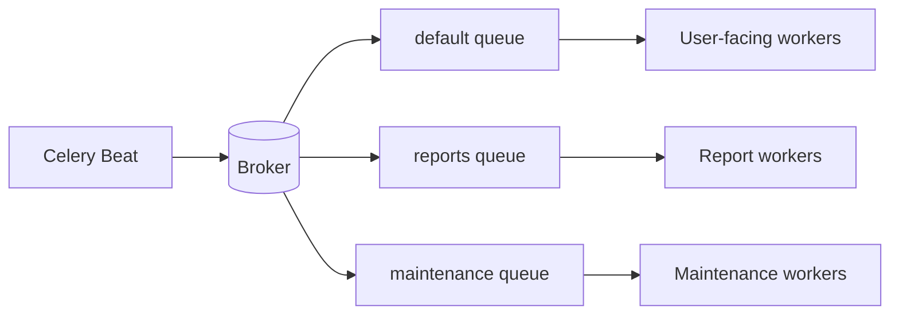

---

# 20. Production Deployment

In production, run Beat as a separately managed service.

## Recommended topology

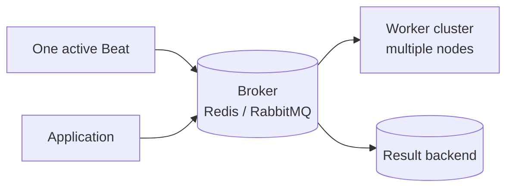

## Systemd example

```ini
[Unit]
Description=Celery Beat Service
After=network.target

[Service]
Type=simple
User=celery
Group=celery
WorkingDirectory=/opt/myproject
EnvironmentFile=/etc/myproject/celery.env
ExecStart=/opt/myproject/venv/bin/celery \
    -A myproject beat \
    --loglevel=INFO \
    --schedule=/var/run/celery/celerybeat-schedule
Restart=always
RestartSec=5

[Install]
WantedBy=multi-user.target
```

## Operational requirements

- Run the process as a non-root user.
- Ensure the schedule file directory is writable.
- Persist the schedule file when using the default persistent scheduler.
- Restart Beat automatically after failure.
- Avoid starting Beat in every worker replica.
- Collect Beat logs separately.
- Add alerts when Beat stops publishing expected tasks.

## Kubernetes consideration

Do not place Beat in the same Deployment as a worker when the Deployment has multiple replicas.

Bad design:

```text
worker Deployment replicas = 5
Each pod starts worker + Beat
Result: 5 schedulers publish the same due task
```

Better design:

```text
Worker Deployment replicas = 5
Beat Deployment replicas = 1
```

For high availability, use a scheduler implementation or platform design with leader election rather than simply increasing Beat replicas.

---

# 21. Docker Compose Example

```yaml
services:
  redis:
    image: redis:7-alpine
    ports:
      - "6379:6379"
    healthcheck:
      test: ["CMD", "redis-cli", "ping"]
      interval: 5s
      timeout: 3s
      retries: 10

  web:
    build: .
    command: python manage.py runserver 0.0.0.0:8000
    volumes:
      - .:/app
    ports:
      - "8000:8000"
    environment:
      CELERY_BROKER_URL: redis://redis:6379/0
      CELERY_RESULT_BACKEND: redis://redis:6379/1
    depends_on:
      redis:
        condition: service_healthy

  worker:
    build: .
    command: celery -A myproject worker --loglevel=INFO
    volumes:
      - .:/app
    environment:
      CELERY_BROKER_URL: redis://redis:6379/0
      CELERY_RESULT_BACKEND: redis://redis:6379/1
    depends_on:
      redis:
        condition: service_healthy

  beat:
    build: .
    command: >
      celery -A myproject beat
      --loglevel=INFO
      --schedule=/var/run/celery/celerybeat-schedule
    volumes:
      - .:/app
      - beat_data:/var/run/celery
    environment:
      CELERY_BROKER_URL: redis://redis:6379/0
      CELERY_RESULT_BACKEND: redis://redis:6379/1
    depends_on:
      redis:
        condition: service_healthy

volumes:
  beat_data:
```

## Why use a separate Beat volume?

The default persistent scheduler stores last-run information in a local file. A volume prevents the file from disappearing whenever the container is recreated.

When using `django-celery-beat`, the database stores schedule state, so the local schedule-file persistence concern changes.

---

# 22. Monitoring and Observability

Monitoring only worker success is not sufficient. You must also know whether Beat is alive and publishing tasks.

## What to monitor

### Beat-level signals

- Beat process is running
- Scheduler loop is active
- Last successful schedule evaluation
- Due tasks are being published
- Schedule database is reachable
- Schedule file is writable

### Task-level signals

- Task started
- Task succeeded or failed
- Task duration
- Retry count
- Queue waiting time
- Number of skipped overlapping runs
- Last successful business execution

## Business heartbeat pattern

Create a small scheduled task that records a heartbeat:

```python
from celery import shared_task
from django.core.cache import cache
from django.utils import timezone

@shared_task
def scheduler_heartbeat() -> None:
    cache.set(
        "celery:beat:last-heartbeat",
        timezone.now().isoformat(),
        timeout=300,
    )
```

Schedule it every minute and alert if the timestamp becomes too old.

This verifies more than process existence:

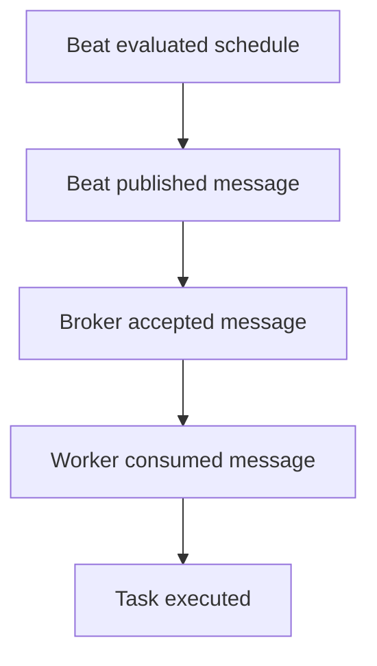

## Logging fields

Useful structured log fields include:

```text
job_name
celery_task_id
logical_period
scheduled_for
started_at
completed_at
duration_ms
attempt
status
queue
worker_hostname
```

## Monitoring tools

Common options include:

- Celery events
- Flower
- Prometheus metrics
- Grafana dashboards
- Application Performance Monitoring tools
- Centralized logs
- Custom database execution records

## Measure schedule delay

```text
schedule_delay = task_started_at - expected_scheduled_at
```

A large delay may indicate:

- Worker backlog
- Broker latency
- Beat outage
- Worker concurrency saturation
- Slow task routing
- Infrastructure resource pressure

---

# 23. Testing Periodic Tasks

Test the **task logic** separately from the **schedule configuration**.

## Unit test the task function

```python
from reports.tasks import generate_daily_report

def test_generate_daily_report_creates_report(db):
    result = generate_daily_report.run()

    assert result["status"] == "generated"
```

Calling `.run()` directly tests the task's Python logic without requiring a broker.

## Test schedule configuration

```python
from django.conf import settings

def test_daily_report_schedule_is_configured():
    entry = settings.CELERY_BEAT_SCHEDULE["generate-daily-report"]

    assert entry["task"] == "reports.tasks.generate_daily_report"
    assert entry["options"]["queue"] == "reports"
```

## Test idempotency

```python
def test_monthly_invoice_is_created_only_once(db, customer):
    generate_monthly_invoice.run(customer.id, "2026-07")
    generate_monthly_invoice.run(customer.id, "2026-07")

    assert Invoice.objects.filter(
        customer=customer,
        billing_month="2026-07-01",
    ).count() == 1
```

## Test lock behavior

```python
def test_sync_is_skipped_when_lock_exists(settings):
    cache.set("locks:sync-external-catalog", "locked", timeout=60)

    result = sync_external_catalog.run()

    assert result.startswith("skipped")
```

## Integration test

An integration environment can start:

- Broker
- Worker
- Beat
- Test database

Then schedule a fast test task and assert that it executes within an acceptable window.

Avoid relying only on waiting with long `sleep()` calls. Prefer polling with a deadline and clear failure diagnostics.

---

# 24. Practical Use Cases

## Use case 1: Expired token cleanup

```python
@shared_task
def delete_expired_tokens() -> int:
    deleted_count, _ = AuthToken.objects.filter(
        expires_at__lt=timezone.now()
    ).delete()
    return deleted_count
```

```python
"delete-expired-tokens": {
    "task": "accounts.tasks.delete_expired_tokens",
    "schedule": crontab(minute=0),
}
```

## Use case 2: Daily report generation

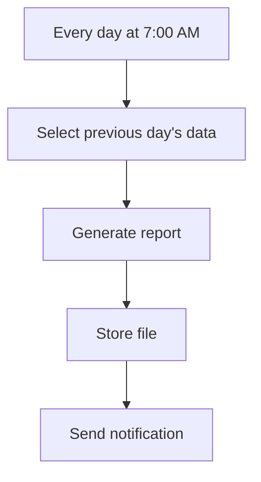

Use a business key such as `daily-report:{tenant_id}:{report_date}`.

## Use case 3: Payment reconciliation

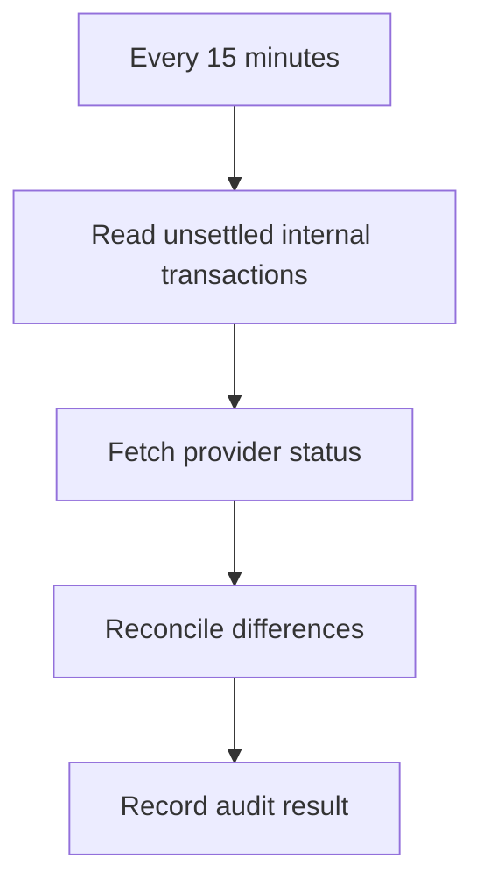

This task should be idempotent and should not blindly create duplicate ledger entries.

## Use case 4: Reminder dispatcher

Instead of creating one periodic task per reminder, Beat can run one dispatcher:

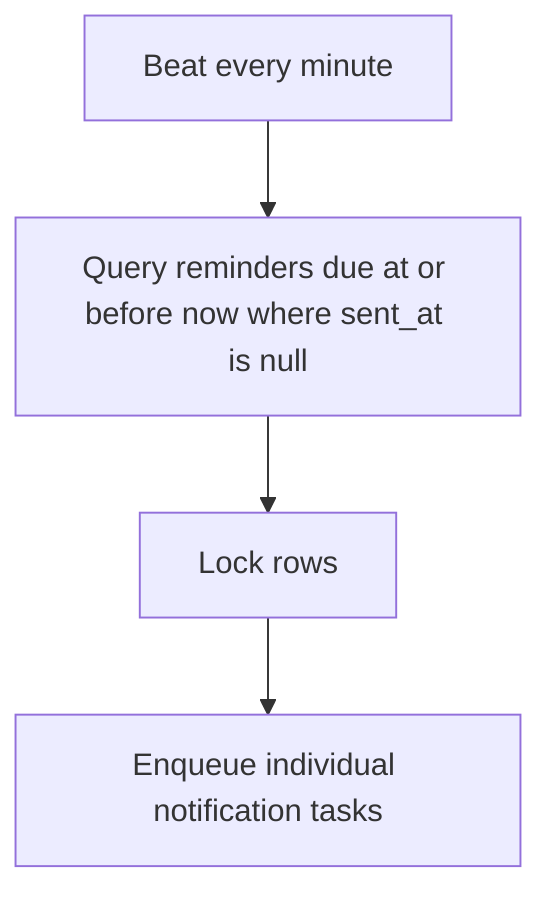

This approach is often more scalable for large numbers of user reminders.

## Use case 5: External data synchronization

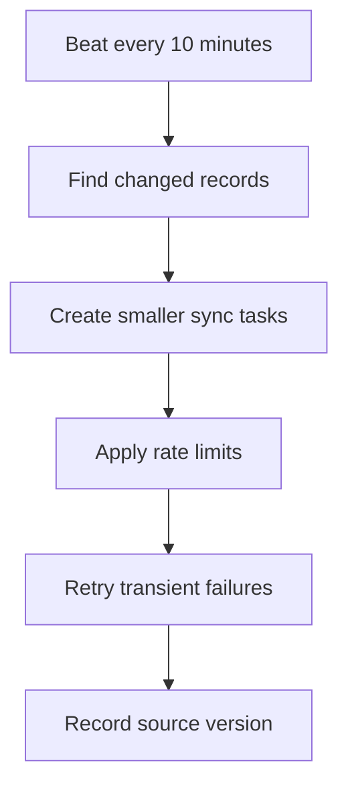

## Use case 6: Monthly invoice generation

Use a monthly crontab entry, but calculate the logical billing period explicitly.

```python
@shared_task
def dispatch_monthly_invoices() -> None:
    billing_month = get_previous_billing_month()

    for customer_id in get_billable_customer_ids(billing_month):
        generate_invoice.delay(customer_id, billing_month)
```

The dispatcher remains small, while invoice tasks run independently.

---

# 25. Celery Beat vs Other Scheduling Options

## Celery Beat vs operating-system cron

| Celery Beat | System cron |
|---|---|
| Integrates with Celery tasks | Executes shell commands |
| Publishes work to distributed workers | Runs on a particular machine |
| Supports task routing and Celery options | Requires custom integration |
| Can use database-managed schedules | Usually file/config managed |
| Natural for Celery-based applications | Good for simple machine-level jobs |

Use system cron for machine operations such as:

- Rotating a local file
- Running an infrastructure script
- Starting a backup command

Use Celery Beat when work should be processed through the Celery task system.

## Celery Beat vs `eta` / `countdown`

| Celery Beat | `eta` / `countdown` |
|---|---|
| Repeating schedules | Usually one future execution |
| Central scheduler evaluates due work | Message is published immediately with future execution metadata |
| Suitable for long-term recurring plans | Better for short delays |
| Schedule can be updated centrally | Existing queued messages are harder to manage |

## Celery Beat vs in-process schedulers

An in-process scheduler tied to a web server can accidentally run once per web process.

```text
Gunicorn workers = 4
Scheduler starts inside each worker
Result = task may run four times
```

Celery Beat avoids this by using a dedicated scheduler process.

## Celery Beat vs cloud schedulers

Cloud schedulers can invoke HTTP endpoints, queues, or serverless functions on a managed schedule.

Celery Beat is usually a better fit when:

- The application already uses Celery.
- Tasks need Celery routing, retries, and workers.
- Schedule definitions belong near application code or Django data.

A managed cloud scheduler may be better when:

- You want infrastructure-managed scheduling.
- The target is an HTTP endpoint or cloud queue.
- You do not otherwise need Celery.

---

# 26. Production Best Practices

## Run exactly one active scheduler

One schedule means one active Beat. Do not scale Beat replicas in the same way as workers.

## Keep scheduled tasks idempotent

Assume duplicate delivery is possible.

Protect important business operations using:

- Unique constraints
- Idempotency records
- Transactional state changes
- Source-version checks

## Keep Beat lightweight

Beat should schedule work, not perform heavy work: `Beat -> enqueue task -> worker executes`.

## Use explicit timezones

```python
CELERY_TIMEZONE = "Asia/Kolkata"
CELERY_ENABLE_UTC = True
```

Do not depend on an unknown server-local timezone.

## Prevent task overlap

Use locking, row-level state, uniqueness, or workload partitioning.

## Add expiration to freshness-sensitive work

A stale cache refresh or notification may be worse than skipping it.

## Route heavy periodic work to dedicated queues

Prevent scheduled batch jobs from blocking user-facing tasks.

## Use retries only for transient failures

Do not endlessly retry permanent validation or configuration failures.

## Monitor business completion, not only process health

A running Beat process does not prove that the task reached a worker or completed correctly.

## Persist scheduler state appropriately

- Default scheduler: persist and protect the schedule file.
- Django database scheduler: maintain database availability and migrations.

## Avoid huge work inside one task

Use a dispatcher that creates smaller tasks. One 3-hour task means difficult retry and poor visibility, while a dispatcher plus 10,000 small tasks gives parallel execution and isolated retries.

The second approach still requires rate limiting and backpressure.

## Define a missed-run policy

Decide what should happen if Beat is unavailable for two hours.

Possible policies:

- Skip missed executions
- Run only the latest period
- Catch up every missed period
- Rebuild state from source data

Celery Beat configuration alone does not define all business catch-up behavior. The task should understand its logical processing period.

## Use immutable logical periods

Instead of only relying on “now,” pass or derive a precise period:

```text
report_date = 2026-07-29
billing_month = 2026-07
reconciliation_window = 12:00-12:15 UTC
```

This improves idempotency, retry safety, auditing, and backfills.

## Version-control static schedules

Treat schedule changes like application behavior changes:

- Review them
- Test them
- Deploy them predictably
- Document timezone assumptions

## Protect dynamic schedule administration

When using `django-celery-beat`:

- Restrict admin permissions.
- Validate task names and arguments.
- Audit schedule changes.
- Avoid allowing untrusted users to choose arbitrary task names.

---

# 27. Official References

- [Celery: Periodic Tasks](https://docs.celeryq.dev/en/stable/userguide/periodic-tasks.html)
- [Celery: Calling Tasks, ETA, Countdown, and Expiration](https://docs.celeryq.dev/en/stable/userguide/calling.html)
- [Celery: First Steps with Django](https://docs.celeryq.dev/en/stable/django/first-steps-with-django.html)
- [Celery: Daemonization and systemd](https://docs.celeryq.dev/en/stable/userguide/daemonizing.html)
- [django-celery-beat GitHub Repository](https://github.com/celery/django-celery-beat)
- [django-celery-beat Package](https://pypi.org/project/django-celery-beat/)
